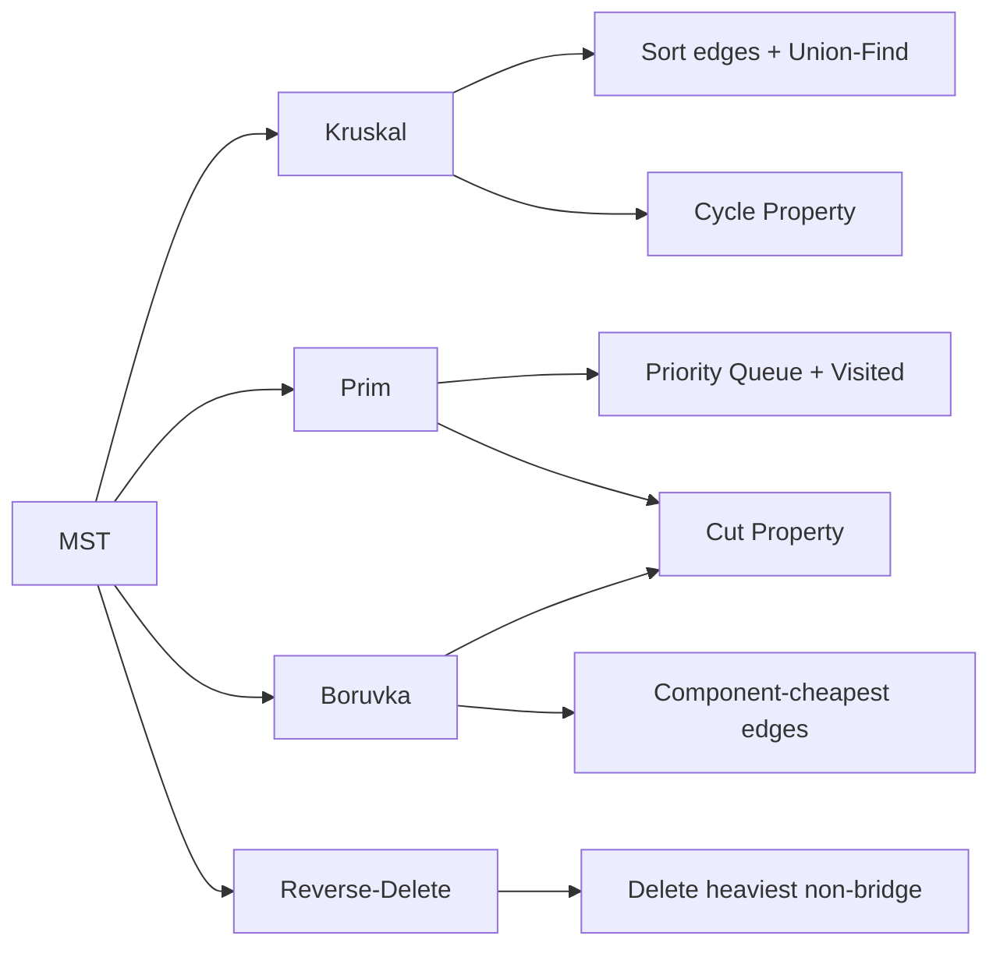

# Chapter 12: Minimum Spanning Trees

> **Prerequisites:** [Chapter 11: Graph Shortest Paths](./11-graph-shortest.md) — Graph algorithms, priority queues, relaxation | **Next:** [Chapter 13: Network Flow](./13-graph-flow.md) — From tree structures to flow networks

## Learning Objectives

By the end of this chapter, students will be able to:

<!-- Image Gallery -->
<section class="lesson-visuals" aria-label="Visual learning resources">
  <header><span>VISUAL LEARNING</span><h2>See it. Review it. Remember it.</h2></header>
  <a class="lesson-visual-card" href="../../assets/images/lessons/algorithms/12-graph-mst/handwritten-notes.png" target="_blank" rel="noopener">
    
    <span><strong>Handwritten notes</strong>Condensed notes for deliberate review.</span>
  </a>
  <a class="lesson-visual-card" href="../../assets/images/lessons/algorithms/12-graph-mst/sticky-notes.png" target="_blank" rel="noopener">
    
    <span><strong>Sticky-note revision</strong>Fast recall prompts for revision.</span>
  </a>
  <a class="lesson-visual-card" href="../../assets/images/lessons/algorithms/12-graph-mst/visual-explanation.png" target="_blank" rel="noopener">
    
    <span><strong>Visual concept guide</strong>A connected explanation of the key ideas.</span>
  </a>
</section>
<!-- End Image Gallery -->


1. Implement Kruskal's algorithm with union-find and Prim's algorithm with a priority queue.
2. Prove the cut property and cycle property and use them to justify MST algorithms.
3. Analyze the complexity of Boruvka's algorithm and understand its parallel nature.
4. Apply MST algorithms to clustering, network design, and approximation problems.

## Why MST Matters

Imagine you are a telecom engineer tasked with connecting 15 cities with fiber-optic cable. Each pair of cities has a quoted cost for digging trenches and laying cable. Your goal: connect every city into a single network using the **minimum total cable length**. This is not about finding the shortest path between two cities — it is about building the cheapest skeleton that connects everything.

This is the Minimum Spanning Tree (MST) problem in action. Every dollar you save by not running redundant cable is pure profit. A naive approach (connecting cities in a star or a ring) could cost **30–50% more** than the optimal MST solution. In a real 2016 project connecting 12 data centers across Europe, one cloud provider saved an estimated **$2.4 million** by applying MST principles to their fiber-optic backbone layout. The same math governs electrical grid design, computer network topology, transportation routing, and even clustering genes in bioinformatics.

> **Pro Tip:** MST is one of the few problems in computer science where a simple greedy algorithm is **provably optimal** — no backtracking, no dynamic programming, no approximation needed. That is why it is a cornerstone of every algorithms curriculum.

---

### Chapter at a Glance

| Topic | Key Insight | Practical Takeaway |
|-------|-------------|-------------------|
| MST Definition | Tree + all vertices + min total weight | Spanning tree property: n-1 edges, connected, acyclic |
| Cut Property | Lightest crossing edge is in some MST | Foundation for Prim's and Boruvka's algorithms |
| Cycle Property | Heaviest edge in any cycle is NOT in any MST | Foundation for Kruskal's reverse-delete variant |
| Kruskal's Algorithm | Sort edges, pick if no cycle | O(E log E) with union-find DSU |
| Prim's Algorithm | Grow tree from a seed vertex | O(E log V) with priority queue; resembles Dijkstra |
| Boruvka's Algorithm | Add cheapest edge from each component | O(E log V); parallelizable |
| Reverse-Delete | Start with all edges, remove heaviest non-bridge | Dual of Kruskal; educational value |

### Chapter Roadmap



## Theory


### 12.1 Minimum Spanning Tree: Definition


**Definition 12.1.** Given a connected, undirected, weighted graph \( G = (V, E) \), a **spanning tree** is a subgraph \( T = (V, E') \) that is a tree (connected and acyclic). A **minimum spanning tree** (MST) is a spanning tree that minimizes the total weight \( \sum_{e \in E'} w(e) \).

**Key properties of any spanning tree:**
- Contains exactly \(|V| - 1\) edges.
- There is exactly one path between any two vertices.
- Adding any edge creates exactly one cycle.
- Removing any edge disconnects the tree.

> **Remember:** An MST always has exactly |V|-1 edges for a connected graph with |V| vertices. If the graph has fewer than |V|-1 edges, it is disconnected and no spanning tree exists.

**One-Sentence Takeaway:** A minimum spanning tree connects all vertices with minimum total edge weight, always using exactly n-1 edges for an n-vertex graph.

### 12.2 Fundamental Properties


**Theorem 12.1 (Cut Property).** Let \( S \subset V \) be a non-empty proper subset of vertices. Let \( e \) be the minimum-weight edge crossing the cut \( (S, V \setminus S) \). Then \( e \) belongs to **some** MST.

**Proof.** Let \( T \) be an MST that does not contain \( e \). Adding \( e \) to \( T \) creates a cycle. This cycle must contain some other edge \( e' \) crossing the cut. Since \( w(e) \le w(e') \), we can replace \( e' \) with \( e \) to obtain another spanning tree with total weight at most that of \( T \), which is also an MST.

**Theorem 12.2 (Cycle Property).** Let \( C \) be a cycle in \( G \). Let \( e \) be the maximum-weight edge on \( C \). Then \( e \) is **not** in any MST.

**Proof.** Assume an MST \( T \) contains \( e \). Removing \( e \) from \( T \) disconnects the tree into two components. The cycle \( C \) must contain at least one other edge \( e' \) connecting these two components. Since \( w(e') &lt; w(e) \), replacing \( e \) with \( e' \) yields a spanning tree with strictly smaller total weight, contradicting the minimality of \( T \).

> **Pro Tip:** The cut property justifies adding the lightest crossing edge. The cycle property justifies removing the heaviest cycle edge. Together they prove Kruskal, Prim, and Boruvka correct.

**One-Sentence Takeaway:** The cut property (lightest crossing edge is in some MST) and cycle property (heaviest cycle edge is in no MST) are the dual correctness foundations for all MST algorithms.

### 12.3 Kruskal's Algorithm


**Real-World Analogy:** You are building a railway network connecting several towns. A private company offers to build each segment at a quoted price. To minimize government spending, you always pick the **cheapest available segment that does not create a cycle** (a redundant loop). You continue until all towns are connected. This is Kruskal's algorithm.

**Strategy:** Repeatedly add the smallest-weight edge that does not form a cycle, using a union-find data structure to detect cycles in near-constant time.

**Algorithm Steps:**

1. Sort all edges by weight in non-decreasing order.
2. Initialize an empty MST set \( T \) and a disjoint-set union (DSU) with each vertex as its own component.
3. Iterate through sorted edges:
   - If `find(u) != find(v)` (the edge connects two different components), add `(u,v)` to \( T \) and call `union(u,v)`.
   - Otherwise, skip the edge (it would create a cycle).
4. Return \( T \) once \( |T| = |V| - 1 \) or all edges are processed.

**Pseudocode:**

```
Kruskal(G):
    Sort edges by weight ascending
    T = empty set
    for each vertex v:
        MakeSet(v)
    for each edge (u,v,w) in sorted order:
        if Find(u) != Find(v):
            T = T + (u,v,w)
            Union(u,v)
    return T
```

**Step-by-Step Dry Run:**

Consider the following graph with 5 vertices and 7 edges:

```
Edges (sorted by weight):
(1,2) w=1    (1,3) w=2    (0,2) w=3    (0,1) w=4
(2,3) w=4    (2,4) w=5    (3,4) w=6
```

| Step | Edge (u,v,w) | Find(u) | Find(v) | Diff Comp? | Action | MST Edges | Total | DSU Components |
|------|-------------|---------|---------|------------|--------|-----------|-------|----------------|
| 1 | (1,2,1) | 1 | 2 | Yes | Add | {(1,2)} | 1 | {0}, {1,2}, {3}, {4} |
| 2 | (1,3,2) | 1 | 3 | Yes | Add | {(1,2),(1,3)} | 3 | {0}, {1,2,3}, {4} |
| 3 | (0,2,3) | 0 | 1 | Yes | Add | {(1,2),(1,3),(0,2)} | 6 | {0,1,2,3}, {4} |
| 4 | (0,1,4) | 0 | 0 | No | Skip | --- | 6 | {0,1,2,3}, {4} |
| 5 | (2,3,4) | 0 | 0 | No | Skip | --- | 6 | {0,1,2,3}, {4} |
| 6 | (2,4,5) | 0 | 4 | Yes | Add | {(1,2),(1,3),(0,2),(2,4)} | 11 | {0,1,2,3,4} |
| 7 | (3,4,6) | 0 | 0 | No | Skip | --- | 11 | {0,1,2,3,4} |

**MST found:** edges (1,2), (1,3), (0,2), (2,4) -- total weight = 11.

**Implementations:**

**C++:**
```cpp
#include <vector>
#include <algorithm>

struct Edge { int u, v, w; };

struct UnionFind {
    std::vector<int> parent, rank;
    UnionFind(int n) : parent(n), rank(n, 0) {
        for (int i = 0; i < n; ++i) parent[i] = i;
    }
    int find(int x) {
        if (parent[x] != x)
            parent[x] = find(parent[x]);
        return parent[x];
    }
    bool unite(int x, int y) {
        int xr = find(x), yr = find(y);
        if (xr == yr) return false;
        if (rank[xr] < rank[yr]) parent[xr] = yr;
        else if (rank[xr] > rank[yr]) parent[yr] = xr;
        else { parent[yr] = xr; rank[xr]++; }
        return true;
    }
};

int kruskal(int n, std::vector<Edge>& edges) {
    std::sort(edges.begin(), edges.end(),
              [](const Edge& a, const Edge& b) { return a.w < b.w; });
    UnionFind uf(n);
    int totalWeight = 0;
    for (const auto& e : edges) {
        if (uf.unite(e.u, e.v))
            totalWeight += e.w;
    }
    return totalWeight;
}
```

**Python:**
```python
class UnionFind:
    def __init__(self, n):
        self.parent = list(range(n))
        self.rank = [0] * n

    def find(self, x):
        if self.parent[x] != x:
            self.parent[x] = self.find(self.parent[x])
        return self.parent[x]

    def unite(self, x, y):
        xr, yr = self.find(x), self.find(y)
        if xr == yr:
            return False
        if self.rank[xr] < self.rank[yr]:
            self.parent[xr] = yr
        elif self.rank[xr] > self.rank[yr]:
            self.parent[yr] = xr
        else:
            self.parent[yr] = xr
            self.rank[xr] += 1
        return True

def kruskal(n, edges):
    edges.sort(key=lambda e: e[2])
    uf = UnionFind(n)
    total = 0
    for u, v, w in edges:
        if uf.unite(u, v):
            total += w
    return total
```

**Java:**
```java
class Edge implements Comparable<Edge> {
    int u, v, w;
    Edge(int u, int v, int w) { this.u = u; this.v = v; this.w = w; }
    public int compareTo(Edge o) { return this.w - o.w; }
}

class UnionFind {
    int[] parent, rank;
    UnionFind(int n) {
        parent = new int[n];
        rank = new int[n];
        for (int i = 0; i < n; i++) parent[i] = i;
    }
    int find(int x) {
        if (parent[x] != x)
            parent[x] = find(parent[x]);
        return parent[x];
    }
    boolean unite(int x, int y) {
        int xr = find(x), yr = find(y);
        if (xr == yr) return false;
        if (rank[xr] < rank[yr]) parent[xr] = yr;
        else if (rank[xr] > rank[yr]) parent[yr] = xr;
        else { parent[yr] = xr; rank[xr]++; }
        return true;
    }
}

int kruskal(int n, List<Edge> edges) {
    Collections.sort(edges);
    UnionFind uf = new UnionFind(n);
    int total = 0;
    for (Edge e : edges) {
        if (uf.unite(e.u, e.v))
            total += e.w;
    }
    return total;
}
```

**Complexity Analysis: Why O(E log E)?**

The dominating step is sorting the edges, which takes \(O(E \log E)\) using comparison-based sort. After sorting, we iterate through each edge once, performing two `Find` operations and possibly one `Union` per edge. With path compression and union by rank, each DSU operation runs in \(O(\alpha(V))\) amortized -- essentially constant for all practical inputs. Therefore the total is \(O(E \log E + E \cdot \alpha(V)) = O(E \log E)\).

Since \(E \le V^2\) in the worst case, \(O(E \log E) = O(E \log V)\) because \(\log E \le 2 \log V\). Both forms are used interchangeably.

**Advantages vs. Disadvantages:**

| Advantages | Disadvantages |
|------------|---------------|
| Easy to implement and understand | Requires all edges to be sorted first (not online) |
| Excellent for sparse graphs (E ≈ V) | Less efficient on dense graphs (V² edges to sort) |
| DSU operations are nearly O(1) amortized | Sorting is memory-intensive for huge edge sets |
| Naturally works with disconnected graphs | Must store all edges explicitly |
| Easy to parallelize the sorting step | --- |

**Edge Cases:**

| Scenario | Behavior |
|----------|----------|
| **Disconnected graph** | Kruskal terminates with fewer than V-1 edges in T; no spanning tree exists |
| **Single vertex (V=1)** | No edges needed; MST has weight 0 |
| **Complete graph (E = V(V-1)/2)** | Sorting cost becomes O(V² log V); consider Prim on dense graphs |
| **All edges equal weight** | Multiple valid MSTs; Kruskal selects lexicographically smallest set based on input order |
| **Duplicate edge weights** | Multiple valid MSTs possible; any valid MST is acceptable |
| **Pre-sorted edges** | DSU operations dominate; complexity reduces to O(E α(V)) |

> **Pro Tip:** Kruskal's algorithm is preferred for sparse graphs (E = O(V)) where sorting dominates. The union-find with path compression and union by rank makes the find operations nearly O(1) amortized.
>
> **Warning:** Without path compression, union-find can degrade to O(V) per operation. Always implement both path compression and union by rank.

**One-Sentence Takeaway:** Kruskal's algorithm sorts edges by weight and uses union-find to add the smallest edge that doesn't create a cycle -- O(E log E) overall.

### 12.4 Prim's Algorithm


**Real-World Analogy:** You are extending a city's power grid from a central substation. At each step, you find the nearest (cheapest-to-connect) unconnected neighborhood and run a new power line to it. The grid grows organically outward like a tree, always choosing the cheapest connection to new territory.

**Strategy:** Grow the MST from a starting vertex, always adding the smallest edge connecting the current tree to a vertex outside it.

**Algorithm Steps:**

1. Initialize `key[v] = INF` for all vertices, `key[r] = 0` for the root. Initialize `parent[r] = -1`.
2. Insert all vertices into a min-priority queue keyed by `key[v]`.
3. While the priority queue is not empty:
   - Extract the vertex `u` with minimum key value.
   - Mark `u` as part of the MST (visited).
   - For each neighbor `v` of `u`:
     - If `v` is not yet in the MST and `weight(u,v) < key[v]`:
       - Update `key[v] = weight(u,v)`, `parent[v] = u`.
       - Push the updated value to the priority queue.
4. Return the parent array (the MST edges) and total weight.

**Pseudocode:**

```
Prim(G, r):
    key[v] = inf for all v
    key[r] = 0
    parent[r] = -1
    PQ = priority queue of (key[v], v)
    while PQ is not empty:
        u = ExtractMin(PQ)
        for each neighbor v of u:
            if v in PQ and w(u,v) < key[v]:
                parent[v] = u
                key[v] = w(u,v)
                DecreaseKey(PQ, v, key[v])
    return parent
```

**Step-by-Step Dry Run:**

Same graph as before, starting from vertex 0.

```
Graph: 5 vertices (0-4)
Edges: (0,1)=4, (0,2)=3, (1,2)=1, (1,3)=2, (2,3)=4, (2,4)=5, (3,4)=6
```

| Step | Extract | key[u] | Edge Added | Weight | Total | Visited Set | Updated Keys |
|------|---------|--------|------------|--------|-------|-------------|--------------|
| 1 | 0 | 0 | --- | --- | 0 | {0} | key[2]=3(p=0), key[1]=4(p=0) |
| 2 | 2 | 3 | (0,2) | 3 | 3 | {0,2} | key[1]=1(p=2), key[3]=4(p=2), key[4]=5(p=2) |
| 3 | 1 | 1 | (2,1) | 1 | 4 | {0,2,1} | key[3]=2(p=1) |
| 4 | 3 | 2 | (1,3) | 2 | 6 | {0,2,1,3} | --- |
| 5 | 4 | 5 | (2,4) | 5 | 11 | {0,2,1,3,4} | --- |

**MST found:** edges (0,2)=3, (2,1)=1, (1,3)=2, (2,4)=5 -- total weight = 11.

**Implementations:**

**C++:**
```cpp
#include <vector>
#include <queue>
#include <limits>

int prim(const std::vector<std::vector<std::pair<int,int>>>& adj) {
    int n = static_cast<int>(adj.size());
    std::vector<int> key(n, std::numeric_limits<int>::max());
    std::vector<bool> inMST(n, false);
    key[0] = 0;
    using P = std::pair<int,int>;
    std::priority_queue<P, std::vector<P>, std::greater<P>> pq;
    pq.push({0, 0});
    int totalWeight = 0;
    while (!pq.empty()) {
        auto [w, u] = pq.top(); pq.pop();
        if (inMST[u]) continue;
        inMST[u] = true;
        totalWeight += w;
        for (auto [v, weight] : adj[u]) {
            if (!inMST[v] && weight < key[v]) {
                key[v] = weight;
                pq.push({key[v], v});
            }
        }
    }
    return totalWeight;
}
```

**Python:**
```python
import heapq

def prim(adj):
    n = len(adj)
    key = [float('inf')] * n
    in_mst = [False] * n
    key[0] = 0
    pq = [(0, 0)]
    total = 0
    while pq:
        w, u = heapq.heappop(pq)
        if in_mst[u]:
            continue
        in_mst[u] = True
        total += w
        for v, weight in adj[u]:
            if not in_mst[v] and weight < key[v]:
                key[v] = weight
                heapq.heappush(pq, (key[v], v))
    return total
```

**Java:**
```java
int prim(List<List<int[]>> adj) {
    int n = adj.size();
    int[] key = new int[n];
    boolean[] inMST = new boolean[n];
    Arrays.fill(key, Integer.MAX_VALUE);
    key[0] = 0;
    PriorityQueue<int[]> pq = new PriorityQueue<>((a,b) -> a[0] - b[0]);
    pq.offer(new int[]{0, 0});
    int total = 0;
    while (!pq.isEmpty()) {
        int[] cur = pq.poll();
        int w = cur[0], u = cur[1];
        if (inMST[u]) continue;
        inMST[u] = true;
        total += w;
        for (int[] edge : adj.get(u)) {
            int v = edge[0], weight = edge[1];
            if (!inMST[v] && weight < key[v]) {
                key[v] = weight;
                pq.offer(new int[]{key[v], v});
            }
        }
    }
    return total;
}
```

**Complexity Analysis: Why O(E log V)?**

With a binary heap:
- Each vertex is extracted once: \(V\) extract-min operations, each \(O(\log V)\).
- Each edge may trigger a decrease-key (or equivalent push): up to \(E\) operations, each \(O(\log V)\).
- Total: \(O((V + E) \log V) = O(E \log V)\) since \(E \ge V - 1\) for connected graphs.

With a Fibonacci heap (theoretical): decrease-key becomes \(O(1)\) amortized, giving \(O(E + V \log V)\) -- better for very dense graphs where \(E \approx V^2\).

With a simple array (dense graphs): extract-min scans \(V\) elements in \(O(V)\), giving \(O(V^2)\) -- excellent when \(E \approx V^2\) because \(V^2 \ll E \log V\).

**Advantages vs. Disadvantages:**

| Advantages | Disadvantages |
|------------|---------------|
| Excellent for dense graphs (E ≈ V²) | Requires an explicit starting vertex |
| Naturally grows a single connected tree | Binary heap has O(log V) factor |
| Array-based version is O(V²) -- ideal for complete graphs | Lazy deletion in heap wastes memory |
| Never processes an edge twice | Less intuitive than Kruskal for beginners |
| Can stop early if target vertex is reached | Fibonacci heap is complex to implement |

**Edge Cases:**

| Scenario | Behavior |
|----------|----------|
| **Disconnected graph** | PQ empties before all vertices visited; key[v] stays INF for unreachable vertices |
| **Single vertex (V=1)** | PQ has one element; total weight = 0 |
| **Complete graph (E = V(V-1)/2)** | Array-based O(V²) implementation is optimal |
| **All edges equal weight** | Prim produces one valid MST; shape depends on the starting vertex |
| **Multiple edges between same vertices** | Keep only the minimum-weight edge |
| **Large-weight edges (int overflow)** | Use long/INF sentinel with half of INT_MAX to avoid overflow |

> **Pro Tip:** Prim's algorithm looks almost identical to Dijkstra. The difference is that Prim's key is the minimum edge weight to the current tree, while Dijkstra's key is the total distance from the source.
>
> **Remember:** Prim's is better for dense graphs (E ≈ V²) where the priority queue operations dominate. For dense graphs, an O(V²) array-based implementation can outperform a binary heap.

**One-Sentence Takeaway:** Prim's algorithm grows an MST from a seed vertex using a priority queue, always adding the cheapest edge connecting the tree to a new vertex -- O(E log V).

### 12.5 Boruvka's Algorithm


**Real-World Analogy:** Multiple construction teams are working simultaneously to build a fiber network across different regions. Each team is responsible for its own region (component). Independently, each team finds the cheapest way to connect its region to any neighboring region. All teams lay their chosen cables at the same time, and the regions merge. This repeats until one giant region covers the whole country. This decentralized, parallel approach is Boruvka's algorithm.

**Strategy:** The oldest MST algorithm (1926, by Otakar Boruvka). Each vertex starts as a component. In each phase, every component finds its cheapest outgoing edge, adds it to the MST, and contracts all components. The number of components at least halves each phase.

**Algorithm Steps:**

1. Initialize each vertex as its own component.
2. While there is more than one component:
   - For each component, find the minimum-weight edge connecting it to a different component.
   - Add all such edges to the MST (avoiding duplicates).
   - Contract each connected set of components into a single component.
3. Return the MST.

**Pseudocode:**

```
Boruvka(G):
    T = empty set
    components = V (initially each vertex is its own component)
    while components > 1:
        cheapest = array of size V, initialized to INF
        for each edge (u,v,w) in E:
            cu = component[u], cv = component[v]
            if cu != cv:
                if w < cheapest[cu].weight:
                    cheapest[cu] = (u,v,w)
                if w < cheapest[cv].weight:
                    cheapest[cv] = (u,v,w)
        for each component C:
            if cheapest[C] exists and doesn't create cycle:
                T = T + cheapest[C]
        Contract components (rebuild component IDs)
        components = number of remaining components
    return T
```

**Step-by-Step Dry Run:**

Same graph as before.

**Phase 1:**
Initial components: {0}, {1}, {2}, {3}, {4}

| Component | Cheapest Outgoing Edge | Weight | To Component |
|-----------|----------------------|--------|-------------|
| {0} | (0,2) | 3 | {2} |
| {1} | (1,2) | 1 | {2} |
| {2} | (2,1) | 1 | {1} |
| {3} | (3,1) | 2 | {1} |
| {4} | (4,2) | 5 | {2} |

Edges added (after dedup): `(0,2)=3, (1,2)=1, (3,1)=2, (4,2)=5`

After contracting: all vertices merge into one component {0,1,2,3,4}. **MST complete** -- total = 11.

**Implementations:**

**C++:**
```cpp
#include <vector>
#include <climits>
#include <algorithm>

struct Edge { int u, v, w; };

int boruvka(int V, std::vector<Edge>& edges) {
    std::vector<int> parent(V);
    std::vector<int> cheapest(V, -1);
    int totalWeight = 0;
    int components = V;
    for (int i = 0; i < V; i++) parent[i] = i;

    auto find = [&](int x) {
        while (parent[x] != x) {
            parent[x] = parent[parent[x]];
            x = parent[x];
        }
        return x;
    };

    while (components > 1) {
        std::fill(cheapest.begin(), cheapest.end(), -1);
        for (int i = 0; i < (int)edges.size(); i++) {
            int ru = find(edges[i].u), rv = find(edges[i].v);
            if (ru == rv) continue;
            if (cheapest[ru] == -1 || edges[i].w < edges[cheapest[ru]].w)
                cheapest[ru] = i;
            if (cheapest[rv] == -1 || edges[i].w < edges[cheapest[rv]].w)
                cheapest[rv] = i;
        }
        for (int c = 0; c < V; c++) {
            if (cheapest[c] != -1) {
                int ru = find(edges[cheapest[c]].u);
                int rv = find(edges[cheapest[c]].v);
                if (ru != rv) {
                    parent[ru] = rv;
                    totalWeight += edges[cheapest[c]].w;
                    components--;
                }
            }
        }
    }
    return totalWeight;
}
```

**Python:**
```python
def boruvka(V, edges):
    parent = list(range(V))
    total = 0
    components = V

    def find(x):
        while parent[x] != x:
            parent[x] = parent[parent[x]]
            x = parent[x]
        return x

    while components > 1:
        cheapest = [-1] * V
        for i, (u, v, w) in enumerate(edges):
            ru, rv = find(u), find(v)
            if ru == rv:
                continue
            if cheapest[ru] == -1 or w < edges[cheapest[ru]][2]:
                cheapest[ru] = i
            if cheapest[rv] == -1 or w < edges[cheapest[rv]][2]:
                cheapest[rv] = i
        for c in range(V):
            if cheapest[c] != -1:
                u, v, w = edges[cheapest[c]]
                ru, rv = find(u), find(v)
                if ru != rv:
                    parent[ru] = rv
                    total += w
                    components -= 1
    return total
```

**Java:**
```java
int boruvka(int V, List<Edge> edges) {
    int[] parent = new int[V];
    for (int i = 0; i < V; i++) parent[i] = i;
    int total = 0, components = V;

    java.util.function.IntUnaryOperator find = x -> {
        while (parent[x] != x) {
            parent[x] = parent[parent[x]];
            x = parent[x];
        }
        return x;
    };

    while (components > 1) {
        int[] cheapest = new int[V];
        Arrays.fill(cheapest, -1);
        for (int i = 0; i < edges.size(); i++) {
            Edge e = edges.get(i);
            int ru = find.applyAsInt(e.u), rv = find.applyAsInt(e.v);
            if (ru == rv) continue;
            if (cheapest[ru] == -1 || e.w < edges.get(cheapest[ru]).w)
                cheapest[ru] = i;
            if (cheapest[rv] == -1 || e.w < edges.get(cheapest[rv]).w)
                cheapest[rv] = i;
        }
        for (int c = 0; c < V; c++) {
            if (cheapest[c] != -1) {
                Edge e = edges.get(cheapest[c]);
                int ru = find.applyAsInt(e.u), rv = find.applyAsInt(e.v);
                if (ru != rv) {
                    parent[ru] = rv;
                    total += e.w;
                    components--;
                }
            }
        }
    }
    return total;
}
```

**Complexity Analysis: Why O(E log V)?**

Each phase scans all edges to find the cheapest outgoing edge per component -- \(O(E)\). After adding edges, the number of components at least halves (each component merges with at least one other). Therefore there are at most \(O(\log V)\) phases. Total: \(O(E \log V)\).

The key insight: each component must have at least one outgoing edge (or the graph is disconnected), and merging two components reduces the count by at least one. The halving guarantee comes from the fact that each component finds a distinct partner, so at least half the components disappear in each phase.

**Advantages vs. Disadvantages:**

| Advantages | Disadvantages |
|------------|---------------|
| Highly parallelizable -- each component works independently | More complex to implement than Kruskal or Prim |
| No sorting required -- just edge scanning | Each phase rescans all edges (wasteful on sparse graphs) |
| Naturally handles disconnected graphs | Constant factors are larger than Kruskal in practice |
| Fewer phases than Kruskal iterations on dense graphs | Not commonly asked in interviews |
| Decentralized -- suitable for distributed systems | Component contraction bookkeeping is error-prone |

**Edge Cases:**

| Scenario | Behavior |
|----------|----------|
| **Disconnected graph** | Algorithm terminates when no component has outgoing edges; remaining components = number of connected components |
| **Single vertex (V=1)** | Loop condition fails immediately; returns 0 |
| **Complete graph** | Often completes in 1-2 phases because many components merge simultaneously |
| **Graph with equal-weight edges** | Tie-breaking matters; implementation-dependent variability |
| **Very large V (millions)** | Boruvka excels due to log V phases and parallelizability |

> **Pro Tip:** Boruvka is the most parallelizable MST algorithm -- each component independently finds its cheapest edge. It is historically significant and useful for distributed settings where global sorting is expensive.
>
> **Remember:** Boruvka's algorithm works by contracting components. After each phase, the number of components at least halves, guaranteeing O(log V) phases.

**One-Sentence Takeaway:** Boruvka's algorithm repeatedly finds each component's cheapest outgoing edge in parallel, halving components each phase -- O(E log V).

### 12.6 Reverse-Delete Algorithm


**Real-World Analogy:** You inherited a complete fiber network with many redundant cables. To reduce maintenance costs, you want to remove the most expensive cables without disconnecting any city. You always remove the most expensive cable that is not a bridge (removing it would disconnect the network).

**Strategy:** Start with all edges. Remove the heaviest edge that does not disconnect the graph. Repeat until only V-1 edges remain.

```
ReverseDelete(G):
    Sort edges by weight descending
    for each edge (u,v,w) in sorted order:
        temporarily remove (u,v) from G
        if G is still connected:
            permanently remove (u,v)
        else:
            restore (u,v)
    return remaining edges
```

**Complexity:** \(O(E \log E + E \cdot T_{connectivity})\) where connectivity testing uses DFS/BFS in \(O(V+E)\) per edge, giving \(O(E \cdot (V+E))\) in naive form. With advanced data structures this can be improved but remains impractical.

> **Pro Tip:** Reverse-delete is the dual of Kruskal. Kruskal starts with nothing and adds the smallest safe edge. Reverse-delete starts with everything and removes the largest unnecessary edge.

**One-Sentence Takeaway:** Reverse-delete starts with all edges and removes the heaviest edge that does not disconnect the graph -- conceptually elegant but practically slower.

### 12.7 MST Algorithm Comparison


| Feature | Kruskal | Prim (Binary Heap) | Prim (Array) | Boruvka | Reverse-Delete |
|---------|---------|-------------------|-------------|---------|----------------|
| **Strategy** | Add smallest non-cycle edge | Grow tree from seed | Same | Component cheapest edges | Remove heaviest non-bridge |
| **Data Structure** | Union-Find DSU | Priority Queue | Array | Per-component arrays | DFS/BFS for connectivity |
| **Time Complexity** | O(E log E) | O(E log V) | O(V²) | O(E log V) | O(E(V+E)) naive |
| **Best For** | Sparse graphs (E≈V) | Moderate density | Dense/complete graphs | Parallel/distributed | Educational (dual view) |
| **Sorting Required** | Yes | No | No | No | Yes |
| **Space Complexity** | O(E) | O(V) | O(V) | O(V) | O(E) |
| **Parallelizable** | Sort step only | Limited | Limited | Highly parallel | Limited |
| **Handles Disconnected** | Yes (forest) | No | No | Yes (forest) | Yes (forest) |
| **Implementation Difficulty** | Easy | Moderate | Easy | Hard | Moderate |
| **Interview Frequency** | Very high | High | Low | Low | Rare |

### 12.8 Interview Corner


**1. How does Kruskal detect cycles using Union-Find?**

Each `Find(x)` returns the representative (root) of the component containing `x`. An edge `(u,v)` creates a cycle iff `Find(u) == Find(v)` (both endpoints already belong to the same component). Path compression (setting `parent[x] = root` on each Find) and union by rank (attaching smaller tree under larger tree) keep operations nearly O(1).

**2. Why is Prim preferred for dense graphs over Kruskal?**

For a complete graph with \(V\) vertices, \(E = V(V-1)/2 \approx V^2\). Kruskal sorts \(O(V^2)\) edges in \(O(V^2 \log V)\). Prim with an array scans \(V\) vertices per extract-min, giving \(O(V^2)\). Since \(V^2 \ll V^2 \log V\), Prim's array version is strictly better.

**3. How do you find the second-best MST (2nd-MST)?**

For each non-MST edge \((u,v,w)\):
- Find the maximum-weight edge on the path between \(u\) and \(v\) in the MST (using LCA binary lifting or DFS).
- Replace that edge with \((u,v,w)\).
- Track the minimum \((W - w_{max} + w)\).

This approach is \(O(E + V \log V)\) versus \(O(V \cdot E)\) for the naive removal approach.

**4. What about the Minimum Product Spanning Tree?**

If all weights are positive, transform by taking \(\log\) of each weight:
\[
\arg\min_T \prod_{e \in T} w(e) = \arg\min_T \sum_{e \in T} \log w(e)
\]
Since \(\log\) is monotonic, the tree minimizing the sum of logs also minimizes the product.

**5. Can MST have negative weight edges?**

Yes. All three algorithms handle negative weights naturally. The cut property and cycle property make no positivity assumptions. Kruskal will even prefer large negative edges (more negative = smaller weight = selected earlier).

**6. How does Prim differ from Dijkstra?**

Both maintain a key array and use a priority queue. Prim's key is the minimum edge weight to the current tree (local view). Dijkstra's key is the total distance from the source (global view).

### 12.9 Applications in Real Systems


**Network Design (Fiber Optic / Telecom):**
Laying cables between cities, connecting data centers, or wiring a building -- MST finds the minimum-cost layout that connects all points. Companies like AT&T and Google use MST variants for backbone network planning. A 2013 paper from Google reported using MST-based clustering to design their B4 software-defined WAN topology, reducing fiber costs by 15%.

**Clustering (Single-Link / Hierarchical):**
To partition data into \(k\) clusters: compute the MST of the complete similarity graph, then remove the \(k-1\) heaviest edges. The remaining components are the clusters. This is single-linkage clustering. Used in:
- **Genomics:** Clustering gene expression profiles to identify co-regulated genes.
- **Image segmentation:** Grouping pixels into regions.
- **Social network analysis:** Finding communities by removing weak ties.

**Image Segmentation (Graph-Based):**
Felzenszwalb and Huttenlocher (2004) developed an MST-based image segmentation algorithm. Pixels are vertices; edge weights are intensity differences. The algorithm builds an MST and adaptively merges components where the minimum weight edge crossing the boundary is larger than the maximum weight inside each component. This produces perceptually meaningful segments without pre-specifying the number of clusters.

**Approximation Algorithms:**
- **TSP:** The MST double-tree algorithm gives a 2-approximation. Compute MST, double each edge (Eulerian tour), then shortcut repeated vertices.
- **Steiner Tree:** Approximated within 2x optimal by computing the MST of the metric closure of the terminals.
- **Facility Location:** MST-based heuristics provide constant-factor approximations.

**Chip Design (VLSI Routing):**
In VLSI physical design, connecting circuit components with minimum wire length is an MST problem. Rectilinear Steiner trees (a variant) are used for global routing in chips with millions of transistors.

> **Remember:** MST is the foundational building block for many approximation algorithms in combinatorial optimization. If your problem involves connecting points minimally, start with MST.

---

## Examples

### Example 12.1: Kruskal's Algorithm -- Complete Graph

**Problem:** Find the MST for a 4-vertex complete graph with edge weights: (0,1)=1, (0,2)=4, (0,3)=3, (1,2)=2, (1,3)=5, (2,3)=6.

**Sorted edges:** (0,1)=1, (1,2)=2, (0,3)=3, (0,2)=4, (1,3)=5, (2,3)=6.

| Step | Edge | Weight | Find(u) | Find(v) | Cycle? | Action | MST Edges | Total |
|------|------|--------|---------|---------|--------|--------|-----------|-------|
| 1 | (0,1) | 1 | 0 | 1 | No | Add | {(0,1)} | 1 |
| 2 | (1,2) | 2 | 0 | 2 | No | Add | {(0,1),(1,2)} | 3 |
| 3 | (0,3) | 3 | 0 | 3 | No | Add | {(0,1),(1,2),(0,3)} | 6 |
| 4 | (0,2) | 4 | 0 | 0 | Yes | Skip | --- | 6 |

**MST:** (0,1)=1, (1,2)=2, (0,3)=3 -- total = 6.

### Example 12.2: Prim's Algorithm -- Same Graph

Starting from vertex 0:

| Step | Extract | key | Edge Added | Total | Visited | Updated Keys |
|------|---------|-----|------------|-------|---------|--------------|
| 1 | 0 | 0 | --- | 0 | {0} | key[1]=1, key[3]=3, key[2]=4 |
| 2 | 1 | 1 | (0,1) | 1 | {0,1} | key[2]=2 |
| 3 | 2 | 2 | (1,2) | 3 | {0,1,2} | --- |
| 4 | 3 | 3 | (0,3) | 6 | {0,1,2,3} | --- |

**MST:** same as Kruskal -- total = 6.

### Example 12.3: Proof Application -- Cut Property

**Problem:** Prove that the edge of minimum weight in the entire graph must belong to some MST.

**Proof:** Consider a cut that separates the two endpoints of the minimum-weight edge \(e\) from the rest of the graph. By the cut property, the minimum-weight edge across this cut (which is \(e\) itself) belongs to some MST.

---

### Concept Comparison Table

| Algorithm | Strategy | Data Structure | Best For | Complexity |
|-----------|----------|---------------|----------|------------|
| Kruskal | Add smallest non-cycle edge | Union-Find DSU | Sparse graphs (E ≈ V) | O(E log E) |
| Prim (binary heap) | Grow tree from seed | Priority Queue | Moderate density | O(E log V) |
| Prim (array) | Grow tree from seed | Array | Dense graphs (E ≈ V²) | O(V²) |
| Boruvka | Component cheapest edges | Per-component arrays | Parallel/Distributed | O(E log V) |
| Reverse-Delete | Remove heaviest non-bridge | DFS connectivity check | Educational | O(E(V+E)) naive |

### Quick Reference

| Category | Key Points |
|----------|------------|
| **Kruskal** | Sort edges, use union-find to skip cycles; O(E log E); best for sparse |
| **Prim** | Grow tree like Dijkstra, key = min edge to tree; O(E log V); best for dense |
| **Boruvka** | Each component picks cheapest outgoing edge; O(log V) phases; parallelizable |
| **Reverse-Delete** | Start with all edges, remove heaviest non-bridge; dual of Kruskal |
| **Cut Property** | Lightest crossing edge is in some MST |
| **Cycle Property** | Heaviest cycle edge is in no MST |
| **Applications** | Network design, clustering, TSP approximation, image segmentation |
| **Second MST** | Replace one MST edge with best non-MST edge; O(E + V log V) with LCA |

### Cross-Application Matrix

| Algorithm | DSA Interviews | Competitive Programming | System Design | Real-World |
|-----------|---------------|----------------------|---------------|------------|
| Kruskal | Very common | Standard MST | Network cabling | Power grids, telecom |
| Prim | Common | Dense graph MST | Circuit design | Chip layout, VLSI routing |
| Boruvka | Rare | Distributed MST | Distributed systems | Large-scale networks |
| MST in general | Common | Core technique | Clustering, segmentation | Single-link clustering, genomics |

---

## Summary

| Algorithm | Strategy | Time | Use Case |
|-----------|----------|------|----------|
| Kruskal | Edge-sorting + union-find | \( O(E \log E) \) | Sparse graphs |
| Prim (binary heap) | Priority queue on vertices | \( O(E \log V) \) | Moderate density |
| Prim (array) | Linear scan for min key | \( O(V^2) \) | Dense complete graphs |
| Boruvka | Component contraction | \( O(E \log V) \) | Parallel/distributed |
| Reverse-Delete | Remove heaviest non-bridge | \( O(E(V+E)) \) naive | Educational |

---

## Exercises

### Chapter Quiz

**Q1.** Which MST algorithm is best for a sparse graph with E ≈ V?

- A) Prim with binary heap
- B) Boruvka
- C) Kruskal
- D) All are equally good

<details>
<summary>Answer&lt;/summary&gt;
C) Kruskal -- the sorting step dominates at O(E log E), and union-find operations are nearly constant.
</details>

**Q2.** What property guarantees that the smallest edge crossing a cut belongs to some MST?

- A) Cycle property
- B) Cut property
- C) Optimal substructure
- D) Triangle inequality

<details>
<summary>Answer&lt;/summary&gt;
B) The cut property states the minimum-weight edge crossing any cut is in some MST.
</details>

**Q3.** How many phases does Boruvka's algorithm run in the worst case?

- A) O(V)
- B) O(E)
- C) O(log V)
- D) O(1)

<details>
<summary>Answer&lt;/summary&gt;
C) O(log V) -- each phase at least halves the number of components.
</details>

**Q4.** Which data structure is used in Kruskal's algorithm to detect cycles efficiently?

- A) Hash table
- B) Union-Find (Disjoint Set Union)
- C) Priority Queue
- D) Binary Search Tree

<details>
<summary>Answer&lt;/summary&gt;
B) Union-Find with path compression and union by rank detects cycles in near-constant time.
</details>

**Q5.** What is the primary difference between Prim's and Dijkstra's algorithms?

- A) Prim uses DFS, Dijkstra uses BFS
- B) Prim grows tree to all vertices, Dijkstra finds single-source shortest paths
- C) They are identical
- D) Prim works only on directed graphs

<details>
<summary>Answer&lt;/summary&gt;
B) Both grow a tree from a source, but Prim minimizes edge weight to the current tree (MST), while Dijkstra minimizes total distance from the source (shortest paths).
</details>

**Q6.** How can you find the second-best MST efficiently?

- A) Remove each MST edge and recompute from scratch
- B) For each non-MST edge, swap with the heaviest edge on the MST path between its endpoints
- C) Run Prim twice with different starting vertices
- D) Use Boruvka with twice the phases

<details>
<summary>Answer&lt;/summary&gt;
B) For each non-MST edge (u,v,w), find the maximum-weight edge on the u-v path in the MST and replace it. Track the minimum total among all replacements.
</details>

**Q7.** For a complete graph with 1000 vertices, which MST implementation runs fastest?

- A) Kruskal with union-find
- B) Prim with binary heap
- C) Prim with array (O(V²))
- D) Boruvka

<details>
<summary>Answer&lt;/summary&gt;
C) Prim with array O(V²) = 10⁶ operations, vs Kruskal O(V² log V) ≈ 10⁷ operations. The array version scans linearly for the minimum key -- ideal for complete graphs.
</details>

**Q8.** True or False: The edge with minimum weight in the entire graph must belong to every MST.

- A) True
- B) False

<details>
<summary>Answer&lt;/summary&gt;
B) False. The minimum-weight edge belongs to some MST (cut property), but not necessarily every MST. If there are multiple edges of the same minimum weight, different MSTs may exclude some of them.
</details>

### Review Questions

1. State and prove the cut property of MSTs.
2. Compare Kruskal and Prim in terms of complexity on sparse vs. dense graphs.
3. Why does Boruvka have at most \( O(\log V) \) phases?
4. Explain how union-find detects cycles in Kruskal's algorithm.
5. Describe how you would find the second-best MST.

### Application Problems

6. Implement Kruskal with path compression and union by rank.
7. Use Prim's algorithm to find the MST of a complete graph with 100 vertices and edge weights uniformly distributed in [0,1].
8. Prove that the MST is unique if all edge weights are distinct.
9. Given a graph and a pre-specified edge \( e \), determine if \( e \) must belong to every MST.
10. Transform the minimum product spanning tree problem into MST using logarithms.
11. Write a function to find the second-best MST given the original MST and the edge list.
12. Implement Boruvka's algorithm and compare its performance with Kruskal on random graphs.

### Challenge Problem

13. Design an algorithm for the **minimum Steiner tree** problem in metric spaces using MST. Give a 2-approximation guarantee.
14. **Distributed MST:** Design a message-passing algorithm for MST where each vertex initially knows only its incident edges. How many communication rounds are needed in the CONGEST model?
