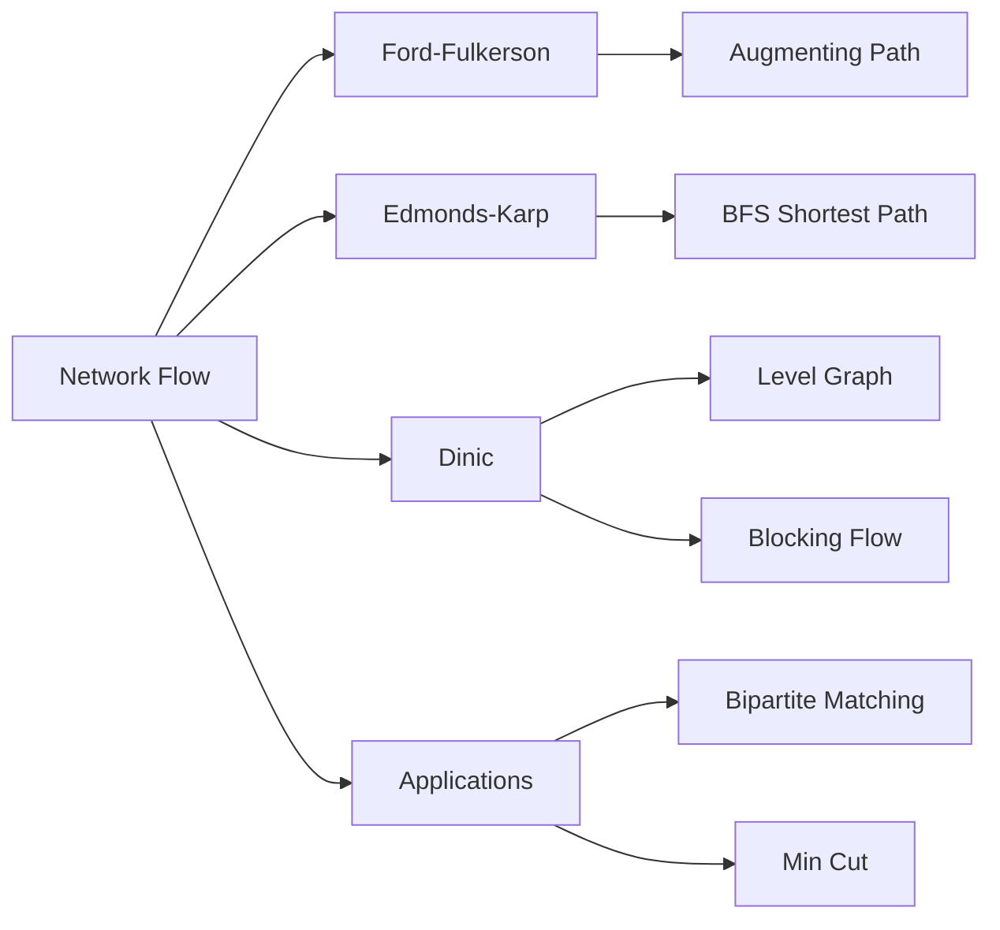

# Chapter 13: Network Flow

> **Prerequisites:** [Chapter 12: Minimum Spanning Trees](./12-graph-mst.md) — Graph theory, cuts, and greedy algorithms | **Next:** [Chapter 14: String Algorithms](./14-string-algorithms.md) — From flow optimization to pattern matching

## Learning Objectives

By the end of this chapter, students will be able to:

1. State and prove the max-flow min-cut theorem.
2. Implement Ford-Fulkerson, Edmonds-Karp, and Dinic's algorithms.
3. Reduce bipartite matching and assignment problems to network flow.
4. Model real-world problems as flow networks.

---

### Chapter at a Glance

| Topic | Key Insight | Practical Takeaway |
|-------|-------------|-------------------|
| Flow Networks | Directed graph with source, sink, capacities | Capacity constraint + flow conservation = valid flow |
| Max-Flow Min-Cut | Max flow = min cut capacity | The fundamental theorem of network flow |
| Ford-Fulkerson | Augment along any path | May be slow; O(E·|f*|) worst case |
| Edmonds-Karp | BFS for shortest augmenting path | O(VE²); always polynomial |
| Dinic's Algorithm | Level graph + blocking flow | O(√V·E) for unit capacities; best for bipartite |
| Bipartite Matching | Reduce to max flow | Classic application: job assignment, dating |

### Chapter Roadmap



## Theory


### 13.1 Flow Networks

**Definition 13.1.** A **flow network** is a directed graph \( G = (V, E) \) with:
- A **source** \( s \in V \) with no incoming edges.
- A **sink** \( t \in V \) with no outgoing edges.
- A **capacity function** \( c : E \to \mathbb{R}^+ \).

A **flow** \( f : E \to \mathbb{R} \) satisfies:
1. **Capacity constraint:** \( 0 \le f(u,v) \le c(u,v) \) for all edges.
2. **Flow conservation:** For all \( v \in V \setminus \{s, t\} \), \( \sum_{u} f(u,v) = \sum_{w} f(v,w) \).

The **value** of a flow is \( |f| = \sum_{v} f(s,v) - \sum_{v} f(v,s) \).

> **Pro Tip:** The residual graph is the key concept for all flow algorithms. Forward edges carry remaining capacity, backward edges allow "undoing" flow — this is what makes the augmenting path approach correct.
>
> **Remember:** Flow conservation: flow in = flow out for all non-source/sink vertices. Check this invariant when debugging flow implementations.

**One-Sentence Takeaway:** A flow network is a directed graph with source, sink, and capacities satisfying capacity constraints and flow conservation at every intermediate vertex.

### 13.2 Max-Flow Min-Cut Theorem

**Definition 13.2.** An **s-t cut** \( (S, T) \) partitions \( V \) into \( S \ni s \) and \( T \ni t \). The **capacity** of the cut is \( c(S, T) = \sum_{u \in S, v \in T} c(u,v) \).

**Theorem 13.1 (Max-Flow Min-Cut).** The maximum flow value equals the minimum cut capacity.

**Proof sketch.** Let \( f \) be a maximum flow. The residual network has no augmenting path. Define \( S \) as the set of vertices reachable from \( s \) in the residual network. Then \( (S, V \setminus S) \) is a cut with capacity equal to \( |f| \). No cut can have smaller capacity because any flow must cross any cut by the amount \( |f| \).

> **Pro Tip:** The max-flow min-cut theorem is the most important result in network flow — it ties together optimization (max flow) and partitioning (min cut). Use it to prove that a given flow is optimal: if you find a cut with capacity equal to the flow, both are optimal.
>
> **Remember:** The min cut can be directly recovered from the residual graph after max flow: S = vertices reachable from s, T = the rest.

**One-Sentence Takeaway:** The max-flow min-cut theorem states that the maximum flow value equals the minimum cut capacity, providing a duality between optimization and partitioning.

### 13.3 Ford-Fulkerson Method

**Algorithm:** Repeatedly find an augmenting path in the residual graph and push flow along it.

```
FordFulkerson(G, s, t):
    f = 0 on all edges
    while there exists a path p from s to t in residual graph Gf:
        cf(p) = min residual capacity on p
        for each edge (u,v) on p:
            f(u,v) += cf(p)
            f(v,u) -= cf(p)
    return f
```

**Residual capacity:** \( c_f(u,v) = c(u,v) - f(u,v) + f(v,u) \).

**Complexity:** \( O(E \cdot |f^*|) \) where \( f^* \) is the max flow value. Pseudo-polynomial if capacities are large.

> **Pro Tip:** Ford-Fulkerson's complexity depends on the max flow value — it's pseudo-polynomial. Never use plain Ford-Fulkerson with large integer capacities without a path-length guarantee.
>
> **Warning:** Ford-Fulkerson may fail to terminate if capacities are irrational (it can infinite-loop). Always use integer or rational capacities.

**One-Sentence Takeaway:** Ford-Fulkerson repeatedly finds any augmenting path in the residual graph, achieving O(E·|f*|) time — pseudo-polynomial for large capacities.

### 13.4 Edmonds-Karp Algorithm

**Improvement:** Always choose the shortest augmenting path (in number of edges, using BFS).

```
EdmondsKarp(G, s, t):
    f = 0 on all edges
    while true:
        P = BFS from s to t in Gf
        if no path exists: break
        cf = min residual capacity on P
        augment f by cf along P
    return f
```

**Complexity:** \( O(VE^2) \). Each BFS finds a shortest path, and there are at most \( O(VE) \) augmentations because each BFS increases the distance from \( s \) to at least one vertex.

> **Pro Tip:** Edmonds-Karp guarantees polynomial time by always picking the shortest augmenting path via BFS. This simple change eliminates Ford-Fulkerson's pseudo-polynomial dependency on capacities.
>
> **Remember:** Using BFS ensures each edge gets blocked at most O(V) times, yielding the O(VE²) bound.

**One-Sentence Takeaway:** Edmonds-Karp improves Ford-Fulkerson by always choosing the shortest augmenting path via BFS, achieving guaranteed O(VE²) polynomial time.

### 13.5 Dinic's Algorithm

**Algorithm:** Uses a level graph (BFS layers) and blocks all shortest paths simultaneously.

```
Dinic(G, s, t):
    f = 0
    while true:
        level = BFS from s in Gf to compute distances
        if level[t] is not defined: break
        ptr = array of iteration pointers, initialized to 0
        while flow = DFS(s, t, inf):
            augment f by flow
    return f
```

DFS(s, t, flow) sends flow from \( s \) to \( t \) along the level graph, respecting capacity constraints.

**Complexity:** \( O(V^2 E) \), \( O(E \sqrt{V}) \) for unit-capacity networks, \( O(E V^{1/2}) \) for bipartite matching.

> **Pro Tip:** Dinic's is the algorithm of choice for max flow in competitive programming. Its level graph + blocking flow approach is significantly faster than Edmonds-Karp, especially for unit-capacity networks and bipartite matching.
>
> **Remember:** The key acceleration is the current-edge pointer (`ptr[i]` in the DFS), which prevents re-scanning dead edges in the level graph.

**One-Sentence Takeaway:** Dinic's algorithm combines BFS for level graphs with DFS blocking flows, achieving O(V²E) — the practical go-to for max flow problems.

### 13.6 Bipartite Matching

**Problem:** Given a bipartite graph \( (U, V, E) \), find the largest set of edges with no shared endpoints.

**Reduction to max flow:**
1. Connect a source \( s \) to all vertices in \( U \) with capacity 1.
2. Direct all edges from \( U \) to \( V \) with capacity 1.
3. Connect all vertices in \( V \) to sink \( t \) with capacity 1.
4. The max flow value equals the size of the maximum matching.

**Complexity:** \\( O(E \\sqrt{V}) \\) using Dinic, which is significantly faster than \\( O(VE) \\) augmentations.

> **Pro Tip:** Bipartite matching via max flow is one of the most elegant reductions — source → left → right → sink with unit capacities transforms a combinatorial problem into flow.
>
> **Remember:** The Hungarian algorithm handles weighted matching; max flow is faster for unweighted cases.

**One-Sentence Takeaway:** Maximum bipartite matching reduces to max flow by connecting source → left nodes → right nodes → sink with unit capacities.

### 13.7 Assignment Problem

**Problem:** Given \( n \) workers and \( n \) jobs with a cost \( c_{ij} \) for worker \( i \) to perform job \( j \), find the minimum-cost perfect matching.

**Reduction to min-cost max flow:** Add edge weights (costs) to the bipartite matching reduction and use min-cost flow.

> **Pro Tip:** The assignment problem is a min-cost max flow with exactly n units of flow. The Hungarian algorithm solves it in O(n³) without general flow machinery.
>
> **Remember:** Both bipartite matching and assignment use the same source → left → right → sink structure — costs differentiate them.

**One-Sentence Takeaway:** The assignment problem finds minimum-cost perfect matching via min-cost max flow or the specialized Hungarian algorithm in O(n³).

---

## Examples

### Example 13.1: Edmonds-Karp in C++

```cpp
#include <vector>
#include <queue>
#include <limits>
#include <algorithm>

struct Edge {
    int to, rev;
    int cap;
};

class MaxFlow {
    std::vector<std::vector<Edge>> graph;
public:
    MaxFlow(int n) : graph(n) {}
    void addEdge(int from, int to, int cap) {
        graph[from].push_back({to, static_cast<int>(graph[to].size()), cap});
        graph[to].push_back({from, static_cast<int>(graph[from].size()) - 1, 0});
    }
    int maxFlow(int s, int t) {
        int flow = 0, n = static_cast<int>(graph.size());
        while (true) {
            std::vector<int> level(n, -1);
            std::queue<int> q;
            level[s] = 0; q.push(s);
            while (!q.empty()) {
                int v = q.front(); q.pop();
                for (const auto& e : graph[v]) {
                    if (e.cap > 0 && level[e.to] < 0) {
                        level[e.to] = level[v] + 1;
                        q.push(e.to);
                    }
                }
            }
            if (level[t] < 0) break;
            std::vector<int> iter(n, 0);
            while (true) {
                int f = dfs(s, t, std::numeric_limits<int>::max(), level, iter);
                if (f == 0) break;
                flow += f;
            }
        }
        return flow;
    }
private:
    int dfs(int v, int t, int f, const std::vector<int>& level,
            std::vector<int>& iter) {
        if (v == t) return f;
        for (int &i = iter[v]; i < static_cast<int>(graph[v].size()); ++i) {
            Edge& e = graph[v][i];
            if (e.cap > 0 && level[v] < level[e.to]) {
                int d = dfs(e.to, t, std::min(f, e.cap), level, iter);
                if (d > 0) {
                    e.cap -= d;
                    graph[e.to][e.rev].cap += d;
                    return d;
                }
            }
        }
        return 0;
    }
};
```

### Example 13.2: Bipartite Matching via Max Flow

```cpp
// Construct graph with source = U.size() + V.size(),
// sink = U.size() + V.size() + 1
int maxBipartiteMatching(int uSize, int vSize,
                          const std::vector<std::pair<int,int>>& edges) {
    int n = uSize + vSize + 2;
    int source = n - 2, sink = n - 1;
    MaxFlow mf(n);
    for (int i = 0; i < uSize; ++i)
        mf.addEdge(source, i, 1);
    for (int j = 0; j < vSize; ++j)
        mf.addEdge(uSize + j, sink, 1);
    for (const auto& [u, v] : edges)
        mf.addEdge(u, uSize + v, 1);
    return mf.maxFlow(source, sink);
}
```

### Example 13.3: Max Flow Min Cut Application

**Problem:** A city has a water network. Edges are pipes with capacities. What is the maximum flow from the reservoir to the city? What is the bottleneck (minimum cut)?

**Solution:** Compute max flow using Dinic. The minimum cut identifies the set of pipes that, if upgraded, would increase flow.

---

### Concept Comparison Table

| Algorithm | Path Selection | Time | Key Feature | Best For |
|-----------|---------------|------|-------------|----------|
| Ford-Fulkerson | Any augmenting path | O(E·\|f*\|) | Simple, first method | Educational, small capacities |
| Edmonds-Karp | Shortest (BFS) | O(VE²) | Polynomial guarantee | Teaching, medium graphs |
| Dinic | Level graph + blocking flow | O(V²E) | Current-edge pointer | Competitive programming |
| Dinic (unit) | Same | O(E√V) | Capacity = 1 optimization | Bipartite matching |

### Quick Reference

| Category | Key Points |
|----------|------------|
| **Flow Network** | Source, sink, capacities, flow conservation |
| **Residual Graph** | Forward = remaining cap, backward = flow to undo |
| **Augmenting Path** | Path from s to t in residual with positive capacity |
| **Max-Flow Min-Cut** | Max flow = min cut; cut S = reachable from s in residual |
| **Bipartite Matching** | Reduce to max flow: s → U → V → t with unit caps |
| **Assignment** | Bipartite matching + edge costs → min-cost max flow |

### Cross-Application Matrix

| Technique | DSA Interviews | Competitive Programming | System Design | Real-World |
|-----------|---------------|----------------------|---------------|------------|
| Max Flow | Common in advanced | Critical technique | Network capacity planning | Pipeline routing |
| Min Cut | Occasionally | Image segmentation | Network security | Graph partitioning |
| Bipartite Matching | Common | Matching problems | Job assignment | HR systems |
| Min-Cost Flow | Advanced | Optimization | Supply chains | Logistics |

---

## Summary

| Algorithm | Time | Notes |
|-----------|------|-------|
| Ford-Fulkerson | \( O(E \cdot |f^*|) \) | Pseudo-polynomial |
| Edmonds-Karp | \( O(VE^2) \) | BFS-based shortest augmenting path |
| Dinic | \( O(V^2 E) \) | Level graph + blocking flow |
| Dinic (unit capacities) | \( O(E \sqrt{V}) \) | Matches bipartite matching lower bound |

---

## Exercises

### Review Questions

### Chapter Quiz

**Q1.** What data structure does Dinic use to accelerate blocking flow computation?

- A) A priority queue
- B) A current-edge pointer array
- C) A hash table
- D) A segment tree

<details>
<summary>Answer</summary>
B) The `ptr[i]` current-edge pointer prevents re-scanning dead edges during DFS in the level graph.
</details>

**Q2.** How does Edmonds-Karp guarantee polynomial time?

- A) By using integer capacities only
- B) By always choosing the shortest augmenting path via BFS
- C) By using DFS to find paths
- D) By using Fibonacci heaps

<details>
<summary>Answer</summary>
B) BFS ensures each edge is saturated at most O(V) times, giving O(VE²) bound.
</details>

**Q3.** What is the key idea behind the max-flow min-cut theorem proof?

- A) Use Kruskal's algorithm on the residual graph
- B) Find all vertices reachable from s in the residual after max flow
- C) Apply Dijkstra from both source and sink
- D) Count the number of augmenting paths

<details>
<summary>Answer</summary>
B) After max flow, vertices reachable from s in the residual define a cut whose capacity equals the flow value.
</details>

### Review Questions

1. State the max-flow min-cut theorem and provide a proof sketch.
2. Explain why Ford-Fulkerson with integer capacities terminates.
3. Why does Edmonds-Karp use BFS rather than DFS?

### Application Problems

4. Implement Dinic's algorithm and test it on a network with 1000 vertices and 5000 edges.
5. Model the **edge-disjoint paths** problem as a max flow problem. Find the maximum number of vertex-disjoint paths.
6. Given a bipartite graph with 20 vertices on each side, find the maximum matching using max flow.
7. Model the **baseball elimination** problem as a max flow instance.

### Challenge Problem

8. Design an algorithm for the **minimum cut** problem that does not require computing max flow (Stoer-Wagner algorithm). Implement and analyze its complexity.
