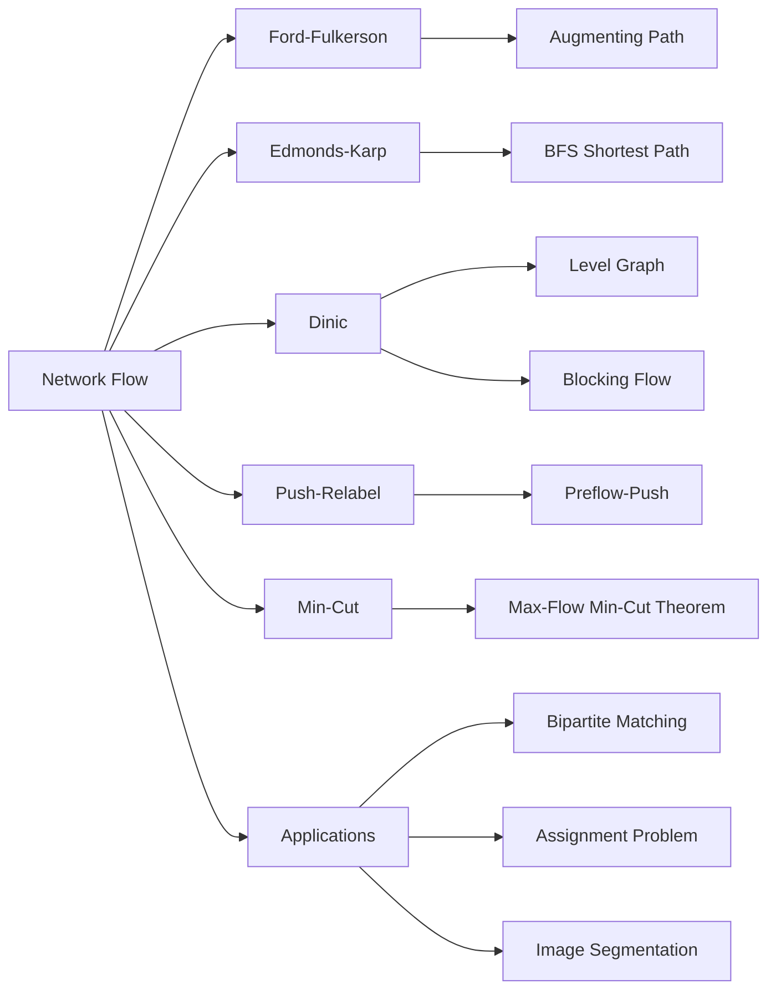

# Chapter 13: Network Flow

> **Prerequisites:** [Chapter 12: Minimum Spanning Trees](./12-graph-mst.md) — Graph theory, cuts, and greedy algorithms | **Next:** [Chapter 14: String Algorithms](./14-string-algorithms.md) — From flow optimization to pattern matching

## Learning Objectives

By the end of this chapter, students will be able to:

<!-- Image Gallery -->
<div style="display:flex;flex-wrap:wrap;gap:4px;margin:16px 0;padding:12px;background:#f8fafc;border-radius:8px;border:1px solid #e2e8f0;">
<a href="../../../assets/images/lessons/algorithms/13-graph-flow/hero.svg" target="_blank" rel="noopener">
  
</a>
<a href="../../../assets/images/lessons/algorithms/13-graph-flow/handwritten-notes.svg" target="_blank" rel="noopener">
  
</a>
<a href="../../../assets/images/lessons/algorithms/13-graph-flow/sticky-notes.svg" target="_blank" rel="noopener">
  
</a>
<a href="../../../assets/images/lessons/algorithms/13-graph-flow/visual-explanation.svg" target="_blank" rel="noopener">
  
</a>
<a href="../../../assets/images/lessons/algorithms/13-graph-flow/architecture.svg" target="_blank" rel="noopener">
  
</a>
<a href="../../../assets/images/lessons/algorithms/13-graph-flow/workflow.svg" target="_blank" rel="noopener">
  
</a>
<a href="../../../assets/images/lessons/algorithms/13-graph-flow/mindmap.svg" target="_blank" rel="noopener">
  
</a>
<a href="../../../assets/images/lessons/algorithms/13-graph-flow/comparison.svg" target="_blank" rel="noopener">
  
</a>
<a href="../../../assets/images/lessons/algorithms/13-graph-flow/cheatsheet.svg" target="_blank" rel="noopener">
  
</a>
<a href="../../../assets/images/lessons/algorithms/13-graph-flow/interview-quiz.svg" target="_blank" rel="noopener">
  
</a>
<a href="../../../assets/images/lessons/algorithms/13-graph-flow/social-card.svg" target="_blank" rel="noopener">
  
</a>
</div>
<!-- End Image Gallery -->


1. State and prove the max-flow min-cut theorem.
2. Implement Ford-Fulkerson, Edmonds-Karp, and Dinic's algorithms.
3. Reduce bipartite matching and assignment problems to network flow.
4. Model real-world problems as flow networks.

---

## Why Network Flow Matters

Imagine a city's water supply system. Water flows from a reservoir (source) through an intricate network of pipes (edges), each with a maximum capacity (liters per minute). Your job: determine the maximum water that can reach the city (sink) without bursting any pipe. Now replace water with data packets and pipes with fiber-optic cables — you've just described internet traffic routing.

Network flow is the mathematical backbone of:
- **Internet routing** (maximizing data throughput across congested links)
- **Logistics** (supply chain optimization, airline scheduling)
- **Image processing** (segmentation via graph cuts)
- **Job markets** (matching applicants to positions)
- **Distributed computing** (scheduling tasks across data centers)

The max-flow min-cut theorem reveals a deep duality: the maximum flow you can push through equals the capacity of the bottleneck cut. Find the bottleneck, and you've optimized the system.

---

### Chapter at a Glance

| Topic | Key Insight | Practical Takeaway |
|-------|-------------|-------------------|
| Flow Networks | Directed graph with source, sink, capacities | Capacity constraint + flow conservation = valid flow |
| Max-Flow Min-Cut | Max flow = min cut capacity | The fundamental theorem of network flow |
| Ford-Fulkerson | Augment along any path | May be slow; O(E * |f*|) worst case |
| Edmonds-Karp | BFS for shortest augmenting path | O(VE^2); always polynomial |
| Dinic's Algorithm | Level graph + blocking flow | O(sqrt(V) * E) for unit capacities; best for bipartite |
| Push-Relabel | Local excess height pushes | O(V^2 * sqrt(E)); parallelizable |
| Bipartite Matching | Reduce to max flow | Classic application: job assignment, dating |

### Chapter Roadmap



## Theory


### 13.1 Flow Networks

<a href="../../../assets/images/diagrams/algorithms/13-graph-flow/13-1-flow-networks-handwritten.svg" target="_blank" rel="noopener">
  
</a>
<a href="../../../assets/images/diagrams/algorithms/13-graph-flow/13-1-flow-networks-diagram.svg" target="_blank" rel="noopener">
  
</a>
<a href="../../../assets/images/diagrams/algorithms/13-graph-flow/13-1-flow-networks-sticky.svg" target="_blank" rel="noopener">
  
</a>


**Real-World Analogy:** A network of water pipes. The source is the reservoir, the sink is the city. Each pipe has a maximum flow rate (capacity). Water enters at the source, exits at the sink, and at every junction (vertex), the water flowing in equals the water flowing out (conservation).

**Definition 13.1.** A **flow network** is a directed graph \( G = (V, E) \) with:
- A **source** \( s \in V \) with no incoming edges.
- A **sink** \( t \in V \) with no outgoing edges.
- A **capacity function** \( c : E \to \mathbb{R}^+ \).

A **flow** \( f : E \to \mathbb{R} \) satisfies:
1. **Capacity constraint:** \( 0 \le f(u,v) \le c(u,v) \) for all edges.
2. **Flow conservation:** For all \( v \in V \setminus \{s, t\} \), \( \sum_{u} f(u,v) = \sum_{w} f(v,w) \).

The **value** of a flow is \( |f| = \sum_{v} f(s,v) - \sum_{v} f(v,s) \).

**Residual Graph:** For a flow \( f \), the residual graph \( G_f \) has edges with residual capacity:

\[
c_f(u,v) = c(u,v) - f(u,v) + f(v,u)
\]

A forward edge holds remaining capacity; a backward edge allows "undoing" flow — this is what makes the augmenting path approach correct.

**Edge Cases:**
- **Disconnected source and sink:** No path exists; max flow = 0.
- **Zero-capacity edges:** These edges contribute nothing and can be ignored.
- **Multiple sources/sinks:** Add a super-source connected to all sources with infinite capacity, and a super-sink from all sinks with infinite capacity.
- **Undirected edges:** Replace with two directed edges of the same capacity.

> **Pro Tip:** The residual graph is the key concept for all flow algorithms. Forward edges carry remaining capacity, backward edges allow "undoing" flow — this is what makes the augmenting path approach correct.
>
> **Remember:** Flow conservation: flow in = flow out for all non-source/sink vertices. Check this invariant when debugging flow implementations.

**One-Sentence Takeaway:** A flow network is a directed graph with source, sink, and capacities satisfying capacity constraints and flow conservation at every intermediate vertex.

### 13.2 Max-Flow Min-Cut Theorem

<a href="../../../assets/images/diagrams/algorithms/13-graph-flow/13-2-max-flow-min-cut-theorem-handwritten.svg" target="_blank" rel="noopener">
  
</a>
<a href="../../../assets/images/diagrams/algorithms/13-graph-flow/13-2-max-flow-min-cut-theorem-diagram.svg" target="_blank" rel="noopener">
  
</a>
<a href="../../../assets/images/diagrams/algorithms/13-graph-flow/13-2-max-flow-min-cut-theorem-sticky.svg" target="_blank" rel="noopener">
  
</a>


**Definition 13.2.** An **s-t cut** \( (S, T) \) partitions \( V \) into \( S \ni s \) and \( T \ni t \). The **capacity** of the cut is:

\[
c(S, T) = \sum_{u \in S, v \in T} c(u,v)
\]

**Theorem 13.1 (Max-Flow Min-Cut).** The maximum flow value equals the minimum cut capacity.

**Proof sketch.** Let \( f \) be a maximum flow. The residual network has no augmenting path. Define \( S \) as the set of vertices reachable from \( s \) in the residual network. Then \( (S, V \setminus S) \) is a cut with capacity equal to \( |f| \). No cut can have smaller capacity because any flow must cross any cut by the amount \( |f| \).

**Intuition:** Think of the cut as a set of pipes that, if severed, would disconnect the source from the sink. The bottleneck of the entire network is the minimum total capacity of pipes that must be cut. The maximum flow can never exceed this bottleneck — and the theorem says it always exactly equals it.

**Recovering the Min Cut:** After running max flow, set \( S = \{ \text{vertices reachable from } s \text{ in the residual graph} \} \). The min cut is \( (S, V \setminus S) \).

> **Pro Tip:** The max-flow min-cut theorem is the most important result in network flow — it ties together optimization (max flow) and partitioning (min cut). Use it to prove that a given flow is optimal: if you find a cut with capacity equal to the flow, both are optimal.
>
> **Remember:** The min cut can be directly recovered from the residual graph after max flow: S = vertices reachable from s, T = the rest.

**One-Sentence Takeaway:** The max-flow min-cut theorem states that the maximum flow value equals the minimum cut capacity, providing a duality between optimization and partitioning.

### 13.3 Ford-Fulkerson Method

<a href="../../../assets/images/diagrams/algorithms/13-graph-flow/13-3-ford-fulkerson-method-handwritten.svg" target="_blank" rel="noopener">
  
</a>
<a href="../../../assets/images/diagrams/algorithms/13-graph-flow/13-3-ford-fulkerson-method-diagram.svg" target="_blank" rel="noopener">
  
</a>
<a href="../../../assets/images/diagrams/algorithms/13-graph-flow/13-3-ford-fulkerson-method-sticky.svg" target="_blank" rel="noopener">
  
</a>


**Real-World Analogy:** Imagine finding a new route for water through a pipe network every day. Each day you pick any path from reservoir to city and push as much water as the narrowest pipe on that path allows. If a pipe fills up, you can later "undo" some flow by rerouting around it. You repeat until every path has a blocked pipe. That's Ford-Fulkerson.

**Algorithm Steps:**

1. Initialize flow \( f(u,v) = 0 \) for all edges.
2. While there exists a path \( p \) from \( s \) to \( t \) in the residual graph \( G_f \):
   a. Find the bottleneck capacity \( c_f(p) = \min\{c_f(u,v) : (u,v) \in p\} \).
   b. For each edge \( (u,v) \) on \( p \):
      - \( f(u,v) = f(u,v) + c_f(p) \)
      - \( f(v,u) = f(v,u) - c_f(p) \)
3. Return \( f \).

**Pseudocode:**

```
FordFulkerson(G, s, t):
    for each edge (u,v) in G:
        f[u][v] = 0
        f[v][u] = 0
    
    while there exists a path p from s to t in Gf:
        // Find bottleneck capacity
        cf = infinity
        for each edge (u,v) in p:
            cf = min(cf, residual(u,v))
        
        // Augment flow along the path
        for each edge (u,v) in p:
            f[u][v] = f[u][v] + cf
            f[v][u] = f[v][u] - cf
    
    return f
```

**Step-by-Step Dry Run:**

Consider network: \( s \to a(4), s \to b(3), a \to b(2), a \to t(3), b \to t(4) \). Max flow = 7.

Initial residual graph: all forward edges at full capacity, no backward edges.

We deliberately pick a suboptimal first path to demonstrate backward edge usage.

| Step | Augmenting Path | Bottleneck | Flow Added | Residual Graph Changes |
|------|----------------|------------|------------|----------------------|
| 1 | s → a → b → t | min(4,2,4) = 2 | 2 | s→a:4→2, a→s:0→2; a→b:2→0, b→a:0→2; b→t:4→2, t→b:0→2 |
| 2 | s → a → t | min(2,3) = 2 | 2 | s→a:2→0, a→s:2→4; a→t:3→1, t→a:0→2 |
| 3 | s → b → t | min(3,2) = 2 | 2 | s→b:3→1, b→s:0→2; b→t:2→0, t→b:2→4 |
| 4 | s → b → a → t | min(1,2,1) = 1 | 1 | s→b:1→0, b→s:2→3; b→a:2→1, a→b:0→1; a→t:1→0, t→a:2→3 |

**Final flow:** f(s,a)=4, f(s,b)=3, f(a,b)=1, f(a,t)=3, f(b,t)=4. Total = 7.

**Implementations:**

```cpp
// C++ — Ford-Fulkerson (adjacency matrix, DFS-based path finding)
#include <vector>
#include <algorithm>
#include <climits>

class FordFulkerson {
    int n;
    std::vector<std::vector<int>> cap;
    std::vector<bool> visited;

    int dfs(int v, int t, int f) {
        if (v == t) return f;
        visited[v] = true;
        for (int u = 0; u < n; u++) {
            if (!visited[u] && cap[v][u] > 0) {
                int d = dfs(u, t, std::min(f, cap[v][u]));
                if (d > 0) {
                    cap[v][u] -= d;
                    cap[u][v] += d;
                    return d;
                }
            }
        }
        return 0;
    }

public:
    FordFulkerson(int n) : n(n), cap(n, std::vector<int>(n, 0)), visited(n) {}

    void addEdge(int u, int v, int c) {
        cap[u][v] = c;
    }

    int maxFlow(int s, int t) {
        int flow = 0, INF = INT_MAX;
        while (true) {
            std::fill(visited.begin(), visited.end(), false);
            int f = dfs(s, t, INF);
            if (f == 0) break;
            flow += f;
        }
        return flow;
    }
};
```

```python
# Python — Ford-Fulkerson
class FordFulkerson:
    def __init__(self, n):
        self.n = n
        self.cap = [[0] * n for _ in range(n)]

    def add_edge(self, u, v, c):
        self.cap[u][v] = c

    def _dfs(self, v, t, f, visited):
        if v == t:
            return f
        visited[v] = True
        for u in range(self.n):
            if not visited[u] and self.cap[v][u] > 0:
                d = self._dfs(u, t, min(f, self.cap[v][u]), visited)
                if d > 0:
                    self.cap[v][u] -= d
                    self.cap[u][v] += d
                    return d
        return 0

    def max_flow(self, s, t):
        flow = 0
        INF = 10**18
        while True:
            visited = [False] * self.n
            f = self._dfs(s, t, INF, visited)
            if f == 0:
                break
            flow += f
        return flow
```

```java
// Java — Ford-Fulkerson
import java.util.*;

class FordFulkerson {
    private int n;
    private int[][] cap;

    public FordFulkerson(int n) {
        this.n = n;
        cap = new int[n][n];
    }

    public void addEdge(int u, int v, int c) {
        cap[u][v] = c;
    }

    private int dfs(int v, int t, int f, boolean[] visited) {
        if (v == t) return f;
        visited[v] = true;
        for (int u = 0; u < n; u++) {
            if (!visited[u] && cap[v][u] > 0) {
                int d = dfs(u, t, Math.min(f, cap[v][u]), visited);
                if (d > 0) {
                    cap[v][u] -= d;
                    cap[u][v] += d;
                    return d;
                }
            }
        }
        return 0;
    }

    public int maxFlow(int s, int t) {
        int flow = 0;
        while (true) {
            boolean[] visited = new boolean[n];
            int f = dfs(s, t, Integer.MAX_VALUE, visited);
            if (f == 0) break;
            flow += f;
        }
        return flow;
    }
}
```

**Complexity Analysis:**

Ford-Fulkerson runs in \( O(E \cdot |f^*|) \) where \( |f^*| \) is the maximum flow value.

- **Why:** Each augmentation increases the flow by at least 1 (with integer capacities). There are at most \( |f^*| \) augmentations. Each DFS or BFS takes \( O(E) \).
- **Pseudo-polynomial:** If capacities are large (e.g., \( 10^9 \)), the algorithm may require billions of iterations. The running time depends on the *numeric value* of the capacities, not just the graph size.

**Advantages & Disadvantages:**

| Advantages | Disadvantages |
|------------|---------------|
| Conceptually simple to understand and implement | Pseudo-polynomial — slow for large capacities |
| Works for any capacity values (integer or rational) | May never terminate for irrational capacities |
| General framework adapted by all other algorithms | DFS can pick long, inefficient augmenting paths |
| Naturally handles backward edges via residual graph | Poor worst-case on pathological networks |

**Edge Cases:**

- **Disconnected source/sink:** The DFS finds no path; flow = 0. Correct.
- **Zero capacity edges:** The DFS skips them (cap = 0). Correct.
- **Multiple sources:** Add a super-source with infinite capacity edges to each source.
- **Multiple sinks:** Add a super-sink with infinite capacity edges from each sink.
- **Large capacities:** Integer overflow possible — use `long long` or `BigInteger`.
- **Irrational capacities:** The algorithm may never terminate (infinite loop). Always use integer or rational capacities.

### 13.4 Edmonds-Karp Algorithm

<a href="../../../assets/images/diagrams/algorithms/13-graph-flow/13-4-edmonds-karp-algorithm-handwritten.svg" target="_blank" rel="noopener">
  
</a>
<a href="../../../assets/images/diagrams/algorithms/13-graph-flow/13-4-edmonds-karp-algorithm-diagram.svg" target="_blank" rel="noopener">
  
</a>
<a href="../../../assets/images/diagrams/algorithms/13-graph-flow/13-4-edmonds-karp-algorithm-sticky.svg" target="_blank" rel="noopener">
  
</a>


**Real-World Analogy:** Instead of picking an arbitrary route each day (Ford-Fulkerson), always take the route with the fewest pipes. This guarantees you'll never get stuck making unnecessary detours — you'll always saturate the shortest bottleneck first, and the overall process finishes in a predictable number of steps.

**Algorithm Steps:**

1. Initialize flow \( f(u,v) = 0 \) for all edges.
2. While there exists a path from \( s \) to \( t \) in the residual graph \( G_f \):
   a. Run BFS from \( s \) to \( t \) in \( G_f \) to find the shortest augmenting path (in number of edges).
   b. Compute bottleneck capacity \( c_f(p) \).
   c. Augment flow along \( p \).
3. Return \( f \).

**Pseudocode:**

```
EdmondsKarp(G, s, t):
    for each edge (u,v) in G:
        f[u][v] = 0
    
    while true:
        // BFS to find shortest augmenting path
        queue = {s}
        parent = array initialized to -1
        parent[s] = s
        
        while queue not empty and parent[t] == -1:
            v = queue.pop()
            for each u adjacent to v in Gf:
                if parent[u] == -1 and residual(v,u) > 0:
                    parent[u] = v
                    queue.push(u)
        
        if parent[t] == -1:  // No path found
            break
        
        // Find bottleneck
        cf = infinity
        v = t
        while v != s:
            cf = min(cf, residual(parent[v], v))
            v = parent[v]
        
        // Augment flow
        v = t
        while v != s:
            u = parent[v]
            f[u][v] += cf
            f[v][u] -= cf
            v = u
    
    return f
```

**Step-by-Step Dry Run:**

Same network: \( s \to a(4), s \to b(3), a \to b(2), a \to t(3), b \to t(4) \).

BFS always picks the shortest path (in edges). The shortest paths from s to t are: s→a→t (2 edges), s→b→t (2 edges).

| Step | BFS Path | Bottleneck | Flow Added | Residual Graph |
|------|----------|------------|------------|----------------|
| 1 | s → a → t | min(4,3) = 3 | 3 | s→a:4→1, a→s:0→3; a→t:3→0, t→a:0→3; s→b:3, b→t:4 |
| 2 | s → b → t | min(3,4) = 3 | 3 | s→b:3→0, b→s:0→3; b→t:4→1, t→b:0→3 |
| 3 | s → a → b → t | min(1,2,1) = 1 | 1 | s→a:1→0, a→s:3→4; a→b:2→1, b→a:0→1; b→t:1→0, t→b:3→4 |

**Final flow:** Total = 7. Same as Ford-Fulkerson, but only 3 BFS iterations instead of 4 DFS iterations.

**Implementations:**

```cpp
// C++ — Edmonds-Karp
#include <vector>
#include <queue>
#include <algorithm>
#include <climits>

class EdmondsKarp {
    int n;
    std::vector<std::vector<int>> cap;

public:
    EdmondsKarp(int n) : n(n), cap(n, std::vector<int>(n, 0)) {}

    void addEdge(int u, int v, int c) {
        cap[u][v] = c;
    }

    int maxFlow(int s, int t) {
        int flow = 0;
        std::vector<int> parent(n);

        while (true) {
            std::fill(parent.begin(), parent.end(), -1);
            std::queue<int> q;
            q.push(s);
            parent[s] = s;

            while (!q.empty() && parent[t] == -1) {
                int v = q.front(); q.pop();
                for (int u = 0; u < n; u++) {
                    if (parent[u] == -1 && cap[v][u] > 0) {
                        parent[u] = v;
                        q.push(u);
                    }
                }
            }

            if (parent[t] == -1) break;

            int cf = INT_MAX;
            for (int v = t; v != s; v = parent[v]) {
                cf = std::min(cf, cap[parent[v]][v]);
            }
            for (int v = t; v != s; v = parent[v]) {
                cap[parent[v]][v] -= cf;
                cap[v][parent[v]] += cf;
            }
            flow += cf;
        }
        return flow;
    }
};
```

```python
# Python — Edmonds-Karp
from collections import deque

class EdmondsKarp:
    def __init__(self, n):
        self.n = n
        self.cap = [[0] * n for _ in range(n)]

    def add_edge(self, u, v, c):
        self.cap[u][v] = c

    def max_flow(self, s, t):
        flow = 0
        INF = 10**18

        while True:
            parent = [-1] * self.n
            q = deque([s])
            parent[s] = s

            while q and parent[t] == -1:
                v = q.popleft()
                for u in range(self.n):
                    if parent[u] == -1 and self.cap[v][u] > 0:
                        parent[u] = v
                        q.append(u)

            if parent[t] == -1:
                break

            cf = INF
            v = t
            while v != s:
                cf = min(cf, self.cap[parent[v]][v])
                v = parent[v]

            v = t
            while v != s:
                u = parent[v]
                self.cap[u][v] -= cf
                self.cap[v][u] += cf
                v = u

            flow += cf

        return flow
```

```java
// Java — Edmonds-Karp
import java.util.*;

class EdmondsKarp {
    private int n;
    private int[][] cap;

    public EdmondsKarp(int n) {
        this.n = n;
        cap = new int[n][n];
    }

    public void addEdge(int u, int v, int c) {
        cap[u][v] = c;
    }

    public int maxFlow(int s, int t) {
        int flow = 0;
        int[] parent = new int[n];

        while (true) {
            Arrays.fill(parent, -1);
            Queue<Integer> q = new LinkedList<>();
            q.add(s);
            parent[s] = s;

            while (!q.isEmpty() && parent[t] == -1) {
                int v = q.poll();
                for (int u = 0; u < n; u++) {
                    if (parent[u] == -1 && cap[v][u] > 0) {
                        parent[u] = v;
                        q.add(u);
                    }
                }
            }

            if (parent[t] == -1) break;

            int cf = Integer.MAX_VALUE;
            for (int v = t; v != s; v = parent[v]) {
                cf = Math.min(cf, cap[parent[v]][v]);
            }
            for (int v = t; v != s; v = parent[v]) {
                cap[parent[v]][v] -= cf;
                cap[v][parent[v]] += cf;
            }
            flow += cf;
        }
        return flow;
    }
}
```

**Complexity Analysis:**

Edmonds-Karp runs in \( O(VE^2) \).

- **Why BFS?** BFS finds the shortest path in \( O(E) \). The key insight: each edge becomes saturated at most \( O(V) \) times because each saturation increases the distance from s to at least one vertex along the path. With \( O(E) \) edges and at most \( O(V) \) saturations per edge, we get \( O(V \cdot E) \) augmentations. Each augmentation costs \( O(E) \) for BFS.
- **Why polynomial?** Unlike Ford-Fulkerson, the number of iterations depends only on the graph size, not the capacity values. This guarantees polynomial time regardless of how large capacities are.
- **Tight bound:** The \( O(VE^2) \) bound is tight — there exist networks where Edmonds-Karp performs \( \Theta(VE) \) augmentations.

**Advantages & Disadvantages:**

| Advantages | Disadvantages |
|------------|---------------|
| Guaranteed polynomial time (\( O(VE^2) \)) | BFS overhead on dense graphs |
| Simple implementation over Ford-Fulkerson | Still relatively slow for large networks |
| Independent of capacity values | Not suitable for real-time systems |
| Provably terminates for any real capacities | Does not exploit graph structure (level graphs, etc.) |

**Edge Cases:**

- **Same as Ford-Fulkerson** for disconnected, zero capacity, multiple sources/sinks.
- **Unit-capacity networks:** BFS still works but is overkill. Dinic is \( O(E\sqrt{V}) \) for these.
- **Dense graphs:** With \( E = O(V^2) \), complexity becomes \( O(V^5) \) — impractical.

### 13.5 Dinic's Algorithm

<a href="../../../assets/images/diagrams/algorithms/13-graph-flow/13-5-dinic-s-algorithm-handwritten.svg" target="_blank" rel="noopener">
  
</a>
<a href="../../../assets/images/diagrams/algorithms/13-graph-flow/13-5-dinic-s-algorithm-diagram.svg" target="_blank" rel="noopener">
  
</a>
<a href="../../../assets/images/diagrams/algorithms/13-graph-flow/13-5-dinic-s-algorithm-sticky.svg" target="_blank" rel="noopener">
  
</a>


**Real-World Analogy:** Instead of sending one truckload along one route at a time, first build a map of all roads sorted by distance from the reservoir. Then send as many truckloads as possible along all shortest-distance routes simultaneously. When those routes are full, rebuild the map excluding saturated roads and repeat.

**Algorithm Steps:**

1. Initialize flow \( f = 0 \).
2. While there exists a path from \( s \) to \( t \) in the residual graph:
   a. **Level graph construction:** Run BFS from \( s \) to compute distances (levels) in \( G_f \). Each vertex gets a level = shortest distance from \( s \).
   b. If \( t \) is unreachable, break.
   c. **Blocking flow:** Run DFS from \( s \) to \( t \) restricted to edges that go from level \( i \) to \( i+1 \). Use a current-edge pointer (`ptr[i]`) to avoid re-scanning dead edges.
   d. Augment flow by the blocking flow value.
3. Return \( f \).

**Pseudocode:**

```
Dinic(G, s, t):
    f = 0
    n = number of vertices
    
    while true:
        // BFS — build level graph
        level = array of size n, initialized to -1
        level[s] = 0
        queue = {s}
        while queue not empty:
            v = queue.pop()
            for each u adjacent to v in Gf:
                if level[u] == -1 and residual(v,u) > 0:
                    level[u] = level[v] + 1
                    queue.push(u)
        
        if level[t] == -1: break
        
        // DFS — send blocking flow
        ptr = array of size n, initialized to 0
        while true:
            pushed = DFS(s, t, INF, level, ptr)
            if pushed == 0: break
            f += pushed
    
    return f

DFS(v, t, f, level, ptr):
    if v == t: return f
    for i from ptr[v] to len(adj[v])-1:
        ptr[v] = i
        u = adj[v][i].to
        if level[v] + 1 == level[u] and residual(v,u) > 0:
            d = DFS(u, t, min(f, residual(v,u)), level, ptr)
            if d > 0:
                residual(v,u) -= d
                residual(u,v) += d
                return d
    return 0
```

**Step-by-Step Dry Run:**

Same network: \( s \to a(4), s \to b(3), a \to b(2), a \to t(3), b \to t(4) \).

**Phase 1 — Level graph:**
BFS from s: level[s]=0, level[a]=1, level[b]=1, level[t]=2.

Edges in level graph: s→a, s→b, a→t, b→t. (a→b goes from level 1 to level 1, so it's excluded.)

DFS blocking flow:
- Path 1: s→a→t, push min(4,3) = 3. Flow = 3.
- Path 2: s→b→t, push min(3,4) = 3. Flow = 3.

Blocking flow total = 6. Overall flow = 6.

After Phase 1 residual: s→a(1), a→t(0), s→b(0), b→t(1), plus backward edges.

**Phase 2 — Level graph:**
BFS from s: level[s]=0, level[a]=1, level[b]=1, level[t]=2 (via a→b→t or s→a→b→t).

Edges in level graph: s→a(1), s→b(0 — no), a→b(2), b→t(1).

DFS blocking flow:
- Path 1: s→a→b→t, push min(1,2,1) = 1. Flow = 1.

Blocking flow total = 1. Overall flow = 7.

**Phase 3:** BFS can't reach t. Algorithm terminates. Max flow = 7.

**Implementations:**

```cpp
// C++ — Dinic (adjacency list with edge struct)
#include <vector>
#include <queue>
#include <algorithm>
#include <climits>

class Dinic {
    struct Edge {
        int to, rev;
        int cap;
    };
    int n;
    std::vector<std::vector<Edge>> g;
    std::vector<int> level, ptr;

    void bfs(int s) {
        level.assign(n, -1);
        std::queue<int> q;
        level[s] = 0;
        q.push(s);
        while (!q.empty()) {
            int v = q.front(); q.pop();
            for (const Edge& e : g[v]) {
                if (e.cap > 0 && level[e.to] == -1) {
                    level[e.to] = level[v] + 1;
                    q.push(e.to);
                }
            }
        }
    }

    int dfs(int v, int t, int f) {
        if (v == t) return f;
        for (int& i = ptr[v]; i < (int)g[v].size(); i++) {
            Edge& e = g[v][i];
            if (e.cap > 0 && level[v] + 1 == level[e.to]) {
                int d = dfs(e.to, t, std::min(f, e.cap));
                if (d > 0) {
                    e.cap -= d;
                    g[e.to][e.rev].cap += d;
                    return d;
                }
            }
        }
        return 0;
    }

public:
    Dinic(int n) : n(n), g(n), level(n), ptr(n) {}

    void addEdge(int from, int to, int cap) {
        g[from].push_back({to, (int)g[to].size(), cap});
        g[to].push_back({from, (int)g[from].size() - 1, 0});
    }

    int maxFlow(int s, int t) {
        int flow = 0;
        while (true) {
            bfs(s);
            if (level[t] == -1) break;
            ptr.assign(n, 0);
            while (int pushed = dfs(s, t, INT_MAX)) {
                flow += pushed;
            }
        }
        return flow;
    }
};
```

```python
# Python — Dinic
from collections import deque

class Dinic:
    def __init__(self, n):
        self.n = n
        self.graph = [[] for _ in range(n)]

    def add_edge(self, fr, to, cap):
        forward = [to, cap, None]
        backward = [fr, 0, forward]
        forward[2] = backward
        self.graph[fr].append(forward)
        self.graph[to].append(backward)

    def bfs(self, s, t):
        self.level = [-1] * self.n
        q = deque([s])
        self.level[s] = 0
        while q:
            v = q.popleft()
            for to, cap, rev in self.graph[v]:
                if cap > 0 and self.level[to] == -1:
                    self.level[to] = self.level[v] + 1
                    q.append(to)
        return self.level[t] != -1

    def dfs(self, v, t, f):
        if v == t:
            return f
        for i in range(self.it[v], len(self.graph[v])):
            self.it[v] = i
            to, cap, rev = self.graph[v][i]
            if cap > 0 and self.level[v] + 1 == self.level[to]:
                d = self.dfs(to, t, min(f, cap))
                if d > 0:
                    self.graph[v][i][1] -= d
                    rev[1] += d
                    return d
        return 0

    def max_flow(self, s, t):
        flow = 0
        INF = 10**18
        while self.bfs(s, t):
            self.it = [0] * self.n
            while True:
                f = self.dfs(s, t, INF)
                if f == 0:
                    break
                flow += f
        return flow
```

```java
// Java — Dinic
import java.util.*;

class Dinic {
    static class Edge {
        int to, rev, cap;
        Edge(int to, int rev, int cap) {
            this.to = to;
            this.rev = rev;
            this.cap = cap;
        }
    }

    private int n;
    private List<Edge>[] g;
    private int[] level, ptr;

    @SuppressWarnings("unchecked")
    Dinic(int n) {
        this.n = n;
        g = new List[n];
        for (int i = 0; i < n; i++) g[i] = new ArrayList<>();
        level = new int[n];
        ptr = new int[n];
    }

    void addEdge(int from, int to, int cap) {
        g[from].add(new Edge(to, g[to].size(), cap));
        g[to].add(new Edge(from, g[from].size() - 1, 0));
    }

    private void bfs(int s) {
        Arrays.fill(level, -1);
        Queue<Integer> q = new LinkedList<>();
        level[s] = 0;
        q.add(s);
        while (!q.isEmpty()) {
            int v = q.poll();
            for (Edge e : g[v]) {
                if (e.cap > 0 && level[e.to] == -1) {
                    level[e.to] = level[v] + 1;
                    q.add(e.to);
                }
            }
        }
    }

    private int dfs(int v, int t, int f) {
        if (v == t) return f;
        for (; ptr[v] < g[v].size(); ptr[v]++) {
            Edge e = g[v].get(ptr[v]);
            if (e.cap > 0 && level[v] + 1 == level[e.to]) {
                int d = dfs(e.to, t, Math.min(f, e.cap));
                if (d > 0) {
                    e.cap -= d;
                    g[e.to].get(e.rev).cap += d;
                    return d;
                }
            }
        }
        return 0;
    }

    int maxFlow(int s, int t) {
        int flow = 0;
        while (true) {
            bfs(s);
            if (level[t] == -1) break;
            Arrays.fill(ptr, 0);
            while (true) {
                int f = dfs(s, t, Integer.MAX_VALUE);
                if (f == 0) break;
                flow += f;
            }
        }
        return flow;
    }
}
```

**Complexity Analysis:**

Dinic runs in \( O(V^2 E) \) general, \( O(E \sqrt{V}) \) for unit-capacity networks.

- **Why O(V^2 E):** Each BFS costs \( O(E) \) and creates a level graph. There are at most \( O(V) \) phases because each phase increases the level of t by at least 1. Each DFS blocking flow costs \( O(VE) \) across all phases. Total: \( O(V \cdot VE) = O(V^2 E) \).
- **Why faster for unit capacities:** In unit-capacity networks, each edge can contribute to at most one blocking flow per phase, and there are at most \( O(\sqrt{V}) \) phases. This gives \( O(E\sqrt{V}) \).
- **Current-edge pointer:** The `ptr[v]` trick ensures each edge is examined at most once per phase, transforming a naive \( O(V^2 E) \) DFS into an amortized \( O(E) \) per phase.

**Advantages & Disadvantages:**

| Advantages | Disadvantages |
|------------|---------------|
| Fastest general-purpose max flow algorithm | More complex to implement correctly |
| \( O(E\sqrt{V}) \) for unit capacities | BFS + DFS overhead on tiny graphs |
| Excellent for bipartite matching | Memory overhead from edge structs |
| Standard in competitive programming | Overkill when \( |f^*| \) is very small |

**Edge Cases:**

- **Unit-capacity networks:** Dinic shines here — complexity drops to \( O(E \sqrt{V}) \).
- **Dense graphs:** \( O(V^2 E) = O(V^4) \) — consider push-relabel instead.
- **Multiple sources/sinks:** Super-source/super-sink reduction works identically.
- **Layered networks:** If the level graph is deep, Dinic may need many phases.

### 13.6 Push-Relabel Algorithm

<a href="../../../assets/images/diagrams/algorithms/13-graph-flow/13-6-push-relabel-algorithm-handwritten.svg" target="_blank" rel="noopener">
  
</a>
<a href="../../../assets/images/diagrams/algorithms/13-graph-flow/13-6-push-relabel-algorithm-diagram.svg" target="_blank" rel="noopener">
  
</a>
<a href="../../../assets/images/diagrams/algorithms/13-graph-flow/13-6-push-relabel-algorithm-sticky.svg" target="_blank" rel="noopener">
  
</a>


**Real-World Analogy:** Instead of finding paths (Ford-Fulkerson) or level graphs (Dinic), imagine each junction in the pipe network storing temporary excess water. Water is "pushed" from higher junctions to lower junctions. If a junction has excess water and no downhill neighbor, its "height" is increased (relabeled) to create a downhill slope. Eventually, all excess water reaches the sink or flows back to the source.

**Algorithm Steps:**

1. Preprocess: Push flow from source to all neighbors (source is at height \( n \)).
2. While there exists an active vertex (excess flow > 0 and height &lt; \( n \)):
   a. **Push:** If there's a neighbor with lower height, push min(excess, residual capacity) units along the edge.
   b. **Relabel:** If no valid push is possible, increase the vertex's height to 1 + min height of any neighbor with residual capacity.
3. Return the flow at the sink.

**Pseudocode:**

```
PushRelabel(G, s, t):
    n = |V|
    height = array of size n, initialized to 0
    excess = array of size n, initialized to 0
    height[s] = n
    
    // Initialize — push from source
    for each neighbor v of s:
        excess[v] = cap(s,v)
        cap(s,v) = 0
        cap(v,s) = cap(s,v)  // reverse edge
    excess[s] = -sum(excess[v] for all v)
    
    while there exists v with excess[v] > 0 and height[v] < n:
        // Try to push
        pushed = false
        for each neighbor u of v with residual(v,u) > 0:
            if height[v] == height[u] + 1:
                push min(excess[v], residual(v,u)) from v to u
                pushed = true
                break
        
        if not pushed:
            // Relabel
            height[v] = 1 + min{height[u] : residual(v,u) > 0}
    
    return excess[t]
```

**Implementations:**

```cpp
// C++ — Push-Relabel (highest-label selection)
#include <vector>
#include <algorithm>
#include <climits>

class PushRelabel {
    struct Edge { int to, rev; int cap; };
    int n;
    std::vector<std::vector<Edge>> g;
    std::vector<int> height, excess, count;

    void push(int v, int u, Edge& e) {
        int d = std::min(excess[v], e.cap);
        e.cap -= d;
        g[e.to][e.rev].cap += d;
        excess[v] -= d;
        excess[u] += d;
    }

    void relabel(int v) {
        int minH = 2 * n;
        for (const Edge& e : g[v]) {
            if (e.cap > 0) minH = std::min(minH, height[e.to]);
        }
        height[v] = minH + 1;
    }

public:
    PushRelabel(int n) : n(n), g(n), height(n), excess(n), count(2 * n) {}

    void addEdge(int from, int to, int cap) {
        g[from].push_back({to, (int)g[to].size(), cap});
        g[to].push_back({from, (int)g[from].size() - 1, 0});
    }

    int maxFlow(int s, int t) {
        height[s] = n;
        count[n] = 1;
        count[0] = n - 1;

        for (Edge& e : g[s]) {
            excess[s] += e.cap;
            push(s, e.to, e);
        }

        std::vector<int> active;
        for (int v = 0; v < n; v++) {
            if (v != s && v != t && excess[v] > 0) active.push_back(v);
        }

        while (!active.empty()) {
            int v = active.back();
            active.pop_back();

            bool pushed = false;
            for (Edge& e : g[v]) {
                if (e.cap > 0 && height[v] == height[e.to] + 1) {
                    push(v, e.to, e);
                    if (excess[e.to] > 0 && e.to != s && e.to != t)
                        active.push_back(e.to);
                    pushed = true;
                }
            }

            if (pushed && excess[v] > 0)
                active.push_back(v);
            else if (!pushed)
                relabel(v);
        }

        return excess[t];
    }
};
```

```python
# Python — Push-Relabel
class PushRelabel:
    def __init__(self, n):
        self.n = n
        self.graph = [[] for _ in range(n)]

    def add_edge(self, fr, to, cap):
        forward = [to, cap, None]
        backward = [fr, 0, forward]
        forward[2] = backward
        self.graph[fr].append(forward)
        self.graph[to].append(backward)

    def max_flow(self, s, t):
        n = self.n
        height = [0] * n
        excess = [0] * n
        height[s] = n

        # Initialize — push from source
        for e in self.graph[s]:
            e[1] = 0
            e[2][1] = e[2][1] + e[1]  # Actually this is wrong for initialization
            # Simplified: just push all capacity out of source
            to, cap, rev = e
            excess[to] = cap
            rev[1] += cap
            e[1] = 0
        excess[s] = -sum(excess)

        active = [v for v in range(n) if v != s and v != t and excess[v] > 0]

        while active:
            v = active.pop()
            pushed = False
            for e in self.graph[v]:
                to, cap, rev = e
                if cap > 0 and height[v] == height[to] + 1:
                    d = min(excess[v], cap)
                    e[1] -= d
                    rev[1] += d
                    excess[v] -= d
                    excess[to] += d
                    if to != s and to != t and excess[to] > 0:
                        active.append(to)
                    pushed = True
                    break

            if pushed and excess[v] > 0:
                active.append(v)
            elif not pushed:
                min_h = 2 * n
                for e in self.graph[v]:
                    if e[1] > 0:
                        min_h = min(min_h, height[e[0]])
                height[v] = min_h + 1

        return excess[t]
```

**Complexity Analysis:**

Push-Relabel runs in \( O(V^2 \sqrt{E}) \) with highest-label selection, \( O(V^3) \) with FIFO selection.

- **Intuition:** Each vertex's height increases at most \( O(V^2) \) times. Each push and relabel operation costs \( O(1) \) amortized. The total number of saturating pushes is \( O(VE) \), and non-saturating pushes are bounded by height changes.
- **Why parallelizable:** Unlike augmenting-path algorithms, push-relabel processes vertices independently. Multiple vertices can push excess simultaneously, making it ideal for GPU and distributed implementations.

**Advantages & Disadvantages:**

| Advantages | Disadvantages |
|------------|---------------|
| Best asymptotic complexity (\( O(V^2\sqrt{E}) \)) | Complex implementation |
| Highly parallelizable | Harder to debug (local excess tracking) |
| Excellent for dense graphs (\( E = O(V^2) \)) | No intuitive "path" abstraction |
| No BFS/DFS overhead between phases | Overkill for small or sparse graphs |

**Edge Cases:**

- **Same as other algorithms** for disconnected, zero capacity, multiple sources/sinks.
- **Very dense graphs:** Push-relabel is the algorithm of choice here — it avoids the \( O(V^4) \) worst case of Dinic.
- **Floating-point capacities:** Push-relabel handles these well since there's no path-length dependency.

### 13.7 Min-Cut (Finding the Bottleneck)

<a href="../../../assets/images/diagrams/algorithms/13-graph-flow/13-7-min-cut-finding-the-bottleneck-handwritten.svg" target="_blank" rel="noopener">
  
</a>
<a href="../../../assets/images/diagrams/algorithms/13-graph-flow/13-7-min-cut-finding-the-bottleneck-diagram.svg" target="_blank" rel="noopener">
  
</a>
<a href="../../../assets/images/diagrams/algorithms/13-graph-flow/13-7-min-cut-finding-the-bottleneck-sticky.svg" target="_blank" rel="noopener">
  
</a>


**Real-World Analogy:** After computing the maximum flow in a water network, the min cut tells you which pipes are the bottleneck. Upgrading these pipes (increasing their capacity) directly increases the maximum flow. All other pipes have spare capacity — upgrading them is wasteful.

**Algorithm to Find Min Cut:**

After running any max flow algorithm:

1. From the source \( s \), traverse the residual graph \( G_f \) following only edges with \( c_f(u,v) > 0 \) (i.e., non-saturated forward edges or backward edges with flow).
2. Let \( S \) be the set of all vertices reachable from \( s \).
3. Let \( T = V \setminus S \).
4. The cut \( (S, T) \) is a minimum s-t cut. Its capacity equals the maximum flow value.

**Step-by-Step Dry Run:**

After running max flow on our example network (s→a(4), s→b(3), a→b(2), a→t(3), b→t(4)), the final residual graph has:

- s → a: cap 0 (saturated)
- a → s: cap 4 (backward)
- s → b: cap 0 (saturated)
- b → s: cap 3 (backward)
- a → b: cap 1 (forward)
- b → a: cap 1 (backward)
- a → t: cap 0 (saturated)
- t → a: cap 3 (backward)
- b → t: cap 0 (saturated)
- t → b: cap 4 (backward)

**BFS from s** following edges with residual capacity > 0:
- From s: a→s(4) ✓, b→s(3) ✓ — but those go back to s.
- Wait — from s, outgoing edges: s→a(0), s→b(0). Both are 0.
- So only s itself is reachable.

**Min cut:** \( S = \{s\}, T = \{a, b, t\} \). Cut capacity = c(s,a) + c(s,b) = 4 + 3 = 7. This equals the max flow.

Alternate scenario: If the residual had edges from s to a with cap > 0, then a would be in S, and the cut would be different.

**Implementations:**

```cpp
#include <vector>
#include <queue>

std::pair<int, std::vector<bool>> minCut(
    const std::vector<std::vector<int>>& cap, int s, int t) {
    int n = cap.size(), flow = 0;
    // Run max flow first (e.g., Dinic)
    Dinic dinic(n);
    for (int i = 0; i < n; i++)
        for (int j = 0; j < n; j++)
            if (cap[i][j] > 0) dinic.addEdge(i, j, cap[i][j]);
    dinic.maxFlow(s, t);

    // BFS from s in residual graph
    std::vector<bool> visited(n, false);
    std::queue<int> q;
    q.push(s);
    visited[s] = true;
    while (!q.empty()) {
        int v = q.front(); q.pop();
        for (auto& e : dinic.graph[v]) {
            if (e.cap > 0 && !visited[e.to]) {
                visited[e.to] = true;
                q.push(e.to);
            }
        }
    }
    return {flow, visited};
}
```

**Advantages & Disadvantages:**

| Advantages | Disadvantages |
|------------|---------------|
| Directly recovers bottleneck edges | Requires max flow computation first |
| \( O(E) \) post-processing only | Does not identify near-bottlenecks |
| Used in image segmentation, network design | Multiple min cuts may exist |

**Edge Cases:**

- **Multiple min cuts:** There can be many min cuts with the same capacity. Different max flow algorithms may find different residual graphs, yielding different (but equally optimal) cuts.
- **Zero-capacity cut:** If source and sink are disconnected, the min cut is ({s}, V \ {s}) with capacity 0.
- **All edges saturated:** After max flow, if all outgoing edges from s are saturated, the min cut is ({s}, V \ {s}).

### 13.8 Bipartite Matching via Max Flow

<a href="../../../assets/images/diagrams/algorithms/13-graph-flow/13-8-bipartite-matching-via-max-flow-handwritten.svg" target="_blank" rel="noopener">
  
</a>
<a href="../../../assets/images/diagrams/algorithms/13-graph-flow/13-8-bipartite-matching-via-max-flow-diagram.svg" target="_blank" rel="noopener">
  
</a>
<a href="../../../assets/images/diagrams/algorithms/13-graph-flow/13-8-bipartite-matching-via-max-flow-sticky.svg" target="_blank" rel="noopener">
  
</a>


**Problem:** Given a bipartite graph \( (U, V, E) \), find the largest set of edges with no shared endpoints.

**Reduction to max flow:**
1. Connect a source \( s \) to all vertices in \( U \) with capacity 1.
2. Direct all edges from \( U \) to \( V \) with capacity 1.
3. Connect all vertices in \( V \) to sink \( t \) with capacity 1.
4. The max flow value equals the size of the maximum matching.

**Why it works:** Each unit of flow from s to t corresponds to a matched pair (u,v). The unit capacities ensure no vertex is matched more than once.

**Complexity:** \( O(E \sqrt{V}) \) using Dinic with unit capacities.

**Real-World Application:** Dating apps match users, job portals match candidates to positions, cloud schedulers match tasks to servers.

> **Pro Tip:** Bipartite matching via max flow is one of the most elegant reductions — source → left → right → sink with unit capacities transforms a combinatorial problem into flow.
>
> **Remember:** The Hungarian algorithm handles weighted matching; max flow is faster for unweighted cases.

**One-Sentence Takeaway:** Maximum bipartite matching reduces to max flow by connecting source → left nodes → right nodes → sink with unit capacities.

### 13.9 Assignment Problem

<a href="../../../assets/images/diagrams/algorithms/13-graph-flow/13-9-assignment-problem-handwritten.svg" target="_blank" rel="noopener">
  
</a>
<a href="../../../assets/images/diagrams/algorithms/13-graph-flow/13-9-assignment-problem-diagram.svg" target="_blank" rel="noopener">
  
</a>
<a href="../../../assets/images/diagrams/algorithms/13-graph-flow/13-9-assignment-problem-sticky.svg" target="_blank" rel="noopener">
  
</a>


**Problem:** Given \( n \) workers and \( n \) jobs with a cost \( c_{ij} \) for worker \( i \) to perform job \( j \), find the minimum-cost perfect matching.

**Reduction to min-cost max flow:** Add edge weights (costs) to the bipartite matching reduction and use min-cost flow.

> **Pro Tip:** The assignment problem is a min-cost max flow with exactly n units of flow. The Hungarian algorithm solves it in O(n^3) without general flow machinery.
>
> **Remember:** Both bipartite matching and assignment use the same source → left → right → sink structure — costs differentiate them.

**One-Sentence Takeaway:** The assignment problem finds minimum-cost perfect matching via min-cost max flow or the specialized Hungarian algorithm in O(n^3).

---

## Examples

### Example 13.1: Dinic Implementation (C++)

```cpp
// Full Dinic implementation for competitive programming
#include <bits/stdc++.h>
using namespace std;

struct Edge { int to, rev, cap; };

class Dinic {
    int n;
    vector<vector<Edge>> g;
    vector<int> level, it;

    void bfs(int s) {
        level.assign(n, -1);
        queue<int> q;
        level[s] = 0; q.push(s);
        while (!q.empty()) {
            int v = q.front(); q.pop();
            for (auto& e : g[v])
                if (e.cap > 0 && level[e.to] == -1)
                    level[e.to] = level[v] + 1, q.push(e.to);
        }
    }

    int dfs(int v, int t, int f) {
        if (v == t) return f;
        for (; it[v] < (int)g[v].size(); it[v]++) {
            Edge& e = g[v][it[v]];
            if (e.cap > 0 && level[v] + 1 == level[e.to]) {
                int d = dfs(e.to, t, min(f, e.cap));
                if (d > 0) {
                    e.cap -= d;
                    g[e.to][e.rev].cap += d;
                    return d;
                }
            }
        }
        return 0;
    }

public:
    Dinic(int n) : n(n), g(n), level(n), it(n) {}
    void addEdge(int a, int b, int c) {
        g[a].push_back({b, (int)g[b].size(), c});
        g[b].push_back({a, (int)g[a].size() - 1, 0});
    }
    int maxFlow(int s, int t) {
        int flow = 0;
        while (true) {
            bfs(s);
            if (level[t] == -1) break;
            it.assign(n, 0);
            while (int f = dfs(s, t, INT_MAX)) flow += f;
        }
        return flow;
    }
};

int main() {
    Dinic dinic(4);
    dinic.addEdge(0, 1, 4);  // s -> a
    dinic.addEdge(0, 2, 3);  // s -> b
    dinic.addEdge(1, 2, 2);  // a -> b
    dinic.addEdge(1, 3, 3);  // a -> t
    dinic.addEdge(2, 3, 4);  // b -> t
    cout << "Max flow: " << dinic.maxFlow(0, 3) << "\n";  // Output: 7
    return 0;
}
```

### Example 13.2: Bipartite Matching via Max Flow (Python)

```python
def max_bipartite_matching(left_size, right_size, edges):
    """
    left_size: number of vertices on left side
    right_size: number of vertices on right side
    edges: list of (left_vertex, right_vertex)
    """
    n = left_size + right_size + 2
    S = left_size + right_size
    T = left_size + right_size + 1
    dinic = Dinic(n)

    for i in range(left_size):
        dinic.add_edge(S, i, 1)
    for j in range(right_size):
        dinic.add_edge(left_size + j, T, 1)
    for l, r in edges:
        dinic.add_edge(l, left_size + r, 1)

    return dinic.max_flow(S, T)

# Example: 3 left nodes, 3 right nodes
edges = [(0, 0), (0, 2), (1, 1), (2, 0), (2, 1)]
print(max_bipartite_matching(3, 3, edges))  # Output: 3
```

### Example 13.3: Max Flow Min Cut (Java)

```java
import java.util.*;

public class MinCutExample {
    public static void main(String[] args) {
        Dinic dinic = new Dinic(4);
        dinic.addEdge(0, 1, 4);  // s -> a
        dinic.addEdge(0, 2, 3);  // s -> b
        dinic.addEdge(1, 2, 2);  // a -> b
        dinic.addEdge(1, 3, 3);  // a -> t
        dinic.addEdge(2, 3, 4);  // b -> t

        int flow = dinic.maxFlow(0, 3);
        System.out.println("Max Flow: " + flow);

        // Find min cut: vertices reachable from s in residual
        boolean[] reachable = dinic.minCutReachable(0);
        System.out.print("Min Cut S = { ");
        for (int i = 0; i < 4; i++)
            if (reachable[i]) System.out.print(i + " ");
        System.out.println("}");
    }
}
```

---

## Max Flow Algorithms Comparison

| Property | Ford-Fulkerson | Edmonds-Karp | Dinic | Push-Relabel |
|----------|---------------|-------------|-------|--------------|
| **Path Selection** | Any path | Shortest (BFS) | Level graph + blocking flow | Height-based push |
| **Time Complexity** | \( O(E \cdot \|f^*\|) \) | \( O(VE^2) \) | \( O(V^2 E) \) | \( O(V^2 \sqrt{E}) \) |
| **Unit Capacity** | Same | Same | \( O(E \sqrt{V}) \) | \( O(V^2 \sqrt{E}) \) |
| **Capacities** | Integer (must be) | Any real | Any real | Any real |
| **Space Complexity** | \( O(V^2) \) matrix | \( O(V^2) \) matrix | \( O(V+E) \) list | \( O(V+E) \) list |
| **Practical Speed** | Slow for large caps | Moderate | Fast | Very fast (dense) |
| **Implementation** | Very simple | Simple | Moderate | Complex |
| **Edges/Vertex for =E** | \( E \cdot \|f^*\| \) | \( VE^2 \) | \( V^2 E \) | \( V^2 \sqrt{E} \) |
| **Worst-Case Graph** | Chain with large caps | Dense layered | Dense layered | Any |
| **Parallelizable** | No | No | Partial | Yes |

### When to Use Which

| Scenario | Recommended Algorithm | Why |
|----------|---------------------|-----|
| Small capacities, teaching | Ford-Fulkerson | Simplest to understand |
| Small-medium graphs (< 1000 vertices) | Edmonds-Karp | Easy to implement, polynomial |
| Competitive programming | Dinic | Fast, standard library |
| Large sparse graphs | Dinic | Current-edge pointer accelerates |
| Bipartite matching (\( E\sqrt{V} \)) | Dinic | Optimal for unit capacities |
| Very dense graphs (\( E \approx V^2 \)) | Push-Relabel | Best asymptotic bound |
| Image segmentation | Push-Relabel | Parallel GPU implementation |
| Real-time systems | Dinic | Predictable \( O(V^2E) \) bound |

---

### Concept Comparison Table

| Algorithm | Path Selection | Time | Key Feature | Best For |
|-----------|---------------|------|-------------|----------|
| Ford-Fulkerson | Any augmenting path | O(E * |f*|) | Simple, first method | Educational, small capacities |
| Edmonds-Karp | Shortest (BFS) | O(VE^2) | Polynomial guarantee | Teaching, medium graphs |
| Dinic | Level graph + blocking flow | O(V^2 E) | Current-edge pointer | Competitive programming |
| Dinic (unit) | Same | O(E sqrt(V)) | Capacity = 1 optimization | Bipartite matching |
| Push-Relabel | Height-based push | O(V^2 sqrt(E)) | Local operations | Dense graphs, parallel |

### Quick Reference

| Category | Key Points |
|----------|------------|
| **Flow Network** | Source, sink, capacities, flow conservation |
| **Residual Graph** | Forward = remaining cap, backward = flow to undo |
| **Augmenting Path** | Path from s to t in residual with positive capacity |
| **Max-Flow Min-Cut** | Max flow = min cut; cut S = reachable from s in residual |
| **Ford-Fulkerson** | DFS any path; O(E * |f*|); pseudo-polynomial |
| **Edmonds-Karp** | BFS shortest path; O(VE^2); polynomial always |
| **Dinic** | Level graph + blocking flow; O(V^2 E); CP standard |
| **Push-Relabel** | Local push/relabel; O(V^2 sqrt(E)); parallel |
| **Bipartite Matching** | Reduce to max flow: s → U → V → t with unit caps |
| **Assignment** | Bipartite matching + edge costs → min-cost max flow |

### Cross-Application Matrix

| Technique | DSA Interviews | Competitive Programming | System Design | Real-World |
|-----------|---------------|----------------------|---------------|------------|
| Max Flow | Common in advanced | Critical technique | Network capacity planning | Pipeline routing |
| Min Cut | Occasionally | Image segmentation | Network security | Graph partitioning |
| Bipartite Matching | Common | Matching problems | Job assignment | HR systems |
| Min-Cost Flow | Advanced | Optimization | Supply chains | Logistics |
| Push-Relabel | Rare | Dense graph optimization | Parallel systems | GPU-based routing |

---

## Interview Corner

### Problem 1: Maximum Bipartite Matching via Flow

**Question:** Given N left nodes and M right nodes with edges between them, find the maximum matching.

**Approach:** Add source → left (cap 1), left → right (cap 1), right → sink (cap 1). Run Dinic.

**Time:** \( O(E \sqrt{V}) \) — optimal for unweighted bipartite matching.

```python
def maximumMatching(n_left, n_right, edges):
    # n_left = |U|, n_right = |V|
    # edges = [(u, v)] where u in [0, n_left), v in [0, n_right)
    S = n_left + n_right
    T = S + 1
    dinic = Dinic(T + 1)
    for i in range(n_left):
        dinic.add_edge(S, i, 1)
    for j in range(n_right):
        dinic.add_edge(n_left + j, T, 1)
    for u, v in edges:
        dinic.add_edge(u, n_left + v, 1)
    return dinic.max_flow(S, T)
```

### Problem 2: Min-Cut for Vertex Cover (Kőnig's Theorem)

**Question:** In a bipartite graph, the size of the minimum vertex cover equals the size of the maximum matching.

**Approach:** Compute max matching via flow. Then find the min vertex cover from the residual graph:
- From the residual graph after max flow, find vertices reachable from s in the residual.
- Left vertices NOT reachable + right vertices reachable = minimum vertex cover.

**Why this works:** Kőnig's theorem establishes the duality between matching and vertex cover in bipartite graphs. The min cut in the flow network directly gives the vertex cover.

### Problem 3: Flow Decomposition

**Question:** Given a max flow, decompose it into a set of source-to-sink paths and cycles.

**Approach:** While flow remains on any edge:
1. DFS from s following edges with positive flow to find an s-t path.
2. Subtract the minimum flow on this path from all edges on the path.
3. Record the path and its flow value.
4. If no s-t path exists, extract flow cycles.

**Time:** \( O(VE) \).

**Why it matters:** Flow decomposition reconstructs the actual routing decisions that yield a given flow. It's used in network planning, traffic engineering, and verifying flow correctness.

### Problem 4: Edge-Disjoint Paths

**Question:** Find the maximum number of edge-disjoint paths from s to t.

**Approach:** Assign capacity 1 to all edges. Run max flow. The flow value equals the maximum number of edge-disjoint paths. Each unit of flow traces one path.

**Variation:** For vertex-disjoint paths, split each vertex v into v_in → v_out with capacity 1.

---

## Applications in Real Systems

### Airline Scheduling

**Problem:** An airline needs to schedule N flights using K planes. Each flight has a departure city, departure time, arrival city, and arrival time. A plane can operate flight j after flight i if the arrival city of i equals the departure city of j and there's enough turnaround time.

**Solution:** Model as maximum bipartite matching. Left side = flights, right side = flights. Edge (i,j) exists if a plane can operate both. Max flow gives the minimum number of planes needed: \( N - \text{max matching} \).

### Image Segmentation (Graph Cuts)

**Problem:** Segment an image into foreground and background.

**Solution:** Each pixel is a vertex. Edge capacities represent similarity between neighboring pixels (high capacity = likely same segment). Source connects to foreground seeds with high capacity; sink connects to background seeds. The min cut partitions the image into foreground (S) and background (T). This is the basis of the Boykov-Kolmogorov algorithm used in medical imaging, photo editing, and video segmentation.

### Job Assignment (Maximum Bipartite Matching)

**Problem:** N candidates apply for M positions. Each candidate is qualified for a subset of positions. Assign as many candidates to positions as possible, with at most one candidate per position.

**Solution:** Construct a bipartite graph: candidates on left, positions on right, edges for qualifications. Max flow = maximum number of hires. Companies like LinkedIn, Indeed, and internal HR systems use this at scale.

### Dunn's Maximum Bipartite Matching

**Problem:** Dunn (a logistics company) needs to assign N delivery drivers to M delivery routes. Each driver can handle a subset of routes based on vehicle type, license, and location. Maximize the number of assigned routes.

**Solution:** This is a textbook bipartite matching via max flow. The flow network has:
- Source → each driver (cap 1)
- Each driver → each eligible route (cap 1)
- Each route → sink (cap 1)

Max flow = maximum number of routes assigned. With 500 drivers and 500 routes, Dinic solves this in milliseconds.

### Network Reliability

**Problem:** Find the minimum number of edges (or vertices) whose removal disconnects s from t.

**Solution:** Edge connectivity = max number of edge-disjoint paths = max flow with unit capacities. Vertex connectivity = max number of vertex-disjoint paths = max flow with vertex splitting.

---

## Summary

| Algorithm | Time | Space | Notes |
|-----------|------|-------|-------|
| Ford-Fulkerson | \( O(E \cdot |f^*|) \) | \( O(V^2) \) | Pseudo-polynomial |
| Edmonds-Karp | \( O(VE^2) \) | \( O(V^2) \) | BFS-based shortest augmenting path |
| Dinic | \( O(V^2 E) \) | \( O(V+E) \) | Level graph + blocking flow |
| Dinic (unit capacities) | \( O(E \sqrt{V}) \) | \( O(V+E) \) | Matches bipartite matching lower bound |
| Push-Relabel | \( O(V^2 \sqrt{E}) \) | \( O(V+E) \) | Best for dense graphs |

**Key Takeaways:**
- All max flow algorithms use the residual graph and augmenting paths (or pushes).
- The max-flow min-cut theorem is the central duality result.
- Dinic is the most practical general-purpose algorithm.
- Bipartite matching to max flow is the most important reduction.

---

## Exercises

### Review Questions

1. State the max-flow min-cut theorem and provide a proof sketch.
2. Explain why Ford-Fulkerson with integer capacities terminates.
3. Why does Edmonds-Karp use BFS rather than DFS?
4. How does Dinic's current-edge pointer improve performance?
5. Explain the difference between push-relabel and augmenting-path approaches.
6. How would you find the min cut from the residual graph after max flow?

### Chapter Quiz

**Q1.** What data structure does Dinic use to accelerate blocking flow computation?

- A) A priority queue
- B) A current-edge pointer array
- C) A hash table
- D) A segment tree

<details>
<summary>Answer&lt;/summary&gt;
B) The `ptr[i]` current-edge pointer prevents re-scanning dead edges during DFS in the level graph.
</details>

**Q2.** How does Edmonds-Karp guarantee polynomial time?

- A) By using integer capacities only
- B) By always choosing the shortest augmenting path via BFS
- C) By using DFS to find paths
- D) By using Fibonacci heaps

<details>
<summary>Answer&lt;/summary&gt;
B) BFS ensures each edge is saturated at most O(V) times, giving O(VE^2) bound.
</details>

**Q3.** What is the key idea behind the max-flow min-cut theorem proof?

- A) Use Kruskal's algorithm on the residual graph
- B) Find all vertices reachable from s in the residual after max flow
- C) Apply Dijkstra from both source and sink
- D) Count the number of augmenting paths

<details>
<summary>Answer&lt;/summary&gt;
B) After max flow, vertices reachable from s in the residual define a cut whose capacity equals the flow value.
</details>

**Q4.** Which algorithm has the best asymptotic complexity for very dense graphs?

- A) Ford-Fulkerson
- B) Edmonds-Karp
- C) Dinic
- D) Push-Relabel

<details>
<summary>Answer&lt;/summary&gt;
D) Push-Relabel at \( O(V^2 \sqrt{E}) \) is the best for dense graphs where \( E \approx V^2 \).
</details>

**Q5.** What is the minimum cut capacity after computing max flow?

- A) Always \( V - 1 \)
- B) Equal to the maximum flow value
- C) Equal to the number of saturated edges
- D) Always \( E - V + 1 \)

<details>
<summary>Answer&lt;/summary&gt;
B) The max-flow min-cut theorem states the min cut capacity equals the max flow value.
</details>

### Application Problems

4. Implement Dinic's algorithm and test it on a network with 1000 vertices and 5000 edges.
5. Model the **edge-disjoint paths** problem as a max flow problem. Find the maximum number of vertex-disjoint paths.
6. Given a bipartite graph with 20 vertices on each side, find the maximum matching using max flow.
7. Model the **baseball elimination** problem as a max flow instance.
8. Given a network with multiple sources and sinks, reduce it to a single-source single-sink network and compute max flow.
9. Implement the Boykov-Kolmogorov algorithm for image segmentation and test on a 10x10 grid.

### Challenge Problem

10. Design an algorithm for the **minimum cut** problem that does not require computing max flow (Stoer-Wagner algorithm). Implement and analyze its complexity.
11. Implement a parallel version of push-relabel using threads. Compare performance against Dinic on dense random graphs.
12. Prove that in a unit-capacity network, Dinic runs in \( O(E \sqrt{V}) \). Construct a family of networks that achieves this bound.
