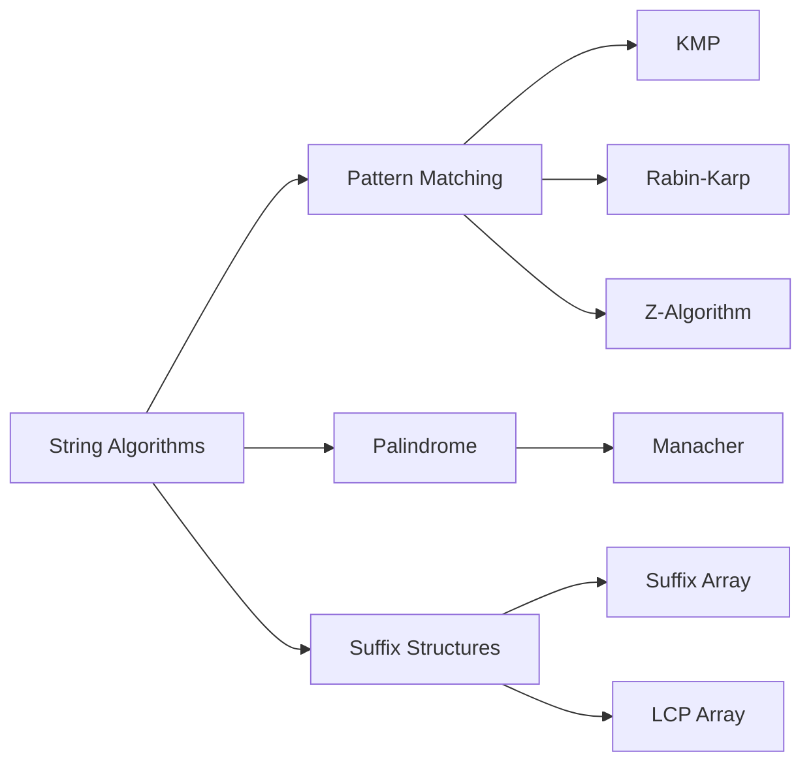

# Chapter 14: String Algorithms

> **Prerequisites:** [Chapter 13: Network Flow](./13-graph-flow.md) — Algorithm design techniques, complexity analysis | **Next:** [Chapter 15: NP-Completeness](./15-np-completeness.md) — From efficient algorithms to hardness theory

## Learning Objectives

By the end of this chapter, students will be able to:

1. Implement and analyze KMP, Rabin-Karp, and Z-algorithm for pattern matching.
2. Use Manacher's algorithm to find all palindromic substrings in linear time.
3. Construct a suffix array and LCP array in \( O(n \log n) \) time.
4. Apply suffix arrays to solve substring queries, pattern matching, and string analysis.

---

### Chapter at a Glance

| Topic | Key Insight | Practical Takeaway |
|-------|-------------|-------------------|
| KMP | Prefix function avoids re-scanning | O(n+m) linear time pattern matching |
| Rabin-Karp | Rolling hash comparison | O(n+m) average; hash collisions can break worst case |
| Z-Algorithm | Z-array for pattern matching | Simpler than KMP for some variants |
| Manacher's Algorithm | Mirror property of palindromes | O(n) to find all palindromes; trickier to implement |
| Suffix Array | Sorted suffixes via doubling + radix | O(n log n) build; O(m log n) pattern search |
| LCP Array | Longest common prefix between adjacent suffixes | Enables O(m + log n) pattern matching |

### Chapter Roadmap



## Theory


### 14.1 Knuth-Morris-Pratt (KMP) Algorithm

**Problem:** Find all occurrences of a pattern \( P \) (length \( m \)) in a text \( T \) (length \( n \)).

**Key insight:** Build a failure function (prefix function) for the pattern. When a mismatch occurs, use the failure function to shift the pattern by the maximum safe amount without re-examining already-matched characters.

**Prefix function:** \( \pi[i] \) = the length of the longest proper prefix of \( P[0..i] \) that is also a suffix.

```
ComputePrefix(P):
    pi[0] = 0
    k = 0
    for i = 1 to m-1:
        while k > 0 and P[k] != P[i]:
            k = pi[k-1]
        if P[k] == P[i]:
            k++
        pi[i] = k
    return pi
```

```
KMP(T, P):
    pi = ComputePrefix(P)
    j = 0
    for i = 0 to n-1:
        while j > 0 and T[i] != P[j]:
            j = pi[j-1]
        if T[i] == P[j]:
            j++
        if j == m:
            report match at i - m + 1
            j = pi[j-1]
```

**Complexity:** \( O(n + m) \) time, \( O(m) \) space.

> **Pro Tip:** KMP's prefix function (pi array) encodes the "border" of each prefix — the longest proper prefix that is also a suffix. This is the key to O(n+m) performance because it never backtracks in the text.
>
> **Remember:** The prefix function is computed on the pattern alone before matching begins. The matching phase runs in O(n) time by always advancing the text pointer.

**One-Sentence Takeaway:** KMP achieves O(n+m) pattern matching by computing a prefix function on the pattern that encodes how far to shift on mismatch without re-examining matched text.

### 14.2 Rabin-Karp Algorithm

**Key insight:** Use hashing. Compute the hash of the pattern and hash of each sliding window of the text. Only compare character-by-character when hashes match (to handle collisions).

```
RabinKarp(T, P):
    m = len(P), n = len(T)
    hp = hash(P)
    ht = hash(T[0..m-1])
    for i = 0 to n-m:
        if ht == hp and T[i..i+m-1] == P:
            report match at i
        if i < n-m:
            update ht to hash of T[i+1..i+m]
```

**Rolling hash:** Compute \( h(s) = (s[0] \cdot d^{m-1} + s[1] \cdot d^{m-2} + \cdots + s[m-1]) \bmod q \). Update: \( h_{\text{new}} = (d(h_{\text{old}} - s[i] \cdot d^{m-1}) + s[i+m]) \bmod q \).

**Complexity:** Expected \( O(n + m) \), worst-case \( O(nm) \) (many hash collisions).

> **Pro Tip:** Use a large prime modulus (e.g., 10^9+7) and a random base to minimize hash collisions. Double hashing or a rolling checksum eliminates worst-case collisions entirely.
>
> **Warning:** The worst-case O(nm) occurs when all window hashes collide with the pattern hash. Always do a character-by-character verification when hashes match.

**One-Sentence Takeaway:** Rabin-Karp uses rolling hash for O(n+m) expected-time pattern matching with worst-case O(nm) when hash collisions are frequent.

### 14.3 Z-Algorithm

**Z-array:** \( Z[i] \) is the length of the longest substring starting at \( i \) that is also a prefix of the string.

```
ComputeZ(S):
    n = len(S)
    Z[0] = 0
    l = 0, r = 0
    for i = 1 to n-1:
        if i <= r:
            Z[i] = min(r - i + 1, Z[i - l])
        while i + Z[i] < n and S[Z[i]] == S[i + Z[i]]:
            Z[i]++
        if i + Z[i] - 1 > r:
            l = i
            r = i + Z[i] - 1
    return Z
```

**Pattern matching with Z:** Concatenate \( P + \text{special char} + T \), compute Z-array. Whenever \( Z[i] = m \), a match is found at position \( i - m - 1 \) in the original text.

**Complexity:** \( O(n) \).

> **Pro Tip:** The Z-algorithm is simpler to implement than KMP for pattern matching — just concatenate P + "$" + T, compute the Z-array, and look for Z[i] = len(P). The separator character must not appear in either string.
>
> **Remember:** The Z-algorithm's linear time comes from maintaining the [l, r] interval of the rightmost matching prefix — it never recomputes matches inside this window.

**One-Sentence Takeaway:** The Z-algorithm computes the longest prefix match at each position in O(n) by maintaining the rightmost matching window [l, r].

### 14.4 Manacher's Algorithm

**Problem:** Find all palindromic substrings in linear time.

**Key insight:** Use symmetry to avoid recomputation. Maintain the center and right boundary of the current rightmost palindrome.

```
Manacher(S):
    T = preprocess(S) with boundaries: "^#" + join(S, "#") + "$"
    P = array of size |T|, initialized to 0
    C = 0, R = 0
    for i = 1 to |T|-1:
        if i < R:
            P[i] = min(R - i, P[2*C - i])
        while T[i + P[i] + 1] == T[i - P[i] - 1]:
            P[i]++
        if i + P[i] > R:
            C = i
            R = i + P[i]
    // P[i] is the radius of palindrome centered at i
    return P
```

**Complexity:** \( O(n) \).

### 14.5 Suffix Array

**Definition 14.1.** A **suffix array** of a string \( S \) is an array of starting positions of all suffixes of \( S \) sorted lexicographically.

**Construction (prefix-doubling):**

```
BuildSuffixArray(S):
    n = len(S)
    sa = indices 0..n-1
    rank = S[i] (integer)
    k = 1
    while k < n:
        sort sa by (rank[i], rank[i+k])
        newRank[sa[0]] = 0
        for i = 1 to n-1:
            newRank[sa[i]] = newRank[sa[i-1]]
            if (rank[sa[i]], rank[sa[i]+k]) != (rank[sa[i-1]], rank[sa[i-1]+k]):
                newRank[sa[i]]++
        rank = newRank
        k *= 2
    return sa
```

**Complexity:** \( O(n \log n) \) time, \( O(n) \) space.

### 14.6 LCP Array

**Definition 14.2.** The **LCP array** stores the length of the longest common prefix between consecutive suffixes in the suffix array.

**Kasai's algorithm:**
```
BuildLCP(S, sa):
    n = len(S)
    rank[sa[i]] = i
    lcp = array of size n-1
    h = 0
    for i = 0 to n-1:
        if rank[i] > 0:
            j = sa[rank[i] - 1]
            while S[i+h] == S[j+h]: h++
            lcp[rank[i] - 1] = h
            if h > 0: h--
    return lcp
```

**Complexity:** \( O(n) \).

**Applications of suffix array + LCP:**
- Longest repeated substring: maximum LCP value.
- Number of distinct substrings: \( n(n+1)/2 - \sum \text{LCP}[i] \).
- Pattern matching: binary search on suffix array in \( O(m \log n) \).

---

## Examples

### Example 14.1: KMP in C++

```cpp
#include <vector>
#include <string>

std::vector<int> computePrefix(const std::string& P) {
    int m = static_cast<int>(P.size());
    std::vector<int> pi(m, 0);
    for (int i = 1, k = 0; i < m; ++i) {
        while (k > 0 && P[k] != P[i]) k = pi[k - 1];
        if (P[k] == P[i]) ++k;
        pi[i] = k;
    }
    return pi;
}

std::vector<int> kmp(const std::string& T, const std::string& P) {
    std::vector<int> matches;
    auto pi = computePrefix(P);
    int n = static_cast<int>(T.size());
    int m = static_cast<int>(P.size());
    for (int i = 0, j = 0; i < n; ++i) {
        while (j > 0 && T[i] != P[j]) j = pi[j - 1];
        if (T[i] == P[j]) ++j;
        if (j == m) {
            matches.push_back(i - m + 1);
            j = pi[j - 1];
        }
    }
    return matches;
}
```

**Walkthrough:** T = "ABABDABACDABABCABAB", P = "ABABCABAB". Compute pi = [0,0,1,2,0,1,2,3,4]. Matches at position 10.

### Example 14.2: Manacher's Algorithm

```cpp
#include <vector>
#include <string>
#include <algorithm>

std::vector<int> manacher(const std::string& S) {
    std::string T = "^#";
    for (char c : S) { T += c; T += '#'; }
    T += '$';
    int n = static_cast<int>(T.size());
    std::vector<int> P(n, 0);
    int C = 0, R = 0;
    for (int i = 1; i < n - 1; ++i) {
        if (i < R) P[i] = std::min(R - i, P[2 * C - i]);
        while (T[i + P[i] + 1] == T[i - P[i] - 1]) ++P[i];
        if (i + P[i] > R) { C = i; R = i + P[i]; }
    }
    return P; // P[i] is the palindrome radius at center i
}
```

---

### Concept Comparison Table

| Algorithm | Core Idea | Time | Space | Key Feature |
|-----------|-----------|------|-------|-------------|
| KMP | Prefix function (borders) | O(n+m) | O(m) | No backtracking in text |
| Rabin-Karp | Rolling hash | O(n+m) exp | O(1) | Multiple pattern search |
| Z-Algorithm | Z-array window [l,r] | O(n) | O(n) | Simpler than KMP |
| Manacher | Palindrome symmetry | O(n) | O(n) | All palindromes |
| Suffix Array | Doubling + sort ranks | O(n log n) | O(n) | Versatile string queries |
| LCP Array | Kasai's linear algorithm | O(n) | O(n) | Enables substring queries |

### Quick Reference

| Category | Key Points |
|----------|------------|
| **KMP** | Prefix function avoids rematching; O(n+m) |
| **Rabin-Karp** | Rolling hash with modulo; hash collision degrades to O(nm) |
| **Z-Algorithm** | Linear via [l,r] interval; concat P + $ + T for matching |
| **Manacher** | Symmetry reduces redundant expansion; use # separators |
| **Suffix Array** | Prefix-doubling O(n log n); use LCP for full power |
| **Key Application** | LCP → longest repeated substring, distinct substrings |

### Cross-Application Matrix

| Algorithm | DSA Interviews | Competitive Programming | System Design | Real-World |
|-----------|---------------|----------------------|---------------|------------|
| KMP | Common | String matching | N/A | Word processors |
| Rabin-Karp | Common | Multiple pattern search | Plagiarism detection | Search engines |
| Z-Algorithm | Occasionally | Simpler KMP alternative | N/A | Bioinformatics |
| Manacher | Occasionally | Palindrome problems | N/A | NLP |
| Suffix Array | Advanced | Core technique | Genome indexing | Bioinformatics |

---

## Summary

| Algorithm | Problem | Time | Space |
|-----------|---------|------|-------|
| KMP | Pattern matching | \( O(n+m) \) | \( O(m) \) |
| Rabin-Karp | Pattern matching (with hashing) | Expected \( O(n+m) \) | \( O(1) \) |
| Z-algorithm | Pattern matching | \( O(n) \) | \( O(n) \) |
| Manacher | Palindromic substrings | \( O(n) \) | \( O(n) \) |
| Suffix array | All suffix queries | \( O(n\log n) \) | \( O(n) \) |
| LCP array | Suffix queries | \( O(n) \) | \( O(n) \) |

---

## Exercises

### Review Questions

### Chapter Quiz

**Q1.** What is the key idea behind KMP's linear time guarantee?

- A) Rolling hash
- B) The prefix function that avoids re-examining matched characters
- C) Using binary search on the pattern
- D) Preprocessing the text instead of the pattern

<details>
<summary>Answer</summary>
B) The prefix function (pi) encodes borders — when a mismatch occurs, we shift by the border length without going back in the text.
</details>

**Q2.** What is the worst-case time complexity of naive Rabin-Karp?

- A) O(n+m)
- B) O(nm)
- C) O(n²)
- D) O(n log n)

<details>
<summary>Answer</summary>
B) O(nm) when many hash collisions force full character-by-character comparison.
</details>

**Q3.** What application does the LCP array enable that the suffix array alone cannot?

- A) Lexicographic sorting
- B) Longest common prefix queries between any two suffixes
- C) Pattern matching
- D) Finding the longest suffix

<details>
<summary>Answer</summary>
B) The LCP array enables O(1) longest common prefix queries between consecutive sorted suffixes, which unlocks distinct substrings counting and substring search.
</details>

### Review Questions

1. Explain the purpose of the prefix function in KMP.
2. How does Rabin-Karp handle hash collisions?
3. What is the relationship between the Z-array and the prefix function?

### Application Problems

4. Implement the Z-algorithm and use it for pattern matching.
5. Compute the number of distinct substrings of "BANANA" using the suffix array and LCP array.
6. Implement suffix array construction for a string of length 1000.
7. Find the longest palindrome in "babad" using Manacher's algorithm.

### Challenge Problem

8. Design an algorithm to find the **longest common substring** of two strings in \( O(n + m) \) time. Hint: concatenate the strings and use the suffix array + LCP array.
