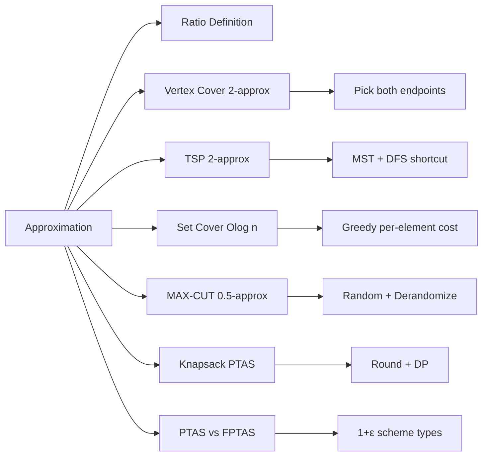

# Chapter 16: Approximation Algorithms

> **Prerequisites:** [Chapter 15: NP-Completeness](./15-np-completeness.md) — Understanding of NP-hard problems and reductions | **Next:** [Chapter 17: Randomized Algorithms](./17-randomized.md) — From deterministic approximation to probabilistic methods

## Learning Objectives

By the end of this chapter, students will be able to:

1. Define approximation ratio and approximation scheme (PTAS, FPTAS).
2. Implement and analyze the 2-approximation for vertex cover.
3. Implement the MST-based 2-approximation for TSP and understand Christofides' improvement.
4. Analyze the greedy set cover algorithm and its O(log n) approximation ratio.
5. Apply the probabilistic method for MAX-CUT approximation.
6. Design and analyze a polynomial-time approximation scheme for Knapsack.

---

## Why Approximation Matters

Imagine you run a delivery company and need to find the shortest route visiting 10,000 cities. The optimal route would save millions in fuel — but finding it is NP-hard. **Is it worth waiting years for the perfect answer, or can you get within 5% of optimal in seconds?** In business, "good enough" often wins. Approximation algorithms capture this trade-off: provably close to optimal, solvable in polynomial time.

**Real-world analogy:** If Google Maps can't compute the absolute shortest route for a 50-stop delivery truck, it computes a route at most 2x longer — in milliseconds. The driver doesn't notice, and the company saves money. That's approximation in action.

---

### Chapter at a Glance

| Topic | Key Insight | Practical Takeaway |
|-------|-------------|-------------------|
| Approximation Ratio | ALG / OPT ≤ c (minimization) | Measures how close an approximation gets to optimal |
| Vertex Cover | Pick both endpoints of uncovered edge | Simple 2-approximation; greedy fails worse |
| TSP (Metric) | MST-based tour + shortcutting | 2-approximation; triangle inequality is essential |
| Set Cover | Pick set with best cost-per-new-element | O(log n)-approximation via greedy |
| MAX-CUT | Random assignment cuts at least half the edges | 0.5-approximation; derandomizable |
| Knapsack PTAS | Round profits, run DP | Achieves (1+ε)-approximation in polynomial time |

### Chapter Roadmap



---

## Theory


### 16.1 Approximation Ratio

<a href="../../../assets/images/diagrams/algorithms/16-approximation/16-1-approximation-ratio-handwritten.svg" target="_blank" rel="noopener">
  
</a>
<a href="../../../assets/images/diagrams/algorithms/16-approximation/16-1-approximation-ratio-diagram.svg" target="_blank" rel="noopener">
  
</a>
<a href="../../../assets/images/diagrams/algorithms/16-approximation/16-1-approximation-ratio-sticky.svg" target="_blank" rel="noopener">
  
</a>


**Definition 16.1.** An algorithm for a minimization problem has an **approximation ratio** \( \rho \) if for every input instance:
\[
\frac{C_{\text{alg}}}{C_{\text{opt}}} \le \rho
\]
where \( C_{\text{alg}} \) is the cost of the algorithm's solution and \( C_{\text{opt}} \) is the cost of the optimal solution.

For maximization problems, the ratio is \( C_{\text{opt}} / C_{\text{alg}} \le \rho \).

**Definition 16.2.** A **polynomial-time approximation scheme (PTAS)** is an algorithm that, for any fixed \( \epsilon > 0 \), achieves an approximation ratio of \( 1 + \epsilon \) in time polynomial in \( n \) (but possibly exponential in \( 1/\epsilon \)).

A **fully polynomial-time approximation scheme (FPTAS)** runs in time polynomial in both \( n \) and \( 1/\epsilon \).

---

### 16.2 Vertex Cover: 2-Approximation

<a href="../../../assets/images/diagrams/algorithms/16-approximation/16-2-vertex-cover-2-approximation-handwritten.svg" target="_blank" rel="noopener">
  
</a>
<a href="../../../assets/images/diagrams/algorithms/16-approximation/16-2-vertex-cover-2-approximation-diagram.svg" target="_blank" rel="noopener">
  
</a>
<a href="../../../assets/images/diagrams/algorithms/16-approximation/16-2-vertex-cover-2-approximation-sticky.svg" target="_blank" rel="noopener">
  
</a>


**Problem:** Find the smallest set of vertices that covers all edges.

**Real-world analogy:** A city needs security cameras to monitor every street intersection (edge). Each camera covers one intersection (vertex). Two cameras are needed per street — one at each endpoint. The city wants to minimize cameras while covering every street. Since finding the true minimum is NP-hard, they accept a solution with at most 2x the optimal number.

**Algorithm Steps:**
1. Initialize an empty cover set \( C \).
2. While there are uncovered edges in \( E \):
   a. Pick any remaining edge \( (u, v) \) from \( E \).
   b. Add both \( u \) and \( v \) to \( C \).
   c. Remove all edges incident to \( u \) or \( v \) from \( E \).
3. Return \( C \).

**Pseudocode:**
```
ApproxVertexCover(G(V, E)):
    C ← ∅
    while E ≠ ∅:
        pick any (u, v) ∈ E
        C ← C ∪ {u, v}
        remove all edges incident to u or v from E
    return C
```

**Step-by-Step Dry Run:**

Graph: 4 vertices, edges: (1-2, 2-3, 3-4, 1-4, 2-4)

| Step | Remaining Edges | Pick Edge | Cover Set C | Removed |
|------|-----------------|-----------|-------------|---------|
| 1 | (1-2, 2-3, 3-4, 1-4, 2-4) | (1-2) | {1, 2} | (1-2), (1-4), (2-3), (2-4) removed |
| 2 | (3-4) | (3-4) | {1, 2, 3, 4} | (3-4) removed |
| 3 | ∅ | — | {1, 2, 3, 4} | Done |

Result: Cover size = 4. Optimal cover = {2, 4} (size 2). Ratio = 4/2 = 2.

---

**Theorem 16.1.** The maximal-matching algorithm is a 2-approximation for minimum vertex cover.

**Proof.** Let \( M \) be the set of edges selected by the algorithm. These edges form a matching (no two share a vertex). Every vertex cover must include at least one endpoint of each edge in \( M \), so any optimal cover has size \( |C_{\text{opt}}| \ge |M| \). The algorithm selects \( 2|M| \) vertices (both endpoints of each matched edge), so \( |C_{\text{alg}}| = 2|M| \le 2|C_{\text{opt}}| \). Hence the ratio is at most 2.

**Complexity Analysis:**
- **Time:** \( O(V + E) \) — each edge examined at most once; removing incident edges can be done with adjacency tracking.
- **Space:** \( O(V) \) for the cover set and removed flags.

---

**Implementations:**

**C++:**
```cpp
#include <vector>
#include <unordered_set>

std::vector<int> approxVertexCover(int n, std::vector<std::pair<int,int>> edges) {
    std::vector<bool> removed(n, false);
    std::vector<int> cover;
    for (auto& [u, v] : edges) {
        if (!removed[u] && !removed[v]) {
            cover.push_back(u);
            cover.push_back(v);
            removed[u] = true;
            removed[v] = true;
        }
    }
    return cover;
}
```

**Python:**
```python
def approx_vertex_cover(n, edges):
    removed = [False] * n
    cover = []
    for u, v in edges:
        if not removed[u] and not removed[v]:
            cover.extend([u, v])
            removed[u] = removed[v] = True
    return cover
```

**Java:**
```java
import java.util.*;

List<Integer> approxVertexCover(int n, int[][] edges) {
    boolean[] removed = new boolean[n];
    List<Integer> cover = new ArrayList<>();
    for (int[] e : edges) {
        int u = e[0], v = e[1];
        if (!removed[u] && !removed[v]) {
            cover.add(u); cover.add(v);
            removed[u] = removed[v] = true;
        }
    }
    return cover;
}
```

**Advantages & Disadvantages:**

| Advantages | Disadvantages |
|------------|--------------|
| Simple to implement; only requires edge list | May select twice as many vertices as optimal |
| Runs in O(V+E) linear time | Order-dependent; different edge orderings can give different covers |
| Provably optimal in the sense that (2−ε)-approximation is NP-hard | Does not exploit degree information |
| Works on any undirected graph | Not suitable for weighted vertex cover |

**Edge Cases:**
- **Disconnected graph:** Works correctly; each component handled independently.
- **Single vertex, no edges:** Returns empty cover (correct).
- **Complete graph K<sub>n&lt;/sub&gt;:** Picks a single edge, adds 2 vertices, removes all edges. Cover size = 2, optimal = n−1. Ratio improves as n grows.

> **Pro Tip:** The elegant proof: the selected edges form a matching, so any vertex cover must include at least one endpoint per edge. The algorithm picks both — hence at most 2x optimal.
>
> **Remember:** The greedy algorithm that picks the highest-degree vertex has a worse approximation ratio (O(log n)). The matching-based approach is simpler and better.

**One-Sentence Takeaway:** The maximal-matching algorithm achieves a 2-approximation for vertex cover by selecting both endpoints of each matched edge — a canonical example of a pairing argument.

---

### 16.3 Traveling Salesman: 2-Approximation

<a href="../../../assets/images/diagrams/algorithms/16-approximation/16-3-traveling-salesman-2-approximation-handwritten.svg" target="_blank" rel="noopener">
  
</a>
<a href="../../../assets/images/diagrams/algorithms/16-approximation/16-3-traveling-salesman-2-approximation-diagram.svg" target="_blank" rel="noopener">
  
</a>
<a href="../../../assets/images/diagrams/algorithms/16-approximation/16-3-traveling-salesman-2-approximation-sticky.svg" target="_blank" rel="noopener">
  
</a>


**Problem (Metric TSP):** Given a complete graph with edge weights satisfying the triangle inequality, find the shortest tour visiting each vertex exactly once and returning to the start.

**Real-world analogy:** A courier needs to deliver packages to 15 locations and return to the warehouse. The triangle inequality holds (driving directly is always shorter than taking a detour). Computing the optimal route is NP-hard, but a route at most 2x the optimal can be computed in seconds using MST.

**Algorithm Steps:**
1. Compute the Minimum Spanning Tree (MST) of the graph using Prim's or Kruskal's.
2. Perform a DFS pre-order walk of the MST to obtain a list of visited vertices.
3. Append the starting vertex to form a cycle.
4. Return the total cost of the resulting tour.

**Pseudocode:**
```
ApproxTSP(G):
    T ← MST(G)
    order ← preorder_walk(T)
    tour ← order + [order[0]]
    return tour
```

**Step-by-Step Dry Run:**

Points on a plane: A(0,0), B(1,2), C(4,0), D(3,3). Distances: AB=2.24, AC=4, AD=4.24, BC=3.61, BD=2.24, CD=3.16.

| Step | Operation | Result |
|------|-----------|--------|
| 1 | Compute MST (Prim's from A) | Edges: A-B, B-D, C-D |
| 2 | MST structure | A--B--D--C |
| 3 | Pre-order DFS from A | [A, B, D, C] |
| 4 | Form cycle | [A, B, D, C, A] |
| 5 | Compute cost | 2.24 + 2.24 + 3.16 + 4 = 11.64 |

Optimal tour: A-B-D-C-A (same), cost 11.64. Ratio = 1.

For a worse case: optimal might be A-C-B-D-A, but shortcutting preserves the bound.

**Theorem 16.2.** The MST-based algorithm is a 2-approximation for metric TSP.

**Proof.** Let \( c(T) \) be the MST cost. The optimal tour \( C_{\text{opt}} \) has cost at least \( c(T) \) — removing any edge from the tour leaves a spanning tree, so OPT ≥ MST cost. A depth-first walk of the MST traverses each edge twice, giving cost \( 2c(T) \). Using the triangle inequality, shortcutting repeated vertices does not increase the cost. Thus \( c(C_{\text{alg}}) \le 2c(T) \le 2c(C_{\text{opt}}) \).

**Christofides' algorithm** improves this to a 1.5-approximation by combining an MST with a minimum-weight perfect matching on odd-degree vertices.

**Complexity Analysis:**
- **Time:** \( O(V^2) \) with Prim's adjacency matrix, or \( O(E \log V) \) with binary heap.
- **Space:** \( O(V^2) \) for the distance matrix, \( O(V) \) for MST and tour.

**Implementations:**

**C++:**
```cpp
#include <vector>
#include <algorithm>
#include <functional>

double approxTSP(const std::vector<std::vector<double>>& dist) {
    int n = static_cast<int>(dist.size());
    std::vector<double> key(n, 1e18);
    std::vector<int> parent(n, -1);
    std::vector<bool> inMST(n, false);
    key[0] = 0;
    for (int i = 0; i < n; ++i) {
        int u = -1;
        for (int v = 0; v < n; ++v)
            if (!inMST[v] && (u == -1 || key[v] < key[u]))
                u = v;
        inMST[u] = true;
        for (int v = 0; v < n; ++v)
            if (!inMST[v] && dist[u][v] < key[v]) {
                key[v] = dist[u][v];
                parent[v] = u;
            }
    }
    std::vector<std::vector<int>> mst(n);
    for (int v = 1; v < n; ++v) {
        mst[v].push_back(parent[v]);
        mst[parent[v]].push_back(v);
    }
    std::vector<int> tour;
    std::function<void(int,int)> dfs = [&](int u, int p) {
        tour.push_back(u);
        for (int v : mst[u])
            if (v != p) dfs(v, u);
    };
    dfs(0, -1);
    tour.push_back(tour[0]);
    double totalDist = 0;
    for (size_t i = 0; i + 1 < tour.size(); ++i)
        totalDist += dist[tour[i]][tour[i+1]];
    return totalDist;
}
```

**Python:**
```python
def approx_tsp(dist):
    n = len(dist)
    key = [float('inf')] * n
    parent = [-1] * n
    in_mst = [False] * n
    key[0] = 0
    for _ in range(n):
        u = min((v for v in range(n) if not in_mst[v]), key=lambda v: key[v])
        in_mst[u] = True
        for v in range(n):
            if not in_mst[v] and dist[u][v] < key[v]:
                key[v] = dist[u][v]
                parent[v] = u
    mst = [[] for _ in range(n)]
    for v in range(1, n):
        mst[v].append(parent[v])
        mst[parent[v]].append(v)
    tour = []
    def dfs(u, p):
        tour.append(u)
        for v in mst[u]:
            if v != p: dfs(v, u)
    dfs(0, -1)
    tour.append(tour[0])
    return sum(dist[tour[i]][tour[i+1]] for i in range(len(tour)-1))
```

**Java:**
```java
double approxTSP(double[][] dist) {
    int n = dist.length;
    double[] key = new double[n];
    int[] parent = new int[n];
    boolean[] inMST = new boolean[n];
    Arrays.fill(key, Double.MAX_VALUE);
    key[0] = 0;
    for (int i = 0; i < n; i++) {
        int u = -1;
        for (int v = 0; v < n; v++)
            if (!inMST[v] && (u == -1 || key[v] < key[u])) u = v;
        inMST[u] = true;
        for (int v = 0; v < n; v++)
            if (!inMST[v] && dist[u][v] < key[v]) { key[v] = dist[u][v]; parent[v] = u; }
    }
    List<Integer>[] mst = new ArrayList[n];
    for (int i = 0; i < n; i++) mst[i] = new ArrayList<>();
    for (int v = 1; v < n; v++) { mst[v].add(parent[v]); mst[parent[v]].add(v); }
    List<Integer> tour = new ArrayList<>();
    dfs(0, -1, mst, tour);
    tour.add(tour.get(0));
    double total = 0;
    for (int i = 0; i + 1 < tour.size(); i++)
        total += dist[tour.get(i)][tour.get(i+1)];
    return total;
}
void dfs(int u, int p, List<Integer>[] mst, List<Integer> tour) {
    tour.add(u);
    for (int v : mst[u]) if (v != p) dfs(v, p, mst, tour);
}
```

**Advantages & Disadvantages:**

| Advantages | Disadvantages |
|------------|--------------|
| Simple: MST + DFS are standard textbook algorithms | Requires triangle inequality; fails on general graphs |
| 2-approximation guarantee is easy to prove | Christofides gives 1.5-approx with similar ideas |
| Runs in O(V²) time, practical up to thousands of nodes | Not suitable for asymmetric TSP |
| Forms the foundation for Christofides' improvement | May produce tours with self-intersections in Euclidean space |

**Edge Cases:**
- **Two cities:** MST has 1 edge; DFS tour is [0,1,0]; correct.
- **Collinear points:** Works; shortcutting may skip intermediate stops.
- **Complete graph with uniform distances:** Returns any permutation tour; all tours equal cost.

> **Pro Tip:** For Euclidean TSP in the plane, there exists a PTAS (Arora 1998) that achieves (1+ε)-approximation using divide-and-conquer with dynamic programming.
>
> **Warning:** The 2-approximation does NOT work for general TSP (without triangle inequality). In general TSP, no polynomial-time constant-factor approximation exists unless P = NP.

---

### 16.4 Set Cover

<a href="../../../assets/images/diagrams/algorithms/16-approximation/16-4-set-cover-handwritten.svg" target="_blank" rel="noopener">
  
</a>
<a href="../../../assets/images/diagrams/algorithms/16-approximation/16-4-set-cover-diagram.svg" target="_blank" rel="noopener">
  
</a>
<a href="../../../assets/images/diagrams/algorithms/16-approximation/16-4-set-cover-sticky.svg" target="_blank" rel="noopener">
  
</a>


**Problem:** Given a universe \( U \) of \( n \) elements and a collection of subsets \( S_1, \ldots, S_m \) with costs, find the minimum-cost collection that covers all elements.

**Real-world analogy:** A hospital needs to stock medicines to cover all possible symptoms. Each medicine treats a specific set of symptoms and has a cost. The hospital wants the cheapest combination that covers all symptoms. Finding the optimal set is NP-hard, but a greedy approach gets within a logarithmic factor of optimal.

**Algorithm Steps:**
1. Initialize `uncovered` = all elements, `cover` = empty set.
2. While `uncovered` is not empty:
   a. Find the subset \( S_i \) that minimizes cost(\( S_i \)) / |\( S_i \) ∩ uncovered| (cost per new element).
   b. Add \( S_i \) to the cover.
   c. Remove all elements of \( S_i \) from `uncovered`.
3. Return the cover.

**Pseudocode:**
```
GreedySetCover(U, S):
    uncovered ← U
    cover ← ∅
    while uncovered ≠ ∅:
        pick S_i minimizing cost(S_i) / |S_i ∩ uncovered|
        cover ← cover ∪ {S_i}
        uncovered ← uncovered \ S_i
    return cover
```

**Step-by-Step Dry Run:**

Universe: {1, 2, 3, 4, 5}. Subsets: S1={1,2,3} cost=3, S2={2,4} cost=2, S3={3,4} cost=4, S4={4,5} cost=1.

| Step | Uncovered | Cost/New Ratios | Pick | Updated Uncovered | Total Cost |
|------|-----------|-----------------|------|-------------------|------------|
| 1 | {1,2,3,4,5} | S1=3/3=1, S2=2/2=1, S3=4/2=2, S4=1/2=0.5 | S4 | {1,2,3} | 1 |
| 2 | {1,2,3} | S1=3/3=1, S2=2/1=2, S3=4/1=4 | S1 | {} | 4 |

Cover = {S4, S1}, total cost = 4. Optimal cover = {S2, S4} cost = 3. Ratio = 4/3 ≈ 1.33.

---

**Theorem 16.3.** The greedy set cover algorithm achieves an approximation ratio of \( H_n = \sum_{i=1}^n 1/i \approx \ln n + \gamma \).

**Proof.** When the optimal cover has cost \( C_{\text{opt}} \), at any step there must exist a set with cost per uncovered element at most \( C_{\text{opt}} / |\text{uncovered}| \). The greedy algorithm picks at least this efficiently. Summing the harmonic series gives the bound. Formal proof: assign each element a "price" equal to the cost-per-new-element of the set that covers it. The total cost of the greedy is the sum of these prices. Since OPT ≤ C_opt, each element's price is bounded by C_opt / (remaining elements at that stage). Summing over elements yields C_opt · H_n.

**Tightness:** There exist instances where the greedy algorithm achieves exactly \( \ln n \) approximation.

**Complexity Analysis:**
- **Time:** \( O(m \cdot n) \) per iteration, \( O(mn^2) \) worst case. With efficient data structures (bucket queues), \( O(m \log m + n) \).
- **Space:** \( O(n + m) \) for covered flags and subset references.

**Implementations:**

**C++:**
```cpp
#include <vector>
#include <unordered_set>
#include <algorithm>

double greedySetCover(const std::vector<std::unordered_set<int>>& subsets,
                      const std::vector<double>& costs, int universeSize) {
    std::vector<bool> covered(universeSize, false);
    int remaining = universeSize;
    double totalCost = 0;
    std::vector<bool> used(subsets.size(), false);
    while (remaining > 0) {
        int bestIdx = -1;
        double bestRatio = 1e18;
        for (size_t i = 0; i < subsets.size(); ++i) {
            if (used[i]) continue;
            int newCovers = 0;
            for (int elem : subsets[i])
                if (!covered[elem]) ++newCovers;
            if (newCovers == 0) continue;
            double ratio = costs[i] / newCovers;
            if (ratio < bestRatio) { bestRatio = ratio; bestIdx = i; }
        }
        if (bestIdx == -1) break;
        used[bestIdx] = true;
        totalCost += costs[bestIdx];
        for (int elem : subsets[bestIdx])
            if (!covered[elem]) { covered[elem] = true; --remaining; }
    }
    return totalCost;
}
```

**Python:**
```python
def greedy_set_cover(subsets, costs, universe_size):
    covered = [False] * universe_size
    remaining = universe_size
    total_cost = 0
    used = [False] * len(subsets)
    while remaining > 0:
        best_idx = -1
        best_ratio = float('inf')
        for i, s in enumerate(subsets):
            if used[i]: continue
            new_covers = sum(1 for e in s if not covered[e])
            if new_covers == 0: continue
            ratio = costs[i] / new_covers
            if ratio < best_ratio:
                best_ratio = ratio
                best_idx = i
        if best_idx == -1: break
        used[best_idx] = True
        total_cost += costs[best_idx]
        for e in subsets[best_idx]:
            if not covered[e]:
                covered[e] = True
                remaining -= 1
    return total_cost
```

**Java:**
```java
double greedySetCover(List<Set<Integer>> subsets, double[] costs, int universeSize) {
    boolean[] covered = new boolean[universeSize];
    int remaining = universeSize;
    double totalCost = 0;
    boolean[] used = new boolean[subsets.size()];
    while (remaining > 0) {
        int bestIdx = -1;
        double bestRatio = Double.MAX_VALUE;
        for (int i = 0; i < subsets.size(); i++) {
            if (used[i]) continue;
            int newCovers = 0;
            for (int e : subsets.get(i))
                if (!covered[e]) newCovers++;
            if (newCovers == 0) continue;
            double ratio = costs[i] / newCovers;
            if (ratio < bestRatio) { bestRatio = ratio; bestIdx = i; }
        }
        if (bestIdx == -1) break;
        used[bestIdx] = true;
        totalCost += costs[bestIdx];
        for (int e : subsets.get(bestIdx))
            if (!covered[e]) { covered[e] = true; remaining--; }
    }
    return totalCost;
}
```

**Advantages & Disadvantages:**

| Advantages | Disadvantages |
|------------|--------------|
| Simple greedy rule; easy to implement | O(log n) ratio is suboptimal for small instances |
| Approximation ratio matches theoretical lower bound (unless P=NP) | Can pick many costly subsets if early choices are poor |
| Handles weighted subsets naturally | No constant-factor guarantee |
| Works for any finite universe | Worst-case ratio only reached on contrived instances |

**Edge Cases:**
- **Single set covers everything:** Algorithm picks it in one step; optimal.
- **No subset covers a particular element:** Loop breaks early; partial cover returned.
- **All subsets disjoint:** Ratio can be arbitrarily bad (each new set covers exactly what's needed).

---

### 16.5 MAX-CUT

<a href="../../../assets/images/diagrams/algorithms/16-approximation/16-5-max-cut-handwritten.svg" target="_blank" rel="noopener">
  
</a>
<a href="../../../assets/images/diagrams/algorithms/16-approximation/16-5-max-cut-diagram.svg" target="_blank" rel="noopener">
  
</a>
<a href="../../../assets/images/diagrams/algorithms/16-approximation/16-5-max-cut-sticky.svg" target="_blank" rel="noopener">
  
</a>


**Problem:** Given an undirected graph, partition the vertices into two sets such that the number of edges crossing between the sets is maximized.

**Real-world analogy:** A social network wants to split users into two test groups for an A/B test such that as many friend connections as possible are between the two groups (to measure cross-group influence). Random assignment works surprisingly well — at least half the edges always cross the cut in expectation.

**Algorithm Steps:**
1. Randomly assign each vertex to set A or B with probability 1/2.
2. Count the number of edges with endpoints in different sets.
3. (Optional) Derandomize using conditional expectations.

**Pseudocode:**
```
RandomMAXCUT(G):
    for each vertex v:
        assign v to set A or B uniformly at random
    count = number of edges crossing between A and B
    return count
```

**Step-by-Step Dry Run:**

Graph: Triangle A-B-C with all 3 edges.

| Trial | A Set | B Set | Crossing Edges | Count |
|-------|-------|-------|----------------|-------|
| 1 | {A} | {B, C} | A-B, A-C | 2 |
| 2 | {A, C} | {B} | A-B, B-C | 2 |
| 3 | {A, B} | {C} | A-C, B-C | 2 |
| 4 | {A, B, C} | {} | none | 0 |

Expected value = (2+2+2+0)/4 = 1.5. Optimal cut = 2. Expected ratio = 0.75.

---

**Theorem 16.4.** The random assignment algorithm achieves an expected 0.5-approximation for MAX-CUT.

**Proof.** For each edge (u,v), the probability that u and v are in different sets is 1/2. By linearity of expectation, the expected number of crossing edges = m/2, where m is the total number of edges. The maximum possible cut is at most m, so E[ALG] ≥ m/2 ≥ OPT/2. Thus the expected approximation ratio is at least 1/2.

**Derandomization using the method of conditional expectations:** Process vertices one at a time. When assigning vertex v, compute the conditional expectation of crossing edges for each choice (A or B), given the assignments so far. Choose the option with higher conditional expectation. This guarantees at least m/2 crossing edges deterministically.

**Complexity Analysis:**
- **Time:** \( O(V + E) \) — one pass to assign, one pass to count.
- **Space:** \( O(V) \) for the assignment array.

**Implementations:**

**C++:**
```cpp
#include <vector>
#include <cstdlib>

int randomMAXCUT(int n, const std::vector<std::pair<int,int>>& edges) {
    std::vector<bool> side(n);
    for (int i = 0; i < n; i++)
        side[i] = rand() % 2;
    int cutSize = 0;
    for (auto& [u, v] : edges)
        if (side[u] != side[v]) cutSize++;
    return cutSize;
}
```

**Python:**
```python
import random

def random_max_cut(n, edges):
    side = [random.randint(0, 1) for _ in range(n)]
    return sum(1 for u, v in edges if side[u] != side[v])
```

**Java:**
```java
import java.util.*;

int randomMAXCUT(int n, int[][] edges) {
    boolean[] side = new boolean[n];
    for (int i = 0; i < n; i++)
        side[i] = Math.random() < 0.5;
    int cut = 0;
    for (int[] e : edges)
        if (side[e[0]] != side[e[1]]) cut++;
    return cut;
}
```

**Advantages & Disadvantages:**

| Advantages | Disadvantages |
|------------|--------------|
| Trivially simple; one line per vertex | Only 0.5-approximation; better algorithms exist (Goemans-Williamson: 0.878) |
| No graph preprocessing needed | Randomization means non-deterministic output |
| Derandomizable without loss of quality | Worst-case ratio (on bipartite graphs) is 1, but on dense graphs can be close to 0.5 |

**Edge Cases:**
- **Empty graph:** Returns 0 (correct).
- **Complete graph K<sub>n&lt;/sub&gt;:** Expected cut = n(n−1)/4. Optimal = floor(n²/4). Ratio → 1 as n → ∞.
- **Bipartite graph:** Optimal cut = all edges. Random achieves m/2 in expectation — ratio = 0.5.

> **Remember:** The Goemans-Williamson algorithm achieves 0.878-approximation using semidefinite programming, but that's beyond the scope of this chapter.

---

### 16.6 Knapsack Approximation Scheme

<a href="../../../assets/images/diagrams/algorithms/16-approximation/16-6-knapsack-approximation-scheme-handwritten.svg" target="_blank" rel="noopener">
  
</a>
<a href="../../../assets/images/diagrams/algorithms/16-approximation/16-6-knapsack-approximation-scheme-diagram.svg" target="_blank" rel="noopener">
  
</a>
<a href="../../../assets/images/diagrams/algorithms/16-approximation/16-6-knapsack-approximation-scheme-sticky.svg" target="_blank" rel="noopener">
  
</a>


**Problem:** Given n items with weights w_i and profits p_i, and a capacity W, select a subset maximizing total profit without exceeding capacity.

**Real-world analogy:** A trucking company must choose which cargo items to load. Computing the optimal selection is NP-hard (subset sum). But a (1+ε)-approximation can be computed quickly by rounding profits to the nearest ε·P_max/n, then running standard DP on the reduced profit space.

**Algorithm Steps (FPTAS via Profit Scaling):**
1. Let \( P_{\max} = \max_i p_i \) and \( \varepsilon > 0 \).
2. Compute scaling factor \( K = \varepsilon \cdot P_{\max} / n \).
3. For each item, define scaled profit \( p'_i = \lfloor p_i / K \rfloor \).
4. Run standard 0/1 Knapsack DP on the scaled profits with a maximum total scaled profit of \( \sum p'_i \):
   - DP[i][v] = minimum weight to achieve scaled profit v using first i items.
5. Find the maximum v such that DP[n][v] ≤ W.
6. Return the corresponding original profit.

**Pseudocode:**
```
ApproxKnapsack(items, W, ε):
    Pmax ← max_i p_i
    K ← ε · Pmax / n
    for each item i:
        p'_i ← floor(p_i / K)
    maxV ← sum p'_i
    dp[0..n][0..maxV] ← ∞
    dp[0][0] ← 0
    for i ← 1 to n:
        for v ← 0 to maxV:
            dp[i][v] ← dp[i-1][v]
            if v ≥ p'_i:
                dp[i][v] ← min(dp[i][v], dp[i-1][v - p'_i] + w_i)
    best ← max v where dp[n][v] ≤ W
    return best · K
```

**Step-by-Step Dry Run:**

Items: (p=100, w=10), (p=60, w=8), (p=40, w=5), (p=20, w=3). W = 15. ε = 0.5.

| Step | Computation | Result |
|------|-------------|--------|
| 1 | P_max = 100 | K = 0.5 × 100 / 4 = 12.5 |
| 2 | Scaled profits | p' = [8, 4, 3, 1] |
| 3 | Run DP on scaled profits | DP array of size [5][17] |
| 4 | Find max v with weight ≤ 15 | v = 12 (items 1,2,3) |
| 5 | Return original profit | Estimated = 12 × 12.5 = 150 |

Original profit = 100 + 60 + 40 = 200. Ratio = 200/200 = 1 (this instance is exact due to scaling alignment).

---

**Theorem 16.5.** The profit-scaling algorithm is a (1+ε)-approximation for 0/1 Knapsack.

**Proof.** Let OPT be the optimal profit. For each item in OPT, the rounding error is at most K per item, so the total error ≤ n·K = ε·P_max ≤ ε·OPT (since P_max ≤ OPT). Thus ALG ≥ OPT − ε·OPT = (1−ε)·OPT. The standard DP runs in O(n²/ε) time, which is polynomial in n and 1/ε.

**Complexity Analysis:**
- **Time:** \( O(n^2 / \varepsilon) \) — DP table size is n × (n·P_max / K) = n × (n²/ε).
- **Space:** \( O(n^2 / \varepsilon) \) — can be reduced to \( O(n / \varepsilon) \) with 1D DP.

**Implementations:**

**C++:**
```cpp
#include <vector>
#include <algorithm>
#include <climits>

double approxKnapsack(const std::vector<int>& profit, const std::vector<int>& weight,
                      int W, double eps) {
    int n = profit.size();
    int Pmax = *max_element(profit.begin(), profit.end());
    double K = eps * Pmax / n;
    std::vector<int> scaled(n);
    for (int i = 0; i < n; i++) scaled[i] = profit[i] / K;
    int maxV = 0;
    for (int s : scaled) maxV += s;
    std::vector<int> dp(maxV + 1, INT_MAX / 2);
    dp[0] = 0;
    for (int i = 0; i < n; i++)
        for (int v = maxV; v >= scaled[i]; v--)
            if (dp[v - scaled[i]] + weight[i] < dp[v])
                dp[v] = dp[v - scaled[i]] + weight[i];
    int bestV = 0;
    for (int v = 0; v <= maxV; v++)
        if (dp[v] <= W) bestV = v;
    return bestV * K;
}
```

**Python:**
```python
def approx_knapsack(profit, weight, W, eps):
    n = len(profit)
    Pmax = max(profit)
    K = eps * Pmax / n
    scaled = [int(p / K) for p in profit]
    maxV = sum(scaled)
    dp = [float('inf')] * (maxV + 1)
    dp[0] = 0
    for i in range(n):
        for v in range(maxV, scaled[i] - 1, -1):
            if dp[v - scaled[i]] + weight[i] < dp[v]:
                dp[v] = dp[v - scaled[i]] + weight[i]
    bestV = max(v for v in range(maxV + 1) if dp[v] <= W)
    return bestV * K
```

**Java:**
```java
double approxKnapsack(int[] profit, int[] weight, int W, double eps) {
    int n = profit.length;
    int Pmax = Arrays.stream(profit).max().getAsInt();
    double K = eps * Pmax / n;
    int[] scaled = new int[n];
    for (int i = 0; i < n; i++) scaled[i] = (int)(profit[i] / K);
    int maxV = Arrays.stream(scaled).sum();
    int[] dp = new int[maxV + 1];
    Arrays.fill(dp, Integer.MAX_VALUE / 2);
    dp[0] = 0;
    for (int i = 0; i < n; i++)
        for (int v = maxV; v >= scaled[i]; v--)
            if (dp[v - scaled[i]] + weight[i] < dp[v])
                dp[v] = dp[v - scaled[i]] + weight[i];
    int bestV = 0;
    for (int v = 0; v <= maxV; v++)
        if (dp[v] <= W) bestV = v;
    return bestV * K;
}
```

**Advantages & Disadvantages:**

| Advantages | Disadvantages |
|------------|--------------|
| Achieves (1+ε)-approximation for any ε > 0 | DP table size grows as O(n²/ε); large ε needed for small instances |
| FPTAS: polynomial in both n and 1/ε | Profit rounding introduces approximation error |
| Builds on standard 0/1 Knapsack DP | Does not extend to other packing problems easily |
| Tunable: smaller ε = better accuracy but slower | Not suitable for fractional or unbounded variants |

**Edge Cases:**
- **ε very small (0.01):** Large DP table; algorithm becomes slow but highly accurate.
- **ε ≥ 1:** K becomes large; approximation guarantee weakens.
- **Single item:** DP finds it directly; optimal.
- **All items fit:** DP returns total profit; optimal.

---

### 16.7 Approximation Scheme Types: PTAS vs FPTAS

<a href="../../../assets/images/diagrams/algorithms/16-approximation/16-7-approximation-scheme-types-ptas-vs-fptas-handwritten.svg" target="_blank" rel="noopener">
  
</a>
<a href="../../../assets/images/diagrams/algorithms/16-approximation/16-7-approximation-scheme-types-ptas-vs-fptas-diagram.svg" target="_blank" rel="noopener">
  
</a>
<a href="../../../assets/images/diagrams/algorithms/16-approximation/16-7-approximation-scheme-types-ptas-vs-fptas-sticky.svg" target="_blank" rel="noopener">
  
</a>


Both PTAS and FPTAS give (1+ε)-approximation, but the running time differs crucially.

| Feature | PTAS | FPTAS |
|---------|------|-------|
| Running Time | \( O(n^{f(1/\varepsilon)}) \) — polynomial in n, arbitrary in \( 1/\varepsilon \) | \( O(n^c \cdot g(1/\varepsilon)) \) — polynomial in both |
| Example | Euclidean TSP PTAS: \( O(n^{O(1/\varepsilon)}) \) | Knapsack FPTAS: \( O(n^2/\varepsilon) \) |
| Practicality | Impractical for small ε (exponent grows) | Practical for moderate ε |
| Existence | Many NP-hard problems have a PTAS | FPTAS requires more structure (Knapsack, Subset Sum) |

**When to use which:**
- **PTAS** is sufficient when ε is fixed in advance (e.g., ε = 0.1 for all deployments). The exponential in 1/ε is a constant factor.
- **FPTAS** is needed when ε is an input parameter that can vary. Without it, the runtime blows up for small ε.

---

## Interview Corner

### How to Design Approximation Algorithms

| Strategy | When to Use | Example |
|----------|-------------|---------|
| **Greedy** | Problem has submodular structure or covering constraints | Set Cover, Vertex Cover |
| **Rounding** | Relax integrality constraints, then round the LP solution | Vertex Cover (LP rounding) |
| **Randomization** | Expectation argument + derandomization | MAX-CUT, MAX-SAT |
| **MST-based** | Graph problems with triangle inequality | Metric TSP |
| **Primal-Dual** | Matching-based combinatorial optimization | Set Cover, Steiner Tree |
| **Dynamic Programming + Scaling** | Problems with numeric parameters | Knapsack FPTAS |

### Lower Bounds on Approximation

| Problem | Best Possible Ratio (unless P = NP) |
|---------|--------------------------------------|
| Vertex Cover | \( 2 - \varepsilon \) (no better constant) |
| Metric TSP | \( 1 + \varepsilon \) (Christofides 1.5 is best known) |
| Set Cover | \( c \log n \) (no constant-factor) |
| MAX-CUT | \( 16/17 \approx 0.941 \) (Goemans-Williamson 0.878 is best known) |
| General TSP | No polynomial-time constant-factor approximation |
| Clique | No \( n^{1-\varepsilon} \)-approximation |

### Key Interview Questions

1. **"Design a 2-approximation for Vertex Cover."** — Start with maximal matching, prove via pairing argument. Mention that (2−ε) is NP-hard.
2. **"Why does TSP need the triangle inequality?"** — Without it, you can't shortcut without increasing cost. General TSP has no constant-factor approximation.
3. **"What is the greedy ratio for Set Cover?"** — O(log n). Construct a tight example with exponentially sized sets.
4. **"How do you derandomize MAX-CUT?"** — Method of conditional expectations: assign vertices one by one, always choosing the side that maximizes the conditional expectation given past assignments.

---

## Applications in Real Systems

| Domain | Problem | Algorithm Used | Why It Works |
|--------|---------|---------------|--------------|
| **Logistics (UPS, FedEx)** | Vehicle routing with 1000+ stops | Christofides 1.5-approx for TSP | Triangle inequality holds for road distances; near-optimal routes save millions in fuel |
| **Cloud Computing (AWS/Azure)** | VM placement minimizing inter-rack traffic | Set Cover greedy | Each VM is an element; each rack is a subset; covers all VMs with minimum racks |
| **Ad Placement (Google Ads)** | Splitting ad slots between classes of advertisers | MAX-CUT / Goemans-Williamson | Random assignment guarantees 50% cross-traffic; SDP improves to 87.8% |
| **Network Monitoring** | Placing monitors on network nodes to watch all links | Vertex Cover 2-approx | Each monitor watches incident links; factor-2 solution is deployable in hardware |
| **Genome Assembly** | Choosing shortest superstring | Greedy approximation (4-approx) | Each read overlaps with others; assembly cost is within factor 4 of optimal |
| **Resource Allocation** | Selecting projects under budget constraint | Knapsack FPTAS | Profit scaling gives (1+ε)-approx, critical when budgets are tight |

---

## Examples

### Example 16.1: Vertex Cover 2-Approximation in C++

```cpp
#include <vector>
#include <unordered_set>

std::vector<int> approxVertexCover(int n, std::vector<std::pair<int,int>> edges) {
    std::vector<bool> removed(n, false);
    std::vector<int> cover;
    for (auto& [u, v] : edges) {
        if (!removed[u] && !removed[v]) {
            cover.push_back(u);
            cover.push_back(v);
            removed[u] = true;
            removed[v] = true;
        }
    }
    return cover;
}
```

### Example 16.2: Metric TSP 2-Approximation

```cpp
#include <vector>
#include <algorithm>
#include <functional>

double approxTSP(const std::vector<std::vector<double>>& dist) {
    int n = static_cast<int>(dist.size());
    std::vector<double> key(n, 1e18);
    std::vector<int> parent(n, -1);
    std::vector<bool> inMST(n, false);
    key[0] = 0;
    for (int i = 0; i < n; ++i) {
        int u = -1;
        for (int v = 0; v < n; ++v)
            if (!inMST[v] && (u == -1 || key[v] < key[u]))
                u = v;
        inMST[u] = true;
        for (int v = 0; v < n; ++v)
            if (!inMST[v] && dist[u][v] < key[v]) {
                key[v] = dist[u][v];
                parent[v] = u;
            }
    }
    std::vector<std::vector<int>> mst(n);
    for (int v = 1; v < n; ++v) {
        mst[v].push_back(parent[v]);
        mst[parent[v]].push_back(v);
    }
    std::vector<int> tour;
    std::function<void(int,int)> dfs = [&](int u, int p) {
        tour.push_back(u);
        for (int v : mst[u])
            if (v != p) dfs(v, u);
    };
    dfs(0, -1);
    tour.push_back(tour[0]);
    double totalDist = 0;
    for (size_t i = 0; i + 1 < tour.size(); ++i)
        totalDist += dist[tour[i]][tour[i+1]];
    return totalDist;
}
```

### Example 16.3: Greedy Set Cover

```cpp
#include <vector>
#include <unordered_set>
#include <algorithm>

double greedySetCover(const std::vector<std::unordered_set<int>>& subsets,
                      const std::vector<double>& costs, int universeSize) {
    std::vector<bool> covered(universeSize, false);
    int remaining = universeSize;
    double totalCost = 0;
    std::vector<bool> used(subsets.size(), false);
    while (remaining > 0) {
        int bestIdx = -1;
        double bestRatio = 1e18;
        for (size_t i = 0; i < subsets.size(); ++i) {
            if (used[i]) continue;
            int newCovers = 0;
            for (int elem : subsets[i])
                if (!covered[elem]) ++newCovers;
            if (newCovers == 0) continue;
            double ratio = costs[i] / newCovers;
            if (ratio < bestRatio) { bestRatio = ratio; bestIdx = i; }
        }
        if (bestIdx == -1) break;
        used[bestIdx] = true;
        totalCost += costs[bestIdx];
        for (int elem : subsets[bestIdx])
            if (!covered[elem]) { covered[elem] = true; --remaining; }
    }
    return totalCost;
}
```

---

### Concept Comparison Table

| Algorithm | Problem Type | Ratio | Key Idea | Derandomizes? |
|-----------|-------------|-------|----------|---------------|
| Maximal Matching VC | Vertex Cover | 2 | Pick both endpoints of matching edge | N/A |
| MST-based TSP | Metric TSP | 2 | MST + DFS + shortcutting | N/A |
| Christofides | Metric TSP | 1.5 | MST + perfect matching on odd vertices | N/A |
| Greedy Set Cover | Set Cover | O(log n) | Min cost-per-new-element ratio | N/A |
| Random MAX-CUT | MAX-CUT | 0.5 | Random assignment to two sets | Conditional expectation |
| Profit-Scaling Knapsack | 0/1 Knapsack | 1+ε | Round profits, run DP on scaled values | N/A (deterministic) |

### Quick Reference

| Category | Key Points |
|----------|------------|
| **Approximation Ratio** | ALG/OPT for minimization; OPT/ALG for maximization; always >= 1 |
| **PTAS vs FPTAS** | PTAS poly in n (exp in 1/ε); FPTAS poly in both n and 1/ε |
| **Vertex Cover** | Pick both endpoints of a maximal matching edge; ratio = 2 |
| **Metric TSP** | MST cost &lt;= OPT; double + DFS + shortcut gives 2x |
| **Christofides** | MST + perfect matching on odd-degree vertices = 1.5x |
| **Set Cover** | Greedy picks min cost-per-new-element; O(log n) ratio |
| **MAX-CUT** | Random assignment = 0.5-approx; conditional expectations derandomizes |
| **Knapsack FPTAS** | Round profits to p'/K, DP on scaled values, return K·bestV |

### Cross-Application Matrix

| Algorithm | DSA Interviews | Competitive Programming | Real-World |
|-----------|---------------|----------------------|------------|
| Vertex Cover 2-approx | Common pairing argument | Useful in graph problems | Network monitoring, camera placement |
| TSP 2-approx | Occasionally | Held-Karp DP better | Logistics, routing, PCB drilling |
| Set Cover greedy | Common | Identifying hard instances | Resource allocation, cloud VM placement |
| MAX-CUT | Occasionally | SDP-based better | Ad placement, circuit layout |
| Knapsack FPTAS | Rare | Rare (DP is exact) | Budget allocation, cargo loading |

---

## Summary

| Problem | Algorithm | Ratio | Lower Bound |
|---------|-----------|-------|-------------|
| Vertex cover | Maximal matching | 2 | \( 2 - \varepsilon \) (NP-hard) |
| Metric TSP | MST-based | 2 | 1.5 (Christofides) |
| Metric TSP | Christofides | 1.5 | \( 1 + \varepsilon \) (NP-hard) |
| Set cover | Greedy | \( H_n \) | \( c \log n \) (NP-hard) |
| MAX-CUT | Random assignment | 0.5 | 0.878 (Goemans-Williamson) |
| 0/1 Knapsack | Profit-scaling FPTAS | \( 1+\varepsilon \) | FPTAS is optimal (no exact poly alg) |

---

## Exercises

### Review Questions

1. Define the approximation ratio for a minimization problem.
2. Explain why the triangle inequality is required for the 2-approximation TSP algorithm.
3. What is the greedy choice in the set cover algorithm?
4. Describe the difference between PTAS and FPTAS.
5. Why can't the random MAX-CUT algorithm be improved beyond 0.5 without better tools?

### Application Problems

6. Implement Christofides' algorithm and compare its performance with the 2-approximation.
7. Construct an instance where the maximal-matching vertex cover achieves exactly ratio 2.
8. Apply greedy set cover to the universe {1,2,3,4,5} and subsets S1={1,2,3}, S2={2,4}, S3={3,4}, S4={4,5}. Compute the approximation ratio on this instance.
9. Derandomize the MAX-CUT random assignment algorithm using the method of conditional expectations.
10. Run the Knapsack FPTAS on items with profits [50, 30, 20, 10], weights [5, 4, 3, 2], W = 8, ε = 0.4. Show each step.

### Challenge Problem

11. Design a PTAS for the **Euclidean TSP** (points in the plane with Euclidean distance). Hint: use a divide-and-conquer approach with dynamic programming on the boundary.

---

### Chapter Quiz

**Q1.** What is the approximation ratio of the maximal-matching algorithm for vertex cover?

- A) 1.5
- B) 2
- C) O(log n)
- D) H_n

<details>
<summary>Answer&lt;/summary&gt;
B) 2. Each matched edge contributes two vertices to the cover, while optimal needs at least one per edge.
</details>

**Q2.** Why does the MST-based TSP algorithm require the triangle inequality?

- A) To compute the MST
- B) To ensure shortcutting does not increase the tour cost
- C) To guarantee polynomial running time
- D) To prove optimality

<details>
<summary>Answer&lt;/summary&gt;
B) The triangle inequality ensures that skipping repeated vertices (shortcutting) does not increase the tour cost.
</details>

**Q3.** What is the approximation ratio of greedy set cover?

- A) 2
- B) log₂ n
- C) H_n ≈ ln n
- D) 1.5

<details>
<summary>Answer&lt;/summary&gt;
C) The greedy set cover achieves H_n ≈ ln n + γ, which is optimal up to constant factors unless P = NP.
</details>

**Q4.** What distinguishes an FPTAS from a PTAS?

- A) FPTAS is faster
- B) FPTAS runs in time polynomial in both n and 1/ε
- C) FPTAS achieves a better approximation ratio
- D) FPTAS only works for maximization problems

<details>
<summary>Answer&lt;/summary&gt;
B) FPTAS runs in time polynomial in both n and 1/ε, while PTAS can be exponential in 1/ε.
</details>

**Q5.** In the Knapsack FPTAS, what does the scaling factor K equal?

- A) ε · W / n
- B) ε · P_max / n
- C) ε · n / P_max
- D) P_max / (ε · n)

<details>
<summary>Answer&lt;/summary&gt;
B) K = ε · P_max / n, which bounds the total rounding error to ε · P_max ≤ ε · OPT.
</details>

---

> **Pro Tip:** Approximation algorithms are the theoretical foundation for why NP-hard problems can still be solved usefully in practice. Every major tech company uses them — from Google Maps (TSP approximations) to AWS (set cover for VM packing).
>
> **Warning:** Always check whether your problem has a constant-factor approximation before implementing a heuristic. Some problems (clique, general TSP, graph coloring) resist any constant-factor approximation.
>
> **Remember:** The ratio is a worst-case guarantee. Average-case performance is often far better. When in doubt, implement and benchmark on your specific data distribution.
