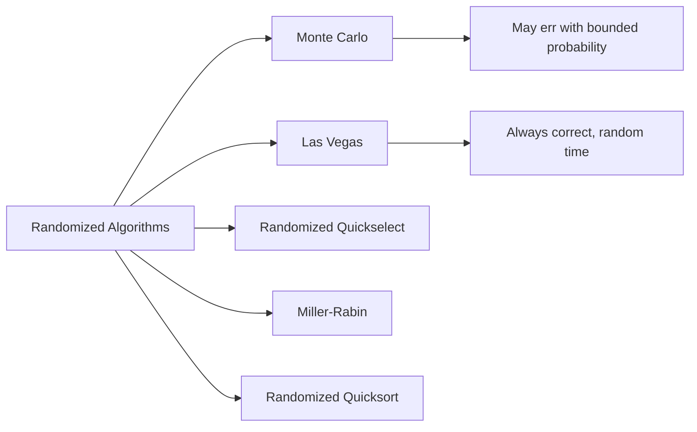

# Chapter 17: Randomized Algorithms

> **Prerequisites:** [Chapter 16: Approximation Algorithms](./16-approximation.md) — Algorithm design for hard problems | **Next:** [Chapter 18: Advanced Topics](./18-advanced.md) — From randomized methods to online and streaming algorithms

## Learning Objectives

By the end of this chapter, students will be able to:

1. Distinguish between Monte Carlo and Las Vegas randomized algorithms.
2. Implement and analyze randomized quickselect and randomized quicksort.
3. Implement the Miller-Rabin primality test.
4. Analyze the expected running time of randomized algorithms.

---

### Chapter at a Glance

| Topic | Key Insight | Practical Takeaway |
|-------|-------------|-------------------|
| Monte Carlo | May give wrong answer with bounded probability | Probability of error can be made arbitrarily small |
| Las Vegas | Always correct; running time is random | Expected time analysis, not worst case |
| Randomized Quicksort | Random pivot avoids worst case | O(n log n) expected; O(n²) worst case with vanishing probability |
| Randomized Quickselect | Random pivot for k-th smallest | O(n) expected time selection |
| Miller-Rabin | Probabilistic primality test | O(log³ n); composite detected with probability ≥ 3/4 |

### Chapter Roadmap



## Theory


### 17.1 Classification

Randomized algorithms are classified into two types:

**Las Vegas algorithms:** Always produce a correct result; the running time is a random variable. Examples: randomized quicksort, randomized quickselect.

**Monte Carlo algorithms:** May produce an incorrect result with bounded probability; the running time is deterministic. Examples: Miller-Rabin primality test, Karger's minimum cut algorithm.

> **Pro Tip:** Las Vegas = always right, sometimes slow. Monte Carlo = always fast, sometimes wrong. Use Las Vegas when correctness is critical (sorting), Monte Carlo when speed matters and errors can be tolerated (primality).
>
> **Remember:** A Monte Carlo algorithm can be converted to a Las Vegas one if you can verify the answer efficiently and retry on failure.

**One-Sentence Takeaway:** Las Vegas algorithms are always correct with random running time; Monte Carlo algorithms have bounded error with fixed running time.

### 17.2 Randomized Quickselect


## Theory


### 17.1 Classification

Randomized algorithms are classified into two types:

**Las Vegas algorithms:** Always produce a correct result; the running time is a random variable. Examples: randomized quicksort, randomized quickselect.

**Monte Carlo algorithms:** May produce an incorrect result with bounded probability; the running time is deterministic. Examples: Miller-Rabin primality test, Karger's minimum cut algorithm.

### 17.2 Randomized Quickselect

**Problem:** Find the \( k \)-th smallest element in an unsorted array.

**Algorithm:**
```
RandomizedQuickSelect(A, low, high, k):
    if low == high:
        return A[low]
    pivotIndex = Random(low, high)
    pivotIndex = Partition(A, low, high, pivotIndex)
    if k == pivotIndex:
        return A[k]
    else if k < pivotIndex:
        return RandomizedQuickSelect(A, low, pivotIndex - 1, k)
    else:
        return RandomizedQuickSelect(A, pivotIndex + 1, high, k)
```

**Expected time:** \( O(n) \). The worst case is \( O(n^2) \) (if the minimum or maximum is always chosen as pivot), but the probability of this is exponentially small.

**Proof of expected linear time:** Let \( T(n) \) be the expected running time. The pivot divides the array into a left and right portion. The expected size of the smaller portion is \( n/4 \) (the probability that the pivot is in the middle half is \( 1/2 \)). Therefore:

\[
E[T(n)] \le cn + E[T(3n/4)] \implies E[T(n)] = O(n).
\]

### 17.3 Randomized Quicksort

**Algorithm:** Choose the pivot uniformly at random from the array.

**Expected time:** \( O(n \log n) \). The constant factor is small: \( E[\text{comparisons}] = 2n \ln n \approx 1.39 n \log_2 n \).

**Proof outline:** Let the sorted elements be \( z_1 < z_2 < \cdots < z_n \). Define indicator random variable \( X_{ij} = 1 \) if \( z_i \) and \( z_j \) are compared. The probability that \( z_i \) and \( z_j \) are compared is \( 2/(j-i+1) \). By linearity of expectation:

\[
E[\text{total comparisons}] = \sum_{i=1}^n \sum_{j>i} \frac{2}{j-i+1} = O(n \log n).
\]

### 17.4 Miller-Rabin Primality Test

**Problem:** Determine if a number \( n \) is prime or composite.

**Key insight (Fermat's little theorem):** If \( n \) is prime, then for any \( a \) not divisible by \( n \), \( a^{n-1} \equiv 1 \pmod{n} \). However, there exist Carmichael numbers (e.g., 561) for which the converse fails.

**Strong pseudoprime test:** Write \( n-1 = 2^s \cdot d \) where \( d \) is odd. For a base \( a \):

1. Compute \( x_0 = a^d \bmod n \).
2. For \( i = 1, \ldots, s-1 \): compute \( x_i = x_{i-1}^2 \bmod n \).
3. If \( x_0 \equiv 1 \pmod{n} \) or \( x_i \equiv -1 \pmod{n} \) for some \( i \), then \( n \) passes the test.

```
MillerRabin(n, k):
    if n < 2: return false
    if n == 2 or n == 3: return true
    if n % 2 == 0: return false
    Write n-1 = 2^s * d with d odd
    repeat k times:
        a = random(2, n-2)
        x = pow(a, d) mod n
        if x == 1 or x == n-1: continue
        for r = 1 to s-1:
            x = x^2 mod n
            if x == n-1: break
            if x == 1: return false
        if x != n-1: return false
    return true
```

**Error probability:** At most \( 4^{-k} \) for a composite \( n \). After \( k \) rounds, if \( n \) passes all tests, it is prime with probability \( 1 - 4^{-k} \). For \( k = 20 \), the error probability is \( 4^{-20} \approx 10^{-12} \).

**Deterministic variants:** For \( n < 2^{64} \), testing bases [2, 3, 5, 7, 11, 13] suffices.

### 17.5 Monte Carlo vs. Las Vegas: A Comparison

| Aspect | Las Vegas | Monte Carlo |
|--------|-----------|-------------|
| Correctness | Always correct | May be wrong with bounded probability |
| Running time | Probabilistic | Deterministic |
| Amplification | Run many times (always same result) | Run many times, take majority vote |
| Typical use | Sorting, selection | Primality, minimum cut |

### 17.6 Additional Randomized Techniques

**Karger's minimum cut algorithm:** Repeatedly contract random edges. The probability that a specific minimum cut survives one contraction is at least \( 2/n^2 \). Running \( O(n^2 \log n) \) iterations gives a high-probability guarantee.

**Freivalds' algorithm for matrix verification:** To check if \( A \times B = C \), multiply \( A(B r) \) for a random vector \( r \). If the product is wrong, the test detects it with probability at least \( 1/2 \).

---

## Examples

### Example 17.1: Randomized Quickselect in C++

```cpp
#include <vector>
#include <cstdlib>
#include <algorithm>

int partition(std::vector<int>& A, int low, int high, int pivotIndex) {
    std::swap(A[pivotIndex], A[high]);
    int i = low;
    for (int j = low; j < high; ++j) {
        if (A[j] <= A[high]) {
            std::swap(A[i], A[j]);
            ++i;
        }
    }
    std::swap(A[i], A[high]);
    return i;
}

int quickSelect(std::vector<int>& A, int low, int high, int k) {
    if (low == high) return A[low];
    int pivotIndex = low + std::rand() % (high - low + 1);
    pivotIndex = partition(A, low, high, pivotIndex);
    if (k == pivotIndex) return A[k];
    if (k < pivotIndex) return quickSelect(A, low, pivotIndex - 1, k);
    return quickSelect(A, pivotIndex + 1, high, k);
}
```

### Example 17.2: Miller-Rabin in C++

```cpp
#include <cstdlib>
#include <cstdint>

int64_t modPow(int64_t a, int64_t d, int64_t n) {
    int64_t result = 1;
    a %= n;
    while (d > 0) {
        if (d & 1) result = (result * a) % n;
        a = (a * a) % n;
        d >>= 1;
    }
    return result;
}

bool millerRabin(int64_t n, int k) {
    if (n < 2) return false;
    if (n == 2 || n == 3) return true;
    if (n % 2 == 0) return false;
    int64_t d = n - 1;
    int s = 0;
    while (d % 2 == 0) { d /= 2; ++s; }
    for (int i = 0; i < k; ++i) {
        int64_t a = 2 + std::rand() % (n - 4);
        int64_t x = modPow(a, d, n);
        if (x == 1 || x == n - 1) continue;
        bool composite = true;
        for (int r = 0; r < s - 1; ++r) {
            x = (x * x) % n;
            if (x == n - 1) { composite = false; break; }
        }
        if (composite) return false;
    }
    return true;
}
```

### Example 17.3: Birthday Problem Analysis

**Application to hashing:** The expected number of random samples before a collision in a set of size \( N \) is \( \Theta(\sqrt{N}) \). This principle underlies the **birthday attack** in cryptography and **Pollard's rho algorithm** for integer factorization.

---

### Concept Comparison Table

| Algorithm | Type | Time | Correctness | Key Intuition |
|-----------|------|------|-------------|---------------|
| Randomized Quicksort | Las Vegas | O(n log n) expected | Always | Random pivot avoids worst case |
| Randomized Quickselect | Las Vegas | O(n) expected | Always | Random pivot gives linear expected time |
| Miller-Rabin | Monte Carlo | O(k log^3 n) | Error ≤ 4^-k | Strong pseudoprime check, k rounds |
| Karger Min-Cut | Monte Carlo | O(n^4 log n) | High probability | Random edge contraction |

### Quick Reference

| Category | Key Points |
|----------|------------|
| **Las Vegas** | Always correct; expected time analysis; examples: quicksort, quickselect |
| **Monte Carlo** | Bounded error; deterministic time; amplify via repetition; examples: Miller-Rabin, Karger |
| **Quickselect** | Expected O(n); probability of worst case is 1/n! |
| **Quicksort** | Expected O(n log n); ~1.39 n log_2 n comparisons |
| **Miller-Rabin** | Error ≤ 4^-k; strong pseudoprime; deterministic for n < 2^64 |
| **Other Techniques** | Karger min-cut, Freivalds matrix check, birthday paradox |

### Cross-Application Matrix

| Algorithm | DSA Interviews | Competitive Programming | Cryptography | Real-World |
|-----------|---------------|----------------------|-------------|------------|
| Randomized Quicksort | Common | Standard sorting | N/A | General sorting |
| Randomized Quickselect | Common | Median/order stats | N/A | Order statistics |
| Miller-Rabin | Occasionally | Rare (precomputed primes) | RSA key generation | SSL/TLS |
| Karger Min-Cut | Rare | Advanced | N/A | Network reliability |

---

## Summary

- **Las Vegas algorithms** are always correct with random running time (quickselect, quicksort).
- **Monte Carlo algorithms** have deterministic running time with bounded error probability (Miller-Rabin, Karger).
- Randomized algorithms often achieve better asymptotic complexity and simpler implementations than deterministic counterparts.
- The Miller-Rabin test is the most practical primality test for large numbers, with error probability \( 4^{-k} \).

---

## Exercises

### Review Questions

### Chapter Quiz

**Q1.** What is the difference between Las Vegas and Monte Carlo algorithms?

- A) Las Vegas is faster; Monte Carlo is more accurate
- B) Las Vegas always gives correct answers; Monte Carlo may err with bounded probability
- C) Las Vegas uses randomness; Monte Carlo is deterministic
- D) There is no difference

<details>
<summary>Answer</summary>
B) Las Vegas algorithms are always correct (running time is random); Monte Carlo algorithms have bounded error probability (running time is fixed).
</details>

**Q2.** What is the expected time complexity of randomized quickselect?

- A) O(log n)
- B) O(n)
- C) O(n log n)
- D) O(n²)

<details>
<summary>Answer</summary>
B) O(n) expected. The recurrence T(n) ≤ T(3n/4) + O(n) solves to O(n).
</details>

**Q3.** What is the source of error in the Miller-Rabin primality test?

- A) Fermat's little theorem is false
- B) Carmichael numbers pass strong pseudoprime tests with some probability
- C) The algorithm uses a fixed number of random bases
- D) Both B and C

<details>
<summary>Answer</summary>
D) For a composite number, a random base has at most 25% chance of falsely declaring it prime. Running k independent rounds reduces error to 4^-k.
</details>

### Review Questions

1. Distinguish between Monte Carlo and Las Vegas algorithms with examples.
2. Why does randomized quicksort avoid the worst-case O(n²) behavior?
3. What is the source of error in the Miller-Rabin test?

### Application Problems

4. Implement randomized quicksort and empirically compare its running time with deterministic quicksort on sorted, reverse-sorted, and random inputs.
5. Test numbers up to \( 10^6 \) using Miller-Rabin and compare with a deterministic sieve.
6. Implement Karger's minimum cut algorithm and test it on a 10-vertex graph.
7. Compute the expected number of comparisons for randomized quicksort on n = 100 using the formula \( 2n \ln n \).

### Challenge Problem

8. Design a randomized algorithm for the **distinct elements problem** in data streams (Flajolet-Martin algorithm). The algorithm should use \( O(\log n) \) space and estimate the number of distinct elements with bounded error.
