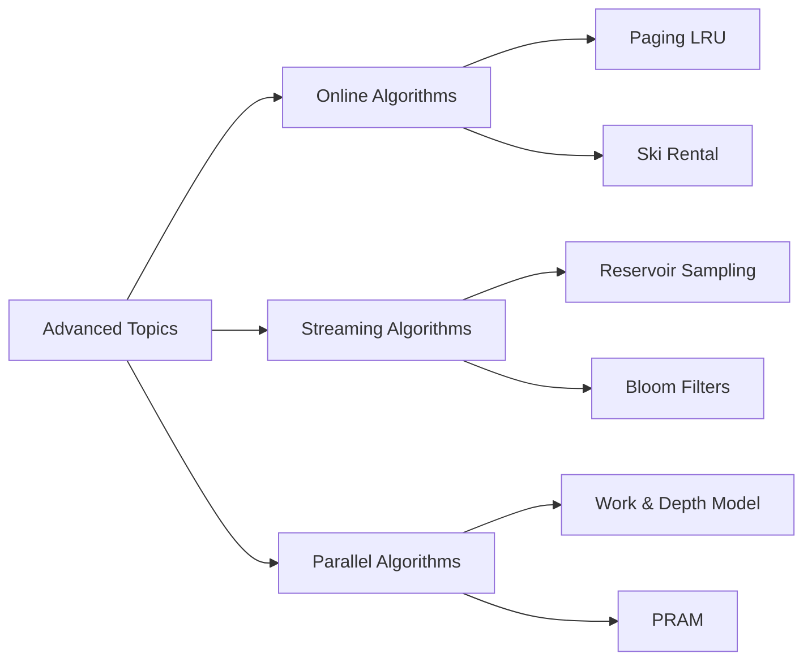

# Chapter 18: Advanced Topics

> **Prerequisites:** [Chapter 17: Randomized Algorithms](./17-randomized.md) — Probabilistic analysis and algorithm design | **Next:** Course Complete

## Learning Objectives

By the end of this chapter, students will be able to:

1. Analyze online algorithms using the competitive ratio framework.
2. Implement paging and ski rental algorithms and compute their competitive ratios.
3. Design and analyze streaming algorithms including reservoir sampling and Bloom filters.
4. Understand parallel algorithm design principles and analyze work and depth.

---

### Chapter at a Glance

| Topic | Key Insight | Practical Takeaway |
|-------|-------------|-------------------|
| Online Algorithms | Irrevocable decisions without future knowledge | Competitive ratio compares against optimal offline |
| Paging | LRU is k-competitive | Belady's algorithm (OPT) is the optimal offline strategy |
| Ski Rental | Buy vs rent decision under uncertainty | Classic competitive analysis example |
| Streaming Algorithms | Single-pass processing with limited memory | Sublinear space at cost of approximate answers |
| Reservoir Sampling | Uniform random sample from unknown-length stream | O(k) space for k samples from arbitrary-length stream |
| Bloom Filters | Probabilistic set membership | False positives possible; false negatives impossible |

### Chapter Roadmap



## Theory


### 18.1 Online Algorithms

**Definition 18.1.** An **online algorithm** processes input in sequence, making irrevocable decisions without knowledge of future inputs.

**Definition 18.2.** An online algorithm \( A \) has **competitive ratio** \( \rho \) if for all input sequences:

\[
C_A(\sigma) \le \rho \cdot C_{\text{OPT}}(\sigma) + b
\]

where \( C_A(\sigma) \) is the cost of the algorithm, \( C_{\text{OPT}}(\sigma) \) is the optimal offline cost, and \( b \) is a constant.

> **Pro Tip:** The competitive ratio measures an online algorithm against an optimal offline algorithm that sees the entire input in advance. A ratio of k means the online algorithm costs at most k times the optimal.
>
> **Remember:** The additive constant b allows the ratio to hold for all input lengths. For paging, the competitive ratio is exactly k.

**One-Sentence Takeaway:** Online algorithms make irrevocable decisions without future knowledge; the competitive ratio quantifies performance relative to optimal offline hindsight.

#### 18.1.1 Paging (Caching)

**Problem:** A cache holds \( k \) pages. When a page is requested, it must be in the cache. If not (a cache miss), the page must be loaded from main memory, possibly evicting an existing page. The goal is to minimize the number of cache misses.

**Classic online algorithms:**
- **LRU (Least Recently Used):** Evict the page that was used longest ago.
- **FIFO (First In, First Out):** Evict the page that has been in the cache the longest.
- **LFU (Least Frequently Used):** Evict the page with the fewest references.

**Theorem 18.1.** LRU and FIFO are \( k \)-competitive for paging. No deterministic online paging algorithm can be better than \( k \)-competitive.

**Proof of lower bound:** Consider \( k+1 \) pages. An adversary always requests the page that the algorithm just evicted. The optimal offline algorithm (MIN, by Belady) evicts the page that will be used farthest in the future, incurring one miss per \( k \) requests. The online algorithm incurs a miss on every request, giving ratio \( k \).

**Randomized paging:** The **random-marking** algorithm achieves \( O(\log k) \) competitive ratio, which is optimal for randomized online paging.

#### 18.1.2 Ski Rental

**Problem:** You are going skiing for an unknown number of days. You can either rent skis for $1 per day or buy them for $B. The decision is online: you do not know how many days you will ski.

**Deterministic algorithm:** Rent for the first \( B-1 \) days, buy on day \( B \).

**Competitive ratio:** \( 2 - 1/B \). Proof: if the total days \( N < B \), the algorithm pays \( N \), optimal pays \( N \), ratio 1. If \( N \ge B \), the algorithm pays \( (B-1) + B = 2B - 1 \), optimal pays \( B \), ratio \( 2 - 1/B \).

**Randomized algorithm:** Choose a threshold \( T \) randomly according to a specific distribution. Competitive ratio \( e/(e-1) \approx 1.58 \).

### 18.2 Streaming Algorithms

Streaming algorithms process a sequence of elements using sublinear memory (typically \( O(\log^c n) \) or \( O(n^\alpha) \) for \( \alpha < 1 \)).

#### 18.2.1 Reservoir Sampling

**Problem:** Select \( k \) elements uniformly at random from a stream of unknown length \( n \).

```
ReservoirSampling(stream, k):
    reservoir = first k elements of stream
    i = k
    while stream has more elements:
        i++
        j = random(1, i)
        if j <= k:
            reservoir[j-1] = current element
    return reservoir
```

**Correctness:** At step \( i \), each of the first \( i \) elements has probability \( k/i \) of being in the reservoir. Proof by induction.

**Complexity:** \( O(n) \) time, \( O(k) \) space.

#### 18.2.2 Bloom Filter

**Problem:** Test set membership with small space, allowing false positives but no false negatives.

**Data structure:** A bit array \( B \) of size \( m \), and \( h \) independent hash functions \( h_1, \ldots, h_k \) mapping elements to positions \( [0, m-1] \).

**Insertion:** For each hash function \( h_i \), set \( B[h_i(x)] = 1 \).

**Query:** For each hash function \( h_i \), check \( B[h_i(y)] \). If any is 0, \( y \) is definitely not in the set. If all are 1, \( y \) is probably in the set.

**False positive probability:** After inserting \( n \) elements:

\[
p = \left(1 - \left(1 - \frac{1}{m}\right)^{kn}\right)^k \approx \left(1 - e^{-kn/m}\right)^k
\]

**Optimal number of hash functions:** \( k = (m/n) \ln 2 \), giving \( p \approx (1/2)^k \approx 0.6185^{m/n} \).

**Properties:** No deletions (unless using counting Bloom filter), excellent space efficiency.

> **Pro Tip:** Bloom filters have zero false negatives -- if a query says not present, it is guaranteed absent. Optimal hash count k = (m/n) * ln(2) minimizes the false positive rate.
>
> **Remember:** Choose m (bits) and k (hash functions) based on your target false positive rate p and expected element count n. m = -n ln(p) / (ln 2)^2 is the optimal bit count.

**One-Sentence Takeaway:** Bloom filters provide space-efficient probabilistic set membership with false positives but no false negatives.

#### 18.2.3 Count-Min Sketch

**Problem:** Estimate the frequency of each element in a stream using sublinear space.

**Data structure:** A 2D array of counters \( C[d][w] \), with \( d \) hash functions \( h_1, \ldots, h_d : [n] \to [w] \).

**Update:** For each hash function \( h_i \), increment \( C[i][h_i(x)] \) by 1 or by the frequency delta.

**Query:** \( \hat{f}(x) = \min_{i=1..d} C[i][h_i(x)] \).

**Guarantee:** With \( w = \lceil e/\epsilon \rceil \) and \( d = \lceil \ln (1/\delta) \rceil \), the estimate satisfies \( \hat{f}(x) \le f(x) + \epsilon N \) with probability \( 1 - \delta \), where \( N \) is the total stream length.

### 18.3 Parallel Algorithms

**Work-depth model:** For a parallel algorithm:
- **Work** \( W(n) \): total number of operations.
- **Depth** \( D(n) \): longest chain of dependencies (critical path).

**Brent's theorem:** A parallel algorithm with work \( W \) and depth \( D \) can be simulated on \( P \) processors in time:
\[
T_P \le \frac{W}{P} + D.
\]

#### 18.3.1 Parallel Prefix Sum (Scan)

**Problem:** Compute all prefix sums \( S[i] = \sum_{j=0}^{i-1} A[j] \).

**Sequential:** \( O(n) \). **Parallel:** Use a balanced binary tree.

1. **Up-sweep phase:** Compute partial sums at each level of the tree.
2. **Down-sweep phase:** Distribute partial sums to produce final prefix sums.

**Work:** \( O(n) \). **Depth:** \( O(\log n) \).

#### 18.3.2 Parallel Sorting

**Bitonic sort:** A sorting network with depth \( O(\log^2 n) \) and work \( O(n \log^2 n) \).

**Sample sort:** A divide-and-conquer parallel sorting algorithm that uses random sampling to find splitters.

**Parallel merge sort:** Divide the array in half (constant time), recursively sort (parallel), then merge. Merge of two sorted arrays can be done in \( O(\log n) \) depth using binary search to find element positions.

### 18.4 Online and Streaming Summary Table

### Concept Comparison Table

| Domain | Algorithm | Space | Performance | Key Property |
|--------|-----------|-------|-------------|--------------|
| Online | LRU (paging) | O(k) | k-competitive | Evict least recently used |
| Online | Ski rental (det.) | O(1) | 2-competitive | Buy at break-even |
| Online | Ski rental (rand.) | O(1) | 1.58-competitive | Random threshold |
| Streaming | Reservoir sampling | O(k) | O(n) time | Uniform random sample |
| Streaming | Bloom filter | O(m) | O(k) per op | No false negatives |
| Streaming | Count-Min sketch | O((1/e) log(1/d)) | O(1) per op | Only overestimates |
| Parallel | Prefix sum | O(n) work | O(log n) depth | Balanced tree |
| Parallel | Bitonic sort | O(n log^2 n) work | O(log^2 n) depth | Sorting network |

### Quick Reference

| Category | Key Points |
|----------|------------|
| **Competitive Ratio** | Online cost / optimal offline cost |
| **LRU Paging** | k-competitive; optimal deterministic; O(log k) randomized |
| **Ski Rental** | 2-competitive det.; 1.58 randomized; rent vs buy |
| **Reservoir** | Replace with prob k/i; O(k) space; exact uniform |
| **Bloom Filter** | FP = (1 - e^{-kn/m})^k; optimal k = (m/n) ln 2 |
| **Count-Min** | f(x) <= estimate <= f(x) + eN; min over d rows |
| **Work-Depth** | W = total ops, D = critical path; T_P <= W/P + D |
| **Parallel Scan** | O(log n) depth via up-sweep + down-sweep |

### Cross-Application Matrix

| Topic | DSA Interviews | Competitive Programming | Real-World |
|-------|---------------|----------------------|------------|
| Online/Paging | Occasionally | Uncommon | OS cache management |
| Ski Rental | Occasionally | Uncommon | Cloud provisioning |
| Reservoir Sampling | Common | Common | Data science sampling |
| Bloom Filters | Common | Common | Databases, caches |
| Count-Min Sketch | Occasionally | Occasionally | Network monitoring |
| Parallel Algorithms | Rare | Uncommon | GPU, distributed computing |

---

| Algorithm | Problem | Space | Guarantee |
|-----------|---------|-------|-----------|
| LRU | Paging | \( O(k) \) | \( k \)-competitive |
| Ski rental (det.) | Rent vs. buy | \( O(1) \) | \( 2 \)-competitive |
| Ski rental (rand.) | Rent vs. buy | \( O(1) \) | \( 1.58 \)-competitive |
| Reservoir sampling | Random sampling | \( O(k) \) | Exact uniform sample |
| Bloom filter | Set membership | \( O(m) \) | FP: \( (1 - e^{-kn/m})^k \) |
| Count-Min sketch | Frequency estimation | \( O(\frac{1}{\epsilon} \log \frac{1}{\delta}) \) | Error \( \le \epsilon N \) |

---

## Examples

### Example 18.1: Reservoir Sampling in C++

```cpp
#include <vector>
#include <cstdlib>

std::vector<int> reservoirSampling(const std::vector<int>& stream, int k) {
    std::vector<int> reservoir(stream.begin(), stream.begin() + k);
    for (size_t i = k; i < stream.size(); ++i) {
        int j = std::rand() % (i + 1);
        if (j < k) reservoir[j] = stream[i];
    }
    return reservoir;
}
```

### Example 18.2: Bloom Filter in C++

```cpp
#include <vector>
#include <functional>

class BloomFilter {
    std::vector<bool> bits;
    size_t m, k;
    std::vector<std::hash<std::string>> hashers;

    size_t hash(const std::string& s, size_t seed) const {
        std::hash<std::string> h;
        return (h(s) ^ (seed * 0x9e3779b9)) % m;
    }

public:
    BloomFilter(size_t m, size_t k) : bits(m, false), m(m), k(k), hashers(k) {}

    void insert(const std::string& s) {
        for (size_t i = 0; i < k; ++i)
            bits[hash(s, i)] = true;
    }

    bool contains(const std::string& s) const {
        for (size_t i = 0; i < k; ++i)
            if (!bits[hash(s, i)]) return false;
        return true;
    }
};
```

### Example 18.3: Parallel Prefix Sum (Conceptual)

```
ParallelPrefixSum(A):
    n = len(A)
    // Up-sweep
    for d = 0 to log2(n) - 1:
        for each i where i % 2^(d+1) == 2^(d+1) - 1 in parallel:
            A[i] = A[i - 2^d] + A[i]
    // A[n-1] now contains total sum
    // Down-sweep
    A[n-1] = 0
    for d = log2(n) - 1 down to 0:
        for each i where i % 2^(d+1) == 2^(d+1) - 1 in parallel:
            t = A[i]
            A[i] = A[i - 2^d] + A[i]
            A[i - 2^d] = t
```

---

## Summary

- **Online algorithms** make irrevocable decisions with incomplete information; the competitive ratio measures performance against the optimal offline algorithm.
- **Streaming algorithms** process massive data with sublinear memory, trading accuracy for space efficiency.
- **Parallel algorithms** leverage multiple processors; the work-depth model captures both total operations and the critical path.

---

## Exercises

### Review Questions

### Chapter Quiz

**Q1.** What is the competitive ratio of deterministic ski rental (buy cost = B)?

- A) B
- B) 2 - 1/B
- C) e/(e-1)
- D) k

<details>
<summary>Answer</summary>
B) Rent for B-1 days then buy gives cost 2B-1 when N ≥ B, vs optimal of B, so ratio = 2 - 1/B.
</details>

**Q2.** What is the key property of a Bloom filter?

- A) No false positives
- B) No false negatives
- C) Exact set membership
- D) Supports deletions

<details>
<summary>Answer</summary>
B) Bloom filters have no false negatives -- if a query returns false, the element is definitely absent. False positives are possible.
</details>

**Q3.** In the work-depth model, what does Brent's theorem state?

- A) W(n) = O(D(n))
- B) T_P ≤ W/P + D
- C) T_P = W * D
- D) D must equal W

<details>
<summary>Answer</summary>
B) On P processors, the time is at most W/P + D, where W is total work and D is critical path depth.
</details>

### Review Questions

1. Define the competitive ratio for an online algorithm.
2. Explain why LRU achieves competitive ratio k for paging.
3. What is the difference between a Bloom filter's false positive rate and false negative rate?
4. State Brent's theorem for parallel algorithm performance.

### Application Problems

5. Implement the randomized ski-rental algorithm with competitive ratio \( e/(e-1) \).
6. Design an online algorithm for the **secretary problem**: hire the best candidate from a stream of candidates, interviewing one at a time with immediate decisions.
7. Implement a Count-Min sketch and estimate frequencies for a stream of 10,000 integers.
8. Design a parallel algorithm for matrix-vector multiplication in the work-depth model.

### Challenge Problem

9. Design a streaming algorithm for the **heavy hitters** problem: find all elements whose frequency exceeds \( \phi N \) in a stream of length \( N \) using \( O(1/\phi) \) space.
