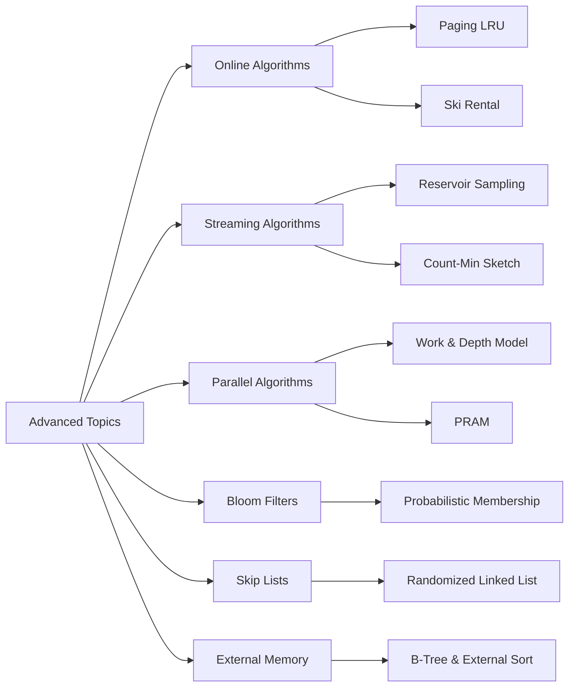

# Chapter 18: Advanced Topics

> **Prerequisites:** [Chapter 17: Randomized Algorithms](./17-randomized.md) — Probabilistic analysis and algorithm design | **Next:** Course Complete

## Learning Objectives

By the end of this chapter, students will be able to:

<!-- Image Gallery -->
<div style="display:flex;flex-wrap:wrap;gap:4px;margin:16px 0;padding:12px;background:#f8fafc;border-radius:8px;border:1px solid #e2e8f0;">
<a href="../../../assets/images/lessons/algorithms/18-advanced/hero.svg" target="_blank" rel="noopener">
  
</a>
<a href="../../../assets/images/lessons/algorithms/18-advanced/handwritten-notes.svg" target="_blank" rel="noopener">
  
</a>
<a href="../../../assets/images/lessons/algorithms/18-advanced/sticky-notes.svg" target="_blank" rel="noopener">
  
</a>
<a href="../../../assets/images/lessons/algorithms/18-advanced/visual-explanation.svg" target="_blank" rel="noopener">
  
</a>
<a href="../../../assets/images/lessons/algorithms/18-advanced/architecture.svg" target="_blank" rel="noopener">
  
</a>
<a href="../../../assets/images/lessons/algorithms/18-advanced/workflow.svg" target="_blank" rel="noopener">
  
</a>
<a href="../../../assets/images/lessons/algorithms/18-advanced/mindmap.svg" target="_blank" rel="noopener">
  
</a>
<a href="../../../assets/images/lessons/algorithms/18-advanced/comparison.svg" target="_blank" rel="noopener">
  
</a>
<a href="../../../assets/images/lessons/algorithms/18-advanced/cheatsheet.svg" target="_blank" rel="noopener">
  
</a>
<a href="../../../assets/images/lessons/algorithms/18-advanced/interview-quiz.svg" target="_blank" rel="noopener">
  
</a>
<a href="../../../assets/images/lessons/algorithms/18-advanced/social-card.svg" target="_blank" rel="noopener">
  
</a>
</div>
<!-- End Image Gallery -->


1. Analyze online algorithms using the competitive ratio framework.
2. Implement paging and ski rental algorithms and compute their competitive ratios.
3. Design and analyze streaming algorithms including reservoir sampling and Bloom filters.
4. Understand parallel algorithm design principles and analyze work and depth.

---

### Chapter at a Glance

| Topic | Key Insight | Practical Takeaway |
|-------|-------------|-------------------|
| Online Algorithms | Irrevocable decisions without future knowledge | Competitive ratio compares against optimal offline |
| Paging | LRU is k-competitive | Belady's algorithm (OPT) is the optimal offline strategy |
| Ski Rental | Buy vs rent decision under uncertainty | Classic competitive analysis example |
| Streaming Algorithms | Single-pass processing with limited memory | Sublinear space at cost of approximate answers |
| Reservoir Sampling | Uniform random sample from unknown-length stream | O(k) space for k samples from arbitrary-length stream |
| Bloom Filters | Probabilistic set membership | False positives possible; false negatives impossible |
| Count-Min Sketch | Frequency estimation in sublinear space | Always overestimates; error bounded by εN |
| Parallel Algorithms | Multiple processors for speedup | Work-depth model: T_P ≤ W/P + D |

### Chapter Roadmap



## Why Advanced Topics Matter

**Real-world analogy:** A librarian managing a million-book collection does not rearrange every shelf when a new book arrives. Instead, she keeps a quick-reference card catalog (Bloom filter equivalent), a "recently returned" shelf near the entrance (LRU cache), and a filing system that groups books by category so only a few shelves need rearranging per book (B-tree / external memory). She does not need to know every book's exact location — she just needs fast answers with limited time and space.

This chapter covers the algorithms that make modern large-scale systems possible:

- **Google Search:** Uses Bloom filters in Bigtable to avoid costly disk lookups for non-existent rows. A Bloom filter check costs microseconds; a disk seek costs milliseconds.
- **Redis:** Uses skip lists for sorted sets (`ZADD`, `ZRANGE`). The skiplist's O(log n) operations with simple code beat balanced trees for concurrent access.
- **Cassandra / HBase:** Use Bloom filters for all read paths. Before fetching a row from an SSTable on disk, check the Bloom filter — if it says "not present," skip the entire I/O.
- **Databases:** External merge sort sorts terabytes of data that cannot fit in RAM. B-trees organize on-disk indexes for O(log_B n) page accesses.
- **Network monitoring:** Count-Min sketches track the heaviest flows through a router using tiny memory. Cisco and Juniper routers use sketches for traffic analysis.
- **Stream processing:** Apache Flink and Kafka Streams use variants of reservoir sampling and Count-Min sketches for real-time analytics.
- **Operating systems:** LRU paging decides which memory pages to keep in RAM. Every OS kernel implements some form of online paging algorithm.

> **Warning:** Advanced algorithms trade one resource for another — Bloom filters trade accuracy for space, online algorithms trade optimality for immediacy, streaming algorithms trade exactness for memory. Always understand what you are giving up.

**One-Sentence Takeaway:** Advanced algorithm design tackles real-world constraints — limited memory, no future knowledge, and massive data sizes — through probabilistic, online, and external-memory techniques.

## Theory


### 18.1 Online Algorithms


**Real-world analogy:** You are day-trading stocks. You must decide whether to buy or sell now, without knowing tomorrow's price. Every decision is irrevocable. If you sell too early, you miss gains; if you hold too long, you lose everything. This is the essence of online algorithms — make decisions without future knowledge and accept that you will never match the optimal hindsight strategy.

**Definition 18.1.** An **online algorithm** processes input in sequence, making irrevocable decisions without knowledge of future inputs.

**Definition 18.2.** An online algorithm \( A \) has **competitive ratio** \( \rho \) if for all input sequences:

\[
C_A(\sigma) \le \rho \cdot C_{\text{OPT}}(\sigma) + b
\]

where \( C_A(\sigma) \) is the cost of the algorithm, \( C_{\text{OPT}}(\sigma) \) is the optimal offline cost, and \( b \) is a constant.

> **Pro Tip:** The competitive ratio measures an online algorithm against an optimal offline algorithm that sees the entire input in advance. A ratio of k means the online algorithm costs at most k times the optimal.
>
> **Remember:** The additive constant b allows the ratio to hold for all input lengths. For paging, the competitive ratio is exactly k.

**One-Sentence Takeaway:** Online algorithms make irrevocable decisions without future knowledge; the competitive ratio quantifies performance relative to optimal offline hindsight.

#### 18.1.1 Paging (Caching)

**Problem:** A cache holds \( k \) pages. When a page is requested, it must be in the cache. If not (a cache miss), the page must be loaded from main memory, possibly evicting an existing page. The goal is to minimize the number of cache misses.

**Real-world analogy:** Your desk can hold 5 textbooks. When you need a new book, you must swap one from your desk with one from the bookshelf across the room. Paging algorithms decide which book to swap out. LRU (least recently used) says: "Swap out the book you have not opened in the longest time."

**Classic online algorithms:**
- **LRU (Least Recently Used):** Evict the page that was used longest ago.
- **FIFO (First In, First Out):** Evict the page that has been in the cache the longest.
- **LFU (Least Frequently Used):** Evict the page with the fewest references.

**Algorithm Steps (LRU):**

1. On page request:
   a. If page is in cache: move it to the most-recently-used position (cache hit).
   b. If page is not in cache (cache miss):
      i. If cache is full, evict the least-recently-used page.
      ii. Load the requested page into cache at the most-recently-used position.

**Pseudocode:**
```
LRU(page_requests, k):
    cache = empty list of size k
    misses = 0
    for each page in page_requests:
        if page in cache:
            move page to front of cache (most recent)
        else:
            misses++
            if cache is full:
                remove last element (least recent)
            insert page at front of cache
    return misses
```

**Dry Run:** k = 3 cache, requests = [1, 2, 3, 4, 1, 2, 5, 1, 2, 3, 4, 5]

| Step | Request | Cache State (MRU → LRU) | Hit/Miss | Evicted |
|------|---------|------------------------|----------|---------|
| 1 | 1 | [1] | Miss | — |
| 2 | 2 | [2, 1] | Miss | — |
| 3 | 3 | [3, 2, 1] | Miss | — |
| 4 | 4 | [4, 3, 2] | Miss | 1 |
| 5 | 1 | [1, 4, 3] | Miss | 2 |
| 6 | 2 | [2, 1, 4] | Miss | 3 |
| 7 | 5 | [5, 2, 1] | Miss | 4 |
| 8 | 1 | [1, 5, 2] | Hit | — |
| 9 | 2 | [2, 1, 5] | Hit | — |
| 10 | 3 | [3, 2, 1] | Miss | 5 |
| 11 | 4 | [4, 3, 2] | Miss | 1 |
| 12 | 5 | [5, 4, 3] | Miss | 2 |

**Theorem 18.1.** LRU and FIFO are \( k \)-competitive for paging. No deterministic online paging algorithm can be better than \( k \)-competitive.

**Proof of lower bound:** Consider \( k+1 \) pages. An adversary always requests the page that the algorithm just evicted. The optimal offline algorithm (MIN, by Belady) evicts the page that will be used farthest in the future, incurring one miss per \( k \) requests. The online algorithm incurs a miss on every request, giving ratio \( k \).

**Randomized paging:** The **random-marking** algorithm achieves \( O(\log k) \) competitive ratio, which is optimal for randomized online paging.

**Complexity Analysis:**

| Case | Misses |
|------|--------|
| **LRU worst-case** | k times optimal |
| **Belady (optimal offline)** | Minimum possible |
| **Random marking** | O(log k) × optimal |

**Advantages & Disadvantages:**

| Advantages | Disadvantages |
|------------|---------------|
| Simple and intuitive | Deterministic: k-competitive lower bound |
| Works well in practice (temporal locality) | k-competitive can be poor for large k |
| O(1) per operation with hash table + doubly-linked list | Needs metadata updates on every hit |

**Edge Cases:**
- **k = 1:** Only one page fits. Every new page is a miss. Trivial.
- **Thrashing:** When working set > cache size, every access is a miss.
- **Prefetching:** LRU does not distinguish between demand loads and prefetches.

#### 18.1.2 Ski Rental

**Problem:** You are going skiing for an unknown number of days. You can either rent skis for $1 per day or buy them for $B. The decision is online: you do not know how many days you will ski.

**Real-world analogy:** Should you subscribe to a gym membership ($50/month) or pay per visit ($10/visit)? If you go once, per-visit is cheaper. If you go 10 times, the membership is cheaper. But you do not know how many times you will actually go.

**Algorithm Steps (Deterministic):**

1. Rent for the first B-1 days.
2. On day B, buy the skis.

**Pseudocode:**
```
SkiRental(B, days_unknown):
    total_cost = 0
    for day = 1 to unknown_N:
        if day < B:
            total_cost += 1   // rent
        elif day == B:
            total_cost += B   // buy
        // after buying, no more cost
    return total_cost
```

**Competitive ratio:** \( 2 - 1/B \). Proof: if the total days \( N &lt; B \), the algorithm pays \( N \), optimal pays \( N \), ratio 1. If \( N \ge B \), the algorithm pays \( (B-1) + B = 2B - 1 \), optimal pays \( B \), ratio \( 2 - 1/B \).

**Randomized algorithm:** Choose a threshold \( T \) randomly according to a specific distribution. Competitive ratio \( e/(e-1) \approx 1.58 \).

**Advantages & Disadvantages:**

| Advantages | Disadvantages |
|------------|---------------|
| Simple, intuitive decision rule | Deterministic ratio approaches 2 |
| Randomized version improves to 1.58 | Assumes buy cost is one-time |
| Competitive ratio independent of N | Only two actions (rent/buy) |

**Edge Cases:**
- **B = 1:** Buy immediately (trivially optimal).
- **N = 0:** No cost, algorithm never starts.
- **Very large B:** Ratio approaches 2 for deterministic, e/(e-1) for randomized.

### 18.2 Bloom Filters


**Real-world analogy:** You are at a festival with 10,000 attendees. You want to check if a person is a VIP. Instead of carrying a full list of 500 VIP names, you give each VIP a colored wristband — but there are only 100 colors, so some non-VIPs might accidentally get a matching wristband (false positive). However, anyone without the correct color combination is guaranteed not to be a VIP (no false negatives).

**Problem:** Test set membership with small space, allowing false positives but no false negatives.

**Data structure:** A bit array \( B \) of size \( m \), and \( h \) independent hash functions \( h_1, \ldots, h_k \) mapping elements to positions \( [0, m-1] \).

**Algorithm Steps:**

1. **Initialize:** Create a bit array of size m, all bits set to 0.
2. **Insert(x):** For each hash function h_i, set B[h_i(x)] = 1.
3. **Query(y):** For each hash function h_i, check B[h_i(y)]. If any bit is 0, y is definitely not in the set. If all bits are 1, y is probably in the set.

**Pseudocode:**
```
BloomFilter:
    bits = array of m bits, all 0
    hashes = k hash functions

    Insert(element):
        for i = 1 to k:
            bits[hashes[i](element)] = 1

    Contains(element):
        for i = 1 to k:
            if bits[hashes[i](element)] == 0:
                return false       // definitely not present
        return true                // probably present
```

**Dry Run:** m = 10 bits, k = 3 hash functions. Insert "cat" and "dog", query "fox".

| Step | Action | Hash Outputs | Bit Array State |
|------|--------|-------------|-----------------|
| Init | Create filter | — | [0,0,0,0,0,0,0,0,0,0] |
| 1 | Insert "cat" | h₁="cat"→2, h₂→5, h₃→8 | [0,0,1,0,0,1,0,0,1,0] |
| 2 | Insert "dog" | h₁="dog"→3, h₂→5, h₃→9 | [0,0,1,1,0,1,0,0,1,1] |
| 3 | Query "fox" | h₁="fox"→2, h₂→7, h₃→9 | Check: bits[2]=1, bits[7]=0 → **not present** (true) |
| 4 | Query "cat" | h₁="cat"→2, h₂→5, h₃→8 | Check: bits[2]=1, bits[5]=1, bits[8]=1 → **probably present** (true) |

**False positive probability:** After inserting \( n \) elements:

\[
p = \left(1 - \left(1 - \frac{1}{m}\right)^{kn}\right)^k \approx \left(1 - e^{-kn/m}\right)^k
\]

**Optimal number of hash functions:** \( k = (m/n) \ln 2 \), giving \( p \approx (1/2)^k \approx 0.6185^{m/n} \).

**Complexity Analysis:**

| Operation | Time |
|-----------|------|
| **Insert** | O(k) — compute k hashes, set k bits |
| **Query** | O(k) — compute k hashes, check k bits |
| **Space** | O(m) bits |
| **False positive rate** | ≈ (1 - e^{-kn/m})^k |

**Advantages & Disadvantages:**

| Advantages | Disadvantages |
|------------|---------------|
| Space efficient (bits per element ~2-10) | No deletions (unless counting variant) |
| No false negatives | False positives exist |
| O(1) insert and query time | Cannot enumerate elements |
| k hash functions can be parallelized | Bloom filter size must be pre-determined |
| Excellent for cache-blocking with disk | Hash collisions cause false positives |

**Edge Cases:**
- **Empty filter:** Query of any element returns false.
- **Full filter (all bits = 1):** Every query returns true. Useless.
- **m too small:** False positive rate approaches 1.
- **k = 0:** No bits set (if 0 hash functions — defined as never setting bits).
- **Single element:** Bits at k positions = 1; all other queries have false positive probability (1 - (1 - 1/m)^k)^k.

**C++ Implementation:**
```cpp
#include <vector>
#include <functional>

class BloomFilter {
    std::vector<bool> bits;
    size_t m, k;
    std::vector<std::hash<std::string>> hashers;

    size_t hash(const std::string& s, size_t seed) const {
        std::hash<std::string> h;
        return (h(s) ^ (seed * 0x9e3779b9)) % m;
    }

public:
    BloomFilter(size_t m, size_t k) : bits(m, false), m(m), k(k), hashers(k) {}

    void insert(const std::string& s) {
        for (size_t i = 0; i < k; ++i)
            bits[hash(s, i)] = true;
    }

    bool contains(const std::string& s) const {
        for (size_t i = 0; i < k; ++i)
            if (!bits[hash(s, i)]) return false;
        return true;
    }
};
```

**Python Implementation:**
```python
import mmh3
import math

class BloomFilter:
    def __init__(self, n, fp_prob):
        self.fp_prob = fp_prob
        self.bit_size = int(-n * math.log(fp_prob) / (math.log(2) ** 2))
        self.hash_count = int(self.bit_size * math.log(2) / n)
        self.bit_array = [0] * self.bit_size

    def insert(self, item):
        for i in range(self.hash_count):
            digest = mmh3.hash(item, i) % self.bit_size
            self.bit_array[digest] = 1

    def contains(self, item):
        for i in range(self.hash_count):
            digest = mmh3.hash(item, i) % self.bit_size
            if self.bit_array[digest] == 0:
                return False
        return True
```

**Java Implementation:**
```java
import java.util.BitSet;
import java.util.Random;

public class BloomFilter {
    private BitSet bits;
    private int m, k;

    public BloomFilter(int m, int k) {
        this.m = m;
        this.k = k;
        this.bits = new BitSet(m);
    }

    private int hash(String s, int seed) {
        int h = s.hashCode() ^ (seed * 0x9e3779b9);
        return (h & 0x7fffffff) % m;
    }

    public void insert(String s) {
        for (int i = 0; i < k; i++)
            bits.set(hash(s, i));
    }

    public boolean contains(String s) {
        for (int i = 0; i < k; i++)
            if (!bits.get(hash(s, i))) return false;
        return true;
    }
}
```

> **Pro Tip:** Bloom filters have zero false negatives — if a query says not present, it is guaranteed absent. Optimal hash count k = (m/n) * ln(2) minimizes the false positive rate.
>
> **Remember:** Choose m (bits) and k (hash functions) based on your target false positive rate p and expected element count n. m = -n ln(p) / (ln 2)^2 is the optimal bit count.

### 18.3 Skip Lists


**Real-world analogy:** Imagine a multi-level highway system. On the ground level, you drive through every small town. On the express lane above, you skip every other town. On the top-level express, you skip most towns entirely. When you need to reach a specific town, you take the highest expressway that does not overshoot, then drop to lower levels for fine-grained navigation. This is exactly how skip lists work — multiple levels of "express lanes" over a sorted linked list.

**Problem:** Implement a sorted dictionary with O(log n) expected search, insert, and delete.

**Data structure:** A multi-level linked list where each node appears on level i with probability 1/2^i. The bottom level is a full sorted linked list.

**Algorithm Steps (Search):**

1. Start at the highest level's head.
2. While not at the bottom level:
   a. While the next node at current level exists and its key &lt; target, move forward.
   b. Drop down one level.
3. At the bottom level, the next node is either the target or not present.

**Pseudocode:**
```
SkipList:
    head = list of level heads
    max_level = MAX_LEVEL

    Insert(key):
        update = array of nodes to update at each level
        current = head
        for level = max_level down to 0:
            while current.forward[level] != nil and current.forward[level].key < key:
                current = current.forward[level]
            update[level] = current
        new_level = random_level()   // geometric distribution
        new_node = Node(key, new_level)
        for level = 0 to new_level:
            new_node.forward[level] = update[level].forward[level]
            update[level].forward[level] = new_node

    Search(key):
        current = head
        for level = max_level down to 0:
            while current.forward[level] != nil and current.forward[level].key < key:
                current = current.forward[level]
        current = current.forward[0]
        if current != nil and current.key == key:
            return current.value
        return nil
```

**Dry Run:** Search for key 7 in a skip list with keys [1, 3, 4, 7, 9, 10].

| Level | Node Walk | Action |
|-------|-----------|--------|
| 3 (top) | Head(∞) → 9 | 9 > 7 → drop to level 2 |
| 2 | Head(∞) → 4 → 9 | 4 &lt; 7, move to 4; 9 &gt; 7 → drop to level 1 |
| 1 | 4 → 7 | 7 == 7 → found! |

**Complexity Analysis:**

| Operation | Expected | Worst-case |
|-----------|----------|------------|
| **Search** | O(log n) | O(n) |
| **Insert** | O(log n) | O(n) |
| **Delete** | O(log n) | O(n) |
| **Space** | O(n) expected | O(n log n) |

**Advantages & Disadvantages:**

| Advantages | Disadvantages |
|------------|---------------|
| Simpler to implement than AVL/Red-Black trees | O(log n) expected, not worst-case |
| O(1) sequential iteration (bottom-level list) | No O(log n) worst-case guarantee |
| Good concurrent performance (lock-free variants exist) | Higher constant factor than B-tree for in-memory |
| No rebalancing needed (randomization handles it) | Random number generation overhead |
| Range queries are efficient | Worst-case space O(n log n) |

**Edge Cases:**
- **Empty list:** No search can succeed.
- **Single element:** One node at bottom and possibly higher levels.
- **All elements at same level:** Degenerates to a linked list (rare — probability 2^-n).
- **Duplicate keys:** Need a policy (allow or reject duplicates).

**Python Implementation:**
```python
import random

class SkipListNode:
    def __init__(self, key, level):
        self.key = key
        self.forward = [None] * (level + 1)

class SkipList:
    def __init__(self, max_level=16):
        self.max_level = max_level
        self.head = SkipListNode(None, max_level)
        self.level = 0

    def random_level(self):
        level = 0
        while random.random() < 0.5 and level < self.max_level:
            level += 1
        return level

    def insert(self, key):
        update = [None] * (self.max_level + 1)
        curr = self.head
        for i in range(self.level, -1, -1):
            while curr.forward[i] and curr.forward[i].key < key:
                curr = curr.forward[i]
            update[i] = curr
        new_level = self.random_level()
        if new_level > self.level:
            for i in range(self.level + 1, new_level + 1):
                update[i] = self.head
            self.level = new_level
        new_node = SkipListNode(key, new_level)
        for i in range(new_level + 1):
            new_node.forward[i] = update[i].forward[i]
            update[i].forward[i] = new_node

    def search(self, key):
        curr = self.head
        for i in range(self.level, -1, -1):
            while curr.forward[i] and curr.forward[i].key < key:
                curr = curr.forward[i]
        curr = curr.forward[0]
        return curr is not None and curr.key == key
```

### 18.4 Streaming Algorithms


Streaming algorithms process a sequence of elements using sublinear memory (typically \( O(\log^c n) \) or \( O(n^\alpha) \) for \( \alpha &lt; 1 \)).

**Real-world analogy:** You stand at the entrance of a stadium counting attendees as they enter. You have only a small notepad (limited memory) and cannot remember every person who walks by. Yet you still need to answer: "How many distinct people have entered?" (distinct count), "How many times has person X entered?" (frequency estimation), or "Pick a random person from those who entered" (random sampling).

#### 18.4.1 Reservoir Sampling

**Problem:** Select \( k \) elements uniformly at random from a stream of unknown length \( n \).

**Real-world analogy:** A radio station wants to select 10 random callers from an unknown number of callers. They cannot store all caller IDs. Instead, they keep 10 slots — when caller 37 calls, they place them in slot 1 with probability 10/37, etc. Remarkably, this gives each caller exactly equal probability of being in the final sample.

**Algorithm Steps:**

1. Fill reservoir with first k elements.
2. For element at position i (i > k):
   a. Generate j = random(1, i).
   b. If j ≤ k, replace reservoir[j-1] with current element.

**Correctness:** At step i, each of the first i elements has probability k/i of being in the reservoir. Proof by induction.

**Pseudocode:**
```
ReservoirSampling(stream, k):
    reservoir = first k elements of stream
    i = k
    while stream has more elements:
        i++
        j = random(1, i)
        if j <= k:
            reservoir[j-1] = current element
    return reservoir
```

**Complexity:**

| Metric | Value |
|--------|-------|
| **Time** | O(n) |
| **Space** | O(k) |
| **Result** | Exactly uniform random sample |

**C++ Implementation:**
```cpp
std::vector<int> reservoirSampling(const std::vector<int>& stream, int k) {
    std::vector<int> reservoir(stream.begin(), stream.begin() + k);
    for (size_t i = k; i < stream.size(); ++i) {
        int j = std::rand() % (i + 1);
        if (j < k) reservoir[j] = stream[i];
    }
    return reservoir;
}
```

#### 18.4.2 Count-Min Sketch

**Problem:** Estimate the frequency of each element in a stream using sublinear space.

**Real-world analogy:** A network router tracks which IP addresses are sending the most traffic. It cannot store a counter for every possible IP (2³²). Instead, it uses a 2D array of counters and hashes each IP to one counter per row. The minimum counter value across all rows gives a reliable (over)estimate of the true frequency.

**Data structure:** A 2D array of counters \( C[d][w] \), with \( d \) hash functions \( h_1, \ldots, h_d : [n] \to [w] \).

**Algorithm Steps:**

1. Initialize all counters to 0.
2. **Update(x, Δ):** For each hash function h_i, increment C[i][h_i(x)] by Δ.
3. **Query(x):** Return min over i of C[i][h_i(x)].

**Pseudocode:**
```
CountMinSketch:
    d = number of rows (depth)
    w = number of columns (width)
    C = 2D array of counters, initialized to 0
    hash_functions = d hash functions

    Update(element, delta = 1):
        for i = 1 to d:
            C[i][hash_functions[i](element)] += delta

    Query(element):
        min_count = INFINITY
        for i = 1 to d:
            min_count = min(min_count, C[i][hash_functions[i](element)])
        return min_count
```

**Guarantee:** With \( w = \lceil e/\epsilon \rceil \) and \( d = \lceil \ln (1/\delta) \rceil \), the estimate satisfies \( \hat{f}(x) \le f(x) + \epsilon N \) with probability \( 1 - \delta \), where \( N \) is the total stream length.

**Advantages & Disadvantages:**

| Advantages | Disadvantages |
|------------|---------------|
| Sublinear space: O((1/ε) log(1/δ)) | Only overestimates (never underestimates) |
| O(1) update and query time | Cannot support deletions (unless using Count-Mean-Min) |
| Mergable across distributed nodes | Accuracy depends on stream length |
| Works for massive streams | Cannot enumerate heavy hitters directly |

**Edge Cases:**
- **Empty stream:** Every query returns 0.
- **Single element dominating:** All other queries get noise from hash collisions.
- **Negative updates:** Point query may under-report; use Count-Mean-Min variant.

### 18.5 External Memory Algorithms


**Real-world analogy:** You need to sort a shipping warehouse's worth of packages but your conveyor belt (RAM) can only hold 10 boxes at a time. You must repeatedly bring batches onto the belt, sort them, return them to the warehouse shelves, then merge sorted batches. The bottleneck is the time spent moving boxes between belt and shelves (I/O), not the sorting itself.

**Problem:** Process data too large to fit in RAM, minimizing disk I/O.

**External Merge Sort:**

1. **Run generation:** Read M records into RAM, sort, write to disk as a sorted run. Repeat for all data. Creates ceil(N/M) sorted runs.
2. **Merge:** Repeatedly merge runs using k-way merge. Each pass reads and writes all data once.

**Complexity (I/O operations):**

| Phase | I/O Cost |
|-------|----------|
| **Run generation** | \( 2N/B \) (read + write) |
| **Merge (passes)** | \( 2(N/B) \log_{k} (N/M) \) |
| **Total** | \( O((N/B) \log_{k} (N/M)) \) |

where B = block size, M = RAM size, N = total data size, k = merge fan-in.

**Advantages & Disadvantages:**

| Advantages | Disadvantages |
|------------|---------------|
| Handles data larger than RAM | I/O dominated — RAM speed irrelevant |
| B-trees provide O(log_B n) tree operations | Complex to tune (block size, fan-in) |
| External sort optimal in I/O model | Not suitable for random-access workloads |
| Foundation of database operations | Overhead of managing disk storage |

**Edge Cases:**
- **Data fits in RAM:** Use normal in-memory sort; external sort is overkill.
- **Single element per page:** Terrible block utilization; pad or restructure.
- **Variable-length records:** Complicates block layout; use slotted pages.
- **Deletes:** B-tree deletion requires merging underfull nodes.

### 18.6 Parallel Algorithms


**Work-depth model:** For a parallel algorithm:
- **Work** \( W(n) \): total number of operations.
- **Depth** \( D(n) \): longest chain of dependencies (critical path).

**Brent's theorem:** A parallel algorithm with work \( W \) and depth \( D \) can be simulated on \( P \) processors in time:
\[
T_P \le \frac{W}{P} + D.
\]

**Real-world analogy:** Building a house: work = total person-hours (welding, framing, painting), depth = longest dependency chain (you cannot paint before framing). Adding more workers reduces time, but never below the depth.

#### 18.6.1 Parallel Prefix Sum (Scan)

**Problem:** Compute all prefix sums \( S[i] = \sum_{j=0}^{i-1} A[j] \).

**Sequential:** \( O(n) \). **Parallel:** Use a balanced binary tree.

1. **Up-sweep phase:** Compute partial sums at each level of the tree.
2. **Down-sweep phase:** Distribute partial sums to produce final prefix sums.

**Work:** \( O(n) \). **Depth:** \( O(\log n) \).

**Advantages & Disadvantages:**

| Advantages | Disadvantages |
|------------|---------------|
| O(log n) depth — excellent parallelism | Twice as many operations as sequential |
| Foundation for many parallel algorithms | Bank conflicts on GPU shared memory |
| Works for any associative operator | Synchronization overhead at each tree level |

#### 18.6.2 Parallel Sorting

**Bitonic sort:** A sorting network with depth \( O(\log^2 n) \) and work \( O(n \log^2 n) \).

**Sample sort:** A divide-and-conquer parallel sorting algorithm that uses random sampling to find splitters.

**Parallel merge sort:** Divide the array in half (constant time), recursively sort (parallel), then merge. Merge of two sorted arrays can be done in \( O(\log n) \) depth using binary search to find element positions.

---

### 18.7 Algorithmic Paradigms Summary


This table connects all 18 chapters of the algorithms course:

| Paradigm | Chapter | Key Idea | When to Use |
|----------|---------|----------|-------------|
| **Brute Force** | 3 | Try all possibilities | Small input size (n ≤ 20) |
| **Divide & Conquer** | 4 | Split, solve recursively, combine | Independent subproblems, O(n log n) sorts |
| **Greedy** | 5 | Locally optimal choice | Matroid problems, fractional knap, MST |
| **Dynamic Programming** | 6-7 | Optimal substructure + overlapping subproblems | Optimization with dependencies |
| **Graph Algorithms** | 8-11 | BFS, DFS, shortest paths, MST | Network, routing, social graph problems |
| **String Matching** | 12 | Pattern matching in text | Text processing, bioinformatics |
| **NP-Completeness** | 14 | No polynomial solution known | Reductions, approximation or heuristics needed |
| **Approximation** | 16 | Guaranteed near-optimal solution | NP-hard problems with quality guarantees |
| **Randomized** | 17 | Randomness to avoid worst case | Primality, load balancing, sampling |
| **Online** | 18 | Irrevocable decisions, no future | Caching, resource provisioning |
| **Streaming** | 18 | Sublinear space, one pass | Massive data, network monitoring |
| **Parallel** | 18 | Multiple processors, work-depth model | Large-scale computation, GPU |

### Concept Comparison Table

| Domain | Algorithm | Space | Performance | Key Property |
|--------|-----------|-------|-------------|--------------|
| Online | LRU (paging) | O(k) | k-competitive | Evict least recently used |
| Online | Ski rental (det.) | O(1) | 2-competitive | Buy at break-even |
| Online | Ski rental (rand.) | O(1) | 1.58-competitive | Random threshold |
| Probabilistic | Bloom filter | O(m) bits | O(k) per op | No false negatives |
| Probabilistic | Count-Min sketch | O((1/ε) log(1/δ)) | O(1) per op | Only overestimates |
| Probabilistic | Skip list | O(n) expected | O(log n) expected | Random levels |
| Streaming | Reservoir sampling | O(k) | O(n) time | Uniform random sample |
| External | B-tree | O(n/B) blocks | O(log_B n) I/O | Balanced tree on disk |
| External | External sort | O(N/B) blocks | O((N/B) log(N/M)) I/O | Merge-based |
| Parallel | Prefix sum | O(n) work | O(log n) depth | Balanced tree |
| Parallel | Bitonic sort | O(n log² n) work | O(log² n) depth | Sorting network |

### Quick Reference

| Category | Key Points |
|----------|------------|
| **Competitive Ratio** | Online cost / optimal offline cost |
| **LRU Paging** | k-competitive; optimal deterministic; O(log k) randomized |
| **Ski Rental** | 2-competitive det.; 1.58 randomized; rent vs buy |
| **Bloom Filter** | FP = (1 - e^{-kn/m})^k; optimal k = (m/n) ln 2 |
| **Skip List** | Random level ~ Geo(1/2); search/insert/delete O(log n) expected |
| **Reservoir** | Replace with prob k/i; O(k) space; exact uniform |
| **Count-Min** | f(x) ≤ estimate ≤ f(x) + εN; min over d rows |
| **External Sort** | O((N/B) log_{k} (N/M)) I/O; B = block, M = RAM |
| **Work-Depth** | W = total ops, D = critical path; T_P ≤ W/P + D |
| **Parallel Scan** | O(log n) depth via up-sweep + down-sweep |
| **Parallel Sort** | Bitonic: O(log² n) depth; Sample sort: random splitters |

### Cross-Application Matrix

| Topic | DSA Interviews | Competitive Programming | Real-World |
|-------|---------------|----------------------|------------|
| Online/Paging | Occasionally | Uncommon | OS cache management |
| Ski Rental | Occasionally | Uncommon | Cloud provisioning |
| Reservoir Sampling | Common | Common | Data science sampling |
| Bloom Filters | Common | Common | Databases, caches |
| Count-Min Sketch | Occasionally | Occasionally | Network monitoring |
| Skip Lists | Common | Rare | Redis sorted sets |
| External Memory | Rare | Uncommon | Databases, file systems |
| Parallel Algorithms | Rare | Uncommon | GPU, distributed computing |

---

### Online and Streaming Summary Table


| Algorithm | Problem | Space | Guarantee |
|-----------|---------|-------|-----------|
| LRU | Paging | \( O(k) \) | \( k \)-competitive |
| Ski rental (det.) | Rent vs. buy | \( O(1) \) | \( 2 \)-competitive |
| Ski rental (rand.) | Rent vs. buy | \( O(1) \) | \( 1.58 \)-competitive |
| Reservoir sampling | Random sampling | \( O(k) \) | Exact uniform sample |
| Bloom filter | Set membership | \( O(m) \) bits | FP: \( (1 - e^{-kn/m})^k \) |
| Count-Min sketch | Frequency estimation | \( O(\frac{1}{\epsilon} \log \frac{1}{\delta}) \) | Error \( \le \epsilon N \) |
| Skip list | Sorted dictionary | \( O(n) \) expected | \( O(\log n) \) expected |

---

## Interview Corner

### Common Interview Questions

**1. Bloom Filter Variations**

- *Question:* "How would you implement a Bloom filter that supports deletions?"
  *Answer:* Use a counting Bloom filter — replace each bit with a multi-bit counter. Insert increments, delete decrements, query checks > 0. Requires 2-4 bits per counter to avoid overflow.

- *Question:* "How would you estimate the optimal filter size for 1M elements at 1% false positive rate?"
  *Answer:* m = -n ln(p) / (ln 2)² = -10⁶ × ln(0.01) / (0.48) ≈ 10⁶ × 4.605 / 0.48 ≈ 9.6 million bits ≈ 1.15 MB. k = (m/n) ln 2 ≈ 6.6 → 7 hash functions.

- *Question:* "Can you resize a Bloom filter dynamically?"
  *Answer:* Use a scalable Bloom filter — maintain a series of filters with geometrically growing capacities. Query checks all filters; insert goes to the current one.

**2. Skip List vs Balanced BST**

| Aspect | Skip List | Balanced BST (AVL/RB) |
|--------|-----------|----------------------|
| **Search** | O(log n) expected | O(log n) worst-case |
| **Insert** | O(log n) expected | O(log n) worst-case |
| **Delete** | O(log n) expected | O(log n) worst-case |
| **Range query** | O(log n + k) — linked list at bottom | O(log n + k) — in-order traversal |
| **Concurrency** | Excellent — lock-free variants exist | Difficult — rebalancing needs locks |
| **Implementation complexity** | ~50 lines | ~150-200 lines |
| **Memory** | O(n) expected | O(n) |
| **Cache performance** | Poor (pointer chasing) | Poor (pointer chasing) |

- *Interview answer:* "Skip lists are simpler to implement (no rebalancing) and offer excellent concurrent performance. Redis uses them for sorted sets. Balanced BSTs provide worst-case guarantees that skip lists cannot."

**3. Competitive Ratio Problems**

- *Problem:* "Prove that no deterministic online paging algorithm can beat k-competitive."
- *Problem:* "Design an online algorithm for the secretary problem."
- *Problem:* "What is the optimal strategy for online parking (choose a spot without knowing future availability)?"

**4. External Memory Problems**

- *Problem:* "Sort 100 GB of data with 1 GB of RAM." Walk through external merge sort: run generation (100 runs of 1 GB), then merge passes. Each merge pass with fan-in 100 produces 1 run per pass: ceil(log_100(100)) = 1 pass. Total I/O: 2 × 100 GB (run gen) + 2 × 100 GB (merge) = 400 GB read + 400 GB write.

- *Problem:* "Why does B-tree have height O(log_B n) instead of O(log₂ n)?"

**5. Streaming Algorithm Questions**

- *Problem:* "Estimate the number of distinct elements in a stream using O(log n) space." Discuss the Flajolet-Martin (HyperLogLog) algorithm: hash each element, track the maximum number of leading zeros in binary, estimate cardinality as 2^{max_zeros}.

- *Problem:* "Find the top-k most frequent elements in a stream." Discuss the Count-Min Sketch + heap approach: sketch tracks frequencies approximately, heap keeps top-k estimated items.

---

## Applications

### Where Advanced Algorithms Are Used in Practice

| System | Algorithm | Purpose |
|--------|-----------|---------|
| **Cassandra / HBase** | Bloom filters | Skip SSTable reads for non-existent rows |
| **Redis** | Skip lists | Sorted set operations (ZADD, ZRANGE, ZRANK) |
| **PostgreSQL** | External sort | ORDER BY on tables larger than RAM |
| **Google Bigtable** | Bloom filters | Reduce disk I/O for row lookups |
| **Apache Kafka** | Reservoir sampling | Consumer group rebalancing, metrics sampling |
| **Cisco routers** | Count-Min sketch | Heavy-hitter detection, traffic measurement |
| **Linux kernel** | LRU (clock algorithm) | Page replacement in virtual memory |
| **MySQL / InnoDB** | B+ tree | Index organization on disk |
| **Apache Spark** | External sort | Shuffle operations, sortBy transformations |
| **Google Search** | Bloom filters | Cache blocking, spell checking |
| **Cloud provisioning** | Ski rental | Reserved vs on-demand instance decisions |
| **GPU computing** | Parallel prefix sum | Stream compaction, radix sort |
| **MongoDB** | B-tree | WiredTiger storage engine indexes |
| **Splunk / Elasticsearch** | Count-Min sketch | Log frequency analysis, query acceleration |
| **CDNs (Cloudflare, Akamai)** | LRU / LFU | Content caching at edge nodes |

### Online Algorithms in Industry

- **Cloud auto-scaling (AWS / Azure):** Add or remove instances based on current load without knowing future traffic. Competitive ratio analysis guides provisioning strategies.
- **Ad serving:** Select which ad to show in real time based on limited user history. Online bipartite matching algorithms (like BALANCE) achieve competitive ratios close to 1 - 1/e.
- **Network routing:** OSPF and BGP make routing decisions based on current topology without knowing future link failures. Online shortest-path algorithms handle dynamic graph updates.

### Probabilistic Data Structures in Modern Systems

- **Apache Cassandra:** Bloom filters on every SSTable. Each read first checks the Bloom filter — if it says "not present," Cassandra skips reading that SSTable entirely. This reduces disk I/O by 90%+ for random read workloads.
- **Redis Stack (RedisBloom):** Native Bloom filter and Count-Min sketch modules for real-time analytics.
- **PostgreSQL (pg_cmsketch):** Count-Min sketch extension for approximate query optimization.
- **Google's Sawzall / BigQuery:** HyperLogLog (distinct count) and Count-Min sketch (frequency) for interactive analytics on petabytes of data.

### Parallel Algorithms in Modern Hardware

- **GPU sorting:** Bitonic sort and GPU radix sort achieve 100-1000× speedup over CPU for sorting large arrays.
- **MapReduce / Hadoop:** Parallel merge sort on distributed data. The shuffle phase is essentially a parallel sort.
- **TensorFlow / PyTorch:** Parallel prefix sum (scan) is used for softmax, cumulative sums, and attention mechanisms.

---

## Examples

### Example 18.1: Reservoir Sampling in C++

```cpp
#include <vector>
#include <cstdlib>

std::vector<int> reservoirSampling(const std::vector<int>& stream, int k) {
    std::vector<int> reservoir(stream.begin(), stream.begin() + k);
    for (size_t i = k; i < stream.size(); ++i) {
        int j = std::rand() % (i + 1);
        if (j < k) reservoir[j] = stream[i];
    }
    return reservoir;
}
```

### Example 18.2: Bloom Filter in C++

```cpp
#include <vector>
#include <functional>

class BloomFilter {
    std::vector<bool> bits;
    size_t m, k;
    std::vector<std::hash<std::string>> hashers;

    size_t hash(const std::string& s, size_t seed) const {
        std::hash<std::string> h;
        return (h(s) ^ (seed * 0x9e3779b9)) % m;
    }

public:
    BloomFilter(size_t m, size_t k) : bits(m, false), m(m), k(k), hashers(k) {}

    void insert(const std::string& s) {
        for (size_t i = 0; i < k; ++i)
            bits[hash(s, i)] = true;
    }

    bool contains(const std::string& s) const {
        for (size_t i = 0; i < k; ++i)
            if (!bits[hash(s, i)]) return false;
        return true;
    }
};
```

### Example 18.3: Parallel Prefix Sum (Conceptual)

```
ParallelPrefixSum(A):
    n = len(A)
    // Up-sweep
    for d = 0 to log2(n) - 1:
        for each i where i % 2^(d+1) == 2^(d+1) - 1 in parallel:
            A[i] = A[i - 2^d] + A[i]
    // A[n-1] now contains total sum
    // Down-sweep
    A[n-1] = 0
    for d = log2(n) - 1 down to 0:
        for each i where i % 2^(d+1) == 2^(d+1) - 1 in parallel:
            t = A[i]
            A[i] = A[i - 2^d] + A[i]
            A[i - 2^d] = t
```

---

## Summary

- **Online algorithms** make irrevocable decisions with incomplete information; the competitive ratio measures performance against the optimal offline algorithm.
- **Bloom filters** provide space-efficient probabilistic set membership with false positives but no false negatives.
- **Skip lists** achieve O(log n) expected operations with simple randomized node levels.
- **Streaming algorithms** process massive data with sublinear memory, trading accuracy for space efficiency.
- **External memory algorithms** (B-trees, external sort) minimize I/O cost for disk-bound data.
- **Parallel algorithms** leverage multiple processors; the work-depth model captures both total operations and the critical path.
- **Brent's theorem** bounds parallel execution time: T_P ≤ W/P + D.

---

## Exercises

### Review Questions

1. Define the competitive ratio for an online algorithm.
2. Explain why LRU achieves competitive ratio k for paging.
3. What is the difference between a Bloom filter's false positive rate and false negative rate?
4. State Brent's theorem for parallel algorithm performance.
5. How does a skip list achieve O(log n) expected search time?
6. What is the optimal number of hash functions for a Bloom filter, and why?

### Application Problems

7. Implement the randomized ski-rental algorithm with competitive ratio \( e/(e-1) \).
8. Design an online algorithm for the **secretary problem**: hire the best candidate from a stream of candidates, interviewing one at a time with immediate decisions.
9. Implement a Count-Min sketch and estimate frequencies for a stream of 10,000 integers.
10. Design a parallel algorithm for matrix-vector multiplication in the work-depth model.
11. Implement a skip list with insert, search, and delete operations in Python.
12. Implement a Bloom filter and measure empirical false positive rates against theoretical values.

### Challenge Problem

13. Design a streaming algorithm for the **heavy hitters** problem: find all elements whose frequency exceeds \( \phi N \) in a stream of length \( N \) using \( O(1/\phi) \) space.

### Chapter Quiz

**Q1.** What is the competitive ratio of deterministic ski rental (buy cost = B)?

- A) B
- B) 2 - 1/B
- C) e/(e-1)
- D) k

<details>
<summary>Answer&lt;/summary&gt;
B) Rent for B-1 days then buy gives cost 2B-1 when N ≥ B, vs optimal of B, so ratio = 2 - 1/B.
</details>

**Q2.** What is the key property of a Bloom filter?

- A) No false positives
- B) No false negatives
- C) Exact set membership
- D) Supports deletions

<details>
<summary>Answer&lt;/summary&gt;
B) Bloom filters have no false negatives — if a query returns false, the element is definitely absent. False positives are possible.
</details>

**Q3.** In the work-depth model, what does Brent's theorem state?

- A) W(n) = O(D(n))
- B) T_P ≤ W/P + D
- C) T_P = W * D
- D) D must equal W

<details>
<summary>Answer&lt;/summary&gt;
B) On P processors, the time is at most W/P + D, where W is total work and D is critical path depth.
</details>

**Q4.** What data structure does Redis use for sorted set operations?

- A) AVL tree
- B) Red-Black tree
- C) Skip list
- D) B+ tree

<details>
<summary>Answer&lt;/summary&gt;
C) Redis uses skip lists for sorted set operations (ZADD, ZRANGE, ZRANK).
</details>

**Q5.** What is the expected time complexity of a skip list search?

- A) O(n)
- B) O(log n)
- C) O(n log n)
- D) O(1)

<details>
<summary>Answer&lt;/summary&gt;
B) O(log n) expected. The random level assignment (geometric distribution) creates an expected O(log n) search path.
</details>
