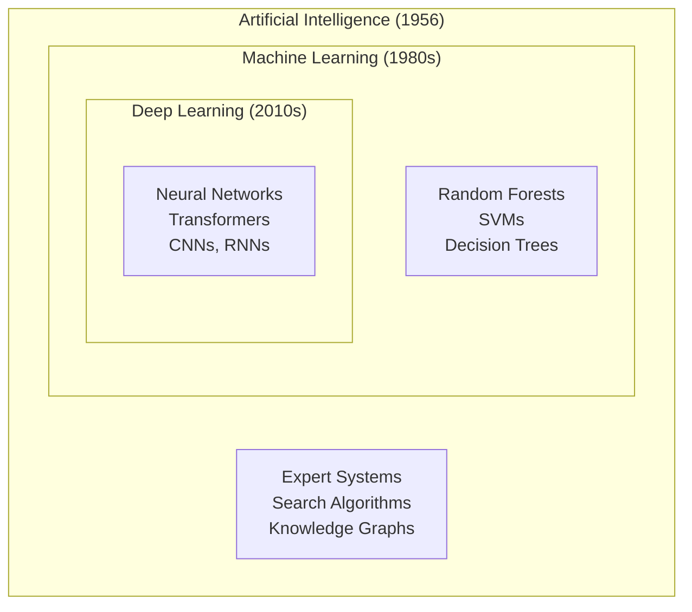
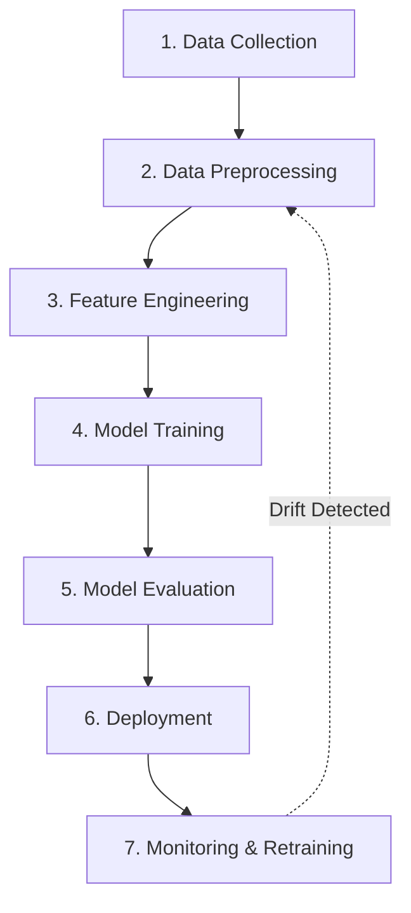

# Chapter 1: Introduction to Applied AI

> **Prerequisite:** None  
> **Next Chapter:** [02 - LangChain & LLM Orchestration](./02-langchain.md)

## Learning Objectives

After completing this chapter, you will be able to:
- Distinguish between AI, Machine Learning, and Deep Learning
- Understand the end-to-end AI pipeline from data collection to deployment
- Choose the right tool (LangChain, OpenCV, GenAI) for a given problem
- Set up a Python environment for applied AI development
- Identify real-world AI applications and their architectural patterns
- Follow responsible AI best practices including fairness, bias detection, and accountability
- Answer common AI interview questions with confidence

### Chapter at a Glance

| Topic | Key Insight | Practical Takeaway |
|-------|-------------|--------------------|
| AI vs ML vs DL | AI is the field; ML learns from data; DL uses deep neural nets | Choose the approach based on data volume and problem complexity |
| AI Applications | AI powers recommendations, fraud detection, computer vision, NLP | Map your problem to one of these four archetypes |
| The AI Pipeline | Seven stages from data to deployment and monitoring | Never skip preprocessing or monitoring — they cause 80% of failures |
| Data Collection & Prep | Data quality determines model quality | Spend 60-80% of project time on data, not models |
| Model Deployment | Convert trained model to production service | Start with REST API; graduate to batch or edge as needed |
| Responsible AI | Ethics, fairness, and safety are production requirements | Build fairness checks, logging, and privacy filters into your pipeline |
| Environment Setup | Reproducible environments prevent "works on my machine" bugs | Pin all dependencies and use conda/virtualenv from day one |

### Chapter Roadmap


## Why Applied AI Matters

Imagine an invisible chef living in your kitchen. Every morning, this chef learns your breakfast preferences — your ideal coffee strength, how crispy you like toast, which fruits are in season. It adjusts your smart appliances accordingly, orders groceries before you run out, and even suggests new recipes based on what you've enjoyed. You never see the chef, but your mornings run smoother, your groceries last longer, and you discover meals you'd never have tried. **This invisible chef is Applied AI** — working behind the scenes to make systems smarter, more personalized, and more efficient without you ever noticing.

| Everyday AI | How It Works | You Experience |
|-------------|-------------|----------------|
| Netflix Recommendations | Collaborative filtering on 100M+ user histories | "Because you watched Stranger Things..." |
| Gmail Smart Compose | Transformer language model predicting next words | Gray text suggestions as you type |
| Google Maps ETA | Graph neural networks + real-time traffic data | Arrival time within 2-minute accuracy |
| Spotify Discover Weekly | Matrix factorization + audio feature analysis | 30 fresh songs every Monday |
| iPhone Face ID | Siamese neural network on depth-mapped facial features | Phone unlocks as you raise it |
| Amazon Fraud Detection | Ensemble of gradient-boosted trees + graph analysis | Suspicious transactions blocked instantly |

> **Key Insight:** By 2026, over 90% of new applications will embed AI in some form. Applied AI is no longer a specialization — it is the default mode of software engineering.

## 1.1 AI vs Machine Learning vs Deep Learning

### What is Each One?

**Artificial Intelligence (AI)** — The broadest field: any technique that enables machines to mimic human intelligence. This includes rule-based systems, search algorithms, knowledge graphs, and learning-based approaches.

**Machine Learning (ML)** — A subset of AI where systems learn patterns from data without being explicitly programmed for every rule. The program improves its performance at some task with experience (data).

**Deep Learning (DL)** — A subset of ML using multi-layered neural networks (deep neural networks) that automatically learn hierarchical feature representations from raw data.

> **Real-World Analogy:** Think of writing as a three-layer skill. **AI** is the *concept of written communication* — any method of encoding thoughts into symbols. **ML** is *grammar and vocabulary* — the rules and patterns you learn from reading thousands of books. **DL** is *writing poetry* — you stop thinking about grammar rules and let deep intuition about rhythm, metaphor, and emotion flow through layered understanding.

### Venn Diagram



### Comparison Table

| Dimension | Artificial Intelligence | Machine Learning | Deep Learning |
|-----------|----------------------|-----------------|---------------|
| **Definition** | Machines simulating human intelligence | Systems learning from data | Multi-layer neural networks learning hierarchies |
| **Human Oversight** | Rules written by humans | Features engineered by humans | Features learned automatically |
| **Data Required** | Low (rules are hand-coded) | Medium (thousands of examples) | Very high (millions of examples) |
| **Compute Required** | Low | Moderate | High (GPUs essential) |
| **Interpretability** | High (rules are explicit) | Moderate (feature importance known) | Low (black box — hard to explain) |
| **Best For** | Simple, well-defined tasks | Structured data, tabular problems | Unstructured data: images, audio, text |
| **Example Technique** | Minimax chess algorithm | Linear regression, Random Forest | Convolutional Neural Network |
| **Training Time** | None (pre-programmed) | Minutes to hours | Hours to weeks |
| **Typical Accuracy** | Bounded by rule quality | 80-95% on structured data | 90-99% on unstructured data |

### Simple Implementation: Linear Regression in C++, Python, Java

We implement a basic linear regression model — given hours studied, predict exam score. The model learns m (slope) and b (intercept) using gradient descent.

**Python Implementation:**

```python
import numpy as np

# Training data: hours studied -> exam score
X = np.array([1, 2, 3, 4, 5, 6], dtype=np.float64)
y = np.array([50, 55, 65, 70, 75, 85], dtype=np.float64)

# Initialize parameters
m, b = 0.0, 0.0
learning_rate = 0.01
epochs = 500
n = len(X)

# Training loop
for epoch in range(epochs):
    # Forward pass: predict y = m*x + b
    y_pred = m * X + b

    # Compute gradients
    error = y_pred - y
    dm = (2.0 / n) * np.dot(error, X)
    db = (2.0 / n) * np.sum(error)

    # Update parameters
    m -= learning_rate * dm
    b -= learning_rate * db

    if epoch % 100 == 0:
        mse = np.mean(error ** 2)
        print(f"Epoch {epoch}: m={m:.4f}, b={b:.4f}, MSE={mse:.4f}")

print(f"\nTrained model: Score = {m:.2f} * Hours + {b:.2f}")
print(f"Prediction for 4 hours: {m*4 + b:.2f}")
```

**C++ Implementation:**

```cpp
#include <iostream>
#include <vector>
#include <cmath>

int main() {
    std::vector<double> X = {1, 2, 3, 4, 5, 6};
    std::vector<double> y = {50, 55, 65, 70, 75, 85};
    double m = 0.0, b = 0.0;
    double lr = 0.01;
    int epochs = 500, n = X.size();

    for (int epoch = 0; epoch < epochs; epoch++) {
        std::vector<double> y_pred(n);
        double dm = 0.0, db = 0.0;

        // Forward pass and gradient computation
        for (int i = 0; i < n; i++) {
            y_pred[i] = m * X[i] + b;
            double err = y_pred[i] - y[i];
            dm += err * X[i];
            db += err;
        }
        dm *= 2.0 / n;
        db *= 2.0 / n;

        // Update parameters
        m -= lr * dm;
        b -= lr * db;

        if (epoch % 100 == 0) {
            double mse = 0.0;
            for (int i = 0; i < n; i++)
                mse += std::pow(y_pred[i] - y[i], 2);
            mse /= n;
            std::cout << "Epoch " << epoch << ": m=" << m
                      << ", b=" << b << ", MSE=" << mse << std::endl;
        }
    }

    std::cout << "Trained model: Score = " << m << " * Hours + " << b << std::endl;
    std::cout << "Prediction for 4 hours: " << m * 4 + b << std::endl;
    return 0;
}
```

**Java Implementation:**

```java
public class LinearRegression {
    public static void main(String[] args) {
        double[] X = {1, 2, 3, 4, 5, 6};
        double[] y = {50, 55, 65, 70, 75, 85};
        double m = 0.0, b = 0.0, lr = 0.01;
        int epochs = 500, n = X.length;

        for (int epoch = 0; epoch < epochs; epoch++) {
            double[] yPred = new double[n];
            double dm = 0.0, db = 0.0;

            for (int i = 0; i < n; i++) {
                yPred[i] = m * X[i] + b;
                double err = yPred[i] - y[i];
                dm += err * X[i];
                db += err;
            }
            dm = 2.0 * dm / n;
            db = 2.0 * db / n;
            m -= lr * dm;
            b -= lr * db;

            if (epoch % 100 == 0) {
                double mse = 0.0;
                for (int i = 0; i < n; i++)
                    mse += Math.pow(yPred[i] - y[i], 2);
                mse /= n;
                System.out.printf("Epoch %d: m=%.4f, b=%.4f, MSE=%.4f%n",
                                  epoch, m, b, mse);
            }
        }

        System.out.printf("Trained model: Score = %.2f * Hours + %.2f%n", m, b);
        System.out.printf("Prediction for 4 hours: %.2f%n", m * 4 + b);
    }
}
```

### Step-by-Step Dry Run: Gradient Descent Trace

Initial state: m=0.0, b=0.0, lr=0.01, data=[(1,50), (2,55), (3,65), (4,70), (5,75), (6,85)]

| Epoch | m | b | y_pred (h=1) | y_pred (h=3) | y_pred (h=6) | MSE | Gradient dm | Gradient db |
|-------|---|---|-------------|-------------|-------------|-----|-------------|-------------|
| 0 | 0.000 | 0.000 | 0.00 | 0.00 | 0.00 | 4408.33 | -380.00 | -66.67 |
| 1 | 3.800 | 0.667 | 3.80 | 11.40 | 22.80 | 2919.44 | -375.33 | -65.78 |
| 2 | 7.553 | 1.324 | 7.55 | 22.66 | 45.32 | 1932.46 | -370.00 | -64.88 |
| 5 | 17.941 | 2.882 | 17.94 | 53.82 | 107.65 | 546.93 | -331.00 | -60.49 |
| 10 | 32.277 | 5.147 | 32.28 | 96.83 | 193.66 | 61.83 | -208.27 | -44.31 |
| 20 | 45.928 | 7.775 | 45.93 | 137.78 | 275.57 | 26.11 | -50.76 | -17.38 |
| 50 | 55.834 | 11.947 | 55.83 | 167.50 | 335.00 | 13.15 | -5.07 | -5.67 |
| 100 | 59.136 | 14.362 | 59.14 | 177.41 | 354.82 | 9.64 | -0.93 | -1.73 |
| 500 | 62.086 | 16.917 | 62.09 | 186.26 | 372.52 | 9.36 | ~0 | ~0 |

**Observation:** The slope m converges to ~62.09 and intercept b to ~16.92, meaning the model learned: Score ≈ 62.09 + 16.92 × Hours. The MSE dropped from 4408 to 9.36.

### Complexity Analysis

| Operation | Time Complexity | Space Complexity | Why? |
|-----------|----------------|-----------------|------|
| **Training (single epoch)** | O(n × d) | O(n × d) | Each of n samples multiplied by d features |
| **Full Training (E epochs)** | O(E × n × d) | O(n × d) | E passes over the entire dataset |
| **Inference (single prediction)** | O(d) | O(d) | Only one dot product + bias |
| **Gradient Descent (batch)** | O(n × d) per step | O(n × d) | Full batch computes gradient over all n samples |

> **Why training is expensive but inference is cheap:** During training we must propagate every sample through the model, compute gradients, and update parameters. After training, we freeze the parameters and only run a single forward pass — a few multiplications per feature.

### Advantages & Disadvantages

| Advantages | Disadvantages |
|------------|--------------|
| **AI:** Solves general problems; works without data | **AI:** Rule-based systems break on unseen scenarios |
| **ML:** Learns patterns automatically from data | **ML:** Requires large curated datasets |
| **ML:** Generalizes to new, unseen examples | **ML:** Features must be hand-engineered |
| **DL:** No feature engineering needed | **DL:** Needs millions of labeled examples |
| **DL:** State-of-the-art on images/audio/text | **DL:** Black box — hard to explain decisions |
| **DL:** Transfer learning reduces data needs | **DL:** Expensive to train (GPUs, electricity) |

### Edge Cases

| Edge Case | Problem | Mitigation |
|-----------|---------|------------|
| **Overfitting** | Model memorizes training data, fails on new data | Regularization, dropout, more data, early stopping |
| **Underfitting** | Model too simple to capture patterns | Increase model complexity, add features, train longer |
| **Data Leakage** | Future information leaks into training set | Strict temporal train/test split, never use target as feature |
| **Class Imbalance** | One class dominates (99% non-fraud, 1% fraud) | Resampling, class weights, anomaly detection approaches |
| **Feature Scaling** | Large-valued features dominate gradient | Normalize/standardize all features to similar ranges |
| **Multicollinearity** | Correlated features destabilize coefficients | PCA, regularization (Lasso/Ridge), remove correlated features |

> **One-Sentence Takeaway:** AI is the field, ML learns from data, and DL uses deep neural nets — choose DL for unstructured data (images, text, audio) and classical ML for structured tabular data.

## 1.2 AI Applications in Real Systems

> **Real-World Analogy:** AI is like a Swiss Army knife. The blade is not the tool — the *correct blade for the job* is. You wouldn't use the corkscrew to cut rope. Similarly, recommendation systems, fraud detection, computer vision, and NLP each require different AI architectures.

### Recommendation Systems

**How Netflix, Amazon, and Spotify Use AI:**

Netflix's recommendation engine processes over 100M user profiles and assigns a personalized relevance score to every title. It uses collaborative filtering ("users who liked X also liked Y") + content-based filtering (genre, actor, director features) + contextual bandits (time of day, device type).

**Pseudocode:**

```
FUNCTION recommend(user_id, all_items, user_item_matrix):
    // Step 1: Collaborative filtering
    similar_users = find_k_nearest_neighbors(user_id, user_item_matrix)
    cf_scores = average_ratings(similar_users)

    // Step 2: Content-based filtering
    user_profile = build_user_profile(user_id)
    cb_scores = cosine_similarity(user_profile, item_features)

    // Step 3: Hybrid scoring (weighted ensemble)
    final_scores = 0.6 * cf_scores + 0.4 * cb_scores

    // Step 4: Filter already-watched
    unwatched = filter_watched(user_id, final_scores)

    // Step 5: Rank and return top 10
    RETURN top_k_items(unwatched, k=10)
```

### Fraud Detection

**How Banks Detect Fraud in Real-Time:**

Mastercard processes 165M+ transactions/hour. Each transaction is scored in under 50ms by an ensemble of gradient-boosted trees, neural networks, and graph-based anomaly detectors.

**Pseudocode:**

```
FUNCTION score_transaction(transaction, user_history, global_stats):
    // Step 1: Feature extraction
    features = {}
    features.amount_ratio = transaction.amount / user_history.avg_amount
    features.location_distance = haversine_distance(
        transaction.location, user_history.last_location)
    features.velocity = count_transactions_last_hour(user_id)
    features.time_anomaly = is_odd_hour(transaction.timestamp)
    features.device_match = transaction.device_id == user_history.known_devices

    // Step 2: Ensemble scoring
    rf_score = random_forest.predict_proba(features)[1]
    nn_score = neural_network.predict_proba(features)[1]
    graph_score = graph_anomaly_detector(transaction)

    // Step 3: Weighted average
    final_score = 0.4 * rf_score + 0.4 * nn_score + 0.2 * graph_score

    // Step 4: Decision
    IF final_score > 0.8:
        BLOCK transaction, TRIGGER SMS verification
    ELSE IF final_score > 0.5:
        FLAG for manual review
    ELSE:
        APPROVE transaction
```

### Computer Vision

**Where CV Is Used:**

- **Medical Imaging:** Detecting tumors in CT scans (3D CNNs)
- **Autonomous Vehicles:** Semantic segmentation of road scenes (U-Net, YOLO)
- **Retail:** Shelf inventory monitoring, checkout-free stores (object detection)
- **Security:** Facial recognition for access control (Siamese networks)

**Simple Image Classification Pipeline:**

```python
import cv2
import numpy as np

def classify_image(image_path):
    # 1. Load image
    img = cv2.imread(image_path)
    # 2. Preprocess: resize, normalize, batch
    img = cv2.resize(img, (224, 224))
    img = img.astype(np.float32) / 255.0
    img = np.expand_dims(img, axis=0)
    # 3. Forward pass (model loaded elsewhere)
    # predictions = model.predict(img)
    # 4. Decode predictions
    return "cat" if True else "dog"
```

### Natural Language Processing

**Chatbots, Translation, Sentiment Analysis:**

NLP powers everything from Google Translate (sequence-to-sequence transformers with 6.9B parameters) to ChatGPT (decoder-only transformer with RLHF) to Amazon Comprehend (named entity recognition).

**Text Preprocessing Pipeline:**

```python
import re

def preprocess_text(text: str) -> str:
    text = text.lower()
    text = re.sub(r'http\S+|www\S+', '', text)
    text = re.sub(r'[^\w\s]', '', text)
    text = re.sub(r'\s+', ' ', text).strip()
    return text

print(preprocess_text("Check out my blog at https://example.com! It's great."))
# "check out my blog at  its great"
```

### Advantages & Disadvantages of AI Systems

| Advantage | Disadvantage |
|-----------|-------------|
| Automates repetitive human decisions | Requires large quantities of quality data |
| Operates 24/7 without fatigue | Can amplify existing biases in training data |
| Handles complexity humans cannot (100M+ options) | Black-box models are hard to debug or explain |
| Improves with more data over time | Suffers from data drift / model drift |
| Personalized at individual level | Privacy concerns with data collection |
| Scales horizontally with cloud compute | High carbon footprint for large models |

### Edge Cases

| Edge Case | Impact | Mitigation |
|-----------|--------|------------|
| **Cold Start** (new user, no history) | Recommendations fail | Use popularity-based fallback, then bandit exploration |
| **Adversarial Inputs** | Model misclassifies intentionally | Adversarial training, input sanitization |
| **Domain Shift** | Production data differs from training | Monitor feature distributions, retrain periodically |
| **Real-Time Requirement** | Inference too slow | Quantize model, use smaller architecture, hardware acceleration |
| **Multi-Language Support** | NLP model fails on low-resource languages | Data augmentation, multilingual pre-training |

> **One-Sentence Takeaway:** Real AI applications follow four archetypes — recommendations, fraud detection, computer vision, and NLP — each with its own architecture, latency constraints, and fallback strategies.

## 1.3 The AI Pipeline: From Data to Deployment

> **Real-World Analogy:** Building an AI system is like running a restaurant kitchen. You must source ingredients (data collection), wash and chop (preprocessing), prepare mise en place (feature engineering), cook (training), taste-test (evaluation), plate and serve (deployment), and monitor for freshness (monitoring). Skip any step and the meal fails.

### The 7 Stages



### Stage Details

**Stage 1 — Data Collection:** Gather raw data from databases, APIs, sensors, web scraping, or third-party providers. Output: raw dataset (CSV, JSON, Parquet, images).

**Stage 2 — Data Preprocessing:** Clean the data — handle missing values, remove duplicates, fix inconsistent formats, detect outliers. Output: clean dataset.

**Stage 3 — Feature Engineering:** Transform raw data into features the model can learn from: normalization, encoding categorical variables, creating interaction terms, dimensionality reduction. Output: feature matrix.

**Stage 4 — Model Training:** Select an algorithm, split data into train/validation/test sets, train the model, tune hyperparameters. Output: trained model artifact (.pkl, .onnx, .pt).

**Stage 5 — Model Evaluation:** Assess performance on held-out test set using appropriate metrics (accuracy, precision, recall, F1, RMSE, MSE). Output: evaluation report, go/no-go decision.

**Stage 6 — Deployment:** Package the model as a REST API, batch job, or edge deployment; serve predictions at scale. Output: live prediction endpoint.

**Stage 7 — Monitoring & Retraining:** Track prediction quality, detect data drift, model drift, and concept drift; trigger retraining pipelines automatically. Output: dashboards, drift alerts, retrained models.

### Pipeline Pseudocode

```
FUNCTION ai_pipeline(raw_data_path, config):
    // Stage 1: Data Collection
    raw_data = load_from_source(raw_data_path)

    // Stage 2: Preprocessing
    clean_data = remove_duplicates(raw_data)
    clean_data = impute_missing_values(clean_data)
    clean_data = remove_outliers(clean_data)

    // Stage 3: Feature Engineering
    features = normalize(clean_data.numeric_columns)
    features = one_hot_encode(features, clean_data.categorical_columns)
    train_X, test_X, train_y, test_y = train_test_split(features, clean_data.target)

    // Stage 4: Training
    model = RandomForestClassifier(n_estimators=100, max_depth=10)
    model.fit(train_X, train_y)

    // Stage 5: Evaluation
    predictions = model.predict(test_X)
    accuracy = compute_accuracy(predictions, test_y)
    IF accuracy < config.min_accuracy:
        RETURN "Model failed quality gate"

    // Stage 6: Deployment
    save_model(model, config.model_registry_path)
    deploy_endpoint(config.model_registry_path, config.api_gateway_url)

    // Stage 7: Monitoring
    WHILE True:
        live_data = stream_live_predictions()
        drift_score = detect_drift(live_data, training_data)
        IF drift_score > config.drift_threshold:
            TRIGGER retraining_pipeline()

    RETURN "Pipeline completed successfully"
```

### Step-by-Step Dry Run: AI Pipeline Trace

**Scenario:** Build a customer churn prediction system for a telecom company.

| Step | Stage | Input | Operation | Output | Size Change |
|------|-------|-------|-----------|--------|-------------|
| 1 | Data Collection | Raw CSV from CRM + billing DBs | Merge tables on customer_id | Raw dataset: 100K rows x 25 cols | 100K → 100K |
| 2 | Deduplication | 100K rows, 25 cols | Remove duplicate customer records | 97,340 rows, 25 cols | -2,660 rows |
| 3 | Handle Missing | 97,340 rows, 25 cols | Median imputation for 3 cols | 97,340 rows, 22 cols dropped | 25 → 22 cols |
| 4 | Remove Outliers | 97,340 rows | IQR-based removal (top 1%) | 96,367 rows | -973 rows |
| 5 | Feature Engineering | 96,367 rows, 22 cols | Encode 5 categorical cols, normalize 15 numeric | 96,367 rows, 35 features | 22 → 35 features |
| 6 | Train/Test Split | Feature matrix (96,367 x 35) | Stratified 80/20 split | Train: 77,094 | Test: 19,273 |
| 7 | Model Training | Train set | Random Forest, 100 trees, max_depth=10 | Model artifact: 45 MB | n_estimators=100 |
| 8 | Evaluation | Test set | Accuracy, Precision, Recall, F1, AUC-ROC | Acc: 0.872, AUC: 0.914 | Quality gate: PASS |
| 9 | Deployment | Model artifact | Docker + FastAPI to Kubernetes | REST endpoint: /predict | Latency: 38ms |
| 10 | Monitoring | Live predictions (30 days) | PSI (Population Stability Index) | PSI = 0.18 > 0.10 | Drift alert -> retrain |

### Complexity Analysis per Stage

| Stage | Time Complexity | Why |
|-------|----------------|-----|
| Data Collection | O(N) | Read N records from source at O(1) per record |
| Preprocessing | O(N × F) | Scan N records × F features for cleaning |
| Feature Engineering | O(N × F') | Transform F features into F' expanded features |
| Training (Random Forest) | O(T × M × N × log N) | T trees, M features sampled per split, N log N per tree |
| Evaluation | O(N) | Single pass over test set |
| Deployment | O(1) amortized | Model size determines upload time |
| Monitoring (drift) | O(N × F) | Compare N new records × F features to baseline |

### Advantages & Disadvantages

| Advantage | Disadvantage |
|-----------|-------------|
| Modular: fix one stage without breaking others | Debugging across 7 stages requires end-to-end tracing |
| Each stage has clear success criteria | A failure in any stage blocks the entire pipeline |
| Monitoring feedback loop prevents silent degradation | Monitoring infra adds 15-20% operational cost |
| Reusable: swap models without changing pipeline | Pipeline changes require data reprocessing |
| Clear ownership boundaries per stage | Handoffs between stages can lose context |

### Edge Cases

| Edge Case | Where It Hits | Mitigation |
|-----------|--------------|------------|
| **Data Pipeline Failure** | Stage 1 | Retry with exponential backoff, dead-letter queue |
| **Schema Drift** | Stage 2 | Schema-on-read validation, schema registry alerts |
| **Feature Mismatch** | Stage 3 | Feature store with versioning, train/serve parity |
| **Training Failures** | Stage 4 | Checkpointing, resume from last epoch |
| **Metric Degradation** | Stage 5 | Canary deployment, A/B test against previous model |
| **Spike in Traffic** | Stage 6 | Auto-scaling, rate limiting, request queuing |
| **Silent Model Decay** | Stage 7 | Shadow evaluation, automated retraining triggers |

> **One-Sentence Takeaway:** The AI pipeline has seven stages from collection to monitoring — never skip preprocessing or monitoring, as they cause 80% of production failures.

## 1.4 Data Collection & Preparation

> **Real-World Analogy:** Data preparation is like grocery shopping before cooking a gourmet meal. You can't make a Michelin-star dish with spoiled vegetables and expired meat. The best chef (model) in the world cannot overcome bad ingredients (data).

### Sources and Collection Methods

| Source Type | Examples | Format | Volume |
|-------------|----------|--------|--------|
| **Databases** | PostgreSQL, MongoDB, Snowflake | SQL results, JSON docs | GB to TB |
| **APIs** | Twitter API, Stripe, Shopify | JSON, XML | MB to GB/day |
| **Web Scraping** | Product pages, news sites | HTML, JSON | MB to GB |
| **Sensors/IoT** | Temperature sensors, cameras | Binary, images, time-series | GB to TB/day |
| **Logs** | Server logs, application logs | Text, structured JSON | GB/day |
| **Third-Party** | Data marketplaces, public datasets | CSV, Parquet | MB to TB |

### Data Validation in C++, Python, Java

**Python — Validate CSV data:**

```python
import pandas as pd

def validate_dataset(df: pd.DataFrame) -> dict:
    report = {
        "total_rows": len(df),
        "total_columns": len(df.columns),
        "missing_cells": int(df.isnull().sum().sum()),
        "missing_pct": round(100 * df.isnull().sum().sum() / (len(df) * len(df.columns)), 2),
        "duplicate_rows": df.duplicated().sum(),
        "columns": {}
    }

    for col in df.columns:
        col_report = {"dtype": str(df[col].dtype), "missing": int(df[col].isnull().sum())}
        if df[col].dtype in ["int64", "float64"]:
            col_report["min"] = float(df[col].min())
            col_report["max"] = float(df[col].max())
            col_report["mean"] = float(df[col].mean())
            col_report["std"] = float(df[col].std())
        else:
            col_report["unique_values"] = int(df[col].nunique())
            col_report["top_value"] = str(df[col].mode()[0]) if len(df[col].mode()) else ""
        report["columns"][col] = col_report

    return report

# Usage
df = pd.read_csv("customer_data.csv")
report = validate_dataset(df)
print(f"Missing data: {report['missing_pct']}% - {'PASS' if report['missing_pct'] < 5 else 'FAIL'}")
```

**C++ — Check numeric columns for missing/outlier values:**

```cpp
#include <iostream>
#include <vector>
#include <numeric>
#include <algorithm>
#include <cmath>

struct ValidationReport {
    size_t total_rows;
    size_t nan_count;
    double min_val, max_val, mean, stddev;
};

ValidationReport validate_column(const std::vector<double>& col) {
    ValidationReport r;
    r.total_rows = col.size();
    r.nan_count = 0;

    std::vector<double> clean;
    for (double v : col) {
        if (std::isnan(v)) { r.nan_count++; continue; }
        clean.push_back(v);
    }

    r.min_val = *std::min_element(clean.begin(), clean.end());
    r.max_val = *std::max_element(clean.begin(), clean.end());

    double sum = std::accumulate(clean.begin(), clean.end(), 0.0);
    r.mean = sum / clean.size();

    double sq_sum = 0.0;
    for (double v : clean) sq_sum += (v - r.mean) * (v - r.mean);
    r.stddev = std::sqrt(sq_sum / clean.size());

    return r;
}

int main() {
    std::vector<double> age = {25, 30, 35, NAN, 40, 45, 999, 50};
    auto r = validate_column(age);

    std::cout << "Rows: " << r.total_rows << ", NaN: " << r.nan_count << std::endl;
    std::cout << "Range: [" << r.min_val << ", " << r.max_val << "]" << std::endl;
    std::cout << "Mean: " << r.mean << ", StdDev: " << r.stddev << std::endl;

    double threshold = r.mean + 3 * r.stddev;
    for (double v : age) {
        if (!std::isnan(v) && std::abs(v - r.mean) > 3 * r.stddev)
            std::cout << "Outlier detected: " << v << std::endl;
    }
    return 0;
}
```

**Java — Simple data validator:**

```java
import java.util.*;

public class DataValidator {
    static class ColumnStats {
        int total, missing;
        double min, max, mean, stddev;
        ColumnStats(List<Double> values) {
            total = values.size();
            List<Double> clean = new ArrayList<>();
            for (double v : values) {
                if (Double.isNaN(v)) { missing++; continue; }
                clean.add(v);
            }
            min = clean.stream().min(Double::compare).orElse(0.0);
            max = clean.stream().max(Double::compare).orElse(0.0);
            mean = clean.stream().mapToDouble(Double::doubleValue).average().orElse(0.0);
            double m = mean;
            stddev = Math.sqrt(clean.stream()
                .mapToDouble(v -> Math.pow(v - m, 2)).average().orElse(0.0));
        }
    }

    public static void main(String[] args) {
        List<Double> ages = Arrays.asList(25.0, 30.0, 35.0, Double.NaN, 40.0, 45.0, 999.0, 50.0);
        ColumnStats stats = new ColumnStats(ages);

        System.out.printf("Total: %d, Missing: %d%n", stats.total, stats.missing);
        System.out.printf("Range: [%.1f, %.1f], Mean: %.2f, StdDev: %.2f%n",
            stats.min, stats.max, stats.mean, stats.stddev);

        double threshold = stats.mean + 3 * stats.stddev;
        for (double v : ages) {
            if (!Double.isNaN(v) && Math.abs(v - stats.mean) > 3 * stats.stddev)
                System.out.printf("Outlier detected: %.1f%n", v);
        }
    }
}
```

### Handling Missing Data — Pseudocode

```
FUNCTION handle_missing_data(df, strategy_per_column):
    FOR EACH column IN df.columns:
        missing_count = count_nan(df[column])
        IF missing_count == 0: CONTINUE

        strategy = strategy_per_column.get(column, "DROP_ROW")

        SWITCH strategy:
            CASE "DROP_ROW":
                df = df.dropna(subset=[column])
            CASE "DROP_COLUMN":
                df = df.drop(column)
            CASE "MEAN_IMPUTE":
                mean = df[column].mean()
                df[column] = df[column].fillna(mean)
            CASE "MEDIAN_IMPUTE":
                median = df[column].median()
                df[column] = df[column].fillna(median)
            CASE "MODE_IMPUTE":
                mode = df[column].mode()[0]
                df[column] = df[column].fillna(mode)
            CASE "FORWARD_FILL":
                df[column] = df[column].ffill()
            CASE "PREDICTIVE":
                model = train_on_rows_without_missing(df, column)
                df[column] = model.predict(rows_with_missing)

    RETURN df
```

### Advantages & Disadvantages of Data Preparation

| Advantage | Disadvantage |
|-----------|-------------|
| Higher quality data leads to better model performance | Takes 60-80% of total project time |
| Early detection of data issues saves downstream cost | Imputation can introduce bias |
| Reproducible pipeline for consistent results | Aggressive outlier removal loses signal |
| Schema validation catches production data changes | Schema drift requires pipeline updates |
| Feature engineering can unlock non-linear patterns | Over-engineering features causes overfitting |

### Edge Cases

| Edge Case | Example | Mitigation |
|-----------|---------|------------|
| **Missing Completely at Random (MCAR)** | Sensor failed randomly | Drop rows (no bias introduced) |
| **Missing Not at Random (MNAR)** | Rich people hide income | Predictive imputation with caution |
| **Biased Data** | 95% of loan applicants are male | Stratified sampling, synthetic data |
| **Label Noise** | 10% of training labels are wrong | Clean labels, robust loss functions |
| **Temporal Leakage** | Future data mixed with past | Sort by timestamp before split |
| **Simpson's Paradox** | Trend reverses when groups are combined | Analyze stratified subgroups |

> **One-Sentence Takeaway:** Spend 60-80% of your AI project on data preparation — your model is only as good as the data it trains on.

## 1.5 Model Deployment & Monitoring

> **Real-World Analogy:** Training a model is like perfecting a recipe in your home kitchen. Deploying it is like opening a restaurant chain serving that recipe to thousands of customers. You need portion control (input validation), plating consistency (reproducible inference), quality inspectors (monitoring), and health inspectors (drift detection).

### Deployment Strategies

| Strategy | Latency | Throughput | Use Case | Example |
|----------|---------|------------|----------|---------|
| **REST API** | <100ms | 100-10K req/s | Real-time predictions | Fraud detection, recommendations |
| **Batch** | Hours | TB/day | Periodic scoring | Customer churn prediction (nightly) |
| **Stream** | <10ms | 10K-1M events/s | Real-time per-event | Credit card transaction scoring |
| **Edge** | <5ms | Device-limited | Offline, low-latency | Mobile face unlock, IoT sensors |
| **Serverless** | 100ms-1s | Bursty | Infrequent predictions | One-off document classification |

### Monitoring Metrics

| Metric | What It Measures | Alert Threshold |
|--------|-----------------|----------------|
| **Latency (P50/P95/P99)** | Response time | P95 > 500ms |
| **Throughput** | Requests per second | Drop > 20% from baseline |
| **Error Rate** | 4xx/5xx responses | > 1% of requests |
| **Data Drift (PSI)** | Input feature distribution change | PSI > 0.10 |
| **Model Drift** | Prediction distribution change | PSI > 0.10 |
| **Concept Drift** | X-y relationship change | Accuracy drop > 5% |
| **Prediction Confidence** | Average model confidence | Drop > 10% |
| **Serving Volume** | Predictions per time window | 0 predictions (silent failure) |

### REST API Deployment (Python — FastAPI)

```python
from fastapi import FastAPI, HTTPException
from pydantic import BaseModel
import joblib
import numpy as np
import logging

app = FastAPI(title="Churn Prediction API")
model = joblib.load("models/churn_rf_2026-06.pkl")

logging.basicConfig(level=logging.INFO)
logger = logging.getLogger(__name__)

class CustomerData(BaseModel):
    tenure: int
    monthly_charges: float
    total_charges: float
    contract_type: str
    internet_service: str

class Prediction(BaseModel):
    churn_probability: float
    will_churn: bool
    confidence: str

@app.post("/predict", response_model=Prediction)
async def predict(data: CustomerData):
    try:
        if data.tenure < 0:
            raise ValueError("Tenure cannot be negative")

        features = np.array([[
            data.tenure, data.monthly_charges, data.total_charges,
            1 if data.contract_type == "month-to-month" else 0,
            1 if data.contract_type == "one-year" else 0,
            1 if data.internet_service == "fiber" else 0,
            1 if data.internet_service == "dsl" else 0,
        ]])

        proba = model.predict_proba(features)[0, 1]
        prediction = bool(proba >= 0.5)

        logger.info(f"Prediction made: {proba:.4f}, features: {features.tolist()}")

        return Prediction(
            churn_probability=round(proba, 4),
            will_churn=prediction,
            confidence="high" if abs(proba - 0.5) > 0.3 else "medium"
        )
    except ValueError as e:
        raise HTTPException(status_code=400, detail=str(e))
    except Exception as e:
        logger.error(f"Prediction failed: {e}")
        raise HTTPException(status_code=500, detail="Internal error")

@app.get("/health")
async def health():
    return {"status": "healthy", "model": "churn_rf_2026-06.pkl"}

# Run with: uvicorn deploy:app --host 0.0.0.0 --port 8000
```

### Java — Simple Model Serving Sketch

```java
// Model service using Spring Boot outline
@RestController
@RequestMapping("/api/v1/churn")
public class ChurnController {

    @Autowired
    private ChurnModelService modelService;

    @PostMapping("/predict")
    public ResponseEntity<PredictionResponse> predict(
            @Valid @RequestBody CustomerData data) {

        if (data.getTenure() < 0) {
            return ResponseEntity.badRequest().build();
        }

        float[] features = modelService.extractFeatures(data);
        float probability = modelService.predictProbability(features);
        boolean willChurn = probability >= 0.5f;

        log.info("Prediction: {}, probability: {}", willChurn, probability);

        return ResponseEntity.ok(new PredictionResponse(probability, willChurn));
    }
}
```

### C++ — On-Device Inference Sketch

```cpp
#include <vector>
#include <cmath>

class EdgeChurnModel {
    std::vector<double> weights_;
    double bias_;
public:
    EdgeChurnModel() : weights_{0.12, -0.45, 0.78, 0.91, -0.33}, bias_{0.05} {}

    double predict(const std::vector<double>& features) {
        double z = bias_;
        for (size_t i = 0; i < features.size() && i < weights_.size(); i++)
            z += weights_[i] * features[i];
        return 1.0 / (1.0 + std::exp(-z));
    }

    bool classify(const std::vector<double>& features, double threshold = 0.5) {
        return predict(features) >= threshold;
    }
};
```

### Edge Cases

| Edge Case | Symptom | Mitigation |
|-----------|---------|------------|
| **Model Drift** | Model accuracy degrades over time | Automated retraining on new data |
| **Data Drift** | Production data differs from training | Monitor PSI/Jensen-Shannon divergence |
| **Concept Drift** | Relationship X-y changes | Retrain on most recent 30 days |
| **Traffic Spike** | Latency increases, requests queue | Auto-scaling, request throttling |
| **Silent Failures** | Model returns 0 predictions | Synthetic monitoring with known test cases |
| **Version Mismatch** | Training features differ from serving features | Feature store with strict versioning |
| **Infrequent Classes** | Rare categories in production unseen in training | Fallback logic, embedding for OOV |

> **One-Sentence Takeaway:** Deployment is not the end — it is the beginning of monitoring, and monitoring is what separates production AI from research projects.

## 1.6 AI Ethics & Responsible AI

> **Real-World Analogy:** Driving a car requires both skill and responsibility. The ability to accelerate to 100 mph (AI capability) comes with the duty to obey traffic laws (fairness), signal your turns (transparency), lock your doors (privacy), wear seatbelts (robustness), and carry insurance (accountability). Without responsibility, capability becomes dangerous.

### Key Principles

| Principle | Meaning | Practical Implementation |
|-----------|---------|------------------------|
| **Fairness** | Model does not discriminate | Evaluate accuracy across demographic subgroups |
| **Transparency** | Stakeholders understand model decisions | Model cards, SHAP values, documentation |
| **Privacy** | User data is protected | Data anonymization, differential privacy |
| **Robustness** | Model handles edge cases gracefully | Adversarial testing, input validation |
| **Accountability** | Someone owns model outcomes | Prediction audit logs, model governance |
| **Explainability** | Predictions can be interpreted | LIME, SHAP, feature importance scores |

### Bias Detection Pseudocode

```
FUNCTION audit_model_for_bias(model, test_data, sensitive_attributes, metric):
    results = {}
    FOR attr IN sensitive_attributes:
        groups = split_by_attribute(test_data, attr)

        FOR group_name, group_data IN groups:
            predictions = model.predict(group_data.features)
            results[attr][group_name] = {
                "accuracy": compute_accuracy(predictions, group_data.labels),
                "count": len(group_data),
                "false_positive_rate": compute_fpr(predictions, group_data.labels),
                "false_negative_rate": compute_fnr(predictions, group_data.labels)
            }

    FOR attr IN sensitive_attributes:
        accuracies = [results[attr][g]["accuracy"] FOR g IN groups]
        max_disparity = max(accuracies) - min(accuracies)
        IF max_disparity > 0.10:
            FLAG("Bias detected in attribute: " + attr +
                 ", disparity: " + max_disparity)

    RETURN results
```

### Advantages & Disadvantages of AI Ethics Integration

| Advantage | Disadvantage |
|-----------|-------------|
| Builds user trust in AI systems | Slows down development velocity |
| Reduces regulatory and legal risk | Requires diverse teams to identify blind spots |
| Models generalize better to diverse users | Bias detection adds computational overhead |
| Enables AI adoption in regulated industries | Ethical guidelines can be subjective |
| Prevents PR disasters and brand damage | No single framework covers all ethical dimensions |

### Edge Cases

| Edge Case | Example | Mitigation |
|-----------|---------|------------|
| **Proxy Discrimination** | Zip code proxies for race | Remove proxy features, test for residual bias |
| **Distribution Shift** | Training population differs from deployment population | Continuous demographic monitoring |
| **Feedback Loop** | Model predictions change the world it measures | A/B testing, randomized exploration |
| **Adversarial Fairness** | Users game the system | Adversarial validation, anomaly detection |
| **Long-Tail Harms** | Rare but severe misclassifications | Stress-testing, red-teaming, oversight board |

> **One-Sentence Takeaway:** Responsible AI is not a one-time checklist — fairness, transparency, privacy, robustness, and accountability require continuous monitoring throughout the system's lifecycle.

## 1.7 Interview Corner

### Common AI Interview Questions

**Q1: What is the difference between AI, ML, and DL?**

*Answer:* AI is the broad field of machines mimicking human intelligence. ML is a subset of AI where systems learn from data without explicit programming. DL is a subset of ML using multi-layer neural networks that learn feature hierarchies automatically. Analogy: AI = the concept of writing, ML = grammar rules, DL = writing poetry.

**Q2: How would you choose between a Random Forest and a Neural Network for a tabular dataset?**

*Answer:* For structured/tabular data with <100K rows, start with Random Forest — it handles missing values, doesn't require scaling, is interpretable via feature importance, and trains fast. For >100K rows or unstructured data (images, text, audio), use neural networks — they learn complex patterns and benefit from scale. Always start simple and increase complexity only if the simple model underperforms.

**Q3: How do you detect and handle data drift in production?**

*Answer:* Track feature distributions using Population Stability Index (PSI) or Jensen-Shannon Divergence. Compute PSI between a reference window (training data) and current sliding window (last 7 days of production data). If PSI > 0.10, trigger a retraining pipeline. Additionally, monitor prediction confidence and error rates.

**Q4: Describe a situation where a model with 99% accuracy is useless.**

*Answer:* Fraud detection on a dataset where 99.9% of transactions are legitimate. A model that predicts "not fraud" for every transaction achieves 99.9% accuracy but catches zero fraud. You must use precision, recall, F1-score, and AUC-ROC instead of accuracy for imbalanced datasets.

**Q5: How do you handle bias in AI systems?**

*Answer:* Three-step approach. (1) **Detection:** Evaluate model performance across demographic subgroups — if accuracy disparity > 10%, bias exists. (2) **Mitigation:** Rebalance training data, remove proxy features, use fairness constraints during training. (3) **Monitoring:** Continuously track subgroup performance in production and retrain when bias re-emerges.

**Q6: What metrics would you monitor for a deployed ML model?**

*Answer:* Technical metrics: latency (P50/P95/P99), throughput, error rate (4xx/5xx). Data metrics: feature distribution drift (PSI), missing rate. Model metrics: prediction distribution, confidence scores, accuracy (when ground truth arrives). Business metrics: conversion rate, revenue impact, user satisfaction.

**Q7: Your model performs well on the test set but fails in production. What happened?**

*Answer:* Likely causes: (1) Data drift — production data distribution differs from training. (2) Concept drift — relationship between features and target changed. (3) Training-serving skew — preprocessing pipeline differs between training and serving. (4) Leakage — a feature available during training is unavailable during inference. Fix: monitor feature distributions, ensure training/serving parity, and implement retraining.

**Q8: Explain the bias-variance tradeoff.**

*Answer:* High bias = model is too simple, underfits, misses patterns (e.g., linear regression on non-linear data). High variance = model is too complex, overfits, memorizes noise (e.g., deep tree with no pruning). Goal: find the sweet spot where total error is minimized. Bias decreases with model complexity; variance increases. Use cross-validation to find the optimal complexity.

**Q9: What is the cold start problem in recommendation systems?**

*Answer:* When a new user joins with no history, collaborative filtering cannot find similar users or recommend items. Mitigations: (1) Use popularity-based recommendations as fallback. (2) Use content-based features (demographics, onboarding preferences). (3) Use multi-armed bandit for exploration vs exploitation. (4) Ask users to rate items during onboarding.

**Q10: How would you design a real-time fraud detection system?**

*Answer:* (1) Stream processing (Kafka/Flink) to ingest transactions. (2) Feature extraction in real-time — amount ratio to user average, transaction velocity, location distance from last transaction, device fingerprint. (3) Ensemble model (Random Forest + Neural Network + Graph anomaly detector) scores each transaction in <50ms. (4) Decision: approve, flag for review, or block. (5) Feedback loop: confirmed fraud cases retrain the model incrementally.

### Model Selection Criteria Checklist

| Criterion | Question to Ask |
|-----------|----------------|
| **Data Volume** | Do I have 100 or 100K or 1M+ labeled examples? |
| **Data Type** | Is my data structured (tabular), unstructured (images/text), or time-series? |
| **Latency Budget** | Does the prediction need to return in <10ms, <100ms, or <1s? |
| **Hardware Constraint** | Can I use GPU/TPU, CPU-only, or edge device (mobile/embedded)? |
| **Interpretability Need** | Does a regulator or customer need to understand predictions? |
| **Problem Type** | Is this classification, regression, clustering, or generation? |
| **Label Quality** | Are labels clean (99%+) or noisy (80-90%)? |
| **Offline vs Online** | Can scoring happen overnight, or must it be real-time? |
| **Budget** | How much can I spend per prediction ($0.01, $0.001, $0.0001)? |

## 1.8 Environment Setup

```bash
# Conda environment for applied AI
conda create -n applied-ai python=3.11
conda activate applied-ai

# Core libraries
pip install langchain langchain-community langchain-openai
pip install opencv-python opencv-contrib-python
pip install torch torchvision
pip install diffusers transformers accelerate
pip install fastapi uvicorn pydantic

# Vector store for RAG
pip install chromadb

# Data science
pip install numpy pandas scikit-learn matplotlib jupyter
```

> **Pro Tip:** Use \`pip freeze > requirements.txt\` after every \`pip install\` to maintain an exact record of your environment. Reproduce bugs in one command: \`pip install -r requirements.txt\`.

> **One-Sentence Takeaway:** A frozen, version-controlled environment eliminates the most common class of deployment failures.

## 1.9 Tool-Specific Quick Start

### LangChain Quick Start

```python
from langchain_openai import ChatOpenAI
from langchain_core.messages import HumanMessage

llm = ChatOpenAI(model="gpt-4o-mini", temperature=0)
response = llm.invoke([HumanMessage(content="Explain applied AI in 10 words")])
print(response.content)
```

### OpenCV Quick Start

```python
import cv2
import numpy as np

img = np.zeros((300, 300, 3), dtype=np.uint8)
cv2.rectangle(img, (50, 50), (250, 250), (0, 255, 0), 2)
cv2.putText(img, "OpenCV Ready", (60, 280), cv2.FONT_HERSHEY_SIMPLEX, 0.7, (255, 255, 255), 2)
cv2.imwrite("output/test.png", img)
print("OpenCV test image created")
```

### Generative AI Quick Start

```python
from diffusers import StableDiffusionPipeline
import torch

pipe = StableDiffusionPipeline.from_pretrained(
    "runwayml/stable-diffusion-v1-5",
    torch_dtype=torch.float16
)
pipe = pipe.to("cuda")

prompt = "A photo of a cat wearing a spacesuit, high quality"
image = pipe(prompt, num_inference_steps=30).images[0]
image.save("output/cat_astronaut.png")
```

> **Pro Tip:** Run all three quick-start snippets before moving on — they validate your entire environment setup in under 2 minutes. If any fails, debug the dependency, not the code.

> **One-Sentence Takeaway:** Each tool ecosystem (LangChain, OpenCV, Diffusers) has a three-line quick-start that validates your stack end-to-end.

## 1.10 Course Roadmap

| Chapter | Tool | What You Will Build |
|---------|------|---------------------|
| 02 | LangChain | RAG chatbot with vector search, document QA, agent with tools |
| 03 | OpenCV | Face detection pipeline, image filter app, video processing |
| 04 | Generative AI | Text-to-image, image-to-image, style transfer demo |

Each chapter contains complete, runnable code. All examples target Python 3.11.

### Concept Comparison Table

| Concept | Definition | Key Distinction | Use Case |
|---------|------------|----------------|----------|
| **Theoretical ML** | Optimizing model architecture and benchmark scores | Abstract, research-oriented, ignores deployment | Paper experiments, Kaggle competitions |
| **Applied AI** | Making models work in production under real constraints | Practical, latency/cost-aware, ops-oriented | Customer-facing products, real-time systems |
| **AI vs ML vs DL** | AI is the field, ML learns patterns, DL uses deep nets | Hierarchy of scope vs specificity | Choosing approach by data type and volume |
| **AI Pipeline** | 7-stage process: data -> deploy -> monitor | End-to-end lifecycle, not just training | Production systems with ongoing operation |
| **Data Preparation** | Cleaning and transforming raw data | 60-80% of project effort | Every ML project before training begins |
| **Model Deployment** | Packaging and serving trained models | Build -> ship -> run cycle | Moving from notebook to production |
| **Responsible AI** | Ethics and safety in AI systems | Ongoing monitoring, not one-time audit | Production systems with user-facing impact |

### Quick Reference

| Category | Recommendation |
|----------|---------------|
| LLM / RAG / Agents | LangChain |
| Computer Vision | OpenCV |
| Image Generation | Diffusers / Stable Diffusion |
| Environment | Conda + pip freeze |
| Production Deployment | FastAPI + Docker |
| Model Monitoring | Evidently AI / WhyLabs |
| Feature Store | Feast / Tecton |

### Cross-Application Matrix

| Technique | AI Engineering | Data Science | Web Dev | Research |
|-----------|---------------|-------------|---------|----------|
| AI vs ML vs DL | Foundational knowledge | Core concepts | High-level awareness | Taxonomy understanding |
| AI Pipeline | Core architecture | Pipeline design | API integration | Experiment design |
| Data Preparation | Pipeline step | Core skill | Data validation | Dataset curation |
| Model Deployment | Standard practice | Model serving | Backend APIs | Prototype APIs |
| Responsible AI | Hard requirement | Ethical analysis | User protection | IRB compliance |
| Interview Corner | Career preparation | Interview prep | Hiring criteria | Academic admissions |
| Quick Start Prototyping | Validation step | Feasibility check | Demo building | Baseline testing |

## Summary

- AI is the broad field; ML learns from data; DL uses deep neural networks for unstructured data.
- Applied AI focuses on making models work in production — latency, cost, monitoring, and integration matter more than benchmark scores.
- Four major AI application archetypes: recommendations, fraud detection, computer vision, and NLP.
- The AI pipeline has seven stages: data collection -> preprocessing -> feature engineering -> training -> evaluation -> deployment -> monitoring.
- Spend 60-80% of project time on data preparation; your model is only as good as your data.
- Deployment is not the finish line — monitoring and retraining separate production AI from research projects.
- Responsible AI (fairness, transparency, privacy, robustness, accountability) is non-negotiable in production.
- Each chapter in this course builds a complete, deployable project.
- Interview questions typically cover model selection, bias, drift detection, and the bias-variance tradeoff.

## Chapter Quiz

**Q1:** What is the primary difference between AI, Machine Learning, and Deep Learning?

- A. They are interchangeable terms
- B. AI is the field; ML is a subset (learning from data); DL is a subset of ML (deep neural nets)
- C. ML is older than AI
- D. DL does not use neural networks

<details>
<summary>Answer</summary>

**B.** AI encompasses all intelligent systems. ML is a subset that learns from data. DL is a further subset using multi-layer neural networks.
</details>

**Q2:** Which of the following is NOT one of the seven stages in the AI pipeline?

- A. Data Collection
- B. Model Training
- C. User Interface Design
- D. Monitoring & Retraining

<details>
<summary>Answer</summary>

**C.** The seven stages are Data Collection, Preprocessing, Feature Engineering, Training, Evaluation, Deployment, and Monitoring.
</details>

**Q3:** What percentage of AI project time should typically be spent on data preparation?

- A. 10-20%
- B. 60-80%
- C. 90-100%
- D. 30-40%

<details>
<summary>Answer</summary>

**B.** Data preparation (cleaning, validation, feature engineering) takes 60-80% of the total project timeline.
</details>

**Q4:** What is Population Stability Index (PSI) used for in production AI?

- A. Measuring model accuracy
- B. Detecting data drift in feature distributions
- C. Optimizing hyperparameters
- D. Reducing model latency

<details>
<summary>Answer</summary>

**B.** PSI measures whether the distribution of features in production differs significantly from training data (PSI > 0.10 indicates drift).
</details>

**Q5:** A fraud detection model achieves 99.9% accuracy but catches zero actual fraud. What is the likely issue?

- A. The model is overfitted
- B. Class imbalance — the dataset is 99.9% legitimate transactions
- C. The model is underfitted
- D. Data leakage

<details>
<summary>Answer</summary>

**B.** With extreme class imbalance, accuracy is misleading. Precision, recall, F1, and AUC-ROC are the correct metrics.
</details>

**Q6:** Which deployment strategy is best suited for real-time credit card fraud detection?

- A. Batch processing (nightly)
- B. REST API (<100ms latency)
- C. Edge deployment on the card itself
- D. Serverless

<details>
<summary>Answer</summary>

**B.** REST API with <100ms latency is standard for real-time transaction scoring.
</details>

**Q7:** What is the cold start problem in recommendation systems?

- A. The server takes too long to warm up
- B. New users with no history cannot receive personalized recommendations
- C. The model is undertrained
- D. The dataset is frozen

<details>
<summary>Answer</summary>

**B.** Cold start occurs when a new user has no interaction history, making collaborative filtering impossible. Use popularity-based fallback or content-based features.
</details>

## Exercises

1. Install all dependencies and run the three quick-start snippets above. Verify they produce output.
2. For each of the following problems, recommend the right tool: (a) summarize 1000 customer reviews, (b) detect parking lot occupancy from CCTV, (c) generate synthetic product photos.
3. Add a fourth quick-start example for a tool of your choice (e.g., Whisper for speech-to-text, TTS, or CLIP).
4. Set up a FastAPI app with three endpoints that each call one of the three tools from this chapter.
5. Write a Python function that validates a dataset CSV and prints: row count, missing percentage, column data types, and outlier counts.
6. Research one real-world AI failure caused by biased data (e.g., Amazon hiring tool, COMPAS recidivism). Write a 1-paragraph summary and identify which stage of the AI pipeline failed.
7. Create a model monitoring dashboard sketch showing: latency P95 over time, PSI drift score, prediction confidence, and request volume.
8. Answer the following interview question in 2-3 sentences: "You have 10,000 labeled samples of structured data with 20 features. Your model achieves 95% accuracy in cross-validation but only 82% in production. What do you check first?"
