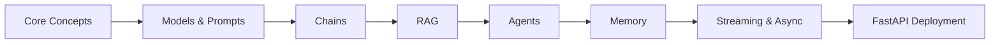

# Chapter 2: LangChain & LLM Orchestration

> **Prerequisite:** [01 - Introduction to Applied AI](./01-introduction.md)  
> **Next Chapter:** [03 - OpenCV & Computer Vision](./03-opencv.md)

## Learning Objectives

After completing this chapter, you will be able to:
- Build chains for LLM calls with prompt templates and output parsing
- Implement Retrieval-Augmented Generation (RAG) with vector stores
- Create agents that use tools (search, calculator, API calls)
- Add memory for conversational context
- Stream responses and handle async operations
- Deploy a LangChain application with FastAPI

### Chapter at a Glance

| Topic | Key Insight | Practical Takeaway |
|-------|-------------|--------------------|
| Models & Prompts | Templates parameterize LLM calls; parsers enforce structured output | Always use prompt templates — never hardcode strings in application logic |
| Chains | Compose LLM calls with pipe syntax for reusable pipelines | Chain operations sequentially or in parallel with RunnablePassthrough |
| RAG | Retrieval grounds LLM answers in your own data | Use RecursiveCharacterTextSplitter + Chroma for a production-ready vector store |
| Agents | LLMs decide which tools to call and in what order | Define tools with `@tool` decorator and let the agent orchestrate |
| Memory | Preserve conversational state across turns | Use RunnableWithMessageHistory with session IDs for multi-turn applications |
| Streaming & Async | Reduce perceived latency and handle concurrent users | Always enable `streaming=True` for chat interfaces |

### Chapter Roadmap



## 2.1 Core Concepts

LangChain is a framework for building LLM-powered applications. Its core abstractions:

| Component | Purpose |
|-----------|---------|
| **Model** | Wrapper around LLM APIs (OpenAI, Anthropic, local) |
| **Prompt Template** | Parameterized prompt strings |
| **Output Parser** | Structured response parsing (JSON, dataclass) |
| **Chain** | Composable sequence of calls |
| **Memory** | State persistence across conversations |
| **Retriever** | Document fetching for RAG |
| **Agent** | LLM that decides which tools to call |
| **Tool** | Function the agent can invoke |

> **💡 Pro Tip:** LangChain abstractions are composable — you can swap models, parsers, and retrievers without changing the rest of your chain. Design your code with this interchangeability in mind.

> **One-Sentence Takeaway:** LangChain's eight core components form a Lego-like system for building LLM applications.

## 2.2 Models & Prompts

### 2.2.1 Basic LLM Call

```python
from langchain_openai import ChatOpenAI
from langchain_core.messages import HumanMessage, SystemMessage

llm = ChatOpenAI(model="gpt-4o-mini", temperature=0.2)

messages = [
    SystemMessage(content="You are a helpful coding assistant. Answer concisely."),
    HumanMessage(content="Write a Python function to check if a string is a palindrome."),
]
response = llm.invoke(messages)
print(response.content)
```

### 2.2.2 Prompt Templates

```python
from langchain_core.prompts import ChatPromptTemplate

template = ChatPromptTemplate.from_messages([
    ("system", "You are a {role} expert. Answer in {language}."),
    ("human", "{question}"),
])

prompt = template.invoke({
    "role": "Python",
    "language": "English",
    "question": "Explain decorators with an example",
})
print(prompt.messages)
```

### 2.2.3 Output Parsers

```python
from langchain_core.output_parsers import PydanticOutputParser
from langchain_core.prompts import PromptTemplate
from pydantic import BaseModel, Field
from typing import Literal

class SentimentAnalysis(BaseModel):
    sentiment: Literal["positive", "negative", "neutral"] = Field(description="Overall sentiment")
    confidence: float = Field(description="Confidence score 0-1", ge=0, le=1)
    explanation: str = Field(description="Brief explanation")

parser = PydanticOutputParser(pydantic_object=SentimentAnalysis)

template = PromptTemplate.from_template(
    "Analyze the sentiment of this text:\n{text}\n\n{format_instructions}"
)

llm = ChatOpenAI(model="gpt-4o-mini", temperature=0)
chain = template | llm | parser

result = chain.invoke({
    "text": "The product worked perfectly and arrived a day early!",
    "format_instructions": parser.get_format_instructions(),
})
print(f"Sentiment: {result.sentiment}, Confidence: {result.confidence:.2f}")
```

> **⚠️ Warning:** Output parsers will raise exceptions if the LLM returns malformed JSON. Always wrap parser calls in try/except and provide a fallback response.

> **One-Sentence Takeaway:** Combine prompt templates with Pydantic output parsers to enforce structured, type-safe LLM responses.

## 2.3 Chains

### 2.3.1 LLMChain (Legacy) and Modern Pipe Syntax

```python
from langchain_core.prompts import PromptTemplate

# Modern pipe syntax: prompt | llm | parser
template = PromptTemplate.from_template("Translate this to {language}: {text}")
chain = template | llm | parser  # Reuse the parser or omit for raw string

result = chain.invoke({"language": "French", "text": "Hello, how are you?"})
print(result)
```

### 2.3.2 Sequential Chains

```python
from langchain_core.prompts import ChatPromptTemplate

# Chain 1: Generate a joke
joke_prompt = ChatPromptTemplate.from_template("Tell me a joke about {topic}")
joke_chain = joke_prompt | llm

# Chain 2: Rate the joke
rating_prompt = ChatPromptTemplate.from_template(
    "Rate this joke from 1-10 and explain why: {joke}"
)
rating_chain = rating_prompt | llm

# Sequential chain
full_chain = joke_chain | (lambda x: {"joke": x.content}) | rating_chain

result = full_chain.invoke({"topic": "programming"})
print(f"Joke + Rating:\n{result.content}")
```

### 2.3.3 RunnablePassthrough for Data Flow

```python
from langchain_core.runnables import RunnablePassthrough, RunnableParallel

# Parallel execution
parallel_chain = RunnableParallel({
    "joke": joke_chain,
    "topic": RunnablePassthrough(),
})

result = parallel_chain.invoke({"topic": "AI"})
print(f"Topic: {result['topic']}")
print(f"Joke: {result['joke'].content}")
```

> **💡 Pro Tip:** Use RunnablePassthrough to carry data through chains without modification, and RunnableParallel to fan out to multiple LLM calls simultaneously for multi-perspective analysis.

> **One-Sentence Takeaway:** Modern LangChain chains are built with the pipe operator (`|`), enabling sequential composition and parallel execution with RunnablePassthrough.

## 2.4 Retrieval-Augmented Generation (RAG)

RAG retrieves relevant documents from a vector store and adds them to the LLM context.


### 2.4.1 Document Loading & Chunking

```python
from langchain_community.document_loaders import TextLoader
from langchain_text_splitters import RecursiveCharacterTextSplitter

loader = TextLoader("knowledge_base.md")
documents = loader.load()

splitter = RecursiveCharacterTextSplitter(
    chunk_size=500,
    chunk_overlap=50,
    separators=["\n\n", "\n", ".", " "],
)
chunks = splitter.split_documents(documents)
print(f"Loaded {len(documents)} docs, split into {len(chunks)} chunks")
```

### 2.4.2 Vector Store with Chroma

```python
from langchain_openai import OpenAIEmbeddings
from langchain_chroma import Chroma

embeddings = OpenAIEmbeddings(model="text-embedding-3-small")

vectorstore = Chroma.from_documents(
    documents=chunks,
    embedding=embeddings,
    persist_directory="./chroma_db"
)

# Similarity search
query = "What is the refund policy?"
results = vectorstore.similarity_search(query, k=3)
for r in results:
    print(f"--- {r.page_content[:100]}...")
```

### 2.4.3 Complete RAG Chain

```python
from langchain_core.prompts import PromptTemplate
from langchain_core.runnables import RunnablePassthrough

# Retriever
retriever = vectorstore.as_retriever(search_kwargs={"k": 3})

# Prompt
rag_template = PromptTemplate.from_template("""
You are a helpful assistant. Use the following context to answer the question.
If you cannot answer from the context, say "I don't have enough information."

Context:
{context}

Question: {question}

Answer:
""")

# Format context from retrieved docs
def format_docs(docs):
    return "\n\n".join(d.page_content for d in docs)

# RAG chain
rag_chain = (
    {"context": retriever | format_docs, "question": RunnablePassthrough()}
    | rag_template
    | llm
)

answer = rag_chain.invoke("What is the refund policy for digital products?")
print(answer.content)
```

> **⚠️ Warning:** Chunk size and overlap significantly impact retrieval quality. A chunk too large dilutes relevance; too small loses context. Start with `chunk_size=500` and `overlap=50`, then tune based on your document structure.

> **One-Sentence Takeaway:** RAG grounds LLM outputs in your data via a three-step pipeline: chunk documents, embed them into a vector store, and retrieve relevant context at query time.

## 2.5 Agents with Tools

Agents let the LLM decide which tools to call and in what order.


### 2.5.1 Custom Tools

```python
from langchain_core.tools import tool
import math
import requests

@tool
def calculate(expression: str) -> str:
    """Evaluate a mathematical expression."""
    try:
        return str(eval(expression, {"__builtins__": {}}, math.__dict__))
    except Exception as e:
        return f"Error: {e}"

@tool
def get_weather(city: str) -> str:
    """Get the current weather for a city."""
    # In production, call a real weather API
    return f"The weather in {city} is sunny, 22 degrees."

tools = [calculate, get_weather]
```

### 2.5.2 Creating an Agent

```python
from langchain_openai import ChatOpenAI
from langchain.agents import create_tool_calling_agent, AgentExecutor

llm = ChatOpenAI(model="gpt-4o-mini", temperature=0)

prompt = ChatPromptTemplate.from_messages([
    ("system", "You are a helpful assistant with access to tools. Use them when needed."),
    ("human", "{input}"),
    ("placeholder", "{agent_scratchpad}"),
])

agent = create_tool_calling_agent(llm, tools, prompt)
agent_executor = AgentExecutor(agent=agent, tools=tools, verbose=True)

response = agent_executor.invoke({
    "input": "What is 2^10? Also, what is the weather in Tokyo?"
})
print(response)
```

### 2.5.3 Wikipedia Search Tool

```python
from langchain_community.tools import WikipediaQueryRun
from langchain_community.utilities import WikipediaAPIWrapper

wikipedia = WikipediaQueryRun(
    api_wrapper=WikipediaAPIWrapper(top_k_results=3)
)

tools.append(wikipedia)
agent_executor = AgentExecutor(agent=agent, tools=tools, verbose=True)

response = agent_executor.invoke({
    "input": "Who discovered penicillin and what year was it?"
})
```

> **💡 Pro Tip:** Write docstrings on your `@tool` functions carefully — the LLM reads these to decide when to call each tool. A good docstring is the difference between correct and incorrect tool selection.

> **One-Sentence Takeaway:** Agents combine an LLM's reasoning with tool-calling capabilities, autonomously deciding which tools to invoke and how to sequence them.

## 2.6 Memory

### 2.6.1 Conversation Buffer Memory

```python
from langchain_core.chat_history import BaseChatMessageHistory
from langchain_community.chat_message_histories import ChatMessageHistory
from langchain_core.runnables.history import RunnableWithMessageHistory

store = {}

def get_session_history(session_id: str) -> BaseChatMessageHistory:
    if session_id not in store:
        store[session_id] = ChatMessageHistory()
    return store[session_id]

with_message_history = RunnableWithMessageHistory(
    llm,
    get_session_history,
)

response = with_message_history.invoke(
    [HumanMessage(content="Hi, my name is Alice")],
    config={"configurable": {"session_id": "user_123"}},
)
print(response.content)

response = with_message_history.invoke(
    [HumanMessage(content="What is my name?")],
    config={"configurable": {"session_id": "user_123"}},
)
print(response.content)  # Should remember "Alice"
```

> **⚠️ Warning:** In-memory stores (dict-based) lose all history when the process restarts. For production, back your memory with Redis, PostgreSQL, or a similar persistent store.

> **One-Sentence Takeaway:** Memory in LangChain uses session IDs to track conversation state, enabling coherent multi-turn interactions.

## 2.7 Streaming

```python
from langchain_openai import ChatOpenAI

llm = ChatOpenAI(model="gpt-4o-mini", streaming=True)

for chunk in llm.stream("Write a short poem about AI"):
    print(chunk.content, end="", flush=True)
```

> **💡 Pro Tip:** Streaming token-by-token dramatically improves user experience. Combine streaming with a Server-Sent Events (SSE) endpoint in FastAPI for real-time chat responses.

> **One-Sentence Takeaway:** Enable `streaming=True` to reduce perceived latency by showing output incrementally rather than waiting for the full response.

## 2.8 Async Operations

```python
import asyncio
from langchain_openai import ChatOpenAI

llm = ChatOpenAI(model="gpt-4o-mini")

async def process_questions():
    questions = [
        "What is Python?",
        "Explain neural networks",
        "What is Docker?",
    ]
    tasks = [llm.ainvoke(q) for q in questions]
    responses = await asyncio.gather(*tasks)
    for q, r in zip(questions, responses):
        print(f"Q: {q}\nA: {r.content}\n")

asyncio.run(process_questions())
```

> **💡 Pro Tip:** Use `asyncio.gather` for independent parallel LLM calls — it can reduce total latency from sum-of-individual to max-of-individual.

> **One-Sentence Takeaway:** Async operations with `ainvoke` and `asyncio.gather` let you handle multiple LLM calls concurrently for maximum throughput.

## 2.9 FastAPI Deployment

```python
from fastapi import FastAPI
from pydantic import BaseModel
from langchain_openai import ChatOpenAI
from langchain_core.messages import HumanMessage

app = FastAPI(title="LangChain API")
llm = ChatOpenAI(model="gpt-4o-mini")

class Query(BaseModel):
    text: str

class Response(BaseModel):
    answer: str

@app.post("/ask", response_model=Response)
async def ask(query: Query):
    response = llm.invoke([HumanMessage(content=query.text)])
    return Response(answer=response.content)

@app.post("/rag")
async def rag_query(query: Query):
    result = rag_chain.invoke(query.text)
    return Response(answer=result.content)

# uvicorn run: uvicorn app:app --reload
```

> **⚠️ Warning:** Never put your API key directly in code. Use environment variables with `from langchain_openai import ChatOpenAI` reading `OPENAI_API_KEY` automatically, or use `python-dotenv`.

> **One-Sentence Takeaway:** FastAPI provides a production-grade serving layer for LangChain applications with async support and automatic OpenAPI documentation.

### Concept Comparison Table

| Concept | Definition | Key Distinction | Use Case |
|---------|------------|----------------|----------|
| **Prompt Template** | Parameterized string with `{variables}` for dynamic LLM input | Separates structure from data | Multi-language, multi-role applications |
| **Output Parser** | Converts LLM string output to structured types (JSON, Pydantic) | Enforces schema at the application boundary | Sentiment analysis, data extraction |
| **Chain** | Composable pipeline of calls via `\|` operator | Sequential or parallel execution | Translation pipelines, multi-step analysis |
| **RAG** | Retrieval + generation for grounded answers | Grounds LLM in external data, not parametric knowledge | Document QA, customer support |
| **Agent** | LLM with tool-calling autonomy | Dynamic action selection vs fixed chain | Multi-tool assistants, research agents |
| **Memory** | State persistence across conversation turns | Requires session ID for isolation | Chatbots, tutoring systems |

### Quick Reference

| Category | Tool / Approach |
|----------|----------------|
| Models | `ChatOpenAI`, `ChatAnthropic`, `ChatOllama` |
| Prompting | `ChatPromptTemplate`, `PromptTemplate` |
| Parsing | `PydanticOutputParser`, `StrOutputParser` |
| Vector Stores | Chroma, Pinecone, FAISS, Weaviate |
| Splitting | `RecursiveCharacterTextSplitter` |
| Agents | `create_tool_calling_agent`, `AgentExecutor` |
| Memory | `RunnableWithMessageHistory`, `ChatMessageHistory` |
| Deployment | FastAPI + Uvicorn + Docker |

### Cross-Application Matrix

| Technique | AI Engineering | Data Science | Web Dev | Research |
|-----------|---------------|-------------|---------|----------|
| Prompt Templates | Core pattern | Data labeling pipelines | Dynamic content generation | Experiment templates |
| Output Parsing | Structured API responses | Report generation | Form extraction | Data collection |
| RAG | Knowledge base QA | Document analysis | Search augmentation | Literature review |
| Agents | Task automation | Analysis workflows | Chatbot backends | Automated research |
| Memory | Chat applications | Multi-step analysis | User sessions | Longitudinal studies |
| Streaming | Real-time UX | Long-running reports | SSE endpoints | Monitor output |
| Async | High-throughput APIs | Batch processing | Concurrent requests | Parallel experiments |

## Summary

- LangChain provides composable abstractions: Models, Prompts, Chains, Agents, Memory.
- RAG combines vector search with LLM calls for grounded, up-to-date answers.
- Agents autonomously decide which tools to call based on user input.
- Memory preserves conversational state across turns.
- Streaming reduces perceived latency for chat applications.
- Deploy with FastAPI for production endpoints.

## Chapter Quiz

**Q1:** Which LangChain component is responsible for converting unstructured LLM output into a structured format like a Pydantic model?

- A. Prompt Template
- B. Output Parser
- C. Retriever
- D. Memory

<details>
<summary>Answer</summary>

**B.** The Output Parser (specifically PydanticOutputParser) enforces a schema on LLM responses.
</details>

**Q2:** What is the purpose of chunk overlap in RecursiveCharacterTextSplitter?

- A. To reduce the total number of chunks
- B. To preserve context across chunk boundaries so no information is lost at split points
- C. To speed up the embedding process
- D. To remove duplicate content

<details>
<summary>Answer</summary>

**B.** Chunk overlap ensures that context is not lost at chunk boundaries, improving retrieval quality.
</details>

**Q3:** Which of the following best describes a LangChain agent?

- A. A fixed sequence of LLM calls
- B. An LLM that autonomously decides which tools to call and in what order
- C. A vector store for document embeddings
- D. A prompt template with variables

<details>
<summary>Answer</summary>

**B.** An agent uses an LLM as a reasoning engine to dynamically select and sequence tool calls based on user input.
</details>

## Exercises

1. Build a RAG chain that answers questions from your own codebase's documentation. Use RecursiveCharacterTextSplitter and Chroma.
2. Create an agent with three tools: web search, calculator, and a custom tool (e.g., stock price lookup). Test it with "What is 15% of the current AAPL stock price?"
3. Add conversation memory to the agent from exercise 2 so it remembers the user's name and previous queries.
4. Deploy a LangChain application as a FastAPI endpoint with streaming support. Test with curl.
5. Build a document comparison agent: upload two PDFs, ask the agent to compare them and list differences.
