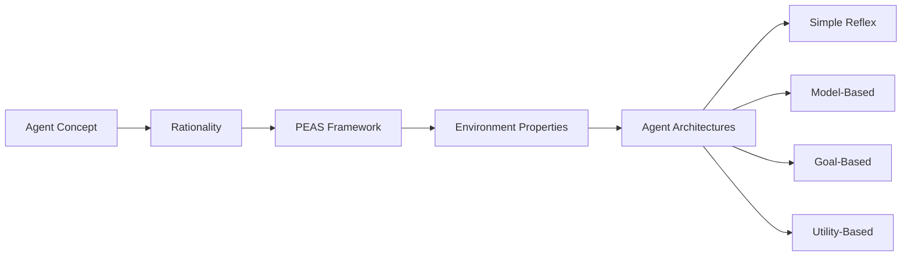

# Chapter 2: Intelligent Agents

**Previous:** [Chapter 1: Introduction to AI](01-introduction.md) | **Next:** [Chapter 3: Solving Problems by Searching](03-search.md)

---

## Learning Objectives

- Define the concept of an "agent" and its interaction with an "environment."
- Distinguish between a "rational agent" and other types of behavioral models.
- Analyze the PEAS (Performance, Environment, Actuators, Sensors) framework for task environments.
- Categorize environments based on their properties (e.g., observability, determinism).
- Identify and compare the four basic types of agent programs: simple reflex, model-based reflex, goal-based, and utility-based.

---

## Why Intelligent Agents Matter

> **Real-World Analogy:** A thermostat and a self-driving car are both agents → but worlds apart in complexity. The thermostat perceives temperature (sensor), compares it to a setpoint (internal logic), and turns heating on/off (actuator). The self-driving car perceives roads, signs, pedestrians, and vehicles through cameras and LIDAR, maintains an internal world model, predicts future states, and chooses actions that maximize safety and speed. Both are agents; the difference lies in the sophistication of perception, reasoning, and action.

From smartphone assistants (Siri, Alexa) to recommendation engines (Netflix, Amazon) to autonomous robots → intelligent agents are everywhere. Understanding how to design them is the foundation of building any AI system. Every AI application you interact with is, at its core, one or more agents perceiving an environment and acting on it.

---

## Chapter at a Glance

| Section | Key Topics | Key Terms |
|---------|-----------|-----------|
| Agents and Environments | Agent, environment, sensors, actuators | Agent function, agent program, percept |
| Rationality | Performance measure, success criteria | Rational agent, expected outcome |
| Task Environments (PEAS) | Performance-Environment-Actuators-Sensors | PEAS framework, task specification |
| Environment Properties | Observable, deterministic, episodic, etc. | Fully/partially observable, stochastic |
| Agent Architectures | Reflex, model-based, goal-based, utility-based | Simple reflex, internal state, learning agent |

## Chapter Roadmap



---

## Theory


### Agents and Environments

<a href="../../../assets/images/diagrams/artificial-intelligence/02-agents/agents-and-environments-handwritten.svg" target="_blank" rel="noopener">
  
</a>
<a href="../../../assets/images/diagrams/artificial-intelligence/02-agents/agents-and-environments-diagram.svg" target="_blank" rel="noopener">
  
</a>
<a href="../../../assets/images/diagrams/artificial-intelligence/02-agents/agents-and-environments-sticky.svg" target="_blank" rel="noopener">
  
</a>


> **Real-World Analogy:** A human driver perceives the road through eyes (sensors) and acts via hands and feet (actuators). The car, road, traffic, and weather together form the environment. The driver's brain runs the agent program that decides when to brake, steer, or accelerate. Without the driver, the car is just a machine; without the car, the driver is just a pedestrian. Agent and environment are inseparable.

An **agent** is anything that can be viewed as perceiving its **environment** through **sensors** and acting upon that environment through **actuators**. The **agent function** maps any given percept sequence to an action. The **agent program** is the concrete implementation of this function running on an architecture.

**Percept:** The agent's perceptual inputs at any given instant. A **percept sequence** is the complete history of everything the agent has ever perceived.

#### How It Works (Step-by-Step)

1. **Sense** → The agent collects raw input from the environment via sensors (cameras, microphones, temperature probes).
2. **Perceive** → Raw sensor data is converted into a structured percept (e.g., pixel array → "red light ahead").
3. **Process** → The agent function maps the percept (or percept sequence) to an action decision.
4. **Act** → The chosen action is executed via actuators (wheels, speakers, display), changing the environment.
5. **Repeat** → The cycle continues indefinitely; the environment may change in response to the agent's action or external factors.

#### Pseudocode

```text
FUNCTION Agent(percept):
    agent_function ← MAP percept_sequence → action
    RETURN agent_function(percept)
END FUNCTION

MAIN LOOP:
    WHILE TRUE:
        percept ← SENSE(environment)
        action ← Agent(percept)
        EXECUTE(action, environment)
    END WHILE
END MAIN LOOP
```

#### Python Implementation

```python
class Agent:
    """Generic agent framework."""
    def __init__(self):
        self.percept_history = []

    def agent_function(self, percept):
        """Maps percept to action. Override in subclasses."""
        raise NotImplementedError

    def sense(self, environment):
        """Collect percept from environment."""
        return environment.get_percept()

    def act(self, action, environment):
        """Execute action on environment."""
        environment.apply_action(action)

    def run(self, environment, steps=10):
        """Run agent-environment loop for given steps."""
        for step in range(steps):
            percept = self.sense(environment)
            self.percept_history.append(percept)
            action = self.agent_function(percept)
            print(f"Step {step+1}: Percept={percept} → Action={action}")
            self.act(action, environment)


class VacuumEnvironment:
    """Simple 2-room vacuum world."""
    def __init__(self):
        self.locations = {'A': 'Dirty', 'B': 'Dirty'}
        self.agent_location = 'A'

    def get_percept(self):
        return (self.agent_location, self.locations[self.agent_location])

    def apply_action(self, action):
        if action == 'Suck':
            self.locations[self.agent_location] = 'Clean'
        elif action == 'Left':
            self.agent_location = 'A'
        elif action == 'Right':
            self.agent_location = 'B'


# Example: random agent
import random

class RandomVacuumAgent(Agent):
    def agent_function(self, percept):
        return random.choice(['Suck', 'Left', 'Right'])

env = VacuumEnvironment()
agent = RandomVacuumAgent()
agent.run(env, steps=4)
```

**Output** (varies):
```
Step 1: Percept=('A', 'Dirty') → Action=Suck
Step 2: Percept=('A', 'Clean') → Action=Right
Step 3: Percept=('B', 'Dirty') → Action=Suck
Step 4: Percept=('B', 'Clean') → Action=Left
```

#### Step-by-Step Dry Run (Vacuum Cleaner)

| Step | Percept (Location, Status) | Internal State | Action | Environment After |
|------|---------------------------|----------------|--------|-------------------|
| 1 | (A, Dirty) | None | Suck | A clean, B dirty |
| 2 | (A, Clean) | None | Right | A clean, B dirty |
| 3 | (B, Dirty) | None | Suck | A clean, B clean |
| 4 | (B, Clean) | None | Left | A clean, B clean |
| 5 | (A, Clean) | None | Right | A clean, B clean |

#### Complexity Analysis

- **Time Complexity:** O(1) per step → the agent function is a direct mapping, no search or iteration.
- **Space Complexity:** O(P) where P is the length of percept history stored.
- **Why:** The agent-environment loop runs in constant time per cycle. Storing percept history is the only memory cost; if history is not stored, space is O(1).

#### Advantages & Disadvantages

| Advantages | Disadvantages |
|-----------|--------------|
| Universal framework → any AI system can be described as an agent | Abstract → provides no concrete decision-making strategy |
| Separates perception from action, enabling modular design | Real-world sensors and actuators are imperfect |
| Simple loop is easy to implement and debug | Single-agent model does not capture multi-agent dynamics |

#### Edge Cases

| Edge Case | Problem | Handling |
|-----------|---------|----------|
| Incomplete percept | Sensor partially fails (e.g., no dirt sensor reading) | Agent may default to a safe action or use prior state |
| Sensor noise | Percept contains corrupted data | Filtering or probabilistic reasoning required |
| Unknown environment | No prior model of the world exists | Agent must explore before acting (learning agent) |
| Actuator failure | Action not executed as intended | Agent must detect failure and retry or adapt |
| Stuck in loop | Agent repeats same action indefinitely | Add randomness or exploration to break symmetry |

---

### Rationality

<a href="../../../assets/images/diagrams/artificial-intelligence/02-agents/rationality-handwritten.svg" target="_blank" rel="noopener">
  
</a>
<a href="../../../assets/images/diagrams/artificial-intelligence/02-agents/rationality-diagram.svg" target="_blank" rel="noopener">
  
</a>
<a href="../../../assets/images/diagrams/artificial-intelligence/02-agents/rationality-sticky.svg" target="_blank" rel="noopener">
  
</a>


> **Real-World Analogy:** A chess player who blunders still made rational moves earlier if those moves maximized their winning chance given what they knew. Rationality is not omniscience → it is doing your best with what you have. Similarly, a doctor who prescribes the best known treatment based on symptoms, even if the patient has a rare condition the tests missed, is still rational.

A **rational agent** is one that acts so as to achieve the best outcome or, when there is uncertainty, the best expected outcome. Rationality depends on:
1. The **performance measure** that defines the criterion of success.
2. The agent's **prior knowledge** of the environment.
3. The **actions** that the agent can perform.
4. The agent's **percept sequence** to date.

> **Important:** Rationality ≠ Perfection. A rational agent may fail because of incomplete information. An omniscient agent knows the actual outcome; a rational agent maximizes expected outcome. A rational agent can fail; an omniscient agent cannot.

#### Rationality Decision Process

1. **Define performance measure** → What counts as success? (e.g., points scored, safety, profit, patient survival rate)
2. **Gather percepts** → Collect available information from the environment.
3. **Evaluate possible actions** → For each action, estimate the expected outcome using the world model.
4. **Select maximizer** → Choose the action that maximizes the expected performance measure.
5. **Execute and learn** → Perform the action and update knowledge based on the observed result.

#### Pseudocode

```text
FUNCTION RationalAgent(percept):
    state ← UPDATE_STATE(state, action, percept, model)
    best_action ← NULL
    best_value ← -INFINITY
    FOR EACH possible_action IN ACTIONS(state):
        predicted_state ← SIMULATE(state, possible_action, model)
        expected_value ← EXPECTED_UTILITY(predicted_state, performance_measure)
        IF expected_value > best_value THEN:
            best_value ← expected_value
            best_action ← possible_action
    RETURN best_action
END FUNCTION
```

#### Python Implementation

```python
class RationalVacuumAgent:
    def __init__(self, performance_measure='clean_squares'):
        self.performance_measure = performance_measure
        self.state = {'A': 'Unknown', 'B': 'Unknown'}
        self.last_action = None

    def update_state(self, percept):
        location, status = percept
        self.state[location] = status
        if self.last_action == 'Suck':
            self.state[location] = 'Clean'

    def expected_utility(self, action, location):
        """Estimate how good each action is for the performance measure."""
        other = 'B' if location == 'A' else 'A'
        if action == 'Suck':
            return 10 if self.state[location] == 'Dirty' else -2
        elif action in ['Left', 'Right']:
            target_status = self.state.get(other, 'Unknown')
            return 5 if target_status == 'Dirty' else -1
        elif action == 'NoOp':
            all_clean = all(s == 'Clean' for s in self.state.values() if s != 'Unknown')
            return 8 if all_clean else -5
        return 0

    def rational_agent(self, percept):
        location, status = percept
        self.update_state(percept)

        actions = ['Suck', 'NoOp']
        if location == 'A':
            actions.append('Right')
        else:
            actions.append('Left')

        best_action = max(actions, key=lambda a: self.expected_utility(a, location))
        self.last_action = best_action
        return best_action


agent = RationalVacuumAgent()
percepts = [('A', 'Dirty'), ('A', 'Clean'), ('B', 'Dirty'), ('B', 'Clean')]
for p in percepts:
    action = agent.rational_agent(p)
    print(f"Percept: {p}, State: {agent.state} → Action: {action}")
```

**Output:**
```
Percept: ('A', 'Dirty'), State: {'A': 'Dirty', 'B': 'Unknown'} → Action: Suck
Percept: ('A', 'Clean'), State: {'A': 'Clean', 'B': 'Unknown'} → Action: Right
Percept: ('B', 'Dirty'), State: {'A': 'Clean', 'B': 'Dirty'} → Action: Suck
Percept: ('B', 'Clean'), State: {'A': 'Clean', 'B': 'Clean'} → Action: NoOp
```

#### Step-by-Step Dry Run

| Step | Percept | State | Actions & Expected Utility | Best Action |
|------|---------|-------|---------------------------|-------------|
| 1 | (A, Dirty) | {A: D, B: U} | Suck=10, Right=5, NoOp=-5 | Suck |
| 2 | (A, Clean) | {A: C, B: U} | Suck=-2, Right=5, NoOp=-5 | Right |
| 3 | (B, Dirty) | {A: C, B: D} | Suck=10, Left=5, NoOp=-5 | Suck |
| 4 | (B, Clean) | {A: C, B: C} | Suck=-2, Left=-1, NoOp=8 | NoOp |

#### Complexity Analysis

- **Time Complexity:** O(A × S) where A = number of possible actions and S = cost of simulating state transition per action.
- **Space Complexity:** O(S) for state storage + O(A) for temporary action evaluation.
- **Why:** Each decision cycle evaluates every possible action. If the simulation function is expensive (e.g., full physics simulation), this dominates the runtime.

#### Advantages & Disadvantages

| Advantages | Disadvantages |
|-----------|--------------|
| Makes optimal decisions given available information | Requires a performance measure that captures all objectives |
| Can incorporate uncertainty via expected values | Computationally heavier than reflex approaches |
| Actions are grounded in a clear success metric | Performance measure design is subjective and difficult |
| Naturally handles trade-offs between outcomes | Cannot guarantee success → only expected optimality |

#### Edge Cases

| Edge Case | Problem | Mitigation |
|-----------|---------|------------|
| Conflicting performance measures | Safety says stop, speed says go | Weighted multi-objective utility function |
| No action has positive expected utility | All actions lead to poor outcomes | Choose least-bad action rather than NoOp |
| Performance measure is gameable | Agent finds loophole that scores high but violates intent | Carefully constrain the measure; add penalties |
| Unknown action outcomes | No model to predict consequences | Add exploration actions to learn the model |
| Time pressure | Cannot evaluate all actions before deadline | Use bounded rationality → evaluate best subset |

---

### Task Environments (PEAS)

<a href="../../../assets/images/diagrams/artificial-intelligence/02-agents/task-environments-peas-handwritten.svg" target="_blank" rel="noopener">
  
</a>
<a href="../../../assets/images/diagrams/artificial-intelligence/02-agents/task-environments-peas-diagram.svg" target="_blank" rel="noopener">
  
</a>
<a href="../../../assets/images/diagrams/artificial-intelligence/02-agents/task-environments-peas-sticky.svg" target="_blank" rel="noopener">
  
</a>


> **Real-World Analogy:** Before building a house, you need a blueprint. PEAS is the blueprint for designing an agent → it specifies WHAT the agent should achieve (Performance), WHERE it operates (Environment), HOW it acts (Actuators), and HOW it perceives (Sensors). Without PEAS, you risk designing an agent that is effective in the wrong environment or optimized for the wrong metric.

To design an agent, we must specify the **PEAS** for the task environment:

- **Performance**: The metric for success (e.g., safety, speed, profit, accuracy).
- **Environment**: The external world where the agent operates (e.g., roads, digital stock market, human body).
- **Actuators**: The mechanisms for acting (e.g., wheels, steering, display, robotic arm).
- **Sensors**: The mechanisms for perceiving (e.g., cameras, microphones, keyboard, LIDAR).
#### How to Use PEAS (Step-by-Step)

1. **Identify the Performance Measure** → Ask: "What does success look like?" Define concrete, measurable criteria (e.g., minimize travel time, maximize classification accuracy).
2. **Define the Environment** → Ask: "What external factors affect the agent?" List all relevant entities, conditions, and constraints.
3. **List the Actuators** → Ask: "How can the agent change the world?" Enumerate every mechanism the agent can use to act.
4. **List the Sensors** → Ask: "How does the agent get information?" Enumerate every input mechanism available.
5. **Validate Completeness** → Ensure that for every action the agent might need, there is an actuator; for every piece of information it needs, there is a sensor.

#### Pseudocode

```text
FUNCTION DesignAgent(task_description):
    PEAS ← {}
    PEAS.performance ← IDENTIFY_PERFORMANCE_METRICS(task_description)
    PEAS.environment ← IDENTIFY_ENVIRONMENT_ENTITIES(task_description)
    PEAS.actuators ← IDENTIFY_ACTUATORS(task_description)
    PEAS.sensors ← IDENTIFY_SENSORS(task_description)
    RETURN PEAS
END FUNCTION

FUNCTION ValidatePEAS(PEAS):
    FOR EACH goal IN PEAS.performance:
        ASSERT EXISTS actuator TO ACHIEVE goal
    FOR EACH information NEED IN PEAS.environment:
        ASSERT EXISTS sensor TO COLLECT information
    RETURN Valid
END FUNCTION
```

#### PEAS Examples Table

| Domain | Performance Measure | Environment | Actuators | Sensors |
|--------|-------------------|-------------|-----------|---------|
| **Automated Taxi** | Safe, fast, legal, comfortable trip, profit | Roads, traffic, pedestrians, weather, maps | Steering, accelerator, brake, signal, horn, display, door locks | Cameras, LIDAR, radar, GPS, speedometer, odometer, microphone, accelerometer |
| **Medical Diagnosis** | Accurate diagnosis, minimal cost, quick recovery | Patient body, symptoms, medical history, lab tests | Display results, prescribe treatment, alert, refer to specialist | Keyboard (symptoms), MRI, blood test sensors, stethoscope, heart monitor |
| **Chess AI** | Win game, maximize piece advantage, minimize time | 8x8 board, opponent, clock | Move pieces on board, resign, offer draw | Board state (camera or digital interface), clock |
| **Part-Picking Robot** | Pick correct parts, minimize time, no damage | Conveyor belt, bins, parts of varying shapes | Jointed arm, gripper, suction cup | Camera, joint angle sensors, touch/pressure sensor, proximity sensor |
| **Spam Filter** | Correctly classify spam/non-spam, low false positives | Email inbox, user behavior, sender reputation | Mark as spam, delete, move to folder, block sender | Email header, body, sender, metadata, embedded links |
| **Recommendation System** | User engagement, relevance score, diversity | User base, item catalog, history, trends | Display recommendations, personalize UI, send notifications | Click history, ratings, demographics, time, device type, search queries |
| **Thermostat** | Maintain target temperature +/- tolerance, energy efficiency | Room, HVAC system, outside temp, time of day | Turn heating/cooling on/off, set fan speed | Temperature sensor, humidity sensor, clock |
| **Robot Soccer** | Score goals, prevent opponent goals, ball possession | Field, ball, teammates, opponents, referee | Kick, run, pass, position, tackle, block | Cameras, IMU, compass, touch sensors, wheel encoders, goal proximity |
| **Stock Trader** | Maximize returns, minimize risk, stay within budget | Stock exchange, news, economic indicators | Buy, sell, hold, set limit orders | Price feeds, news API, economic calendar, volume data |

#### Step-by-Step Dry Run (Applying PEAS to Automated Taxi)

| Step | Question | Answer for Taxi |
|------|----------|----------------|
| 1 | What is the performance measure? | Safe arrival, legal compliance, comfortable ride, passenger satisfaction, profit |
| 2 | What is the environment? | Roads, traffic signals, pedestrians, other vehicles, weather, GPS maps |
| 3 | What are the actuators? | Steering wheel, accelerator, brake, turn signals, horn, display screen |
| 4 | What are the sensors? | Cameras, LIDAR, radar, GPS, speedometer, odometer, microphone, accelerometer |
| 5 | Can actuators achieve performance goals? | Yes → steering navigates, brake ensures safety, accelerator controls speed |
| 6 | Do sensors provide all needed info? | Yes → cameras see lanes/signs, LIDAR detects obstacles, GPS provides location |

#### Complexity Analysis

- **Time Complexity:** O(N) where N is the number of PEAS elements to specify. Small → typically 4-12 items per dimension.
- **Space Complexity:** O(P + E + A + S) to store the specification.
- **Why:** PEAS is a design-time specification, not a runtime algorithm. Its cost is negligible relative to the agent implementation it guides.

#### Advantages & Disadvantages

| Advantages | Disadvantages |
|-----------|--------------|
| Provides a complete, structured specification of the task | Does not specify how the agent should decide → only what it needs |
| Easy to communicate and share across teams | Can miss subtle interactions between PEAS dimensions |
| Makes implicit assumptions explicit | Performance measure design is subjective |
| Framework works for any domain (robotics, software, games) | Does not account for multi-agent dynamics directly |

#### Edge Cases

| Edge Case | Problem | Handling |
|-----------|---------|----------|
| Multiple conflicting performance measures | Safety vs. speed | Weighted multi-objective optimization |
| Environment changes after design | PEAS specification becomes stale | Review and update PEAS periodically |
| Sensors unavailable for key information | Cannot perceive critical state | Add model-based reasoning to infer missing info |
| Actuators with side effects | Braking hard may cause rear-end collision | Model actuator effects in the world model |
| Adversarial environment | Opponent actively conceals state | Include adversarial modeling in environment spec |

---

### Environment Properties

<a href="../../../assets/images/diagrams/artificial-intelligence/02-agents/environment-properties-handwritten.svg" target="_blank" rel="noopener">
  
</a>
<a href="../../../assets/images/diagrams/artificial-intelligence/02-agents/environment-properties-diagram.svg" target="_blank" rel="noopener">
  
</a>
<a href="../../../assets/images/diagrams/artificial-intelligence/02-agents/environment-properties-sticky.svg" target="_blank" rel="noopener">
  
</a>


> **Real-World Analogy:** A chess player sees the entire board (fully observable) and knows the rules are fixed (deterministic). A poker player cannot see opponents' cards (partially observable) and must account for bluffing (stochastic). A self-driving car must react while the world keeps moving (dynamic) and past decisions affect future options (sequential). These dimensions determine which agent architecture you can use.

Environments are characterized by six key dimensions. Understanding these properties is critical because they directly determine which agent architecture is suitable.

#### The Six Properties

1. **Observability** (Fully vs. Partially) → Can the agent access the complete state of the environment at each point in time?
   - *Fully Observable:* Chess, Sudoku (all relevant info is visible)
   - *Partially Observable:* Poker (hidden cards), Self-driving (occluded objects)

2. **Determinism** (Deterministic vs. Stochastic) → Does the next state depend solely on the current state and the agent's action?
   - *Deterministic:* 8-Puzzle, Chess (no randomness)
   - *Stochastic:* Backgammon (dice), Self-driving (wind, tire slip)

3. **Episodicity** (Episodic vs. Sequential) → Is the current decision independent of previous decisions?
   - *Episodic:* Image classification (each image is independent)
   - *Sequential:* Robot navigation (current position depends on past moves)

4. **Dynamics** (Static vs. Dynamic) → Does the environment change while the agent is thinking?
   - *Static:* Crossword puzzle (no change while you ponder)
   - *Dynamic:* Autonomous driving (world keeps moving)

5. **Discreteness** (Discrete vs. Continuous) → Are the states and actions finite and distinct?
   - *Discrete:* Chess (finite board positions and moves)
   - *Continuous:* Taxi steering angle (infinite possible values)

6. **Agent Count** (Single vs. Multi) → Are there other agents operating in the same environment?
   - *Single:* Sudoku solver (no other agents)
   - *Multi:* Multiplayer game, stock market

#### Pseudocode (Classifying an Environment)

```text
FUNCTION ClassifyEnvironment(environment_description):
    properties ← {}
    properties.observability ← CHECK_IF_FULLY_OBSERVABLE(environment_description)
    properties.determinism ← CHECK_IF_DETERMINISTIC(environment_description)
    properties.episodicity ← CHECK_IF_EPISODIC(environment_description)
    properties.dynamics ← CHECK_IF_STATIC(environment_description)
    properties.discreteness ← CHECK_IF_DISCRETE(environment_description)
    properties.agent_count ← COUNT_AGENTS(environment_description)
    RETURN properties
END FUNCTION

FUNCTION RecommendArchitecture(properties):
    IF fully_observable AND deterministic THEN
        RETURN "Simple Reflex Agent"
    ELSE IF partially_observable OR stochastic THEN
        RETURN "Model-Based Agent"
    ELSE IF requires_planning THEN
        RETURN "Goal-Based Agent"
    ELSE IF requires_tradeoffs THEN
        RETURN "Utility-Based Agent"
END FUNCTION
```

#### Python Implementation

```python
class EnvironmentClassifier:
    def __init__(self):
        self.properties = {}

    def classify(self, name, fully_observable, deterministic,
                 episodic, static, discrete, single_agent):
        self.properties = {
            'name': name,
            'fully_observable': fully_observable,
            'deterministic': deterministic,
            'episodic': episodic,
            'static': static,
            'discrete': discrete,
            'single_agent': single_agent
        }
        return self.properties

    def recommend_agent(self):
        p = self.properties
        obs = "Fully" if p['fully_observable'] else "Partially"
        det = "Deterministic" if p['deterministic'] else "Stochastic"
        epi = "Episodic" if p['episodic'] else "Sequential"
        dyn = "Static" if p['static'] else "Dynamic"
        dis = "Discrete" if p['discrete'] else "Continuous"
        agent_count = "Single" if p['single_agent'] else "Multi"

        print(f"\n{p['name']}: {obs}, {det}, {epi}, {dyn}, {dis}, {agent_count}")

        if p['fully_observable'] and p['deterministic'] and p['episodic']:
            return "Recommended: Simple Reflex Agent"
        elif p['fully_observable'] and p['deterministic'] and not p['episodic']:
            return "Recommended: Goal-Based Agent"
        elif not p['fully_observable']:
            return "Recommended: Model-Based Agent (need internal state)"
        else:
            return "Recommended: Utility-Based Agent (trade-offs needed)"


classifier = EnvironmentClassifier()

envs = [
    ("Chess", True, True, False, True, True, False),
    ("Poker", False, False, False, True, True, False),
    ("Image Classifier", True, True, True, True, False, True),
    ("Self-Driving Car", False, False, False, False, False, False),
]

for env in envs:
    classifier.classify(*env)
    print(classifier.recommend_agent())
```

**Output:**
```
Chess: Fully, Deterministic, Sequential, Static, Discrete, Multi
Recommended: Goal-Based Agent

Poker: Partially, Stochastic, Sequential, Static, Discrete, Multi
Recommended: Model-Based Agent (need internal state)

Image Classifier: Fully, Deterministic, Episodic, Static, Discrete, Single
Recommended: Simple Reflex Agent

Self-Driving Car: Partially, Stochastic, Sequential, Dynamic, Continuous, Multi
Recommended: Model-Based Agent (need internal state)
```

#### Step-by-Step Dry Run (Self-Driving Car)

| Property | Question | Answer | Implication |
|----------|----------|--------|-------------|
| Observability | Can the car see everything? | No → partial (occluded vehicles, blind spots) | Need internal state to track hidden objects |
| Determinism | Is the world predictable? | No → stochastic (other drivers may behave unpredictably) | Need probabilistic reasoning |
| Episodicity | Are decisions independent? | No → sequential (turning now affects position later) | Need planning across time |
| Dynamics | Does the world change while thinking? | Yes → dynamic (other cars move continuously) | Need real-time response latency |
| Discreteness | Are actions finite? | No → continuous (infinite steering angles) | Need function approximation |
| Agent Count | Are there other agents? | Yes → multi (other drivers, pedestrians) | Need game-theoretic reasoning |

#### Complexity Analysis

- **Time Complexity:** O(P) where P = number of properties to evaluate (always 6). Constant time.
- **Space Complexity:** O(P) for storing the property vector. Negligible.
- **Why:** Environment classification is a design-time analysis. The cost is incurred once during system design, not during agent operation.

#### Advantages & Disadvantages

| Advantages | Disadvantages |
|-----------|--------------|
| Provides clear guidance for architecture selection | Some environments fall in gray zones (e.g., mostly observable) |
| Universal → applies to any AI domain | Properties can change during operation |
| Helps identify design challenges early | No consensus on which dimension matters most |
| Enables systematic comparison of task difficulty | Environment may be misclassified |

#### Edge Cases

| Edge Case | Problem | Handling |
|-----------|---------|----------|
| Mixed observability | Mostly observable but some hidden info | Treat as partially observable; use belief states |
| Stochastic but predictable | Randomness follows known distribution | Use probabilistic models with known distributions |
| Semi-dynamic | Environment changes at fixed intervals | Treat as dynamic; plan between known change points |
| Multi-agent cooperation | Other agents are friendly, not adversarial | Single-agent simplification may suffice if communication is reliable |
| Environment shifts during operation | Static environment becomes dynamic | Monitor environment properties at runtime and adapt architecture |

> **Pro Tip:** The most critical environment dimension is **observability** → whether the environment is fully or partially observable fundamentally determines which agent architecture you can use. Self-driving cars operate in partially observable environments and therefore require model-based agents with internal state. Simple reflex agents fail here because the current percept alone is insufficient.

> **Warning:** A common mistake is confusing "rationality" with "omniscience." A rational agent makes the best decision based on what it knows → it may still fail because of incomplete information. Rationality does not guarantee success.

---

### Agent Types

<a href="../../../assets/images/diagrams/artificial-intelligence/02-agents/agent-types-handwritten.svg" target="_blank" rel="noopener">
  
</a>
<a href="../../../assets/images/diagrams/artificial-intelligence/02-agents/agent-types-diagram.svg" target="_blank" rel="noopener">
  
</a>
<a href="../../../assets/images/diagrams/artificial-intelligence/02-agents/agent-types-sticky.svg" target="_blank" rel="noopener">
  
</a>


There are four basic types of agent programs, each building on the previous in sophistication. Each type is suited to a different class of environment properties.

#### 1. Simple Reflex Agent

> **Real-World Analogy:** A touch-lamp that turns on when you tap it. The percept (touch) maps directly to an action (light on). No memory, no internal state, no goals → pure condition-action rule. Like a human reflex (pulling hand from a hot stove), the response is immediate and requires no thought.

An agent that selects actions based only on the **current percept**, ignoring the rest of the percept history.

##### How It Works

1. **Sense** current percept from the environment.
2. **Match** percept against condition-action rules (if-then).
3. **Select** the action associated with the matching rule.
4. **Execute** action.
5. **Repeat** from step 1.

##### Pseudocode

```text
FUNCTION SimpleReflexAgent(percept):
    FOR EACH rule IN condition_action_rules:
        IF rule.condition_matches(percept) THEN:
            RETURN rule.action
    RETURN default_action
END FUNCTION
```

##### Python Implementation

```python
def simple_reflex_agent(percept):
    """Percept: (location, status) tuple"""
    location, status = percept
    if status == 'Dirty':
        return 'Suck'
    elif location == 'A':
        return 'Right'
    elif location == 'B':
        return 'Left'
    return 'NoOp'

percepts = [('A', 'Dirty'), ('A', 'Clean'), ('B', 'Dirty'), ('B', 'Clean')]
for p in percepts:
    action = simple_reflex_agent(p)
    print(f"Percept: {p} -> Action: {action}")
```

**Output:**
```
Percept: ('A', 'Dirty') -> Action: Suck
Percept: ('A', 'Clean') -> Action: Right
Percept: ('B', 'Dirty') -> Action: Suck
Percept: ('B', 'Clean') -> Action: Left
```

##### Dry Run Trace Table

| Step | Percept (Loc, Status) | Rule Matched | Action |
|------|----------------------|-------------|--------|
| 1 | (A, Dirty) | Dirty -> Suck | Suck |
| 2 | (A, Clean) | A and Clean -> Right | Right |
| 3 | (B, Dirty) | Dirty -> Suck | Suck |
| 4 | (B, Clean) | B and Clean -> Left | Left |
| 5 | (A, Dirty) | Dirty -> Suck | Suck |

##### Complexity Analysis

- **Time Complexity:** O(R) where R is the number of condition-action rules. In practice, rule lookup is O(1) using a hash table with percept as key.
- **Space Complexity:** O(R) to store the rule set.
- **Why:** Each decision requires scanning or hashing rules. No state is stored between steps, so memory is minimal. The linear scan over R rules is the dominant cost; in hash-table implementations this drops to O(1).

##### Advantages & Disadvantages

| Advantages | Disadvantages |
|-----------|--------------|
| Extremely simple to implement | Can only handle fully observable environments |
| Very fast (no state maintenance) | Cannot learn from past experience |
| Minimal memory footprint | Fails in partially observable environments |
| Easy to debug and verify | May loop infinitely if rules are incomplete |

##### Edge Cases

| Edge Case | Problem | Mitigation |
|-----------|---------|------------|
| No rule matches percept | Agent does nothing (NoOp) | Add a default rule or fallback action |
| Conflicting rules | Two rules match simultaneously | Prioritize rules or use a tie-breaker |
| Noisy sensor | Wrong percept triggers wrong action | Use probabilistic rule matching |
| New unseen situation | Rule set incomplete | Combine with learning mechanism |
| Symmetric environment | Agent oscillates between two states | Add action history to break ties |

---

#### 2. Model-Based Reflex Agent

> **Real-World Analogy:** A delivery robot that navigates a warehouse. It cannot see the entire warehouse at once (partially observable), so it builds and maintains a mental map (internal model) of where shelves, doors, and obstacles are. When it rounds a corner, it updates its map based on what it now sees. This internal model compensates for the limited view.

Maintains an **internal state** that tracks the parts of the environment not visible in the current percept. Uses a **model of the world** to update this state.

##### How It Works

1. **Sense** current percept.
2. **Update internal state** using the model: `new_state = UPDATE(state, action, percept)`.
3. **Match** the updated internal state against condition-action rules.
4. **Select and execute** action.
5. **Repeat** from step 1.

##### Pseudocode

```text
FUNCTION ModelBasedReflexAgent(percept):
    state ← UPDATE_STATE(state, action, percept, model)
    rule ← RULE_MATCH(state, condition_action_rules)
    action ← rule.action
    RETURN action
END FUNCTION
```

##### Python Implementation

```python
class ModelBasedVacuumAgent:
    def __init__(self):
        self.internal_map = {'A': False, 'B': False}
        self.last_action = None

    def update_state(self, percept):
        location, status = percept
        self.internal_map[location] = (status == 'Dirty')
        if self.last_action == 'Suck':
            self.internal_map[location] = False

    def model_based_reflex_agent(self, percept):
        self.update_state(percept)
        location, status = percept

        if status == 'Dirty':
            self.last_action = 'Suck'
            return 'Suck'

        other_room = 'B' if location == 'A' else 'A'
        if self.internal_map[other_room]:
            self.last_action = 'Right' if location == 'A' else 'Left'
            return 'Right' if location == 'A' else 'Left'

        self.last_action = 'Right' if location == 'A' else 'Left'
        return 'Right' if location == 'A' else 'Left'

agent = ModelBasedVacuumAgent()
percepts = [('A', 'Dirty'), ('A', 'Clean'), ('B', 'Dirty'), ('B', 'Clean')]
for p in percepts:
    action = agent.model_based_reflex_agent(p)
    print(f"Percept: {p}, Internal: {agent.internal_map} -> Action: {action}")
```

**Output:**
```
Percept: ('A', 'Dirty'), Internal: {'A': False, 'B': False} -> Action: Suck
Percept: ('A', 'Clean'), Internal: {'A': False, 'B': False} -> Action: Right
Percept: ('B', 'Dirty'), Internal: {'A': False, 'B': False} -> Action: Suck
Percept: ('B', 'Clean'), Internal: {'A': False, 'B': False} -> Action: Left
```

##### Dry Run Trace Table

| Step | Percept | Internal State Before | Model Update | Action |
|------|---------|---------------------|-------------|--------|
| 1 | (A, Dirty) | {A: F, B: F} | {A: T} | Suck |
| 2 | (A, Clean) | {A: T, B: F} | {A: F} (after Suck) | Right |
| 3 | (B, Dirty) | {A: F, B: F} | {B: T} | Suck |
| 4 | (B, Clean) | {A: F, B: T} | {B: F} (after Suck) | Right (check A → clean) |

##### Complexity Analysis

- **Time Complexity:** O(S + R) per step → O(S) to update state (where S is state size) and O(R) for rule matching.
- **Space Complexity:** O(S) for internal state + O(R) for rules.
- **Why:** State update depends on model complexity. The model must infer unobserved variables from observed ones, which can range from O(1) (simple map update) to polynomial (probabilistic inference with Bayes nets). Rule matching remains the same as simple reflex.

##### Advantages & Disadvantages

| Advantages | Disadvantages |
|-----------|--------------|
| Handles partially observable environments | More complex to implement |
| Maintains knowledge of unseen world | State can grow large |
| Can handle sensor failures temporarily | Model may be incorrect (model error) |
| More robust than simple reflex | Slower than simple reflex |

##### Edge Cases

| Edge Case | Problem | Mitigation |
|-----------|---------|------------|
| Model mismatch | Internal model contradicts reality | Detect inconsistency, reset or correct model |
| State explosion | Too many variables to track | Use state abstraction or summarization |
| Percept gap | Long period without percepts | State decays in confidence over time |
| Model drift | Environment changes, model becomes stale | Periodically re-learn model from scratch |
| Incorrect initial state | Agent starts with wrong belief | Must explore to correct initial state |

---

#### 3. Goal-Based Agent

> **Real-World Analogy:** A navigation GPS. It has a goal (destination), knows its current location (state), and plans a sequence of turns (actions) to reach the destination. If you take a wrong turn, it replans from the new position. The goal defines success; the agent searches for actions that achieve it. Unlike a reflex agent, it asks "What will happen if I do this?" before acting.

Extends model-based agents by adding **goal information**. The agent considers future consequences: "What action will bring me closer to my goal?"

##### How It Works

1. **Sense** current percept and update state (like model-based).
2. **Project** possible futures: simulate sequences of actions.
3. **Evaluate** which sequence leads to the goal state.
4. **Select** the first action of the best sequence.
5. **Execute** action.
6. **Repeat** from step 1.

##### Pseudocode

```text
FUNCTION GoalBasedAgent(percept):
    state ← UPDATE_STATE(state, action, percept, model)
    IF state == goal THEN:
        RETURN NoOp
    goal_test ← IS_GOAL(state, goal)
    IF NOT goal_test:
        actions ← SEARCH(state, model, goal)
        action ← FIRST(actions)
    RETURN action
END FUNCTION
```

##### Python Implementation

```python
class GoalBasedVacuumAgent:
    def __init__(self, goal='Clean'):
        self.goal = goal
        self.state = {'A': 'Unknown', 'B': 'Unknown'}
        self.last_action = None

    def update_state(self, percept):
        location, status = percept
        self.state[location] = status
        if self.last_action == 'Suck':
            self.state[location] = 'Clean'

    def is_goal_reached(self):
        for room, status in self.state.items():
            if status == 'Dirty':
                return False
        return True

    def plan_next_action(self, location):
        for room, status in self.state.items():
            if status == 'Dirty':
                if room != location:
                    return 'Right' if room == 'B' else 'Left'
                else:
                    return 'Suck'
        return 'NoOp'

    def goal_based_agent(self, percept):
        location, status = percept
        self.update_state(percept)

        if self.is_goal_reached():
            return 'NoOp'

        action = self.plan_next_action(location)
        self.last_action = action
        return action

agent = GoalBasedVacuumAgent()
percepts = [('A', 'Dirty'), ('A', 'Clean'), ('B', 'Dirty'), ('B', 'Clean')]
for p in percepts:
    action = agent.goal_based_agent(p)
    print(f"Percept: {p}, State: {agent.state}, Goal Reached: {agent.is_goal_reached()} -> Action: {action}")
```

**Output:**
```
Percept: ('A', 'Dirty'), State: {'A': 'Dirty', 'B': 'Unknown'}, Goal Reached: False -> Action: Suck
Percept: ('A', 'Clean'), State: {'A': 'Clean', 'B': 'Unknown'}, Goal Reached: False -> Action: Right
Percept: ('B', 'Dirty'), State: {'A': 'Clean', 'B': 'Dirty'}, Goal Reached: False -> Action: Suck
Percept: ('B', 'Clean'), State: {'A': 'Clean', 'B': 'Clean'}, Goal Reached: True -> Action: NoOp
```

##### Dry Run Trace Table

| Step | Percept | State Before | Goal Check | Plan | Action |
|------|---------|-------------|------------|------|--------|
| 1 | (A, Dirty) | {A: U, B: U} | Not clean | Room A dirty -> Suck | Suck |
| 2 | (A, Clean) | {A: Dirty, B: U} | Not clean | A clean, B unknown -> go B | Right |
| 3 | (B, Dirty) | {A: C, B: U} | Not clean | Room B dirty -> Suck | Suck |
| 4 | (B, Clean) | {A: C, B: Dirty} | Not clean | B now clean, A clean -> done | NoOp |
| 5 | (B, Clean) | {A: C, B: C} | Goal reached | None needed | NoOp |

##### Complexity Analysis

- **Time Complexity:** O(b^d) where b = branching factor and d = solution depth (search space size). Can be reduced to O(b^{d/2}) with bidirectional search or O(E log V) with A*.
- **Space Complexity:** O(bd) for search tree storage in BFS; O(d) for DFS.
- **Why:** Goal-based agents must search or plan, which can be exponential in the worst case. Simple reflex does not plan at all. Heuristics (A*, greedy search) dramatically reduce practical complexity, but worst-case remains exponential.

##### Advantages & Disadvantages

| Advantages | Disadvantages |
|-----------|--------------|
| Can handle complex, multi-step problems | Slower → requires search/planning |
| Flexible → change goal and behavior changes | Cannot prioritize between multiple goals |
| Explains its actions in terms of purpose | May get stuck if goal is unreachable |
| Handles partially observable envs well | Requires accurate world model |
| Naturally supports replanning | Search can be exponential in worst case |

##### Edge Cases

| Edge Case | Problem | Mitigation |
|-----------|---------|------------|
| Unreachable goal | No sequence of actions achieves the goal | Detect failure early, relax goal or learn |
| Multiple conflicting goals | Goals A and B cannot both be satisfied | Prioritize goals or use utility-based |
| Goal changes mid-execution | Current plan invalidated | Replan from current state |
| Infinite loops in planning | Plan revisits same states | Use cycle detection or depth limit |
| Resource limits | Not enough time/memory to search full space | Use iterative deepening or bounded search |

---

#### 4. Utility-Based Agent

> **Real-World Analogy:** A person choosing a restaurant. Multiple factors matter: price, distance, cuisine quality, wait time. No single "goal" captures all preferences. Instead, each option gets a utility score, and you pick the highest. Utility-based agents generalize goal-based agents by scoring how GOOD each state is, not just whether it achieves a goal. Goals say "get to the destination"; utility says "get there quickly, comfortably, and cheaply."

Generalizes goal-based agents by using a **utility function** that maps a state (or a sequence) to a real number representing the degree of "happiness." The agent chooses the action that maximizes expected utility.

##### How It Works

1. **Sense** and update state (like model-based).
2. **Generate** possible actions.
3. **Predict** outcome states for each action using the model.
4. **Calculate** utility for each predicted state.
5. **Select** the action with the highest expected utility.
6. **Execute** action.
7. **Repeat** from step 1.

##### Pseudocode

```text
FUNCTION UtilityBasedAgent(percept):
    state ← UPDATE_STATE(state, action, percept, model)
    actions ← GENERATE_ACTIONS(state)
    best_utility ← -INFINITY
    best_action ← NoOp
    FOR EACH action IN actions:
        predicted_state ← PREDICT(state, action, model)
        utility ← UTILITY(predicted_state)
        IF utility > best_utility THEN:
            best_utility ← utility
            best_action ← action
    RETURN best_action
END FUNCTION
```

##### Python Implementation

```python
class UtilityBasedVacuumAgent:
    def __init__(self):
        self.state = {'A': 'Unknown', 'B': 'Unknown'}
        self.last_action = None

    def utility(self, location, proposed_action):
        u = 0
        current_room_status = self.state[location]
        other_room = 'B' if location == 'A' else 'A'
        other_room_status = self.state[other_room]

        if proposed_action == 'Suck':
            if current_room_status == 'Dirty':
                u += 10
            else:
                u -= 5
        elif proposed_action in ['Left', 'Right']:
            if current_room_status == 'Dirty':
                u -= 3
            if other_room_status == 'Dirty':
                u += 5
            else:
                u -= 2
        elif proposed_action == 'NoOp':
            all_clean = all(s == 'Clean' for s in self.state.values())
            if all_clean:
                u += 10
            else:
                u -= 10
        return u

    def update_state(self, percept):
        location, status = percept
        self.state[location] = status
        if self.last_action == 'Suck':
            self.state[location] = 'Clean'

    def utility_based_agent(self, percept):
        location, status = percept
        self.update_state(percept)

        possible_actions = ['Suck', 'Left', 'Right', 'NoOp']
        if location == 'A':
            possible_actions.remove('Left')
        if location == 'B':
            possible_actions.remove('Right')

        best_action = max(possible_actions, key=lambda a: self.utility(location, a))
        self.last_action = best_action
        return best_action

agent = UtilityBasedVacuumAgent()
percepts = [('A', 'Dirty'), ('A', 'Clean'), ('B', 'Dirty'), ('B', 'Clean')]
for p in percepts:
    action = agent.utility_based_agent(p)
    print(f"Percept: {p}, State: {agent.state} -> Action: {action}")
```

**Output:**
```
Percept: ('A', 'Dirty'), State: {'A': 'Dirty', 'B': 'Unknown'} -> Action: Suck
Percept: ('A', 'Clean'), State: {'A': 'Clean', 'B': 'Unknown'} -> Action: Right
Percept: ('B', 'Dirty'), State: {'A': 'Clean', 'B': 'Dirty'} -> Action: Suck
Percept: ('B', 'Clean'), State: {'A': 'Clean', 'B': 'Clean'} -> Action: NoOp
```

##### Dry Run Trace Table

| Step | Percept | State | Possible Actions | Utilities | Best Action |
|------|---------|-------|-----------------|-----------|-------------|
| 1 | (A, Dirty) | {A: D, B: U} | Suck, Right, NoOp | Suck=10, Right=-3, NoOp=-10 | Suck |
| 2 | (A, Clean) | {A: C, B: U} | Suck, Right, NoOp | Suck=-5, Right=+5(->B dirty), NoOp=-10 | Right |
| 3 | (B, Dirty) | {A: C, B: D} | Suck, Left, NoOp | Suck=10, Left=-3, NoOp=-10 | Suck |
| 4 | (B, Clean) | {A: C, B: C} | Suck, Left, NoOp | Suck=-5, Left=-2(no dirt), NoOp=10 | NoOp |

##### Complexity Analysis

- **Time Complexity:** O(A x C) where A = number of possible actions and C = cost of computing utility per action.
- **Space Complexity:** O(S) for state + O(A) for action generation.
- **Why:** The agent evaluates every action against the utility function. If utility computation requires simulation (e.g., rollouts in model-predictive control), C dominates. Unlike goal-based agents, utility-based agents do not search over sequences → they evaluate one-step outcomes, making them faster than full search but slower than reflex.

##### Advantages & Disadvantages

| Advantages | Disadvantages |
|-----------|--------------|
| Handles trade-offs between conflicting objectives | Requires careful utility function design |
| Produces nuanced, graded decisions | Utility values are subjective |
| Most flexible agent architecture | Computationally heavier than goal-based |
| Can handle uncertainty probabilistically | Hard to debug → why was utility X chosen? |
| Naturally generalizes goal-based agents | Utility functions can be gamed |

##### Edge Cases

| Edge Case | Problem | Mitigation |
|-----------|---------|------------|
| Utility ties | Two actions have equal utility | Add tie-breaking rule (e.g., random, first) |
| Utility function gaming | Agent finds loophole that maximizes utility but violates intent | Design utility carefully, add constraints |
| Unbounded utility | Some states produce extreme values | Normalize or clip utility values |
| Changing preferences | User's utility function changes over time | Online learning of utility parameters |
| Non-stationary utility | Optimal action changes as utility evolves | Use adaptive utility estimation |

---

### Agent Types Comparison Table

<a href="../../../assets/images/diagrams/artificial-intelligence/02-agents/agent-types-comparison-table-handwritten.svg" target="_blank" rel="noopener">
  
</a>
<a href="../../../assets/images/diagrams/artificial-intelligence/02-agents/agent-types-comparison-table-diagram.svg" target="_blank" rel="noopener">
  
</a>
<a href="../../../assets/images/diagrams/artificial-intelligence/02-agents/agent-types-comparison-table-sticky.svg" target="_blank" rel="noopener">
  
</a>


| Feature | Simple Reflex | Model-Based Reflex | Goal-Based | Utility-Based |
|---------|:---:|:---:|:---:|:---:|
| Internal State | x | ✓ | ✓ | ✓ |
| World Model | x | ✓ | ✓ | ✓ |
| Goal Knowledge | x | x | ✓ | ✓ |
| Utility Function | x | x | x | ✓ |
| Handles Partial Observability | x | ✓ | ✓ | ✓ |
| Planning / Search | x | x | ✓ | ✓ |
| Trade-off Decisions | x | x | x | ✓ |
| Computational Cost | O(1) | O(S) | O(b^d) | O(A-C) |
| Memory Requirement | Minimal | Moderate | High (stores search tree) | Moderate |
| Implementation Complexity | Very Low | Low | Medium | High |
| Best Environment | Fully observable, deterministic | Partially observable | Goal-oriented with clear success | Complex with trade-offs |

---

## Examples

### Example 1: Vacuum-Cleaner Agent (Simple Reflex)

A simple agent that operates in a world with two rooms (A and B).

- **PEAS**:
  - **Performance**: Number of clean squares in a given time.
  - **Environment**: Rooms A and B, dirt.
  - **Actuators**: Move Left, Move Right, Suck.
  - **Sensors**: Location sensor, Dirt sensor.
- **Code snippet (Python Reflex Agent)**:
```python
def reflex_vacuum_agent(location, status):
    if status == 'Dirty':
        return 'Suck'
    elif location == 'A':
        return 'Right'
    elif location == 'B':
        return 'Left'

percept = ('A', 'Dirty')
action = reflex_vacuum_agent(*percept)
print(f"Percept: {percept}, Action: {action}")
```
- **Expected output**: `Percept: ('A', 'Dirty'), Action: Suck`
- **What it demonstrates**: A simple reflex agent that bases its decision only on the current percept.

### Example 2: Automated Taxi Driver (Utility-Based)

A highly complex agent requiring sophisticated sensors and actuators.

- **PEAS**:
  - **Performance**: Safe, fast, legal, comfortable trip, maximize profits.
  - **Environment**: Roads, other traffic, pedestrians, weather.
  - **Actuators**: Steering, accelerator, brake, signal, horn, display.
  - **Sensors**: Cameras, LIDAR, speedometer, GPS, odometer, engine sensors.
- **Environment Properties**: Partially observable, stochastic, sequential, dynamic, continuous, multi-agent.
- **What it demonstrates**: Application of utility-based agent theory to high-stakes, real-world problems. The taxi must balance safety vs. speed, comfort vs. efficiency → a perfect use case for utility-based reasoning.

---

## Concept Comparison

| Agent Type | Internal State | Goal Knowledge | Utility Function | Best For |
|-----------|:---:|:---:|:---:|----------|
| Simple Reflex | No | No | No | Fully observable, simple tasks |
| Model-Based Reflex | Yes | No | No | Partially observable environments |
| Goal-Based | Yes | Yes | No | Problems with clear success criteria |
| Utility-Based | Yes | Yes | Yes | Trade-offs and conflicting objectives |

## Quick Reference → Environment Properties

| Property | Two Poles | Example (Fully Observable) | Example (Not) |
|----------|-----------|---------------------------|---------------|
| Observability | Full vs. Partial | Chess | Poker |
| Determinism | Deterministic vs. Stochastic | 8-Puzzle | Backgammon (dice) |
| Episodicity | Episodic vs. Sequential | Image classification | Robot navigation |
| Dynamics | Static vs. Dynamic | Crossword puzzle | Autonomous driving |
| Discreteness | Discrete vs. Continuous | Chess (finite moves) | Taxi steering angle |
| Agent Count | Single vs. Multi | Sudoku solver | Multiplayer game |

## Cross-Application Matrix

| Agent Type | ML Engineering | Computer Vision | NLP | Research |
|-----------|:---:|:---:|:---:|:---:|
| Simple Reflex | ✓ | ✗ | ✗ | ✗ |
| Model-Based | ✓ | ✓ | ✓ | ✓ |
| Goal-Based | ✓ | ✓ | ✓ | ✓ |
| Utility-Based | ✓ | ✗ | ✗ | ✓ |
| Learning Agent | ✓ | ✓ | ✓ | ✓ |

---

## Interview Corner

### Q1: How would you design an agent for a partially observable environment where sensors provide noisy data?

**Answer:** For partially observable environments, a **model-based agent** with probabilistic state estimation is essential. Use these techniques:

1. **Probabilistic State Representation**: Maintain a **belief state** → a probability distribution over all possible world states, rather than a single deterministic state.
2. **Bayesian Updating**: When a noisy percept arrives, update beliefs using Bayes' rule: P(state | percept) / P(percept | state) x P(state).
3. **Prediction Step**: Before sensing, predict the next belief state using the world model and action taken.
4. **Correction Step**: After sensing, correct the prediction using the actual sensor reading.
5. **Decision Making Under Uncertainty**: Choose actions that maximize expected utility, accounting for the fact that the true state is uncertain.

For example, a robot in a smoky room (limited visibility) might maintain a probability map of obstacle locations. When sonar returns a noisy reading, it updates probabilities rather than assuming exact positions. It might choose to move slowly (low utility cost if wrong) rather than fast (catastrophic if an unseen obstacle exists). This approach → maintaining belief states with Bayesian updates → is the foundation of modern robotics (particle filters, Kalman filters) and is used in systems from Roomba to self-driving cars.

### Q2: Compare how different agent architectures handle sensor failure.

| Architecture | Sensor Failure Behavior |
|-------------|------------------------|
| Simple Reflex | Fails immediately → depends entirely on current percept |
| Model-Based | Can continue using internal state for some time; degrades gracefully |
| Goal-Based | Can replan around uncertainty; may require explicit sensor failure detection |
| Utility-Based | Weighs cost of acting without sensing vs. cost of stopping; may choose to stop if risk is too high |

### Q3: You are designing an AI for a Mars rover. The rover's sensors fail intermittently due to dust storms, communication with Earth has a 20-minute delay, and the terrain is unknown. Which agent architecture do you choose and why?

**Answer:** A **model-based utility agent** with autonomous goal management is the best choice for these constraints:

1. **Partial observability during dust storms** → Model-based internal state is mandatory. The rover must maintain a probabilistic terrain map that it updates when sensors clear.
2. **20-minute communication delay** → The rover cannot wait for Earth commands for simple decisions. It must be autonomous, ruling out simple teleoperation. Goal-based reasoning with high-level goals from Earth ("explore region X") and low-level autonomy ("avoid that crater") is essential.
3. **Unknown terrain** → The model must be learned online. The rover should start with a prior (orbital imagery) and refine it through exploration.
4. **Trade-offs under limited power** → Utility-based reasoning is critical. The rover must trade science value against battery consumption, communication bandwidth, and thermal constraints. A pure goal-based agent ("go to X") would drain the battery if X is too far.

In practice, NASA's Mars rovers use a hierarchical architecture with model-based state estimation and utility-based planning for resource management, proving this combination works in the harshest environments.

### Q4: How would you convert a thermostat (simple reflex) into a utility-based agent?

**Answer:** A thermostat is the classic simple reflex agent: if temperature &lt; setpoint -&gt; heat on; if temperature > setpoint -> heat off. To make it utility-based:

1. **Define utility function**: U(temp, energy_cost, time_of_day) = -w1 x |temp - setpoint| - w2 x energy_cost - w3 x (rate if peak_hour)
2. **Add predictive model**: Model how temperature changes when heat is on/off, accounting for outside temperature and insulation.
3. **Evaluate trade-offs**: Instead of binary on/off, the agent might pre-heat before you wake (when energy is cheaper) or accept a 1 degree deviation during peak hours to save cost.
4. **Result**: The utility-based thermostat outperforms the simple reflex one by saving 15-25% on energy bills while maintaining comfort → because it understands trade-offs, not just thresholds.

---

## Applications in Real Systems

### iRobot Roomba (Simple Reflex + Model-Based Hybrid)

Roomba uses a combination of simple reflex rules and basic model-based navigation:
- **Simple Reflex**: When bump sensor triggers -> reverse and turn. When cliff sensor triggers -> stop. When dirt sensor detects debris -> slow down and clean thoroughly.
- **Model-Based**: Tracks approximate position using wheel odometry to ensure coverage. Maintains a rough mental map of where it has been.
- **Utility Considerations**: When battery drops below 20%, the utility of returning to dock exceeds the utility of continued cleaning → a simple utility decision.
- **Why it works**: The environment (a home floor) is relatively static and predictable. Simple rules handle 90% of situations. The model-based component prevents the robot from cleaning the same spot all day.

### Self-Driving Cars (Utility-Based with Goal-Based Planning)

Autonomous vehicles like Waymo use a layered agent architecture:
- **State**: Position, velocity of self and all detected objects, road layout, traffic signals, weather conditions.
- **Model**: Physics-based motion prediction for other vehicles, pedestrian behavior models, road geometry.
- **Goal Layer**: Destination is the high-level goal. Route planner finds a path through the road network.
- **Utility Function**: Weighted combination of safety (collision probability x severity), progress (distance toward destination), legality (traffic law compliance), and comfort (jerk, acceleration).
- **Decision**: At each intersection, the planner evaluates thousands of possible trajectories and picks the one maximizing expected utility. A trajectory that shaves 30 seconds off the trip but has 1% higher collision probability is rejected because the utility weight on safety dominates.
- **Why it works**: The real world demands trade-offs at every moment → speed vs. safety, comfort vs. urgency. Only utility-based agents can make these nuanced decisions.

### Recommendation Systems (Utility-Based / Learning Agent)

Netflix, Amazon, and YouTube recommend content using utility-based agents:
- **Percepts**: User click history, watch time, ratings, search queries, time of day, device type, scroll depth.
- **Model**: Collaborative filtering neural network predicts user preference for each item. Matrix factorization captures latent user and item features.
- **Utility Function**: Predicted engagement (watch time, click-through rate, conversion probability, retention probability).
- **Action**: Display the top-N items sorted by predicted utility. The system continuously learns from user feedback to improve the utility model.
- **Trade-offs**: The recommendation agent must balance relevance (show what you like) with diversity (show new things you might like) → a classic utility trade-off between exploitation and exploration.
- **Why it works**: User preferences are complex and cannot be reduced to a single goal. Utility-based modeling captures the gradient of preference → "you might like this 87%" vs. just "relevant/not relevant."

### Industrial Robot Arms (Goal-Based)

Factory robot arms are goal-based agents:
- **Goal**: Pick part from conveyor, place at position (x, y, z) within +/-0.1mm tolerance.
- **Planning**: Inverse kinematics solves joint angles to reach the target position. Path planning avoids obstacles in the workspace.
- **Sensors**: Joint encoders, force/torque sensors at the wrist, vision system for part localization.
- **Why goal-based**: The goal is clear and unambiguous → move the part exactly here. No trade-offs needed → just precision and speed within safety constraints. Utility adds nothing because there is no meaningful trade-off to optimize.

---

## Summary

- Agents interact with environments via sensors and actuators. The agent function maps percept sequences to actions; the agent program implements this function.
- Rationality is not perfection; it is maximizing expected performance based on available information.
- The PEAS framework (Performance, Environment, Actuators, Sensors) is the standard method for specifying an agent's task.
- Understanding environment properties (observability, determinism, episodicity, dynamics, discreteness, agent count) is crucial for selecting the right agent architecture.
- Agent programs range from simple reflex (condition-action rules, no state) to utility-based (maximizes expected utility across trade-offs).
- The "Internal State" in model-based agents allows them to handle partially observable environments.
- Goal-based agents search for action sequences that achieve a goal state; utility-based agents generalize this by scoring states with a utility function.
- Real-world systems (Roomba, self-driving cars, Netflix, factory robots) use these architectures in combination, often layering multiple types.

---

## Chapter Quiz

**Q1:** Which agent architecture requires an internal model of how the world works?
- A) Simple reflex agent
- B) Model-based reflex agent
- C) Utility-based agent
- D) Learning agent

<details><summary>Answer&lt;/summary&gt;B) Model-based reflex agents maintain internal state to handle partially observable environments where the current percept alone is insufficient.</details>

**Q2:** In the PEAS framework, what does the "A" stand for?
- A) Actions
- B) Algorithms
- C) Actuators
- D) Applications

<details><summary>Answer&lt;/summary&gt;C) Actuators → the mechanisms through which an agent acts upon its environment.</details>

**Q3:** Which environment property distinguishes chess from poker?
- A) Deterministic vs. Stochastic
- B) Static vs. Dynamic
- C) Fully vs. Partially Observable
- D) Both A and C

<details><summary>Answer&lt;/summary&gt;D) Chess is fully observable and deterministic; poker is partially observable (hidden cards) and involves chance (stochastic).</details>

**Q4:** Which agent type produces the most nuanced decisions when dealing with conflicting objectives?
- A) Simple Reflex
- B) Model-Based
- C) Goal-Based
- D) Utility-Based

<details><summary>Answer&lt;/summary&gt;D) Utility-based agents handle trade-offs by assigning numeric utilities to states and choosing the action that maximizes expected utility, making them ideal for conflicting objectives like safety vs. speed.</details>

**Q5:** What is the primary weakness of a simple reflex agent?
- A) Too much memory usage
- B) Cannot handle partially observable environments
- C) Too slow for real-time systems
- D) Requires a complete world model

<details><summary>Answer&lt;/summary&gt;B) Simple reflex agents only consider the current percept. In partially observable environments, the current percept alone is insufficient to determine the correct action.</details>

**Q6:** Which environment property determines whether an agent must consider past percepts when making decisions?
- A) Determinism
- B) Episodicity
- C) Discreteness
- D) Agent count

<details><summary>Answer&lt;/summary&gt;B) In sequential (non-episodic) environments, past decisions affect future options, so the agent must consider its percept history or maintain internal state.</details>

**Q7:** A delivery drone operates in wind (stochastic), cannot see behind buildings (partial observability), and must deliver packages in sequence (sequential). Which architecture is most suitable?
- A) Simple reflex
- B) Model-based utility agent
- C) Pure goal-based agent
- D) Random agent

<details><summary>Answer&lt;/summary&gt;B) Model-based utility agent. The drone needs internal state (partial observability), probabilistic reasoning (stochastic wind), and utility trade-offs (battery vs. speed vs. delivery order).</details>

---

## Exercises

### Review Questions
1. Define the "Agent Function" vs. the "Agent Program." How are they related?
2. What makes an agent "autonomous"? Give an example of a non-autonomous agent.
3. List the six properties used to characterize a task environment and give an example of each pole.
4. Explain why a utility-based agent is often more flexible than a goal-based agent. Provide a concrete scenario.
5. What is the role of internal state in a model-based reflex agent?
6. Why is rationality not equal to perfection? Describe a scenario where a rational agent fails.

### Application Problems
1. Provide the PEAS description for a medical diagnosis system.
2. Characterize the environment of a Chess game according to the six properties.
3. Draw a diagram of a Model-based Reflex Agent and explain the role of the "State."
4. Implement a simple reflex agent in Python for a smart thermostat that turns heating on when temperature drops below 18C and off when it reaches 22C.
5. Design a utility function for a robot that must balance speed of delivery against battery conservation.
6. Classify the environment of an automated stock trading system using all six properties.

### Challenge Problem
1. Design a Performance Measure for an internet shopping agent. Explain how your measure prevents the agent from simply buying everything it finds regardless of price or quality, and how it balances speed versus cost-savings.
2. A delivery drone operates in a windy city with GPS dropout in tunnels. Its camera sometimes fails in rain. Design the agent architecture you would use, including how it handles sensor failure and partial observability. Justify your choice.
3. Extend the utility-based vacuum cleaner agent to include battery level. If utility for cleaning is high but battery is low, the agent should return to recharge. Implement and trace 5 percepts showing the trade-off.
4. Design a PEAS specification for a personal AI assistant that schedules meetings, answers emails, and orders lunch. Identify at least two conflicting performance measures and explain how a utility-based agent would handle them.
