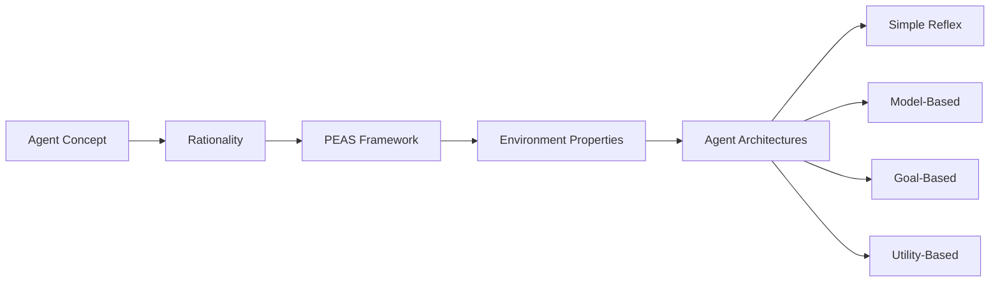

# Chapter 2: Intelligent Agents

**Previous:** [Chapter 1: Introduction to AI](01-introduction.md) | **Next:** [Chapter 3: Solving Problems by Searching](03-search.md)

---

## Learning Objectives

- Define the concept of an "agent" and its interaction with an "environment."
- Distinguish between a "rational agent" and other types of behavioral models.
- Analyze the PEAS (Performance, Environment, Actuators, Sensors) framework for task environments.
- Categorize environments based on their properties (e.g., observability, determinism).
- Identify and compare the four basic types of agent programs: simple reflex, model-based reflex, goal-based, and utility-based.

---

## Chapter at a Glance

| Section | Key Topics | Key Terms |
|---------|-----------|-----------|
| Agents and Environments | Agent, environment, sensors, actuators | Agent function, agent program, percept |
| Rationality | Performance measure, success criteria | Rational agent, expected outcome |
| Task Environments (PEAS) | Performance-Environment-Actuators-Sensors | PEAS framework, task specification |
| Environment Properties | Observable, deterministic, episodic, etc. | Fully/partially observable, stochastic |
| Agent Architectures | Reflex, model-based, goal-based, utility-based | Simple reflex, internal state, learning agent |

## Chapter Roadmap



---

## Theory


### Agents and Environments
> **One-Sentence Takeaway:** An agent perceives its environment through sensors and acts upon it through actuators, with the agent function mapping percept sequences to actions.

An **agent** is anything that can be viewed as perceiving its **environment** through **sensors** and acting upon that environment through **actuators**. The **agent function** maps any given percept sequence to an action. The **agent program** is the concrete implementation of this function running on an architecture.

### Rationality
> **One-Sentence Takeaway:** Rationality is maximizing expected performance given available information — it is not perfection, but optimal decision-making under constraints.

A **rational agent** is one that acts so as to achieve the best outcome or, when there is uncertainty, the best expected outcome. Rationality depends on:
1. The performance measure that defines the criterion of success.
2. The agent's prior knowledge of the environment.
3. The actions that the agent can perform.
4. The agent's percept sequence to date.

### Task Environments (PEAS)
> **One-Sentence Takeaway:** The PEAS framework provides a standard, systematic method for specifying every agent's task by defining Performance, Environment, Actuators, and Sensors.

To design an agent, we must specify the **PEAS** for the task environment:
- **Performance**: The metric for success (e.g., safety, speed, profit).
- **Environment**: The external world where the agent operates (e.g., roads, digital stock market).
- **Actuators**: The mechanisms for acting (e.g., wheels, steering, display).
- **Sensors**: The mechanisms for perceiving (e.g., cameras, microphones, keyboard).

> **💡 Pro Tip:** The most critical environment dimension is observability — whether the environment is fully or partially observable fundamentally determines which agent architecture you can use. Self-driving cars operate in partially observable environments and therefore require model-based agents with internal state.

### Environment Properties
Environments are characterized by several dimensions:
- **Observable**: Fully vs. Partially. Does the agent have access to the complete state?
- **Deterministic**: Deterministic vs. Stochastic. Does the next state depend solely on the current state and action?
- **Episodic**: Episodic vs. Sequential. Is the current decision independent of previous ones?
- **Static**: Static vs. Dynamic. Does the environment change while the agent is thinking?
- **Discrete**: Discrete vs. Continuous. Are the states and actions finite and distinct?
- **Agents**: Single-agent vs. Multi-agent. Are there other agents operating in the environment?

> **⚠️ Warning:** A common mistake is confusing "rationality" with "omniscience." A rational agent makes the best decision based on what it knows — it may still fail because of incomplete information. Rationality does not guarantee success.

---

## Examples

### Example 1: Vacuum-Cleaner Agent
A simple agent that operates in a world with two rooms (A and B).
- **PEAS**:
  - **Performance**: Number of clean squares in a given time.
  - **Environment**: Rooms A and B, dirt.
  - **Actuators**: Move Left, Move Right, Suck.
  - **Sensors**: Location sensor, Dirt sensor.
- **Code snippet (Python Reflex Agent)**:
```python
def reflex_vacuum_agent(location, status):
    if status == 'Dirty':
        return 'Suck'
    elif location == 'A':
        return 'Right'
    elif location == 'B':
        return 'Left'

percept = ('A', 'Dirty')
action = reflex_vacuum_agent(*percept)
print(f"Percept: {percept}, Action: {action}")
```
- **Expected output**: `Percept: ('A', 'Dirty'), Action: Suck`
- **What it demonstrates**: A simple reflex agent that bases its decision only on the current percept.

### Example 2: Automated Taxi Driver
A highly complex agent requiring sophisticated sensors and actuators.
- **PEAS**:
  - **Performance**: Safe, fast, legal, comfortable trip, maximize profits.
  - **Environment**: Roads, other traffic, pedestrians, weather.
  - **Actuators**: Steering, accelerator, brake, signal, horn, display.
  - **Sensors**: Cameras, LIDAR, speedometer, GPS, odometer, engine sensors.
- **Environment Properties**: Partially observable, stochastic, sequential, dynamic, continuous, multi-agent.
- **What it demonstrates**: The application of agent theory to high-stakes, real-world problems.

---

## Concept Comparison

| Agent Type | Internal State | Goal Knowledge | Utility Function | Best For |
|-----------|:---:|:---:|:---:|----------|
| Simple Reflex | No | No | No | Fully observable, simple tasks |
| Model-Based Reflex | Yes | No | No | Partially observable environments |
| Goal-Based | Yes | Yes | No | Problems with clear success criteria |
| Utility-Based | Yes | Yes | Yes | Trade-offs and conflicting objectives |

## Quick Reference — Environment Properties

| Property | Two Poles | Example (Fully Observable) | Example (Not) |
|----------|-----------|---------------------------|---------------|
| Observability | Full vs. Partial | Chess | Poker |
| Determinism | Deterministic vs. Stochastic | 8-Puzzle | Backgammon (dice) |
| Episodicity | Episodic vs. Sequential | Image classification | Robot navigation |
| Dynamics | Static vs. Dynamic | Crossword puzzle | Autonomous driving |
| Discreteness | Discrete vs. Continuous | Chess (finite moves) | Taxi steering angle |
| Agent Count | Single vs. Multi | Sudoku solver | Multiplayer game |

## Cross-Application Matrix

| Agent Type | ML Engineering | Computer Vision | NLP | Research |
|-----------|:---:|:---:|:---:|:---:|
| Simple Reflex | ✅ | ⬜ | ⬜ | ⬜ |
| Model-Based | ✅ | ✅ | ✅ | ✅ |
| Goal-Based | ✅ | ✅ | ✅ | ✅ |
| Utility-Based | ✅ | ⬜ | ⬜ | ✅ |
| Learning Agent | ✅ | ✅ | ✅ | ✅ |

---

## Summary

- Agents interact with environments via sensors and actuators.
- Rationality is not perfection; it is maximizing expected performance based on available information.
- The PEAS framework is the standard method for specifying an agent's task.
- Understanding environment properties is crucial for selecting the right agent architecture.
- Agent programs range from simple reflex systems to complex utility-based learners.
- The "Internal State" in model-based agents allows them to handle partially observable environments.

---

## Chapter Quiz

**Q1:** Which agent architecture requires an internal model of how the world works?
- A) Simple reflex agent
- B) Model-based reflex agent
- C) Utility-based agent
- D) Learning agent

<details><summary>Answer</summary>B) Model-based reflex agents maintain internal state to handle partially observable environments where the current percept alone is insufficient.</details>

**Q2:** In the PEAS framework, what does the "A" stand for?
- A) Actions
- B) Algorithms
- C) Actuators
- D) Applications

<details><summary>Answer</summary>C) Actuators — the mechanisms through which an agent acts upon its environment.</details>

**Q3:** Which environment property distinguishes chess from poker?
- A) Deterministic vs. Stochastic
- B) Static vs. Dynamic
- C) Fully vs. Partially Observable
- D) Both A and C

<details><summary>Answer</summary>D) Chess is fully observable and deterministic; poker is partially observable (hidden cards) and involves chance (stochastic).</details>

---

## Exercises

### Review Questions
1. Define the "Agent Function" vs. the "Agent Program."
2. What makes an agent "autonomous"?
3. List the six properties used to characterize a task environment.
4. Explain why a utility-based agent is often more flexible than a goal-based agent.

### Application Problems
1. Provide the PEAS description for a medical diagnosis system.
2. Characterize the environment of a Chess game according to the six properties.
3. Draw a diagram of a Model-based Reflex Agent and explain the role of the "State."

### Challenge Problem
1. Design a Performance Measure for an internet shopping agent. Explain how your measure prevents the agent from simply buying everything it finds regardless of price or quality, and how it balances speed versus cost-savings.
