# Chapter 2: Problem-Solving by Search

**Previous:** [Chapter 1: Introduction to AI](01-introduction.md) | **Next:** [Chapter 3: Informed Search and Heuristics](03-informed-search.md)

## Learning Objectives

By the conclusion of this chapter, the student will be able to: (1) formulate a problem as a state-space search; (2) implement and analyze uninformed search algorithms; (3) evaluate search algorithm performance using completeness, optimality, time complexity, and space complexity; (4) distinguish problem types by observability, determinism, and dynamics; (5) select appropriate search strategies for given problem classes.

## Chapter at a Glance

| Section | Key Topics | Key Terms |
|---------|-----------|-----------|
| Problem-Solving Agents | Goal formulation, search, execution | Goal-directed agent, problem formulation |
| State-Space Representation | States, actions, transition model | State space, branching factor, solution |
| Problem Classification | Determinism, observability, dynamics | Toy vs. real-world problems |
| Uninformed Search (BFS, DFS, IDDFS, UCS) | Tree/graph search, frontier, explored set | Completeness, optimality, complexity |
| Measuring Performance | Four evaluation dimensions | Time/space complexity, completeness |

## Chapter Roadmap

```mermaid
flowchart LR
    A[Problem Formulation] --> B[State-Space Graph]
    B --> C[Uninformed Search]
    C --> D1[BFS]
    C --> D2[DFS]
    C --> D3[IDDFS]
    C --> D4[UCS]
    D1 --> E[Performance Evaluation]
    D2 --> E
    D3 --> E
    D4 --> E
```



## 2.1 Problem-Solving Agents

> **One-Sentence Takeaway:** A problem-solving agent systematically formulates goals, defines problems as state spaces, searches for action sequences, then executes them in the real world.


A problem-solving agent is a goal-directed agent that decides what to do by finding sequences of actions that lead to desirable states. The agent operates in discrete, deterministic, fully observable environments. The problem-solving process comprises four steps:

1. **Goal formulation:** The agent adopts a set of states representing acceptable outcomes.
2. **Problem formulation:** The agent defines the state space, initial state, actions, transition model, and goal test.
3. **Search:** The agent simulates sequences of actions in the state space.
4. **Execution:** The agent executes the actions in the solution path.

## 2.2 State-Space Representation

> **One-Sentence Takeaway:** Every search problem is defined by six components: state space, initial state, actions, transition model, goal test, and path cost.

A **search problem** is defined by the following components:

- **State space** $\mathcal{S}$: The set of all possible configurations of the environment.
- **Initial state** $s_0 \in \mathcal{S}$: The state from which the agent begins.
- **Actions** $\text{Actions}(s)$: The set of actions applicable in state $s$.
- **Transition model** $\text{Result}(s, a)$: The state resulting from executing action $a$ in state $s$.
- **Goal test** $\text{GoalTest}(s)$: A predicate that returns true when $s$ is a goal state.
- **Path cost** $c(s, a, s')$: The cost of applying action $a$ to transition from $s$ to $s'$.

A **solution** is a sequence of actions leading from $s_0$ to a goal state. An **optimal solution** minimizes total path cost.

The state space can be represented as a graph $\mathcal{G} = (\mathcal{S}, \mathcal{E})$ where edges correspond to actions. The branching factor $b$ is the average number of actions per state; the depth $d$ is the number of steps in a solution.

## 2.3 Problem Classification

Problems are classified along three principal dimensions:

**Deterministic versus Nondeterministic:** In deterministic problems, each action has a single guaranteed outcome. In nondeterministic problems, outcomes are probabilistic.

**Fully Observable versus Partially Observable:** Full observability means the agent's sensors give complete access to the state. Partial observability introduces uncertainty about the current state.

**Static versus Dynamic:** Static problems do not change while the agent deliberates. Dynamic problems impose real-time constraints.

Toy problems (e.g., the 8-puzzle, vacuum world) are simplified domains used for pedagogical purposes. Real-world problems (e.g., route planning, VLSI layout, robot navigation) involve larger state spaces and more complex constraints.

> **💡 Pro Tip:** The choice between BFS and DFS often comes down to space constraints. BFS guarantees optimality but requires exponential memory; DFS uses linear space but may never find a solution in infinite state spaces.

## 2.4 Uninformed Search Algorithms

Uninformed (blind) search algorithms have no information about the cost or desirability of states beyond that provided by the problem definition. The **frontier** (or open list) contains states generated but not yet expanded. The **explored set** (or closed list) contains states already expanded.

### 2.4.1 Breadth-First Search (BFS)

BFS expands the shallowest unexpanded node. The frontier is implemented as a FIFO queue.

```
function BREADTH-FIRST-SEARCH(problem) returns solution or failure
    node ← NODE(problem.INITIAL)
    if problem.GOAL-TEST(node.STATE) then return SOLUTION(node)
    frontier ← FIFO queue containing node
    explored ← empty set
    loop do
        if EMPTY?(frontier) then return failure
        node ← POP(frontier)
        add node.STATE to explored
        for each action in problem.ACTIONS(node.STATE) do
            child ← CHILD-NODE(problem, node, action)
            if child.STATE not in explored and child.STATE not in frontier then
                if problem.GOAL-TEST(child.STATE) then return SOLUTION(child)
                frontier ← INSERT(child, frontier)
```

BFS is complete (finds a solution if one exists) and optimal for uniform step costs. Time and space complexity: $O(b^{d+1})$.

### 2.4.2 Depth-First Search (DFS)

DFS expands the deepest unexpanded node. The frontier is implemented as a LIFO stack.

DFS has space complexity $O(bm)$, where $m$ is the maximum depth, which can be substantially better than BFS. However, DFS is not complete (it may diverge into infinite paths) and is not optimal. For finite state spaces with cycle detection, DFS becomes complete.

### 2.4.3 Iterative Deepening Depth-First Search (IDDFS)

IDDFS combines the space efficiency of DFS with the completeness and optimality of BFS. The algorithm performs a series of depth-limited DFS searches with increasing depth limits. Time complexity: $O(b^d)$. Space complexity: $O(bd)$. IDDFS is the preferred uninformed search method for large state spaces with unknown solution depth.

```
function ITERATIVE-DEEPENING-SEARCH(problem) returns solution or failure
    for depth = 0 to ∞ do
        result ← DEPTH-LIMITED-SEARCH(problem, depth)
        if result ≠ cutoff then return result
```

### 2.4.4 Uniform-Cost Search

Uniform-cost search (Dijkstra, 1959) expands the node with the lowest path cost $g(n)$. The frontier is implemented as a priority queue ordered by $g(n)$. Completeness and optimality hold under the condition that step costs are positive. Complexity: $O(b^{1 + \lfloor C^*/\epsilon \rfloor})$ where $C^*$ is the optimal cost and $\epsilon$ is the minimum step cost.

### 2.4.5 Bidirectional Search

Bidirectional search simultaneously expands forward from the initial state and backward from the goal state, terminating when the frontiers intersect. Time and space complexity: $O(b^{d/2})$. Applicability requires invertible actions and a known goal state.

## 2.5 Measuring Search Performance

> **One-Sentence Takeaway:** Search algorithms are evaluated on completeness, optimality, time complexity, and space complexity — and space is often the binding constraint.

Search algorithms are evaluated along four dimensions:

- **Completeness:** Does the algorithm guarantee finding a solution when one exists?
- **Optimality:** Does the algorithm guarantee finding the lowest-cost solution?
- **Time complexity:** How many nodes are generated?
- **Space complexity:** How many nodes must be stored in memory simultaneously?

> **⚠️ Warning:** Bidirectional search appears appealing (O(b^{d/2})), but it requires the goal state to be known in advance and actions to be reversible — conditions rarely met in practice.

## Concept Comparison

| Algorithm | Complete? | Optimal? | Time | Space | Strategy |
|-----------|:---:|:---:|:---:|:---:|----------|
| BFS | ✅ | ✅ (uniform cost) | O(b^{d+1}) | O(b^{d+1}) | FIFO queue |
| DFS | ❌ (without cycle check) | ❌ | O(b^m) | O(bm) | LIFO stack |
| IDDFS | ✅ | ✅ (uniform cost) | O(b^d) | O(bd) | Depth-limited iterations |
| UCS | ✅ | ✅ (positive costs) | O(b^{1+⌊C*/ε⌋}) | O(b^{1+⌊C*/ε⌋}) | Priority queue by g(n) |
| Bidirectional | ✅ | ✅ | O(b^{d/2}) | O(b^{d/2}) | Two simultaneous searches |

## Quick Reference — State-Space Search Components

| Component | Definition | Example (8-Puzzle) |
|-----------|-----------|-------------------|
| State space S | All configurations | All 9! / 2 = 181,440 tile arrangements |
| Initial state sâ‚€ | Starting config | Given scrambled puzzle |
| Actions Actions(s) | Legal moves | {Up, Down, Left, Right} blank |
| Transition Result(s,a) | Resulting state | Tile slides into blank position |
| Goal test | Target check | Is state the goal configuration? |
| Path cost c(s,a,s') | Step cost | 1 per move (uniform) |

## Cross-Application Matrix

| Search Method | ML Engineering | Computer Vision | NLP | Research |
|--------------|:---:|:---:|:---:|:---:|
| BFS | ⬜ | ⬜ | ⬜ | ✅ |
| DFS | ⬜ | ⬜ | ✅ | ✅ |
| IDDFS | ⬜ | ⬜ | ⬜ | ✅ |
| UCS / Dijkstra | ✅ | ✅ | ⬜ | ✅ |
| Bidirectional | ⬜ | ⬜ | ⬜ | ⬜ |

## Chapter Quiz

**Q1:** Which algorithm is guaranteed to find the optimal solution while using only O(bd) space?
- A) BFS
- B) DFS
- C) IDDFS
- D) UCS

<details><summary>Answer</summary>C) IDDFS combines BFS's optimality with DFS's linear space requirements.</details>

**Q2:** What makes DFS incomplete on infinite state spaces?
- A) It uses too much memory
- B) It may diverge down an infinite path
- C) It cannot handle cycles
- D) It only works on trees

<details><summary>Answer</summary>B) DFS may follow an infinite path and never backtrack to find the goal. Cycle detection helps but doesn't solve the infinite-path problem.</details>

**Q3:** Uniform-cost search reduces to BFS under what condition?
- A) When the heuristic is admissible
- B) When all step costs are equal
- C) When the branching factor is 2
- D) When using a FIFO queue

<details><summary>Answer</summary>B) When all step costs are identical, UCS explores in breadth-first order since all nodes at the same depth have equal cost.</details>

## 2.6 Summary

This chapter presented the state-space formulation of search problems and five uninformed search strategies. The choice among BFS, DFS, IDDFS, and uniform-cost search depends on the problem's branching factor, solution depth, and cost structure.

## Exercises

### Review Questions

1. Define completeness and optimality. Is it possible for a search algorithm to be complete but not optimal? Provide an example.
2. Why does BFS require exponential space while DFS requires linear space?
3. Under what conditions does IDDFS asymptotically match BFS in time complexity while using significantly less space?

### Application Problems

4. Formulate the 8-puzzle as a search problem. Define the state space, actions, transition model, goal test, and path cost. Estimate the size of the state space.
5. Consider a search problem with branching factor $b = 10$ and solution depth $d = 6$. Compute the number of nodes generated by BFS, DFS with cycle detection, and IDDFS.

### Challenge Problem

6. **Route finding in Romania.** A traveler wishes to drive from Arad to Bucharest. Road distances between cities are known. Formulate this as a search problem. Implement uniform-cost search and determine the optimal route. Prove that the algorithm terminates and is optimal for this problem.
