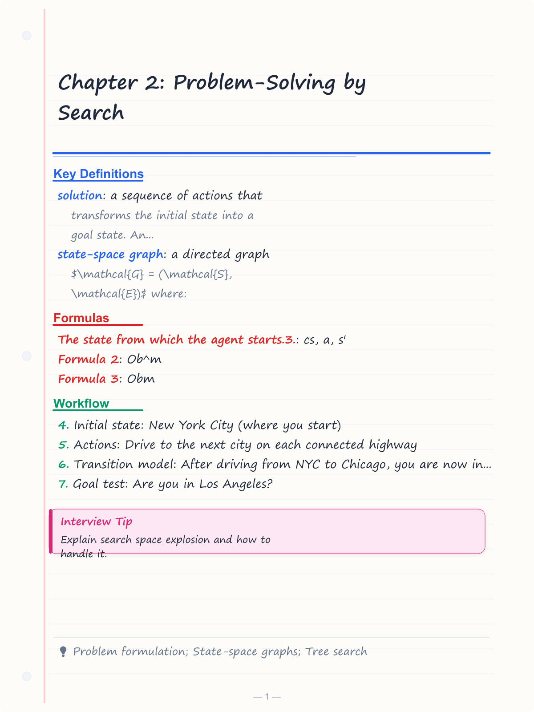
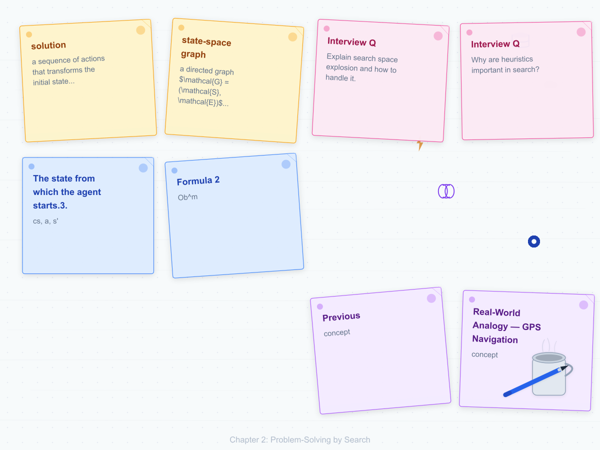
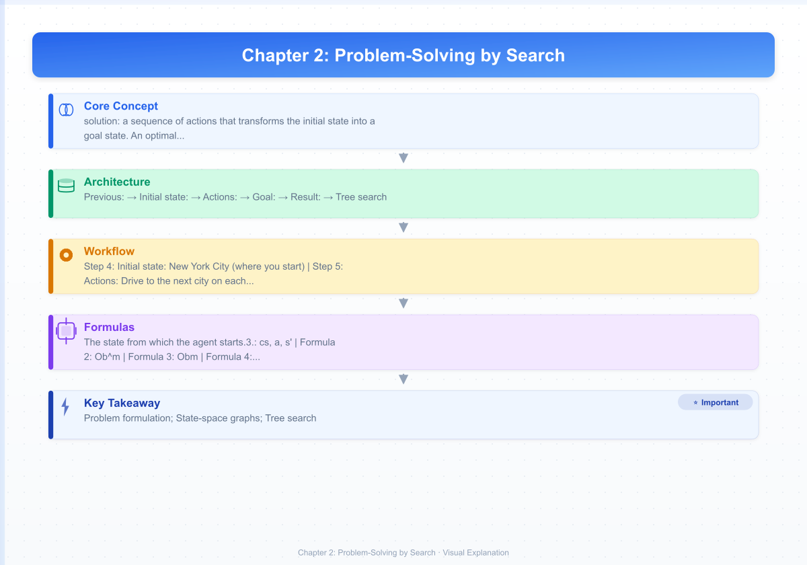
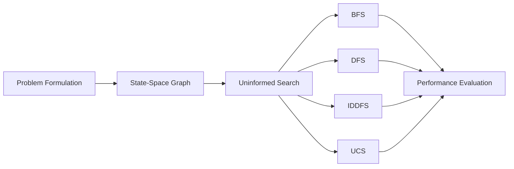
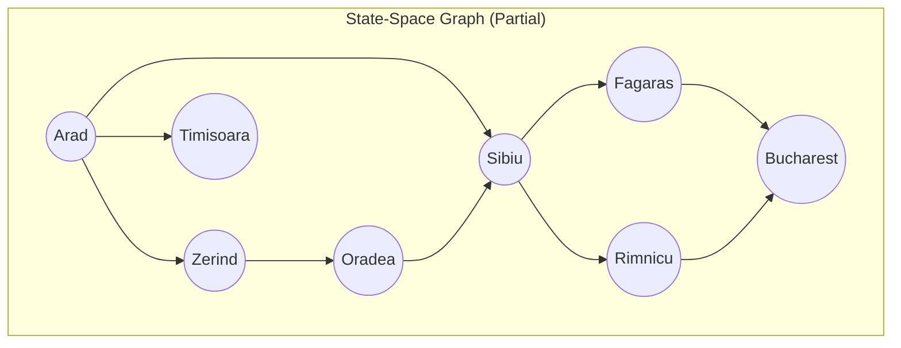

# Chapter 2: Problem-Solving by Search

**Previous:** [Chapter 1: Introduction to AI](01-introduction.md) | **Next:** [Chapter 3: Informed Search and Heuristics](03-informed-search.md)

## Learning Objectives

By the conclusion of this chapter, the student will be able to: (1) formulate a problem as a state-space search; (2) implement and analyze uninformed search algorithms; (3) evaluate search algorithm performance using completeness, optimality, time complexity, and space complexity; (4) distinguish problem types by observability, determinism, and dynamics; (5) select appropriate search strategies for given problem classes.

<!-- Image Gallery -->
<section class="lesson-visuals" aria-label="Visual learning resources">
  <header><span>VISUAL LEARNING</span><h2>See it. Review it. Remember it.</h2></header>
  <a class="lesson-visual-card" href="../../assets/images/lessons/artificial-intelligence/02-problem-solving/handwritten-notes.png" target="_blank" rel="noopener">
    
    <span><strong>Handwritten notes</strong>Condensed notes for deliberate review.</span>
  </a>
  <a class="lesson-visual-card" href="../../assets/images/lessons/artificial-intelligence/02-problem-solving/sticky-notes.png" target="_blank" rel="noopener">
    
    <span><strong>Sticky-note revision</strong>Fast recall prompts for revision.</span>
  </a>
  <a class="lesson-visual-card" href="../../assets/images/lessons/artificial-intelligence/02-problem-solving/visual-explanation.png" target="_blank" rel="noopener">
    
    <span><strong>Visual concept guide</strong>A connected explanation of the key ideas.</span>
  </a>
</section>
<!-- End Image Gallery -->


---

## Why Problem Solving in AI Matters

> **Real-World Analogy — GPS Navigation**

Imagine you are driving in an unfamiliar city and need to reach a specific restaurant. You have a map (the state space), you know your current location (initial state), and you know the restaurant's address (goal state). Each road you can turn onto is an **action**, and the new intersection you arrive at is the **resulting state**. A GPS navigation system solves exactly this problem — it searches through millions of possible routes, evaluates which ones are shortest or fastest, and presents you with the optimal path. Every time you use Google Maps, Waze, or Apple Maps, you are relying on **search algorithms** that were born in AI research. The same ideas power chess engines, robot motion planning, and even the way your email spam filter classifies messages. Problem-solving by search is the **foundation of intelligent decision-making** in AI.

---

## Chapter at a Glance

| Section | Key Topics | Key Terms |
|---------|-----------|-----------|
| Problem-Solving Agents | Goal formulation, search, execution | Goal-directed agent, problem formulation |
| State-Space Representation | States, actions, transition model | State space, branching factor, solution |
| Problem Classification | Determinism, observability, dynamics | Toy vs. real-world problems |
| Uninformed Search (BFS, DFS, IDDFS, UCS) | Tree/graph search, frontier, explored set | Completeness, optimality, complexity |
| Measuring Performance | Four evaluation dimensions | Time/space complexity, completeness |

## Chapter Roadmap



---

## 2.1 Problem Formulation

> **Real-World Analogy — Planning a Road Trip**

Suppose you are planning a road trip from New York to Los Angeles. You need to decide:
- **Initial state:** New York City (where you start)
- **Actions:** Drive to the next city on each connected highway
- **Transition model:** After driving from NYC to Chicago, you are now in Chicago
- **Goal test:** Are you in Los Angeles?
- **Path cost:** Total miles driven (or gas money spent)

Every AI search problem follows this same pattern: **where you are, what you can do, where each action takes you, whether you have arrived, and how much it cost to get there**.

### 2.1.1 What is Problem Formulation?


Problem formulation is the process of abstracting a real-world situation into a formal search problem that an AI agent can solve. A well-formulated problem has six components:

1. **State Space ($\mathcal{S}$):** The set of all possible configurations of the environment.
2. **Initial State ($s_0$):** The state from which the agent starts.
3. **Actions ($\text{Actions}(s)$):** The set of actions available in state $s$.
4. **Transition Model ($\text{Result}(s, a)$):** The state reached by performing action $a$ in state $s$.
5. **Goal Test ($\text{GoalTest}(s)$):** A function that returns true if $s$ is a goal state.
6. **Path Cost ($c(s, a, s')$):** The numerical cost of applying action $a$ to go from $s$ to $s'$.

> **Key Insight:** A **solution** is a sequence of actions that transforms the initial state into a goal state. An **optimal solution** minimizes the total path cost.

### 2.1.2 Algorithm — Problem Formulation Steps


```
ALGORITHM: FormulateProblem(realWorldSituation)
1. Identify the agent's possible starting configurations → Initial state
2. Define the set of all reachable configurations → State space
3. For each state, list all legal moves → Actions(s)
4. Define Result(s, a) for every state–action pair → Transition model
5. Specify the condition that identifies success → Goal test
6. Assign a cost to each action → Path cost
7. RETURN a tuple (S, s0, Actions, Result, GoalTest, Cost)
```

### 2.1.3 Dry Run — Formulating the 8-Puzzle


```
Situation: A 3×3 sliding puzzle with tiles 1-8 and one blank.

Step 1: Initial state s0 = [[5,1,3],[8,2,4],[7,6,blank]]
Step 2: State space S = all 9!/2 = 181,440 valid tile arrangements
Step 3: Actions(s) = {UP, DOWN, LEFT, RIGHT} for blank tile
Step 4: Result(s, UP) = swap blank with tile above it
Step 5: GoalTest(s) = s == [[1,2,3],[4,5,6],[7,8,blank]]
Step 6: Path cost = 1 per move (uniform)
Step 7: RETURN (S, s0, Actions, Result, GoalTest, 1)
```

### 2.1.4 Python Implementation


```python
class Problem:
    """Base class for formulating a search problem."""

    def __init__(self, initial, goal=None):
        self.initial = initial  # Initial state
        self.goal = goal        # Goal state

    def actions(self, state):
        """Return available actions in a given state."""
        raise NotImplementedError

    def result(self, state, action):
        """Return the state after applying an action."""
        raise NotImplementedError

    def goal_test(self, state):
        """Check if the current state is the goal."""
        return state == self.goal

    def path_cost(self, c, state1, action, state2):
        """Return the cost of a path (default = 1 per step)."""
        return c + 1


class EightPuzzle(Problem):
    """Formulation of the 8-puzzle problem."""

    def __init__(self, initial, goal=None):
        super().__init__(initial, goal or [[1,2,3],[4,5,6],[7,8,0]])

    def _find_blank(self, state):
        for i in range(3):
            for j in range(3):
                if state[i][j] == 0:
                    return i, j
        return None

    def actions(self, state):
        i, j = self._find_blank(state)
        moves = []
        if i > 0: moves.append('UP')
        if i < 2: moves.append('DOWN')
        if j > 0: moves.append('LEFT')
        if j < 2: moves.append('RIGHT')
        return moves

    def result(self, state, action):
        import copy
        i, j = self._find_blank(state)
        new_state = copy.deepcopy(state)
        if action == 'UP':
            new_state[i][j], new_state[i-1][j] = new_state[i-1][j], new_state[i][j]
        elif action == 'DOWN':
            new_state[i][j], new_state[i+1][j] = new_state[i+1][j], new_state[i][j]
        elif action == 'LEFT':
            new_state[i][j], new_state[i][j-1] = new_state[i][j-1], new_state[i][j]
        elif action == 'RIGHT':
            new_state[i][j], new_state[i][j+1] = new_state[i][j+1], new_state[i][j]
        return new_state
```

### 2.1.5 Complexity Analysis


| Aspect | Analysis |
|--------|----------|
| **Time** | O(1) to formulate — the problem is defined once at the start. |
| **Space** | O(\|S\|) in the worst case, where \|S\| is the size of the state space. For the 8-puzzle, \|S\| = 181,440 states. |
| **Why?** | Problem formulation is a one-time setup cost. The state space may be huge (e.g., chess has ~10^43 states), but we only define the rules — we don't generate all states at once. |

### 2.1.6 Advantages & Disadvantages


| Advantages | Disadvantages |
|------------|---------------|
| Provides a universal framework for any AI problem | Requires full observability and deterministic actions |
| Separates "what to solve" from "how to solve" | Some real-world problems cannot be cleanly formulated |
| Enables rigorous analysis of completeness/optimality | State space may be intractably large |
| Works across domains (games, robotics, planning) | Assumes discrete states and actions |

### 2.1.7 Edge Cases


| Edge Case | How to Handle |
|-----------|---------------|
| **No goal state exists** | Algorithm should detect unsolvability (e.g., 8-puzzle parity check) |
| **Multiple goal states** | Goal test becomes a membership check in a set of goal states |
| **Zero-cost actions** | Can cause UCS to loop; need positive-cost guarantee |
| **Infinite state space** | Problem formulation still works, but search may never terminate |
| **Unknown initial state** | Use a belief state (set of possible states) instead of a single state |

---

## 2.2 Search Space and State-Space Graph

> **Real-World Analogy — The Subway Map**

A subway map shows every station and every connecting line. Given your current station and a destination, the map defines the **search space**: all possible sequences of train rides you could take. Some routes are direct, others require transfers. The subway map is your **state-space graph** — stations are states, train lines between them are actions. Your job (and the AI's) is to find a sequence of rides that gets you to your destination.

### 2.2.1 Formal Definition


The **state space** of a problem is the set of all states reachable from the initial state by any sequence of actions. The **state-space graph** is a directed graph $\mathcal{G} = (\mathcal{S}, \mathcal{E})$ where:

- **Vertices** $\mathcal{S}$ are states (configurations of the environment).
- **Edges** $\mathcal{E}$ are transitions defined by actions.
- The **branching factor** $b$ is the average number of outgoing edges per state.
- The **solution depth** $d$ is the number of steps in the shortest solution.



> **Key Insight:** The state-space graph may be **implicit** — we generate states on-the-fly using the transition model rather than storing the entire graph. An explicit graph is stored in memory; an implicit one is generated lazily.

### 2.2.2 Algorithm — Building the State-Space Graph


```
ALGORITHM: BuildStateSpaceGraph(problem)
1. Create an empty graph G with no vertices or edges
2. Add problem.INITIAL as a vertex in G
3. Initialize a queue Q with problem.INITIAL
4. WHILE Q is not empty:
5.     current ← POP(Q)
6.     FOR each action in problem.ACTIONS(current):
7.         next ← problem.RESULT(current, action)
8.         IF next is not a vertex in G:
9.             Add next as a vertex in G
10.            ENQUEUE next into Q
11.        Add a directed edge from current to next with label action
12. RETURN G
```

### 2.2.3 Dry Run — Romanian Road Map (Partial)


**Initial state:** Arad
**Actions:** Drive to connected city
**Goal:** Bucharest

| Step | Current State | Frontier (Q) | Vertices Added | Edges Added |
|------|---------------|--------------|----------------|-------------|
| 0 | — | [Arad] | {Arad} | — |
| 1 | Arad | [Zerind, Sibiu, Timisoara] | {Arad, Zerind, Sibiu, Timisoara} | A→Z, A→S, A→T |
| 2 | Zerind | [Sibiu, Timisoara, Oradea] | {…, Oradea} | Z→O |
| 3 | Sibiu | [Timisoara, Oradea, Fagaras, Rimnicu] | {…, Fagaras, Rimnicu} | S→F, S→R |
| 4 | Timisoara | [Oradea, Fagaras, Rimnicu, Lugoj] | {…, Lugoj} | T→L |
| 5 | Oradea | [Fagaras, Rimnicu, Lugoj] | {…} | O→S (exists) |
| 6 | Fagaras | [Rimnicu, Lugoj, Bucharest] | {…, Bucharest} | F→B |
| 7 | Rimnicu | [Lugoj, Bucharest, Pitesti] | {…, Pitesti} | R→P |
| 8 | Lugoj | [Bucharest, Pitesti, Mehadia] | {…, Mehadia} | L→M |

**Result:** Complete graph with 10 cities and 12 road connections discovered.

### 2.2.4 Python Implementation


```python
def build_state_space_graph(problem):
    """Build an explicit state-space graph from a problem definition."""
    graph = {'vertices': set(), 'edges': []}
    initial = problem.initial
    graph['vertices'].add(str(initial))
    queue = [initial]

    while queue:
        current = queue.pop(0)
        for action in problem.actions(current):
            next_state = problem.result(current, action)
            s_next = str(next_state)
            if s_next not in graph['vertices']:
                graph['vertices'].add(s_next)
                queue.append(next_state)
            graph['edges'].append((str(current), action, s_next))

    return graph


# Build the graph for a simple route-finding problem
class RouteFinding(Problem):
    def __init__(self, initial, goal, roadmap):
        super().__init__(initial, goal)
        self.roadmap = roadmap

    def actions(self, state):
        return [city for city, _ in self.roadmap.get(state, [])]

    def result(self, state, action):
        return action


# Example usage
romania = {
    'Arad': [('Zerind', 75), ('Sibiu', 140), ('Timisoara', 118)],
    'Zerind': [('Oradea', 71), ('Arad', 75)],
    'Sibiu': [('Fagaras', 99), ('Rimnicu', 80), ('Arad', 140)],
    'Timisoara': [('Lugoj', 111), ('Arad', 118)],
    'Fagaras': [('Bucharest', 211), ('Sibiu', 99)],
    'Rimnicu': [('Pitesti', 97), ('Sibiu', 80)],
    'Lugoj': [('Mehadia', 70), ('Timisoara', 111)],
    'Oradea': [('Zerind', 71)],
    'Pitesti': [('Bucharest', 101), ('Rimnicu', 97)],
    'Mehadia': [('Lugoj', 70)],
    'Bucharest': []
}

problem = RouteFinding('Arad', 'Bucharest', romania)
graph = build_state_space_graph(problem)
print(f"States discovered: {len(graph['vertices'])}")
print(f"Transitions: {len(graph['edges'])}")
```

### 2.2.5 Complexity Analysis


| Aspect | Analysis |
|--------|----------|
| **Time** | O(\|S\| × b) where \|S\| is the number of states and b is the branching factor |
| **Space** | O(\|S\| + \|E\|) to store the explicit graph |
| **Why?** | Every state must be visited once, and for each state we generate all b successors. For the 8-puzzle, that is 181,440 × ~2.67 ≈ 484,000 operations. For chess, building the full graph is impossible (~10^43 states). |

### 2.2.6 Advantages & Disadvantages


| Advantages | Disadvantages |
|------------|---------------|
| Gives a complete picture of the problem space | Infeasible for large state spaces |
| Enables offline analysis and optimization | Building the full graph may be more expensive than solving the problem |
| Useful for visualization and debugging | Many generated states may never be visited by search |
| Foundation for advanced search techniques | Requires memory proportional to the state space |

### 2.2.7 Edge Cases


| Edge Case | How to Handle |
|-----------|---------------|
| **Cyclic graphs** | Detect cycles with visited set to prevent infinite generation |
| **Disconnected state spaces** | Goal may be unreachable; algorithm still terminates |
| **Very large branching factor** | Prioritize generation using heuristics |
| **Continuous state spaces** | Discretize or use sampling techniques |

---

## 2.3 Tree Search vs. Graph Search

> **Real-World Analogy — Exploring a Maze vs. Exploring a City**

**Tree search** is like exploring a maze where you have no memory of where you have been — you might revisit the same intersection multiple times. **Graph search** is like exploring a city with a smartphone that marks every street you have already walked — you never waste time retracing your steps.

### 2.3.1 Tree Search


Tree search treats the state space as a tree, ignoring the possibility that the same state can be reached through multiple paths. The **frontier** holds nodes generated but not yet expanded.

```
ALGORITHM: TreeSearch(problem)
1. frontier ← {Node(problem.INITIAL)}
2. LOOP:
3.     IF frontier is empty: RETURN failure
4.     node ← REMOVE-CHOICE(frontier)
5.     IF problem.GOAL-TEST(node.STATE): RETURN SOLUTION(node)
6.     frontier ← frontier ∪ EXPAND(problem, node)
```

### 2.3.2 Graph Search


Graph search tracks visited states in an **explored set** (closed list), preventing revisitation.

```
ALGORITHM: GraphSearch(problem)
1. frontier ← {Node(problem.INITIAL)}
2. explored ← ∅
3. LOOP:
4.     IF frontier is empty: RETURN failure
5.     node ← REMOVE-CHOICE(frontier)
6.     IF problem.GOAL-TEST(node.STATE): RETURN SOLUTION(node)
7.     ADD node.STATE to explored
8.     FOR each child in EXPAND(problem, node):
9.         IF child.STATE not in explored AND child.STATE not in frontier:
10.            frontier ← frontier ∪ {child}
```

### 2.3.3 Dry Run — Tree Search vs. Graph Search


**Problem:** Simple graph with states A–B–C–D–E, start = A, goal = E, BFS order.

**Tree Search Trace:**

| Step | Frontier | Current | Expanded | Goal? |
|------|----------|---------|----------|-------|
| 1 | [A] | A | B, C | No |
| 2 | [B, C] | B | A, D | No |
| 3 | [C, A, D] | C | A, E | No |
| 4 | [A, D, A, E] | A | — | No (repeat) |
| 5 | [D, A, E] | D | B, E | No |
| 6 | [A, E, B, E] | A | — | No (repeat) |
| 7 | [E, B, E] | E | — | **Yes** |

> **Note:** A, B are expanded multiple times in tree search — wasted work.

**Graph Search Trace (with explored set):**

| Step | Frontier | Explored | Current | Expanded | Goal? |
|------|----------|----------|---------|----------|-------|
| 1 | [A] | {} | A | B, C | No |
| 2 | [B, C] | {A} | B | D | No |
| 3 | [C, D] | {A, B} | C | E | No |
| 4 | [D, E] | {A, B, C} | D | — (B explored) | No |
| 5 | [E] | {A, B, C, D} | E | — | **Yes** |

> **Key Difference:** Graph search expands 5 nodes; tree search expands 7+ nodes for the same problem. The savings grow exponentially with problem size.

### 2.3.4 Python Implementation


```python
def tree_search(problem, remove_choice):
    """Generic tree search. remove_choice defines the search strategy."""
    frontier = [Node(problem.initial)]
    while frontier:
        node = remove_choice(frontier)
        if problem.goal_test(node.state):
            return solution(node)
        frontier += expand(problem, node)
    return None

def graph_search(problem, remove_choice):
    """Generic graph search with explored set."""
    frontier = [Node(problem.initial)]
    explored = set()
    while frontier:
        node = remove_choice(frontier)
        if problem.goal_test(node.state):
            return solution(node)
        explored.add(str(node.state))
        for child in expand(problem, node):
            s = str(child.state)
            if s not in explored and not any(str(n.state) == s for n in frontier):
                frontier.append(child)
    return None


class Node:
    def __init__(self, state, parent=None, action=None, cost=0):
        self.state = state
        self.parent = parent
        self.action = action
        self.cost = cost

    def __repr__(self):
        return f"Node({self.state})"


def expand(problem, node):
    """Generate child nodes by applying all legal actions."""
    children = []
    for action in problem.actions(node.state):
        next_state = problem.result(node.state, action)
        child = Node(next_state, node, action, node.cost + 1)
        children.append(child)
    return children


def solution(node):
    """Reconstruct the path from the initial state to the goal."""
    path = []
    while node.parent is not None:
        path.append(node.action)
        node = node.parent
    path.reverse()
    return path
```

### 2.3.5 Complexity Analysis


| Aspect | Tree Search | Graph Search |
|--------|-------------|--------------|
| **Time** | O(b^d) — may revisit states | O(b^d) — but typically less due to pruning |
| **Space** | O(bd) for DFS, O(b^d) for BFS | O(b^d) — explored set adds overhead |
| **Why?** | Tree search generates b children per node for d levels. Graph search avoids revisiting, so effective branching factor is lower in graphs with many paths to the same state. |

### 2.3.6 Tree Search vs. Graph Search — Comparison Table


| Feature | Tree Search | Graph Search |
|---------|-------------|--------------|
| **Memory (explored set)** | Not needed | Required |
| **State revisitation** | States may be expanded many times | Each state expanded at most once |
| **Completeness** | Complete if no cycles | Always complete (finite state spaces) |
| **Optimality** | Same as underlying strategy | Same as underlying strategy |
| **Time (worst case)** | O(b^d) | O(b^d) |
| **Space (worst case)** | Depends on strategy | Depends on strategy + O(\|S\|) |
| **Best for** | Tree-structured problems | Graph-structured problems |
| **Example** | Family genealogy tree | Road network navigation |

### 2.3.7 Advantages & Disadvantages of Graph Search


| Advantages | Disadvantages |
|------------|---------------|
| No redundant state expansions | Memory overhead for the explored set |
| Faster in densely connected graphs | Equality checking adds per-node cost |
| Always terminates in finite spaces | May still revisit states on the frontier |
| Lower effective branching factor | Not suitable for huge state spaces |

### 2.3.8 Edge Cases


| Edge Case | How to Handle |
|-----------|---------------|
| **State equality is expensive** | Use hashable state representations |
| **Frontier also needs checking** | Graph search must check both explored AND frontier |
| **Memory exhaustion** | Fall back to iterative deepening or tree search |
| **Continuous states** | Cannot store exact states; use locality-sensitive hashing |

---

## 2.4 Uninformed Search Algorithms

> **Real-World Analogy — Searching a Dark Warehouse**

Imagine you are in a pitch-black warehouse looking for a specific box. You have no map, no labels, no hints. You must systematically search every aisle. This is **uninformed (blind) search** — you have no information beyond the problem definition to guide your choices.

### 2.4.1 Breadth-First Search (BFS)


BFS expands nodes in order of their depth from the root. All nodes at depth $d$ are expanded before any node at depth $d+1$.

```
ALGORITHM: BFS(problem)
1. node ← Node(problem.INITIAL)
2. IF problem.GOAL-TEST(node.STATE): RETURN SOLUTION(node)
3. frontier ← FIFO queue containing node
4. explored ← empty set
5. LOOP:
6.     IF EMPTY(frontier): RETURN failure
7.     node ← POP(frontier)
8.     ADD node.STATE to explored
9.     FOR each action in problem.ACTIONS(node.STATE):
10.        child ← CHILD-NODE(problem, node, action)
11.        IF child.STATE not in explored AND child.STATE not in frontier:
12.            IF problem.GOAL-TEST(child.STATE): RETURN SOLUTION(child)
13.            frontier ← INSERT(child, frontier)
```

**Dry Run — BFS on the Romania Graph**

Start: Arad → Goal: Bucharest

| Step | Frontier (FIFO) | Explored | Current | Generated | Goal? |
|------|-----------------|----------|---------|-----------|-------|
| 1 | [Arad] | {} | Arad | Zerind, Sibiu, Timisoara | No |
| 2 | [Zerind, Sibiu, Timisoara] | {Arad} | Zerind | Oradea | No |
| 3 | [Sibiu, Timisoara, Oradea] | {Arad, Zerind} | Sibiu | Fagaras, Rimnicu | No |
| 4 | [Timisoara, Oradea, Fagaras, Rimnicu] | {Arad, Zerind, Sibiu} | Timisoara | Lugoj | No |
| 5 | [Oradea, Fagaras, Rimnicu, Lugoj] | {…, Timisoara} | Oradea | — (Zerind explored) | No |
| 6 | [Fagaras, Rimnicu, Lugoj] | {…, Oradea} | Fagaras | Bucharest | **Yes** |

**Solution:** Arad → Sibiu → Fagaras → Bucharest (is this optimal? No — Arad → Sibiu → Rimnicu → Pitesti → Bucharest is shorter).

**Python Implementation:**

```python
from collections import deque

def bfs(problem):
    """Breadth-First Search — returns solution path or None."""
    initial_node = Node(problem.initial)
    if problem.goal_test(initial_node.state):
        return solution(initial_node)

    frontier = deque([initial_node])
    explored = set()

    while frontier:
        node = frontier.popleft()
        explored.add(str(node.state))

        for action in problem.actions(node.state):
            child_state = problem.result(node.state, action)
            s = str(child_state)

            if s not in explored and not any(str(n.state) == s for n in frontier):
                if problem.goal_test(child_state):
                    child_node = Node(child_state, node, action, node.cost + 1)
                    return solution(child_node)
                frontier.append(Node(child_state, node, action, node.cost + 1))

    return None
```

### 2.4.2 Depth-First Search (DFS)


DFS expands the deepest unexpanded node first using a LIFO stack.

```
ALGORITHM: DFS(problem)
1. node ← Node(problem.INITIAL)
2. IF problem.GOAL-TEST(node.STATE): RETURN SOLUTION(node)
3. frontier ← LIFO stack containing node
4. explored ← empty set
5. LOOP:
6.     IF EMPTY(frontier): RETURN failure
7.     node ← POP(frontier)
8.     IF problem.GOAL-TEST(node.STATE): RETURN SOLUTION(node)
9.     ADD node.STATE to explored
10.    FOR each action in problem.ACTIONS(node.STATE):
11.        child ← CHILD-NODE(problem, node, action)
12.        IF child.STATE not in explored AND child.STATE not in frontier:
13.            frontier ← INSERT(child, frontier)
```

**Dry Run — DFS on Romania Graph**

| Step | Frontier (LIFO) | Explored | Current | Generated | Goal? |
|------|-----------------|----------|---------|-----------|-------|
| 1 | [Arad] | {} | Arad | Zerind, Sibiu, Timisoara | No |
| 2 | [Sibiu, Timisoara, Zerind] | {Arad} | Sibiu | Fagaras, Rimnicu | No |
| 3 | [Rimnicu, Fagaras, Timisoara, Zerind] | {Arad, Sibiu} | Rimnicu | Pitesti | No |
| 4 | [Pitesti, Fagaras, Timisoara, Zerind] | {…, Rimnicu} | Pitesti | Bucharest | No |
| 5 | [Bucharest, Fagaras, Timisoara, Zerind] | {…, Pitesti} | Bucharest | — | **Yes** |

> **Note:** DFS found a different path: Arad → Sibiu → Rimnicu → Pitesti → Bucharest (optimal at 418 km).

**Python Implementation:**

```python
def dfs(problem):
    """Depth-First Search — returns solution path or None."""
    frontier = [Node(problem.initial)]
    explored = set()

    while frontier:
        node = frontier.pop()
        if problem.goal_test(node.state):
            return solution(node)
        explored.add(str(node.state))

        for action in problem.actions(node.state):
            child_state = problem.result(node.state, action)
            s = str(child_state)
            if s not in explored and not any(str(n.state) == s for n in frontier):
                child_node = Node(child_state, node, action, node.cost + 1)
                frontier.append(child_node)

    return None
```

### 2.4.3 Iterative Deepening DFS (IDDFS)


IDDFS combines DFS's linear space with BFS's completeness and optimality.

```
ALGORITHM: IDDFS(problem)
1. FOR depth = 0 TO ∞:
2.     result ← DEPTH-LIMITED-SEARCH(problem, depth)
3.     IF result ≠ cutoff: RETURN result

SUBROUTINE: DLS(problem, limit)
1. RETURN DLS-RECURSIVE(Node(problem.INITIAL), problem, limit)

SUBROUTINE: DLS-RECURSIVE(node, problem, limit)
1. IF problem.GOAL-TEST(node.STATE): RETURN SOLUTION(node)
2. IF limit = 0: RETURN cutoff
3. cutoff-occurred ← false
4. FOR each action in problem.ACTIONS(node.STATE):
5.     child ← CHILD-NODE(problem, node, action)
6.     result ← DLS-RECURSIVE(child, problem, limit - 1)
7.     IF result = cutoff: cutoff-occurred ← true
8.     ELSE IF result ≠ failure: RETURN result
9. RETURN cutoff if cutoff-occurred else failure
```

**Dry Run — IDDFS on a Simple Tree**

Tree: root(G), children(A, B), grandchildren(C, D, E).

| Iteration | Depth Limit | Nodes Expanded | Found? |
|-----------|-------------|----------------|--------|
| 1 | 0 | G | No |
| 2 | 1 | G, A, B | No |
| 3 | 2 | G, A, C, D, B, E | No |
| 4 | 3 | G, A, C, C1, C2, D, D1, B, E, E1 | **Yes** |

**Python Implementation:**

```python
def depth_limited_search(problem, limit):
    """DFS with a depth limit. Returns solution, cutoff, or failure."""
    return _dls_recursive(Node(problem.initial), problem, limit, 0)

def _dls_recursive(node, problem, limit, depth):
    if problem.goal_test(node.state):
        return solution(node)
    if depth == limit:
        return 'cutoff'

    cutoff_occurred = False
    for action in problem.actions(node.state):
        child_state = problem.result(node.state, action)
        child_node = Node(child_state, node, action, node.cost + 1)
        result = _dls_recursive(child_node, problem, limit, depth + 1)
        if result == 'cutoff':
            cutoff_occurred = True
        elif result is not None:
            return result
    return 'cutoff' if cutoff_occurred else None


def iddfs(problem):
    """Iterative Deepening DFS."""
    depth = 0
    while True:
        result = depth_limited_search(problem, depth)
        if result != 'cutoff':
            return result
        depth += 1
```

### 2.4.4 Uniform-Cost Search (UCS)


UCS expands the node with the lowest path cost $g(n)$. It is Dijkstra's algorithm adapted for goal-directed search.

```
ALGORITHM: UCS(problem)
1. node ← Node(problem.INITIAL)
2. frontier ← priority queue ordered by node.PATH-COST
3. explored ← empty set
4. LOOP:
5.     IF EMPTY(frontier): RETURN failure
6.     node ← POP(frontier)
7.     IF problem.GOAL-TEST(node.STATE): RETURN SOLUTION(node)
8.     ADD node.STATE to explored
9.     FOR each action in problem.ACTIONS(node.STATE):
10.        child ← CHILD-NODE(problem, node, action)
11.        IF child.STATE not in explored AND child.STATE not in frontier:
12.            frontier ← INSERT(child, frontier)
13.        ELSE IF child.STATE in frontier with higher cost:
14.            REPLACE frontier node with child
```

**Dry Run — UCS on Romania Graph** (costs in km)

| Step | Frontier (cost) | Explored | Current | Expanded | Goal? |
|------|-----------------|----------|---------|----------|-------|
| 1 | Arad(0) | {} | Arad | Zerind(75), Sibiu(140), Timisoara(118) | No |
| 2 | Zerind(75), Timisoara(118), Sibiu(140) | {Arad} | Zerind | Oradea(75+71=146) | No |
| 3 | Timisoara(118), Sibiu(140), Oradea(146) | {Arad,Zerind} | Timisoara | Lugoj(118+111=229) | No |
| 4 | Sibiu(140), Oradea(146), Lugoj(229) | {Arad,Zerind,Timisoara} | Sibiu | Fagaras(239), Rimnicu(220) | No |
| 5 | Rimnicu(220), Oradea(146), Lugoj(229), Fagaras(239) | {…,Sibiu} | Rimnicu | Pitesti(220+97=317) | No |
| 6 | Oradea(146), Lugoj(229), Fagaras(239), Pitesti(317) | {…,Rimnicu} | Oradea | — (Sibiu explored) | No |
| 7 | Lugoj(229), Fagaras(239), Pitesti(317) | {…,Oradea} | Lugoj | Mehadia(229+70=299) | No |
| 8 | Fagaras(239), Mehadia(299), Pitesti(317) | {…,Lugoj} | Fagaras | Bucharest(239+211=450) | No |
| 9 | Mehadia(299), Pitesti(317), Bucharest(450) | {…,Fagaras} | Mehadia | … | No |
| 10 | Pitesti(317), Bucharest(450) | {…,Mehadia} | Pitesti | **Bucharest(317+101=418)** | No |
| 11 | **Bucharest(418)**, Bucharest(450) | {…,Pitesti} | Bucharest | — | **Yes** |

**Solution:** Arad → Sibiu → Rimnicu → Pitesti → Bucharest (418 km) — the **optimal** route.

**Python Implementation:**

```python
import heapq

def ucs(problem):
    """Uniform-Cost Search — optimal for non-negative costs."""
    start_node = Node(problem.initial)
    if problem.goal_test(start_node.state):
        return solution(start_node)

    frontier = [(0, start_node)]
    explored = {}

    while frontier:
        cost, node = heapq.heappop(frontier)
        state_key = str(node.state)

        if state_key in explored and explored[state_key] <= cost:
            continue

        if problem.goal_test(node.state):
            return solution(node)

        explored[state_key] = cost

        for action in problem.actions(node.state):
            child_state = problem.result(node.state, action)
            child_cost = cost + 1
            child_node = Node(child_state, node, action, child_cost)
            child_key = str(child_state)

            if child_key not in explored or explored[child_key] > child_cost:
                heapq.heappush(frontier, (child_cost, child_node))

    return None
```

---

## 2.5 Measuring Search Performance

> **Real-World Analogy — Choosing a Search Strategy**

Different search strategies are like different tools in a toolbox. BFS is like a **metal detector** — thorough but slow, guaranteed to find everything. DFS is like a **flashlight beam** — fast and focused but can miss things in the shadows. IDDFS is like a **search party that expands its radius** each hour — thorough like the metal detector but without carrying all the heavy equipment.

### 2.5.1 The Four Evaluation Dimensions


Every search algorithm is evaluated along four dimensions:

| Dimension | Definition | Why It Matters |
|-----------|------------|----------------|
| **Completeness** | Does it guarantee finding a solution if one exists? | Without completeness, the algorithm may run forever or fail despite a solution existing |
| **Optimality** | Does it guarantee the lowest-cost solution? | Without optimality, you may waste time, fuel, or money on suboptimal paths |
| **Time Complexity** | How many nodes are generated? | Determines whether the algorithm finishes in a reasonable time |
| **Space Complexity** | How many nodes must be stored simultaneously? | Often the binding constraint — memory is usually scarcer than time |

### 2.5.2 Complexity Analysis — The "Why" Behind Each Formula


| Algorithm | Time | Space | Why Time? | Why Space? |
|-----------|------|-------|-----------|------------|
| **BFS** | $O(b^{d+1})$ | $O(b^{d+1})$ | Expands every node at depth $d$ and generates all children of depth-$d$ nodes before detecting the goal. The $+1$ accounts for generating one extra level. | The frontier holds all nodes at the current depth — there are $b^d$ of them, and each has $b$ children, hence $b^{d+1}$. |
| **DFS** | $O(b^m)$ | $O(bm)$ | In the worst case, DFS goes to maximum depth $m$, exploring $b$ branches per level. $m$ may be much larger than $d$ (solution depth). | Only stores one path from root to leaf ($m$ nodes) plus $b-1$ siblings at each level — hence $O(bm)$. |
| **IDDFS** | $O(b^d)$ | $O(bd)$ | Root generated $d$ times, children $(d-1)$ times… total = $b^d(1 + \frac{1}{b} + \frac{1}{b^2} + \cdots) \approx b^d \cdot \frac{b}{b-1}$. | Same as DFS: $O(bd)$. Only stores one path plus siblings. |
| **UCS** | $O(b^{1 + \lfloor C^*/\epsilon \rfloor})$ | $O(b^{1 + \lfloor C^*/\epsilon \rfloor})$ | Explores all nodes with cost $\leq C^*$ (optimal cost). Depth $d$ becomes $C^*/\epsilon$ where $\epsilon$ is the minimum step cost. | Same as BFS with depth replaced by cost layers. |

> **Critical Insight — Why Space Matters More Than Time:** A BFS with $b = 10$ and $d = 12$ generates ~10^13 nodes. At 1 byte per node, that is **10 TB** of RAM — impossible. DFS would use only ~120 nodes. This is why IDDFS is preferred for large problems.

### 2.5.3 Algorithm — Performance Evaluation


```
ALGORITHM: EvaluatePerformance(algorithm, problem)
1. start_time ← CURRENT-TIME()
2. start_memory ← CURRENT-MEMORY-USAGE()
3. nodes_expanded ← 0
4. max_frontier_size ← 0
5. result ← RUN(algorithm, problem, track_nodes_count)
6. end_time ← CURRENT-TIME()
7. end_memory ← CURRENT-MEMORY-USAGE()
8. RETURN {
9.     "solution": result,
10.    "time": end_time - start_time,
11.    "space_used": end_memory - start_memory,
12.    "nodes_expanded": algorithm.nodes_expanded,
13.    "max_frontier": algorithm.max_frontier_size,
14.    "complete": CHECK-COMPLETENESS(algorithm),
15.    "optimal": CHECK-OPTIMALITY(algorithm)
16. }
```

### 2.5.4 Python Implementation


```python
import time
import tracemalloc
from collections import deque
import heapq


class SearchMetrics:

    @staticmethod
    def bfs_with_metrics(problem):
        """BFS with performance tracking."""
        start_time = time.time()
        tracemalloc.start()

        nodes_expanded = 0
        max_frontier = 0

        initial_node = Node(problem.initial)
        if problem.goal_test(initial_node.state):
            return solution(initial_node), time.time() - start_time, tracemalloc.get_traced_memory()[0]

        frontier = deque([initial_node])
        explored = set()

        while frontier:
            max_frontier = max(max_frontier, len(frontier))
            node = frontier.popleft()
            explored.add(str(node.state))
            nodes_expanded += 1

            for action in problem.actions(node.state):
                child_state = problem.result(node.state, action)
                s = str(child_state)
                if s not in explored and not any(str(n.state) == s for n in frontier):
                    if problem.goal_test(child_state):
                        sol = solution(Node(child_state, node, action, node.cost + 1))
                        elapsed = time.time() - start_time
                        mem = tracemalloc.get_traced_memory()[1]
                        tracemalloc.stop()
                        return sol, elapsed, mem, nodes_expanded, max_frontier
                    frontier.append(Node(child_state, node, action, node.cost + 1))

        return None, None, None, nodes_expanded, max_frontier
```

### 2.5.5 Advantages & Disadvantages


| Advantages | Disadvantages |
|------------|---------------|
| Provides quantitative basis for algorithm selection | Complexity bounds are worst-case; real performance may differ |
| Space complexity often reveals the true limitation | Complexity analysis assumes uniform branching factor |
| Time and space analysis works cross-domain | Does not capture heuristic quality (for informed search) |
| Enables theoretical comparison before implementation | Asymptotic analysis hides constant factors |

### 2.5.6 Edge Cases


| Edge Case | How to Handle |
|-----------|---------------|
| **Variable branching factor** | Use average branching factor $b$ for complexity estimates |
| **Known solution depth** | Use IDDFS — linear space with BFS-like completeness |
| **Unknown step costs** | Cannot use UCS; fall back to BFS if uniform assumption holds |
| **Memory-limited environment** | Eliminate BFS and UCS; choose DFS or IDDFS |
| **Goal at depth 0** | All algorithms detect this in the initial check |

---

## 2.6 Problem Classification

Problems are classified along three principal dimensions:

| Dimension | Categories | Examples |
|-----------|------------|----------|
| **Determinism** | Deterministic vs. Nondeterministic | Chess (deterministic) vs. Poker (nondeterministic) |
| **Observability** | Fully Observable vs. Partially Observable | 8-puzzle (full) vs. Card game (partial) |
| **Dynamics** | Static vs. Dynamic | Crossword (static) vs. Self-driving car (dynamic) |

**Toy Problems** are simplified domains for pedagogy: 8-puzzle, vacuum world, missionaries-cannibals.

**Real-World Problems** involve larger state spaces and complex constraints: route planning, VLSI layout, robot navigation, job-shop scheduling.

---

## 2.7 Problem Formulation Examples

| Component | 8-Puzzle | Route Finding (Romania) | Vacuum World |
|-----------|----------|------------------------|--------------|
| **State space** | All 9!/2 = 181,440 tile arrangements | All cities in Romania (~20 cities) | All possible dirt + position combos (~2^2 × 2 = 8 states) |
| **Initial state** | Given scrambled arrangement | Arad (or any start city) | Any arrangement (e.g., both rooms dirty, agent in left) |
| **Actions(s)** | {UP, DOWN, LEFT, RIGHT} for blank | {Drive to each neighboring city} | {Left, Right, Suck} |
| **Result(s,a)** | Blank swaps with adjacent tile | Agent moves to neighboring city | Left/Right moves agent; Suck cleans current room |
| **Goal test** | State matches goal arrangement | Agent is in Bucharest | All rooms clean |
| **Path cost** | 1 per move | Road distance (km) | 1 per action |
| **Branching factor** | ~2.67 | Variable (2-4) | 3 |
| **Solution depth** | ~20 moves (worst-case) | Variable | Up to 4 actions |

---

## 2.8 Concept Comparison

| Algorithm | Complete? | Optimal? | Time | Space | Strategy |
|-----------|:---:|:---:|:---:|:---:|----------|
| BFS | ✅ | ✅ (uniform cost) | O(b^{d+1}) | O(b^{d+1}) | FIFO queue |
| DFS | ❌ (without cycle check) | ❌ | O(b^m) | O(bm) | LIFO stack |
| IDDFS | ✅ | ✅ (uniform cost) | O(b^d) | O(bd) | Depth-limited iterations |
| UCS | ✅ | ✅ (positive costs) | O(b^{1+⌊C*/ε⌋}) | O(b^{1+⌊C*/ε⌋}) | Priority queue by g(n) |
| Bidirectional | ✅ | ✅ | O(b^{d/2}) | O(b^{d/2}) | Two simultaneous searches |

---

## 2.9 Quick Reference — State-Space Search Components

| Component | Definition | Example (8-Puzzle) |
|-----------|-----------|-------------------|
| State space S | All configurations | All 9! / 2 = 181,440 tile arrangements |
| Initial state s0 | Starting config | Given scrambled puzzle |
| Actions Actions(s) | Legal moves | {Up, Down, Left, Right} blank |
| Transition Result(s,a) | Resulting state | Tile slides into blank position |
| Goal test | Target check | Is state the goal configuration? |
| Path cost c(s,a,s') | Step cost | 1 per move (uniform) |

---

## 2.10 Cross-Application Matrix

| Search Method | ML Engineering | Computer Vision | NLP | Research |
|--------------|:---:|:---:|:---:|:---:|
| BFS | ⬜ | ⬜ | ⬜ | ✅ |
| DFS | ⬜ | ⬜ | ✅ | ✅ |
| IDDFS | ⬜ | ⬜ | ⬜ | ✅ |
| UCS / Dijkstra | ✅ | ✅ | ⬜ | ✅ |
| Bidirectional | ⬜ | ⬜ | ⬜ | ⬜ |

---

## 2.11 Interview Corner

> **Questions commonly asked in FAANG+ and AI research interviews:**

### Q1: Explain search space explosion and how to handle it.


**The Problem:** In a problem with branching factor $b = 10$ and solution depth $d = 15$, BFS generates $10^{16}$ nodes. At 1 microsecond per node, that is **$10^{10}$ seconds ≈ 317 years**. This is **search space explosion** — the state space grows exponentially with depth, making brute-force search infeasible.

**Solutions:**
- **Heuristic search (A\*):** Guides the search toward promising states, reducing the effective branching factor.
- **Pruning:** Eliminate provably suboptimal branches early.
- **Bidirectional search:** Reduces effective depth from $d$ to $d/2$.
- **Problem decomposition:** Break the problem into smaller subproblems (e.g., hierarchical planning).
- **Constraint propagation:** Reduce branching factor by eliminating illegal moves early.

### Q2: Why are heuristics important in search?


Heuristics (domain-specific knowledge) transform an uninformed exponential search into a tractable one. A good heuristic can reduce the effective branching factor from 40 (chess) to near 6, making the difference between a search that takes **$10^{100}$ years** and one that finishes in **minutes**. Heuristics are the key insight that makes AI systems like DeepBlue, AlphaGo, and self-driving cars possible.

### Q3: What is the difference between completeness and optimality?


| Property | Meaning | Example |
|----------|---------|---------|
| **Complete** | Guarantees finding some solution if one exists | BFS is complete; DFS without cycle detection is not |
| **Optimal** | Guarantees finding the lowest-cost solution | UCS is optimal; BFS is optimal only for uniform costs |

An algorithm can be complete but not optimal (e.g., BFS with varying step costs finds a path but not the shortest). A complete-but-not-optimal algorithm is useful when **any solution** is acceptable quickly (e.g., crisis response).

### Q4: How would you choose between BFS, DFS, and IDDFS?


- **Use BFS when:** solution depth is small, memory is abundant, and optimality matters.
- **Use DFS when:** state space is deep but sparse, memory is tight, and any solution is acceptable.
- **Use IDDFS when:** solution depth is unknown, memory is limited, and completeness/optimality is needed (the most common case in AI).

### Q5: What is the role of the explored set in graph search?


The explored set prevents revisiting states, reducing the effective branching factor from $b$ to something closer to $b-1$ (since parent states are never revisited). In highly connected graphs (like road networks), this can reduce the search space by orders of magnitude. Without it, the algorithm may cycle forever.

---

## 2.12 Applications in Real Systems

### GPS Navigation (Google Maps, Waze, Apple Maps)


Route-finding algorithms (A\* with graph search) power every turn-by-turn navigation system. The road network is a graph — intersections are states, roads are edges weighted by distance or travel time. Real-time traffic data dynamically updates edge weights. When you search for "restaurants near me," a variant of BFS explores the graph outward from your location (breadth-first by distance).

**Why search matters:** Without efficient search algorithms, Google Maps would need minutes (not milliseconds) to compute routes across 100+ million miles of roads.

### Game AI (Chess, Go, Video Games)


Game-playing AI is fundamentally search-based:
- **Chess engines (Stockfish):** Alpha-beta pruning search over 40+ plies, evaluating ~60 million positions per second.
- **AlphaGo / MuZero:** Monte Carlo Tree Search (MCTS) combined with neural network heuristics to focus search on promising branches.
- **Video game NPCs:** BFS/DFS for enemy pathfinding in procedurally generated levels. A\* is the standard for real-time pathfinding in StarCraft, Minecraft, and Zelda.

### Robotics (Motion Planning)


Robots use search to plan physical movements:
- **Manipulation (robot arms):** Search over joint configurations to find collision-free paths.
- **Mobile robots (Roombas, drones):** Graph search over occupancy grid maps, treating obstacle cells as blocked states.
- **Self-driving cars:** Search over possible trajectories using A\* on discretized state spaces.

### Other Real-World Systems


| System | Search Usage |
|--------|--------------|
| **Telecommunications** | Dijkstra's algorithm for shortest-path routing in network switches |
| **Bioinformatics** | BFS/DFS for motif finding in DNA sequences |
| **Supply Chain** | UCS for optimal warehouse picking routes |
| **Scheduling** | DFS with constraint propagation for airline crew scheduling |
| **Natural Language Parsing** | BFS on grammar derivation trees for syntactic analysis |

---

## Chapter Quiz

**Q1:** Which algorithm is guaranteed to find the optimal solution while using only O(bd) space?
- A) BFS
- B) DFS
- C) IDDFS
- D) UCS

<details><summary>Answer&lt;/summary&gt;C) IDDFS combines BFS's optimality with DFS's linear space requirements.</details>

**Q2:** What makes DFS incomplete on infinite state spaces?
- A) It uses too much memory
- B) It may diverge down an infinite path
- C) It cannot handle cycles
- D) It only works on trees

<details><summary>Answer&lt;/summary&gt;B) DFS may follow an infinite path and never backtrack to find the goal. Cycle detection helps but doesn't solve the infinite-path problem.</details>

**Q3:** Uniform-cost search reduces to BFS under what condition?
- A) When the heuristic is admissible
- B) When all step costs are equal
- C) When the branching factor is 2
- D) When using a FIFO queue

<details><summary>Answer&lt;/summary&gt;B) When all step costs are identical, UCS explores in breadth-first order since all nodes at the same depth have equal cost.</details>

**Q4:** What is the primary disadvantage of graph search compared to tree search?
- A) It is not complete
- B) It requires more memory for the explored set
- C) It cannot handle cycles
- D) It is slower in all cases

<details><summary>Answer&lt;/summary&gt;B) Graph search requires storing every visited state in the explored set, which can be memory-intensive for large state spaces.</details>

**Q5:** In the Romanian route-finding problem, which path does UCS find from Arad to Bucharest?
- A) Arad → Sibiu → Fagaras → Bucharest
- B) Arad → Sibiu → Rimnicu → Pitesti → Bucharest
- C) Arad → Zerind → Oradea → Sibiu → Bucharest
- D) Arad → Timisoara → Lugoj → Mehadia → Bucharest

<details><summary>Answer&lt;/summary&gt;B) UCS finds the optimal path of 418 km: Arad → Sibiu (140) → Rimnicu (220) → Pitesti (317) → Bucharest (418).</details>

---

## Chapter Summary

This chapter presented the state-space formulation of search problems and five uninformed search strategies. The choice among BFS, DFS, IDDFS, and uniform-cost search depends on the problem's branching factor, solution depth, and cost structure. Key takeaways:

1. **Problem formulation** provides a universal six-component framework for defining AI problems.
2. **State-space graphs** abstract real-world problems into searchable structures.
3. **Tree search** is simple but may revisit states; **graph search** adds an explored set to prevent redundancy.
4. **BFS** is complete and optimal (uniform costs) but memory-intensive.
5. **DFS** uses little memory but is neither complete nor optimal.
6. **IDDFS** combines the best of BFS and DFS — the most practical uninformed strategy.
7. **UCS** finds optimal solutions for any positive-cost problem.
8. **Performance evaluation** (completeness, optimality, time, space) is essential for algorithm selection.

---

## Exercises

### Review Questions

1. Define completeness and optimality. Is it possible for a search algorithm to be complete but not optimal? Provide an example.
2. Why does BFS require exponential space while DFS requires linear space?
3. Under what conditions does IDDFS asymptotically match BFS in time complexity while using significantly less space?
4. Explain why the explored set is crucial for graph search on cyclic graphs.
5. Compare tree search and graph search for a problem where every state has exactly one path from the initial state. Which is better?

### Application Problems

6. Formulate the 8-puzzle as a search problem. Define the state space, actions, transition model, goal test, and path cost. Estimate the size of the state space.
7. Consider a search problem with branching factor $b = 10$ and solution depth $d = 6$. Compute the number of nodes generated by BFS, DFS with cycle detection, and IDDFS.
8. For a UCS problem with $b = 3$, $C^* = 100$, and $\epsilon = 1$, estimate the number of expanded nodes.
9. Draw the state-space graph for the vacuum world with two rooms and implement BFS for it.

### Challenge Problem

10. **Route finding in Romania.** A traveler wishes to drive from Arad to Bucharest. Road distances between cities are known. Formulate this as a search problem. Implement uniform-cost search and determine the optimal route. Prove that the algorithm terminates and is optimal for this problem.

---

*Next: [Chapter 3: Informed Search and Heuristics](03-informed-search.md)*
