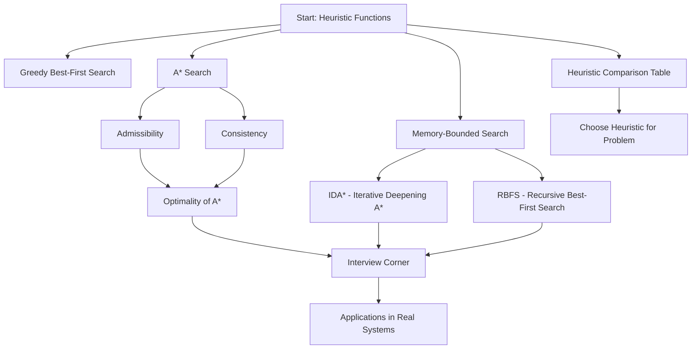

# Chapter 3: Informed Search and Heuristics

> **Prerequisites:** [Chapter 2: Problem Solving by Searching](./02-problem-solving.md) — Uninformed search strategies | **Next:** [Chapter 4: Adversarial Search and Games](./04-adversarial-search.md) — Game-playing and minimax

## Learning Objectives

By the end of this chapter, students will be able to:

1. Design admissible and consistent heuristic functions using relaxation and pattern databases.
2. Implement and analyze greedy best-first search and A* search on graph problems.
3. Prove the optimality of A* under specified conditions (admissibility and consistency).
4. Apply memory-bounded variants (IDA*, RBFS) for large state-space problems.
5. Compare heuristics (Manhattan, Euclidean, Hamming) and choose the right one for a given domain.

---

## Why Informed Search Matters

**Real-World Analogy:** Imagine driving to an unfamiliar restaurant across town. You have two options:

- **Blind search (BFS/DFS):** Drive every possible street systematically until you stumble upon the restaurant. You might find it, but you'll waste hours exploring dead ends.
- **Informed search (A* / GPS):** Your GPS knows traffic conditions. It estimates travel time using distance (how far each road goes) + traffic data (current congestion). It combines **what you've already traveled** (g) with **an intelligent guess of what's left** (h) to pick the fastest route.

The GPS never tries every street — it uses **domain knowledge** (heuristics) to focus on promising paths. This is exactly what informed search algorithms do. They convert raw exploration into directed, efficient problem-solving, reducing exponential explosion to near-linear performance when the heuristic is good.

> **Key Insight:** Without a heuristic, search is blind. The difference between BFS and A* on a 20-city traveling salesman problem is the difference between checking 3 billion routes and checking a few hundred.

---

## Chapter at a Glance

| Section | Key Topics | Key Terms |
|---------|-----------|-----------|
| Heuristics | Heuristic function design, relaxation, pattern databases | Admissible, consistent, dominates, relaxed problem |
| Greedy Best-First Search | Pure heuristic search, minimal h(n) expansion | Not complete, not optimal, heuristic-dependent |
| A* Search | f(n) = g(n) + h(n), optimality proof | Admissibility, consistency, optimal efficiency |
| IDA* | Iterative deepening with f-cost bound | Linear space, node re-expansion |
| RBFS | Recursive best-first with f-limit tracking | Memory-efficient, re-exploration |
| Heuristic Comparison | Manhattan, Euclidean, Hamming, Diagonal, Chebyshev | Informedness, dominance, computational cost |
| Admissibility & Consistency | Triangle inequality for heuristics | Lower bound, monotonicity, non-decreasing f |

### Chapter Roadmap




---

## 3.1 Heuristics

**Real-World Analogy:** When your GPS estimates "15 minutes to destination", it's using a heuristic — an approximate, educated guess based on distance and average speed. It doesn't know about every traffic light or construction zone, but the estimate is good enough to guide decision-making. A perfect prediction is impossible (and computationally expensive), but a reasonable lower bound tells you which direction to go.

### Definition


A **heuristic function** $h(n)$ estimates the cost of the cheapest path from node $n$ to a goal state. Unlike the cost-so-far $g(n)$ (which is exact), $h(n)$ is an estimate — domain knowledge injected into the search to prune unpromising branches.

$$h(n) \approx \text{cost}(n \rightarrow \text{goal})$$

### Algorithm Steps — Designing a Heuristic


1. Identify the state space and goal condition.
2. Choose an abstract representation that drops some problem constraints (**relaxation**).
3. Compute the exact solution cost for the relaxed problem.
4. Verify the heuristic never overestimates (**admissibility**: $h(n) \leq h^*(n)$).
5. Optionally verify consistency: $h(n) \leq c(n, a, n') + h(n')$ for all successors.
6. Compare against a baseline heuristic to confirm **dominance** ($h_2(n) \geq h_1(n)$ for all $n$).

### Pseudocode — Heuristic Function Template


```
function HEURISTIC(state, goal):
    // Relaxed-problem estimate: drop movement constraints
    distance <- 0
    for each tile/piece in state:
        target <- goal position of tile
        distance <- distance + MANHATTAN-DISTANCE(tile, target)
    return distance
```

### Step-by-Step Dry Run — 8-Puzzle Heuristic Computation


**State:**
```
+---+---+---+
| 2 | 8 | 3 |
+---+---+---+
| 1 | 6 | 4 |
+---+---+---+
| 7 |   | 5 |
+---+---+---+
```

**Goal:**
```
+---+---+---+
| 1 | 2 | 3 |
+---+---+---+
| 8 |   | 4 |
+---+---+---+
| 7 | 6 | 5 |
+---+---+---+
```

#### h1 — Misplaced Tiles (excluding blank)

| Tile | Current | Goal | Misplaced? |
|------|---------|------|:----------:|
| 1 | (1,0) | (0,0) | Yes |
| 2 | (0,0) | (0,1) | Yes |
| 3 | (0,2) | (0,2) | No |
| 4 | (1,2) | (1,2) | No |
| 5 | (2,2) | (2,2) | No |
| 6 | (1,1) | (2,1) | Yes |
| 7 | (2,0) | (2,0) | No |
| 8 | (0,1) | (1,0) | Yes |

**h1 = 4** (tiles 1, 2, 6, 8 misplaced)

#### h2 — Manhattan Distance

| Tile | Current | Goal | dx | dy | Distance |
|------|---------|------|:--:|:--:|:--------:|
| 1 | (1,0) | (0,0) | 1 | 0 | 1 |
| 2 | (0,0) | (0,1) | 0 | 1 | 1 |
| 6 | (1,1) | (2,1) | 1 | 0 | 1 |
| 8 | (0,1) | (1,0) | 1 | 1 | 2 |

**h2 = 1 + 1 + 1 + 2 = 5**

Notice $h_2(n) \geq h_1(n)$: Manhattan distance **dominates** misplaced tiles (gives a tighter, higher estimate while staying admissible).

### Python Implementation


```python
# Heuristic functions for the 8-puzzle
def misplaced_tiles(state, goal):
    count = 0
    for i in range(3):
        for j in range(3):
            if state[i][j] != 0 and state[i][j] != goal[i][j]:
                count += 1
    return count

def manhattan_distance(state, goal):
    goal_pos = {}
    for i in range(3):
        for j in range(3):
            goal_pos[goal[i][j]] = (i, j)

    total = 0
    for i in range(3):
        for j in range(3):
            tile = state[i][j]
            if tile != 0:
                gi, gj = goal_pos[tile]
                total += abs(i - gi) + abs(j - gj)
    return total

# Example usage
state = [[2, 8, 3], [1, 6, 4], [7, 0, 5]]
goal  = [[1, 2, 3], [8, 0, 4], [7, 6, 5]]

print("Misplaced tiles (h1):", misplaced_tiles(state, goal))    # 4
print("Manhattan distance (h2):", manhattan_distance(state, goal))  # 5
```

### Complexity Analysis


| Aspect | Complexity | Why |
|--------|-----------|-----|
| Evaluation time per call | $O(N)$ | N = number of elements (tiles, variables). Each element contributes a constant-time distance computation. |
| Space per call | $O(1)$ | Only a running total and optional lookup table. No recursion or dynamic structures. |
| Design cost | Problem-dependent | Deriving a relaxed problem requires domain expertise. Once built, evaluating is cheap. |

**Why O(N)?** For the 8-puzzle, we visit each of the 9 positions once. For each non-blank tile, we compute an absolute difference (constant time). With n tiles, the total is O(n). For the N-puzzle, this is O(N^2) scan — still fast for any practical puzzle size.

### Advantages & Disadvantages of Heuristic Functions


| Advantages | Disadvantages |
|-----------|--------------|
| Dramatically reduces search space — exponential speedup possible | Requires domain expertise to design well |
| Enables optimal search (A* with admissible heuristics) | Poor heuristic can be worse than no heuristic (misleading) |
| Can be automatically derived via relaxation | Tension between informedness and computational cost |
| Multiple heuristics can be combined (max, sum for disjoint) | Memory overhead for pattern databases |

### Edge Cases


- **Zero heuristic (h(n) = 0):** A* degenerates to uniform-cost search (Dijkstra's). Admissible but completely uninformed — no pruning.
- **Overestimating heuristic:** Destroys optimality. If h(n) > h*(n), A* may return a suboptimal solution.
- **Heuristic much cheaper than true cost:** A* expands nearly as many nodes as UCS. Information gain is minimal.
- **Inconsistent heuristic:** Graph search may miss optimal paths or re-explore nodes. Tree search remains optimal with admissibility alone.
- **Computationally expensive heuristic:** If evaluating h(n) costs more than the search it replaces, the heuristic is counterproductive.

---

## 3.2 Greedy Best-First Search

**Real-World Analogy:** You're in a hedge maze and can see the castle tower above the walls. You always walk in the direction that makes the tower look closest. This gets you near the tower quickly, but you might hit a wall and have to backtrack. Greedy best-first is like a tourist who always walks toward the Eiffel Tower — it works until a building blocks the path.

### Definition


Greedy best-first search expands the node with the **lowest heuristic value** $h(n)$ at each step. It completely ignores the cost already incurred ($g(n)$). The frontier is a priority queue ordered by $h(n)$ alone.

**Evaluation function:** $f(n) = h(n)$

### Algorithm Steps


1. Initialize the frontier with the start node. Priority: lowest h(n).
2. Initialize an empty explored set.
3. While the frontier is not empty:
   - Pop the node with the smallest h(n).
   - If it is the goal, return the solution.
   - Add its state to the explored set.
   - For each successor:
     - Skip if already explored or in the frontier.
     - Otherwise, add to frontier with its h(n) as priority.
4. If the frontier empties, return failure.

### Pseudocode


```
function GREEDY-BEST-FIRST-SEARCH(problem, h) returns solution or failure
    node <- NODE(problem.INITIAL)
    if problem.GOAL-TEST(node.STATE) then return SOLUTION(node)
    frontier <- priority queue ordered by h, containing node
    explored <- empty set
    loop do
        if EMPTY?(frontier) then return failure
        node <- POP(frontier)
        add node.STATE to explored
        for each action in problem.ACTIONS(node.STATE) do
            child <- CHILD-NODE(problem, node, action)
            if child.STATE not in explored and child.STATE not in frontier then
                if problem.GOAL-TEST(child.STATE) then return SOLUTION(child)
                frontier <- INSERT(child, frontier)
```

### Step-by-Step Dry Run


**Problem Graph:**

| Edge | Cost |
|------|:----:|
| S -> A | 3 |
| S -> B | 2 |
| S -> C | 4 |
| A -> D | 2 |
| B -> E | 3 |
| B -> F | 2 |
| C -> G | 3 |
| D -> G | 5 |
| E -> G | 2 |
| F -> G | 2 |

**Heuristic values h(n):**
| Node | h(n) | Explanation |
|------|:----:|-------------|
| S | 5 | Estimated 5 steps to G |
| A | 4 | Close to D, both lead toward G |
| B | 3 | Closer to the goal region |
| C | 3 | Direct connection to G |
| D | 3 | One hop from G, costly |
| E | 2 | Near G via short edge |
| F | 2 | Direct short edge to G |
| G | 0 | Goal |

**Trace Table:**

| Step | Node Expanded | Frontier (h-sorted) | Discovered Nodes |
|:----:|:-------------:|:-------------------:|:----------------|
| Init | - | [S(5)] | - |
| 1 | S | [B(3), C(3), A(4)] | A(h=4), B(h=3), C(h=3) |
| 2 | B | [C(3), E(2), F(2), A(4)] | E(h=2), F(h=2) |
| 3 | E | [F(2), C(3), A(4), G(0)] | G(h=0) |
| 4 | **G** | [F(2), C(3), A(4)] | **Goal! Path: S->B->E->G, cost=7** |

Greedy found path S->B->E->G (cost = 2+3+2 = 7), but the **optimal** path is S->B->F->G (cost = 2+2+2 = 6). Greedy was misled by the heuristic and returned a suboptimal solution.

### Python Implementation


```python
import heapq

def greedy_best_first_search(graph, start, goal, heuristic):
    frontier = [(heuristic[start], start)]
    heapq.heapify(frontier)
    explored = set()
    parent = {start: None}

    while frontier:
        _, current = heapq.heappop(frontier)
        if current == goal:
            path = []
            while current is not None:
                path.append(current)
                current = parent[current]
            return path[::-1]

        explored.add(current)

        for neighbor, cost in graph[current]:
            if neighbor not in explored and neighbor not in {n for _, n in frontier}:
                parent[neighbor] = current
                heapq.heappush(frontier, (heuristic[neighbor], neighbor))

    return None

graph = {
    'S': [('A', 3), ('B', 2), ('C', 4)],
    'A': [('D', 2)], 'B': [('E', 3), ('F', 2)],
    'C': [('G', 3)], 'D': [('G', 5)],
    'E': [('G', 2)], 'F': [('G', 2)], 'G': []
}
heuristic = {'S': 5, 'A': 4, 'B': 3, 'C': 3, 'D': 3, 'E': 2, 'F': 2, 'G': 0}

path = greedy_best_first_search(graph, 'S', 'G', heuristic)
print("Greedy path:", path)
```

### Complexity Analysis


| Case | Time | Space | Explanation |
|:----:|:----:|:-----:|-------------|
| Worst | $O(b^m)$ | $O(b^m)$ | Same as DFS/BFS if heuristic is uninformed; b = branching factor, m = max depth |
| Best | $O(bd)$ | $O(bd)$ | With perfect heuristic, expands only nodes along solution path; d = depth |
| Average | Between best and worst | Same | Highly dependent on heuristic quality |

**Why exponential?** Greedy best-first is still a form of DFS — it can explore an exponential number of nodes because it has no mechanism to recover from bad heuristic choices. Unlike A*, it doesn't use path cost to correct course.

### Advantages & Disadvantages


| Advantages | Disadvantages |
|-----------|--------------|
| Very fast when heuristic is accurate | **Not optimal** — may return suboptimal path |
| Simple to implement — only needs h(n) | **Not complete** — can get stuck in infinite loops |
| Low memory variant possible | May oscillate between promising regions |
| Useful subroutine in complex algorithms | Performance entirely heuristic-dependent |

### Edge Cases


- **Misleading heuristic:** If h(n) wrongly favors a region with no goal, greedy explores that area exhaustively.
- **Cyclic graphs without explored set:** Greedy may loop indefinitely between two nodes with low h-values.
- **Zero heuristic (h=0):** Greedy becomes random search among frontier nodes. No meaningful direction.
- **Goal unreachable:** Greedy explores all reachable states before returning failure — exponential worst case.

---

## 3.3 A* Search

**Real-World Analogy:** Your GPS navigation calculates arrival time as: **time already driven (g) + estimated remaining time based on traffic (h)**. If you've already spent 20 minutes in traffic (g=20) and the remaining distance estimates 10 more minutes (h=10), the total estimate is 30 minutes (f=30). A* always considers **both** how far you've come and how far you have to go — unlike greedy, which only looks ahead.

### Definition


A* search (Hart, Nilsson, and Raphael, 1968) combines the **cost-so-far** $g(n)$ with the **estimated cost-to-go** $h(n)$:

$$f(n) = g(n) + h(n)$$

where:
- $g(n)$ = exact cost from the start to node $n$ (known)
- $h(n)$ = heuristic estimate from $n$ to the goal (estimated)
- $f(n)$ = estimated total cost of the cheapest solution passing through $n$

A* expands nodes in order of increasing $f$, making it both **complete** and **optimal** (with an admissible heuristic).

### Algorithm Steps


1. Initialize the frontier as a priority queue keyed by f(n) = g(n) + h(n). Add the start node with g=0.
2. Initialize an explored (closed) set.
3. While the frontier is not empty:
   - Pop the node with the smallest f(n).
   - If it is the goal, reconstruct and return the solution path.
   - Add it to the explored set.
   - For each successor n' reachable by action a:
     - Compute g(n') = g(n) + cost(a).
     - Compute f(n') = g(n') + h(n').
     - If n' is not in the explored set or frontier, add it.
     - If n' is in the frontier with a higher g, replace with the new lower-cost entry.
4. If the frontier empties, return failure.

### Pseudocode


```
function A*-SEARCH(problem, h) returns solution or failure
    node <- NODE(problem.INITIAL)
    node.g <- 0
    node.f <- h(problem.INITIAL)
    frontier <- priority queue ordered by f, containing node
    explored <- empty set
    while not EMPTY?(frontier) do
        node <- POP(frontier)
        if problem.GOAL-TEST(node.STATE) then return SOLUTION(node)
        add node.STATE to explored
        for each action in problem.ACTIONS(node.STATE) do
            child <- CHILD-NODE(problem, node, action)
            child.g <- node.g + step-cost(node, action, child)
            child.f <- child.g + h(child.STATE)
            if child.STATE not in explored and child.STATE not in frontier then
                frontier <- INSERT(child, frontier)
            else if child.STATE already in frontier with higher g then
                REPLACE(frontier, child)
```

### Step-by-Step Dry Run


Using the same graph and heuristic as the greedy example.

**Graph:** S->A(3), S->B(2), S->C(4), A->D(2), B->E(3), B->F(2), C->G(3), D->G(5), E->G(2), F->G(2)

**Heuristic h:** S=5, A=4, B=3, C=3, D=3, E=2, F=2, G=0

All heuristics are admissible AND consistent (verified against triangle inequality).

#### A* Trace Table

| Step | Pop | Expanded | g | h | f | Frontier After Expansion |
|:----:|:---:|:--------:|:-:|:-:|:-:|:------------------------|
| Init | - | - | - | - | - | [S(g=0,h=5,f=5)] |
| 1 | S | Yes | 0 | 5 | 5 | [B(g=2,h=3,f=5), A(g=3,h=4,f=7), C(g=4,h=3,f=7)] |
| 2 | B | Yes | 2 | 3 | 5 | [F(g=4,h=2,f=6), A(g=3,h=4,f=7), C(g=4,h=3,f=7), E(g=5,h=2,f=7)] |
| 3 | F | Yes | 4 | 2 | 6 | [G(g=6,h=0,f=6), A(f=7), C(f=7), E(f=7)] |
| 4 | **G** | Yes | 6 | 0 | **6** | **Goal! Path: S->B->F->G, cost=6** |

**Detailed Step 1:** Pop S (f=5).
- A: g=0+3=3, f=3+4=7
- B: g=0+2=2, f=2+3=5
- C: g=0+4=4, f=4+3=7

**Detailed Step 2:** Pop B (f=5).
- E: g=2+3=5, f=5+2=7
- F: g=2+2=4, f=4+2=6

**Detailed Step 3:** Pop F (f=6).
- G: g=4+2=6, f=6+0=6

**Comparison with Greedy:** Greedy found S->B->E->G (cost 7) because it ignored g. A* found S->B->F->G (cost 6) because it considered B->F=4 vs B->E=5, even though both had the same h. The g value broke the tie correctly.

### Python Implementation


```python
import heapq

def a_star_search(graph, start, goal, heuristic):
    frontier = [(heuristic[start], 0, start)]
    heapq.heapify(frontier)
    explored = {}
    parent = {start: None}
    g_score = {start: 0}

    while frontier:
        f, g, current = heapq.heappop(frontier)
        if current in explored and explored[current] <= g:
            continue
        explored[current] = g

        if current == goal:
            path = []
            while current is not None:
                path.append(current)
                current = parent[current]
            return path[::-1]

        for neighbor, cost in graph[current]:
            new_g = g + cost
            if neighbor not in explored or new_g < g_score.get(neighbor, float('inf')):
                g_score[neighbor] = new_g
                f_new = new_g + heuristic[neighbor]
                parent[neighbor] = current
                heapq.heappush(frontier, (f_new, new_g, neighbor))

    return None

# Same graph
graph = {
    'S': [('A', 3), ('B', 2), ('C', 4)],
    'A': [('D', 2)], 'B': [('E', 3), ('F', 2)],
    'C': [('G', 3)], 'D': [('G', 5)],
    'E': [('G', 2)], 'F': [('G', 2)], 'G': []
}
heuristic = {'S': 5, 'A': 4, 'B': 3, 'C': 3, 'D': 3, 'E': 2, 'F': 2, 'G': 0}

path = a_star_search(graph, 'S', 'G', heuristic)
print("A* path:", path)
```

### Complexity Analysis


| Case | Time | Space | Explanation |
|:----:|:----:|:-----:|-------------|
| Worst | $O(b^d)$ | $O(b^d)$ | If h is uninformed (close to 0), A* expands all nodes like UCS |
| Best (perfect heuristic) | $O(bd)$ | $O(bd)$ | With h(n) = h*(n), A* expands only nodes on the optimal path |
| With good heuristic | Sub-exponential | $O(b^d)$ | Error |h(n) - h*(n)| is small; expansion is near-linear in solution length |

**Why exponential in worst case?** The number of distinct f-values below the optimal cost C* can still be exponential. A* stores all generated nodes in memory — the space bottleneck usually hits before the time bottleneck. With b=10 and d=20, A* may store 10^20 nodes.

**Why sub-exponential with good heuristic?** If |h(n) - h*(n)| is in O(log h*(n)), the number of expanded nodes is polynomial rather than exponential.

### Advantages & Disadvantages


| Advantages | Disadvantages |
|-----------|--------------|
| **Optimal** — guarantees cheapest solution with admissible h | **Exponential space** — stores all generated nodes |
| **Complete** — always finds solution if one exists | Performance degrades with poor heuristic |
| **Optimally efficient** — no other optimal algorithm using same heuristic expands fewer nodes | Cycle checking adds overhead |
| Works on any graph (directed, undirected, weighted) | Requires admissible heuristic for optimality |

### Edge Cases


- **Zero heuristic (h=0):** A* becomes uniform-cost search (Dijkstra's). Complete and optimal, but explores in all directions equally.
- **Overestimating heuristic:** A* may return suboptimal solution. Optimality guarantee lost.
- **Inadmissible heuristic:** If h(n) > h*(n) for any node, A* tree search can terminate with non-optimal path.
- **Inconsistent heuristic:** Graph search (with explored set) may miss optimal paths. Tree search still optimal with admissibility alone.
- **Multiple goals:** A* finds the cheapest goal, not the first goal encountered.
- **Disconnected graph:** A* exhausts all reachable nodes and returns failure.

---

### 3.3.1 Admissibility


**Real-World Analogy:** A taxi driver tells you the fare will be "at most $25". When you arrive, the meter reads $22. The estimate was **admissible** — it never overestimated. If they'd said "at most $20" and the meter read $22, they would have underestimated, and you'd be short on cash.

**Definition:** A heuristic $h$ is **admissible** if for every node $n$:

$$h(n) \leq h^*(n)$$

where $h^*(n)$ is the true optimal cost from $n$ to the nearest goal. In other words, $h$ never overestimates the remaining cost.

**Why it matters:** Admissibility is the key condition for A* optimality. If $h$ is admissible, A* using **tree search** (no explored set) guarantees finding the optimal solution.

| Property | Implication |
|----------|-------------|
| $h(n) \leq h^*(n)$ | Never overestimates |
| $h(\text{goal}) = 0$ | Goal state has zero remaining cost |
| $h(n) = 0$ for all $n$ | Trivially admissible (degenerates to UCS) |

**Checking admissibility:** For the 8-puzzle, h2 (Manhattan distance) is admissible because any tile must move at least its Manhattan distance to reach its goal position — it's a physical lower bound. Euclidean distance is always admissible for grid movement because the straight line is the shortest possible path.

**Edge Cases:**
- **Overconfident heuristic:** Overestimates for even one node invalidates admissibility. A* may return suboptimal path.
- **Perfect heuristic (h = h*):** The best possible admissible heuristic. A* expands only nodes on the optimal path.
- **Dominance:** If h2(n) >= h1(n) for all n and both are admissible, h2 **dominates** h1 and leads to fewer node expansions.

---

### 3.3.2 Consistency (Monotonicity)


**Real-World Analogy:** In a well-designed trip, each step brings you strictly closer to your destination. If you're driving from New York to Boston, every mile north should reduce your estimated remaining distance by at most one mile. Consistency formalizes this with the triangle inequality.

**Definition:** A heuristic $h$ is **consistent** (or **monotone**) if for every node $n$ and every successor $n'$ reachable by action $a$:

$$h(n) \leq c(n, a, n') + h(n')$$

where $c(n, a, n')$ is the step cost. This is the **triangle inequality** applied to heuristics: the direct estimate from n to the goal should not exceed the cost of going through n' plus the estimate from n'.

**Consistency implies admissibility** (but not vice versa). Proof: by induction from the goal, where h(goal) = 0.

**Key property — Non-decreasing f:** If h is consistent, then along any path, f(n) never decreases:

$$f(n') = g(n') + h(n') = g(n) + c(n,n') + h(n') \geq g(n) + h(n) = f(n)$$

This means A* **never re-opens nodes** from the explored set — when a node is first expanded, it has been reached via the optimal path.

| Property | Admissibility | Consistency |
|----------|:------------:|:-----------:|
| h(n) &lt;= h*(n) | Required | Implied |
| h(n) &lt;= c(n,n') + h(n') | Not required | Required |
| A* tree search optimal | Yes | Yes |
| A* graph search optimal | No | Yes |
| Non-decreasing f | Not guaranteed | Guaranteed |

**Edge Cases:**
- **Admissible but inconsistent:** Graph search may re-open explored nodes or miss the optimal path. Tree search remains optimal.
- **Non-negative step costs:** If all step costs are non-negative and h is consistent, A* graph search is optimally efficient.
- **Consistency is harder to satisfy:** A heuristic may be admissible without being consistent. Pattern database heuristics are often consistent if designed properly.

---

### 3.3.3 Optimality of A*


**Theorem:** If $h$ is admissible, then A* using **tree search** returns an optimal solution. If $h$ is consistent, then A* using **graph search** returns an optimal solution.

**Proof Sketch (Tree Search):** Suppose A* returns a suboptimal goal G with cost C > C*, where C* is the optimal cost. Let n be a node on the optimal path that remains on the frontier when A* terminates. Since h is admissible:

$$f(n) = g(n) + h(n) \leq g(n) + h^*(n) = C^*$$

Since A* expands nodes in order of increasing f, and the goal G has f(G) = C > C*, node n would be expanded before G — a contradiction. Thus, A* must return an optimal solution.

**Intuitive Explanation:** A* never expands a node with f(n) > C* as long as any node on the optimal path (f &lt;= C*) remains on the frontier. The search frontier forms a "contour" of nodes with f < C* that are all expanded before any suboptimal goal is reached.

**Optimal Efficiency:** A* is **optimally efficient** — no other optimal algorithm using the same heuristic expands fewer nodes than A*. Formally, any algorithm that guarantees optimality must expand every node that A* expands.

**Graph Search vs Tree Search:**

| Variant | Heuristic Requirement | Why |
|---------|:--------------------:|-----|
| Tree search (no explored set) | Admissible | Proof only uses admissibility; cycles cause infinite loops but optimality of solution holds |
| Graph search (with explored set) | Consistent | Without consistency, a node may be expanded before the optimal path to it is discovered |
| Consistency check | h(n) &lt;= c(n,n') + h(n') | Ensures f is non-decreasing along paths, so first expansion is optimal |

---

## 3.4 Iterative Deepening A* (IDA*)

**Real-World Analogy:** You're searching for a lost earring in a large house. You first check all rooms within 5 feet of your current position. Not found? Expand to 10 feet. Then 15 feet. Each iteration, you search a wider radius, systematically expanding until you find it. IDA* does this with cost thresholds instead of distance.

### Definition


IDA* combines iterative deepening depth-first search (IDDFS) with A*'s f-cost evaluation. Instead of using depth as the cutoff, IDA* uses an **f-cost bound**. Each iteration performs a depth-first search, pruning any branch whose f(n) = g(n) + h(n) > bound. If no solution is found, the bound increases to the minimum f-value that exceeded the previous bound.

### Algorithm Steps


1. Set bound = h(start).
2. Perform a depth-first search where each node's f(n) = g(n) + h(n) is computed.
3. Prune (don't expand) any node with f(n) > bound.
4. Record the minimum f that exceeded the bound as next_bound.
5. If the goal is found, return the solution.
6. If no node is pruned (DFS completed without solution), return failure.
7. Set bound = next_bound and go to step 2.

### Pseudocode


```
function IDA*(problem, h) returns solution or failure
    root <- NODE(problem.INITIAL)
    root.f <- h(problem.INITIAL)
    bound <- root.f
    loop do
        result, new_bound <- DFS-CONTOUR(root, 0, bound)
        if result != cutoff then return result
        if new_bound = INF then return failure
        bound <- new_bound

function DFS-CONTOUR(node, g, bound) returns (solution or cutoff, new_bound)
    f <- g + h(node.STATE)
    if f > bound then return (cutoff, f)
    if problem.GOAL-TEST(node.STATE) then return (SOLUTION(node), bound)
    new_bound <- INF
    for each successor of node do
        solution, child_bound <- DFS-CONTOUR(child, g + cost(node, child), bound)
        if solution != cutoff then return (solution, bound)
        new_bound <- MIN(new_bound, child_bound)
    return (cutoff, new_bound)
```

### Step-by-Step Dry Run


Same graph. Heuristic: S=5, A=4, B=3, C=3, D=3, E=2, F=2, G=0.

#### Iteration 1 — bound = h(S) = 5

| DFS Step | Node | g | h | f | f &lt;= 5? | Action |
|:--------:|:----:|:-:|:-:|:-:|:-------:|--------|
| 1 | S | 0 | 5 | 5 | Yes | Expand |
| 2 | A | 3 | 4 | 7 | No | Prune (record 7) |
| 3 | B | 2 | 3 | 5 | Yes | Expand |
| 4 | E | 5 | 2 | 7 | No | Prune (record 7) |
| 5 | F | 4 | 2 | 6 | No | Prune (record 6) |
| 6 | C | 4 | 3 | 7 | No | Prune (record 7) |

Min pruned f = 6. New bound = 6. No solution found in iteration 1.

#### Iteration 2 — bound = 6

| DFS Step | Node | g | h | f | f &lt;= 6? | Action |
|:--------:|:----:|:-:|:-:|:-:|:-------:|--------|
| 1 | S | 0 | 5 | 5 | Yes | Expand |
| 2 | A | 3 | 4 | 7 | No | Prune |
| 3 | B | 2 | 3 | 5 | Yes | Expand |
| 4 | E | 5 | 2 | 7 | No | Prune |
| 5 | F | 4 | 2 | 6 | Yes | Expand |
| 6 | G | 6 | 0 | 6 | Yes | **Goal!** |

**Result:** Path S->B->F->G, cost = 6. Found in 2 iterations.

### Python Implementation


```python
def ida_star_search(graph, start, goal, heuristic):
    def dfs(node, g, bound):
        f = g + heuristic[node]
        if f > bound:
            return None, f
        if node == goal:
            return [node], bound

        new_bound = float('inf')
        for neighbor, cost in graph.get(node, []):
            path, child_bound = dfs(neighbor, g + cost, bound)
            if path is not None:
                return [node] + path, bound
            new_bound = min(new_bound, child_bound)
        return None, new_bound

    bound = heuristic[start]
    while True:
        path, new_bound = dfs(start, 0, bound)
        if path is not None:
            return path
        if new_bound == float('inf'):
            return None
        bound = new_bound

# Test
path = ida_star_search(graph, 'S', 'G', heuristic)
print("IDA* path:", path)   # S -> B -> F -> G
```

### Complexity Analysis


| Aspect | Complexity | Explanation |
|--------|:----------:|-------------|
| Time (worst) | $O(b^d)$ | In worst case, same as A*; each iteration re-explores many nodes |
| Space | $O(bd)$ | DFS-based: only stores current path (depth d, branching factor b) |
| Node re-expansions | Exponential | Each iteration re-expands all nodes from previous iterations |
| Overhead vs A* | 10-30% typically | For good heuristics, most nodes are pruned at or near the optimal bound |

**Why O(bd) space?** IDA* uses depth-first search internally, which only stores the current path (depth d) and its siblings (branching factor b). This is a dramatic improvement over A*'s O(b^d) space.

### Advantages & Disadvantages


| Advantages | Disadvantages |
|-----------|--------------|
| **Linear memory** — O(bd) vs A* exponential O(b^d) | **Re-expands nodes** — nodes visited in every iteration |
| Complete and optimal (admissible heuristic) | Can be slow for problems with large f-value ranges |
| Works well for integer step costs | Loses A*'s optimal efficiency guarantee |
| No priority queue overhead | Struggles when many nodes share the same f-cost |

### Edge Cases


- **Large f-value range:** If f-costs range from 10 to 10,000, IDA* may require hundreds of iterations.
- **Real-valued costs:** IDA* requires successive cost increments. With real values, the algorithm may loop forever. Use incremental bounding.
- **Multiple nodes with same f:** Large contour of identical f means many nodes expanded per bound and re-expanded in the next iteration.

---

## 3.5 Recursive Best-First Search (RBFS)

**Real-World Analogy:** While hiking a mountain trail, you reach a fork. You estimate the left trail is 2 miles to the summit, the right is 3 miles. You take the left trail, but keep checking: "If this goes nowhere, the right trail was estimated at 3 miles." At every step, RBFS remembers the best alternative route's cost, so it can backtrack only when necessary.

### Definition


RBFS performs a recursive depth-first search while tracking the **best alternative path** f-value. It only switches to an alternative branch when the current path's f-value exceeds the stored alternative. This gives it A*-like behavior with O(bd) memory.

### Algorithm Steps


1. Start at the root with f-limit = infinity.
2. Evaluate all successors and compute their f-values.
3. Find the best successor (smallest f) and second-best successor.
4. Recurse on the best successor with f-limit = min(current f-limit, second-best f).
5. If recursion fails (returns a new f-limit), update the current node's f-value and iterate.
6. Each successor's f = max(own f, parent f) to propagate information up the tree.

### Pseudocode


```
function RBFS(problem, node, f_limit) returns solution or failure
    if problem.GOAL-TEST(node.STATE) then return SOLUTION(node)
    successors <- for each action in problem.ACTIONS(node.STATE):
        child <- CHILD-NODE(problem, node, action)
        child.f <- max(g(child) + h(child.STATE), node.f)
        return child sorted by f
    if EMPTY?(successors) then return failure
    loop do
        best <- first successor (lowest f)
        if best.f > f_limit then return failure
        alternative <- second successor's f (or INF if none)
        result <- RBFS(problem, best, MIN(f_limit, alternative))
        if result != failure then return result
        best.f <- result
```

### Step-by-Step Dry Run


Same graph and heuristic.

| Step | Current | f | Best | Second-Best | f-limit | Action |
|:----:|:-------:|:-:|:----:|:-----------:|:-------:|--------|
| 1 | S | 5 | B(5) | A(7) | INF | Recurse on B |
| 2 | B | max(5,5)=5 | F(6) | E(7) | min(INF,7)=7 | Recurse on F |
| 3 | F | max(6,5)=6 | G(6) | - | min(7,INF)=7 | Recurse on G |
| 4 | **G** | 6 | - | - | 7 | **Goal! S->B->F->G** |

### Python Implementation


```python
def rbfs(graph, start, goal, heuristic):
    def rbfs_rec(node, g, f_limit):
        f = max(g + heuristic[node], f_limit if node != start else g + heuristic[node])
        if node == goal:
            return [node], f

        successors = []
        for neighbor, cost in graph.get(node, []):
            new_g = g + cost
            new_f = max(new_g + heuristic[neighbor], f)
            successors.append((new_f, new_g, neighbor))
        successors.sort()

        if not successors:
            return None, float('inf')

        while True:
            best_f, best_g, best_node = successors[0]
            if best_f > f_limit:
                return None, best_f

            alt_f = successors[1][0] if len(successors) > 1 else float('inf')
            result, new_f = rbfs_rec(best_node, best_g, min(f_limit, alt_f))

            if result is not None:
                return [node] + result, new_f

            successors[0] = (new_f, best_g, best_node)
            successors.sort()

    path, _ = rbfs_rec(start, 0, float('inf'))
    return path

path = rbfs(graph, 'S', 'G', heuristic)
print("RBFS path:", path)   # S -> B -> F -> G
```

### Complexity Analysis


| Aspect | Complexity | Explanation |
|--------|:----------:|-------------|
| Time (worst) | $O(b^d)$ | In worst case, same as A*; may re-explore nodes |
| Space | $O(bd)$ | DFS-based: stores current path + sibling list |
| Re-exploration | Lower than IDA* | Tracks alternative f-values, reducing re-expansion |
| Wall-clock | Near A* for good heuristics | Practical efficiency close to A* with far less memory |

### Advantages & Disadvantages


| Advantages | Disadvantages |
|-----------|--------------|
| **Linear memory** — O(bd) vs A* exponential | **Re-explores nodes** — can revisit previously explored regions |
| Complete and optimal (admissible h) | Complex implementation — tracking successor f-values |
| Often faster than IDA* (less re-expansion) | Overhead from sorting successors at each node |
| Works on graphs and trees | Degrades when h is not informative |

### Edge Cases


- **Admissible but not consistent:** RBFS remains optimal because it uses tree-search semantics with backtracking, not an explored set.
- **One child per node:** RBFS degenerates to DFS with a simple bound check. No alternative path to switch to.
- **Tight f-limits:** When many nodes have f equal to the bound, RBFS switches branches frequently.

---

## 3.6 Heuristic Functions Comparison

| Heuristic | Formula | Admissible? | Cost | Best For |
|-----------|---------|:-----------:|:----:|----------|
| **Manhattan Distance** | $|x_1-x_2| + |y_1-y_2|$ | Yes (4-direction grid) | $O(1)$ | Grid maps, sliding puzzles |
| **Euclidean Distance** | $\sqrt{(x_1-x_2)^2 + (y_1-y_2)^2}$ | Yes (any movement) | $O(1)$ | Open terrain, continuous spaces |
| **Chebyshev Distance** | $\max(|x_1-x_2|, |y_1-y_2|)$ | Yes (8-direction) | $O(1)$ | Chess kings, 8-direction grids |
| **Diagonal Distance** | $\min(|dx|,|dy|)\cdot\sqrt{2} + \| |dx|-|dy| \|$ | Yes | $O(1)$ | Games with diagonal movement |
| **Hamming Distance** | Count of differing positions | Yes (if each change costs >= 1) | $O(n)$ | Pattern matching, 8-puzzle |
| **Misplaced Tiles** | Count tiles not in goal position | Yes | $O(n)$ | 8-puzzle, 15-puzzle |
| **Pattern Database** | Precomputed subproblem cost | Yes | $O(1)$ look-up | Large puzzles (Rubik's cube) |
| **Relaxed Problem** | Solve simplified version | Yes | Problem-dependent | Domain-specific (scheduling) |
| **Landmark (ALT)** | Precomputed distances via landmarks | Yes | $O(1)$ per landmark | Road networks (GPS) |

### Informedness and Dominance


**Definition:** Heuristic $h_2$ **dominates** $h_1$ if $h_2(n) \geq h_1(n)$ for all nodes $n$ and both are admissible. A* with $h_2$ expands a subset of the nodes expanded by A* with $h_1$.

**Dominance chain for 8-puzzle:** $h_{\text{Manhattan}} \geq h_{\text{misplaced}} \geq h_{\text{zero}}$

**Trade-off:** A more informed heuristic (higher h) = fewer nodes expanded = more time per evaluation. Sweet spot minimizes **total time** = (nodes expanded) x (time per evaluation).

---

## Uninformed vs Informed Search

| Feature | Uninformed Search (BFS, DFS, UCS) | Informed Search (A*, Greedy) |
|---------|:--------------------------------:|:---------------------------:|
| Domain knowledge | None — explores blindly | Uses heuristic function h(n) |
| Evaluation function | g(n) or nothing | f(n) = g(n) + h(n) or h(n) |
| Optimality | BFS/UCS: yes; DFS: no | A*: yes (admissible h); Greedy: no |
| Completeness | BFS/UCS/DFS: yes (finite graphs) | A*/IDA*/RBFS: yes; Greedy: no |
| Space complexity | BFS: O(b^d); DFS: O(bm) | A*: O(b^d); IDA*/RBFS: O(bd) |
| Time complexity | O(b^d) or O(b^m) | O(b^d) worst; much better with good h |
| Scalability | Poor — exponential in all cases | Good — heuristic dramatically prunes search |
| When to use | Small state spaces, no heuristic | Large state spaces, domain knowledge available |
| Examples | Puzzle solving without hints | GPS, game AI, robotics pathfinding |

---

## Interview Corner

### Q1: What conditions guarantee A* is optimal?


**Answer:** A* is optimal if:
1. The heuristic h is **admissible** (h(n) &lt;= h*(n) for all n) for tree search.
2. The heuristic h is **consistent** (h(n) &lt;= c(n,a,n') + h(n')) for graph search.
3. All step costs are non-negative (required for any shortest-path algorithm).

### Q2: How do you design an admissible heuristic?


**Answer:** The most common technique is **relaxation**:
1. Start with the original problem constraints.
2. Remove (relax) one or more constraints to create a simpler problem.
3. The exact optimal cost of the relaxed problem is an admissible heuristic for the original problem (fewer constraints = cheaper or equal cost).

**Example — 8-puzzle:**
- Relax "tiles cannot occupy same square" -> **misplaced tiles heuristic**
- Relax "tiles can only move to empty adjacent square" -> **Manhattan distance**
- Relax both constraints -> **0 heuristic** (trivially admissible, useless)

### Q3: Can an inadmissible heuristic ever be useful?


**Answer:** Yes. Inadmissible heuristics (which overestimate) can find solutions faster if you accept near-optimal solutions. **Weighted A*** uses f(n) = g(n) + eps*h(n) with eps > 1. This biases search toward the goal, often finding a solution 2-5x faster that is within eps of optimal (bounded suboptimal search).

### Q4: Compare A*, IDA*, and RBFS.


| Algorithm | Memory | Node Re-expansion | Complexity |
|:---------:|:------:|:-----------------:|:----------:|
| A* | O(b^d) | None | Low |
| IDA* | O(bd) | High (every iteration) | Medium |
| RBFS | O(bd) | Moderate (on backtrack) | High |

**Rule of thumb:** Use A* if memory permits. Use IDA* or RBFS when the state space is too large for A*'s memory.

### Q5: What is the difference between tree search and graph search in A*?


**Answer:**
- **Tree search:** No explored set. Requires only admissibility for optimality, but may loop infinitely on cyclic graphs.
- **Graph search:** Maintains an explored set. Requires consistency for optimality. Handles cycles correctly.

---

## Applications in Real Systems

### GPS Navigation (A*)


Major GPS platforms (Google Maps, Waze, Apple Maps) use A*-like algorithms augmented with:
- **Landmark heuristics (ALT):** Precomputed distances to landmark nodes provide tight lower bounds — often within 1% of true distance.
- **Hierarchical search:** Road networks are preprocessed into levels (highways -> arterial -> local). A* searches at the highest level first.
- **Traffic-aware costs:** Edge weights are dynamic — updated from real-time traffic data.
- **Bidirectional A*:** Two simultaneous searches (start->goal and goal->start) meet in the middle.

Modern GPS computes optimal routes across 50 million nodes in **milliseconds** — a problem BFS would take hours to solve.

### Video Game Pathfinding (A* on Navigation Meshes)


Popular game engines (Unreal Engine, Unity) use A* variants:
- **Navigation meshes (NavMesh):** The game world is abstracted into a graph of convex polygons. A* searches over polygons rather than pixels.
- **Hierarchical A* (HNA*):** A coarse search identifies which region the path traverses, then fine-grained search fills in details.
- **Dynamic obstacles:** Detected via incremental replanning (D* Lite). When a new wall appears, only affected nodes are re-evaluated.
- **Example:** In *StarCraft II*, pathfinding computes 100+ unit paths per second over complex terrain.

### Robotics (D* Lite)


Robots use **D* Lite** (A* variant with incremental replanning):
- **Initial path:** A* computes the optimal route.
- **Sensor feedback:** As the robot moves, sensors discover new obstacles.
- **Incremental repair:** Only nodes whose costs changed are updated.
- **Real-world use:** Mars rovers (Opportunity, Curiosity) use D* Lite for autonomous navigation.

### Other Domains


| Domain | Algorithm | Heuristic | Why |
|--------|:---------:|:---------:|:----|
| Logistics (UPS/FedEx) | A* + ALT | Landmark distance | 50,000 stops, need optimal routing in seconds |
| Protein folding | IDA* | Fragment-based energy | Vast state space, O(bd) memory essential |
| Natural language parsing | A* | Lexicalized PCFG scores | Need best parse, not any parse |
| Circuit layout (EDA) | A* | Manhattan wire-length | Physical lower bound is tight |
| Tile puzzle solvers | IDA* | Pattern databases | Exhaustive search, memory limited |

---

## Concept Comparison

| Algorithm | Evaluation | Complete? | Optimal? | Space | Time (Worst) | When to Use |
|-----------|:----------:|:---------:|:--------:|:----:|:----------:|-------------|
| Greedy Best-First | h(n) only | No | No | O(b^m) | O(b^m) | Fast approximate, good heuristic |
| A* (Tree Search) | f = g + h | Yes | Yes (admissible h) | O(b^d) | O(b^d) | Optimal search, enough memory |
| A* (Graph Search) | f = g + h | Yes | Yes (consistent h) | O(b^d) | O(b^d) | Optimal search with cycles |
| IDA* | f-cost bound | Yes | Yes | O(bd) | O(b^d) | Large spaces, limited memory |
| RBFS | max(f, f_parent) | Yes | Yes | O(bd) | O(b^d) | Deep search, moderate re-expansion |

---

## Quick Reference — Heuristic Design

| Technique | Method | Example | How It Works |
|-----------|--------|---------|:------------|
| Relaxation | Drop constraints, solve simplified problem | Manhattan distance (8-puzzle) | Relax adjacency constraint -> tiles can teleport to goal |
| Pattern Database | Store exact costs for subproblem abstractions | Disjoint pattern DBs (15-puzzle) | Store optimal costs for subsets (tiles 1-4, 5-8, etc.) |
| Landmarks (ALT) | Precompute costs via landmarks | Road network routing | Pick k landmark nodes; precompute all-pair distances to them |
| Linear Programming | Solve LP relaxation | Scheduling heuristics | Drop integer constraints -> solve linear program |
| Look-ahead | Simulate a few steps ahead | Game-playing heuristics | Run shallow search; use resulting state evaluation |
| Abstraction | Group similar states | Grid pathfinding | Abstract 10x10 grid cells into single nodes |

---

## Cross-Application Matrix

| Technique | ML Engineering | Computer Vision | NLP | Research |
|-----------|:-------------:|:---------------:|:---:|:--------:|
| Greedy Best-First | Feature selection | Image segmentation | Dependency parsing | Ablation studies |
| A* Search | Bayesian network inference | Stereo matching | Parsing (PCFG) | Algorithm comparison |
| IDA* | Hyperparameter tuning | - | - | State-space analysis |
| RBFS | - | - | - | Complexity research |
| Pattern Databases | - | - | - | Combinatorial games |
| Relaxation Heuristics | Loss function design | - | Text summarization | Approximation algorithms |

---

## Chapter Quiz

**Q1:** What is the key difference between A* tree-search and A* graph-search?
- A) Tree-search is faster
- B) Tree-search requires only admissibility; graph-search requires consistency
- C) Graph-search uses more memory
- D) Tree-search cannot handle cycles

<details>
<summary>Answer&lt;/summary&gt;
B. A* tree-search is optimal with admissible heuristics; graph-search (with explored set) requires consistency to guarantee optimality.
</details>

**Q2:** Which memory-bounded heuristic search combines IDDFS with A*'s cost function?
- A) SMA*
- B) IDA*
- C) RBFS
- D) Weighted A*

<details>
<summary>Answer&lt;/summary&gt;
B. IDA* (Iterative Deepening A*) performs depth-first search with increasing f-cost bounds.
</details>

**Q3:** If heuristic h2 dominates h1 (both admissible), what does this mean?
- A) h2 expands more nodes than h1
- B) h2(n) >= h1(n) for all n, so A* with h2 expands fewer nodes
- C) h2 is easier to compute
- D) h2 guarantees optimality but h1 does not

<details>
<summary>Answer&lt;/summary&gt;
B. h2(n) >= h1(n) for all n means h2 is closer to h*(n), so A* with h2 expands fewer nodes.
</details>

**Q4:** Why does greedy best-first search sometimes fail to find the optimal path?
- A) It explores too many nodes
- B) It ignores the cost already incurred (g)
- C) It uses too much memory
- D) It cannot handle cycles

<details>
<summary>Answer&lt;/summary&gt;
B. Greedy best-first uses only h(n) — it ignores g(n). A cheap-looking heuristic path may actually be very long when cumulative cost is considered.
</details>

**Q5:** What happens if A* uses an overestimating heuristic?
- A) A* becomes faster but may return a suboptimal solution
- B) A* stops working entirely
- C) A* uses more memory
- D) A* becomes complete but not optimal

<details>
<summary>Answer&lt;/summary&gt;
A. Overestimating h violates admissibility. A* may prune the optimal path and return a more expensive solution.
</details>

**Q6:** Which problem is best suited for IDA* over A*?
- A) A small graph with 10 nodes
- B) A large graph with limited available memory (e.g., embedded system)
- C) A problem with no known heuristic
- D) A dynamic environment with changing costs

<details>
<summary>Answer&lt;/summary&gt;
B. IDA* uses only O(bd) memory vs A*'s O(b^d). For large state spaces where memory is the primary constraint, IDA* is the better choice.
</details>

---

## Exercises

### Review Questions

1. Prove that consistency implies admissibility, but the converse does not hold. Provide a counterexample heuristic that is admissible but not consistent.
2. Why does A* using graph search require consistency for optimality, while tree search requires only admissibility?
3. Explain how IDA* differs from A* in its memory usage and node re-expansion behavior.
4. Compare RBFS and IDA*. Under what conditions would each be preferred?
5. Why is A* optimally efficient? What does "optimally efficient" mean formally?

### Application Problems

6. Design admissible heuristics for the 15-puzzle. Compare the expected performance of h1 (misplaced tiles) and h2 (Manhattan distance). Compute both for:
   ```
   +----+----+----+----+
   |  1 |  2 |  3 |  4 |
   +----+----+----+----+
   |  5 |  6 |  7 |  8 |
   +----+----+----+----+
   |  9 | 10 | 11 | 12 |
   +----+----+----+----+
   | 13 | 15 | 14 |    |
   +----+----+----+----+
   ```

7. Consider finding the shortest path on a grid with obstacles where movement costs 1 per step. Prove that Euclidean distance is an admissible heuristic. Is it consistent?

8. For the graph below, run A* by hand. Show the frontier after each expansion (ordered by f).
   ```
   Nodes: S, A, B, C, G
   Edges: S->A(2), S->B(3), A->C(4), B->C(1), C->G(2), B->G(5)
   h: S=6, A=4, B=4, C=2, G=0
   ```

### Challenge Problem

9. Implement A* search with Manhattan distance heuristic for the 8-puzzle. Calculate the effective branching factor for each of 10 random start states. Compare performance with IDA* on the same instances. Report:
   - Number of nodes expanded by each algorithm.
   - Effective branching factor: b* = N^(1/d) where N = nodes expanded, d = solution depth.
   - Memory usage (estimated by max frontier size).

10. Design a heuristic for the **pancake sorting problem** (sorting a stack of pancakes by flipping prefixes) and prove it is admissible. Implement A* using this heuristic and compare its performance to BFS.

---

> **Summary:** Informed search uses heuristic functions to dramatically reduce search effort. A* is optimally efficient and optimal with admissible/consistent heuristics. Memory-bounded variants (IDA*, RBFS) extend A* to large state spaces. The quality of the heuristic determines the algorithm's performance — invest effort in designing well-informed heuristics via relaxation and pattern databases.
