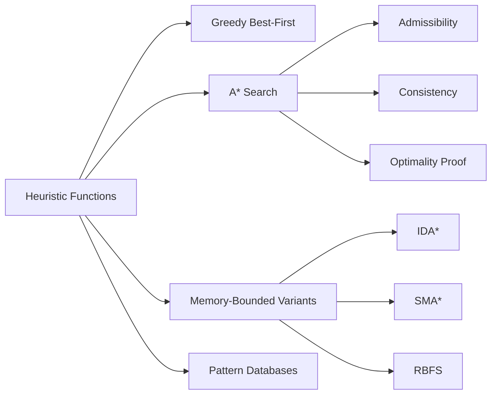

# Chapter 3: Informed Search and Heuristics

**Previous:** [Chapter 3: Solving Problems by Searching](03-search.md) | **Next:** [Chapter 4: Adversarial Search and Games](04-adversarial-search.md)

## Learning Objectives

By the conclusion of this chapter, the student will be able to: (1) design admissible and consistent heuristic functions; (2) implement greedy best-first search and A* search; (3) prove the optimality of A* under specified conditions; (4) apply memory-bounded variants of heuristic search; (5) construct heuristics via problem relaxation and pattern databases.

## Chapter at a Glance

| Section | Key Topics | Key Terms |
|---------|-----------|-----------|
| Heuristics | Heuristic function design, relaxation | Admissible, consistent, dominates |
| Greedy Best-First Search | Pure heuristic search | Not complete, not optimal |
| A* Search | f(n) = g(n) + h(n), optimality proof | Admissibility, consistency, optimal efficiency |
| Memory-Bounded Search | IDA*, SMA*, RBFS | Space-efficient heuristic search |
| Relaxation and Pattern Databases | Relaxed heuristics, pattern DBs | Max heuristic, disjoint patterns |

## Chapter Roadmap



## 3.1 Heuristics


> **One-Sentence Takeaway:** A heuristic function h(n) estimates remaining cost to the goal — good heuristics dramatically reduce search effort while preserving optimality.

A **heuristic function** $h(n)$ estimates the cost of the cheapest path from node $n$ to a goal state. Heuristics incorporate domain-specific knowledge to accelerate search by directing exploration toward promising regions of the state space.

### 3.1.1 Heuristic Function Design

Consider the 8-puzzle. Two natural heuristics are:

- $h_1(n)$ = number of misplaced tiles (excluding the blank). This heuristic is admissible because each misplaced tile must be moved at least once.
- $h_2(n)$ = sum of Manhattan distances of each tile from its goal position. This dominates $h_1$: $h_2(n) \geq h_1(n)$ for all $n$, while remaining admissible.

In general, heuristics may be derived by **relaxation**: dropping constraints from the original problem to obtain a simplified version whose exact solution cost is a lower bound on the original cost. For the 8-puzzle, relaxing the constraint that tiles cannot occupy the same square yields $h_1$; relaxing the adjacency constraint yields $h_2$.

## 3.2 Greedy Best-First Search

> **One-Sentence Takeaway:** Greedy best-first search minimizes h(n) alone — it is fast when it works but may get stuck in loops and does not guarantee optimality.

Greedy best-first search expands the node with the lowest heuristic value $h(n)$. The frontier is a priority queue ordered by $h$.

```
function GREEDY-BEST-FIRST-SEARCH(problem, h) returns solution or failure
    node ← NODE(problem.INITIAL)
    if problem.GOAL-TEST(node.STATE) then return SOLUTION(node)
    frontier ← priority queue ordered by h, containing node
    explored ← empty set
    loop do
        if EMPTY?(frontier) then return failure
        node ← POP(frontier)
        add node.STATE to explored
        for each action in problem.ACTIONS(node.STATE) do
            child ← CHILD-NODE(problem, node, action)
            if child.STATE not in explored and child.STATE not in frontier then
                if problem.GOAL-TEST(child.STATE) then return SOLUTION(child)
                frontier ← INSERT(child, frontier)
```

Greedy search is not complete (it may get stuck in loops) and is not optimal. Its time and space complexity are $O(b^m)$ in the worst case, but good heuristics dramatically improve performance.

> **💡 Pro Tip:** The effectiveness of A* depends entirely on your heuristic. If two heuristics are both admissible, the one that is larger (closer to the true cost) will dominate — meaning fewer nodes expanded and faster search.

## 3.3 A* Search

A* search (Hart, Nilsson, and Raphael, 1968) combines the cost-so-far $g(n)$ with the estimated cost-to-go $h(n)$ into the evaluation function:

$$f(n) = g(n) + h(n)$$

A* expands nodes in order of increasing $f$. The frontier is a priority queue ordered by $f$.

### 3.3.1 Admissibility and Consistency

**Admissibility:** A heuristic $h$ is admissible if $h(n) \leq h^*(n)$ for all nodes $n$, where $h^*(n)$ is the true optimal cost from $n$ to the nearest goal. Admissible heuristics never overestimate.

**Consistency (Monotonicity):** A heuristic $h$ is consistent if for every node $n$ and every successor $n'$ of $n$ reachable by action $a$:

$$h(n) \leq c(n, a, n') + h(n')$$

Consistency implies admissibility. Consistent heuristics also ensure that $f$ is non-decreasing along any path, which enables efficient graph search.

### 3.3.2 Optimality of A*

**Theorem (Optimality of A*):** If $h$ is admissible, then A* using tree search returns an optimal solution. If $h$ is consistent, then A* using graph search returns an optimal solution.

*Proof sketch (tree search):* Suppose A* returns a suboptimal solution with cost $C > C^*$. Let $n$ be a node on the optimal path that remains on the frontier when A* terminates. Since $h$ is admissible, $f(n) \leq C^*$. Since A* expands nodes in order of increasing $f$, and the goal node has $f = C > C^*$, node $n$ would be expanded before the goal -- a contradiction.

### 3.3.3 Complexity of A*

A* is optimally efficient among all algorithms that use the same heuristic: no other optimal algorithm expands fewer nodes. However, A* typically stores all generated nodes in memory, leading to exponential space complexity $O(b^d)$.

## 3.4 Memory-Bounded Heuristic Search

### 3.4.1 Iterative Deepening A* (IDA*)

IDA* combines IDDFS with A*'s cost function. Each iteration performs a depth-first search with a bound on $f$. If no solution is found within the bound, the bound increases to the minimum $f$-value that exceeded the previous bound.

```
function IDA*(problem, h) returns solution or failure
    bound ← h(problem.INITIAL)
    loop do
        result ← DFS-CONTOUR(problem, NODE(problem.INITIAL), 0, bound)
        if result = failure then return result
        if result = cutoff then
            bound ← new-bound
```

IDA* requires space proportional to the longest path explored ($O(bd)$) but may revisit nodes many times.

### 3.4.2 Simplified Memory-Bounded A* (SMA*)

SMA* operates within a fixed memory limit. When memory is full, it drops the worst node (highest $f$) from the frontier and backs up its value to the parent. SMA* is complete if sufficient memory is available to store the shallowest solution path.

### 3.4.3 Recursive Best-First Search (RBFS)

RBFS performs a recursive depth-first search while maintaining the best alternative path $f$-value. It uses less memory than A* but may re-explore nodes.

> **⚠️ Warning:** A* has exponential space complexity — it stores all generated nodes in memory. For large state spaces, A* may exhaust memory long before exhausting time. Use IDA* or SMA* when memory is tight.

## 3.5 Relaxation and Pattern Databases

**Relaxed heuristics** are derived by simplifying the problem description. For the sliding-tile puzzle, the Manhattan distance heuristic arises from relaxing the constraint that tiles cannot move through occupied squares.

**Pattern databases** store exact solution costs for subproblems. A pattern database is constructed by abstracting the full state to a subset of relevant variables (e.g., the positions of tiles 1--4 in an 8-puzzle) and computing optimal costs via exhaustive backward search. The heuristic value for a complete state is the maximum cost across multiple disjoint pattern databases (the **max** heuristic).

## Concept Comparison

| Algorithm | Evaluation | Complete? | Optimal? | Space | Use Case |
|-----------|-----------|:---:|:---:|:---:|----------|
| Greedy Best-First | h(n) only | ❌ | ❌ | O(b^m) | Fast approximate when heuristic is excellent |
| A* | g(n) + h(n) | ✅ | ✅ | O(b^d) | Optimal search with good heuristic |
| IDA* | f-cost bound | ✅ | ✅ | O(bd) | Large state spaces, limited memory |
| SMA* | f-cost bound + memory | ✅ | ✅ | Memory-bound | Fixed-memory optimal search |
| RBFS | Recursive DFS + f-limit | ✅ | ✅ | O(bd) | Deep search with good heuristic |

## Quick Reference — Heuristic Design

| Technique | Method | Example |
|-----------|--------|---------|
| Relaxation | Drop constraints, solve simplified problem | Manhattan distance (8-puzzle) |
| Pattern Database | Store exact costs for subproblem abstractions | Disjoint pattern DBs (15-puzzle) |
| Landmarks | Precompute costs via landmarks | ALT algorithm (road networks) |
| Linear Programming | Solve LP relaxation | Scheduling heuristics |

## Cross-Application Matrix

| Technique | ML Engineering | Computer Vision | NLP | Research |
|-----------|:---:|:---:|:---:|:---:|
| Greedy Best-First | ✅ | ✅ | ✅ | ✅ |
| A* Search | ✅ | ⬜ | ⬜ | ✅ |
| IDA* | ⬜ | ⬜ | ⬜ | ✅ |
| Pattern Databases | ⬜ | ⬜ | ⬜ | ✅ |
| Relaxation Heuristics | ✅ | ⬜ | ⬜ | ✅ |

## Chapter Quiz

**Q1:** What is the key difference between A* tree-search and A* graph-search?
- A) Tree-search is faster
- B) Tree-search requires only admissibility; graph-search requires consistency
- C) Graph-search uses more memory
- D) Tree-search cannot handle cycles

<details><summary>Answer</summary>B) A* tree-search is optimal with admissible heuristics; graph-search (with explored set) requires consistency to guarantee optimality.</details>

**Q2:** Which memory-bounded heuristic search combines IDDFS with A*'s cost function?
- A) SMA*
- B) IDA*
- C) RBFS
- D) Weighted A*

<details><summary>Answer</summary>B) IDA* (Iterative Deepening A*) performs depth-first search with increasing f-cost bounds.</details>

**Q3:** If heuristic h₂ dominates h₁ (both admissible), what does this mean?
- A) h₂ expands more nodes than h₁
- B) hâ‚‚ is always closer to the true cost
- C) hâ‚‚ is easier to compute
- D) h₂ guarantees optimality but h₁ does not

<details><summary>Answer</summary>B) h₂(n) ≥ h₁(n) for all n means h₂ is closer to h*(n), so A* with h₂ expands fewer nodes.</details>

## 3.6 Summary

Informed search achieves dramatic efficiency improvements over uninformed methods through the use of heuristic functions. A* search, with admissible and consistent heuristics, provides optimally efficient optimal search. Memory-bounded variants extend applicability to large state spaces.

## Exercises

### Review Questions

1. Prove that consistency implies admissibility but the converse does not hold.
2. Why does A* using graph search require consistency for optimality, while tree search requires only admissibility?
3. Explain how IDA* differs from A* in its memory usage and node re-expansion behavior.

### Application Problems

4. Design admissible heuristics for the 15-puzzle. Compare the expected performance of $h_1$ (misplaced tiles) and $h_2$ (Manhattan distance).
5. Consider the problem of finding the shortest path on a grid with obstacles where movement costs 1 per step. Prove that Euclidean distance is an admissible heuristic. Is it consistent?

### Challenge Problem

6. Implement A* search with Manhattan distance heuristic for the 8-puzzle. Calculate the effective branching factor for each of 10 random start states. Compare performance with IDA* on the same instances.
