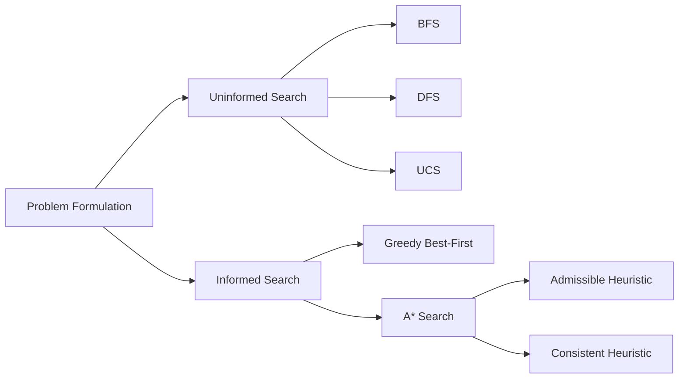

# Chapter 3: Solving Problems by Searching

**Previous:** [Chapter 2: Intelligent Agents](02-agents.md) | **Next:** [Chapter 3: Informed Search and Heuristics](03-informed-search.md)

---

## Learning Objectives

- Formulate a well-defined problem in terms of initial state, actions, transition model, goal test, and path cost.
- Compare and contrast uninformed search strategies like Breadth-First Search (BFS) and Depth-First Search (DFS).
- Evaluate informed (heuristic) search strategies, specifically A* search.
- Define what makes a heuristic "admissible" and "consistent."
- Analyze the time and space complexity of different search algorithms.

---

## Chapter at a Glance

| Section | Key Topics | Key Terms |
|---------|-----------|-----------|
| Problem Formulation | Initial state, actions, goal test, path cost | Solution, optimal solution |
| Uninformed Search | BFS, DFS, Uniform-Cost | Complete, optimal, frontier |
| Informed Search | Heuristic function, Greedy, A* | Admissible, consistent heuristic |
| Heuristic Properties | Admissibility, consistency, dominance | h(n), f(n) = g(n) + h(n) |

## Chapter Roadmap



---

## Theory


### Problem Formulation
> **One-Sentence Takeaway:** Every search problem needs five components: initial state, actions, transition model, goal test, and path cost — getting these right is the foundation of any solution.

Before a search algorithm can be applied, a problem must be formally defined:
1. **Initial State**: The starting point of the agent.
2. **Actions**: The set of possible actions available in a state.
3. **Transition Model**: A description of what each action does (`Result(s, a)`).
4. **Goal Test**: Determines whether a given state is a goal state.
5. **Path Cost**: A function that assigns a numeric cost to each path.

A **solution** is a sequence of actions leading from the initial state to a goal state.

> **💡 Pro Tip:** The heuristic function h(n) is the key design decision in informed search. A good heuristic (like Manhattan distance for the 8-puzzle) can reduce explored nodes by orders of magnitude compared to uninformed search.

### Uninformed Search Strategies
These strategies have no additional information about states beyond the problem definition:
- **Breadth-First Search (BFS)**: Expands the shallowest unexpanded node. It is complete and optimal (if path cost is uniform) but has high memory requirements.
- **Depth-First Search (DFS)**: Expands the deepest unexpanded node. It has low memory requirements but is not complete (can get stuck in loops) and not optimal.
- **Uniform-Cost Search**: Expands the node with the lowest path cost `g(n)`.

> **One-Sentence Takeaway:** Uninformed search (BFS, DFS) uses no domain knowledge; informed search (A*) uses heuristic functions to dramatically reduce search effort.

### Informed (Heuristic) Search
These strategies use domain-specific knowledge to find solutions more efficiently:
- **Heuristic Function `h(n)`**: Estimates the cost from state `n` to the goal.
- **Greedy Best-First Search**: Expands the node that appears to be closest to the goal (minimizes `h(n)`).
- **A* Search**: Minimizes the total estimated cost `f(n) = g(n) + h(n)`.
  - **Admissibility**: `h(n)` never overestimates the actual cost to the goal.
  - **Consistency**: For every node `n` and every successor `n'` generated by action `a`, `h(n) <= c(n, a, n') + h(n')`.

> **⚠️ Warning:** An admissible heuristic never overestimates, but it can still lead to poor performance if it greatly underestimates. The closer h(n) is to the true cost h*(n), the fewer nodes A* expands.

---

## Examples

### Example 1: Breadth-First Search on a Tree
Consider a simple tree where the root is 'A' and goal is 'D'.
- **Step-by-step**: 
  1. Expand 'A', add children 'B', 'C' to frontier.
  2. Expand 'B', find child 'D'. 
  3. 'D' is the goal. Stop.
- **Code snippet (Python BFS)**:
```python
from collections import deque

def bfs(graph, start, goal):
    frontier = deque([start])
    visited = {start}
    while frontier:
        node = frontier.popleft()
        if node == goal: return True
        for neighbor in graph[node]:
            if neighbor not in visited:
                visited.add(neighbor)
                frontier.append(neighbor)
    return False

graph = {'A': ['B', 'C'], 'B': ['D'], 'C': [], 'D': []}
print(f"Goal found: {bfs(graph, 'A', 'D')}")
```
- **Expected output**: `Goal found: True`
- **What it demonstrates**: The level-by-level exploration of BFS.

### Example 2: A* Search for the 8-Puzzle
The 8-puzzle involves sliding tiles to reach a target configuration.
- **Heuristic**: Manhattan Distance (sum of distances of tiles from their goal positions).
- **Step-by-step**:
  1. Start with initial board `S`.
  2. Calculate `f(S) = g(S) + h(S)`.
  3. Expand the state with the lowest `f` value.
  4. Continue until the goal state is reached.
- **What it demonstrates**: How a good heuristic drastically reduces the number of states explored compared to uninformed search.

---

## Concept Comparison

| Algorithm | Type | Complete? | Optimal? | Uses h(n)? | Space |
|-----------|:---:|:---:|:---:|:---:|:---:|
| BFS | Uninformed | ✅ | ✅ (uniform) | No | O(b^d) |
| DFS | Uninformed | ❌ | ❌ | No | O(bm) |
| Uniform-Cost | Uninformed | ✅ | ✅ | No | O(b^{1+...}) |
| Greedy Best-First | Informed | ❌ | ❌ | Yes | O(b^m) |
| A* | Informed | ✅ | ✅ | Yes | O(b^d) |

## Quick Reference — Heuristic Properties

| Property | Definition | Implication |
|----------|-----------|-------------|
| Admissible | h(n) ≤ h*(n) never overestimates | A* tree-search is optimal |
| Consistent | h(n) ≤ c(n,a,n') + h(n') (triangle inequality) | A* graph-search is optimal |
| Dominance | h₂(n) ≥ h₁(n) for all n (both admissible) | h₂ dominates h₁ — expands fewer nodes |
| Effective Branching Factor | b* where N = 1 + b* + (b*)² + ... | Measures heuristic quality empirically |

## Cross-Application Matrix

| Search Method | ML Engineering | Computer Vision | NLP | Research |
|--------------|:---:|:---:|:---:|:---:|
| BFS | ⬜ | ⬜ | ⬜ | ✅ |
| DFS | ⬜ | ⬜ | ✅ | ✅ |
| Greedy Best-First | ✅ | ⬜ | ⬜ | ✅ |
| A* Search | ✅ | ⬜ | ⬜ | ✅ |
| Heuristic Design | ⬜ | ✅ | ⬜ | ✅ |

## Chapter Quiz

**Q1:** What condition must a heuristic satisfy for A* graph-search to guarantee optimality?
- A) Admissibility only
- B) Consistency only
- C) Both admissibility and consistency
- D) Neither

<details><summary>Answer</summary>B) A* graph-search requires consistency (monotonicity) for optimality. Tree-search only requires admissibility.</details>

**Q2:** Which search algorithm expands the node with the lowest f(n) = g(n) + h(n)?
- A) Greedy Best-First Search
- B) Uniform-Cost Search
- C) A* Search
- D) Breadth-First Search

<details><summary>Answer</summary>C) A* Search combines the cost-so-far g(n) with the heuristic h(n) into f(n).</details>

**Q3:** What is the space complexity of BFS?
- A) O(bd)
- B) O(b^d)
- C) O(b^{d+1})
- D) O(bm)

<details><summary>Answer</summary>C) BFS stores all nodes at the current depth level, requiring O(b^{d+1}) space in the worst case.</details>

---

## Summary

- Problem formulation is the first step in automated problem solving.
- Uninformed search is useful for problems where no domain knowledge is available.
- BFS is optimal for uniform costs but consumes significant memory.
- A* search is the most widely used search algorithm because it is both complete and optimal given an admissible heuristic.
- The quality of a heuristic (its "closeness" to actual cost) determines search efficiency.
- Space complexity is often a more significant constraint than time complexity for search algorithms.

---

## Exercises

### Review Questions
1. What are the four criteria for evaluating a search algorithm?
2. Explain why BFS is guaranteed to find the shallowest goal.
3. Define "admissible heuristic" and give an example for a navigation problem.
4. How does A* search combine the strengths of Uniform-Cost Search and Greedy Best-First Search?

### Application Problems
1. Trace a DFS on a graph with a cycle. How can you modify DFS to handle cycles?
2. Consider the "Straight-Line Distance" heuristic for city navigation. Is it admissible? Why?
3. Calculate the Manhattan distance for an 8-puzzle state where tile 1 is at (0,0) and its goal is (2,2).

### Challenge Problem
1. Prove that if a heuristic `h(n)` is consistent, it is also admissible. Provide a counter-example showing that an admissible heuristic is not necessarily consistent.
