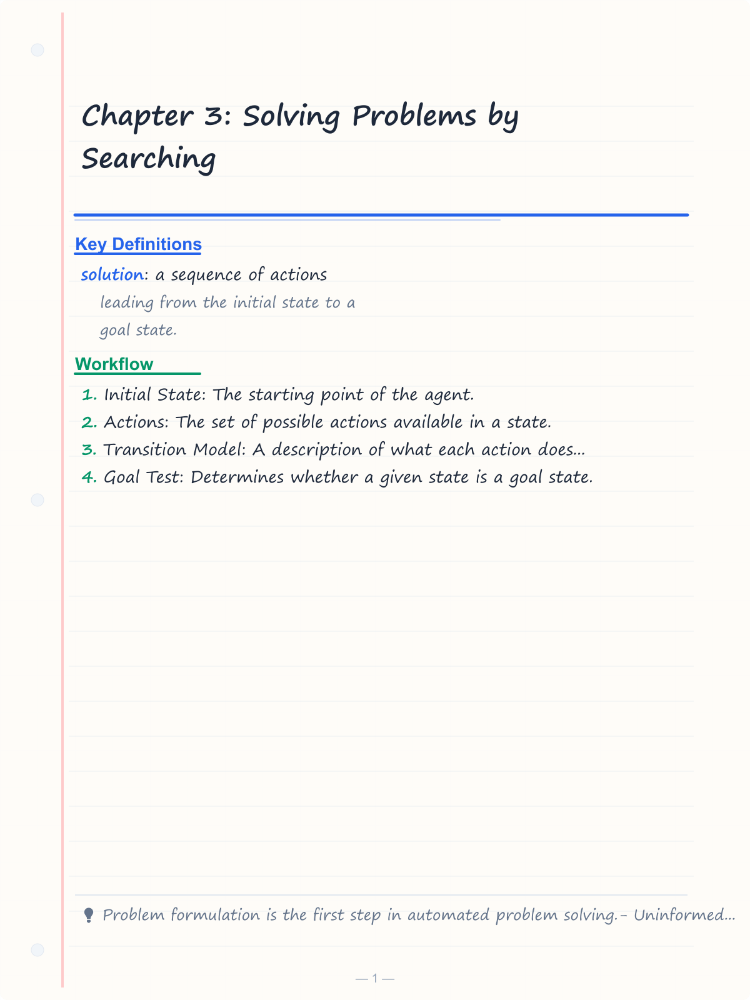
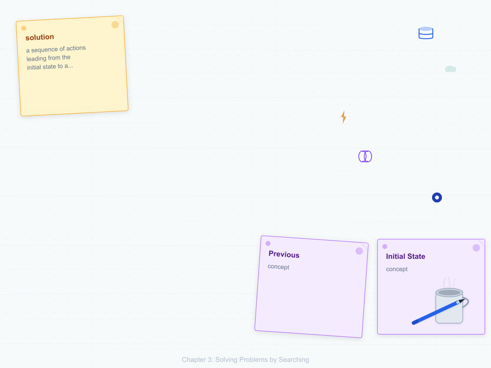
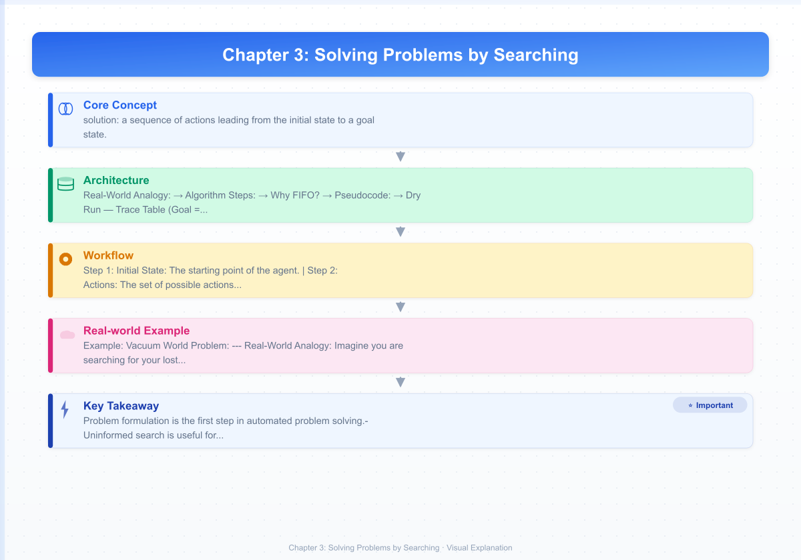
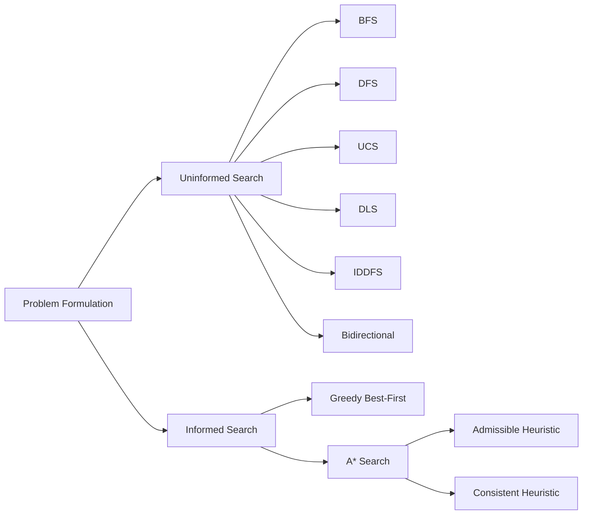

# Chapter 3: Solving Problems by Searching

**Previous:** [Chapter 2: Intelligent Agents](02-agents.md) | **Next:** [Chapter 3: Informed Search and Heuristics](03-informed-search.md)

---

## Learning Objectives

- Formulate a well-defined problem in terms of initial state, actions, transition model, goal test, and path cost.
- Compare and contrast uninformed search strategies like Breadth-First Search (BFS) and Depth-First Search (DFS).
- Evaluate informed (heuristic) search strategies, specifically A* search.
- Define what makes a heuristic "admissible" and "consistent."
- Analyze the time and space complexity of different search algorithms.

<!-- Image Gallery -->
<section class="lesson-visuals" aria-label="Visual learning resources">
  <header><span>VISUAL LEARNING</span><h2>See it. Review it. Remember it.</h2></header>
  <a class="lesson-visual-card" href="../../assets/images/lessons/artificial-intelligence/03-search/handwritten-notes.png" target="_blank" rel="noopener">
    
    <span><strong>Handwritten notes</strong>Condensed notes for deliberate review.</span>
  </a>
  <a class="lesson-visual-card" href="../../assets/images/lessons/artificial-intelligence/03-search/sticky-notes.png" target="_blank" rel="noopener">
    
    <span><strong>Sticky-note revision</strong>Fast recall prompts for revision.</span>
  </a>
  <a class="lesson-visual-card" href="../../assets/images/lessons/artificial-intelligence/03-search/visual-explanation.png" target="_blank" rel="noopener">
    
    <span><strong>Visual concept guide</strong>A connected explanation of the key ideas.</span>
  </a>
</section>
<!-- End Image Gallery -->


---

## Why Search Algorithms Matter

Imagine you are standing at the entrance of a vast maze with walls as tall as your shoulders. Somewhere deep inside is the exit. You cannot see over the walls. You cannot teleport. Every step forward, backward, left, or right costs you time and energy. The question is: **what sequence of moves guarantees you will find the exit, and find it as quickly as possible?**

This is the essence of search — the computational version of finding your way through a maze. Every day, search algorithms answer the same question inside GPS navigators (fastest route between two cities), web crawlers (discovering every page on the internet), puzzle solvers (winning a game of chess or solving a Rubik's cube), and even your own brain (planning the shortest path through a grocery store). Without search algorithms, intelligent agents — whether human or machine — would have no systematic way to find solutions.

Search is the universal problem-solving engine: define the starting point, define what "done" looks like, define what moves you are allowed to make, and a search algorithm will find the way.

### Why It Matters in the Real World

| Domain | Problem | How Search Helps |
|--------|---------|-----------------|
| GPS Navigation | Find shortest route from A to B | A* search evaluates roads by distance + heuristic |
| Web Search (Google) | Crawl billions of pages | BFS ensures breadth coverage of linked pages |
| Chess AI (Stockfish) | Evaluate next move under time pressure | IDDFS-based minimax with alpha-beta pruning |
| Robotics | Plan collision-free motion | BFS/A* on configuration space grid |
| Game Development | NPC pathfinding around obstacles | A* on navigation mesh |
| Social Networks | Find shortest connection path | Bidirectional BFS halves search space |
| Logistics / Delivery | Optimize delivery routes | UCS handles varying road costs |
| Puzzle Solving | Solve 8-puzzle, Rubik's cube | IDDFS finds optimal solution with minimal memory |

---

## Chapter at a Glance

| Section | Key Topics | Key Terms |
|---------|-----------|-----------|
| Problem Formulation | Initial state, actions, goal test, path cost | Solution, optimal solution |
| Uninformed Search | BFS, DFS, Uniform-Cost, DLS, IDDFS, Bidirectional | Complete, optimal, frontier |
| Informed Search | Heuristic function, Greedy, A* | Admissible, consistent heuristic |
| Heuristic Properties | Admissibility, consistency, dominance | h(n), f(n) = g(n) + h(n) |

---

## Chapter Roadmap



---

## Theory


### Problem Formulation

> **One-Sentence Takeaway:** Every search problem needs five components: initial state, actions, transition model, goal test, and path cost — getting these right is the foundation of any solution.

Before a search algorithm can be applied, a problem must be formally defined:

1. **Initial State**: The starting point of the agent.
2. **Actions**: The set of possible actions available in a state.
3. **Transition Model**: A description of what each action does (`Result(s, a)`).
4. **Goal Test**: Determines whether a given state is a goal state.
5. **Path Cost**: A function that assigns a numeric cost to each path.

A **solution** is a sequence of actions leading from the initial state to a goal state.

> **Pro Tip:** The heuristic function h(n) is the key design decision in informed search. A good heuristic (like Manhattan distance for the 8-puzzle) can reduce explored nodes by orders of magnitude compared to uninformed search.

### Example: Vacuum World Problem

| Component | Definition |
|-----------|-----------|
| Initial State | Agent at a specific location with dirt status of each tile |
| Actions | Left, Right, Suck |
| Transition Model | Moving changes agent location; Suck cleans current tile |
| Goal Test | No dirt in any tile |
| Path Cost | Each action costs 1 |

---

### Breadth-First Search (BFS)


**Real-World Analogy:** Imagine you are searching for your lost keys in a house with multiple rooms. Instead of running to the far end of the house and searching one deep corner at a time, you check every room on the current floor first, then move to the next floor down. You never go deeper until you have checked everything at the current level. This guarantees you find the keys in the fewest steps from where you started.

**Algorithm Steps:**

1. Initialize a queue (FIFO) with the initial state node.
2. Mark the initial node as visited.
3. While the queue is not empty:
   a. Dequeue the front node.
   b. If this node is the goal, return success (and the path).
   c. For each unvisited neighbor of the current node:
      i. Mark it as visited.
      ii. Enqueue it.
4. If the queue empties without finding the goal, return failure.

**Why FIFO?** A FIFO (First-In-First-Out) queue ensures that nodes at depth d are always expanded before any node at depth d+1. This is the fundamental property that guarantees BFS finds the shallowest goal first.

**Pseudocode:**

```
function BFS(problem) returns solution or failure
    node <- Node(problem.initial)
    if problem.goal_test(node.state) then return solution(node)
    frontier <- FIFO queue containing node
    reached <- {problem.initial}
    while not frontier.is_empty():
        node <- frontier.pop()
        for each child in expand(problem, node):
            s <- child.state
            if problem.goal_test(s) then return solution(child)
            if s not in reached:
                reached.add(s)
                frontier.push(child)
    return failure
```

**Dry Run — Trace Table (Goal = G):**

Graph: A -> B, C | B -> D, E | C -> F, G | D,E,F,G are leaves.

| Iteration | Frontier Queue (front -> back) | Node Expanded | Goal Found? |
|-----------|-------------------------------|---------------|-------------|
| 0 | [A] | — | No |
| 1 | [B, C] | A | No |
| 2 | [C, D, E] | B | No |
| 3 | [D, E, F, G] | C | No |
| 4 | [E, F, G] | D | No |
| 5 | [F, G] | E | No |
| 6 | [G] | F | No |
| 7 | [] | G | Yes ✓ |

BFS expands level by level: A (depth 0), then B and C (depth 1), then D, E, F, G (depth 2).

**Python Implementation:**

```python
from collections import deque

def bfs_path(graph, start, goal):
    """Returns the shortest path from start to goal using BFS."""
    frontier = deque([(start, [start])])
    visited = {start}
    
    while frontier:
        node, path = frontier.popleft()
        if node == goal:
            return path
        for neighbor in graph[node]:
            if neighbor not in visited:
                visited.add(neighbor)
                frontier.append((neighbor, path + [neighbor]))
    return None

# Example usage
graph = {
    'A': ['B', 'C'],
    'B': ['D', 'E'],
    'C': ['F', 'G'],
    'D': [],
    'E': [],
    'F': [],
    'G': []
}
print(bfs_path(graph, 'A', 'G'))  # Output: ['A', 'C', 'G']
```

**C++ Implementation:**

```cpp
#include <iostream>
#include <queue>
#include <unordered_map>
#include <unordered_set>
#include <vector>
#include <algorithm>

using namespace std;

vector<string> bfs_path(unordered_map<string, vector<string>>& graph, 
                         string start, string goal) {
    queue<pair<string, vector<string>>> frontier;
    unordered_set<string> visited;
    frontier.push({start, {start}});
    visited.insert(start);
    
    while (!frontier.empty()) {
        auto [node, path] = frontier.front();
        frontier.pop();
        
        if (node == goal) return path;
        
        for (string& neighbor : graph[node]) {
            if (visited.find(neighbor) == visited.end()) {
                visited.insert(neighbor);
                vector<string> newPath = path;
                newPath.push_back(neighbor);
                frontier.push({neighbor, newPath});
            }
        }
    }
    return {};
}
```

**Java Implementation:**

```java
import java.util.*;

public class BFS {
    public static List<String> bfsPath(Map<String, List<String>> graph, 
                                         String start, String goal) {
        Queue<Map.Entry<String, List<String>>> frontier = new LinkedList<>();
        Set<String> visited = new HashSet<>();
        frontier.add(new AbstractMap.SimpleEntry<>(start, Arrays.asList(start)));
        visited.add(start);
        
        while (!frontier.isEmpty()) {
            var entry = frontier.poll();
            String node = entry.getKey();
            List<String> path = entry.getValue();
            
            if (node.equals(goal)) return path;
            
            for (String neighbor : graph.get(node)) {
                if (!visited.contains(neighbor)) {
                    visited.add(neighbor);
                    List<String> newPath = new ArrayList<>(path);
                    newPath.add(neighbor);
                    frontier.add(new AbstractMap.SimpleEntry<>(neighbor, newPath));
                }
            }
        }
        return null;
    }
}
```

**Complexity Analysis:**

| Metric | Value | Why? |
|--------|-------|------|
| Time | O(b^d) | b = branching factor, d = depth of shallowest goal. Every node at every level down to depth d must be expanded. Total nodes: 1 + b + b^2 + ... + b^d = O(b^d). |
| Space | O(b^d) | BFS stores the entire frontier — all nodes at depth d — simultaneously. For b=10, d=10: ~10^10 nodes. This is the dominant constraint. |
| Complete | Yes | If the branching factor is finite, BFS will eventually find the goal because it explores every node at each depth before moving deeper. |
| Optimal | Yes (if all step costs are identical) | BFS finds the shallowest goal first. If path cost is uniform (each step costs 1), shallowest = cheapest. |

**Advantages & Disadvantages:**

| Advantages | Disadvantages |
|------------|---------------|
| Guarantees the shortest path (minimum steps) | Extremely high memory consumption — O(b^d) nodes in the frontier |
| Complete — will always find a solution if one exists | Impractical for large search spaces (e.g., chess: b ~= 35) |
| Simple to implement and reason about | Expanding only shallow nodes means deep solutions take very long |
| Works well for small, uniform-cost problems | Not optimal when step costs vary (cost != depth) |
| Graph version handles cycles automatically via visited set | Every node at depth d must be stored before moving to d+1 |

**Edge Cases:**

| Edge Case | Behavior | Handling |
|-----------|----------|----------|
| Infinite graph (unbounded) | BFS will never terminate if no goal exists | Always use a visited set; BFS is still not reliable for infinite state spaces without a reachable goal |
| Cycles | A -> B -> C -> A causes infinite loop | The visited set prevents re-expanding nodes; cycles are handled safely |
| Zero-cost edges (cost = 0) | BFS may not find the true optimal path since it assumes uniform cost | Use Uniform-Cost Search instead |
| Goal at depth 0 (start = goal) | The initial state satisfies the goal test | Check goal test before expanding; returns immediately |
| Very deep solutions | BFS explores O(b^d) nodes before reaching d | BFS becomes intractable beyond d ~= 10-15 for b >= 10 |
| Disconnected graph | BFS exhausts one component and returns failure | No solution exists; algorithm terminates correctly |

---

### Depth-First Search (DFS)


**Real-World Analogy:** You are exploring a cave system. Instead of checking every tunnel near the entrance first, you pick one tunnel and follow it as far as it goes. If you hit a dead end, you backtrack to the last junction and try the next tunnel. You go deep first, wide later. This uses very little memory — just enough to remember your way back.

**Algorithm Steps (Graph Search with visited set):**

1. Initialize a stack (LIFO) with the initial state node.
2. Mark the initial node as visited.
3. While the stack is not empty:
   a. Pop the top node.
   b. If this node is the goal, return success (and the path).
   c. For each unvisited neighbor of the current node:
      i. Mark it as visited.
      ii. Push it onto the stack.
4. If the stack empties without finding the goal, return failure.

**Why LIFO?** A LIFO (Last-In-First-Out) stack means the most recently discovered node is expanded next. This drives the search deep into the tree immediately, rather than exploring breadth-first.

**Pseudocode:**

```
function DFS(problem) returns solution or failure
    node <- Node(problem.initial)
    if problem.goal_test(node.state) then return solution(node)
    frontier <- LIFO stack containing node
    reached <- {problem.initial}
    while not frontier.is_empty():
        node <- frontier.pop()
        for each child in expand(problem, node):
            s <- child.state
            if problem.goal_test(s) then return solution(child)
            if s not in reached:
                reached.add(s)
                frontier.push(child)
    return failure
```

**Dry Run — Trace Table (Goal = G):**

Graph: A -> B, C | B -> D, E | C -> F, G | D,E,F,G are leaves.

| Iteration | Stack (top -> bottom) | Node Expanded | Goal Found? |
|-----------|----------------------|---------------|-------------|
| 0 | [A] | — | No |
| 1 | [C, B] | A | No |
| 2 | [C, E, D] | B | No |
| 3 | [C, E] | D | No |
| 4 | [C] | E | No |
| 5 | [G, F] | C | No |
| 6 | [G] | F | No |
| 7 | [] | G | Yes ✓ |

DFS plunges deep: A -> B -> D (dead end) -> backtrack to B -> E (dead end) -> backtrack to A -> C -> F (dead end) -> C -> G (goal).

**Python Implementation:**

```python
def dfs_path(graph, start, goal):
    """Returns a path from start to goal using DFS (not guaranteed shortest)."""
    stack = [(start, [start])]
    visited = {start}
    
    while stack:
        node, path = stack.pop()
        if node == goal:
            return path
        for neighbor in graph[node]:
            if neighbor not in visited:
                visited.add(neighbor)
                stack.append((neighbor, path + [neighbor]))
    return None

graph = {
    'A': ['B', 'C'],
    'B': ['D', 'E'],
    'C': ['F', 'G'],
    'D': [],
    'E': [],
    'F': [],
    'G': []
}
print(dfs_path(graph, 'A', 'G'))  # Output: ['A', 'C', 'G']
```

**C++ Implementation:**

```cpp
#include <iostream>
#include <stack>
#include <unordered_map>
#include <unordered_set>
#include <vector>

using namespace std;

vector<string> dfs_path(unordered_map<string, vector<string>>& graph,
                         string start, string goal) {
    stack<pair<string, vector<string>>> frontier;
    unordered_set<string> visited;
    frontier.push({start, {start}});
    visited.insert(start);
    
    while (!frontier.empty()) {
        auto [node, path] = frontier.top();
        frontier.pop();
        
        if (node == goal) return path;
        
        for (string& neighbor : graph[node]) {
            if (visited.find(neighbor) == visited.end()) {
                visited.insert(neighbor);
                vector<string> newPath = path;
                newPath.push_back(neighbor);
                frontier.push({neighbor, newPath});
            }
        }
    }
    return {};
}
```

**Java Implementation:**

```java
import java.util.*;

public class DFS {
    public static List<String> dfsPath(Map<String, List<String>> graph,
                                         String start, String goal) {
        Deque<Map.Entry<String, List<String>>> stack = new ArrayDeque<>();
        Set<String> visited = new HashSet<>();
        stack.push(new AbstractMap.SimpleEntry<>(start, Arrays.asList(start)));
        visited.add(start);
        
        while (!stack.isEmpty()) {
            var entry = stack.pop();
            String node = entry.getKey();
            List<String> path = entry.getValue();
            
            if (node.equals(goal)) return path;
            
            for (String neighbor : graph.get(node)) {
                if (!visited.contains(neighbor)) {
                    visited.add(neighbor);
                    List<String> newPath = new ArrayList<>(path);
                    newPath.add(neighbor);
                    stack.push(new AbstractMap.SimpleEntry<>(neighbor, newPath));
                }
            }
        }
        return null;
    }
}
```

**Complexity Analysis:**

| Metric | Value | Why? |
|--------|-------|------|
| Time | O(b^m) | b = branching factor, m = maximum depth of the tree. In the worst case, DFS explores every node down to the maximum depth. If m >> d (solution depth), DFS wastes enormous time. |
| Space | O(bm) | DFS stores only one path from root to current node (depth m) plus at most b siblings at each level. This is linear! For b=10, m=10: ~100 nodes vs BFS's ~10^10. |
| Complete | No | In infinite-depth spaces (or graphs with cycles in tree-search mode), DFS descends forever on an infinite branch. With a visited set on finite graphs, it is complete for finite state spaces. |
| Optimal | No | DFS returns the first solution found, which depends entirely on the order of neighbor expansion — not on path cost or depth. |

**Advantages & Disadvantages:**

| Advantages | Disadvantages |
|------------|---------------|
| Very low memory — O(bm) vs BFS's O(b^d) | Not complete — can get lost in infinite branches (tree-search) |
| Works well when solutions are dense and deep | Not optimal — first found != best found |
| Simple to implement recursively or iteratively | Can get stuck in cycles without visited tracking |
| Good for game trees (chess, tic-tac-toe) | May find a terrible solution when a good one is nearby |
| Recursive implementation is elegant (~5 lines) | Stack overflow risk for very deep recursion |

**Edge Cases:**

| Edge Case | Behavior | Handling |
|-----------|----------|----------|
| Infinite graph | DFS descends forever on an infinite branch | Use depth-limited search or IDDFS; never rely on bare DFS for infinite spaces |
| Cycles | A -> B -> C -> A causes infinite loop without visited tracking | Always maintain a visited set for graph search; pure tree-search DFS is vulnerable |
| Very deep solution at depth d &lt;< m | DFS may waste time exploring enormous depth before finding the shallow solution | Use BFS or IDDFS when the goal is likely shallow |
| Goal not reachable from chosen path | DFS explores one branch exhaustively before trying alternatives | No general fix; this is inherent to DFS's depth-first nature |
| Solution at maximum depth | DFS works fine — follows the path all the way | No special handling needed, but watch for stack overflow in recursive version |

---

### Uniform-Cost Search (UCS)


**Real-World Analogy:** You are planning a road trip from New York to Los Angeles. The shortest path (fewest miles) is not always the cheapest route — sometimes a slightly longer road has cheaper gas or no tolls. Uniform-Cost Search considers that each road segment has a different cost, and it always expands the cheapest path discovered so far. It is like always choosing the smallest total bill at every fork.

**Algorithm Steps:**

1. Initialize a priority queue (min-heap) with the initial state node (cost = 0).
2. Initialize a dictionary mapping state to best-known cost (start = 0).
3. While the priority queue is not empty:
   a. Pop the node with the smallest path cost g(n).
   b. If this node is the goal, return success.
   c. For each neighbor with edge cost c:
      i. New cost = g(current) + c.
      ii. If this is a better cost than previously recorded for the neighbor, update it and push onto the queue.
4. If the queue empties, return failure.

**Why a priority queue?** UCS needs to always expand the node with the lowest cumulative cost. A priority queue (min-heap) gives O(log n) insertion and O(log n) extraction of the minimum element.

**Pseudocode:**

```
function UniformCostSearch(problem) returns solution or failure
    node <- Node(problem.initial, path_cost = 0)
    frontier <- priority queue ordered by path_cost, containing node
    reached <- {problem.initial: 0}
    while not frontier.is_empty():
        node <- frontier.pop()
        if problem.goal_test(node.state) then return solution(node)
        for each child in expand(problem, node):
            s <- child.state
            new_cost <- node.path_cost + step_cost
            if s not in reached or new_cost < reached[s]:
                reached[s] <- new_cost
                frontier.push(child with new_cost)
    return failure
```

**Dry Run — Trace Table (Goal = G):**

Graph with weighted edges:
A -> B (cost 2), A -> C (cost 5)
B -> D (cost 3), B -> E (cost 4)
C -> F (cost 1), C -> G (cost 6)

| Iteration | Priority Queue (cost, node) | Expanded | Goal Found? |
|-----------|----------------------------|----------|-------------|
| 0 | (0, A) | — | No |
| 1 | (2, B), (5, C) | A | No |
| 2 | (4, D via B), (5, C), (6, E via B) | B | No |
| 3 | (5, C), (6, E via B), (7, F via C) | D | No |
| 4 | (6, C via A), (6, E via B), (7, F via C) | C | No |
| 5 | (6, E via B), (7, F via C) | C (dup skipped) | No |
| 6 | (7, F via C), (12, G via C) | E | No |
| 7 | (12, G via C) | F | No |
| Final | empty | G | Yes ✓ (cost = 12 via A -> C -> G) |

Note: UCS does NOT stop when it generates the goal — it stops when it pops the goal from the priority queue, guaranteeing the optimal path.

**Python Implementation:**

```python
import heapq

def ucs_path(graph, costs, start, goal):
    """Returns the minimum-cost path from start to goal."""
    pq = [(0, start, [start])]
    best_costs = {start: 0}
    
    while pq:
        cost, node, path = heapq.heappop(pq)
        if node == goal:
            return path, cost
        if cost > best_costs.get(node, float('inf')):
            continue
        for neighbor in graph[node]:
            edge_cost = costs.get((node, neighbor), float('inf'))
            new_cost = cost + edge_cost
            if new_cost < best_costs.get(neighbor, float('inf')):
                best_costs[neighbor] = new_cost
                heapq.heappush(pq, (new_cost, neighbor, path + [neighbor]))
    return None, float('inf')

graph = {'A': ['B', 'C'], 'B': ['D', 'E'], 'C': ['F', 'G'], 'D': [], 'E': [], 'F': [], 'G': []}
costs = {('A','B'): 2, ('A','C'): 5, ('B','D'): 3, ('B','E'): 4, ('C','F'): 1, ('C','G'): 6}
print(ucs_path(graph, costs, 'A', 'G'))  # Output: (['A', 'C', 'G'], 12)
```

**C++ Implementation:**

```cpp
#include <iostream>
#include <queue>
#include <unordered_map>
#include <vector>
#include <limits>

using namespace std;

pair<vector<string>, int> ucs_path(
    unordered_map<string, vector<string>>& graph,
    unordered_map<string, unordered_map<string, int>>& costs,
    string start, string goal) {
    
    auto cmp = [](auto& a, auto& b) { return a.first > b.first; };
    priority_queue<pair<int, pair<string, vector<string>>>,
                   vector<pair<int, pair<string, vector<string>>>>,
                   decltype(cmp)> pq(cmp);
    
    unordered_map<string, int> best_costs;
    pq.push({0, {start, {start}}});
    best_costs[start] = 0;
    
    while (!pq.empty()) {
        auto [cost, entry] = pq.top(); pq.pop();
        string node = entry.first;
        vector<string> path = entry.second;
        
        if (node == goal) return {path, cost};
        if (cost > best_costs[node]) continue;
        
        for (string& neighbor : graph[node]) {
            int edge_cost = costs[node][neighbor];
            int new_cost = cost + edge_cost;
            if (best_costs.find(neighbor) == best_costs.end() || 
                new_cost < best_costs[neighbor]) {
                best_costs[neighbor] = new_cost;
                vector<string> newPath = path;
                newPath.push_back(neighbor);
                pq.push({new_cost, {neighbor, newPath}});
            }
        }
    }
    return {{}, numeric_limits<int>::max()};
}
```

**Java Implementation:**

```java
import java.util.*;

public class UCS {
    public static class Result {
        List<String> path;
        int cost;
        Result(List<String> path, int cost) {
            this.path = path; this.cost = cost;
        }
    }
    
    public static Result ucsPath(Map<String, List<String>> graph,
                                  Map<String, Map<String, Integer>> costs,
                                  String start, String goal) {
        PriorityQueue<int[]> pq = new PriorityQueue<>(Comparator.comparingInt(a -> a[1]));
        Map<String, Integer> bestCosts = new HashMap<>();
        Map<String, String> parent = new HashMap<>();
        
        pq.add(new int[]{0, 0});
        bestCosts.put(start, 0);
        parent.put(start, null);
        
        while (!pq.isEmpty()) {
            int[] curr = pq.poll();
            String node = String.valueOf(curr[0]);
            int cost = curr[1];
            if (node.equals(goal)) {
                List<String> path = new ArrayList<>();
                for (String n = goal; n != null; n = parent.get(n))
                    path.add(n);
                Collections.reverse(path);
                return new Result(path, cost);
            }
            if (cost > bestCosts.getOrDefault(node, Integer.MAX_VALUE))
                continue;
            for (String neighbor : graph.get(node)) {
                int edgeCost = costs.get(node).get(neighbor);
                int newCost = cost + edgeCost;
                if (newCost < bestCosts.getOrDefault(neighbor, Integer.MAX_VALUE)) {
                    bestCosts.put(neighbor, newCost);
                    parent.put(neighbor, node);
                    pq.add(new int[]{neighbor.hashCode(), newCost});
                }
            }
        }
        return null;
    }
}
```

**Complexity Analysis:**

| Metric | Value | Why? |
|--------|-------|------|
| Time | O(b^{1 + floor(C*/epsilon)}) | C* = optimal cost, epsilon = smallest edge cost. Unlike BFS (depth-based), UCS grows with the cost magnitude. If costs are small integers, this equals O(b^{d+1}). |
| Space | O(b^{1 + floor(C*/epsilon)}) | Same as time — all nodes with cost &lt;= C* may be stored in the frontier simultaneously. |
| Complete | Yes | UCS will find a solution if one exists, assuming all edge costs are positive. With zero or negative costs, it may loop forever. |
| Optimal | Yes | UCS expands nodes in strictly non-decreasing cost order. The first goal popped from the priority queue has the minimum possible cost — proof by contradiction: if a cheaper path existed, its endpoint would have been popped first. |

**Advantages & Disadvantages:**

| Advantages | Disadvantages |
|------------|---------------|
| Guarantees optimal solution for any positive costs | Can be very slow when C* is large relative to epsilon |
| Generalizes BFS (set all costs = 1 => behaves identically to BFS) | Does not use heuristic information — explores equally in all directions |
| Complete even with varying step costs | The frontier can grow extremely large |
| No need for a heuristic function | Practical only when cost ranges are narrow |

**Edge Cases:**

| Edge Case | Behavior | Handling |
|-----------|----------|----------|
| Zero-cost edges | UCS may loop forever since cost never increases | Require strictly positive edge costs, or track visited states |
| Negative edge costs | UCS fails entirely — it assumes non-decreasing costs | Use Bellman-Ford or A* with consistent heuristic |
| Very large C*/epsilon ratio (tiny costs) | Exponentially many nodes expanded before optimal goal | Use A* with an informative heuristic |
| All costs equal | Degrades to BFS | Use BFS instead (simpler, same behavior) |
| Multiple paths to same node with different costs | UCS stores only the cheapest via reached dictionary | Correct — the cheaper path dominates; re-expansion is unnecessary |
| Goal generated but not popped | Not yet guaranteed optimal — cheaper paths may still be in the frontier | Do NOT stop on generation; pop the goal first |

---

### Depth-Limited Search (DLS)


**Real-World Analogy:** Imagine you are searching an office building for a meeting room on floor 3. Instead of walking up to floor 20 (which wastes time), you set a hard limit: do not go deeper than floor 5. If the room is not found within those floors, you stop and report no solution within the limit. This prevents infinite stair-climbing.

**Algorithm Steps (Iterative Version):**

1. Initialize a stack (LIFO) with the initial node (depth = 0).
2. While the stack is not empty:
   a. Pop the top node.
   b. If the node is the goal, return success.
   c. If the node's depth &lt; limit:
      i. Push each child node (depth = parent.depth + 1) onto the stack.
3. If the stack empties, return failure (or cutoff if nodes were pruned by the limit).

**Pseudocode:**

```
function DepthLimitedSearch(problem, limit) returns solution or failure/cutoff
    return DLS_recursive(Node(problem.initial), problem, limit)

function DLS_recursive(node, problem, limit) returns solution or failure/cutoff
    if problem.goal_test(node.state) then return solution(node)
    if limit == 0 then return cutoff
    cutoff_occurred <- false
    for each child in expand(problem, node):
        result <- DLS_recursive(child, problem, limit - 1)
        if result == cutoff then cutoff_occurred <- true
        else if result != failure then return result
    if cutoff_occurred then return cutoff else return failure
```

**Dry Run — Trace Table with limit = 2 (Goal = G):**

Graph: A -> B, C | B -> D, E | C -> F, G | D,E,F,G leaves.

| Iteration | Stack (limit=2) | Node | Depth | Action |
|-----------|-----------------|------|-------|--------|
| 0 | [A(0)] | — | — | Start |
| 1 | [B(1), C(1)] | A | 0 | Expand, push children |
| 2 | [B(1), F(2), G(2)] | C | 1 | Expand C, push children |
| 3 | [B(1), F(2)] | G | 2 | Goal found! |

DLS found G at depth 2 (within limit). If limit were 1, G would never be reached and DLS would return cutoff.

**Python Implementation:**

```python
def dls_path(graph, start, goal, limit):
    """Returns a path using depth-limited search."""
    def dls_recursive(node, path, depth):
        if node == goal:
            return path
        if depth >= limit:
            return None
        for neighbor in graph[node]:
            result = dls_recursive(neighbor, path + [neighbor], depth + 1)
            if result is not None:
                return result
        return None
    
    return dls_recursive(start, [start], 0)

graph = {'A': ['B', 'C'], 'B': ['D', 'E'], 'C': ['F', 'G'], 'D': [], 'E': [], 'F': [], 'G': []}
print(dls_path(graph, 'A', 'G', 2))  # Output: ['A', 'C', 'G']
print(dls_path(graph, 'A', 'G', 1))  # Output: None (cutoff)
```

**C++ Implementation:**

```cpp
#include <iostream>
#include <vector>
#include <unordered_map>
#include <functional>

using namespace std;

vector<string> dls_path(unordered_map<string, vector<string>>& graph,
                         string start, string goal, int limit) {
    function<vector<string>(string, vector<string>, int)> dls_recursive;
    dls_recursive = [&](string node, vector<string> path, int depth) -> vector<string> {
        if (node == goal) return path;
        if (depth >= limit) return {};
        for (string& neighbor : graph[node]) {
            vector<string> newPath = path;
            newPath.push_back(neighbor);
            auto result = dls_recursive(neighbor, newPath, depth + 1);
            if (!result.empty()) return result;
        }
        return {};
    };
    return dls_recursive(start, {start}, 0);
}
```

**Java Implementation:**

```java
import java.util.*;

public class DLS {
    public static List<String> dlsPath(Map<String, List<String>> graph,
                                        String start, String goal, int limit) {
        return dlsRecursive(graph, start, Arrays.asList(start), goal, 0, limit);
    }
    
    private static List<String> dlsRecursive(Map<String, List<String>> graph,
                                              String node, List<String> path,
                                              String goal, int depth, int limit) {
        if (node.equals(goal)) return path;
        if (depth >= limit) return null;
        for (String neighbor : graph.get(node)) {
            List<String> newPath = new ArrayList<>(path);
            newPath.add(neighbor);
            List<String> result = dlsRecursive(graph, neighbor, newPath, goal, depth + 1, limit);
            if (result != null) return result;
        }
        return null;
    }
}
```

**Complexity Analysis:**

| Metric | Value | Why? |
|--------|-------|------|
| Time | O(b^l) | Explores up to depth l, same exponential factor as DFS but bounded. Total nodes: 1 + b + b^2 + ... + b^l = O(b^l). |
| Space | O(bl) | Linear in the depth limit. The recursive stack goes l levels deep with at most b siblings tracked at each level. |
| Complete | No (if l &lt; solution depth) | If the goal is deeper than l, the search cannot reach it and returns cutoff. |
| Optimal | No | First solution found may not be the cheapest. DLS does not track costs — it only respects the depth bound. |

**Advantages & Disadvantages:**

| Advantages | Disadvantages |
|------------|---------------|
| Solves the infinite-branch problem of DFS | Requires knowing a good depth limit in advance |
| Low memory — O(bl) | If l is too small, the solution is missed (returns cutoff) |
| Simple and predictable runtime | If l is too large, performance degrades toward DFS |
| Returns cutoff vs failure (distinct signals) | Cutoff signal requires caller to distinguish from true failure |

**Edge Cases:**

| Edge Case | Behavior | Handling |
|-----------|----------|----------|
| l smaller than solution depth | Returns cutoff — algorithm says "I was pruned, not exhausted" | Distinguish cutoff from failure; use IDDFS to search increasingly deeper |
| l far larger than needed | Wastes time exploring unnecessary depth | Start small and increase (IDDFS) |
| Goal exactly at depth l | Found normally | No special handling needed; algorithm includes depth = l |
| l = 0 | Only checks start node | Useful if start might already be the goal |
| Negative l | Not meaningful | Enforce l >= 0 at function entry |

---

### Iterative Deepening Depth-First Search (IDDFS)


**Real-World Analogy:** You are looking for a book in a library tower. You do not know which floor the book is on. You start on floor 0 and search every room on that floor. Not there? Now you search floors 0 and 1. Still nothing? Try floors 0, 1, and 2. Each failed search costs a little more, but you never search deeper than necessary — and you always find the book on the shallowest floor that contains it.

**Algorithm Steps:**

1. For depth limit l = 0, 1, 2, ... until solution found or resources exhausted:
   a. Run Depth-Limited Search with limit l.
   b. If DLS returns a solution, return it.
   c. If DLS returns cutoff (nodes were pruned), continue to next l.
   d. If DLS returns failure (entire space exhausted), return failure.

**Why is the re-exploration acceptable?** Although IDDFS re-explores all nodes at each iteration, the overhead ratio is b/(b-1). For b=2, overhead is 2x; for b=10, only ~11%. Meanwhile, memory savings are exponential — O(bd) vs O(b^d).

**Pseudocode:**

```
function IterativeDeepeningSearch(problem) returns solution or failure
    for depth = 0 to infinity:
        result <- DepthLimitedSearch(problem, depth)
        if result != cutoff then return result
```

**Dry Run — Trace Table (Goal = G at depth 2):**

| l (limit) | DLS Result | Nodes Expanded This Iteration | Total Nodes Expanded |
|-----------|-----------|------------------------------|---------------------|
| 0 | cutoff | A | 1 |
| 1 | cutoff | A, B, C | 1 + 3 = 4 |
| 2 | solution found (G) | A, B, C, D, E, F, G | 4 + 7 = 11 |

Note: IDDFS re-explores upper levels each time. At l=2, it expands 11 total nodes, while BFS from scratch would expand 7. The overhead is factor ~= b/(b-1), or about 11% for b=10.

**Python Implementation:**

```python
def iddfs_path(graph, start, goal, max_depth=100):
    """Returns the shallowest path using iterative deepening DFS."""
    def dls(node, path, depth):
        if node == goal:
            return path
        if depth <= 0:
            return None
        for neighbor in graph[node]:
            result = dls(neighbor, path + [neighbor], depth - 1)
            if result is not None:
                return result
        return None
    
    for depth in range(max_depth + 1):
        result = dls(start, [start], depth)
        if result is not None:
            return result
    return None

graph = {'A': ['B', 'C'], 'B': ['D', 'E'], 'C': ['F', 'G'], 'D': [], 'E': [], 'F': [], 'G': []}
print(iddfs_path(graph, 'A', 'G'))  # Output: ['A', 'C', 'G']
```

**C++ Implementation:**

```cpp
#include <iostream>
#include <vector>
#include <unordered_map>
#include <functional>

using namespace std;

vector<string> iddfs_path(unordered_map<string, vector<string>>& graph,
                           string start, string goal, int max_depth = 100) {
    function<vector<string>(string, vector<string>, int)> dls;
    dls = [&](string node, vector<string> path, int depth) -> vector<string> {
        if (node == goal) return path;
        if (depth <= 0) return {};
        for (string& neighbor : graph[node]) {
            vector<string> newPath = path;
            newPath.push_back(neighbor);
            auto result = dls(neighbor, newPath, depth - 1);
            if (!result.empty()) return result;
        }
        return {};
    };
    
    for (int depth = 0; depth <= max_depth; ++depth) {
        auto result = dls(start, {start}, depth);
        if (!result.empty()) return result;
    }
    return {};
}
```

**Java Implementation:**

```java
import java.util.*;

public class IDDFS {
    public static List<String> iddfsPath(Map<String, List<String>> graph,
                                          String start, String goal) {
        return iddfsPath(graph, start, goal, 100);
    }
    
    public static List<String> iddfsPath(Map<String, List<String>> graph,
                                          String start, String goal, int maxDepth) {
        for (int depth = 0; depth <= maxDepth; depth++) {
            List<String> result = dls(graph, start, Arrays.asList(start), goal, depth);
            if (result != null) return result;
        }
        return null;
    }
    
    private static List<String> dls(Map<String, List<String>> graph,
                                     String node, List<String> path,
                                     String goal, int depth) {
        if (node.equals(goal)) return path;
        if (depth <= 0) return null;
        for (String neighbor : graph.get(node)) {
            List<String> newPath = new ArrayList<>(path);
            newPath.add(neighbor);
            List<String> result = dls(graph, neighbor, newPath, goal, depth - 1);
            if (result != null) return result;
        }
        return null;
    }
}
```

**Complexity Analysis:**

| Metric | Value | Why? |
|--------|-------|------|
| Time | O(b^d) | Same asymptotic complexity as BFS. At iteration l, nodes at depth k are expanded (d-k+1) times. Summation yields b^d * b/(b-1) = O(b^d). |
| Space | O(bd) | Linear space — only stores the current path and its siblings. For b=10, d=10: ~100 nodes vs BFS's ~10^10. This is IDDFS's biggest selling point. |
| Complete | Yes | Since depth limit increases without bound (assuming finite b), a solution at any finite depth will eventually be reached. |
| Optimal | Yes (if uniform step cost) | Finds the shallowest goal first because depth limits increase by 1 each iteration — same guarantee as BFS. |

**Advantages & Disadvantages:**

| Advantages | Disadvantages |
|------------|---------------|
| Combines BFS's completeness/optimality with DFS's linear space | Repeated re-exploration of upper levels (overhead ~10-20%) |
| Best choice for large search spaces with unknown depth | Not optimal for non-uniform costs |
| Works well where branching factor is large | Each iteration starts from scratch — no caching between iterations |
| Preferred for game-tree search (chess, checkers) | Not suitable for graphs with cycles without a visited set per path |
| Anytime property — can return best solution found if interrupted | Overhead grows for small b (worst at b=2: ~2x) |

**Edge Cases:**

| Edge Case | Behavior | Handling |
|-----------|----------|----------|
| No solution exists | IDDFS increases l forever (unless max_depth set) | Set a practical max_depth bound |
| Goal at depth 0 | l=0 finds it immediately | Check goal test for start state |
| Very large branching factor | Each iteration becomes exponentially more expensive | Acceptable — IDDFS overhead is small relative to exponential growth |
| Graph with cycles | Tree-search version loops infinitely | Use a visited set per path (or limit path memory via depth bound) |
| Depth limit reached without solution | Returns None | Distinguish between "no solution within depth" and "solution exists beyond depth" |

---

### Bidirectional Search


**Real-World Analogy:** You and a friend are digging a tunnel through a mountain from opposite sides. Instead of one team digging the entire length, both teams dig simultaneously toward each other. They meet in the middle, cutting the digging distance in half. This is exactly what bidirectional search does: it runs two simultaneous searches — one forward from the start, one backward from the goal — and stops when they meet.

**Algorithm Steps:**

1. Initialize frontier_forward with start node, frontier_backward with goal node.
2. Initialize visited_forward = {start}, visited_backward = {goal}.
3. While both frontiers are non-empty:
   a. Expand one node from the smaller frontier (alternating or size-based).
   b. For each newly expanded node, check if it appears in the opposite visited set.
   c. If an intersection is found, reconstruct the path and return.
4. If either frontier empties, return failure.

**Why smaller frontier?** Expanding from the smaller frontier keeps the two search trees balanced, minimizing total explored nodes. This adaptive strategy reduces worst-case space by up to 50% compared to fixed alternation.

**Pseudocode:**

```
function BidirectionalSearch(problem) returns solution or failure
    frontier_F <- FIFO queue with Node(problem.initial)
    frontier_B <- FIFO queue with Node(problem.goal)
    reached_F <- {problem.initial}
    reached_B <- {problem.goal}
    
    while not frontier_F.is_empty() and not frontier_B.is_empty():
        if |frontier_F| <= |frontier_B|:
            node <- frontier_F.pop()
            for each child in expand(problem, node):
                s <- child.state
                if s in reached_B:
                    return solution(child combined with back)
                if s not in reached_F:
                    reached_F.add(s)
                    frontier_F.push(child)
        else:
            node <- frontier_B.pop()
            for each parent in reverse_expand(problem, node):
                s <- parent.state
                if s in reached_F:
                    return solution(forward combined with parent)
                if s not in reached_B:
                    reached_B.add(s)
                    frontier_B.push(parent)
    return failure
```

**Dry Run — Trace Table (Goal = G):**

Graph: A -> B, C | B -> D, E | C -> F, G | D,E,F,G leaves.

Forward frontier: starts from A. Backward frontier: starts from G.

| Step | Forward Frontier | Backward Frontier | Expand Side | Meet? |
|------|-----------------|-------------------|-------------|-------|
| 0 | [A] | [G] | — | No |
| 1 | [B, C] | [G] | Forward | No |
| 2 | [B, C] | [C] | Backward (G -> parent C) | Yes! C is in forward visited |

Path: A -> C (forward) + C -> G (reverse of G -> C) = [A, C, G].

**Python Implementation:**

```python
from collections import deque

def bidirectional_search(graph, start, goal):
    """Returns the shortest path using bidirectional BFS."""
    if start == goal:
        return [start]
    
    front_F = deque([start])
    front_B = deque([goal])
    parent_F = {start: None}
    parent_B = {goal: None}
    
    def reconstruct(intersection):
        # Build forward path: start -> intersection
        path = []
        node = intersection
        while node is not None:
            path.append(node)
            node = parent_F[node]
        path.reverse()
        # Build backward path: intersection's neighbor -> goal
        node = parent_B[intersection]
        while node is not None:
            path.append(node)
            node = parent_B[node]
        return path
    
    while front_F and front_B:
        # Expand forward
        for _ in range(len(front_F)):
            curr = front_F.popleft()
            for neighbor in graph[curr]:
                if neighbor not in parent_F:
                    parent_F[neighbor] = curr
                    front_F.append(neighbor)
                    if neighbor in parent_B:
                        return reconstruct(neighbor)
        
        # Expand backward
        for _ in range(len(front_B)):
            curr = front_B.popleft()
            for neighbor in graph[curr]:
                if neighbor not in parent_B:
                    parent_B[neighbor] = curr
                    front_B.append(neighbor)
                    if neighbor in parent_F:
                        return reconstruct(neighbor)
    
    return None

graph = {'A': ['B', 'C'], 'B': ['D', 'E'], 'C': ['F', 'G'], 'D': [], 'E': [], 'F': [], 'G': []}
print(bidirectional_search(graph, 'A', 'G'))  # Output: ['A', 'C', 'G']
```

**C++ Implementation:**

```cpp
#include <iostream>
#include <queue>
#include <unordered_map>
#include <vector>
#include <algorithm>

using namespace std;

vector<string> bidirectional_search(
    unordered_map<string, vector<string>>& graph,
    string start, string goal) {
    
    if (start == goal) return {start};
    
    queue<string> front_F, front_B;
    unordered_map<string, string> parent_F, parent_B;
    
    front_F.push(start); parent_F[start] = "";
    front_B.push(goal);  parent_B[goal] = "";
    
    auto reconstruct = [&](string intersection) {
        vector<string> path;
        string node = intersection;
        while (node != "") {
            path.push_back(node);
            node = parent_F[node];
        }
        reverse(path.begin(), path.end());
        node = parent_B[intersection];
        while (node != "") {
            path.push_back(node);
            node = parent_B[node];
        }
        return path;
    };
    
    while (!front_F.empty() && !front_B.empty()) {
        int fSize = front_F.size();
        while (fSize--) {
            string curr = front_F.front(); front_F.pop();
            for (string& neighbor : graph[curr]) {
                if (parent_F.find(neighbor) == parent_F.end()) {
                    parent_F[neighbor] = curr;
                    front_F.push(neighbor);
                    if (parent_B.find(neighbor) != parent_B.end())
                        return reconstruct(neighbor);
                }
            }
        }
        
        int bSize = front_B.size();
        while (bSize--) {
            string curr = front_B.front(); front_B.pop();
            for (string& neighbor : graph[curr]) {
                if (parent_B.find(neighbor) == parent_B.end()) {
                    parent_B[neighbor] = curr;
                    front_B.push(neighbor);
                    if (parent_F.find(neighbor) != parent_F.end())
                        return reconstruct(neighbor);
                }
            }
        }
    }
    return {};
}
```

**Java Implementation:**

```java
import java.util.*;

public class Bidirectional {
    public static List<String> bidirectionalSearch(
            Map<String, List<String>> graph, String start, String goal) {
        if (start.equals(goal)) return Arrays.asList(start);
        
        Queue<String> frontF = new LinkedList<>();
        Queue<String> frontB = new LinkedList<>();
        Map<String, String> parentF = new HashMap<>();
        Map<String, String> parentB = new HashMap<>();
        
        frontF.add(start); parentF.put(start, null);
        frontB.add(goal);  parentB.put(goal, null);
        
        while (!frontF.isEmpty() && !frontB.isEmpty()) {
            int fSize = frontF.size();
            for (int i = 0; i < fSize; i++) {
                String curr = frontF.poll();
                for (String neighbor : graph.get(curr)) {
                    if (!parentF.containsKey(neighbor)) {
                        parentF.put(neighbor, curr);
                        frontF.add(neighbor);
                        if (parentB.containsKey(neighbor))
                            return reconstruct(parentF, parentB, neighbor);
                    }
                }
            }
            
            int bSize = frontB.size();
            for (int i = 0; i < bSize; i++) {
                String curr = frontB.poll();
                for (String neighbor : graph.get(curr)) {
                    if (!parentB.containsKey(neighbor)) {
                        parentB.put(neighbor, curr);
                        frontB.add(neighbor);
                        if (parentF.containsKey(neighbor))
                            return reconstruct(parentF, parentB, neighbor);
                    }
                }
            }
        }
        return null;
    }
    
    private static List<String> reconstruct(Map<String, String> parentF,
                                              Map<String, String> parentB,
                                              String intersection) {
        List<String> path = new ArrayList<>();
        String node = intersection;
        while (node != null) {
            path.add(node);
            node = parentF.get(node);
        }
        Collections.reverse(path);
        node = parentB.get(intersection);
        while (node != null) {
            path.add(node);
            node = parentB.get(node);
        }
        return path;
    }
}
```

**Complexity Analysis:**

| Metric | Value | Why? |
|--------|-------|------|
| Time | O(b^{d/2}) | Both searches go to depth ~= d/2, so each explores b^{d/2} nodes. Total: 2 x b^{d/2} = O(b^{d/2}). For b=10, d=10: BFS = 10^10, Bidirectional = 2 x 10^5 = 200,000 — a 50,000x reduction! |
| Space | O(b^{d/2}) | Both visited sets together store ~2 x b^{d/2} nodes. Still O(b^{d/2}), which is the square root of BFS space. |
| Complete | Yes | Assuming both directions have finite branching factors, the search will eventually exhaust the reachable space from both ends. |
| Optimal | Yes (BFS-based bidirectional) | If BFS is used in both directions, the meeting point guarantees the shortest path. The first intersection is at the optimal depth. |

**Advantages & Disadvantages:**

| Advantages | Disadvantages |
|------------|---------------|
| Huge time savings — O(b^{d/2}) vs O(b^d) for BFS | Requires the goal to be known explicitly (reverse expansion) |
| Intuitively appealing (meet in the middle) | Not all problems have easily invertible actions |
| Preserves completeness and optimality | Multiple goal states require inverse goal test, which may be complex |
| Can use different search strategies per direction | Path reconstruction is more complex than unidirectional search |

**Edge Cases:**

| Edge Case | Behavior | Handling |
|-----------|----------|----------|
| Start = goal | Returns immediately | Check start == goal before entering the loop |
| Goal unreachable | Both frontiers exhaust without meeting | Returns None correctly |
| No reverse actions defined | Cannot run bidirectional search | Use forward-only search instead (BFS, A*) |
| Asymmetric branching (b_forward != b_backward) | One frontier grows much faster | Expand from the smaller frontier each iteration (adaptive) |
| Multiple goals | Need to define reverse expansion from a set | Use goal-set as initial backward frontier |

---

## Uninformed Search Comparison

| Algorithm | Complete? | Optimal? | Time Complexity | Space Complexity | Frontier Type | Key Limitation |
|-----------|:---------:|:--------:|:---------------:|:----------------:|:-------------:|---------------|
| BFS | Yes | Yes (uniform cost) | O(b^d) | O(b^d) | Queue (FIFO) | Memory grows exponentially |
| DFS | No | No | O(b^m) | O(bm) | Stack (LIFO) | May never terminate |
| Uniform-Cost | Yes | Yes | O(b^{1+floor(C*/eps)}) | O(b^{1+floor(C*/eps)}) | Priority Queue | Wastes time on low-cost detours |
| Depth-Limited | No (if l &lt; d) | No | O(b^l) | O(bl) | Stack (LIFO) | Needs right l in advance |
| IDDFS | Yes | Yes (uniform cost) | O(b^d) | O(bd) | Stack (LIFO) | Re-explores upper levels |
| Bidirectional | Yes | Yes (BFS-based) | O(b^{d/2}) | O(b^{d/2}) | Two Queues | Needs invertible actions |

---

## Interview Corner

**Q1: When would BFS beat DFS, and vice versa?**

BFS beats DFS when the solution is shallow and the branching factor is manageable — for example, finding the shortest path in a social network (6 degrees of separation). BFS guarantees the shortest path and is complete. DFS beats BFS when memory is tight, the state space is very large, and any solution (not necessarily the best) will do — for example, solving a maze where the exit is somewhere in the depths, or searching a file system where you just need to find any matching file quickly.

**Q2: What is the key tradeoff that IDDFS makes?**

IDDFS trades a small amount of re-computation (roughly 10-20% overhead) for dramatically reduced memory. BFS needs O(b^d) memory; IDDFS needs only O(bd). For a branching factor of 10 and depth 10, BFS stores ~10^10 nodes, while IDDFS stores ~100. This makes IDDFS the preferred uninformed search for large state spaces where memory is the bottleneck.

**Q3: What is the difference between tree search and graph search?**

Tree search assumes every node is reachable through a unique path — it does not track visited nodes, so it can loop infinitely on graphs with cycles. Graph search maintains a visited set (or "reached" table), guaranteeing each state is expanded at most once. Graph search prevents infinite loops but uses more memory. Every algorithm discussed above can be run in either mode. In practice, graph search is almost always preferred for real-world problems where cycles exist.

**Q4: Why does Uniform-Cost Search not stop when it generates the goal, only when it pops it?**

Because the first time the goal is generated may be via a non-optimal path. By waiting until the goal is popped from the priority queue, UCS guarantees that all cheaper paths have been exhausted, and the goal is reached via the cheapest possible route. Proof: if a cheaper path existed, its endpoint would have a lower cumulative cost and would be popped from the priority queue first.

**Q5: Can BFS handle infinite graphs?**

BFS cannot handle infinite graphs in general because it explores level by level without bound. If no goal exists, it runs forever. However, if the graph is infinite but the goal is reachable at some finite depth, BFS will eventually find it — though it may take prohibitively long.

**Q6: Why is IDDFS preferred over BFS for game-tree search in chess engines?**

Chess has a branching factor of ~35 and games can go 80+ ply deep. BFS would explode memory instantly (35^40 nodes). IDDFS uses O(bd) memory and can be combined with alpha-beta pruning, which dramatically reduces effective branching factor. Moreover, IDDFS is an anytime algorithm — if time runs out, the best result from the last completed depth is available.

**Q7: What is the overhead ratio of IDDFS compared to BFS?**

The overhead ratio is b/(b-1). For b=2, it's 2x (100% overhead). For b=10, it's ~1.11x (11% overhead). As b grows, overhead approaches 1. This is why IDDFS is practical: the overhead is small relative to the exponential cost of deeper levels.

**Q8: When is Bidirectional Search impossible to apply?**

Bidirectional search requires that you can compute predecessors (reverse actions). This is impossible when:
- The goal state is not known (e.g., "find any satisfying assignment")
- Actions are not invertible (e.g., irreversible chemical reactions)
- The goal is a set with no unique reverse path

---

## Applications in Real Systems

| Application | Search Method | Why This Method? |
|------------|--------------|------------------|
| GPS Route Planning | A* (or UCS for unweighted) | Need optimal path; heuristic (distance) dramatically reduces search |
| Web Crawling (Google, Bing) | BFS | Page-by-page exploration from seed URLs; ensures coverage breadth |
| Chess Engines (Stockfish, AlphaZero) | IDDFS (iterative deepening minimax) | Deep analysis with time control; memory-efficient, anytime |
| Puzzle Solving (8-puzzle, Rubik's cube) | BFS / IDDFS | Shortest solution needed; state space is manageable with heuristics |
| Social Network Friend Recommendations | BFS (k-nearest) | Shortest connection path within k hops |
| File System Search | DFS | Low memory; user wants a result quickly, not necessarily the shortest path |
| Network Routing (OSPF, RIP) | BFS / UCS | Find least-cost path between routers |
| AI Game Pathfinding (NPCs) | A* | Optimal path with obstacles; heuristic + cost-so-far |
| Scheduling Problems | UCS / IDDFS | Tasks with varying durations; need optimal or near-optimal schedule |
| Circuit Board Testing | Bidirectional Search | Start and end pins are known; search space is halved |
| Taxi Dispatch / Ride-Hailing | UCS / A* | Minimize ETA; roads have different speeds and costs |
| Robot Motion Planning | BFS / A* | Grid-based environment; shortest collision-free path |
| Automated Theorem Proving | DFS / IDDFS | Proof space is a tree; depth-first explores implications |
| Natural Language Parsing | BFS | Syntactic parse trees; shallowest valid parse preferred |
| Network Troubleshooting | Bidirectional | Trace path between two endpoints through routers/switches |

---

## Concept Comparison

| Algorithm | Type | Complete? | Optimal? | Uses h(n)? | Space |
|-----------|:---:|:---:|:---:|:---:|:---:|
| BFS | Uninformed | Yes | Yes (uniform) | No | O(b^d) |
| DFS | Uninformed | No | No | No | O(bm) |
| Uniform-Cost | Uninformed | Yes | Yes | No | O(b^{1+...}) |
| Depth-Limited | Uninformed | No | No | No | O(bl) |
| IDDFS | Uninformed | Yes | Yes (uniform) | No | O(bd) |
| Bidirectional | Uninformed | Yes | Yes | No | O(b^{d/2}) |
| Greedy Best-First | Informed | No | No | Yes | O(b^m) |
| A* | Informed | Yes | Yes | Yes | O(b^d) |

## Quick Reference — Heuristic Properties

| Property | Definition | Implication |
|----------|-----------|-------------|
| Admissible | h(n) &lt;= h*(n) never overestimates | A* tree-search is optimal |
| Consistent | h(n) &lt;= c(n,a,n') + h(n') (triangle inequality) | A* graph-search is optimal |
| Dominance | h2(n) >= h1(n) for all n (both admissible) | h2 dominates h1 — expands fewer nodes |
| Effective Branching Factor | b* where N = 1 + b* + (b*)^2 + ... | Measures heuristic quality empirically |

## Cross-Application Matrix

| Search Method | ML Engineering | Computer Vision | NLP | Research |
|--------------|:---:|:---:|:---:|:---:|
| BFS | — | — | — | Yes |
| DFS | — | — | Yes | Yes |
| Greedy Best-First | Yes | — | — | Yes |
| A* Search | Yes | — | — | Yes |
| Heuristic Design | — | Yes | — | Yes |

---

## Chapter Quiz

**Q1:** Which uninformed search algorithm uses the least memory while guaranteeing optimality (for uniform costs)?
- A) BFS
- B) DFS
- C) IDDFS
- D) Bidirectional Search

<details><summary>Answer&lt;/summary&gt;C) IDDFS combines BFS's optimality with DFS's O(bd) memory, making it the most memory-efficient optimal uninformed search.</details>

**Q2:** What condition must a heuristic satisfy for A* graph-search to guarantee optimality?
- A) Admissibility only
- B) Consistency only
- C) Both admissibility and consistency
- D) Neither

<details><summary>Answer&lt;/summary&gt;B) A* graph-search requires consistency (monotonicity) for optimality. Tree-search only requires admissibility.</details>

**Q3:** Which search algorithm expands the node with the lowest f(n) = g(n) + h(n)?
- A) Greedy Best-First Search
- B) Uniform-Cost Search
- C) A* Search
- D) Breadth-First Search

<details><summary>Answer&lt;/summary&gt;C) A* Search combines the cost-so-far g(n) with the heuristic h(n) into f(n).</details>

**Q4:** What is the space complexity of BFS?
- A) O(bd)
- B) O(b^d)
- C) O(b^{d+1})
- D) O(bm)

<details><summary>Answer&lt;/summary&gt;C) BFS stores all nodes at the current depth level, requiring O(b^{d+1}) space in the worst case.</details>

**Q5:** When does Uniform-Cost Search stop (i.e., return the goal)?
- A) When the goal is first generated
- B) When the goal is popped from the priority queue
- C) When the frontier is empty
- D) When the heuristic values converge

<details><summary>Answer&lt;/summary&gt;B) UCS only stops when the goal is popped, ensuring all cheaper paths have been considered.</details>

**Q6:** Which search algorithm reduces complexity from O(b^d) to O(b^{d/2})?
- A) IDDFS
- B) Bidirectional Search
- C) Uniform-Cost Search
- D) Depth-Limited Search

<details><summary>Answer&lt;/summary&gt;B) Bidirectional search cuts the effective depth in half by searching from both ends simultaneously.</details>

**Q7:** What is the overhead ratio of IDDFS compared to BFS for a branching factor of 10?
- A) 2x
- B) 1.5x
- C) ~1.11x
- D) ~1.5x

<details><summary>Answer&lt;/summary&gt;C) The overhead ratio is b/(b-1) = 10/9 ≈ 1.11x, or about 11%.</details>

**Q8:** Which of the following is NOT a requirement for applying Bidirectional Search?
- A) The goal state must be known
- B) Actions must be invertible
- C) Branching factor must be symmetric
- D) A predecessor function must be definable

<details><summary>Answer&lt;/summary&gt;C) Bidirectional Search works fine with asymmetric branching factors — the adaptive strategy expands the smaller frontier to compensate.</details>

---

## Summary

- Problem formulation is the first step in automated problem solving.
- Uninformed search is useful for problems where no domain knowledge is available.
- BFS is optimal for uniform costs but consumes significant memory.
- DFS uses minimal memory but is neither complete nor optimal.
- Uniform-Cost Search generalizes BFS to varying step costs while preserving optimality.
- Depth-Limited Search caps search depth to prevent infinite exploration.
- IDDFS combines the best of BFS (completeness, optimality) and DFS (linear space).
- Bidirectional Search cuts search time dramatically when the goal is known and actions are invertible.
- A* search is the most widely used search algorithm because it is both complete and optimal given an admissible heuristic.
- The quality of a heuristic (its closeness to actual cost) determines search efficiency.
- Space complexity is often a more significant constraint than time complexity for search algorithms.
- Iterative deepening and bidirectional search represent the two main strategies to manage exponential complexity.

---

## Exercises

### Review Questions
1. What are the four criteria for evaluating a search algorithm?
2. Explain why BFS is guaranteed to find the shallowest goal.
3. Define "admissible heuristic" and give an example for a navigation problem.
4. How does A* search combine the strengths of Uniform-Cost Search and Greedy Best-First Search?
5. Why does IDDFS re-explore nodes at each iteration, and why is this acceptable?

### Application Problems
1. Trace a DFS on a graph with a cycle. How can you modify DFS to handle cycles?
2. Consider the "Straight-Line Distance" heuristic for city navigation. Is it admissible? Why?
3. Calculate the Manhattan distance for an 8-puzzle state where tile 1 is at (0,0) and its goal is (2,2).
4. Run IDDFS manually on the graph A -> B, B -> C, C -> D, D -> E (linear chain) with goal = E. How many total node expansions across all iterations?
5. Given a graph with edge costs (A->B=10, A->C=1, C->B=1, B->G=1), trace UCS from A to G. What path does it find?

### Challenge Problem
1. Prove that if a heuristic `h(n)` is consistent, it is also admissible. Provide a counter-example showing that an admissible heuristic is not necessarily consistent.

---

*This chapter was adapted from "Artificial Intelligence: A Modern Approach" (AIMA) by Russell & Norvig and various open-source AI resources.*
