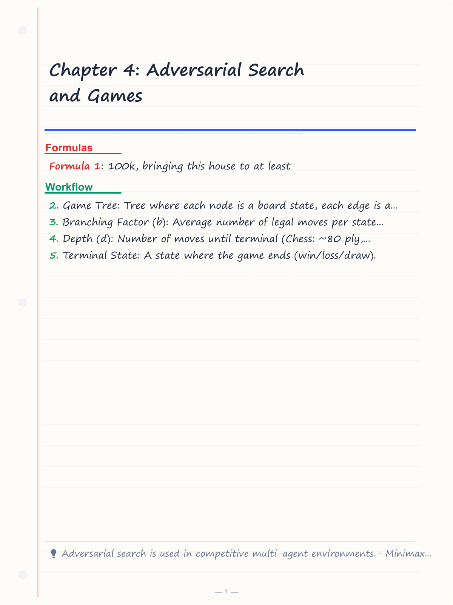
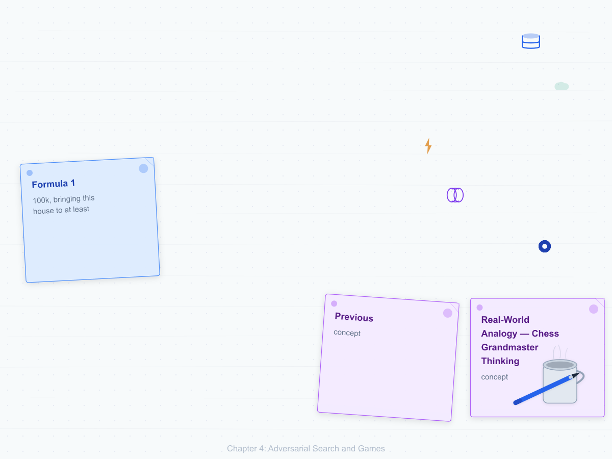
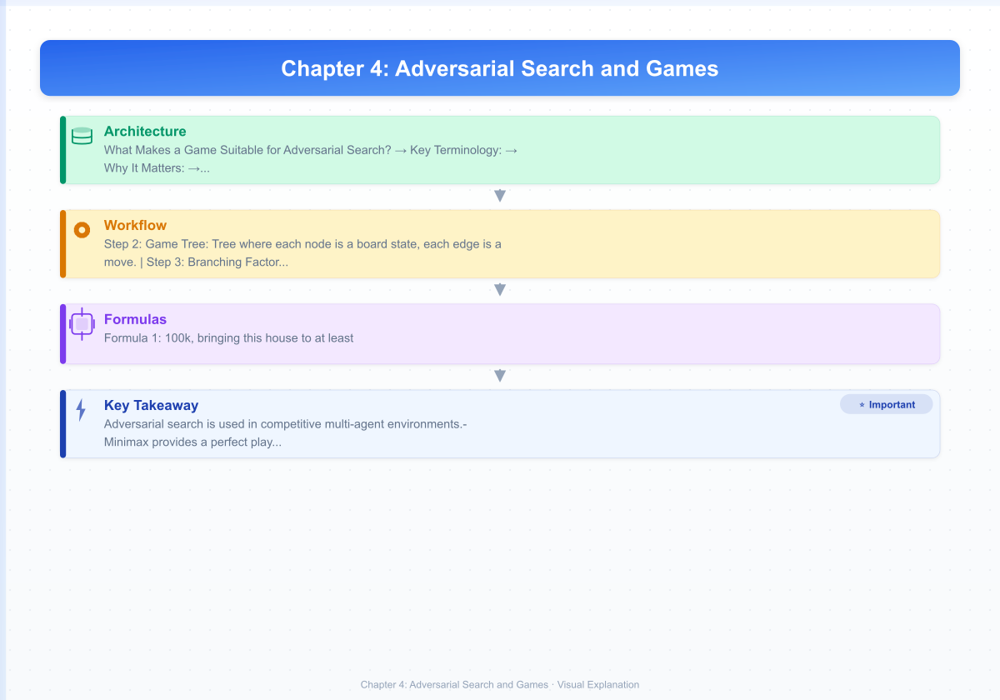
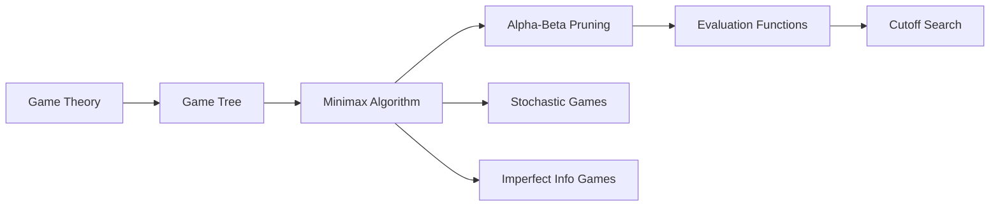

# Chapter 4: Adversarial Search and Games

**Previous:** [Chapter 3: Informed Search and Heuristics](03-informed-search.md) | **Next:** [Chapter 5: Constraint Satisfaction Problems](05-csp.md)

---

## Learning Objectives

- Define the properties of zero-sum, perfect information games.
- Explain the Minimax algorithm and its use in decision-making for two-player games.
- Implement Alpha-Beta pruning to improve the efficiency of adversarial search.
- Evaluate the impact of heuristic evaluation functions on game-playing performance.
- Discuss the challenges of games with imperfect information or stochastic elements.

<!-- Image Gallery -->
<section class="lesson-visuals" aria-label="Visual learning resources">
  <header><span>VISUAL LEARNING</span><h2>See it. Review it. Remember it.</h2></header>
  <a class="lesson-visual-card" href="../../assets/images/lessons/artificial-intelligence/04-adversarial-search/handwritten-notes.png" target="_blank" rel="noopener">
    
    <span><strong>Handwritten notes</strong>Condensed notes for deliberate review.</span>
  </a>
  <a class="lesson-visual-card" href="../../assets/images/lessons/artificial-intelligence/04-adversarial-search/sticky-notes.png" target="_blank" rel="noopener">
    
    <span><strong>Sticky-note revision</strong>Fast recall prompts for revision.</span>
  </a>
  <a class="lesson-visual-card" href="../../assets/images/lessons/artificial-intelligence/04-adversarial-search/visual-explanation.png" target="_blank" rel="noopener">
    
    <span><strong>Visual concept guide</strong>A connected explanation of the key ideas.</span>
  </a>
</section>
<!-- End Image Gallery -->


---

## Why Adversarial Search Matters

> **Real-World Analogy — Chess Grandmaster Thinking:** Imagine you are playing a game of chess against a grandmaster. You are not just planning your own attack — you are constantly asking: *"If I move my knight here, what will my opponent do? Then how will I respond? What will they do next?"* This chain of "if-then" reasoning, where you assume your opponent will always pick the move that hurts you the most, is precisely what adversarial search algorithms model. From Stockfish defeating world champions to AlphaGo mastering the ancient game of Go, every competitive AI in history relies on the fundamental ideas in this chapter.

Adversarial search is the branch of AI that tackles **competitive environments** — situations where multiple agents have conflicting goals. Unlike the single-agent search problems in Chapters 2–3 (where the world is passive), adversarial search assumes an **active opponent** actively working against you. This makes it both harder (the search space explodes) and more interesting (you must reason about another agent's strategy).

---

## Chapter at a Glance

| Section | Key Topics | Key Terms |
|---------|-----------|-----------|
| Game Theory Fundamentals | Zero-sum, perfect information, game tree | Utility function, terminal state, branching factor |
| Minimax Algorithm | Optimal play, MAX/MIN recursion | Backup value, minimax value, full-tree search |
| Alpha-Beta Pruning | α/β bounds, pruning rule, move ordering | Pruning, cutoff, best-first ordering |
| Imperfect Information Games | Hidden cards, stochastic outcomes | Expectiminimax, chance nodes, probability-weighted |
| Evaluation Functions | Cutoff search, Eval(s) | Quiescence, horizon effect, material balance |

---

## Chapter Roadmap



---

## Theory


---

### 1. Game Theory Fundamentals


> **Real-World Analogy — Poker vs Chess:** In chess, both players see the entire board (perfect information). In poker, you cannot see your opponent's hand (imperfect information). Most AI game-playing research starts with the simpler chess-like scenario: **deterministic, turn-based, two-player, zero-sum, perfect-information** games. This is the cleanest setting to understand adversarial reasoning.

**What Makes a Game Suitable for Adversarial Search?**

| Property | Definition | Example |
|----------|-----------|---------|
| Zero-sum | One player's gain = other player's loss | Chess, Checkers, Tic-Tac-Toe |
| Perfect Information | Both players see the full state | Chess, Go, Checkers |
| Deterministic | No dice, no randomness | Chess, Checkers |
| Turn-based | Players alternate moves | Most board games |
| Finite | Game ends after finite moves | All games with terminal states |

**Key Terminology:**
- **Game Tree:** Tree where each node is a board state, each edge is a move.
- **Branching Factor (b):** Average number of legal moves per state (Chess: ~35, Go: ~250).
- **Depth (d):** Number of moves until terminal (Chess: ~80 ply, Tic-Tac-Toe: ~9).
- **Terminal State:** A state where the game ends (win/loss/draw).
- **Utility Function:** Maps terminal states to numeric payoffs (win = +1, loss = -1, draw = 0).
- **Ply:** One half-move (a single player's turn). Two ply = one full round.

**Why It Matters:** The game tree size is \( b^d \) — exponential in depth. For Chess: \( 35^{80} \) states. This staggering number is *why* we need smarter search than brute-force.

---

### 2. Minimax Algorithm


> **Real-World Analogy — Buyer vs Seller Negotiation:** Imagine you are selling a used car and a buyer is negotiating. You want the highest price (MAX), the buyer wants the lowest (MIN). You propose $10,000. The buyer can either accept or counter-offer. If they counter, you can accept, reject, or counter again. The minimax algorithm models exactly this adversarial back-and-forth, assuming the buyer always picks the option that leaves you worst off — and you plan accordingly.

**Definition:** The Minimax algorithm computes the optimal move for a player (MAX) assuming the opponent (MIN) also plays optimally. It is a **recursive depth-first search** over the game tree.

**Algorithm Steps:**

| Step | Description |
|------|-------------|
| 1 | Generate the complete game tree from the current state to all terminal states |
| 2 | Assign utility values to each terminal state (win = +1, loss = -1, draw = 0 for MAX) |
| 3 | Propagate values upward: at MAX nodes, take the **maximum** of children's values |
| 4 | At MIN nodes, take the **minimum** of children's values |
| 5 | When value reaches the root, MAX selects the move leading to the highest-value child |

**Pseudocode:**

```
function MINIMAX(state):
    if state is TERMINAL:
        return UTILITY(state)
    
    if state is MAX_NODE:
        value = -∞
        for each successor in SUCCESSORS(state):
            value = MAX(value, MINIMAX(successor))
        return value
    
    if state is MIN_NODE:
        value = +∞
        for each successor in SUCCESSORS(state):
            value = MIN(value, MINIMAX(successor))
        return value
```

**Step-by-Step Dry Run — Tic-Tac-Toe Endgame:**

Consider a simplified game tree where MAX (X) has two possible moves, each leading to a MIN (O) response.

```
                Root (MAX)
               /          \
          Node A (MIN)   Node B (MIN)
          /     \         /     \
        +1      -1      0      +1
```

**Trace Table (Depth-First Order):**

| Step | Current Node | Node Type | Children Values | Chosen | Returned |
|------|-------------|-----------|----------------|--------|----------|
| 1 | Leaf L1 (A1) | Terminal | — | — | +1 |
| 2 | Leaf L2 (A2) | Terminal | — | — | -1 |
| 3 | Node A | MIN | [+1, -1] | min = -1 | -1 |
| 4 | Leaf L3 (B1) | Terminal | — | — | 0 |
| 5 | Leaf L4 (B2) | Terminal | — | — | +1 |
| 6 | Node B | MIN | [0, +1] | min = 0 | 0 |
| 7 | Root | MAX | [-1, 0] | max = 0 | **0** |

**Result:** MAX chooses move B (value = 0 → draw) rather than move A (value = -1 → loss).

**Python Implementation:**

```python
def minimax(board, depth, is_maximizing):
    """Minimax algorithm for a two-player game.
    
    Args:
        board: Current game state object
        depth: Remaining search depth
        is_maximizing: True if current player is MAX
        
    Returns:
        Best utility value achievable from this state
    """
    # Base case: terminal state or depth limit reached
    result = board.check_winner()
    if result is not None:
        return result  # +1 for MAX win, -1 for MIN win, 0 for draw
    if depth == 0:
        return evaluate(board)  # Heuristic evaluation
    
    if is_maximizing:
        best_value = -float('inf')
        for move in board.get_legal_moves():
            board.make_move(move)
            value = minimax(board, depth - 1, False)
            board.undo_move(move)
            best_value = max(best_value, value)
        return best_value
    else:
        best_value = float('inf')
        for move in board.get_legal_moves():
            board.make_move(move)
            value = minimax(board, depth - 1, True)
            board.undo_move(move)
            best_value = min(best_value, value)
        return best_value


def find_best_move(board, depth):
    """Find the best move for MAX player."""
    best_value = -float('inf')
    best_move = None
    for move in board.get_legal_moves():
        board.make_move(move)
        value = minimax(board, depth - 1, False)
        board.undo_move(move)
        if value > best_value:
            best_value = value
            best_move = move
    return best_move
```

**Complexity Analysis:**

| Metric | Value | Why? |
|--------|-------|------|
| Time | \( O(b^d) \) | Every node in the game tree must be visited — exponential in depth |
| Space | \( O(b \cdot d) \) | Depth-first recursion stack plus branching factor for state generation |
| Complete? | Yes (finite trees) | Will always find a move if the game tree is finite |
| Optimal? | Yes | Returns the theoretically optimal move assuming perfect opponent play |

**Why Exponential?** At each of \( d \) levels, the branching factor \( b \) multiplies the number of nodes. Chess: \( b \approx 35 \), \( d \approx 80 \) → \( 35^{80} \) states. Even at 1 trillion nodes/second, the universe would end before this finishes. This is why raw minimax is only usable for trivial games.

**Advantages & Disadvantages:**

| Advantages | Disadvantages |
|-----------|-------------|
| Guarantees optimal play for finite zero-sum games | Exponential time complexity — unusable for deep games |
| Simple recursive implementation | Requires full game tree — impractical for Chess/Go |
| Provably correct under assumptions | Assumes opponent always plays optimally (no exploitation) |
| Foundation for all modern game AI | Cannot handle chance nodes or hidden information |
| Easy to parallelize across branches | Every node evaluated even when irrelevant |

**Edge Cases:**

| Edge Case | Problem | Solution |
|-----------|---------|----------|
| Terminal node at search start | Game already over | Check terminal before recursing |
| No legal moves | Stalemate / draw | Return 0 (draw) immediately |
| Depth limit reached | Cut off before terminal | Use heuristic evaluation function |
| Multiple optimal moves | Indifferent choice | Pick first, random, or use secondary heuristic |
| Infinite loop (repeated states) | Cycles in game graph | Use transposition table + visited set |
| Transpositions (same state via different paths) | Repeated work | Cache results in transposition table (hash map) |

---

### 3. Alpha-Beta Pruning


> **Real-World Analogy — Real Estate Shopping:** You are house-hunting. You see a house listed at $500,000 and love it — it is your current best find (α = 500k). Now you tour another house. The realtor shows you the kitchen, then mentions the foundation has cracks. You immediately know fixing the foundation will cost $100k, bringing this house to at least $600k. You stop the tour — there is no need to see the bedrooms because the house is already worse than your current best. This is exactly how alpha-beta pruning works: once a branch proves it cannot beat the current best option, you **prune** it without further exploration.

**Definition:** Alpha-Beta pruning is an enhancement to Minimax that avoids exploring branches that cannot possibly influence the final decision. It maintains two bounds — α (the best MAX can guarantee) and β (the best MIN can guarantee) — and prunes subtrees when α ≥ β.

**Algorithm Steps:**

| Step | Description |
|------|-------------|
| 1 | Perform depth-first minimax search as normal |
| 2 | Maintain α = best value found so far for MAX (initialized to -∞) |
| 3 | Maintain β = best value found so far for MIN (initialized to +∞) |
| 4 | At each node, pass current α and β to children |
| 5 | After evaluating a child, update α (at MAX nodes) or β (at MIN nodes) |
| 6 | If at any point α ≥ β, **prune** remaining children — they cannot affect the result |
| 7 | Return the node's minimax value as usual |

**Pseudocode:**

```
function ALPHA-BETA(state, α, β):
    if state is TERMINAL:
        return UTILITY(state)
    
    if state is MAX_NODE:
        value = -∞
        for each successor in SUCCESSORS(state):
            value = MAX(value, ALPHA-BETA(successor, α, β))
            if value ≥ β:
                return value    // β prune
            α = MAX(α, value)
        return value
    
    if state is MIN_NODE:
        value = +∞
        for each successor in SUCCESSORS(state):
            value = MIN(value, ALPHA-BETA(successor, α, β))
            if value ≤ α:
                return value    // α prune
            β = MIN(β, value)
        return value
```

**Step-by-Step Dry Run — Full Trace with α/β Bounds:**

Consider this game tree (depth = 3, MIN at middle level):

```
                Root (MAX)  α=-∞, β=+∞
               /           \
          Node A (MIN)    Node B (MIN)
         /   |   \        /   |   \
        3    12   8      2   14   5
```

**Trace Table:**

| Step | Node | Type | α | β | Child Val | Action | State |
|------|------|------|----|----|-----------|--------|-------|
| 1 | Root | MAX | -∞ | +∞ | — | Descend to A | Exploring A |
| 2 | A | MIN | -∞ | +∞ | — | Descend to A1 | |
| 3 | A1 | Leaf | — | — | 3 | Return 3 | |
| 4 | A | MIN | -∞ | +∞ | 3 | β = min(+∞, 3) = 3 | β updated |
| 5 | A | MIN | -∞ | 3 | — | Descend to A2 | |
| 6 | A2 | Leaf | — | — | 12 | Return 12 | |
| 7 | A | MIN | -∞ | 3 | 12 | β = min(3, 12) = 3 | β unchanged |
| 8 | A | MIN | -∞ | 3 | — | Descend to A3 | |
| 9 | A3 | Leaf | — | — | 8 | Return 8 | |
| 10 | A | MIN | -∞ | 3 | 8 | β = min(3, 8) = 3 | β unchanged |
| 11 | A | MIN | -∞ | 3 | — | Return 3 | A evaluated |
| 12 | Root | MAX | -∞ | +∞ | 3 | α = max(-∞, 3) = 3 | α updated |
| 13 | Root | MAX | 3 | +∞ | — | Descend to B | Exploring B |
| 14 | B | MIN | 3 | +∞ | — | Descend to B1 | |
| 15 | B1 | Leaf | — | — | 2 | Return 2 | |
| 16 | B | MIN | 3 | +∞ | 2 | β = min(+∞, 2) = 2 | β updated |
| 17 | B | MIN | 3 | 2 | — | α ≥ β → **PRUNE!** | B2 and B3 skipped |
| 18 | B | MIN | 3 | 2 | — | Return 2 | Pruned result |
| 19 | Root | MAX | 3 | +∞ | 2 | α = max(3, 2) = 3 | α unchanged |
| 20 | Root | MAX | 3 | +∞ | — | **Return 3, choose move A** | |

**Key Observation:** Nodes B2 (14) and B3 (5) were **never visited**. Without pruning, minimax would evaluate all 7 leaf nodes. With alpha-beta, only 5 leaf nodes were visited — a 28% savings on this tiny tree. On larger trees, savings approach 50% with optimal ordering.

**Python Implementation:**

```python
def alpha_beta(board, depth, alpha, beta, is_maximizing):
    """Alpha-Beta pruning for a two-player game.
    
    Args:
        board: Current game state
        depth: Remaining search depth
        alpha: Best value MAX can guarantee (upper bound for MIN)
        beta: Best value MIN can guarantee (lower bound for MAX)
        is_maximizing: True if current player is MAX
        
    Returns:
        Best utility value from this state
    """
    result = board.check_winner()
    if result is not None:
        return result
    if depth == 0:
        return evaluate(board)
    
    if is_maximizing:
        best_value = -float('inf')
        for move in board.get_legal_moves():
            board.make_move(move)
            value = alpha_beta(board, depth - 1, alpha, beta, False)
            board.undo_move(move)
            best_value = max(best_value, value)
            alpha = max(alpha, value)
            if beta <= alpha:
                break  # β prune
        return best_value
    else:
        best_value = float('inf')
        for move in board.get_legal_moves():
            board.make_move(move)
            value = alpha_beta(board, depth - 1, alpha, beta, True)
            board.undo_move(move)
            best_value = min(best_value, value)
            beta = min(beta, value)
            if beta <= alpha:
                break  # α prune
        return best_value


def find_best_move_alpha_beta(board, depth):
    """Find best move using alpha-beta pruning."""
    best_value = -float('inf')
    best_move = None
    alpha = -float('inf')
    beta = float('inf')
    
    # Sort moves by heuristic for better pruning (move ordering)
    moves = board.get_legal_moves()
    moves = sorted(moves, key=lambda m: board.move_heuristic(m), reverse=True)
    
    for move in moves:
        board.make_move(move)
        value = alpha_beta(board, depth - 1, alpha, beta, False)
        board.undo_move(move)
        if value > best_value:
            best_value = value
            best_move = move
        alpha = max(alpha, value)
    return best_move
```

**Complexity Analysis:**

| Metric | Best Case | Worst Case | Average Case |
|--------|-----------|------------|--------------|
| Time | \( O(b^{d/2}) \) | \( O(b^d) \) — same as Minimax | \( O(b^{3d/4}) \) |
| Space | \( O(b \cdot d) \) | \( O(b \cdot d) \) | \( O(b \cdot d) \) |

**Why Best Case is \( O(b^{d/2}) \):** With perfect move ordering (best moves evaluated first), alpha-beta prunes approximately half the tree levels. This effectively doubles the searchable depth compared to naive minimax for the same computational budget.

**Why Worst Case is \( O(b^d) \):** With worst move ordering (worst moves first), no pruning occurs at all. The algorithm degenerates to plain minimax.

**Key Insight for Efficiency:** Move ordering is *everything*. Evaluate likely-best moves first. Common strategies:
- **Killer heuristic:** Moves that caused pruning at one depth are tried first at sibling depths.
- **History heuristic:** Track which moves caused cutoffs most frequently.
- **Iterative deepening:** Search depth 1, then 2, then 3... using previous depth's best move as the first candidate.

**Advantages & Disadvantages:**

| Advantages | Disadvantages |
|-----------|-------------|
| Much faster than Minimax in practice (can double search depth) | Performance depends heavily on move ordering |
| Returns exactly the same result as Minimax (no approximation) | Worst case = same as plain Minimax |
| Simple to implement as a wrapper around Minimax | Complex to parallelize efficiently (shared α/β bounds) |
| Memory efficient (depth-first) | Ineffective if branching factor is small |
| Widely used in real game engines (Stockfish) | Cannot handle chance nodes or imperfect information |

**Edge Cases:**

| Edge Case | Problem | Solution |
|-----------|---------|----------|
| α = β at root | All moves equally good | Pick any or use secondary heuristic |
| Zero-width window (α = β) | Null window search | Used for scout search — test if move exceeds bound |
| Negative infinity pruning | No initial bounds known | Start α = -∞, β = +∞ |
| Transposition interference | Same state, different α/β | Store bounds in transposition table |
| Deep pruning cascade | One prune enables deeper prunes | Recursive bound tightening |
| Fail-soft vs fail-hard | Returning values outside [α, β] | Fail-soft may return tighter bounds for parent |

---

### 4. Minimax vs Alpha-Beta — Comparison Table


| Feature | Minimax | Alpha-Beta |
|---------|:-------:|:----------:|
| Result | Optimal | **Identical** to Minimax |
| Nodes Visited | All \( b^d \) | \( b^{d/2} \) to \( b^d \) (depends on ordering) |
| Search Depth (same time) | \( d \) | Up to \( 2d \) with perfect ordering |
| Move Ordering Needed? | No | **Critical** for performance |
| Implementation Complexity | Low | Low (adds α/β params + pruning check) |
| Parallelizable? | Yes (trivially) | Moderate (shared bounds) |
| Memory | \( O(bd) \) | \( O(bd) \) |
| Handles Chance Nodes? | No | No (same limitation) |
| Used in Production Engines? | Only for trivial games | **Yes** (Stockfish, Leela, etc.) |

---

### 5. Evaluation Functions and Cutoff Search


> **Real-World Analogy — Military General's Intel:** A general cannot see every possible battlefield outcome 20 moves ahead. Instead, they evaluate the current situation: troop strength, supply lines, terrain advantage. This is exactly an evaluation function — a fast, approximate measure of how "good" a position looks, without simulating the entire future.

**Definition:** An evaluation function \( Eval(s) \) estimates the utility of a non-terminal state \( s \) from MAX's perspective. It replaces the full tree search to terminal states with a heuristic estimate.

**Properties of a Good Evaluation Function:**

| Property | Explanation |
|----------|-------------|
| **Accuracy** | Should correlate strongly with actual winning chances |
| **Speed** | Must be computable in microseconds (called millions of times) |
| **Consistency** | Small changes in state → small changes in evaluation |
| **Symmetry** | \( Eval(s) \) for MAX = \( -Eval(s) \) for MIN in zero-sum games |

**Example — Chess Evaluation Function:**

```
Eval(s) = MaterialBalance + PositionalScore + KingSafety + PawnStructure

MaterialBalance = 9*(#Queens_MAX - #Queens_MIN)
                + 5*(#Rooks_MAX - #Rooks_MIN)
                + 3*(#Bishops_MAX - #Bishops_MIN + #Knights_MAX - #Knights_MIN)
                + 1*(#Pawns_MAX - #Pawns_MIN)
```

Piece values: Pawn=1, Knight=3, Bishop=3, Rook=5, Queen=9. King is priceless (game ends if lost).

**The Horizon Effect:**

A critical failure mode of cutoff search: a catastrophic consequence (e.g., losing the queen in chess) may be pushed just beyond the search depth by a clever sequence of moves, making a position appear artificially good.

**Mitigation Techniques:**

| Technique | How It Works |
|-----------|-------------|
| Quiescence Search | Continue searching until the position is "quiet" (no captures, checks) |
| Singular Extensions | Search deeper when one move is clearly better than alternatives |
| Iterative Deepening | Increase depth gradually; horizon pushes out naturally |
| Recursive Horizon Detection | Analyze the "threat" that was just pushed over |

---

### 6. Games with Imperfect Information and Stochastic Elements


> **Real-World Analogy — Poker:** Unlike chess, poker players cannot see their opponent's cards. Decisions must account for probabilities ("there is a 30% chance my opponent has a flush") and bluffing (intentional misinformation). This makes the game fundamentally harder — the optimal strategy is no longer a single move but a **probability distribution over moves**.

**Stochastic Games (With Chance):** Games like Backgammon include dice rolls. The game tree has **chance nodes** where the outcome is probabilistic.

**Expectiminimax Algorithm:**

```
function EXPECTIMINIMAX(state):
    if state is TERMINAL:
        return UTILITY(state)
    
    if state is MAX_NODE:
        return MAX over children of EXPECTIMINIMAX(child)
    
    if state is MIN_NODE:
        return MIN over children of EXPECTIMINIMAX(child)
    
    if state is CHANCE_NODE:
        return SUM over children of P(child) * EXPECTIMINIMAX(child)
```

**Complexity:** \( O(b^d \cdot n^d) \) where \( n \) is the number of chance outcomes per chance node — significantly worse than standard minimax.

**Imperfect Information (Hidden Cards):** Games like Poker, Bridge, and Stratego require reasoning about **belief states** — sets of possible world states consistent with observations.

**Key Challenges:**

| Challenge | Description | AI Approach |
|-----------|-------------|-------------|
| Information Revelation | New info arrives unpredictably | Bayesian updating of belief states |
| Bluffing | Deliberate misinformation | Game-theoretic equilibrium strategies |
| Opponent Modeling | Infer hidden state from actions | Counterfactual regret minimization (CFR) |
| State Uncertainty | Multiple possible current states | Averaging evaluation across belief states |

---

## Summary

- Adversarial search is used in competitive multi-agent environments.
- Minimax provides a perfect play strategy for zero-sum games with perfect information.
- The complexity of games is often measured by their branching factor and depth.
- Alpha-Beta pruning can theoretically double the depth of search compared to pure Minimax.
- Evaluation functions are the "intelligence" in practical game-playing agents.
- Move ordering is the single most important optimization for alpha-beta effectiveness.
- Real-time games require iterative deepening, transposition tables, and quiescence search to manage state explosions.
- Stochastic and imperfect-information games require Expectiminimax or counterfactual regret minimization.

---

## Concept Comparison

| Algorithm | Complete? | Optimal? | Space | Key Feature |
|-----------|:---:|:---:|:---:|-------------|
| Minimax | ✅ (finite tree) | ✅ | O(bd) | Full tree, both players optimal |
| Alpha-Beta | ✅ (same as Minimax) | ✅ | O(bd) | Prunes irrelevant branches |
| Expectiminimax | ✅ | ✅ (max expected) | O(bⁿd) | Chance nodes with probabilities |
| MCTS | ❌ (asymptotically complete) | ❌ (approximate) | Variable | Selective sampling via UCT |
| CFR | ✅ (tabular) | ✅ (Nash equilibrium) | Large | Regret minimization for imperfect info |

---

## Quick Reference — Alpha-Beta Parameters

| Parameter | Meaning | Initial Value | Update Rule |
|-----------|---------|:---:|-------------|
| α (Alpha) | Best value for MAX along path | -∞ | α ← max(α, v) |
| β (Beta) | Best value for MIN along path | +∞ | β ← min(β, v) |
| Pruning condition | α ≥ β | — | Skip remaining children |

---

## Cross-Application Matrix

| Technique | ML Engineering | Computer Vision | NLP | Research |
|-----------|:---:|:---:|:---:|:---:|
| Minimax | ⬜ | ⬜ | ⬜ | ✅ |
| Alpha-Beta | ⬜ | ⬜ | ⬜ | ✅ |
| MCTS | ✅ | ⬜ | ⬜ | ✅ |
| Expectiminimax | ⬜ | ⬜ | ⬜ | ✅ |
| Evaluation Functions | ✅ | ✅ | ⬜ | ⬜ |
| Transposition Tables | ✅ | ✅ | ✅ | ⬜ |

---

## Interview Corner

Common adversarial search questions in technical interviews and their expert answers:

**Q1: How much faster is Alpha-Beta than Minimax?**
> In the best case (perfect move ordering), alpha-beta cuts the effective branching factor from \( b \) to \( \sqrt{b} \), reducing node count from \( b^d \) to \( b^{d/2} \). This doubles the searchable depth for the same compute budget. In practice with good move ordering, Stockfish achieves about 85–95% of this theoretical maximum.

**Q2: What makes a good evaluation function?**
> Three properties: (1) **Accuracy** — it must correlate with actual winning probability; (2) **Speed** — it is called at every leaf node, potentially millions of times per search; (3) **Differentiability** — small move differences should produce proportional evaluation differences. Material balance alone (piece counting) gets about 70% accuracy in chess; adding position tables, pawn structure, and king safety pushes it above 90%.

**Q3: What is the horizon effect and how do you fix it?**
> The horizon effect occurs when a negative consequence (e.g., losing the queen) is pushed just beyond the search depth by a sequence of forcing moves (checks, captures). The search sees an artificially positive evaluation because it cannot see the coming disaster. **Solutions:** quiescence search (extend search until position is "quiet"), singular extensions (extend branches with one standout move), and iterative deepening (each deeper iteration pushes the horizon further).

**Q4: How do transposition tables improve game-tree search?**
> Transposition tables cache the evaluation of already-seen states using Zobrist hashing. The same chess position can be reached through different move sequences (e.g., 1.e4 e5 2.Nf3 vs 1.Nf3 e5 2.e4). Without a transposition table, both paths are explored independently. With one, the second encounter is a cache hit — saving an entire subtree. Stockfish's transposition table hits 40–60% of lookups in the middle game.

**Q5: Can Alpha-Beta pruning be combined with Monte Carlo Tree Search?**
> Not directly — MCTS uses statistical sampling (UCB1 selection), not depth-first minimax with α/β bounds. However, hybrid approaches exist: **AlphaZero** uses MCTS with a neural network evaluation function, achieving superhuman performance at Go, Chess, and Shogi. The α/β idea lives on in the "backup" phase of MCTS, where node values are propagated upward (though as visit counts and average rewards, not minimax values).

---

## Applications in Real Systems

| System | Game | Technique Used | Impact |
|--------|------|---------------|--------|
| **Stockfish** | Chess | Alpha-Beta + iterative deepening + transposition tables + hand-crafted evaluation (~350 rules) | Highest-rated chess engine (~3600 Elo), open-source, runs on commodity hardware |
| **Leela Chess Zero** | Chess | MCTS + neural network evaluation (self-play training) | ~3500 Elo, demonstrates MCTS parity with alpha-beta at elite levels |
| **AlphaGo** | Go | MCTS + deep neural networks (policy + value networks) | First AI to beat a world champion (Lee Sedol, 2016), move 37 in game 2 was "beautiful" per professionals |
| **AlphaZero** | Go, Chess, Shogi | MCTS + single neural network, pure self-play | Generalized superhuman performance, no human knowledge, discovered novel strategies |
| **DeepBlue** | Chess | Alpha-Beta + custom ASIC chips + grandmaster opening book | First computer to beat a reigning world champion (Kasparov, 1997) |
| **Pluribus** | Poker (No-Limit Texas Hold'em) | Counterfactual Regret Minimization (CFR) + real-time abstraction | First superhuman AI in multi-player poker with imperfect information |
| **Libratus** | Poker (Heads-Up No-Limit) | CFR + nested abstraction + self-play | Beat four professional poker players in 2017 |
| **MuZero** | Atari, Chess, Go, Shogi | Learned model (no rules given) + MCTS | Mastered games without knowing the rules — learned everything from experience |
| **Video Game AI (OpenAI Five)** | Dota 2 | PPO + LSTM + self-play (~60k years of gameplay) | Beat world champions, coordinates 5 heroes with imperfect information |
| **StarCraft II (AlphaStar)** | StarCraft II | Transformer + deep RL + MCTS-like tree search | Grandmaster level, manages imperfect information (fog of war) |

**How Stockfish Uses Alpha-Beta in Practice:**

1. **Iterative Deepening:** Starts at depth 1, incrementally increases. If search is interrupted, the best move from the deepest completed depth is returned.
2. **Move Ordering:** Captures first (MVV-LVA — Most Valuable Victim, Least Valuable Attacker), then killer moves, then history heuristic, then remaining moves.
3. **Null-Move Pruning:** Skip a turn and see if the position is still good — if even after "passing" the evaluation holds, the branch is safe to prune.
4. **Late Move Reductions (LMR):** Moves later in the ordering are searched at reduced depth unless they prove promising.
5. **Transposition Table:** Zobrist-hashed entries store depth, score, flag (exact/lower/upper bound) and best move.

---

## Chapter Quiz

**Q1:** In the Minimax algorithm, what value does a MAX node return?
- A) The minimum of its children's values
- B) The maximum of its children's values
- C) The average of its children's values
- D) The sum of its children's values

<details><summary>Answer&lt;/summary&gt;B) MAX nodes select the child with the highest backed-up value.</details>

**Q2:** What condition triggers alpha-beta pruning?
- A) When α ≤ β
- B) When α ≥ β
- C) When search depth exceeds limit
- D) When all nodes are evaluated

<details><summary>Answer&lt;/summary&gt;B) Pruning occurs when α ≥ β, meaning the current branch cannot affect the final decision.</details>

**Q3:** What is the "horizon effect"?
- A) The game tree is too deep to search completely
- B) A negative side effect of a move is pushed beyond the search depth
- C) Alpha-beta only works for shallow trees
- D) The branching factor increases at deeper levels

<details><summary>Answer&lt;/summary&gt;B) The horizon effect occurs when a detrimental consequence is pushed beyond the search cutoff depth, making a move appear better than it actually is.</details>

**Q4:** Which factor most significantly impacts Alpha-Beta pruning efficiency?
- A) The programming language used
- B) The order in which moves are evaluated
- C) The size of the game board
- D) The number of players

<details><summary>Answer&lt;/summary&gt;B) Move ordering is the single most important factor. Best-first ordering can achieve \( b^{d/2} \) complexity; worst-first degrades to \( b^d \).</details>

**Q5:** What distinguishes Expectiminimax from Minimax?
- A) Expectiminimax uses a different utility function
- B) Expectiminimax adds chance nodes with probabilistic outcomes
- C) Expectiminimax only works for single-player games
- D) Expectiminimax is always faster

<details><summary>Answer&lt;/summary&gt;B) Expectiminimax introduces chance nodes that average child values weighted by their probabilities, handling games with random elements like dice (Backgammon) or shuffled cards.</details>

---

## Exercises

### Review Questions

1. Why is the Minimax algorithm called "zero-sum"?
2. Explain the meaning of α and β in pruning.
3. What is "quiescence search" and why is it used?
4. How do stochastic games (like Backgammon) differ from deterministic games (like Chess)?
5. Explain why move ordering is critical for alpha-beta pruning but irrelevant for minimax.

### Application Problems

1. Draw a game tree for a simple game of Tic-Tac-Toe and calculate Minimax values for the first three moves.
2. Given a tree with leaf values [3, 5, 2, 9, 12, 5, 23, 23], trace the Alpha-Beta pruning process. Which nodes are skipped and why?
3. Design a simple evaluation function for a Connect Four game.
4. For a game tree with branching factor b=20 and depth d=10, calculate the number of nodes visited by (a) Minimax, (b) Alpha-Beta in the best case, and (c) Alpha-Beta with 50% pruning efficiency.

### Challenge Problem

1. **Horizon Effect Analysis:** Discuss the "Horizon Effect" in game playing. How can an agent be tricked into making a bad move by pushing an inevitable loss just beyond its search depth? Propose two methods to mitigate this effect, and implement the quiescence search mitigation in pseudocode.

2. **Transposition Table Design:** Design a transposition table for a game-tree search. Explain the Zobrist hashing scheme, what information should be stored per entry (depth, score, flag, best move), and how to handle hash collisions. Why is a 64-bit Zobrist hash preferred over a 32-bit hash for transposition tables?
