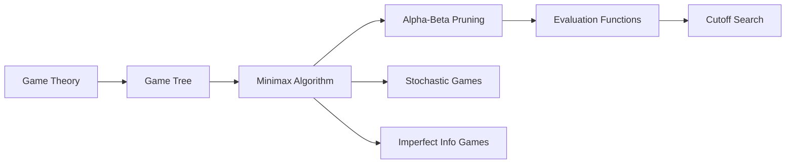

# Chapter 4: Adversarial Search and Games

**Previous:** [Chapter 3: Informed Search and Heuristics](03-informed-search.md) | **Next:** [Chapter 4: Constraint Satisfaction Problems](04-csp.md)

---

## Learning Objectives

- Define the properties of zero-sum, perfect information games.
- Explain the Minimax algorithm and its use in decision-making for two-player games.
- Implement Alpha-Beta pruning to improve the efficiency of adversarial search.
- Evaluate the impact of heuristic evaluation functions on game-playing performance.
- Discuss the challenges of games with imperfect information or stochastic elements.

---

## Chapter at a Glance

| Section | Key Topics | Key Terms |
|---------|-----------|-----------|
| Games in AI | Zero-sum, perfect information | Competitive environment, game tree |
| Minimax Algorithm | Optimal play, MAX/MIN | Utility function, backup values |
| Alpha-Beta Pruning | α, β bounds, pruning rule | Pruning, move ordering |
| Evaluation Functions | Cutoff search, Eval(s) | Quiescence, horizon effect |

## Chapter Roadmap



---

## Theory


### Games in AI
> **One-Sentence Takeaway:** Adversarial search models competitive environments where multiple agents have opposing goals — the standard framework is zero-sum, perfect-information games.

In AI, "games" usually refers to competitive environments where multiple agents have conflicting goals. The most common type is a **zero-sum game** with **perfect information**:
- **Zero-sum**: One player's gain is the other's loss.
- **Perfect information**: All players know the complete state of the game at all times.

> **💡 Pro Tip:** Minimax assumes your opponent plays optimally — always. In practice, this conservative assumption is correct for perfect-play games like Chess, but in games where opponents make mistakes, expectimax or risk-aware variants may perform better.

### The Minimax Algorithm
The Minimax algorithm determines the optimal move for a player assuming the opponent also plays optimally.
- **MAX Player**: Tries to maximize their score.
- **MIN Player**: Tries to minimize MAX's score (maximize their own).
- **Process**:
  1. Generate the complete game tree down to terminal states.
  2. Apply a utility function to terminal states.
  3. Back up values to the root:
     - For MAX nodes, take the maximum value of children.
     - For MIN nodes, take the minimum value of children.

> **One-Sentence Takeaway:** Minimax computes the optimal move assuming perfect opponent play, returning minimax values by backing up utilities from terminal states to the root.

### Alpha-Beta Pruning
Minimax explores many unnecessary branches. **Alpha-Beta pruning** allows the search to ignore branches that cannot possibly affect the final decision.
- **Alpha ($\alpha$)**: The value of the best (highest-value) choice found so far at any choice point along the path for MAX.
- **Beta ($\beta$)**: The value of the best (lowest-value) choice found so far at any choice point along the path for MIN.
- **Pruning Rule**: If $\alpha \ge \beta$, the current branch can be pruned.

### Heuristic Evaluation Functions
For complex games like Chess or Go, the game tree is too large to search to the end. Agents use **cutoff search** with an **evaluation function**:
- **Cutoff**: Stop searching at a certain depth.
- **Evaluation Function `Eval(s)`**: Estimates the desirability of non-terminal state `s`.

---

## Examples

### Example 1: Minimax on a Small Tree
Consider a 2-level game tree where MAX starts.
- **Step-by-step**:
  1. Root (MAX) has children A and B.
  2. A (MIN) has children with utilities 3 and 12. MIN chooses 3.
  3. B (MIN) has children with utilities 8 and 2. MIN chooses 2.
  4. Root (MAX) chooses between 3 and 2. MAX chooses 3.
- **Code snippet (Recursive Minimax)**:
```python
def minimax(node, depth, is_max):
    if depth == 0 or node.is_terminal():
        return node.utility
    if is_max:
        best_val = -float('inf')
        for child in node.children:
            best_val = max(best_val, minimax(child, depth - 1, False))
        return best_val
    else:
        best_val = float('inf')
        for child in node.children:
            best_val = min(best_val, minimax(child, depth - 1, True))
        return best_val
```
- **What it demonstrates**: The basic recursive structure of game tree search.

### Example 2: Alpha-Beta Pruning in Action
Suppose MAX is evaluating two moves, A and B.
- **Step-by-step**:
  1. MAX evaluates move A and finds its value is 10 ($\alpha = 10$).
  2. MAX starts evaluating move B. The first child of B (a MIN node) has a value of 5.
  3. Since MIN will choose at most 5 for move B, and MAX already has a better option (10), there is no need to evaluate the rest of B's children.
- **Expected result**: Branch B is pruned.
- **What it demonstrates**: How information from one part of the tree can prevent exploration of another.

---

## Summary

- Adversarial search is used in competitive multi-agent environments.
- Minimax provides a perfect play strategy for zero-sum games with perfect information.
- The complexity of games is often measured by their branching factor and depth.
- Alpha-Beta pruning can theoretically double the depth of search compared to pure Minimax.
- Evaluation functions are the "intelligence" in practical game-playing agents.
- Real-time games require efficient move ordering and transposition tables to manage state explosions.

---

## Concept Comparison

| Algorithm | Complete? | Optimal? | Space | Key Feature |
|-----------|:---:|:---:|:---:|-------------|
| Minimax | ✅ (finite tree) | ✅ | O(bd) | Full tree, both players optimal |
| Alpha-Beta | ✅ (same as Minimax) | ✅ | O(bd) | Prunes irrelevant branches |
| Expectiminimax | ✅ | ✅ (max expected) | O(b^d) | Chance nodes with probabilities |
| MCTS | ❌ (asymptotically complete) | ❌ (approximate) | Variable | Selective sampling via UCT |

## Quick Reference — Alpha-Beta Parameters

| Parameter | Meaning | Initial Value | Update Rule |
|-----------|---------|:---:|-------------|
| α (Alpha) | Best value for MAX along path | -∞ | α ← max(α, v) |
| β (Beta) | Best value for MIN along path | +∞ | β ← min(β, v) |
| Pruning condition | α ≥ β | — | Skip remaining children |

## Cross-Application Matrix

| Technique | ML Engineering | Computer Vision | NLP | Research |
|-----------|:---:|:---:|:---:|:---:|
| Minimax | ⬜ | ⬜ | ⬜ | ✅ |
| Alpha-Beta | ⬜ | ⬜ | ⬜ | ✅ |
| MCTS | ✅ | ⬜ | ⬜ | ✅ |
| Expectiminimax | ⬜ | ⬜ | ⬜ | ✅ |
| Evaluation Functions | ✅ | ✅ | ⬜ | ⬜ |

## Chapter Quiz

**Q1:** In the Minimax algorithm, what value does a MAX node return?
- A) The minimum of its children's values
- B) The maximum of its children's values
- C) The average of its children's values
- D) The sum of its children's values

<details><summary>Answer</summary>B) MAX nodes select the child with the highest backed-up value.</details>

**Q2:** What condition triggers alpha-beta pruning?
- A) When α ≤ β
- B) When α ≥ β
- C) When search depth exceeds limit
- D) When all nodes are evaluated

<details><summary>Answer</summary>B) Pruning occurs when α ≥ β, meaning the current branch cannot affect the final decision.</details>

**Q3:** What is the "horizon effect"?
- A) The game tree is too deep to search completely
- B) A negative side effect of a move is pushed beyond the search depth
- C) Alpha-beta only works for shallow trees
- D) The branching factor increases at deeper levels

<details><summary>Answer</summary>B) The horizon effect occurs when a detrimental consequence is pushed beyond the search cutoff depth, making a move appear better than it actually is.</details>

---

## Exercises

### Review Questions
1. Why is the Minimax algorithm called "zero-sum"?
2. Explain the meaning of $\alpha$ and $\beta$ in pruning.
3. What is "quiescence search" and why is it used?
4. How do stochastic games (like Backgammon) differ from deterministic games (like Chess)?

### Application Problems
1. Draw a game tree for a simple game of Tic-Tac-Toe and calculate Minimax values for the first three moves.
2. Given a tree with leaf values [3, 5, 2, 9, 12, 5, 23, 23], trace the Alpha-Beta pruning process. Which nodes are skipped?
3. Design a simple evaluation function for a Connect Four game.

### Challenge Problem
1. Discuss the "Horizon Effect" in game playing. How can an agent be tricked into making a bad move by pushing an inevitable loss just beyond its search depth? Propose a method to mitigate this effect.
