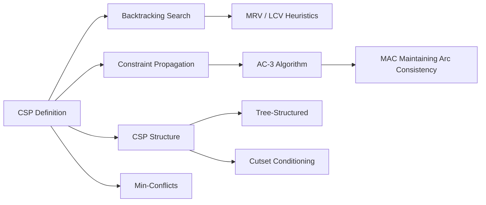

# Chapter 4: Constraint Satisfaction Problems

**Previous:** [Chapter 4: Adversarial Search and Games](04-adversarial-search.md) | **Next:** [Chapter 5: Constraint Satisfaction Problems](05-csp.md)

## Learning Objectives

By the conclusion of this chapter, the student will be able to: (1) formulate problems as constraint satisfaction problems; (2) apply backtracking search with heuristic ordering; (3) implement constraint propagation via arc consistency; (4) exploit problem structure for efficient solving; (5) apply iterative algorithms for large CSPs.

<!-- Image Gallery -->
<section class="lesson-visuals" aria-label="Visual learning resources">
  <header><span>VISUAL LEARNING</span><h2>See it. Review it. Remember it.</h2></header>
  <a class="lesson-visual-card" href="../../../assets/images/lessons/artificial-intelligence/04-csp/.png" target="_blank" rel="noopener">
    
    <span><strong>Handwritten notes</strong>Condensed notes for deliberate review.</span>
  </a>
  <a class="lesson-visual-card" href="../../../assets/images/lessons/artificial-intelligence/04-csp/.png" target="_blank" rel="noopener">
    
    <span><strong>Sticky-note revision</strong>Fast recall prompts for revision.</span>
  </a>
  <a class="lesson-visual-card" href="../../../assets/images/lessons/artificial-intelligence/04-csp/.png" target="_blank" rel="noopener">
    
    <span><strong>Visual concept guide</strong>A connected explanation of the key ideas.</span>
  </a>
</section>
<!-- End Image Gallery -->


## Why Constraint Satisfaction Matters

**Real-World Analogy — Scheduling University Classes:** Imagine you are the registrar at a university. You have 50 classes to schedule across 10 time slots and 20 rooms. Each professor can only teach during certain hours, no two classes can share the same room at the same time, some courses must be taken in sequence (prerequisite constraints), and some students must be able to take both AI and Machine Learning without a time conflict. This is a classic Constraint Satisfaction Problem (CSP). The variables are (class, time, room) triples, the domains are all possible time-room combinations, and the constraints capture every real-world restriction. Without a CSP framework, you would resort to brute-force enumeration — evaluating 20¹â�° possible room assignments alone. With CSP techniques (backtracking, forward checking, AC-3), you prune invalid branches early and find a feasible schedule in seconds instead of centuries. CSPs are the mathematical backbone of timetabling, Sudoku, register allocation in compilers, and even NASA's Deep Space Network antenna scheduling.

## Chapter at a Glance

| Section | Key Topics | Key Terms |
|---------|-----------|-----------|
| CSP Definition | Variables X, domains D, constraints C | Assignment, consistent, complete, solution |
| Backtracking Search | DFS variable assignment, MRV, LCV | Fail-first, forward checking |
| Constraint Propagation | Arc consistency, AC-3 | Node/arc/path consistency, MAC |
| CSP Structure | Tree-structured, cutset, treewidth | Topological order, tree decomposition |
| Iterative Algorithms | Min-conflicts heuristic | Local search, random restart |

## Chapter Roadmap



## CSP vs General Search

CSPs differ fundamentally from general search (DFS, BFS, A*):

| Aspect | General Search | Constraint Satisfaction |
|--------|:--------------:|:----------------------:|
| **State representation** | Opaque — states are atomic black boxes | Declarative — state = assignment of values to variables |
| **Goal test** | Application-specific function | All constraints satisfied |
| **Path matters?** | Yes — the sequence of actions matters | No — only the final assignment matters |
| **Action set** | Varies per state | Fixed: assign value to unassigned variable |
| **Commutativity** | Not commutative | Commutative — order of assignments irrelevant |
| **Branching factor** | Often small | Large (domain size × number of unassigned vars) |
| **Search space** | O(b^d) | O(d^n) where d = domain size, n = #variables |
| **Heuristics** | Domain-specific (admissible, consistent) | Domain-independent (MRV, LCV, forward checking) |
| **Completeness guarantee**| Varies by algorithm | Backtracking is complete; local search is not |

## Constraint Types

| Type | Scope | Example | Notation |
|------|-------|---------|----------|
| **Unary** | 1 variable | "WA cannot be red" | $C_1: WA \neq red$ |
| **Binary** | 2 variables | "WA and NT cannot have same color" | $C_2: WA \neq NT$ |
| **Global** | k variables (k ≥ 2) | "All seven territories must have distinct colors" | $C_3: Alldifferent(WA, NT, SA, Q, NSW, V, T)$ |
| **Preference (soft)** | arbitrary | "Avoid scheduling Prof. Smith at 8AM" | $C_4: minimize\ Smith\_8AM\_slots$ |

- **Unary constraints** reduce a variable's domain directly (e.g., "X ≠ red" removes red from D_X).
- **Binary constraints** relate variable pairs — the most common type, forming a constraint graph.
- **Global constraints** compactly represent complex interactions — $Alldifferent$ alone captures $\binom{k}{2}$ binary inequalities.

---

## 4.1 Definition of Constraint Satisfaction Problems


> **One-Sentence Takeaway:** A CSP is defined by variables X, domains D, and constraints C — the solution is a complete assignment satisfying all constraints.

### Real-World Analogy — Furniture Assembly


You buy a bookshelf from IKEA. The instructions show 12 parts (variables), each can go into specific slots (domains), and the bolts must go into pre-drilled holes (unary constraints), the left panel must connect to the top panel (binary constraints), and all five shelves must be different heights (global constraint $Alldifferent$). You are not searching for the best sequence of assembly steps — you are searching for an assignment of each part to a slot such that everything fits. That is a CSP.

### Formal Definition


A **Constraint Satisfaction Problem (CSP)** is defined by a triple $(\mathcal{X}, \mathcal{D}, \mathcal{C})$ where:

- $\mathcal{X} = \{X_1, X_2, \ldots, X_n\}$ is a finite set of **variables**.
- $\mathcal{D} = \{D_1, D_2, \ldots, D_n\}$ is a set of **domains**, where $D_i$ is the set of values that $X_i$ may take. Domains may be discrete or continuous, finite or infinite.
- $\mathcal{C} = \{C_1, C_2, \ldots, C_m\}$ is a set of **constraints**. Each constraint $C_j$ is a pair $\langle scope, relation \rangle$ where $scope$ is a tuple of variables and $relation$ is a subset of the Cartesian product of their domains specifying allowed value combinations.

### Key Definitions


- **Assignment:** A mapping from variables to values, e.g., $\{WA = red, NT = green\}$.
- **Consistent assignment:** An assignment that does not violate any constraint.
- **Complete assignment:** Every variable is assigned a value.
- **Solution:** A complete and consistent assignment.

### Types of Constraints


- **Unary constraints:** Restrict the value of a single variable ($X \neq red$).
- **Binary constraints:** Relate two variables ($X \neq Y$).
- **Global constraints:** Involve an arbitrary number of variables ($Alldifferent(X_1, \ldots, X_k)$).

### Example: Map Coloring

**Problem:** Given a map of Australia with seven territories (WA, NT, SA, Q, NSW, V, T), assign each territory a color from {red, green, blue} such that no two adjacent territories share the same color.

**CSP Formulation:**
- Variables: $\mathcal{X} = \{WA, NT, SA, Q, NSW, V, T\}$
- Domains: $D_i = \{red, green, blue\}$ for all $i$
- Constraints: $WA \neq NT$, $WA \neq SA$, $NT \neq SA$, $NT \neq Q$, $SA \neq Q$, $SA \neq NSW$, $SA \neq V$, $Q \neq NSW$, $NSW \neq V$, $NSW \neq T$, $V \neq T$ (11 binary inequality constraints)

### Edge Cases in CSP Definition


| Edge Case | Example | Implication |
|-----------|---------|-------------|
| **Empty domain** | $D_{WA} = \{\}$ | No solution exists — CSP is unsatisfiable |
| **No constraints** | $m = 0$ | Every complete assignment is a solution; there are $|D|^n$ solutions |
| **Conflicting constraints** | $WA \neq red$ and $WA = red$ | CSP is overconstrained — inconsistency detected |
| **Singleton domain** | $D_{WA} = \{red\}$ only | Unary constraint effectively locks the variable |
| **Infinite domain** | $D_{SA} = \mathbb{R}$ | Search space is unbounded; requires constraint programming techniques |
| **Redundant constraints** | $WA \neq NT$ and $NT \neq WA$ | Duplicate — harmless but wastes memory |

---

## 4.2 Backtracking Search

### Real-World Analogy — Solving a Crossword Puzzle


You are filling in a crossword. You pick an empty word (variable), guess a candidate word from your vocabulary (domain), check whether it conflicts with already-filled crossing words (constraint check). If it fits, you move to the next empty word. If none of the remaining candidate words fit without contradiction, you erase the last word you filled and try a different one. This trial-and-error with undo is exactly backtracking search.

### Algorithm Steps


1. **Select unassigned variable:** Pick a variable that has not yet been assigned a value.
2. **Order domain values:** Decide the sequence in which to try values for the selected variable.
3. **Check consistency:** For each value, check if it is consistent with the current partial assignment given all constraints.
4. **Assign:** If consistent, tentatively assign the value to the variable.
5. **Run inference (optional):** Use forward checking or AC-3 to prune domains of remaining variables.
6. **Recurse:** Call backtrack on the new assignment.
7. **Backtrack:** If recursion returns failure, undo the assignment and try the next value.
8. **Return:** If all values fail, return failure to the previous level.
9. **Complete:** If all variables are assigned, return the solution.

### Pseudocode


```
function BACKTRACKING-SEARCH(csp) returns solution or failure
    return BACKTRACK({}, csp)

function BACKTRACK(assignment, csp) returns solution or failure
    if assignment is complete then return assignment
    var <- SELECT-UNASSIGNED-VARIABLE(csp)
    for each value in ORDER-DOMAIN-VALUES(var, assignment, csp) do
        if value is consistent with assignment given CONSTRAINTS(csp) then
            add {var = value} to assignment
            inferences <- INFERENCE(csp, var, value)
            if inferences != failure then
                add inferences to assignment
                result <- BACKTRACK(assignment, csp)
                if result != failure then return result
            remove {var = value} and inferences from assignment
    return failure
```

### Step-by-Step Dry Run — Australia Map Coloring (3 colors)


**Variables:** WA, NT, SA, Q, NSW, V, T
**Domains:** {R, G, B} for all
**Constraints:** Adjacent territories must differ

| Step | Variable | Tried | Assignment | Domain changes | Result |
|:----:|:--------:|:-----:|:----------:|:--------------:|:------:|
| 1 | WA | R | {WA=R} | Remove R from NT, SA domains | Assign |
| 2 | NT | G | {WA=R, NT=G} | Remove G from SA, Q | Assign |
| 3 | SA | B | {WA=R, NT=G, SA=B} | Remove B from Q, NSW, V | Assign |
| 4 | Q | R | {WA=R, NT=G, SA=B, Q=R} | Remove R from NSW | Assign |
| 5 | NSW | G | {WA=R, NT=G, SA=B, Q=R, NSW=G} | Remove G from V | Assign |
| 6 | V | B | {WA=R, NT=G, SA=B, Q=R, NSW=G, V=B} | Remove B from T | Assign |
| 7 | T | R | {WA=R, NT=G, SA=B, Q=R, NSW=G, V=B, T=R} | All assigned | **Solution!** |

If instead at Step 3 we had SA = R (conflict with WA), backtracking would try SA = G (conflict with NT), then SA = B (success). The trace above shows one path through the search tree.

### Python Implementation


```python
class CSP:
    def __init__(self, variables, domains, constraints):
        self.variables = variables
        self.domains = domains
        self.constraints = constraints  # dict mapping (Xi, Xj) -> constraint function

    def is_consistent(self, var, value, assignment):
        for (v1, v2), constraint_fn in self.constraints.items():
            if v1 == var and v2 in assignment:
                if not constraint_fn(value, assignment[v2]):
                    return False
            elif v2 == var and v1 in assignment:
                if not constraint_fn(assignment[v1], value):
                    return False
        return True

def backtracking_search(csp):
    return backtrack({}, csp)

def backtrack(assignment, csp):
    if len(assignment) == len(csp.variables):
        return assignment
    var = select_unassigned_variable(csp, assignment)
    for value in order_domain_values(var, csp, assignment):
        if csp.is_consistent(var, value, assignment):
            assignment[var] = value
            result = backtrack(assignment, csp)
            if result is not None:
                return result
            del assignment[var]
    return None

def select_unassigned_variable(csp, assignment):
    for var in csp.variables:
        if var not in assignment:
            return var
    return None

def order_domain_values(var, csp, assignment):
    return csp.domains[var]

# Australia map coloring
variables = ['WA', 'NT', 'SA', 'Q', 'NSW', 'V', 'T']
domains = {v: ['R', 'G', 'B'] for v in variables}
pairs = [('WA', 'NT'), ('WA', 'SA'), ('NT', 'SA'), ('NT', 'Q'),
         ('SA', 'Q'), ('SA', 'NSW'), ('SA', 'V'), ('Q', 'NSW'),
         ('NSW', 'V'), ('V', 'T')]
constraints = {(a, b): lambda x, y: x != y for (a, b) in pairs}
# Make symmetric
for (a, b) in list(constraints.keys()):
    constraints[(b, a)] = constraints[(a, b)]

csp = CSP(variables, domains, constraints)
sol = backtracking_search(csp)
print("Solution:", sol)
# Output: Solution: {'WA': 'R', 'NT': 'G', 'SA': 'B', 'Q': 'R', 'NSW': 'G', 'V': 'B', 'T': 'R'}
```

### Complexity Analysis


- **Time:** $O(d^n)$ in the worst case, where $d$ = maximum domain size and $n$ = number of variables. Each of the $n$ variables has up to $d$ choices, and the search tree has $O(d^n)$ leaf nodes. Without inference, backtracking explores all $d^n$ possible assignments in the worst case.
- **Space:** $O(n)$ — the depth of the recursion stack is at most $n$. This is linear space, which is a key advantage over BFS.
- **Why worst-case exponential:** Each variable must be assigned one of $d$ values, and constraints add pruning but do not reduce the exponential bound in adversarial cases (e.g., a CSP with no solutions).

### Advantages & Disadvantages


| Advantages | Disadvantages |
|------------|---------------|
| Complete — guaranteed to find solution if one exists | Worst-case exponential $O(d^n)$ time |
| Memory efficient — only $O(n)$ recursion stack | No guidance — tries values in arbitrary order |
| Works for any CSP regardless of structure | Repeatedly fails on the same dead-end variable |
| Easy to combine with heuristics (MRV, LCV) | Does not detect inevitable failure early without inference |
| Simple to implement and debug | Ineffective on large, densely constrained CSPs |

### Edge Cases


| Edge Case | Behavior | Example |
|-----------|----------|---------|
| **No solution** | Returns None after exhaustive search | 2 colors for Australia map |
| **Single variable** | Returns assignment of first value | $\mathcal{X}=\{X\}, D=\{\{a,b\}\} \Rightarrow \{X=a\}$ | 
| **Single domain values** | Only one path explored | $D_i=\{a\}$ for all $i$ |
| **Empty domain before start** | Immediate failure | Any $D_i = \{\}$ |
| **Satisfied on empty assignment** | Trivially complete | $n=0$ returns $\{\}$ |
| **Cyclic constraints** | Still handled — cycles increase backtracking | Any graph with cycles |

> **Pro Tip:** Always pair backtracking with at least forward checking. Pure backtracking without inference explores enormous search trees. Even a single inconsistency check per assignment provides exponential savings.

---

## 4.3 Forward Checking

### Real-World Analogy — Placing Dominoes


You are placing dominoes on a board. When you place one domino, you eliminate all positions that would overlap with it from consideration. If at any point a remaining cell has zero possible placements, you immediately know your current partial layout is impossible and undo the last domino. This forward-looking elimination is forward checking.

### Algorithm Steps


1. **Select and assign a variable:** Choose an unassigned variable and assign a tentative value.
2. **Identify affected variables:** Find all unassigned variables that share a constraint with the assigned variable.
3. **Remove inconsistent values:** For each affected variable, remove any domain values that violate a constraint with the newly assigned value.
4. **Check for empty domains:** If any affected variable now has an empty domain, the current assignment is a dead end — backtrack immediately.
5. **Propagate on next assignment:** Repeat steps 1-4 for each subsequent assignment.

### Pseudocode


```
function BACKTRACK-FC(assignment, csp) returns solution or failure
    if assignment is complete then return assignment
    var <- SELECT-UNASSIGNED-VARIABLE(csp)
    for each value in ORDER-DOMAIN-VALUES(var, assignment, csp) do
        if value is consistent with assignment then
            add {var = value} to assignment
            domains_copy <- SAVE-DOMAINS(csp)
            if FORWARD-CHECK(csp, var, value) then
                result <- BACKTRACK-FC(assignment, csp)
                if result != failure then return result
            RESTORE-DOMAINS(csp, domains_copy)
            remove {var = value} from assignment
    return failure

function FORWARD-CHECK(csp, var, value) returns boolean
    for each unassigned variable Y adjacent to var do
        for each value v in D_Y do
            if not CONSTRAINT-SATISFIED(var=value, Y=v) then
                remove v from D_Y
        if D_Y is empty then return false
    return true
```

### Step-by-Step Dry Run — Australia with Forward Checking


**Setup:** Variables = {WA, NT, SA, Q, NSW, V, T}, Domains = {R, G, B} for all.

| Step | Assign | Value | Forward Check Effect | Domains after | Backtrack? |
|:----:|:------:|:-----:|:--------------------:|:-------------:|:----------:|
| 1 | WA | R | Remove R from NT, SA | NT:{G,B}, SA:{G,B}, others unchanged | No |
| 2 | NT | G | Remove G from SA, Q | SA:{B}, Q:{R,B}, others unchanged | No |
| 3 | SA | B | Remove B from Q, NSW, V | Q:{R}, NSW:{R,G}, V:{R,G}, T unchanged | No |
| 4 | Q | R | Remove R from NSW | NSW:{G}, V:{R,G}, T unchanged | No |
| 5 | NSW | G | Remove G from V | V:{R}, T unchanged | No |
| 6 | V | R | Remove R from T | T:{G,B} | No |
| 7 | T | G | All assigned | — | **Solution** |

If at step 4 we had tried Q=G (conflict with NT), Q=B (conflict with SA), then Q=R is the only choice — forward checking's domain reduction made the choice obvious.

### Python Implementation


```python
def forward_check(csp, var, value, assignment):
    """Remove inconsistent values from domains of unassigned neighbors."""
    for neighbor in csp.variables:
        if neighbor not in assignment and neighbor != var:
            to_remove = []
            for v in csp.domains[neighbor]:
                if (var, neighbor) in csp.constraints:
                    if not csp.constraints[(var, neighbor)](value, v):
                        to_remove.append(v)
                elif (neighbor, var) in csp.constraints:
                    if not csp.constraints[(neighbor, var)](v, value):
                        to_remove.append(v)
            for v in to_remove:
                csp.domains[neighbor].remove(v)
            if not csp.domains[neighbor]:
                return False
    return True

def backtrack_fc(csp, assignment):
    if len(assignment) == len(csp.variables):
        return assignment
    var = select_unassigned_variable(csp, assignment)
    for value in order_domain_values(var, csp, assignment):
        if csp.is_consistent(var, value, assignment):
            assignment[var] = value
            saved = {v: list(csp.domains[v]) for v in csp.variables if v not in assignment and v != var}
            if forward_check(csp, var, value, assignment):
                result = backtrack_fc(csp, assignment)
                if result is not None:
                    return result
            # Restore domains
            for v, dom in saved.items():
                csp.domains[v] = dom
            del assignment[var]
    return None
```

### Complexity Analysis


- **Time:** $O(d \cdot n \cdot d) = O(n d^2)$ per assignment in the worst case. For each of $d$ values assigned, we check up to $n$ neighbors and compare against $d$ domain values. Across the entire search, this can be $O(n^2 d^3)$ total worst-case.
- **Space:** $O(n d)$ — we save domain copies for each recursive level.
- **Why forward checking helps:** Pure backtracking branches $d$ ways per variable and only discovers conflicts when a complete assignment violates a constraint. Forward checking detects dead ends as soon as a neighbor's domain empties, pruning the search tree at a much higher level. Empirical speedups of 10-1000x are common.

### Forward Checking vs Backtracking — Search Tree Nodes


| Problem | Pure Backtracking | Forward Checking | Reduction |
|---------|:-----------------:|:----------------:|:---------:|
| Australia (3 colors) | ~30 nodes | ~10 nodes | ~3x |
| 4-Queens | 84 nodes | 8 nodes | ~10x |
| 8-Queens | ~20,000 nodes | ~2,000 nodes | ~10x |
| Sudoku (easy) | ~10^6 nodes | ~2,000 nodes | ~500x |

### Advantages & Disadvantages


| Advantages | Disadvantages |
|------------|---------------|
| Detects dead ends early, pruning large subtrees | Does not detect all inconsistencies (only 1-step lookahead) |
| Simple to implement on top of backtracking | Requires domain restoration on backtrack — O(d) per undo |
| Significant practical speedup over pure backtracking | No global consistency guarantee |
| Works with any variable/value ordering | Only propagates through binary constraints |
| Intuitive — "what if" elimination | Fails to detect conflicts between non-neighbor variables |

### Edge Cases


| Edge Case | Behavior | Example |
|-----------|----------|---------|
| **No neighbor constraints** | No pruning occurs | Isolated variable passes through |
| **Domain empties at depth** | Immediate backtrack | SA:{}, back up |
| **All domains singleton** | No branching — deterministic | Every variable forced to one value |
| **No solutions** | Full search after each dead end | 2-color Australia |
| **Global constraints** | Not handled (only binary) | $Alldifferent$ not enforced |

---

## 4.4 Arc Consistency and AC-3

### Real-World Analogy — Friends Planning a Dinner


Alice, Bob, and Charlie want to have dinner. Alice can come Monday or Tuesday. Bob can come Tuesday or Wednesday. Charlie can come Monday, Tuesday, or Wednesday. The constraint: Alice and Bob cannot come the same day. Before anyone commits, they think: "If Alice comes Monday, Bob cannot, so Bob would need Wednesday." Then: "If Bob comes Wednesday, is there still a day for Charlie?" Yes — Charlie can take Monday or Tuesday. Now reverse: "If Alice comes Tuesday, Bob cannot, so Bob would need Wednesday." They eliminate any option that leaves someone stranded. This bi-directional reasoning is arc consistency.

### Definition


A binary constraint between variables $X_i$ and $X_j$ is **arc-consistent** if for every value $x \in D_i$, there exists at least one value $y \in D_j$ such that the constraint $(X_i, X_j)$ is satisfied. AC-3 (Mackworth, 1977) enforces arc consistency across the entire CSP.

### AC-3 Algorithm Steps


1. **Initialize queue:** Add all directed arcs $(X_i, X_j)$ where $X_i$ and $X_j$ share a constraint.
2. **Pop an arc:** Remove $(X_i, X_j)$ from the queue.
3. **Revise $X_i$:** For each value $x \in D_i$, check if there exists $y \in D_j$ satisfying the constraint. If not, remove $x$ from $D_i$.
4. **Check for empty domain:** If $D_i$ becomes empty during revision, the CSP is unsatisfiable — return failure.
5. **Requeue neighbors:** If $D_i$ was revised (values were removed), add all arcs $(X_k, X_i)$ back to the queue (except $(X_j, X_i)$) because other variables' domains may become inconsistent with the new $D_i$.
6. **Repeat** until the queue is empty.
7. **Return** the updated CSP with reduced domains.

### Pseudocode


```
function AC-3(csp) returns CSP or failure
    queue <- all directed arcs in csp
    while queue is not empty do
        (X_i, X_j) <- POP(queue)
        if REVISE(csp, X_i, X_j) then
            if D_i is empty then return failure
            for each X_k in NEIGHBORS(X_i) - {X_j} do
                add (X_k, X_i) to queue
    return csp

function REVISE(csp, X_i, X_j) returns boolean
    revised <- false
    for each x in D_i do
        if no value y in D_j satisfies constraint (X_i, X_j) then
            delete x from D_i
            revised <- true
    return revised
```

### Step-by-Step Dry Run — AC-3 on Australia Map (3 colors)


**Initial Domains:** WA:{R,G,B}, NT:{R,G,B}, SA:{R,G,B}, Q:{R,G,B}, NSW:{R,G,B}, V:{R,G,B}, T:{R,G,B}
**Arcs (all directed):** (WA,NT), (NT,WA), (WA,SA), (SA,WA), (NT,SA), (SA,NT), (NT,Q), (Q,NT), (SA,Q), (Q,SA), (SA,NSW), (NSW,SA), (SA,V), (V,SA), (Q,NSW), (NSW,Q), (NSW,V), (V,NSW), (V,T), (T,V) — 20 directed arcs.

| Step | Pop (X_i, X_j) | D_i before | Revise? | D_i after | Requeue (X_k, X_i) |
|:----:|:--------------:|:----------:|:-------:|:---------:|:------------------:|
| 1 | (WA, NT) | {R,G,B} | No | {R,G,B} | — |
| 2 | (NT, WA) | {R,G,B} | No | {R,G,B} | — |
| 3 | (NT, SA) | {R,G,B} | No | {R,G,B} | — |
| ... | (all non-restrictive) | ... | No | ... | — |
| 20 | (T, V) | {R,G,B} | No | {R,G,B} | — |

**Observation:** With 3 colors on Australia, AC-3 does NOT prune any domain because every arc is already consistent (each value in D_i has some partner in D_j). AC-3 only becomes useful when domains are already partially reduced (e.g., after WA=R removes R from NT and SA). AC-3 is typically used as **preprocessing** before backtracking, or **interleaved** (MAC) during search.

**Dry Run — After WA=R (demonstration):**
Let WA=R be assigned, removing R from NT and SA domains:
- NT:{G,B}, SA:{G,B}, all others still {R,G,B}

| Step | Pop (X_i, X_j) | D_i before | Revise? | D_i after | Requeue |
|:----:|:--------------:|:----------:|:-------:|:---------:|:-------:|
| 1 | (NT, SA) | {G,B} | No — each has partner | {G,B} | — |
| 2 | (SA, NT) | {G,B} | No | {G,B} | — |
| 3 | (NT, Q) | {G,B} | Yes — Q has R for G, but check | No removal | — |
| 4 | (Q, NT) | {R,G,B} | No — all values have partner | {R,G,B} | — |
| 5 | (SA, Q) | {G,B} | No | {G,B} | — |
| 6 | (Q, SA) | {R,G,B} | Yes — if Q=R, SA has partner G or B; Q=G, SA has B; Q=B, SA has G | {R,G,B} | — |

### Python Implementation


```python
def ac_3(csp):
    """Enforce arc consistency across all variables. Returns reduced-domain CSP or None."""
    queue = [(Xi, Xj) for (Xi, Xj) in csp.constraints]

    while queue:
        Xi, Xj = queue.pop(0)
        if revise(csp, Xi, Xj):
            if not csp.domains[Xi]:
                return None  # Unsatisfiable
            for Xk in [v for v in csp.variables if v != Xi and v != Xj
                       and ((Xk := v, Xi) in csp.constraints or (Xi, Xk) in csp.constraints)]:
                queue.append((Xk, Xi))
    return csp

def revise(csp, Xi, Xj):
    """Remove values from D_i that have no consistent partner in D_j."""
    revised = False
    to_remove = []
    for x in csp.domains[Xi]:
        consistent = False
        for y in csp.domains[Xj]:
            constraint_key = (Xi, Xj) if (Xi, Xj) in csp.constraints else (Xj, Xi)
            fn = csp.constraints.get(constraint_key)
            if fn and fn(x, y):
                consistent = True
                break
        if not consistent:
            to_remove.append(x)
            revised = True
    for x in to_remove:
        csp.domains[Xi].remove(x)
    return revised
```

### Complexity Analysis


- **Time:** $O(n^2 d^3)$ worst-case, where $n$ = number of variables and $d$ = maximum domain size. Each of $O(n^2)$ directed arcs can be added to the queue at most $d$ times (each time a value is removed from $D_i$). Each REVISE check costs $O(d^2)$ since we compare each $x \in D_i$ against each $y \in D_j$. Therefore: $O(n^2) \times O(d) \times O(d^2) = O(n^2 d^3)$.
- **Space:** $O(n^2)$ for the arc queue plus $O(n d)$ for domain storage.
- **Why AC-3 is not $O(d^n)$:** Unlike search, AC-3 does not enumerate assignments — it removes provably impossible values from domains. Each value is removed at most once. The $d^3$ factor comes from iterating over pairs of values in the revise step, not from branching.

### Advantages & Disadvantages


| Advantages | Disadvantages |
|------------|---------------|
| Polynomial time ($O(n^2 d^3)$) | Only enforces arc consistency, not global consistency |
| Eliminates impossible values before search | Can pass on unsatisfiable CSPs |
| Reduces backtracking search space significantly | No solution if domain empties, but non-empty domains != solution exists |
| Simple to implement and understand | Does not handle n-ary constraints directly |
| Can be interleaved with search (MAC) | Worst-case still expensive for large $d$ |

### Edge Cases


| Edge Case | Behavior | Example |
|-----------|----------|---------|
| **No constraints** | Queue empty, no revision | All domains unchanged |
| **All arcs already consistent** | Single pass, no revision | 3-color Australia |
| **Domain fully emptied** | Returns failure | WA:{} after revision |
| **Dense constraints** | Arcs re-queued many times | Complete graph constraint |
| **Trivially consistent arcs** | No revision occurs | $X \neq Y$, D_X=D_Y={a,b} |
| **Unary constraints via domain reduction** | Pre-processed before AC-3 | D_WA={R,G} after removing B |

### Maintaining Arc Consistency (MAC)


MAC interleaves backtracking search with arc consistency propagation. After each assignment, AC-3 is run on the remaining variables. MAC dramatically reduces the search space compared to forward checking.

```
function MAC(assignment, csp) returns solution or failure
    if assignment is complete then return assignment
    var <- SELECT-UNASSIGNED-VARIABLE(csp)
    for each value in ORDER-DOMAIN-VALUES(var, csp) do
        if value consistent with assignment then
            saved <- copy of all domains
            set var = value in assignment
            if AC-3(csp) != failure then
                result <- MAC(assignment, csp)
                if result != failure then return result
            restore domains from saved
            remove var from assignment
    return failure
```

> **Warning:** The AC-3 algorithm only enforces arc consistency, not full global consistency. A CSP can pass AC-3 and still have no solution. Always use AC-3 as a preprocessing step, not as a complete solver.

---

## 4.5 Heuristics: MRV and LCV

### Real-World Analogy — Emergency Room Triage


The ER doctor has 20 patients (variables) and limited resources (domains). **MRV (Minimum Remaining Values)** says: treat the patient with the fewest treatment options first — the one with a rare blood type or unique allergy — because if you delay them, they may become unsolvable. **LCV (Least Constraining Value)** says: when deciding which treatment to give a patient, choose the one that leaves the most resources for other patients — use the common blood type first, save the rare one.

### Minimum Remaining Values (MRV) Heuristic


Select the variable with the fewest legal values remaining in its domain. Also called "most constrained variable" or "fail-first" heuristic — it detects dead ends as early as possible.

**Algorithm Steps for MRV:**
1. For each unassigned variable, count the number of remaining legal values in its domain.
2. Select the variable with the smallest count.
3. If multiple variables tie, break ties using the Degree Heuristic (the one involved in the most constraints with other unassigned variables).

**Why it works:** A variable with only 1 remaining value is forced — assign it immediately and either succeed or fail fast. Variables with large domains can wait.

### Least Constraining Value (LCV) Heuristic


Given a chosen variable, select the value that rules out the fewest choices for neighboring unassigned variables.

**Algorithm Steps for LCV:**
1. For each candidate value of the selected variable, count how many domain values it eliminates from neighboring unassigned variables.
2. Sort values in ascending order of eliminated values.
3. Try values in that order first.

**MRV vs LCV — Complementarity:**

| Aspect | MRV | LCV |
|--------|:---:|:---:|
| Applies to | Variable ordering | Value ordering |
| Goal | Fail fast — minimize subtree size | Succeed fast — find solution early |
| Rule | Choose most constrained variable | Choose least constraining value |
| Effect on search | Reduces branching factor | Finds solution within chosen branch |
| Tie-breaker | Degree heuristic | — |

### Python Implementation


```python
def select_unassigned_variable_mrv(csp, assignment):
    remaining = [v for v in csp.variables if v not in assignment]
    # Count remaining domain values
    min_count = float('inf')
    selected = None
    for v in remaining:
        count = len(csp.domains[v])
        if count < min_count:
            min_count = count
            selected = v
    # Tie-break with degree heuristic
    candidates = [v for v in remaining if len(csp.domains[v]) == min_count]
    if len(candidates) > 1:
        best_degree = -1
        for v in candidates:
            degree = sum(1 for neighbor in remaining if neighbor != v
                        and ((v, neighbor) in csp.constraints or (neighbor, v) in csp.constraints))
            if degree > best_degree:
                best_degree = degree
                selected = v
    return selected

def order_domain_values_lcv(csp, var, assignment):
    remaining = [v for v in csp.variables if v not in assignment and v != var]
    def count_eliminations(value):
        eliminations = 0
        for neighbor in remaining:
            if (var, neighbor) in csp.constraints:
                for v2 in csp.domains[neighbor]:
                    if not csp.constraints[(var, neighbor)](value, v2):
                        eliminations += 1
            elif (neighbor, var) in csp.constraints:
                for v2 in csp.domains[neighbor]:
                    if not csp.constraints[(neighbor, var)](v2, value):
                        eliminations += 1
        return eliminations
    return sorted(csp.domains[var], key=count_eliminations)
```

### Dry Run — MRV on 4-Queens


**Variables:** Q1 (column 1), Q2 (column 2), Q3 (column 3), Q4 (column 4)
**Domains:** Each queen can be in row {1, 2, 3, 4}
**Constraints:** No two queens share the same row or diagonal.

| Step | Assignment | Remaining vars and domain sizes | MRV picks | Reason |
|:----:|:----------:|:-------------------------------:|:---------:|:------:|
| 1 | {} | Q1:4, Q2:4, Q3:4, Q4:4 — all equal | Q1 (tie) | Degree tie, pick first |
| 2 | {Q1=1} | Q2:{3,4}(2), Q3:{2,4}(2), Q4:{2,3,4}(3) | Q2 or Q3 (2 each) | Q2 has min values |
| 3 | {Q1=1, Q2=3} | Q3:{2,4}(2), Q4:{}(0) | Q4 (0 — forced fail) | MRV detects dead end |
| 4 | {Q1=1, Q2=4} | Q3:{2}(1), Q4:{3}(1) | Q3 or Q4 (1 each) | Ties |
| 5 | {Q1=1, Q2=4, Q3=2} | Q4:{3}(1) | Q4 forced | Solution found |

Without MRV, backtracking might try Q1=1, Q2=1 (fail), Q2=2 (fail), Q2=3... MRV prunes aggressively.

### Complexity Impact


- **MRV:** Reduces branching factor at the top of the search tree, where pruning has the most impact. $O(n)$ per selection.
- **LCV:** $O(n d^2)$ per value ordering — evaluating each value against all neighbors and their domains. The overhead is worthwhile when the search tree is deep.
- **Combined effect:** MRV + LCV + forward checking can reduce search tree size by 10,000x on hard CSPs like N-Queens (N=50+).

### Advantages & Disadvantages


| Heuristic | Advantages | Disadvantages |
|-----------|------------|---------------|
| **MRV** | Detects forced variables and dead ends early; reduces overall search tree size | Overhead of counting domains per selection; tie-breaking may be needed |
| **LCV** | Increases chance of early solution; pairs well with forward checking | Expensive to compute — must check all values against all neighbors |
| **Degree Heuristic** | Effective tie-breaker; simple to compute | Only useful when MRV ties; ignores domain sizes |

### Edge Cases for MRV/LCV


| Edge Case | Behavior |
|-----------|----------|
| **All domains equal size** | MRV falls back to degree or arbitrary tie-break |
| **MRV picks a variable with 1 value** | Forced assignment — effectively no branching |
| **LCV all values equally constraining** | Falls back to default ordering |
| **No unassigned neighbors** | LCV has no effect — all values score 0 |
| **Domain size 0 for multiple vars** | Any selection leads to immediate backtrack |

---

## 4.6 CSP Structure

### 4.6.1 Tree-Structured CSPs


A CSP whose constraint graph is a tree can be solved in $O(n d^2)$ time, where $d$ is the maximum domain size. The algorithm:
1. Choose a root variable and order variables from root to leaves (topological order).
2. Apply backward arc consistency: for $j$ from $n$ down to 2, enforce arc consistency between $X_j$ and its parent $X_i$.
3. Assign in forward order: no backtracking required.

**Why tree-structured CSPs are easy:** In a tree, once backward arc consistency is enforced, assigning the root forces assignments for every descendant without conflict. No backtracking is ever needed because arc consistency guarantees that for every parent value, a legal child value exists.

### 4.6.2 Reducing to Tree Structure


If the constraint graph has small treewidth, the CSP can be solved efficiently:

- **Cutset conditioning:** Instantiate a subset of variables (the cycle cutset) such that the remaining CSP is tree-structured.
- **Tree decomposition:** Partition variables into overlapping clusters (bags) such that the graph of clusters forms a tree. The treewidth is the size of the largest bag minus 1.

## 4.7 Iterative Algorithms for CSPs

### 4.7.1 Min-Conflicts Heuristic


Local search for CSPs: start with a random assignment, then repeatedly select a violated constraint and change the value of one of its variables to minimize the number of remaining conflicts.

```
function MIN-CONFLICTS(csp, max_steps) returns solution or failure
    current <- random complete assignment of csp
    for i = 1 to max_steps do
        if current satisfies all constraints then return current
        var <- randomly chosen conflicted variable
        value <- value minimizing CONFLICTS(var, current, csp)
        set var = value in current
    return failure
```

The min-conflicts heuristic is remarkably effective for problems such as $N$-Queens and SAT.

---

## 4.8 Interview Corner

### Q1: Can you formulate Map Coloring as a CSP?

**Answer:** Yes. Variables are the regions (territories, countries). Domains are the available colors (e.g., {red, green, blue}). Constraints are binary inequalities between every pair of adjacent regions: $Adjacent(A, B) \Rightarrow Color(A) \neq Color(B)$. The constraint graph mirrors the map's adjacency graph. This is a canonical CSP example because it maps cleanly to variables, domains, and binary constraints, and illustrates how constraint graphs capture problem structure.

### Q2: How would you solve N-Queens using CSP?

**Answer:** Variables are the N queens, one per column: $Q_1, Q_2, \ldots, Q_N$. Each variable's domain is the row number $\{1, 2, \ldots, N\}$. Constraints:
- **Row constraint (binary):** $Q_i \neq Q_j$ for all $i \neq j$ — no two queens share a row.
- **Diagonal constraint (binary):** $|Q_i - Q_j| \neq |i - j|$ for all $i \neq j$ — no two queens share a diagonal.
This gives $2 \times \binom{N}{2}$ binary constraints. With forward checking and MRV, N-Queens up to N=1000 can be solved in seconds.

### Q3: How is Sudoku a CSP?

**Answer:** Sudoku is a CSP with:
- **Variables:** 81 cells $\{Cell_{1,1}, \ldots, Cell_{9,9}\}$.
- **Domains:** For pre-filled cells, $D_{i,j} = \{given\_value\}$ (singleton). For empty cells, $D_{i,j} = \{1, \ldots, 9\}$.
- **Constraints (3 sets of Alldifferent):** Each row (9), each column (9), each 3x3 box (9) — 27 global $Alldifferent$ constraints total.
- **Solving:** AC-3 preprocesses heavily — after arc consistency, most cells have domains of 2-5 values. Backtracking with MRV then quickly finds the solution.

### Q4: AC-3 vs Backtracking — which is better?

**Answer:** They are complementary, not competing.
- **AC-3** is a **preprocessing/inference** technique that runs in polynomial time $O(n^2 d^3)$. It eliminates values that cannot participate in any solution but does not find a solution itself (it may return with all domains non-empty even when no solution exists).
- **Backtracking** is a **search** technique that finds the actual assignment. It is complete but worst-case exponential $O(d^n)$.
- **Best practice:** Run AC-3 as preprocessing to prune domains, then run backtracking with MRV and forward checking to find the solution. This hybrid (AC-3 + Backtracking + MRV + FC) is the standard approach for medium-sized CSPs.

### Q5: What is the complexity of AC-3?

**Answer:** $O(n^2 d^3)$ worst-case time, where $n$ is the number of variables and $d$ the maximum domain size. Explanation: There are $O(n^2)$ ordered arcs. Each arc can be added to the queue at most $d$ times (once per value removed from $D_i$). Each REVISE operation takes $O(d^2)$ to check all pairs of values. Therefore, $n^2 \times d \times d^2 = n^2 d^3$. Space is $O(n^2)$ for the queue.

### Q6: What is the difference between forward checking and AC-3?

**Answer:** Forward checking is a 1-step lookahead applied after each assignment — it removes values from neighbors' domains that contradict the newly assigned value. AC-3 is a multi-step propagation that enforces arc consistency across all variables globally, recursively rechecking arcs when domains are revised. AC-3 is more powerful (detects more inconsistencies) but more expensive ($O(n^2 d^3)$ per invocation vs $O(n d^2)$ per assignment for forward checking). MAC (Maintaining Arc Consistency) interleaves AC-3 with backtracking, combining the best of both.

---

## Applications in Real Systems

| Application | How CSPs Are Used | Typical Scale |
|-------------|-------------------|:-------------:|
| **University timetabling** | Variables = (course, room, time); constraints = room capacity, professor availability, no conflicts | 100-1000 vars |
| **Sudoku solvers** | 81 variables with Alldifferent constraints per row/col/box | 81 vars, domain 1-9 |
| **Register allocation in compilers** | Variables = program variables; domains = CPU registers; constraints = live-range non-overlap | 100-10000 vars |
| **Graph coloring (map coloring)** | Variables = vertices; domains = colors; constraints = adjacent vertices differ | 10-10^6 vertices |
| **Job shop scheduling** | Variables = job start times; domains = time slots; constraints = resource/machine sequencing | 50-500 jobs |
| **Cryptoarithmetic puzzles** | Variables = letters; domains = digits 0-9; constraints = arithmetic equation equality | 8-15 letters |
| **NASA antenna scheduling** | Variables = communication passes; domains = time windows; constraints = signal non-interference | 50-200 passes |
| **Frequency assignment** | Variables = radio transmitters; domains = frequencies; constraints = minimum frequency separation | 100-5000 transmitters |
| **Roster scheduling** | Variables = shift assignments; domains = employees; constraints = coverage, preferences, regulations | 20-200 employees |
| **Circuit verification** | Variables = signal values; domains = {0, 1, X}; constraints = Boolean gate equations | 10^3-10^6 gates |

---

## Concept Comparison

| Technique | Type | Preprocessing? | Guarantee | Complexity |
|-----------|:---:|:---:|:---:|:---:|
| Backtracking | Search | No | Complete | O(d^n) worst case |
| Forward Checking | Propagation | On assignment | Domain filtering | O(n²d²) |
| AC-3 | Propagation | Yes/Interleaved | Arc consistency | O(n²d³) |
| MAC | Propagation+Search | Interleaved | More pruning than FC | O(n²d³) per step |
| Min-Conflicts | Iterative | Random start | Incomplete | Polynomial typically |

## Quick Reference — CSP Heuristics

| Heuristic | Type | Rule |
|-----------|:---:|------|
| MRV (Minimum Remaining Values) | Variable ordering | Choose variable with fewest legal values |
| Degree Heuristic | Variable ordering (tie-break) | Choose variable in most constraints |
| LCV (Least Constraining Value) | Value ordering | Choose value leaving most options for neighbors |
| Min-Conflicts | Value selection | Choose value minimizing constraint violations |

## Cross-Application Matrix

| Technique | ML Engineering | Computer Vision | NLP | Research |
|-----------|:---:|:---:|:---:|:---:|
| CSP Formulation | ✓ | ✓ | ✓ | ✓ |
| Backtracking Search | ✓ | ✗ | ✗ | ✓ |
| AC-3 Propagation | ✗ | ✗ | ✗ | ✓ |
| Min-Conflicts | ✗ | ✗ | ✗ | ✓ |
| Tree Decomposition | ✗ | ✓ | ✗ | ✓ |

---

## Chapter Quiz

**Q1:** What does the MRV heuristic select?
- A) The variable with the most constraints
- B) The variable with the fewest legal values remaining
- C) The value that rules out the fewest choices for neighbors
- D) The variable with the largest domain

<details><summary>Answer&lt;/summary&gt;B) MRV selects the most constrained variable (fewest legal values) to minimize branching and detect dead ends early.</details>

**Q2:** The AC-3 algorithm enforces what type of consistency?
- A) Node consistency
- B) Arc consistency
- C) Path consistency
- D) k-consistency

<details><summary>Answer&lt;/summary&gt;B) AC-3 enforces arc consistency between all variable pairs in a CSP.</details>

**Q3:** A tree-structured CSP can be solved in what time complexity?
- A) O(n²)
- B) O(n d²)
- C) O(d^n)
- D) O(n log n)

<details><summary>Answer&lt;/summary&gt;B) Tree-structured CSPs are solvable in O(n d²) time — linear in the number of variables and quadratic in the domain size.</details>

**Q4:** Which technique combines backtracking search with AC-3 propagation after each assignment?
- A) Forward checking
- B) Min-conflicts
- C) MAC (Maintaining Arc Consistency)
- D) Cutset conditioning

<details><summary>Answer&lt;/summary&gt;C) MAC interleaves AC-3 with backtracking for the most aggressive pruning during search.</details>

**Q5:** In the worst case, AC-3 runs in:
- A) O(n²)
- B) O(n d)
- C) O(n² d³)
- D) O(d^n)

<details><summary>Answer&lt;/summary&gt;C) O(n² d³) — n² arcs, each revised at most d times, each revision costing O(d²).</details>

---

## 4.9 Summary

CSPs provide a declarative problem representation that separates structure from search algorithm. Arc consistency, heuristic variable ordering, and structural decomposition enable efficient solution of problems that would be intractable under naive enumeration.

**Key Takeaways:**
- CSPs = Variables + Domains + Constraints; solution = complete consistent assignment
- Backtracking = DFS with incremental constraint checking — complete but worst-case exponential
- Forward checking prunes neighbor domains after each assignment — detects dead ends early
- AC-3 enforces arc consistency globally in $O(n^2 d^3)$ — powerful preprocessing step
- MRV (fail-first) + LCV (succeed-first) drastically reduce search tree size
- Tree-structured CSPs solve in $O(n d^2)$ — no backtracking needed
- Min-conflicts handles large CSPs via local search (incomplete but fast)

---

## Exercises

### Review Questions

1. Distinguish between forward checking and arc consistency. Why is MAC more powerful than forward checking?
2. Explain the MRV heuristic. Why does it reduce search tree size compared to arbitrary variable ordering?
3. Define treewidth. Why does a CSP with small treewidth admit efficient solution?
4. Compare the guarantees of AC-3 vs backtracking. When would you use each?
5. Explain why tree-structured CSPs require no backtracking after backward arc consistency.

### Application Problems

6. Formulate the $N$-Queens problem as a CSP. Compare the search cost with and without forward checking for $N = 8$.
7. Consider a scheduling CSP with 10 jobs, each taking 1--5 time units, and resource constraints limiting concurrent jobs to 3. Formulate this problem and determine the minimum makespan using backtracking with MRV.
8. Apply AC-3 as preprocessing to a 9x9 Sudoku puzzle. Trace the domain reductions for 5 cells of your choice.

### Challenge Problem

9. Implement AC-3 in Python. Apply it to the Australia map-coloring problem with 7 territories and 3 colors. Compare the number of nodes visited by backtracking search with and without AC-3 preprocessing.

