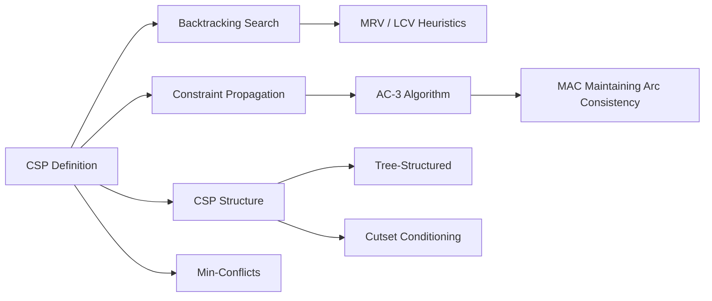

# Chapter 4: Constraint Satisfaction Problems

**Previous:** [Chapter 4: Adversarial Search and Games](04-adversarial-search.md) | **Next:** [Chapter 5: Constraint Satisfaction Problems](05-csp.md)

## Learning Objectives

By the conclusion of this chapter, the student will be able to: (1) formulate problems as constraint satisfaction problems; (2) apply backtracking search with heuristic ordering; (3) implement constraint propagation via arc consistency; (4) exploit problem structure for efficient solving; (5) apply iterative algorithms for large CSPs.

## Chapter at a Glance

| Section | Key Topics | Key Terms |
|---------|-----------|-----------|
| CSP Definition | Variables X, domains D, constraints C | Assignment, consistent, complete, solution |
| Backtracking Search | DFS variable assignment, MRV, LCV | Fail-first, forward checking |
| Constraint Propagation | Arc consistency, AC-3 | Node/arc/path consistency, MAC |
| CSP Structure | Tree-structured, cutset, treewidth | Topological order, tree decomposition |
| Iterative Algorithms | Min-conflicts heuristic | Local search, random restart |

## Chapter Roadmap



## 4.1 Definition of Constraint Satisfaction Problems


> **One-Sentence Takeaway:** A CSP is defined by variables X, domains D, and constraints C — the solution is a complete assignment satisfying all constraints.

A **Constraint Satisfaction Problem (CSP)** is defined by a triple $(\mathcal{X}, \mathcal{D}, \mathcal{C})$ where:

- $\mathcal{X} = \{X_1, X_2, \ldots, X_n\}$ is a finite set of **variables**.
- $\mathcal{D} = \{D_1, D_2, \ldots, D_n\}$ is a set of **domains**, where $D_i$ is the set of values that $X_i$ may take. Domains may be discrete or continuous, finite or infinite.
- $\mathcal{C} = \{C_1, C_2, \ldots, C_m\}$ is a set of **constraints**. Each constraint $C_j$ is a pair $\langle scope, relation \rangle$ where $scope$ is a tuple of variables and $relation$ is a subset of the Cartesian product of their domains specifying allowed value combinations.

A **solution** to a CSP is an assignment of values to all variables satisfying every constraint. A CSP may have zero, one, or many solutions.

### 4.1.1 Example: Map Coloring

Given a map of Australia with seven territories, assign each territory a color from {red, green, blue} such that no two adjacent territories share the same color. This is a binary CSP where variables represent territories, domains are color sets, and constraints specify inequality of adjacent variables.

### 4.1.2 Constraint Graphs

The **constraint graph** represents variables as nodes and constraints as edges (binary) or hyperedges (n-ary). The structure of this graph determines algorithmic tractability.

**Types of constraints:**
- **Unary constraints:** Restrict the value of a single variable ($X \neq red$).
- **Binary constraints:** Relate two variables ($X \neq Y$).
- **Global constraints:** Involve an arbitrary number of variables ($Alldifferent(X_1, \ldots, X_k)$).

> **💡 Pro Tip:** The MRV (Minimum Remaining Values) heuristic is the single most impactful optimization for CSP backtracking. By choosing the most constrained variable first, you minimize the branching factor and detect dead ends earlier.

## 4.2 Backtracking Search

Backtracking search is a depth-first traversal of the search tree where variables are assigned sequentially and constraints are checked incrementally.

```
function BACKTRACKING-SEARCH(csp) returns solution or failure
    return BACKTRACK({}, csp)

function BACKTRACK(assignment, csp) returns solution or failure
    if assignment is complete then return assignment
    var ← SELECT-UNASSIGNED-VARIABLE(csp)
    for each value in ORDER-DOMAIN-VALUES(var, assignment, csp) do
        if value is consistent with assignment given CONSTRAINTS(csp) then
            add {var = value} to assignment
            inferences ← INFERENCE(csp, var, value)
            if inferences ≠ failure then
                add inferences to assignment
                result ← BACKTRACK(assignment, csp)
                if result ≠ failure then return result
            remove {var = value} and inferences from assignment
    return failure
```

### 4.2.1 Heuristic Ordering

**Minimum Remaining Values (MRV):** Select the variable with the fewest legal values remaining. Also called "most constrained variable" or "fail-first" heuristic.

**Degree Heuristic:** For tie-breaking in MRV, select the variable involved in the most constraints with other unassigned variables.

**Least Constraining Value (LCV):** Given a chosen variable, select the value that rules out the fewest choices for neighboring unassigned variables. LCV minimizes the branching factor.

## 4.3 Forward Checking and Constraint Propagation

### 4.3.1 Forward Checking

Forward checking, after assigning a variable, eliminates inconsistent values from the domains of unassigned variables connected to the assigned variable by constraints. If any domain becomes empty, the assignment is pruned.

### 4.3.2 Arc Consistency and AC-3

A binary constraint is **arc-consistent** if for every value in the domain of the first variable, there exists a consistent value in the domain of the second variable. AC-3 (Mackworth, 1977) enforces arc consistency throughout the CSP:

```
function AC-3(csp) returns CSP or failure
    queue ← all arcs in csp
    while queue is not empty do
        (X_i, X_j) ← POP(queue)
        if REVISE(csp, X_i, X_j) then
            if D_i is empty then return failure
            for each X_k in NEIGHBORS(X_i) - {X_j} do
                add (X_k, X_i) to queue
    return csp

function REVISE(csp, X_i, X_j) returns boolean
    revised ← false
    for each x in D_i do
        if no value y in D_j satisfies constraint (X_i, X_j) then
            delete x from D_i
            revised ← true
    return revised
```

### 4.3.3 Maintaining Arc Consistency (MAC)

MAC interleaves backtracking search with arc consistency propagation. After each assignment, AC-3 is run on the remaining variables. MAC dramatically reduces the search space compared to forward checking.

> **⚠️ Warning:** The AC-3 algorithm only enforces arc consistency, not full global consistency. A CSP can pass AC-3 and still have no solution. Always use AC-3 as a preprocessing step, not as a complete solver.

## 4.4 CSP Structure

### 4.4.1 Tree-Structured CSPs

A CSP whose constraint graph is a tree can be solved in $O(n d^2)$ time, where $d$ is the maximum domain size. The algorithm:
1. Choose a root variable and order variables from root to leaves (topological order).
2. Apply backward arc consistency: for $j$ from $n$ down to 2, enforce arc consistency between $X_j$ and its parent $X_i$.
3. Assign in forward order: no backtracking required.

### 4.4.2 Reducing to Tree Structure

If the constraint graph has small treewidth, the CSP can be solved efficiently:

- **Cutset conditioning:** Instantiate a subset of variables (the cycle cutset) such that the remaining CSP is tree-structured.
- **Tree decomposition:** Partition variables into overlapping clusters (bags) such that the graph of clusters forms a tree. The treewidth is the size of the largest bag minus 1.

## 4.5 Iterative Algorithms for CSPs

### 4.5.1 Min-Conflicts Heuristic

Local search for CSPs: start with a random assignment, then repeatedly select a violated constraint and change the value of one of its variables to minimize the number of remaining conflicts.

```
function MIN-CONFLICTS(csp, max_steps) returns solution or failure
    current ← random complete assignment of csp
    for i = 1 to max_steps do
        if current satisfies all constraints then return current
        var ← randomly chosen conflicted variable
        value ← value minimizing CONFLICTS(var, current, csp)
        set var = value in current
    return failure
```

The min-conflicts heuristic is remarkably effective for problems such as $N$-Queens and SAT.

## Concept Comparison

| Technique | Type | Preprocessing? | Guarantee | Complexity |
|-----------|:---:|:---:|:---:|:---:|
| Backtracking | Search | No | Complete | O(d^n) worst case |
| Forward Checking | Propagation | On assignment | Domain filtering | O(n²d²) |
| AC-3 | Propagation | Yes/Interleaved | Arc consistency | O(n²d³) |
| MAC | Propagation+Search | Interleaved | More pruning than FC | O(n²d³) per step |
| Min-Conflicts | Iterative | Random start | Incomplete | Polynomial typically |

## Quick Reference — CSP Heuristics

| Heuristic | Type | Rule |
|-----------|:---:|------|
| MRV (Minimum Remaining Values) | Variable ordering | Choose variable with fewest legal values |
| Degree Heuristic | Variable ordering (tie-break) | Choose variable in most constraints |
| LCV (Least Constraining Value) | Value ordering | Choose value leaving most options for neighbors |
| Min-Conflicts | Value selection | Choose value minimizing constraint violations |

## Cross-Application Matrix

| Technique | ML Engineering | Computer Vision | NLP | Research |
|-----------|:---:|:---:|:---:|:---:|
| CSP Formulation | ✅ | ✅ | ✅ | ✅ |
| Backtracking Search | ✅ | ⬜ | ⬜ | ✅ |
| AC-3 Propagation | ⬜ | ⬜ | ⬜ | ✅ |
| Min-Conflicts | ⬜ | ⬜ | ⬜ | ✅ |
| Tree Decomposition | ⬜ | ✅ | ⬜ | ✅ |

## Chapter Quiz

**Q1:** What does the MRV heuristic select?
- A) The variable with the most constraints
- B) The variable with the fewest legal values remaining
- C) The value that rules out the fewest choices for neighbors
- D) The variable with the largest domain

<details><summary>Answer</summary>B) MRV selects the most constrained variable (fewest legal values) to minimize branching and detect dead ends early.</details>

**Q2:** The AC-3 algorithm enforces what type of consistency?
- A) Node consistency
- B) Arc consistency
- C) Path consistency
- D) k-consistency

<details><summary>Answer</summary>B) AC-3 enforces arc consistency between all variable pairs in a CSP.</details>

**Q3:** A tree-structured CSP can be solved in what time complexity?
- A) O(n²)
- B) O(n d²)
- C) O(d^n)
- D) O(n log n)

<details><summary>Answer</summary>B) Tree-structured CSPs are solvable in O(n d²) time — linear in the number of variables and quadratic in the domain size.</details>

## 4.6 Summary

CSPs provide a declarative problem representation that separates structure from search algorithm. Arc consistency, heuristic variable ordering, and structural decomposition enable efficient solution of problems that would be intractable under naive enumeration.

## Exercises

### Review Questions

1. Distinguish between forward checking and arc consistency. Why is MAC more powerful than forward checking?
2. Explain the MRV heuristic. Why does it reduce search tree size compared to arbitrary variable ordering?
3. Define treewidth. Why does a CSP with small treewidth admit efficient solution?

### Application Problems

4. Formulate the $N$-Queens problem as a CSP. Compare the search cost with and without forward checking for $N = 8$.
5. Consider a scheduling CSP with 10 jobs, each taking 1--5 time units, and resource constraints limiting concurrent jobs to 3. Formulate this problem and determine the minimum makespan using backtracking with MRV.

### Challenge Problem

6. Implement AC-3 in Python. Apply it to the Australia map-coloring problem with 7 territories and 3 colors. Compare the number of nodes visited by backtracking search with and without AC-3 preprocessing.
