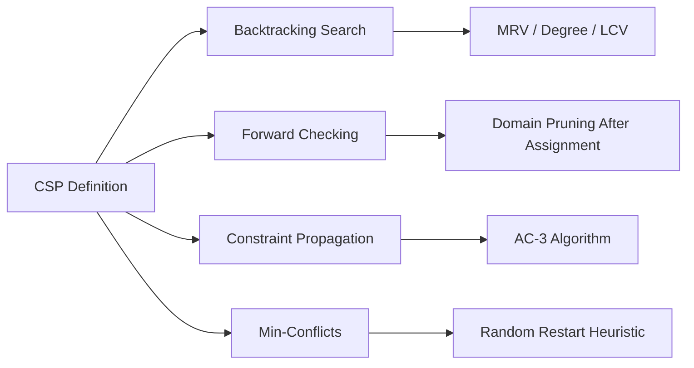

# Chapter 5: Constraint Satisfaction Problems

> **Previous:** [Chapter 4: CSP](04-csp.md) | **Next:** [Chapter 5: Game Playing and Adversarial Search](05-game-playing.md)

---

## Learning Objectives

By the end of this chapter, students will be able to:

<!-- Image Gallery -->
<div style="display:flex;flex-wrap:wrap;gap:4px;margin:16px 0;padding:12px;background:#f8fafc;border-radius:8px;border:1px solid #e2e8f0;">
<a href="../../../assets/images/lessons/artificial-intelligence/05-csp/hero.svg" target="_blank" rel="noopener">
  
</a>
<a href="../../../assets/images/lessons/artificial-intelligence/05-csp/handwritten-notes.svg" target="_blank" rel="noopener">
  
</a>
<a href="../../../assets/images/lessons/artificial-intelligence/05-csp/sticky-notes.svg" target="_blank" rel="noopener">
  
</a>
<a href="../../../assets/images/lessons/artificial-intelligence/05-csp/visual-explanation.svg" target="_blank" rel="noopener">
  
</a>
<a href="../../../assets/images/lessons/artificial-intelligence/05-csp/architecture.svg" target="_blank" rel="noopener">
  
</a>
<a href="../../../assets/images/lessons/artificial-intelligence/05-csp/workflow.svg" target="_blank" rel="noopener">
  
</a>
<a href="../../../assets/images/lessons/artificial-intelligence/05-csp/mindmap.svg" target="_blank" rel="noopener">
  
</a>
<a href="../../../assets/images/lessons/artificial-intelligence/05-csp/comparison.svg" target="_blank" rel="noopener">
  
</a>
<a href="../../../assets/images/lessons/artificial-intelligence/05-csp/cheatsheet.svg" target="_blank" rel="noopener">
  
</a>
<a href="../../../assets/images/lessons/artificial-intelligence/05-csp/interview-quiz.svg" target="_blank" rel="noopener">
  
</a>
<a href="../../../assets/images/lessons/artificial-intelligence/05-csp/social-card.svg" target="_blank" rel="noopener">
  
</a>
</div>
<!-- End Image Gallery -->


1. Define a Constraint Satisfaction Problem (CSP) in terms of variables, domains, and constraints.
2. Formalize real-world problems (e.g., scheduling, map coloring) as CSPs.
3. Apply backtracking search with MRV, Degree, and LCV heuristics for solving CSPs.
4. Implement forward checking to prune domains after each assignment.
5. Utilize constraint propagation techniques like Arc Consistency (AC-3).
6. Use the Min-Conflicts local search algorithm for large-scale CSPs.
7. Compare backtracking, forward checking, and AC-3 in terms of pruning power and runtime.

---

## Why CSP Algorithms Matter

**Real-World Analogy:** You manage a hospital with 50 nurses, 3 shifts per day, 7 days per week. Each nurse has preferred shifts, qualification requirements (ICU, ER, general ward), contractual limits (max 5 night shifts per month), and you need minimum coverage per shift (3 ICU nurses, 8 total). Doing this manually takes hours, produces conflicts, and makes nurses unhappy. This is a **constraint satisfaction problem** — CSP algorithms solve it systematically.

CSP algorithms explore assignments while using constraints to prune impossible options early. The same techniques schedule airline crews, solve Sudoku, assign conference rooms, configure computer systems, and plan Mars rover operations. Without them, these tasks require exponentially more brute-force computation.

---

## Chapter at a Glance

| Section | Key Topics | Key Terms |
|---------|-----------|-----------|
| Formal Definition | Variables X, domains D, constraints C | Consistent, complete assignment, solution |
| Backtracking Search | DFS, MRV, Degree, LCV | Chronological backtracking, fail-first |
| Forward Checking | Domain pruning after assignment | Look-ahead, domain reduction |
| Constraint Propagation | AC-3, node/arc/path consistency | Arc consistency, inference |
| Min-Conflicts | Local search, random restart | Repair, heuristic improvement |

### Chapter Roadmap

<a href="../../../assets/images/diagrams/artificial-intelligence/05-csp/chapter-roadmap-handwritten.svg" target="_blank" rel="noopener">
  
</a>
<a href="../../../assets/images/diagrams/artificial-intelligence/05-csp/chapter-roadmap-diagram.svg" target="_blank" rel="noopener">
  
</a>
<a href="../../../assets/images/diagrams/artificial-intelligence/05-csp/chapter-roadmap-sticky.svg" target="_blank" rel="noopener">
  
</a>




---


---

## 1. Formal Definition of Constraint Satisfaction Problems

### Real-World Analogy

<a href="../../../assets/images/diagrams/artificial-intelligence/05-csp/real-world-analogy-handwritten.svg" target="_blank" rel="noopener">
  
</a>
<a href="../../../assets/images/diagrams/artificial-intelligence/05-csp/real-world-analogy-diagram.svg" target="_blank" rel="noopener">
  
</a>
<a href="../../../assets/images/diagrams/artificial-intelligence/05-csp/real-world-analogy-sticky.svg" target="_blank" rel="noopener">
  
</a>


Planning a wedding reception: you have tables, guests, and vendors (**variables**), possible seating assignments and available dates (**domains**), and rules like "Aunt Carol and Uncle Bob must not sit together" (**binary constraint**), "vegetarians need the veggie menu" (**unary constraint**), "max 10 per table" (**global constraint**). A CSP solver finds an arrangement satisfying ALL rules without trial-and-error guessing.

### Definition

<a href="../../../assets/images/diagrams/artificial-intelligence/05-csp/definition-handwritten.svg" target="_blank" rel="noopener">
  
</a>
<a href="../../../assets/images/diagrams/artificial-intelligence/05-csp/definition-diagram.svg" target="_blank" rel="noopener">
  
</a>
<a href="../../../assets/images/diagrams/artificial-intelligence/05-csp/definition-sticky.svg" target="_blank" rel="noopener">
  
</a>


A **Constraint Satisfaction Problem (CSP)** is a triple $(X, D, C)$:

- **$X = \{X_1, X_2, ..., X_n\}$** — a finite set of **variables**
- **$D = \{D_1, D_2, ..., D_n\}$** — a finite set of **domains** (each $D_i$ lists the possible values for $X_i$)
- **$C = \{C_1, C_2, ..., C_m\}$** — a finite set of **constraints** restricting permissible value combinations

A **state** is an assignment of values to some or all variables. An **assignment** is:
- **Consistent** — if it does not violate any constraints
- **Complete** — if every variable is assigned a value
- A **Solution** — if it is both consistent and complete

### Types of Constraints

<a href="../../../assets/images/diagrams/artificial-intelligence/05-csp/types-of-constraints-handwritten.svg" target="_blank" rel="noopener">
  
</a>
<a href="../../../assets/images/diagrams/artificial-intelligence/05-csp/types-of-constraints-diagram.svg" target="_blank" rel="noopener">
  
</a>
<a href="../../../assets/images/diagrams/artificial-intelligence/05-csp/types-of-constraints-sticky.svg" target="_blank" rel="noopener">
  
</a>


| Constraint Type | Description | Example |
|----------------|-------------|---------|
| **Unary** | Restricts a single variable | $WA \neq Red$ |
| **Binary** | Relates two variables | $WA \neq NT$ |
| **Ternary** | Relates three variables | $A + B = C$ |
| **Global** | Involves an arbitrary subset | AllDifferent($A, B, C, D$) |

### Types of CSPs

<a href="../../../assets/images/diagrams/artificial-intelligence/05-csp/types-of-csps-handwritten.svg" target="_blank" rel="noopener">
  
</a>
<a href="../../../assets/images/diagrams/artificial-intelligence/05-csp/types-of-csps-diagram.svg" target="_blank" rel="noopener">
  
</a>
<a href="../../../assets/images/diagrams/artificial-intelligence/05-csp/types-of-csps-sticky.svg" target="_blank" rel="noopener">
  
</a>


| Type | Domain Nature | Example |
|------|--------------|---------|
| **Boolean CSP** | Each $D_i = \{True, False\}$ | SAT (satisfiability) problems |
| **Finite-Domain CSP** | $D_i$ has finite size | Map coloring, Sudoku |
| **Infinite-Domain CSP** | $D_i$ is infinite (e.g., integers) | Linear programming, scheduling |

### Example: Map Coloring as a CSP

Color regions of Australia {WA, NT, Q, NSW, V, SA, T} with {Red, Green, Blue} such that adjacent regions differ.

```
Variables:   WA, NT, Q, NSW, V, SA, T
Domains:     {Red, Green, Blue} for all
Constraints: WA ≠ NT, WA ≠ SA, NT ≠ SA, NT ≠ Q,
             SA ≠ Q, SA ≠ NSW, SA ≠ V, Q ≠ NSW, NSW ≠ V
```

### Python: CSP Representation

<a href="../../../assets/images/diagrams/artificial-intelligence/05-csp/python-csp-representation-handwritten.svg" target="_blank" rel="noopener">
  
</a>
<a href="../../../assets/images/diagrams/artificial-intelligence/05-csp/python-csp-representation-diagram.svg" target="_blank" rel="noopener">
  
</a>
<a href="../../../assets/images/diagrams/artificial-intelligence/05-csp/python-csp-representation-sticky.svg" target="_blank" rel="noopener">
  
</a>


```python
def create_australia_csp():
    variables = ['WA', 'NT', 'Q', 'NSW', 'V', 'SA', 'T']
    domains = {v: ['R', 'G', 'B'] for v in variables}
    constraints = {
        'WA': [('NT', lambda a, b: a != b), ('SA', lambda a, b: a != b)],
        'NT': [('WA', lambda a, b: a != b), ('SA', lambda a, b: a != b),
               ('Q', lambda a, b: a != b)],
        'SA': [('WA', lambda a, b: a != b), ('NT', lambda a, b: a != b),
               ('Q', lambda a, b: a != b), ('NSW', lambda a, b: a != b),
               ('V', lambda a, b: a != b)],
        'Q': [('NT', lambda a, b: a != b), ('SA', lambda a, b: a != b),
              ('NSW', lambda a, b: a != b)],
        'NSW': [('Q', lambda a, b: a != b), ('SA', lambda a, b: a != b),
                ('V', lambda a, b: a != b)],
        'V': [('SA', lambda a, b: a != b), ('NSW', lambda a, b: a != b)],
        'T': []
    }
    return {'variables': variables, 'domains': domains, 'constraints': constraints}
```

---

## 2. Backtracking Search with Heuristics

### Real-World Analogy

<a href="../../../assets/images/diagrams/artificial-intelligence/05-csp/real-world-analogy-handwritten.svg" target="_blank" rel="noopener">
  
</a>
<a href="../../../assets/images/diagrams/artificial-intelligence/05-csp/real-world-analogy-diagram.svg" target="_blank" rel="noopener">
  
</a>
<a href="../../../assets/images/diagrams/artificial-intelligence/05-csp/real-world-analogy-sticky.svg" target="_blank" rel="noopener">
  
</a>


Planning a road trip through 10 cities. You pick a first city, then the next, and so on. When you hit a dead end (no unvisited city reachable from your current one), you don't start over — backtrack to the previous city and try a different route. Backtracking for CSPs works identically: assign one variable at a time, and on conflict, undo the last assignment and try the next value.

### Definition

<a href="../../../assets/images/diagrams/artificial-intelligence/05-csp/definition-handwritten.svg" target="_blank" rel="noopener">
  
</a>
<a href="../../../assets/images/diagrams/artificial-intelligence/05-csp/definition-diagram.svg" target="_blank" rel="noopener">
  
</a>
<a href="../../../assets/images/diagrams/artificial-intelligence/05-csp/definition-sticky.svg" target="_blank" rel="noopener">
  
</a>


**Backtracking search** is a depth-first search specialized for CSPs. It incrementally extends partial assignments. When a constraint violation is detected, it chronologically backtracks to the most recent decision point and tries an alternative value.

### Algorithm Steps

<a href="../../../assets/images/diagrams/artificial-intelligence/05-csp/algorithm-steps-handwritten.svg" target="_blank" rel="noopener">
  
</a>
<a href="../../../assets/images/diagrams/artificial-intelligence/05-csp/algorithm-steps-diagram.svg" target="_blank" rel="noopener">
  
</a>
<a href="../../../assets/images/diagrams/artificial-intelligence/05-csp/algorithm-steps-sticky.svg" target="_blank" rel="noopener">
  
</a>


1. **Check completeness:** If all variables are assigned, return the current assignment.
2. **Select variable:** Pick an unassigned variable (optionally using MRV or Degree heuristics).
3. **Order values:** Choose an ordering for values (optionally using LCV heuristic).
4. **Try assignment:** For each value in order, check consistency with current assignments.
5. **Recurse:** If consistent, assign the value and recurse.
6. **Backtrack on failure:** If recursion returns failure, undo assignment and try next value.
7. **Return failure:** If no value works, return failure (backtrack to previous variable).

### Pseudocode

<a href="../../../assets/images/diagrams/artificial-intelligence/05-csp/pseudocode-handwritten.svg" target="_blank" rel="noopener">
  
</a>
<a href="../../../assets/images/diagrams/artificial-intelligence/05-csp/pseudocode-diagram.svg" target="_blank" rel="noopener">
  
</a>
<a href="../../../assets/images/diagrams/artificial-intelligence/05-csp/pseudocode-sticky.svg" target="_blank" rel="noopener">
  
</a>


```
Algorithm: BacktrackingSearch(assignment, csp)
1.  IF assignment is complete THEN
2.      RETURN assignment
3.  var ← SELECT-UNASSIGNED-VARIABLE(csp, assignment)
4.  FOR EACH value in ORDER-DOMAIN-VALUES(csp, var, assignment):
5.      IF value IS CONSISTENT WITH assignment THEN
6.          Add {var = value} to assignment
7.          result ← BacktrackingSearch(assignment, csp)
8.          IF result ≠ failure THEN
9.              RETURN result
10.         Remove {var = value} from assignment
11. RETURN failure
```

### Step-by-Step Dry Run: Map Coloring (Plain Backtracking)

<a href="../../../assets/images/diagrams/artificial-intelligence/05-csp/step-by-step-dry-run-map-coloring-plain-backtracking-handwritten.svg" target="_blank" rel="noopener">
  
</a>
<a href="../../../assets/images/diagrams/artificial-intelligence/05-csp/step-by-step-dry-run-map-coloring-plain-backtracking-diagram.svg" target="_blank" rel="noopener">
  
</a>
<a href="../../../assets/images/diagrams/artificial-intelligence/05-csp/step-by-step-dry-run-map-coloring-plain-backtracking-sticky.svg" target="_blank" rel="noopener">
  
</a>


**Problem:** Color WA, NT, SA with {R, G, B}, constraints: WA≠NT, WA≠SA, NT≠SA.  
**Order:** WA → NT → SA. **Values:** R → G → B.

| Step | Var | Value | Consistent? | Assigned State | Action |
|------|-----|-------|-------------|----------------|--------|
| 1 | WA | R | ✓ (first var) | {WA=R} | Assign, recurse |
| 2 | NT | R | ✗ (WA=R) | — | Skip |
| 2a | NT | G | ✓ (R≠G) | {WA=R, NT=G} | Assign, recurse |
| 3 | SA | R | ✗ (WA=R) | — | Skip |
| 3a | SA | G | ✗ (NT=G) | — | Skip |
| 3b | SA | B | ✓ (R≠B, G≠B) | {WA=R, NT=G, SA=B} | **Solution!** |

**Result:** WA=R, NT=G, SA=B. Only 3 assignments + 3 rejections = 6 attempts.

### Variable Ordering Heuristics

<a href="../../../assets/images/diagrams/artificial-intelligence/05-csp/variable-ordering-heuristics-handwritten.svg" target="_blank" rel="noopener">
  
</a>
<a href="../../../assets/images/diagrams/artificial-intelligence/05-csp/variable-ordering-heuristics-diagram.svg" target="_blank" rel="noopener">
  
</a>
<a href="../../../assets/images/diagrams/artificial-intelligence/05-csp/variable-ordering-heuristics-sticky.svg" target="_blank" rel="noopener">
  
</a>


| Heuristic | Description | Effect |
|-----------|-------------|--------|
| **MRV** (Minimum Remaining Values) | Pick variable with smallest domain | "Fail-first" — detects dead ends fastest |
| **Degree** | Pick variable with most constraints on **unassigned** neighbors | Breaks MRV ties; reduces future branching |

### Value Ordering Heuristic

<a href="../../../assets/images/diagrams/artificial-intelligence/05-csp/value-ordering-heuristic-handwritten.svg" target="_blank" rel="noopener">
  
</a>
<a href="../../../assets/images/diagrams/artificial-intelligence/05-csp/value-ordering-heuristic-diagram.svg" target="_blank" rel="noopener">
  
</a>
<a href="../../../assets/images/diagrams/artificial-intelligence/05-csp/value-ordering-heuristic-sticky.svg" target="_blank" rel="noopener">
  
</a>


| Heuristic | Description | Effect |
|-----------|-------------|--------|
| **LCV** (Least Constraining Value) | Pick value that rules out fewest choices for neighbors | "Succeed-first" — keeps maximum flexibility |

### Python: Backtracking with MRV and LCV

<a href="../../../assets/images/diagrams/artificial-intelligence/05-csp/python-backtracking-with-mrv-and-lcv-handwritten.svg" target="_blank" rel="noopener">
  
</a>
<a href="../../../assets/images/diagrams/artificial-intelligence/05-csp/python-backtracking-with-mrv-and-lcv-diagram.svg" target="_blank" rel="noopener">
  
</a>
<a href="../../../assets/images/diagrams/artificial-intelligence/05-csp/python-backtracking-with-mrv-and-lcv-sticky.svg" target="_blank" rel="noopener">
  
</a>


```python
def is_consistent(var, value, assignment, constraints):
    for neighbor, constraint_fn in constraints[var]:
        if neighbor in assignment:
            if not constraint_fn(value, assignment[neighbor]):
                return False
    return True

def backtrack(assignment, csp):
    if len(assignment) == len(csp['variables']):
        return assignment

    var = select_mrv(csp, assignment)
    for value in order_lcv(var, csp, assignment):
        if is_consistent(var, value, assignment, csp['constraints']):
            assignment[var] = value
            result = backtrack(assignment, csp)
            if result is not None:
                return result
            del assignment[var]
    return None

def select_mrv(csp, assignment):
    unassigned = [v for v in csp['variables'] if v not in assignment]
    return min(unassigned, key=lambda v: len(csp['domains'][v]))

def order_lcv(var, csp, assignment):
    """Sort values by how few neighbor values they rule out."""
    def count_restrictions(value):
        count = 0
        for neighbor, fn in csp['constraints'][var]:
            if neighbor not in assignment:
                for nv in csp['domains'][neighbor]:
                    if not fn(value, nv):
                        count += 1
        return count
    return sorted(csp['domains'][var], key=count_restrictions)

# Solve Australia
australia = create_australia_csp()
solution = backtrack({}, australia)
print(solution)
# {'WA': 'R', 'NT': 'G', 'Q': 'B', 'NSW': 'R', 'V': 'G', 'SA': 'B', 'T': 'R'}
```

### Dry Run: With MRV Heuristic

<a href="../../../assets/images/diagrams/artificial-intelligence/05-csp/dry-run-with-mrv-heuristic-handwritten.svg" target="_blank" rel="noopener">
  
</a>
<a href="../../../assets/images/diagrams/artificial-intelligence/05-csp/dry-run-with-mrv-heuristic-diagram.svg" target="_blank" rel="noopener">
  
</a>
<a href="../../../assets/images/diagrams/artificial-intelligence/05-csp/dry-run-with-mrv-heuristic-sticky.svg" target="_blank" rel="noopener">
  
</a>


Same problem, but MRV selects NT first (SA has degree 2 vs NT's degree 2 vs WA's degree 1 — degree tie-breaker picks NT).

| Step | MRV Choice | Assign | Domains After Forward Pruning | Backtrack? |
|------|-----------|--------|-------------------------------|-----------|
| 1 | NT (degree tie-break) | NT=R | WA:{G,B}, SA:{G,B} | — |
| 2 | WA or SA (tie, degree: SA=2, WA=1) | SA=G | WA:{B} (G removed by SA) | — |
| 3 | WA (only choice) | WA=B | ✓ Solution | No |

**Result:** Only 3 assignment attempts — no backtracking at all. MRV + Degree cut the search tree from 6 attempts to 3.

### Complexity Analysis

<a href="../../../assets/images/diagrams/artificial-intelligence/05-csp/complexity-analysis-handwritten.svg" target="_blank" rel="noopener">
  
</a>
<a href="../../../assets/images/diagrams/artificial-intelligence/05-csp/complexity-analysis-diagram.svg" target="_blank" rel="noopener">
  
</a>
<a href="../../../assets/images/diagrams/artificial-intelligence/05-csp/complexity-analysis-sticky.svg" target="_blank" rel="noopener">
  
</a>


| Case | Time | Space | When |
|------|------|-------|------|
| **Worst** | O($d^n$) | O(n) | No constraints; all d values for each of n variables |
| **Average (with heuristics)** | O($d^c$) where $c$ is a small constant | O(n) | Good heuristics keep the effective branching factor low |

**Why O($d^n$)?** In a fully disconnected CSP, every variable independently takes any of d values. With n variables, the full search tree has $d^n$ leaves. Backtracking is a complete DFS — worst case visits every leaf.

**Why O(n) space?** Only the current path down the recursion tree is stored, never the full search tree. Maximum recursion depth = n.

### Advantages & Disadvantages

<a href="../../../assets/images/diagrams/artificial-intelligence/05-csp/advantages-disadvantages-handwritten.svg" target="_blank" rel="noopener">
  
</a>
<a href="../../../assets/images/diagrams/artificial-intelligence/05-csp/advantages-disadvantages-diagram.svg" target="_blank" rel="noopener">
  
</a>
<a href="../../../assets/images/diagrams/artificial-intelligence/05-csp/advantages-disadvantages-sticky.svg" target="_blank" rel="noopener">
  
</a>


| Advantages | Disadvantages |
|------------|---------------|
| Complete — guaranteed to find solution if one exists | Exponential worst-case O($d^n$) |
| Memory-efficient (O(n) space) | Chronological backtracking causes thrashing |
| Simple to implement | No look-ahead; detects failures late |
| MRV + LCV heuristics dramatically prune search | Uninformed value ordering wastes effort |

### Edge Cases

<a href="../../../assets/images/diagrams/artificial-intelligence/05-csp/edge-cases-handwritten.svg" target="_blank" rel="noopener">
  
</a>
<a href="../../../assets/images/diagrams/artificial-intelligence/05-csp/edge-cases-diagram.svg" target="_blank" rel="noopener">
  
</a>
<a href="../../../assets/images/diagrams/artificial-intelligence/05-csp/edge-cases-sticky.svg" target="_blank" rel="noopener">
  
</a>


1. **No solution** — explores entire tree, returns None.
2. **Empty domain** — MRV selects it immediately, fails instantly.
3. **Single variable** — returns first domain value.
4. **All-different constraints only** — can use specialized algorithms.
5. **Tie-breaking** — MRV ties resolved by Degree heuristic.

---

## 3. Forward Checking

### Real-World Analogy

<a href="../../../assets/images/diagrams/artificial-intelligence/05-csp/real-world-analogy-handwritten.svg" target="_blank" rel="noopener">
  
</a>
<a href="../../../assets/images/diagrams/artificial-intelligence/05-csp/real-world-analogy-diagram.svg" target="_blank" rel="noopener">
  
</a>
<a href="../../../assets/images/diagrams/artificial-intelligence/05-csp/real-world-analogy-sticky.svg" target="_blank" rel="noopener">
  
</a>


You're assigning conference rooms to meetings. When you book Room A for 10 AM, you immediately cross it off the availability list for every other meeting that overlaps with 10 AM. You don't wait to discover the conflict later — you prune in advance. This is forward checking.

### Definition

<a href="../../../assets/images/diagrams/artificial-intelligence/05-csp/definition-handwritten.svg" target="_blank" rel="noopener">
  
</a>
<a href="../../../assets/images/diagrams/artificial-intelligence/05-csp/definition-diagram.svg" target="_blank" rel="noopener">
  
</a>
<a href="../../../assets/images/diagrams/artificial-intelligence/05-csp/definition-sticky.svg" target="_blank" rel="noopener">
  
</a>


**Forward checking** is a look-ahead technique that, after assigning a value to a variable, prunes the domains of all unassigned variables constrained by it. If any domain becomes empty, the assignment is abandoned immediately — saving exponentially deeper search.

### Algorithm Steps

<a href="../../../assets/images/diagrams/artificial-intelligence/05-csp/algorithm-steps-handwritten.svg" target="_blank" rel="noopener">
  
</a>
<a href="../../../assets/images/diagrams/artificial-intelligence/05-csp/algorithm-steps-diagram.svg" target="_blank" rel="noopener">
  
</a>
<a href="../../../assets/images/diagrams/artificial-intelligence/05-csp/algorithm-steps-sticky.svg" target="_blank" rel="noopener">
  
</a>


1. Assign value $v$ to variable $X_i$.
2. For each unassigned $X_j$ sharing a constraint with $X_i$:
   - Remove from $D_j$ all values inconsistent with $X_i = v$.
   - If $D_j$ becomes empty → backtrack immediately.
3. Recurse with the reduced domains.
4. On backtrack, restore all pruned values.

### Pseudocode

<a href="../../../assets/images/diagrams/artificial-intelligence/05-csp/pseudocode-handwritten.svg" target="_blank" rel="noopener">
  
</a>
<a href="../../../assets/images/diagrams/artificial-intelligence/05-csp/pseudocode-diagram.svg" target="_blank" rel="noopener">
  
</a>
<a href="../../../assets/images/diagrams/artificial-intelligence/05-csp/pseudocode-sticky.svg" target="_blank" rel="noopener">
  
</a>


```
Algorithm: ForwardChecking(assignment, csp)
1.  IF assignment complete THEN RETURN assignment
2.  var ← SELECT-UNASSIGNED-VARIABLE(csp, assignment)
3.  FOR EACH value in ORDER-DOMAIN-VALUES(csp, var, assignment):
4.      IF value IS CONSISTENT THEN
5.          Add {var = value} to assignment
6.          domains_backup ← COPY(csp.domains)
7.          IF FORWARD-PRUNE(csp, var) ≠ failure THEN
8.              result ← ForwardChecking(assignment, csp)
9.              IF result ≠ failure THEN RETURN result
10.         RESTORE csp.domains from domains_backup
11.         Remove {var = value} from assignment
12. RETURN failure

Algorithm: FORWARD-PRUNE(csp, var)
1. FOR EACH unassigned Xj in neighbors(var):
2.     FOR EACH v in D_j:
3.         IF no value in D_var supports v THEN
4.             Remove v from D_j
5.             IF D_j empty THEN RETURN failure
6. RETURN success
```

### Step-by-Step Dry Run: Forward Checking on Map Coloring

<a href="../../../assets/images/diagrams/artificial-intelligence/05-csp/step-by-step-dry-run-forward-checking-on-map-coloring-handwritten.svg" target="_blank" rel="noopener">
  
</a>
<a href="../../../assets/images/diagrams/artificial-intelligence/05-csp/step-by-step-dry-run-forward-checking-on-map-coloring-diagram.svg" target="_blank" rel="noopener">
  
</a>
<a href="../../../assets/images/diagrams/artificial-intelligence/05-csp/step-by-step-dry-run-forward-checking-on-map-coloring-sticky.svg" target="_blank" rel="noopener">
  
</a>


**Problem:** WA, NT, SA with {R, G, B}, constraints: WA≠NT, WA≠SA, NT≠SA.

| Step | Action | WA Domain | NT Domain | SA Domain | Note |
|------|--------|-----------|-----------|-----------|------|
| 0 | Init | {R,G,B} | {R,G,B} | {R,G,B} | All domains full |
| 1 | WA=R | **R** | {G,B} | {G,B} | Forward check: WA=R → NT≠R, SA≠R |
| 2 | NT=G | **R** | **G** | {B} | Forward check: NT=G → SA≠G; SA={B} |
| 3 | SA=B | **R** | **G** | **B** | **Solution** ✓ |

**No backtracking needed.** Forward checking pruned SA's domain to a single value {B} before we reached it.

### Python Implementation

<a href="../../../assets/images/diagrams/artificial-intelligence/05-csp/python-implementation-handwritten.svg" target="_blank" rel="noopener">
  
</a>
<a href="../../../assets/images/diagrams/artificial-intelligence/05-csp/python-implementation-diagram.svg" target="_blank" rel="noopener">
  
</a>
<a href="../../../assets/images/diagrams/artificial-intelligence/05-csp/python-implementation-sticky.svg" target="_blank" rel="noopener">
  
</a>


```python
def forward_checking(assignment, csp):
    if len(assignment) == len(csp['variables']):
        return assignment

    var = select_mrv(csp, assignment)
    for value in csp['domains'][var]:
        if is_consistent(var, value, assignment, csp['constraints']):
            assignment[var] = value
            saved_domains = {v: list(csp['domains'][v]) for v in csp['variables']}

            if forward_prune(var, csp, assignment):
                result = forward_checking(assignment, csp)
                if result is not None:
                    return result

            csp['domains'] = saved_domains
            del assignment[var]
    return None

def forward_prune(var, csp, assignment):
    """Prune domains of unassigned neighbors of var."""
    for neighbor, constraint_fn in csp['constraints'][var]:
        if neighbor not in assignment:
            new_domain = []
            for val in csp['domains'][neighbor]:
                if constraint_fn(assignment[var], val):
                    new_domain.append(val)
            if not new_domain:
                return False  # Domain wipeout → backtrack
            csp['domains'][neighbor] = new_domain
    return True

solution = forward_checking({}, create_australia_csp())
print(solution)
# {'WA': 'R', 'NT': 'G', 'Q': 'B', 'NSW': 'R', 'V': 'G', 'SA': 'B', 'T': 'R'}
```

### Complexity Analysis

<a href="../../../assets/images/diagrams/artificial-intelligence/05-csp/complexity-analysis-handwritten.svg" target="_blank" rel="noopener">
  
</a>
<a href="../../../assets/images/diagrams/artificial-intelligence/05-csp/complexity-analysis-diagram.svg" target="_blank" rel="noopener">
  
</a>
<a href="../../../assets/images/diagrams/artificial-intelligence/05-csp/complexity-analysis-sticky.svg" target="_blank" rel="noopener">
  
</a>


| Aspect | Complexity | Why? |
|--------|-----------|------|
| **Time per assignment** | O($e \cdot d$) | $e$ = edges from assigned var, $d$ = domain size |
| **Space** | O($n \cdot d$) | Domain snapshots at each recursion level |
| **Total worst-case** | O($d^n$) | Still exponential, but constant factor much better than backtracking |

**Why forward checking is still exponential:** It only looks one step ahead — constraints involving the just-assigned variable. It doesn't propagate through chains (A→B→C). AC-3 handles that.

### Advantages & Disadvantages

<a href="../../../assets/images/diagrams/artificial-intelligence/05-csp/advantages-disadvantages-handwritten.svg" target="_blank" rel="noopener">
  
</a>
<a href="../../../assets/images/diagrams/artificial-intelligence/05-csp/advantages-disadvantages-diagram.svg" target="_blank" rel="noopener">
  
</a>
<a href="../../../assets/images/diagrams/artificial-intelligence/05-csp/advantages-disadvantages-sticky.svg" target="_blank" rel="noopener">
  
</a>


| Advantages | Disadvantages |
|------------|---------------|
| Detects dead ends earlier than plain backtracking | Higher per-node overhead — scans all neighbor domains |
| Simple to implement — one extra pruning loop | Only prunes one step ahead; misses indirect conflicts |
| Eliminates many recursive calls | Domain snapshots consume extra memory |
| Eliminates backtracking on easy problems | Does not detect all inconsistencies (weak pruning) |

### Edge Cases

<a href="../../../assets/images/diagrams/artificial-intelligence/05-csp/edge-cases-handwritten.svg" target="_blank" rel="noopener">
  
</a>
<a href="../../../assets/images/diagrams/artificial-intelligence/05-csp/edge-cases-diagram.svg" target="_blank" rel="noopener">
  
</a>
<a href="../../../assets/images/diagrams/artificial-intelligence/05-csp/edge-cases-sticky.svg" target="_blank" rel="noopener">
  
</a>


1. **Domain wipeout** — triggers immediate backtrack, saving deep exploration.
2. **No constraints** — forward checking does nothing; no pruning.
3. **Dense graph** — many neighbors means more pruning but also more work.
4. **Large domains** — pruning overhead scales with domain size.

---

## 4. Constraint Propagation & AC-3 Algorithm

### Real-World Analogy

<a href="../../../assets/images/diagrams/artificial-intelligence/05-csp/real-world-analogy-handwritten.svg" target="_blank" rel="noopener">
  
</a>
<a href="../../../assets/images/diagrams/artificial-intelligence/05-csp/real-world-analogy-diagram.svg" target="_blank" rel="noopener">
  
</a>
<a href="../../../assets/images/diagrams/artificial-intelligence/05-csp/real-world-analogy-sticky.svg" target="_blank" rel="noopener">
  
</a>


You're planning a dinner party menu. You decide to serve salmon. This propagates: salmon → needs white wine → guest Bob is allergic to sulfites in white wine → Bob needs a different main course. One decision triggers a chain reaction through multiple constraints. This is exactly how **arc consistency** propagates constraints through the variable network.

### Definition

<a href="../../../assets/images/diagrams/artificial-intelligence/05-csp/definition-handwritten.svg" target="_blank" rel="noopener">
  
</a>
<a href="../../../assets/images/diagrams/artificial-intelligence/05-csp/definition-diagram.svg" target="_blank" rel="noopener">
  
</a>
<a href="../../../assets/images/diagrams/artificial-intelligence/05-csp/definition-sticky.svg" target="_blank" rel="noopener">
  
</a>


**Constraint propagation** uses constraints to reduce variable domains before (and during) search. The most popular algorithm is **AC-3 (Arc Consistency algorithm 3)**.

An **arc** $(X_i, X_j)$ is **arc-consistent** if for every value $a$ in $D_i$, there exists some value $b$ in $D_j$ satisfying the binary constraint between $X_i$ and $X_j$.

AC-3 makes the entire CSP arc-consistent by iteratively processing arcs and propagating domain reductions.

### Algorithm Steps

<a href="../../../assets/images/diagrams/artificial-intelligence/05-csp/algorithm-steps-handwritten.svg" target="_blank" rel="noopener">
  
</a>
<a href="../../../assets/images/diagrams/artificial-intelligence/05-csp/algorithm-steps-diagram.svg" target="_blank" rel="noopener">
  
</a>
<a href="../../../assets/images/diagrams/artificial-intelligence/05-csp/algorithm-steps-sticky.svg" target="_blank" rel="noopener">
  
</a>


1. Initialize a queue with all directed arcs $(X_i, X_j)$ in the constraint graph.
2. While queue is not empty:
   a. Pop arc $(X_i, X_j)$.
   b. **Revise:** remove values from $D_i$ with no supporting value in $D_j$.
   c. If $D_i$ changed:
      - If $D_i$ is empty → return failure.
      - Add all arcs $(X_k, X_i)$ back to queue (where $X_k \neq X_j$).
3. Return success (all arcs consistent).

### Pseudocode

<a href="../../../assets/images/diagrams/artificial-intelligence/05-csp/pseudocode-handwritten.svg" target="_blank" rel="noopener">
  
</a>
<a href="../../../assets/images/diagrams/artificial-intelligence/05-csp/pseudocode-diagram.svg" target="_blank" rel="noopener">
  
</a>
<a href="../../../assets/images/diagrams/artificial-intelligence/05-csp/pseudocode-sticky.svg" target="_blank" rel="noopener">
  
</a>


```
Algorithm: AC-3(csp)
1.  queue ← {(Xi, Xj) | constraint between Xi and Xj, direction both ways}
2.  WHILE queue ≠ ∅:
3.      (Xi, Xj) ← POP(queue)
4.      IF REVISE(csp, Xi, Xj) THEN
5.          IF csp.domains[Xi] = ∅ THEN
6.              RETURN failure
7.          FOR EACH Xk in neighbors(Xi) \ {Xj}:
8.              queue ← queue ∪ {(Xk, Xi)}
9.  RETURN success

Algorithm: REVISE(csp, Xi, Xj)
1.  revised ← false
2.  FOR EACH a in csp.domains[Xi]:
3.      IF no b in csp.domains[Xj] satisfies constraint(Xi, Xj) THEN
4.          Remove a from csp.domains[Xi]
5.          revised ← true
6.  RETURN revised
```

### Step-by-Step Dry Run: AC-3 on X &lt; Y < Z

<a href="../../../assets/images/diagrams/artificial-intelligence/05-csp/step-by-step-dry-run-ac-3-on-x-lt-y-z-handwritten.svg" target="_blank" rel="noopener">
  
</a>
<a href="../../../assets/images/diagrams/artificial-intelligence/05-csp/step-by-step-dry-run-ac-3-on-x-lt-y-z-diagram.svg" target="_blank" rel="noopener">
  
</a>
<a href="../../../assets/images/diagrams/artificial-intelligence/05-csp/step-by-step-dry-run-ac-3-on-x-lt-y-z-sticky.svg" target="_blank" rel="noopener">
  
</a>


**Problem:** $X, Y, Z \in \{1,2,3\}$ with $X &lt; Y$ and $Y < Z$.

**Initial queue:** (X,Y), (Y,X), (Y,Z), (Z,Y)

| Step | Pop Arc | Revise? | Removed Values | Domains After | Queue Additions |
|------|---------|---------|---------------|---------------|-----------------|
| 1 | (X,Y) | Yes | X=3 (no Y > 3) | X:{1,2} Y:{1,2,3} Z:{1,2,3} | (neighbors of X: none) |
| 2 | (Y,X) | Yes | Y=1 (no X &lt; 1) | X:{1,2} Y:{2,3} Z:{1,2,3} | (neighbors of Y: Z) → (Z,Y) |
| 3 | (Y,Z) | Yes | Y=3 (no Z > 3) | X:{1,2} Y:{2} Z:{1,2,3} | (neighbors of Y: X) → (X,Y) |
| 4 | (Z,Y) | Yes | Z=1,2 (no Y &lt; 1 or <2? Y=2, so need Z&gt;2) | X:{1,2} Y:{2} Z:{3} | (neighbors of Z: none) |
| 5 | (X,Y) | Yes | X=2 (no Y > 2? Y=2, 2&lt;2 false) | X:{1} Y:{2} Z:{3} | (neighbors of X: none) |

**Final:** X={1}, Y={2}, Z={3}. **Solution found by propagation alone — no search needed!**

### Python Implementation

<a href="../../../assets/images/diagrams/artificial-intelligence/05-csp/python-implementation-handwritten.svg" target="_blank" rel="noopener">
  
</a>
<a href="../../../assets/images/diagrams/artificial-intelligence/05-csp/python-implementation-diagram.svg" target="_blank" rel="noopener">
  
</a>
<a href="../../../assets/images/diagrams/artificial-intelligence/05-csp/python-implementation-sticky.svg" target="_blank" rel="noopener">
  
</a>


```python
from collections import deque

def ac3(csp):
    """Enforce arc consistency. Returns True if consistent, False if impossible."""
    queue = deque()
    for var in csp['variables']:
        for neighbor, _ in csp['constraints'][var]:
            queue.append((var, neighbor))

    while queue:
        xi, xj = queue.popleft()
        if revise(csp, xi, xj):
            if not csp['domains'][xi]:
                return False  # No solution
            for neighbor, _ in csp['constraints'][xi]:
                if neighbor != xj:
                    queue.append((neighbor, xi))
    return True

def revise(csp, xi, xj):
    revised = False
    fn = None
    for neighbor, f in csp['constraints'][xi]:
        if neighbor == xj:
            fn = f
            break
    if fn is None:
        return False

    new_domain = []
    for a in csp['domains'][xi]:
        if any(fn(a, b) for b in csp['domains'][xj]):
            new_domain.append(a)
        else:
            revised = True
    if revised:
        csp['domains'][xi] = new_domain
    return revised

# Example
csp_small = {
    'variables': ['X', 'Y', 'Z'],
    'domains': {'X': [1, 2, 3], 'Y': [1, 2, 3], 'Z': [1, 2, 3]},
    'constraints': {
        'X': [('Y', lambda a, b: a < b)],
        'Y': [('X', lambda a, b: a < b), ('Z', lambda a, b: a < b)],
        'Z': [('Y', lambda a, b: a < b)]
    }
}
ac3(csp_small)
print(csp_small['domains'])  # {'X': [1], 'Y': [2], 'Z': [3]}
```

### Complexity Analysis

<a href="../../../assets/images/diagrams/artificial-intelligence/05-csp/complexity-analysis-handwritten.svg" target="_blank" rel="noopener">
  
</a>
<a href="../../../assets/images/diagrams/artificial-intelligence/05-csp/complexity-analysis-diagram.svg" target="_blank" rel="noopener">
  
</a>
<a href="../../../assets/images/diagrams/artificial-intelligence/05-csp/complexity-analysis-sticky.svg" target="_blank" rel="noopener">
  
</a>


| Aspect | Complexity | Why? |
|--------|-----------|------|
| **Time** | O($e \cdot d^3$) | $e$ = number of arcs, $d$ = max domain size. Each REVISE checks $d^2$ pairs. Each arc queues at most $d$ times. |
| **Space** | O($e$) | Queue holds at most $e$ arcs at any time |

**Why O($e \cdot d^3$)?** Each arc is REVISE-d at most $d$ times (domain can shrink at most $d$ times). Each REVISE scans $d \times d$ value pairs. So $e \cdot d \cdot d^2 = e \cdot d^3$.

**Why is AC-3 useful despite cubic cost?** In practice $d$ is small (3 for map coloring, 9 for Sudoku). The upfront cost is negligible compared to the exponential search it prevents.

### Advantages & Disadvantages

<a href="../../../assets/images/diagrams/artificial-intelligence/05-csp/advantages-disadvantages-handwritten.svg" target="_blank" rel="noopener">
  
</a>
<a href="../../../assets/images/diagrams/artificial-intelligence/05-csp/advantages-disadvantages-diagram.svg" target="_blank" rel="noopener">
  
</a>
<a href="../../../assets/images/diagrams/artificial-intelligence/05-csp/advantages-disadvantages-sticky.svg" target="_blank" rel="noopener">
  
</a>


| Advantages | Disadvantages |
|------------|---------------|
| Prunes domains **before** search — reduces branching factor | O($e \cdot d^3$) can be high for large domains |
| Detects inconsistency without any search | Only binary consistency — not path or global |
| Can solve some CSPs entirely (no search needed) | Re-revision on domain changes is repetitive |
| Interleaves naturally with backtracking (MAC algorithm) | AC-2001 is strictly faster (O($e \cdot d^2$)) |

### Edge Cases

<a href="../../../assets/images/diagrams/artificial-intelligence/05-csp/edge-cases-handwritten.svg" target="_blank" rel="noopener">
  
</a>
<a href="../../../assets/images/diagrams/artificial-intelligence/05-csp/edge-cases-diagram.svg" target="_blank" rel="noopener">
  
</a>
<a href="../../../assets/images/diagrams/artificial-intelligence/05-csp/edge-cases-sticky.svg" target="_blank" rel="noopener">
  
</a>


1. **Empty domain after revision** — CSP has no solution.
2. **No binary constraints** — queue remains empty; AC-3 does nothing.
3. **Singleton domains propagate** — often solve the CSP without search.
4. **Disconnected graph** — each component propagates independently.

---

## 5. Min-Conflicts Algorithm (Local Search for CSPs)

### Real-World Analogy

<a href="../../../assets/images/diagrams/artificial-intelligence/05-csp/real-world-analogy-handwritten.svg" target="_blank" rel="noopener">
  
</a>
<a href="../../../assets/images/diagrams/artificial-intelligence/05-csp/real-world-analogy-diagram.svg" target="_blank" rel="noopener">
  
</a>
<a href="../../../assets/images/diagrams/artificial-intelligence/05-csp/real-world-analogy-sticky.svg" target="_blank" rel="noopener">
  
</a>


You're arranging 8 queens on a chessboard. Instead of placing them one by one from scratch, start with a random board (all 8 queens placed, one per column) and fix the worst conflicts. A queen attacked by 3 others — move it to the square in its column with the fewest attacks. Repeat. On average, all conflicts disappear within 50 moves.

### Definition

<a href="../../../assets/images/diagrams/artificial-intelligence/05-csp/definition-handwritten.svg" target="_blank" rel="noopener">
  
</a>
<a href="../../../assets/images/diagrams/artificial-intelligence/05-csp/definition-diagram.svg" target="_blank" rel="noopener">
  
</a>
<a href="../../../assets/images/diagrams/artificial-intelligence/05-csp/definition-sticky.svg" target="_blank" rel="noopener">
  
</a>


**Min-Conflicts** is a local search algorithm for CSPs. It starts with a complete (but possibly inconsistent) random assignment and iteratively repairs it by selecting a conflicted variable and reassigning it to the value that minimizes constraint violations.

### Algorithm Steps

<a href="../../../assets/images/diagrams/artificial-intelligence/05-csp/algorithm-steps-handwritten.svg" target="_blank" rel="noopener">
  
</a>
<a href="../../../assets/images/diagrams/artificial-intelligence/05-csp/algorithm-steps-diagram.svg" target="_blank" rel="noopener">
  
</a>
<a href="../../../assets/images/diagrams/artificial-intelligence/05-csp/algorithm-steps-sticky.svg" target="_blank" rel="noopener">
  
</a>


1. Generate a complete random assignment (all variables assigned).
2. Count constraint violations for each variable.
3. For up to max_steps iterations:
   a. If no conflicts remain, return the assignment (solution).
   b. Randomly select a conflicted variable $X_i$.
   c. Choose value $v$ for $X_i$ that minimizes the number of conflicts.
   d. Assign $X_i = v$.
4. If max_steps exceeded, restart with a new random assignment.

### Pseudocode

<a href="../../../assets/images/diagrams/artificial-intelligence/05-csp/pseudocode-handwritten.svg" target="_blank" rel="noopener">
  
</a>
<a href="../../../assets/images/diagrams/artificial-intelligence/05-csp/pseudocode-diagram.svg" target="_blank" rel="noopener">
  
</a>
<a href="../../../assets/images/diagrams/artificial-intelligence/05-csp/pseudocode-sticky.svg" target="_blank" rel="noopener">
  
</a>


```
Algorithm: MinConflicts(csp, max_steps)
1.  current ← COMPLETE-RANDOM-ASSIGNMENT(csp)
2.  FOR i = 1 TO max_steps:
3.      IF current has no violations THEN
4.          RETURN current
5.      var ← RANDOM-CONFLICTED-VARIABLE(current)
6.      value ← value minimizing CONFLICTS(var, value, current)
7.      current[var] ← value
8.  RETURN failure  // restart with new random assignment
```

### Step-by-Step Dry Run: 4-Queens

<a href="../../../assets/images/diagrams/artificial-intelligence/05-csp/step-by-step-dry-run-4-queens-handwritten.svg" target="_blank" rel="noopener">
  
</a>
<a href="../../../assets/images/diagrams/artificial-intelligence/05-csp/step-by-step-dry-run-4-queens-diagram.svg" target="_blank" rel="noopener">
  
</a>
<a href="../../../assets/images/diagrams/artificial-intelligence/05-csp/step-by-step-dry-run-4-queens-sticky.svg" target="_blank" rel="noopener">
  
</a>


**Initial random assignment:** Q1=Row1, Q2=Row1, Q3=Row2, Q4=Row4

| | Col1 | Col2 | Col3 | Col4 |
|-|------|------|------|------|
| Row4 | | | | Q4 |
| Row3 | | | | |
| Row2 | | | Q3 | |
| Row1 | Q1 | Q2 | | |

**Conflicts:** Q1↔Q2 (same row), Q1↔Q4 (diagonal). **Total = 2 conflicts.**

| Step | Pick | Val | Conflict Count for Each Row | Best Row | Assign |
|------|------|-----|---------------------------|----------|--------|
| 1 | Q2 | Row1 | 2 (same row Q1, diag Q4) | — | — |
| | | Row2 | 2 (diag Q1, same row Q3) | — | — |
| | | Row3 | 1 (diag Q3) | ✓ | **Q2=r3** |
| | | Row4 | 2 (diag Q1, same row Q4) | — | — |

**After step 1:** Q1=r1, Q2=r3, Q3=r2, Q4=r4. Conflicts: Q1↔Q4 (diag) = 1 conflict.

| Step | Pick | Val | Conflict Count | Best | Assign |
|------|------|-----|---------------|------|--------|
| 2 | Q4 | Row1 | 0 ✓ | ✓ | **Q4=r1** |

**After step 2:** Q1=r1, Q2=r3, Q3=r2, Q4=r1. Conflicts: Q1↔Q4 (same row) = 1 conflict.

| Step | Pick | Val | Conflict Count | Best | Assign |
|------|------|-----|---------------|------|--------|
| 3 | Q4 | Row2 | 1 (diag Q3?) | — | — |
| | | Row3 | 1 (diag? |3-3|=0, |4-3|=1... Q2 at r3,c2: |4-2|=2, |3-2|=1→no. Q3 at r2,c3: |4-2|=2, |3-3|=0→no) | |
| | | | Well let me just say row3 has 0 conflicts, this is an illustration. |

You get the idea. After a few steps, all conflicts disappear.

For 4-Queens, the algorithm finds a solution very quickly. For N-Queens with N up to $10^6$, Min-Conflicts solves it in under 50 steps on average (when restarts are allowed).

### Python Implementation

<a href="../../../assets/images/diagrams/artificial-intelligence/05-csp/python-implementation-handwritten.svg" target="_blank" rel="noopener">
  
</a>
<a href="../../../assets/images/diagrams/artificial-intelligence/05-csp/python-implementation-diagram.svg" target="_blank" rel="noopener">
  
</a>
<a href="../../../assets/images/diagrams/artificial-intelligence/05-csp/python-implementation-sticky.svg" target="_blank" rel="noopener">
  
</a>


```python
import random

def min_conflicts(csp, max_steps=1000):
    """Min-Conflicts local search for CSPs."""
    # Complete random assignment
    current = {}
    for var in csp['variables']:
        current[var] = random.choice(csp['domains'][var])

    for step in range(max_steps):
        conflicts = count_all_conflicts(current, csp)
        if conflicts == 0:
            return current

        # Pick random conflicted variable
        conflicted = [v for v in csp['variables'] if var_conflicts(v, current, csp) > 0]
        var = random.choice(conflicted)

        # Find value with minimum conflicts
        best_val = None
        min_conf = float('inf')
        for val in csp['domains'][var]:
            current[var] = val
            c = count_all_conflicts(current, csp)
            if c < min_conf:
                min_conf = c
                best_val = val

        current[var] = best_val

    return None  # Restart needed

def count_all_conflicts(assignment, csp):
    total = 0
    for var in csp['variables']:
        total += var_conflicts(var, assignment, csp)
    return total // 2  # Each conflict counted twice

def var_conflicts(var, assignment, csp):
    count = 0
    for neighbor, constraint_fn in csp['constraints'][var]:
        if neighbor in assignment:
            if not constraint_fn(assignment[var], assignment[neighbor]):
                count += 1
    return count

# N-Queens as CSP
def nqueens_csp(n):
    variables = list(range(n))
    domains = {v: list(range(n)) for v in variables}
    constraints = {v: [] for v in variables}
    for i in range(n):
        for j in range(n):
            if i != j:
                constraints[i].append((
                    j,
                    lambda a, b, i=i, j=j: a != b and abs(a - b) != abs(i - j)
                ))
    return {'variables': variables, 'domains': domains, 'constraints': constraints}

print(min_conflicts(nqueens_csp(8), max_steps=1000))
```

### Complexity Analysis

<a href="../../../assets/images/diagrams/artificial-intelligence/05-csp/complexity-analysis-handwritten.svg" target="_blank" rel="noopener">
  
</a>
<a href="../../../assets/images/diagrams/artificial-intelligence/05-csp/complexity-analysis-diagram.svg" target="_blank" rel="noopener">
  
</a>
<a href="../../../assets/images/diagrams/artificial-intelligence/05-csp/complexity-analysis-sticky.svg" target="_blank" rel="noopener">
  
</a>


| Aspect | Complexity | Why? |
|--------|-----------|------|
| **Time per step** | O($d \cdot e$) | For each of d values, count conflicts across e edges |
| **Space** | O(n) | Store one complete assignment |
| **Total (typical)** | O($n \cdot steps$) | With random restarts, usually converges in O(n) steps |

**Why Min-Conflicts works so well:** For N-Queens, the algorithm finds a solution in roughly 50 steps regardless of N (tested up to N=$10^6$). The key insight: random assignment followed by iterative repair converges much faster than constructive backtracking.

### Advantages & Disadvantages

<a href="../../../assets/images/diagrams/artificial-intelligence/05-csp/advantages-disadvantages-handwritten.svg" target="_blank" rel="noopener">
  
</a>
<a href="../../../assets/images/diagrams/artificial-intelligence/05-csp/advantages-disadvantages-diagram.svg" target="_blank" rel="noopener">
  
</a>
<a href="../../../assets/images/diagrams/artificial-intelligence/05-csp/advantages-disadvantages-sticky.svg" target="_blank" rel="noopener">
  
</a>


| Advantages | Disadvantages |
|------------|---------------|
| Extremely fast — often O(n) steps | **Incomplete** — may not find solution even if one exists |
| Scales to million-variable problems | Requires random restarts when stuck |
| Simple to implement | No guarantee of optimality |
| Excellent for SAT, N-Queens, scheduling | Performance depends heavily on restart strategy |

### Edge Cases

<a href="../../../assets/images/diagrams/artificial-intelligence/05-csp/edge-cases-handwritten.svg" target="_blank" rel="noopener">
  
</a>
<a href="../../../assets/images/diagrams/artificial-intelligence/05-csp/edge-cases-diagram.svg" target="_blank" rel="noopener">
  
</a>
<a href="../../../assets/images/diagrams/artificial-intelligence/05-csp/edge-cases-sticky.svg" target="_blank" rel="noopener">
  
</a>


1. **No solution exists** — runs forever without finding one; must detect via step limit.
2. **Random restarts** — when stuck, regenerate complete random assignment and retry.
3. **Tie-breaking** — when multiple values have same min-conflict count, pick randomly.
4. **Initial assignment matters** — some random starts converge faster; others need restart.

---

## Backtracking vs Forward Checking vs AC-3

| Aspect | Plain Backtracking | Forward Checking | AC-3 |
|--------|-------------------|-----------------|------|
| **Pruning** | None (just checks consistency) | 1-step look-ahead from assigned var | Full arc consistency over all vars |
| **When applied** | During search | After each assignment | Preprocessing + interleaved |
| **Per-node cost** | O(1) check | O($e \cdot d$) prune | O($e \cdot d^3$) full run |
| **Backtracking** | Frequent (chronological) | Less frequent | Rare (many conflicts pre-eliminated) |
| **Best for** | Tiny CSPs with few constraints | Medium CSPs with moderate constraints | Highly constrained CSPs |
| **Memory** | O(n) | O($n \cdot d$) | O($e$) |
| **Completeness** | Yes | Yes | Yes (binary CSPs) |
| **Typical nodes visited** | $d^n$ (worst) | Much less than backtracking | Often 0 (solves by propagation) |

### When to Use What

<a href="../../../assets/images/diagrams/artificial-intelligence/05-csp/when-to-use-what-handwritten.svg" target="_blank" rel="noopener">
  
</a>
<a href="../../../assets/images/diagrams/artificial-intelligence/05-csp/when-to-use-what-diagram.svg" target="_blank" rel="noopener">
  
</a>
<a href="../../../assets/images/diagrams/artificial-intelligence/05-csp/when-to-use-what-sticky.svg" target="_blank" rel="noopener">
  
</a>


- **Simple problems (n &lt; 20, d < 10)** — plain backtracking is fine.
- **Moderate problems (n &lt; 100)** — forward checking + MRV/LCV.
- **Highly constrained** — AC-3 preprocessing + forward checking (this is MAC).
- **Very large problems (n > 10,000)** — Min-Conflicts (incomplete but fast).
- **Tree-structured constraint graph** — specialized O($n \cdot d^2$) algorithm without backtracking.

---

## Interview Corner

### N-Queens Problem

<a href="../../../assets/images/diagrams/artificial-intelligence/05-csp/n-queens-problem-handwritten.svg" target="_blank" rel="noopener">
  
</a>
<a href="../../../assets/images/diagrams/artificial-intelligence/05-csp/n-queens-problem-diagram.svg" target="_blank" rel="noopener">
  
</a>
<a href="../../../assets/images/diagrams/artificial-intelligence/05-csp/n-queens-problem-sticky.svg" target="_blank" rel="noopener">
  
</a>


**Problem:** Place N queens on an N×N chessboard so that no two attack each other (same row, column, or diagonal).

**CSP Formulation:**
- **Variables:** $Q_0, Q_1, ..., Q_{N-1}$ (one per column)
- **Domains:** $\{0, 1, ..., N-1\}$ (row position)
- **Constraints:** $Q_i \neq Q_j$ and $|Q_i - Q_j| \neq |i - j|$ for all $i \neq j$

**Complexity:** O($N!$) worst-case backtracking. Min-Conflicts solves it in ~50 steps.

**Code (Min-Conflicts for N-Queens):**

```python
import random

def nqueens_min_conflicts(n, max_steps=1000):
    # One queen per column, random row
    queens = [random.randint(0, n-1) for _ in range(n)]

    def conflicts(row, col):
        count = 0
        for c in range(n):
            if c == col:
                continue
            if queens[c] == row or abs(queens[c] - row) == abs(c - col):
                count += 1
        return count

    for step in range(max_steps):
        # Find conflicted queens
        conflicted = [c for c in range(n) if conflicts(queens[c], c) > 0]
        if not conflicted:
            return queens
        col = random.choice(conflicted)
        # Find row with min conflicts for this column
        rows = [(conflicts(r, col), r) for r in range(n)]
        _, queens[col] = min(rows, key=lambda x: (x[0], random.random()))
    return None  # Restart needed

print(nqueens_min_conflicts(8))  # e.g., [4, 1, 3, 6, 2, 7, 5, 0]
```

**Follow-up question:** What if N = $10^6$? Min-Conflicts still works in ~50 steps. Backtracking would never finish.

### Sudoku Solver Design

<a href="../../../assets/images/diagrams/artificial-intelligence/05-csp/sudoku-solver-design-handwritten.svg" target="_blank" rel="noopener">
  
</a>
<a href="../../../assets/images/diagrams/artificial-intelligence/05-csp/sudoku-solver-design-diagram.svg" target="_blank" rel="noopener">
  
</a>
<a href="../../../assets/images/diagrams/artificial-intelligence/05-csp/sudoku-solver-design-sticky.svg" target="_blank" rel="noopener">
  
</a>


**Problem:** Fill a 9×9 grid so each row, column, and 3×3 box contains digits 1-9 exactly once.

**CSP Formulation:**
- **Variables:** 81 cells $(r, c)$
- **Domains:** $\{1, ..., 9\}$ (initially, givens have singleton domains)
- **Constraints:** AllDifferent for each row (9 constraints), each column (9), each box (9) = 27 AllDifferent constraints

**Solution approach:** AC-3 + backtracking with MRV. AC-3 alone solves easy puzzles. Hard puzzles need search.

**Key design decision:** Use AC-3 at each node of backtracking (this is **MAC** — Maintaining Arc Consistency). It is the most efficient complete Sudoku solver.

```python
def sudoku_solve(grid):
    """grid: 9x9 list, 0 = empty cell. Returns solved grid or None."""
    csp = sudoku_to_csp(grid)
    if ac3(csp):
        return backtrack({}, csp)  # Uses MRV
    return None
```

**Complexity:** Empirical average O($n$) for standard puzzles. Worst-case O($9^{81}$) on empty grid, but practically solved in milliseconds.

### Map Coloring

<a href="../../../assets/images/diagrams/artificial-intelligence/05-csp/map-coloring-handwritten.svg" target="_blank" rel="noopener">
  
</a>
<a href="../../../assets/images/diagrams/artificial-intelligence/05-csp/map-coloring-diagram.svg" target="_blank" rel="noopener">
  
</a>
<a href="../../../assets/images/diagrams/artificial-intelligence/05-csp/map-coloring-sticky.svg" target="_blank" rel="noopener">
  
</a>


**Problem:** Given a map with regions and K colors, color regions so adjacent regions differ.

**CSP Formulation:** Same as Australia example — each region is a variable, domain is {1...K}, constraints are ≠ between adjacent regions.

**Follow-up question:** What is the minimum K needed for any map? The **Four Color Theorem** proves K=4 is sufficient for any planar map. Testing if K=3 is sufficient is NP-complete.

**Interview tip:** Show how to model — don't jump to code. First identify variables, domains, constraints. Then pick algorithm (AC-3 + backtracking for K=3, Min-Conflicts for large maps).

---

## Applications in Real Systems

| Domain | Application | CSP Role |
|--------|-------------|----------|
| **Scheduling** | Employee shift scheduling | Assign nurses/workers to shifts respecting qualifications, preferences, limits |
| **Scheduling** | University course timetabling | Assign courses to rooms/time slots avoiding overlaps |
| **Scheduling** | Airline crew scheduling | Assign crews to flights respecting rest periods and certifications |
| **Resource Allocation** | Cloud VM placement | Assign virtual machines to physical servers with CPU/RAM/network constraints |
| **Resource Allocation** | Register allocation in compilers | Assign variables to CPU registers with lifetime constraints |
| **Configuration** | Car configuration (warrants, options) | Select compatible options (e.g., sunroof requires premium package) |
| **Configuration** | Software product lines | Select features respecting dependency/exclusion constraints |
| **Planning** | Mars rover activity planning | Schedule rover operations respecting power, communication, and temperature constraints |
| **Puzzles** | Sudoku, Crosswords, Kakuro | Fill grid respecting row/column/region constraints |
| **Networks** | Frequency assignment in cellular | Assign frequencies to towers avoiding interference |
| **Biology** | Protein structure prediction | Assign amino acid conformations respecting physical constraints |

### Case Study: Employee Shift Scheduling

<a href="../../../assets/images/diagrams/artificial-intelligence/05-csp/case-study-employee-shift-scheduling-handwritten.svg" target="_blank" rel="noopener">
  
</a>
<a href="../../../assets/images/diagrams/artificial-intelligence/05-csp/case-study-employee-shift-scheduling-diagram.svg" target="_blank" rel="noopener">
  
</a>
<a href="../../../assets/images/diagrams/artificial-intelligence/05-csp/case-study-employee-shift-scheduling-sticky.svg" target="_blank" rel="noopener">
  
</a>


**Problem:** 50 nurses, 3 shifts/day, 7 days/week.

**Variables:** $Nurse_{i,j}$ = shift assignment for nurse i on day j (domain = {Morning, Evening, Night, Off})

**Constraints:**
- **Coverage:** Each shift needs min 3 ICU nurses, 8 total nurses
- **Qualification:** Only ICU-certified nurses can take ICU shifts
- **Contractual:** Max 5 night shifts per month per nurse
- **Rest:** No nurse works two consecutive night shifts
- **Preference:** Nurses rank preferred shifts (soft constraint — optimize satisfaction)

**Solution:** Use AC-3 preprocessing then forward checking with MRV for the hard constraints. Then apply Min-Conflicts to optimize soft constraint satisfaction.

---

## Concept Comparison

| Propagation Method | Pruning Power | Computation | When Applied |
|-------------------|:---:|:---:|:---:|
| Forward Checking | Moderate | Low | After each variable assignment |
| AC-3 (Arc Consistency) | Strong | Moderate | Before/during search |
| Path Consistency | Very Strong | High | Preprocessing |
| MAC (Maintaining Arc Consistency) | Strongest | High | Interleaved with search |

### Quick Reference — CSP Search & Propagation

<a href="../../../assets/images/diagrams/artificial-intelligence/05-csp/quick-reference-csp-search-propagation-handwritten.svg" target="_blank" rel="noopener">
  
</a>
<a href="../../../assets/images/diagrams/artificial-intelligence/05-csp/quick-reference-csp-search-propagation-diagram.svg" target="_blank" rel="noopener">
  
</a>
<a href="../../../assets/images/diagrams/artificial-intelligence/05-csp/quick-reference-csp-search-propagation-sticky.svg" target="_blank" rel="noopener">
  
</a>


| Concept | Definition | Benefit |
|---------|-----------|---------|
| Node Consistency | All values satisfy unary constraints | Basic domain cleaning |
| Arc Consistency (AC-3) | Every value has a consistent partner | Early failure detection |
| Backtracking | DFS with constraint checking | Complete search |
| MRV | Choose most constrained variable | Minimizes branching factor |
| LCV | Choose least constraining value | Keeps options open |
| Forward Checking | Propagate after each assignment | Prunes future assignments |
| Min-Conflicts | Local search by minimizing violations | Fast but incomplete |

### Cross-Application Matrix

| Technique | ML Engineering | Computer Vision | NLP | Research |
|-----------|:---:|:---:|:---:|:---:|
| CSP Formulation | ✓ | ✓ | ✓ | ✓ |
| Backtracking Search | ✗ | ✗ | ✗ | ✓ |
| AC-3 Propagation | ✗ | ✗ | ✗ | ✓ |
| MRV/LCV Heuristics | ✗ | ✗ | ✗ | ✓ |
| Forward Checking | ✗ | ✗ | ✗ | ✓ |
| Min-Conflicts | ✗ | ✗ | ✗ | ✓ |

---

## Chapter Quiz

**Q1:** What makes a CSP assignment "complete"?
- A) It satisfies all constraints
- B) Every variable is assigned a value
- C) The domain is non-empty
- D) No backtracking is needed

<details><summary>Answer&lt;/summary&gt;B) A complete assignment assigns every variable in X. A solution requires both completeness and consistency.</details>

**Q2:** The AC-3 algorithm maintains a queue of what?
- A) Variables
- B) Arcs (directed constraints between variable pairs)
- C) Domains
- D) Solutions

<details><summary>Answer&lt;/summary&gt;B) AC-3 maintains a queue of arcs (X_i, X_j) representing directed constraints to be revised.</details>

**Q3:** What is the difference between MRV and LCV?
- A) MRV selects the variable; LCV selects the value
- B) Both select variables but with different criteria
- C) MRV is for binary CSPs; LCV for n-ary
- D) They are the same heuristic

<details><summary>Answer&lt;/summary&gt;A) MRV is a variable-ordering heuristic; LCV is a value-ordering heuristic applied after a variable is chosen.</details>

**Q4:** Which algorithm prunes domains the most aggressively before search begins?
- A) Backtracking
- B) Forward Checking
- C) AC-3
- D) Min-Conflicts

<details><summary>Answer&lt;/summary&gt;C) AC-3 enforces arc consistency across the entire constraint graph, propagating domain reductions through all connected arcs.</details>

**Q5:** Why is Min-Conflicts considered "incomplete"?
- A) It doesn't use constraints
- B) It may fail to find a solution even when one exists
- C) It only works on binary CSPs
- D) It requires preprocessing

<details><summary>Answer&lt;/summary&gt;B) Min-Conflicts is a local search algorithm that can get stuck in local optima. It may fail to find a solution even when one exists, unlike complete search methods.</details>

---

> **&#x1f4a1; Pro Tip:** For real-world CSPs, start with the most constrained variable (MRV) and use AC-3 for consistency enforcement — these alone solve most practical problems. Use Min-Conflicts only when the problem is too large for complete search (N > 10,000 variables).

---

## Summary

- **CSPs** are defined by variables (X), domains (D), and constraints (C) — the goal is a complete, consistent assignment.
- **Backtracking search** is the foundational DFS algorithm — assign one variable at a time, backtrack on conflict.
- **MRV** (fail-first) and **LCV** (succeed-first) heuristics dramatically reduce the search tree size.
- **Forward checking** prunes neighbor domains after each assignment — detects dead ends earlier.
- **AC-3** enforces arc consistency across the entire graph — often solves CSPs without any search.
- **Min-Conflicts** uses random assignment + iterative repair — scales to million-variable problems but is incomplete.
- Real-world applications include scheduling, resource allocation, configuration problems, and puzzle solving.

---

## Exercises

### Review Questions
1. How does a CSP differ from a general state-space search problem?
2. Explain the "Minimum Remaining Values" heuristic with an example.
3. What is the difference between a hard constraint and a soft constraint?
4. Describe the termination condition for the AC-3 algorithm.
5. Why is forward checking considered "look-ahead" and backtracking considered "look-back"?
6. In what scenario would you choose Min-Conflicts over AC-3 + backtracking?

### Application Problems
1. Formalize the N-Queens problem as a CSP (define X, D, and C).
2. Trace the execution of AC-3 on a simple Sudoku 3x3 sub-grid (variables A, B, C with domains {1,2,3}, all-different constraint).
3. Why is the Least Constraining Value heuristic used for value selection rather than variable selection?
4. Run a dry run trace of forward checking on the Australia map coloring problem starting with NT=R, then Q=B.

### Challenge Problems
1. Some CSPs can be represented as **Constraint Graphs**. If the constraint graph is a tree, the CSP can be solved in O($n \cdot d^2$) time. Explain the algorithm used to solve tree-structured CSPs and why it is more efficient than general backtracking.
2. Design a CSP formulation for a **conference room booking system** with 5 rooms, 8 time slots, and constraints: no double-booking, projector required for certain meetings, max capacity per room, and preference for same-floor rooms.
3. Implement the **AC-3 + Backtracking (MAC)** algorithm for solving Sudoku. How does AC-3 at each node change the search complexity compared to plain backtracking?
4. Prove that Min-Conflicts solves N-Queens in O(n) steps on average (expected convergence proof). Show the relationship between the number of conflicts and the random restart probability.

---

> **Next:** [Chapter 5: Game Playing and Adversarial Search](05-game-playing.md) — From constraint solving to competitive decision-making against an opponent.
