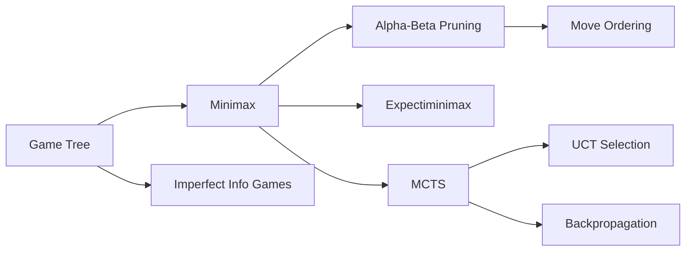

# Chapter 5: Game Playing and Adversarial Search

**Previous:** [Chapter 5: Constraint Satisfaction Problems](05-csp.md) | **Next:** [Chapter 6: Logical Agents and Propositional Logic](06-logic.md)

## Learning Objectives

By the conclusion of this chapter, the student will be able to: (1) formulate game problems as game trees with utility functions; (2) implement the minimax algorithm; (3) apply alpha-beta pruning to improve search efficiency; (4) implement Monte Carlo tree search; (5) adapt search algorithms for stochastic and imperfect information games.

## Chapter at a Glance

| Section | Key Topics | Key Terms |
|---------|-----------|-----------|
| Game Theory & Trees | State space, utility, terminal test | Game tree, zero-sum, perfect info |
| Minimax Algorithm | Optimal play, MAX/MIN, depth-limited | Evaluation function, backup |
| Alpha-Beta Pruning | α/β bounds, move ordering | Killer heuristic, iterative deepening |
| Games of Chance | Expectiminimax, chance nodes | Stochastic games, expected value |
| MCTS | Selection, expansion, simulation, backprop | UCT, exploration constant |
| Imperfect Information | Belief states, determinization | Nash equilibrium, CFR |

## Chapter Roadmap



## 5.1 Game Theory and Game Trees


Games provide a formal model of multi-agent decision-making where agents have conflicting objectives. In **deterministic, turn-taking, zero-sum games**, two players alternate moves, the payoff to one player is the negative of the payoff to the other, and no randomness intervenes.

> **One-Sentence Takeaway:** A game is formally defined by its state space, player function, actions, transition model, terminal test, and utility function — forming a game tree of all possible play sequences.

A **game** is formally defined by:
- **State space** $\mathcal{S}$; initial state $s_0$.
- **Player function** $\text{Player}(s)$ indicating whose turn it is.
- **Actions** $\text{Actions}(s)$, the set of legal moves.
- **Transition model** $\text{Result}(s, a)$, the state after action $a$.
- **Terminal test** $\text{Terminal}(s)$, determining game end.
- **Utility function** $\text{Utility}(s, p)$, the payoff for player $p$ in terminal state $s$.

The **game tree** represents all possible play sequences. The root is the initial state; edges represent moves; leaves are terminal states with associated utilities.

## 5.2 Minimax Algorithm

Minimax computes the optimal strategy for a player assuming the opponent plays optimally. The value of a state is defined recursively:

$$
\text{MINIMAX}(s) = \begin{cases}
\text{Utility}(s) & \text{if Terminal}(s) \\
\max_{a \in \text{Actions}(s)} \text{MINIMAX}(\text{Result}(s, a)) & \text{if Player}(s) = \text{MAX} \\
\min_{a \in \text{Actions}(s)} \text{MINIMAX}(\text{Result}(s, a)) & \text{if Player}(s) = \text{MIN}
\end{cases}
$$

```
function MINIMAX(state) returns action
    v, best_action ← argmax over a of MIN-VALUE(RESULT(state, a))
    return best_action

function MAX-VALUE(state) returns utility value
    if TERMINAL(state) then return UTILITY(state)
    v ← -∞
    for each a in ACTIONS(state) do
        v ← MAX(v, MIN-VALUE(RESULT(state, a)))
    return v

function MIN-VALUE(state) returns utility value
    if TERMINAL(state) then return UTILITY(state)
    v ← +∞
    for each a in ACTIONS(state) do
        v ← MIN(v, MAX-VALUE(RESULT(state, a)))
    return v
```

Minimax explores the entire game tree. For games like chess ($b \approx 35$, $d \approx 100$), exhaustive search is infeasible. **Depth-limited search** replaces the utility function with an evaluation function $Eval(s)$ that estimates the state's value.

> **💡 Pro Tip:** With optimal move ordering, alpha-beta doubles the searchable depth — the best moves examined first produces the most pruning. Always combine iterative deepening with a transposition table to reuse previous search results.

## 5.3 Alpha-Beta Pruning

Alpha-beta pruning reduces the number of nodes evaluated by maintaining two bounds:

- $\alpha$: the best value found so far for MAX along the current path.
- $\beta$: the best value found so far for MIN along the current path.

Pruning occurs when $\alpha \geq \beta$: further exploration of the subtree cannot affect the root's decision.

```
function ALPHA-BETA-SEARCH(state) returns action
    v ← MAX-VALUE(state, -∞, +∞)
    return action associated with v

function MAX-VALUE(state, α, β) returns value
    if TERMINAL(state) then return UTILITY(state)
    v ← -∞
    for each a in ACTIONS(state) do
        v ← MAX(v, MIN-VALUE(RESULT(state, a), α, β))
        if v ≥ β then return v
        α ← MAX(α, v)
    return v
```

With optimal move ordering, alpha-beta reduces the effective branching factor to approximately $\sqrt{b}$, doubling the search depth achievable within a given time bound.

### 5.3.1 Move Ordering

Pruning efficiency depends critically on the order in which moves are examined. Ordering strategies include:

- **Killer heuristic:** Maintain a table of "killer moves" that caused prunings at each depth.
- **History heuristic:** Track how often each move has caused prunings across the search.
- **Iterative deepening:** Search to depth $d$, then order moves at depth $d+1$ by their values from depth $d$.

## 5.4 Transposition Tables

Transpositions are different move sequences leading to the same state. A **transposition table** (implemented as a hash table keyed by state) stores the evaluation of previously visited states, avoiding redundant computation. Zobrist hashing (1970) provides efficient incremental hashing for board games.

> **⚠️ Warning:** Expectiminimax is computationally expensive — it evaluates all outcomes at chance nodes. The branching factor multiplies by the number of chance outcomes, making it significantly slower than minimax on deterministic games.

## 5.5 Games of Chance

Stochastic games introduce chance nodes, where the outcome depends on a probability distribution (e.g., dice rolls in backgammon). The **expectiminimax** algorithm computes expected values at chance nodes:

$$
\text{EXPECTIMINIMAX}(s) = \begin{cases}
\text{Utility}(s) & \text{if Terminal}(s) \\
\max_a \text{EXPECTIMINIMAX}(\text{Result}(s, a)) & \text{if Player}(s) = \text{MAX} \\
\min_a \text{EXPECTIMINIMAX}(\text{Result}(s, a)) & \text{if Player}(s) = \text{MIN} \\
\sum_a P(a) \cdot \text{EXPECTIMINIMAX}(\text{Result}(s, a)) & \text{if Player}(s) = \text{CHANCE}
\end{cases}
$$

## 5.6 Monte Carlo Tree Search (MCTS)

MCTS combines tree search with random sampling. It selectively expands the tree using results from simulated playouts.

The four-phase MCTS loop:

1. **Selection:** Starting from the root, traverse the tree using a selection policy (e.g., Upper Confidence Bounds for Trees, UCT).
2. **Expansion:** Add one or more child nodes.
3. **Simulation:** Play random moves from the new node to termination.
4. **Backpropagation:** Update node statistics (wins, visits) along the traversed path.

**UCT selection:** Select the child $i$ that maximizes:

$$\text{UCT}(i) = \frac{w_i}{n_i} + c \sqrt{\frac{\ln N}{n_i}}$$

where $w_i$ is the number of wins, $n_i$ the number of visits, $N$ the parent visit count, and $c$ the exploration constant.

MCTS achieved breakthrough results in Go (AlphaGo, 2016), where traditional alpha-beta search is infeasible due to the branching factor ($b \approx 250$).

## 5.7 Imperfect Information Games

In games with hidden information (e.g., poker, bridge), players must reason about unobserved state. Approaches include:

- **Belief states:** Represent the set of possible states consistent with observations.
- **Determinization:** Replace the hidden information with a specific hypothesis (e.g., assume a particular card distribution) and solve the resulting perfect-information game.
- **Game theory:** Compute Nash equilibrium strategies via linear programming or counterfactual regret minimization (CFR).

## Concept Comparison

| Algorithm | Type | State Space | Optimality | Key Metric |
|-----------|:---:|:---:|:---:|:---:|
| Minimax | Deterministic | Full tree | ✅ | Utility value |
| Alpha-Beta | Deterministic | Pruned tree | ✅ | α/β bounds |
| Expectiminimax | Stochastic | Full tree | ✅ (expected) | Expected value |
| MCTS | Anytime | Sampled tree | Asymptotic | Visit count, win rate |
| UCT | Anytime | Sampled tree | Asymptotic | Upper confidence bound |

## Quick Reference — Game Complexity

| Game | Branching Factor (b) | Game Depth (d) | Tree Size (b^d) | Feasible Method |
|------|:---:|:---:|:---:|:---:|
| Tic-Tac-Toe | ~4 | 9 | ~4×10⁵ | Minimax (full) |
| Chess | ~35 | ~100 | ~10¹⁵⁴ | Alpha-Beta + Eval |
| Go | ~250 | ~150 | ~10³⁶⁰ | MCTS + DNN |
| Poker (no-limit) | ~10⁴ | Variable | N/A | CFR |

## Cross-Application Matrix

| Technique | ML Engineering | Computer Vision | NLP | Research |
|-----------|:---:|:---:|:---:|:---:|
| Minimax | ⬜ | ⬜ | ⬜ | ✅ |
| Alpha-Beta | ⬜ | ⬜ | ⬜ | ✅ |
| MCTS | ✅ | ⬜ | ⬜ | ✅ |
| Expectiminimax | ⬜ | ⬜ | ⬜ | ✅ |
| CFR (Game Theory) | ⬜ | ⬜ | ⬜ | ✅ |

## Chapter Quiz

**Q1:** What is the primary advantage of MCTS over alpha-beta search?
- A) MCTS is always faster
- B) MCTS handles much larger branching factors through selective sampling
- C) MCTS guarantees optimality
- D) MCTS does not need evaluation functions

<details><summary>Answer</summary>B) MCTS handles large branching factors through selective sampling guided by UCT, making it suitable for games like Go where alpha-beta is infeasible.</details>

**Q2:** The UCT selection formula balances what two factors?
- A) Game score and heuristic value
- B) Exploration and exploitation
- C) Tree depth and node count
- D) Win rate and time remaining

<details><summary>Answer</summary>B) UCT balances exploitation (win rate w_i/n_i) with exploration (c√(ln N/n_i)) through its two-term formula.</details>

**Q3:** How does expectiminimax differ from minimax?
- A) It adds chance nodes with expected values
- B) It uses random sampling instead of evaluation
- C) It only works for perfect information games
- D) It prunes more aggressively

<details><summary>Answer</summary>A) Expectiminimax adds chance nodes where the value is the weighted sum (expectation) over probabilistic outcomes.</details>

## 5.8 Summary

Game-playing algorithms provide a framework for adversarial decision-making. Minimax with alpha-beta pruning is effective for deterministic games with manageable branching factors. MCTS handles large state spaces through selective sampling. Stochastic and imperfect information games require extensions to handle uncertainty.

## Exercises

### Review Questions

1. Explain why alpha-beta pruning preserves the optimality of minimax.
2. Under what conditions does MCTS outperform alpha-beta search?
3. How does expectiminimax differ from minimax? Why does it have greater computational cost?

### Application Problems

4. Analyze the game of tic-tac-toe. Draw the complete game tree and compute the minimax value of each state. Determine whether the first player has a winning strategy.
5. Implement alpha-beta pruning for a depth-limited chess search with iterative deepening. Describe the move ordering strategy employed.

### Challenge Problem

6. Implement MCTS for the game of Connect Four. Determine the optimal exploration constant $c$ empirically. Compare performance against minimax with alpha-beta pruning at equivalent node budgets.
