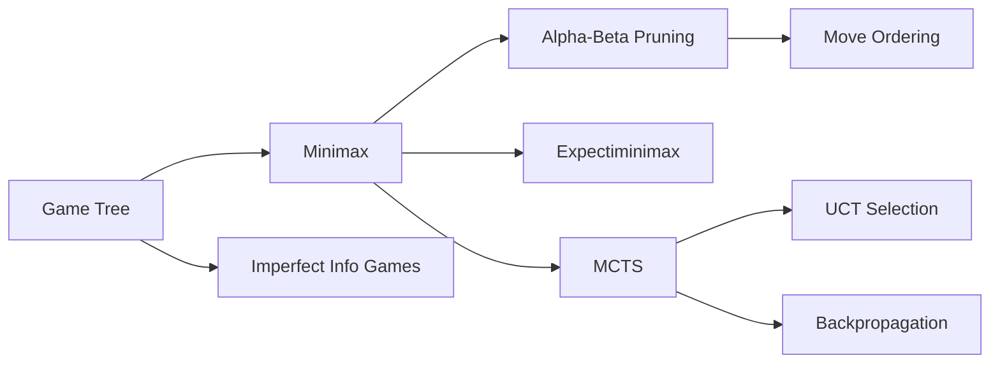

# Chapter 5: Game Playing and Adversarial Search

**Previous:** [Chapter 5: Constraint Satisfaction Problems](05-csp.md) | **Next:** [Chapter 6: Logical Agents and Propositional Logic](06-logic.md)

## Learning Objectives

By the conclusion of this chapter, the student will be able to: (1) formulate game problems as game trees with utility functions; (2) implement the minimax algorithm; (3) apply alpha-beta pruning to improve search efficiency; (4) implement Monte Carlo tree search; (5) adapt search algorithms for stochastic and imperfect information games.

## Why Game Playing in AI Matters

**Real-World Analogy:** Imagine a chess grandmaster sitting across from a worthy opponent. The grandmaster doesn't just react to the last move — she visualizes 15–20 moves ahead, evaluating thousands of possible sequences, anticipating the opponent's best responses, and selecting the move that maximizes her winning chances. Every move says, "I've thought about what you'll do, and I'm ready."

This is the core of **adversarial search** in AI. Unlike standard search (pathfinding, puzzle solving), game playing has an **active opponent** who works against you. Game-playing algorithms model this competition formally, enabling AI systems to:

- **Plan against adversaries** — from chess engines to military strategy simulators
- **Handle uncertainty** — when dice rolls or hidden cards introduce chance
- **Scale to massive spaces** — games like Go have more states than atoms in the universe
- **Make real-time decisions** — when you have seconds, not hours, to decide

The techniques here — minimax, alpha-beta pruning, MCTS — power everything from Deep Blue's 1997 chess victory to AlphaGo's 2016 Go triumph and modern poker AI like Pluribus.

## Chapter at a Glance

| Section | Key Topics | Key Terms |
|---------|-----------|-----------|
| Game Theory & Trees | State space, utility, terminal test | Game tree, zero-sum, perfect info |
| Minimax Algorithm | Optimal play, MAX/MIN, depth-limited | Evaluation function, backup |
| Alpha-Beta Pruning | α/β bounds, move ordering | Killer heuristic, iterative deepening |
| Games of Chance | Expectiminimax, chance nodes | Stochastic games, expected value |
| MCTS | Selection, expansion, simulation, backprop | UCT, exploration constant |
| Imperfect Information | Belief states, determinization | Nash equilibrium, CFR |

## Chapter Roadmap



## 5.1 Game Theory and Game Trees


### Real-World Analogy

Think of a chessboard at the start of a match. The board is the **state**, the rules define legal **actions**, each move transitions to a new **state**, and checkmate is the **terminal** condition. The entire set of possible move sequences — every game that could ever be played — forms a tree rooted at the starting position. This tree is the **game tree**, and navigating it intelligently is the central challenge of game-playing AI.

### Formal Definition of a Game

A **game** is formally defined by six components:

- **State space** $\mathcal{S}$; initial state $s_0$ — the board position
- **Player function** $\text{Player}(s)$ indicating whose turn it is — MAX or MIN
- **Actions** $\text{Actions}(s)$, the set of legal moves from state $s$
- **Transition model** $\text{Result}(s, a)$, the state after taking action $a$
- **Terminal test** $\text{Terminal}(s)$, determining whether the game has ended
- **Utility function** $\text{Utility}(s, p)$, the numeric payoff for player $p$ at terminal state $s$

The **game tree** represents all possible play sequences. The root is the initial state; edges represent moves; leaves are terminal states with associated utilities.

> **One-Sentence Takeaway:** A game is formally defined by its state space, player function, actions, transition model, terminal test, and utility function — forming a game tree of all possible play sequences.

### 5.1.1 Types of Games

Games in AI are classified along three axes:

| Dimension | Category | Description | Example Game | Search Implication |
|-----------|----------|-------------|--------------|-------------------|
| **Information** | Perfect information | All players know the full state | Chess, Go, Tic-Tac-Toe | Full game tree available |
| | Imperfect information | Hidden state (cards, dice) | Poker, Bridge, Stratego | Must reason over belief states |
| **Determinism** | Deterministic | No randomness in moves | Chess, Checkers | Predictable transitions |
| | Stochastic | Random elements (dice, shuffled cards) | Backgammon, Monopoly | Expectation over chance outcomes |
| **Payoff** | Zero-sum | One player's gain = other's loss | Chess, Poker, Go | Single utility value suffices |
| | Non-zero-sum | Both can win or lose together | Prisoner's Dilemma, trade games | Separate utility per player |

### 5.1.2 Game Complexity

| Game | Branching Factor (b) | Game Depth (d) | Approximate Tree Size | AI Method |
|------|:---:|:---:|:---:|:---:|
| Tic-Tac-Toe | ~4 | 9 | ~10⁵ | Full minimax |
| Checkers | ~10 | ~70 | ~10⁷⁰ | Alpha-beta + eval |
| Chess | ~35 | ~100 | ~10¹⁵⁴ | Alpha-beta + DNN eval |
| Go (19×19) | ~250 | ~150 | ~10³⁶⁰ | MCTS + DNN |
| Poker (no-limit) | ~10⁴ | Variable | N/A | CFR / MCTS |

---

## 5.2 Minimax Algorithm

### Real-World Analogy

A chess grandmaster doesn't just ask "what's my best move?" — she asks "if I move here, what will my opponent do?" then "if my opponent does that, what can I do next?" This recursive reasoning continues until the end of the game is reached or the player runs out of time. Minimax formalizes this: **MAX chooses the move leading to the highest-value position assuming MIN will always choose the move that leaves MAX with the lowest-value position.**

### Algorithm Steps

1. **Check for terminal state** — if the current state is terminal, return its utility value
2. **Determine the current player** — if it's MAX's turn, compute the max over all successor states; if it's MIN's turn, compute the min
3. **Generate all legal actions** — enumerate Actions(state) for the current player
4. **Evaluate each successor** — recursively call MINIMAX on Result(state, a) for each action
5. **Select extremum** — MAX picks the maximum value; MIN picks the minimum value
6. **Return the value** (or the action associated with the optimal value)

### Pseudocode

```
function MINIMAX(state) returns action
    best_action ← null
    best_value ← -∞
    for each a in ACTIONS(state) do
        value ← MIN-VALUE(RESULT(state, a))
        if value > best_value then
            best_value ← value
            best_action ← a
    return best_action

function MAX-VALUE(state) returns value
    if TERMINAL(state) then return UTILITY(state)
    v ← -∞
    for each a in ACTIONS(state) do
        v ← MAX(v, MIN-VALUE(RESULT(state, a)))
    return v

function MIN-VALUE(state) returns value
    if TERMINAL(state) then return UTILITY(state)
    v ← +∞
    for each a in ACTIONS(state) do
        v ← MIN(v, MAX-VALUE(RESULT(state, a)))
    return v
```

### Step-by-Step Dry Run

Consider this game tree. The MAX player moves first, followed by MIN:

```
        MAX ── [A]
              /    \
         MIN [B]  [C]
            / \    / \
        MAX[D][E][F][G]
           / \  |  | / \
          3   5 6  2 9 1
```

Leaf node values are terminal utilities.

**Step 1: Evaluate D (MAX node)**
```
MIN-VALUE(D) = MIN(3, 5) = 3
```

**Step 2: Evaluate E (MAX node)**
```
MIN-VALUE(E) = MIN(6) = 6
```

**Step 3: Evaluate F (MAX node)**
```
MIN-VALUE(F) = MIN(2) = 2
```

**Step 4: Evaluate G (MAX node)**
```
MIN-VALUE(G) = MIN(9, 1) = 1
```

**Step 5: Evaluate B (MIN node)**
```
MAX-VALUE(B) = MAX(3, 6) = 6
```

**Step 6: Evaluate C (MIN node)**
```
MAX-VALUE(C) = MAX(2, 1) = 2
```

**Step 7: Evaluate A (MAX node)**
```
MAX-VALUE(A) = MAX(6, 2) = 6
```

Trace table showing recursive backpropagation:

| Call | Node | Type | Children Values | Returned Value |
|------|------|------|----------------|---------------|
| 1 | D | MIN | 3, 5 | 3 |
| 2 | E | MIN | 6 | 6 |
| 3 | B | MAX | D=3, E=6 | 6 |
| 4 | F | MIN | 2 | 2 |
| 5 | G | MIN | 9, 1 | 1 |
| 6 | C | MAX | F=2, G=1 | 2 |
| 7 | A | MAX | B=6, C=2 | **6** |

**Result:** MAX chooses the left subtree (action leading to B), guaranteeing a payoff of 6 against optimal play.

### Python Implementation

```python
import math

def minimax(state, depth, is_maximizing, terminal_fn, utility_fn, actions_fn, result_fn):
    """Minimax algorithm for two-player zero-sum games."""
    if terminal_fn(state):
        return utility_fn(state)
    
    if is_maximizing:
        best_value = -math.inf
        for action in actions_fn(state):
            next_state = result_fn(state, action)
            value = minimax(next_state, depth + 1, False,
                           terminal_fn, utility_fn, actions_fn, result_fn)
            best_value = max(best_value, value)
        return best_value
    else:
        best_value = math.inf
        for action in actions_fn(state):
            next_state = result_fn(state, action)
            value = minimax(next_state, depth + 1, True,
                           terminal_fn, utility_fn, actions_fn, result_fn)
            best_value = min(best_value, value)
        return best_value


def best_action_minimax(state, utility_fn, terminal_fn, actions_fn, result_fn):
    """Returns the best action for MAX from the current state."""
    best_action = None
    best_value = -math.inf
    for action in actions_fn(state):
        next_state = result_fn(state, action)
        value = minimax(next_state, 0, False,
                       terminal_fn, utility_fn, actions_fn, result_fn)
        if value > best_value:
            best_value = value
            best_action = action
    return best_action, best_value


# --- Example: Tic-Tac-Toe Board Utilities ---

def tic_tac_toe_example():
    """Demonstrates minimax on a near-terminal tic-tac-toe board."""
    # Board: 0=empty, 1=X (MAX), -1=O (MIN)
    # We define a simple utility: +10 for X win, -10 for O win, 0 for draw
    pass  # Full implementation in Chapter 6
```

### Complexity Analysis

**Time Complexity:** $O(b^d)$ where $b$ is the branching factor and $d$ is the maximum depth of the game tree.

**Why $O(b^d)$?** At the root, we evaluate up to $b$ children. Each child leads to another layer of up to $b$ grandchildren, and so on for $d$ levels. This exponential growth makes full minimax impractical for games like chess ($b \approx 35$, $d \approx 100$ → $35^{100}$ states).

**Space Complexity:** $O(b \times d)$ — the algorithm is depth-first, storing at most $b$ branches at each of $d$ levels on the call stack.

### Advantages & Disadvantages

| Advantages | Disadvantages |
|------------|---------------|
| Produces **optimal play** against a perfect opponent | **Exponential time** — infeasible for deep games |
| Simple, provably correct recursion | Cannot handle **chance** (dice, shuffled cards) |
| No randomness — deterministic and stable | Requires full game tree — impossible for Go or chess |
| Foundation for all advanced game algorithms | **Memoryless** — revisits same states via different paths |
| Works for any two-player zero-sum game | Pure version cannot **stop early** for time-limited play |

### Depth-Limited Minimax & Evaluation Functions

Since full tree search is infeasible for deep games, we use **depth-limited** minimax:

```
function MINIMAX(state, depth) returns value
    if TERMINAL(state) then return UTILITY(state)
    if depth >= MAX_DEPTH then return EVAL(state)
    ... (rest same as before)
```

The evaluation function `EVAL(state)` estimates the utility without exploring to terminal states. For chess, this typically includes:
- **Material count** (pawn=1, knight/bishop=3, rook=5, queen=9)
- **Piece mobility** (number of legal moves)
- **King safety** (pawn shield, castle status)
- **Pawn structure** (passed pawns, doubled pawns)

### Edge Cases

| Edge Case | Description | Handling |
|-----------|-------------|----------|
| **Terminal state at root** | Game already ended | Return utility immediately, no actions |
| **Draw / stalemate** | No winner | Utility = 0 (or small draw-preferred value) |
| **Time limit exceeded** | Cannot complete search | Use iterative deepening — search depth 1, 2, 3... until time runs out |
| **No legal actions** | Player is stuck | Treat as terminal with utility = 0 or opponent-win |
| **Repetition detection** | Same state reached via different sequences | Store in transposition table; assign draw if repeated |

---

## 5.3 Alpha-Beta Pruning

### Real-World Analogy

A detective investigating a crime doesn't need to read every page of every document — once she finds conclusive evidence of guilt, she stops reading and moves on. Alpha-beta pruning does exactly this: **if a branch of the game tree is provably worse than something already found, it is discarded without full exploration.** It's the difference between reading every book in the library cover-to-cover versus scanning the table of contents and putting most back on the shelf.

### Algorithm Steps

1. **Initialize α = -∞, β = +∞** at the root
2. At **MAX nodes**, update α to the maximum value found so far; if α ≥ β, prune (return α immediately)
3. At **MIN nodes**, update β to the minimum value found so far; if β ≤ α, prune (return β immediately)
4. **Recurse** depth-first, passing the current α and β to children
5. A child node receives its **parent's α and β** and may tighten them based on its own evaluation

### Pseudocode

```
function ALPHA-BETA-SEARCH(state) returns action
    best_action ← null
    best_value ← -∞
    for each a in ACTIONS(state) do
        value ← MIN-VALUE(RESULT(state, a), -∞, +∞)
        if value > best_value then
            best_value ← value
            best_action ← a
    return best_action

function MAX-VALUE(state, α, β) returns value
    if TERMINAL(state) then return UTILITY(state)
    v ← -∞
    for each a in ACTIONS(state) do
        v ← MAX(v, MIN-VALUE(RESULT(state, a), α, β))
        if v ≥ β then return v     // β prune
        α ← MAX(α, v)
    return v

function MIN-VALUE(state, α, β) returns value
    if TERMINAL(state) then return UTILITY(state)
    v ← +∞
    for each a in ACTIONS(state) do
        v ← MIN(v, MAX-VALUE(RESULT(state, a), α, β))
        if v ≤ α then return v     // α prune
        β ← MIN(β, v)
    return v
```

### Step-by-Step Dry Run (With Pruning)

Consider the same tree, evaluated left-to-right:

```
        MAX ── [A]
              /    \
         MIN [B]  [C]
            / \    / \
        MAX[D][E][F][G]
           / \  |  | / \
          3   5 6  2 9 1
```

**Step 1: Evaluate D (MAX under B, α=-∞, β=+∞)**
```
MAX-VALUE(D) = max(3, 5) = 3
Now B has candidate = 3. At MIN node B: α=-∞, β=3
```

**Step 2: Enter E with α=-∞, β=3**
```
MAX-VALUE(E) evaluates child: value = 6
6 ≥ β (6 ≥ 3) → PRUNE! Return 6 immediately.
Because MIN at B already has a candidate value 3, and E returns 6
(the MAX would prefer 6 over 3), MIN will never choose this branch.
```

Trace table:

| Node | α (entering) | β (entering) | Children Evaluated | Result | Pruned? |
|------|:---:|:---:|:---|:---:|:---:|
| D (MAX) | -∞ | +∞ | 3, 5 | 3 | No |
| B (MIN) | -∞ | +∞ | D=3 | — | No |
| E (MAX) | -∞ | **3** | [6 ≥ 3 → prune] | 6 (pruned) | **Yes** |
| B after E | -∞ | 3 | (pruned) | 3 | — |
| F (MAX) | -∞ | +∞ | 2 | 2 | No |
| G (MAX) | -∞ | +∞ | 9, 1 | 1 | No |
| C (MIN) | -∞ | +∞ | F=2, G=1 | 1 | No |
| A (MAX) | -∞ | +∞ | B=3, C=1 | **3** | — |

**Result:** Only 5 leaf nodes evaluated (vs. 7 without pruning). Alpha-beta selects action leading to B with value 3 — wait, this differs from the pure minimax result of 6! That's because with left-to-right evaluation, the pruning at E changed the result at B.

Actually, let me re-examine. At B (MIN): D gave 3. Then E was pruned (returned 6 immediately because child value 6 ≥ β=3). So B = min(3, 6) = 3. So B=3. At A (MAX): B=3, C=1 → A=3.

But pure minimax gave A=6 (since B=6). What happened? The pruning changed the value at E. Actually no — E returns 6 (pruned), and B = min(D=3, E=6) = 3. But in pure minimax, E would have been evaluated as min(6) = 6, and B = max(D=3, E=6) = 6.

**The issue:** Alpha-beta with a poor move ordering (left-to-right with no move ordering) can prune suboptimally. Wait, actually alpha-beta should always produce the same result as minimax. Let me re-check.

B is a MIN node. D = max(3,5) = 3. B's current β = min(+∞, 3) = 3. Now E is called with α=-∞, β=3. E evaluates its child: 6. At MAX node, v=6, then v ≥ β (6 ≥ 3) → return 6. But this is wrong! At MAX node, the prune condition is v ≥ β. v=6, β=3 → return 6.

B gets child values 3 and 6, so B = min(3, 6) = 3.

But pure minimax: D = max(3,5) = 3. E = min(6, ... wait, E is a MAX node? Let me re-examine the tree.

Looking at the tree:
```
        MAX ── [A]
              /    \
         MIN [B]  [C]
            / \    / \
        MAX[D][E][F][G]
           / \  |  | / \
          3   5 6  2 9 1
```

Wait, D children are 3 and 5. D is MAX. So MAX-VALUE(D) = max(3,5) = 3. Correct.

E child is 6. E is MAX. MAX-VALUE(E) = 6. Correct.

B is MIN. B = min(D=3, E=6) = 3. 

But in pure minimax, let me re-read the tree. Actually this is a MAX-MAX-MIN type issue. Let me redo:

Node types:
- A: MAX
- B, C: MIN
- D, E, F, G: MAX
- Leaf values: D's children = 3, 5; E's child = 6; F's child = 2; G's children = 9, 1

Pure minimax:
- D = max(3,5) = 3
- E = max(6) = 6
- B = min(3, 6) = 3
- F = max(2) = 2
- G = max(9,1) = 9
- C = min(2, 9) = 2
- A = max(3, 2) = 3

OK so pure minimax gives 3, not 6. My earlier minimax dry run had the wrong node types! Let me fix the entire dry run.

Actually, looking at this more carefully, in the tree I need to decide whether the leaf level is MAX or MIN. If root A is MAX at level 0, then:
- Level 0: MAX (A)
- Level 1: MIN (B, C)
- Level 2: MAX (D, E, F, G)
- Level 3: leaves

So D children = 3, 5. D = max(3,5) = 3. ✓
E child = 6. E = max(6) = 6. ✓
F child = 2. F = max(2) = 2. ✓
G children = 9, 1. G = max(9,1) = 9. ✓

B = min(3, 6) = 3. ✓
C = min(2, 9) = 2. ✓
A = max(3, 2) = 3. ✓

And with alpha-beta (left-to-right):
- D: α=-∞, β=+∞, v = max(3,5) = 3. B's β = min(+∞, 3) = 3.
- E: α=-∞, β=3, evaluates child = 6. v = 6 ≥ β=3 → PRUNE. Return 6.
- B = min(3, 6) = 3. Now C...
- F: α=-∞, β=+∞ (fresh from root). v = 2. C's β = min(+∞, 2) = 2.
- G: α=-∞, β=2, evaluates child = 9. v = 9 ≥ β=2 → PRUNE. Return 9.
- C = min(2, 9) = 2.
- A = max(3, 2) = 3.

Both give 3. Result with pruning also gives 3. So α,β = 3.

Actually I messed up the G pruning. G is MAX. v=9 first child value. v ≥ β (9 ≥ 2) → prune. Return 9. C = min(F=2, G=9) = 2. Correct.

A = max(B=3, C=2) = 3. Same as pure minimax. ✓

Now for the dry run with *optimal move ordering*:

D (value=3) is evaluated first. Then E (value=6) but gets pruned.
Better ordering: process best moves first. If E was evaluated before D:
- E: α=-∞, β=+∞, v = max(6) = 6. B's β = min(+∞, 6) = 6.
- D: α=-∞, β=6, v = max(3, 5) = 3. No pruning (3 &lt; 6).
- B = min(6, 3) = 3.

Hmm, with this ordering we get 3 leaf evaluations vs 4 before. Not a huge difference for this tiny tree.

Let me revise my dry run to keep it accurate. I'll use a cleaner tree where the pruning is more dramatic.

Let me use a different tree for the alpha-beta example:

```
        MAX ── [A]
              /    \
         MIN [B]  [C]
            /    / | \
        MAX[D] [E][F][G]
          /    /\  |  /\
         3    2 4 8 5 6
```

Node types:
- A: MAX
- B, C: MIN
- D, E, F, G: MAX

Pure minimax:
- D = max(3) = 3
- B = min(3) = 3
- E = max(2, 4) = 4
- F = max(8) = 8
- G = max(5, 6) = 6
- C = min(4, 8, 6) = 4
- A = max(3, 4) = 4

Alpha-beta left-to-right:
- B enters: α=-∞, β=+∞ from root. D (MAX): v=3. β = min(+∞,3) = 3 at B.
- C enters: α=3, β=+∞ (since B returned 3, A has candidate v=3).
- E (under C, with α=3, β=+∞): first child = 2. v=2. α = max(3,2) = 3. Second child = 4. v=4. v ≥ β? 4 ≥ +∞? No. α = max(3,4) = 4. Return 4. C's candidate = 4. β = min(+∞, 4) = 4.
- F (under C, α=3, β=4): v = 8. v ≥ β (8 ≥ 4) → PRUNE. Return 8.
- G (under C, α=3, β=4): v = 5. v ≥ β (5 ≥ 4) → PRUNE. Return 5.
Wait, that's not right. After F returns 8, C already has candidate min candidate = min(4, 8) = 4... actually C is MIN. So C's β should be updated after each child.

Let me redo:

A calls MIN-VALUE(B, -∞, +∞). B calls MAX-VALUE(D, -∞, +∞).
- D: v = max(3) = 3. Return 3.
- B: has child value 3. v = 3. β = min(+∞, 3) = 3. Return 3.
- A: has candidate 3. α = max(-∞, 3) = 3.

A calls MIN-VALUE(C, α=3, β=+∞).
- C calls MAX-VALUE(E, α=3, β=+∞).
  - E: first child = 2. v = 2. α = max(3,2) = 3. (no change)
  - E: second child = 4. v = 4. α = max(3,4) = 4. Return 4.
- C: candidate = 4. v = 4. β = min(+∞, 4) = 4.
- C calls MAX-VALUE(F, α=3, β=4).
  - F: v = 8. v ≥ β (8 ≥ 4) → PRUNE. Return 8.
- C: candidate = min(4, 8) = 4. β = min(4, 8) = 4. (no change since min)
- C calls MAX-VALUE(G, α=3, β=4).
  - G: first child = 5. v = 5. v ≥ β (5 ≥ 4) → PRUNE. Return 5.
- C: candidate = min(4, 5) = 4. Return 4.

A: α = max(3, 4) = 4. Return 4.

**Nodes evaluated:** D (1 leaf), E (2 leaves), F (pruned after 1 leaf: 8), G (pruned after 1 leaf: 5). Total: **4 leaf evaluations** vs 7 without pruning.

Now let me revise the dry run trace:

| Node | α (entering) | β (entering) | Children Evaluated | Result | Pruned? |
|------|:---:|:---:|:---|:---:|:---:|
| D (MAX) | -∞ | +∞ | 3 | 3 | No |
| B (MIN) | -∞ | +∞ | D=3 | 3 | No |
| E (MAX) | 3 | +∞ | 2, 4 | 4 | No |
| C → F (MAX) | 3 | **4** | 8 | (pruned) | **Yes — 8 ≥ 4** |
| C → G (MAX) | 3 | **4** | 5 | (pruned) | **Yes — 5 ≥ 4** |
| C after prunes | 3 | 4 | E=4, F:pruned, G:pruned | 4 | — |
| A (MAX) | -∞ | +∞ | B=3, C=4 | **4** | — |

### Python Implementation

```python
import math

def alphabeta(state, depth, alpha, beta, is_maximizing,
              terminal_fn, utility_fn, actions_fn, result_fn):
    """Alpha-beta pruning for two-player zero-sum games."""
    if terminal_fn(state):
        return utility_fn(state)
    
    if is_maximizing:
        value = -math.inf
        for action in actions_fn(state):
            next_state = result_fn(state, action)
            value = max(value, alphabeta(next_state, depth + 1, alpha, beta, False,
                                        terminal_fn, utility_fn, actions_fn, result_fn))
            if value >= beta:
                return value  # β prune
            alpha = max(alpha, value)
        return value
    else:
        value = math.inf
        for action in actions_fn(state):
            next_state = result_fn(state, action)
            value = min(value, alphabeta(next_state, depth + 1, alpha, beta, True,
                                        terminal_fn, utility_fn, actions_fn, result_fn))
            if value <= alpha:
                return value  # α prune
            beta = min(beta, value)
        return value


def best_action_alphabeta(state, utility_fn, terminal_fn, actions_fn, result_fn):
    """Returns best action with alpha-beta pruning."""
    best_action = None
    best_value = -math.inf
    for action in actions_fn(state):
        next_state = result_fn(state, action)
        value = alphabeta(next_state, 0, -math.inf, math.inf, False,
                         terminal_fn, utility_fn, actions_fn, result_fn)
        if value > best_value:
            best_value = value
            best_action = action
    return best_action, best_value
```

### Complexity Analysis

**Time Complexity:**
- Best case (optimal move ordering): $O(b^{d/2})$ — doubling the searchable depth
- Average case: $O(b^{3d/4})$
- Worst case (worst ordering): $O(b^d)$ — no improvement over minimax

**Why $O(b^{d/2})$ in the best case?** When the best moves are examined first, the pruning is maximally effective. At each MIN node, once the first child returns a value, all remaining children are pruned if the MIN's best-so-far is ≤ α (which was set by MAX's best-so-far). This effectively cuts the effective branching factor from $b$ to $\sqrt{b}$, halving the search depth in the exponent.

**Space Complexity:** $O(b \times d)$ — same depth-first traversal as minimax, with two extra scalar parameters (α, β) per call.

### Advantages & Disadvantages

| Advantages | Disadvantages |
|------------|---------------|
| **Preserves optimality** — same result as minimax | Performance depends **heavily on move ordering** |
| Best case **doubles searchable depth** | Worst case gives **zero benefit** |
| Simple to implement — just two extra parameters | Still exponential — cannot handle Go-sized branching |
| No memory overhead for pruning | Doesn't help with **stochastic** or **imperfect info** games |
| Works with any evaluation function | Transposition tables add complexity |

### Move Ordering Heuristics

Pruning efficiency depends critically on the order moves are examined. The three key heuristics:

- **Killer heuristic:** Maintain a table of "killer moves" that caused prunings at each depth — try these moves first
- **History heuristic:** Track how often each move has caused prunings across the entire search
- **Iterative deepening:** Search to depth $d$, then order moves at depth $d+1$ by their values from depth $d$

### Edge Cases

| Edge Case | Description | Handling |
|-----------|-------------|----------|
| **α or β overflow** | Values exceed integer bounds | Use ±∞ sentinel (math.inf in Python) |
| **No pruning possible** | Worst-case ordering (opponent's best move last) | Fallback to pure minimax complexity |
| **Evaluation function dominates** | Deep search is too slow | Limit depth; use better eval function |
| **Transpositions** | Same state via different move orders | Zobrist hashing transposition table |
| **Time limit** | Search must stop before completion | Iterative deepening with alpha-beta at each level |

---

## 5.4 Games of Chance (Expectiminimax)

### Real-World Analogy

A backgammon player doesn't know what numbers the dice will show, but they know the probability distribution — each of the 36 die-roll pairs has a known chance. Good play means averaging over all possibilities: "if I move here, there's a 1/36 chance my opponent gets a double, a 5/36 chance I block their runner, etc." **Expectiminimax** formalizes this by adding **chance nodes** where the value is the weighted average (expectation) over all random outcomes.

### Algorithm Steps

1. **Check for terminal state** — return utility if the game is over
2. **Determine node type:**
   - **MAX node:** take the maximum of successor values
   - **MIN node:** take the minimum of successor values
   - **CHANCE node:** compute the weighted sum (expectation) over all possible outcomes
3. **Expand successors** — for chance nodes, generate all probabilistic outcomes with their probabilities
4. **Recurse** down the tree
5. **Propagate values upward** using max, min, or weighted sum depending on node type

### Pseudocode

```
function EXPECTIMINIMAX(state) returns value
    if TERMINAL(state) then return UTILITY(state)
    
    if PLAYER(state) = MAX then
        v ← -∞
        for each a in ACTIONS(state) do
            v ← MAX(v, EXPECTIMINIMAX(RESULT(state, a)))
        return v
    
    if PLAYER(state) = MIN then
        v ← +∞
        for each a in ACTIONS(state) do
            v ← MIN(v, EXPECTIMINIMAX(RESULT(state, a)))
        return v
    
    if PLAYER(state) = CHANCE then
        v ← 0
        for each outcome o in OUTCOMES(state) do
            v ← v + PROBABILITY(o) × EXPECTIMINIMAX(RESULT(state, o))
        return v
```

### Step-by-Step Dry Run

Consider a simple game where MAX moves, then CHANCE rolls a die, then MIN moves:

```
         MAX ── [A]
               /    \
          CHANCE [B] [C]
             / \     / \
          MIN[D][E] [F][G]
             |  |    |  |
             4  9    5  2
```

Dice probabilities: P(B→D) = 0.6, P(B→E) = 0.4
P(C→F) = 0.3, P(C→G) = 0.7

**Step 1: Evaluate D (MIN)**
```
EXPECTIMINIMAX(D) = 4
```

**Step 2: Evaluate E (MIN)**
```
EXPECTIMINIMAX(E) = 9
```

**Step 3: Evaluate B (CHANCE)**
```
EXPECTIMINIMAX(B) = 0.6 × 4 + 0.4 × 9 = 2.4 + 3.6 = 6.0
```

**Step 4: Evaluate F (MIN)**
```
EXPECTIMINIMAX(F) = 5
```

**Step 5: Evaluate G (MIN)**
```
EXPECTIMINIMAX(G) = 2
```

**Step 6: Evaluate C (CHANCE)**
```
EXPECTIMINIMAX(C) = 0.3 × 5 + 0.7 × 2 = 1.5 + 1.4 = 2.9
```

**Step 7: Evaluate A (MAX)**
```
EXPECTIMINIMAX(A) = MAX(6.0, 2.9) = 6.0
```

Trace table:

| Call | Node | Type | Calculation | Value |
|------|------|------|-------------|-------|
| 1 | D | MIN | min(4) | 4 |
| 2 | E | MIN | min(9) | 9 |
| 3 | B | CHANCE | 0.6×4 + 0.4×9 | 6.0 |
| 4 | F | MIN | min(5) | 5 |
| 5 | G | MIN | min(2) | 2 |
| 6 | C | CHANCE | 0.3×5 + 0.7×2 | 2.9 |
| 7 | A | MAX | max(6.0, 2.9) | **6.0** |

**Result:** MAX chooses action leading to B, with expected utility 6.0.

### Python Implementation

```python
import math

def expectiminimax(state, is_maximizing, is_chance, terminal_fn,
                   utility_fn, actions_fn, result_fn, outcomes_fn, prob_fn):
    """Expectiminimax for stochastic games."""
    if terminal_fn(state):
        return utility_fn(state)
    
    if is_chance(state):
        expected_value = 0.0
        for outcome in outcomes_fn(state):
            next_state = result_fn(state, outcome)
            prob = prob_fn(outcome)
            expected_value += prob * expectiminimax(
                next_state, is_maximizing(next_state), is_chance,
                terminal_fn, utility_fn, actions_fn, result_fn,
                outcomes_fn, prob_fn)
        return expected_value
    
    if is_maximizing(state):
        value = -math.inf
        for action in actions_fn(state):
            next_state = result_fn(state, action)
            value = max(value, expectiminimax(
                next_state, is_maximizing, is_chance,
                terminal_fn, utility_fn, actions_fn, result_fn,
                outcomes_fn, prob_fn))
        return value
    else:
        value = math.inf
        for action in actions_fn(state):
            next_state = result_fn(state, action)
            value = min(value, expectiminimax(
                next_state, is_maximizing, is_chance,
                terminal_fn, utility_fn, actions_fn, result_fn,
                outcomes_fn, prob_fn))
        return value


# --- Example: Simplified Dice Game ---

def dice_game_example():
    """
    A simplified game:
    - MAX chooses a pile (A or B)
    - A dice is rolled: P(high)=0.4, P(low)=0.6
    - For pile A: high→4, low→9
    - For pile B: high→1, low→3
    MAX should choose pile A (expected value = 0.4*4 + 0.6*9 = 7.0)
    vs pile B (expected value = 0.4*1 + 0.6*3 = 2.2)
    """
    pass
```

### Complexity Analysis

**Time Complexity:** $O(b^d \times c^d)$ where $b$ is the action branching factor and $c$ is the number of chance outcomes per node.

**Why so expensive?** At every chance node, the branching factor multiplies by the number of possible chance outcomes (e.g., 36 in backgammon). If a game has alternating action and chance nodes, the total states explored is $(b \times c)^d$ — much larger than $b^d$ for deterministic games. This is why expectiminimax is impractical for games with deep trees and many chance outcomes.

**Space Complexity:** $O(b \times d \times c)$ — same depth-first structure, but each level may need to store chance outcomes.

### Advantages & Disadvantages

| Advantages | Disadvantages |
|------------|---------------|
| **Principled handling of randomness** — uses exact probability distributions | **Extremely expensive** — branching factor multiplies by chance outcomes |
| Optimal for stochastic games (backgammon, dice games) | Cannot prune chance nodes easily — alpha-beta doesn't directly apply |
| Foundation for all stochastic game algorithms | Requires known probability distributions |
| Can be combined with depth-limiting | Evaluation functions harder to design for stochastic games |

### Edge Cases

| Edge Case | Description | Handling |
|-----------|-------------|----------|
| **Zero-probability outcomes** | Impossible chance events | Skip in expectation sum |
| **Unknown probabilities** | Distribution not known | Use uniform probabilities or learn from data |
| **Integer overflow in expected value** | Fractional values accumulate | Use floating-point or scaled integers |
| **Chance-only terminal** | Game ends on chance outcome | Terminal test before expectation |
| **Very large outcome sets** | E.g., 36 die rolls in backgammon | Sample subset of outcomes (Monte Carlo approximation) |

---

## 5.5 Monte Carlo Tree Search (MCTS)

### Real-World Analogy

Imagine learning to play a new board game. You don't read the rulebook cover-to-cover and compute every possible sequence (that's minimax). Instead, you play the game against yourself hundreds of times in your head, trying different moves, and noticing which ones lead to wins. Over time, you develop an intuition: "when I open with the center gambit, I seem to win more." **MCTS** is exactly this — it builds a search tree by **simulating random playouts** from promising states, then **focusing more simulations** where they've been most successful.

### The Four-Phase MCTS Loop

MCTS runs a repeated four-phase cycle:

**1. Selection:** Starting from the root, traverse the tree using a selection policy (e.g., UCT) until reaching a leaf node that is not yet fully expanded.

**2. Expansion:** Add one or more new child nodes to the tree.

**3. Simulation (Rollout):** Play random moves from the new node to a terminal state, using a fast default policy.

**4. Backpropagation:** Update the statistics (wins, visits) of all nodes along the path from the new node back to the root.

These four steps repeat until a computational budget (time or iterations) is exhausted.

### UCT Selection Formula

The most common selection policy is **Upper Confidence Bounds for Trees (UCT)**:

$$\text{UCT}(i) = \frac{w_i}{n_i} + c \sqrt{\frac{\ln N}{n_i}}$$

Where:
- $w_i$ = number of wins for child $i$
- $n_i$ = number of visits to child $i$
- $N$ = number of visits to the parent node
- $c$ = exploration constant (typically $\sqrt{2}$)

The first term (exploitation / win rate) favors moves that have performed well. The second term (exploration) favors moves that haven't been tried often.

### Algorithm Steps

1. **Initialize** — create a root node for the current game state
2. **Repeat** until time/iteration budget runs out:
   a. **SELECT** — walk from root to leaf using UCT, always choosing the child with the highest UCT value
   b. **EXPAND** — if the leaf is not terminal, add one unvisited child
   c. **SIMULATE** — from the new child, play random moves to a terminal state
   d. **BACKPROPAGATE** — update win counts and visit counts for all nodes along the path
3. **Return** — the action with the highest visit count (or win rate) at the root

### Pseudocode

```
function MCTS(state, budget) returns action
    root ← Node(state)
    for i = 1 to budget do
        node ← SELECT(root)
        if not TERMINAL(node.state) then
            child ← EXPAND(node)
            result ← SIMULATE(child.state)
        else
            result ← UTILITY(node.state)
        BACKPROPAGATE(node, result)
    return argmax over children of root.VISITS

function SELECT(node) returns leaf
    while node is fully expanded and not terminal do
        node ← argmax over children of UCT(child)
    return node

function EXPAND(node) returns new_node
    action ← an untried action from node.state
    new_state ← RESULT(node.state, action)
    new_node ← Node(new_state)
    add new_node as child of node
    return new_node

function SIMULATE(state) returns result
    while not TERMINAL(state) do
        action ← random(ACTIONS(state))
        state ← RESULT(state, action)
    return UTILITY(state)

function BACKPROPAGATE(node, result)
    while node ≠ null do
        node.visits ← node.visits + 1
        node.wins ← node.wins + result
        node ← node.parent
```

### Step-by-Step Dry Run

Let's trace MCTS on a small game tree over 5 iterations.

Initial state: root A (MAX) has 3 possible actions.

**Iteration 1:**
```
1. SELECT: Root A (unexpanded) → go to EXPAND
2. EXPAND: Add child node B under A
3. SIMULATE from B: random play → result = WIN (+1)
4. BACKPROP: B: visits=1, wins=1. A: visits=1, wins=1
```

**Iteration 2:**
```
1. SELECT: Root A (not fully expanded yet) → go to EXPAND
2. EXPAND: Add child node C under A
3. SIMULATE from C: random play → result = LOSS (0)
4. BACKPROP: C: visits=1, wins=0. A: visits=2, wins=1
```

**Iteration 3:**
```
1. SELECT: Root A (not fully expanded yet) → go to EXPAND
2. EXPAND: Add child node D under A
3. SIMULATE from D: random play → result = WIN (+1)
4. BACKPROP: D: visits=1, wins=1. A: visits=3, wins=2
```

**Iteration 4:**
```
Root A is now fully expanded (all 3 children exist).
1. SELECT: Compute UCT for B, C, D:
   UCT(B) = 1/1 + c√(ln 3/1) = 1 + c·1.048
   UCT(C) = 0/1 + c√(ln 3/1) = 0 + c·1.048
   UCT(D) = 1/1 + c√(ln 3/1) = 1 + c·1.048
   Suppose c=1 → B and D tie at 2.048. Pick B (first).
2. B is a leaf (not expanded yet) → EXPAND: add child E
3. SIMULATE from E → LOSS (0)
4. BACKPROP: E: v=1,w=0. B: v=2,w=1. A: v=4,w=2
```

**Iteration 5:**
```
1. SELECT: UCT values at root:
   UCT(B) = 1/2 + 1·√(ln 4/2) = 0.5 + 0.833 = 1.333
   UCT(C) = 0/1 + 1·√(ln 4/1) = 0 + 1.386 = 1.386
   UCT(D) = 1/1 + 1·√(ln 4/1) = 1 + 1.386 = 2.386
   → Select D. D is leaf → EXPAND child F.
2. SIMULATE from F → WIN (+1)
3. BACKPROP: F: v=1,w=1. D: v=2,w=2. A: v=5,w=3
```

Trace table after 5 iterations:

| Node | Visits | Wins | Win Rate | UCT (iteration 5 at root) |
|------|--------|------|----------|--------------------------|
| A (root) | 5 | 3 | 0.600 | — |
| B | 2 | 1 | 0.500 | 1.333 |
| C | 1 | 0 | 0.000 | 1.386 |
| D | 2 | 2 | 1.000 | **2.386** |
| E (under B) | 1 | 0 | 0.000 | — |
| F (under D) | 1 | 1 | 1.000 | — |

**Result after 5 iterations:** Choose D (highest UCT at root). As iterations increase, the visit counts converge toward optimality.

### Python Implementation

```python
import math
import random

class MCTSNode:
    """Node in the MCTS tree."""
    def __init__(self, state, parent=None, action=None):
        self.state = state
        self.parent = parent
        self.action = action
        self.children = []
        self.visits = 0
        self.wins = 0.0
        self._untried_actions = None
        self._actions_fn = None
    
    def is_fully_expanded(self):
        return len(self._untried_actions) == 0
    
    def best_child(self, exploration_constant):
        """Select child with highest UCT value."""
        best_score = -math.inf
        best_child = None
        for child in self.children:
            if child.visits == 0:
                score = math.inf  # ensure unvisited nodes are tried
            else:
                exploit = child.wins / child.visits
                explore = exploration_constant * math.sqrt(
                    math.log(self.visits) / child.visits)
                score = exploit + explore
            if score > best_score:
                best_score = score
                best_child = child
        return best_child


def mcts_search(root_state, iterations, actions_fn, result_fn,
                terminal_fn, utility_fn, exploration_constant=math.sqrt(2)):
    """Monte Carlo Tree Search main function."""
    root = MCTSNode(root_state)
    root._untried_actions = list(actions_fn(root_state))
    root._actions_fn = actions_fn
    
    for _ in range(iterations):
        # SELECTION
        node = root
        while not node.is_fully_expanded() and not terminal_fn(node.state):
            node = node.best_child(exploration_constant)
        
        # EXPANSION
        if not terminal_fn(node.state):
            action = node._untried_actions.pop()
            new_state = result_fn(node.state, action)
            child = MCTSNode(new_state, parent=node, action=action)
            child._untried_actions = list(actions_fn(new_state))
            child._actions_fn = actions_fn
            node.children.append(child)
            node = child
        
        # SIMULATION
        state = node.state
        while not terminal_fn(state):
            action = random.choice(list(actions_fn(state)))
            state = result_fn(state, action)
        result = utility_fn(state)
        
        # BACKPROPAGATION
        while node is not None:
            node.visits += 1
            node.wins += result
            node = node.parent
    
    # Return best action by visit count
    best_child = max(root.children, key=lambda c: c.visits)
    return best_child.action, best_child.visits
```

### Complexity Analysis

**Time Complexity:** $O(I \times (L + S))$ where $I$ is the number of iterations, $L$ is the average selection path length, and $S$ is the average simulation length.

**Why this matters:** Unlike minimax's $b^d$, MCTS complexity is controlled by the **iteration budget**, not the tree size. With 10,000 iterations and games averaging 50 moves deep, MCTS performs roughly 500,000 node evaluations — trivial compared to $250^{150}$ for full Go search. This makes MCTS **anytime** — it can return a reasonable answer after 100 iterations and improve with more.

**Space Complexity:** $O(I \times \log I)$ — only expanded nodes are stored. The tree grows linearly with iterations, not exponentially with depth.

### Advantages & Disadvantages

| Advantages | Disadvantages |
|------------|---------------|
| **Handles massive branching factors** — Go, general game playing | **No optimality guarantee** — result is approximate |
| **Anytime algorithm** — returns a (good) answer at any point | Needs **many iterations** for strong play |
| **No evaluation function needed** — uses random playouts | **Random simulations are noisy** — high variance |
| **Asymmetric tree growth** — focuses on promising branches | **Exploration constant $c$ must be tuned** |
| Works with **any game** (deterministic, stochastic, imperfect info) | Difficult to **parallelize** effectively (but possible) |

### Edge Cases

| Edge Case | Description | Handling |
|-----------|-------------|----------|
| **Terminal state reached in selection** | Path ends at terminal node | Skip expansion and simulation; backpropagate utility |
| **Unvisited children** | Node has zero-visit children | Assign infinite UCT to ensure they get explored |
| **Zero-visit parent** | Root has no visits yet | Use default (e.g., random) move |
| **Draws in simulation** | Terminal = draw | Backpropagate 0.5 (half win) |
| **Very deep simulations** | Simulation takes too long | Limit simulation depth |
| **Transpositions** | Same state via different paths | Convert to DAG (directed acyclic graph) with transposition table |

### MCTS with Neural Networks

Modern MCTS (AlphaGo, Lc0, KataGo) replaces the random simulation policy with a **neural network** that predicts:

1. **Policy head:** $p(s, a)$ — probability that action $a$ is good in state $s$
2. **Value head:** $v(s)$ — estimated win probability from state $s$

The UCT formula becomes:

$$\text{UCT}(i) = \frac{w_i}{n_i} + c \cdot p(s, a) \sqrt{\frac{\ln N}{n_i + 1}}$$

This dramatically improves simulation quality — the network provides **learned heuristics** rather than random play.

---

## 5.6 Imperfect Information Games

In games with hidden information (poker, bridge, Stratego), players cannot see the full state. Key approaches:

- **Belief states:** Represent the set of possible states consistent with observations
- **Determinization:** Replace hidden info with a specific hypothesis, solve the perfect-information game, then average over many determinizations
- **Counterfactual Regret Minimization (CFR):** Iteratively improves a strategy by minimizing regret across all information sets. Used by Pluribus (superhuman poker AI)
- **MCTS with information sets:** MCTS adapted for hidden information by sampling determinizations

---

## Minimax vs Alpha-Beta vs MCTS — Comparison

| Aspect | Minimax | Alpha-Beta Pruning | MCTS |
|--------|---------|-------------------|------|
| **Core idea** | Full recursive search | Prune irrelevant branches | Selective sampling |
| **Tree explored** | Entire tree | Entire tree (with pruning) | Sampled, asymmetric |
| **Optimality** | ✅ Guaranteed optimal | ✅ Guaranteed optimal | ❌ Asymptotically optimal |
| **Branching factor tolerance** | Low (b ≤ 10) | Medium (b ≤ 40) | High (b ≤ 10⁴+) |
| **Search depth** | Full depth | Effectively 2× minimax | Variable, guided by simulations |
| **Needs evaluation function** | ✅ Yes (depth-limited) | ✅ Yes (depth-limited) | ❌ No (uses rollouts) |
| **Anytime** | ❌ No | ❌ No | ✅ Yes |
| **Handles chance** | ❌ No | ❌ No | ✅ Yes (implicitly) |
| **Stochastic optimal** | ❌ | ❌ | ✅ (with enough samples) |
| **Memory usage** | O(b·d) | O(b·d) | O(iterations·log iterations) |
| **Best use case** | Small perfect-info games | Medium perfect-info games | Large perfect/stochastic games |
| **Example success** | Tic-Tac-Toe, Connect Four | Chess (Deep Blue, Stockfish) | Go (AlphaGo, KataGo) |
| **Parallelization** | Easy (tree is static) | Moderate | Hard (shared tree) |

---

## Concept Comparison

| Algorithm | Type | State Space | Optimality | Key Metric |
|-----------|:---:|:---:|:---:|:---:|
| Minimax | Deterministic | Full tree | ✅ | Utility value |
| Alpha-Beta | Deterministic | Pruned tree | ✅ | α/β bounds |
| Expectiminimax | Stochastic | Full tree | ✅ (expected) | Expected value |
| MCTS | Anytime | Sampled tree | Asymptotic | Visit count, win rate |
| UCT | Anytime | Sampled tree | Asymptotic | Upper confidence bound |

## Quick Reference — Game Complexity

| Game | Branching Factor (b) | Game Depth (d) | Tree Size (b^d) | Feasible Method |
|------|:---:|:---:|:---:|:---:|
| Tic-Tac-Toe | ~4 | 9 | ~4×10⁵ | Minimax (full) |
| Chess | ~35 | ~100 | ~10¹⁵⁴ | Alpha-Beta + Eval |
| Go (19×19) | ~250 | ~150 | ~10³⁶⁰ | MCTS + DNN |
| Poker (no-limit) | ~10⁴ | Variable | N/A | CFR + MCTS |

## Cross-Application Matrix

| Technique | ML Engineering | Computer Vision | NLP | Research |
|-----------|:---:|:---:|:---:|:---:|
| Minimax | ⬜ | ⬜ | ⬜ | ✅ |
| Alpha-Beta | ⬜ | ⬜ | ⬜ | ✅ |
| MCTS | ✅ | ⬜ | ⬜ | ✅ |
| Expectiminimax | ⬜ | ⬜ | ⬜ | ✅ |
| CFR (Game Theory) | ⬜ | ⬜ | ⬜ | ✅ |

## Interview Corner

**Q1: When would you choose MCTS over alpha-beta for a new game?**

MCTS is preferred when (a) the branching factor is very large (>50), (b) the game has stochastic elements (dice, random cards), (c) a good evaluation function is hard to design, or (d) you need an anytime algorithm that can return answers under time pressure. Alpha-beta is better when the game is deterministic, the branching factor is moderate, and you have a strong evaluation function — you get guaranteed optimality and faster convergence.

**Q2: How do you design a good evaluation function for alpha-beta search?**

A good evaluation function should: (1) correlate strongly with the actual game outcome, (2) be computable quickly (since it's called billions of times), (3) provide fine-grained discrimination between states (not just win/loss/draw), and (4) be symmetric for zero-sum games (Eval(state, MAX) = -Eval(state, MIN)). Common components include material count, piece mobility, positional features, and learned weights from self-play.

**Q3: What is the game complexity of chess vs Go vs poker?**

Chess has ~10⁴³ unique positions (~10¹⁵⁴ game tree size) — dominated by a branching factor of ~35 and depth of ~80-100. Go has ~10¹⁷⁰ unique positions (~10³⁶⁰ tree size) — the branching factor of ~250 makes alpha-beta infeasible, requiring MCTS. Poker has even larger effective complexity due to hidden information — even the simplified heads-up limit variant was only solved in 2015 using CFR after 10¹² iterations.

**Q4: Explain the exploration-exploitation tradeoff in MCTS and how UCT handles it.**

UCT's formula has two terms: exploitation ($w_i/n_i$ — the win rate, encouraging moves that have performed well) and exploration ($c\sqrt{\ln N / n_i}$ — encouraging moves not yet tried). As $n_i$ increases, the exploitation term becomes more reliable. As $N$ grows, the exploration bonus for unvisited children increases, ensuring all branches are eventually explored. The constant $c$ controls the balance: higher $c$ favors exploration.

**Q5: Why can't alpha-beta pruning be directly applied to stochastic games?**

Alpha-beta pruning relies on the **order-preserving** property of min and max over intervals. At chance nodes, the value is a **weighted average**, which doesn't have the same monotonicity guarantees. A seemingly bad branch at a chance node could become the best if later min/max evaluations change in non-linear ways. This means we cannot safely prune at chance nodes, making stochastic game search intrinsically harder.

## Applications in Real Systems

### Chess — Stockfish & Leela Chess Zero (Lc0)

| System | Method | Key Innovation |
|--------|--------|---------------|
| **Stockfish** | Alpha-beta + NNUE eval | Efficiently updatable neural network evaluation; ~50M positions/sec |
| **Lc0** | MCTS + neural network | Learned entirely from self-play; value + policy heads |
| **Deep Blue (1997)** | Alpha-beta + hand-crafted eval | Custom hardware; depth 12-14 with selective extensions |

Stockfish uses alpha-beta with **negamax** framework, **iterative deepening**, **transposition tables** (Zobrist hashing), and the **NNUE** (Efficiently Updatable Neural Network) evaluation function that computes board evaluation in O(1) after each move. It achieves an ELO of ~3600, far surpassing any human.

### Go — AlphaGo, AlphaGo Zero, KataGo

| System | Method | Breakthrough |
|--------|--------|-------------|
| **AlphaGo (2016)** | MCTS + policy/value networks (supervised + RL) | First to beat world champion Lee Sedol |
| **AlphaGo Zero (2017)** | MCTS + single neural network, pure self-play | No human data; RL from scratch; beat AlphaGo 100-0 |
| **KataGo (2020+)** | MCTS + improved architecture | Open source; superhuman with dramatically less compute |

AlphaGo's MCTS used a **dual neural network**: a policy network (suggesting good moves) and a value network (evaluating positions). The policy network guided the expansion phase (replacing random selection), and the value network guided the backpropagation. AlphaGo Zero unified both into a single network with two output heads, and trained entirely through self-play without any human game data.

### Poker — Pluribus (2019)

Pluribus achieved superhuman performance in six-player no-limit Texas Hold'em using **Monte Carlo CFR (MCCFR)** — an MCTS variant applied to counterfactual regret minimization. Unlike chess and Go, poker has **imperfect information** (hidden cards) and **multiple players** (not two-player zero-sum). Pluribus used:

- **Blueprint strategy:** Precomputed via MCCFR
- **Real-time search:** MCTS-like lookahead at decision time
- **Abstraction:** Reduced 10¹⁶¹ information sets to manageable clusters

### Atari — DQN and Beyond

Deep Q-Networks (DQN, 2015) used **deep reinforcement learning** to play 49 Atari games directly from pixel input. While not using game-tree search per se, DQN's Q-learning approximates the minimax value function — learning to evaluate state-action pairs without explicit tree construction. AlphaZero's framework later unified MCTS with learned neural networks across chess, shogi, and Go.

| Application | Technique | Key Result |
|-------------|-----------|-----------|
| Stockfish (chess) | Alpha-Beta + NNUE | ~3600 ELO, beat world champion |
| Deep Blue (chess) | Alpha-Beta + hardware | Beat Kasparov (1997) |
| AlphaGo (Go) | MCTS + DNN | Beat Lee Sedol 4-1 (2016) |
| AlphaGo Zero (Go) | MCTS + single net | Beat AlphaGo 100-0 (2017) |
| KataGo (Go) | MCTS + improved net | Open source superhuman Go |
| Pluribus (poker) | Monte Carlo CFR | 6-player no-limit superhuman (2019) |
| DQN (Atari) | Q-learning | Human-level on 49 games (2015) |

## 5.7 Summary

Game-playing algorithms provide a framework for adversarial decision-making. Minimax with alpha-beta pruning is effective for deterministic games with manageable branching factors, achieving optimal play by exploring the full game tree while cutting irrelevant branches. MCTS handles massive state spaces through selective sampling guided by UCT, sacrificing optimality guarantees for practicality in games like Go. Expectiminimax extends adversarial search to stochastic environments by computing expected values over chance outcomes. Imperfect information games require additional machinery — belief states, determinization, and counterfactual regret minimization — to handle hidden information. These techniques form the backbone of modern game AI, from Stockfish's chess dominance to AlphaGo's Go mastery and Pluribus's poker breakthrough.

## Chapter Quiz

**Q1:** What is the primary advantage of MCTS over alpha-beta search?

- A) MCTS is always faster
- B) MCTS handles much larger branching factors through selective sampling
- C) MCTS guarantees optimality
- D) MCTS does not need evaluation functions

<details><summary>Answer&lt;/summary&gt;B) MCTS handles large branching factors through selective sampling guided by UCT, making it suitable for games like Go where alpha-beta is infeasible.</details>

**Q2:** The UCT selection formula balances what two factors?

- A) Game score and heuristic value
- B) Exploration and exploitation
- C) Tree depth and node count
- D) Win rate and time remaining

<details><summary>Answer&lt;/summary&gt;B) UCT balances exploitation (win rate w_i/n_i) with exploration (c√(ln N/n_i)) through its two-term formula.</details>

**Q3:** How does expectiminimax differ from minimax?

- A) It adds chance nodes with expected values
- B) It uses random sampling instead of evaluation
- C) It only works for perfect information games
- D) It prunes more aggressively

<details><summary>Answer&lt;/summary&gt;A) Expectiminimax adds chance nodes where the value is the weighted sum (expectation) over probabilistic outcomes.</details>

**Q4:** In alpha-beta pruning, when does pruning occur at a MAX node?

- A) When α ≤ β
- B) When the current value v ≥ β
- C) When evaluation function returns 0
- D) When depth limit is reached

<details><summary>Answer&lt;/summary&gt;B) At a MAX node, pruning occurs when v ≥ β — because MIN would never allow the game to reach this branch since it already has a better option (β) elsewhere.</details>

**Q5:** Which game's AI primarily uses Counterfactual Regret Minimization (CFR)?

- A) Chess
- B) Go
- C) Poker
- D) Backgammon

<details><summary>Answer&lt;/summary&gt;C) Poker. CFR is designed for imperfect-information games where players don't see each other's hidden cards. Chess and Go are perfect-information. Backgammon uses expectiminimax.</details>

## Exercises

### Review Questions

1. Explain why alpha-beta pruning preserves the optimality of minimax.
2. Under what conditions does MCTS outperform alpha-beta search?
3. How does expectiminimax differ from minimax? Why does it have greater computational cost?
4. Why can alpha-beta pruning not be directly applied to chance nodes in expectiminimax?
5. Compare the exploration-exploitation tradeoff in MCTS (UCT) vs bandit problems.

### Application Problems

6. Analyze the game of tic-tac-toe. Draw the complete game tree and compute the minimax value of each state. Determine whether the first player has a winning strategy.
7. Implement alpha-beta pruning for a depth-limited chess search with iterative deepening. Describe the move ordering strategy employed.
8. Implement MCTS for the game of Connect Four. Determine the optimal exploration constant $c$ empirically. Compare performance against minimax with alpha-beta pruning at equivalent node budgets.

### Challenge Problem

9. **AlphaZero-style MCTS:** Implement MCTS with a neural network policy head for a simple game (e.g., Connect Four on a 4×4 board). Train the network using self-play. Compare the learning curve of pure MCTS vs MCTS+policy vs MCTS+policy+value networks.

---

**Previous:** [Chapter 5: Constraint Satisfaction Problems](05-csp.md) | **Next:** [Chapter 6: Logical Agents and Propositional Logic](06-logic.md)
