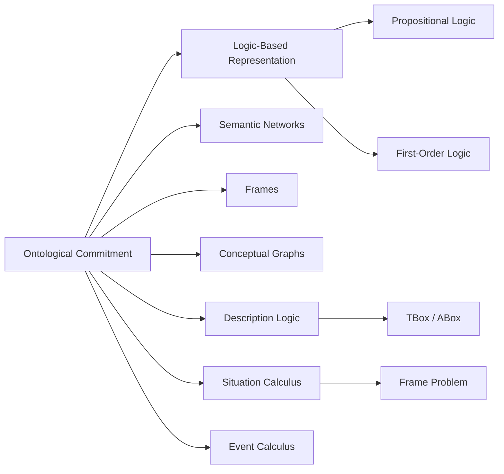

# Chapter 6: Knowledge Representation

**Previous:** [Chapter 6: Logical Agents and Propositional Logic](06-logic.md) | **Next:** [Chapter 7: First-Order Logic and Inference](07-fol.md)

## Learning Objectives

By the conclusion of this chapter, the student will be able to: (1) explain the role of ontology in knowledge representation; (2) distinguish propositional and first-order logic as representation languages; (3) construct semantic networks and frame-based representations; (4) apply description logic to taxonomic reasoning; (5) model actions and change using situation and event calculi.

## Chapter at a Glance

| Section | Key Topics | Key Terms |
|---------|-----------|-----------|
| Ontological Commitment | Conceptualization, categories | Ontology, expressiveness vs tractability |
| Logic-Based Rep. | PL syntax/semantics, FOL quantifiers | Terms, predicates, interpretation |
| Semantic Networks | is-a, has-property, part-of | Inheritance, multiple inheritance |
| Frames | Slots, defaults, procedural attachment | Demons, when-needed |
| Conceptual Graphs | Bipartite concept-relation graphs | Projection, canonical formation |
| Description Logic | TBox, ABox, OWL | Subsumption, satisfiability |
| Categories & Actions | Situation calculus, event calculus | Fluents, frame problem, successor-state |

## Chapter Roadmap



## 6.1 The Ontological Commitment


An **ontology** is a formal, explicit specification of a conceptualization. It defines the categories, relations, constraints, and axioms that capture the structure of a domain. The choice of ontology constitutes an ontological commitment: a decision about what kinds of entities exist in the model.

Knowledge representation languages vary in their **expressiveness** (what can be said) and **tractability** (how efficiently reasoning can be performed). There exists a fundamental trade-off: more expressive languages typically require greater computational resources for inference.

## 6.2 Logic-Based Representation

> **One-Sentence Takeaway:** Knowledge representation languages trade off expressiveness (how much you can say) against tractability (how fast you can reason) — choose the least expressive language that can express your problem.

> **💡 Pro Tip:** Description Logic (DL) sits at the sweet spot of the expressiveness-tractability trade-off. That is why OWL (based on DL) is the W3C standard for the Semantic Web — it is decidable and has polynomial-time classification algorithms.

### 6.2.1 Propositional Logic

**Syntax:** Atomic propositions $P, Q, R, \ldots$ combined with logical connectives $\neg, \land, \lor, \Rightarrow, \Leftrightarrow$.

**Semantics:** Truth tables assign truth values to formulas given an interpretation (assignment of truth values to atoms). A formula is valid (tautology) if true under all interpretations; satisfiable if true under at least one interpretation; unsatisfiable if false under all interpretations.

**Inference:** Modus ponens: from $\alpha$ and $\alpha \Rightarrow \beta$, infer $\beta$. Resolution: from $(\alpha \lor \beta)$ and $(\neg\beta \lor \gamma)$, infer $(\alpha \lor \gamma)$.

### 6.2.2 First-Order Logic (FOL)

FOL extends propositional logic with:
- **Terms:** Constants ($a, b$), variables ($x, y$), functions ($f(t_1, \ldots, t_n)$).
- **Predicates:** $P(t_1, \ldots, t_n)$ expressing relations among terms.
- **Quantifiers:** Universal $\forall x \, P(x)$ ("for all $x$, $P(x)$ holds"), existential $\exists x \, P(x)$ ("there exists $x$ such that $P(x)$ holds").

**Semantics:** An interpretation $\mathcal{I}$ maps constants to domain elements, functions to functions, and predicates to relations. Satisfaction of a formula is defined recursively on the structure of the formula.

**Example:** "All students are enrolled in at least one course":
$$\forall x \, (\text{Student}(x) \Rightarrow \exists y \, (\text{Course}(y) \land \text{Enrolled}(x, y)))$$

FOL is expressive enough to represent most commonsense knowledge, but inference in FOL is only semi-decidable.

## 6.3 Semantic Networks

A **semantic network** is a directed graph where nodes represent concepts or individuals and edges represent relations. Common edge types include:
- **is-a:** Indicates class membership (Fido is-a Dog).
- **has-property:** Indicates attribute (Dog has-property Mammal).
- **part-of:** Indicates composition (Wheel part-of Car).

**Inheritance** allows properties of a class to be inferred for all its instances. **Multiple inheritance** introduces potential conflicts that require resolution strategies.

## 6.4 Frames

A **frame** (Minsky, 1975) is a structured representation of a concept or object with named **slots** that hold values, procedures, or default information. Frames support **inheritance** through a hierarchy and **procedural attachment**: demons (when-needed, when-changed procedures) trigger computation upon slot access.

```
Frame: Course
  Slots:
    code: String
    title: String
    instructor: Person
    students: List of Person
    prerequisite: Course (default: none)
  Constraints:
    instructor must be a faculty member
    prerequisite must not be identical to self
```

## 6.5 Conceptual Graphs

**Conceptual graphs** (Sowa, 1984) provide a visual representation equivalent to FOL. Rectangles represent concepts; ovals represent conceptual relations. A conceptual graph is a bipartite graph of concept and relation nodes. The formalism includes:
- **Canonical formation rules:** Copy, restrict, join, simplify.
- **Projection:** A graph homomorphism used to check if one graph is subsumed by another.

## 6.6 Description Logic

**Description logic** (DL) is a family of knowledge representation formalisms that provide a decidable fragment of FOL with efficient reasoning algorithms. DL systems underpin the W3C Web Ontology Language (OWL).

A DL knowledge base consists of:
- **TBox (terminological box):** Axioms defining concepts and their relationships. Example: $\text{Mother} \equiv \text{Woman} \sqcap \exists \text{hasChild.Person}$
- **ABox (assertional box):** Facts about individuals. Example: $\text{Woman}(\text{Alice})$, $\text{hasChild}(\text{Alice}, \text{Bob})$

**Reasoning tasks:**
- **Satisfiability:** Is a concept non-empty?
- **Subsumption:** Is concept $C$ a subset of concept $D$?
- **Instance checking:** Is an individual an instance of a concept?
- **Retrieval:** Find all instances of a concept.

## 6.7 Categories and Actions

### 6.7.1 Categories

Categories organize knowledge into hierarchies. The **semantic web** formalizes this via RDF (Resource Description Framework), RDFS, and OWL. Key constructors include:
- **Intersection:** $C \sqcap D$
- **Union:** $C \sqcup D$
- **Complement:** $\neg C$
- **Existential restriction:** $\exists R.C$
- **Universal restriction:** $\forall R.C$

### 6.7.2 Situation Calculus

The **situation calculus** (McCarthy and Hayes, 1969) represents actions and their effects in a dynamic world. A **situation** is a history of actions. The initial situation is $S_0$. The function $do(a, s)$ returns the situation resulting from executing action $a$ in situation $s$.

**Fluents** are predicates whose truth depends on the situation: $\text{On}(x, y, s)$ means $x$ is on $y$ in situation $s$.

The **frame problem** arises because we must explicitly specify what does not change after an action. The **successor-state axiom** solves this:

$$\text{On}(x, y, do(a, s)) \Leftrightarrow (a = \text{stack}(x, y)) \lor (\text{On}(x, y, s) \land a \neq \text{move}(x, z))$$

### 6.7.3 Event Calculus

**Event calculus** (Kowalski and Sergot, 1986) represents events as points in time that initiate and terminate fluent values. Unlike situation calculus, event calculus supports continuous time, concurrent events, and delayed effects.

## 6.8 Reasoning Systems Architecture

A knowledge-based system consists of:
1. **Knowledge base (KB):** Stores domain-specific facts and rules.
2. **Inference engine:** Applies reasoning procedures to derive new knowledge.
3. **Explanation facility:** Justifies conclusions.
4. **Knowledge acquisition module:** Supports KB construction and maintenance.

## Concept Comparison

| Language/Formalism | Expressiveness | Decidable? | Inference Complexity | Best For |
|-------------------|:---:|:---:|:---:|---------|
| Propositional Logic | Low | ✅ | O(2ⁿ) SAT | Simple facts |
| First-Order Logic | High | ❌ (semi) | Undecidable | General domain axioms |
| Description Logic | Medium | ✅ | PTIME/EXPTIME | Taxonomies, OWL |
| Semantic Networks | Medium | Varies | Linear (inheritance) | Quick prototyping |
| Frames | Medium-High | Varies | Linear (with defaults) | Structured objects |

## Quick Reference — Ontology Concepts

| Concept | Definition | Example |
|---------|-----------|---------|
| Ontology | Formal specification of a conceptualization | Domain model |
| TBox | Terminology (concepts and roles) | Mother ≡ Woman ⊓ ∃hasChild.Person |
| ABox | Assertions about individuals | Woman(Alice) |
| Fluents | Situation-dependent predicates | On(x, y, s) |
| Frame Problem | Need to specify what stays the same | Successor-state axioms |
| Projection | Graph homomorphism check | Concept subsumption |

## Cross-Application Matrix

| Technique | ML | CV | NLP | Research |
|-----------|:---:|:---:|:---:|:---:|
| Ontology Engineering | ✅ | ✅ | ✅ | ✅ |
| Description Logic | ⬜ | ✅ | ✅ | ✅ |
| Semantic Networks | ⬜ | ✅ | ✅ | ✅ |
| Situation Calculus | ⬜ | ⬜ | ⬜ | ✅ |
| Frames | ⬜ | ✅ | ✅ | ✅ |

## Chapter Quiz

**Q1:** What is the frame problem?
- A) The challenge of representing knowledge in frames
- B) The need to explicitly specify what does not change after an action
- C) The difficulty of combining multiple inheritance hierarchies
- D) The trade-off between expressiveness and tractability

<details><summary>Answer</summary>B) The frame problem requires us to specify what stays the same (frame axioms) when an action occurs.</details>

**Q2:** Which component of a DL knowledge base stores facts about individuals?
- A) TBox
- B) ABox
- C) RBox
- D) RDF

<details><summary>Answer</summary>B) The ABox (assertional box) contains assertions about specific individuals.</details>

**Q3:** What makes Description Logic attractive for the Semantic Web?
- A) It is as expressive as FOL
- B) It is decidable with efficient classification algorithms
- C) It supports procedural attachment
- D) It eliminates the need for ontologies

<details><summary>Answer</summary>B) DL is decidable (unlike FOL) while being expressive enough for domain modeling, making it suitable for OWL.</details>

## 6.9 Summary

Knowledge representation is concerned with encoding domain knowledge in a form that supports automated reasoning. The choice of representation language involves trade-offs between expressiveness and computational tractability.

## Exercises

### Review Questions

1. Compare the expressiveness of propositional logic, FOL, and description logic. What reasoning tasks are tractable in each?
2. Explain the frame problem. How do successor-state axioms address it?
3. Distinguish between the TBox and ABox in description logic.

### Application Problems

4. Represent the following knowledge in FOL: "All professors are researchers. Some researchers are Nobel laureates. No Nobel laureate teaches undergraduate courses. Therefore, some professors do not teach undergraduate courses."
5. Construct a description logic ontology for a university domain with concepts: Person, Student, Professor, Course. Include roles: teaches, enrolledIn. Define at least three axioms and verify satisfiability.

### Challenge Problem

6. Implement a forward-chaining reasoner for a propositional KB containing Horn clauses. Apply it to a simple diagnosis domain (e.g., car故障 diagnosis). Explain how the system handles the case where multiple rules apply simultaneously.
