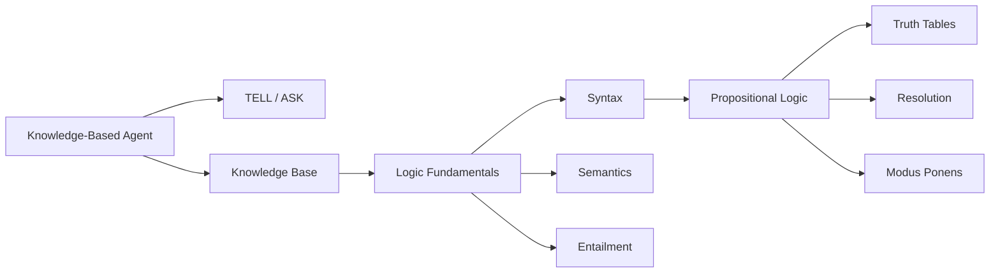

# Chapter 6: Logical Agents and Propositional Logic

**Previous:** [Chapter 5: Game Playing and Adversarial Search](05-game-playing.md) | **Next:** [Chapter 6: Knowledge Representation](06-knowledge-representation.md)

---

## Learning Objectives

- Explain the role of knowledge-based agents in AI.
- Define the components of a logic: syntax, semantics, and entailment.
- Translate natural language statements into Propositional Logic formulas.
- Evaluate the validity and satisfiability of logical sentences using truth tables.
- Implement inference rules like Modus Ponens and Resolution.

---

## Chapter at a Glance

| Section | Key Topics | Key Terms |
|---------|-----------|-----------|
| Knowledge-Based Agents | KB, TELL, ASK | Knowledge Base, entailment |
| Logic Fundamentals | Syntax, semantics, models | Entailment (⊨), soundness, completeness |
| Propositional Logic | Symbols, connectives, truth tables | Modus Ponens, Resolution |
| Satisfiability & Validity | Valid, satisfiable, unsatisfiable | Tautology, contradiction, SAT |

## Chapter Roadmap

---

## Theory

> **One-Sentence Takeaway:** A knowledge-based agent maintains a Knowledge Base that it TELLs and ASKs, using entailment to infer new facts that follow logically from what it already knows.

### Knowledge-Based Agents
A **knowledge-based agent** maintains a **Knowledge Base (KB)**, which is a set of sentences in a formal language. The agent operates through two main operations:
- **TELL**: Adding new information to the KB.
- **ASK**: Querying the KB to determine what follows from the known information.

### Logic Fundamentals
Every logic consists of:
- **Syntax**: Rules for constructing valid sentences.
- **Semantics**: Rules for determining the truth of a sentence with respect to a **model**.
- **Entailment ($KB \models \alpha$)**: Sentence $\alpha$ follows logically from KB if $\alpha$ is true in every model where KB is true.

> **💡 Pro Tip:** Resolution is refutation-complete for propositional logic — to prove KB ⊨ α, convert KB ∧ ¬α to CNF and derive the empty clause. This single inference rule powers most automated theorem provers.

### Propositional Logic (PL)
PL is the simplest logic, where symbols represent facts:
- **Symbols**: $P, Q, R, ...$
- **Connectives**: $\neg$ (Not), $\wedge$ (And), $\vee$ (Or), $\Rightarrow$ (Implication), $\Leftrightarrow$ (Biconditional).
- **Inference**:
  - **Modus Ponens**: From $P$ and $P \Rightarrow Q$, infer $Q$.
  - **Resolution**: From $P \vee Q$ and $\neg Q \vee R$, infer $P \vee R$.

> **⚠️ Warning:** Truth tables grow as 2ⁿ for n symbols. Real SAT problems use DPLL/CDCL algorithms with unit propagation and clause learning, not brute-force truth tables.

### Satisfiability and Validity
- **Valid**: A sentence is valid if it is true in **all** models (a tautology).
- **Satisfiable**: A sentence is satisfiable if it is true in **some** model.
- **Unsatisfiable**: A sentence is unsatisfiable if it is true in **no** models (a contradiction).

---

## Examples

### Example 1: Truth Table Evaluation
Determine if $(P \Rightarrow Q) \Leftrightarrow (\neg P \vee Q)$ is valid.
- **Step-by-step**:
  1. Create columns for $P$ and $Q$.
  2. Compute $P \Rightarrow Q$.
  3. Compute $\neg P$.
  4. Compute $\neg P \vee Q$.
  5. Compare results of step 2 and 4.
- **Truth Table**:
| P | Q | $P \Rightarrow Q$ | $\neg P \vee Q$ | Match? |
|---|---|---|---|---|
| T | T | T | T | Yes |
| T | F | F | F | Yes |
| F | T | T | T | Yes |
| F | F | T | T | Yes |
- **What it demonstrates**: The logical equivalence of implication and its disjunctive form.

### Example 2: The Wumpus World
A classic environment for logical agents.
- **Rule**: "A square is breezy if and only if there is a pit in an adjacent square."
- **Formalization**: $B_{1,1} \Leftrightarrow (P_{1,2} \vee P_{2,1})$
- **Inference**: If the agent perceives no breeze in (1,1) ($\neg B_{1,1}$), it can infer $\neg P_{1,2} \wedge \neg P_{2,1}$.
- **What it demonstrates**: How an agent uses logic to navigate a dangerous environment by eliminating possibilities.

## Concept Comparison

| Inference Method | Sound? | Complete? | Complexity | Best For |
|-----------------|:---:|:---:|:---:|---------|
| Truth Table | ✅ | ✅ | O(2ⁿ) | Small n debugging |
| Resolution | ✅ | Refutation-complete | EXP | Automated proving |
| DPLL | ✅ | ✅ (for SAT) | NP-complete avg fast | Large SAT instances |
| Forward Chaining | ✅ | ✅ (Horn) | Linear | Data-driven reasoning |
| Backward Chaining | ✅ | ✅ (Horn) | Linear | Goal-directed reasoning |

## Quick Reference — Logical Connectives

| Name | Operator | Read As | True When |
|------|:---:|---------|:---:|
| Negation | ¬P | not P | P is false |
| Conjunction | P ∧ Q | P and Q | Both are true |
| Disjunction | P ∨ Q | P or Q | At least one true |
| Implication | P ⇒ Q | if P then Q | P is false or Q is true |
| Biconditional | P ⇔ Q | P iff Q | Same truth value |

## Cross-Application Matrix

| Technique | ML Engineering | Computer Vision | NLP | Research |
|-----------|:---:|:---:|:---:|:---:|
| Propositional Logic | ⬜ | ⬜ | ✅ | ✅ |
| Resolution | ⬜ | ⬜ | ⬜ | ✅ |
| SAT Solving | ✅ | ⬜ | ⬜ | ✅ |
| Knowledge Bases | ⬜ | ⬜ | ✅ | ✅ |

## Chapter Quiz

**Q1:** What does it mean if KB ⊨ α?
- A) KB proves α syntactically
- B) α is true in every model where KB is true
- C) α is consistent with KB
- D) KB and α have no common models

Answer
B) Entailment KB ⊨ α means α is true in all models of KB — a semantic relationship.

**Q2:** Resolution is the only inference rule needed for refutation-complete proof in PL. What is refutation-completeness?
- A) It can prove any valid sentence
- B) It can derive the empty clause from any unsatisfiable KB
- C) It works only for Horn clauses
- D) It never produces false positives

Answer
B) Refutation-completeness means the unsatisfiability of KB ∧ ¬α can be proven by deriving the empty clause.

**Q3:** A sentence is valid if and only if:
- A) It is true in at least one model
- B) It is true in no models
- C) It is true in all models
- D) Its negation is satisfiable

Answer
C) A valid sentence (tautology) is true in all possible interpretations.

---

## Summary

- Logical agents use symbolic representations to reason about the world.
- Entailment is the relationship where one fact follows from others.
- Propositional logic uses boolean variables and connectives to build formulas.
- Truth tables provide a sound and complete (but exponential) method for checking entailment.
- Resolution is a powerful inference rule that forms the basis of many automated theorem provers.
- SAT solvers are highly optimized tools for finding models that satisfy propositional formulas.

---

## Exercises

### Review Questions
1. Define "soundness" and "completeness" in the context of inference.
2. What is the difference between $P \Rightarrow Q$ and $P \models Q$?
3. Construct the truth table for the XOR connective.
4. Convert $(A \wedge B) \Rightarrow C$ into Conjunctive Normal Form (CNF).

### Application Problems
1. Prove using a truth table: $\neg(P \wedge Q) \equiv \neg P \vee \neg Q$ (De Morgan's Law).
2. Use Resolution to show that $\{P \vee Q, \neg P\}$ entails $Q$.
3. Formalize the following: "If it rains, the ground is wet. It is raining. Therefore, the ground is wet."

### Challenge Problem
1. The **DPLL algorithm** is used for solving SAT problems. Explain how it improves upon simple truth table enumeration using techniques like unit propagation and pure literal elimination.
