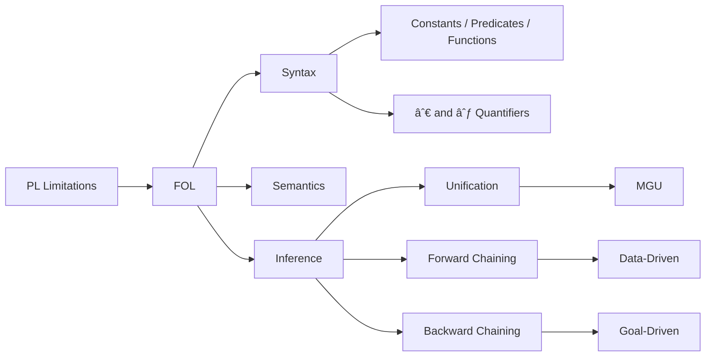

# Chapter 7: First-Order Logic and Inference

**Previous:** [Chapter 6: Knowledge Representation](06-knowledge-representation.md) | **Next:** [Chapter 7: Logical Reasoning and Inference](07-logical-reasoning.md)

---

## Learning Objectives

- Identify the limitations of Propositional Logic and the advantages of First-Order Logic (FOL).
- Define the syntax of FOL: objects, relations, functions, and quantifiers.
- Translate complex natural language sentences into FOL.
- Explain the processes of Unification and Lifting in logical inference.
- Compare Forward Chaining and Backward Chaining inference strategies.

## Chapter at a Glance

| Section | Key Topics | Key Terms |
|---------|-----------|-----------|
| Why FOL? | Objects, relations, functions, quantifiers | Expressive power vs PL |
| Syntax of FOL | Constants, predicates, functions, variables | Atomic sentences, terms |
| Inference in FOL | Universal instantiation, unification, lifting | MGU, substitution, lifting lemma |
| Inference Strategies | Forward chaining, backward chaining | Data-driven, goal-driven |

## Chapter Roadmap

---

## Theory

> **One-Sentence Takeaway:** FOL extends propositional logic with objects, relations, functions, and quantifiers — enabling the representation of general truths about entire classes of objects rather than just specific facts.

### Why First-Order Logic?
While Propositional Logic assumes the world contains facts, **First-Order Logic (FOL)** assumes the world contains:
- **Objects**: People, houses, numbers, colors.
- **Relations**: Red, round, brother of, bigger than.
- **Functions**: Father of, best friend, plus one.

This allows for much more expressive power, especially when combined with **quantifiers**.

### Syntax of FOL
- **Constants**: `KingJohn`, `2`, `Red`.
- **Predicates**: `Brother(KingJohn, Richard)`, `IsMortal(Socrates)`.
- **Functions**: `LeftLeg(John)`.
- **Variables**: `x`, `y`, `z`.
- **Quantifiers**:
  - **Universal ($\forall$)**: "For all". $\forall x P(x)$ means $P$ is true for every object $x$.
  - **Existential ($\exists$)**: "There exists". $\exists x P(x)$ means $P$ is true for at least one object $x$.

### Inference in FOL
Inference in FOL is more complex than in PL due to variables:
- **Universal Instantiation**: Replacing a variable with a ground term.
- **Unification**: Finding a substitution that makes two logical expressions identical.
- **Lifting**: Generalizing inference rules (like Modus Ponens) to work with variables and quantifiers.

### Inference Strategies
- **Forward Chaining**: Starting from known facts and applying rules to derive new facts until the goal is reached (data-driven).
- **Backward Chaining**: Starting from the goal and looking for rules that could derive it, recursively checking their premises (goal-driven).

> **💡 Pro Tip:** Use backward chaining when the goal is well-defined (diagnosis, question answering) and forward chaining when you want to derive all consequences (monitoring, alerting).

---

## Examples

### Example 1: Translating to FOL
"Every person has a mother."
- **Step-by-step**:
  1. Identify the predicate: `Person(x)` and `Mother(m, x)` (where $m$ is the mother of $x$).
  2. Use the universal quantifier for "Every person".
  3. Use the existential quantifier for "has a mother".
- **Result**: $\forall x Person(x) \Rightarrow \exists m (Mother(m, x) \wedge Person(m))$
- **What it demonstrates**: The use of nested quantifiers to represent relationships.

### Example 2: Unification
Find a substitution $\theta$ such that `Knows(John, x)` and `Knows(y, Mother(y))` unify.
- **Step-by-step**:
  1. Compare the first arguments: `John` and `y`. Substitute $\{y/John\}$.
  2. The second arguments are now `x` and `Mother(John)`.
  3. Substitute $\{x/Mother(John)\}$.
- **Final Substitution**: $\theta = \{y/John, x/Mother(John)\}$
- **What it demonstrates**: How a logical engine matches general patterns with specific facts.

## Concept Comparison

| Inference Method | Sound? | Complete? | Direction | Best For |
|-----------------|:---:|:---:|:---:|---------|
| Universal Instantiation | ✅ | ⬜ | Top-down | Grounding general rules |
| Unification | ❌ (matching) | ❌ (matching) | Bidirectional | Pattern matching |
| Forward Chaining | ✅ | ✅ (Horn) | Data-driven | Monitoring, alerting |
| Backward Chaining | ✅ | ✅ (Horn) | Goal-driven | Diagnosis, Q&A |
| Resolution | ✅ | ✅ (Refutation) | Refutation | Theorem proving |

## Quick Reference — FOL Syntax

| Element | Notation | Example |
|---------|----------|---------|
| Constant | Lowercase | `john`, `2`, `red` |
| Predicate | Capital letter | `Brother(john, richard)` |
| Function | Lowercase | `LeftLeg(john)` |
| Variable | Lowercase | `x`, `y`, `z` |
| Universal | ∀x P(x) | "All humans are mortal" |
| Existential | ∃x P(x) | "Someone is mortal" |

## Cross-Application Matrix

| Technique | ML Engineering | CV | NLP | Research |
|-----------|:---:|:---:|:---:|:---:|
| FOL Representation | ⬜ | ⬜ | ✅ | ✅ |
| Unification | ⬜ | ⬜ | ✅ | ✅ |
| Forward Chaining | ⬜ | ⬜ | ✅ | ✅ |
| Backward Chaining | ⬜ | ⬜ | ✅ | ✅ |
| Resolution | ⬜ | ⬜ | ⬜ | ✅ |

## Chapter Quiz

**Q1:** What is the Most General Unifier (MGU) of P(x, f(x)) and P(y, f(y))?
- A) {x/y, f(x)/f(y)}
- B) {y/x}
- C) {x/y} or {y/x} (either is MGU)
- D) They cannot be unified

Answer
C) {x/y} or {y/x} are both MGUs since the two expressions are identical up to variable renaming.

**Q2:** Which inference strategy is used by the Prolog programming language?
- A) Forward chaining
- B) Backward chaining with depth-first search
- C) Resolution with breadth-first search
- D) Universal instantiation

Answer
B) Prolog uses backward chaining with depth-first search (SLD resolution).

**Q3:** What makes FOL semi-decidable for inference?
- A) It cannot represent all truths
- B) If KB ⊨ α, the procedure will eventually find the proof, but if KB ⊭ α, it may loop forever
- C) It requires exponential time for all problems
- D) The unification algorithm is incomplete

Answer
B) FOL is semi-decidable: entailment can be proven if true, but non-entailment may not terminate.

---

## Summary

- First-Order Logic represents the world in terms of objects and relations.
- Quantifiers ($\forall, \exists$) allow for general statements about entire sets of objects.
- Unification is the core mechanism for matching patterns in FOL inference.
- Forward Chaining is typically used in production systems and expert systems.
- Backward Chaining is the foundation of the Prolog programming language.
- Godel's Completeness Theorem states that FOL is semantically complete.
- However, FOL is semi-decidable: we can prove entailment if it holds, but the process may not terminate if it does not.

---

## Exercises

### Review Questions
1. Contrast Propositional Logic and First-Order Logic.
2. What is the difference between a Predicate and a Function?
3. Explain the "Standardizing Apart" technique in inference.
4. Define a "Ground Term" and explain its importance in unification.

### Application Problems
1. Translate to FOL: "No two people have the same DNA, except for identical twins."
2. Unify the following pairs or state why they cannot be unified:
   - `P(A, B, x)` and `P(y, z, C)`
   - `Q(x, f(x))` and `Q(y, y)`
3. Describe a scenario where Backward Chaining is more efficient than Forward Chaining.

### Challenge Problem
1. **Resolution in FOL**: Describe the steps required to convert an FOL sentence into Conjunctive Normal Form (CNF), specifically explaining the process of **Skolemization** (removing existential quantifiers).
