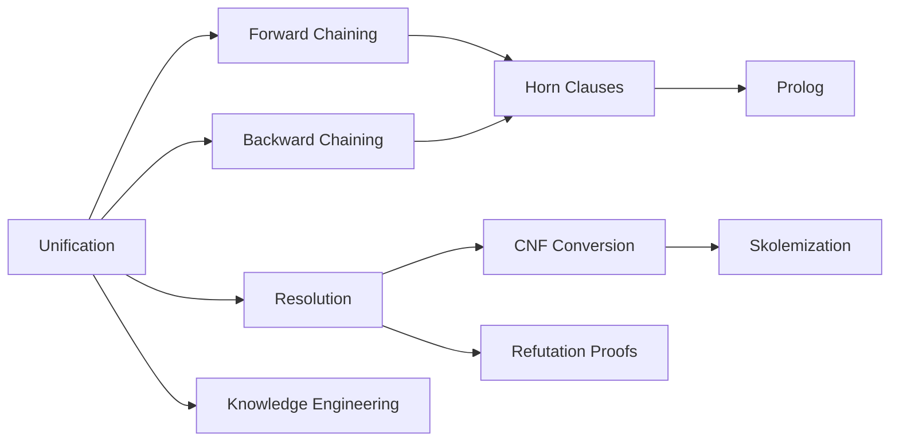

# Chapter 7: Logical Reasoning and Inference

**Previous:** [Chapter 7: First-Order Logic and Inference](07-fol.md) | **Next:** [Chapter 8: Uncertainty in AI](08-uncertainty.md)

## Learning Objectives

By the conclusion of this chapter, the student will be able to: (1) apply unification to match logical expressions; (2) implement forward and backward chaining for Horn clause KBs; (3) reduce FOL formulas to CNF and apply resolution; (4) write basic Prolog programs; (5) apply knowledge engineering methodology to build a logic-based system.

## Chapter at a Glance

| Section | Key Topics | Key Terms |
|---------|-----------|-----------|
| Unification | Substitution θ, MGU, occur check | Standardization apart, UNIFY |
| Forward Chaining | Data-driven, antecedent ⇒ consequent | Pattern matching, fixed point |
| Backward Chaining | Goal-driven, depth-first search | SLD resolution, loop detection |
| Resolution | CNF conversion, Skolemization | Empty clause, refutation |
| Horn Clauses | Definite clauses, definite vs non-Horn | Efficient inference |
| Prolog | Facts, rules, queries | SLD resolution, cut operator |
| Knowledge Engineering | Task → vocabulary → KB → debug | Circuits domain |

## Chapter Roadmap



## 7.1 Unification


> **One-Sentence Takeaway:** Unification finds a substitution θ that makes two logical expressions identical — the Most General Unifier (MGU) imposes the fewest constraints while achieving the match.

**Unification** is the process of finding a substitution $\theta$ that makes two logical expressions identical. A substitution $\theta = \{v_1/t_1, v_2/t_2, \ldots, v_n/t_n\}$ maps variables to terms. The application of $\theta$ to expression $E$, written $E\theta$, replaces each variable $v_i$ with term $t_i$, with all occurrences replaced simultaneously.

**Standardization apart** renames variables to avoid conflict. The **most general unifier (MGU)** is the substitution that imposes the fewest constraints while achieving unification.

```
function UNIFY(x, y, θ) returns substitution or failure
    if θ = failure then return failure
    if x = y then return θ
    if VARIABLE?(x) then return UNIFY-VAR(x, y, θ)
    if VARIABLE?(y) then return UNIFY-VAR(y, x, θ)
    if COMPOUND?(x) and COMPOUND?(y) then
        return UNIFY(ARGS(x), ARGS(y), UNIFY(OP(x), OP(y), θ))
    if LIST?(x) and LIST?(y) then
        return UNIFY(REST(x), REST(y), UNIFY(FIRST(x), FIRST(y), θ))
    return failure

function UNIFY-VAR(var, x, θ) returns substitution
    if {var/val} ∈ θ then return UNIFY(val, x, θ)
    if {x/val} ∈ θ then return UNIFY(var, val, θ)
    if OCCUR-CHECK?(var, x) then return failure
    return θ ∪ {var/x}
```

The **occur check** prevents circular substitutions ($\text{UNIFY}(x, f(x))$ fails). Most practical Prolog implementations omit the occur check for efficiency.

## 7.2 Forward Chaining

> **💡 Pro Tip:** Forward chaining is linear in the size of the KB for propositional Horn clauses — it makes an excellent choice for real-time monitoring systems where new facts arrive continuously and conclusions must be drawn immediately.

Forward chaining applies inference rules to known facts, deriving new facts until the query is proved or no further inferences are possible. It is data-driven: reasoning proceeds from premises toward conclusions.

```
function FORWARD-CHAIN(KB, rules) returns new facts
    facts ← set of all atomic sentences in KB
    loop do
        new_facts ← ∅
        for each rule (antecedent ⇒ consequent) in rules do
            substitutions ← all θ such that antecedentθ ⊆ facts
            for each θ in substitutions do
                new_facts ← new_facts ∪ {CONSEQUENTθ}
        if new_facts ⊆ facts then return facts
        facts ← facts ∪ new_facts
```

Forward chaining is sound and complete for Horn clause KBs. Time complexity is linear in the size of the KB for propositional case.

## 7.3 Backward Chaining

> **⚠️ Warning:** Backward chaining with depth-first search can loop infinitely on recursive rules. Always implement loop detection (visited goals table) or use iterative deepening in production systems.

Backward chaining starts from the query and works backward, attempting to find a chain of rules that supports the query. It is goal-driven.

```
function BACKWARD-CHAIN(KB, query) returns set of substitutions
    return BACKWARD-CHAIN-LIST(KB, [query], {})

function BACKWARD-CHAIN-LIST(KB, goals, θ) returns set of substitutions
    if EMPTY?(goals) then return {θ}
    q ← FIRST(goals)
    for each sentence s in KB that UNIFIES with q do
        θ' ← UNIFY(q, s, θ)
        if θ' ≠ failure then
            premises ← REST(s)  // antecedents of the rule
            results ← BACKWARD-CHAIN-LIST(KB, premises + REST(goals), θ')
            if results ≠ ∅ then return results
    return failure
```

Backward chaining is depth-first and may require loop detection. It forms the basis of Prolog execution.

## 7.4 Resolution

Resolution is a complete inference method for FOL. It refutes the negation of the query by deriving a contradiction.

### 7.4.1 Conjunctive Normal Form (CNF)

Resolution requires formulas in CNF: a conjunction of clauses, each clause being a disjunction of literals.

Conversion to CNF:
1. Eliminate implications ($\alpha \Rightarrow \beta \equiv \neg\alpha \lor \beta$).
2. Move $\neg$ inward using De Morgan's laws.
3. Standardize variables apart.
4. Skolemize existential quantifiers.
5. Drop universal quantifiers.
6. Distribute $\lor$ over $\land$.

### 7.4.2 Skolemization

Skolemization removes existential quantifiers by introducing fresh function symbols. Given $\forall x \, \exists y \, P(x, y)$, we replace $y$ with a function $f(x)$ that produces a witness: $\forall x \, P(x, f(x))$. The function $f$ is a **Skolem function**.

### 7.4.3 Resolution Rule

For two clauses $C_1$ and $C_2$ with complementary literals $l_1 \in C_1$ and $\neg l_2 \in C_2$ that unify under $\theta$:

$$\text{Resolve}(C_1, C_2) = (C_1\theta - l_1\theta) \cup (C_2\theta - l_2\theta)$$

```
function RESOLUTION(KB, α) returns true if KB ⊨ α
    clauses ← CNF(KB ∪ {¬α})
    loop do
        new ← ∅
        for each pair of clauses (C_i, C_j) in clauses do
            resolvents ← RESOLVE(C_i, C_j)
            if resolvents contains empty clause then return true
            new ← new ∪ resolvents
        if new ⊆ clauses then return false
        clauses ← clauses ∪ new
```

## 7.5 Horn Clauses

A **Horn clause** has at most one positive literal. Definite clauses have exactly one positive literal. Horn clause KBs admit efficient inference via forward and backward chaining.

## 7.6 Prolog

Prolog (Programming in Logic) is a logic programming language based on Horn clauses. A Prolog program consists of:

- **Facts:** `parent(john, mary).`
- **Rules:** `grandparent(X, Z) :- parent(X, Y), parent(Y, Z).`
- **Queries:** `?- grandparent(john, Who).`

Execution uses SLD resolution (backward chaining with depth-first search). Prolog's search strategy is incomplete due to depth-first exploration with no occurrence check.

## 7.7 Knowledge Engineering

Knowledge engineering methodology:

1. **Identify the task:** Determine what questions the system must answer.
2. **Assemble relevant knowledge:** Consult domain experts.
3. **Choose a vocabulary:** Define predicates, functions, and constants.
4. **Encode general knowledge:** Write axioms for domain rules.
5. **Encode specific problem instances:** Add facts about the particular case.
6. **Test and debug:** Verify against expected inferences.

The **electronic circuits domain** provides a canonical example: encode gate types, connections, and signal propagation rules; query the system for output values given inputs or diagnose faulty components given observed behavior.

## Concept Comparison

| Inference Method | Sound? | Complete? | KB Type | Use Case |
|-----------------|:---:|:---:|:---:|---------|
| Forward Chaining | ✅ | ✅ (Horn) | Horn clauses | Monitoring, alerting |
| Backward Chaining | ✅ | ✅ (Horn) | Horn clauses | Diagnosis, Q&A |
| Resolution | ✅ | ✅ (FOL) | CNF clauses | Theorem proving |
| SLD Resolution | ✅ | ⬜ (DFS) | Horn clauses | Prolog execution |

## Quick Reference — Unification Rules

| Expression 1 | Expression 2 | MGU | Can Unify? |
|-------------|-------------|:---:|:---:|
| P(x, A) | P(B, y) | {x/B, y/A} | ✅ |
| P(f(x), y) | P(z, g(z)) | {z/f(x), y/g(f(x))} | ✅ |
| P(x, f(x)) | P(y, y) | — | ❌ (occur check fails) |
| P(x, x) | P(A, B) | — | ❌ (A ≠ B) |

## Cross-Application Matrix

| Technique | ML | CV | NLP | Research |
|-----------|:---:|:---:|:---:|:---:|
| Unification | ⬜ | ⬜ | ✅ | ✅ |
| Forward Chaining | ⬜ | ⬜ | ✅ | ✅ |
| Backward Chaining | ⬜ | ⬜ | ✅ | ✅ |
| Resolution | ⬜ | ⬜ | ⬜ | ✅ |
| Prolog | ⬜ | ⬜ | ✅ | ✅ |

## Chapter Quiz

**Q1:** What does the occur check in unification prevent?
- A) Duplicate variable bindings
- B) Circular substitutions like {x/f(x)}
- C) Infinite recursion in the resolution algorithm
- D) Standardization apart conflicts

<details><summary>Answer</summary>B) The occur check prevents a variable from being bound to a term that contains it, avoiding infinite terms.</details>

**Q2:** What is the key difference between forward and backward chaining?
- A) Forward chaining is sound; backward chaining is not
- B) Forward chaining is data-driven; backward chaining is goal-driven
- C) Forward chaining works only with FOL; backward chaining works with PL
- D) Both are identical in behavior

<details><summary>Answer</summary>B) Forward chaining starts from known facts and derives new ones; backward chaining starts from a query and works backward toward known facts.</details>

**Q3:** In CNF conversion, Skolemization handles what?
- A) Dropping universal quantifiers
- B) Removing existential quantifiers by introducing Skolem functions
- C) Distributing ∨ over ∧
- D) Eliminating implications

<details><summary>Answer</summary>B) Skolemization replaces existential quantifiers with Skolem functions or constants during CNF conversion.</details>

## 7.8 Summary

Logical inference provides a rigorous foundation for deriving conclusions from knowledge bases. Forward chaining is data-driven; backward chaining is goal-driven; resolution provides completeness for FOL. Prolog demonstrates practical logic programming. Knowledge engineering methodology guides the construction of logic-based systems.

## Exercises

### Review Questions

1. Explain the purpose of the occur check in unification. Why is it computationally expensive?
2. Distinguish forward and backward chaining. When is each preferred?
3. Why must existential quantifiers be Skolemized during CNF conversion?

### Application Problems

4. Convert the following FOL sentence to CNF: $\forall x \, \forall y \, ((\exists z \, P(x, z) \land P(y, z)) \Rightarrow Q(x, y))$.
5. Write a Prolog program for family relationships (parent, sibling, aunt, uncle, cousin). Test with a KB of at least 10 facts.

### Challenge Problem

6. Implement a resolution theorem prover for propositional logic in Python. Apply it to the following problem: Given $A \Rightarrow B$, $B \Rightarrow C$, $\neg D \Rightarrow \neg C$, $A \lor D$, prove $C$.
