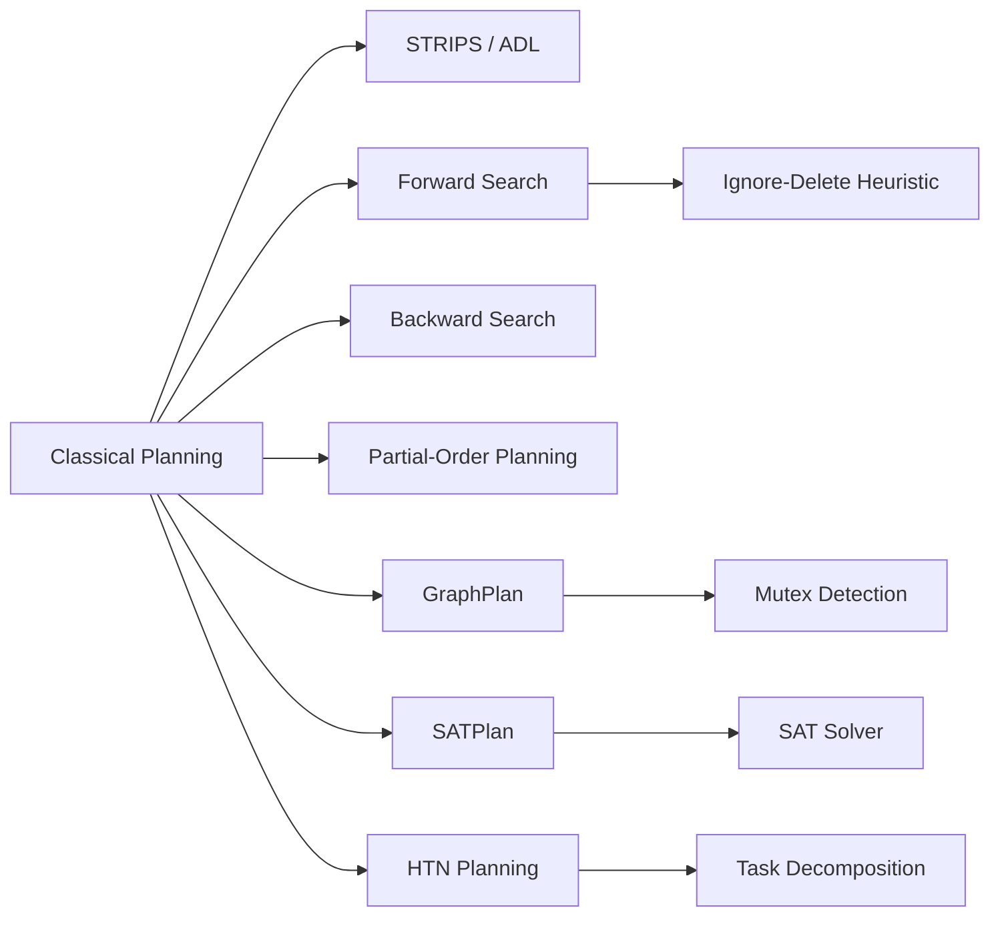

# Chapter 8: Planning

**Previous:** [Chapter 8: Uncertainty and Probabilistic Reasoning](08-uncertainty.md) | **Next:** [Chapter 9: Reasoning Under Uncertainty](09-uncertainty.md)

## Learning Objectives

By the conclusion of this chapter, the student will be able to: (1) formulate planning problems in STRIPS and ADL; (2) implement forward and backward state-space planning; (3) construct partial-order plans; (4) apply GraphPlan and SATPlan algorithms; (5) understand hierarchical task network planning.

## Chapter at a Glance

| Section | Key Topics | Key Terms |
|---------|-----------|-----------|
| Classical Planning | STRIPS, ADL, Blocks World | Precondition, add/delete list |
| Forward/Backward Search | Progression, regression | Ignore-delete-lists heuristic |
| Partial-Order Planning | Causal links, open preconditions | Threat, promotion, demotion |
| GraphPlan | Planning graph, mutex relations | Level-off, plan extraction |
| SATPlan | SAT encoding, CNF | Action at time i, frame axioms |
| HTN Planning | Task decomposition methods | Primitive vs compound tasks |
| Practical Planners | FF, FastDownward | Relaxed plan, causal graph |

## Chapter Roadmap



## 8.1 Classical Planning


**Planning** is the process of selecting a sequence of actions to achieve a goal. > **One-Sentence Takeaway:** Classical planning selects a sequence of actions to reach a goal — the STRIPS representation decomposes each action into preconditions, add effects, and delete effects.

Classical planning assumes a deterministic, fully observable, static environment with finite actions and states.

### 8.1.1 STRIPS Representation

STRIPS (Stanford Research Institute Problem Solver, 1971) represents actions through three components:

- **Precondition:** A conjunction of positive literals that must be true before the action.
- **Add list:** Positive literals added by the action.
- **Delete list:** Positive literals removed by the action.

Formally, an action $a$ is applicable in state $s$ if $\text{Precond}(a) \subseteq s$. The resulting state is:

$$\text{Result}(s, a) = (s - \text{Delete}(a)) \cup \text{Add}(a)$$

**Example (Blocks World action):**
```
Action(Stack(x, y)
    Precond: Clear(y) ∧ Holding(x)
    Effect: ¬Clear(y) ∧ ¬Holding(x) ∧ On(x, y))
```

### 8.1.2 ADL (Action Description Language)

ADL extends STRIPS with:
- Conditional effects: effects that apply only if certain conditions hold.
- Quantified preconditions and effects.
- Types for objects and variables.

## 8.2 Forward and Backward Search

### 8.2.1 Forward (Progression) Search

Forward search applies actions from the initial state, generating successors until a goal state is reached. The branching factor can be large.

**Heuristics for forward search:** The relaxed problem (ignoring delete lists) provides an admissible heuristic. The **ignore-delete-lists** heuristic counts actions in the relaxed plan.

### 8.2.2 Backward (Regression) Search

Backward search starts from the goal and applies actions in reverse, generating relevant predecessors. A regression step seeks an action whose effects satisfy a subgoal and adds the action's preconditions as new subgoals.

## 8.3 Partial-Order Planning (POP)

State-space planners produce totally ordered action sequences. Partial-order planning introduces flexibility by representing plans as partially ordered sets of actions.

A **partial-order plan** is a tuple $\langle A, O, L, G \rangle$ where:
- $A$: set of actions (including Start and Finish).
- $O$: ordering constraints ($A_i \prec A_j$).
- $L$: causal links ($A_i \xrightarrow{p} A_j$), meaning $A_i$ achieves $p$ for $A_j$.
- $G$: open preconditions (preconditions not yet achieved).

```
function POP(initial, goal) returns plan
    plan ← MAKE-MINIMAL-PLAN(initial, goal)
    loop do
        if no open preconditions in plan then return plan
        select an open precondition p on action A_need
        choose an action A_add (existing or new) that achieves p
        add causal link A_add → A_need and ordering A_add ≺ A_need
        resolve any threats to causal links
```

A **threat** occurs when an action $A_k$ could undo a causal link $A_i \xrightarrow{p} A_j$. Resolved by promotion ($A_j \prec A_k$) or demotion ($A_k \prec A_i$).

POP is sound, complete, and produces plans without unnecessary ordering constraints.

## 8.4 GraphPlan

GraphPlan (Blum and Furst, 1997) constructs a compact planning graph that encodes all possible action sequences up to a given length. The graph alternates between **proposition layers** and **action layers**.

**Construction:**
- Layer $S_0$: initial state propositions.
- Layer $A_0$: all actions whose preconditions are in $S_0$ (plus no-op actions).
- Layer $S_1$: $S_0$ plus all add effects of $A_0$ actions.
- Continue until goal propositions appear at some $S_k$.

**Mutual exclusion (mutex)** relations prevent invalid combinations:
- Actions are mutex if they interfere (one deletes the other's precondition or effect), compete for resources, or have inconsistent preconditions.
- Propositions are mutex if all ways to achieve them are mutex.

```
function GRAPHPLAN(problem) returns plan or failure
    graph ← INITIAL-PLANNING-GRAPH(problem)
    for k = 0 to ∞ do
        if goal propositions present in S_k with no mutex then
            plan ← EXTRACT-SOLUTION(graph, k)
            if plan ≠ failure then return plan
        graph ← EXPAND-GRAPH(graph, k+1)
        if graph has leveled off then return failure
```

GraphPlan significantly influenced modern planning and demonstrated polynomial-time plan existence checking.

## 8.5 SATPlan

SATPlan reduces planning to propositional satisfiability. The plan of length $k$ is encoded as a SAT formula, and a SAT solver searches for a satisfying assignment.

**Encoding variables:**
- $\text{At}(p, i)$: proposition $p$ holds at time $i$.
- $\text{Action}(a, i)$: action $a$ executes at time $i$.

**Constraints:**
- **Initial state:** $\text{At}(p, 0)$ for all initial facts.
- **Goal state:** $\text{At}(g, k)$ for each goal $g$.
- **Action precondition:** $\text{Action}(a, i) \Rightarrow \bigwedge \text{Precond}(a, i)$.
- **Action effects:** $\text{Action}(a, i) \Rightarrow \bigwedge \text{Add}(a, i+1) \land \bigwedge \neg \text{Delete}(a, i+1)$.
- **Frame axioms:** propositions persist unless an action changes them.
- **Exactly one action per time step (optional).**

SATPlan with modern SAT solvers (e.g., MiniSat, Glucose) is highly competitive.

## 8.6 Hierarchical Task Network (HTN) Planning

HTN planning decomposes high-level tasks into primitive actions via **task decomposition methods**. A method specifies how to achieve a task as a plan of subtasks.

```
Method(Navigate(robot, from, to))
    Task: Navigate(robot, from, to)
    Subtasks: LocateCurrentPosition(robot),
              PlanRoute(from, to),
              FollowRoute(robot, route)
```

HTN planners (SHOP2, PyHop) are used in real-world applications including logistics, manufacturing, and game AI.

## 8.7 Practical Planners

**FF (Fast Forward):** Employs forward search with the relaxed plan heuristic (number of actions in the ignoring-delete-lists plan). Uses enforced hill climbing: if no local improvement exists, falls back to breadth-first search.

**FastDownward:** Introduced the causal graph heuristic and multi-heuristic search. Uses a causal graph to decompose the planning problem into subproblems.

> **💡 Pro Tip:** The ignore-delete-lists heuristic is simple but extremely effective for forward search planning. It solves the relaxed problem (no delete effects) which is always solvable and provides admissible estimates for the original problem.

> **⚠️ Warning:** Partial-order planning introduces threats that require promotion/demotion resolution. Always check all causal links when adding a new action — overlooking a threat produces an invalid plan.

## Concept Comparison

| Planning Method | Search Space | Plan Type | Sound? | Complete? | Complexity |
|----------------|:---:|:---:|:---:|:---:|:---:|
| Forward Search | State | Total order | ✅ | ✅ | High branching |
| Backward Search | Goal | Total order | ✅ | ✅ | Lower branching |
| Partial-Order | Plan | Partial order | ✅ | ✅ | Exponential |
| GraphPlan | Graph | Total order | ✅ | ✅ | Poly existence |
| SATPlan | SAT formula | Total order | ✅ | ✅ | NP-complete |
| HTN | Task network | Hierarchy | ✅ | Domain-dep | Domain-dep |

## Quick Reference — STRIPS Action Model

| Component | Description | Example |
|-----------|-------------|---------|
| Action name | Unique identifier | Stack(x, y) |
| Precondition | Must hold before action | Clear(y) ∧ Holding(x) |
| Add list | Becomes true after action | On(x, y) |
| Delete list | Becomes false after action | Clear(y), Holding(x) |

## Cross-Application Matrix

| Technique | ML | CV | NLP | Research |
|-----------|:---:|:---:|:---:|:---:|
| STRIPS Planning | ⬜ | ⬜ | ⬜ | ✅ |
| Partial-Order | ⬜ | ⬜ | ⬜ | ✅ |
| GraphPlan | ⬜ | ⬜ | ⬜ | ✅ |
| SATPlan | ✅ | ⬜ | ⬜ | ✅ |
| HTN Planning | ⬜ | ✅ | ✅ | ✅ |

## Chapter Quiz

**Q1:** What does a causal link A→B represent in partial-order planning?
- A) A happens before B
- B) A achieves a precondition p for B
- C) B depends on A's delete list
- D) A and B are mutually exclusive

<details><summary>Answer</summary>B) A causal link A→B means action A achieves proposition p that is a precondition for action B.</details>

**Q2:** Why might GraphPlan be preferred over forward state-space search?
- A) It always finds shorter plans
- B) It constructs a compact graph encoding all possible plans, enabling polynomial-time plan existence checking
- C) It does not need action definitions
- D) It handles continuous state spaces

<details><summary>Answer</summary>B) GraphPlan's planning graph compactly represents all possible action sequences up to a given length with polynomial-time construction.</details>

**Q3:** What is the key advantage of HTN planning over classical STRIPS planning?
- A) HTN is always faster
- B) HTN handles complex real-world tasks through hierarchical decomposition matching human problem-solving
- C) HTN does not require action preconditions
- D) HTN guarantees optimal plans

<details><summary>Answer</summary>B) HTN decomposes high-level tasks into subtasks via methods, mirroring how humans break complex problems into manageable steps.</details>

## 8.8 Summary

Classical planning generates action sequences to achieve goals. STRIPS and ADL provide action representations. Partial-order planning produces flexibly ordered plans; GraphPlan and SATPlan transform planning into graph or SAT problems. HTN planning handles complex real-world tasks through hierarchical decomposition.

## Exercises

### Review Questions

1. Compare forward and backward search in planning. Why might backward search have a smaller branching factor?
2. Explain the purpose of causal links in partial-order planning. What constitutes a threat?
3. Describe the mutual exclusion relations in GraphPlan. Why are they necessary?

### Application Problems

4. Formulate the Blocks World problem in STRIPS: initial state (A on Table, B on Table, C on A), goal state (B on C, A on B). Show the planning graph up to level 3.
5. Encode a simple logistics problem (package delivery between cities using trucks) as a SATPlan instance with 3 time steps.

### Challenge Problem

6. Implement forward search with the ignore-delete-lists heuristic for the Blocks World domain. Compare performance with backward search on problems with 3--8 blocks.
