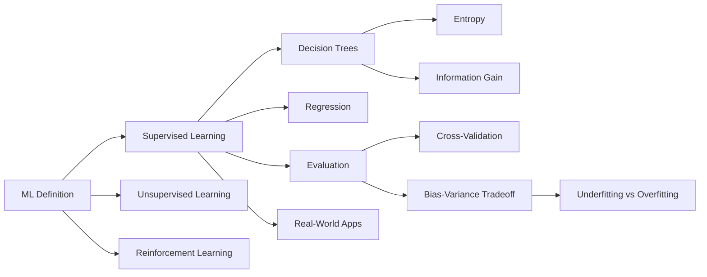

# Chapter 9: Machine Learning: Learning from Examples

**Previous:** [Chapter 9: Reasoning Under Uncertainty](09-uncertainty.md) | **Next:** [Chapter 10: Neural Networks and Deep Learning](10-deep-learning.md)

---

## Learning Objectives

- Define the core goals of Machine Learning and the different types of learning (Supervised, Unsupervised, Reinforcement).
- Explain the concept of "induction" and the importance of inductive bias.
- Analyze the Decision Tree learning algorithm and the use of Information Gain.
- Discuss the "Bias-Variance Tradeoff" and its impact on model generalization.
- Understand the methodology for evaluating models using training, validation, and test sets.

---

## Why Machine Learning Matters

**Real-World Analogy:** A child learning to recognize animals does not need an explicit rulebook. Instead, the child is shown examples — "this furry animal that barks is a dog," "this feathered animal that quacks is a duck." Over time, the child's brain identifies patterns (four legs, fur, bark → dog) and uses them to classify never-before-seen animals correctly. Machine learning algorithms follow the exact same principle: instead of hard-coding rules, we feed data and let the algorithm discover the underlying patterns.

**Why this shifts everything:** Traditional programming requires a human to write every rule. Machine Learning replaces manual rule-writing with automated pattern discovery — enabling systems that improve with experience, adapt to new data, and solve problems too complex for explicit rules (face recognition, speech transcription, game playing at superhuman level).

---

## Chapter at a Glance

| Section | Key Topics | Key Terms |
|---------|-----------|-----------|
| What is ML? | Supervised, unsupervised, reinforcement | P (performance), T (task), E (experience) |
| Types of Learning | Classification, regression, clustering, RL | Label, feature, target, reward |
| Inductive Learning | Hypothesis, inductive bias | Occam's Razor, hypothesis space |
| Decision Trees | Entropy, information gain | ID3, splitting criterion, pruning |
| Model Evaluation | Cross-validation, train/val/test | Overfitting, underfitting |
| Bias-Variance Tradeoff | Underfitting, overfitting, generalization | Bias, variance, irreducible error |
| Real-World Applications | Recommendation, fraud, vision | Deployment pipeline |

## Chapter Roadmap



---

## Theory


> **One-Sentence Takeaway:** Machine learning algorithms improve performance on a task with experience — the key challenge is generalizing from finite training data to unseen examples.

> **Pro Tip:** Decision trees with information gain naturally handle mixed data types and produce interpretable models. However, they can overfit badly — use pruning (min_samples_split, max_depth) or switch to ensemble methods (Random Forest) for better generalization.

---

### What is Machine Learning?

Machine Learning (ML) is the study of algorithms that improve their performance **P** at some task **T** with experience **E** (Tom Mitchell, 1997).

- **Supervised Learning**: The agent learns a function from input-output pairs (labels provided).
- **Unsupervised Learning**: The agent learns patterns in the data without explicit labels (e.g., clustering).
- **Reinforcement Learning**: The agent learns by interacting with an environment and receiving rewards or penalties.

---

## Types of Machine Learning — Deep Dive

### 1. Supervised Learning

**Real-World Analogy:** A tutor showing a student labeled flashcards — "this is a cat" (image + label). After enough examples, the student can identify cats in new photos.

**Definition:** The algorithm learns a mapping function $f: X \to Y$ from input features $X$ to output labels $Y$ using a labeled training dataset.

**Algorithm Steps (Generic Supervised Learning):**
1. Collect labeled dataset $\{(x_1, y_1), (x_2, y_2), ..., (x_n, y_n)\}$
2. Split data into training, validation, and test sets
3. Choose a model family (e.g., linear regression, decision tree, SVM)
4. Define a loss function $L(y, \hat{y})$ that measures prediction error
5. Train the model by minimizing the loss on training data
6. Tune hyperparameters using validation set performance
7. Evaluate final model on the held-out test set

**Pseudocode:**
```
FUNCTION SupervisedLearning(Dataset D)
    Split D into D_train, D_val, D_test
    Initialize model with hyperparameters θ
    FOR epoch = 1 to max_epochs:
        FOR each batch (X_batch, y_batch) in D_train:
            y_pred = model.predict(X_batch)
            loss = loss_function(y_batch, y_pred)
            gradients = compute_gradients(loss)
            θ = θ - learning_rate * gradients
        val_loss = evaluate(model, D_val)
        IF val_loss not improved for patience epochs:
            BREAK
    test_loss = evaluate(model, D_test)
    RETURN model
```

**Subtypes:**
| Type | Output | Loss Function | Example Algorithm |
|------|--------|---------------|-------------------|
| Classification | Discrete class | Cross-entropy | Decision Tree, Logistic Regression |
| Regression | Continuous value | Mean Squared Error | Linear Regression, SVR |

**Python Implementation — k-Nearest Neighbors:**
```python
from sklearn.neighbors import KNeighborsClassifier
from sklearn.model_selection import train_test_split
from sklearn.metrics import accuracy_score
import numpy as np

# Sample dataset: [height, weight] → species
X = np.array([[150, 50], [160, 55], [170, 65],
              [140, 45], [180, 75], [155, 52]])
y = np.array(['dog', 'dog', 'cat', 'dog', 'cat', 'cat'])

# Split 80/20
X_train, X_test, y_train, y_test = train_test_split(
    X, y, test_size=0.2, random_state=42
)

# Train k-NN (k=3)
model = KNeighborsClassifier(n_neighbors=3)
model.fit(X_train, y_train)

# Predict
y_pred = model.predict(X_test)
print(f"Accuracy: {accuracy_score(y_test, y_pred):.2f}")
```

**Complexity Analysis:**

| Operation | Complexity | Why |
|-----------|------------|-----|
| Training (k-NN) | $O(1)$ | k-NN is lazy — no actual training, just stores data |
| Prediction (k-NN) | $O(n \cdot d)$ | Must compute distance to all $n$ training points across $d$ features |
| Training (Decision Tree) | $O(n \cdot d \cdot \log n)$ | Each split sorts features, tree height is $O(\log n)$ |
| Prediction (Decision Tree) | $O(\log n)$ | Traverses tree from root to leaf, tree depth is $O(\log n)$ |

**Advantages & Disadvantages:**

| Advantages | Disadvantages |
|------------|---------------|
| Produces interpretable models (trees, linear) | Requires large labeled datasets |
| Well-understood theory and evaluation | Can overfit without careful regularization |
| Broad algorithm choice for different problems | Sensitive to irrelevant features |
| Direct performance metrics (accuracy, MSE) | Class imbalance can bias results |

**Edge Cases:**
- **Missing values**: Many algorithms cannot handle NaN — must impute (mean, median, KNN imputer) or drop
- **Class imbalance**: 99% class A / 1% class B → model achieves 99% accuracy by always predicting A. Fix with class weights, oversampling (SMOTE), or undersampling
- **Outliers**: Single extreme value can skew linear regression coefficients. Use robust scalers or tree-based models
- **Categorical features**: Must one-hot encode or label-encode; tree models handle categorical splits natively

---

### 2. Unsupervised Learning

**Real-World Analogy:** A librarian asked to organize a pile of books into groups without any labels. The librarian notices that some books have red covers, some have math equations, some are fiction — and groups them by similarity. The groups emerge naturally from the data.

**Definition:** The algorithm finds hidden patterns, groupings, or structure in unlabeled data. No ground-truth labels exist.

**Algorithm Steps (k-Means Clustering):**
1. Choose the number of clusters $k$
2. Initialize $k$ centroids randomly (or using k-means++)
3. For each data point, assign it to the nearest centroid
4. Recompute each centroid as the mean of all points assigned to it
5. Repeat steps 3-4 until centroids stop changing (convergence)
6. Evaluate clustering quality using inertia or silhouette score

**Pseudocode:**
```
FUNCTION KMeans(Dataset D, int k)
    centroids = randomly select k points from D
    REPEAT:
        clusters = empty list of k lists
        FOR each point p in D:
            distances = [distance(p, c) for c in centroids]
            nearest = argmin(distances)
            clusters[nearest].append(p)
        new_centroids = []
        FOR i = 1 to k:
            new_centroids[i] = mean(clusters[i])
        IF centroids == new_centroids:
            BREAK
        centroids = new_centroids
    RETURN centroids, clusters
```

**Dry Run — k-Means on 6 points with k=2:**

| Iteration | Centroid 1 | Centroid 2 | Cluster Assignments | Converged? |
|-----------|-----------|-----------|---------------------|:----------:|
| Init | (2,3) | (8,5) | — | No |
| 1 | (2.0, 3.0) | (8.0, 5.0) | A(1,2),B(2,4),C(3,3)→C1; D(7,5),E(8,6),F(9,4)→C2 | No |
| 2 | (2.0, 3.0) | (8.0, 5.0) | Same as iteration 1 | **Yes** |

**Python Implementation — k-Means:**
```python
from sklearn.cluster import KMeans
from sklearn.datasets import make_blobs
import matplotlib.pyplot as plt

# Generate synthetic data: 300 points, 4 centers
X, _ = make_blobs(n_samples=300, centers=4,
                  n_features=2, random_state=42)

# Apply k-Means
kmeans = KMeans(n_clusters=4, init='k-means++',
                max_iter=300, random_state=42)
kmeans.fit(X)

print(f"Cluster centers:\n{kmeans.cluster_centers_}")
print(f"Inertia (within-cluster variance): {kmeans.inertia_:.2f}")
```

**Complexity Analysis:**

| Operation | Complexity | Why |
|-----------|------------|-----|
| k-Means (one iteration) | $O(k \cdot n \cdot d)$ | Each of $n$ points computes distance to $k$ centroids across $d$ dimensions |
| k-Means (total) | $O(k \cdot n \cdot d \cdot i)$ | $i$ iterations until convergence |
| DBSCAN | $O(n \cdot d)$ with spatial index | Neighborhood queries are constant-time with kd-tree |
| Hierarchical Clustering | $O(n^2 \log n)$ | Must compute $n \times n$ distance matrix, then merge |

**Advantages & Disadvantages:**

| Advantages | Disadvantages |
|------------|---------------|
| No labels needed — works on raw data | Results are subjective — no ground truth to validate |
| Discovers hidden patterns | Must choose $k$ (number of clusters) in advance |
| Scalable to large datasets (mini-batch k-Means) | Sensitive to initialization and scaling |
| Useful for preprocessing and anomaly detection | Curse of dimensionality — distances become meaningless in high dimensions |

**Edge Cases:**
- **Non-spherical clusters**: k-Means fails on crescent-shaped or nested clusters — use DBSCAN or Spectral Clustering instead
- **Varying density**: DBSCAN with fixed epsilon struggles — use OPTICS
- **High dimensions**: Distance concentration (all points appear equally far) — use PCA first
- **Deterministic initialization**: k-Means++ mitigates random initialization issues but does not guarantee global optimum

---

### 3. Reinforcement Learning

**Real-World Analogy:** A puppy learning to fetch a ball. When the puppy brings the ball back, it gets a treat (reward). When it runs away, it gets nothing (no reward). The puppy learns which actions lead to treats through trial and error — not from being told the correct action.

**Definition:** An agent learns to make decisions by interacting with an environment. The agent receives a reward signal and learns a **policy** $\pi(a|s)$ that maps states to actions to maximize cumulative reward.

**Algorithm Steps (Q-Learning):**
1. Initialize Q-table with zeros for all state-action pairs
2. Observe current state $s$
3. Choose action $a$ using $\epsilon$-greedy policy (explore with probability $\epsilon$, exploit otherwise)
4. Execute action $a$, observe reward $r$ and next state $s'$
5. Update Q-value: $Q(s, a) \leftarrow Q(s, a) + \alpha[r + \gamma \max_{a'} Q(s', a') - Q(s, a)]$
6. Set $s \leftarrow s'$
7. Repeat steps 2-6 until convergence (Q-values stabilize)

**Pseudocode:**
```
FUNCTION QLearning(Environment env, float alpha, float gamma, float epsilon)
    Q = zero-initialized table [states × actions]
    FOR episode = 1 to max_episodes:
        s = env.reset()
        WHILE s is not terminal:
            IF random() < epsilon:
                a = random_action()
            ELSE:
                a = argmax(Q[s, :])
            s', r = env.step(a)
            Q[s, a] = Q[s, a] + alpha * (r + gamma * max(Q[s', :]) - Q[s, a])
            s = s'
    RETURN Q
```

**Dry Run — Q-Learning on 4-state Grid World ($\alpha=0.1, \gamma=0.9, \epsilon=0.2$):**

| Episode | State | Action | Reward | Q(s,a) Before | TD Target | Q(s,a) After |
|:-------:|:-----:|:------:|:------:|:-------------:|:---------:|:------------:|
| 1 | S0 | Right | 0 | 0 | 0 + 0.9·0 = 0 | 0 |
| 5 | S0 | Right | 0 | 0 | 0 + 0.9·1 = 0.9 | 0.09 |
| 5 | S1 | Right | 0 | 0 | 0 + 0.9·0 = 0 | 0 |
| 10 | S0 | Right | 0 | 0.09 | 0 + 0.9·0.09 = 0.081 | 0.081 |
| 20 | S2 | Right | +10 | 0 | 10 + 0.9·0 = 10 | 1.0 |
| 50 | S0 | Right | 0 | 0.05 | 0 + 0.9·0.5 = 0.45 | 0.09 |

**Python Implementation — Q-Learning:**
```python
import numpy as np

# Simple 4-state, 2-action environment
n_states, n_actions = 4, 2
Q = np.zeros((n_states, n_actions))
alpha, gamma, epsilon = 0.1, 0.9, 0.2
episodes = 1000

# Reward structure: state 3 gives +10 on action 0
rewards = np.array([[0, 0], [0, 0], [0, 0], [10, 0]])

for _ in range(episodes):
    s = 0  # start state
    while s != 3:  # terminal state
        a = np.random.randint(n_actions) if np.random.random() < epsilon \
            else np.argmax(Q[s])
        s_next = min(s + 1, 3)  # simplified transition
        r = rewards[s, a]
        Q[s, a] += alpha * (r + gamma * np.max(Q[s_next]) - Q[s, a])
        s = s_next

print("Learned Q-table:")
print(Q)
```

**Complexity Analysis:**

| Operation | Complexity | Why |
|-----------|------------|-----|
| Q-Learning update | $O(1)$ | Single table lookup and update — constant time |
| Q-Learning (training) | $O(|S|^2 \cdot |A| \cdot E)$ | Each episode explores up to $|S|$ states, repeated $E$ times |
| Deep Q-Network (forward) | $O(L)$ | $L$ layers in neural network — architecture-dependent |
| Policy Gradient | $O(|S| \cdot |A| \cdot T)$ | $T$ timesteps per episode, gradient computation per step |

**Advantages & Disadvantages:**

| Advantages | Disadvantages |
|------------|---------------|
| Learns optimal behavior without explicit supervision | Training can be unstable and sample-inefficient |
| Handles delayed rewards (credit assignment) | Hyperparameter-sensitive (alpha, gamma, epsilon) |
| Applicable to sequential decision problems | Large state spaces require function approximation |
| Achieved superhuman performance (Go, Atari, robotics) | Reward engineering is often non-trivial |

**Edge Cases:**
- **Sparse rewards**: Agent explores for thousands of steps without feedback — use reward shaping, curiosity-driven exploration, or HER
- **Non-stationary environments**: Transition probabilities change over time — use continual learning approaches
- **Catastrophic forgetting**: Neural network agents forget earlier skills when learning new ones — use experience replay or periodic consolidation
- **Exploration vs exploitation deadlock**: Purely greedy policy may miss better solutions — $\epsilon$-decay schedules are critical

---

### Inductive Learning

The goal of inductive learning is to find a hypothesis $h$ that approximates the true function $f$ using only a finite set of examples. Because many hypotheses can fit the data, the agent must have an **inductive bias** — a preference for one type of hypothesis over another (e.g., Occam's Razor prefers simpler hypotheses).

**Hypothesis Space:** The set of all possible functions the learning algorithm can produce. A larger hypothesis space increases expressiveness but makes finding the right hypothesis harder.

---

### Decision Trees

**Real-World Analogy:** A doctor diagnosing a patient uses a series of yes/no questions — "Do you have a fever?" (yes → "Is it above 102°F?" / no → "Do you have a cough?"). Each question narrows down the possibilities until a diagnosis is reached. This is exactly how a decision tree works.

A Decision Tree is a flowchart-like structure where each internal node represents a "test" on an attribute, each branch represents the outcome of the test, and each leaf node represents a class label.

- **Entropy**: A measure of impurity or randomness in a set of examples.
  $$H(S) = -\sum_{i=1}^{c} p_i \log_2 p_i$$
- **Information Gain**: The reduction in entropy achieved by partitioning the data based on a specific attribute.
  $$IG(S, A) = H(S) - \sum_{v \in Values(A)} \frac{|S_v|}{|S|} H(S_v)$$

**Algorithm Steps (ID3 Decision Tree):**
1. Calculate entropy $H(S)$ of the current dataset
2. For each attribute $A$, calculate Information Gain $IG(S, A)$
3. Select the attribute with the highest Information Gain as the splitting attribute
4. Create a child node for each value of the selected attribute
5. For each child node:
   - If all examples belong to the same class → make it a leaf node
   - If no attributes remaining → make it a leaf node with majority class
   - Otherwise → recurse (go to step 1)
6. Apply pruning (post-pruning or pre-pruning) to reduce overfitting

**Pseudocode:**
```
FUNCTION ID3(Dataset S, AttributeSet A)
    IF all examples in S have same class label c:
        RETURN Leaf(c)
    IF A is empty:
        RETURN Leaf(majority_class(S))
    best_attr = argmax_a IG(S, a) for a in A
    tree = Node(best_attr)
    FOR each value v of best_attr:
        S_v = subset of S where best_attr = v
        IF S_v is empty:
            tree.add_branch(v, Leaf(majority_class(S)))
        ELSE:
            tree.add_branch(v, ID3(S_v, A \ {best_attr}))
    RETURN tree
```

**Dry Run — Tennis Dataset:**

Dataset (14 examples, 4 features: Outlook, Temperature, Humidity, Wind):

| Day | Outlook | Temp | Humidity | Wind | Play? |
|:---:|:-------:|:----:|:--------:|:----:|:-----:|
| 1 | Sunny | Hot | High | Weak | No |
| 2 | Sunny | Hot | High | Strong | No |
| 3 | Overcast | Hot | High | Weak | Yes |
| 4 | Rain | Mild | High | Weak | Yes |
| 5 | Rain | Cool | Normal | Weak | Yes |
| 6 | Rain | Cool | Normal | Strong | No |
| 7 | Overcast | Cool | Normal | Strong | Yes |
| 8 | Sunny | Mild | High | Weak | No |
| 9 | Sunny | Cool | Normal | Weak | Yes |
| 10 | Rain | Mild | Normal | Weak | Yes |
| 11 | Sunny | Mild | Normal | Strong | Yes |
| 12 | Overcast | Mild | High | Strong | Yes |
| 13 | Overcast | Hot | Normal | Weak | Yes |
| 14 | Rain | Mild | High | Strong | No |

**Step 1 — Compute Entropy of the whole set:**
- 9 Yes, 5 No
- $p_{yes} = 9/14$, $p_{no} = 5/14$
- $H(S) = -(9/14)\log_2(9/14) - (5/14)\log_2(5/14)$
- $H(S) = -(0.643)(-0.637) - (0.357)(-1.485)$
- $H(S) = 0.409 + 0.530 = 0.940$

**Step 2 — Information Gain for each attribute:**

**Outlook:**
- Sunny: 2 Yes, 3 No → $H = 0.971$
- Overcast: 4 Yes, 0 No → $H = 0.000$
- Rain: 3 Yes, 2 No → $H = 0.971$
- $IG(S, Outlook) = 0.940 - (5/14)(0.971) - (4/14)(0.000) - (5/14)(0.971)$
- $= 0.940 - 0.347 - 0.000 - 0.347 = 0.246$

**Temperature:**
- Hot: 2 Yes, 2 No → $H = 1.000$
- Mild: 4 Yes, 2 No → $H = 0.918$
- Cool: 3 Yes, 1 No → $H = 0.811$
- $IG(S, Temp) = 0.940 - (4/14)(1.000) - (6/14)(0.918) - (4/14)(0.811)$
- $= 0.940 - 0.286 - 0.393 - 0.232 = 0.029$

**Humidity:**
- High: 3 Yes, 4 No → $H = 0.985$
- Normal: 6 Yes, 1 No → $H = 0.592$
- $IG(S, Humidity) = 0.940 - (7/14)(0.985) - (7/14)(0.592)$
- $= 0.940 - 0.493 - 0.296 = 0.151$

**Wind:**
- Weak: 6 Yes, 2 No → $H = 0.811$
- Strong: 3 Yes, 3 No → $H = 1.000$
- $IG(S, Wind) = 0.940 - (8/14)(0.811) - (6/14)(1.000)$
- $= 0.940 - 0.463 - 0.429 = 0.048$

**Step 3 — Split on Outlook (highest IG = 0.246):**

```
          [Outlook]
        /    |     \
    Sunny  Overcast  Rain
  (2Y,3N)  (4Y,0N)  (3Y,2N)
             |
          Leaf: Yes
```

**Step 4 — Recurse on Sunny branch:**
Subset (Sunny): Days 1, 2, 8, 9, 11

| Day | Temp | Humidity | Wind | Play? |
|:---:|:----:|:--------:|:----:|:-----:|
| 1 | Hot | High | Weak | No |
| 2 | Hot | High | Strong | No |
| 8 | Mild | High | Weak | No |
| 9 | Cool | Normal | Weak | Yes |
| 11 | Mild | Normal | Strong | Yes |

- $H(S_{sunny}) = -(2/5)\log_2(2/5) - (3/5)\log_2(3/5) = 0.971$
- IG(Temp) = 0.571, IG(Humidity) = 0.971, IG(Wind) = 0.020
- **Split on Humidity** (IG = 0.971):
  - High → 0Y, 3N → Leaf: **No**
  - Normal → 2Y, 0N → Leaf: **Yes**

**Step 5 — Recurse on Rain branch:**
Subset (Rain): Days 4, 5, 6, 10, 14

| Day | Temp | Humidity | Wind | Play? |
|:---:|:----:|:--------:|:----:|:-----:|
| 4 | Mild | High | Weak | Yes |
| 5 | Cool | Normal | Weak | Yes |
| 6 | Cool | Normal | Strong | No |
| 10 | Mild | Normal | Weak | Yes |
| 14 | Mild | High | Strong | No |

- $H(S_{rain}) = 0.971$
- IG(Temp) = 0.020, IG(Humidity) = 0.020, IG(Wind) = 0.971
- **Split on Wind** (IG = 0.971):
  - Weak → 3Y, 0N → Leaf: **Yes**
  - Strong → 0Y, 2N → Leaf: **No**

**Final Decision Tree:**
```
               Outlook
           /      |     \
      Sunny  Overcast   Rain
        |      (Yes)      |
     Humidity              Wind
     /     \              /   \
  High    Normal      Weak   Strong
   (No)    (Yes)      (Yes)   (No)
```

**Python Implementation:**
```python
from sklearn.tree import DecisionTreeClassifier, plot_tree
import numpy as np
import matplotlib.pyplot as plt

# Encoded: Outlook(Sun=0,Ovc=1,Rain=2), Temp(Hot=0,Mild=1,Cool=2),
# Humidity(High=0,Normal=1), Wind(Weak=0,Strong=1)
X = np.array([
    [0,0,0,0], [0,0,0,1], [1,0,0,0], [2,1,0,0],
    [2,2,1,0], [2,2,1,1], [1,2,1,1], [0,1,0,0],
    [0,2,1,0], [2,1,1,0], [0,1,1,1], [1,1,0,1],
    [1,0,1,0], [2,1,0,1]
])
y = np.array([0,0,1,1,1,0,1,0,1,1,1,1,1,0])

clf = DecisionTreeClassifier(criterion='entropy', max_depth=3,
                             min_samples_split=2)
clf.fit(X, y)

# Predict a new example: Sunny, Hot, High, Weak
new = np.array([[0, 0, 0, 0]])
pred = clf.predict(new)
print(f"Prediction: {'Play' if pred[0] == 1 else 'No Play'}")

# Visualise
plt.figure(figsize=(12, 8))
plot_tree(clf, feature_names=['Outlook', 'Temp', 'Humidity', 'Wind'],
          class_names=['No', 'Yes'], filled=True)
plt.show()
```

**Complexity Analysis:**

| Operation | Complexity | Why |
|-----------|------------|-----|
| Entropy calculation | $O(n)$ | Single pass over $n$ examples to compute class frequencies |
| IG for one attribute | $O(n \cdot v)$ | Entropy per value $v$ times number of examples $n$ |
| ID3 one split level | $O(n \cdot d \cdot v)$ | Compute IG for all $d$ attributes, each with $v$ values |
| ID3 full tree | $O(n \cdot d \cdot v \cdot \log n)$ | Tree height is $O(\log n)$, each level runs all attributes |
| Prediction | $O(\log n)$ | Traverse tree from root to leaf — depth is logarithmic |

**Why complexity matters:** For large datasets with millions of examples, $O(n \cdot d)$ per level becomes expensive. This is why random forests sample both data and features — reducing effective $n$ and $d$ per tree.

---

### Generalization, Overfitting, and Underfitting

**Real-World Analogy:** Preparing for an exam:
- **Underfitting** (High Bias): Studying only the chapter titles — too simple to answer detailed questions.
- **Overfitting** (High Variance): Memorizing the exact wording of three sample exams. You ace those exact questions but fail any question phrased differently.
- **Good Generalization**: Understanding the core concepts — you can answer any question on the topic, even ones you have never seen.

- **Underfitting**: The model is too simple to capture the underlying structure (High Bias).
- **Overfitting**: The model is too complex and captures the noise in the training data rather than the true pattern (High Variance).
- **Generalization**: The ability of a model to perform well on unseen data.

**How to detect these:**
- Training accuracy high, validation accuracy low → **Overfitting**
- Training accuracy low, validation accuracy low → **Underfitting**
- Both high and close → **Good Generalization**

---

## Supervised vs Unsupervised vs Reinforcement Learning

| Feature | Supervised | Unsupervised | Reinforcement |
|---------|:----------:|:------------:|:-------------:|
| **Training Data** | Labeled (X, y) | Unlabeled (X only) | No dataset — environment interaction |
| **Feedback** | Direct (target label) | None | Delayed (reward signal) |
| **Goal** | Map inputs to outputs | Discover hidden structure | Maximize cumulative reward |
| **Performance Metric** | Accuracy, F1, MSE | Inertia, silhouette score | Cumulative reward, episode return |
| **Common Algorithms** | DT, SVM, LR, k-NN | k-Means, DBSCAN, PCA | Q-Learning, DQN, PPO |
| **Typical Use Case** | Spam detection, medical diagnosis | Customer segmentation, anomaly detection | Game playing, robotics, autonomous driving |
| **Human Supervision** | High (labeling cost) | Low | Medium (reward design) |
| **Interpretability** | High to Medium | Medium to Low | Low |
| **Scalability** | High | High | Medium (sample-inefficient) |

---

## Bias-Variance Tradeoff

**Real-World Analogy:** An archer shooting arrows at a target:
- **High Bias (Underfitting)**: All arrows cluster in the same wrong area — consistently off-target (systematic error).
- **High Variance (Overfitting)**: Arrows are scattered everywhere — some hit the bullseye, most miss wildly (inconsistent).
- **Optimal**: Arrows cluster tightly around the bullseye — low systematic error AND low inconsistency.

**Mathematical Decomposition:**

The expected generalization error of a model can be decomposed into three components:

$$\text{Error} = \text{Bias}^2 + \text{Variance} + \text{Irreducible Error}$$

Where:
- **Bias**: Error from approximating a complex real-world problem with a simplified model. High bias → model misses relevant patterns.
- **Variance**: Error from sensitivity to small fluctuations in the training set. High variance → model learns noise instead of signal.
- **Irreducible Error**: Noise inherent in the problem itself — no model can reduce it.

**The Tradeoff:**

```
                   
                   Total Error
                       |
          +------------+------------+
          |                         |
       Bias²                   Variance
          |                         |
    (increases as model       (increases as model
     becomes simpler)          becomes complex)
```

| Model Complexity | Bias | Variance | Total Error |
|:----------------:|:----:|:--------:|:-----------:|
| Very Simple (linear) | High | Low | High (underfitting) |
| Moderate (pruned tree) | Medium | Medium | **Lowest (optimal)** |
| Very Complex (deep tree) | Low | High | High (overfitting) |

**How to Diagnose:**

| Symptom | Bias | Variance | Fix |
|---------|:----:|:--------:|-----|
| Train error = 25%, Test error = 28% | High | Low | Increase model complexity, add features |
| Train error = 0.1%, Test error = 18% | Low | High | Regularize, reduce features, get more data |
| 5-fold CV: [72%, 73%, 72%, 74%, 73%] | High | Low | Model too simple — upgrade algorithm |
| 5-fold CV: [98%, 72%, 97%, 71%, 96%] | Low | High | Model unstable — reduce complexity |

**Python — Visualising Bias-Variance:**
```python
import numpy as np
import matplotlib.pyplot as plt
from sklearn.linear_model import LinearRegression
from sklearn.preprocessing import PolynomialFeatures
from sklearn.pipeline import make_pipeline

# Generate noisy sine data
np.random.seed(42)
X = np.linspace(0, 1, 20)
y = np.sin(2 * np.pi * X) + 0.2 * np.random.randn(20)
X = X.reshape(-1, 1)

# Fit polynomials of varying degrees
degrees = [1, 4, 15]
plt.figure(figsize=(15, 4))

for i, deg in enumerate(degrees):
    ax = plt.subplot(1, 3, i + 1)
    model = make_pipeline(PolynomialFeatures(deg), LinearRegression())
    model.fit(X, y)
    X_test = np.linspace(0, 1, 200).reshape(-1, 1)
    y_pred = model.predict(X_test)
    plt.scatter(X, y, color='blue', alpha=0.6, label='Training data')
    plt.plot(X_test, y_pred, 'r-', linewidth=2, label=f'Degree {deg}')
    plt.ylim(-2, 2)
    plt.legend()
    plt.title(f'Degree {deg}: {"Underfit" if deg==1 else "Overfit" if deg==15 else "Good"}')

plt.tight_layout()
plt.show()
```

---

## Cross-Validation

**Real-World Analogy:** Before a final exam, a student takes 5 different practice tests, each covering a different subset of the material. If the student scores well on all 5, they are likely well-prepared (good generalization). If they ace one but fail four, the one they aced was probably memorized (overfitting).

**Definition:** Cross-validation assesses how a model generalizes to an independent dataset by partitioning data into complementary subsets, training on some and validating on others.

### k-Fold Cross-Validation

1. Shuffle the dataset randomly
2. Split into $k$ equal-sized folds
3. For each fold $i = 1$ to $k$:
   - Train model on all folds except fold $i$
   - Evaluate model on fold $i$ (held-out set)
4. Report the average performance across all $k$ folds

**Pseudocode:**
```
FUNCTION CrossValidate(Dataset D, Model M, int k)
    Shuffle D
    Split D into k folds: F[1], F[2], ..., F[k]
    scores = []
    FOR i = 1 to k:
        train = D \ F[i]    // all except fold i
        val = F[i]           // fold i as validation
        M.fit(train)
        score = M.evaluate(val)
        scores.append(score)
    RETURN mean(scores), std(scores)
```

**Python Implementation:**
```python
from sklearn.model_selection import cross_val_score, KFold
from sklearn.tree import DecisionTreeClassifier
from sklearn.datasets import load_iris

iris = load_iris()
X, y = iris.data, iris.target

model = DecisionTreeClassifier(max_depth=3, random_state=42)

# 5-fold cross-validation
cv = KFold(n_splits=5, shuffle=True, random_state=42)
scores = cross_val_score(model, X, y, cv=cv, scoring='accuracy')

print(f"Fold scores: {scores}")
print(f"Mean accuracy: {scores.mean():.3f} (+/- {scores.std() * 2:.3f})")
```

**Comparison of Validation Strategies:**

| Method | Data Usage | Variance of Estimate | Computation Cost | Best For |
|--------|:----------:|:-------------------:|:----------------:|----------|
| Hold-out (70/30) | Low | High | Low | Large datasets |
| k-Fold CV (k=5) | Medium | Medium | Medium | Default choice |
| k-Fold CV (k=10) | High | Low | High | Small datasets |
| Leave-One-Out | Maximum | Lowest | Very High | Very small datasets |
| Stratified k-Fold | High | Low | Medium | Imbalanced classes |

**Edge Cases:**
- **Time series**: Standard k-Fold leaks future information — use TimeSeriesSplit instead
- **Grouped data**: Multiple rows from same patient — use GroupKFold to keep groups together
- **Severe class imbalance**: Stratified k-Fold preserves class proportions in each fold

---

## Interview Corner

### Model Selection

**Q1: When would you choose Logistic Regression over a Decision Tree?**
**Answer:** When interpretability is crucial, features are roughly linear in their effects, and the dataset is small-to-medium. Logistic regression gives coefficient weights that directly show feature importance. Decision trees win when there are non-linear interactions, mixed data types, and you need robustness to outliers.

**Q2: How do you decide between Random Forest and Gradient Boosting?**
**Answer:** Random Forest is simpler to train (fewer hyperparameters), parallelizable, and less prone to overfitting. XGBoost/LightGBM typically achieves higher accuracy but requires careful tuning (learning rate, tree depth, subsampling). Rule: Start with Random Forest as baseline, switch to Boosting if higher accuracy is needed and you have time for hyperparameter tuning.

**Q3: What does the "no free lunch" theorem mean in ML?**
**Answer:** No single algorithm is universally best across all problems. The algorithm that works well for image classification (CNNs) may perform poorly on tabular data (where gradient-boosted trees dominate). Always evaluate multiple algorithms for your specific task.

### Regularization

**Q1: Explain L1 vs L2 regularization. When would you use each?**
**Answer:** L1 (Lasso) adds $\lambda\|w\|_1$ to the loss — it drives some weights to exactly zero, performing automatic feature selection. L2 (Ridge) adds $\lambda\|w\|_2^2$ — it shrinks weights but never to zero, keeping all features. Use L1 when you suspect many features are irrelevant. Use L2 when all features contribute somewhat. ElasticNet combines both.

**Q2: How does regularization help the bias-variance tradeoff?**
**Answer:** Regularization constrains model complexity (penalizes large weights), which increases bias slightly but reduces variance significantly. The net effect is lower total error. The $\lambda$ hyperparameter controls this balance — too high → underfitting, too low → overfitting.

**Q3: What is dropout and why does it work?**
**Answer:** Dropout randomly deactivates a fraction of neurons during each training iteration. This prevents co-adaptation (neurons relying too heavily on specific other neurons), effectively training an ensemble of thinned networks at each step. It forces each neuron to learn robust features that work independently.

### Feature Engineering

**Q1: How do you handle categorical features with high cardinality (1000+ unique values)?**
**Answer:** Options include: (1) Target encoding — replace category with mean target value (risks overfitting, use smoothing); (2) Count encoding — replace with frequency; (3) Embedding — learn a dense vector representation; (4) Feature hashing — hash categories into a fixed number of buckets. One-hot encoding is impractical at this cardinality.

**Q2: What is feature scaling and which algorithms require it?**
**Answer:** Standardization (z-score) or normalization (min-max) ensures all features contribute equally. Required for: SVM, k-NN (distance-based), PCA, neural networks, logistic regression. NOT required for: Decision trees, Random Forest (tree models split on thresholds insensitive to scale).

**Q3: What techniques handle missing data?**
**Answer:** (1) Delete rows/columns (if missing proportion is small or large); (2) Mean/median imputation (simple but ignores correlations); (3) KNN imputation (uses similar rows); (4) MICE (Multiple Imputation by Chained Equations — iterative, state-of-the-art); (5) Model-based: set missing indicator + impute value, let the model learn the pattern.

---

## Applications in Real Systems

### 1. Recommendation Systems (Netflix)

**Problem:** Predict which movies a user will enjoy based on their viewing history and the behaviour of similar users.

**Approach:**
- **Collaborative Filtering** (Matrix Factorisation): Decompose the user-movie rating matrix $R \approx U \cdot V^T$ where $U$ captures user preferences and $V$ captures movie characteristics.
- **Content-Based Filtering**: Recommend movies similar to ones the user has liked based on genre, actors, director.
- **Hybrid**: Netflix uses a hybrid approach combining both.

**Algorithm (Alternating Least Squares — ALS):**
1. Initialize user matrix $U$ and item matrix $V$ randomly
2. Fix $U$, solve for $V$ that minimizes error: $\min_V \|R - UV^T\|^2 + \lambda\|V\|^2$
3. Fix $V$, solve for $U$ analogously
4. Repeat until convergence
5. Predict rating: $\hat{r}_{ui} = U_u \cdot V_i^T$

**Result:** Netflix reported that 80% of watched content comes from recommendations, saving over $1B annually in customer retention.

### 2. Fraud Detection (Banking)

**Problem:** Identify fraudulent credit card transactions from millions of legitimate ones in real-time.

**Approach:**
- **Anomaly Detection** (Isolation Forest): Isolates outliers by randomly splitting features — frauds are few and different, so they are isolated in few splits.
- **Supervised Classification** (XGBoost): Trained on historical flagged transactions.
- **Challenges:** Extreme class imbalance (typically <0.1% are fraudulent).

**Python — Fraud Detection Pipeline:**
```python
from sklearn.ensemble import IsolationForest
from sklearn.metrics import precision_recall_curve
import numpy as np

# Sample: 10,000 transactions, 99.9% legitimate
X_train = np.random.randn(10000, 30)  # 30 features
# Inject 10 anomalies
X_train[:10] += 10 * np.random.randn(10, 30)

model = IsolationForest(contamination=0.01, random_state=42)
preds = model.fit_predict(X_train)
# -1 = anomaly, 1 = normal
fraud_scores = model.decision_function(X_train)
print(f"Anomalies detected: {sum(preds == -1)}")
```

**Real-world deployment:** Models process thousands of transactions per second with sub-100ms latency. False positives are routed to manual review, not blocked outright.

### 3. Image Classification (Healthcare / Autonomous Vehicles)

**Problem:** Classify medical images (X-rays, MRIs) for disease diagnosis or identify objects (pedestrians, traffic signs) for self-driving cars.

**Approach (Convolutional Neural Networks — CNNs):**
1. **Convolution layers**: Learn spatial features (edges, textures, shapes)
2. **Pooling layers**: Reduce spatial dimensions while preserving important features
3. **Fully connected layers**: Map extracted features to class probabilities
4. **Training**: Backpropagation with millions of labeled images

```python
from sklearn.svm import SVC
from sklearn.decomposition import PCA
from sklearn.pipeline import make_pipeline
from sklearn.datasets import load_digits
from sklearn.model_selection import train_test_split

# Handwritten digit classification (simplified)
digits = load_digits()
X_train, X_test, y_train, y_test = train_test_split(
    digits.data, digits.target, test_size=0.2, random_state=42
)

# PCA + SVM pipeline
pipeline = make_pipeline(
    PCA(n_components=30, whiten=True),
    SVC(kernel='rbf', C=10, gamma='scale')
)
pipeline.fit(X_train, y_train)
print(f"Test accuracy: {pipeline.score(X_test, y_test):.3f}")
```

**Real-world Impact:** Deep learning-based medical imaging systems now match or exceed radiologist accuracy for specific tasks (retinal disease screening, mammography). Self-driving perception systems detect objects at 30+ FPS with >95% accuracy.

---

## Examples

### Example 1: Decision Tree for "Should I Play Tennis?"
The dataset contains attributes like `Outlook`, `Humidity`, and `Wind`, with a label `Play`.
- **Step-by-step**:
  1. Calculate the entropy of the entire dataset ($H(S) = 0.940$).
  2. For each attribute, calculate the Information Gain.
  3. `Outlook` has the highest gain (0.246) — make it the root node.
  4. Repeat for each branch until pure or no attributes remain.
- **Code snippet (Python with Scikit-Learn)**:
```python
from sklearn.tree import DecisionTreeClassifier
import numpy as np

# X = [Outlook, Humidity, Wind] (Encoded)
X = np.array([[0, 0, 0], [0, 1, 1], [1, 0, 0], [1, 1, 0]])
y = np.array([0, 1, 1, 1])  # Play?

clf = DecisionTreeClassifier(criterion='entropy')
clf.fit(X, y)
print(f"Prediction for [0, 1, 0]: {clf.predict([[0, 1, 0]])}")
```
- **What it demonstrates**: How a classifier is trained on historical data to make predictions on new data.

### Example 2: Linear Regression for Housing Prices
Predict the price of a house based on its square footage.
- **Hypothesis**: $Price = w_1 \times Area + w_0$.
- **Learning**: Use **Gradient Descent** to minimize the Mean Squared Error (MSE) between the predicted price and the actual price in the training set.
- **What it demonstrates**: A simple form of supervised learning for continuous values (regression).

## Concept Comparison

| Learning Type | Labels? | Feedback | Goal | Examples |
|--------------|:---:|:---:|------|---------|
| Supervised | Yes | Direct (target) | Map inputs to outputs | Classification, regression |
| Unsupervised | No | None | Discover hidden structure | Clustering, dimensionality reduction |
| Reinforcement | No | Delayed (reward) | Maximize cumulative reward | Game playing, robot control |

## Quick Reference — Key ML Concepts

| Concept | Formula / Description | Purpose |
|---------|----------------------|---------|
| Entropy | $H(S) = -\sum p_i \log_2 p_i$ | Measure impurity in a dataset |
| Information Gain | $IG(S, A) = H(S) - \sum (|S_v|/|S|) H(S_v)$ | Select best attribute to split on |
| Majority Error | $1 - \max(p_i)$ | Simpler impurity measure |
| Gini Index | $1 - \sum p_i^2$ | Alternative to entropy (faster) |
| MSE | $\frac{1}{n}\sum(y_i - \hat{y}_i)^2$ | Regression loss function |
| Cross-Entropy | $-\sum y_i \log(\hat{y}_i)$ | Classification loss function |
| Bias² | Systematic error from simplifying assumptions | Error component (underfitting) |
| Variance | Sensitivity to training data fluctuations | Error component (overfitting) |

## Cross-Application Matrix

| Technique | ML | CV | NLP | Research |
|-----------|:---:|:---:|:---:|:---:|
| Decision Trees | Yes | Partial | Yes | Yes |
| Linear Regression | Yes | Partial | Partial | Yes |
| Bias-Variance Analysis | Yes | Yes | Yes | Yes |
| k-Fold Cross-Validation | Yes | Yes | Yes | Yes |
| Feature Scaling | Yes | Yes | Yes | Partial |
| Principal Component Analysis | Yes | Yes | Yes | Yes |

## Chapter Quiz

**Q1:** What does a decision tree's information gain measure?
- A) How much information is gained by reading the data
- B) The reduction in entropy after splitting on an attribute
- C) The accuracy of the tree on training data
- D) The depth of the resulting tree

<details><summary>Answer</summary>B) Information gain measures the expected reduction in entropy from partitioning the data on a given attribute.</details>

**Q2:** A model with high bias and low variance is likely suffering from what?
- A) Overfitting
- B) Underfitting
- C) Data leakage
- D) The curse of dimensionality

<details><summary>Answer</summary>B) High bias + low variance = underfitting (the model is too simple to capture the underlying patterns).</details>

**Q3:** Why should you never evaluate model performance on the training set?
- A) It takes too long to compute
- B) The model may have memorized (overfit) the training data, making performance appear unrealistically good
- C) Training data is typically too small
- D) The test set is more important

<details><summary>Answer</summary>B) Training set accuracy overestimates generalization because the model may have memorized noise (overfitting).</details>

**Q4:** What is the key difference between supervised and unsupervised learning?
- A) Supervised learning is faster
- B) Supervised learning uses labeled data; unsupervised does not
- C) Unsupervised learning requires a GPU
- D) Supervised learning cannot handle images

<details><summary>Answer</summary>B) Supervised learning trains on input-output pairs (labeled data), while unsupervised learning finds patterns in unlabeled data.</details>

**Q5:** In k-fold cross-validation, what does k=5 mean?
- A) The model is trained 5 times with different algorithms
- B) The data is split into 5 parts; each part is used as validation once
- C) The model has 5 layers
- D) The training runs for 5 epochs

<details><summary>Answer</summary>B) The data is split into 5 equal folds. The model is trained on 4 folds and validated on the remaining fold, repeated 5 times.</details>

---

## Summary

- Machine Learning shifts the focus from manual rule-writing to automated pattern discovery.
- Supervised learning is the most common paradigm for classification and regression.
- Decision trees are intuitive models that use information theory to split data effectively.
- Overfitting is a primary challenge; it occurs when a model is "memorizing" rather than "learning."
- The bias-variance tradeoff governs model generalization — optimal complexity lies in the middle.
- k-Fold cross-validation provides a robust estimate of model performance.
- Effective ML requires careful data preprocessing, feature engineering, and rigorous evaluation.
- The choice of hypothesis space and inductive bias determines the success of a learning agent.

---

## Exercises

### Review Questions
1. Differentiate between Classification and Regression.
2. What is "Ockham's Razor" and how does it relate to machine learning?
3. Define "Entropy" in the context of information theory.
4. Why should you never evaluate a model's performance using the training set?
5. Explain what the bias-variance tradeoff is in your own words.
6. How does k-fold cross-validation differ from a simple train-test split?

### Application Problems
1. Calculate the entropy of a set with 4 "Yes" and 6 "No" examples.
2. Given a dataset, why might you choose a simple linear model over a complex high-degree polynomial, even if the polynomial has zero training error?
3. List three examples of real-world applications for Unsupervised Learning.
4. Compute the Information Gain for splitting the Tennis dataset on the "Temperature" attribute (use the table from the Decision Tree section).

### Challenge Problem
1. **The Curse of Dimensionality**: Explain how adding more features can actually degrade the performance of a machine learning model. How does the amount of data required to maintain density change as the number of dimensions increases?
2. **Bias-Variance Analysis**: You train three models on the same dataset: a linear regression (degree 1), a polynomial regression (degree 10), and a regularized polynomial regression (degree 10, $\lambda$=0.5). Their errors are: (a) Train=0.32, Test=0.35; (b) Train=0.01, Test=0.42; (c) Train=0.12, Test=0.18. Match each model to its error pair and explain your reasoning.
