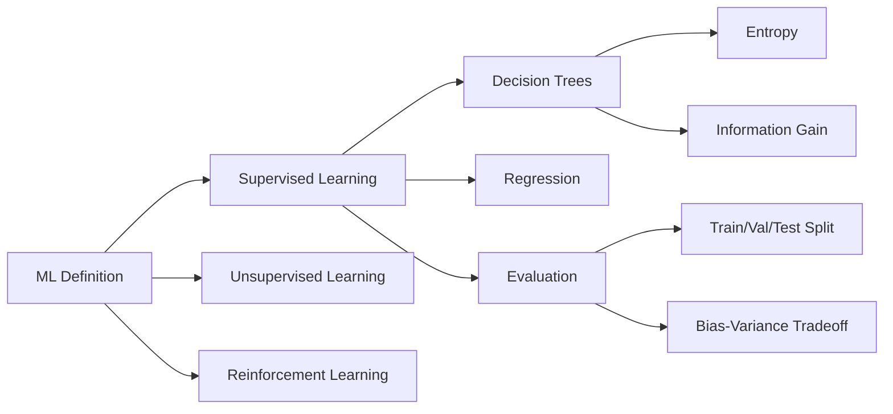

# Chapter 9: Machine Learning: Learning from Examples

**Previous:** [Chapter 9: Reasoning Under Uncertainty](09-uncertainty.md) | **Next:** [Chapter 10: Neural Networks and Deep Learning](10-deep-learning.md)

---

## Learning Objectives

- Define the core goals of Machine Learning and the different types of learning (Supervised, Unsupervised, Reinforcement).
- Explain the concept of "induction" and the importance of inductive bias.
- Analyze the Decision Tree learning algorithm and the use of Information Gain.
- Discuss the "Bias-Variance Tradeoff" and its impact on model generalization.
- Understand the methodology for evaluating models using training, validation, and test sets.

## Chapter at a Glance

| Section | Key Topics | Key Terms |
|---------|-----------|-----------|
| What is ML? | Supervised, unsupervised, reinforcement | P (performance), T (task), E (experience) |
| Inductive Learning | Hypothesis, inductive bias | Occam's Razor |
| Decision Trees | Entropy, information gain | ID3, splitting criterion |
| Generalization | Underfitting, overfitting | Bias-variance tradeoff |

## Chapter Roadmap



---

## Theory


> **One-Sentence Takeaway:** Machine learning algorithms improve performance on a task with experience — the key challenge is generalizing from finite training data to unseen examples.

> **💡 Pro Tip:** Decision trees with information gain naturally handle mixed data types and produce interpretable models. However, they can overfit badly — use pruning (min_samples_split, max_depth) or switch to ensemble methods (Random Forest) for better generalization.

### What is Machine Learning?
Machine Learning (ML) is the study of algorithms that improve their performance $P$ at some task $T$ with experience $E$.
- **Supervised Learning**: The agent learns a function from input-output pairs (labels provided).
- **Unsupervised Learning**: The agent learns patterns in the data without explicit labels (e.g., clustering).
- **Reinforcement Learning**: The agent learns by interacting with an environment and receiving rewards or penalties.

### Inductive Learning
The goal of inductive learning is to find a hypothesis $h$ that approximates the true function $f$ using only a finite set of examples. Because many hypotheses can fit the data, the agent must have an **inductive bias**—a preference for one type of hypothesis over another (e.g., Occam's Razor prefers simpler hypotheses).

### Decision Trees
A Decision Tree is a flowchart-like structure where each internal node represents a "test" on an attribute, each branch represents the outcome of the test, and each leaf node represents a class label.
- **Entropy**: A measure of impurity or randomness in a set of examples.
- **Information Gain**: The reduction in entropy achieved by partitioning the data based on a specific attribute. The algorithm chooses the attribute that maximizes this gain.

### Generalization and Overfitting
- **Underfitting**: The model is too simple to capture the underlying structure (High Bias).
- **Overfitting**: The model is too complex and captures the noise in the training data rather than the true pattern (High Variance).
- **Generalization**: The ability of a model to perform well on unseen data.

---

## Examples

### Example 1: Decision Tree for "Should I play Tennis?"
The dataset contains attributes like `Outlook`, `Humidity`, and `Wind`, with a label `Play`.
- **Step-by-step**:
  1. Calculate the entropy of the entire dataset.
  2. For each attribute, calculate the Information Gain.
  3. If `Outlook` has the highest gain, make it the root node.
  4. Repeat the process for each branch until all examples in a node belong to the same class.
- **Code snippet (Python with Scikit-Learn)**:
```python
from sklearn.tree import DecisionTreeClassifier
import numpy as np

# X = [Outlook, Humidity, Wind] (Encoded)
X = np.array([[0, 0, 0], [0, 1, 1], [1, 0, 0], [1, 1, 0]])
y = np.array([0, 1, 1, 1]) # Play?

clf = DecisionTreeClassifier(criterion='entropy')
clf.fit(X, y)
print(f"Prediction for [0, 1, 0]: {clf.predict([[0, 1, 0]])}")
```
- **What it demonstrates**: How a classifier is trained on historical data to make predictions on new data.

### Example 2: Linear Regression for Housing Prices
Predict the price of a house based on its square footage.
- **Hypothesis**: $Price = w_1 \times Area + w_0$.
- **Learning**: Use **Gradient Descent** to minimize the Mean Squared Error (MSE) between the predicted price and the actual price in the training set.
- **What it demonstrates**: A simple form of supervised learning for continuous values (regression).

## Concept Comparison

| Learning Type | Labels? | Feedback | Goal | Examples |
|--------------|:---:|:---:|------|---------|
| Supervised | ✅ | Direct (target) | Map inputs to outputs | Classification, regression |
| Unsupervised | ❌ | None | Discover hidden structure | Clustering, dimensionality reduction |
| Reinforcement | ❌ | Delayed (reward) | Maximize cumulative reward | Game playing, robot control |

## Quick Reference — Decision Tree Concepts

| Concept | Formula | Purpose |
|---------|---------|---------|
| Entropy | H(S) = -Σ pᵢ log₂ pᵢ | Measure impurity |
| Information Gain | IG(S, A) = H(S) - Σ (|Sᵥ|/|S|) H(Sᵥ) | Best attribute selection |
| Majority Error | 1 - max(páµ¢) | Simpler impurity measure |
| Gini Index | 1 - Σ pᵢ² | Alternative to entropy |

## Cross-Application Matrix

| Technique | ML | CV | NLP | Research |
|-----------|:---:|:---:|:---:|:---:|
| Decision Trees | ✅ | ⬜ | ✅ | ✅ |
| Linear Regression | ✅ | ⬜ | ⬜ | ✅ |
| Bias-Variance Analysis | ✅ | ✅ | ✅ | ✅ |
| Train/Val/Test Split | ✅ | ✅ | ✅ | ✅ |

## Chapter Quiz

**Q1:** What does a decision tree's information gain measure?
- A) How much information is gained by reading the data
- B) The reduction in entropy after splitting on an attribute
- C) The accuracy of the tree on training data
- D) The depth of the resulting tree

<details><summary>Answer</summary>B) Information gain measures the expected reduction in entropy from partitioning the data on a given attribute.</details>

**Q2:** A model with high bias and low variance is likely suffering from what?
- A) Overfitting
- B) Underfitting
- C) Data leakage
- D) The curse of dimensionality

<details><summary>Answer</summary>B) High bias + low variance = underfitting (the model is too simple to capture the underlying patterns).</details>

**Q3:** Why should you never evaluate model performance on the training set?
- A) It takes too long to compute
- B) The model may have memorized (overfit) the training data, making performance appear unrealistically good
- C) Training data is typically too small
- D) The test set is more important

<details><summary>Answer</summary>B) Training set accuracy overestimates generalization because the model may have memorized noise (overfitting).</details>

---

## Summary

- Machine Learning shifts the focus from manual rule-writing to automated pattern discovery.
- Supervised learning is the most common paradigm for classification and regression.
- Decision trees are intuitive models that use information theory to split data effectively.
- Overfitting is a primary challenge; it occurs when a model is "memorizing" rather than "learning."
- Effective ML requires careful data preprocessing and rigorous evaluation.
- The choice of hypothesis space and inductive bias determines the success of a learning agent.

---

## Exercises

### Review Questions
1. Differentiate between Classification and Regression.
2. What is "Ockham's Razor" and how does it relate to machine learning?
3. Define "Entropy" in the context of information theory.
4. Why should you never evaluate a model's performance using the training set?

### Application Problems
1. Calculate the entropy of a set with 4 "Yes" and 6 "No" examples.
2. Given a dataset, why might you choose a simple linear model over a complex high-degree polynomial, even if the polynomial has zero training error?
3. List three examples of real-world applications for Unsupervised Learning.

### Challenge Problem
1. **The Curse of Dimensionality**: Explain how adding more features can actually degrade the performance of a machine learning model. How does the amount of data required to maintain density change as the number of dimensions increases?
