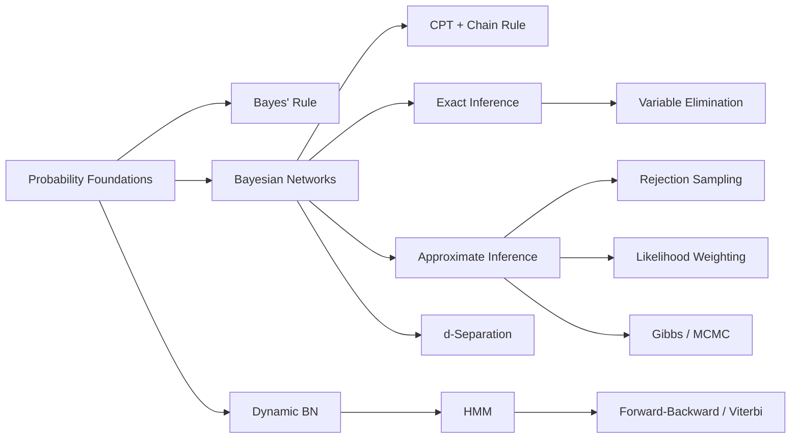

# Chapter 9: Reasoning Under Uncertainty

**Previous:** [Chapter 8: Planning](08-planning.md) | **Next:** [Chapter 10: Probabilistic Reasoning](10-probabilistic-reasoning.md)

## Learning Objectives

By the conclusion of this chapter, the student will be able to: (1) apply probability theory to represent uncertain knowledge; (2) construct and query Bayesian networks; (3) analyze conditional independence using d-separation; (4) implement exact and approximate inference in Bayesian networks; (5) model temporal processes using dynamic Bayesian networks and hidden Markov models.

<!-- Image Gallery -->
<div style="display:flex;flex-wrap:wrap;gap:4px;margin:16px 0;padding:12px;background:#f8fafc;border-radius:8px;border:1px solid #e2e8f0;">
<a href="../../../assets/images/lessons/artificial-intelligence/09-uncertainty/hero.svg" target="_blank" rel="noopener">
  
</a>
<a href="../../../assets/images/lessons/artificial-intelligence/09-uncertainty/handwritten-notes.svg" target="_blank" rel="noopener">
  
</a>
<a href="../../../assets/images/lessons/artificial-intelligence/09-uncertainty/sticky-notes.svg" target="_blank" rel="noopener">
  
</a>
<a href="../../../assets/images/lessons/artificial-intelligence/09-uncertainty/visual-explanation.svg" target="_blank" rel="noopener">
  
</a>
<a href="../../../assets/images/lessons/artificial-intelligence/09-uncertainty/architecture.svg" target="_blank" rel="noopener">
  
</a>
<a href="../../../assets/images/lessons/artificial-intelligence/09-uncertainty/workflow.svg" target="_blank" rel="noopener">
  
</a>
<a href="../../../assets/images/lessons/artificial-intelligence/09-uncertainty/mindmap.svg" target="_blank" rel="noopener">
  
</a>
<a href="../../../assets/images/lessons/artificial-intelligence/09-uncertainty/comparison.svg" target="_blank" rel="noopener">
  
</a>
<a href="../../../assets/images/lessons/artificial-intelligence/09-uncertainty/cheatsheet.svg" target="_blank" rel="noopener">
  
</a>
<a href="../../../assets/images/lessons/artificial-intelligence/09-uncertainty/interview-quiz.svg" target="_blank" rel="noopener">
  
</a>
<a href="../../../assets/images/lessons/artificial-intelligence/09-uncertainty/social-card.svg" target="_blank" rel="noopener">
  
</a>
</div>
<!-- End Image Gallery -->


## Why Probabilistic Reasoning Matters

**Real-World Analogy — Diagnosing Disease from Symptoms:** Imagine you are a doctor. A patient walks in with a fever, cough, and fatigue. These symptoms could indicate flu, COVID-19, common cold, or even something benign. You cannot be certain — but you must act. You weigh:
- **Prior knowledge:** Flu is common in winter (~10% of patients). COVID-19 is less common but present (~2%).
- **Evidence:** Fever + cough are *likely* given flu (80%), but also possible with COVID (70%) and cold (30%).
- **Posterior judgment:** Given the symptoms, flu becomes most probable (say 65%), COVID next (20%), cold (10%), other (5%).

This is **probabilistic reasoning** — updating beliefs in light of evidence. Every AI system facing uncertainty (speech recognition, medical diagnosis, self-driving cars, spam filters) uses the same framework. Without it, AI would be paralyzed by ambiguity.

## Chapter at a Glance

| Section | Key Topics | Key Terms |
|---------|-----------|-----------|
| Foundations | Probability space, Bayes' rule, independence | Prior, posterior, conditionally independent |
| Bayesian Networks | DAG, CPT, chain rule | Parents, factorization |
| Inference | Variable elimination, rejection/likelihood/Gibbs | Belief propagation, MCMC |
| d-Separation | Chains, forks, colliders | Active path, Markov blanket |
| Dynamic BN | Temporal processes, transition model | Markov assumption, state evolution |
| HMM | Transition, emission, Viterbi | Forward-backward, decoding |

## Chapter Roadmap



## 9.1 Foundations of Probability


Probability theory provides the mathematical framework for reasoning under uncertainty. A **probability space** consists of a sample space $\Omega$, a set of events $\mathcal{E}$, and a probability measure $P: \mathcal{E} \to [0, 1]$ satisfying the Kolmogorov axioms:

1. $P(\omega) \geq 0$ for all $\omega \in \Omega$.
2. $P(\Omega) = 1$.
3. For countable disjoint events $E_1, E_2, \ldots$: $P(\bigcup_i E_i) = \sum_i P(E_i)$.

### 9.1.1 Conditional Probability and Bayes' Rule


The conditional probability of $A$ given $B$ is:

$$P(A \mid B) = \frac{P(A \land B)}{P(B)}, \quad P(B) > 0$$

**Bayes' rule** inverts conditional probabilities:

$$P(A \mid B) = \frac{P(B \mid A) \, P(A)}{P(B)}$$

For inference tasks, we compute the **posterior** probability of hypothesis $H$ given evidence $E$:

$$P(H \mid E) = \frac{P(E \mid H) \, P(H)}{P(E)}$$

The denominator normalizes: $P(E) = \sum_h P(E \mid h) P(h)$.

### 9.1.2 Independence


Two events $A$ and $B$ are independent if $P(A \land B) = P(A) P(B)$. Conditional independence, a weaker and more common condition, holds when:

$$P(A \land B \mid C) = P(A \mid C) P(B \mid C)$$

Conditional independence assumptions dramatically reduce the complexity of probabilistic models.

### Real-World Analogy — Spam Detection with Bayes


You receive an email containing the word "FREE". You want to know: is it spam?
- **Prior:** 60% of all emails are spam $\to$ $P(Spam) = 0.6$
- **Likelihood:** 90% of spam contains "FREE", only 5% of ham does $\to$ $P(\text{FREE} \mid Spam) = 0.9$, $P(\text{FREE} \mid Ham) = 0.05$
- **Evidence:** $P(\text{FREE}) = 0.9 \times 0.6 + 0.05 \times 0.4 = 0.56$
- **Posterior:** $P(Spam \mid \text{FREE}) = (0.9 \times 0.6) / 0.56 \approx 0.964$

The email is 96.4% likely to be spam.

### Algorithmic Steps — Applying Bayes' Rule


**Input:** Prior $P(H)$, likelihood $P(E \mid H)$, evidence probability $P(E)$
**Output:** Posterior $P(H \mid E)$

| Step | Description |
|------|-------------|
| 1 | Identify the hypothesis $H$ and evidence $E$ |
| 2 | Determine the prior probability $P(H)$ |
| 3 | Determine the likelihood $P(E \mid H)$ |
| 4 | Compute evidence probability $P(E) = \sum_h P(E \mid h) P(h)$ |
| 5 | Apply formula: $P(H \mid E) = P(E \mid H) \cdot P(H) / P(E)$ |
| 6 | Return the posterior probability |

### Pseudocode


```text
function BAYES-RULE(Prior, Likelihood, EvidenceProb) returns posterior
    numerator <- Likelihood * Prior
    if EvidenceProb = 0 then
        return error("Evidence has zero probability")
    posterior <- numerator / EvidenceProb
    return posterior

function BAYES-RULE-MARGINALIZE(Prior, LikelihoodFunc, hypotheses) returns posterior
    evidenceProb <- 0
    for each h in hypotheses do
        evidenceProb <- evidenceProb + LikelihoodFunc(h) * Prior[h]
    if evidenceProb = 0 then
        return error("Evidence has zero probability")
    for each h in hypotheses do
        posterior[h] <- (LikelihoodFunc(h) * Prior[h]) / evidenceProb
    return posterior
```

### Step-by-Step Dry Run — Medical Test


**Scenario:** Disease prevalence = 0.1%, test sensitivity = 99%, false positive rate = 2%.
**Query:** $P(\text{Disease} \mid \text{Positive})$

| Step | Computation | Result | Explanation |
|------|-------------|--------|-------------|
| 1 | Identify H and E | H="disease", E="positive" | Problem setup |
| 2 | Prior $P(D)$ | 0.001 | Disease prevalence |
| 3 | Likelihood $P(Pos \mid D)$ | 0.99 | Test sensitivity |
| 4 | $P(Pos) = 0.99 \times 0.001 + 0.02 \times 0.999$ | 0.02097 | Marginalization over D and ¬D |
| 5 | Numerator $0.99 \times 0.001$ | 0.00099 | Likelihood × Prior |
| 6 | Posterior $P(D \mid Pos)$ | 0.00099 / 0.02097 ≈ 0.0472 | Only 4.72% despite positive test! |

**Key insight:** The disease is so rare that even a 98% accurate test produces mostly false positives.

### Python Implementation


```python
def bayes_rule(prior: float, likelihood: float, evidence_prob: float) -> float:
    """Compute P(H|E) = P(E|H) * P(H) / P(E)"""
    if evidence_prob == 0:
        raise ValueError("Evidence probability cannot be zero")
    return (likelihood * prior) / evidence_prob

def bayes_rule_marginalize(priors: dict, likelihoods: dict) -> dict:
    """Compute posterior for all hypotheses given likelihoods"""
    evidence_prob = sum(likelihoods[h] * priors[h] for h in priors)
    if evidence_prob == 0:
        raise ValueError("Evidence probability cannot be zero")
    return {h: (likelihoods[h] * priors[h]) / evidence_prob for h in priors}

# Medical test example
priors = {"disease": 0.001, "no_disease": 0.999}
likelihoods = {"disease": 0.99, "no_disease": 0.02}
posteriors = bayes_rule_marginalize(priors, likelihoods)
print(f"P(disease | positive) = {posteriors['disease']:.4f}")
print(f"P(no_disease | positive) = {posteriors['no_disease']:.4f}")
# Output:
# P(disease | positive) = 0.0472
# P(no_disease | positive) = 0.9528
```

### Complexity Analysis


**Why O(n):** Bayes' rule marginalizes over $n$ hypotheses. Each hypothesis contributes one multiplication and one addition to the evidence sum. Work scales linearly — you cannot compute a weighted sum without examining every term. This is optimal.

| Scenario | Time Complexity | Space Complexity |
|----------|:--------------:|:----------------:|
| Single hypothesis | O(1) | O(1) |
| $n$ hypotheses | O(n) | O(n) |
| Continuous (integration) | Approx O(m) with m quadrature points | O(m) |

### Advantages & Disadvantages


| Advantages | Disadvantages |
|------------|---------------|
| Mathematically sound foundation | Requires known prior probabilities |
| Combines prior knowledge with data | Sensitive to subjective prior choice |
| Computationally efficient O(n) | Assumes model structure is correct |
| Incrementally updatable (posterior becomes new prior) | Difficult with high-dimensional evidence |
| Handles uncertainty explicitly | Evidence probability can be near-zero numerically |

### Edge Cases


1. **Zero evidence probability:** If $P(E) = 0$, Bayes' rule is undefined. Use pseudocounts (Laplace smoothing) to avoid zero probabilities.
2. **Floating-point underflow:** When $P(E) \approx 10^{-100}$, use log-probabilities: $\log P(H \mid E) = \log P(E \mid H) + \log P(H) - \log P(E)$.
3. **Non-disjoint hypotheses:** The hypothesis set must partition the sample space (exhaustive and mutually exclusive). Gaps or overlaps produce incorrect posteriors.
4. **Conflicting evidence:** Product of multiple likelihoods may underflow despite strong individual signals. Normalize in log-space.

## 9.2 Bayesian Networks

### Real-World Analogy — Car Won't Start


Your car doesn't start in the morning. Several causes interact:
- **Battery dead** (B): Could be due to age or leaving lights on.
- **Fuel empty** (F): Could be due to broken gauge or forgetting to fill.
- **Starter motor failed** (S): Unlikely but possible.
- **Car starts?** (C): Depends on B, F, and S all working.

B and F are independent (no direct causal link). C depends on B, F, S (all three must work). A Bayesian network captures this: variables are nodes, causes point to effects, each node has a conditional probability table.

### 9.2.1 Structure and Factorization


A **Bayesian network** (BN) is a directed acyclic graph (DAG) representing a joint probability distribution. Nodes represent random variables; directed edges represent direct probabilistic dependencies.

A BN encodes the joint distribution via the chain rule:

$$P(X_1, X_2, \ldots, X_n) = \prod_{i=1}^n P(X_i \mid \text{Parents}(X_i))$$

Each node has an associated **conditional probability table (CPT)** specifying $P(X_i \mid \text{Parents}(X_i))$.

**Example: Alarm Network (Pearl, 1988):**
Burglary and Earthquake cause Alarm, which triggers calls from John and Mary. The joint distribution factors as:

$$P(B, E, A, J, M) = P(B) P(E) P(A \mid B, E) P(J \mid A) P(M \mid A)$$

A BN with $n$ nodes, each with at most $k$ parents and $d$ values, requires at most $n d^{k+1}$ parameters — a dramatic reduction from the full $d^n$ joint table.

### Algorithmic Steps — Constructing a Bayesian Network


**Input:** Set of random variables $X_1, \ldots, X_n$, domain knowledge or data
**Output:** A Bayesian network (DAG + CPTs)

| Step | Description |
|------|-------------|
| 1 | Identify the set of relevant random variables |
| 2 | Order variables causally (causes before effects) |
| 3 | For each $X_i$, choose a minimal set of parents from earlier variables such that $X_i$ is conditionally independent of all other predecessors given its parents |
| 4 | Define the CPT for $P(X_i \mid \text{Parents}(X_i))$ |
| 5 | Verify no cycles exist in the resulting graph |
| 6 | The joint distribution is the product of all CPTs |

### Pseudocode


```text
function CONSTRUCT-BN(variables, domainKnowledge) returns BN
    order <- TOPOLOGICAL-SORT(variables, domainKnowledge)
    bn <- new DAG with nodes = variables
    for each X_i in order do
        parents <- SELECT-PARENTS(X_i, domainKnowledge)
        bn.AddEdge(parents -> X_i)
        for each assignment pa of parents do
            for each value x of X_i do
                bn.CPT[X_i][pa][x] <- domainKnowledge.ElicitProb(X_i, pa, x)
    return bn

function BN-JOINT-PROB(bn, assignment) returns probability
    prob <- 1.0
    for each node X_i in bn do
        x <- assignment[X_i]
        pa <- assignment[PARENTS(X_i)]
        prob <- prob * bn.CPT[X_i][pa][x]
    return prob
```

### Step-by-Step Dry Run — Alarm Network Joint Probability


**CPTs:** P(B)=0.001, P(E)=0.002, P(A|B,E): TT=0.95, TF=0.94, FT=0.29, FF=0.001
P(J|A): T=0.90, F=0.05; P(M|A): T=0.70, F=0.01

**Computing $P(B=1, E=1, A=1, J=1, M=1)$:**

| Step | Var | Value | Parents | CPT Entry | Running Product |
|------|-----|-------|---------|-----------|----------------|
| 1 | B | True | — | 0.001 | 0.001 |
| 2 | E | True | — | 0.002 | 0.000002 |
| 3 | A | True | B=T, E=T | 0.95 | 0.0000019 |
| 4 | J | True | A=T | 0.90 | 0.00000171 |
| 5 | M | True | A=T | 0.70 | 0.000001197 |

$P(B,E,A,J,M) = 1.197 \times 10^{-6}$

### Python Implementation


```python
class BNNode:
    def __init__(self, name: str, parents: list, cpt: dict):
        self.name = name
        self.parents = parents
        self.cpt = cpt  # key = (self_val, *parent_vals) -> prob

class BayesianNetwork:
    def __init__(self, nodes: list):
        self.nodes = {n.name: n for n in nodes}
        self.order = [n.name for n in nodes]

    def joint_probability(self, assignment: dict) -> float:
        prob = 1.0
        for name in self.order:
            node = self.nodes[name]
            x = assignment[name]
            pa = tuple(assignment[p] for p in node.parents)
            prob *= node.cpt[(x, *pa)]
        return prob

# Alarm network nodes
alarm_nodes = [
    BNNode("Burglary", [], {(True,): 0.001, (False,): 0.999}),
    BNNode("Earthquake", [], {(True,): 0.002, (False,): 0.998}),
    BNNode("Alarm", ["Burglary","Earthquake"], {
        (True,True,True):0.95, (True,True,False):0.05,
        (True,False,True):0.94, (True,False,False):0.06,
        (False,True,True):0.29, (False,True,False):0.71,
        (False,False,True):0.001, (False,False,False):0.999,
    }),
    BNNode("JohnCalls", ["Alarm"], {
        (True,True):0.90, (True,False):0.10,
        (False,True):0.05, (False,False):0.95,
    }),
    BNNode("MaryCalls", ["Alarm"], {
        (True,True):0.70, (True,False):0.30,
        (False,True):0.01, (False,False):0.99,
    }),
]
bn = BayesianNetwork(alarm_nodes)

p = bn.joint_probability({"Burglary":True,"Earthquake":True,"Alarm":True,
                          "JohnCalls":True,"MaryCalls":True})
print(f"P(B,E,A,J,M) = {p:.10f}")
# Output: P(B,E,A,J,M) = 0.0000011970
```

### Complexity Analysis


**Why BN parameter count is $O(n d^{k+1})$:** Each of $n$ nodes stores a CPT. For a node with $k$ parents and $d$ values, the CPT has $d^{k+1}$ entries (one combination per parent assignment per self value). The full joint table would have $d^n$ entries — exponential in all variables. The BN reduces this to exponential only in the *maximum number of parents* ($k \ll n$). This is why BNs are called "compact representations."

| Metric | Full Joint Table | Bayesian Network |
|--------|:----------------:|:-----------------:|
| Parameters | $d^n$ | $n \cdot d^{k+1}$ |
| Memory | $O(d^n)$ | $O(n d^{k+1})$ |
| Inference cost | $O(d^n)$ | $O(d^{tw})$ where tw = treewidth |

### Advantages & Disadvantages


| Advantages | Disadvantages |
|------------|---------------|
| Compact representation via conditional independence | Requires causal ordering (domain expertise) |
| Intuitive graphical structure | CPTs grow exponentially with parent count |
| Supports both forward and backward inference | DAG constraint prohibits cycles |
| Handles missing data naturally | Learning structure from data is NP-hard |
| Combines expert knowledge with data | Sensitive to CPT accuracy |

### Edge Cases


1. **Root nodes (no parents):** CPT is just a prior probability (size $d$). All root nodes are marginally independent unless we condition on a common child.
2. **Deterministic nodes:** $P(X \mid Pa) \in \{0,1\}$. Inference can be optimized (bypass sampling, direct propagation).
3. **Context-specific independence:** Some CPT entries may be equal across parent assignments (e.g., $P(A \mid B, E)$ = $P(A \mid B)$ when E=False). Use noisy-OR or decision tree CPTs for compression.
4. **Invalid CPTs:** Probabilities for a given parent assignment must sum to 1. Violations produce invalid joint distributions.

## 9.3 d-Separation

### Real-World Analogy — Family Traits


Three generations: Grandparent (G), Parent (P), Child (C).

- **Chain** (G $\to$ P $\to$ C): If you know P's hair color, G's gives no additional info about C. Conditioning on P *blocks* G $\to$ C.
- **Fork** (G $\leftarrow$ P $\to$ C): P influences both. Knowing P makes G and C independent. Conditioning on P *blocks*.
- **Collider** (G $\to$ P $\leftarrow$ C): G and C are independent until you condition on P. If P has a rare mutation, learning G has it *explains away* C. Conditioning on P *opens* this path.

**Explaining away** is the most counterintuitive BN concept: two independent causes become dependent when their common effect is observed.

### 9.3.1 d-Separation Rules


**d-separation** determines conditional independence relations in a BN. A path between $X$ and $Y$ is **blocked** by evidence set $\mathcal{Z}$ if:

- **Chain** ($X \to Z \to Y$ or $X \leftarrow Z \leftarrow Y$): $Z \in \mathcal{Z}$.
- **Fork** ($X \leftarrow Z \to Y$): $Z \in \mathcal{Z}$.
- **Collider** ($X \to Z \leftarrow Y$): $Z \notin \mathcal{Z}$ and no descendant of $Z$ in $\mathcal{Z}$.

$X$ and $Y$ are d-separated by $\mathcal{Z}$ if every path between them is blocked.

### Algorithmic Steps — Checking d-Separation


**Input:** DAG, nodes X and Y, evidence set Z
**Output:** True if X and Y are d-separated by Z

| Step | Description |
|------|-------------|
| 1 | Find all undirected paths between X and Y in the DAG |
| 2 | For each path, determine if it is **active** (unblocked) given Z |
| 3 | A path is active if every node satisfies: chain/fork NOT in Z; collider IS in Z (or descendant in Z) |
| 4 | If any path is active, X and Y are **d-connected** |
| 5 | If all paths blocked, X and Y are **d-separated** |

### Pseudocode


```text
function D-SEPARATED(dag, X, Y, Z) returns Boolean
    for each path between X and Y do
        if IS-ACTIVE(path, Z) then
            return False  // d-connected
    return True  // d-separated

function IS-ACTIVE(path, Z) returns Boolean
    for each triple (A, B, C) on path do
        if IS-COLLIDER(A, B, C) then
            if B not in Z and no descendant of B in Z then
                return False  // blocked
        else  // chain or fork
            if B in Z then
                return False  // blocked
    return True  // active
```

### Step-by-Step Dry Run


**Network:** A $\to$ B $\to$ C $\leftarrow$ D $\to$ E

**Query:** Are A and E d-separated given Z = {B}?

**Path: A $\to$ B $\to$ C $\leftarrow$ D $\to$ E**

| Triple | Type | Condition | Blocked? |
|--------|------|-----------|----------|
| (A, B, C) | Chain (A$\to$B$\to$C) | B is in Z $\to$ BLOCKED | Yes |
| (B, C, D) | Collider (B$\to$C$\leftarrow$D) | C NOT in Z, no descendant in Z $\to$ blocked | Yes |
| (C, D, E) | Chain (C$\leftarrow$D$\to$E) | D NOT in Z $\to$ unblocked (path already blocked) | — |

All paths blocked $\to$ **A and E ARE d-separated by {B}**.

**Query variation:** A and E given Z = {C}?

| Triple | Type | Condition | Blocked? |
|--------|------|-----------|----------|
| (A, B, C) | Chain (A$\to$B$\to$C) | B NOT in Z $\to$ unblocked | No |
| (B, C, D) | Collider (B$\to$C$\leftarrow$D) | C is in Z $\to$ COLLIDER OPENS $\to$ unblocked | No |
| (C, D, E) | Chain (C$\leftarrow$D$\to$E) | D NOT in Z $\to$ unblocked | No |

All triples unblocked $\to$ **A and E are NOT d-separated by {C}**.

### Python Implementation


```python
from collections import defaultdict, deque

class DAG:
    def __init__(self):
        self.graph = defaultdict(list)
        self.parents = defaultdict(list)
    def add_edge(self, fr, to):
        self.graph[fr].append(to)
        self.parents[to].append(fr)
    def neighbors(self, n):
        return self.graph[n] + self.parents[n]

def is_collider(dag, a, b, c):
    return b in dag.graph[a] and b in dag.graph[c]

def get_descendants(dag, node):
    desc, q = set(), deque([node])
    while q:
        n = q.popleft()
        for c in dag.graph[n]:
            if c not in desc:
                desc.add(c); q.append(c)
    return desc

def d_separated(dag, X, Y, Z):
    if X == Y: return False
    q, visited = deque([(X, [(None, X)])]), set()
    while q:
        node, path = q.popleft()
        if node == Y:
            active = True
            for i in range(len(path) - 2):
                a, b, c = path[i][1], path[i+1][0], path[i+2][0]
                if is_collider(dag, a, b, c):
                    if b not in Z and not any(d in Z for d in get_descendants(dag, b)):
                        active = False; break
                else:
                    if b in Z: active = False; break
            if active: return False
            continue
        key = (node, path[-1])
        if key in visited: continue
        visited.add(key)
        for nb in dag.neighbors(node):
            q.append((nb, path + [(node, nb)]))
    return True

dag = DAG()
dag.add_edge("A","B"); dag.add_edge("B","C")
dag.add_edge("D","C"); dag.add_edge("D","E")
print(d_separated(dag, "A", "E", {"B"}))  # True
print(d_separated(dag, "A", "E", {"C"}))  # False
```

### Complexity Analysis


**Why $O(|V|+|E|)$ with Bayes-Ball:** d-separation checking reduces to graph reachability. Naive path enumeration can be exponential in worst case, but the Bayes-Ball algorithm achieves $O(V+E)$ using annotated BFS with per-node state tracking.

| Aspect | Complexity | Why |
|--------|:----------:|-----|
| Naive path enumeration | $O(2^{|V|})$ | Exponential paths in worst-case DAG |
| Bayes-Ball algorithm | $O(\|V\| + \|E\|)$ | Annotated BFS with visited states per node |
| Precomputed ancestral graph | $O(\|V\| + \|E\|)$ | Build once, query many times |

### Advantages & Disadvantages


| Advantages | Disadvantages |
|------------|---------------|
| Graphical test for conditional independence | Only applies to DAG-structured dependencies |
| Enables efficient structure learning | Does not capture magnitude of dependence |
| Intuitive "explaining away" insight | Can be tedious for large networks |
| Reduces inference burden (skip independent vars) | Requires correct causal direction specification |

### Edge Cases


1. **Empty evidence set (Z = {}):** Chains and forks remain active; colliders block unless a descendant is observed.
2. **X = Y:** Trivially d-connected (zero-length path always exists).
3. **Evidence on collider descendant:** Partially opens path, creating weak dependence between collider parents.
4. **Multiple active paths:** One active path suffices to break d-separation — a single "open" path bypasses all blocked portions.

## 9.4 Inference by Enumeration

### Real-World Analogy — Finding a Lost Key


You lost your key in a house with 3 rooms. P(Kitchen)=0.3, P(Living)=0.5, P(Bedroom)=0.2. You hear a jingle from the bedroom: P(Jingle|K)=0.1, P(Jingle|L)=0.2, P(Jingle|B)=0.9.

**Inference by enumeration** means: list every possible location, compute the joint probability with evidence, sum the appropriate cases, and normalize.

### Algorithmic Steps


**Input:** Bayesian network BN, query variable Q, evidence E
**Output:** Posterior distribution $P(Q \mid E)$

| Step | Description |
|------|-------------|
| 1 | Identify all variables in the network |
| 2 | For each value $q$ of the query variable, sum over all joint assignments consistent with evidence and Q=q |
| 3 | Multiply CPT probabilities for each assignment |
| 4 | Normalize by total probability of evidence |

### Pseudocode


```text
function ENUMERATION-INFERENCE(bn, query, evidence) returns distribution
    for each value q of query do
        prob[q] <- ENUMERATE-ALL(bn.variables, [], evidence U {query = q})
    return NORMALIZE(prob)

function ENUMERATE-ALL(vars, assignment, evidence) returns probability
    if vars is empty then return 1.0
    Y <- FIRST(vars)
    rest <- REST(vars)
    if Y has value in evidence then
        y <- evidence[Y]
        assignment <- assignment U {Y = y}
        return P(y | parents(Y)) * ENUMERATE-ALL(rest, assignment, evidence)
    else
        sum <- 0
        for each value y of Y do
            assignment <- assignment U {Y = y}
            sum <- sum + P(y | parents(Y)) * ENUMERATE-ALL(rest, assignment, evidence)
        return sum
```

### Step-by-Step Dry Run — $P(\text{Burglary} \mid \text{JohnCalls}, \text{MaryCalls})$


**Step 1: Sum over all assignments with B=1, J=1, M=1**

| E | A | P(B=1) | P(E) | P(A\|B,E) | P(J\|A) | P(M\|A) | Product |
|---|---|--------|------|-----------|---------|---------|---------|
| F | F | 0.001 | 0.998 | 0.06 | 0.05 | 0.01 | $2.99\times10^{-7}$ |
| F | T | 0.001 | 0.998 | 0.94 | 0.90 | 0.70 | $5.907\times10^{-4}$ |
| T | F | 0.001 | 0.002 | 0.05 | 0.05 | 0.01 | $5.0\times10^{-11}$ |
| T | T | 0.001 | 0.002 | 0.95 | 0.90 | 0.70 | $1.197\times10^{-6}$ |

$P(B=1, J=1, M=1) \approx 5.921\times10^{-4}$

**Step 2: Compute for B=0** (same process) $\to$ $P(B=0, J=1, M=1) \approx 5.972\times10^{-3}$

**Step 3: Normalize**

$P(B=1 \mid J,M) = 5.921\times10^{-4} / (5.921\times10^{-4} + 5.972\times10^{-3}) \approx 0.0902$

$P(B=0 \mid J,M) \approx 0.9098$

**Result:** Given both calls, there is a 9.02% chance of burglary.

### Python Implementation


```python
def enumerate_all(bn, variables, assignment, evidence):
    if not variables:
        return 1.0
    Y, rest = variables[0], variables[1:]
    if Y in evidence:
        y = evidence[Y]
        pa = tuple(assignment.get(p, False) for p in bn.nodes[Y].parents)
        assignment[Y] = y
        result = bn.nodes[Y].cpt[(y, *pa)] * enumerate_all(bn, rest, assignment, evidence)
        del assignment[Y]
        return result
    total = 0.0
    for y in [True, False]:
        assignment[Y] = y
        pa = tuple(assignment.get(p, False) for p in bn.nodes[Y].parents)
        total += bn.nodes[Y].cpt[(y, *pa)] * enumerate_all(bn, rest, assignment, evidence)
    del assignment[Y]
    return total

def inference_enumeration(bn, query, evidence):
    post = {}
    ev_total = 0.0
    for qv in [True, False]:
        post[qv] = enumerate_all(bn, bn.order, {}, {**evidence, query: qv})
        ev_total += post[qv]
    return {k: v/ev_total for k, v in post.items()}

result = inference_enumeration(bn, "Burglary", {"JohnCalls": True, "MaryCalls": True})
print(f"P(Burglary=True | J,M) = {result[True]:.4f}")
print(f"P(Burglary=False | J,M) = {result[False]:.4f}")
# Output:
# P(Burglary=True | J,M) = 0.0902
# P(Burglary=False | J,M) = 0.9098
```

### Complexity Analysis


**Why $O(d^n)$ — exponential in all variables:** Enumeration sums over every possible assignment of $n$ unobserved variables. If each has $d$ values, there are $d^n$ assignments. Each requires $n$ CPT multiplications. Total work: $O(n d^n)$. Feasible for $n \leq 15$ but intractable for $n > 30$.

| Aspect | Complexity | Why |
|--------|:----------:|-----|
| Time | $O(n \cdot d^n)$ | Enumerates all $d^n$ assignments, $n$ multiplications each |
| Space | $O(n)$ | Recursion depth = number of variables |
| Query optimization | Same | Cannot reuse computations across queries |

### Advantages & Disadvantages


| Advantages | Disadvantages |
|------------|---------------|
| Guaranteed exact posterior | Exponential $O(d^n)$ complexity |
| Simple to implement and debug | Redundant recomputation of subproblems |
| Works for any BN (no restrictions) | Impractical for >20 variables |
| Provides ground truth for testing | Cannot exploit conditional independence |

### Edge Cases


1. **All variables observed:** Single path through the network. Complexity drops to $O(n)$.
2. **No evidence:** Returns prior marginal, but still $O(d^n)$ since no evidence constrains the space.
3. **Numerical underflow:** Product of many small CPT entries underflows double precision. Use log-space: $\log(\text{product}) = \sum \log(\text{entry})$.
4. **Disconnected subgraphs:** Enumeration still visits all variables even if query is independent of large network portions.

## 9.5 Variable Elimination

### Real-World Analogy — Summing a Multi-Column Ledger


You have a spreadsheet with columns A, B, C, D and need totals for A=1. Instead of listing every row (enumeration):
1. **Eliminate D:** Sum over D for each (A,B,C) — reduces one dimension.
2. **Eliminate C:** Sum the result over C for each (A,B).
3. **Eliminate B:** Sum over B for each A.
4. **Read off:** Result for A=1.

Variable Elimination sums out (eliminates) variables one at a time, reusing intermediate results — like compressing a spreadsheet dimension by dimension.

### Algorithmic Steps


**Input:** Bayesian network BN, query Q, evidence E, elimination order
**Output:** Posterior distribution $P(Q \mid E)$

| Step | Description |
|------|-------------|
| 1 | Extract all CPTs as factors from the BN |
| 2 | Fix evidence variables to observed values (restrict factors) |
| 3 | Choose elimination order for non-query, non-evidence variables |
| 4 | For each variable: multiply all factors mentioning it, then sum it out |
| 5 | Multiply remaining factors and normalize |

### Pseudocode


```text
function VARIABLE-ELIMINATION(bn, query, evidence, order) returns distribution
    factors <- {CPT(X) for each variable X in bn}
    // Apply evidence
    for each (var, val) in evidence do
        for each factor f that mentions var do
            factors <- factors \ {f} U {RESTRICT(f, var, val)}
    // Eliminate non-query variables
    for each Z in order do
        related <- {f in factors | Z in scope(f)}
        if related empty then continue
        newFactor <- POINTWISE-PRODUCT(related)
        newFactor <- SUM-OUT(newFactor, Z)
        factors <- factors \ related U {newFactor}
    // Final product
    result <- POINTWISE-PRODUCT(factors)
    return NORMALIZE(result)
```

### Step-by-Step Dry Run — VE on Alarm Network


**Query:** $P(B \mid J=1, M=1)$ with elimination order: [A, E]

**Initial factors:** $f_B(B), f_E(E), f_A(A,B,E), f_J(A)$ [J=1], $f_M(A)$ [M=1]

**Step 1: Eliminate A** — multiply $f_A, f_J, f_M$, sum out A

| B | E | A=0 Product | A=1 Product | Sum Over A |
|---|---|-------------|-------------|-----------|
| F | F | 0.0004995 | 0.0006300 | **0.0011295** |
| F | T | 0.0003550 | 0.1827000 | **0.1830550** |
| T | F | 0.0000300 | 0.5922000 | **0.5922300** |
| T | T | 0.0000250 | 0.5985000 | **0.5985250** |

New factor $f_1(B,E)$ created.

**Step 2: Eliminate E** — multiply $f_E$ with $f_1$, sum out E

| B | E=F Product | E=T Product | Sum Over E |
|---|---|-------------|-------------|-----------|
| F | 0.00112724 | 0.00036611 | **0.00149335** |
| T | 0.59104554 | 0.00119705 | **0.59224259** |

**Step 3: Multiply by $f_B(B)$ and normalize**

$P(B=0, J, M) = 0.00149335 \times 0.999 = 0.0014918$
$P(B=1, J, M) = 0.59224259 \times 0.001 = 0.0005922$

$P(B=1 \mid J,M) = 0.0005922 / (0.0005922 + 0.0014918) \approx 0.0902$

### Python Implementation


```python
import numpy as np

class Factor:
    def __init__(self, variables, values):
        self.vars = variables
        self.vals = values  # numpy array

    def restrict(self, var, val):
        idx = self.vars.index(var)
        s = [slice(None)] * len(self.vars); s[idx] = val
        return Factor([v for v in self.vars if v != var], self.vals[tuple(s)])

    def sum_out(self, var):
        idx = self.vars.index(var)
        return Factor([v for v in self.vars if v != var], np.sum(self.vals, axis=idx))

def pointwise_product(factors):
    if len(factors) == 1: return factors[0]
    result = factors[0]
    for f in factors[1:]:
        all_vars = list(dict.fromkeys(result.vars + f.vars))
        shape = [2] * len(all_vars); new_vals = np.ones(shape)
        ri = tuple(all_vars.index(v) for v in result.vars)
        fi = tuple(all_vars.index(v) for v in f.vars)
        for idx in np.ndindex(*shape):
            new_vals[idx] = result.vals[tuple(idx[i] for i in ri)] * f.vals[tuple(idx[i] for i in fi)]
        result = Factor(all_vars, new_vals)
    return result

def variable_elimination(bn, query, evidence, order):
    factors = []
    for name in bn.order:
        node = bn.nodes[name]; all_v = node.parents + [name]
        vals = np.zeros([2] * len(all_v))
        for bits in np.ndindex(*([2] * len(all_v))):
            vals[bits] = node.cpt.get(tuple(bool(b) for b in bits), 0.0)
        factors.append(Factor(all_v, vals))
    for ev, ev_val in evidence.items():
        ev_i = 0 if not ev_val else 1
        factors = [f.restrict(ev, ev_i) if ev in f.vars else f for f in factors]
    for var in order:
        rel = [f for f in factors if var in f.vars]
        if not rel: continue
        factors = [f for f in factors if var not in f.vars]
        product = pointwise_product(rel)
        factors.append(product.sum_out(var))
    result = pointwise_product(factors)
    idx = result.vars.index(query)
    total = np.sum(result.vals)
    post = {}
    for val_idx, q_val in enumerate([True, False]):
        s = [slice(None)] * len(result.vars); s[idx] = val_idx
        post[q_val] = float(result.vals[tuple(s)]) / total
    return post

result_ve = variable_elimination(bn, "Burglary",
    {"JohnCalls": True, "MaryCalls": True}, ["Earthquake", "Alarm"])
print(f"VE: P(Burglary=True | J,M) = {result_ve[True]:.4f}")
```

### Complexity Analysis


**Why $O(d^{tw+1})$ where tw = treewidth:** Complexity is dominated by the largest intermediate factor created during elimination. Treewidth = (max variables in any factor) - 1. If the largest factor has $tw+1$ variables with $d$ values each, the factor has $d^{tw+1}$ entries. Elimination order dramatically affects treewidth — a good order can reduce tw from 15 to 3.

| Aspect | Complexity | Why |
|--------|:----------:|-----|
| Time | $O(n d^{tw+1})$ | Each of $n$ vars eliminated; max factor = $d^{tw+1}$ |
| Space | $O(d^{tw+1})$ | Largest intermediate factor |
| Enumeration | $O(n d^n)$ | No dimension reduction |

**Key insight:** VE is exponentially faster than enumeration when treewidth is small. For the Alarm network (treewidth = 2), VE needs $O(5 \cdot 2^3) = O(40)$ ops vs enumeration's $O(5 \cdot 2^5) = O(160)$.

### Advantages & Disadvantages


| Advantages | Disadvantages |
|------------|---------------|
| Exact inference (same as enumeration) | Complexity depends on elimination order |
| Exploits conditional independence via factoring | Finding optimal elimination order is NP-hard |
| Reuses intermediate results (no redundant computation) | Worst-case exponential in treewidth |
| Dramatically faster than enumeration for sparse BNs | Full network must fit in memory |

### Edge Cases


1. **Empty network (no edges):** All factors involve single variables. $O(n)$.
2. **Polytree:** Treewidth = max parents. Polynomial $O(n d^{k+1})$.
3. **Near-complete graph:** Treewidth $\approx n-1$. Degrades to $O(n d^n)$ — no better than enumeration.
4. **Elimination order heuristics:** Min-degree (eliminate fewest neighbors) and min-fill (eliminate adding fewest moral edges) are standard. A bad order (e.g., eliminating a highly-connected variable first) creates a huge intermediate factor.

## 9.6 Approximate Inference via Sampling

### 9.6.1 Rejection Sampling


**Idea:** Sample from the prior, reject samples inconsistent with evidence.

**Problem:** When evidence is rare ($P(E) = 0.001$), 99.9% of samples are rejected. Wastes computation.

```text
function REJECTION-SAMPLING(bn, query, evidence, N) returns estimate
    count <- 0
    for j = 1 to N do
        sample <- PRIOR-SAMPLE(bn)
        if sample matches evidence then
            count[query] <- count[query] + 1
    return NORMALIZE(counts)
```

### 9.6.2 Likelihood Weighting


**Idea:** Fix evidence variables to observed values; weight each sample by the probability of evidence given sampled ancestors. No samples are rejected — all contribute proportionally.

```text
function LIKELIHOOD-WEIGHTING(bn, query, evidence, N) returns estimate
    weights <- array of size N
    for j = 1 to N do
        w <- 1.0
        for each variable X_i in topological order do
            if X_i is evidence variable then
                w <- w * P(X_i = e_i | parents(X_i))
            else
                x_i <- sample from P(X_i | parents(X_i))
        weights[j] <- w
    return NORMALIZED-WEIGHTED-ESTIMATE(query, weights)
```

### 9.6.3 Gibbs Sampling (MCMC)


**Idea:** Resample each non-evidence variable conditioned on its Markov blanket (parents, children, co-parents). Converges to true posterior as sample size increases.

### Complexity Analysis — Sampling Methods


| Method | Time per Sample | Convergence Rate | Handles Rare Evidence |
|--------|:---------------:|:----------------:|:---------------------:|
| Rejection Sampling | $O(n)$ | $O(1 / P(E))$ | Poor |
| Likelihood Weighting | $O(n)$ | $O(1 / \sqrt{N})$ | Good |
| Gibbs Sampling | $O(n \cdot m)$ per sweep | $O(1 / \sqrt{N})$ | Good (correlated) |

**Why Likelihood Weighting handles rare evidence:** Instead of discarding samples that don't match evidence, LW forces evidence variables to their observed values and compensates with weights. A sample with improbable evidence gets a low weight (e.g., $w = 0.001$) instead of being thrown away. Effective sample size = $(\sum w_i)^2 / \sum w_i^2$.

## 9.7 Bayesian Networks vs. Markov Networks

| Property | Bayesian Network | Markov Network |
|----------|:----------------:|:--------------:|
| Graph type | Directed acyclic (DAG) | Undirected |
| Parameterization | CPTs $P(X_i \mid Pa_i)$ | Potential functions $\phi(C)$ |
| Normalization | Local (CPTs sum to 1 per row) | Global (partition function Z) |
| Independence test | d-separation | Graph separation |
| Cyclic dependencies | Not allowed | Naturally handled |
| Parameter learning | Closed-form ML | Requires iterative approximation |
| Typical use | Causal modeling, diagnosis | Spatial data, relational problems |

**Use BNs when** you have clear causal direction (disease $\to$ symptom, cause $\to$ effect). Experts can specify CPTs directly.

**Use MNs when** interactions are symmetric (pixel $\leftrightarrow$ pixel, word co-occurrence). No natural direction exists.

## 9.8 Inference Methods Comparison

| Method | Exact? | Guarantee | Complexity | Best When |
|--------|:------:|:---------:|:----------:|-----------|
| Enumeration | Yes | Exact | $O(n d^n)$ | Tiny networks ($n \leq 15$) |
| Variable Elimination | Yes | Exact | $O(n d^{tw+1})$ | Low treewidth networks |
| Junction Tree | Yes | Exact | $O(n d^{tw+1})$ | Repeated queries on same BN |
| Rejection Sampling | No | Asymptotic | $O(N / P(E))$ | High-probability evidence |
| Likelihood Weighting | No | Asymptotic | $O(N)$ | Rare evidence, quick estimate |
| Gibbs Sampling (MCMC) | No | Asymptotic | $O(N \times \text{vars})$ | Large networks, any evidence |
| Loopy Belief Propagation | No | Approximate | $O(n \cdot d^{k+1})$ | Tree-like graphs, fast approx |

**Selection Guide:**
- Need exact + small BN $\to$ **Enumeration**
- Need exact + sparse BN $\to$ **Variable Elimination** (choose good order)
- Need exact + many queries $\to$ **Junction Tree** (precompile once)
- Rare evidence + speed $\to$ **Likelihood Weighting**
- Large network + any evidence $\to$ **Gibbs Sampling**

## 9.9 Interview Corner

### Q1: Explain the Naive Bayes classifier. Why is it called "naive"?


Naive Bayes applies Bayes' theorem with a strong conditional independence assumption: all features are independent given the class label.

$$P(y \mid x_1, \ldots, x_n) \propto P(y) \prod_{i=1}^n P(x_i \mid y)$$

It is "naive" because features in real data are rarely independent (e.g., words "free" and "win" in spam emails co-occur frequently). Despite this violated assumption, Naive Bayes often performs surprisingly well because the *ranking* of class probabilities is robust even when absolute probabilities are miscalibrated.

**Applications:** Spam filtering, sentiment analysis, document classification, medical diagnosis.

### Q2: What is the difference between Bayesian and frequentist statistics?


| Aspect | Bayesian | Frequentist |
|--------|:--------:|:-----------:|
| Probability | Degree of belief | Long-run frequency |
| Parameters | Random variables (have distributions) | Fixed unknown constants |
| Output | Posterior distribution $P(\theta \mid D)$ | Point estimate + confidence interval |
| Prior | Required (can be uninformative) | Not used |
| Interpretation | "95% chance $\theta$ is in this interval" | "95% of intervals contain $\theta$" |

**Practical difference:** Bayesian methods naturally incorporate prior knowledge and produce interpretable probability statements. Frequentist methods avoid subjective priors but require more complex uncertainty characterization.

### Q3: Does correlation imply causation?


No. Correlation does not imply causation. This is the central warning of probabilistic reasoning.

**Example:** Ice cream sales and drowning incidents are correlated. The cause is not ice cream $\to$ drowning, but a hidden confounder: hot weather (which drives both ice cream sales and swimming).

In Bayesian networks, this is a **fork** structure: Weather $\to$ Ice Cream and Weather $\to$ Drowning. Conditioning on Weather makes Ice Cream and Drowning independent.

**Pearl's Causal Hierarchy:**
1. **Association** — "seeing": correlation, mutual information (Layer 1)
2. **Intervention** — "doing": what happens if we force a variable (Layer 2)
3. **Counterfactuals** — "imagining": what would have happened differently (Layer 3)

Bayesian networks (with causal interpretation) support Layer 2 and 3 reasoning via do-calculus.

## 9.10 Applications in Real Systems

### Medical Diagnosis (PathFinder, QMR, Internist)


**Framework:** Bayesian network with diseases as root nodes and symptoms/test results as leaf nodes.

**Example:** PathFinder (lymph node pathology) uses a BN with over 100 diseases and 300+ findings. It outperformed expert pathologists in diagnosing certain conditions.

**Workflow:**
1. Patient presents symptoms $\to$ evidence enters BN
2. Inference computes posterior over diseases
3. System suggests most informative next test (value of information)
4. Repeat until diagnosis confidence exceeds threshold

**Impact:** Reduces diagnostic errors by systematically weighing evidence that humans might miss or misweight.

### Spam Filtering (Naive Bayes in Email Systems)


**Framework:** Naive Bayes classifier with words as features.

| Step | Description |
|------|-------------|
| 1 | Training: Count word frequencies in spam and ham emails |
| 2 | For each word $w$, compute $P(w \mid Spam)$ and $P(w \mid Ham)$ with Laplace smoothing |
| 3 | For a new email, compute $P(Spam \mid words) \propto P(Spam) \prod_{w \in email} P(w \mid Spam)$ |
| 4 | Classify as spam if posterior exceeds threshold |

**Real-world:** Gmail's filter processes billions of emails daily using variants of Naive Bayes. False positive rate is &lt;0.1%.

### Speech Recognition (Hidden Markov Models)


**Framework:** HMM where hidden states are phonemes/words and observations are audio features (MFCCs).

**Pipeline:**
1. Audio signal $\to$ frame extraction (10ms windows) $\to$ MFCC feature vectors
2. HMM for each phoneme: states = beginning/middle/end of phoneme; emissions = MFCC distributions
3. Viterbi algorithm finds most likely phoneme sequence
4. Language model (n-gram) rescoring improves word-level accuracy

**Real-world:** Google's speech recognition uses HMM-GMM hybrids (increasingly replaced by DNN-HMM hybrids) achieving &lt;5% word error rate.

### Other Applications


| Domain | Technique | Use Case |
|--------|-----------|----------|
| Robotics | DBN / Kalman Filter | State estimation (robot localization) |
| Finance | BN | Risk assessment, fraud detection |
| Bioinformatics | BN / HMM | Gene regulatory networks, protein folding |
| NLP | HMM / BN | Part-of-speech tagging, named entity recognition |
| Computer Vision | BN / Markov Network | Image segmentation, object recognition |
| Recommender Systems | BN | User preference modeling |

## Concept Comparison

| Inference Method | Exact? | Guarantee | Complexity | Handles Evidence |
|-----------------|:-----:|:---------:|:----------:|:---------------:|
| Variable Elimination | Yes | Exact | O(exp treewidth) | Yes |
| Rejection Sampling | No | Asymptotic | O(N / P(e)) | Rare evidence fails |
| Likelihood Weighting | No | Asymptotic | O(N) | Yes |
| Gibbs Sampling (MCMC) | No | Asymptotic | O(N × vars) | Yes |

## Quick Reference — d-Separation Rules

| Structure | Path Type | Condition to Block Path |
|-----------|:---------:|:----------------------:|
| Chain (X $\to$ Z $\to$ Y) | Serial | Evidence on Z |
| Fork (X $\leftarrow$ Z $\to$ Y) | Diverging | Evidence on Z |
| Collider (X $\to$ Z $\leftarrow$ Y) | Converging | No evidence on Z or descendants |

## Cross-Application Matrix

| Technique | ML | CV | NLP | Research |
|-----------|:---:|:---:|:---:|:--------:|
| Bayesian Networks | Yes | Yes | Yes | Yes |
| Variable Elimination | Partial | Partial | Partial | Yes |
| Gibbs Sampling | Yes | Yes | Yes | Yes |
| HMM | Partial | Partial | Yes | Yes |
| Viterbi | Partial | Partial | Yes | Yes |

## Chapter Quiz

**Q1:** In d-separation, what happens when you condition on a collider?
- A) The path becomes blocked
- B) The path becomes unblocked (creates dependence)
- C) The collider becomes independent of its parents
- D) Nothing changes

<details><summary>Answer&lt;/summary&gt;B) Conditioning on a collider opens the path, creating dependence between its parents (explaining away).</details>

**Q2:** The HMM forward algorithm computes what quantity?
- A) The most likely state sequence
- B) The belief state P(X_t | e_{1:t}) recursively
- C) The posterior over all hidden states jointly
- D) The entropy of the observation distribution

<details><summary>Answer&lt;/summary&gt;B) The forward algorithm recursively computes the belief state (filtering distribution) at each time step.</details>

**Q3:** Likelihood weighting fixes evidence variables. What problem does it still face?
- A) It cannot handle continuous variables
- B) If evidence has low probability, most samples have low weight (inefficient)
- C) It does not converge to the true posterior
- D) It requires the network to be a tree

<details><summary>Answer&lt;/summary&gt;B) Likelihood weighting is inefficient when evidence has low prior probability because most samples receive negligible weight.</details>

**Q4:** Why does a Bayesian network require fewer parameters than a full joint distribution table?
- A) It uses approximation
- B) Conditional independence assumptions factorize the distribution
- C) It ignores rare events
- D) It stores probabilities as logarithms

<details><summary>Answer&lt;/summary&gt;B) The chain rule factorization via conditional independence reduces parameters from O(d^n) to O(n * d^{k+1}).</details>

**Q5:** Which inference method is guaranteed to give the exact posterior for any Bayesian network?
- A) Likelihood Weighting
- B) Gibbs Sampling
- C) Variable Elimination
- D) Rejection Sampling with infinite samples

<details><summary>Answer&lt;/summary&gt;C) Variable Elimination (and Enumeration/Junction Tree) are exact; sampling methods are only asymptotically exact.</details>

## 9.11 Summary

Bayesian networks provide a compact graphical representation of joint probability distributions. Exact inference via variable elimination is efficient for low-treewidth networks; approximate methods scale to larger networks. Temporal models extend static BNs to sequential domains. The key principle throughout is that conditional independence — captured by the graph structure — makes probabilistic reasoning tractable.

**Key Takeaways:**
- Bayes' rule is the foundation: posterior $\propto$ likelihood $\times$ prior
- BNs factorize joint distributions using conditional independence
- d-separation provides a graphical test for independence relations
- Exact inference (VE) is exponential in treewidth; sampling methods scale
- Explaining away (collider conditioning) is the most counterintuitive BN phenomenon
- Temporal models (DBN, HMM) extend BNs to sequential data

## Exercises

### Review Questions

1. Prove Bayes' rule from the definition of conditional probability.
2. Explain d-separation. Why are colliders different from chains and forks?
3. Compare rejection sampling and likelihood weighting. When does each perform well?
4. Derive the conditional independence assumptions encoded by the Alarm network's structure.
5. Explain why variable elimination is faster than enumeration for sparse networks.

### Application Problems

6. Construct a Bayesian network for a medical diagnosis domain with 5 diseases and 8 symptoms. Define CPTs and compute the posterior probability of each disease given a symptom set using variable elimination.
7. Implement a Hidden Markov Model for part-of-speech tagging with 10 tags. Use the Viterbi algorithm to find the most likely tag sequence for a 5-word sentence.
8. Implement Naive Bayes for spam classification. Train on 100 labeled emails and test on 20 unseen messages. Compare accuracy with a simple keyword-based classifier.

### Challenge Problems

9. Implement Gibbs sampling for the Alarm Bayesian network. Compare convergence speed and accuracy against exact inference. How many samples are required to achieve within 1% error on posterior probabilities?
10. Given a dataset of 20 patient records (Disease, Fever, Cough, TestResult), learn the structure and parameters of a Bayesian network. Compare the learned BN's predictions against a hand-crafted BN.
11. Implement a simple HMM-based named entity recognizer. Use the Viterbi algorithm to label each word in a sentence as PERSON, LOCATION, ORGANIZATION, or OTHER.
