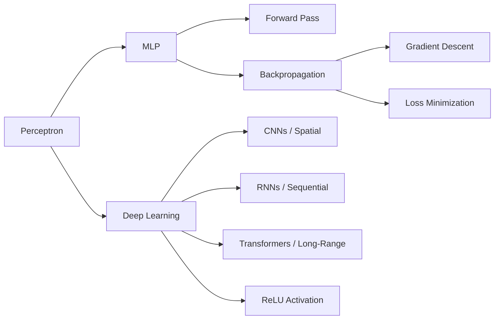

# Chapter 10: Neural Networks and Deep Learning

**Previous:** [Chapter 9: Machine Learning](09-machine-learning.md) | **Next:** [Chapter 10: Probabilistic Reasoning Over Time](10-probabilistic-reasoning.md)

---

## Learning Objectives

- Explain the biological inspiration behind artificial neural networks and the structure of a perceptron.
- Understand the architecture of Multi-Layer Perceptrons (MLPs).
- Describe the Backpropagation algorithm and its role in training neural networks.
- Identify common activation functions (ReLU, Sigmoid, Tanh) and their properties.
- Discuss the advantages of Deep Learning over traditional machine learning for complex tasks like computer vision and NLP.

## Chapter at a Glance

| Section | Key Topics | Key Terms |
|---------|-----------|-----------|
| Perceptron | Weighted sum, activation function | Bias, threshold, linear separability |
| Multi-Layer Perceptron | Input/hidden/output layers | Deep vs shallow, non-linear |
| Backpropagation | Chain rule, gradient descent | SGD, loss function, learning rate |
| Deep Learning | ReLU, CNNs, RNNs, Transformers | Vanishing gradient, attention |

## Chapter Roadmap



---

## Theory


> **One-Sentence Takeaway:** A perceptron computes a weighted sum of inputs through an activation function — a single perceptron can only learn linearly separable patterns, requiring multiple layers for non-linear problems.

### The Perceptron
The basic unit of a neural network is the **neuron** (or perceptron). It takes multiple inputs $x_i$, multiplies them by weights $w_i$, adds a bias $b$, and passes the result through an **activation function** $g$:
$Output = g(\sum w_i x_i + b)$

### Multi-Layer Perceptrons (MLP)
An MLP consists of:
- **Input Layer**: Receives the raw data.
- **Hidden Layers**: Perform intermediate computations to extract features.
- **Output Layer**: Produces the final prediction.

By having multiple hidden layers, a network can learn complex, non-linear mappings.

> **💡 Pro Tip:** The Universal Approximation Theorem guarantees that an MLP with one hidden layer can approximate any continuous function — but deeper networks require exponentially fewer neurons per layer. Depth provides representational efficiency, not just raw capacity.

### Backpropagation
Training a neural network involves finding the weights that minimize a loss function (e.g., Cross-Entropy). The **Backpropagation** algorithm uses the chain rule of calculus to calculate the gradient of the loss with respect to every weight in the network, allowing for efficient updates via **Stochastic Gradient Descent (SGD)**.

### Deep Learning
Deep Learning refers to neural networks with many hidden layers. Key innovations that enabled deep learning include:
- **ReLU (Rectified Linear Unit)**: An activation function $f(x) = max(0, x)$ that prevents gradients from vanishing.
- **Architectural Specialized Layers**: 
  - **Convolutional Layers**: For spatial data (images).
  - **Recurrent Layers**: For sequential data (text, time-series).
  - **Attention/Transformers**: For long-range dependencies.

---

## Examples

### Example 1: The XOR Problem
A single perceptron cannot solve the XOR problem because the classes are not linearly separable.
- **Step-by-step**:
  1. Input layer: (0,0), (0,1), (1,0), (1,1).
  2. A hidden layer with 2 neurons can create two different decision boundaries.
  3. The output layer combines these boundaries to correctly classify XOR.
- **What it demonstrates**: The necessity of hidden layers for non-linear problems.

### Example 2: Simple Image Classifier
Classify 28x28 grayscale images of handwritten digits (MNIST).
- **Architecture**:
  - Input: 784 pixels (28x28 flattened).
  - Hidden Layer: 128 neurons with ReLU.
  - Output Layer: 10 neurons (one for each digit) with Softmax.
- **Code snippet (Python with TensorFlow/Keras)**:
```python
import tensorflow as tf

model = tf.keras.models.Sequential([
  tf.keras.layers.Flatten(input_shape=(28, 28)),
  tf.keras.layers.Dense(128, activation='relu'),
  tf.keras.layers.Dense(10, activation='softmax')
])

model.compile(optimizer='adam',
              loss='sparse_categorical_crossentropy',
              metrics=['accuracy'])

# model.fit(train_images, train_labels, epochs=5)
```
- **What it demonstrates**: The high-level API used to build and train modern deep learning models.

---

## Concept Comparison

| Activation | Output Range | Gradient | Best For |
|-----------|:---:|:---:|:---:|
| Sigmoid | (0, 1) | Vanishes at extremes | Binary output |
| Tanh | (-1, 1) | Vanishes, zero-centered | Hidden layers (older) |
| ReLU | [0, ∞) | 0 or 1, no vanish | Hidden layers (default) |
| Leaky ReLU | (-∞, ∞) | 0.01 for x<0 | Avoiding dead neurons |
| Softmax | (0, 1), sums to 1 | Full distribution | Multi-class output |

## Quick Reference — Backpropagation Steps

| Step | Operation | Purpose |
|------|-----------|---------|
| Forward pass | Compute activations layer by layer | Get predictions |
| Loss computation | Compare output to target | Measure error |
| Output gradient | ∂Loss/∂output | Signal at output |
| Backward pass | Chain rule through layers | Distribute error |
| Weight update | w ← w - α ∂Loss/∂w | Minimize loss |

## Cross-Application Matrix

| Architecture | CV | NLP | Time Series | Research |
|-------------|:---:|:---:|:---:|:---:|
| MLP | ✅ | ✅ | ✅ | ✅ |
| CNN | ✅ | ✅ | ✅ | ✅ |
| RNN/LSTM | ⬜ | ✅ | ✅ | ✅ |
| Transformer | ✅ | ✅ | ✅ | ✅ |

## Chapter Quiz

**Q1:** Why can't a single perceptron solve the XOR problem?
- A) XOR requires too many parameters
- B) XOR classes are not linearly separable
- C) XOR has more than two inputs
- D) XOR requires a recurrent connection

<details><summary>Answer</summary>B) XOR output is not linearly separable in the input space — a single perceptron can only separate classes with a linear decision boundary.</details>

**Q2:** The chain rule in backpropagation computes what?
- A) The forward pass activations
- B) The gradient of the loss with respect to each weight
- C) The accuracy of the model
- D) The optimal number of layers

<details><summary>Answer</summary>B) Backpropagation uses the chain rule to compute ∂Loss/∂w for every weight, propagating error gradients backward from the output layer.</details>

**Q3:** What primary advantage does ReLU provide over sigmoid/tanh?
- A) ReLU is symmetric around zero
- B) ReLU does not saturate for positive inputs, mitigating the vanishing gradient problem
- C) ReLU guarantees convergence to the global minimum
- D) ReLU works without bias terms

<details><summary>Answer</summary>B) ReLU's gradient is 1 for positive inputs, avoiding the vanishing gradient problem that plagues saturating activation functions.</details>

---

## Summary

- Neural networks are inspired by the structure of the human brain but are grounded in linear algebra and calculus.
- The perceptron is the building block, and MLPs are the foundation of deep models.
- Backpropagation is the engine that drives learning by propagating errors backward through the network.
- Activation functions introduce non-linearity, allowing networks to learn complex patterns.
- Deep learning has revolutionized AI by eliminating the need for manual feature engineering.
- Modern architectures like CNNs and Transformers have set new benchmarks in vision and language tasks.

---

## Exercises

### Review Questions
1. Why is a non-linear activation function necessary in hidden layers?
2. Explain the "Vanishing Gradient" problem.
3. What is the purpose of the Softmax function in the output layer?
4. Contrast a local minimum with a global minimum in the context of loss surfaces.

### Application Problems
1. Compute the output of a single neuron with inputs [0.5, 0.8], weights [0.4, -0.5], bias 0.1, and a step activation function (threshold at 0).
2. Given a 3-layer MLP (Input, 1 Hidden, Output), how many weight parameters are there if the layers have 10, 20, and 2 neurons respectively (ignoring bias)?
3. Explain how "Dropout" helps prevent overfitting in deep neural networks.

### Challenge Problem
1. **The Universal Approximation Theorem**: State the theorem and discuss its implications for the power of neural networks. Does it mean that a single hidden layer is always sufficient in practice? Why or why not?
