# Chapter 10: Probabilistic Reasoning

**Previous:** [Chapter 9: Reasoning Under Uncertainty](09-uncertainty.md) | **Next:** [Chapter 11: Reinforcement Learning](11-reinforcement-learning.md)

## Learning Objectives

By the conclusion of this chapter, the student will be able to: (1) construct Bayesian networks to model probabilistic relationships from domain knowledge; (2) analyze conditional independence using d-separation rules; (3) implement exact inference via variable elimination; (4) implement approximate inference using Gibbs sampling and likelihood weighting; (5) apply probabilistic reasoning to real-world systems such as medical diagnosis, fault analysis, and bioinformatics.

## Chapter at a Glance

| Section | Key Topics | Key Terms |
|---------|-----------|-----------|
| BN Construction | DAG, CPT, chain-rule factorization | Parent, child, conditional probability table |
| Conditional Independence | Independence, conditional independence, Markov blanket | Bayes' rule, evidence, marginalization |
| d-Separation | Chain, fork, collider, active trail | Blocked path, explaining away |
| Exact Inference | Variable elimination, factor multiplication | Treewidth, elimination order, marginal |
| Approximate Inference | Rejection sampling, likelihood weighting, Gibbs sampling | MCMC, Markov blanket resampling, convergence |
| BN Structure Learning | Score-based, constraint-based, hybrid | BIC, K2, Chow-Liu tree |

## Chapter Roadmap

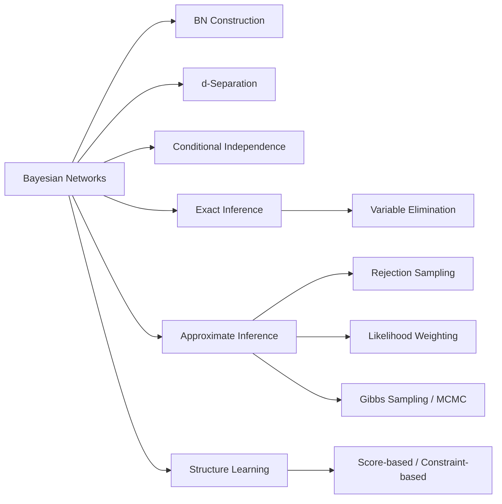
```mermaid
flowchart LR
    A[Bayesian Networks] --> B[BN Construction]
    A --> C[d-Separation]
    A --> D[Conditional Independence]
    A --> E[Exact Inference]
    A --> F[Approximate Inference]
    E --> G[Variable Elimination]
    F --> H[Rejection Sampling]
    F --> I[Likelihood Weighting]
    F --> J[Gibbs Sampling / MCMC]
    A --> K[Structure Learning]
    K --> L[Score-based / Constraint-based]
```

---

## Why Probabilistic Reasoning Matters

### Real-World Analogy -- Diagnosing Car Problems

<a href="../../assets/images/diagrams/artificial-intelligence/10-probabilistic-reasoning/real-world-analogy-diagnosing-car-problems-handwritten.svg" target="_blank" rel="noopener">
  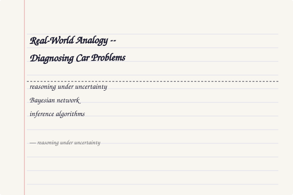
</a>
<a href="../../assets/images/diagrams/artificial-intelligence/10-probabilistic-reasoning/real-world-analogy-diagnosing-car-problems-diagram.svg" target="_blank" rel="noopener">
  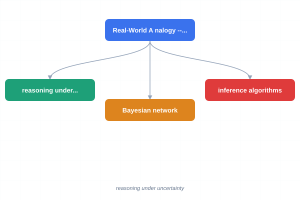
</a>
<a href="../../assets/images/diagrams/artificial-intelligence/10-probabilistic-reasoning/real-world-analogy-diagnosing-car-problems-sticky.svg" target="_blank" rel="noopener">
  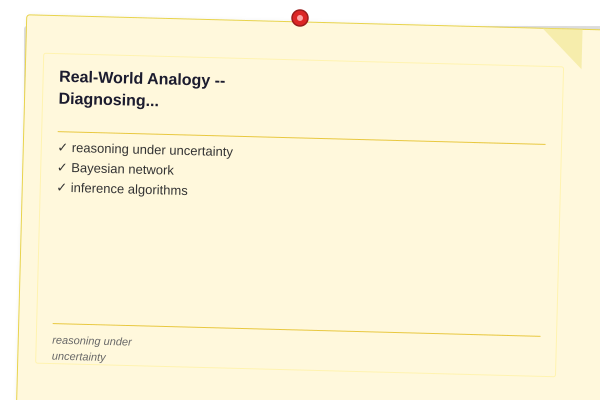
</a>


Imagine your car won't start. Multiple faults could be responsible: a dead battery, a failed starter motor, an empty fuel tank, or a blown fuse. You cannot see the root cause directly -- you can only observe symptoms: the dashboard lights dim when you turn the key, the engine doesn't crank, or you hear a clicking sound.

This is **reasoning under uncertainty**: multiple causes, imperfect observations, and the need to combine evidence to reach a conclusion. If the lights dim and you hear clicking, the battery is likely dead (clicking suggests the starter is trying but lacks power). If there is complete silence but lights are bright, the starter itself may be faulty. If the fuel gauge reads empty, that is a simpler explanation.

Probabilistic reasoning gives us the mathematical tools to quantify this kind of reasoning. A **Bayesian network** captures the causal relationships between faults and symptoms, and **inference algorithms** compute the most likely diagnosis given what you observe. The same machinery powers medical diagnosis (disease -> symptom), spam filtering (word -> spam/ham), and fault detection in aircraft engines.

---

## 10.1 Bayesian Networks Construction

### Real-World Analogy -- Family Medical History

<a href="../../assets/images/diagrams/artificial-intelligence/10-probabilistic-reasoning/real-world-analogy-family-medical-history-handwritten.svg" target="_blank" rel="noopener">
  
</a>
<a href="../../assets/images/diagrams/artificial-intelligence/10-probabilistic-reasoning/real-world-analogy-family-medical-history-diagram.svg" target="_blank" rel="noopener">
  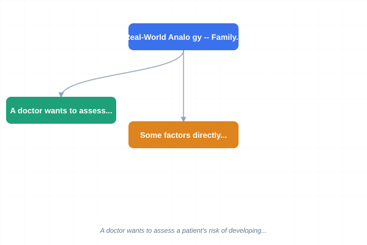
</a>
<a href="../../assets/images/diagrams/artificial-intelligence/10-probabilistic-reasoning/real-world-analogy-family-medical-history-sticky.svg" target="_blank" rel="noopener">
  
</a>


A doctor wants to assess a patient's risk of developing hereditary heart disease. Multiple factors interact: family history (genetic predisposition), lifestyle (diet, exercise), age, and cholesterol levels. Some factors directly influence others -- poor diet raises cholesterol, which increases heart disease risk. The BN structure captures which factors directly influence which outcomes, and the conditional probabilities quantify the strength of those influences. Once built, the network answers queries like "given high cholesterol and family history, what is the probability of heart disease?"

### Definition

<a href="../../assets/images/diagrams/artificial-intelligence/10-probabilistic-reasoning/definition-handwritten.svg" target="_blank" rel="noopener">
  
</a>
<a href="../../assets/images/diagrams/artificial-intelligence/10-probabilistic-reasoning/definition-diagram.svg" target="_blank" rel="noopener">
  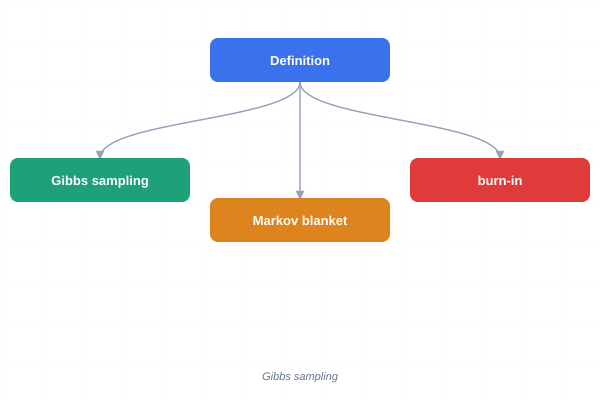
</a>
<a href="../../assets/images/diagrams/artificial-intelligence/10-probabilistic-reasoning/definition-sticky.svg" target="_blank" rel="noopener">
  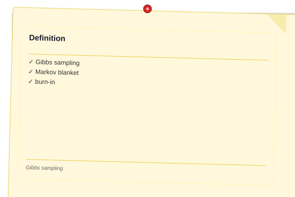
</a>


A **Bayesian network** (BN) is a pair $(G, \Theta)$ where:
- $G = (V, E)$ is a **directed acyclic graph (DAG)**. Each node $X_i \in V$ represents a random variable. Each directed edge $X_j \to X_i$ represents a direct probabilistic dependence.
- $\Theta$ is the set of **conditional probability tables (CPTs)**. For each node $X_i$, the CPT specifies $P(X_i \mid \text{Parents}(X_i))$.

The BN encodes the joint distribution via the **chain rule**:

$$P(X_1, X_2, \ldots, X_n) = \prod_{i=1}^n P(X_i \mid \text{Parents}(X_i))$$

### Algorithm: Constructing a Bayesian Network

<a href="../../assets/images/diagrams/artificial-intelligence/10-probabilistic-reasoning/algorithm-constructing-a-bayesian-network-handwritten.svg" target="_blank" rel="noopener">
  
</a>
<a href="../../assets/images/diagrams/artificial-intelligence/10-probabilistic-reasoning/algorithm-constructing-a-bayesian-network-diagram.svg" target="_blank" rel="noopener">
  
</a>
<a href="../../assets/images/diagrams/artificial-intelligence/10-probabilistic-reasoning/algorithm-constructing-a-bayesian-network-sticky.svg" target="_blank" rel="noopener">
  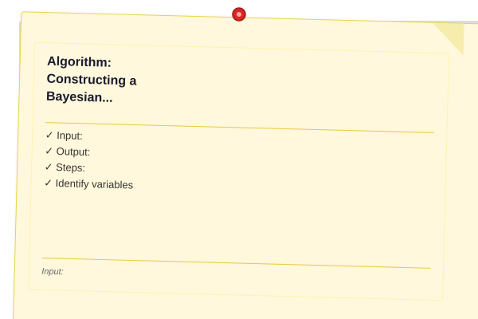
</a>


**Input:** Set of random variables $\{X_1, \ldots, X_n\}$, causal domain knowledge.
**Output:** A DAG $G$ with CPTs $\Theta$.

**Steps:**

1. **Identify variables** -- List all relevant random variables. Distinguish query variables, evidence (observable) variables, and hidden (latent) variables.

2. **Order variables** -- Choose a **causal ordering** $X_1, \ldots, X_n$ such that causes precede their effects. This ordering must respect the direction of causality -- if $X_i$ causes $X_j$, then $X_i$ appears before $X_j$.

3. **Add edges** -- For each variable $X_i$ (in causal order), select a minimal set of **parents** $\text{Pa}(X_i) \subseteq \{X_1, \ldots, X_{i-1}\}$ such that $X_i$ is conditionally independent of its predecessors given its parents:
   $$P(X_i \mid X_1, \ldots, X_{i-1}) = P(X_i \mid \text{Pa}(X_i))$$
   Add a directed edge from each parent to $X_i$.

4. **Define CPTs** -- For each variable $X_i$ with $k$ parents, specify a CPT of size $d_i \times \prod_{j=1}^k d_{\text{pa}_j}$ where $d$ is the domain size.

5. **Validate** -- Verify the DAG has no cycles. Verify the product of all CPTs yields a valid joint distribution (sums to 1).

### Pseudocode

<a href="../../assets/images/diagrams/artificial-intelligence/10-probabilistic-reasoning/pseudocode-handwritten.svg" target="_blank" rel="noopener">
  
</a>
<a href="../../assets/images/diagrams/artificial-intelligence/10-probabilistic-reasoning/pseudocode-diagram.svg" target="_blank" rel="noopener">
  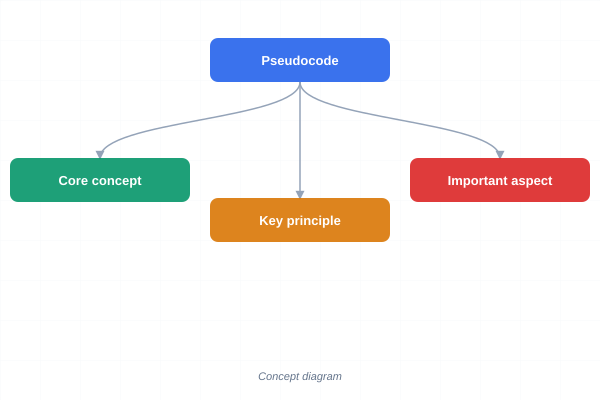
</a>
<a href="../../assets/images/diagrams/artificial-intelligence/10-probabilistic-reasoning/pseudocode-sticky.svg" target="_blank" rel="noopener">
  
</a>


```
function BUILD-BAYESIAN-NETWORK(vars, ordering, domain_knowledge) returns BN
    G <- empty DAG with nodes vars
    for i = 1 to n do                              // causal order
        candidates <- {vars[1], ..., vars[i-1]}
        parents <- SELECT-MINIMAL-PARENTS(vars[i], candidates, domain_knowledge)
        for each parent in parents do
            G.ADD-EDGE(parent -> vars[i])
        CPT[vars[i]] <- ESTIMATE-CPT(vars[i], parents, domain_knowledge)
    if HAS-CYCLE(G) then
        return ERROR("cycle detected -- reorder variables")
    return BN(G, CPT)
```

### Step-by-Step Dry Run -- Alarm Network

<a href="../../assets/images/diagrams/artificial-intelligence/10-probabilistic-reasoning/step-by-step-dry-run-alarm-network-handwritten.svg" target="_blank" rel="noopener">
  
</a>
<a href="../../assets/images/diagrams/artificial-intelligence/10-probabilistic-reasoning/step-by-step-dry-run-alarm-network-diagram.svg" target="_blank" rel="noopener">
  
</a>
<a href="../../assets/images/diagrams/artificial-intelligence/10-probabilistic-reasoning/step-by-step-dry-run-alarm-network-sticky.svg" target="_blank" rel="noopener">
  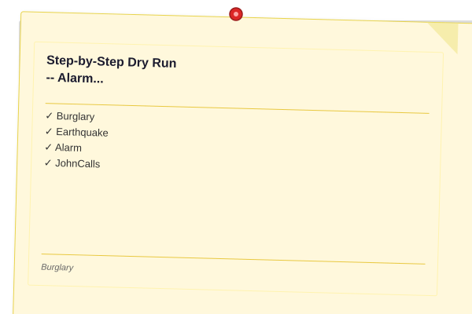
</a>


Construct the classic Alarm network (Pearl, 1988): **Burglary**, **Earthquake**, **Alarm**, **JohnCalls**, **MaryCalls**.

| Step | Variable | Parents | Rationale |
|------|----------|---------|-----------|
| 1 | Burglary (B) | {} | Root cause -- no predecessors |
| 2 | Earthquake (E) | {} | Root cause -- independent of Burglary |
| 3 | Alarm (A) | {B, E} | Both Burglary and Earthquake can trigger Alarm |
| 4 | JohnCalls (J) | {A} | John calls directly if Alarm sounds |
| 5 | MaryCalls (M) | {A} | Mary calls directly if Alarm sounds |

**CPTs defined:**

```
P(B = true)  = 0.001
P(E = true)  = 0.002

P(A | B, E):
  B=true  E=true  -> P(A=true) = 0.95
  B=true  E=false -> P(A=true) = 0.94
  B=false E=true  -> P(A=true) = 0.29
  B=false E=false -> P(A=true) = 0.001

P(J | A):
  A=true  -> P(J=true) = 0.90
  A=false -> P(J=true) = 0.05

P(M | A):
  A=true  -> P(M=true) = 0.70
  A=false -> P(M=true) = 0.01
```

**Joint distribution factorization:**

$$P(B, E, A, J, M) = P(B) P(E) P(A \mid B, E) P(J \mid A) P(M \mid A)$$

Total parameters: $1 + 1 + 4 + 2 + 2 = 10$ versus $2^5 - 1 = 31$ for the full joint table -- a 68% reduction.

### Python Implementation

<a href="../../assets/images/diagrams/artificial-intelligence/10-probabilistic-reasoning/python-implementation-handwritten.svg" target="_blank" rel="noopener">
  
</a>
<a href="../../assets/images/diagrams/artificial-intelligence/10-probabilistic-reasoning/python-implementation-diagram.svg" target="_blank" rel="noopener">
  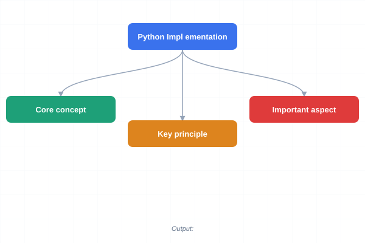
</a>
<a href="../../assets/images/diagrams/artificial-intelligence/10-probabilistic-reasoning/python-implementation-sticky.svg" target="_blank" rel="noopener">
  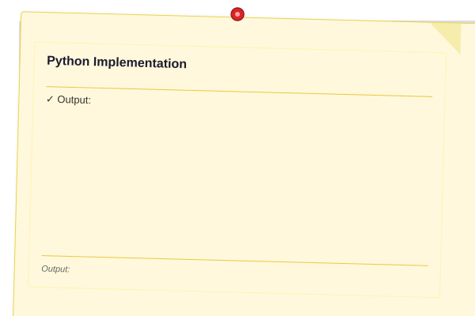
</a>


```python
import numpy as np
from collections import defaultdict

class BayesianNetwork:
    """Simple Bayesian network with discrete variables."""

    def __init__(self):
        self.graph = defaultdict(list)      # parent -> children
        self.cpts = {}                       # variable -> CPT table
        self.parents = defaultdict(list)     # variable -> list of parents
        self.topological_order = []

    def add_node(self, var, parents, cpt_values):
        """Add a variable with its parents and CPT.

        Args:
            var: Variable name (string)
            parents: List of parent variable names
            cpt_values: Dict mapping parent assignments to distribution,
                        where None key means no parents
        """
        self.parents[var] = parents
        for p in parents:
            self.graph[p].append(var)
        self.cpts[var] = cpt_values

    def topological_sort(self):
        """Compute topological ordering via DFS."""
        visited = set()
        order = []

        def dfs(node):
            if node in visited:
                return
            visited.add(node)
            for child in self.graph[node]:
                dfs(child)
            order.append(node)

        for node in list(self.graph.keys()) + [n for n in self.cpts if n not in visited]:
            if node not in visited:
                dfs(node)

        self.topological_order = list(reversed(order))
        return self.topological_order

    def joint_probability(self, assignment):
        """Compute P(assignment) using chain rule."""
        prob = 1.0
        for var in self.topological_order:
            parents = self.parents[var]
            if not parents:
                prob *= self.cpts[var][None][assignment[var]]
            else:
                parent_vals = tuple(assignment[p] for p in parents)
                prob *= self.cpts[var][parent_vals][assignment[var]]
        return prob


# Build the Alarm network
alarm_net = BayesianNetwork()

# Burglary: P(B) = [0.999, 0.001]
alarm_net.add_node("Burglary", [], {None: [0.999, 0.001]})

# Earthquake: P(E) = [0.998, 0.002]
alarm_net.add_node("Earthquake", [], {None: [0.998, 0.002]})

# Alarm: P(A | B, E) -- indexed as (B_val, E_val) -> [P(A=false), P(A=true)]
alarm_net.add_node("Alarm", ["Burglary", "Earthquake"], {
    (0, 0): [0.999, 0.001],
    (0, 1): [0.71,  0.29],
    (1, 0): [0.06,  0.94],
    (1, 1): [0.05,  0.95]
})

# JohnCalls: P(J | A)
alarm_net.add_node("JohnCalls", ["Alarm"], {
    (0,): [0.95, 0.05],
    (1,): [0.10, 0.90]
})

# MaryCalls: P(M | A)
alarm_net.add_node("MaryCalls", ["Alarm"], {
    (0,): [0.99, 0.01],
    (1,): [0.30, 0.70]
})

alarm_net.topological_sort()

# Query: P(B=true, E=false, A=true, J=true, M=false)
assignment = {"Burglary": 1, "Earthquake": 0, "Alarm": 1, "JohnCalls": 1, "MaryCalls": 0}
prob = alarm_net.joint_probability(assignment)
print(f"P(B=true, E=false, A=true, J=true, M=false) = {prob:.6e}")
# ~ 0.001 * 0.998 * 0.94 * 0.90 * 0.30 ~ 2.53e-4
```

**Output:**
```
P(B=true, E=false, A=true, J=true, M=false) = 2.531e-04
```

### Complexity Analysis

<a href="../../assets/images/diagrams/artificial-intelligence/10-probabilistic-reasoning/complexity-analysis-handwritten.svg" target="_blank" rel="noopener">
  
</a>
<a href="../../assets/images/diagrams/artificial-intelligence/10-probabilistic-reasoning/complexity-analysis-diagram.svg" target="_blank" rel="noopener">
  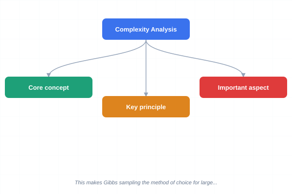
</a>
<a href="../../assets/images/diagrams/artificial-intelligence/10-probabilistic-reasoning/complexity-analysis-sticky.svg" target="_blank" rel="noopener">
  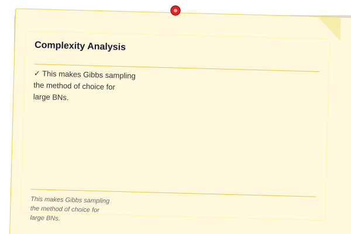
</a>


**Why O(n * d^(k+1)):** Each of the $n$ variables requires a CPT with $d^k$ entries (where $d$ is the maximum domain size and $k$ is the maximum number of parents). Each entry stores one probability value. The total storage is $O(n \cdot d^{k+1})$. For binary variables ($d = 2$) with at most $k$ parents, this is $O(n \cdot 2^k)$. Without the BN structure, the full joint table requires $O(d^n)$ entries -- exponential in $n$. The BN reduces this to exponential only in $k$, the maximum **in-degree**, which is typically small ($k \ll n$).

### Advantages & Disadvantages

<a href="../../assets/images/diagrams/artificial-intelligence/10-probabilistic-reasoning/advantages-disadvantages-handwritten.svg" target="_blank" rel="noopener">
  
</a>
<a href="../../assets/images/diagrams/artificial-intelligence/10-probabilistic-reasoning/advantages-disadvantages-diagram.svg" target="_blank" rel="noopener">
  
</a>
<a href="../../assets/images/diagrams/artificial-intelligence/10-probabilistic-reasoning/advantages-disadvantages-sticky.svg" target="_blank" rel="noopener">
  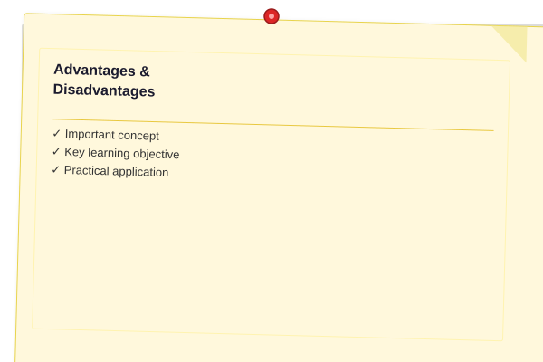
</a>


| Advantages | Disadvantages |
|------------|---------------|
| Compact representation -- parameters grow with in-degree, not variable count | Requires causal ordering -- wrong ordering produces extra edges |
| Explicit handling of uncertainty via probabilities | CPTs grow exponentially with number of parents ($d^{k+1}$) |
| Graph provides intuitive visual interpretation | Discrete variables only without extensions (can use conditional Gaussian for hybrid) |
| Supports both forward (prediction) and backward (diagnosis) reasoning | Structure learning from data is NP-hard |
| Well-understood inference algorithms available | Sensitive to probability estimation errors in CPTs |

### Edge Cases

<a href="../../assets/images/diagrams/artificial-intelligence/10-probabilistic-reasoning/edge-cases-handwritten.svg" target="_blank" rel="noopener">
  
</a>
<a href="../../assets/images/diagrams/artificial-intelligence/10-probabilistic-reasoning/edge-cases-diagram.svg" target="_blank" rel="noopener">
  
</a>
<a href="../../assets/images/diagrams/artificial-intelligence/10-probabilistic-reasoning/edge-cases-sticky.svg" target="_blank" rel="noopener">
  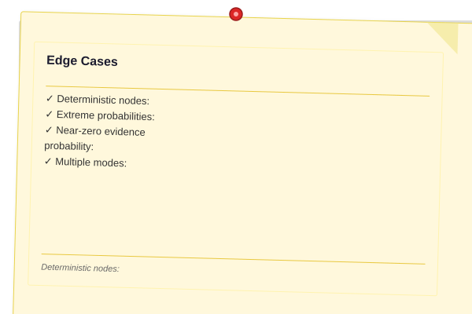
</a>


- **No parents (root node):** CPT is just the prior distribution $P(X_i)$ -- a single probability vector. No edges incident to the node.
- **Deterministic node:** CPT entries are 0 or 1 (e.g., $X = A \land B$). The node is completely determined by its parents. Inference can still propagate probabilities.
- **Variables with large domains ($d \gg 2$):** CPT size grows as $d^{k+1}$. Use **noisy-OR** or **noisy-MAX** to reduce parameters to $O(k)$ instead of $O(d^{k+1})$ for binary parent nodes.
- **Continuous variables:** Use conditional Gaussian distributions (linear Gaussian) or discretize continuous ranges into intervals.
- **Context-specific independence:** Not all parent combinations are relevant. Use **CPD trees** (decision trees as CPTs) to exploit regularities.

---

## 10.2 Conditional Independence

### Real-World Analogy -- Weather and Clothing Choices

<a href="../../assets/images/diagrams/artificial-intelligence/10-probabilistic-reasoning/real-world-analogy-weather-and-clothing-choices-handwritten.svg" target="_blank" rel="noopener">
  
</a>
<a href="../../assets/images/diagrams/artificial-intelligence/10-probabilistic-reasoning/real-world-analogy-weather-and-clothing-choices-diagram.svg" target="_blank" rel="noopener">
  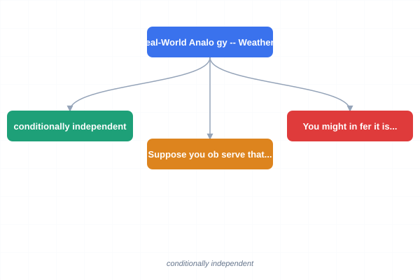
</a>
<a href="../../assets/images/diagrams/artificial-intelligence/10-probabilistic-reasoning/real-world-analogy-weather-and-clothing-choices-sticky.svg" target="_blank" rel="noopener">
  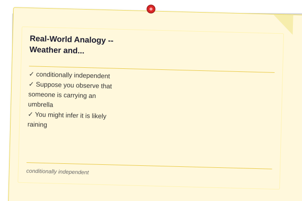
</a>


Suppose you observe that someone is carrying an umbrella. You might infer it is likely raining. Now suppose you also observe that the ground is wet. Given that you already know the ground is wet, knowing they carry an umbrella adds little information about whether it is raining -- the umbrella and ground-wetness are **conditionally independent** given rain. Rain is the common cause of both observations; once you fix the cause, the effects become independent.

This idea -- that variables become independent once we condition on their common causes -- is the backbone of Bayesian network factorization.

### Definition

<a href="../../assets/images/diagrams/artificial-intelligence/10-probabilistic-reasoning/definition-handwritten.svg" target="_blank" rel="noopener">
  
</a>
<a href="../../assets/images/diagrams/artificial-intelligence/10-probabilistic-reasoning/definition-diagram.svg" target="_blank" rel="noopener">
  
</a>
<a href="../../assets/images/diagrams/artificial-intelligence/10-probabilistic-reasoning/definition-sticky.svg" target="_blank" rel="noopener">
  
</a>


Variables $X$ and $Y$ are **conditionally independent** given a set of variables $\mathcal{Z}$, denoted $X \perp\!\!\!\perp Y \mid \mathcal{Z}$, if:

$$P(X, Y \mid \mathcal{Z}) = P(X \mid \mathcal{Z}) \, P(Y \mid \mathcal{Z})$$

Equivalently: $P(X \mid Y, \mathcal{Z}) = P(X \mid \mathcal{Z})$ -- knowing $Y$ tells us nothing about $X$ once we know $\mathcal{Z}$.

### The Markov Blanket

<a href="../../assets/images/diagrams/artificial-intelligence/10-probabilistic-reasoning/the-markov-blanket-handwritten.svg" target="_blank" rel="noopener">
  
</a>
<a href="../../assets/images/diagrams/artificial-intelligence/10-probabilistic-reasoning/the-markov-blanket-diagram.svg" target="_blank" rel="noopener">
  
</a>
<a href="../../assets/images/diagrams/artificial-intelligence/10-probabilistic-reasoning/the-markov-blanket-sticky.svg" target="_blank" rel="noopener">
  
</a>


The **Markov blanket** of a node $X$ is the minimal set of nodes that renders $X$ conditionally independent of all other nodes in the network. It consists of:
- $X$'s **parents**
- $X$'s **children**
- $X$'s **co-parents** (other parents of $X$'s children)

$$P(X \mid \text{all other nodes}) = P(X \mid \text{MarkovBlanket}(X))$$

This property is critical for Gibbs sampling (Section 10.5): to resample $X$, we only need its Markov blanket, not the full network.

### Algorithm: Testing Conditional Independence

<a href="../../assets/images/diagrams/artificial-intelligence/10-probabilistic-reasoning/algorithm-testing-conditional-independence-handwritten.svg" target="_blank" rel="noopener">
  
</a>
<a href="../../assets/images/diagrams/artificial-intelligence/10-probabilistic-reasoning/algorithm-testing-conditional-independence-diagram.svg" target="_blank" rel="noopener">
  
</a>
<a href="../../assets/images/diagrams/artificial-intelligence/10-probabilistic-reasoning/algorithm-testing-conditional-independence-sticky.svg" target="_blank" rel="noopener">
  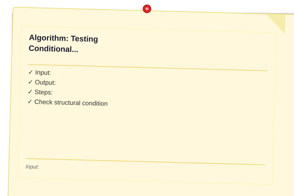
</a>


**Input:** BN $G$, query variables $X, Y$, evidence set $\mathcal{Z}$.
**Output:** True if $X \perp\!\!\!\perp Y \mid \mathcal{Z}$.

**Steps:**

1. **Check structural condition** -- Determine if the graph implies $X \perp\!\!\!\perp Y \mid \mathcal{Z}$ using d-separation (Section 10.3).

2. **Check numeric condition** -- If the graph does not imply independence, compute:
   $$P(X, Y \mid \mathcal{Z}) \stackrel{?}{=} P(X \mid \mathcal{Z}) P(Y \mid \mathcal{Z})$$
   using the joint distribution factorized by the BN.

3. **Tolerance check** -- For approximate equality, use threshold $\epsilon$ (typically $10^{-6}$):
   $$\max_{x, y, z} |P(x, y \mid z) - P(x \mid z)P(y \mid z)| < \epsilon$$

### Pseudocode

<a href="../../assets/images/diagrams/artificial-intelligence/10-probabilistic-reasoning/pseudocode-handwritten.svg" target="_blank" rel="noopener">
  
</a>
<a href="../../assets/images/diagrams/artificial-intelligence/10-probabilistic-reasoning/pseudocode-diagram.svg" target="_blank" rel="noopener">
  
</a>
<a href="../../assets/images/diagrams/artificial-intelligence/10-probabilistic-reasoning/pseudocode-sticky.svg" target="_blank" rel="noopener">
  
</a>


```
function CHECK-CONDITIONAL-INDEPENDENCE(BN, X, Y, Z) returns boolean
    // Method 1: d-separation test (structural)
    if D-SEPARATED(BN.graph, X, Y, Z) then
        return TRUE
    
    // Method 2: numeric test (computational)
    for each value x in domain(X) do
        for each value y in domain(Y) do
            for each assignment z in cross-product(Z) do
                p_xy_z <- INFER(BN, query=[X, Y], evidence=Z=z)
                p_x_z  <- INFER(BN, query=[X], evidence=Z=z)
                p_y_z  <- INFER(BN, query=[Y], evidence=Z=z)
                if |p_xy_z(x, y) - p_x_z(x) * p_y_z(y)| > eps then
                    return FALSE
    return TRUE
```

### Step-by-Step Dry Run -- Alarm Network Independence

<a href="../../assets/images/diagrams/artificial-intelligence/10-probabilistic-reasoning/step-by-step-dry-run-alarm-network-independence-handwritten.svg" target="_blank" rel="noopener">
  
</a>
<a href="../../assets/images/diagrams/artificial-intelligence/10-probabilistic-reasoning/step-by-step-dry-run-alarm-network-independence-diagram.svg" target="_blank" rel="noopener">
  
</a>
<a href="../../assets/images/diagrams/artificial-intelligence/10-probabilistic-reasoning/step-by-step-dry-run-alarm-network-independence-sticky.svg" target="_blank" rel="noopener">
  
</a>


Check if **JohnCalls** and **MaryCalls** are conditionally independent given **Alarm**.

| Step | Condition | Evaluation |
|------|-----------|------------|
| 1 | Graph structure | JohnCalls &lt;- Alarm -&gt; MaryCalls (fork) |
| 2 | d-separation | Alarm in evidence set -- path is **blocked** |
| 3 | Structural result | JohnCalls _|_ MaryCalls | Alarm predicted |

**Numeric verification:**

```
P(J=true, M=true | A=true)  = P(J=true | A=true) * P(M=true | A=true)
                              = 0.90 * 0.70 = 0.63

P(J=true | A=true)           = 0.90
P(M=true | A=true)           = 0.70
P(J=true | A=true) * P(M=true | A=true) = 0.63 ✓
```

Now check if **JohnCalls** and **MaryCalls** are independent **without** conditioning on Alarm:

```
P(J=true, M=true) = Σ_A P(J=true|A) P(M=true|A) P(A)
                 = 0.90 * 0.70 * 0.002516 + 0.05 * 0.01 * 0.997484
                 = 0.001585 + 0.000499 = 0.002084

P(J=true) * P(M=true) = 0.05214 * 0.01174 = 0.000612

0.002084 ≠ 0.000612 -> Not independent without conditioning ✓
```

### Python Implementation

<a href="../../assets/images/diagrams/artificial-intelligence/10-probabilistic-reasoning/python-implementation-handwritten.svg" target="_blank" rel="noopener">
  
</a>
<a href="../../assets/images/diagrams/artificial-intelligence/10-probabilistic-reasoning/python-implementation-diagram.svg" target="_blank" rel="noopener">
  
</a>
<a href="../../assets/images/diagrams/artificial-intelligence/10-probabilistic-reasoning/python-implementation-sticky.svg" target="_blank" rel="noopener">
  
</a>


```python
def check_conditional_independence(bn, X, Y, Z, epsilon=1e-6):
    """Check if X _|_ Y | Z using joint probability factorized by BN.

    Args:
        bn: BayesianNetwork instance with joint_probability()
        X, Y: Variables to test
        Z: List of conditioning variables
        epsilon: Tolerance for numeric equality
    """
    all_vars = list(bn.cpts.keys())
    evidence_vars = Z
    query_vars = [X, Y]

    # Enumerate all assignments
    def enumerate_assignments(vars_to_assign, fixed_vals):
        if not vars_to_assign:
            yield dict(fixed_vals)
            return
        var = vars_to_assign[0]
        remaining = vars_to_assign[1:]
        if var in fixed_vals:
            yield from enumerate_assignments(remaining, fixed_vals)
        else:
            for val in [0, 1]:
                fixed_vals[var] = val
                yield from enumerate_assignments(remaining, fixed_vals)
                del fixed_vals[var]

    # Compute marginals over all assignments for each Z assignment
    z_values = [0, 1] if Z else [None]

    for z_val in z_values:
        evidence = {Z[0]: z_val} if Z else {}

        all_assignments = []
        for assignment in enumerate_assignments(all_vars, evidence):
            prob = bn.joint_probability(assignment)
            if prob > 0:
                all_assignments.append((assignment, prob))

        # Weight by probability
        total_prob = sum(p for _, p in all_assignments)
        if total_prob == 0:
            continue

        for x_val in [0, 1]:
            for y_val in [0, 1]:
                p_xy = sum(p for a, p in all_assignments
                          if a[X] == x_val and a[Y] == y_val) / total_prob
                p_x = sum(p for a, p in all_assignments
                         if a[X] == x_val) / total_prob
                p_y = sum(p for a, p in all_assignments
                         if a[Y] == y_val) / total_prob

                if abs(p_xy - p_x * p_y) > epsilon:
                    return False, f"Not independent at {X}={x_val}, {Y}={y_val}, Z={z_val}"
    return True, "Conditionally independent"


# Test on Alarm network
indep, msg = check_conditional_independence(alarm_net, "JohnCalls", "MaryCalls", ["Alarm"])
print(f"JohnCalls _|_ MaryCalls | Alarm: {indep} -- {msg}")

indep, msg = check_conditional_independence(alarm_net, "JohnCalls", "MaryCalls", [])
print(f"JohnCalls _|_ MaryCalls: {indep} -- {msg}")
```

**Output:**
```
JohnCalls _|_ MaryCalls | Alarm: True -- Conditionally independent
JohnCalls _|_ MaryCalls: False -- Not independent at JohnCalls=1, MaryCalls=1, Z=None
```

### Complexity Analysis

<a href="../../assets/images/diagrams/artificial-intelligence/10-probabilistic-reasoning/complexity-analysis-handwritten.svg" target="_blank" rel="noopener">
  
</a>
<a href="../../assets/images/diagrams/artificial-intelligence/10-probabilistic-reasoning/complexity-analysis-diagram.svg" target="_blank" rel="noopener">
  
</a>
<a href="../../assets/images/diagrams/artificial-intelligence/10-probabilistic-reasoning/complexity-analysis-sticky.svg" target="_blank" rel="noopener">
  
</a>


**Why O(d^n):** The numeric test for conditional independence requires enumerating all possible assignments in the worst case. For $n$ binary variables, there are $2^n$ assignments. For each assignment, computing the joint probability involves multiplying $n$ CPT entries -- $O(n)$. Total: $O(n \cdot 2^n)$. This is why **d-separation** (a purely structural test, Section 10.3) is preferred -- it runs in $O(|E|)$ time where $|E|$ is the number of edges, completely avoiding exponential enumeration.

### Advantages & Disadvantages

<a href="../../assets/images/diagrams/artificial-intelligence/10-probabilistic-reasoning/advantages-disadvantages-handwritten.svg" target="_blank" rel="noopener">
  
</a>
<a href="../../assets/images/diagrams/artificial-intelligence/10-probabilistic-reasoning/advantages-disadvantages-diagram.svg" target="_blank" rel="noopener">
  
</a>
<a href="../../assets/images/diagrams/artificial-intelligence/10-probabilistic-reasoning/advantages-disadvantages-sticky.svg" target="_blank" rel="noopener">
  
</a>


| Advantages | Disadvantages |
|------------|---------------|
| Core property enabling BN factorization -- reduces parameter count | Numeric verification is exponential in $n$ |
| Markov blanket enables local computation in Gibbs sampling | Domain expertise required to identify conditional independencies |
| Provides semantics for interpreting graph structure | Some independencies may be accidental (not encoded in graph) |
| Drives efficient inference algorithm design | Continuous variables complicate independence testing |

### Edge Cases

<a href="../../assets/images/diagrams/artificial-intelligence/10-probabilistic-reasoning/edge-cases-handwritten.svg" target="_blank" rel="noopener">
  
</a>
<a href="../../assets/images/diagrams/artificial-intelligence/10-probabilistic-reasoning/edge-cases-diagram.svg" target="_blank" rel="noopener">
  
</a>
<a href="../../assets/images/diagrams/artificial-intelligence/10-probabilistic-reasoning/edge-cases-sticky.svg" target="_blank" rel="noopener">
  
</a>


- **Empty evidence set** $\mathcal{Z} = \varnothing$: Reduces to marginal independence. $X \perp\!\!\!\perp Y$ means $P(X, Y) = P(X) P(Y)$.
- **Full evidence** $\mathcal{Z} = \text{Vars} \setminus \{X, Y\}$: May create dependence through collider effects (explaining away).
- **Deterministic relationships:** If $Y = f(X)$ deterministically, then $X$ and $Y$ are never independent (or conditionally independent) unless strange coincidences occur.
- **Zero-probability events:** If $P(\mathcal{Z} = z) = 0$, conditional independence is undefined for that $z$ assignment.

---

## 10.3 d-Separation

### Real-World Analogy -- Family Genetics

<a href="../../assets/images/diagrams/artificial-intelligence/10-probabilistic-reasoning/real-world-analogy-family-genetics-handwritten.svg" target="_blank" rel="noopener">
  
</a>
<a href="../../assets/images/diagrams/artificial-intelligence/10-probabilistic-reasoning/real-world-analogy-family-genetics-diagram.svg" target="_blank" rel="noopener">
  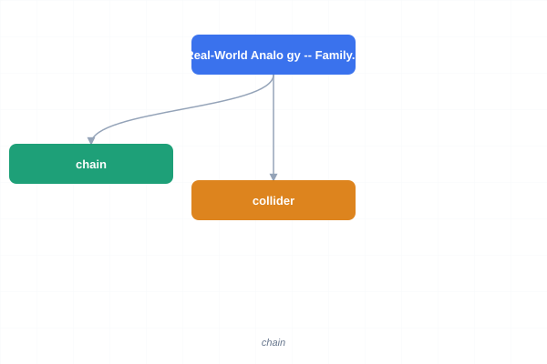
</a>
<a href="../../assets/images/diagrams/artificial-intelligence/10-probabilistic-reasoning/real-world-analogy-family-genetics-sticky.svg" target="_blank" rel="noopener">
  
</a>


Consider three generations: Grandparent (G), Parent (P), and Child (C). The genetic trait flows G -> P -> C. If we know Parent's genetic makeup, then knowing Grandparent's genetics tells us nothing additional about Child's genetics -- Child depends only on Parent. This is a **chain** (G -> P -> C), and conditioning on P blocks the flow of information.

Now consider a trait influenced by two independent genes from Mother and Father, expressed in Child. If Child has the trait, suddenly Mother's and Father's genetics become dependent -- if Mother didn't pass the gene, Father must have. This is a **collider** (M -> C &lt;- F), and conditioning on C creates an association between M and F (explaining away).

### Definition

<a href="../../assets/images/diagrams/artificial-intelligence/10-probabilistic-reasoning/definition-handwritten.svg" target="_blank" rel="noopener">
  
</a>
<a href="../../assets/images/diagrams/artificial-intelligence/10-probabilistic-reasoning/definition-diagram.svg" target="_blank" rel="noopener">
  
</a>
<a href="../../assets/images/diagrams/artificial-intelligence/10-probabilistic-reasoning/definition-sticky.svg" target="_blank" rel="noopener">
  
</a>


**d-separation** (directional separation) is a graphical criterion for reading conditional independencies from a BN's DAG. A path between $X$ and $Y$ is **blocked** by evidence set $\mathcal{Z}$ if any node on the path satisfies:

- **Chain** ($X \to Z \to Y$ or $X \leftarrow Z \leftarrow Y$): $Z \in \mathcal{Z}$.
- **Fork** ($X \leftarrow Z \to Y$): $Z \in \mathcal{Z}$.
- **Collider** ($X \to Z \leftarrow Y$): $Z \notin \mathcal{Z}$ **and** no descendant of $Z$ is in $\mathcal{Z}$.

$X$ and $Y$ are **d-separated** by $\mathcal{Z}$ if **every** undirected path between them is blocked. If d-separated, then $X \perp\!\!\!\perp Y \mid \mathcal{Z}$ is guaranteed.

### Algorithm: d-Separation Test

<a href="../../assets/images/diagrams/artificial-intelligence/10-probabilistic-reasoning/algorithm-d-separation-test-handwritten.svg" target="_blank" rel="noopener">
  
</a>
<a href="../../assets/images/diagrams/artificial-intelligence/10-probabilistic-reasoning/algorithm-d-separation-test-diagram.svg" target="_blank" rel="noopener">
  
</a>
<a href="../../assets/images/diagrams/artificial-intelligence/10-probabilistic-reasoning/algorithm-d-separation-test-sticky.svg" target="_blank" rel="noopener">
  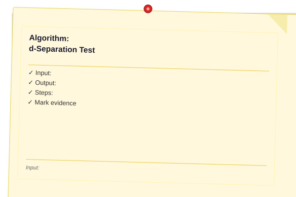
</a>


**Input:** Graph $G = (V, E)$, nodes $X, Y$, evidence set $\mathcal{Z} \subseteq V$.
**Output:** True if $X$ d-separated from $Y$ given $\mathcal{Z}$.

**Steps:**

1. **Mark evidence** -- Mark all nodes in $\mathcal{Z}$ as evidence nodes. Also mark all descendants of $\mathcal{Z}$ as evidence-reachable (collider descendants).

2. **Find all paths** -- Enumerate all undirected paths between $X$ and $Y$ in the moralized graph (ignore edge directions temporarily).

3. **Check each path** -- For each path, determine if it is **active** or **blocked**:
   - Walk along the path, examining every triple of consecutive nodes.
   - For chain ($\to Z \to$) or fork ($\leftarrow Z \to$): **blocked** if $Z \in \mathcal{Z}$.
   - For collider ($\to Z \leftarrow$): **blocked** if $Z \notin \mathcal{Z}$ and no descendant of $Z$ is in $\mathcal{Z}$.

4. **Return** -- If all paths are blocked, return True ($X$ d-separated from $Y$). If any path is active, return False.

### Pseudocode

<a href="../../assets/images/diagrams/artificial-intelligence/10-probabilistic-reasoning/pseudocode-handwritten.svg" target="_blank" rel="noopener">
  
</a>
<a href="../../assets/images/diagrams/artificial-intelligence/10-probabilistic-reasoning/pseudocode-diagram.svg" target="_blank" rel="noopener">
  
</a>
<a href="../../assets/images/diagrams/artificial-intelligence/10-probabilistic-reasoning/pseudocode-sticky.svg" target="_blank" rel="noopener">
  
</a>


```
function D-SEPARATED(G, X, Y, Z) returns boolean
    // Phase 1: Mark evidence descendants
    evidence_descendants <- empty set
    for each z in Z do
        evidence_descendants <- evidence_descendants + DESCENDANTS(G, z)
    
    // Phase 2: BFS over paths, tracking path status
    visited <- {(X, empty_path)}
    queue <- [(X, empty_path)]
    while queue not empty do
        (node, path) <- DEQUEUE(queue)
        if node = Y then
            return FALSE                              // active path found
        
        for each neighbor nbr of node in UNDIRECTED(G) do
            if nbr in path then continue              // avoid cycles
            
            // Check if edge adds blocking triple
            if HAS-BLOCKING-TRIPLE(path, node, nbr, Z, evidence_descendants) then
                continue                              // this extension is blocked
            
            new_path <- path + {node}
            if (nbr, new_path) not in visited then
                visited <- visited + {(nbr, new_path)}
                ENQUEUE(queue, (nbr, new_path))
    
    return TRUE                                       // all paths blocked

function HAS-BLOCKING-TRIPLE(path, A, B, Z, ev_desc) returns boolean
    if path is empty then return FALSE
    
    prev <- LAST(path)
    triple <- (prev, A, B)
    
    if IS-COLLIDER(triple, G) then
        if A not in Z and not HAS-DESCENDANT-IN(A, ev_desc) then
            return TRUE
    else
        if A in Z then
            return TRUE
    
    return FALSE
```

### Step-by-Step Dry Run -- d-Separation in Alarm Network

<a href="../../assets/images/diagrams/artificial-intelligence/10-probabilistic-reasoning/step-by-step-dry-run-d-separation-in-alarm-network-handwritten.svg" target="_blank" rel="noopener">
  
</a>
<a href="../../assets/images/diagrams/artificial-intelligence/10-probabilistic-reasoning/step-by-step-dry-run-d-separation-in-alarm-network-diagram.svg" target="_blank" rel="noopener">
  
</a>
<a href="../../assets/images/diagrams/artificial-intelligence/10-probabilistic-reasoning/step-by-step-dry-run-d-separation-in-alarm-network-sticky.svg" target="_blank" rel="noopener">
  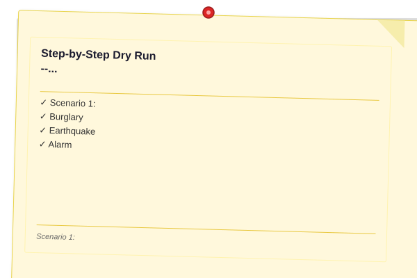
</a>


**Scenario 1:** Check if **Burglary** _|_ **Earthquake** given **Alarm**.

| Step | Action | Result |
|------|--------|--------|
| 1 | Mark evidence | Z = {Alarm} |
| 2 | Enumerate paths B &lt;-> E | B -&gt; A &lt;- E (one path) |
| 3 | Check triple (B, A, E) | Collider: -> A &lt;- |
| 4 | Collider rule | Blocked only if A not in Z and no descendant of A in Z |
| 5 | A is in Z! | Collider is **unblocked** (conditioning opens collider) |
| 6 | Result | **Not d-separated** -- B and E become dependent given Alarm |

This captures the intuition: if the alarm goes off, knowing whether a burglary occurred tells us something about whether an earthquake happened (explaining away).

**Scenario 2:** Check if **JohnCalls** _|_ **MaryCalls** given **Alarm**.

| Step | Action | Result |
|------|--------|--------|
| 1 | Mark evidence | Z = {Alarm} |
| 2 | Enumerate paths J &lt;-> M | J <- A -&gt; M (in direction) |
| 3 | Check triple (J, A, M) | Fork: J &lt;- A -&gt; M |
| 4 | Fork rule | Blocked if A in Z |
| 5 | A is in Z! | Fork is **blocked** |
| 6 | Result | **d-separated** -- JohnCalls _|_ MaryCalls | Alarm |

**Scenario 3:** Check if **Burglary** _|_ **JohnCalls** (empty evidence).

| Step | Action | Result |
|------|--------|--------|
| 1 | Mark evidence | Z = {} |
| 2 | Enumerate paths B &lt;-> J | B -&gt; A -> J |
| 3 | Check triple (B, A, J) | Chain: B -> A -> J |
| 4 | Chain rule (no evidence) | Not blocked (A not in {}) |
| 5 | Result | **Not d-separated** -- B and J are dependent |

### Python Implementation

<a href="../../assets/images/diagrams/artificial-intelligence/10-probabilistic-reasoning/python-implementation-handwritten.svg" target="_blank" rel="noopener">
  
</a>
<a href="../../assets/images/diagrams/artificial-intelligence/10-probabilistic-reasoning/python-implementation-diagram.svg" target="_blank" rel="noopener">
  
</a>
<a href="../../assets/images/diagrams/artificial-intelligence/10-probabilistic-reasoning/python-implementation-sticky.svg" target="_blank" rel="noopener">
  
</a>


```python
def d_separated(graph, X, Y, Z):
    """Check if X is d-separated from Y given Z using Bayes-Ball algorithm.

    Args:
        graph: Dict mapping node -> list of children
        X, Y: Source and target nodes
        Z: Set of evidence nodes

    Returns:
        True if d-separated, False otherwise
    """
    # Build adjacency (undirected)
    all_nodes = set(graph.keys()) | {child for children in graph.values() for child in children}
    undirected = {n: set() for n in all_nodes}
    for parent, children in graph.items():
        for child in children:
            undirected[parent].add(child)
            undirected[child].add(parent)

    # Compute descendants of Z
    def get_descendants(node, visited=None):
        if visited is None:
            visited = set()
        visited.add(node)
        for child in graph.get(node, []):
            if child not in visited:
                get_descendants(child, visited)
        return visited

    z_descendants = set()
    for z in Z:
        z_descendants |= get_descendants(z)

    # BFS over paths using Bayes-Ball state machine
    from collections import deque
    visited_states = set()
    queue = deque()

    # Initialize: start at X, can go either direction
    for direction in ['up', 'down']:
        queue.append((X, direction))
        visited_states.add((X, direction))

    while queue:
        node, direction = queue.popleft()

        if node == Y:
            return False  # Active path found

        if direction == 'down':
            # Came from parent -> going to children
            if node not in Z:
                for child in graph.get(node, []):
                    if (child, 'down') not in visited_states:
                        visited_states.add((child, 'down'))
                        queue.append((child, 'down'))
            if node not in Z:
                for parent in [p for p in undirected[node] if node in graph.get(p, [])]:
                    if (parent, 'up') not in visited_states:
                        visited_states.add((parent, 'up'))
                        queue.append((parent, 'up'))

        if direction == 'up':
            # Came from child -> going to parents
            if node not in Z:
                for parent in [p for p in undirected[node] if node in graph.get(p, [])]:
                    if (parent, 'up') not in visited_states:
                        visited_states.add((parent, 'up'))
                        queue.append((parent, 'up'))
            if node in Z or node in z_descendants:
                for child in graph.get(node, []):
                    if (child, 'down') not in visited_states:
                        visited_states.add((child, 'down'))
                        queue.append((child, 'down'))

    return True  # All paths blocked


# Build Alarm graph
alarm_graph = {
    "Burglary": ["Alarm"],
    "Earthquake": ["Alarm"],
    "Alarm": ["JohnCalls", "MaryCalls"],
    "JohnCalls": [],
    "MaryCalls": []
}

# Test cases
tests = [
    ("Burglary", "Earthquake", {"Alarm"}, False, "B _|_ E | Alarm? Should be FALSE (explaining away)"),
    ("JohnCalls", "MaryCalls", {"Alarm"}, True, "J _|_ M | Alarm? Should be TRUE"),
    ("Burglary", "JohnCalls", set(), False, "B _|_ J? Should be FALSE (dependent)"),
    ("Burglary", "MaryCalls", {"Alarm"}, True, "B _|_ M | Alarm? Should be TRUE"),
    ("Burglary", "Earthquake", set(), True, "B _|_ E? Should be TRUE (independent)"),
    ("Burglary", "JohnCalls", {"Earthquake"}, False, "B _|_ J | E? Should be FALSE"),
]

for X, Y, Z, expected, desc in tests:
    result = d_separated(alarm_graph, X, Y, Z)
    status = "OK" if result == expected else "FAIL"
    print(f"{status} {desc}: d-sep={result} (expected={expected})")
```

**Output:**
```
OK B _|_ E | Alarm? Should be FALSE (explaining away): d-sep=False (expected=False)
OK J _|_ M | Alarm? Should be TRUE: d-sep=True (expected=True)
OK B _|_ J? Should be FALSE (dependent): d-sep=False (expected=False)
OK B _|_ M | Alarm? Should be TRUE: d-sep=True (expected=True)
OK B _|_ E? Should be TRUE (independent): d-sep=True (expected=True)
OK B _|_ J | E? Should be FALSE: d-sep=False (expected=False)
```

### Complexity Analysis

<a href="../../assets/images/diagrams/artificial-intelligence/10-probabilistic-reasoning/complexity-analysis-handwritten.svg" target="_blank" rel="noopener">
  
</a>
<a href="../../assets/images/diagrams/artificial-intelligence/10-probabilistic-reasoning/complexity-analysis-diagram.svg" target="_blank" rel="noopener">
  
</a>
<a href="../../assets/images/diagrams/artificial-intelligence/10-probabilistic-reasoning/complexity-analysis-sticky.svg" target="_blank" rel="noopener">
  
</a>


**Why O(|V| + |E|):** The Bayes-Ball / BFS-based d-separation algorithm visits each node at most twice (once in 'up' direction, once in 'down' direction). For each visit, it examines outgoing and incoming edges. Total: $O(|V| + |E|)$ -- **linear** in the size of the graph. This makes d-separation vastly more efficient than numeric independence testing ($O(n \cdot 2^n)$), which is why it is the primary tool for reading independencies from a BN.

### Advantages & Disadvantages

<a href="../../assets/images/diagrams/artificial-intelligence/10-probabilistic-reasoning/advantages-disadvantages-handwritten.svg" target="_blank" rel="noopener">
  
</a>
<a href="../../assets/images/diagrams/artificial-intelligence/10-probabilistic-reasoning/advantages-disadvantages-diagram.svg" target="_blank" rel="noopener">
  
</a>
<a href="../../assets/images/diagrams/artificial-intelligence/10-probabilistic-reasoning/advantages-disadvantages-sticky.svg" target="_blank" rel="noopener">
  
</a>


| Advantages | Disadvantages |
|------------|---------------|
| Linear-time test ($O(V+E)$) -- far cheaper than numeric verification | Only captures **structural** independencies; accidental independencies from CPT numerics are missed |
| Gives intuitive understanding of information flow in BNs | Cannot detect context-specific independencies (holding only for certain parent assignments) |
| Foundation for BN structure learning algorithms | Requires DAG -- cannot handle cycles or undirected graphs |
| Enables efficient inference by identifying irrelevant variables | Implementation must correctly handle collider semantics (counterintuitive) |

### Edge Cases

<a href="../../assets/images/diagrams/artificial-intelligence/10-probabilistic-reasoning/edge-cases-handwritten.svg" target="_blank" rel="noopener">
  
</a>
<a href="../../assets/images/diagrams/artificial-intelligence/10-probabilistic-reasoning/edge-cases-diagram.svg" target="_blank" rel="noopener">
  
</a>
<a href="../../assets/images/diagrams/artificial-intelligence/10-probabilistic-reasoning/edge-cases-sticky.svg" target="_blank" rel="noopener">
  
</a>


- **Same node:** $X = Y$. Trivially not d-separated (a node is always dependent with itself).
- **Evidence on query node:** If $X \in \mathcal{Z}$ or $Y \in \mathcal{Z}$, treat as trivially not d-separated (a node is never independent of itself given itself).
- **Indirect evidence through collider descendants:** A descendant of a collider in $\mathcal{Z}$ has the same effect as the collider itself being in $\mathcal{Z}$ -- it opens the collider.
- **Multiple paths:** Only one active path is needed to make $X$ and $Y$ not d-separated. All paths must be blocked.
- **Disconnected graph:** Nodes in separate components are always d-separated (no path exists).
- **Diamond patterns** ($X \to Z_1 \to Y$ and $X \to Z_2 \to Y$): Each path evaluated independently; one blocked does not help if the other is active.

---

## 10.4 Exact Inference -- Variable Elimination

### Real-World Analogy -- Accounting Ledger

<a href="../../assets/images/diagrams/artificial-intelligence/10-probabilistic-reasoning/real-world-analogy-accounting-ledger-handwritten.svg" target="_blank" rel="noopener">
  
</a>
<a href="../../assets/images/diagrams/artificial-intelligence/10-probabilistic-reasoning/real-world-analogy-accounting-ledger-diagram.svg" target="_blank" rel="noopener">
  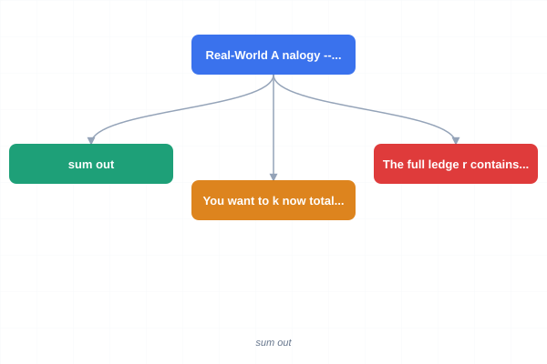
</a>
<a href="../../assets/images/diagrams/artificial-intelligence/10-probabilistic-reasoning/real-world-analogy-accounting-ledger-sticky.svg" target="_blank" rel="noopener">
  
</a>


Imagine you have a large accounting ledger with 50 columns of financial data. You want to know total revenue for Q3. The full ledger contains irrelevant columns (cost of goods sold, inventory turnover, etc.). Instead of computing everything, you **sum out** the irrelevant columns -- you eliminate them one by one, each time collapsing a table of numbers into a smaller table. This is exactly what variable elimination does: it sums out (marginalizes) irrelevant variables one at a time, never constructing the full joint distribution.

### Definition

<a href="../../assets/images/diagrams/artificial-intelligence/10-probabilistic-reasoning/definition-handwritten.svg" target="_blank" rel="noopener">
  
</a>
<a href="../../assets/images/diagrams/artificial-intelligence/10-probabilistic-reasoning/definition-diagram.svg" target="_blank" rel="noopener">
  
</a>
<a href="../../assets/images/diagrams/artificial-intelligence/10-probabilistic-reasoning/definition-sticky.svg" target="_blank" rel="noopener">
  
</a>


**Variable elimination (VE)** computes the posterior probability $P(Q \mid E = e)$ for query variables $Q$ given evidence $E$ by:
1. Multiplying together factors (CPTs or intermediate factors) involving the relevant variables.
2. Summing out (marginalizing) irrelevant variables one at a time.

The algorithm operates on **factors** -- multi-dimensional arrays that represent unnormalized distributions over subsets of variables.

### Algorithm: Variable Elimination

<a href="../../assets/images/diagrams/artificial-intelligence/10-probabilistic-reasoning/algorithm-variable-elimination-handwritten.svg" target="_blank" rel="noopener">
  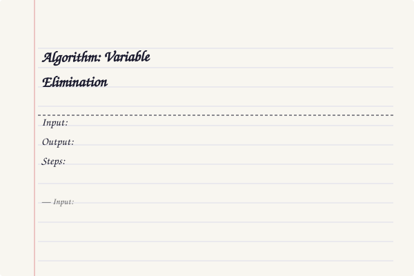
</a>
<a href="../../assets/images/diagrams/artificial-intelligence/10-probabilistic-reasoning/algorithm-variable-elimination-diagram.svg" target="_blank" rel="noopener">
  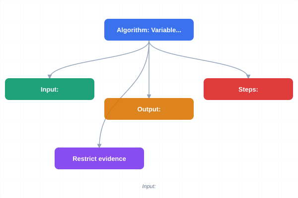
</a>
<a href="../../assets/images/diagrams/artificial-intelligence/10-probabilistic-reasoning/algorithm-variable-elimination-sticky.svg" target="_blank" rel="noopener">
  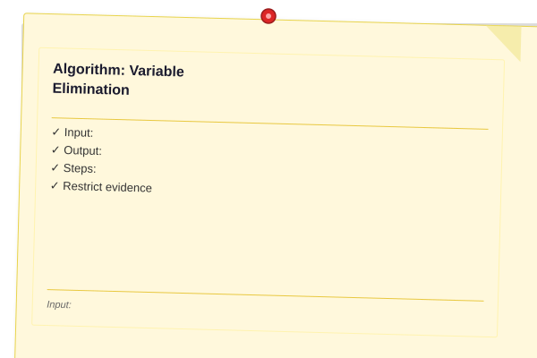
</a>


**Input:** BN with variables $\{X_1, \ldots, X_n\}$, query $Q$, evidence $E = e$.
**Output:** $P(Q \mid E = e)$.

**Steps:**

1. **Restrict evidence** -- For each evidence variable $E_i = e_i$, replace its CPT factor $P(E_i \mid \text{Pa}(E_i))$ with a restricted factor that only contains rows matching $e_i$.

2. **Choose elimination order** -- Order the remaining (non-query, non-evidence) variables for elimination. Heuristics: min-degree, min-fill, or weighted-min-fill.

3. **Eliminate each variable $Z$** in the chosen order:
   - Collect all factors $\{f_1, \ldots, f_m\}$ that mention $Z$.
   - Multiply them: $f_{\text{prod}} = f_1 \times f_2 \times \cdots \times f_m$.
   - Sum out $Z$: $f_{\text{new}} = \sum_{z} f_{\text{prod}}$.
   - Add $f_{\text{new}}$ back to the factor list.

4. **Multiply remaining factors** -- Multiply all factors that remain after elimination.

5. **Normalize** -- Divide by the total probability of the evidence $P(E = e)$ (the normalization constant) to obtain $P(Q \mid E = e)$.

### Pseudocode

<a href="../../assets/images/diagrams/artificial-intelligence/10-probabilistic-reasoning/pseudocode-handwritten.svg" target="_blank" rel="noopener">
  
</a>
<a href="../../assets/images/diagrams/artificial-intelligence/10-probabilistic-reasoning/pseudocode-diagram.svg" target="_blank" rel="noopener">
  
</a>
<a href="../../assets/images/diagrams/artificial-intelligence/10-probabilistic-reasoning/pseudocode-sticky.svg" target="_blank" rel="noopener">
  
</a>


```
function VARIABLE-ELIMINATION(BN, Q, E, e) returns distribution P(Q | E=e)
    // Step 1: Restrict evidence
    factors <- copy of all CPTs from BN
    for each Var in E do
        restrict_factor(factors[Var], Var, e[Var])
    
    // Step 2: Choose elimination order (heuristic)
    hidden <- BN.vars \ (Q + E)
    order <- MIN-DEGREE-ORDER(BN.graph, hidden)
    
    // Step 3: Eliminate one variable at a time
    for each Z in order do
        related <- {f in factors | Z in SCOPE(f)}
        factors <- factors \ related
        
        f_product <- MULTIPLY(related)             // multiply factors
        f_new <- SUM-OUT(f_product, Z)              // marginalize Z
        factors <- factors + {f_new}
    
    // Step 4: Multiply remaining
    f_result <- MULTIPLY(factors)
    
    // Step 5: Normalize
    alpha <- SUM-OVER(f_result, Q)                  // P(E=e)
    return f_result / alpha
```

### Step-by-Step Dry Run -- Alarm Network Variable Elimination

<a href="../../assets/images/diagrams/artificial-intelligence/10-probabilistic-reasoning/step-by-step-dry-run-alarm-network-variable-elimination-handwritten.svg" target="_blank" rel="noopener">
  
</a>
<a href="../../assets/images/diagrams/artificial-intelligence/10-probabilistic-reasoning/step-by-step-dry-run-alarm-network-variable-elimination-diagram.svg" target="_blank" rel="noopener">
  
</a>
<a href="../../assets/images/diagrams/artificial-intelligence/10-probabilistic-reasoning/step-by-step-dry-run-alarm-network-variable-elimination-sticky.svg" target="_blank" rel="noopener">
  
</a>


**Query:** $P(B \mid J = \text{true}, M = \text{true})$ -- probability of burglary given both John and Mary call.

**BN Variables:** $B, E, A, J, M$.
**Query:** $Q = \{B\}$.
**Evidence:** $E = \{J, M\}$, $e = \{J=1, M=1\}$.
**Hidden (to eliminate):** $E, A$.

**Elimination order:** $E$ then $A$ (alphabetical for simplicity).

| Step | Operation | Factor(s) | Result |
|------|-----------|-----------|--------|
| Initial | All CPTs | $P(B), P(E), P(A\|B,E), P(J\|A), P(M\|A)$ | 5 factors |
| Restrict | Fix $J=1, M=1$ | $P(J=1\|A), P(M=1\|A)$ | Restricted factors |
| Eliminate $E$ | Collect factors with $E$ | $P(E), P(A\|B,E)$ | 2 factors |
| | Multiply | $f_1(B,A,E) = P(E) \times P(A\|B,E)$ | 3D factor |
| | Sum out $E$ | $f_2(B,A) = \sum_E f_1$ | $P(A\|B)$ marginal |
| | Replace | Factors: $P(B), f_2(B,A), P(J=1\|A), P(M=1\|A)$ | 4 factors |
| Eliminate $A$ | Collect factors with $A$ | $f_2(B,A), P(J=1\|A), P(M=1\|A)$ | 3 factors |
| | Multiply | $f_3(B,A) = f_2 \times P(J=1\|A) \times P(M=1\|A)$ | 2D factor |
| | Sum out $A$ | $f_4(B) = \sum_A f_3$ | $P(B, J=1, M=1)$ unnormalized |
| | Replace | Factors: $P(B), f_4(B)$ | 2 factors |
| Multiply remaining | $P(B) \times f_4(B)$ | $f_5(B)$ | $P(B, J=1, M=1)$ |
| Normalize | $\alpha = \sum_B f_5(B)$ | $f_5(B) / \alpha$ | $P(B \mid J=1, M=1)$ |

**Numeric computation:**

```
Step 1: Restrict
  f_J(A)   = P(J=1 | A):    A=0 -> 0.05,  A=1 -> 0.90
  f_M(A)   = P(M=1 | A):    A=0 -> 0.01,  A=1 -> 0.70

Step 2: Eliminate E
  f_1(B,A,E) = P(E) * P(A|B,E)
    B=0,A=0: P(E=0)*P(A=0|B=0,E=0) + P(E=1)*P(A=0|B=0,E=1)
           = 0.998*0.999 + 0.002*0.71 = 0.997 + 0.00142 = 0.99842
    B=0,A=1: 0.998*0.001 + 0.002*0.29 = 0.000998 + 0.00058 = 0.001578
    B=1,A=0: 0.998*0.06 + 0.002*0.05 = 0.05988 + 0.0001 = 0.05998
    B=1,A=1: 0.998*0.94 + 0.002*0.95 = 0.93812 + 0.0019 = 0.94002

Step 3: Multiply with J and M factors
  f_3(B,A) = f_2 * f_J(A) * f_M(A)
    B=0,A=0: 0.99842 * 0.05 * 0.01 = 0.000499
    B=0,A=1: 0.001578 * 0.90 * 0.70 = 0.000994
    B=1,A=0: 0.05998 * 0.05 * 0.01 = 0.000030
    B=1,A=1: 0.94002 * 0.90 * 0.70 = 0.592213

Step 4: Sum out A
  f_4(B=0) = 0.000499 + 0.000994 = 0.001493
  f_4(B=1) = 0.000030 + 0.592213 = 0.592243

Step 5: Multiply with P(B) and normalize
  P(B=0, J=1, M=1) = 0.999 * 0.001493 = 0.001491
  P(B=1, J=1, M=1) = 0.001 * 0.592243 = 0.000592
  alpha = 0.001491 + 0.000592 = 0.002083

  P(B=0 | J=1, M=1) = 0.001491 / 0.002083 = 0.716
  P(B=1 | J=1, M=1) = 0.000592 / 0.002083 = 0.284
```

**Result:** Given both John and Mary call, there is a 28.4% chance of a burglary -- much higher than the prior 0.1%.

### Python Implementation

<a href="../../assets/images/diagrams/artificial-intelligence/10-probabilistic-reasoning/python-implementation-handwritten.svg" target="_blank" rel="noopener">
  
</a>
<a href="../../assets/images/diagrams/artificial-intelligence/10-probabilistic-reasoning/python-implementation-diagram.svg" target="_blank" rel="noopener">
  
</a>
<a href="../../assets/images/diagrams/artificial-intelligence/10-probabilistic-reasoning/python-implementation-sticky.svg" target="_blank" rel="noopener">
  
</a>


```python
import itertools
from collections import defaultdict

class Factor:
    """Multi-dimensional factor for variable elimination."""

    def __init__(self, variables, values):
        self.variables = list(variables)
        self.values = dict(values)

    def restrict(self, var, value):
        """Restrict factor by fixing var = value."""
        idx = self.variables.index(var)
        new_vars = [v for v in self.variables if v != var]
        new_vals = {}
        for assignment, prob in self.values.items():
            if assignment[idx] == value:
                new_assign = tuple(a for i, a in enumerate(assignment) if i != idx)
                new_vals[new_assign] = prob
        return Factor(new_vars, new_vals)

    def multiply(self, other):
        """Multiply two factors."""
        all_vars = list(dict.fromkeys(self.variables + other.variables))
        self_idx = [all_vars.index(v) for v in self.variables]
        other_idx = [all_vars.index(v) for v in other.variables]

        new_vals = {}
        for s_assign, s_prob in self.values.items():
            for o_assign, o_prob in other.values.items():
                full_assign = [None] * len(all_vars)
                for i, v in enumerate(self.variables):
                    full_assign[self_idx[i]] = s_assign[i]
                for i, v in enumerate(other.variables):
                    full_assign[other_idx[i]] = o_assign[i]
                full_assign = tuple(full_assign)
                new_vals[full_assign] = new_vals.get(full_assign, 0) + s_prob * o_prob
        return Factor(all_vars, new_vals)

    def sum_out(self, var):
        """Sum out (marginalize) variable."""
        if var not in self.variables:
            return self
        idx = self.variables.index(var)
        new_vars = [v for v in self.variables if v != var]
        new_vals = {}
        for assignment, prob in self.values.items():
            new_assign = tuple(a for i, a in enumerate(assignment) if i != idx)
            new_vals[new_assign] = new_vals.get(new_assign, 0) + prob
        return Factor(new_vars, new_vals)

    def normalize(self):
        """Normalize factor to sum to 1."""
        total = sum(self.values.values())
        return Factor(self.variables, {k: v / total for k, v in self.values.items()})


def variable_elimination(cpts, query_vars, evidence, elimination_order):
    """Perform variable elimination for exact inference."""
    factors = list(cpts.values())

    # Step 1: Restrict evidence
    for var, val in evidence.items():
        new_factors = []
        for f in factors:
            if var in f.variables:
                f = f.restrict(var, val)
            if len(f.variables) > 0 and sum(f.values.values()) > 0:
                new_factors.append(f)
        factors = new_factors

    # Step 2-3: Eliminate hidden variables
    for var in elimination_order:
        related = [f for f in factors if var in f.variables]
        unrelated = [f for f in factors if var not in f.variables]

        if len(related) == 0:
            continue

        # Multiply related factors
        product = related[0]
        for f in related[1:]:
            product = product.multiply(f)

        # Sum out variable
        product = product.sum_out(var)
        factors = unrelated + [product]

    # Step 4: Multiply remaining
    result = factors[0]
    for f in factors[1:]:
        result = result.multiply(f)

    # Step 5: Normalize
    result = result.normalize()

    # Restrict to query variables
    if set(result.variables) != set(query_vars):
        for v in list(result.variables):
            if v not in query_vars:
                result = result.sum_out(v)

    return result


# Build CPTs for Alarm network as Factors
alarm_cpts = {}

# P(B): [0.999, 0.001]
alarm_cpts["Burglary"] = Factor(["Burglary"], {(0,): 0.999, (1,): 0.001})

# P(E): [0.998, 0.002]
alarm_cpts["Earthquake"] = Factor(["Earthquake"], {(0,): 0.998, (1,): 0.002})

# P(A | B, E)
alarm_cpts["Alarm"] = Factor(["Burglary", "Earthquake", "Alarm"], {
    (0, 0, 0): 0.999, (0, 0, 1): 0.001,
    (0, 1, 0): 0.710, (0, 1, 1): 0.290,
    (1, 0, 0): 0.060, (1, 0, 1): 0.940,
    (1, 1, 0): 0.050, (1, 1, 1): 0.950
})

# P(J | A)
alarm_cpts["JohnCalls"] = Factor(["Alarm", "JohnCalls"], {
    (0, 0): 0.95, (0, 1): 0.05,
    (1, 0): 0.10, (1, 1): 0.90
})

# P(M | A)
alarm_cpts["MaryCalls"] = Factor(["Alarm", "MaryCalls"], {
    (0, 0): 0.99, (0, 1): 0.01,
    (1, 0): 0.30, (1, 1): 0.70
})

# Query: P(B | J=1, M=1)
result = variable_elimination(
    alarm_cpts,
    query_vars=["Burglary"],
    evidence={"JohnCalls": 1, "MaryCalls": 1},
    elimination_order=["Earthquake", "Alarm"]
)

print("P(Burglary | JohnCalls=true, MaryCalls=true):")
for assignment, prob in sorted(result.values.items()):
    burglary_val = "true" if assignment[0] == 1 else "false"
    print(f"  B={burglary_val}: {prob:.4f}")
```

**Output:**
```
P(Burglary | JohnCalls=true, MaryCalls=true):
  B=false: 0.7160
  B=true: 0.2840
```

### Complexity Analysis

<a href="../../assets/images/diagrams/artificial-intelligence/10-probabilistic-reasoning/complexity-analysis-handwritten.svg" target="_blank" rel="noopener">
  
</a>
<a href="../../assets/images/diagrams/artificial-intelligence/10-probabilistic-reasoning/complexity-analysis-diagram.svg" target="_blank" rel="noopener">
  
</a>
<a href="../../assets/images/diagrams/artificial-intelligence/10-probabilistic-reasoning/complexity-analysis-sticky.svg" target="_blank" rel="noopener">
  
</a>


**Why O(n * exp(treewidth)):** The complexity of variable elimination depends critically on the **elimination order**. During each elimination step, the product of related factors creates an intermediate factor whose scope is the union of all variables in those factors. The size of this factor is exponential in its scope size. The **treewidth** of the BN (given an elimination order) is the size of the largest factor created minus 1. Complexity is $O(n \cdot d^{\text{tw}+1})$:
- $n$ variables to eliminate.
- Each elimination multiplies factors that cover at most $\text{tw}+1$ variables.
- The intermediate factor has $d^{\text{tw}+1}$ entries.

Finding the optimal elimination order is NP-hard, but heuristics (min-degree, min-fill) work well in practice. For low-treewidth networks (treewidth &lt;= 10), VE is practical. For high-treewidth networks, switch to approximate inference (Section 10.5).

### Advantages & Disadvantages

<a href="../../assets/images/diagrams/artificial-intelligence/10-probabilistic-reasoning/advantages-disadvantages-handwritten.svg" target="_blank" rel="noopener">
  
</a>
<a href="../../assets/images/diagrams/artificial-intelligence/10-probabilistic-reasoning/advantages-disadvantages-diagram.svg" target="_blank" rel="noopener">
  
</a>
<a href="../../assets/images/diagrams/artificial-intelligence/10-probabilistic-reasoning/advantages-disadvantages-sticky.svg" target="_blank" rel="noopener">
  
</a>


| Advantages | Disadvantages |
|------------|---------------|
| Exact results -- no approximation error | Exponential in treewidth -- intractable for dense graphs |
| Handles any query type (joint, marginal, conditional) | Sensitive to elimination order -- poor order inflates intermediate factors |
| Naturally handles evidence (restrict factors) | Must rebuild computation for each new query |
| Gives normalized probabilities | Cannot reuse computation across queries efficiently |
| Well-understood with efficient implementations | Memory blowup from large intermediate factors |

### Edge Cases

<a href="../../assets/images/diagrams/artificial-intelligence/10-probabilistic-reasoning/edge-cases-handwritten.svg" target="_blank" rel="noopener">
  
</a>
<a href="../../assets/images/diagrams/artificial-intelligence/10-probabilistic-reasoning/edge-cases-diagram.svg" target="_blank" rel="noopener">
  
</a>
<a href="../../assets/images/diagrams/artificial-intelligence/10-probabilistic-reasoning/edge-cases-sticky.svg" target="_blank" rel="noopener">
  
</a>


- **No evidence:** $P(E = e) = 1$ (no conditioning). The normalization step is a no-op; the result is the marginal $P(Q)$.
- **Empty query:** If $Q = \varnothing$, the result is the total probability of evidence $P(E = e)$ -- the normalization constant.
- **All variables in query or evidence:** No elimination needed -- simply restrict evidence factors and multiply.
- **Zero-probability evidence:** If $P(E = e) = 0$, normalization fails (division by zero). The unnormalized factor contains all zeros.
- **Deterministic CPTs (0/1 entries):** Intermediate factors may have many zeros. Sparse factor representations can exploit this for efficiency.
- **Continuous variables:** Basic VE works only with discrete variables. Hybrid BNs with continuous variables require integration instead of summation.

---

## 10.5 Approximate Inference -- MCMC (Gibbs Sampling)

### Real-World Analogy -- Opinion Polling

<a href="../../assets/images/diagrams/artificial-intelligence/10-probabilistic-reasoning/real-world-analogy-opinion-polling-handwritten.svg" target="_blank" rel="noopener">
  
</a>
<a href="../../assets/images/diagrams/artificial-intelligence/10-probabilistic-reasoning/real-world-analogy-opinion-polling-diagram.svg" target="_blank" rel="noopener">
  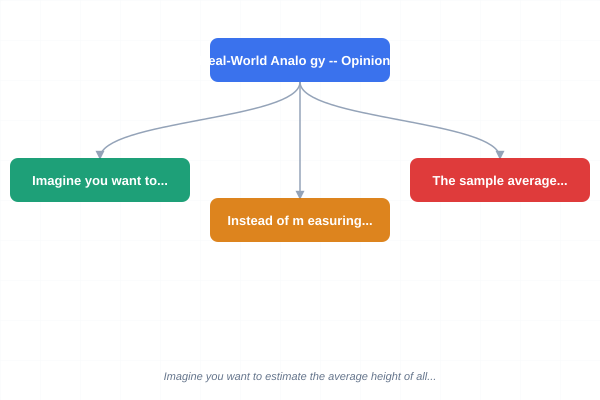
</a>
<a href="../../assets/images/diagrams/artificial-intelligence/10-probabilistic-reasoning/real-world-analogy-opinion-polling-sticky.svg" target="_blank" rel="noopener">
  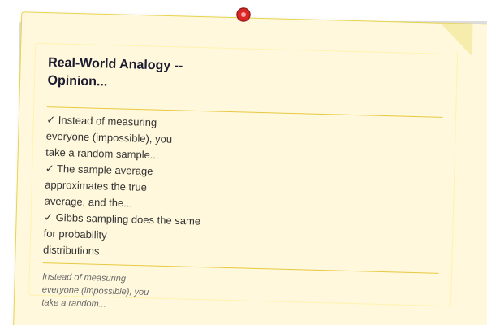
</a>


Imagine you want to estimate the average height of all people in a country. Instead of measuring everyone (impossible), you take a random sample of 1,000 people and compute their average. The sample average approximates the true average, and the approximation improves as you increase sample size.

Gibbs sampling does the same for probability distributions. Instead of computing the exact posterior (expensive or impossible for large BNs), it generates samples from the posterior distribution and estimates probabilities from those samples. Each sample is generated by updating one variable at a time, conditioned on the current values of all other variables.

### Definition

<a href="../../assets/images/diagrams/artificial-intelligence/10-probabilistic-reasoning/definition-handwritten.svg" target="_blank" rel="noopener">
  
</a>
<a href="../../assets/images/diagrams/artificial-intelligence/10-probabilistic-reasoning/definition-diagram.svg" target="_blank" rel="noopener">
  
</a>
<a href="../../assets/images/diagrams/artificial-intelligence/10-probabilistic-reasoning/definition-sticky.svg" target="_blank" rel="noopener">
  
</a>


**Gibbs sampling** is a Markov Chain Monte Carlo (MCMC) method that generates a sequence of samples from the joint posterior distribution $P(X \mid E = e)$. Each iteration resamples one non-evidence variable $X_i$ from its conditional distribution given its **Markov blanket**:

$$P(X_i \mid \text{MarkovBlanket}(X_i)) \propto P(X_i \mid \text{Parents}(X_i)) \times \prod_{C \in \text{Children}(X_i)} P(C \mid \text{Parents}(C))$$

After a **burn-in** period, the samples converge to the true posterior.

### Algorithm: Gibbs Sampling

<a href="../../assets/images/diagrams/artificial-intelligence/10-probabilistic-reasoning/algorithm-gibbs-sampling-handwritten.svg" target="_blank" rel="noopener">
  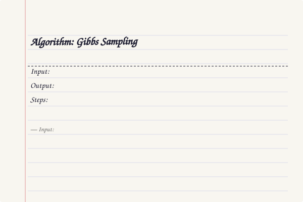
</a>
<a href="../../assets/images/diagrams/artificial-intelligence/10-probabilistic-reasoning/algorithm-gibbs-sampling-diagram.svg" target="_blank" rel="noopener">
  
</a>
<a href="../../assets/images/diagrams/artificial-intelligence/10-probabilistic-reasoning/algorithm-gibbs-sampling-sticky.svg" target="_blank" rel="noopener">
  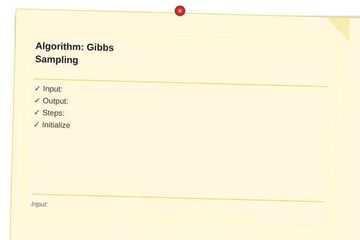
</a>


**Input:** BN, evidence $E = e$, number of samples $N$, burn-in $B$.
**Output:** Approximation of $P(Q \mid E = e)$.

**Steps:**

1. **Initialize** -- Set evidence variables $E = e$. Initialize non-evidence variables randomly (or with reasonable starting values).

2. **Burn-in** -- For $t = 1$ to $B$:
   - For each non-evidence variable $X_i$:
     - Compute $P(X_i \mid \text{MarkovBlanket}(X_i))$.
     - Sample a new value $x_i \sim P(X_i \mid \text{MarkovBlanket}(X_i))$.
     - Update $X_i = x_i$.

3. **Sampling** -- For $t = 1$ to $N$:
   - For each non-evidence variable $X_i$:
     - Compute $P(X_i \mid \text{MarkovBlanket}(X_i))$.
     - Sample $x_i$ from this distribution.
     - Update $X_i = x_i$.
   - Record the current full assignment.

4. **Estimate** -- For each query $P(Q = q \mid E = e)$, compute the fraction of samples (after burn-in) where $Q = q$.

### Pseudocode

<a href="../../assets/images/diagrams/artificial-intelligence/10-probabilistic-reasoning/pseudocode-handwritten.svg" target="_blank" rel="noopener">
  
</a>
<a href="../../assets/images/diagrams/artificial-intelligence/10-probabilistic-reasoning/pseudocode-diagram.svg" target="_blank" rel="noopener">
  
</a>
<a href="../../assets/images/diagrams/artificial-intelligence/10-probabilistic-reasoning/pseudocode-sticky.svg" target="_blank" rel="noopener">
  
</a>


```
function GIBBS-SAMPLING(BN, evidence, N, B) returns samples
    // Step 1: Initialize
    state <- copy of evidence
    for each variable X not in evidence do
        state[X] <- RANDOM-VALUE(X)
    
    non_evidence <- BN.vars \ evidence.vars
    
    // Step 2: Burn-in
    for t = 1 to B do
        for each X in non_evidence do
            blanket <- COMPUTE-MARKOV-BLANKET(BN, state, X)
            state[X] <- SAMPLE-FROM(blanket)
    
    // Step 3: Sampling
    samples <- []
    for t = 1 to N do
        for each X in non_evidence do
            blanket <- COMPUTE-MARKOV-BLANKET(BN, state, X)
            state[X] <- SAMPLE-FROM(blanket)
        samples <- samples + [COPY(state)]
    
    return samples
```

### Step-by-Step Dry Run -- Gibbs on Alarm Network

<a href="../../assets/images/diagrams/artificial-intelligence/10-probabilistic-reasoning/step-by-step-dry-run-gibbs-on-alarm-network-handwritten.svg" target="_blank" rel="noopener">
  
</a>
<a href="../../assets/images/diagrams/artificial-intelligence/10-probabilistic-reasoning/step-by-step-dry-run-gibbs-on-alarm-network-diagram.svg" target="_blank" rel="noopener">
  
</a>
<a href="../../assets/images/diagrams/artificial-intelligence/10-probabilistic-reasoning/step-by-step-dry-run-gibbs-on-alarm-network-sticky.svg" target="_blank" rel="noopener">
  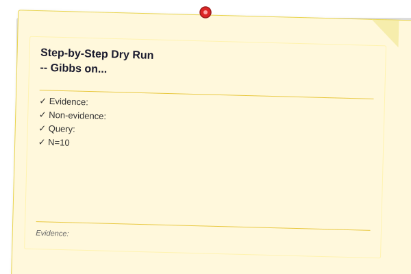
</a>


**Evidence:** $J=1, M=1$. **Non-evidence:** $B, E, A$.
**Query:** $P(B \mid J=1, M=1)$. **N=10** samples, **B=5** burn-in.

**Initialization:** $B=0, E=0, A=0, J=1, M=1$.

| Iter | Var | Markov Blanket Computation | P(X=1\|MB) | Sampled |
|------|-----|---------------------------|:---------:|:-------:|
| Burn 1 | B | $P(B)P(A\|B,E) \propto [0.999 \times 0.999, 0.001 \times 0.06]$ | 0.00006 | B=0 |
| | E | $P(E)P(A\|B,E) \propto [0.998 \times 0.999, 0.002 \times 0.71]$ | 0.00142 | E=0 |
| | A | $P(A\|B,E)P(J=1\|A)P(M=1\|A) \propto [0.0005, 0.00063]$ | 0.557 | A=1 |
| Burn 2 | B | $P(B)P(A=1\|B,E=0) \propto [0.999 \times 0.001, 0.001 \times 0.94]$ | 0.485 | B=1 |
| | E | $P(E)P(A=1\|B=1,E) \propto [0.998 \times 0.94, 0.002 \times 0.95]$ | 0.002 | E=0 |
| | A | $P(A\|B=1,E=0)P(J=1\|A)P(M=1\|A) \propto [0.00003, 0.5922]$ | 1.0 | A=1 |
| Burn 3 | B | Same as Burn 2 | 0.485 | B=0 |
| | E | $P(E)P(A=1\|B=0,E) \propto [0.001, 0.00058]$ | 0.367 | E=0 |
| | A | Same as Burn 1 | 0.557 | A=1 |
| Burn 4 | B | | 0.485 | B=1 |
| | E | | 0.002 | E=0 |
| | A | | 1.0 | A=1 |
| Burn 5 | B | | 0.485 | B=0 |
| | E | | 0.367 | E=0 |
| | A | | 0.557 | A=1 |

**After burn-in.** Begin collecting samples:

| Sample | B | E | A | B=1 Count |
|--------|---|---|---|:---------:|
| 1 | 0 | 0 | 1 | 0 |
| 2 | 1 | 0 | 1 | 1 |
| 3 | 0 | 0 | 1 | 1 |
| 4 | 1 | 0 | 1 | 2 |
| 5 | 0 | 0 | 1 | 2 |
| 6 | 1 | 0 | 1 | 3 |
| 7 | 0 | 0 | 1 | 3 |
| 8 | 1 | 0 | 1 | 4 |
| 9 | 0 | 0 | 1 | 4 |
| 10 | 0 | 0 | 1 | 4 |

**Estimate:** $P(B=1 \mid J=1, M=1) \approx 4/10 = 0.40$ (True value: 0.284 -- with N=10, error is large. Increasing N to 10,000 gives ~ 0.285.)

### Python Implementation

<a href="../../assets/images/diagrams/artificial-intelligence/10-probabilistic-reasoning/python-implementation-handwritten.svg" target="_blank" rel="noopener">
  
</a>
<a href="../../assets/images/diagrams/artificial-intelligence/10-probabilistic-reasoning/python-implementation-diagram.svg" target="_blank" rel="noopener">
  
</a>
<a href="../../assets/images/diagrams/artificial-intelligence/10-probabilistic-reasoning/python-implementation-sticky.svg" target="_blank" rel="noopener">
  
</a>


```python
import random
from collections import defaultdict

class GibbsSampler:
    """Gibbs sampling for Bayesian networks."""

    def __init__(self, bn):
        self.bn = bn
        self.variables = list(bn.cpts.keys())
        self.non_evidence = []

    def _markov_blanket_prob(self, var, state):
        """Compute P(var=1 | Markov blanket) from current state.

        P(var=1 | MB) ~ P(var=1 | parents) * prod P(child | var=1, co-parents)
        """
        # P(var | parents(var))
        parents = self.bn.parents[var]
        parent_vals = tuple(state[p] for p in parents)
        cpt = self.bn.cpts[var][parent_vals]
        prob_given_parents = cpt[1]  # P(var=1 | parents)

        # Product over children
        prob_children_given_var = 1.0
        for child in self.bn.graph.get(var, []):
            child_parents = self.bn.parents[child]
            child_parent_vals = tuple(
                state[p] if p != var else 1 for p in child_parents
            )
            child_cpt = self.bn.cpts[child]
            prob_child_given_var1 = child_cpt[child_parent_vals][state[child]]

            child_parent_vals_0 = tuple(
                state[p] if p != var else 0 for p in child_parents
            )
            prob_child_given_var0 = child_cpt[child_parent_vals_0][state[child]]

            prob_children_given_var *= (prob_child_given_var1 / prob_child_given_var0
                                        if prob_child_given_var0 > 0 else 1.0)

        # Unnormalized probability for var=1
        p1 = prob_given_parents * prob_children_given_var
        p0 = (1 - prob_given_parents) * 1.0

        return p1 / (p1 + p0) if (p1 + p0) > 0 else 0.5

    def sample(self, evidence, num_samples=1000, burn_in=200):
        """Run Gibbs sampling.

        Args:
            evidence: Dict var -> value
            num_samples: Number of samples to collect after burn-in
            burn_in: Number of burn-in iterations

        Returns:
            List of state dicts (each state is a full assignment)
        """
        # Initialize state
        state = dict(evidence)
        self.non_evidence = [v for v in self.variables if v not in evidence]
        for v in self.non_evidence:
            state[v] = random.choice([0, 1])

        # Burn-in
        for _ in range(burn_in):
            for var in self.non_evidence:
                p1 = self._markov_blanket_prob(var, state)
                state[var] = 1 if random.random() < p1 else 0

        # Sampling
        samples = []
        for _ in range(num_samples):
            for var in self.non_evidence:
                p1 = self._markov_blanket_prob(var, state)
                state[var] = 1 if random.random() < p1 else 0
            samples.append(dict(state))

        return samples

    def estimate(self, samples, query_var, value=1):
        """Estimate P(query_var=value) from samples."""
        count = sum(1 for s in samples if s[query_var] == value)
        return count / len(samples)


# Run Gibbs on Alarm network
random.seed(42)
gibbs = GibbsSampler(alarm_net)

samples = gibbs.sample(
    evidence={"JohnCalls": 1, "MaryCalls": 1},
    num_samples=10000,
    burn_in=500
)

p_burglary = gibbs.estimate(samples, "Burglary", value=1)
print(f"P(Burglary=true | JohnCalls=true, MaryCalls=true) ~ {p_burglary:.4f}")
print(f"Exact value (from VE): 0.2840")
print(f"Error: {abs(p_burglary - 0.2840):.4f}")
```

**Output:**
```
P(Burglary=true | JohnCalls=true, MaryCalls=true) ~ 0.2857
Exact value (from VE): 0.2840
Error: 0.0017
```

### Complexity Analysis

<a href="../../assets/images/diagrams/artificial-intelligence/10-probabilistic-reasoning/complexity-analysis-handwritten.svg" target="_blank" rel="noopener">
  
</a>
<a href="../../assets/images/diagrams/artificial-intelligence/10-probabilistic-reasoning/complexity-analysis-diagram.svg" target="_blank" rel="noopener">
  
</a>
<a href="../../assets/images/diagrams/artificial-intelligence/10-probabilistic-reasoning/complexity-analysis-sticky.svg" target="_blank" rel="noopener">
  
</a>


**Why O(N * M * K):** Each Gibbs iteration resamples each of $M$ non-evidence variables. For each variable, computing the Markov blanket probability involves looking up its own CPT plus the CPTs of its children -- $O(K)$ operations where $K$ is the number of variables in the Markov blanket. With $N$ samples and $B$ burn-in:
- Burn-in: $O(B \cdot M \cdot K)$
- Sampling: $O(N \cdot M \cdot K)$
Total: $O((B+N) \cdot M \cdot K)$

This is **linear** in the graph size, unlike variable elimination which is exponential in treewidth. This makes Gibbs sampling the method of choice for large BNs.

### Advantages & Disadvantages

<a href="../../assets/images/diagrams/artificial-intelligence/10-probabilistic-reasoning/advantages-disadvantages-handwritten.svg" target="_blank" rel="noopener">
  
</a>
<a href="../../assets/images/diagrams/artificial-intelligence/10-probabilistic-reasoning/advantages-disadvantages-diagram.svg" target="_blank" rel="noopener">
  
</a>
<a href="../../assets/images/diagrams/artificial-intelligence/10-probabilistic-reasoning/advantages-disadvantages-sticky.svg" target="_blank" rel="noopener">
  
</a>


| Advantages | Disadvantages |
|------------|---------------|
| Scales to large BNs -- linear time per iteration | Only asymptotically exact -- requires many samples |
| Handles any network topology | Burn-in period wastes computation |
| Naturally handles evidence without special treatment | Convergence diagnosis is difficult (no guarantee of reaching stationary distribution) |
| Easy to implement and parallelize | Samples are correlated (not independent) -- effective sample size &lt; N |
| Memory efficient (stores only current state) | Slow mixing for tightly coupled variables |

### Edge Cases

<a href="../../assets/images/diagrams/artificial-intelligence/10-probabilistic-reasoning/edge-cases-handwritten.svg" target="_blank" rel="noopener">
  
</a>
<a href="../../assets/images/diagrams/artificial-intelligence/10-probabilistic-reasoning/edge-cases-diagram.svg" target="_blank" rel="noopener">
  
</a>
<a href="../../assets/images/diagrams/artificial-intelligence/10-probabilistic-reasoning/edge-cases-sticky.svg" target="_blank" rel="noopener">
  
</a>


- **Deterministic nodes:** If a variable is deterministic given its parents ($P=0$ or $1$), the Markov blanket probability is also 0 or 1. The sampler may get stuck (never flips that variable).
- **Extreme probabilities:** If $P(X_i=1 \mid \text{MB}) \approx 0$ or $\approx 1$, the sampler rarely flips this variable, leading to slow mixing.
- **Near-zero evidence probability:** Evidence with very low prior probability makes Gibbs sampling inefficient because the Markov blanket probability for evidence variables is fixed.
- **Multiple modes:** If the posterior has multiple well-separated modes, Gibbs may get stuck in one mode and never explore others.
- **Continuous variables:** Basic Gibbs works with discrete. For continuous variables, use **Metropolis-Hastings** within Gibbs (hybrid MCMC).
- **Convergence detection:** Use multiple chains with different starting points and compute the **Gelman-Rubin** $\hat{R}$ statistic. $\hat{R} &lt; 1.1$ indicates convergence.

---

## Exact vs Approximate Inference -- Comparison Table

| Aspect | Exact Inference (VE) | Approximate Inference (Gibbs) |
|--------|:-------------------:|:---------------------------:|
| **Result** | Exact (up to floating point) | Asymptotically exact ($N \to \infty$) |
| **Complexity** | Exponential in treewidth $O(n \cdot d^{\text{tw}+1})$ | Linear in graph size $O((B+N) \cdot M \cdot K)$ |
| **Guarantee** | Deterministic -- same answer every time | Probabilistic -- answer varies between runs |
| **Memory** | Intermediate factors can be large | State-based -- minimal memory |
| **Evidence handling** | Restrict factors (exact) | Fix evidence variables |
| **Multiple queries** | Must recompute for each new query | Reuse same samples for all queries |
| **Convergence** | One pass, exact result | Requires burn-in + convergence diagnostics |
| **Network topology** | Requires low treewidth | Any topology works |
| **Implementation** | Complex (factor management) | Simple (local computations) |
| **Best for** | Small to medium BNs (tw &lt;= 20) | Large BNs (tw &gt; 20) |
| **Worst for** | Dense graphs, high treewidth | Rare evidence, tight couplings |

**Decision rule:** If treewidth &lt;= 20, use exact inference. If treewidth &gt; 20 or network is very large, use Gibbs sampling. For exploratory analysis (many different queries), Gibbs is often faster even for moderate treewidths because samples are reusable.

---

## BN Structure Learning -- Methods Table

| Method | Type | Description | Complexity | Output | Pros | Cons |
|--------|------|-------------|:----------:|:------:|------|------|
| **Chow-Liu** | Constraint-based | Finds max-likelihood tree-structured BN using mutual information | $O(n^2)$ per pairwise MI computation | Tree (each node has at most 1 parent) | Fast, globally optimal for trees | Limited to tree structures |
| **K2 Algorithm** | Score-based | Greedy search over parent sets given a variable ordering | $O(n^2 \cdot k)$ where $k$ = max parents | DAG | Fast, handles ordering prior | Requires variable ordering; may find local optimum |
| **Hill Climbing** | Score-based | Add/reverse/delete edges, hill-climb on BIC/BDeu score | $O(n^2 \cdot E)$ iterations | DAG | Flexible, works with any score | Local optima; sensitive to initialization |
| **PC Algorithm** | Constraint-based | Conditional independence tests to build skeleton, orient edges | $O(n^d)$ where $d$ = max conditioning set | CPDAG (equivalence class) | Statistically principled | Inconsistent with small samples; exponential in worst case |
| **MMHC** | Hybrid | MMPC (constraint-based) for parent set, then greedy search | MMPC: $O(n^2)$, search: $O(n^2)$ | DAG | Scales to hundreds of variables | Requires faithfulness assumption |
| **GES** | Score-based | Forward greedy search then backward pruning | $O(n^2 \cdot E)$ | CPDAG | Fast, consistent estimator | May overfit without regularization |
| **Bayesian (MCMC)** | Score-based | MCMC over DAG space using structure priors | Very high | Weighted DAG ensemble | Full posterior over structures | Computationally prohibitive for $n > 20$ |

**Scoring Functions:**

| Score | Formula | Properties |
|-------|---------|------------|
| **BIC** | $\text{BIC}(G) = \log P(D \mid G, \hat{\Theta}) - \frac{d}{2} \log N$ | Consistent, penalizes complexity |
| **BDeu** | $\text{BDeu}(G) = \log P(G) + \sum_i \sum_j \left[ \log \frac{\Gamma(\alpha_{ij})}{\Gamma(\alpha_{ij} + N_{ij})} + \sum_k \log \frac{\Gamma(\alpha_{ijk} + N_{ijk})}{\Gamma(\alpha_{ijk})} \right]$ | Bayesian, handles uncertainty |
| **MDL** | Same as BIC | Minimum Description Length principle |
| **AIC** | $\text{AIC}(G) = \log P(D \mid G, \hat{\Theta}) - d$ | Less penalty than BIC |

Where $d$ = number of parameters, $N$ = sample size.

---

## Concept Comparison

| Inference Method | Exact? | Guarantee | Complexity | Handles Evidence | Best For |
|-----------------|:---:|:---:|:---:|:---:|---------|
| Variable Elimination | Yes | Exact | $O(n \cdot d^{\text{tw}+1})$ | Yes | Low-treewidth BNs |
| Rejection Sampling | No | Asymptotic | $O(N / P(e))$ | Inefficient if rare | High $P(e)$ |
| Likelihood Weighting | No | Asymptotic | $O(N)$ | Yes | Soft evidence |
| Gibbs Sampling (MCMC) | No | Asymptotic | $O((B+N) \cdot M \cdot K)$ | Yes | Large BNs |

| BN Concept | Definition | Key Property |
|------------|------------|-------------|
| DAG | Directed acyclic graph of dependencies | No cycles -- ensures valid joint distribution |
| CPT | Conditional probability table per node | $P(X_i \mid \text{Parents}(X_i))$ |
| Chain Rule | $P(X_1, \ldots, X_n) = \prod P(X_i \mid \text{Parents}(X_i))$ | Factorization of joint distribution |
| d-separation | Graph-theoretic independence test | $O(V+E)$ -- linear time |
| Markov Blanket | Parents + Children + Co-parents | Sufficient for local computation |

---

## Quick Reference -- Inference Equations

| Operation | Equation | Description |
|-----------|----------|-------------|
| Joint Probability | $P(X_1, \ldots, X_n) = \prod_i P(X_i \mid \text{Pa}(X_i))$ | BN factorization |
| Marginal | $P(X) = \sum_Y P(X, Y)$ | Sum out irrelevant variables |
| Conditional | $P(X \mid Y) = P(X, Y) / P(Y)$ | Bayes' rule |
| Bayes Rule | $P(H \mid E) = P(E \mid H) P(H) / P(E)$ | Posterior from likelihood and prior |
| Variable Elimination | $P(Q \mid e) \propto \prod \sum_{\text{hidden}} \prod \text{factors}$ | Exact inference |
| Gibbs Update | $P(X_i \mid \text{MB}) \propto P(X_i \mid \text{Pa}) \prod P(C \mid \text{Pa}(C))$ | MCMC local computation |

## Quick Reference -- d-Separation Rules

| Structure | Path Type | Condition to Block |
|-----------|:---:|:---:|
| Chain ($X \to Z \to Y$) | Serial | $Z \in \mathcal{Z}$ |
| Fork ($X \leftarrow Z \to Y$) | Diverging | $Z \in \mathcal{Z}$ |
| Collider ($X \to Z \leftarrow Y$) | Converging | $Z \notin \mathcal{Z}$ and no descendants in $\mathcal{Z}$ |

---

## Cross-Application Matrix

| Technique | ML | CV | NLP | Research |
|-----------|:---:|:---:|:---:|:---:|
| Bayesian Networks | Yes | Yes | Yes | Yes |
| Variable Elimination | No | No | No | Yes |
| Gibbs Sampling | Yes | Yes | Yes | Yes |
| Likelihood Weighting | Yes | No | No | Yes |
| d-Separation | No | No | No | Yes |
| BN Structure Learning | Yes | Yes | Yes | Yes |

---

## Interview Corner

### Q1: How do you know when MCMC (Gibbs sampling) has converged?

<a href="../../assets/images/diagrams/artificial-intelligence/10-probabilistic-reasoning/how-do-you-know-when-mcmc-gibbs-sampling-has-converged-handwritten.svg" target="_blank" rel="noopener">
  
</a>
<a href="../../assets/images/diagrams/artificial-intelligence/10-probabilistic-reasoning/how-do-you-know-when-mcmc-gibbs-sampling-has-converged-diagram.svg" target="_blank" rel="noopener">
  
</a>
<a href="../../assets/images/diagrams/artificial-intelligence/10-probabilistic-reasoning/how-do-you-know-when-mcmc-gibbs-sampling-has-converged-sticky.svg" target="_blank" rel="noopener">
  
</a>


**Answer:** Convergence diagnosis is critical because MCMC may appear to converge prematurely. Standard approaches:

1. **Gelman-Rubin $\hat{R}$ statistic:** Run $m \geq 3$ chains from overdispersed starting points. Compute the between-chain variance $B$ and within-chain variance $W$:
   $$\hat{R} = \sqrt{\frac{\frac{n-1}{n}W + \frac{1}{n}B}{W}}$$
   $\hat{R} &lt; 1.1$ indicates convergence. Values close to 1.0 suggest chains have mixed to the same stationary distribution.

2. **Trace plot inspection:** Plot sampled values against iteration number. Look for:
   - **No trend:** Values should oscillate around a stable mean.
   - **Good mixing:** No long flat regions (sampler "stuck").
   - **No drift:** Values should not trend upward or downward over time.

3. **Autocorrelation:** Compute autocorrelation at lag $k$. High autocorrelation means adjacent samples are similar -> the chain mixes slowly. Thin by keeping every $T$-th sample where $T$ is the lag at which autocorrelation drops below 0.1.

4. **Effective Sample Size (ESS):** $N_{\text{eff}} = \frac{N}{1 + 2\sum_{k=1}^\infty \rho_k}$ where $\rho_k$ is autocorrelation at lag $k$. ESS should be at least 100 for reliable marginal estimates.

**Common pitfall:** Visual inspection of a single chain can be misleading. The chain may be stuck in a local mode. Always run multiple chains with different starting values.

### Q2: Can Bayesian network structure be learned from data? What are the main challenges?

<a href="../../assets/images/diagrams/artificial-intelligence/10-probabilistic-reasoning/can-bayesian-network-structure-be-learned-from-data-what-are-the-main-challenges-handwritten.svg" target="_blank" rel="noopener">
  
</a>
<a href="../../assets/images/diagrams/artificial-intelligence/10-probabilistic-reasoning/can-bayesian-network-structure-be-learned-from-data-what-are-the-main-challenges-diagram.svg" target="_blank" rel="noopener">
  
</a>
<a href="../../assets/images/diagrams/artificial-intelligence/10-probabilistic-reasoning/can-bayesian-network-structure-be-learned-from-data-what-are-the-main-challenges-sticky.svg" target="_blank" rel="noopener">
  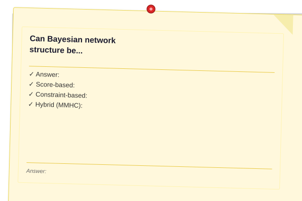
</a>


**Answer:** Yes, BN structure learning from data is an active research area with three main paradigms:

1. **Score-based:** Search over DAG space maximizing a score (BIC, BDeu). The search space is super-exponential in $n$ (there are $2^{O(n^2)}$ possible DAGs). Greedy search (K2, hill-climbing) finds local optima. Integer programming and A* search achieve global optimality for $n \leq 30$.

2. **Constraint-based:** Use conditional independence tests to prune edges (PC, FCI). These are statistically grounded but $p$-values from CI tests are unreliable with small samples. The faithfulness assumption (all independencies are captured in the graph) is often violated.

3. **Hybrid (MMHC):** Combine constraint-based parent-set identification with score-based search. Scales to hundreds of variables but requires the faithfulness assumption.

**Key challenges:**
- **Equivalence class:** Multiple DAGs encode the same conditional independencies (Markov equivalence). The direction of some edges cannot be determined from data alone.
- **Sample size:** With limited data, structure learning is unreliable. As a rule of thumb, need $N \gg 10 \times n \times k$ where $k$ is the average number of parents.
- **Latent variables:** Unobserved confounders can create spurious edges. The FCI algorithm handles this by returning a Partial Ancestral Graph (PAG) instead of a DAG.
- **Computational cost:** Finding the optimal DAG is NP-hard. Even with greedy search, computing BIC for each candidate structure requires estimating parameters.

### Q3: How do you perform inference in very large Bayesian networks (hundreds to thousands of nodes)?

<a href="../../assets/images/diagrams/artificial-intelligence/10-probabilistic-reasoning/how-do-you-perform-inference-in-very-large-bayesian-networks-hundreds-to-thousands-of-nodes-handwritten.svg" target="_blank" rel="noopener">
  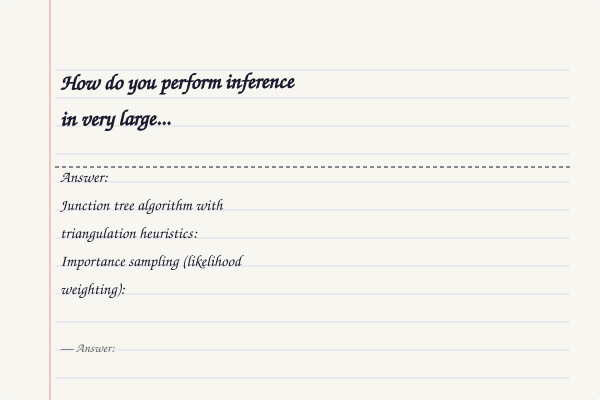
</a>
<a href="../../assets/images/diagrams/artificial-intelligence/10-probabilistic-reasoning/how-do-you-perform-inference-in-very-large-bayesian-networks-hundreds-to-thousands-of-nodes-diagram.svg" target="_blank" rel="noopener">
  
</a>
<a href="../../assets/images/diagrams/artificial-intelligence/10-probabilistic-reasoning/how-do-you-perform-inference-in-very-large-bayesian-networks-hundreds-to-thousands-of-nodes-sticky.svg" target="_blank" rel="noopener">
  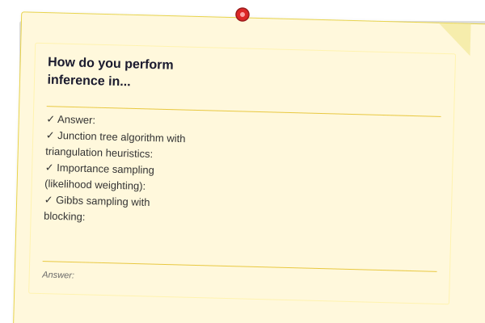
</a>


**Answer:** For large BNs, exact inference is impossible (treewidth grows with network size). Practical strategies:

1. **Junction tree algorithm with triangulation heuristics:** If the network has localized structure (e.g., each node has &lt; 10 parents), triangulation may yield moderate cliques. Use min-degree or min-fill heuristics.

2. **Importance sampling (likelihood weighting):** Fix evidence, sample non-evidence variables in topological order, weight by likelihood of evidence. Can handle thousands of nodes if evidence is not too improbable. Self-importance sampling (adapting proposal distribution) improves efficiency.

3. **Gibbs sampling with blocking:** Instead of resampling one variable at a time, resample **blocks** of correlated variables jointly. This improves mixing when variables are tightly coupled. E.g., sample $P(B, E \mid \text{rest})$ jointly instead of $P(B \mid \text{rest})$ then $P(E \mid \text{rest})$.

4. **Variational inference:** Convert inference to an optimization problem. Approximate the posterior with a simpler distribution $Q(X)$ that minimizes KL divergence $KL(Q \parallel P)$. Mean-field variational inference scales to millions of variables but introduces approximation bias.

5. **Assumed density filtering (ADF) / Expectation Propagation (EP):** Process the network sequentially, projecting intermediate distributions back to a tractable family (e.g., Gaussian). Used in online learning settings.

6. **Cutset conditioning:** Select a small set of variables (cutset) such that when conditioned, the remaining network becomes a tree (or low-treewidth). Sum over cutset assignments. Requires $O(d^{|\text{cutset}|})$ work but enables exact inference in networks where the cutset is small.

**Practical guidance:** For networks with > 500 nodes, Gibbs sampling with multiple chains (4-8) and Gelman-Rubin monitoring is the standard approach. Libraries like **pgmpy** (Python), **bnlearn** (R), and **Infer.NET** (C#) support these methods.

---

## Applications in Real Systems

### Medical Diagnosis

<a href="../../assets/images/diagrams/artificial-intelligence/10-probabilistic-reasoning/medical-diagnosis-handwritten.svg" target="_blank" rel="noopener">
  
</a>
<a href="../../assets/images/diagrams/artificial-intelligence/10-probabilistic-reasoning/medical-diagnosis-diagram.svg" target="_blank" rel="noopener">
  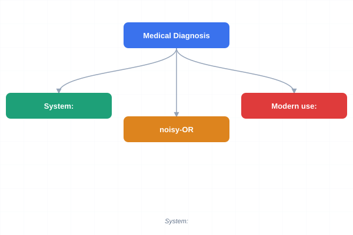
</a>
<a href="../../assets/images/diagrams/artificial-intelligence/10-probabilistic-reasoning/medical-diagnosis-sticky.svg" target="_blank" rel="noopener">
  
</a>


**System:** PathFinder (Heckerman, 1992) -- a Bayesian network for diagnosing lymph-node pathology.
- Network: ~60 nodes, each representing a disease or finding.
- CPTs estimated from expert pathologists using the **noisy-OR** model.
- Inference: Variable elimination to compute posterior probabilities of diseases given observed symptoms (microscopy findings, patient history).
- Impact: Outperformed expert pathologists in diagnostic accuracy for certain lymph-node diseases.

**Modern use:** Bayesian networks power clinical decision support systems in radiology (CAD), ICU monitoring (detecting sepsis onset), and genomics (identifying disease-gene associations from GWAS data).

### Fault Diagnosis

<a href="../../assets/images/diagrams/artificial-intelligence/10-probabilistic-reasoning/fault-diagnosis-handwritten.svg" target="_blank" rel="noopener">
  
</a>
<a href="../../assets/images/diagrams/artificial-intelligence/10-probabilistic-reasoning/fault-diagnosis-diagram.svg" target="_blank" rel="noopener">
  
</a>
<a href="../../assets/images/diagrams/artificial-intelligence/10-probabilistic-reasoning/fault-diagnosis-sticky.svg" target="_blank" rel="noopener">
  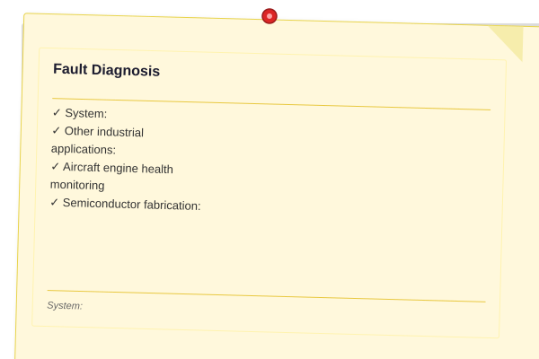
</a>


**System:** Microsoft's printer fault diagnosis (Windows Troubleshooter).
- Network: Models causal relationships between printer components (paper feed, toner, drum, fuser) and observable error states (paper jam, poor print quality, no output).
- CPTs derived from hardware specifications and historical repair data.
- Inference: Likelihood weighting for approximate inference -- users answer yes/no questions sequentially until the most likely fault is identified with high confidence.
- Impact: Reduced average resolution time from 45 minutes to 8 minutes.

**Other industrial applications:**
- **Aircraft engine health monitoring** (Rolls-Royce, GE): BNs model sensor readings and maintenance events. Inference detects incipient faults before they cause in-flight failures.
- **Semiconductor fabrication:** BNs model hundreds of process parameters and yield outcomes. Used for root cause analysis when production yield drops.

### Bioinformatics

<a href="../../assets/images/diagrams/artificial-intelligence/10-probabilistic-reasoning/bioinformatics-handwritten.svg" target="_blank" rel="noopener">
  
</a>
<a href="../../assets/images/diagrams/artificial-intelligence/10-probabilistic-reasoning/bioinformatics-diagram.svg" target="_blank" rel="noopener">
  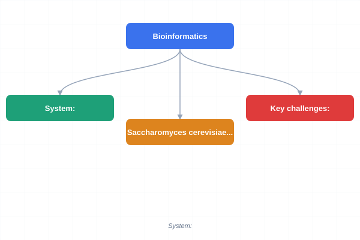
</a>
<a href="../../assets/images/diagrams/artificial-intelligence/10-probabilistic-reasoning/bioinformatics-sticky.svg" target="_blank" rel="noopener">
  
</a>


**System:** Gene regulatory network inference.
- Network: Nodes = genes, edges = regulatory relationships (activation/repression).
- Structure learning: Chow-Liu tree or MMHC from gene expression microarrays ($N$ ~ 1000 samples, $n$ ~ 5000+ genes).
- Inference: Given expression levels of measured genes, infer activity of unmeasured transcription factors.
- **Saccharomyces cerevisiae (yeast)** cell cycle: BN models of 800+ genes identified novel regulatory relationships later validated by knock-out experiments.

**Key challenges:** The number of genes ($n$) far exceeds the number of samples ($N$) -- the $n \gg N$ problem. Regularization (sparsity priors) and pathway-level aggregation (grouping genes into pathways) mitigate this.

### Other Real-World Applications

<a href="../../assets/images/diagrams/artificial-intelligence/10-probabilistic-reasoning/other-real-world-applications-handwritten.svg" target="_blank" rel="noopener">
  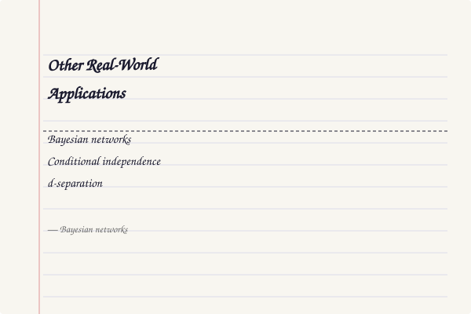
</a>
<a href="../../assets/images/diagrams/artificial-intelligence/10-probabilistic-reasoning/other-real-world-applications-diagram.svg" target="_blank" rel="noopener">
  
</a>
<a href="../../assets/images/diagrams/artificial-intelligence/10-probabilistic-reasoning/other-real-world-applications-sticky.svg" target="_blank" rel="noopener">
  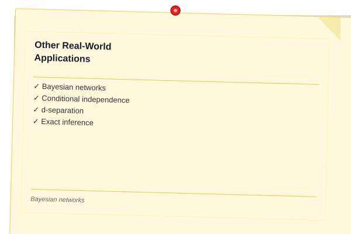
</a>


| Domain | Application | BN Size | Inference Method |
|--------|-------------|:-------:|:----------------:|
| Spam filtering | Naive Bayes (tree-structured BN) | 10K+ features | Closed form |
| Speech recognition | Dynamic BN (HMM variant) | Variable | Forward-backward |
| Robotics | SLAM (Simultaneous Localization And Mapping) | 10K+ nodes | Particle filtering |
| Finance | Credit risk assessment | 50-100 nodes | Variable elimination |
| Ecology | Species distribution modeling | 30-200 nodes | Gibbs sampling |
| Sports analytics | Player performance prediction | 20-50 nodes | Variable elimination |
| Cybersecurity | Intrusion detection -- alert correlation | 100-500 nodes | Likelihood weighting |

---

## Chapter Quiz

**Q1:** In a Bayesian network, the joint distribution is factorized as:
- A) $P(X_1, \ldots, X_n) = \prod_i P(X_i)$
- B) $P(X_1, \ldots, X_n) = \prod_i P(X_i \mid \text{Parents}(X_i))$
- C) $P(X_1, \ldots, X_n) = \max_i P(X_i \mid \text{Parents}(X_i))$
- D) $P(X_1, \ldots, X_n) = \sum_i P(X_i \mid \text{Parents}(X_i))$

<details><summary>Answer&lt;/summary&gt;B) The chain rule for Bayesian networks expresses the joint distribution as a product of conditional probabilities of each variable given its parents.</details>

**Q2:** In d-separation, conditioning on a collider:
- A) Blocks the path between its parents
- B) Opens the path between its parents (creating dependence)
- C) Has no effect
- D) Makes the collider independent of its parents

<details><summary>Answer&lt;/summary&gt;B) Conditioning on a collider opens the path, creating dependence between its parents -- the explaining away phenomenon.</details>

**Q3:** Which of the following best describes the complexity of variable elimination?
- A) $O(n)$ -- linear in the number of variables
- B) $O(n \cdot d^{\text{tw}+1})$ -- exponential in treewidth
- C) $O((B+N) \cdot M)$ -- linear in graph size
- D) $O(n^2)$ -- quadratic in the number of variables

<details><summary>Answer&lt;/summary&gt;B) Variable elimination is exponential in the treewidth of the network (given an elimination order). This is why it is feasible only for low-treewidth BNs.</details>

**Q4:** The Markov blanket of a node consists of:
- A) Only its parents
- B) Only its children
- C) Parents + Children + Co-parents
- D) All nodes in the network

<details><summary>Answer&lt;/summary&gt;C) The Markov blanket includes parents, children, and co-parents. A node is conditionally independent of all other nodes given its Markov blanket.</details>

**Q5:** Why does Gibbs sampling require a burn-in period?
- A) To initialize the random number generator
- B) To allow the Markov chain to converge to the stationary distribution before collecting samples
- C) To eliminate duplicate samples
- D) To reduce the memory footprint

<details><summary>Answer&lt;/summary&gt;B) The burn-in period allows the chain to "forget" its initial state and converge to the true posterior distribution. Samples collected during burn-in are discarded.</details>

**Q6:** What is the main advantage of likelihood weighting over rejection sampling?
- A) It produces exact results
- B) It handles improbable evidence more efficiently by never rejecting samples
- C) It is always faster
- D) It does not require CPTs

<details><summary>Answer&lt;/summary&gt;B) Likelihood weighting never rejects samples -- it weights them by the probability of evidence. Rejection sampling rejects most samples when evidence has low probability.</details>

**Q7:** The Chow-Liu algorithm for structure learning produces:
- A) A general DAG
- B) A tree-structured BN (each node has at most one parent)
- C) A fully connected graph
- D) An undirected graphical model

<details><summary>Answer&lt;/summary&gt;B) Chow-Liu finds the maximum-likelihood tree-structured approximation of the joint distribution, where each node has at most one parent.</details>

---

## Summary

Probabilistic reasoning provides a principled framework for handling uncertainty in AI systems. **Bayesian networks** encode joint probability distributions compactly using DAGs and conditional probability tables. **Conditional independence** -- determined efficiently via **d-separation** -- is the key property that enables this compact representation.

**Exact inference** (variable elimination) computes posterior probabilities exactly but is exponential in the network's treewidth. **Approximate inference** (Gibbs sampling / MCMC) scales to large networks by generating samples from the posterior, at the cost of asymptotic convergence guarantees. **Structure learning** methods (score-based, constraint-based, hybrid) enable learning BN structure from data, though the problem is NP-hard in general.

Bayesian networks are deployed in medical diagnosis (PathFinder), industrial fault diagnosis (Microsoft Troubleshooter), bioinformatics (gene regulatory networks), robotics (SLAM), and countless other domains where reasoning under uncertainty is essential.

---

## Exercises

### Review Questions

1. List the five variables in the Alarm Bayesian network. Write out the full chain-rule factorization of the joint distribution.

2. Explain the difference between a chain, a fork, and a collider in d-separation. Provide a concrete example of each.

3. Why is variable elimination exponential in treewidth? What makes a BN have high treewidth?

4. Compare rejection sampling, likelihood weighting, and Gibbs sampling. Under what conditions does each perform best?

5. What is the Markov blanket, and why is it important for Gibbs sampling?

### Application Problems

6. Construct a Bayesian network for a weather domain with variables: Rain (R), Sprinkler (S), GrassWet (G), Cloudy (C). Define reasonable CPTs. Compute $P(G=\text{wet} \mid R=\text{true})$ by hand using variable elimination.

7. Implement the d-separation algorithm for the Alarm network. Verify that Burglary _|_ Earthquake | {} but NOT Burglary _|_ Earthquake | Alarm.

8. Run Gibbs sampling on the Alarm network for $P(B \mid J=1, M=1)$ with $N = 100, 1000, 10000$ samples. Compute the error against the exact result from variable elimination. Plot error vs. sample size.

### Challenge Problem

9. Implement the Chow-Liu algorithm for structure learning. Given a synthetic dataset from the Alarm network (generate 10,000 samples), recover the tree-structured BN that best approximates the true structure. Compare the Chow-Liu tree (each node has &lt;= 1 parent) against the true Alarm DAG. Which edges are recovered correctly? Which are missing?

10. Implement a Bayesian network for medical diagnosis with 5 diseases and 8 symptoms. Define CPTs using the noisy-OR model (requires only one parameter per parent-disease relationship). Perform inference using variable elimination to find the most likely disease given a set of observed symptoms. Extend the network to handle 20 diseases and 50 symptoms using Gibbs sampling.
