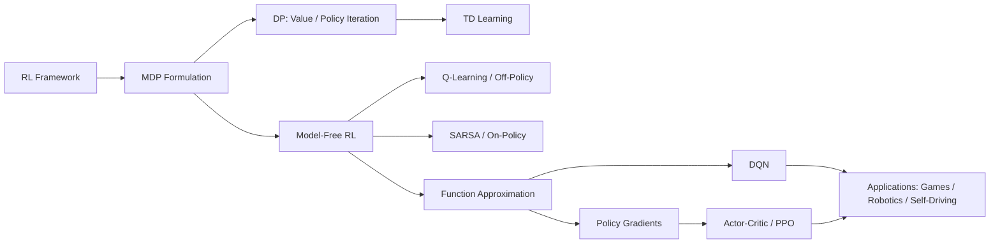

# Chapter 11: Reinforcement Learning

**Previous:** [Chapter 10: Probabilistic Reasoning Over Time](10-probabilistic-reasoning.md) | **Next:** [Chapter 12: Natural Language Processing](12-nlp.md)

## Learning Objectives

By the end of this chapter, students will be able to:

<!-- Image Gallery -->
<section class="lesson-visuals" aria-label="Visual learning resources">
  <header><span>VISUAL LEARNING</span><h2>See it. Review it. Remember it.</h2></header>
  <a class="lesson-visual-card" href="../../../assets/images/lessons/artificial-intelligence/11-reinforcement-learning/handwritten-notes.svg" target="_blank" rel="noopener">
    
    <span><strong>Handwritten notes</strong>Condensed notes for deliberate review.</span>
  </a>
  <a class="lesson-visual-card" href="../../../assets/images/lessons/artificial-intelligence/11-reinforcement-learning/sticky-notes.svg" target="_blank" rel="noopener">
    
    <span><strong>Sticky-note revision</strong>Fast recall prompts for revision.</span>
  </a>
  <a class="lesson-visual-card" href="../../../assets/images/lessons/artificial-intelligence/11-reinforcement-learning/visual-explanation.svg" target="_blank" rel="noopener">
    
    <span><strong>Visual concept guide</strong>A connected explanation of the key ideas.</span>
  </a>
</section>
<!-- End Image Gallery -->


1. Describe the reinforcement learning framework and its core components (agent, environment, policy, value function).
2. Formulate sequential decision problems as Markov Decision Processes (MDPs) and solve them via dynamic programming.
3. Distinguish model-based RL (value iteration, policy iteration) from model-free RL (Q-learning, SARSA).
4. Implement Q-learning and SARSA with tabular representations for small state spaces.
5. Understand deep RL architectures including DQN, experience replay, and target networks.
6. Explain policy gradient methods and the actor-critic architecture used in PPO.

## Why Reinforcement Learning Matters

Imagine training a puppy. When it sits on command, you give it a treat. When it chews your shoe, you scold it. The puppy doesn't know the "right" thing to do — it discovers through trial and error that sitting leads to treats and chewing leads to trouble. Over time, it learns a policy: *when I hear "sit," my muscles contract in sequence, and I earn a reward.*

Reinforcement learning is this exact process, formalized mathematically. The agent (puppy) interacts with an environment (your living room), takes actions (sit, chew, run), receives rewards (treat, scold), and learns to maximize cumulative reward over time.

**Why this matters across every domain:**

| Domain | RL Problem | Why It's Revolutionary |
|--------|-----------|----------------------|
| **Game playing** | AlphaGo defeated world champion Lee Sedol (2016) | No programmed strategy — learned entirely from self-play |
| **Robotics** | Robot learns to grasp objects it has never seen | No explicit grasp planner — learns from trial and error |
| **Autonomous driving** | Waymo's cars learn to merge into traffic | Models human-like merging behavior from millions of miles |
| **Healthcare** | AI learns optimal drug dosing for sepsis patients | Discovers treatment policies better than static protocols |
| **Recommendation** | YouTube recommends your next video | Maximizes engagement as a reward signal over time |

> **One-Sentence Takeaway:** Reinforcement learning enables machines to learn optimal sequential decisions through interaction — no teacher, no pre-programmed rules, just reward signals and experience.

---

## Chapter at a Glance

| Section | Key Topics | Key Terms |
|---------|-----------|-----------|
| RL Framework | Agent, environment, reward, discount | Policy $\pi$, Value $V$, Action-value $Q$ |
| MDP Formalization | States, actions, transitions, rewards | Bellman equations, optimality |
| Dynamic Programming | Policy evaluation, value iteration, policy iteration | Bootstrapping, convergence |
| Exploration vs Exploitation | $\epsilon$-greedy, softmax, UCB | Exploration-exploitation dilemma |
| TD Learning | Bootstrapping, TD error | $\delta_t = R_{t+1} + \gamma V(S_{t+1}) - V(S_t)$ |
| Q-Learning | Off-policy, max over next actions | $Q^*$ convergence guarantee |
| SARSA | On-policy, actual next action | Cautious exploration |
| Deep Q-Networks | Neural net $Q$, experience replay, target network | DQN, stabilized training |
| Policy Gradients | REINFORCE, policy gradient theorem | Direct policy optimization |
| Actor-Critic | A2C, PPO, clipped objective | Advantage function |

### Chapter Roadmap




---

## 11.1 The Reinforcement Learning Framework


In reinforcement learning, an **agent** learns by interacting with its **environment**. At each discrete time step $t$:

1. The agent observes the environment's **state** $S_t \in \mathcal{S}$.
2. It selects an **action** $A_t \in \mathcal{A}$.
3. The environment responds with a **reward** $R_{t+1} \in \mathcal{R}$ and transitions to a new state $S_{t+1}$.

This loop continues until a terminal state is reached (e.g., game over, goal achieved).

### The Return


The agent's goal is to maximize the expected **cumulative discounted reward** (the return):

$$G_t = \sum_{k=0}^{\infty} \gamma^k R_{t+k+1}$$

where $\gamma \in [0, 1]$ is the **discount factor**. A small $\gamma$ makes the agent myopic (cares only about near-term rewards); a $\gamma$ close to 1 makes it far-sighted.

### 11.1.1 Key Components


- **Policy** $\pi(a \mid s)$: The agent's behavior — a mapping from states to action probabilities. $\pi$ is what the agent learns.
- **Value function** $V_\pi(s) = \mathbb{E}_\pi[G_t \mid S_t = s]$: How good is it to be in state $s$ under policy $\pi$?
- **Action-value function** $Q_\pi(s, a) = \mathbb{E}_\pi[G_t \mid S_t = s, A_t = a]$: How good is it to take action $a$ from state $s$ under policy $\pi$?
- **Model:** The agent's internal representation of how the environment works — transition probabilities $P(s' \mid s, a)$ and expected rewards $R(s, a)$.

### 11.1.2 How RL Differs from Other Learning Paradigms


| Aspect | Supervised Learning | Unsupervised Learning | Reinforcement Learning |
|--------|-------------------|---------------------|----------------------|
| Feedback | Labels (correct answer) | No labels | Rewards (delayed, sparse) |
| Data | i.i.d. samples | i.i.d. samples | Non-i.i.d. (agent's actions affect distribution) |
| Goal | Minimize prediction error | Find hidden structure | Maximize cumulative reward |
| Exploration | Not needed | Not needed | Essential |
| Sequential | No | No | Yes (decisions affect future states) |

### Real-World Analogy: Training a Dog


> Teaching a dog to fetch works exactly like RL. The state is "dog at position X with ball at position Y." Actions are "run left, run right, grab, return." The reward is +1 (treat) when the dog brings the ball back and drops it. The dog tries random actions at first (exploration), and over time learns that returning the ball leads to a treat. This is the **reward hypothesis**: any goal can be framed as maximizing cumulative reward.

---

## 11.2 Markov Decision Processes (MDPs)

An MDP formalizes the sequential decision problem. It is defined by the tuple $(\mathcal{S}, \mathcal{A}, \mathcal{P}, \mathcal{R}, \gamma)$:

- $\mathcal{S}$: Finite set of states.
- $\mathcal{A}$: Finite set of actions.
- $\mathcal{P}$: State transition probability $P(s' \mid s, a)$.
- $\mathcal{R}$: Reward function $R(s, a, s')$ or expected reward $R(s, a)$.
- $\gamma \in [0, 1]$: Discount factor.

The **Markov property** states that the future is independent of the past given the present:

$$P(S_{t+1} \mid S_t, A_t, S_{t-1}, A_{t-1}, \dots) = P(S_{t+1} \mid S_t, A_t)$$

### Real-World Analogy: Navigation Robot


> A robot navigating a warehouse: states are grid cells, actions are {up, down, left, right}, rewards are +10 at the goal, -1 per step, and -5 for bumping into shelves. The robot doesn't know the transition probabilities — it learns by moving. The MDP captures exactly this: the robot's goal is to find a policy (path to goal) that maximizes cumulative reward (shortest safe path).

### 11.2.1 Bellman Expectation Equation


The value function for a given policy $\pi$ satisfies a recursive relationship:

$$V_\pi(s) = \sum_{a} \pi(a \mid s) \left[ R(s, a) + \gamma \sum_{s'} P(s' \mid s, a) V_\pi(s') \right]$$

This is the **Bellman expectation equation** — it relates the value of a state to the values of its successor states. For the action-value function:

$$Q_\pi(s, a) = R(s, a) + \gamma \sum_{s'} P(s' \mid s, a) \sum_{a'} \pi(a' \mid s') Q_\pi(s', a')$$

### 11.2.2 Bellman Optimality Equation


The optimal value function $V^*$ and optimal action-value function $Q^*$ satisfy:

$$V^*(s) = \max_{a} \left[ R(s, a) + \gamma \sum_{s'} P(s' \mid s, a) V^*(s') \right]$$

$$Q^*(s, a) = R(s, a) + \gamma \sum_{s'} P(s' \mid s, a) \max_{a'} Q^*(s', a')$$

These are **Bellman optimality equations** — they define the fixed-point equations for $V^*$ and $Q^*$.

> **Pro Tip:** Think of Bellman equations as a "one-step lookahead." The value of the current state is the immediate reward plus the discounted value of wherever you end up next.

---

## 11.3 Dynamic Programming for MDPs

When the model (transitions $P$ and rewards $R$) is known, we can compute the optimal policy using **dynamic programming**.

### 11.3.1 Policy Evaluation (Prediction)


Policy evaluation computes $V_\pi$ for a given policy $\pi$ by iteratively applying the Bellman expectation equation until convergence.

#### Real-World Analogy: Grading a Fixed Study Schedule

> Imagine a student following a fixed study schedule (policy). Policy evaluation answers: "If I follow this exact schedule every day, what's my expected GPA?" Each iteration refines the estimate based on the schedule's effects across all courses.

#### Algorithm Steps

1. Initialize $V(s) = 0$ for all $s \in \mathcal{S}$.
2. Set a convergence threshold $\theta$ (e.g., $10^{-6}$).
3. Repeat until $\Delta &lt; \theta$:
   - Set $\Delta = 0$.
   - For each $s \in \mathcal{S}$:
     - $v \leftarrow V(s)$
     - $V(s) \leftarrow \sum_a \pi(a \mid s) \left[ R(s, a) + \gamma \sum_{s'} P(s' \mid s, a) V(s') \right]$
     - $\Delta \leftarrow \max(\Delta, |v - V(s)|)$

#### Pseudocode

```
function POLICY-EVALUATION(pi, theta, gamma) returns V
    V(s) <- 0 for all s
    repeat
        Delta <- 0
        for each s in S:
            v <- V(s)
            V(s) <- sum_a pi(a|s) [R(s,a) + gamma sum_{s'} P(s'|s,a) V(s')]
            Delta <- max(Delta, |v - V(s)|)
    until Delta < theta
    return V
```

#### Dry Run: Small Grid World

Consider a 2x2 grid with states {A, B, C, D}. Goal at D (reward +1). Policy: always move right (if possible), otherwise down. gamma = 0.9, theta = 0.01.

**Initial:** V(A) = V(B) = V(C) = V(D) = 0

**Iteration 1:**
| State | Old V | New V Calculation | New V | Delta |
|-------|-------|------------------|-------|-------|
| A | 0 | 0 + 0.9 * V(B) = 0 | 0 | 0 |
| B | 0 | 0 + 0.9 * V(C) = 0 | 0 | 0 |
| C | 0 | 0 + 0.9 * V(D) = 0 | 0 | 0 |
| D | 0 | Terminal | 0 | 0 |

The terminal state D gives reward +1 when reached, so V(D) = 1.

**Iteration 2:**
| State | Old V | New V Calculation | New V | Delta |
|-------|-------|------------------|-------|-------|
| A | 0 | 0 + 0.9 * V(B) = 0 | 0 | 0 |
| B | 0 | 0 + 0.9 * V(C) = 0 | 0 | 0 |
| C | 0 | 0 + 0.9 * V(D) = 0.9 * 1 = 0.9 | 0.9 | 0.9 |
| D | 1 | 1 | 1 | 0 |

**Iteration 3:**
| State | Old V | New V Calculation | New V | Delta |
|-------|-------|------------------|-------|-------|
| A | 0 | 0 + 0.9 * V(B) = 0 | 0 | 0 |
| B | 0 | 0 + 0.9 * V(C) = 0.9 * 0.9 = 0.81 | 0.81 | 0.81 |
| C | 0.9 | 0 + 0.9 * V(D) = 0.9 * 1 = 0.9 | 0.9 | 0 |
| D | 1 | 1 | 1 | 0 |

**Iteration 4:**
| State | Old V | New V Calculation | New V | Delta |
|-------|-------|------------------|-------|-------|
| A | 0 | 0 + 0.9 * V(B) = 0.9 * 0.81 = 0.729 | 0.729 | 0.729 |
| B | 0.81 | 0 + 0.9 * V(C) = 0.9 * 0.9 = 0.81 | 0.81 | 0 |
| C | 0.9 | 0 + 0.9 * V(D) = 0.9 | 0.9 | 0 |
| D | 1 | 1 | 1 | 0 |

**Iteration 5:** Delta = 0 for all states -- converged.

#### Python Implementation

<details>
<summary>Python&lt;/summary&gt;

```python
import numpy as np

def policy_evaluation(P, R, gamma, policy, theta=1e-6):
    """Evaluate a policy using iterative DP.
    P[s][a][s'] = transition probability
    R[s] = expected immediate reward
    policy[s][a] = probability of taking action a in state s
    """
    n_states = len(P)
    V = np.zeros(n_states)

    while True:
        delta = 0
        for s in range(n_states):
            v = V[s]
            total = 0.0
            for a in range(len(policy[s])):
                action_prob = policy[s][a]
                if action_prob == 0:
                    continue
                expected_future = 0.0
                for s_next in range(n_states):
                    expected_future += P[s][a][s_next] * V[s_next]
                total += action_prob * (R[s] + gamma * expected_future)
            V[s] = total
            delta = max(delta, abs(v - V[s]))
        if delta < theta:
            break
    return V
```

</details>

#### Complexity Analysis

- **Time:** $O(|S|^2 * |A| * k)$ per iteration, where $k$ is the number of iterations until convergence. Each state's update sums over all actions and all successor states. Convergence is linear in $\gamma$ -- values propagate backward one step per iteration.
- **Space:** $O(|S|)$ -- one value per state.
- **Why this complexity?** The double sum $\sum_a \pi(a|s) \sum_{s'} P(s'|s,a)$ is inherently $O(|S| \cdot |A|)$ per state because we must consider every action--successor pair. The $k$ factor arises because information travels at $\gamma$ per step across the state graph.

#### Advantages & Disadvantages

| Advantage | Disadvantage |
|-----------|-------------|
| Guaranteed convergence for any finite MDP | Requires full knowledge of transition model |
| Provably linear convergence rate | Cannot scale to large state spaces |
| Simple to implement and debug | Wastes computation on irrelevant states |
| Foundation for all RL theory | Sweeps every state every iteration |

#### Edge Cases

| Edge Case | Issue | Mitigation |
|-----------|-------|------------|
| Terminal states | No outgoing transitions; infinite loop if not handled | Set V(terminal) = 0 and skip update |
| Deterministic vs stochastic | Single s' vs distribution over s' | Deterministic: P(s'|s,a) = 1 for one s'; stochastic: sum over all |
| Zero-reward regions | Flat value landscape, slow convergence | Use larger theta or prioritize states near reward sources |
| Discount near 1 | Values propagate slowly across long chains | Many iterations needed -- gamma = 0.99 requires ~460 iterations to propagate 99% of value |

---

### 11.3.2 Policy Iteration


Policy iteration alternates between **policy evaluation** (compute $V_\pi$) and **policy improvement** (make $\pi$ greedy with respect to $V_\pi$).

#### Real-World Analogy: Chef Refining Recipes

> A head chef evaluates the current menu (policy evaluation): "How much profit does each dish generate?" Then improves: "Replace the worst-selling dish with a new creation that diners are predicted to prefer." Each cycle produces a strictly better menu until no dish can be improved.

#### Algorithm Steps

1. **Initialize:** Start with an arbitrary policy $\pi$.
2. **Evaluate:** Compute $V_\pi$ using policy evaluation.
3. **Improve:** For each state $s$, set $\pi'(s) = \arg\max_a \left[ R(s, a) + \gamma \sum_{s'} P(s' \mid s, a) V_\pi(s') \right]$.
4. **Check:** If $\pi' = \pi$, stop. Otherwise, $\pi \leftarrow \pi'$ and go to step 2.

#### Pseudocode

```
function POLICY-ITERATION(P, R, gamma) returns pi*
    pi(s) <- random action for all s
    repeat
        V <- POLICY-EVALUATION(pi, theta, gamma)
        pi-stable <- true
        for each s in S:
            old-action <- pi(s)
            pi(s) <- argmax_a [R(s,a) + gamma sum_{s'} P(s'|s,a) V(s')]
            if old-action != pi(s): pi-stable <- false
    until pi-stable
    return pi
```

#### Dry Run: Same 2x2 Grid

States: A, B, C, D (D terminal with reward +1). Actions: {right, down}. gamma = 0.9.

**Initial policy:** right in all states.

**Iteration 1 -- Evaluate:** (Using converged values from 11.3.1) V(A) = 0.729, V(B) = 0.81, V(C) = 0.9, V(D) = 1

**Iteration 1 -- Improve:**

| State | Q(s, right) | Q(s, down) | Best Action |
|-------|-------------|------------|-------------|
| A | 0 + 0.9 * V(B) = 0.729 | 0 + 0.9 * V(C) = 0.81 | **down** |
| B | 0 + 0.9 * V(C) = 0.81 | 0 + 0.9 * V(D) = 0.9 | **down** |
| C | 0 + 0.9 * V(D) = 0.9 | Terminal (stays) | **right** |
| D | Terminal | Terminal | -- |

New policy: A->down, B->down, C->right, D->terminal. pi changed -> re-evaluate.

**Iteration 2 -- Evaluate with new policy:**

V(A) = 0 + 0.9 * V(C) = 0.9 * 0.9 = 0.81
V(B) = 0 + 0.9 * V(D) = 0.9 * 1 = 0.9
V(C) = 0 + 0.9 * V(D) = 0.9
V(D) = 0

**Iteration 2 -- Improve:**

| State | Q(s, right) | Q(s, down) | Best Action |
|-------|-------------|------------|-------------|
| A | 0 + 0.9 * V(B) = 0.81 | 0 + 0.9 * V(C) = 0.81 | **tie (keep down)** |
| B | 0 + 0.9 * V(C) = 0.81 | 0 + 0.9 * V(D) = 0.9 | **down** |
| C | 0 + 0.9 * V(D) = 0.9 | Terminal | **right** |
| D | Terminal | Terminal | -- |

Policy unchanged -- converged in 2 iterations.

#### Python Implementation

<details>
<summary>Python&lt;/summary&gt;

```python
import numpy as np

def policy_evaluation_for_pi(P, R, gamma, policy, theta=1e-6):
    n_states = len(P)
    V = np.zeros(n_states)
    while True:
        delta = 0
        for s in range(n_states):
            v = V[s]
            a = policy[s]
            expected = sum(P[s][a][s_next] * V[s_next] for s_next in range(n_states))
            V[s] = R[s] + gamma * expected
            delta = max(delta, abs(v - V[s]))
        if delta < theta:
            break
    return V

def policy_iteration(P, R, gamma, n_actions, theta=1e-6):
    n_states = len(P)
    policy = np.zeros(n_states, dtype=int)
    while True:
        V = policy_evaluation_for_pi(P, R, gamma, policy, theta)
        policy_stable = True
        for s in range(n_states):
            old_action = policy[s]
            q_values = np.zeros(n_actions)
            for a in range(n_actions):
                expected = sum(P[s][a][s_next] * V[s_next] for s_next in range(n_states))
                q_values[a] = R[s] + gamma * expected
            policy[s] = np.argmax(q_values)
            if old_action != policy[s]:
                policy_stable = False
        if policy_stable:
            break
    return policy, V
```

</details>

#### Complexity Analysis

- **Time:** $O(|S|^2 * |A| * (k_{eval} * n_{iter}))$ -- each iteration requires a full policy evaluation (which itself takes $k_{eval}$ sweeps), but the number of policy iterations $n_{iter}$ is typically very small (often &lt; 20).
- **Space:** $O(|S|)$ for values plus $O(|S|)$ for the policy.
- **Why so few iterations?** Policy iteration converges in $O(|A|^{|S|})$ in the worst case, but in practice each improvement strictly increases value, and there are only finitely many deterministic policies.

#### Advantages & Disadvantages

| Advantage | Disadvantage |
|-----------|-------------|
| Very fast convergence in practice (few iterations) | Each iteration requires full policy evaluation (expensive) |
| Monotonic improvement guarantee | Requires complete model knowledge |
| Typically fewer iterations than value iteration | Policy evaluation itself is iterative -- nested loops |
| Direct working policy at every step | Must evaluate all states even if policy changes only locally |

#### Edge Cases

| Edge Case | Issue | Mitigation |
|-----------|-------|------------|
| Cyclic policy oscillation | Two policies alternate (rare) | In-place updates or tie-breaking |
| Large deterministic policies | Policy evaluation must converge fully | Truncated evaluation (few sweeps) in modified policy iteration |
| Ties in improvement step | Multiple actions equal Q-values | Break ties consistently |
| Initial bad policy | Evaluation may take longer | Use value iteration to initialize, then switch to policy iteration |

---

### 11.3.3 Value Iteration


Value iteration combines policy evaluation and improvement into a single update: it directly applies the Bellman optimality backup.

$$V_{k+1}(s) = \max_a \left[ R(s, a) + \gamma \sum_{s'} P(s' \mid s, a) V_k(s') \right]$$

#### Real-World Analogy: GPS Route Finding

> A GPS doesn't try one route, evaluate it, then improve. Instead, it repeatedly asks: "For each intersection, which outgoing road leads to the shortest path to destination?" Starting with all-zero estimates, the values propagate backwards from the destination, one road-segment per iteration.

#### Algorithm Steps

1. Initialize $V(s) = 0$ for all $s$.
2. Set convergence threshold $\theta$.
3. Repeat until $\Delta &lt; \theta$:
   - $\Delta \leftarrow 0$
   - For each $s \in \mathcal{S}$:
     - $v \leftarrow V(s)$
     - $V(s) \leftarrow \max_a \left[ R(s, a) + \gamma \sum_{s'} P(s' \mid s, a) V(s') \right]$
     - $\Delta \leftarrow \max(\Delta, |v - V(s)|)$
4. Extract policy: $\pi(s) = \arg\max_a \left[ R(s, a) + \gamma \sum_{s'} P(s' \mid s, a) V(s') \right]$

#### Pseudocode

```
function VALUE-ITERATION(P, R, gamma, theta) returns V, pi
    V(s) <- 0 for all s
    repeat
        Delta <- 0
        for each s in S:
            v <- V(s)
            V(s) <- max_a [R(s,a) + gamma sum_{s'} P(s'|s,a) V(s')]
            Delta <- max(Delta, |v - V(s)|)
    until Delta < theta
    for each s in S:
        pi(s) <- argmax_a [R(s,a) + gamma sum_{s'} P(s'|s,a) V(s')]
    return V, pi
```

#### Dry Run: Same 2x2 Grid with gamma = 0.9, theta = 0.01

**Initial:** V(A) = V(B) = V(C) = V(D) = 0

**Iteration 1:**
| State | Q(s, right) | Q(s, down) | max | New V | Delta |
|-------|-------------|------------|-----|-------|-------|
| A | 0 + 0.9(0) = 0 | 0 + 0.9(0) = 0 | 0 | 0 | 0 |
| B | 0 + 0.9(0) = 0 | 0 + 0.9(0) = 0 | 0 | 0 | 0 |
| C | 0 + 0.9(0) = 0 | 0 + 0.9(0) = 0 | 0 | 0 | 0 |
| D | Terminal | Terminal | 1 (goal) | 1 | 1 |

**Iteration 2:**
| State | Q(s, right) | Q(s, down) | max | New V | Delta |
|-------|-------------|------------|-----|-------|-------|
| A | 0 + 0.9(0) = 0 | 0 + 0.9(0) = 0 | 0 | 0 | 0 |
| B | 0 + 0.9(0) = 0 | 0 + 0.9(1) = 0.9 | 0.9 | 0.9 | 0.9 |
| C | 0 + 0.9(1) = 0.9 | 0 + 0.9(0) = 0 | 0.9 | 0.9 | 0.9 |
| D | Terminal | Terminal | 1 | 1 | 0 |

**Iteration 3:**
| State | Q(s, right) | Q(s, down) | max | New V | Delta |
|-------|-------------|------------|-----|-------|-------|
| A | 0 + 0.9(0) = 0 | 0 + 0.9(0.9) = 0.81 | 0.81 | 0.81 | 0.81 |
| B | 0 + 0.9(0.9) = 0.81 | 0 + 0.9(1) = 0.9 | 0.9 | 0.9 | 0 |
| C | 0 + 0.9(1) = 0.9 | 0 + 0.9(0) = 0 | 0.9 | 0.9 | 0 |
| D | Terminal | Terminal | 1 | 1 | 0 |

**Iteration 4:**
| State | Q(s, right) | Q(s, down) | max | New V | Delta |
|-------|-------------|------------|-----|-------|-------|
| A | 0 + 0.9(0.9) = 0.81 | 0 + 0.9(0.9) = 0.81 | 0.81 | 0.81 | 0 |
| B | 0 + 0.9(0.9) = 0.81 | 0 + 0.9(1) = 0.9 | 0.9 | 0.9 | 0 |
| C | 0 + 0.9(1) = 0.9 | 0 + 0.9(0) = 0 | 0.9 | 0.9 | 0 |
| D | Terminal | Terminal | 1 | 1 | 0 |

Delta = 0 &lt; theta -- converged.

**Extracted policy:** A->down or right (tie), B->down, C->right, D->terminal.

#### Python Implementation

<details>
<summary>Python&lt;/summary&gt;

```python
import numpy as np

def value_iteration(P, R, gamma, n_actions, theta=1e-6):
    n_states = len(P)
    V = np.zeros(n_states)

    while True:
        delta = 0
        for s in range(n_states):
            v = V[s]
            q_values = np.zeros(n_actions)
            for a in range(n_actions):
                expected = sum(P[s][a][s_next] * V[s_next]
                              for s_next in range(n_states))
                q_values[a] = R[s] + gamma * expected
            V[s] = np.max(q_values)
            delta = max(delta, abs(v - V[s]))
        if delta < theta:
            break

    policy = np.zeros(n_states, dtype=int)
    for s in range(n_states):
        q_values = np.zeros(n_actions)
        for a in range(n_actions):
            expected = sum(P[s][a][s_next] * V[s_next]
                          for s_next in range(n_states))
            q_values[a] = R[s] + gamma * expected
        policy[s] = np.argmax(q_values)

    return policy, V
```

</details>

#### Complexity Analysis

- **Time:** $O(|S|^2 * |A| * k)$ for $k$ iterations until convergence. Each iteration is identical to a single policy evaluation sweep but with a max over actions instead of expectation.
- **Space:** $O(|S|)$.
- **Why these iterations?** Unlike policy iteration's nested evaluation loops, value iteration has a single loop. But it typically converges in $k = O(\log(1/\theta) / (1-\gamma))$ iterations -- high discount factors require many more iterations.

---

### 11.3.4 Value Iteration vs Policy Iteration


| Aspect | Value Iteration | Policy Iteration |
|--------|----------------|-----------------|
| Update | Bellman optimality backup directly | Alternates evaluation + improvement |
| Convergence | $O(\log(1/\theta) / (1-\gamma))$ iterations | Usually $O(|S|)$ iterations |
| Per-iteration cost | $O(|S|^2|A|)$ | $O(|S|^3|A|)$ (full evaluation) |
| Best when | gamma is small, state space moderate | gamma is large, need fast policy convergence |
| Output | $V^*$ and derived $\pi^*$ | $\pi^*$ directly (V computed as byproduct) |
| Practical rule | Fewer lines of code | Faster for most problems |

---

## 11.4 Model-Based vs Model-Free RL

| Aspect | Model-Based RL | Model-Free RL |
|--------|---------------|--------------|
| Approach | Learn/use transition model $P(s'|s,a)$ then plan | Learn value/policy directly from experience |
| Sample efficiency | Higher (model provides additional signal) | Lower (requires more interaction) |
| Computational cost | Lower interaction cost but higher compute for planning | Higher interaction cost but simpler per-step update |
| Flexibility | Must re-plan if model changes | Can adapt online as policy updates |
| Examples | Dyna-Q, AlphaGo (with MCTS), MPC | Q-learning, SARSA, DQN, PPO |
| When to use | Environment is sample-expensive (robotics, simulators) | Environment is cheap to simulate (games, benchmarks) |
| Key challenge | Model bias -- imperfect model leads to suboptimal policy | High variance -- requires careful tuning of exploration |

> **Pro Tip:** Dyna-Q elegantly combines both -- it learns a model from real experience, then uses the model to generate simulated experience for Q-learning updates, dramatically improving sample efficiency.

---

## 11.5 Exploration vs Exploitation

The core dilemma: the agent must **explore** unknown actions to discover better returns while also **exploiting** known good actions to maximize reward.

### Standard Exploration Strategies


1. **Epsilon-greedy:** With probability $\epsilon$, choose a random action; otherwise, choose $\arg\max_a Q(s, a)$. Simple but explores uniformly (all suboptimal actions equally likely).

2. **Softmax (Boltzmann):** Select action $a$ with probability proportional to $\exp(Q(s, a) / \tau)$ where $\tau$ is temperature. High $\tau$ = uniform exploration; low $\tau$ = greedy.

3. **Upper Confidence Bound (UCB):** $$A_t = \arg\max_a \left[ Q_t(a) + c \sqrt{\frac{\ln t}{N_t(a)}} \right]$$ Automatically reduces exploration for well-understood actions and increases exploration for poorly-understood ones.

4. **Thompson Sampling:** Maintain a Bayesian posterior over Q-values. Sample from the posterior and act greedily with respect to the sample.

> **Real-World Analogy (Restaurant Choice):** When visiting a new city, a famous restaurant (exploit) guarantees a good meal. A hole-in-the-wall (explore) might be amazing or terrible. Epsilon-greedy: go to the famous place 90% of the time, try random places 10%. UCB: try places you haven't visited much. Thompson sampling: "I think this new place is probably good based on what I've seen."

---

## 11.6 Temporal-Difference Learning

TD learning combines ideas from dynamic programming (bootstrapping) and Monte Carlo methods (sampling). The agent updates its value estimates without waiting for the episode to end.

### TD(0) Update


$$V(S_t) \leftarrow V(S_t) + \alpha [R_{t+1} + \gamma V(S_{t+1}) - V(S_t)]$$

The **TD error** $\delta_t = R_{t+1} + \gamma V(S_{t+1}) - V(S_t)$ is the difference between the predicted value and the better estimate using the actual reward and next state's value.

> **Real-World Analogy (Weather Forecast):** If you predict 70F tomorrow and wake to 68F, you adjust your forecast model by the error of 2F. TD learning does the same -- it adjusts $V(S_t)$ toward a slightly more correct target (actual + discounted future), not a fully correct one.

### Advantages of TD Learning


| Advantage | Explanation |
|-----------|-------------|
| Online | Updates after every step, not just at episode end |
| Low variance | Bootstrapping reduces variance compared to Monte Carlo |
| Works with incomplete episodes | No need to wait for termination |
| Markov efficiency | Exploits the Markov property for faster learning |

---

## 11.7 Q-Learning (Off-Policy)

Q-learning learns the optimal action-value function directly, without requiring a model of the environment.

$$Q(S_t, A_t) \leftarrow Q(S_t, A_t) + \alpha [R_{t+1} + \gamma \max_a Q(S_{t+1}, a) - Q(S_t, A_t)]$$

Q-learning is **off-policy**: it learns the optimal Q-function $Q^*$ while following any exploration policy (e.g., $\epsilon$-greedy). The $\max$ operator makes it learn the value of the optimal policy, regardless of what actions the agent actually takes.

### Real-World Analogy: Learning Chess from Watching


> Imagine learning chess by watching random players (exploration policy). Even though the players aren't optimal, you can still imagine: "In this position, the *best* move would be Nf3 (max over actions)." Q-learning does exactly this -- it learns the optimal move even when the current behavior is suboptimal.

### Algorithm Steps


1. Initialize $Q(s, a) = 0$ for all $s \in \mathcal{S}$, $a \in \mathcal{A}$.
2. Set learning rate $\alpha$, discount $\gamma$, exploration $\epsilon$.
3. For each episode:
   - Reset environment, observe initial state $S$.
   - While $S$ is not terminal:
     - Choose $A$ from $S$ using $\epsilon$-greedy policy derived from $Q$.
     - Take action $A$, observe $R$, $S'$.
     - $Q(S, A) \leftarrow Q(S, A) + \alpha [R + \gamma \max_{a'} Q(S', a') - Q(S, A)]$
     - $S \leftarrow S'$

### Pseudocode


```
function Q-LEARNING(env, gamma, alpha, epsilon, episodes) returns Q
    Q(s, a) <- 0 for all s, a
    for each episode do
        s <- env.RESET()
        while not TERMINAL(s) do
            a <- EPSILON-GREEDY(s, Q, epsilon)
            s', r <- env.STEP(a)
            Q(s, a) <- Q(s, a) + alpha[r + gamma max_{a'} Q(s', a') - Q(s, a)]
            s <- s'
    return Q
```

### Step-by-Step Dry Run: 1D Grid of 5 Cells


States: 1-2-3-4-5 (goal at 5, reward +10). Actions: {left, right}. gamma = 0.9, alpha = 0.1, epsilon = 0.3.

**Initial Q-table (all zeros):**

| State | Left | Right |
|-------|------|-------|
| 1 | 0 | 0 |
| 2 | 0 | 0 |
| 3 | 0 | 0 |
| 4 | 0 | 0 |
| 5 | -- | -- (terminal) |

**Episode 1:** Start at state 3.
- Step 1: epsilon-greedy -> choose Right. Move to state 4, reward 0.
  Q(3, R) = 0 + 0.1[0 + 0.9 * max(0, 0) - 0] = 0

- Step 2: epsilon-greedy -> choose Right. Move to state 5 (goal!), reward +10.
  Q(4, R) = 0 + 0.1[10 + 0.9 * 0 - 0] = 1.0

**Updated Q-table after Episode 1:**

| State | Left | Right |
|-------|------|-------|
| 1 | 0 | 0 |
| 2 | 0 | 0 |
| 3 | 0 | 0 |
| 4 | 0 | **1.0** |
| 5 | -- | -- |

**Episode 2:** Start at state 2.
- Step 1: Choose Right -> state 3, reward 0.
  Q(2, R) = 0 + 0.1[0 + 0.9 * max(0, 0) - 0] = 0

- Step 2: Choose Right -> state 4, reward 0.
  Q(3, R) = 0 + 0.1[0 + 0.9 * max(0, 1.0) - 0] = 0 + 0.1(0.9) = 0.09

- Step 3: Choose Right -> state 5, reward +10.
  Q(4, R) = 1.0 + 0.1[10 + 0.9 * 0 - 1.0] = 1.0 + 0.1(9.0) = 1.9

**Q-table after Episode 2:**

| State | Left | Right |
|-------|------|-------|
| 1 | 0 | 0 |
| 2 | 0 | 0 |
| 3 | 0 | **0.09** |
| 4 | 0 | **1.9** |
| 5 | -- | -- |

**Episode 3:** Start at state 1.
- Step 1: Choose Right -> state 2, reward 0.
  Q(1, R) = 0 + 0.1[0 + 0.9 * 0 - 0] = 0

- Step 2: Choose Right -> state 3, reward 0.
  Q(2, R) = 0 + 0.1[0 + 0.9 * 0.09 - 0] = 0.0081

- Step 3: Choose Right -> state 4, reward 0.
  Q(3, R) = 0.09 + 0.1[0 + 0.9 * 1.9 - 0.09] = 0.09 + 0.1[1.71 - 0.09] = 0.09 + 0.162 = 0.252

- Step 4: Choose Right -> state 5, reward +10.
  Q(4, R) = 1.9 + 0.1[10 + 0.9 * 0 - 1.9] = 1.9 + 0.1(8.1) = 2.71

**After many episodes:** Q-values propagate leftward. Optimal policy: always move Right.

#### Python Implementation

<details>
<summary>Python&lt;/summary&gt;

```python
import numpy as np

class QLearning:
    def __init__(self, n_states, n_actions, alpha=0.1, gamma=0.9, epsilon=0.1):
        self.Q = np.zeros((n_states, n_actions))
        self.alpha = alpha
        self.gamma = gamma
        self.epsilon = epsilon

    def act(self, state):
        """epsilon-greedy action selection."""
        if np.random.random() < self.epsilon:
            return np.random.randint(self.Q.shape[1])
        return np.argmax(self.Q[state])

    def update(self, state, action, reward, next_state):
        """Q-learning update (off-policy)."""
        best_next = np.max(self.Q[next_state])
        td_target = reward + self.gamma * best_next
        td_error = td_target - self.Q[state, action]
        self.Q[state, action] += self.alpha * td_error

    def train(self, env, episodes):
        rewards = []
        for ep in range(episodes):
            state, _ = env.reset()
            total_reward = 0
            done = False
            while not done:
                action = self.act(state)
                next_state, reward, done, _ = env.step(action)
                self.update(state, action, reward, next_state)
                state = next_state
                total_reward += reward
            rewards.append(total_reward)
        return rewards
```

</details>

<details>
<summary>C++</summary>

```cpp
#include <vector>
#include <algorithm>
#include <random>

class QLearning {
public:
    QLearning(int n_states, int n_actions, double alpha=0.1,
              double gamma=0.9, double epsilon=0.1)
        : n_states(n_states), n_actions(n_actions), alpha(alpha),
          gamma(gamma), epsilon(epsilon),
          Q(n_states, std::vector<double>(n_actions, 0.0)) {}

    int act(int state) {
        std::uniform_real_distribution<double> dist(0.0, 1.0);
        if (dist(rng) < epsilon)
            return std::uniform_int_distribution<int>(0, n_actions-1)(rng);
        return std::max_element(Q[state].begin(), Q[state].end()) - Q[state].begin();
    }

    void update(int state, int action, double reward, int next_state) {
        double best_next = *std::max_element(Q[next_state].begin(), Q[next_state].end());
        double td_target = reward + gamma * best_next;
        double td_error = td_target - Q[state][action];
        Q[state][action] += alpha * td_error;
    }

private:
    int n_states, n_actions;
    double alpha, gamma, epsilon;
    std::vector<std::vector<double>> Q;
    std::mt19937 rng{std::random_device{}()};
};
```

</details>

<details>
<summary>Java&lt;/summary&gt;

```java
import java.util.Random;

public class QLearning {
    private double[][] Q;
    private double alpha, gamma, epsilon;
    private int nActions;
    private Random rand;

    public QLearning(int nStates, int nActions, double alpha,
                     double gamma, double epsilon) {
        this.Q = new double[nStates][nActions];
        this.nActions = nActions;
        this.alpha = alpha;
        this.gamma = gamma;
        this.epsilon = epsilon;
        this.rand = new Random();
    }

    public int act(int state) {
        if (rand.nextDouble() < epsilon)
            return rand.nextInt(nActions);
        int best = 0;
        for (int a = 1; a < nActions; a++)
            if (Q[state][a] > Q[state][best]) best = a;
        return best;
    }

    public void update(int state, int action, double reward, int nextState) {
        double bestNext = 0;
        for (int a = 0; a < nActions; a++)
            if (Q[nextState][a] > bestNext) bestNext = Q[nextState][a];
        double tdTarget = reward + gamma * bestNext;
        double tdError = tdTarget - Q[state][action];
        Q[state][action] += alpha * tdError;
    }

    public double[][] getQ() { return Q; }
}
```

</details>

#### Complexity Analysis

- **Time:** $O(1)$ per step (one Q-value update). Over $E$ episodes of average length $L$, total time is $O(E \cdot L)$. Converges in $O(1/\epsilon)$ steps for near-optimal policy.
- **Space:** $O(|S| * |A|)$ for tabular Q-learning.
- **Why O(1) per update?** The update requires only the current tuple $(s, a, r, s')$ and a lookup of $\max_a Q(s', a)$. No iteration over all states is needed at update time.

#### Advantages & Disadvantages

| Advantage | Disadvantage |
|-----------|-------------|
| Off-policy -- learns optimal policy regardless of exploration | Can overestimate Q-values due to max operator |
| Simple, well-understood, guaranteed convergence | Tabular version infeasible for large state spaces |
| No environment model required | High variance in stochastic environments |
| Works well with function approximation (DQN) | Off-policy learning can be unstable with neural nets |

#### Edge Cases

| Edge Case | Issue | Solution |
|-----------|-------|----------|
| Large state space | Table grows exponentially | Function approximation (linear, neural) |
| Continuous state space | Cannot tabulate | Discretize or use DQN |
| Delayed rewards | No learning signal until episode end | Eligibility traces TD(lambda), prioritize hindsight |
| Sparse rewards | Agent never stumbles upon reward | Reward shaping, curiosity-driven exploration |
| Stochastic transitions | Q-values oscillate | Lower alpha, use expected SARSA |
| Non-stationary environment | Learned Q becomes stale | Continuing learning with adaptive alpha |

---

## 11.8 SARSA (On-Policy)

SARSA (State-Action-Reward-State-Action) learns the value of the policy being followed, not the optimal policy.

$$Q(S_t, A_t) \leftarrow Q(S_t, A_t) + \alpha [R_{t+1} + \gamma Q(S_{t+1}, A_{t+1}) - Q(S_t, A_t)]$$

The key difference from Q-learning: SARSA uses the **actual next action** $A_{t+1}$ (from $\epsilon$-greedy), not the $\max$ over next actions.

### Real-World Analogy: Defensive Driving


> Q-learning is like racing: "What's the **best** possible move at every turn?" SARSA is like defensive driving: "Given that I sometimes make mistakes (explore), what's the **safe** action?" If there's a cliff ahead, Q-learning believes it will never fall off (assumes optimal future actions), while SARSA acknowledges it might slip and stays farther from the edge.

### Algorithm Steps


1. Initialize $Q(s, a) = 0$ for all $s, a$.
2. For each episode:
   - $S \leftarrow$ initial state.
   - $A \leftarrow \epsilon$-greedy from $Q(S, \cdot)$.
   - While $S$ is not terminal:
     - Take $A$, observe $R$, $S'$.
     - $A' \leftarrow \epsilon$-greedy from $Q(S', \cdot)$.
     - $Q(S, A) \leftarrow Q(S, A) + \alpha[R + \gamma Q(S', A') - Q(S, A)]$
     - $S \leftarrow S'$, $A \leftarrow A'$.

### Pseudocode


```
function SARSA(env, gamma, alpha, epsilon, episodes) returns Q
    Q(s, a) <- 0 for all s, a
    for each episode do
        s <- env.RESET()
        a <- EPSILON-GREEDY(s, Q, epsilon)
        while not TERMINAL(s) do
            s', r <- env.STEP(a)
            a' <- EPSILON-GREEDY(s', Q, epsilon)
            Q(s, a) <- Q(s, a) + alpha[r + gamma Q(s', a') - Q(s, a)]
            s <- s'; a <- a'
    return Q
```

### Step-by-Step Dry Run: Cliff Walking


A 3x3 grid with a cliff at positions 3, 6, 9 (falling off gives -100, resets to start). Start = 1, Goal = 7. gamma = 0.9, alpha = 0.1, epsilon = 0.3.

| 1 (start) | 2 | 3 (cliff) |
| 4 | 5 | 6 (cliff) |
| 7 (goal) | 8 | 9 (cliff) |

**Episode 1:**
- Start at state 1. epsilon-greedy -> choose Right (greedy: all Q=0).
- Move to state 2, reward 0. Next action: Right (greedy).
  Q(1, R) = 0 + 0.1[0 + 0.9 * 0 - 0] = 0

- State 2: Right -> state 3 (cliff!). Reward -100, reset to state 1.
  Q(2, R) = 0 + 0.1[-100 + 0.9 * 0 - 0] = -10

**Episode 2:**
- Start at 1. epsilon-greedy -> choose Down.
- Move to state 4, reward 0. Next: Right (from 4 to 5).
  Q(1, D) = 0 + 0.1[0 + 0.9 * 0 - 0] = 0

- State 4: Right -> state 5, reward 0. Next: Down (toward goal).
  Q(4, R) = 0 + 0.1[0 + 0.9 * 0 - 0] = 0

- State 5: Down -> state 7 (goal!), reward +10.
  Q(5, D) = 0 + 0.1[10 + 0.9 * 0 - 0] = 1.0

**Q-table after Episode 2:**

| State | Left | Right | Down | Up |
|-------|------|-------|------|-----|
| 1 | 0 | 0 | 0 | 0 |
| 2 | 0 | -10 | 0 | 0 |
| 3 | -- (terminal) |
| 4 | 0 | 0 | 0 | 0 |
| 5 | 0 | 0 | **1.0** | 0 |
| 6 | -- | -- | -- | -- |
| 7 (goal) | -- | -- | -- | -- |
| 8 | 0 | 0 | 0 | 0 |
| 9 | -- | -- | -- | -- |

SARSA learns that Right from state 2 is dangerous (Q = -10). Over many episodes, it learns to go Down from state 1, then Right, then Down to goal -- a safe path that avoids the cliff.

#### Python Implementation

<details>
<summary>Python&lt;/summary&gt;

```python
import numpy as np

class SARSA:
    def __init__(self, n_states, n_actions, alpha=0.1, gamma=0.9, epsilon=0.1):
        self.Q = np.zeros((n_states, n_actions))
        self.alpha = alpha
        self.gamma = gamma
        self.epsilon = epsilon

    def act(self, state):
        if np.random.random() < self.epsilon:
            return np.random.randint(self.Q.shape[1])
        return np.argmax(self.Q[state])

    def update(self, state, action, reward, next_state, next_action):
        """SARSA update (on-policy)."""
        td_target = reward + self.gamma * self.Q[next_state, next_action]
        td_error = td_target - self.Q[state, action]
        self.Q[state, action] += self.alpha * td_error

    def train(self, env, episodes):
        rewards = []
        for ep in range(episodes):
            state, _ = env.reset()
            action = self.act(state)
            total_reward = 0
            done = False
            while not done:
                next_state, reward, done, _ = env.step(action)
                if not done:
                    next_action = self.act(next_state)
                    self.update(state, action, reward, next_state, next_action)
                    state, action = next_state, next_action
                else:
                    td_error = reward - self.Q[state, action]
                    self.Q[state, action] += self.alpha * td_error
                total_reward += reward
            rewards.append(total_reward)
        return rewards
```

</details>

<details>
<summary>C++</summary>

```cpp
#include <vector>
#include <random>
#include <algorithm>

class SARSA {
public:
    SARSA(int n_states, int n_actions, double alpha=0.1,
          double gamma=0.9, double epsilon=0.1)
        : n_actions(n_actions), alpha(alpha), gamma(gamma), epsilon(epsilon),
          Q(n_states, std::vector<double>(n_actions, 0.0)),
          rng(std::random_device{}()) {}

    int act(int state) {
        std::uniform_real_distribution<double> dist(0.0, 1.0);
        if (dist(rng) < epsilon)
            return std::uniform_int_distribution<int>(0, n_actions-1)(rng);
        return std::max_element(Q[state].begin(), Q[state].end()) - Q[state].begin();
    }

    void update(int state, int action, double reward, int next_state, int next_action) {
        double td_target = reward + gamma * Q[next_state][next_action];
        double td_error = td_target - Q[state][action];
        Q[state][action] += alpha * td_error;
    }

private:
    int n_actions;
    double alpha, gamma, epsilon;
    std::vector<std::vector<double>> Q;
    std::mt19937 rng;
};
```

</details>

<details>
<summary>Java&lt;/summary&gt;

```java
import java.util.Random;

public class SARSA {
    private double[][] Q;
    private double alpha, gamma, epsilon;
    private int nActions;
    private Random rand;

    public SARSA(int nStates, int nActions, double alpha,
                 double gamma, double epsilon) {
        this.Q = new double[nStates][nActions];
        this.nActions = nActions;
        this.alpha = alpha;
        this.gamma = gamma;
        this.epsilon = epsilon;
        this.rand = new Random();
    }

    public int act(int state) {
        if (rand.nextDouble() < epsilon)
            return rand.nextInt(nActions);
        int best = 0;
        for (int a = 1; a < nActions; a++)
            if (Q[state][a] > Q[state][best]) best = a;
        return best;
    }

    public void update(int state, int action, double reward,
                       int nextState, int nextAction) {
        double tdTarget = reward + gamma * Q[nextState][nextAction];
        double tdError = tdTarget - Q[state][action];
        Q[state][action] += alpha * tdError;
    }
}
```

</details>

#### Complexity Analysis

- **Time:** $O(1)$ per step -- identical to Q-learning. The only difference is the target computation uses $Q(s', a')$ instead of $\max_a Q(s', a)$.
- **Space:** $O(|S| * |A|)$ for tabular.
- **Why same complexity?** The extra $a'$ selection is a single $\epsilon$-greedy call ($O(|A|)$), same as the behavior policy already used by Q-learning.

#### Advantages & Disadvantages

| Advantage | Disadvantage |
|-----------|-------------|
| Learns safer policies in risky environments | Converges to an epsilon-soft policy, not optimal |
| Lower variance in stochastic environments | Cannot leverage off-policy data (replay buffers) |
| More stable with linear function approximation | Sample efficiency is often worse than Q-learning |
| Natural for continuing (non-episodic) tasks | On-policy nature requires fresh data for each update |

#### Edge Cases

| Edge Case | Issue | Solution |
|-----------|-------|----------|
| Cliff-edge environments | Agent risks falling while exploring | SARSA naturally learns safe distances from danger |
| Deterministic vs stochastic | pi-soft evaluation differs | Expected SARSA (use expectation over a' instead of sampling) |
| Terminal states | A' undefined at termination | Set Q(terminal, *) = 0, then target = reward |
| High epsilon with sparse rewards | Policy stays highly random | Anneal epsilon over time (e.g., exponential decay) |

### Q-Learning vs SARSA: When to Use Which


| Criterion | Q-Learning | SARSA |
|-----------|------------|-------|
| Environment risk | Low -- optimal is safe | High -- exploration could be catastrophic |
| Sample efficiency | Higher (uses max, learns Q* faster) | Lower (learns epsilon-soft policy) |
| Training stability | Can diverge with function approximation | More stable |
| Final policy | Optimal (argmax of Q*) | epsilon-greedy (must be improved separately) |
| Real-world analogy | Race car driver | Defensive driver |

---

## 11.9 Function Approximation in RL

Tabular RL becomes infeasible for large or continuous state spaces. **Function approximation** generalizes across states using a parameterized function.

### Linear Function Approximation


$$Q(s, a; \theta) = \theta^\top \phi(s, a)$$

Update: $\theta \leftarrow \theta + \alpha [R + \gamma \max_a Q(s', a'; \theta) - Q(s, a; \theta)] \nabla_\theta Q(s, a; \theta)$

### Neural Network Approximation


A neural network $Q(s, a; \theta)$ with parameters $\theta$ replaces the table. This is the foundation of Deep RL.

---

## 11.10 Deep Q-Networks (DQN)

DQN (Mnih et al., 2015) uses a deep neural network to approximate $Q(s, a; \theta)$, achieving human-level performance on 49 Atari games from raw pixel input.

### Real-World Analogy: Apprentice Learning from Memory


> An apprentice watches a master carpenter. Rather than learning from each individual action in sequence (correlated and misleading), the apprentice writes down every observation on a notepad. Later, the apprentice randomly flips through the notepad and learns from random moments. This breaks temporal correlation. DQN does exactly this with its **experience replay buffer**.

### Key Innovations


1. **Experience replay:** Store transitions $(s, a, r, s')$ in a buffer $D$. Sample mini-batches uniformly to break temporal correlations and enable reuse of past experiences.

2. **Target network:** Maintain a separate network $Q(s, a; \theta^-)$ for computing TD targets. Periodically copy $\theta$ to $\theta^-$ to reduce moving-target instability.

### Algorithm Steps


1. Initialize Q-network $\theta$ and target network $\theta^- \leftarrow \theta$.
2. Initialize replay buffer $D$ with capacity $N$.
3. For each episode:
   - $s \leftarrow$ initial state.
   - While $S$ not terminal:
     - $a \leftarrow \epsilon$-greedy from $Q(s, \cdot; \theta)$.
     - Execute $a$, observe $r$, $s'$.
     - Store $(s, a, r, s')$ in $D$.
     - Sample random minibatch from $D$.
     - For each $(s_j, a_j, r_j, s'_j)$:
       - $y_j = r_j + \gamma \max_{a'} Q(s'_j, a'; \theta^-)$ if not terminal, else $y_j = r_j$.
       - Loss: $(y_j - Q(s_j, a_j; \theta))^2$.
     - Gradient descent on loss w.r.t. $\theta$.
     - Every $C$ steps: $\theta^- \leftarrow \theta$.

### Pseudocode


```
function DQN-TRAIN(env, buffer_size, batch_size, gamma)
    initialize Q-network with random theta
    initialize target network theta^- <- theta
    initialize replay buffer D with capacity buffer_size
    for episode = 1 to MAX_EPISODES do
        s <- env.RESET()
        while not TERMINAL(s) do
            a <- EPSILON-GREEDY(s, Q, epsilon)
            s', r <- env.STEP(a)
            store (s, a, r, s') in D
            if len(D) >= batch_size then
                sample batch B from D
                y_i = r_i + gamma max_{a'} Q(s'_i, a'; theta^-)
                minimize (y_i - Q(s_i, a_i; theta))^2 over batch B
            s <- s'
        every C episodes: theta^- <- theta
```

### Step-by-Step Dry Run: Neural Net Training (Conceptual)


Consider a simple 4-state, 2-action environment. Q-network: 4 input -> 16 hidden (ReLU) -> 2 output. Batch size = 2.

**Step 1:** Take action L from state 1. Get reward 0, go to state 2. Store (1, L, 0, 2) in buffer.

**Step 2:** Take action R from state 2. Get reward 1, go to state 3. Store (2, R, 1, 3). Batch sampled: both transitions.

**Batch update:**
| s | a | r | s' | max_{a'} Q(s', a'; theta^-) | y | Q(s, a; theta) | TD error |
|---|---|---|---|-----------------------------|---|---------------|----------|
| 1 | L | 0 | 2 | 0.5 | 0.45 | 0.3 | +0.15 |
| 2 | R | 1 | 3 | 0.0 (terminal) | 1.0 | -0.1 | +1.1 |

Backpropagation adjusts $\theta$ to push Q(1, L) toward 0.45 and Q(2, R) toward 1.0.

#### Python Implementation

<details>
<summary>Python&lt;/summary&gt;

```python
import numpy as np
from collections import deque

class DQN:
    def __init__(self, n_states, n_actions, hidden_size=64, lr=0.001, gamma=0.99,
                 epsilon=1.0, epsilon_min=0.01, epsilon_decay=0.995, buffer_size=10000,
                 batch_size=32, target_update=100):
        self.n_actions = n_actions
        self.gamma = gamma
        self.epsilon = epsilon
        self.epsilon_min = epsilon_min
        self.epsilon_decay = epsilon_decay
        self.batch_size = batch_size
        self.target_update = target_update
        self.update_step = 0

        import torch
        import torch.nn as nn

        self.q_net = nn.Sequential(
            nn.Linear(n_states, hidden_size),
            nn.ReLU(),
            nn.Linear(hidden_size, n_actions)
        )
        self.target_net = nn.Sequential(
            nn.Linear(n_states, hidden_size),
            nn.ReLU(),
            nn.Linear(hidden_size, n_actions)
        )
        self._update_target()
        self.optimizer = torch.optim.Adam(self.q_net.parameters(), lr=lr)

        self.replay_buffer = deque(maxlen=buffer_size)

    def _update_target(self):
        self.target_net.load_state_dict(self.q_net.state_dict())

    def act(self, state):
        if np.random.random() < self.epsilon:
            return np.random.randint(self.n_actions)
        import torch
        state_t = torch.FloatTensor(state).unsqueeze(0)
        with torch.no_grad():
            q_values = self.q_net(state_t)
        return q_values.argmax().item()

    def remember(self, state, action, reward, next_state, done):
        self.replay_buffer.append((state, action, reward, next_state, done))

    def replay(self):
        if len(self.replay_buffer) < self.batch_size:
            return

        import torch
        import torch.nn as nn

        indices = np.random.choice(len(self.replay_buffer), self.batch_size, replace=False)
        batch = [self.replay_buffer[i] for i in indices]
        states, actions, rewards, next_states, dones = zip(*batch)

        states = torch.FloatTensor(np.array(states))
        actions = torch.LongTensor(actions)
        rewards = torch.FloatTensor(rewards)
        next_states = torch.FloatTensor(np.array(next_states))
        dones = torch.FloatTensor(dones)

        current_q = self.q_net(states).gather(1, actions.unsqueeze(1)).squeeze()
        with torch.no_grad():
            next_q = self.target_net(next_states).max(1)[0]
            target_q = rewards + self.gamma * next_q * (1 - dones)

        loss = nn.MSELoss()(current_q, target_q)
        self.optimizer.zero_grad()
        loss.backward()
        self.optimizer.step()

        self.update_step += 1
        if self.update_step % self.target_update == 0:
            self._update_target()

        if self.epsilon > self.epsilon_min:
            self.epsilon *= self.epsilon_decay
```

</details>

#### Complexity Analysis

- **Time:** $O(B * L)$ per step where $B$ is batch size and $L$ is network depth (forward + backward pass). Experience replay decouples update frequency from environment interaction.
- **Space:** $O(B * S)$ for replay buffer of size $B$ storing state vectors of dimension $S$.
- **Why this matters:** The replay buffer breaks the $O(1)$ temporal correlation problem. Without it, the network would overfit to recent experiences and fail catastrophically.

#### Advantages & Disadvantages

| Advantage | Disadvantage |
|-----------|-------------|
| Handles high-dimensional inputs (pixels, 84x84 frames) | Requires significant tuning (buffer size, update frequency, epsilon decay) |
| Experience replay reuses data, improving efficiency | Off-policy learning with neural nets can still diverge |
| Target network stabilizes training | Overestimates Q-values (addressed by Double DQN) |
| Single algorithm works across 49+ Atari games | Poor sample efficiency compared to model-based methods |

#### Edge Cases

| Edge Case | Issue | Mitigation |
|-----------|-------|------------|
| Q-value overestimation | Max over noisy estimates biased upward | Double DQN: use online net for action, target net for value |
| Correlated experience | Network overfits recent transitions | Prioritized experience replay (sample important transitions more) |
| Sparse rewards | No learning signal | Hindsight Experience Replay (HER), intrinsic motivation |
| Catastrophic forgetting | Network unlearns old states | Elastic Weight Consolidation (EWC), multi-task learning |
| Dimensional explosion | Large action spaces | Dueling DQN: separate V and advantage streams |

---

## 11.11 Policy Gradient Methods

Policy gradient methods directly optimize the policy $\pi_\theta(a \mid s)$ without learning a value function.

### The Policy Gradient Theorem


$$\nabla_\theta J(\theta) = \mathbb{E}_{\pi_\theta} [\nabla_\theta \log \pi_\theta(a \mid s) \, Q^{\pi_\theta}(s, a)]$$

The gradient of expected return w.r.t. policy parameters equals the expected gradient of log-probability weighted by the action-value.

### REINFORCE (Monte Carlo Policy Gradient)


$$\nabla_\theta J(\theta) \approx \frac{1}{N} \sum_{i=1}^N \sum_{t=0}^{T_i} \nabla_\theta \log \pi_\theta(a_{i,t} \mid s_{i,t}) \, G_{i,t}$$

### Real-World Analogy: Learning to Juggle


> A juggling student tries a throw (action). If the catch works (high return $G_t$), the student strengthens the neural pathway that produced that throw (increase log-prob). If it fails (low return), the pathway is weakened. REINFORCE does this using the complete return from the episode.

#### Algorithm Steps

1. Initialize policy network $\pi_\theta$ with random $\theta$.
2. For each episode:
   - Generate trajectory $s_0, a_0, r_1, s_1, a_1, r_2, \dots, s_T$ following $\pi_\theta$.
   - For each step $t$:
     - Compute return $G_t = \sum_{k=t}^{T-1} \gamma^{k-t} r_{k+1}$.
     - $\theta \leftarrow \theta + \alpha \gamma^t G_t \nabla_\theta \log \pi_\theta(a_t \mid s_t)$.

### Pseudocode


```
function REINFORCE(env, gamma, alpha, episodes) returns pi_theta
    initialize policy network pi(theta)
    for episode = 1 to MAX_EPISODES do
        generate trajectory (s0,a0,r1, ..., s_T) ~ pi_theta
        for t = 0 to T-1 do
            G <- sum_{k=t}^{T-1} gamma^{k-t} r_{k+1}
            theta <- theta + alpha * gamma^t * G * grad_theta log pi_theta(a_t | s_t)
    return pi_theta
```

#### Python Implementation

<details>
<summary>Python&lt;/summary&gt;

```python
import numpy as np

class REINFORCE:
    def __init__(self, n_states, n_actions, hidden_size=64, lr=0.001, gamma=0.99):
        import torch
        self.policy = torch.nn.Sequential(
            torch.nn.Linear(n_states, hidden_size),
            torch.nn.ReLU(),
            torch.nn.Linear(hidden_size, n_actions),
            torch.nn.Softmax(dim=-1)
        )
        self.optimizer = torch.optim.Adam(self.policy.parameters(), lr=lr)
        self.gamma = gamma

    def act(self, state):
        import torch
        state_t = torch.FloatTensor(state).unsqueeze(0)
        probs = self.policy(state_t)
        dist = torch.distributions.Categorical(probs)
        return dist.sample().item()

    def train(self, env, episodes):
        import torch
        episode_rewards = []

        for ep in range(episodes):
            states, actions, rewards = [], [], []
            state, _ = env.reset()
            done = False
            total_reward = 0

            while not done:
                action = self.act(state)
                next_state, reward, done, _ = env.step(action)
                states.append(state)
                actions.append(action)
                rewards.append(reward)
                state = next_state
                total_reward += reward

            # Compute discounted returns
            G = 0
            returns = []
            for r in reversed(rewards):
                G = r + self.gamma * G
                returns.insert(0, G)
            returns = torch.FloatTensor(returns)

            # Compute loss (negative log-likelihood weighted by return)
            state_t = torch.FloatTensor(np.array(states))
            probs = self.policy(state_t)
            dist = torch.distributions.Categorical(probs)
            log_probs = dist.log_prob(torch.LongTensor(actions))
            loss = -(log_probs * returns).mean()

            self.optimizer.zero_grad()
            loss.backward()
            self.optimizer.step()

            episode_rewards.append(total_reward)

        return episode_rewards
```

</details>

#### Complexity Analysis

- **Time:** $O(T * L)$ per episode where $T$ is episode length and $L$ is network depth. The backward pass processes all $T$ steps.
- **Space:** $O(T * S)$ to store the trajectory states.
- **Why high variance?** REINFORCE uses Monte Carlo returns $G_t$, which are unbiased but have very high variance (especially for long episodes). The credit assignment problem -- "which action actually led to the reward?" -- is hard when rewards come much later.

#### Advantages & Disadvantages

| Advantage | Disadvantage |
|-----------|-------------|
| Handles continuous action spaces naturally | Very high variance in gradient estimates |
| Learns stochastic policies (good for partially observable) | Requires full episodes (cannot learn online) |
| Converges to local optimum (often good enough) | Sample inefficient -- each episode used once |
| Simple: no target network, no replay buffer | Credit assignment is delayed and noisy |

#### Edge Cases

| Edge Case | Issue | Solution |
|-----------|-------|----------|
| Very long episodes | High variance, vanishing gradients | Discount factor &lt; 1 reduces effective horizon |
| Continuous actions | Softmax doesn't apply | Gaussian policy: pi(a|s) = N(mu_theta(s), sigma^2) |
| Unstable learning | Policy collapses to deterministic | Add entropy bonus to loss to encourage exploration |
| Sparse binary rewards | No gradient from zero-return episodes | Use baseline (REINFORCE with baseline) |

---

## 11.12 Actor-Critic Methods

Actor-critic combines value-based and policy-based approaches:
- **Actor:** The policy $\pi_\theta(a \mid s)$, updated via policy gradient.
- **Critic:** The value function $V_\phi(s)$, updated via TD learning.

The critic provides a lower-variance baseline for the actor's gradient updates.

### Advantage Actor-Critic (A2C)


Uses the advantage function $A(s, a) = Q(s, a) - V(s)$:

$$\nabla_\theta J(\theta) = \mathbb{E}_{\pi_\theta} [\nabla_\theta \log \pi_\theta(a \mid s) \, A(s, a)]$$

The TD error $\delta_t = R_{t+1} + \gamma V(S_{t+1}) - V(S_t)$ is an unbiased estimate of the advantage.

### Proximal Policy Optimization (PPO)


PPO (Schulman et al., 2017) clips policy updates to prevent destructively large changes:

$$L^{\text{CLIP}}(\theta) = \mathbb{E}_t \left[ \min(r_t(\theta) \hat{A}_t, \text{clip}(r_t(\theta), 1-\epsilon, 1+\epsilon) \hat{A}_t) \right]$$

where $r_t(\theta) = \pi_\theta(a_t \mid s_t) / \pi_{\theta_{\text{old}}}(a_t \mid s_t)$.

> **Pro Tip:** PPO is the default algorithm for most modern RL applications. It combines the stability of SARSA with the sample efficiency of Q-learning while handling continuous actions. If you're building an RL system, start with PPO.

---

## Concept Comparison

| Algorithm | Type | On/Off Policy | Model? | Guarantee | Best For |
|-----------|:---:|:---:|:---:|:---:|---------|
| TD Learning | Value-based | Both | Free | Converges | Passive learning |
| Value Iteration | DP | -- | Required | $V^*$ | Known model, small state space |
| Policy Iteration | DP | -- | Required | $\pi^*$ | Known model, fast convergence |
| Q-Learning | Value-based | Off-policy | Free | Converges to $Q^*$ | Optimal exploration |
| SARSA | Value-based | On-policy | Free | Converges | Cautious behavior |
| DQN | Value-based | Off-policy | Free | Stable | High-dim states |
| REINFORCE | Policy-based | On-policy | Free | Local optimum | Continuous actions |
| PPO | Actor-Critic | On-policy | Free | Stable | Complex control |

---

## Value Iteration vs Policy Iteration vs Q-Learning

| Aspect | Value Iteration | Policy Iteration | Q-Learning |
|--------|----------------|-----------------|------------|
| Model needed? | Yes (P, R known) | Yes (P, R known) | No (learns from samples) |
| Learns | $V^*$ -> derive $\pi^*$ | $\pi^*$ directly | $Q^*$ directly |
| Update | Bellman optimality backup | Evaluation + Improvement | TD error with max |
| Convergence | $O(\log(1/\theta)/(1-\gamma))$ | $O(|S|)$ iterations | $O(1/\epsilon)$ steps (probabilistic) |
| Per-iteration cost | $O(|S|^2|A|)$ | $O(|S|^3|A|)$ | $O(1)$ |
| Theoretical guarantee | Deterministic convergence | Monotonic improvement | Probabilistic convergence |
| Use case | Planning with known model | Fast policy convergence | Learning without a model |

---

## Quick Reference -- RL Algorithms

| Algorithm | Update Rule | Key Feature |
|-----------|-------------|-------------|
| TD(0) | $V(s) \leftarrow V(s) + \alpha[r + \gamma V(s') - V(s)]$ | Bootstrap from estimate |
| Value Iteration | $V(s) \leftarrow \max_a [R(s,a) + \gamma \sum P(s'|s,a)V(s')]$ | DP with Bellman optimality |
| Policy Iteration | Evaluate -> Improve -> Repeat | Alternating optimization |
| Q-Learning | $Q(s,a) \leftarrow Q(s,a) + \alpha[r + \gamma \max Q(s',a') - Q(s,a)]$ | Max over next actions |
| SARSA | $Q(s,a) \leftarrow Q(s,a) + \alpha[r + \gamma Q(s',a') - Q(s,a)]$ | Uses actual next action |
| DQN | Minimize $(r + \gamma \max Q(s',a';\theta^-) - Q(s,a;\theta))^2$ | Experience replay + target net |
| REINFORCE | $\theta \leftarrow \theta + \alpha G_t \nabla \log \pi_\theta(a|s)$ | Monte Carlo policy gradient |
| PPO | Clipped surrogate objective | Constrained policy updates |

---

## Cross-Application Matrix

| Technique | ML | CV | NLP | Robotics | Gaming | Research |
|-----------|:---:|:---:|:---:|:--------:|:------:|:-------:|
| Q-Learning | | | | x | x | x |
| SARSA | | | | x | | x |
| DQN | | x | | x | x | x |
| Policy Gradients | | | x | x | x | x |
| PPO | | | x | x | x | x |
| Exploration Strategies | x | x | x | x | x | x |

---

## Interview Corner

### Common RL Interview Questions


**Q1: Explain the exploration-exploitation dilemma. Compare epsilon-greedy, UCB, and Thompson Sampling.**

The exploration-exploitation dilemma arises because an agent must both try unknown actions (to discover high-reward options) and exploit known good actions (to maximize return).

- **Epsilon-greedy:** Explores uniformly at random with probability epsilon. Simple but wastes exploration on clearly bad actions.
- **UCB:** Selects actions with upper confidence bounds $Q(a) + c\sqrt{\ln t / N(a)}$. Automatically focuses exploration on promising but uncertain actions. Achieves logarithmic regret.
- **Thompson Sampling:** Maintains a Bayesian posterior $P(Q(a) \mid \text{data})$, samples from it, and acts greedily. Often outperforms UCB empirically.

**Q2: What is reward shaping and when is it harmful?**

Reward shaping adds extra reward signals to guide the agent (e.g., giving +0.1 for moving toward the goal). It accelerates learning in sparse-reward environments. However, **bad reward shaping can produce unintended behavior** -- an agent might learn to "loiter" near intermediate rewards rather than reaching the true goal. The **Ng, Harada, Russell (1999) potential-based shaping theorem** shows that shaping rewards of the form $F(s, a, s') = \gamma \Phi(s') - \Phi(s)$ preserve the optimal policy.

**Q3: What challenges arise in multi-agent RL (MARL)?**

| Challenge | Description |
|-----------|-------------|
| Non-stationarity | Each agent's policy changes, breaking the Markov property from other agents' perspectives |
| Credit assignment | Which agent's actions caused the team reward? |
| Scalability | Joint action space grows exponentially with number of agents |
| Coordination | Agents must learn to cooperate without explicit communication |
| Convergence | Nash equilibria are harder to find than single-agent optima |

**Q4: How does Double DQN address Q-value overestimation?**

Standard DQN's target uses $\max_a Q(s', a; \theta^-)$. The max over noisy estimates is biased upward. Double DQN decouples action selection from action evaluation:

$$y = r + \gamma Q(s', \arg\max_a Q(s', a; \theta); \theta^-)$$

The online network $\theta$ selects the action; the target network $\theta^-$ evaluates it.

**Q5: What is the difference between on-policy and off-policy learning?**

| Aspect | On-Policy | Off-Policy |
|--------|-----------|------------|
| Learns | Value of the current behavior policy | Value of the optimal policy |
| Data reuse | Cannot reuse old data (policy changed) | Can reuse any data (experience replay) |
| Stability | More stable (evaluates what you're doing) | Can diverge with function approximation |
| Examples | SARSA, PPO, REINFORCE | Q-learning, DQN, Soft Actor-Critic |
| Sample efficiency | Lower (discard old data) | Higher (reuse past experiences) |

### Key Papers to Know


| Paper | Year | Contribution | Why It Matters |
|-------|------|-------------|----------------|
| Watkins & Dayan (Q-learning) | 1992 | Off-policy TD control | Foundation of model-free RL |
| Mnih et al. (DQN) | 2015 | Deep RL with Atari | First human-level deep RL |
| Silver et al. (AlphaGo) | 2016 | MCTS + DNN | Solved Go, a milestone in AI |
| Schulman et al. (PPO) | 2017 | Clipped surrogate objective | Default algorithm for modern RL |
| Haarnoja et al. (SAC) | 2018 | Maximum entropy RL | SOTA off-policy for continuous control |

---

## Applications in Real Systems

### Game Playing


| System | RL Algorithm | Achievement |
|--------|-------------|-------------|
| AlphaGo (DeepMind) | MCTS + policy/value DNN | Defeated world champion Lee Sedol (2016) |
| AlphaZero | Self-play MCTS without human data | Superhuman at Go, Chess, Shogi from scratch |
| DQN Atari | DQN with experience replay | Human-level on 49/57 Atari games |
| OpenAI Five | PPO with LSTM | Defeated Dota 2 world champions |
| AlphaStar | Deep RL + transformer | Grandmaster level in StarCraft II |

### Robotics


- **Grasping:** RL learns to grasp novel objects from visual input. The Q-function encodes "how likely is this grasp to succeed?"
- **Locomotion:** PPO and SAC learn walking, running, and jumping gaits in simulation before transferring to real robots.
- **Manipulation:** Robot arms learn assembly tasks through trial and error. The reward is task completion; the policy directly outputs joint torques.

### Autonomous Driving


- **Waymo:** RL policies for lane changing, merging, and intersection handling. Trained in simulation with millions of miles.
- **End-to-end driving:** A DNN takes camera input -> outputs steering angle. Reward is lane-keeping + progress toward destination.
- **Safety constraints:** Constrained MDP formulations ensure RL policies respect speed limits and safety distances.

### Recommendation Systems


- **YouTube:** RL recommends the next video by maximizing long-term engagement (watch time), not just immediate click-through rate.
- **News recommendation:** The recommendation is an action; user engagement (clicks, time spent) is the reward. RL discovers content sequences that maximize total engagement.
- **Advertising:** Bid optimization as an RL problem -- bid price is action, conversion is reward.

> **Pro Tip:** The most impactful RL applications use **simulation** for training. Real-world interaction is too expensive or dangerous. Sim-to-real transfer (domain randomization, system identification) is an active research area.

---

## Chapter Quiz

**Q1:** What distinguishes on-policy from off-policy RL?
- A) On-policy learns from the current policy's actions; off-policy learns from any policy's data
- B) On-policy is faster; off-policy is slower
- C) On-policy uses neural networks; off-policy uses tables
- D) There is no practical difference

<details><summary>Answer&lt;/summary&gt;
A) On-policy (SARSA) learns the value of the policy being followed; off-policy (Q-learning) learns the optimal policy independent of the exploration policy.</details>

**Q2:** DQN's experience replay helps because it:
- A) Reduces memory usage
- B) Breaks temporal correlations in training data by sampling random mini-batches
- C) Speeds up computation through GPU batching
- D) Eliminates the need for a target network

<details><summary>Answer&lt;/summary&gt;
B) Experience replay randomizes over transitions, breaking the temporal correlations that would otherwise cause instability in DQN training.</details>

**Q3:** The policy gradient theorem provides:
- A) The optimal policy directly
- B) The gradient of expected return with respect to policy parameters
- C) The value function for any policy
- D) The convergence rate of Q-learning

<details><summary>Answer&lt;/summary&gt;
B) The policy gradient theorem gives $\nabla J(\theta) = \mathbb{E}[\nabla \log \pi(a|s) Q^\pi(s,a)]$, enabling gradient-based optimization of policy parameters.</details>

**Q4:** SARSA is preferred over Q-learning when:
- A) The environment is deterministic with no risk
- B) The environment has dangerous states that exploration might encounter
- C) Sample efficiency is the top priority
- D) The state space is continuous

<details><summary>Answer&lt;/summary&gt;
B) SARSA's on-policy updates account for the exploration policy, making it learn safer behavior in risky environments where exploration could lead to catastrophic states.</details>

**Q5:** What is the Bellman equation?
- A) A formula for computing the gradient of a policy
- B) A recursive relationship expressing state values in terms of successor state values
- C) A method for sampling from the replay buffer
- D) An exploration strategy

<details><summary>Answer&lt;/summary&gt;
B) The Bellman equation expresses $V(s)$ as immediate reward plus discounted expected $V(s')$, forming the recursive foundation of all value-based RL.</details>

---

## Summary

- Reinforcement learning enables agents to learn optimal sequential decisions through interaction with an environment, maximizing cumulative discounted reward.
- MDPs formalize sequential decision problems with the tuple $(\mathcal{S}, \mathcal{A}, \mathcal{P}, \mathcal{R}, \gamma)$.
- Dynamic programming methods (value iteration, policy iteration) solve MDPs when the model is known.
- Model-free RL (Q-learning, SARSA) learns without knowledge of transition probabilities.
- Q-learning is off-policy (learns $Q^*$ under any exploration), SARSA is on-policy (learns $\epsilon$-soft policy).
- DQN scales Q-learning to high-dimensional state spaces using neural networks, experience replay, and target networks.
- Policy gradient methods optimize the policy directly, handling continuous actions naturally.
- Actor-critic methods (A2C, PPO) combine value-based critics with policy-based actors for stable, efficient learning.
- The exploration-exploitation dilemma is fundamental -- $\epsilon$-greedy, UCB, and Thompson Sampling offer different trade-offs.
- Real-world applications span game playing (AlphaGo, DQN Atari), robotics, autonomous driving, and recommendation systems.

---

## Exercises

### Review Questions

1. Distinguish on-policy and off-policy learning. When is each preferred?
2. Explain the role of experience replay in DQN. Why does it improve stability?
3. Compare value-based and policy-based RL methods. What are the advantages of each?
4. State the Bellman optimality equation for $V^*$ and $Q^*$. How do value iteration and policy iteration use these equations differently?
5. Why does SARSA learn safer policies than Q-learning in cliff-walking environments?

### Application Problems

6. Implement Q-learning for the FrozenLake environment (4x4 grid). Report the learned policy and convergence rate with $\epsilon$-greedy exploration at $\epsilon = 0.1, 0.3, 0.5$.
7. Implement a linear function approximator for the MountainCar continuous state problem. Compare with tabular Q-learning after discretizing the state space.
8. Solve the 2x2 grid world MDP using value iteration with $\gamma = 0.95$. Show the first 5 iterations of value updates in a trace table.
9. Implement SARSA for the Cliff Walking environment. Compare cumulative reward per episode against Q-learning. Explain the difference.

### Challenge Problem

10. Implement DQN for the CartPole environment. Tune the replay buffer size, target network update frequency, and learning rate. Produce learning curves showing average episode return over 500 episodes.
