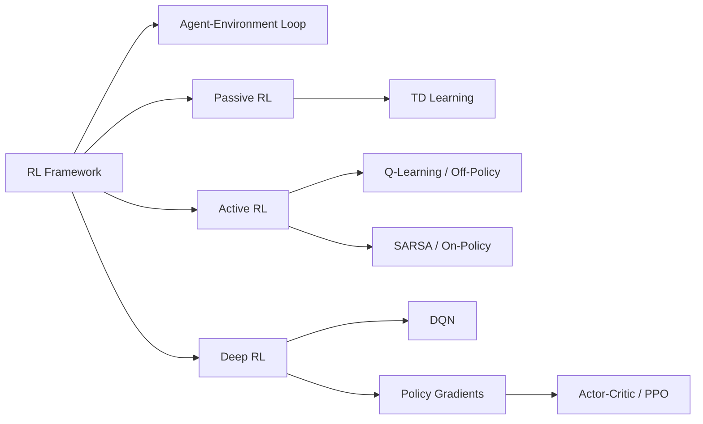

# Chapter 11: Reinforcement Learning

**Previous:** [Chapter 10: Probabilistic Reasoning Over Time](10-probabilistic-reasoning.md) | **Next:** [Chapter 12: Natural Language Processing](12-nlp.md)

## Learning Objectives

By the conclusion of this chapter, the student will be able to: (1) describe the reinforcement learning framework and its components; (2) implement model-based and model-free RL algorithms; (3) apply temporal-difference learning methods; (4) implement Q-learning and SARSA; (5) understand deep reinforcement learning architectures including DQN and policy gradients.

## Chapter at a Glance

| Section | Key Topics | Key Terms |
|---------|-----------|-----------|
| RL Framework | Agent, environment, reward, γ | Policy, value, action-value |
| Exploration vs Exploitation | ε-greedy, softmax, UCB | Exploration-exploitation dilemma |
| Passive RL | TD learning, bootstrapping | TD error, Monte Carlo |
| Active RL | Q-learning (off-policy), SARSA (on-policy) | Off/on-policy distinction |
| Function Approximation | Linear approx, DQN | Experience replay, target network |
| Policy Gradients | REINFORCE, policy gradient theorem | Direct policy optimization |
| Actor-Critic | A2C, PPO | Advantage function, clipped objective |

## Chapter Roadmap



## 11.1 The Reinforcement Learning Framework


Reinforcement Learning (RL) studies how an **agent** learns to make sequential decisions by interacting with an **environment**. At each discrete time step $t$, the agent observes state $S_t \in \mathcal{S}$, selects action $A_t \in \mathcal{A}$, receives reward $R_{t+1} \in \mathcal{R}$, and transitions to state $S_{t+1}$.

The agent's objective is to maximize the expected cumulative discounted reward:

$$G_t = \sum_{k=0}^\infty \gamma^k R_{t+k+1}$$

where $\gamma \in [0, 1]$ is the discount factor.

RL differs from supervised learning in several key respects: there is no instructional signal (only rewards); feedback is delayed; the agent influences the data distribution through its own actions; and the agent must balance exploration with exploitation.

### 11.1.1 Key Components

- **Policy** $\pi(a \mid s)$: The agent's behavior, mapping states to action probabilities.
- **Value function** $V_\pi(s) = \mathbb{E}_\pi[G_t \mid S_t = s]$: Expected return from state $s$ under policy $\pi$.
- **Action-value function** $Q_\pi(s, a) = \mathbb{E}_\pi[G_t \mid S_t = s, A_t = a]$: Expected return from taking action $a$ in state $s$ and following $\pi$ thereafter.
- **Model:** The agent's representation of the environment's transition and reward structure.

## 11.2 Exploration vs Exploitation

The exploration-exploitation dilemma: the agent must try unknown actions (exploration) to discover better returns while also selecting known good actions (exploitation) to maximize reward.

Standard exploration strategies:
- **$\epsilon$-greedy:** With probability $\epsilon$, choose a random action; otherwise, choose the greedy action.
- **Softmax (Boltzmann):** Select action $a$ with probability proportional to $\exp(Q(s, a) / \tau)$, where $\tau$ controls exploration temperature.
- **Upper Confidence Bound (UCB):** $A_t = \arg\max_a \left[ Q_t(a) + c \sqrt{\frac{\ln t}{N_t(a)}} \right]$

## 11.3 Passive Reinforcement Learning

In passive RL, the agent follows a fixed policy $\pi$ and learns the value function $V^\pi$.

**Temporal-Difference (TD) Learning** updates the value estimate toward the observed reward plus the discounted value of the next state:

$$V(S_t) \leftarrow V(S_t) + \alpha [R_{t+1} + \gamma V(S_{t+1}) - V(S_t)]$$

where $\alpha \in (0, 1]$ is the learning rate. TD learning combines the ideas of dynamic programming (bootstrapping) and Monte Carlo methods (sampling).

The TD error $\delta_t = R_{t+1} + \gamma V(S_{t+1}) - V(S_t)$ signals the discrepancy between the estimated and actual return.

## 11.4 Active Reinforcement Learning

Active RL agents must learn both the value function and which actions to take.

### 11.4.1 Q-Learning

Q-learning (Watkins, 1989) learns the optimal action-value function directly, without requiring a model of the environment:

$$Q(S_t, A_t) \leftarrow Q(S_t, A_t) + \alpha [R_{t+1} + \gamma \max_a Q(S_{t+1}, a) - Q(S_t, A_t)]$$

Q-learning is **off-policy**: it learns the optimal policy while following an exploratory policy (e.g., $\epsilon$-greedy).

```
function Q-LEARNING(env, γ, α, ε, episodes) returns Q
    Q(s, a) ← 0 for all s, a
    for each episode do
        s ← env.RESET()
        while not TERMINAL(s) do
            a ← ε-GREEDY(s, Q, ε)
            s', r ← env.STEP(a)
            Q(s, a) ← Q(s, a) + α[r + γ max_{a'} Q(s', a') - Q(s, a)]
            s ← s'
    return Q
```

**Convergence guarantee:** Q-learning converges to $Q^*$ with probability 1 if each state-action pair is visited infinitely often and $\alpha$ decreases appropriately.

### 11.4.2 SARSA

SARSA (State-Action-Reward-State-Action) is **on-policy**: it learns the value of the policy being followed:

$$Q(S_t, A_t) \leftarrow Q(S_t, A_t) + \alpha [R_{t+1} + \gamma Q(S_{t+1}, A_{t+1}) - Q(S_t, A_t)]$$

SARSA accounts for the exploration policy, making it more cautious in environments where exploration could lead to dangerous states.

## 11.5 Function Approximation in RL

Tabular RL becomes infeasible for large or continuous state spaces. **Function approximation** generalizes across states using a parameterized function $Q(s, a; \theta) \approx Q^*(s, a)$.

**Linear function approximation:** Represent the state-action value as a linear combination of features $\phi(s, a)$:

$$Q(s, a; \theta) = \theta^\top \phi(s, a)$$

Update: $\theta \leftarrow \theta + \alpha [R + \gamma \max_a Q(s', a'; \theta) - Q(s, a; \theta)] \nabla_\theta Q(s, a; \theta)$

## 11.6 Deep Q-Networks (DQN)

DQN (Mnih et al., 2015) uses a deep neural network to approximate $Q(s, a; \theta)$. Key innovations stabilize learning:

1. **Experience replay:** Store transitions $(s, a, r, s')$ in a replay buffer. Sample mini-batches uniformly to train the network, breaking temporal correlations.

2. **Target network:** Maintain a separate network $Q(s, a; \theta^-)$ for computing TD targets. Periodically copy $\theta$ to $\theta^-$ to reduce moving-target instability.

```
function DQN-TRAIN(env, buffer_size, batch_size, γ)
    initialize Q-network with random θ
    initialize target network θ⁻ ← θ
    initialize replay buffer D with capacity buffer_size
    for episode = 1 to MAX_EPISODES do
        s ← env.RESET()
        while not TERMINAL(s) do
            a ← ε-GREEDY(s, Q, ε)
            s', r ← env.STEP(a)
            store (s, a, r, s') in D
            if len(D) ≥ batch_size then
                sample batch B from D
                y_i = r_i + γ max_{a'} Q(s'_i, a'; θ⁻)
                minimize (y_i - Q(s_i, a_i; θ))² over batch B
            s ← s'
        every C episodes: θ⁻ ← θ
```

DQN achieved human-level performance on 49 Atari games using only pixel input and game score.

## 11.7 Policy Gradient Methods

Policy gradient methods directly optimize the policy $\pi_\theta(a \mid s)$ without learning a value function. The objective is to maximize expected return $J(\theta) = \mathbb{E}_{\pi_\theta}[G_0]$.

The **policy gradient theorem** provides the gradient:

$$\nabla_\theta J(\theta) = \mathbb{E}_{\pi_\theta} [\nabla_\theta \log \pi_\theta(a \mid s) \, Q^{\pi_\theta}(s, a)]$$

**REINFORCE** (Williams, 1992) uses Monte Carlo returns:

$$\nabla_\theta J(\theta) \approx \frac{1}{N} \sum_{i=1}^N \sum_{t=0}^{T_i} \nabla_\theta \log \pi_\theta(a_{i,t} \mid s_{i,t}) \, G_{i,t}$$

## 11.8 Actor-Critic Methods

Actor-critic methods combine value-based and policy-based approaches:
- **Actor:** The policy $\pi_\theta(a \mid s)$, updated via policy gradient.
- **Critic:** The value function $V_\phi(s)$, updated via TD learning, reducing variance in the gradient estimate.

**Advantage Actor-Critic (A2C)** uses the advantage function $A(s, a) = Q(s, a) - V(s)$ to reduce variance further.

**Proximal Policy Optimization (PPO)** (Schulman et al., 2017) clips policy updates to prevent destructively large policy changes:

$$L^{\text{CLIP}}(\theta) = \mathbb{E}_t \left[ \min(r_t(\theta) \hat{A}_t, \text{clip}(r_t(\theta), 1-\epsilon, 1+\epsilon) \hat{A}_t) \right]$$

where $r_t(\theta) = \pi_\theta(a_t \mid s_t) / \pi_{\theta_{\text{old}}}(a_t \mid s_t)$.

> **💡 Pro Tip:** Q-learning's off-policy nature makes it more sample-efficient than SARSA in deterministic environments, but SARSA's on-policy updates make it safer in risky environments — SARSA learns to avoid dangerous states that exploration might encounter.

## Concept Comparison

| Algorithm | Type | On/Off Policy | Model? | Guarantee | Best For |
|-----------|:---:|:---:|:---:|:---:|---------|
| TD Learning | Value-based | Both | Free | Converges | Passive learning |
| Q-Learning | Value-based | Off-policy | Free | Converges to Q* | Optimal exploration |
| SARSA | Value-based | On-policy | Free | Converges | Cautious behavior |
| DQN | Value-based | Off-policy | Free | Stable | High-dim states |
| REINFORCE | Policy-based | On-policy | Free | Local optimum | Continuous actions |
| PPO | Actor-Critic | On-policy | Free | Stable | Complex control |

## Quick Reference — RL Algorithms

| Algorithm | Update Rule | Key Feature |
|-----------|-------------|-------------|
| TD(0) | V(s) ← V(s) + α[r + γV(s') - V(s)] | Bootstrap from estimate |
| Q-Learning | Q(s,a) ← Q(s,a) + α[r + γ max Q(s',a') - Q(s,a)] | Max over next actions |
| SARSA | Q(s,a) ← Q(s,a) + α[r + γ Q(s',a') - Q(s,a)] | Uses actual next action |
| DQN | Minimize (r + γ max Q(s',a';θ⁻) - Q(s,a;θ))² | Experience replay + target net |
| PPO | Clipped surrogate objective | Constrained policy updates |

## Cross-Application Matrix

| Technique | ML | CV | NLP | Research |
|-----------|:---:|:---:|:---:|:---:|
| Q-Learning | ⬜ | ⬜ | ⬜ | ✅ |
| DQN | ⬜ | ✅ | ⬜ | ✅ |
| Policy Gradients | ⬜ | ⬜ | ✅ | ✅ |
| PPO | ⬜ | ⬜ | ✅ | ✅ |
| Exploration Strategies | ✅ | ✅ | ✅ | ✅ |

## Chapter Quiz

**Q1:** What distinguishes on-policy from off-policy RL?
- A) On-policy learns from the current policy's actions; off-policy learns from any policy's data
- B) On-policy is faster; off-policy is slower
- C) On-policy uses neural networks; off-policy uses tables
- D) There is no practical difference

<details><summary>Answer</summary>A) On-policy (SARSA) learns the value of the policy being followed; off-policy (Q-learning) learns the optimal policy independent of the exploration policy.</details>

**Q2:** DQN's experience replay helps because it:
- A) Reduces memory usage
- B) Breaks temporal correlations in training data by sampling random mini-batches
- C) Speeds up computation through GPU batching
- D) Eliminates the need for a target network

<details><summary>Answer</summary>B) Experience replay randomizes over transitions, breaking the temporal correlations that would otherwise cause instability in DQN training.</details>

**Q3:** The policy gradient theorem provides:
- A) The optimal policy directly
- B) The gradient of expected return with respect to policy parameters
- C) The value function for any policy
- D) The convergence rate of Q-learning

<details><summary>Answer</summary>B) The policy gradient theorem gives ∇J(θ) = 𝔼[∇log π(a|s) Q^π(s,a)], enabling gradient-based optimization of policy parameters.</details>

## 11.9 Summary

Reinforcement learning enables agents to learn optimal behavior through interaction. Model-free methods (Q-learning, SARSA) learn value functions without environment models. Deep RL scales these algorithms to high-dimensional state spaces. Policy gradient and actor-critic methods handle continuous action spaces and stochastic policies.

## Exercises

### Review Questions

1. Distinguish on-policy and off-policy learning. When is each preferred?
2. Explain the role of experience replay in DQN. Why does it improve stability?
3. Compare value-based and policy-based RL methods. What are the advantages of each?

### Application Problems

4. Implement Q-learning for the FrozenLake environment (4x4 grid). Report the learned policy and convergence rate with $\epsilon$-greedy exploration at $\epsilon = 0.1, 0.3, 0.5$.
5. Implement a linear function approximator for the MountainCar continuous state problem. Compare with tabular Q-learning after discretizing the state space.

### Challenge Problem

6. Implement DQN for the CartPole environment. Tune the replay buffer size, target network update frequency, and learning rate. Produce learning curves showing average episode return over 500 episodes.
