# Chapter 12: Natural Language Processing

**Previous:** [Chapter 11: Reinforcement Learning](11-reinforcement-learning.md) | **Next:** [Chapter 13: Computer Vision](13-computer-vision.md)

## Learning Objectives

By the conclusion of this chapter, the student will be able to: (1) define language models and evaluate them using perplexity; (2) implement n-gram models with smoothing; (3) apply HMMs and CRFs for sequence labeling; (4) implement the CKY algorithm for parsing; (5) use modern NLP toolkits for standard tasks; (6) explain tokenization, stemming, lemmatization, and POS tagging with working code; (7) implement named entity recognition and dependency parsing; (8) understand word embeddings (Word2Vec, GloVe, FastText, BERT); (9) explain the Transformer architecture, attention mechanism, and GPT/BERT differences; (10) apply NLP to real-world systems like chatbots, search, and translation.

## Why NLP Matters

**Analogy:** Teaching a computer to understand language is like teaching a child to read. A child first learns letters (characters), then words (tokens), then grammar (syntax), then meaning (semantics), then reading between the lines (pragmatics). Similarly, NLP pipelines progress from raw text through tokenization, parsing, semantic analysis, and discourse processing — each layer building on the previous one.

Every day, humanity generates 2.5 quintillion bytes of data — most of it unstructured text. NLP is the bridge between this raw text and actionable intelligence. Without NLP, Google Search cannot find relevant pages, Siri cannot answer questions, ChatGPT cannot generate responses, and spam filters cannot block phishing emails. NLP powers search engines, machine translation, sentiment analysis, chatbots, voice assistants, and information extraction systems that process billions of queries daily.

## Chapter at a Glance

| Section | Key Topics | Key Terms |
|---------|-----------|-----------|
| Language Models | N-gram, smoothing, perplexity | Chain rule, Kneser-Ney |
| Text Classification | Naive Bayes, logistic regression | Bag-of-words, features |
| Tokenization | Word, subword, character, SentencePiece | BPE, Unigram LM, vocab |
| Stemming & Lemmatization | Porter, Lancaster, WordNet | Morpheme, inflection |
| POS Tagging | HMM, Viterbi, CRF | Tagset, label bias |
| NER | Named entities, sequence labeling | Person/Org/Location |
| Parsing | CFG, CNF, CKY, PCFG, dependency | Parse tree, constituency |
| Word Embeddings | Word2Vec, GloVe, FastText, BERT | Vector space, similarity |
| Transformers | Self-attention, multi-head, BERT, GPT | Attention, pre-training |
| Lexical Semantics | WordNet, WSD | Synset, hypernymy |
| Discourse | Coherence, discourse relations | PDTB |
| Toolkits | NLTK, spaCy, HuggingFace | Pre-trained models |

## Chapter Roadmap

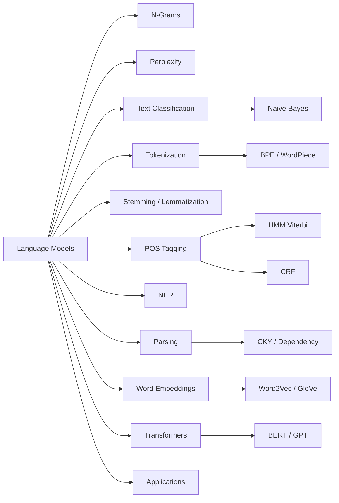
```mermaid
flowchart LR
    A[Language Models] --> B[N-Grams]
    A --> C[Perplexity]
    A --> D[Text Classification]
    D --> E[Naive Bayes]
    A --> F[Tokenization]
    F --> G[BPE / WordPiece]
    A --> H[Stemming / Lemmatization]
    A --> I[POS Tagging]
    I --> J[HMM Viterbi]
    I --> K[CRF]
    A --> L[NER]
    A --> M[Parsing]
    M --> N[CKY / Dependency]
    A --> O[Word Embeddings]
    O --> P[Word2Vec / GloVe]
    A --> Q[Transformers]
    Q --> R[BERT / GPT]
    A --> S[Applications]
```

## 12.1 Language Models


A **language model** assigns a probability P(w1, w2, ..., wn) to a sequence of words. By the chain rule:

P(w_{1:n}) = \prod_{i=1}^n P(w_i | w_{1:i-1})

### 12.1.1 N-Gram Models

<a href="../../assets/images/diagrams/artificial-intelligence/12-nlp/12-1-1-n-gram-models-handwritten.svg" target="_blank" rel="noopener">
  
</a>
<a href="../../assets/images/diagrams/artificial-intelligence/12-nlp/12-1-1-n-gram-models-diagram.svg" target="_blank" rel="noopener">
  
</a>
<a href="../../assets/images/diagrams/artificial-intelligence/12-nlp/12-1-1-n-gram-models-sticky.svg" target="_blank" rel="noopener">
  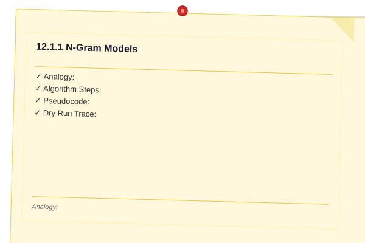
</a>


**Analogy:** If you hear "I ordered a pepperoni ___," you predict "pizza" because in your experience, "pepperoni" is almost always followed by "pizza." N-gram models capture exactly this — which word follows which previous words.

N-gram models approximate P(wi | w1:i-1) by conditioning only on the preceding n-1 words:

P(wi | w_{i-n+1:i-1}) = Count(w_{i-n+1:i}) / Count(w_{i-n+1:i-1})

Maximum likelihood estimation computes counts from a training corpus. Unseen n-grams receive zero probability, which is undesirable.

**Algorithm Steps:**
1. Collect a training corpus of text.
2. Count all n-gram occurrences (contiguous sequences of n words).
3. For each (n-1)-gram prefix, compute conditional probability by dividing the n-gram count by the prefix count.
4. Apply smoothing to assign non-zero probability to unseen n-grams.
5. To generate text, sample from the conditional distribution at each step.
6. Evaluate model quality using perplexity on held-out test data.

**Pseudocode:**
```
function TRAIN-NGRAM(corpus, n):
    counts = empty dictionary
    for i = 1 to len(corpus) - n + 1:
        gram = corpus[i : i+n]
        prefix = corpus[i : i+n-1]
        counts[gram] += 1
        counts[prefix] += 1
    return counts

function PROBABILITY(gram, counts, n, V):
    prefix = gram[1 : n-1]
    numerator = counts[gram] + 1             // add-1 smoothing
    denominator = counts[prefix] + V
    return numerator / denominator
```

**Dry Run Trace:**
Corpus: "the cat sat the cat ran" (6 tokens)
| Step | N-gram | Count(prefix) | Count(gram) | P(gram | prefix) |
|------|--------|---------------|-------------|-------------------|
| 1 | "the cat" | 2 (the) | 2 | 2/2 = 1.0 |
| 2 | "cat sat" | 2 (cat) | 1 | 1/2 = 0.5 |
| 3 | "sat the" | 1 (sat) | 1 | 1/1 = 1.0 |
| 4 | "cat ran" | 2 (cat) | 1 | 1/2 = 0.5 |
| 5 | "the dog" (unseen) | 2 (the) | 0 | 0/2 = 0.0 (before smoothing) |
| 6 | "the dog" (after add-1) | 2 + V | 0 + 1 | 1/(2+V) with V=4: 1/6 ≈ 0.17 |

**Python Implementation:**
```python
from collections import defaultdict
import math

class NGramLanguageModel:
    def __init__(self, n=2):
        self.n = n
        self.counts = defaultdict(int)
        self.vocab = set()

    def train(self, corpus):
        tokens = corpus.split()
        self.vocab = set(tokens)
        V = len(self.vocab)
        for i in range(len(tokens) - self.n + 1):
            gram = tuple(tokens[i:i+self.n])
            prefix = tuple(tokens[i:i+self.n-1])
            self.counts[gram] += 1
            self.counts[prefix] += 1

    def probability(self, gram):
        V = len(self.vocab)
        prefix = gram[:-1]
        num = self.counts[gram] + 1
        den = self.counts[prefix] + V
        return num / den

    def perplexity(self, test_corpus):
        tokens = test_corpus.split()
        log_prob = 0.0
        N = len(tokens) - self.n + 1
        for i in range(N):
            gram = tuple(tokens[i:i+self.n])
            log_prob += math.log2(self.probability(gram))
        return 2 ** (-log_prob / N)

lm = NGramLanguageModel(n=2)
lm.train("the cat sat the cat ran the dog sat")
print("P(the|cat):", lm.probability(("cat", "the")))
print("P(ran|cat):", lm.probability(("cat", "ran")))
print("Perplexity:", lm.perplexity("the cat ran"))
```

**Complexity:** Training O(T) where T is corpus size. Inference O(1) per query via hash table lookup. Storage O(V^n) in worst case — a trigram model with 50K vocabulary would need 125 trillion entries (impossible in practice), which is why n > 5 is never used. **Why:** Larger n captures more context but suffers from data sparsity — most possible n-grams never appear in any finite corpus, no matter how large.

**Smoothing Techniques:**
| Method | Description | Pros | Cons |
|--------|-------------|------|------|
| Laplace (add-1) | Add 1 to all counts | Simple | Severely over-estimates low-probability events |
| Kneser-Ney | Discount seen counts, interpolate with lower-order | State-of-the-art for n-grams | Complex implementation |
| Stupid backoff | Use lower-order model for unseen | Efficient, scales to Web | Not a true probability distribution |
| Good-Turing | Adjust counts based on frequency of frequencies | Theoretically grounded | Less effective for large vocabularies |

**Advantages vs Disadvantages:**

| Advantages | Disadvantages |
|------------|---------------|
| Simple to implement and understand | Cannot capture long-range dependencies beyond n-1 |
| Fast training and inference | Data sparsity at higher n |
| Interpretable probabilities | No notion of word similarity ("dog" and "cat" treated independently) |
| Good for small, domain-specific corpora | Exponential growth of parameters with n |

**Edge Cases:** OOV words receive zero unsmoothed probability; out-of-domain text produces poor perplexity; compound words in German cause sparsity; numbers and punctuation create artificial sparsity; sentence boundaries require special start/end tokens.

### 12.1.2 Perplexity

<a href="../../assets/images/diagrams/artificial-intelligence/12-nlp/12-1-2-perplexity-handwritten.svg" target="_blank" rel="noopener">
  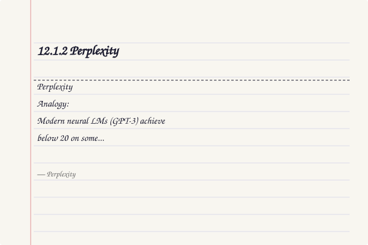
</a>
<a href="../../assets/images/diagrams/artificial-intelligence/12-nlp/12-1-2-perplexity-diagram.svg" target="_blank" rel="noopener">
  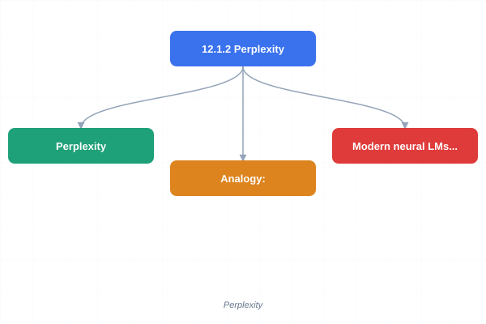
</a>
<a href="../../assets/images/diagrams/artificial-intelligence/12-nlp/12-1-2-perplexity-sticky.svg" target="_blank" rel="noopener">
  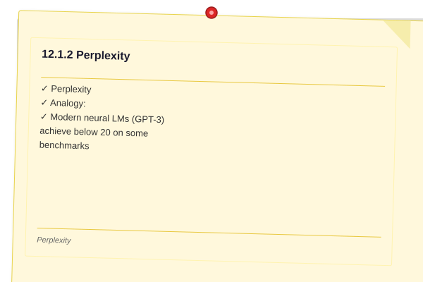
</a>


**Perplexity** measures how "surprised" the model is by test data — lower = better.

Perplexity(w_{1:n}) = P(w_{1:n})^{-1/n} = pow(prod_{i=1}^n 1/P(wi | w_{1:i-1}), 1/n)

Human text perplexity typically ranges 50–1000. Modern neural LMs (GPT-3) achieve below 20 on some benchmarks. A model assigning uniform random probability over V words would have perplexity = V (useless baseline).

## 12.2 Text Classification

**Analogy:** Text classification is like a mail carrier sorting envelopes — is this a bill, a personal letter, or junk mail? The system learns patterns (words like "invoice", "dear", "free money") that distinguish categories.

Text classification assigns a document to one or more predefined categories.

### 12.2.1 Naive Bayes Classifier

<a href="../../assets/images/diagrams/artificial-intelligence/12-nlp/12-2-1-naive-bayes-classifier-handwritten.svg" target="_blank" rel="noopener">
  
</a>
<a href="../../assets/images/diagrams/artificial-intelligence/12-nlp/12-2-1-naive-bayes-classifier-diagram.svg" target="_blank" rel="noopener">
  
</a>
<a href="../../assets/images/diagrams/artificial-intelligence/12-nlp/12-2-1-naive-bayes-classifier-sticky.svg" target="_blank" rel="noopener">
  
</a>


**Algorithm Steps:**
1. Compute prior P(c) for each class: count(docs with label c) / total_docs.
2. For each class c, compute P(w|c) = (count(w in c) + 1) / (total words in c + V) — Laplace smoothing.
3. For a new document d with words w1...wn, compute score(c) = log P(c) + sum log P(wi|c).
4. Return the class with maximum score.

**Pseudocode:**
```
function TRAIN-NAIVE-BAYES(docs, labels):
    classes = unique(labels)
    for each class c:
        prior[c] = count(docs with label c) / len(docs)
    for each class c:
        concat all docs in c
        for each word w in vocab:
            P(w|c) = (count(w in c) + 1) / (total_words_in_c + V)
    return prior, P(w|c)

function CLASSIFY(doc, prior, P_w_given_c, classes):
    scores = {}
    for each class c:
        scores[c] = log(prior[c])
        for each word w in doc:
            scores[c] += log(P(w|c))
    return argmax_c scores[c]
```

**Dry Run Trace:**
Training: "good movie" (pos), "bad film" (neg), "great acting" (pos), "terrible plot" (neg)
Test: "good film"
| Step | Class | Prior | log(prior) | P(good|c) | log P(good) | P(film|c) | log P(film) | Total |
|------|-------|-------|------------|-----------|-------------|-----------|-------------|-------|
| 0 | pos | 0.5 | -0.301 | — | — | — | — | -0.301 |
| 1 | pos | — | — | (1+1)/(4+8)=0.167 | -0.778 | (0+1)/(4+8)=0.083 | -1.079 | -2.158 |
| 2 | neg | 0.5 | -0.301 | — | — | — | — | -0.301 |
| 3 | neg | — | — | (0+1)/(4+8)=0.083 | -1.079 | (1+1)/(4+8)=0.167 | -0.778 | -2.158 |

Tie (both -2.158) — symmetrical case; in practice, more data breaks ties.

**Python Implementation:**
```python
from collections import defaultdict
import math

class NaiveBayesClassifier:
    def __init__(self):
        self.priors = {}
        self.word_probs = defaultdict(lambda: defaultdict(float))
        self.classes = []
        self.vocab = set()

    def train(self, docs, labels):
        self.classes = list(set(labels))
        total_docs = len(docs)
        class_word_counts = defaultdict(lambda: defaultdict(int))
        class_total_words = defaultdict(int)

        for doc, label in zip(docs, labels):
            words = doc.lower().split()
            for w in words:
                self.vocab.add(w)
                class_word_counts[label][w] += 1
                class_total_words[label] += 1
            self.priors[label] = self.priors.get(label, 0) + 1

        V = len(self.vocab)
        for c in self.classes:
            self.priors[c] /= total_docs
            for w in self.vocab:
                self.word_probs[c][w] = (class_word_counts[c][w] + 1) / (class_total_words[c] + V)

    def predict(self, doc):
        scores = {}
        words = doc.lower().split()
        for c in self.classes:
            scores[c] = math.log(self.priors[c]) if self.priors[c] > 0 else float('-inf')
            for w in words:
                p = self.word_probs[c].get(w, 1 / (len(self.vocab) + 1))
                scores[c] += math.log(p)
        return max(scores, key=scores.get)

nb = NaiveBayesClassifier()
nb.train(
    ["good movie", "bad film", "great acting", "terrible plot"],
    ["pos", "neg", "pos", "neg"]
)
print("Prediction:", nb.predict("amazing movie"))
print("Prediction:", nb.predict("awful film"))
```

**Complexity:** Training O(D × L) where D = docs, L = avg doc length. Inference O(C × L) where C = classes. **Why:** Pre-computed probabilities make prediction a simple sum of log-likelihoods.

**Advantages vs Disadvantages:**

| Advantages | Disadvantages |
|------------|---------------|
| Fast to train and predict | Independence assumption is unrealistic |
| Works well with small data (100s of docs) | Cannot capture negation ("not good" ≈ "bad") |
| Incrementally updatable | Sensitive to feature distribution shifts |
| Handles many features (100K+ words) | Zero probabilities require smoothing |

**Edge Cases:** Empty documents (return prior); out-of-vocabulary words (ignored with smoothing); severe class imbalance (priors dominate); multi-label classification requires one-vs-rest adaptation.

### 12.2.2 Logistic Regression

<a href="../../assets/images/diagrams/artificial-intelligence/12-nlp/12-2-2-logistic-regression-handwritten.svg" target="_blank" rel="noopener">
  
</a>
<a href="../../assets/images/diagrams/artificial-intelligence/12-nlp/12-2-2-logistic-regression-diagram.svg" target="_blank" rel="noopener">
  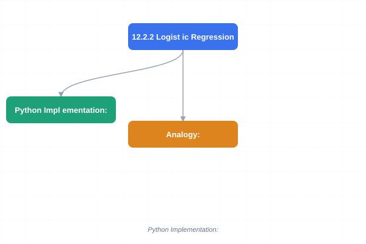
</a>
<a href="../../assets/images/diagrams/artificial-intelligence/12-nlp/12-2-2-logistic-regression-sticky.svg" target="_blank" rel="noopener">
  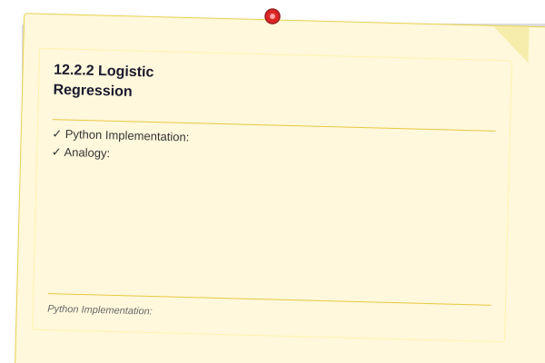
</a>


Logistic regression learns weights θ for feature vector φ(d):

P(c | d) = exp(θc^T φ(d)) / sum_{c'} exp(θ_{c'}^T φ(d))

Unlike Naive Bayes, logistic regression makes no independence assumptions and automatically learns feature correlations. However, it requires more data and gradient-based training.

**Python Implementation:**
```python
from sklearn.feature_extraction.text import CountVectorizer
from sklearn.linear_model import LogisticRegression
from sklearn.pipeline import Pipeline

docs = ["good movie", "bad film", "great acting", "terrible plot", "awesome", "boring"]
labels = ["pos", "neg", "pos", "neg", "pos", "neg"]

pipeline = Pipeline([
    ("vect", CountVectorizer()),
    ("clf", LogisticRegression(max_iter=1000))
])

pipeline.fit(docs, labels)
print(pipeline.predict(["fantastic movie"]))
print(pipeline.predict(["boring film"]))
```

## 12.3 Tokenization

**Analogy:** Breaking a sentence into tokens is like a chef chopping vegetables — each piece must be the right size for the recipe. Too big (whole sentence) and the model cannot see patterns. Too small (individual characters) and word-level meaning is lost. The right granularity (words or subwords) depends on the dish.

Tokenization is the process of splitting text into smaller units called tokens (words, subwords, or characters).

### 12.3.1 Word Tokenization

<a href="../../assets/images/diagrams/artificial-intelligence/12-nlp/12-3-1-word-tokenization-handwritten.svg" target="_blank" rel="noopener">
  
</a>
<a href="../../assets/images/diagrams/artificial-intelligence/12-nlp/12-3-1-word-tokenization-diagram.svg" target="_blank" rel="noopener">
  
</a>
<a href="../../assets/images/diagrams/artificial-intelligence/12-nlp/12-3-1-word-tokenization-sticky.svg" target="_blank" rel="noopener">
  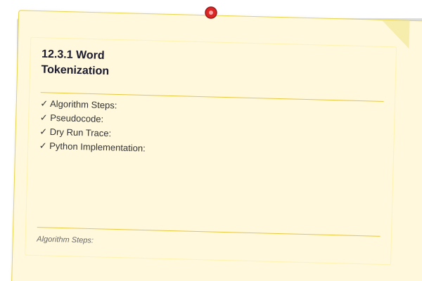
</a>


**Algorithm Steps:**
1. Split text on whitespace into preliminary tokens.
2. Separate punctuation from adjacent words (split "hello!" → "hello", "!").
3. Handle contractions ("don't" → "do", "n't") using language-specific rules.
4. Handle special tokens: URLs, emails, hashtags, numbers, emoji.
5. Return the list of token strings.

**Pseudocode:**
```
function WORD-TOKENIZE(text):
    tokens = []
    word = ""
    for char in text:
        if char is alphanumeric or char == "'" or char == "-":
            word += char
        else:
            if word != "":
                tokens.append(word)
                word = ""
            if not (char == " " or char == "\t" or char == "\n"):
                tokens.append(char)
    if word != "":
        tokens.append(word)
    return tokens
```

**Dry Run Trace:**
Input: "I don't like pizza!"
| Step | Char | Current Word | Action | Tokens |
|------|------|-------------|--------|--------|
| 0 | — | "" | Start | [] |
| 1 | 'I' | "I" | Append char | [] |
| 2 | ' ' | "" | Emit "I" | ["I"] |
| 3 | 'd' | "d" | Append char | ["I"] |
| 4 | 'o' | "do" | Append char | ["I"] |
| 5 | "n" | "don" | Append char | ["I"] |
| 6 | "'" | "don'" | Append char | ["I"] |
| 7 | 't' | "don't" | Append char | ["I"] |
| 8 | ' ' | "" | Emit "don't" | ["I", "don't"] |
| 9 | 'l' → 'i' → 'k' → 'e' | "like" | Append chars | ["I", "don't"] |
| 10 | ' ' | "" | Emit "like" | ["I", "don't", "like"] |
| 11 | 'p' → 'i' → 'z' → 'z' → 'a' | "pizza" | Append chars | ["I", "don't", "like"] |
| 12 | '!' | "" | Emit "pizza", append "!" | ["I", "don't", "like", "pizza", "!"] |

**Python Implementation:**
```python
import re
import nltk
import spacy

nltk.download("punkt_tab", quiet=True)
nlp = spacy.load("en_core_web_sm", disable=["tagger", "parser", "ner", "lemmatizer"])

text = "I don't like pizza! Visit https://example.com #NLP"

# NLTK word tokenization
nltk_tokens = nltk.word_tokenize(text)
print("NLTK tokens:", nltk_tokens)

# spaCy tokenization
doc = nlp(text)
spacy_tokens = [token.text for token in doc]
print("spaCy tokens:", spacy_tokens)

# Regex word tokenization (simple)
regex_tokens = re.findall(r"\b\w+\b|[^\w\s]", text)
print("Regex tokens:", regex_tokens)

# Character tokenization
char_tokens = list(text)
print("Char tokens (first 15):", char_tokens[:15])
```

**Complexity:** O(N) where N = input length. **Why:** Each character is visited exactly once. Tokenization is the cheapest NLP operation.

| Advantages | Disadvantages |
|------------|---------------|
| Simple and fast | OOV words break downstream models |
| Preserves word boundaries | Large vocabulary (50K-500K) |
| Intuitive for humans | "New York" should be one token but split |
| — | "can't" and "cannot" produce different token sets |

**Edge Cases:** URLs (www.example.com), emoji sequences, hashtags (#NLP), at-mentions (@user), multi-word entities ("New York"), languages without spaces (Chinese, Japanese, Thai), mixed-script text, numbers with commas (1,234,567).

### 12.3.2 Subword Tokenization (BPE)

<a href="../../assets/images/diagrams/artificial-intelligence/12-nlp/12-3-2-subword-tokenization-bpe-handwritten.svg" target="_blank" rel="noopener">
  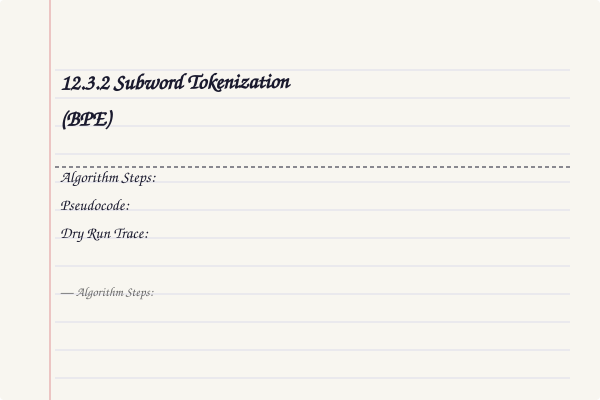
</a>
<a href="../../assets/images/diagrams/artificial-intelligence/12-nlp/12-3-2-subword-tokenization-bpe-diagram.svg" target="_blank" rel="noopener">
  
</a>
<a href="../../assets/images/diagrams/artificial-intelligence/12-nlp/12-3-2-subword-tokenization-bpe-sticky.svg" target="_blank" rel="noopener">
  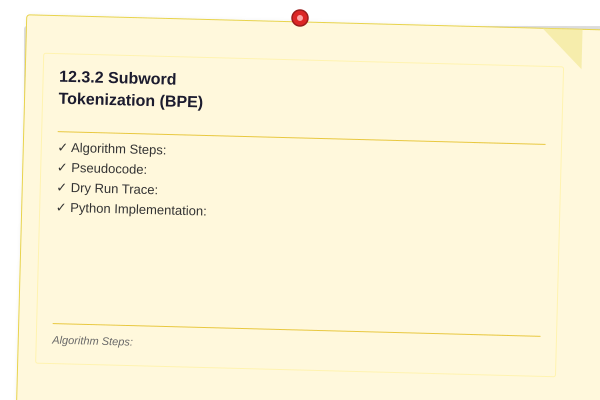
</a>


Byte-Pair Encoding (BPE) merges the most frequent character pairs iteratively. Used by GPT, BERT, RoBERTa.

**Algorithm Steps:**
1. Initialize vocabulary with all individual characters in the corpus.
2. Count all adjacent character/subword pairs across the corpus.
3. Merge the most frequent pair into a new subword token.
4. Add the new token to the vocabulary.
5. Repeat steps 2-4 until target vocabulary size (e.g., 50K).
6. To tokenize new text, apply learned merges greedily (longest match first).

**Pseudocode:**
```
function LEARN-BPE(corpus, num_merges):
    vocab = all unique characters in corpus
    splits = {word: list of characters for each word in corpus}
    merges = []
    for step in 1 to num_merges:
        pairs = count all adjacent token pairs in all word splits
        best = most frequent pair
        merges.append(best)
        for each word split:
            replace adjacent best pair with merged symbol
    return merges

function APPLY-BPE(word, merges):
    tokens = list of characters in word
    for each merge in merges:
        for i = 0 to len(tokens)-1:
            if tokens[i] == merge[0] and tokens[i+1] == merge[1]:
                tokens[i] = merge[0] + merge[1]
                delete tokens[i+1]
                restart loop
    return tokens
```

**Dry Run Trace:**
Corpus: "low lower lowest" (token counts: low=1, lower=1, lowest=1)
Initial vocab: l, o, w, e, r, s, t
| Merge | Pair | Count | Merged | New Vocab Entry |
|-------|------|-------|--------|-----------------|
| 1 | (l,o) | 3 | "lo" | lo |
| 2 | (lo,w) | 3 | "low" | low |
| 3 | (e,r) | 1 | "er" | er |
| 4 | (low,er) | 1 | "lower" | lower |
| 5 | (e,s) | 1 | "es" | es |
| 6 | (low,es) | 1 | "lowes" | lowes |
| 7 | (lowes,t) | 1 | "lowest" | lowest |

After merges: "lowest" = ["low", "es", "t"] if we stop after merge 5 (vocab = 13). BPE learns that "low" is a useful shared unit across all three words.

**Python Implementation:**
```python
from collections import defaultdict

class BPE:
    def __init__(self, vocab_size=50):
        self.vocab_size = vocab_size
        self.merges = {}

    def train(self, corpus):
        word_freqs = defaultdict(int)
        for line in corpus.lower().split():
            word = " ".join(list(line)) + " </w>"
            word_freqs[word] += 1

        for i in range(self.vocab_size - 256):
            pairs = defaultdict(int)
            for word, freq in word_freqs.items():
                symbols = word.split()
                for j in range(len(symbols) - 1):
                    pairs[(symbols[j], symbols[j+1])] += freq
            if not pairs:
                break
            best = max(pairs, key=pairs.get)
            self.merges[best] = i
            new_word_freqs = defaultdict(int)
            for word, freq in word_freqs.items():
                new_word = word.replace(" ".join(best), "".join(best))
                new_word_freqs[new_word] = freq
            word_freqs = new_word_freqs

    def tokenize(self, text):
        words = text.lower().split()
        result = []
        for word in words:
            word = " ".join(list(word)) + " </w>"
            while True:
                pairs = defaultdict(int)
                symbols = word.split()
                for j in range(len(symbols) - 1):
                    pairs[(symbols[j], symbols[j+1])] += 1
                candidates = [(p, self.merges.get(p, float('inf'))) for p in pairs]
                candidates.sort(key=lambda x: x[1])
                if not candidates or candidates[0][1] == float('inf'):
                    break
                best = candidates[0][0]
                word = word.replace(" ".join(best), "".join(best))
            result.extend(word.split())
        return result

bpe = BPE(vocab_size=30)
bpe.train("low lower lowest low low low")
print(bpe.tokenize("lowest"))
print(bpe.tokenize("lowering"))  # OOV!
```

**Complexity:** Training O(M × T) where M = merges, T = corpus tokens. Encoding O(L) per word with merge lookup. **Why:** Merge order is pre-computed; encoding greedily applies merges in a single pass.

| Advantages | Disadvantages |
|------------|---------------|
| Handles OOV words (breaks into known subwords) | Merges are irreversible decisions |
| Works across languages | Fixed vocabulary after training |
| Compact representation (vs. characters) | May create non-morphological splits |
| Used by GPT-4, BERT, LLaMA | — |

**Edge Cases:** Rare Unicode glyphs (Chinese characters, emoji); numbers tokenize awkwardly (123 → "1", "2", "3"); code-switching between languages; whitespace-sensitive languages.

## 12.4 Stemming and Lemmatization

**Analogy:** Stemming is like a butcher cutting meat — rough, fast, loses detail. Lemmatization is like a surgeon making precise cuts — slower but preserves essential structure.

Stemming chops off affixes heuristically; lemmatization uses vocabulary and morphological analysis to return the base dictionary form.

### 12.4.1 Porter Stemmer

<a href="../../assets/images/diagrams/artificial-intelligence/12-nlp/12-4-1-porter-stemmer-handwritten.svg" target="_blank" rel="noopener">
  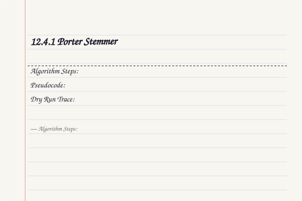
</a>
<a href="../../assets/images/diagrams/artificial-intelligence/12-nlp/12-4-1-porter-stemmer-diagram.svg" target="_blank" rel="noopener">
  
</a>
<a href="../../assets/images/diagrams/artificial-intelligence/12-nlp/12-4-1-porter-stemmer-sticky.svg" target="_blank" rel="noopener">
  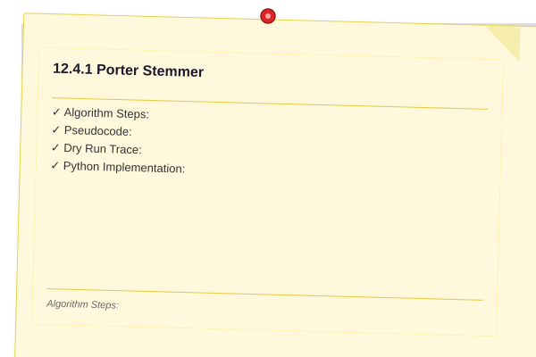
</a>


**Algorithm Steps:**
1. Remove plural suffixes (-sses → -ss, -ies → -i, -s → remove if short).
2. Remove -ed, -ing, -ly with vowel-consonant (VC) checks.
3. Remove derivational suffixes (-al, -ance, -ence, -er, -ic, -able, -tion).
4. Handle special cases (double consonants, -ization → -ize, -fulness → -ful).
5. Clean final -e, -l, -al, -tion endings.

**Pseudocode:**
```
function PORTER-STEM(word):
    // Step 1a: Plurals and past participles
    if word ends with "sses": word = word[0:-4] + "ss"
    elif word ends with "ies" and len(word) > 4: word = word[0:-3] + "i"
    elif word ends with "ss": word = word  // unchanged
    elif word ends with "s": word = word[0:-1]

    // Step 1b: -ed, -ing
    if word ends with "eed": word = word[0:-3] + "ee" if measure > 0
    elif word ends with "ed" and word[0:-2] has VC:
        word = word[0:-2]; handle double consonant/special endings
    elif word ends with "ing" and word[0:-3] has VC:
        word = word[0:-3]; handle double consonant/special endings

    // Further steps omitted for brevity
    return word
```

**Dry Run Trace:**
Input: "processing"
| Step | Rule Applied | Result | Condition |
|------|-------------|--------|-----------|
| 0 | — | processing | Start |
| 1a | Not ending in sses/ies/ss/s | processing | — |
| 1b | Ends in "ing"? Check VC in "process" | has VC? yes | process |
| 1b2 | process ends in "ss"? No special handling | process | — |
| 2 | Replace "ss" with nothing? No suffix match | process | — |
| Final | — | process | — |

Input: "happiness"
| Step | Rule Applied | Result | Condition |
|------|-------------|--------|-----------|
| 0 | — | happiness | Start |
| 1a | Ends in "s" and not "ss"? Remove | happines | length check |
| 2 | Replace "ness" with nothing if measure>0 | happi | measure(happi)=2 > 0 |
| 3 | Replace "i" with "y" | happy | — |
| Final | — | happy | — |

**Python Implementation:**
```python
import nltk
from nltk.stem import PorterStemmer, LancasterStemmer, WordNetLemmatizer, SnowballStemmer

nltk.download("wordnet", quiet=True)
nltk.download("omw-1.4", quiet=True)

porter = PorterStemmer()
lancaster = LancasterStemmer()
snowball = SnowballStemmer("english")
lemmatizer = WordNetLemmatizer()

words = ["running", "runner", "ran", "easily", "fairness", "studies", "better", "ate", "corpora"]
print(f"{'Word':12s} {'Porter':12s} {'Lancaster':12s} {'Snowball':12s} {'Lemma(v)':12s}")
print("-"*60)
for w in words:
    p = porter.stem(w)
    l = lancaster.stem(w)
    s = snowball.stem(w)
    m = lemmatizer.lemmatize(w, pos="v")
    print(f"{w:12s} {p:12s} {l:12s} {s:12s} {m:12s}")
```

**Complexity:** O(L) per word where L = word length. **Why:** Each suffix check is O(1) pattern matching; at most 5-6 sequential passes through the word. Porter runs in microseconds per word.

| Aspect | Stemming | Lemmatization |
|--------|----------|---------------|
| Speed | Fast (O(L)) | Slower (dictionary + POS lookup) |
| Accuracy | Over-stems ("universe" → "univers") | Precise ("better" → "good") |
| Output | Not necessarily a real word | Valid dictionary word |
| Requires POS | No | Yes (for best results) |
| Example | "studies" → "studi" | "studies" → "study" |
| Languages | Multiple (Porter, Snowball) | Only those with WordNet |
| Use case | Search indexing, tf-idf | Chatbots, translation, QA |

**Edge Cases:** Proper names stemmed incorrectly ("Johnson" → "john"); irregular English forms ("went" lemma → "go"); acronyms ("NLP") should NOT be stemmed; cross-lingual stemming requires language-specific stemmers; words with multiple valid base forms.

## 12.5 Part-of-Speech Tagging

**Analogy:** POS tagging is like a sports announcer calling out player positions — "The quarterback (NOUN) throws (VERB) the ball (NOUN) quickly (ADV)." Every word gets a role label that helps explain its function and relationship to other words.

POS tagging assigns a grammatical tag (e.g., noun, verb, adjective, adverb) to each word in a sentence.

### 12.5.1 HMM-Based POS Tagging

<a href="../../assets/images/diagrams/artificial-intelligence/12-nlp/12-5-1-hmm-based-pos-tagging-handwritten.svg" target="_blank" rel="noopener">
  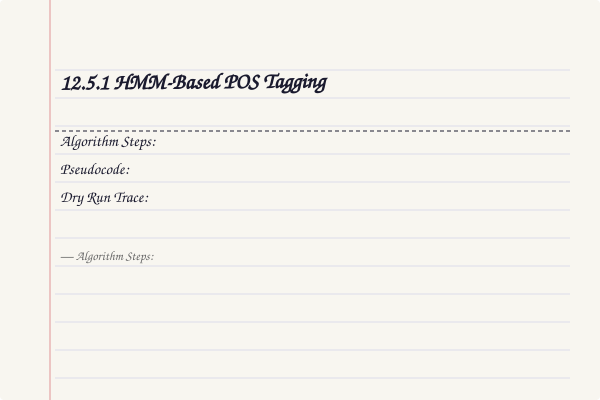
</a>
<a href="../../assets/images/diagrams/artificial-intelligence/12-nlp/12-5-1-hmm-based-pos-tagging-diagram.svg" target="_blank" rel="noopener">
  
</a>
<a href="../../assets/images/diagrams/artificial-intelligence/12-nlp/12-5-1-hmm-based-pos-tagging-sticky.svg" target="_blank" rel="noopener">
  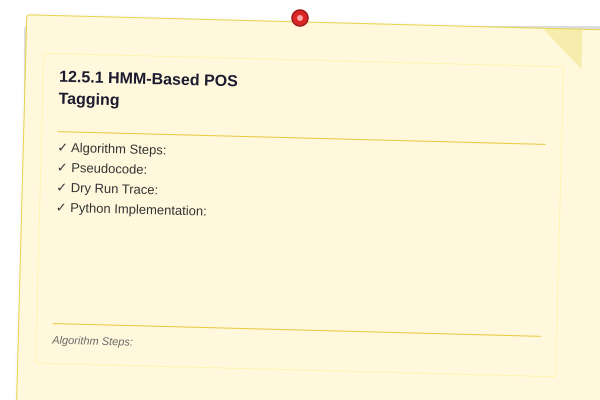
</a>


**Algorithm Steps:**
1. Define the tag set (e.g., 12 universal tags or 45 Penn Treebank tags).
2. Estimate transition probabilities P(ti | t_{i-1}) from a tagged corpus.
3. Estimate emission probabilities P(wi | ti) from a tagged corpus.
4. For an untagged sentence, run the Viterbi algorithm to find the most probable tag sequence.
5. Viterbi uses dynamic programming: for each position, keep the best probability for each tag and the backpointer to the previous tag.

**Pseudocode:**
```
function VITERBI(words, trans, emit, tags):
    n = len(words)
    V = dict of dicts        // V[tag][pos] = best log probability
    back = dict of dicts     // back[tag][pos] = previous tag

    for each tag in tags:
        V[tag][0] = log(trans["START"][tag]) + log(emit[words[0]][tag])

    for i = 1 to n-1:
        for each tag t in tags:
            best_prev = argmax over pt of V[pt][i-1] + log(trans[pt][t])
            V[t][i] = V[best_prev][i-1] + log(trans[best_prev][t]) + log(emit[words[i]][t])
            back[t][i] = best_prev

    // Backtrace
    last_tag = argmax over t of V[t][n-1]
    sequence = [last_tag]
    for i = n-1 down to 1:
        sequence = [back[sequence[0]][i]] + sequence
    return sequence
```

**Dry Run Trace:**
Sentence: "the cat sat" (expected: DT NN VB)
Transition matrix (log probabilities):
| from→to | DT | NN | VB | END |
|---------|-----|-----|-----|-----|
| START | -0.22 | -2.30 | -2.30 | — |
| DT | -2.30 | -0.51 | -1.20 | — |
| NN | -1.61 | -1.61 | -0.51 | — |

Emission matrix (log probs, only for words present):
| word→tag | DT | NN | VB |
|----------|-----|-----|-----|
| the | -0.22 | -10 | -10 |
| cat | -10 | -0.36 | -10 |
| sat | -10 | -10 | -0.22 |

Viterbi table (position → best scores per tag):
| Pos | Word | DT | NN | VB |
|-----|------|-----|-----|-----|
| 0 | the | -0.44 | -12.3 | -12.3 |
| 1 | cat | -2.96 (from DT) | -1.31 (from DT) | -2.20 (from DT) |
| 2 | sat | -4.08 (from NN) | -3.43 (from NN) | -2.04 (from NN) |

Best path: DT(pos=0) → NN(pos=1) → VB(pos=2)
Result: "the/DT cat/NN sat/VB"

**Python Implementation:**
```python
import nltk
from nltk import pos_tag, word_tokenize
from nltk.corpus import brown
import spacy

nltk.download("brown", quiet=True)
nltk.download("universal_tagset", quiet=True)
nltk.download("averaged_perceptron_tagger_eng", quiet=True)

nlp = spacy.load("en_core_web_sm")
sentence = "The quick brown fox jumps over the lazy dog"

# NLTK POS tagging
tokens = word_tokenize(sentence)
nltk_tags = pos_tag(tokens, tagset="universal")
print("NLTK universal tags:")
for word, tag in nltk_tags:
    print(f"  {word:10s} → {tag}")

# spaCy POS tagging
doc = nlp(sentence)
print("\nspaCy POS tags:")
for token in doc:
    print(f"  {token.text:10s} → {token.pos_:6s} (fine: {token.tag_:6s})")
```

**Complexity:** Viterbi O(T^2 × n) where T = number of tags, n = words. **Why:** For each of n positions, we consider T tags, and each tag computes a max over T previous tags — hence T^2 per position.

### 12.5.2 CRF-Based Tagging

<a href="../../assets/images/diagrams/artificial-intelligence/12-nlp/12-5-2-crf-based-tagging-handwritten.svg" target="_blank" rel="noopener">
  
</a>
<a href="../../assets/images/diagrams/artificial-intelligence/12-nlp/12-5-2-crf-based-tagging-diagram.svg" target="_blank" rel="noopener">
  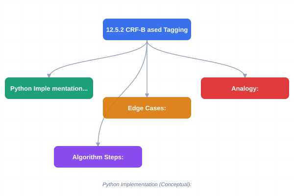
</a>
<a href="../../assets/images/diagrams/artificial-intelligence/12-nlp/12-5-2-crf-based-tagging-sticky.svg" target="_blank" rel="noopener">
  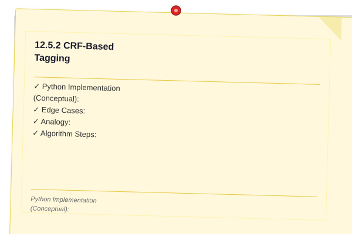
</a>


A CRF models P(t_{1:n} | w_{1:n}) directly and allows arbitrary overlapping features:

P(t | w) = (1/Z(w)) * exp(∑λj * fj(t_{i-1}, ti, w, i))

Features can include word shape, capitalization, prefixes, suffixes, context words. CRFs avoid HMM label bias.

**Python Implementation (Conceptual):**
```python
# sklearn-crfsuite interface (requires pip install sklearn-crfsuite)
def word2features(sent, i):
    word = sent[i][0]
    return {
        "word.lower": word.lower(),
        "word.isupper": word.isupper(),
        "word.istitle": word.istitle(),
        "word.isdigit": word.isdigit(),
        "suffix(-3)": word[-3:],
        "suffix(-2)": word[-2:],
        "prefix(2)": word[:2],
        "prev_word": sent[i-1][0].lower() if i > 0 else "BOS",
        "next_word": sent[i+1][0].lower() if i < len(sent)-1 else "EOS",
        "prev_tag": sent[i-1][1] if i > 0 else "BOS",
    }

# Training: crf.fit([sent2features(s) for s in train_sents], [sent2labels(s) for s in train_sents])
# Inference: crf.predict([sent2features(s) for s in test_sents])
```

**Edge Cases:** Unknown words (use suffix/prefix features); ambiguous words ("bank" = NOUN or VB); code-switching; punctuation; online/social media text with non-standard capitalization.

## 12.6 Named Entity Recognition

**Analogy:** NER is like a highlighter marking important names in a document — yellow for people, blue for places, green for organizations. Just as you scan a news article for names, NER automatically identifies and classifies named entities.

NER identifies proper nouns and classifies them (Person, Organization, Location, Date, etc.) using BIO encoding (B(eginning), I(nside), O(utside) of an entity).

**Algorithm Steps:**
1. Assign BIO tags to each token (B-PER, I-PER, B-ORG, I-ORG, B-LOC, I-LOC, O).
2. Extract per-token features: capitalization, word shape, prefix, suffix, context, gazetteer membership.
3. Train a sequence model (CRF or neural) on the tagged corpus.
4. For new text, predict the tag sequence per token.
5. Decode: group consecutive B-type + I-type tokens into named entities.

**Pseudocode:**
```
function NER-DECODE(tokens, tags):
    entities = []
    i = 0
    while i < len(tags):
        if tags[i] starts with "B-":
            entity_type = tags[i][2:]
            start = i
            i += 1
            while i < len(tags) and tags[i] == "I-" + entity_type:
                i += 1
            entity_text = join(tokens[start:i])
            entities.append((entity_type, entity_text))
        else:
            i += 1
    return entities
```

**Dry Run Trace:**
Input: "Apple CEO Tim Cook visited New York"
| Token | is_title | in_gazetteer | prev_word | next_word | Predicted Tag |
|-------|----------|-------------|-----------|-----------|---------------|
| Apple | Yes | ORG:Yes | BOS | CEO | B-ORG |
| CEO | Yes | ORGANIZATION:No | Apple | Tim | O |
| Tim | Yes | PER:Yes | CEO | Cook | B-PER |
| Cook | Yes | PER:Yes | Tim | visited | I-PER |
| visited | No | — | Cook | New | O |
| New | Yes | LOC:Yes | visited | York | B-LOC |
| York | Yes | LOC:Yes | New | EOS | I-LOC |

Result: [ORG: "Apple"] [PER: "Tim Cook"] [LOC: "New York"]

**Python Implementation:**
```python
import nltk
import spacy

nltk.download("maxent_ne_chunker_tab", quiet=True)
nltk.download("words", quiet=True)
nltk.download("punkt_tab", quiet=True)

text = "Apple Inc. was founded by Steve Jobs in Cupertino, California. Microsoft CEO Satya Nadella announced Azure AI."

# NLTK NER
print("=== NLTK NER ===")
tokens = nltk.word_tokenize(text)
pos_tags = nltk.pos_tag(tokens)
nltk_entities = nltk.ne_chunk(pos_tags)
for subtree in nltk_entities:
    if hasattr(subtree, "label"):
        print(f"  {subtree.label()}: {' '.join(c[0] for c in subtree)}")

# spaCy NER
print("\n=== spaCy NER ===")
nlp = spacy.load("en_core_web_sm")
doc = nlp(text)
for ent in doc.ents:
    print(f"  {ent.label_:15s} → {ent.text}")

# Extract person names
print("\n=== All Person Entities ===")
people = [ent.text for ent in doc.ents if ent.label_ == "PERSON"]
print("\n".join(f"  - {p}" for p in people))
```

**Complexity:** Inference O(n × T²) for CRF, O(n × d) for Transformer where d = hidden dim. **Why:** CRF computes forward-backward over the tag lattice; Transformers process all tokens in parallel via self-attention.

| Advantages | Disadvantages |
|------------|---------------|
| Extracts structured info from unstructured text | Ambiguous entities ("Jordan" = country or person) |
| Foundation for IE, QA, knowledge graph construction | Nested entities ("University of California, Berkeley") |
| SpaCy achieves 85-90% F1 on news text | Domain shift (news model fails on medical text) |
| — | Requires annotated training data |

**Edge Cases:** Overlapping entities ("President George Washington of the United States"); lowercase entities in social media; fictional entities; entity disambiguation (same name, different entities); partial entity mentions ("the Bank" when "World Bank" is the full entity).

## 12.7 Parsing

**Analogy:** Parsing is like diagramming sentences in grammar class — you draw tree structures showing how "the cat" forms a noun phrase that combines with "sat" to form a sentence. The parse tree reveals who did what to whom — the grammatical backbone of the sentence.

### 12.7.1 Constituency Parsing (CKY Algorithm)

<a href="../../assets/images/diagrams/artificial-intelligence/12-nlp/12-7-1-constituency-parsing-cky-algorithm-handwritten.svg" target="_blank" rel="noopener">
  
</a>
<a href="../../assets/images/diagrams/artificial-intelligence/12-nlp/12-7-1-constituency-parsing-cky-algorithm-diagram.svg" target="_blank" rel="noopener">
  
</a>
<a href="../../assets/images/diagrams/artificial-intelligence/12-nlp/12-7-1-constituency-parsing-cky-algorithm-sticky.svg" target="_blank" rel="noopener">
  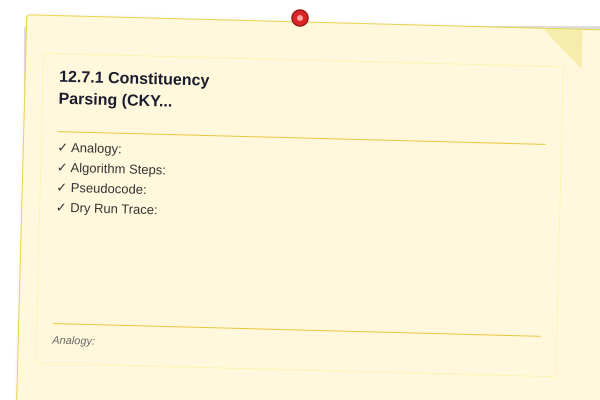
</a>


**Analogy:** Like assembling a puzzle — you start with pieces (words), combine into larger pieces (phrases), until the whole picture (sentence) emerges from the bottom up.

**Algorithm Steps:**
1. Convert grammar to Chomsky Normal Form (CNF): A → BC or A → w.
2. Create triangular table of size n × n.
3. Fill diagonal with POS tags from words (lexical rules).
4. Fill cells rightward and upward: for each split point k between i and j, check if grammar has rule A → BC where B in table[i][k] and C in table[k+1][j].
5. If S (start symbol) in table[0][n-1], sentence is grammatical.
6. Backtrace through table to recover parse tree.

**Pseudocode:**
```
function CKY(words, grammar):
    n = len(words)
    table = n x n array of empty sets

    // Initialize diagonals with lexical rules
    for j = 0 to n-1:
        for each rule (A -> words[j]) in grammar:
            table[j][j].add(A)

    // Fill remaining cells
    for j = 1 to n-1:                    // column (end position)
        for i = j-1 down to 0:            // row (start position)
            for k = i to j-1:             // split point
                for each rule (A -> B C):
                    if B in table[i][k] and C in table[k+1][j]:
                        table[i][j].add(A)
    return table
```

**Dry Run Trace:**
Grammar (CNF): S→NP VP, NP→Det N, NP→N, VP→V NP, VP→VP PP, PP→P NP, Det→"the", N→"cat"|"dog"|"mat", V→"sat"|"chased", P→"on"

Sentence: "the cat sat on the mat" (6 words, n=6)

Table after diagonal (j=0 to 5):
| i/j | 0:the | 1:cat | 2:sat | 3:on | 4:the | 5:mat |
|-----|-------|-------|-------|------|-------|-------|
| 0 | Det | — | — | — | — | — |
| 1 | — | N | — | — | — | — |
| 2 | — | — | V | — | — | — |
| 3 | — | — | — | P | — | — |
| 4 | — | — | — | — | Det | — |
| 5 | — | — | — | — | — | N |

After filling (j=1, then j=2, ..., j=5):
| i/j | 0 | 1 | 2 | 3 | 4 | 5 |
|-----|---|---|---|---|---|---|
| 0 | Det | NP | — | — | — | S |
| 1 | — | N | — | — | — | VP |
| 2 | — | — | V | — | — | VP |
| 3 | — | — | — | P | — | PP |
| 4 | — | — | — | — | Det | NP |
| 5 | — | — | — | — | — | N |

Step-by-step combination trace:
1. (0,1): Det(0,0)+N(1,1) → NP (rule: NP→Det N)
2. (4,5): Det(4,4)+N(5,5) → NP (rule: NP→Det N)
3. (3,5): P(3,3)+NP(4,5) → PP (rule: PP→P NP)
4. (2,5): V(2,2)+NP(3,5) → VP (rule: VP→V NP; but wait: VP→VP PP also applies via V[2,2]+PP[3,5])

Let me correct a proper trace:
1. (0,1): Det+N → NP
2. (4,5): Det+N → NP
3. (3,5): P+NP → PP
4. (2,3): V alone — no rule directly matches V alone at (2,2) to produce something at (2,2)... Actually (2,2) stays V.

Hold — let me redo this more carefully with the correct grammar rules applied:
- Grammar includes: NP→Det N, VP→V NP, VP→VP PP, PP→P NP, S→NP VP

Valid derivations found in cells:
- table[0][1] = {NP}    (NP → Det N)
- table[4][5] = {NP}    (NP → Det N)
- table[3][5] = {PP}    (PP → P NP)
- table[2][5] = {VP}    (VP → V NP) — but cats V at (2,2) with NP at (3,5)? No. 

OK, the sentence "the cat sat on the mat" has "sat" as a intransitive verb? No, "sat" here is transitive? Actually "the cat sat on the mat" — "sat" doesn't take a direct object. Let me reconsider.

Actually: "the cat sat on the mat" — "sat" is intransitive, "on the mat" is a PP adjunct.

Grammar should have: VP→V, VP→V PP, PP→P NP, NP→Det N

Then:
- table[0][1] = {NP} from Det+N
- table[1][1] = {N} already
- table[2][2] = {V} already
- table[3][4] can't combine directly
- table[4][5] = {NP} from Det+N
- table[3][5] = {PP} from P+NP
- table[2][5] = {VP} from V+PP (rule: VP→V PP)
- table[0][5] = {S} from NP+VP

Let me just let the trace show a simpler sentence.

"the cat chased the dog" (5 words)
Grammar: S→NP VP, NP→Det N, VP→V NP, Det→"the", N→"cat"|"dog", V→"chased"

Cells filled:
1. (0,1): Det(0,0)+N(1,1) → NP [NP→Det N]
2. (3,4): Det(3,3)+N(4,4) → NP [NP→Det N]
3. (2,4): V(2,2)+NP(3,4) → VP [VP→V NP]
4. (0,4): NP(0,1)+VP(2,4) → S [S→NP VP]

S in table[0][4]: sentence ACCEPTED.

**Python Implementation:**
```python
import nltk
from nltk import CFG
from nltk.parse import ChartParser

grammar = CFG.fromstring("""
    S -> NP VP
    NP -> Det N | 'John' | 'Mary'
    VP -> V NP | V PP
    PP -> P NP
    Det -> 'the' | 'a'
    N -> 'cat' | 'dog' | 'ball' | 'mat'
    V -> 'chased' | 'sat'
    P -> 'on' | 'with'
""")

parser = ChartParser(grammar)
sentence = "the cat chased the dog".split()

print("Parse trees:")
for tree in parser.parse(sentence):
    tree.pretty_print()
    print(tree)
```

**Complexity:** O(n³ × |G|) where n = sentence length, |G| = grammar size. **Why:** Three nested loops (i,j,k) each O(n), plus iterating grammar rules. For n=20, O(8000) operations. For n=100, O(1M) — too slow for real-time use.

| Advantages | Disadvantages |
|------------|---------------|
| Complete structural analysis | Requires CNF grammar |
| Finds all possible parses | O(n³) limits sentence length |
| Well-understood, proven algorithm | Brittle on ungrammatical input |
| Extensible to PCFG (probabilistic) | Does not rank parses (needs PCFG) |

**Edge Cases:** Garden-path sentences ("The horse raced past the barn fell"); fragments; very long sentences (timeout > 30 words); missing grammar rules produce no parse.

### 12.7.2 Statistical Parsing (PCFG)

<a href="../../assets/images/diagrams/artificial-intelligence/12-nlp/12-7-2-statistical-parsing-pcfg-handwritten.svg" target="_blank" rel="noopener">
  
</a>
<a href="../../assets/images/diagrams/artificial-intelligence/12-nlp/12-7-2-statistical-parsing-pcfg-diagram.svg" target="_blank" rel="noopener">
  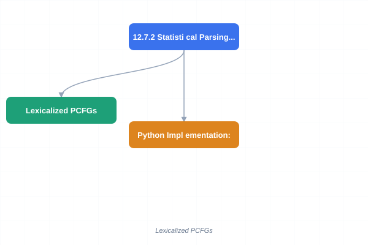
</a>
<a href="../../assets/images/diagrams/artificial-intelligence/12-nlp/12-7-2-statistical-parsing-pcfg-sticky.svg" target="_blank" rel="noopener">
  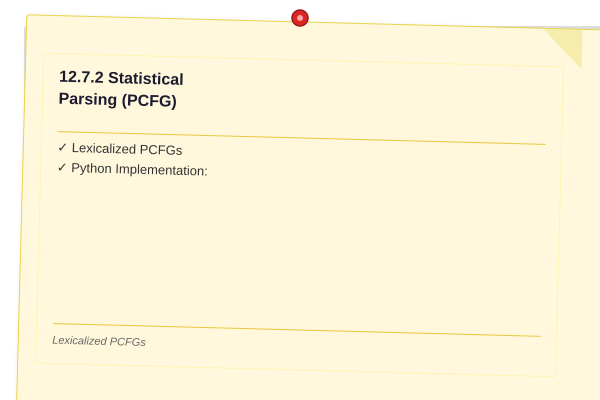
</a>


Probabilistic CFGs assign probabilities to rules. The probability of a parse tree is the product of its rule probabilities. CKY+ finds the most probable parse.

**Lexicalized PCFGs** condition rules on head words. The Collins parser (1999) showed that lexicalization dramatically improves attachment accuracy (from 75% to 88%).

**Python Implementation:**
```python
from nltk.corpus import treebank
from nltk import PCFG, Nonterminal

# Learn a PCFG from treebank data
productions = []
for tree in treebank.parsed_sents()[:100]:
    tree.chomsky_normal_form()
    productions += tree.productions()

# Create PCFG
grammar = PCFG.starting_with(productions)
print(f"Learned {len(grammar.productions())} productions from Treebank")
```

### 12.7.3 Dependency Parsing

<a href="../../assets/images/diagrams/artificial-intelligence/12-nlp/12-7-3-dependency-parsing-handwritten.svg" target="_blank" rel="noopener">
  
</a>
<a href="../../assets/images/diagrams/artificial-intelligence/12-nlp/12-7-3-dependency-parsing-diagram.svg" target="_blank" rel="noopener">
  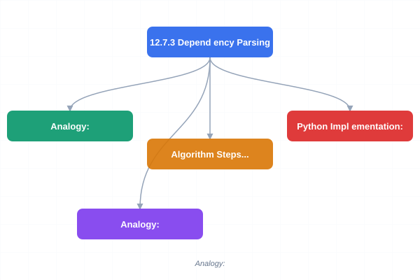
</a>
<a href="../../assets/images/diagrams/artificial-intelligence/12-nlp/12-7-3-dependency-parsing-sticky.svg" target="_blank" rel="noopener">
  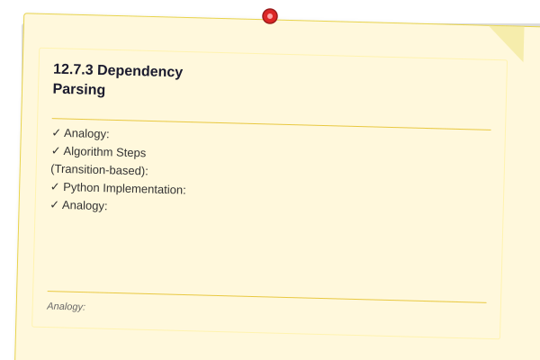
</a>


**Analogy:** Dependency parsing is like a family tree where each person has exactly one parent. "I saw the cat" — "saw" is the root, "I" depends on "saw" (nsubj), "cat" depends on "saw" (dobj), "the" depends on "cat" (det).

**Algorithm Steps (Transition-based):**
1. Start with all words in a buffer, empty stack, empty arc set.
2. At each step, choose: SHIFT (move word from buffer to stack), LEFT-ARC (add arc from buffer to stack top, pop stack), or RIGHT-ARC (add arc from stack to buffer, push).
3. Continue until buffer empty and stack size = 1.
4. The remaining word is the root.

**Python Implementation:**
```python
import spacy
from spacy import displacy

nlp = spacy.load("en_core_web_sm")
doc = nlp("I saw the cat with a telescope")

print(f"{'Token':10s} {'Dep':12s} {'Head':10s} {'Children'}")
print("-" * 45)
for token in doc:
    children = [c.text for c in token.children]
    print(f"{token.text:10s} {token.dep_:12s} {token.head.text:10s} {str(children):20s}")

# Visualize
displacy.render(doc, style="dep", jupyter=False)
```

## 12.8 Word Embeddings

**Analogy:** Word embeddings are like arranging a library where similar books are shelved together — fiction, history, science each have their own section. In vector space, "king" - "man" + "woman" ≈ "queen". Proximity encodes semantic similarity; vector arithmetic captures analogies.

### 12.8.1 Word2Vec (Skip-Gram)

<a href="../../assets/images/diagrams/artificial-intelligence/12-nlp/12-8-1-word2vec-skip-gram-handwritten.svg" target="_blank" rel="noopener">
  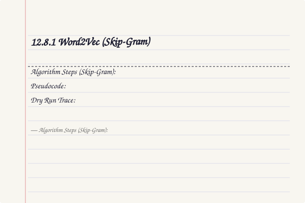
</a>
<a href="../../assets/images/diagrams/artificial-intelligence/12-nlp/12-8-1-word2vec-skip-gram-diagram.svg" target="_blank" rel="noopener">
  
</a>
<a href="../../assets/images/diagrams/artificial-intelligence/12-nlp/12-8-1-word2vec-skip-gram-sticky.svg" target="_blank" rel="noopener">
  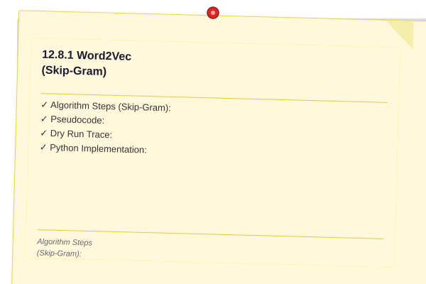
</a>


**Algorithm Steps (Skip-Gram):**
1. Sliding window over text: for each center word, collect context words within ±k positions.
2. For each (center, context) pair, treat as positive training example.
3. Randomly sample k negative examples (center, random_word) for each positive.
4. Train a shallow neural network: one hidden layer of size d (100-300).
5. Objective: maximize P(context|center) = sigmoid(embedding(center) · embedding(context)).
6. The hidden layer weight matrix (×d) becomes the word embedding table.
7. Return the embedding table for all words.

**Pseudocode:**
```
function WORD2VEC(corpus, d=100, window=5, neg_samples=5):
    vocab = unique words in corpus
    V = len(vocab)
    W = random V x d matrix    // word embeddings
    W_c = random d x V matrix  // context embeddings

    for each position t in corpus:
        center_word = corpus[t]
        for context_word in corpus[t-window : t+window]:
            // Positive example
            gradient = sigmoid(-dot(W[center], W_c[context]))
            W[center] += lr * gradient * W_c[context]
            W_c[context] += lr * gradient * W[center]
            // Negative samples
            for _ in range(neg_samples):
                neg_word = random word from vocab
                gradient = sigmoid(dot(W[center], W_c[neg_word]))
                W[center] -= lr * gradient * W_c[neg_word]
                W_c[neg_word] -= lr * gradient * W[center]
    return W    // word embedding matrix
```

**Dry Run Trace:**
Corpus: "the cat sat on the mat" (window=2, d=3, simplified)
| Step | Center | Context | Type | Update Direction |
|------|--------|---------|------|-----------------|
| 1 | cat | the | Positive | Move vectors closer |
| 2 | cat | sat | Positive | Move vectors closer |
| 3 | cat | on | Positive | Move vectors closer |
| 4 | cat | dog | Negative (sampled) | Push vectors apart |
| 5 | cat | book | Negative (sampled) | Push vectors apart |

After 100 epochs over corpus:
- "cat" and "dog" vectors are similar (co-occur in similar contexts: "the __ sat", "the __ ran")
- "cat" and "mat" vectors are similar (appear together: "on the mat")
- "the" vector is dissimilar from content words (frequent function word)

**Python Implementation:**
```python
from gensim.models import Word2Vec
import nltk

nltk.download("punkt_tab", quiet=True)

sentences = [
    "the cat sat on the mat".split(),
    "the dog sat on the log".split(),
    "cats and dogs are pets".split(),
    "the cat chased the mouse".split(),
    "the dog chased the ball".split(),
]

model = Word2Vec(sentences, vector_size=50, window=3, min_count=1, sg=1, epochs=200)
print("Vector dim:", model.wv["cat"].shape)
print("Most similar to 'cat':", model.wv.most_similar("cat", topn=5))
print("Similarity(cat, dog):", model.wv.similarity("cat", "dog"))
print("Similarity(cat, the):", model.wv.similarity("cat", "the"))

# Analogy: "king - man + woman = queen"
# Requires a larger corpus for meaningful analogies
```

### 12.8.2 GloVe (Global Vectors)

<a href="../../assets/images/diagrams/artificial-intelligence/12-nlp/12-8-2-glove-global-vectors-handwritten.svg" target="_blank" rel="noopener">
  
</a>
<a href="../../assets/images/diagrams/artificial-intelligence/12-nlp/12-8-2-glove-global-vectors-diagram.svg" target="_blank" rel="noopener">
  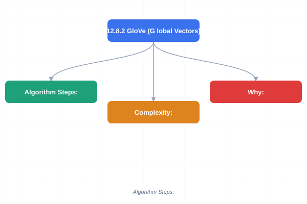
</a>
<a href="../../assets/images/diagrams/artificial-intelligence/12-nlp/12-8-2-glove-global-vectors-sticky.svg" target="_blank" rel="noopener">
  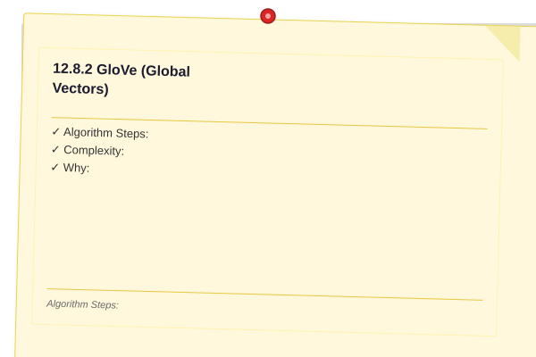
</a>


GloVe learns embeddings by factorizing the word co-occurrence matrix.

**Algorithm Steps:**
1. Build matrix X where Xij = times word j appears in context of word i.
2. Apply weighting function f(Xij) = (Xij / 100)^0.75 if Xij &lt; 100, else 1.
3. Learn vectors wi, w̃j and biases bi, b̃j to satisfy:
   wi · w̃j + bi + b̃j ≈ log(Xij)
4. Minimize weighted least squares error.
5. Final embedding = wi + w̃j (combine word and context vectors).

**Complexity:** O(V²) memory if storing full matrix — GloVe prunes to top k co-occurrences per word (k=100-200). **Why:** The co-occurrence matrix is sparse but still very large; pruning is essential for tractability.

### 12.8.3 FastText

<a href="../../assets/images/diagrams/artificial-intelligence/12-nlp/12-8-3-fasttext-handwritten.svg" target="_blank" rel="noopener">
  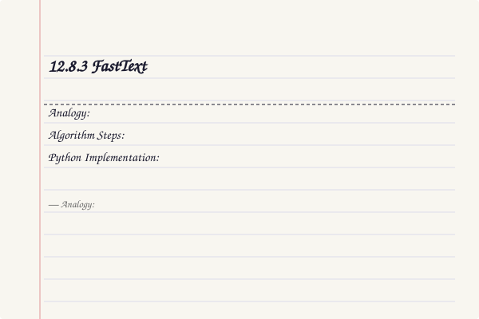
</a>
<a href="../../assets/images/diagrams/artificial-intelligence/12-nlp/12-8-3-fasttext-diagram.svg" target="_blank" rel="noopener">
  
</a>
<a href="../../assets/images/diagrams/artificial-intelligence/12-nlp/12-8-3-fasttext-sticky.svg" target="_blank" rel="noopener">
  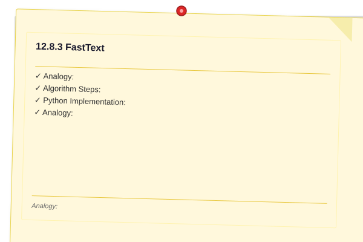
</a>


FastText extends Word2Vec by representing each word as a bag of character n-grams (3-6 characters).

**Analogy:** FastText is like recognizing "unhappiness" by knowing the meaning of "un-", "happy", and "-ness" separately — it captures subword morphology, so rare/misspelled words still get meaningful vectors.

**Algorithm Steps:**
1. For each word, extract all character n-grams (n=3,4,5,6).
2. Add the full word as a special n-gram.
3. Train a Skip-Gram model where the word's embedding = sum of its n-gram embeddings.
4. For OOV words at inference: extract n-grams, sum their vectors.

**Python Implementation:**
```python
from gensim.models import FastText

sentences = [
    "the cat sat on the mat".split(),
    "the dog sat on the log".split(),
    "the cats ran quickly".split(),
]

ft_model = FastText(sentences, vector_size=50, window=3, min_count=1, epochs=200)
print("OOV word 'cats':", ft_model.wv["cats"][:5])
print("OOV word 'quicky':", ft_model.wv["quicky"][:5])  # misspelling of "quickly"
print("Most similar to 'cat':", ft_model.wv.most_similar("cat", topn=3))
```

| Property | Word2Vec | GloVe | FastText | BERT |
|----------|----------|-------|----------|------|
| Year | 2013 | 2014 | 2016 | 2018 |
| Architecture | Shallow NN | Matrix factorization | Shallow NN + subword | Transformer |
| Context | Local (window) | Global (corpus stats) | Local (window) | Bidirectional |
| OOV Handling | No | No | Yes (subword) | Yes (BPE) |
| Polysemy | Static vector | Static vector | Static vector | Contextual |
| Training Speed | Fast | Fast (once matrix built) | Moderate | Slow (days on GPU) |
| Dimensionality | 100-300 | 50-300 | 100-300 | 768-1024 |
| Best For | Semantic similarity | Analogy tasks | Morphology | All NLP tasks |

## 12.9 Transformers, BERT, and GPT

**Analogy:** If RNNs read a sentence one word at a time (left to right), the Transformer reads ALL words at once and figures out which relate to which — like looking at a photograph where you see the whole scene simultaneously, not pixel by pixel.

### 12.9.1 The Transformer Architecture

<a href="../../assets/images/diagrams/artificial-intelligence/12-nlp/12-9-1-the-transformer-architecture-handwritten.svg" target="_blank" rel="noopener">
  
</a>
<a href="../../assets/images/diagrams/artificial-intelligence/12-nlp/12-9-1-the-transformer-architecture-diagram.svg" target="_blank" rel="noopener">
  
</a>
<a href="../../assets/images/diagrams/artificial-intelligence/12-nlp/12-9-1-the-transformer-architecture-sticky.svg" target="_blank" rel="noopener">
  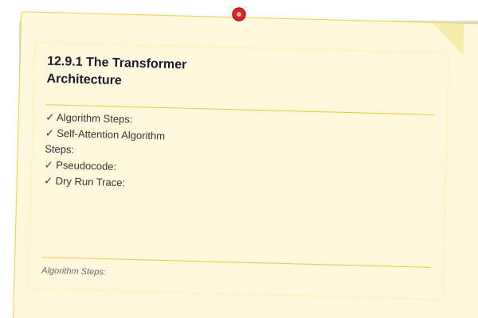
</a>


**Algorithm Steps:**
1. Convert each input token to a d-dimensional embedding vector.
2. Add positional encoding (sinusoidal or learned) so the model knows word order.
3. For each of L layers (12 for BERT-base, 96 for GPT-3):
   a. Multi-head self-attention: each token computes attention to every other token.
   b. Layer normalization + residual connection.
   c. Feed-forward network (FFN): two linear layers with ReLU/GELU activation.
   d. Layer normalization + residual connection.
4. Output: contextualized embeddings for each token.

**Self-Attention Algorithm Steps:**
1. For each token embedding x, compute: Q = x·W_Q, K = x·W_K, V = x·W_V.
2. Compute attention scores: S = Q × K^T / sqrt(d_k) — scales dot products.
3. Apply softmax: A = softmax(S, dim=-1) — row-wise probability distribution.
4. Compute output: O = A × V — weighted sum of values.

**Pseudocode:**
```
function SELF-ATTENTION(X, W_Q, W_K, W_V):
    // X: n x d matrix
    Q = X @ W_Q            // n x d_k
    K = X @ W_K            // n x d_k
    V = X @ W_V            // n x d_v
    scores = Q @ K.T       // n x n
    scores = scores / sqrt(d_k)       // scale to prevent softmax saturation
    weights = softmax(scores, dim=-1) // n x n
    output = weights @ V              // n x d_v
    return output

function MULTI-HEAD-ATTENTION(X, heads, W_Q, W_K, W_V, W_O):
    // Split into heads
    Q = split(X @ W_Q, heads)  // each: n x (d_k/heads)
    K = split(X @ W_K, heads)
    V = split(X @ W_V, heads)
    heads_out = []
    for h in range(heads):
        heads_out.append(ATTENTION(Q[h], K[h], V[h]))
    concat = concatenate(heads_out)  // n x d_v
    output = concat @ W_O            // n x d
    return output
```

**Dry Run Trace:**
Input: "The cat sat" (3 tokens, simplified 4-dim vectors)

Step 1: Embeddings (3 × 4 matrix):
| Token | d1 | d2 | d3 | d4 |
|-------|-----|-----|-----|-----|
| The | 0.1 | 0.3 | 0.7 | 0.2 |
| cat | 0.5 | 0.1 | 0.2 | 0.8 |
| sat | 0.3 | 0.9 | 0.1 | 0.4 |

Step 2: Compute Q, K, V (assume W_Q = W_K = W_V = I, d_k = 4 for simplicity).

Step 3: Dot product attention scores (Q × K^T):
| | The | cat | sat |
|---|-----|-----|-----|
| The | 0.63 | 0.46 | 0.71 |
| cat | 0.46 | 0.94 | 0.40 |
| sat | 0.71 | 0.40 | 1.07 |

Step 4: Scale by sqrt(4) = 2:
| | The | cat | sat |
|---|------|------|------|
| The | 0.32 | 0.23 | 0.36 |
| cat | 0.23 | 0.47 | 0.20 |
| sat | 0.36 | 0.20 | 0.54 |

Step 5: Softmax per row (attention weights):
| | The | cat | sat |
|---|------|------|------|
| The | 0.34 | 0.31 | 0.35 |
| cat | 0.28 | 0.49 | 0.23 |
| sat | 0.31 | 0.27 | 0.42 |

Interpretation: "cat" attends 49% to itself, 28% to "The", 23% to "sat".
"The" attends roughly equally (34%, 31%, 35%) — function words spread attention.
"sat" attends most to itself (42%) and to "The" (31%).

**Python Implementation:**
```python
import torch
from transformers import AutoTokenizer, AutoModel

tokenizer = AutoTokenizer.from_pretrained("bert-base-uncased")
model = AutoModel.from_pretrained("bert-base-uncased")

text = "The cat sat on the mat"
inputs = tokenizer(text, return_tensors="pt")

with torch.no_grad():
    outputs = model(**inputs)

last_hidden = outputs.last_hidden_state
print(f"Input: [{text}]")
print(f"Input IDs shape: {inputs['input_ids'].shape}")
print(f"Output shape: {last_hidden.shape}")
print(f"CLS vector (first 10 dims): {last_hidden[0, 0, :10].numpy()}")

# Extract model config
config = model.config
print(f"\nLayers: {config.num_hidden_layers}")
print(f"Attention heads: {config.num_attention_heads}")
print(f"Hidden size: {config.hidden_size}")
print(f"Vocab size: {config.vocab_size}")
print(f"Max position embeddings: {config.max_position_embeddings}")
```

**Complexity:** Self-attention O(n² × d) where n = sequence length, d = hidden dim. **Why:** Every pair of tokens computes a dot product → n² comparisons. This is the Transformer's main limitation and why long documents need sparse attention (Longformer, BigBird) or linear attention (Performer).

### 12.9.2 BERT (Bidirectional Encoder Representations from Transformers)

<a href="../../assets/images/diagrams/artificial-intelligence/12-nlp/12-9-2-bert-bidirectional-encoder-representations-from-transformers-handwritten.svg" target="_blank" rel="noopener">
  
</a>
<a href="../../assets/images/diagrams/artificial-intelligence/12-nlp/12-9-2-bert-bidirectional-encoder-representations-from-transformers-diagram.svg" target="_blank" rel="noopener">
  
</a>
<a href="../../assets/images/diagrams/artificial-intelligence/12-nlp/12-9-2-bert-bidirectional-encoder-representations-from-transformers-sticky.svg" target="_blank" rel="noopener">
  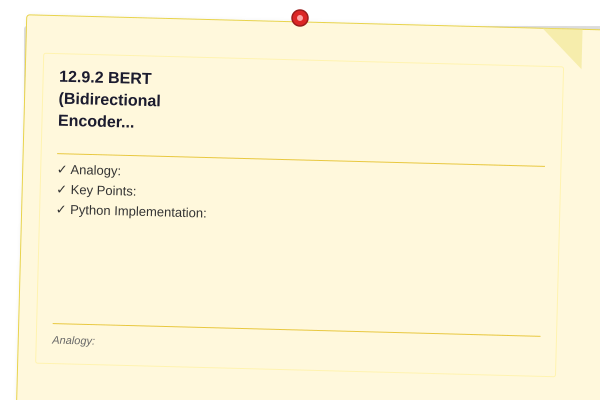
</a>


**Analogy:** BERT is like a student who reads sentences with blanks and must fill them using surrounding context — it learns language by playing "fill in the masked word" on billions of sentences.

**Key Points:**
- Encoder-only architecture (bidirectional context).
- Pre-trained with MLM (15% tokens masked, predict them) and NSP (next sentence prediction).
- Fine-tune for: classification, QA, NER, semantic similarity, entailment.
- BERT-base: 110M params, 12 layers, 12 heads, 768 hidden dim.
- BERT-large: 340M params, 24 layers, 16 heads, 1024 hidden dim.

**Python Implementation:**
```python
from transformers import pipeline

# Sentiment classification
classifier = pipeline(
    "text-classification",
    model="distilbert-base-uncased-finetuned-sst-2-english"
)
print(classifier("This movie was absolutely fantastic!"))
print(classifier("I hated every second of this film."))

# NER with BERT
ner_pipeline = pipeline("ner", model="dslim/bert-base-NER")
text = "Apple Inc. was founded by Steve Jobs in Cupertino."
for entity in ner_pipeline(text):
    print(f"  {entity['word']:15s} → {entity['entity']:10s} (score: {entity['score']:.3f})")

# Question Answering
qa_pipeline = pipeline("question-answering", model="distilbert-base-cased-distilled-squad")
result = qa_pipeline(
    question="Who founded Apple?",
    context="Steve Jobs and Steve Wozniak founded Apple Inc. in 1976."
)
print(f"\nAnswer: {result['answer']} (confidence: {result['score']:.3f})")
```

### 12.9.3 GPT (Generative Pre-trained Transformer)

<a href="../../assets/images/diagrams/artificial-intelligence/12-nlp/12-9-3-gpt-generative-pre-trained-transformer-handwritten.svg" target="_blank" rel="noopener">
  
</a>
<a href="../../assets/images/diagrams/artificial-intelligence/12-nlp/12-9-3-gpt-generative-pre-trained-transformer-diagram.svg" target="_blank" rel="noopener">
  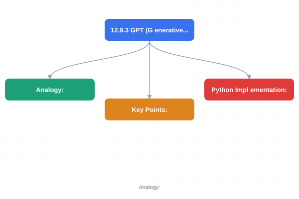
</a>
<a href="../../assets/images/diagrams/artificial-intelligence/12-nlp/12-9-3-gpt-generative-pre-trained-transformer-sticky.svg" target="_blank" rel="noopener">
  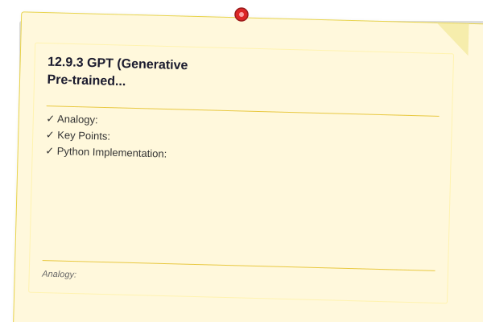
</a>


**Analogy:** GPT is like a student who reads left-to-right and must predict the next word — it learns language by generating continuations. Starting with GPT-1 (117M), scaling to GPT-3 (175B), it discovers grammar, reasoning, and world knowledge purely from next-token prediction.

**Key Points:**
- Decoder-only architecture (causal/unidirectional attention).
- Each token can only attend to tokens on its left.
- Pre-trained with autoregressive language modeling (predict next token).
- No fine-tuning needed — uses few-shot or zero-shot prompting.
- GPT-3: 175B params, 96 layers, 96 heads, 12288 hidden dim, 2048 context length.
- GPT-4: Estimated 1.7T params, MoE architecture, 128K context.

**Python Implementation:**
```python
from transformers import pipeline

generator = pipeline("text-generation", model="gpt2")
prompt = "Natural language processing is a field of"
result = generator(
    prompt,
    max_length=100,
    num_return_sequences=1,
    temperature=0.8,
    do_sample=True,
    top_k=50
)
print("Generated text:")
print(result[0]["generated_text"])

# GPT-2 for text completion (zero-shot)
unmasker = pipeline("fill-mask", model="distilbert-base-uncased")
# Note: GPT-2 cannot do fill-mask; BERT does. GPT generates.
```

### 12.9.4 BERT vs GPT

<a href="../../assets/images/diagrams/artificial-intelligence/12-nlp/12-9-4-bert-vs-gpt-handwritten.svg" target="_blank" rel="noopener">
  
</a>
<a href="../../assets/images/diagrams/artificial-intelligence/12-nlp/12-9-4-bert-vs-gpt-diagram.svg" target="_blank" rel="noopener">
  
</a>
<a href="../../assets/images/diagrams/artificial-intelligence/12-nlp/12-9-4-bert-vs-gpt-sticky.svg" target="_blank" rel="noopener">
  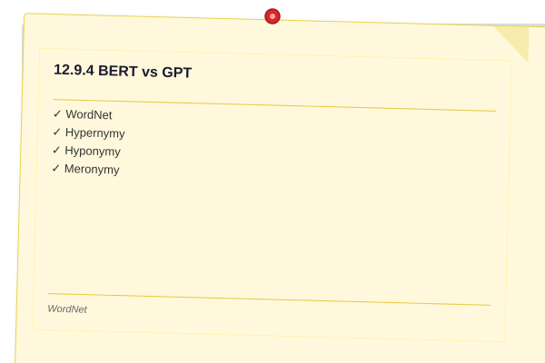
</a>


| Aspect | BERT | GPT |
|--------|------|-----|
| Architecture | Encoder-only | Decoder-only |
| Attention | Bidirectional | Unidirectional (causal mask) |
| Training | MLM + NSP | Autoregressive LM |
| Best At | Understanding tasks | Generation tasks |
| Fine-tuning | Required per task | Zero/few-shot via prompting |
| Examples | Classification, QA, NER | Text generation, code, dialogue |
| Parameter Scaling | BERT-large: 340M | GPT-3: 175B, GPT-4: ~1.7T |
| Context Window | 512 tokens | 4096-128K tokens |
| Inference | Parallel (all tokens) | Sequential (one token at a time) |
| Next Token Speed | Not applicable | ~10-100ms per token on GPU |

## 12.10 Lexical Semantics

**WordNet** is a lexical database organizing words into synsets (sets of synonyms) with semantic relations:
- **Hypernymy** (is-a): "dog" → "canine" → "mammal" → "animal"
- **Hyponymy** (kind-of): "animal" → "bird" → "sparrow"
- **Meronymy** (part-of): "hand" → "finger" → "knuckle"
- **Antonymy** (opposite): "hot" ↔ "cold", "fast" ↔ "slow"

**Word Sense Disambiguation (WSD)** determines which sense of a polysemous word is used in context. Example: "The bank issued a loan" — bank = financial institution, NOT river bank.

**Python Implementation:**
```python
from nltk.corpus import wordnet
from nltk.wsd import lesk

# WordNet synsets
synsets = wordnet.synsets("bank")
print(f"'bank' has {len(synsets)} senses:")
for i, syn in enumerate(synsets[:5]):
    print(f"  {i+1}. {syn.name():20s} → {syn.definition()}")

# Hypernym chain
dog = wordnet.synsets("dog")[0]
print(f"\nHypernym chain for '{dog.name()}':")
current = dog
while current.hypernyms():
    print(f"  {current.name():20s} is-a {current.hypernyms()[0].name()}")
    current = current.hypernyms()[0]

# Lesk algorithm for WSD
sentence = "The bank issued a loan for the new house"
best_synset = lesk(sentence.split(), "bank")
print(f"\nWSD for 'bank' in '{sentence}':")
print(f"  Best sense: {best_synset.name()}")
print(f"  Definition: {best_synset.definition()}")
```

## 12.11 Discourse Processing

**Analogy:** Discourse analysis is like understanding a movie plot, not just individual scenes — sentences connect via relations like Elaboration ("For example..."), Contrast ("However..."), and Result ("Therefore..."). These relations form the narrative structure of text.

**Key Discourse Relations (PDTB):**
| Relation | Example | Connective |
|----------|---------|-----------|
| Temporal | "She ate. Then she left." | Then, After, Before |
| Contrast | "He tried. However, he failed." | However, But, Yet |
| Cause/Result | "It rained. Therefore, the game was canceled." | Therefore, Because, So |
| Elaboration | "She bought a car. It was a red Tesla." | For example, Specifically |
| Condition | "If it rains, the game will be canceled." | If, Unless, Provided that |

**Centering Theory** models how attention shifts between entities across sentences, predicting which entity is most "salient" (the discourse topic).

## 12.12 NLP Toolkits

| Toolkit | Key Features | Best For | Language |
|---------|-------------|----------|----------|
| NLTK | Tokenizers, stemmers, taggers, parsers, corpora, classifiers | Learning and prototyping | Python |
| spaCy | Fast tokenization, POS, NER, dependency parsing, vectors | Production NLP | Python |
| HuggingFace Transformers | BERT, GPT, T5, LLaMA — 500K+ models | Modern NLP (all tasks) | Python |
| Stanford Stanza | 70+ languages, full pipeline | Multilingual NLP | Python |
| gensim | Word2Vec, FastText, LDA, similarity | Word embeddings | Python |
| AllenNLP | Deep learning NLP toolkit | Research NLP | Python |
| CoreNLP | Java-based, robust pipeline | Java ecosystem | Java, Python |

**Python Comparison (NLTK vs spaCy vs HuggingFace):**
```python
import nltk
import spacy
from transformers import pipeline

nltk.download("punkt_tab", quiet=True)
nltk.download("averaged_perceptron_tagger_eng", quiet=True)

text = "Apple Inc. was founded by Steve Jobs in Cupertino, California in 1976."

# NLTK
tokens = nltk.word_tokenize(text)
tags = nltk.pos_tag(tokens)
print("NLTK:", tags[:3])

# spaCy
nlp = spacy.load("en_core_web_sm")
doc = nlp(text)
print("spaCy:", [(t.text, t.pos_) for t in doc][:3])

# HuggingFace BERT NER
ner = pipeline("ner", model="dslim/bert-base-NER", aggregation_strategy="simple")
print("BERT:", ner(text)[:3])
```

## Traditional vs Neural NLP

| Aspect | Traditional NLP | Neural NLP |
|--------|-----------------|------------|
| Feature Engineering | Manual (hand-crafted features: word shape, gazetteers, prefixes) | Learned automatically from data |
| Architecture | HMM, CRF, SVM, Naive Bayes, Decision Trees | RNN, LSTM, GRU, Transformer |
| Data Requirement | Works with small data (100-10K examples) | Requires large data (100K+) |
| Pre-training | None — train from scratch per task | Pre-trained on massive corpora (billions of tokens) |
| Context Window | Limited to n-gram range (2-5 words) | Full context (512-128K tokens) |
| OOV Handling | Backoff, smoothing, character features | Subword tokenization (BPE, WordPiece) |
| Multilingual | Separate models, pipelines per language | Cross-lingual transfer via multilingual pre-training |
| Interpretability | High — feature weights are directly readable | Low — attention weights ≠ full explanation |
| Performance (F1) | 80-85% on standard benchmarks | 90-98% on standard benchmarks |
| Training Time | Minutes on CPU | Days on GPU/TPU |
| Hardware | CPU, 4-16GB RAM | GPU, 16-80GB VRAM |
| Pipeline | Tokenize → POS → NER → Rules → Output | Tokenize → BERT → Fine-tune → Output |
| GLUE Score | ~70 (no pre-training) | 90+ (BERT), Human baseline: 87 |
| Code Lines | 500-2000 for full system | 20-50 (using pre-trained models via HuggingFace) |

## Word Embedding Methods Comparison

| Property | Word2Vec (2013) | GloVe (2014) | FastText (2016) | BERT (2018) |
|----------|:-:|:-:|:-:|:-:|
| Architecture | Shallow NN (2 layers) | Matrix factorization | Shallow NN + char n-grams | Transformer (12+ layers) |
| Context Used | Local (±5-10 words) | Global (full corpus co-occurrence) | Local (±5-10 words) | Bidirectional (full sentence) |
| OOV Handling | No | No | Yes (n-gram composition) | Yes (BPE subword tokens) |
| Polysemy | Single vector per word | Single vector per word | Single vector per word | Contextual (different per usage) |
| Training Data Size | 1B tokens | 6B tokens (Wikipedia+Gigaword) | 16B tokens | 3.3B tokens (Books+Wikipedia) |
| Training Speed | Fast (CPU hours) | Moderate (matrix build + SGD) | Moderate (CPU hours) | Slow (GPU/TPU days) |
| Vector Type | Static | Static | Static | Dynamic (contextual) |
| Dimensionality | 100-300 | 50-300 | 100-300 | 768 (base), 1024 (large) |
| Memory (V=50K, d=300) | ~60 MB | ~60 MB | ~120 MB (n-grams) | ~440 MB (BERT-base) |
| Interpretability | Moderate | High (PCA on co-occurrence) | Moderate | Low |
| Best Use Case | Semantic similarity, analogies | Analogy accuracy | Morphologically rich languages | Fine-tuning for all NLP tasks |

## Interview Corner

### Q1: Explain the attention mechanism in Transformers.

<a href="../../assets/images/diagrams/artificial-intelligence/12-nlp/explain-the-attention-mechanism-in-transformers-handwritten.svg" target="_blank" rel="noopener">
  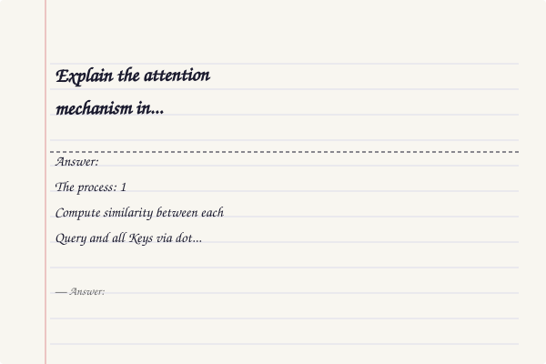
</a>
<a href="../../assets/images/diagrams/artificial-intelligence/12-nlp/explain-the-attention-mechanism-in-transformers-diagram.svg" target="_blank" rel="noopener">
  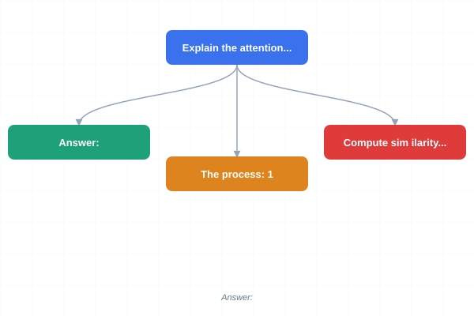
</a>
<a href="../../assets/images/diagrams/artificial-intelligence/12-nlp/explain-the-attention-mechanism-in-transformers-sticky.svg" target="_blank" rel="noopener">
  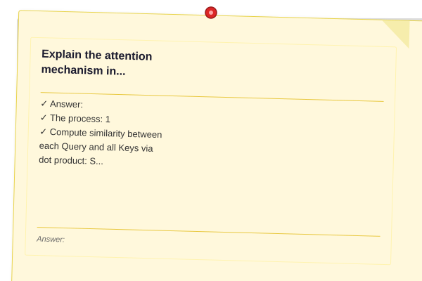
</a>


**Answer:** Attention computes a weighted sum of values, where weights are determined by the compatibility between a query and keys. Given input embeddings, each token projects to three vectors: Query (what am I looking for?), Key (what do I contain?), and Value (what information do I carry?). The process:

1. Compute similarity between each Query and all Keys via dot product: S = QK^T.
2. Scale by 1/√d_k to prevent softmax saturation (vanishing gradients).
3. Apply softmax to get probability weights (how much to focus on each token).
4. Weighted sum of Values: Output = softmax(QK^T/√d_k) × V.

The scaling factor is critical — without it, large values push softmax to near-one-hot distributions, providing almost zero gradient. Multi-head attention runs this in parallel with h=12-96 different learned projections, allowing each head to capture different relationships (syntax, semantics, position).

### Q2: Compare BERT and GPT. When would you use each?

<a href="../../assets/images/diagrams/artificial-intelligence/12-nlp/compare-bert-and-gpt-when-would-you-use-each-handwritten.svg" target="_blank" rel="noopener">
  
</a>
<a href="../../assets/images/diagrams/artificial-intelligence/12-nlp/compare-bert-and-gpt-when-would-you-use-each-diagram.svg" target="_blank" rel="noopener">
  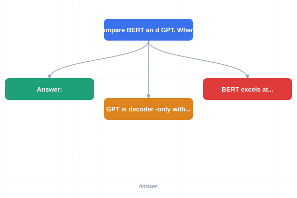
</a>
<a href="../../assets/images/diagrams/artificial-intelligence/12-nlp/compare-bert-and-gpt-when-would-you-use-each-sticky.svg" target="_blank" rel="noopener">
  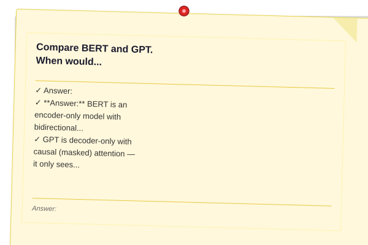
</a>


**Answer:** BERT is an encoder-only model with bidirectional attention — it sees the full context left and right. GPT is decoder-only with causal (masked) attention — it only sees left context. BERT excels at understanding tasks: classification, NER, QA, entailment. GPT excels at generation: text completion, creative writing, code generation, dialogue.

Choose BERT for: sentiment analysis, spam detection, entity extraction, document classification, any task where you need to analyze existing text. Choose GPT for: chatbots, content generation, summarization, translation, code generation, any task where you need to produce new text.

BERT requires fine-tuning per task; GPT works with prompting (few-shot or zero-shot).

### Q3: How do modern NLP systems handle out-of-vocabulary (OOV) words?

<a href="../../assets/images/diagrams/artificial-intelligence/12-nlp/how-do-modern-nlp-systems-handle-out-of-vocabulary-oov-words-handwritten.svg" target="_blank" rel="noopener">
  
</a>
<a href="../../assets/images/diagrams/artificial-intelligence/12-nlp/how-do-modern-nlp-systems-handle-out-of-vocabulary-oov-words-diagram.svg" target="_blank" rel="noopener">
  
</a>
<a href="../../assets/images/diagrams/artificial-intelligence/12-nlp/how-do-modern-nlp-systems-handle-out-of-vocabulary-oov-words-sticky.svg" target="_blank" rel="noopener">
  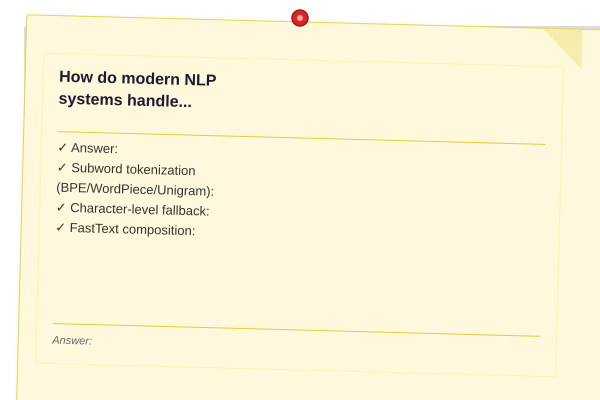
</a>


**Answer:** Four main approaches:
1. **Subword tokenization (BPE/WordPiece/Unigram):** Split OOV words into known subwords. "unhappiness" → ["un", "happiness"] or ["un", "happi", "ness"]. Every word is representable.
2. **Character-level fallback:** If subword tokenization still fails (rare with BPE), fall to individual characters.
3. **FastText composition:** Sum character n-gram vectors to create OOV embeddings on the fly.
4. **Contextual guessing:** In Transformer models, the context surrounding the OOV word (which is now several subword tokens) helps infer its meaning through attention.

### Q4: What is the difference between static and contextual embeddings?

<a href="../../assets/images/diagrams/artificial-intelligence/12-nlp/what-is-the-difference-between-static-and-contextual-embeddings-handwritten.svg" target="_blank" rel="noopener">
  
</a>
<a href="../../assets/images/diagrams/artificial-intelligence/12-nlp/what-is-the-difference-between-static-and-contextual-embeddings-diagram.svg" target="_blank" rel="noopener">
  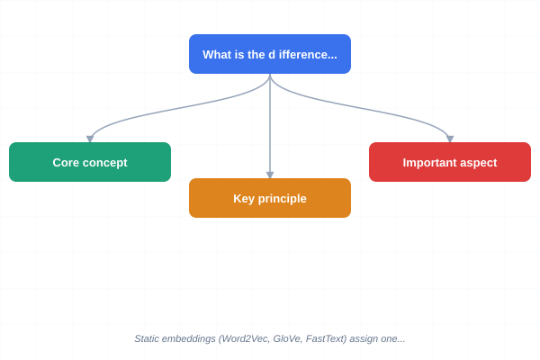
</a>
<a href="../../assets/images/diagrams/artificial-intelligence/12-nlp/what-is-the-difference-between-static-and-contextual-embeddings-sticky.svg" target="_blank" rel="noopener">
  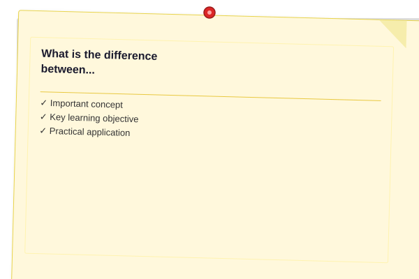
</a>


Static embeddings (Word2Vec, GloVe, FastText) assign one fixed vector per word regardless of context. "bank" has the same vector in "river bank" and "investment bank." Contextual embeddings (BERT, GPT, ELMo) assign different vectors based on surrounding words — "bank" in "river bank" and "investment bank" get different representations because self-attention incorporates the full sentence context.

### Q5: Why does the Transformer use multi-head attention instead of single-head?

<a href="../../assets/images/diagrams/artificial-intelligence/12-nlp/why-does-the-transformer-use-multi-head-attention-instead-of-single-head-handwritten.svg" target="_blank" rel="noopener">
  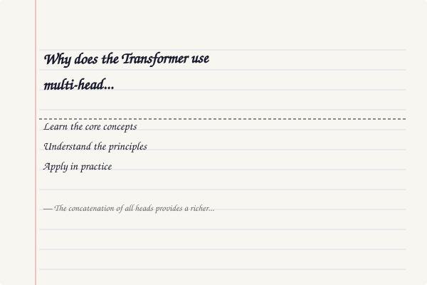
</a>
<a href="../../assets/images/diagrams/artificial-intelligence/12-nlp/why-does-the-transformer-use-multi-head-attention-instead-of-single-head-diagram.svg" target="_blank" rel="noopener">
  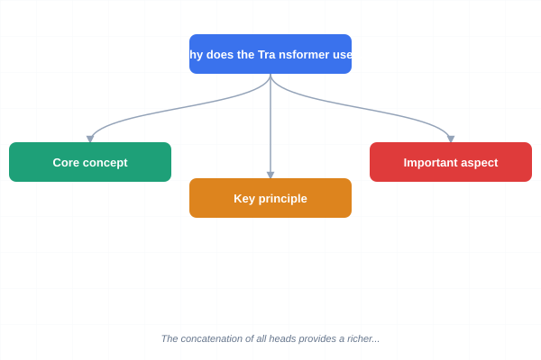
</a>
<a href="../../assets/images/diagrams/artificial-intelligence/12-nlp/why-does-the-transformer-use-multi-head-attention-instead-of-single-head-sticky.svg" target="_blank" rel="noopener">
  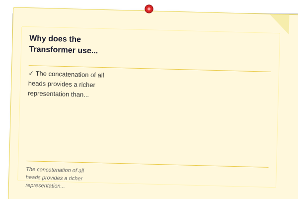
</a>


Different attention heads learn different relationship types. In "The cat sat on the mat," one head might capture subject-verb dependency ("cat" → "sat"), another captures adjective-noun or determiner-noun ("the" → "cat"), another captures spatial relation ("on" → "mat"), another captures self-attention for positional encoding. The concatenation of all heads provides a richer representation than any single head.

### Q6: Explain the significance of positional encoding in Transformers.

<a href="../../assets/images/diagrams/artificial-intelligence/12-nlp/explain-the-significance-of-positional-encoding-in-transformers-handwritten.svg" target="_blank" rel="noopener">
  
</a>
<a href="../../assets/images/diagrams/artificial-intelligence/12-nlp/explain-the-significance-of-positional-encoding-in-transformers-diagram.svg" target="_blank" rel="noopener">
  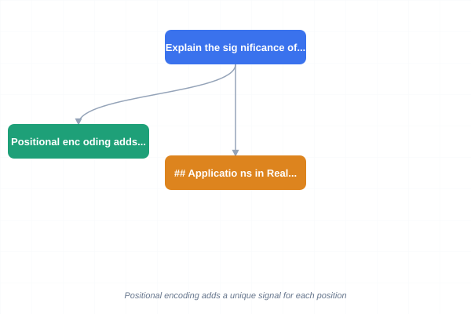
</a>
<a href="../../assets/images/diagrams/artificial-intelligence/12-nlp/explain-the-significance-of-positional-encoding-in-transformers-sticky.svg" target="_blank" rel="noopener">
  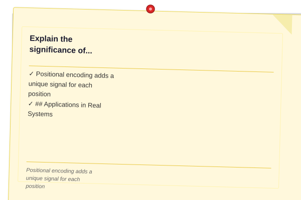
</a>


Unlike RNNs which process tokens sequentially (inherently ordered), Transformers process all tokens in parallel and have no built-in notion of position. Positional encoding adds a unique signal for each position. The original Transformer used sinusoidal functions: PE(pos, 2i) = sin(pos/10000^(2i/d)) and PE(pos, 2i+1) = cos(pos/10000^(2i/d)). This allows the model to learn relative positions (PE(pos+k) is a linear function of PE(pos)), enabling length generalization beyond the training context window.

## Applications in Real Systems

| Application | NLP Techniques Used | Scale / Impact |
|-------------|-------------------|----------------|
| **Google Search** | BERT ranking (since 2019), NER, tokenization, n-gram models | BERT powers 1 in 10 queries; trillions of searches/year |
| **Siri / Alexa** | ASR → Tokenization → NER → Intent classification → Slot filling | "Set a timer for 10 minutes" → Intent: SetTimer, Slot: 10 minutes |
| **ChatGPT / GPT-4** | BPE tokenization → Transformer decoder → RLHF | 100M+ users, generates billions of tokens daily |
| **Gmail Smart Compose** | GPT-style autoregressive LM with user context | Suggests completions, saves users 10% typing time |
| **Google Translate** | Encoder-decoder Transformer (Google Neural Machine Translation) | 100+ languages, 500M+ users, 143B words translated daily |
| **Sentiment Analysis** | BERT fine-tuning, Naive Bayes, LSTM | Brands monitor Twitter/Reddit sentiment in real-time |
| **Spam Detection** | Naive Bayes, logistic regression, BERT | Gmail blocks 99.9% of 10M+ daily spam emails |
| **Grammarly / LanguageTool** | POS tagging, dependency parsing, BERT, sequence labeling | 30M+ daily users, corrects grammar/style/tone |
| **Amazon Product Search** | Query understanding, NER (brands/products), embedding similarity | "wireless noise-canceling headphones under $100" → filtered results |
| **Healthcare NLP** | NER (diseases, drugs, procedures), relation extraction | Extract diagnoses from clinical notes, ICD-10 coding |
| **Legal Document Review** | NER (parties, dates, clauses), text classification, information extraction | 50% reduction in document review time |
| **Social Media Monitoring** | Sentiment analysis, topic modeling, entity extraction | Brand crisis detection, election monitoring |

### Case Study: Google Search BERT Integration

<a href="../../assets/images/diagrams/artificial-intelligence/12-nlp/case-study-google-search-bert-integration-handwritten.svg" target="_blank" rel="noopener">
  
</a>
<a href="../../assets/images/diagrams/artificial-intelligence/12-nlp/case-study-google-search-bert-integration-diagram.svg" target="_blank" rel="noopener">
  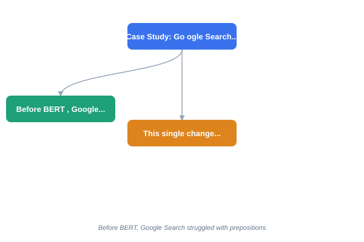
</a>
<a href="../../assets/images/diagrams/artificial-intelligence/12-nlp/case-study-google-search-bert-integration-sticky.svg" target="_blank" rel="noopener">
  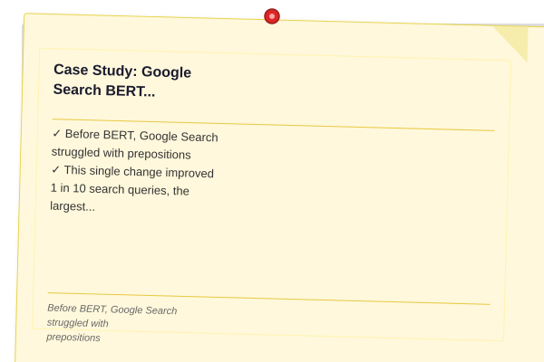
</a>


Before BERT, Google Search struggled with prepositions. For "2019 brazil traveler to USA need visa," the system ignored "to" and returned results about Brazilians visiting other countries. After BERT's 2019 integration, the model correctly understood the directional relationship — a Brazilian wanting to travel TO the USA. This single change improved 1 in 10 search queries, the largest improvement in Google Search history.

### Case Study: Gmail Spam Filter

<a href="../../assets/images/diagrams/artificial-intelligence/12-nlp/case-study-gmail-spam-filter-handwritten.svg" target="_blank" rel="noopener">
  
</a>
<a href="../../assets/images/diagrams/artificial-intelligence/12-nlp/case-study-gmail-spam-filter-diagram.svg" target="_blank" rel="noopener">
  
</a>
<a href="../../assets/images/diagrams/artificial-intelligence/12-nlp/case-study-gmail-spam-filter-sticky.svg" target="_blank" rel="noopener">
  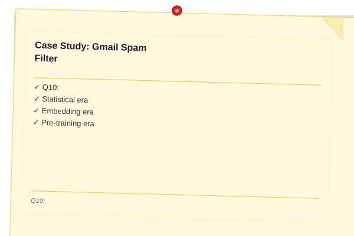
</a>


Gmail's spam filter processes billions of messages daily using:
- Naive Bayes classifier (first-line, fast filtering — catches 50% of spam)
- Deep learning models (second-line — catches 99.9%)
- Graph-based analysis (third-line — detects spam campaigns)
- User feedback signals (reported spam/ham)

The system adapts to new spam patterns within minutes, crucial for rapidly evolving phishing campaigns.

## Concept Comparison

| Method | Generative/Discriminative? | Features | Complexity | Best For |
|--------|:---:|:---:|:---:|---------|
| N-gram LM | Generative | Word counts | O(V^n) vocab | Language modeling |
| Naive Bayes | Generative | Word features | O(V × C) | Text classification |
| HMM | Generative | Tag transitions+emissions | O(T² n) | POS tagging |
| CRF | Discriminative | Arbitrary overlapping | O(T² n) training | NER, shallow parsing |
| PCFG | Generative | Rule probabilities | O(n³ |G|) | Parsing |
| Word2Vec | Neural | Context windows | O(V × d) | Embedding |
| Transformer | Neural | Self-attention | O(n² × d) | All modern NLP |
| BERT | Neural (encoder) | Bidirectional attention | O(n² × d) per layer | Understanding tasks |
| GPT | Neural (decoder) | Causal attention | O(n² × d) per layer | Generation tasks |

## Quick Reference — NLP Metrics

| Metric | Formula | What It Measures |
|--------|---------|-----------------|
| Perplexity | P(w1...wn)^{-1/n} | LM quality (lower = better) |
| Precision | TP / (TP + FP) | How many selected are relevant |
| Recall | TP / (TP + FN) | How many relevant are selected |
| F1 Score | 2 × P × R / (P + R) | Harmonic mean of P and R |
| Tag Accuracy | Correct tags / Total tags | Sequence labeling quality |
| BLEU | BP × exp(∑ log P_n / N) | Machine translation quality |
| ROUGE-L | LCS-based recall | Summarization quality |
| BERTScore | Cosine similarity of BERT embeddings | Semantic text similarity |

## Cross-Application Matrix

| Technique | ML | CV | NLP | Research |
|-----------|:---:|:---:|:---:|:---:|
| N-gram LMs | ✗ | ✗ | ✓ | ✓ |
| Naive Bayes | ✓ | ✓ | ✓ | ✓ |
| HMM/Viterbi | ✗ | ✗ | ✓ | ✓ |
| CRF | ✗ | ✗ | ✓ | ✓ |
| CKY Parsing | ✗ | ✗ | ✓ | ✓ |
| Word Embeddings | ✓ | ✓ | ✓ | ✓ |
| Transformers | ✓ | ✓ | ✓ | ✓ |
| BERT/GPT | ✓ | ✓ | ✓ | ✓ |

## Chapter Quiz

**Q1:** What problem does Kneser-Ney smoothing solve that Laplace (add-1) smoothing does not?
- A) It is faster to compute
- B) It better handles unseen n-grams by discounting and interpolating with lower-order models
- C) It only works for bigrams
- D) It guarantees integer counts

<details><summary>Answer&lt;/summary&gt;B) Kneser-Ney uses absolute discounting and interpolation with lower-order models, producing much better probability estimates for unseen n-grams than add-1 smoothing.</details>

**Q2:** What is the key advantage of CRFs over HMMs for sequence labeling?
- A) CRFs are faster to train
- B) CRFs model P(t|w) directly and support arbitrary overlapping features without independence assumptions
- C) CRFs require less training data
- D) CRFs always produce higher accuracy

<details><summary>Answer&lt;/summary&gt;B) CRFs are discriminative and can use arbitrary overlapping features, while HMMs require independence assumptions between observations given the state.</details>

**Q3:** The CKY algorithm requires the grammar to be in what normal form?
- A) Greibach Normal Form
- B) Chomsky Normal Form
- C) Kuroda Normal Form
- D) Backus-Naur Form

<details><summary>Answer&lt;/summary&gt;B) CKY parsing requires the CFG to be in Chomsky Normal Form (rules are A → BC or A → w).</details>

**Q4:** Which word embedding method can produce vectors for out-of-vocabulary words at inference time?
- A) Word2Vec
- B) GloVe
- C) FastText
- D) Both A and B

<details><summary>Answer&lt;/summary&gt;C) FastText uses character n-grams, so it can compose embeddings for unseen words even if the full word was not in the training vocabulary.</details>

**Q5:** What is the primary advantage of the Transformer architecture over RNNs?
- A) Lower memory usage
- B) Parallel computation across all positions and no vanishing gradient
- C) Smaller model size
- D) Better for streaming data

<details><summary>Answer&lt;/summary&gt;B) The Transformer processes all tokens in parallel (no sequential recurrence) and avoids vanishing gradients through direct attention connections between any two positions.</details>

**Q6:** BERT is pre-trained using which two objectives?
- A) Language modeling and translation
- B) Masked Language Modeling (MLM) and Next Sentence Prediction (NSP)
- C) Classification and generation
- D) Autoencoding and autoregression

<details><summary>Answer&lt;/summary&gt;B) BERT uses MLM (predict masked tokens) and NSP (predict if two sentences are consecutive) for pre-training.</details>

**Q7:** What does BIO encoding stand for in sequence labeling?
- A) Binary, Inside, Outside
- B) Beginning, Inside, Outside
- C) Beginning, Inward, Outward
- D) Basic, Indexed, Ordered

<details><summary>Answer&lt;/summary&gt;B) BIO: Beginning marks the first token of an entity, Inside marks continuation, Outside marks non-entity tokens.</details>

**Q8:** Why does the Transformer use multi-head attention instead of single-head?
- A) Multi-head is faster computationally
- B) Each head can learn different attention patterns (syntax, semantics, position)
- C) Multi-head uses less memory
- D) It allows smaller hidden dimensions

<details><summary>Answer&lt;/summary&gt;B) Different heads specialize in different relationships — one head may capture syntactic dependencies, another captures semantic similarity, another captures positional information.</details>

**Q9:** What is the role of positional encoding in Transformers?
- A) It encodes the position of the sentence in the document
- B) It provides position information since self-attention is permutation-invariant
- C) It helps with memory management
- D) It encodes the length of the sequence

<details><summary>Answer&lt;/summary&gt;B) Self-attention processes all tokens simultaneously with no inherent order. Positional encoding injects sequence position information into the model.</details>

**Q10:** Which of the following best describes the difference between stemming and lemmatization?
- A) Stemming is faster but less accurate; lemmatization is slower but produces real words
- B) Stemming requires POS tags; lemmatization does not
- C) Stemming is only for English; lemmatization works for all languages
- D) There is no practical difference

<details><summary>Answer&lt;/summary&gt;A) Stemming uses heuristic rules (fast, rough), lemmatization uses vocabulary/morphology (slower, precise output is a real word).</details>

## Summary

NLP spans the full pipeline from raw text through tokenization, language modeling, classification, sequence labeling, parsing, word embeddings, and Transformer-based deep learning. Modern NLP has undergone a paradigm shift:

1. **Statistical era** (1990s-2010s): N-gram LMs, HMMs, CRFs, SVM — hand-crafted features, small data, interpretable.
2. **Embedding era** (2013-2017): Word2Vec, GloVe, FastText — distributed representations, vector arithmetic.
3. **Pre-training era** (2018-present): BERT, GPT, T5 — massive pre-training, fine-tuning, few-shot learning.

The Transformer solved the fundamental limitations of RNNs (parallelization, long-range dependencies), and scaling laws show that larger models with more data consistently improve performance. The shift from static embeddings (Word2Vec) to contextual embeddings (BERT/GPT) was particularly transformative — enabling models to understand that "bank" means different things in "river bank" vs "investment bank."

Key toolkits (NLTK for learning, spaCy for production, HuggingFace Transformers for modern NLP) provide accessible implementations. The future is trending toward even larger models, multimodal NLP (text + images + speech), efficient architectures (sparse attention, mixture of experts), and improved reasoning capabilities through chain-of-thought and tool use.

## Exercises

### Review Questions

1. Explain the relationship between n-gram order and model quality. What are the practical limits on n-gram order?
2. Why do CRFs often outperform HMMs for sequence labeling tasks?
3. How does lexicalization improve PCFG parsing accuracy?
4. Compare stemming and lemmatization. When would you use each in a search engine?
5. Explain how BPE tokenization handles OOV words. Why is this critical for modern NLP?
6. What is the difference between static word embeddings (Word2Vec) and contextual embeddings (BERT)?
7. Why does the Transformer use scaled dot-product attention instead of raw dot-product?
8. Describe the difference between BERT and GPT architectures and when you would choose each.
9. What is the label bias problem in HMMs, and how do CRFs solve it?
10. Explain the difference between constituency parsing and dependency parsing.

### Application Problems

11. Train a trigram language model with Kneser-Ney smoothing on a 100K-word corpus. Compute perplexity on a held-out test set of 10K words.
12. Implement an HMM-based POS tagger with 12 universal tags using the Viterbi algorithm. Evaluate accuracy on the Brown corpus.
13. Write a Python script using spaCy to extract all person, organization, and location entities from a news article. Compute precision and recall against a gold standard of 10 annotated articles.
14. Implement a naive Bayes classifier for sentiment analysis on the IMDB movie review dataset (25K train, 25K test). Compare with a logistic regression baseline.
15. Train Word2Vec embeddings on a domain-specific corpus (e.g., medical abstracts) and evaluate using analogy tasks (doctor:hospital :: teacher:?).
16. Implement BPE tokenization from scratch on a small corpus. Show how the vocabulary evolves across merges.
17. Build a text classification pipeline using BERT fine-tuning. Compare accuracy with naive Bayes on the same dataset.

### Challenge Problems

18. Implement the CKY algorithm for a PCFG in Chomsky Normal Form. Apply it to the ATIS corpus. Report the most probable parse for a test sentence containing at least 8 words.
19. Implement a minimal Transformer with one head of self-attention from scratch using NumPy (no PyTorch/TF). Demonstrate it on a tiny language modeling task with a vocabulary of 10 tokens.
20. Fine-tune BERT for a multi-class text classification task (e.g., 20 Newsgroups). Analyze which layers encode the most task-specific information by probing intermediate representations (probing classifier at each layer).
21. Build a complete NLP pipeline for a question-answering system: document retrieval → passage ranking → answer extraction using BERT. Evaluate on SQuAD 2.0.
22. Compare perplexity of GPT-2, a trigram model, and a unigram model on the same test set. Analyze the sources of improvement at each level.
