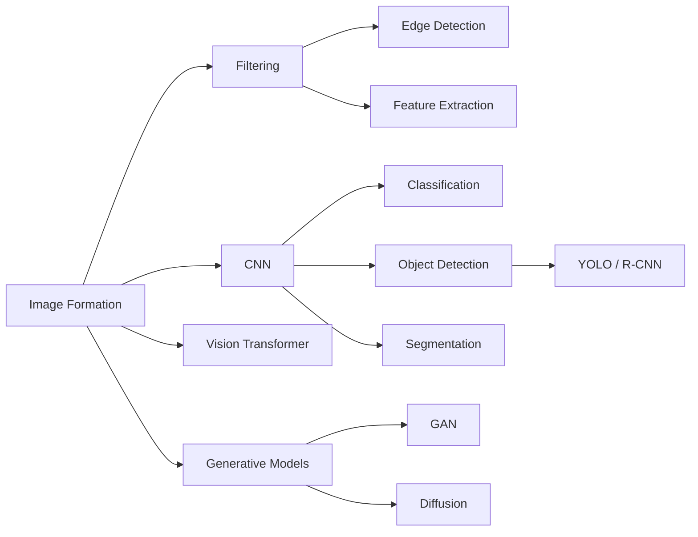

# Chapter 13: Computer Vision

**Previous:** [Chapter 12: Natural Language Processing](12-nlp.md) | **Next:** [Chapter 14: Robotics](14-robotics.md)

## Learning Objectives

By the conclusion of this chapter, the student will be able to: (1) describe the image formation process and basic filtering operations; (2) implement edge detection and feature extraction; (3) explain the architectures of CNNs and Vision Transformers; (4) describe object detection and segmentation paradigms; (5) understand generative image models.

## Chapter at a Glance

| Section | Key Topics | Key Terms |
|---------|-----------|-----------|
| Image Formation | Pinhole camera, projection | Pixels, intrinsic/extrinsic matrix |
| Filtering | Convolution, Gaussian, Sobel | Kernel, blur, edge detection |
| Edge Detection | Canny, non-max suppression | Gradient magnitude, hysteresis |
| Feature Extraction | SIFT, HOG | Scale-invariant, gradient histogram |
| Image Classification | CNN, AlexNet, ResNet | Convolution, pooling, skip connection |
| Object Detection | R-CNN, Fast/Faster R-CNN, YOLO | Bounding box, region proposal |
| Segmentation | Semantic, instance, U-Net | Pixel-level classification, mask |
| Vision Transformers | ViT, patch embedding | Self-attention on image patches |
| Generative Models | GAN, diffusion, Stable Diffusion | Text-to-image, latent diffusion |

## Chapter Roadmap

## 13.1 Image Formation

Digital images are two-dimensional arrays of **pixels**, each representing light intensity at a spatial location. A grayscale image is a matrix $I \in \mathbb{R}^{H \times W}$. A color image has three channels (red, green, blue): $I \in \mathbb{R}^{H \times W \times 3}$.

**Image formation** involves:
- **Projection:** Mapping 3D world coordinates to 2D image coordinates. The pinhole camera model: $[u, v]^\top = K [R \mid t] [X, Y, Z, 1]^\top$, where $K$ is the intrinsic matrix and $[R \mid t]$ the extrinsic matrix.
- **Sampling and quantization:** Converting continuous light to discrete pixel values.
- **Illumination:** The lighting conditions affecting observed intensity.

## 13.2 Filtering

Image **filtering** applies a kernel (small matrix) across the image via convolution:

$$(I * K)[i, j] = \sum_m \sum_n I[i+m, j+n] \, K[m, n]$$

Common filters:
- **Gaussian blur:** $K_\sigma[i, j] = \frac{1}{2\pi\sigma^2} \exp(-\frac{i^2 + j^2}{2\sigma^2})$ --- smooths noise.
- **Sobel operator:** Detects horizontal and vertical edges with $3 \times 3$ derivative kernels.
- **Median filter:** Non-linear filter replacing each pixel with the median of its neighbors (effective for salt-and-pepper noise).

## 13.3 Edge Detection

### 13.3.1 Canny Edge Detector

The Canny detector (1986) is a multi-stage algorithm:

1. **Gaussian smoothing** to reduce noise.
2. **Compute gradient magnitude and direction** using Sobel operators.
3. **Non-maximum suppression:** Thin edges by keeping only pixels at local gradient maxima.
4. **Double thresholding:** Classify pixels as strong, weak, or non-edge.
5. **Edge tracking by hysteresis:** Keep weak edges connected to strong edges.

### 13.3.2 Gradient-Based Approaches

The image gradient $\nabla I = (\partial I/\partial x, \partial I/\partial y)$ captures local intensity changes. Edge magnitude: $|\nabla I| = \sqrt{(\partial I/\partial x)^2 + (\partial I/\partial y)^2}$. Edge direction: $\theta = \arctan(\partial I/\partial y, \partial I/\partial x)$.

## 13.4 Feature Extraction

**SIFT (Scale-Invariant Feature Transform):** Detects keypoints at scale-space extrema, describes local regions with 128-dimensional gradient histograms. Invariant to scale, rotation, and partially to illumination.

**HOG (Histogram of Oriented Gradients):** Divides the image into cells, computes gradient orientation histograms per cell, normalizes across blocks. Used extensively for pedestrian detection.

## 13.5 Image Classification

Image classification assigns a label from a fixed set to an input image.

### 13.5.1 Convolutional Neural Networks (CNNs)

CNNs (LeCun et al., 1989) are the foundational architecture for image understanding. Key layers:

- **Convolutional layer:** Applies learnable filters to detect local patterns. A filter $W \in \mathbb{R}^{k \times k \times C_{\text{in}} \times C_{\text{out}}}$ produces $C_{\text{out}}$ feature maps.
- **Pooling layer:** Reduces spatial dimensions (max pooling, average pooling).
- **Fully connected layer:** Maps features to class scores.
- **Activation function:** ReLU ($\max(0, x)$) is standard for hidden layers.

**Notable CNN architectures:**
- **AlexNet** (Krizhevsky et al., 2012): 5 convolutional + 3 fully connected layers. Won ImageNet 2012.
- **VGGNet:** 16--19 layers of $3 \times 3$ convolutions.
- **ResNet** (He et al., 2015): Skip connections enabling 152-layer networks. Solves the vanishing gradient problem.
- **Inception (GoogLeNet):** Parallel convolutions at multiple scales.

## 13.6 Object Detection

Object detection localizes and classifies objects within an image, producing bounding boxes.

**R-CNN (Regional CNN):** Proposes candidate regions, classifies each with a CNN. Slow (per-region forward passes).

**Fast R-CNN:** Single forward pass per image, ROI pooling extracts features per region.

**Faster R-CNN:** Introduces Region Proposal Network (RPN) for learned region proposals.

**YOLO (You Only Look Once):** Single-shot detector dividing the image into a grid, predicting bounding boxes and class probabilities directly. Real-time performance (45+ FPS).

## 13.7 Segmentation

**Semantic segmentation:** Assigns a class label to each pixel. Architectures use encoder-decoder structures (U-Net, DeepLab).

**Instance segmentation:** Detects individual object instances and produces pixel-level masks. Mask R-CNN extends Faster R-CNN with a mask prediction branch.

## 13.8 Vision Transformers (ViT)

The Vision Transformer (Dosovitskiy et al., 2021) applies the transformer architecture to image patches. An image is divided into $16 \times 16$ patches, linearly projected and fed to a standard transformer encoder with positional embeddings.

ViT achieves competitive performance with CNNs on image classification and scales effectively with data.

## 13.9 Generative Image Models

### 13.9.1 Generative Adversarial Networks (GANs)

GANs (Goodfellow et al., 2014) consist of a generator $G$ producing images and a discriminator $D$ distinguishing real from fake. Training is a minimax game:

$$\min_G \max_D \mathbb{E}_{x \sim p_{\text{data}}} [\log D(x)] + \mathbb{E}_{z \sim p_z} [\log(1 - D(G(z)))]$$

**StyleGAN** (Karras et al., 2019) introduced style-based generation with disentangled latent spaces.

### 13.9.2 Diffusion Models

Denoising diffusion probabilistic models (Ho et al., 2020) learn to reverse a gradual noising process. The forward process adds Gaussian noise over $T$ steps. The reverse process learns to denoise:

$$p_\theta(x_{t-1} \mid x_t) = \mathcal{N}(x_{t-1}; \mu_\theta(x_t, t), \Sigma_\theta(x_t, t))$$

**Latent diffusion models** (Rombach et al., 2022) operate in a compressed latent space, enabling efficient high-resolution generation. Stable Diffusion is a notable implementation.

**Text-to-image diffusion** (DALL-E 2, Imagen) conditions generation on text embeddings from large language models.

> **💡 Pro Tip:** YOLO is the go-to choice for real-time object detection (45+ FPS), while Faster R-CNN offers higher accuracy for offline analysis. For segmentation, U-Net is the standard architecture when data is limited.

## Concept Comparison

| Task | Output | Example Architecture | Key Metric |
|------|--------|-------------------|:---:|
| Classification | Class label | ResNet, ViT | Top-1/Top-5 accuracy |
| Object Detection | Bounding boxes + classes | YOLO, Faster R-CNN | mAP (mean Average Precision) |
| Semantic Seg. | Pixel class labels | U-Net, DeepLab | IoU (Intersection over Union) |
| Instance Seg. | Per-instance masks | Mask R-CNN | mAP over masks |
| Generation | Images | GAN, Diffusion Model | FID, IS |

## Quick Reference — CNN Components

| Layer | Operation | Effect |
|-------|-----------|--------|
| Convolution | Slide kernel over input | Detect local patterns |
| ReLU | max(0, x) | Non-linearity |
| Max Pooling | Downsample 2×2 blocks | Reduce spatial dims |
| Flatten | 2D to 1D vector | Bridge to FC layers |
| Fully Connected | Weighted sum + activation | Classify features |
| Softmax | e^xᵢ/Σ e^xⱼ | Probability distribution |

## Cross-Application Matrix

| Technique | ML | CV | NLP | Research |
|-----------|:---:|:---:|:---:|:---:|
| CNN | ✅ | ✅ | ✅ | ✅ |
| Object Detection | ⬜ | ✅ | ⬜ | ✅ |
| Segmentation | ⬜ | ✅ | ⬜ | ✅ |
| Vision Transformer | ✅ | ✅ | ✅ | ✅ |
| GAN/Diffusion | ✅ | ✅ | ✅ | ✅ |

## Chapter Quiz

**Q1:** What key innovation enabled ResNet to train 152-layer networks?
- A) Dropout regularization
- B) Skip connections (residual connections) solving the vanishing gradient problem
- C) Batch normalization
- D) Data augmentation

Answer
B) ResNet's skip connections allow gradients to flow directly through the network, bypassing layers and preventing vanishing gradients in very deep networks.

**Q2:** What is the main advantage of YOLO over R-CNN-style detectors?
- A) YOLO is more accurate
- B) YOLO uses a single forward pass for the entire image, achieving real-time speed
- C) YOLO requires less training data
- D) YOLO handles small objects better

Answer
B) YOLO treats detection as a single regression problem, predicting bounding boxes and class probabilities in one pass without a separate region proposal stage.

**Q3:** Diffusion models generate images by:
- A) Adversarial training between generator and discriminator
- B) Learning to reverse a gradual noising process step by step
- C) Autoencoding input images through a bottleneck
- D) Matching nearest neighbors in a training set

Answer
B) Diffusion models learn the reverse of a Markov noising process, gradually converting random noise into structured images.

## 13.10 Summary

Computer vision progresses from low-level image processing through feature extraction to high-level understanding. CNNs remain central for discriminative tasks. Transformers and diffusion models represent the current frontier for both analysis and generation.

## Exercises

### Review Questions

1. Explain the role of non-maximum suppression in the Canny edge detector.
2. Compare R-CNN, Fast R-CNN, and YOLO in terms of accuracy and speed.
3. How do Vision Transformers differ from CNNs in processing image structure?

### Application Problems

4. Implement Sobel edge detection from scratch. Apply it to a grayscale image and compare thresholds.
5. Implement a simple CNN classifier for MNIST (10-digit classification). Report test accuracy.

### Challenge Problem

6. Implement a UNet for semantic segmentation on a synthetic dataset of geometric shapes (circles, squares, triangles on plain background). Report per-class IoU.
