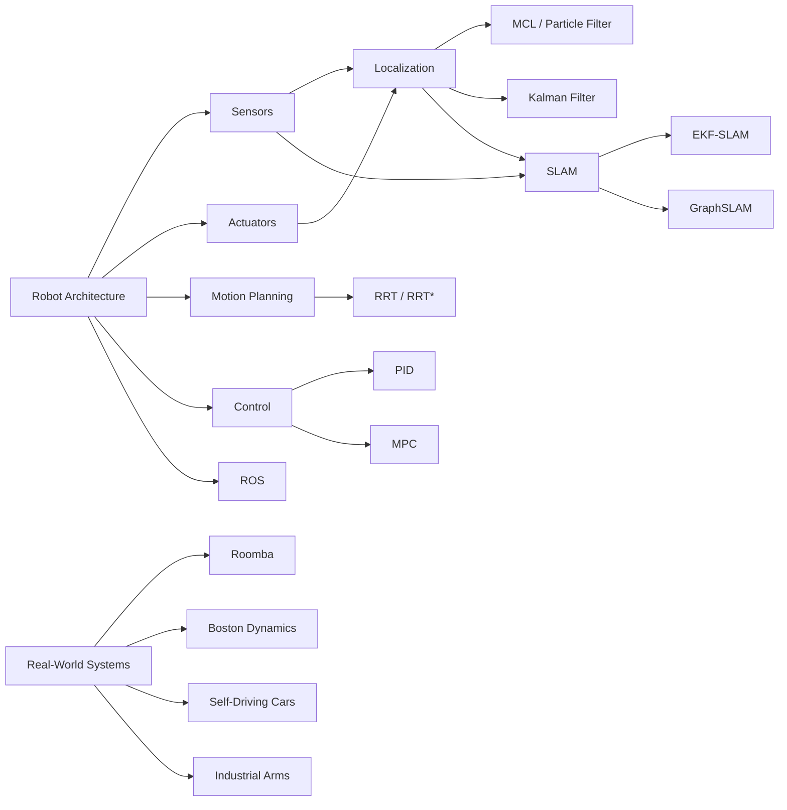

# Chapter 14: Robotics

**Previous:** [Chapter 13: Computer Vision](13-computer-vision.md) | **Next:** [Chapter 15: Ethics of AI](15-ethics-ai.md)

## Learning Objectives

By the conclusion of this chapter, the student will be able to: (1) describe the hardware components of a robotic system; (2) implement Monte Carlo localization; (3) explain the SLAM problem and its solution approaches; (4) apply motion planning algorithms including RRT; (5) understand control theory fundamentals; (6) compare localization methods and select appropriate techniques; (7) analyze real-world robotics systems from Roomba to Boston Dynamics; (8) answer interview questions on SLAM, sensor fusion, and control theory.

<!-- Image Gallery -->
<section class="lesson-visuals" aria-label="Visual learning resources">
  <header><span>VISUAL LEARNING</span><h2>See it. Review it. Remember it.</h2></header>
  <a class="lesson-visual-card" href="../../../assets/images/lessons/artificial-intelligence/14-robotics/.png" target="_blank" rel="noopener">
    
    <span><strong>Handwritten notes</strong>Condensed notes for deliberate review.</span>
  </a>
  <a class="lesson-visual-card" href="../../../assets/images/lessons/artificial-intelligence/14-robotics/.png" target="_blank" rel="noopener">
    
    <span><strong>Sticky-note revision</strong>Fast recall prompts for revision.</span>
  </a>
  <a class="lesson-visual-card" href="../../../assets/images/lessons/artificial-intelligence/14-robotics/.png" target="_blank" rel="noopener">
    
    <span><strong>Visual concept guide</strong>A connected explanation of the key ideas.</span>
  </a>
</section>
<!-- End Image Gallery -->


---

## Why Robotics Matters

Imagine your **own arm** reaching for a glass of water. Your eyes (sensors) see the glass. Your brain (controller) estimates its position, plans a trajectory, and sends signals through your nervous system (communication bus). Your muscles (actuators) contract to move your arm. Your sense of touch (proprioception) confirms you've grasped it. If someone bumps you, your arm automatically compensates — that's a **feedback control loop** running at subconscious speed.

A robot is the same architecture built from silicon and steel. Sensors collect data, a control loop estimates state and plans actions, actuators execute motion, and the cycle repeats hundreds of times per second. Every autonomous system — from a Roomba vacuuming your floor to a self-driving car navigating highways — runs this **sense-plan-act** loop. Robotics is where AI meets the physical world, and understanding it is essential for any engineer building systems that move.

---

## Chapter at a Glance

| Section | Key Topics | Key Terms |
|---------|-----------|-----------|
| Robot Architecture | Sensing, estimation, planning, control | Embodied agent, actuators |
| Robot Types | Manipulator, mobile, humanoid, swarm, soft | DOF, end effector, chassis |
| Sensors | Camera, LIDAR, IMU, GPS, encoders | Point cloud, odometry, noise model |
| Actuators | DC motor, servo, stepper, hydraulic | Torque, PWM, PID output |
| Localization | MCL (particle filter), Kalman filter | Belief, kidnapped robot, pose |
| SLAM | EKF-SLAM, GraphSLAM | Landmarks, loop closure, graph optimization |
| Motion Planning | C-space, RRT, RRT* | Collision-free, asymptotic optimality |
| Control | PID, MPC | Feedback, proportional gain, horizon |
| ROS | Nodes, topics, services, actions | Middleware, tf, launch files |

---

## Chapter Roadmap



---

## 14.1 Robot Definition and Architecture

**Real-world analogy:** A robot is like a human body. The skeleton provides structure (kinematic chain), the nervous system carries signals (communication bus), the brain processes and decides (control computer), the eyes and skin sense the world (sensors), and the muscles generate force (actuators).

A **robot** is a physically embodied agent that perceives its environment through sensors and acts upon it through actuators. The robotic system integrates perception, planning, and control within a physical platform.

### 14.1.1 The Sense-Plan-Act Loop


Every robotic system follows a cyclic pipeline:

1. **Sense:** Read raw sensor data (camera image, LIDAR scan, IMU reading).
2. **Process:** Filter noise, extract features, estimate state (pose, velocity).
3. **Plan:** Decide what action to take (path to follow, joint to move).
4. **Act:** Send commands to actuators (motor PWM, gripper close).
5. **Repeat:** Loop back to Sense, typically at 10–1000 Hz.

### 14.1.2 Algorithm — Sense-Plan-Act Loop


```
Algorithm: SENSE-PLAN-ACT
Input:  sensor_stream (continuous sensor data)
Output: actuator_commands (motor/throttle/gripper signals)
1.  INITIALIZE robot state s = (x, y, theta, velocity)
2.  INITIALIZE control parameters (PID gains, planning horizon)
3.  while RUNNING do
4.      raw_data ← READ_ALL_SENSORS()
5.      filtered_data ← APPLY_FILTER(raw_data)   // e.g., median, Kalman
6.      s ← ESTIMATE_STATE(filtered_data, s)     // update belief
7.      goal ← GET_CURRENT_GOAL()                // target pose or task
8.      path ← PLAN_PATH(s, goal)                // e.g., RRT, A*
9.      control_signal ← COMPUTE_CONTROL(s, path) // e.g., PID
10.     SEND_ACTUATOR_COMMANDS(control_signal)
11.     WAIT(TIMESTEP)                           // maintain loop rate
12. end while
```

### 14.1.3 Dry Run — Sense-Plan-Act for a Line-Following Robot


**Scenario:** Robot follows a black line on a white surface. Goal: stay centered.

| Step | State (x, error) | Sensor Raw | Filtered | Plan | Act |
|------|------------------|------------|----------|------|-----|
| Init | (0, 0) | — | — | — | — |
| t=1 | (0, +15 px) | 8 IR readings [0,0,1,1,1,1,0,0] | line offset = +15px | turn left 10° | left motor PWM=150, right=200 |
| t=2 | (0.5, +5 px) | [0,1,1,1,1,1,1,0] | offset = +5px | slight left 3° | left=180, right=200 |
| t=3 | (1.0, −2 px) | [0,0,1,1,1,1,0,0] | offset = −2px | slight right 2° | left=200, right=190 |
| t=4 | (1.5, 0 px) | [0,0,1,1,1,1,0,0] | offset = 0px | straight | left=200, right=200 |

**Observation:** At t=1, error is large → aggressive correction. By t=4, the steady-state error approaches zero. PID gains determine how quickly the robot converges without overshooting.

### 14.1.4 Python — Sense-Plan-Act Loop


```python
import time
import random
from dataclasses import dataclass, field
from typing import List, Tuple

@dataclass
class RobotState:
    x: float = 0.0
    y: float = 0.0
    theta: float = 0.0
    velocity: float = 0.0

class SensorSuite:
    """Simulated sensor suite returning noisy readings."""
    def read_all(self) -> dict:
        return {
            "ir": [random.gauss(0, 1) for _ in range(8)],
            "encoder": random.gauss(0, 0.1),
            "imu_gyro": random.gauss(0, 0.05),
        }

class SimpleController:
    def __init__(self, kp: float = 1.0, ki: float = 0.1, kd: float = 0.05):
        self.kp, self.ki, self.kd = kp, ki, kd
        self.integral = 0.0
        self.prev_error = 0.0

    def compute(self, error: float, dt: float = 0.1) -> float:
        self.integral += error * dt
        derivative = (error - self.prev_error) / dt if dt > 0 else 0.0
        output = self.kp * error + self.ki * self.integral + self.kd * derivative
        self.prev_error = error
        return output

def sense_plan_act_loop(runtime: float = 5.0, dt: float = 0.1):
    state = RobotState()
    sensors = SensorSuite()
    controller = SimpleController(kp=2.0, ki=0.5, kd=0.1)
    goal_heading = 0.0
    t = 0.0

    while t < runtime:
        # Sense
        raw = sensors.read_all()
        ir_center = raw["ir"][3] - raw["ir"][4]  # line offset estimate

        # Plan — compute heading error
        heading_error = goal_heading - state.theta + ir_center * 0.1

        # Act — compute motor correction
        correction = controller.compute(heading_error, dt)
        left_pwm = 150 - int(correction)
        right_pwm = 150 + int(correction)

        # Simulate state update
        state.theta += correction * dt * 0.5
        state.x += state.velocity * dt

        print(f"t={t:.1f} error={heading_error:.3f} correction={correction:.3f} "
              f"L={left_pwm} R={right_pwm} pose=({state.x:.2f},{state.y:.2f},{state.theta:.2f})")
        t += dt
        time.sleep(dt)

if __name__ == "__main__":
    sense_plan_act_loop(runtime=1.0)
```

### 14.1.5 Complexity Analysis


| Operation | Time | Space | Why |
|-----------|------|-------|-----|
| Sensor read | O(S) where S = sensor count | O(S) | Each sensor produces one reading; S is typically 5–20 |
| Kalman prediction | O(n²) for n-D state | O(n²) | Covariance matrix multiplication dominates |
| Path planning (RRT) | O(K log N) for K iterations, N tree nodes | O(N) | Nearest-neighbor search in KD-tree |
| PID control law | O(1) | O(1) | Simple arithmetic; no state beyond integral/derivative |
| Actuator write | O(A) where A = actuator count | O(A) | One command per actuator channel |

**Why O(n²) for Kalman?** The covariance matrix P is n×n; the prediction step performs P = F P Fᵀ + Q, which is two matrix multiplications of O(n³) naively, but optimized BLAS routines bring it to O(n²·⁸). For SLAM with thousands of landmarks, n² becomes prohibitive — that's why GraphSLAM uses sparse solvers.

### 14.1.6 Advantages & Disadvantages


| Aspect | Advantages | Disadvantages |
|--------|------------|---------------|
| Sense-Plan-Act | Simple, modular, widely understood | Sequential bottleneck; planning blocks sensing |
| Reactive (subsumption) | Fast, robust to failures | No global reasoning; can get stuck |
| Hybrid (deliberative + reactive) | Combines planning with fast reflexes | Complex to design and debug |
| Behavior-based | Good for multi-task robots | Scaling to many behaviors is hard |

### 14.1.7 Edge Cases


| Edge Case | Problem | Mitigation |
|-----------|---------|------------|
| Sensor dropout | No readings for a control cycle | Use IMU dead-reckoning as fallback |
| Actuator saturation | Motor cannot reach commanded speed | Clamp control output; anti-windup for integral term |
| Communication latency | ROS topic messages arrive late | Timestamp every message; use transform lookup |
| Power failure | Robot stops mid-task | Watchdog timer; safe-state controller |
| Thermal drift | IMU bias shifts with temperature | Periodic bias calibration; temperature compensation |

---

## 14.2 Robot Types

Robots are classified by their morphology, mobility, and application domain. The following table compares the major categories.

| Type | Example | DOF | Mobility | Environment | Key Challenge |
|------|---------|:---:|:--------:|-------------|---------------|
| **Manipulator** (industrial arm) | KUKA KR 6, Fanuc R-2000iB | 6–7 | Fixed base | Factory floor | Precision, payload, cycle time |
| **Mobile (wheeled)** | Roomba, TurtleBot, Clearpath Jackal | 2–3 | 2D planar | Indoor/outdoor | Odometry drift, slip |
| **Mobile (legged)** | Spot, Atlas, ANYmal | 12–20+ | Rough terrain | Unstructured | Balance, gait generation |
| **Aerial (UAV)** | DJI Phantom, Crazyflie, PX4-based | 4 (quad) | 3D flight | Open air/high-alt | Battery life, wind rejection |
| **Underwater (ROV/AUV)** | BlueROV, REMUS, Slocum glider | 4–6 | 3D underwater | Subsea | Pressure, acoustic comms |
| **Humanoid** | Atlas, ASIMO, Pepper | 26–32 | Bipedal | Human spaces | Balance, whole-body control |
| **Swarm** | Kilobot, Crazyflie swarm, Ant bots | 2–4 each | Collective | Varied | Coordination, comms range |
| **Soft robot** | Octopus gripper, fish-bot | ∞ (continuous) | Variable | Confined spaces | Modeling, control |

**Key takeaway:** The number of degrees of freedom (DOF), environment type, and task constraints determine the robot class. Most AI algorithms (localization, planning, control) apply across types with appropriate adaptations.

---

## 14.3 Sensors

**Real-world analogy:** Your eyes, fingertips, and inner ear are biological sensors. Eyes provide rich visual data (camera), fingertips detect contact and texture (tactile), and the inner ear senses rotation and acceleration (IMU). Your brain fuses these into a stable perception of the world.

### 14.3.1 Sensor Taxonomy


| Category | Sensor | Measures | Rate | Noise Model |
|----------|--------|----------|:----:|-------------|
| Exteroceptive | Camera | RGB/D intensity | 30–90 Hz | Gaussian + shot noise |
| Exteroceptive | LIDAR (2D/3D) | Distance to surfaces | 5–40 Hz | Gaussian range + outliers |
| Exteroceptive | Ultrasonic | Distance (wide cone) | 20–50 Hz | Speckle noise, multipath |
| Exteroceptive | GPS | Lat/Lon/Alt | 1–10 Hz | Gaussian ~1–5m stddev |
| Proprioceptive | IMU (accel + gyro) | Acceleration, rotation rate | 100–1000 Hz | Bias + white noise, drift |
| Proprioceptive | Wheel encoder | Rotations | 100–1000 Hz | Quantization, slip |
| Proprioceptive | Joint angle | Angular position | 100–1000 Hz | Encoder quantization |
| Proprioceptive | Force/torque | Contact forces | 100–1000 Hz | Bias, thermal drift |

### 14.3.2 Sensor Fusion Pipeline


1. **Acquire:** Read raw sensor values at native rates.
2. **Timestamp:** Assign synchronized timestamps to each reading.
3. **Filter:** Apply noise reduction (median filter for LIDAR, low-pass for IMU).
4. **Transform:** Project measurements into a common coordinate frame via `tf`.
5. **Fuse:** Combine measurements using Kalman filter or complementary filter.
6. **Publish:** Output fused estimate (pose, velocity) to other ROS nodes.

### 14.3.3 Algorithm — IMU + GPS Sensor Fusion (Complementary Filter)


```
Algorithm: COMPLEMENTARY-FUSION
Input:  accel (ax, ay, az), gyro (gx, gy, gz), gps (lat, lon, heading)
        alpha = 0.98  (weight for gyro integration)
Output: roll, pitch, yaw (fused orientation)
1.  accel_roll ← ATAN2(-ay, -az)
2.  accel_pitch ← ATAN2(ax, SQRT(ay² + az²))
3.  gps_yaw ← ATAN2(dy, dx) from GPS displacement
4.  // complementary filter: gyro dominates high frequencies, accel/GPS low
5.  fused_roll ← alpha * (prev_roll + gyro_x * dt) + (1 - alpha) * accel_roll
6.  fused_pitch ← alpha * (prev_pitch + gyro_y * dt) + (1 - alpha) * accel_pitch
7.  fused_yaw ← alpha * (prev_yaw + gyro_z * dt) + (1 - alpha) * gps_yaw
8.  return fused_roll, fused_pitch, fused_yaw
```

### 14.3.4 Dry Run — Sensor Fusion for a Drone


**Scenario:** Drone hovering at 10m altitude. GPS gives periodic fixes; IMU runs at 200 Hz.

| t (s) | Gyro (rad/s) | Accel (m/s²) | GPS heading | Raw roll (°) | Fused roll (°) | Notes |
|-------|--------------|--------------|-------------|--------------|----------------|-------|
| 0.00 | 0.0, 0.0, 0.0 | 0, 0, 9.81 | 0.0 | 0.0 | 0.0 | Initialized |
| 0.05 | 0.02, 0.0, 0.0 | −0.01, 0.0, 9.82 | — | 0.06 | 0.057 | Gyro integration dominates |
| 0.10 | 0.01, 0.0, 0.0 | −0.005, 0.0, 9.80 | — | 0.03 | 0.084 | Accumulating drift |
| 0.50 | 0.0, 0.0, 0.0 | 0.0, 0.0, 9.81 | 0.1° | 0.0 | 0.089 | GPS update pulls toward 0.1° |
| 1.00 | 0.0, 0.0, 0.0 | 0.0, 0.0, 9.81 | 0.08° | 0.0 | 0.067 | GPS slowly corrects bias |

**Observation:** The complementary filter lets the high-rate gyro track fast motions (t=0.05-0.10) while the low-rate GPS/accel slowly corrects gyro drift (t=0.50-1.00). Alpha=0.98 means 98% weight on gyro, 2% on absolute reference.

### 14.3.5 Python — IMU + GPS Sensor Fusion


```python
import math

class ComplementaryFilter:
    def __init__(self, alpha: float = 0.98):
        self.alpha = alpha
        self.roll = 0.0
        self.pitch = 0.0
        self.yaw = 0.0

    def predict(self, gyro: tuple, dt: float):
        """Predict step: integrate gyro rates."""
        gx, gy, gz = gyro
        self.roll += gx * dt
        self.pitch += gy * dt
        self.yaw += gz * dt

    def update_accel(self, accel: tuple):
        """Correct roll/pitch from accelerometer."""
        ax, ay, az = accel
        accel_roll = math.atan2(-ay, -az)
        accel_pitch = math.atan2(ax, math.sqrt(ay**2 + az**2))
        self.roll = self.alpha * self.roll + (1 - self.alpha) * accel_roll
        self.pitch = self.alpha * self.pitch + (1 - self.alpha) * accel_pitch

    def update_gps(self, gps_heading: float):
        """Correct yaw from GPS heading."""
        self.yaw = self.alpha * self.yaw + (1 - self.alpha) * gps_heading

    def get_orientation(self) -> tuple:
        return (self.roll, self.pitch, self.yaw)


# Simulation: 2 seconds of flight
filt = ComplementaryFilter(alpha=0.98)
dt = 0.01  # 100 Hz
for step in range(200):
    t = step * dt
    # Simulate small oscillations
    gyro = (0.1 * math.sin(2 * math.pi * t), 0.05 * math.cos(4 * math.pi * t), 0.0)
    accel = (0.0, 0.0, 9.81)
    filt.predict(gyro, dt)
    filt.update_accel(accel)
    if step % 50 == 0:  # GPS at 2 Hz
        filt.update_gps(gps_heading=0.0)
    if step % 20 == 0:
        r, p, y = filt.get_orientation()
        print(f"t={t:.2f} roll={math.degrees(r):.2f}° pitch={math.degrees(p):.2f}° "
              f"yaw={math.degrees(y):.2f}°")
```

### 14.3.6 Complexity Analysis


| Operation | Time | Space | Why |
|-----------|------|-------|-----|
| Sensor read | O(1) per sensor | O(1) | Hardware register read |
| Median filter (LIDAR) | O(n log n) per scan | O(n) | Sorting n range measurements |
| Complementary filter | O(1) | O(1) | 3 arithmetic operations per axis |
| Kalman fusion | O(n²) state | O(n²) | Covariance matrix operations |
| Coordinate transform | O(1) via precomputed matrix | O(1) | 4×4 homogeneous transform |

**Why complementary filter over Kalman for simple fusion?** The complementary filter is O(1) vs Kalman's O(n²), requires no noise model tuning, and works well when sensor frequency separation is clear (gyro handles high frequencies, accel/GPS handle low). Use Kalman when accurate covariance propagation is needed.

### 14.3.7 Advantages & Disadvantages


| Sensor | Advantages | Disadvantages |
|--------|------------|---------------|
| Camera | Rich semantic info, cheap | Lighting dependent, high data volume |
| LIDAR | Accurate range, works in dark | Expensive, degraded in fog/rain |
| IMU | High rate, no external ref | Drifts, needs bias calibration |
| GPS | Global, absolute | Unreliable indoors, low rate |
| Ultrasonic | Very cheap, simple | Wide beam, specular reflections |
| Wheel encoder | Simple, accurate at low speed | Slip causes unbounded drift |

### 14.3.8 Edge Cases


| Edge Case | Problem | Mitigation |
|-----------|---------|------------|
| LIDAR in rain | Raindrops create false returns | Outlier filter, drop intensity threshold |
| Camera low light | High noise, low contrast | Auto-exposure, IR illumination |
| GPS urban canyon | Multipath, signal loss | Dead-reckoning fallback, lane-level maps |
| IMU saturation | High-g maneuvers clip sensors | Sensor fusion with multiple IMUs |
| Encoder slip on ice | Wheel spins without moving | Visual odometry cross-check |

---

## 14.4 Actuators

**Real-world analogy:** Your bicep and triceps work as an antagonistic pair — one contracts while the other relaxes to move your forearm. A robotic arm's DC motor and gearbox play the same role: electrical energy converts to mechanical torque, amplified through gearing to lift a load.

### 14.4.1 Actuator Taxonomy


| Actuator | Principle | Torque | Speed | Precision | Use Case |
|----------|-----------|:------:|:-----:|:---------:|----------|
| DC motor | Lorentz force (magnetic) | Low-med | High | Low | Wheel drive, fans |
| Servo motor | DC + encoder + feedback | Med | Med | High | Robot joints, steering |
| Stepper motor | Electromagnetic steps | Med | Low-med | Very high | 3D printer axes |
| Brushless DC (BLDC) | Electronic commutation | High | High | Med | Drones, e-bikes |
| Hydraulic | Pressurized fluid | Very high | Slow | Low | Excavators, Atlas robot |
| Pneumatic | Compressed air | Med | Fast | Low | Grippers, soft actuators |
| Piezoelectric | Crystal deformation | Very low | Very fast | Sub-nm | Micropositioning, AFM |
| Shape-memory alloy | Thermal phase change | Med | Slow | Med | Soft robotics, grippers |

### 14.4.2 Algorithm — DC Motor Speed Control (Open-Loop + Closed-Loop)


```
Algorithm: DC-MOTOR-CONTROL
Input:  target_rpm, current_rpm (from encoder), Kp, Ki, Kd
Output: pwm_duty_cycle (0-255)
// Open-loop feedforward
1.  ff_pwm ← TARGET_RPM * RPM_TO_PWM_SCALE
// Closed-loop PID correction
2.  error ← target_rpm - current_rpm
3.  integral ← integral + error * dt
4.  derivative ← (error - prev_error) / dt
5.  fb_pwm ← Kp * error + Ki * integral + Kd * derivative
// Combine
6.  pwm_out ← CLAMP(ff_pwm + fb_pwm, 0, 255)
7.  prev_error ← error
8.  return pwm_out
```

### 14.4.3 Dry Run — DC Motor Speed Regulation


**Scenario:** Target 1000 RPM, motor with encoder, P=0.5, I=0.1, D=0.01.

| t (s) | Target | Actual | Error | Integral | Derivative | FF | FB | PWM | Notes |
|-------|:------:|:------:|:-----:|:--------:|:----------:|:--:|:--:|:---:|-------|
| 0.00 | 1000 | 0 | 1000 | 0 | 0 | 128 | 500 | 255 | Saturated — max acceleration |
| 0.05 | 1000 | 200 | 800 | 50 | −4000 | 128 | 350 | 255 | Still saturated |
| 0.10 | 1000 | 500 | 500 | 75 | −6000 | 128 | 175 | 255 | Approaching target |
| 0.15 | 1000 | 750 | 250 | 87.5 | −5000 | 128 | 75 | 203 | Leaving saturation |
| 0.20 | 1000 | 920 | 80 | 91.5 | −3400 | 128 | −6 | 122 | Slight overshoot |
| 0.25 | 1000 | 1050 | −50 | 89.0 | −2600 | 128 | −71 | 57 | Overshoot correction |
| 0.30 | 1000 | 980 | 20 | 90.0 | 1400 | 128 | 34 | 162 | Convergence |
| 0.50 | 1000 | 1005 | −5 | 88.0 | −500 | 128 | −9 | 119 | Steady state |

**Observation:** The combination of feedforward (FF=128 provides ~500 RPM open-loop) and feedback allows quick convergence. Without integral term, steady-state error of ~20 RPM would persist.

### 14.4.4 Python — DC Motor PID Controller


```python
import time

class DCMotorController:
    def __init__(self, kp=0.5, ki=0.1, kd=0.01, ff_scale=0.128):
        self.kp, self.ki, self.kd = kp, ki, kd
        self.ff_scale = ff_scale
        self.integral = 0.0
        self.prev_error = 0.0

    def compute(self, target_rpm: float, current_rpm: float, dt: float) -> int:
        ff_pwm = int(target_rpm * self.ff_scale)
        error = target_rpm - current_rpm
        self.integral += error * dt
        derivative = (error - self.prev_error) / dt if dt > 0 else 0.0
        fb_pwm = self.kp * error + self.ki * self.integral + self.kd * derivative
        pwm_out = max(0, min(255, int(ff_pwm + fb_pwm)))
        self.prev_error = error
        return pwm_out


# Simulate motor with inertia
class MotorPlant:
    def __init__(self, inertia=0.1, damping=0.01):
        self.rpm = 0.0
        self.inertia = inertia
        self.damping = damping

    def step(self, pwm: int, dt: float):
        torque = pwm / 255.0 * 2000  # 2000 RPM max
        acceleration = (torque - self.damping * self.rpm) / self.inertia
        self.rpm += acceleration * dt
        self.rpm = max(0, self.rpm)
        return self.rpm


ctrl = DCMotorController()
motor = MotorPlant()
dt = 0.01
for i in range(100):
    t = i * dt
    current = motor.rpm
    pwm = ctrl.compute(1000, current, dt)
    current = motor.step(pwm, dt)
    if i % 10 == 0:
        print(f"t={t:.2f} target=1000 rpm={current:.1f} pwm={pwm}")
```

### 14.4.5 Complexity Analysis


| Operation | Time | Space | Why |
|-----------|------|-------|-----|
| PID compute | O(1) | O(1) | Three terms + clamping; fixed registers |
| Feedforward + feedback sum | O(1) | O(1) | Single addition |
| Encoder read + decode | O(1) | O(1) | Hardware counter register |
| PWM generation | O(1) | O(1) | Timer register write |
| Gear ratio transform | O(1) | O(1) | Single multiplication |

**Why PID is O(1):** Every computation is a simple arithmetic operation on scalar values. No loops, no allocation. This is critical for real-time control running at 1–10 kHz where every microsecond matters.

### 14.4.6 Advantages & Disadvantages


| Actuator | Advantages | Disadvantages |
|----------|------------|---------------|
| DC motor + encoder | Cheap, simple, well-understood | Brushes wear, low torque at low speed |
| Servo | Integrated feedback, precise angle | Limited rotation range, lower speed |
| Stepper | Position holding without encoder | Loses steps under load, noisy |
| BLDC | High efficiency, long life | Requires electronic speed controller |
| Hydraulic | Massive force, rugged | Heavy, leaks, requires pump |
| Pneumatic | Fast, simple, safe | Noisy, poor precision |

### 14.4.7 Edge Cases


| Edge Case | Problem | Mitigation |
|-----------|---------|------------|
| Motor stall | Current spike, overheating | Current limiting, stall detection timeout |
| Backlash | Gear train play causes oscillation | Anti-backlash gears, dither signal |
| Cogging | Magnetic detent at low speed | Sinusoidal commutation, higher PWM frequency |
| Overheating | Winding insulation failure | Temperature sensor, thermal rollback |
| Lost steps (stepper) | Position error | Encoder feedback on final load |

---

## 14.5 Localization

**Real-world analogy:** Imagine you wake up in a dark room you've never seen. You shuffle to a wall (range sensor), feel along it (odometry), find a corner (feature). You've built a mental map while tracking your position — that's localization. If someone suddenly picks you up and spins you around (kidnapped robot problem), you must reorient by re-exploring.

**Localization** is the problem of estimating the robot's pose (position and orientation) given sensor data and a map. The core challenge: sensors are noisy, actuators slip, and the world is ambiguous.

### 14.5.1 The Localization Pipeline


1. **Initialize belief:** Start with a known pose or uniform distribution.
2. **Predict:** Apply motion model to propagate belief forward in time.
3. **Observe:** Receive sensor measurement (LIDAR scan, camera image).
4. **Correct:** Weight belief by measurement likelihood.
5. **Resample** (particle filter only): Draw new samples proportional to weight.
6. **Repeat:** Cycle at the sensor update rate.

### 14.5.2 Algorithm — Monte Carlo Localization (Particle Filter)


```
Algorithm: MONTE-CARLO-LOCALIZATION
Input:  X_{t-1} (previous particles), u_t (control), z_t (observation), m (map)
Output: X_t (updated particles)
1.  X_t ← empty set
2.  for each particle x in X_{t-1}:
3.      // Motion model: apply control + noise
4.      x' ← SAMPLE_MOTION_MODEL(x, u_t)
5.      // Measurement model: compute importance weight
6.      w ← MEASUREMENT_PROB(z_t, x', m)
7.      add (x', w) to temporary set
8.  // Normalize weights
9.  total ← SUM(weights of temporary set)
10. for each (x', w) in temporary set:
11.     w ← w / total
12. // Resample N particles with replacement proportional to weight
13. X_t ← RESAMPLE(temporary_set, N)
14. // Inject random particles for kidnapped robot recovery
15. if ROBUST_MODE:
16.     replace 5% of X_t with uniform random poses
17. return X_t
```

### 14.5.3 Dry Run — MCL in a 1D Corridor


**Scenario:** Robot in a 1D hallway of length 10m. Three particles. Robot receives control "move +1m" then observes "I am at distance 7m from left wall."

| Step | Particle | Pose (m) | Weight | Notes |
|------|----------|:---------:|:------:|-------|
| Init | p₁, p₂, p₃ | 2.0, 5.0, 8.0 | 0.33, 0.33, 0.33 | Uniform initial belief |
| Predict (move +1m) | p₁', p₂', p₃' | 3.1, 5.9, 8.9 | — | Added Gaussian noise σ=0.2 |
| Observe (z=7.0m) | p₁' | 3.1 | 0.01 | Far from 7m — low weight |
| | p₂' | 5.9 | 0.12 | Moderate |
| | p₃' | 8.9 | 0.02 | Close-ish |
| Normalize | p₁', p₂', p₃' | — | 0.07, 0.80, 0.13 | p₂ dominates |
| Resample | p₁'', p₂'', p₃'' | 5.8, 6.1, 6.0 | 0.33, 0.33, 0.33 | Particles cluster near truth |

**Observation:** After one observation, the particle cloud collapses around the true pose (~6m). With more particles, the convergence is smoother and more robust.

### 14.5.4 Python — Monte Carlo Localization (1D)


```python
import random
import math
import numpy as np

class Particle:
    def __init__(self, x: float, weight: float = 1.0):
        self.x = x
        self.weight = weight

class MCL1D:
    def __init__(self, num_particles: int = 100, map_size: float = 10.0):
        self.particles = [Particle(random.uniform(0, map_size))
                          for _ in range(num_particles)]
        self.map_size = map_size

    def predict(self, control: float, noise_std: float = 0.2):
        for p in self.particles:
            p.x += control + random.gauss(0, noise_std)
            p.x = max(0, min(self.map_size, p.x))

    def update_weights(self, observation: float, sensor_std: float = 0.5):
        for p in self.particles:
            # Gaussian measurement likelihood
            diff = observation - p.x
            p.weight = math.exp(-0.5 * (diff / sensor_std) ** 2)
        total = sum(p.weight for p in self.particles)
        if total > 0:
            for p in self.particles:
                p.weight /= total

    def resample(self):
        weights = [p.weight for p in self.particles]
        indices = np.random.choice(
            len(self.particles), size=len(self.particles),
            replace=True, p=weights
        )
        self.particles = [Particle(self.particles[i].x) for i in indices]

    def estimate(self) -> float:
        return sum(p.x * p.weight for p in self.particles)

    def inject_random(self, fraction: float = 0.05):
        n = int(len(self.particles) * fraction)
        for i in range(n):
            self.particles[i] = Particle(random.uniform(0, self.map_size))


# Simulation
mcl = MCL1D(num_particles=100)
true_pose = 3.0
print(f"True pose: {true_pose}m")
print(f"Initial estimate: {mcl.estimate():.2f}m")

for step in range(10):
    control = 0.5  # move right 0.5m each step
    true_pose += control
    mcl.predict(control)
    # Simulate noisy observation
    observation = true_pose + random.gauss(0, 0.3)
    mcl.update_weights(observation)
    mcl.resample()
    mcl.inject_random(0.05)
    print(f"Step {step}: true={true_pose:.2f} est={mcl.estimate():.2f} "
          f"obs={observation:.2f}")
```

### 14.5.5 Complexity Analysis


| Operation | Time | Space | Why |
|-----------|------|-------|-----|
| Motion model (N particles) | O(N) | O(N) | Each particle sampled independently |
| Measurement update (N) | O(N × M) | O(N) | Each particle compares against M map features |
| Weight normalization | O(N) | O(1) | Single sum + division loop |
| Resampling | O(N) | O(N) | Multinomial or systematic sampling |
| Random injection | O(k) | O(1) | Replace k = fraction × N particles |

**Why O(N × M) for measurement?** Each of N particles must compute likelihood against M measurements (e.g., 360 LIDAR beams). At N=1000, M=360, that's 360,000 likelihood evaluations per update. Reducing N via adaptive resampling is critical for real-time operation.

### 14.5.6 Advantages & Disadvantages


| Method | Advantages | Disadvantages |
|--------|------------|---------------|
| MCL (Particle Filter) | Multi-modal beliefs; robust to kidnapping; any sensor model | Large N needed for high-dim state; particle deprivation |
| Kalman Filter | Optimal for linear-Gaussian; O(n²) efficient | Unimodal Gaussian; fails on non-Gaussian noise |
| Grid/Markov Localization | Globally convergent; discrete | Resolution-limited; exponential in state dim |
| Histogram filter | Simple; bounded memory | Coarse discretization error |

### 14.5.7 Edge Cases


| Edge Case | Problem | Mitigation |
|-----------|---------|------------|
| Kidnapped robot | Particles stuck on wrong mode | Inject random particles (5–10%) each iteration |
| Perceptual aliasing | Two places look identical | Use multiple sensor types; add odometry memory |
| Particle deprivation | Too few particles near true pose | Adaptive resampling; increase N in high-likelihood regions |
| Sudden sensor failure | All weights go to zero | Detection heuristic: if max weight &lt; threshold, reinitialize |
| Cyclic environment | Symmetry causes ambiguity | Incorporate distinctive features (visual landmarks) |

### 14.5.8 Localization Methods Comparison


| Criterion | Monte Carlo (Particle Filter) | Extended Kalman Filter (EKF) | Grid/Histogram |
|-----------|:----------------------------:|:----------------------------:|:--------------:|
| **State representation** | Weighted samples | Gaussian (mean + covariance) | Discrete grid |
| **Belief type** | Multi-modal | Uni-modal (Gaussian) | Discrete distribution |
| **Computational cost** | O(N × M) | O(n²) | O(∏ G_i) per grid dim |
| **Accuracy** | High with enough particles | High for approx. linear systems | Resolution-limited |
| **Robust to kidnapping** | ✅ (with random injection) | ❌ (single Gaussian) | ✅ (global search) |
| **Sensor model** | Any (arbitrary likelihood) | Gaussian | Any (discrete lookup) |
| **Memory** | O(N) | O(n²) | O(G^d) exponential |
| **Real-time on embedded** | Moderate (N=500–2000) | ✅ Efficient | ❌ High-dim maps |
| **Typical use case** | Indoor mobile robots | Drone/auto state estimation | Known map, small space |

**When to use which:**
- **MCL:** Indoor navigation with ambiguous environments. Need multi-modal belief. Robot may be kidnapped.
- **EKF:** GPS-denied navigation with smooth motion. State dimension moderate (<50). Sensors have well-characterized noise.
- **Grid:** Small known environments (office, warehouse) where exhaustive search is feasible.

---

## 14.6 Mapping and SLAM

**Real-world analogy:** You're exploring a dark, unfamiliar house with a blindfold. Every step forward (odometry) accumulates small errors. Every time you touch a wall (range sensor), you update your mental map. When you recognize a previously visited room by its shape (loop closure), you suddenly correct all accumulated drift. This is SLAM — Simultaneous Localization and Mapping.

**Simultaneous Localization and Mapping (SLAM)** addresses the chicken-and-egg problem: the robot needs a map to localize and its pose to build a map. The two must be solved jointly.

### 14.6.1 The SLAM Pipeline


1. **Initialize:** Start with zero map and known initial pose (or unknown).
2. **Motion update:** Apply odometry/control to predict new pose (with uncertainty).
3. **Data association:** Match observed landmarks to map landmarks.
4. **Map update:** Insert new landmarks or update existing ones.
5. **Pose correction:** Adjust pose estimate based on landmark re-observations.
6. **Loop closure detection:** Detect revisiting a known location and optimize the graph.
7. **Repeat:** Every sensor cycle.

### 14.6.2 Algorithm — EKF-SLAM


```
Algorithm: EKF-SLAM
Input:  mu_{t-1} (mean), Sigma_{t-1} (covariance), u_t (control), z_t (obs)
Output: mu_t, Sigma_t (updated mean and covariance)
1.  // Predict step
2.  mu_t ← g(mu_{t-1}, u_t)           // motion model
3.  G_t ← JACOBIAN_G(mu_{t-1}, u_t)  // Jacobian of motion
4.  Sigma_t ← G_t * Sigma_{t-1} * G_t^T + R_t  // motion noise
5.
6.  // Update step for each observed landmark z_i in z_t
7.  for each z_i in z_t:
8.      j ← DATA_ASSOCIATION(z_i, mu_t, map)
9.      if j == NEW_LANDMARK:
10.         INITIALIZE_LANDMARK(mu_t, Sigma_t, z_i)
11.     else:
12.         z_pred ← h(mu_t, landmark_j)     // predicted measurement
13.         H_t ← JACOBIAN_H(mu_t, landmark_j)
14.         K ← Sigma_t * H_t^T * (H_t * Sigma_t * H_t^T + Q_t)^{-1}
15.         mu_t ← mu_t + K * (z_i - z_pred)
16.         Sigma_t ← (I - K * H_t) * Sigma_t
17. return mu_t, Sigma_t
```

### 14.6.3 Dry Run — EKF-SLAM with 2 Landmarks


**Scenario:** Robot moves in 1D with two landmarks at positions 3m and 7m. Robot starts at 0m.

| Step | Action | Robot pose | Landmark 1 | Landmark 2 | Covariance diag | Notes |
|------|--------|:----------:|:----------:|:----------:|:----------------:|-------|
| Init | — | 0.0 | — | — | [0.01, 0.01, 0.01] | Small initial uncertainty |
| t=1 | Move +2m → observe L1 at range 1.2m | 2.0 → 2.1 | 3.0 → 3.3 | — | [0.05, 0.02, 0.01] | Pose and L1 uncertainty coupled |
| t=2 | Move +2m → observe L2 at range 1.1m | 4.0 → 3.9 | 3.3 | 7.0 → 5.0 | [0.08, 0.03, 0.03] | L2 initialized |
| t=3 | Observe L1 again at range 0.9m | 3.9 → 3.0 | 3.3 → 3.1 | 5.0 | [0.04, 0.01, 0.02] | Correction: pose snaps back to match L1 |
| t=4 | Observe L2 again at range 2.1m | 3.0 → 3.0 | 3.1 | 5.0 → 5.1 | [0.03, 0.01, 0.01] | Both landmarks converge |

**Key insight:** At t=3, re-observing L1 corrects all accumulated pose drift from t=1–2. The covariance shrinks because two independent measurements of the same landmark reduce uncertainty.

### 14.6.4 Python — EKF-SLAM (1D, 1 Landmark)


```python
import numpy as np

class EKFSLAM1D:
    def __init__(self):
        # State: [pose_x, landmark_x]
        self.mu = np.array([0.0, 0.0])
        self.Sigma = np.eye(2) * 0.01
        self.landmark_initialized = False

    def predict(self, control: float, motion_noise: float = 0.1):
        self.mu[0] += control
        G = np.array([[1.0, 0.0], [0.0, 1.0]])
        R = np.eye(2) * motion_noise
        self.Sigma = G @ self.Sigma @ G.T + R

    def update(self, observation: float, sensor_noise: float = 0.3):
        if not self.landmark_initialized:
            # Initialize landmark from first observation
            # landmark = pose + observed_range
            self.mu[1] = self.mu[0] + observation
            self.landmark_initialized = True
            return

        # Predicted measurement
        z_pred = self.mu[1] - self.mu[0]
        # Jacobian of measurement model
        H = np.array([[-1.0, 1.0]])
        # Innovation covariance
        S = H @ self.Sigma @ H.T + sensor_noise
        # Kalman gain
        K = self.Sigma @ H.T @ np.linalg.inv(S)
        # Update
        innovation = observation - z_pred
        self.mu = self.mu + (K @ np.array([innovation])).flatten()
        self.Sigma = (np.eye(2) - K @ H) @ self.Sigma


slam = EKFSLAM1D()
true_pose = 0.0
true_landmark = 5.0
print(f"True landmark at {true_landmark}m")

for step in range(6):
    control = 0.5
    true_pose += control
    slam.predict(control)
    observation = true_landmark - true_pose + np.random.normal(0, 0.1)
    slam.update(observation)
    print(f"Step {step}: pose_est={slam.mu[0]:.2f} "
          f"lmk_est={slam.mu[1]:.2f} true_pose={true_pose:.2f} "
          f"obs={observation:.2f}")
```

### 14.6.5 Complexity Analysis


| Algorithm | Time | Space | Why |
|-----------|------|-------|-----|
| EKF-SLAM predict | O(n²) | O(n²) | Covariance multiplication; n = 3 + 2L for L landmarks |
| EKF-SLAM update | O(n²) | O(n²) | Kalman gain computation inverts n×n innovation matrix |
| GraphSLAM build | O(N + M) | O(N + M) | N poses, M constraints; edges stored sparsely |
| GraphSLAM solve | O(N³) → O(N log N) | O(N + M) | Sparse Cholesky factorization exploits graph structure |
| Loop closure detection | O(F²) | O(F) | F features compared pairwise for geometric verification |

**Why n² kills EKF-SLAM at scale:** With L=1000 landmarks, state vector is 2003-dimensional. The covariance matrix has ~4M entries, and the Kalman gain computation inverts a matrix of similar size. GraphSLAM's sparse structure reduces this to O(N log N) for N poses.

### 14.6.6 EKF-SLAM vs GraphSLAM


| Criterion | EKF-SLAM | GraphSLAM |
|-----------|----------|-----------|
| Formulation | Online (recursive filter) | Batch (full trajectory) |
| State | Current pose + all landmarks | All poses + all landmarks |
| Representation | Dense covariance | Sparse graph (nodes = poses, edges = constraints) |
| Complexity | O(n²) per step | O(N log N) for sparse solve |
| Loop closure | Corrects current estimate | Re-optimizes full trajectory |
| Memory | O(n²) dense matrix | O(N + M) sparse |
| Real-time | ✅ Yes | ❌ Batch (offline loop closure) |
| Accuracy | Drifts between corrections | Globally consistent after optimization |

### 14.6.7 Advantages & Disadvantages


| Aspect | Advantages | Disadvantages |
|--------|------------|---------------|
| EKF-SLAM | Online, real-time; proven in many systems | Quadratic in landmarks; linearization errors |
| GraphSLAM | Globally consistent; exploits sparsity | Batch — not real-time; memory grows with trajectory |
| Visual SLAM (ORB-SLAM) | Rich features; relocalization | Computationally intensive; lighting dependent |
| LIDAR SLAM (Cartographer) | Accurate range; works in dark | LIDAR cost; poor in featureless environments |

### 14.6.8 Edge Cases


| Edge Case | Problem | Mitigation |
|-----------|---------|------------|
| Perceptual aliasing | Data association mistakes | RANSAC-based geometric verification; multiple hypothesis tracking |
| Kidnapped robot | SLAM diverges | Reset particle filter; detect odometry inconsistency |
| Dynamic objects | Moving people create false landmarks | Moving-object removal; filter points by velocity |
| Large-scale drift | Error accumulates on long paths | Periodic loop closure; use GPS as weak prior |
| Unobservable modes | Some states cannot be observed | Use information filter; marginalize unobservable dimensions |

---

## 14.7 Motion Planning

**Real-world analogy:** You need to cross a crowded room to reach the exit. Your brain evaluates multiple paths: go around the sofa (collision check), squeeze between two people (narrow passage), wait for someone to move (dynamic obstacle). You don't plan every step in advance — you explore promising routes and commit once you see a clear path. RRT does exactly this.

### 14.7.1 Motion Planning Pipeline


1. **Define configuration space (C-space):** Map the robot's DOF to a mathematical space.
2. **Compute obstacles:** Determine which configurations collide with obstacles (C_obs).
3. **Free space:** C_free = C \ C_obs.
4. **Search:** Find a continuous path through C_free from start to goal.
5. **Smooth:** Optimize the path for shorter distance or smoother curvature.
6. **Execute:** Feed the path to the controller for tracking.

### 14.7.2 Algorithm — RRT (Rapidly-Exploring Random Tree)


```
Algorithm: RRT-PLAN
Input:  q_start, q_goal (configurations), max_iter (iterations),
        step_size (extension length), threshold (goal radius)
Output: path (list of configurations), or failure
1.  tree ← {q_start}          // vertex set
2.  edges ← {}                // edge set
3.  for i = 1 to max_iter:
4.      q_rand ← SAMPLE_UNIFORM(C_free)   // random configuration
5.      q_near ← NEAREST(tree, q_rand)     // nearest vertex by distance
6.      q_new ← EXTEND(q_near, q_rand, step_size)
7.      if COLLISION_FREE(q_near, q_new):
8.          tree ← tree ∪ {q_new}
9.          edges ← edges ∪ {(q_near, q_new)}
10.         if DISTANCE(q_new, q_goal) < threshold:
11.             path ← EXTRACT_PATH(tree, q_start, q_new)
12.             path ← APPEND(path, q_goal)
13.             return path
14. return FAILURE
```

### 14.7.3 Dry Run — RRT in a 2D Square World


**Scenario:** 10×10 world with one rectangular obstacle (3,3)–(7,7). Start at (1,1), goal at (9,9). Step size = 1.0.

| Iter | q_rand | q_near | q_new | Collision? | Tree size | Notes |
|:----:|:------:|:------:|:-----:|:----------:|:---------:|-------|
| 1 | (8, 3) | (1, 1) | (2.2, 1.8) | No | 2 | Extends toward top-right |
| 2 | (4, 2) | (2.2, 1.8) | (3.0, 2.3) | No | 3 | Growing toward open space |
| 3 | (2, 9) | (3.0, 2.3) | (3.7, 3.0) | No | 4 | |
| 4 | (5, 5) | (3.7, 3.0) | (4.7, 3.8) | No | 5 | |
| 5 | (6, 6) | (4.7, 3.8) | (5.5, 4.6) | No | 6 | |
| 6 | (7, 7) | (5.5, 4.6) | (6.3, 5.4) | No | 7 | |
| 7 | (8, 8) | (6.3, 5.4) | (7.1, 6.2) | **Yes** | 7 | Blocked by obstacle — rejected |
| 8 | (9, 5) | (6.3, 5.4) | (7.1, 5.8) | No | 8 | Grows above obstacle |
| ⋮ | ⋮ | ⋮ | ⋮ | ⋮ | ⋮ | ⋮ |
| 18 | (9, 9) | (8.0, 8.5) | (9.0, 9.0) | No | 15 | Reached goal! |

**Observation:** RRT rapidly explores the free space through random sampling. The tree naturally avoids the central obstacle because samples inside it are rejected. After ~18 iterations, the tree reaches the goal region.

### 14.7.4 Python — RRT for 2D Configuration Space


```python
import random
import math
from dataclasses import dataclass
from typing import List, Optional, Tuple

@dataclass
class Node:
    x: float
    y: float
    parent: Optional['Node'] = None

    def distance_to(self, other: 'Node') -> float:
        return math.hypot(self.x - other.x, self.y - other.y)

class Obstacle:
    def __init__(self, x1, y1, x2, y2):
        self.x1, self.y1 = x1, y1
        self.x2, self.y2 = x2, y2

    def contains(self, x: float, y: float) -> bool:
        return self.x1 <= x <= self.x2 and self.y1 <= y <= self.y2

class RRT:
    def __init__(self, start: Node, goal: Node,
                 obstacles: List[Obstacle],
                 bounds: Tuple[float, float, float, float],
                 step_size: float = 1.0,
                 max_iter: int = 1000,
                 goal_threshold: float = 0.5):
        self.start = start
        self.goal = goal
        self.obstacles = obstacles
        self.bounds = bounds  # (xmin, xmax, ymin, ymax)
        self.step_size = step_size
        self.max_iter = max_iter
        self.goal_threshold = goal_threshold
        self.tree: List[Node] = [start]

    def sample(self) -> Node:
        return Node(
            random.uniform(self.bounds[0], self.bounds[1]),
            random.uniform(self.bounds[2], self.bounds[3])
        )

    def nearest(self, target: Node) -> Node:
        return min(self.tree, key=lambda n: n.distance_to(target))

    def extend(self, near: Node, toward: Node) -> Node:
        dist = near.distance_to(toward)
        if dist < self.step_size:
            return toward
        ratio = self.step_size / dist
        return Node(
            near.x + ratio * (toward.x - near.x),
            near.y + ratio * (toward.y - near.y),
            parent=near
        )

    def collision_free(self, a: Node, b: Node) -> bool:
        # Check multiple points along the segment
        steps = int(a.distance_to(b) / 0.1) + 1
        for i in range(steps + 1):
            t = i / steps
            x = a.x + t * (b.x - a.x)
            y = a.y + t * (b.y - a.y)
            for obs in self.obstacles:
                if obs.contains(x, y):
                    return False
        return True

    def plan(self) -> Optional[List[Node]]:
        for _ in range(self.max_iter):
            q_rand = self.sample()
            q_near = self.nearest(q_rand)
            q_new = self.extend(q_near, q_rand)
            if self.collision_free(q_near, q_new):
                self.tree.append(q_new)
                if q_new.distance_to(self.goal) < self.goal_threshold:
                    # Reconstruct path
                    path = []
                    node = q_new
                    while node:
                        path.append(node)
                        node = node.parent
                    path.reverse()
                    path.append(self.goal)
                    return path
        return None

    def bias_toward_goal(self, bias_prob: float = 0.1):
        """Override sample with goal-biased sampling."""
        if random.random() < bias_prob:
            return self.goal
        return self.sample()


# Example usage
if __name__ == "__main__":
    start = Node(1, 1)
    goal = Node(9, 9)
    obs = [Obstacle(3, 3, 7, 7)]
    rrt = RRT(start, goal, obs, bounds=(0, 10, 0, 10),
              step_size=1.0, max_iter=500)
    path = rrt.plan()
    if path:
        print(f"Path found with {len(path)} waypoints:")
        for i, node in enumerate(path):
            print(f"  {i}: ({node.x:.2f}, {node.y:.2f})")
    else:
        print("No path found")
```

### 14.7.5 RRT* — Optimal Extension with Rewiring


RRT* adds a **rewiring** step that reconnects the tree when a better path to a node is found, providing **asymptotic optimality** — the path converges to the optimal (shortest) as samples → ∞.

```
Algorithm: RRT*-EXTEND (additional steps)
1.  q_new ← EXTEND(q_near, q_rand, step_size)
2.  if COLLISION_FREE(q_near, q_new):
3.      q_min ← q_near
4.      // Find all nearby nodes within radius r
5.      near_nodes ← NEAR(tree, q_new, r)
6.      for q_n in near_nodes:
7.          if COLLISION_FREE(q_n, q_new):
8.              // Choose cheapest connection
9.              if COST(q_n) + DIST(q_n, q_new) < COST(q_min) + DIST(q_min, q_new):
10.                 q_min ← q_n
11.     // Insert q_new with cheapest parent
12.     tree ← tree ∪ {q_new}
13.     edges ← edges ∪ {(q_min, q_new)}
14.     // Rewire: check if q_new provides cheaper path to any near node
15.     for q_n in near_nodes:
16.         if COLLISION_FREE(q_new, q_n):
17.             if COST(q_new) + DIST(q_new, q_n) < COST(q_n):
18.                 REWIRE(q_n, q_new)
```

**Complexity:** RRT* rewiring radius r ≈ γ (log n/n)^{1/d} for d-dimensional space. This ensures O(n log n) amortized cost versus RRT's O(n) per iteration.

### 14.7.6 Complexity Analysis


| Algorithm | Time | Space | Why |
|-----------|------|-------|-----|
| RRT (per iteration) | O(N) | O(N) | Nearest-neighbor search in N-node tree (naive) |
| RRT with KD-tree | O(log N) | O(N) | KD-tree reduces nearest-neighbor to O(log N) |
| RRT* (per iteration) | O(N log N) | O(N) | Rewiring queries near neighbors within radius r |
| Path smoothing | O(K) | O(1) | K path nodes; shortcut short-cutting iterations |
| Collision checking | O(M × L) | O(1) | M obstacles, L interpolation points along segment |

**Why nearest-neighbor matters:** With N=10,000 nodes, naive O(N) search means 10,000 distance computations per iteration. A KD-tree drops this to O(log N) ≈ 14 comparisons. For real-time planning at 10+ Hz, KD-tree or R-tree acceleration is mandatory.

### 14.7.7 Advantages & Disadvantages


| Algorithm | Advantages | Disadvantages |
|-----------|------------|---------------|
| RRT | Fast exploration; probabilistic completeness; simple | Not optimal; jagged paths; non-deterministic |
| RRT* | Asymptotically optimal; smoother paths | Slower per iteration; rewiring overhead |
| A* (discrete) | Optimal on grid; deterministic | Requires discretization; exponential in dim |
| PRM | Multi-query (reuse roadmap) | Two-phase (build + query); less suitable for dynamic |
| CHOMP | Smooth trajectory optimization | Requires good initial guess; local minima |

### 14.7.8 Edge Cases


| Edge Case | Problem | Mitigation |
|-----------|---------|------------|
| Narrow passages | Tree rarely samples inside | Bridge-test sampling; Gaussian sampling near obstacles |
| Goal in obstacle | No path exists | Pre-check goal is in C_free; inflate obstacles |
| High-dimensional space | Curse of dimensionality | Task-space planning; dimensionality reduction |
| Dynamic obstacles | Path invalidated mid-execution | Replan with RRT*; D* Lite for incremental replanning |
| Cluttered environment | Exploration dominated by narrow gaps | Adaptive step size; potential-field biasing |

---

## 14.8 Control

**Real-world analogy:** Cruise control in your car. You set a target speed (setpoint). The system measures current speed (feedback), computes the difference (error), and adjusts the throttle (control output). Going uphill? Error increases → more throttle. Going downhill? Error decreases → less throttle or brake. This **feedback loop** runs continuously, rejecting disturbances without knowing they exist.

### 14.8.1 The Control Pipeline


1. **Measure:** Read sensor feedback (encoder, IMU, camera).
2. **Compare:** Compute error = desired − actual.
3. **Compute control:** Apply control law (PID, MPC).
4. **Output:** Send command to actuator (PWM, torque, voltage).
5. **Wait:** Timestep (typically 1–100 ms).
6. **Repeat:** Feedback loop continues indefinitely.

### 14.8.2 PID Control


PID (Proportional-Integral-Derivative) control is the most widely used feedback control law:

$$u(t) = K_p e(t) + K_i \int_0^t e(\tau) d\tau + K_d \frac{de(t)}{dt}$$

where $e(t)$ is the error.

| Term | Role | Behavior |
|------|------|----------|
| **Proportional** | Responds to current error | High K_p = fast response but overshoot |
| **Integral** | Accumulates past error | Eliminates steady-state error; causes windup |
| **Derivative** | Predicts future error | Dampens oscillations; amplifies sensor noise |

### 14.8.3 Algorithm — PID with Anti-Windup


```
Algorithm: PID-CONTROL
Input:  setpoint, measurement, Kp, Ki, Kd, dt, integral_limit
Output: control_signal
1.  error ← setpoint - measurement
2.  proportional ← Kp * error
3.  integral ← integral + Ki * error * dt
4.  integral ← CLAMP(integral, -integral_limit, integral_limit)  // anti-windup
5.  derivative ← Kd * (error - prev_error) / dt
6.  output ← proportional + integral + derivative
7.  output ← CLAMP(output, -output_limit, output_limit)
8.  prev_error ← error
9.  return output
```

### 14.8.4 Dry Run — PID for Ball Balancing on a Beam


**Scenario:** Balance a ball at position 0. Beam angle is controlled by a servo. Kp=2.0, Ki=0.5, Kd=0.1.

| t (s) | Setpoint | Ball pos | Error | P | I | D | Output | Beam angle (°) |
|:-----:|:--------:|:--------:|:-----:|:-:|:-:|:-:|:------:|:--------------:|
| 0.0 | 0.0 | 0.5 | −0.5 | −1.0 | 0 | — | −1.0 | 0 → tilt left 10° |
| 0.1 | 0.0 | 0.3 | −0.3 | −0.6 | −0.25 | 2.0 | 1.15 | +11.5° tilt right |
| 0.2 | 0.0 | 0.1 | −0.1 | −0.2 | −0.30 | 2.0 | 1.50 | +15° (overshoot correction) |
| 0.3 | 0.0 | −0.05 | +0.05 | +0.1 | −0.28 | −1.5 | −1.68 | −16.8° braking |
| 0.4 | 0.0 | −0.02 | +0.02 | +0.04 | −0.27 | −0.7 | −0.93 | −9.3° settling |
| 0.5 | 0.0 | 0.0 | 0.0 | 0.0 | −0.27 | −0.2 | −0.47 | −4.7° |
| 0.6 | 0.0 | 0.01 | −0.01 | −0.02 | −0.28 | 0.1 | −0.20 | −2.0° near steady state |

**Observation:** The ball converges to setpoint within ~0.5s. Without derivative, the ball would oscillate several times. Without integral, a small steady-state error would persist due to gravity bias.

### 14.8.5 Python — PID Controller


```python
import time

class PID:
    def __init__(self, Kp: float, Ki: float, Kd: float,
                 integral_limit: float = 10.0, output_limit: float = 100.0):
        self.Kp, self.Ki, self.Kd = Kp, Ki, Kd
        self.integral_limit = integral_limit
        self.output_limit = output_limit
        self.integral = 0.0
        self.prev_error = 0.0

    def compute(self, setpoint: float, measurement: float, dt: float) -> float:
        error = setpoint - measurement
        P = self.Kp * error
        self.integral += error * dt
        self.integral = max(-self.integral_limit,
                            min(self.integral_limit, self.integral))
        I = self.Ki * self.integral
        D = self.Kd * (error - self.prev_error) / dt if dt > 0 else 0.0
        output = P + I + D
        output = max(-self.output_limit, min(self.output_limit, output))
        self.prev_error = error
        return output

    def reset(self):
        self.integral = 0.0
        self.prev_error = 0.0

# Simulate ball-beam system
class BallBeamSystem:
    def __init__(self):
        self.position = 0.5  # starting at 0.5m
        self.velocity = 0.0

    def step(self, angle_deg: float, dt: float):
        # Acceleration proportional to angle (gravity component)
        accel = -9.81 * math.sin(math.radians(angle_deg)) * 0.1
        self.velocity += accel * dt
        self.velocity *= 0.99  # friction
        self.position += self.velocity * dt
        return self.position


import math
pid = PID(Kp=2.0, Ki=0.5, Kd=0.1)
system = BallBeamSystem()
dt = 0.02
print("Time(s)  Pos(m)  Error   P       I       D       Output  Angle(°)")
for i in range(50):
    t = i * dt
    pos = system.position
    ctrl = pid.compute(0.0, pos, dt)  # setpoint = 0
    angle = ctrl * 10  # map output to beam angle
    angle = max(-30, min(30, angle))
    system.step(angle, dt)
    if i % 5 == 0:
        print(f"{t:.2f}   {pos:.3f}  {0-pos:.3f}  {pid.Kp*(0-pos):.3f}  "
              f"{pid.Ki*pid.integral:.3f}  {pid.Kd*(pid.prev_error-(0-pos))/dt:.3f}  "
              f"{ctrl:.3f}  {angle:.1f}")
```

### 14.8.6 Model Predictive Control (MPC)


MPC solves a finite-horizon optimal control problem at each time step:

$$u_{t:t+H}^* = \arg\min_u \sum_{k=t}^{t+H} \left( \|x_k - x_k^{\text{ref}}\|_Q + \|u_k\|_R \right)$$

$$\text{subject to } x_{k+1} = f(x_k, u_k), \quad x_k \in \mathcal{X}, \quad u_k \in \mathcal{U}$$

Only the first control $u_t^*$ is applied; then the horizon recedes.

**Key advantage over PID:** MPC handles **constraints** natively (joint limits, maximum torque, obstacle avoidance). **Disadvantage:** requires solving an optimization problem at each step — orders of magnitude more computation than PID.

### 14.8.7 Complexity Analysis


| Controller | Time | Space | Why |
|------------|------|-------|-----|
| PID | O(1) | O(1) | Three terms, two state variables (integral, prev_error) |
| LQR (linear) | O(n³) once | O(n²) | Algebraic Riccati equation solved offline |
| LQR (time-varying) | O(n²) per step | O(n²) | Backward Riccati propagation |
| MPC (linear, QP) | O(H³ n³) | O(H² n²) | H-step horizon, n-D state — quadratic program |
| MPC (nonlinear) | O(H N_iter n³) | O(H² n²) | Iterative SQP solves per step |

**Why PID dominates industry:** At a 1 kHz control rate (1 ms budget), a PID controller consumes ~1 μs. An MPC may consume 10–100 ms, limiting loop rate to 10–100 Hz. For fast systems (drones, motor drives), PID's simplicity is a feature.

### 14.8.8 Advantages & Disadvantages


| Controller | Advantages | Disadvantages |
|------------|------------|---------------|
| PID | Simple, fast, well-understood, no model needed | No constraint handling; single-input-single-output |
| LQR | Optimal for linear systems; full state feedback | Requires linear model and all states measurable |
| MPC | Handles constraints; preview capability | Computationally expensive; requires good model |
| Feedforward | Instant response to known disturbances | Cannot compensate for unknown errors |
| Adaptive | Tunes itself online | Complex stability analysis; slow convergence |

### 14.8.9 Edge Cases


| Edge Case | Problem | Mitigation |
|-----------|---------|------------|
| Integral windup | Large sustained error → integral saturates | Clamp integral; conditional integration |
| Derivative kick | Step change in setpoint causes spike | Setpoint filtering; derivative on measurement only |
| Actuator saturation | Control signal exceeds hardware limits | Anti-windup integrator clamping |
| Sensor noise | Derivative amplifies high-frequency noise | Low-pass filter on D term; use measurement derivative |
| Delay | Actuator response lag causes instability | Smith predictor; delay-compensated control |
| Non-minimum phase | Inverse response (wrong initial direction) | Reconfigure control structure; zero cancellation |

---

## 14.9 Robot Operating System (ROS)

**ROS** (Robot Operating System) is the de-facto standard middleware for robot software development. It provides:

| Feature | Description | Analogy |
|---------|-------------|---------|
| **Nodes** | Executable processes for specific functions | Like microservices — one node for camera, one for planner |
| **Topics** | Named buses for asynchronous pub/sub message passing | Like a message queue — publisher sends, any subscriber receives |
| **Services** | Synchronous request-response (call + wait + reply) | Like an RPC call — "get_map" returns the map |
| **Actions** | Goal-oriented async tasks with feedback and cancellation | Like a background job — "go_to_pose" reports progress |
| **tf (transform)** | Coordinate frame tree with time-stamped transforms | Like a global coordinate registry — "where is the camera relative to base?" |
| **Launch files** | XML/JSON/YAML files that start multiple nodes | Like docker-compose for robot processes |
| **Bags** | Recorded ROS message logs for debugging | Like a flight data recorder — replay sensor data offline |

### 14.9.1 ROS Communication Patterns


```
// Publisher (sensor node)
node camera_node:
    pub = create_publisher("camera/image", Image, queue_size=10)
    loop rate 30 Hz:
        img = Camera.read()
        pub.publish(img)

// Subscriber (processing node)
node object_detector:
    sub = create_subscription("camera/image", Image, callback)
    def callback(img):
        detections = YOLO.detect(img)
        pub.publish(detections)

// Service (request-response)
node map_server:
    srv = create_service("get_map", GetMap, handle_get_map)
    def handle_get_map(request):
        return map_data

// Action (goal with feedback)
node navigation:
    action = create_action_server("navigate", NavigateAction)
    def execute(goal):
        while not at_goal:
            plan = rrt.plan(current_pose, goal.pose)
            controller.follow(plan)
            action.publish_feedback(distance_remaining)
        action.succeed()
```

### 14.9.2 ROS 2 vs ROS 1


| Feature | ROS 1 | ROS 2 |
|---------|-------|-------|
| Transport | Custom TCPROS/UDPROS | DDS (RTPS) |
| Discovery | Centralized (roscore) | Distributed (DDS discovery) |
| Real-time | ❌ Not supported | ✅ Supported via DDS |
| Security | ❌ None | ✅ SROS2 (DDS security) |
| Multi-robot | Difficult | Native via DDS partitions |
| Python version | Python 2 | Python 3 |
| Lifecycle | ❌ | ✅ Managed nodes |
| Target | Research | Production |
| Simulation | Stage (2D, lightweight) | Gazebo (3D, full physics) |

**ROS simulation tools:**
- **Gazebo:** Full 3D robot simulator with physics (ODE/Bullet), sensor models (LIDAR, camera, IMU), and ROS 2 integration via `gazebo_ros_pkgs`.
- **RViz:** Visualization tool for sensor data (point clouds, camera images, robot models).
- **Webots:** Alternative simulator with built-in robot models and easier setup.

**ROS 2 command-line basics:**
```bash
ros2 run pkg_name node_name       # Run a node
ros2 topic list                   # List all topics
ros2 topic echo /topic_name       # Print topic messages
ros2 service list                 # List all services
ros2 action list                  # List all actions
ros2 bag record -a                # Record all topics to bag
ros2 node info /node_name         # Get node info
```

---

## 14.10 Interview Corner

Robotics interview questions typically span three pillars: **SLAM**, **sensor fusion**, and **control theory**. Below are high-frequency questions with structured answers.

### Q1: Explain the SLAM problem. Why can't you solve localization and mapping separately?


**Answer:** SLAM is the joint estimation problem of a robot's trajectory and the map of its environment given noisy sensor data. The two are coupled — to build a map you need to know where you are (localization), and to know where you are you need a map. This creates a chicken-and-egg dependency.

Solving them separately fails because:
- **If you guess the map first:** Errors in the assumed map cause systematic localization bias.
- **If you localize first:** Odometry drift grows unboundedly without map corrections.
- **Only the joint posterior** $P(x_{1:t}, m \mid z_{1:t}, u_{1:t})$ correctly captures the mutual uncertainty.

Approaches: EKF-SLAM (online, O(n²) in landmarks) and GraphSLAM (batch, exploits sparsity). Modern visual SLAM (ORB-SLAM3) operates in real-time with loop closure correcting long-term drift.

### Q2: How does a Kalman filter fuse multiple sensors? Walk through the math.


**Answer:** The Kalman filter fuses sensors through the **measurement update** step, which combines prediction (from motion model) with observation (from sensors) via the Kalman gain $K$:

$$K = P_t^- H^T (H P_t^- H^T + R)^{-1}$$

$$x_t = x_t^- + K (z_t - H x_t^-)$$

$$P_t = (I - K H) P_t^-$$

For sensor fusion with heterogeneous sensors:
- Each sensor contributes a measurement equation: $z_i = H_i x + v_i$
- Sensors with low noise $R_i$ → high Kalman gain → more weight
- Sensors with high noise $R_i$ → low Kalman gain → less weight
- Sensors can run at different rates — process each as it arrives

Example: GPS (R ≈ 25 m², 5 Hz) + IMU (R ≈ 0.01 m²/s², 200 Hz). At 200 Hz, IMU predicts forward. When GPS arrives every 0.2s, the filter corrects accumulated IMU drift. The effective noise of the fused estimate is lower than either sensor alone — this is the **sensor fusion advantage**.

### Q3: Compare PID and MPC. When would you use each?


**Answer:**

| Criterion | PID | MPC |
|-----------|-----|-----|
| **Model required** | No (model-free) | Yes (dynamic model) |
| **Constraints** | Cannot handle natively | Handles input/state/output constraints |
| **Multi-variable** | SISO (single-input, single-output) | MIMO (multi-input, multi-output) |
| **Horizon** | Instantaneous | Predictive (looks ahead H steps) |
| **Computation** | O(1), ~1 μs | O(H³ n³), ~1–100 ms |
| **Tuning parameters** | 3 (Kp, Ki, Kd) | Many (Q, R, horizon, constraints) |

**Use PID when:** The system is SISO, linear-ish, and you need very high loop rates (1–10 kHz). Example: motor speed control, quadcopter rate control.

**Use MPC when:** The system has constraints (joint limits, torque bounds), multiple coupled inputs, or you need preview capability. Example: autonomous driving (steering + throttle + brake coordinated with lookahead).

Real systems often **cascade** them: MPC plans a trajectory at 10–50 Hz, and a low-level PID tracks it at 1 kHz.

### Q4: What is the kidnapped robot problem and how does MCL handle it?


**Answer:** The kidnapped robot problem occurs when a robot is suddenly teleported to a new location without being told. The true pose diverges discontinuously from the filter's belief. MCL handles this by:

1. **Random injection:** Each resampling step replaces a small fraction (1–10%) of particles with uniform random poses across the state space.
2. **Multi-modal belief:** Unlike the Kalman filter's single Gaussian, MCL maintains multiple hypotheses. If the robot was in one mode and gets teleported, particles in the new mode gain weight.
3. **Recovery:** When enough random particles land near the true pose and accumulate high weight, the cloud converges to the correct mode.

Without random injection, particles trapped in the wrong mode never recover — MCL becomes effectively uni-modal and behaves like a failed Kalman filter.

### Q5: Explain data association in SLAM and why it's hard.


**Answer:** Data association is the problem of determining which observed landmark corresponds to which map landmark. It's the perceptual aliasing problem — two different places can look identical through the sensor.

**Why it's hard:**
- **Ambiguity:** In a hallway, every door looks identical from 5m away.
- **Noise:** Sensor noise makes the same landmark look different at different times.
- **Dynamic objects:** A person standing where a landmark was last seen.
- **Spurious measurements:** LIDAR reflections, camera artifacts.

**Solutions:**
- **Nearest-neighbor gating:** Match if Mahalanobis distance &lt; χ² threshold.
- **JCBB (Joint Compatibility Branch and Bound):** Checks joint compatibility of all matches.
- **RANSAC:** Random sampling to find geometrically consistent matches.
- **Appearance-based:** Use visual features (SIFT, SuperPoint) that are more distinctive than geometry alone.

**Interview tip:** The most common SLAM failure mode is incorrect data association leading to catastrophic divergence. Robust data association is the hardest practical problem in SLAM.

### Q6: What is the difference between odometry and localization?


**Answer:**

| Aspect | Odometry | Localization |
|--------|----------|--------------|
| **Definition** | Estimating pose change from motion sensors | Estimating absolute pose in a known frame |
| **Drift** | Unbounded (error accumulates) | Bounded (corrected by map observations) |
| **Map required** | No | Yes |
| **Sensors** | Wheel encoders, IMU, visual flow | LIDAR, camera, GPS (absolute ref) |
| **Example** | "I moved 1.2m forward" | "I am at (5.3, 2.1) on the office map" |

Integration: Odometry feeds the **motion model** of a localization filter (MCL, EKF). The filter corrects odometry drift using absolute sensor readings against the map.

---

## 14.11 Applications in Real Systems

### 14.11.1 Roomba (iRobot) — Consumer Cleaning Robot


| Component | Implementation |
|-----------|---------------|
| **Sensors** | IR cliff sensors (drop detection), bump switches, optical encoders, dirt detection |
| **Localization** | Low-cost: dead-reckoning + IR wall tracking (no full SLAM) |
| **Planning** | Random bounce + spiral + wall-follow (no explicit path planning) |
| **Control** | Simple threshold-based: if bumper → reverse and turn |
| **Why it works** | In small homes, random coverage is sufficient and much cheaper than SLAM |

**AI lesson:** Roomba proves that clever dumb algorithms often beat complex intelligent ones in practice. A full SLAM-enabled vacuum would cost 10× more but clean only marginally better.

### 14.11.2 Boston Dynamics — Atlas and Spot


| Capability | Technique |
|-----------|-----------|
| **Balance** | Model Predictive Control at 50 Hz with full-body dynamics |
| **Locomotion** | Hybrid zero dynamics (HZD) for gait generation |
| **Perception** | Stereo cameras + LIDAR for terrain mapping |
| **Planning** | Convex optimization over footstep placements |
| **State estimation** | IMU + leg kinematics + visual inertial odometry (VIO) |

**Why no SLAM?** Spot's localization uses VIO (visual-inertial odometry) for short-term and GPS for long-term. Full SLAM is unnecessary because Spot operates in semi-structured environments where visual features are abundant.

### 14.11.3 Self-Driving Cars (Waymo, Cruise)


| Module | Technology |
|--------|-----------|
| **Localization** | GPS + IMU + wheel odometry fused via EKF at 100 Hz; LIDAR map matching at 10 Hz |
| **Map** | Pre-built HD maps (5–10 cm accuracy) with lane markings, poles, curbs |
| **SLAM** | Not real-time — HD maps are built offline by survey vehicles. Live SLAM only for construction zones |
| **Planning** | Hybrid A* (search) + optimization (smoothing) + MPC (trajectory tracking) |
| **Control** | Cascaded PID (steering servo) + MPC (speed/longitudinal) |

**AI lesson:** Self-driving cars separate mapping (offline, precise) from localization (online, efficient). Full online SLAM is too risky for safety-critical applications.

### 14.11.4 Industrial Robot Arms (KUKA, Fanuc, ABB)


| Aspect | Implementation |
|--------|---------------|
| **Control** | Cascaded: position loop → velocity loop → current loop, each PID, at 1–8 kHz |
| **Planning** | Cartesian space via inverse kinematics + smoothing splines |
| **Sensors** | Joint encoders (17–24 bit) + torque sensors in collaborative versions |
| **AI component** | Pick-and-place uses computer vision for object detection and grasp pose estimation |
| **Safety** | Force limiting (cobot) via current monitoring + torque sensors |

**Why not RRT?** Industrial arms operate in structured, repetitive environments with known obstacle layouts. Pre-programmed paths are faster and more reliable than online planning.

### 14.11.5 Comparing Real Systems


| System | Localization | Planning | Control | AI Level |
|--------|-------------|----------|---------|:--------:|
| Roomba | None (random bounce) | Random | Threshold | Minimal |
| Spot | VIO + GPS + leg odometry | MPC footsteps | MPC whole-body | High |
| Waymo | EKF (GPS+IMU+map) | Hybrid A* + optimization | MPC + PID | Very high |
| KUKA arm | Joint encoders only | Pre-programmed | Cascaded PID | Low (in arm) |
| Tesla Optimus | Multi-camera vision + neural net | Learned neural net | Learned + PID | Very high |

---

## Concept Comparison

| Task | Algorithm | State | Sensor | Online? |
|------|-----------|:---:|:---:|:---:|
| Localization | MCL (Particle Filter) | x, y, θ | Range finder | ✅ |
| Localization | Extended Kalman Filter | x, y, θ | Various | ✅ |
| SLAM | EKF-SLAM | Pose + landmarks | Camera/LIDAR | ✅ |
| SLAM | GraphSLAM | Full trajectory | Camera/LIDAR | ❌ (batch) |
| Planning | RRT | Configuration space | None | ✅ |
| Planning | RRT* | Configuration space | None | ✅ (asymp. opt.) |
| Control | PID | Error state | Feedback sensor | ✅ |
| Control | MPC | Full state + horizon | Model prediction | ✅ |
| Fusion | Complementary | Orientation | IMU + absolute ref | ✅ |
| Fusion | Kalman filter | Linear state | Multiple sensors | ✅ |

---

## Quick Reference — PID Control

| Term | Name | Effect | Formula |
|:---:|------|--------|---------|
| P | Proportional | Corrects current error | K_p e(t) |
| I | Integral | Eliminates steady-state error | K_i ∫e(t)dt |
| D | Derivative | Dampens oscillations | K_d de/dt |

### PID Tuning Heuristics


| Method | Approach | Pros | Cons |
|--------|----------|------|------|
| Ziegler-Nichols | Increase K_p until oscillation, then set K_i, K_d | Systematic | Oscillatory during tuning |
| Trial-and-error | Adjust one term at a time | Intuitive | Time-consuming |
| Auto-tuning | Relay feedback or step response | Automated | Requires system perturbation |
| Cohen-Coon | Process reaction curve | Good for self-regulating | Requires step test |

### Common PID Gains by Application


| Application | K_p | K_i | K_d |
|-------------|:---:|:---:|:---:|
| DC motor speed | 0.5–2.0 | 0.1–0.5 | 0.01–0.1 |
| Quadcopter angle | 4.0–8.0 | 0.0–0.5 | 0.1–0.5 |
| Line-follower | 1.0–3.0 | 0.0–0.1 | 0.1–0.3 |
| Temperature | 5.0–20.0 | 0.5–5.0 | 0.0 (noise sensitive) |
| Joint position | 10.0–50.0 | 0.0–1.0 | 1.0–10.0 |

---

## Cross-Application Matrix

| Technique | ML | CV | NLP | Robotics | Research |
|-----------|:---:|:---:|:---:|:--------:|:--------:|
| MCL (Particle Filter) | ↔ | ✅ | ↔ | ✅ | ✅ |
| Kalman Filter | ✅ | ✅ | ↔ | ✅ | ✅ |
| SLAM | ↔ | ✅ | ↔ | ✅ | ✅ |
| RRT Planning | ↔ | ↔ | ↔ | ✅ | ✅ |
| PID Control | ↔ | ↔ | ↔ | ✅ | ✅ |
| ROS | ↔ | ↔ | ↔ | ✅ | ✅ |
| Sensor Fusion | ✅ | ✅ | ↔ | ✅ | ✅ |
| Model Predictive Control | ✅ | ↔ | ↔ | ✅ | ✅ |

---

## Chapter Quiz

**Q1:** What problem does SLAM solve that localization alone does not?
- A) SLAM determines the robot's absolute position; localization determines relative position
- B) SLAM simultaneously builds a map and localizes within it, handling the mutual dependency
- C) SLAM is faster than localization
- D) SLAM requires GPS; localization does not

<details><summary>Answer&lt;/summary&gt;B) SLAM addresses the chicken-and-egg problem: to build a map you need to know where you are, and to know where you are you need a map. SLAM solves both simultaneously.</details>

**Q2:** RRT* improves on RRT by providing what guarantee?
- A) Faster convergence
- B) Asymptotic optimality — the solution converges to the optimal path as samples → ∞
- C) Deterministic paths
- D) Guaranteed collision avoidance

<details><summary>Answer&lt;/summary&gt;B) RRT* reconnects the tree when better paths are found, providing asymptotic optimality. RRT only guarantees probabilistic completeness, not optimality.</details>

**Q3:** The PID term that eliminates steady-state error is:
- A) Proportional
- B) Integral
- C) Derivative
- D) Feedforward

<details><summary>Answer&lt;/summary&gt;B) The integral term accumulates past error over time, driving the system toward the setpoint even when the proportional term alone leaves residual error.</details>

**Q4:** In the complementary filter for IMU + GPS fusion, what does the alpha parameter (typically ~0.98) control?
- A) The frequency cutoff between gyro and GPS/accel corrections
- B) The overall gain of the filter
- C) The GPS update rate
- D) The accelerometer bias

<details><summary>Answer&lt;/summary&gt;A) Alpha = 0.98 means 98% weight on gyro integration (high-frequency motion) and 2% on absolute reference (low-frequency correction). This filters out gyro drift while preserving fast dynamics.</details>

**Q5:** Why does EKF-SLAM scale poorly to large environments?
- A) The robot runs out of battery
- B) The covariance matrix grows as O(n²) for n landmarks, making updates quadratic
- C) LIDAR has limited range
- D) GPS is unavailable indoors

<details><summary>Answer&lt;/summary&gt;B) EKF-SLAM maintains a dense covariance matrix over the robot pose and all landmark positions. With L=10,000 landmarks, the state is ~20,003-dimensional and the covariance matrix has ~400M entries. Update complexity O(n²) becomes prohibitive.</details>

**Q6:** Which robot type uses MPC for whole-body control including balance?
- A) Roomba
- B) KUKA industrial arm
- C) Boston Dynamics Atlas
- D) Parrot AR Drone

<details><summary>Answer&lt;/summary&gt;C) Atlas uses model predictive control (MPC) that solves a full-body dynamics optimization at 50 Hz to maintain balance during dynamic locomotion. This is far beyond the simple threshold or PID controllers used in other platforms.</details>

**Q7:** Place the following steps in the correct sense-plan-act order:
- A) Send PWM to motors → read LIDAR scan → compute path → filter noise
- B) Read LIDAR scan → filter noise → compute path → send PWM to motors
- C) Compute path → filter noise → read LIDAR scan → send PWM
- D) Send PWM → compute path → filter noise → read LIDAR

<details><summary>Answer&lt;/summary&gt;B) The correct order is: sense (read LIDAR), process (filter noise), plan (compute path), act (send PWM). This is the fundamental sense-plan-act cycle.</details>

**Q8:** What is the primary limitation of the complementary filter compared to the Kalman filter?
- A) It requires more computation
- B) It cannot optimally weight sensors by their noise covariance
- C) It only works with GPS
- D) It is unstable for most systems

<details><summary>Answer&lt;/summary&gt;B) The complementary filter uses a fixed alpha parameter instead of optimally computing the Kalman gain from sensor noise covariances. This means noisier sensors are not downweighted appropriately. However, its O(1) computation makes it ideal for low-power embedded systems.</details>

---

## Summary

Robotics integrates sensing, state estimation, planning, and control to create physically embodied autonomous systems. This chapter covered:

- **Architecture:** The sense-plan-act loop forms the core of every robotic system.
- **Sensors:** Cameras, LIDAR, IMU, GPS, and encoders provide noisy measurements that must be fused.
- **Actuators:** DC motors, servos, steppers, hydraulics, and pneumatics convert electrical signals to physical motion.
- **Localization:** MCL (particle filter) handles multi-modal beliefs; Kalman filters provide optimal linear estimation; complementary filters trade optimality for simplicity.
- **SLAM:** EKF-SLAM and GraphSLAM solve the joint mapping-localization problem, with trade-offs between online operation and global consistency.
- **Motion planning:** RRT and RRT* explore configuration space through random sampling; RRT* provides asymptotic optimality through rewiring.
- **Control:** PID dominates for simple, fast systems; MPC enables constraint-aware optimal control for complex systems.
- **ROS:** The Robot Operating System provides the middleware layer — nodes, topics, services, actions, and tf.
- **Real systems:** Roomba (random coverage), Boston Dynamics (MPC whole-body control), self-driving cars (HD maps + EKF), and industrial arms (cascaded PID) demonstrate the spectrum of robotics AI.

Probabilistic reasoning is the thread connecting all these components — from the particle filter's weighted samples to the Kalman filter's covariance propagation to SLAM's joint posterior over pose and map. The robot's fundamental challenge is acting reliably despite uncertainty, and these algorithms provide the mathematical tools to do so.

---

## Exercises

### Review Questions

1. Explain the sensor-fusion trade-off between IMU and GPS for localization. Why is a complementary filter appropriate?
2. Why is SLAM fundamentally harder than localization with a known map? Focus on the dependency between the two sub-problems.
3. Compare RRT and RRT* in terms of path quality, computational cost, and guarantees.
4. Walk through the Kalman filter equations for a 1D robot with noisy velocity control and range observations. What happens if the sensor fails?
5. Explain how integral windup occurs in PID control and describe three mitigation strategies.

### Application Problems

6. Implement Monte Carlo localization for a robot in a 2D grid world with range sensors. Evaluate localization accuracy with 100, 500, and 1000 particles. Plot convergence time vs. particle count.
7. Implement PID control for simulated line-following. Tune gains for minimum settling time without overshoot using Ziegler-Nichols rules.
8. Write a ROS 2 node that subscribes to `/scan` (LIDAR) and publishes velocity commands to `/cmd_vel` for obstacle avoidance. Use a simple potential field approach.
9. Implement RRT for a 6-DOF robotic arm in simulation. Compare planning time and path length with RRT*.

### Challenge Problems

10. Implement a 2D SLAM system using GraphSLAM. Generate a simulated environment with 20 landmarks. Evaluate map accuracy against ground truth as trajectory length increases from 10m to 100m.
11. Design and simulate a controller for a quadcopter hovering at 1m altitude. Start with cascaded PID (outer position → middle velocity → inner attitude), then replace the inner loop with MPC. Compare disturbance rejection.
12. Implement sensor fusion for a mobile robot using an EKF that combines wheel odometry (100 Hz), IMU (200 Hz), and LIDAR scan matching (10 Hz). Measure drift reduction compared to odometry-only.

---

