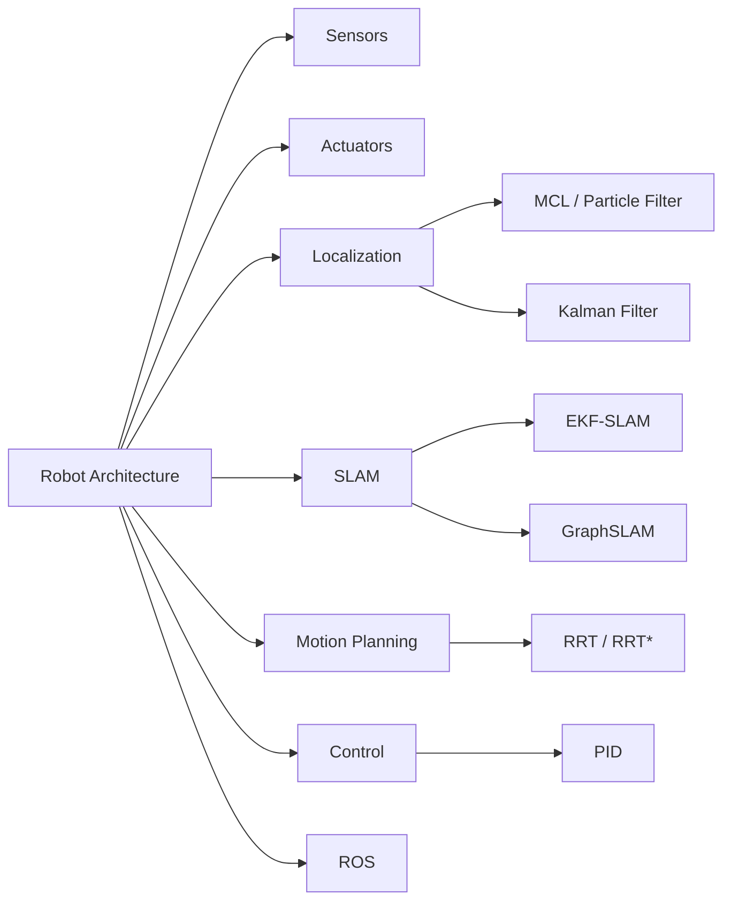

# Chapter 14: Robotics

**Previous:** [Chapter 13: Computer Vision](13-computer-vision.md) | **Next:** [Chapter 15: Ethics of AI](15-ethics-ai.md)

## Learning Objectives

By the conclusion of this chapter, the student will be able to: (1) describe the hardware components of a robotic system; (2) implement Monte Carlo localization; (3) explain the SLAM problem and its solution approaches; (4) apply motion planning algorithms including RRT; (5) understand control theory fundamentals.

## Chapter at a Glance

| Section | Key Topics | Key Terms |
|---------|-----------|-----------|
| Robot Architecture | Sensing, estimation, planning, control | Embodied agent, actuators |
| Sensors | Camera, LIDAR, IMU, GPS, encoders | Point cloud, odometry |
| Localization | MCL (particle filter), Kalman filter | Belief, kidnapped robot, pose |
| SLAM | EKF-SLAM, GraphSLAM | Landmarks, loop closure |
| Motion Planning | C-space, RRT, RRT* | Collision-free, asymptotic optimality |
| Control | PID, MPC | Feedback, proportional gain |
| ROS | Nodes, topics, services, actions | Middleware, tf |

## Chapter Roadmap



## 14.1 Robot Definition and Architecture


A **robot** is a physically embodied agent that perceives its environment through sensors and acts upon it through actuators. The robotic system integrates perception, planning, and control within a physical platform.

The architectural components include:
- **Sensing:** Acquiring information about the environment and internal state.
- **State estimation:** Combining sensor data with prior knowledge to estimate the robot's state.
- **Planning:** Deciding sequences of actions to achieve goals.
- **Control:** Executing actions while compensating for disturbances.

## 14.2 Sensors

**Cameras:** Provide visual information. Monocular, stereo, and RGB-D (e.g., Microsoft Kinect, Intel RealSense).

**LIDAR (Light Detection and Ranging):** Measures distances by emitting laser pulses and measuring time-of-flight. Provides 2D or 3D point clouds. Used for mapping, localization, and obstacle avoidance.

**IMU (Inertial Measurement Unit):** Combines accelerometers and gyroscopes to measure linear acceleration and angular velocity. Prone to drift over time but useful for short-term state estimation.

**GPS (Global Positioning System):** Provides absolute position estimates (accuracy ~1--5 m with correction). Unreliable indoors or in urban canyons.

**Proprioceptive sensors:** Measure internal state (joint angles, wheel encoders, torque).

## 14.3 Actuators

**Electric motors:** DC motors, servo motors, stepper motors for joint actuation and wheel drive.

**Hydraulic and pneumatic actuators:** High-force applications (industrial manipulators, legged robots).

**End effectors:** Grippers, suction cups, welding torches, or task-specific tools.

## 14.4 Localization

**Localization** is the problem of estimating the robot's pose (position and orientation) given sensor data and a map.

### 14.4.1 Monte Carlo Localization (MCL)

MCL uses particle filtering to represent the belief over robot pose:

```
function MCL(particles, control, observation, map) returns new_particles
    N ← len(particles)
    weights ← array of size N
    for i = 1 to N do
        particles[i] ← sample motion model P(x' | particles[i], control)
        weights[i] ← P(observation | particles[i], map)
    normalize weights
    new_particles ← resample N particles with probability ∝ weights
    return new_particles
```

MCL handles multi-modal beliefs (the robot could be in several places). **Kidnapped robot problem:** When the robot is suddenly teleported, MCL with injected random particles can recover.

### 14.4.2 Kalman Filter Localization

For linear-Gaussian systems, the Kalman filter (Chapter 10) provides optimal localization. The **Extended Kalman Filter (EKF)** handles nonlinear motion and observation models via linearization.

## 14.5 Mapping and SLAM

**Simultaneous Localization and Mapping (SLAM)** addresses the chicken-and-egg problem: the robot needs a map to localize and its pose to build a map.

The SLAM problem: estimate the joint posterior over robot trajectory $x_{1:t}$ and map $m$ given observations $z_{1:t}$ and controls $u_{1:t}$:

$$P(x_{1:t}, m \mid z_{1:t}, u_{1:t})$$

**EKF-SLAM:** Maintains a large covariance matrix over robot pose and all landmark positions. Complexity $O(n^2)$ for $n$ landmarks.

**GraphSLAM:** Represents the problem as a graph of pose nodes and constraint edges. Solves a sparse least-squares problem:

$$X^* = \arg\min_X \sum_i \|f_i(x_i, u_i) - x_{i+1}\|^2_{\Sigma_i} + \sum_j \|h_j(x_{i_j}, m_{k_j}) - z_j\|^2_{\Omega_j}$$

Modern SLAM systems include ORB-SLAM (visual SLAM), Cartographer (LIDAR-based), and RTAB-Map.

## 14.6 Motion Planning

### 14.6.1 Configuration Space

The **configuration space** $\mathcal{C}$ is the set of all possible robot configurations. $\mathcal{C}_{\text{free}}$ is the set of collision-free configurations. The planning problem: find a continuous path $\tau: [0, 1] \to \mathcal{C}_{\text{free}}$ from $\tau(0) = q_{\text{start}}$ to $\tau(1) = q_{\text{goal}}$.

### 14.6.2 Rapidly-Exploring Random Trees (RRT)

RRT (LaValle, 1998) incrementally builds a tree in configuration space:

```
function RRT-PLAN(q_start, q_goal, max_iterations) returns path
    T ← tree with root q_start
    for i = 1 to max_iterations do
        q_rand ← SAMPLE-CONFIGURATION()
        q_near ← NEAREST-NEIGHBOR(T, q_rand)
        q_new ← EXTEND(q_near, q_rand, step_size)
        if COLLISION-FREE(q_near, q_new) then
            T.ADD-VERTEX(q_new)
            T.ADD-EDGE(q_near, q_new)
            if DISTANCE(q_new, q_goal) < threshold then
                return PATH-IN-TREE(T, q_start, q_new)
    return failure
```

**RRT*** extends RRT with rewiring for asymptotic optimality.

## 14.7 Control

### 14.7.1 PID Control

PID (Proportional-Integral-Derivative) control is the most widely used feedback control law:

$$u(t) = K_p e(t) + K_i \int_0^t e(\tau) d\tau + K_d \frac{de(t)}{dt}$$

where $e(t)$ is the error between desired and actual state. Tuning $K_p, K_i, K_d$ determines response characteristics.

### 14.7.2 Model Predictive Control (MPC)

MPC solves a finite-horizon optimal control problem at each time step, applies the first control, and recedes the horizon. It handles constraints naturally but requires significant computation.

## 14.8 Robot Operating System (ROS)

ROS (Robot Operating System) is a middleware framework providing:
- **Nodes:** Executable processes for specific functions.
- **Topics:** Named buses for asynchronous message passing.
- **Services:** Synchronous request-response communication.
- **Actions:** Goal-oriented asynchronous tasks with feedback.
- **tf:** Coordinate frame transformation system.

## 14.9 Applications

Robotics applications span manufacturing (industrial arms, collaborative robots), logistics (autonomous warehouses, delivery), healthcare (surgical robots, rehabilitation), exploration (underwater, space, mining), and service (domestic cleaning, hospitality).

> **💡 Pro Tip:** ROS 2 is the industry standard for robot development. Learn its node-based architecture and the `tf` transform system before writing any code — they make localization, planning, and visualization dramatically easier.

## Concept Comparison

| Task | Algorithm | State | Sensor | Online? |
|------|-----------|:---:|:---:|:---:|
| Localization | MCL (Particle Filter) | x, y, θ | Range finder | ✅ |
| Localization | Extended Kalman Filter | x, y, θ | Various | ✅ |
| SLAM | EKF-SLAM | Pose + landmarks | Camera/LIDAR | ✅ |
| SLAM | GraphSLAM | Full trajectory | Camera/LIDAR | ❌ (batch) |
| Planning | RRT | Configuration space | None | ✅ |
| Planning | RRT* | Configuration space | None | ✅ (asymp. opt.) |

## Quick Reference — PID Control

| Term | Name | Effect | Formula |
|:---:|------|--------|---------|
| P | Proportional | Corrects current error | Kₚ e(t) |
| I | Integral | Eliminates steady-state error | Kᵢ ∫e(t)dt |
| D | Derivative | Dampens oscillations | K_d de/dt |

## Cross-Application Matrix

| Technique | ML | CV | NLP | Research |
|-----------|:---:|:---:|:---:|:---:|
| MCL (Particle Filter) | ⬜ | ✅ | ⬜ | ✅ |
| SLAM | ⬜ | ✅ | ⬜ | ✅ |
| RRT Planning | ⬜ | ⬜ | ⬜ | ✅ |
| PID Control | ⬜ | ⬜ | ⬜ | ✅ |
| ROS | ⬜ | ⬜ | ⬜ | ✅ |

## Chapter Quiz

**Q1:** What problem does SLAM solve that localization alone does not?
- A) SLAM determines the robot's absolute position; localization determines relative position
- B) SLAM simultaneously builds a map and localizes within it, handling the mutual dependency
- C) SLAM is faster than localization
- D) SLAM requires GPS; localization does not

<details><summary>Answer</summary>B) SLAM addresses the chicken-and-egg problem: to build a map you need to know where you are, and to know where you are you need a map. SLAM solves both simultaneously.</details>

**Q2:** RRT* improves on RRT by providing what guarantee?
- A) Faster convergence
- B) Asymptotic optimality — the solution converges to the optimal path as samples → ∞
- C) Deterministic paths
- D) Guaranteed collision avoidance

<details><summary>Answer</summary>B) RRT* reconnects the tree when better paths are found, providing asymptotic optimality. RRT only guarantees completeness, not optimality.</details>

**Q3:** The PID term that eliminates steady-state error is:
- A) Proportional
- B) Integral
- C) Derivative
- D) Feedforward

<details><summary>Answer</summary>B) The integral term accumulates past error over time, driving the system toward the setpoint even when proportional term alone leaves residual error.</details>

## 14.10 Summary

Robotics integrates sensing, state estimation, planning, and control. Probabilistic methods (MCL, Kalman filters) handle uncertainty in perception. SLAM solves simultaneous mapping and localization. Motion planning algorithms find collision-free paths. ROS provides a standard software framework for robot development.

## Exercises

### Review Questions

1. Explain the sensor-fusion trade-off between IMU and GPS for localization.
2. Why is SLAM fundamentally harder than localization with a known map?
3. Compare RRT and RRT* in terms of path quality and computational cost.

### Application Problems

4. Implement Monte Carlo localization for a robot in a 2D grid world with range sensors. Evaluate localization accuracy with 100, 500, and 1000 particles.
5. Implement PID control for simulated line-following. Tune gains for minimum settling time.

### Challenge Problem

6. Implement a 2D SLAM system using GraphSLAM. Generate a simulated environment with 20 landmarks. Evaluate map accuracy against ground truth as trajectory length increases.
