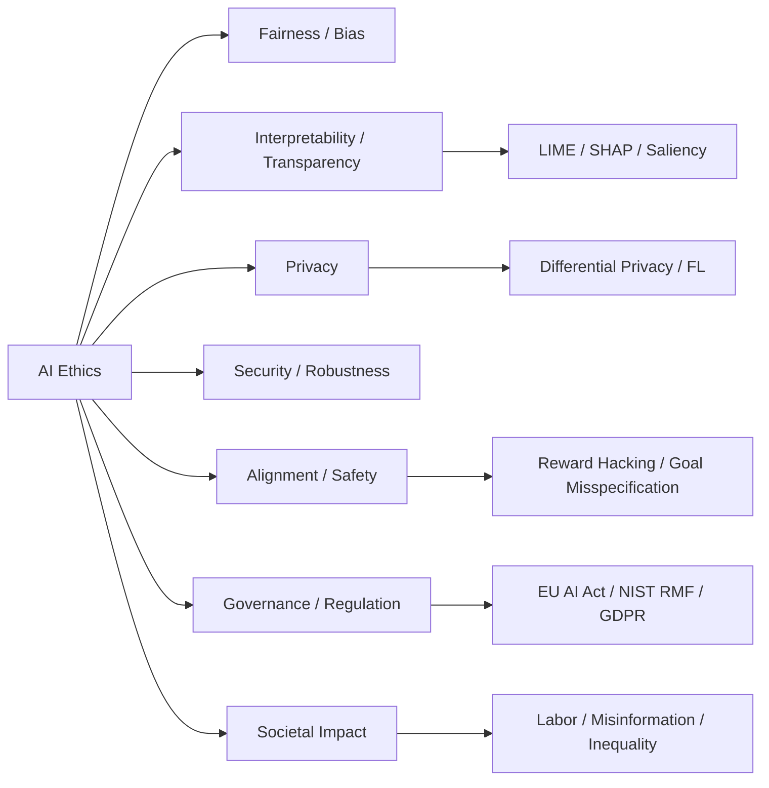

# Chapter 15: Ethics of Artificial Intelligence

**Previous:** [Chapter 14: Robotics](14-robotics.md) | **Next:** [Chapter 16: Expert Systems](16-expert-systems.md)

## Learning Objectives

By the conclusion of this chapter, the student will be able to: (1) identify sources of bias in AI systems; (2) apply interpretability techniques to explain model decisions; (3) analyze privacy implications of AI deployment; (4) explain the AI alignment problem and its significance; (5) describe major regulatory frameworks governing AI; (6) evaluate ethical trade-offs in real-world AI deployments; (7) implement fairness-aware machine learning pipelines; (8) articulate responsible AI principles across organizational contexts.

## Why AI Ethics Matters

Imagine you are handed the keys to a Ferrari — 900 horsepower, zero to sixty in 2.5 seconds, a machine of incredible capability. The engineer who built it says, "It can go faster than anything on the road." But nobody gave you a steering wheel, brake pedal, or rearview mirror. There are no traffic laws, no speed limits, no lines painted on the road. Would you drive it?

AI ethics is exactly this: the steering wheel, brakes, and rules of the road for artificial intelligence. Technology without ethics is a Ferrari with no steering wheel — immense power with no control. Just as traffic rules do not slow us down but keep us alive, ethical frameworks do not hinder AI innovation — they ensure AI serves humanity rather than endangering it.

**The core insight:** Every line of code you write carries an ethical consequence. A loan approval model can deny a family their dream home. A resume scanner can systematically exclude qualified candidates. A facial recognition system can lead to wrongful arrest. Ethics in AI is not a philosophy class bolted onto engineering — it is engineering, done properly.

Without ethics, we get:
- **Bias amplification**: Models that learn and magnify historical discrimination
- **Opacity**: Black-box decisions that cannot be questioned or appealed
- **Privacy erosion**: Systems that memorize and expose sensitive data
- **Accountability gaps**: No one takes responsibility when AI causes harm
- **Safety failures**: Catastrophic accidents from misaligned objectives

The goal of this chapter is to equip you with the frameworks, tools, and mindset to build AI that is not just powerful, but trustworthy.

## Chapter at a Glance

| Section | Key Topics | Key Terms |
|---------|-----------|-----------|
| Fairness and Bias | Data/algorithmic bias, fairness definitions, mitigation | Demographic parity, equalized odds, disparate impact |
| Interpretability | LIME, SHAP, saliency maps, model debugging | Feature attribution, surrogate models, Shapley values |
| Privacy | Differential privacy, federated learning, membership inference | epsilon-DP, secure aggregation, DP-SGD |
| Security | Adversarial examples, data poisoning, model extraction | Evasion attacks, poisoning rate, robust accuracy |
| AI Alignment | Value learning, reward hacking, specification gaming | Outer/inner alignment, instrumental convergence |
| Governance | EU AI Act, NIST AI RMF, GDPR, US Executive Order | Risk categories, conformity assessment, compliance |
| Societal Impact | Labor displacement, inequality, misinformation | Universal basic income, algorithmic amplification |

## Chapter Roadmap



---

## 15.1 Fairness and Bias

### Real-World Analogy: The Biased Door

<a href="../../../assets/images/diagrams/artificial-intelligence/15-ethics-ai/real-world-analogy-the-biased-door-handwritten.svg" target="_blank" rel="noopener">
  
</a>
<a href="../../../assets/images/diagrams/artificial-intelligence/15-ethics-ai/real-world-analogy-the-biased-door-diagram.svg" target="_blank" rel="noopener">
  
</a>
<a href="../../../assets/images/diagrams/artificial-intelligence/15-ethics-ai/real-world-analogy-the-biased-door-sticky.svg" target="_blank" rel="noopener">
  
</a>


Imagine a building where the front door only opens for people over six feet tall. The architect didn't explicitly design it to exclude short people — they simply installed a sensor calibrated on the building's tall security guards. The door is "fair" by its own logic (it opens for anyone tall enough), but it is deeply unfair in practice. The problem is not the door mechanism — it is the data and assumptions used to calibrate it.

AI bias works the same way. The model is not malicious; it faithfully learns from data that reflects historical inequities, incomplete sampling, or flawed measurements. The result is a system that treats people differently based on race, gender, age, or other protected attributes — even when those attributes were never explicitly used as features.

---

### 15.1.1 Sources of Bias: The Bias Types Table

<a href="../../../assets/images/diagrams/artificial-intelligence/15-ethics-ai/15-1-1-sources-of-bias-the-bias-types-table-handwritten.svg" target="_blank" rel="noopener">
  
</a>
<a href="../../../assets/images/diagrams/artificial-intelligence/15-ethics-ai/15-1-1-sources-of-bias-the-bias-types-table-diagram.svg" target="_blank" rel="noopener">
  
</a>
<a href="../../../assets/images/diagrams/artificial-intelligence/15-ethics-ai/15-1-1-sources-of-bias-the-bias-types-table-sticky.svg" target="_blank" rel="noopener">
  
</a>


| Bias Type | Definition | Example | Detection Method |
|-----------|-----------|---------|-----------------|
| **Data Bias** | Training data does not accurately represent the target population | Facial recognition trained mostly on light-skinned faces performs poorly on dark-skinned individuals | Stratified accuracy analysis across demographic groups |
| **Historical Bias** | Existing societal prejudices are encoded in training labels | Hiring model trained on past decisions learns to prefer male candidates because historical hires were mostly male | Audit label distribution across protected groups |
| **Measurement Bias** | Proxy variables are poor representations of the target construct | Using zip code as a proxy for creditworthiness (correlates with race) | Correlation analysis between proxy and sensitive attributes |
| **Label Bias** | Annotator subjectivity or prejudice influences ground truth | Content moderation labels vary by annotator demographic background | Inter-annotator agreement analysis across demographics |
| **Algorithmic Bias** | Model architecture or optimization amplifies disparities | Recommendation system creates filter bubbles by optimizing engagement | Disparate impact analysis of model outputs |
| **Confirmation Bias** | Model/system reinforces existing beliefs | Search engine ranks results that align with user's past clicks higher | Search result diversity metrics |
| **Sampling Bias** | Non-random sampling creates unrepresentative data | Survey data collected via smartphone app excludes elderly populations | Population distribution comparison |
| **Deployment Bias** | Model is applied in contexts different from its training environment | COVID-19 diagnosis model trained on hospital data fails in field clinics | Domain shift detection, covariate shift analysis |
| **Aggregation Bias** | One-size-fits-all model fails for subgroups | Voice recognition works better for male voices because training data was male-dominated | Subgroup performance analysis |
| **Evaluation Bias** | Test set does not represent the real population | Benchmark dataset lacks diversity, inflating reported accuracy | Demographic breakdown of test sets |

---

### 15.1.2 Mathematical Fairness Definitions

<a href="../../../assets/images/diagrams/artificial-intelligence/15-ethics-ai/15-1-2-mathematical-fairness-definitions-handwritten.svg" target="_blank" rel="noopener">
  
</a>
<a href="../../../assets/images/diagrams/artificial-intelligence/15-ethics-ai/15-1-2-mathematical-fairness-definitions-diagram.svg" target="_blank" rel="noopener">
  
</a>
<a href="../../../assets/images/diagrams/artificial-intelligence/15-ethics-ai/15-1-2-mathematical-fairness-definitions-sticky.svg" target="_blank" rel="noopener">
  
</a>


Multiple mathematical definitions of fairness exist, and they are **mutually incompatible** in general (Kleinberg et al., 2016 — the Impossibility Theorem of Fairness):

| Definition | Mathematical Expression | Meaning | Limitation |
|-----------|----------------------|---------|------------|
| **Demographic Parity** | P(Ŷ = 1 | A = a) = P(Ŷ = 1) | Prediction rate is equal across groups | Ignores actual outcomes |
| **Equal Opportunity** | P(Ŷ = 1 | Y = 1, A = a) = P(Ŷ = 1 | Y = 1) | Equal true positive rates (equal chance of getting a "good" outcome when deserved) | Does not address false positives |
| **Equalized Odds** | P(Ŷ = 1 | Y = y, A = a) = P(Ŷ = 1 | Y = y) for y ∈ {0,1} | Both TPR and FPR are equal across groups | Most constrained — often impossible |
| **Individual Fairness** | d(Ŷ(x), Ŷ(x')) ≤ D(x, x') | Similar individuals receive similar predictions | Requires a task-specific similarity metric |
| **Counterfactual Fairness** | P(Ŷ_{A=a} = y) = P(Ŷ_{A=a'} = y) | Prediction would be the same if protected attribute were different | Requires causal knowledge |

**The Impossibility Theorem:** Unless base rates are identical across groups (P(Y=1|A=a) is equal for all a) or the predictor is perfect, demographic parity and equalized odds cannot both be satisfied simultaneously. This is not a limitation of these specific definitions — it is a mathematical fact about any two fairness criteria that impose different constraints on the confusion matrix.

---

### 15.1.3 Bias Detection in Python

<a href="../../../assets/images/diagrams/artificial-intelligence/15-ethics-ai/15-1-3-bias-detection-in-python-handwritten.svg" target="_blank" rel="noopener">
  
</a>
<a href="../../../assets/images/diagrams/artificial-intelligence/15-ethics-ai/15-1-3-bias-detection-in-python-diagram.svg" target="_blank" rel="noopener">
  
</a>
<a href="../../../assets/images/diagrams/artificial-intelligence/15-ethics-ai/15-1-3-bias-detection-in-python-sticky.svg" target="_blank" rel="noopener">
  
</a>


```python
import pandas as pd
import numpy as np
from sklearn.model_selection import train_test_split
from sklearn.linear_model import LogisticRegression
from sklearn.metrics import confusion_matrix, accuracy_score

# Simulated hiring data (in practice, use real datasets like COMPAS, Adult Income)
np.random.seed(42)
n_samples = 2000

# Protected attribute: gender (0 = Male, 1 = Female)
gender = np.random.binomial(1, 0.5, n_samples)

# Features correlated with outcome but also with protected attribute
experience = np.random.normal(5, 2, n_samples)
experience[gender == 1] -= 0.5  # Slight historical bias in experience

# Qualification score (unbiased)
qualification = np.random.normal(70, 15, n_samples)

# Historical hiring decisions (biased — favors male applicants)
# The bias is encoded in the training labels, not just features
logit = 0.1 * experience + 0.05 * qualification - 2.0 * gender
prob = 1 / (1 + np.exp(-logit))
hired = np.random.binomial(1, prob)

df = pd.DataFrame({
    'experience': experience,
    'qualification': qualification,
    'gender': gender,
    'hired': hired,
    'gender_label': ['Male' if g == 0 else 'Female' for g in gender]
})

print("=== Dataset Overview ===")
print(df.groupby('gender_label')['hired'].mean())
print()

# Split and train model
X = df[['experience', 'qualification']]
y = df['hired']
X_train, X_test, y_train, y_test = train_test_split(X, y, test_size=0.3, random_state=42)
gender_test = gender[X_test.index]

model = LogisticRegression()
model.fit(X_train, y_train)
y_pred = model.predict(X_test)

print("=== Model Accuracy ===")
print(f"Overall: {accuracy_score(y_test, y_pred):.3f}")

# Fairness Audit
print("\n=== Fairness Audit ===")
for g_val, g_label in [(0, 'Male'), (1, 'Female')]:
    mask = gender_test == g_val
    if mask.sum() == 0:
        continue
    cm = confusion_matrix(y_test[mask], y_pred[mask])
    tn, fp, fn, tp = cm.ravel()
    tpr = tp / (tp + fn) if (tp + fn) > 0 else 0
    fpr = fp / (fp + tn) if (fp + tn) > 0 else 0
    pos_rate = y_pred[mask].mean()
    print(f"\n{g_label} Group:")
    print(f"  Positive Prediction Rate (Demographic Parity): {pos_rate:.3f}")
    print(f"  True Positive Rate (Equal Opportunity): {tpr:.3f}")
    print(f"  False Positive Rate: {fpr:.3f}")

# Demographic Parity Difference
dpp = y_pred[gender_test == 0].mean() - y_pred[gender_test == 1].mean()
print(f"\n=== Fairness Metrics ===")
print(f"Demographic Parity Difference: {abs(dpp):.3f} (ideal = 0)")

# Equal Opportunity Difference
tpr_male = confusion_matrix(y_test[gender_test == 0], y_pred[gender_test == 0])
tpr_female = confusion_matrix(y_test[gender_test == 1], y_pred[gender_test == 1])
tpr_male = tpr_male[1,1] / tpr_male[1,:].sum() if tpr_male[1,:].sum() > 0 else 0
tpr_female = tpr_female[1,1] / tpr_female[1,:].sum() if tpr_female[1,:].sum() > 0 else 0
print(f"Equal Opportunity Difference: {abs(tpr_male - tpr_female):.3f} (ideal = 0)")

print(f"\n=== Verdict ===")
if abs(dpp) > 0.1:
    print("WARNING: Potential demographic parity violation detected!")
if abs(tpr_male - tpr_female) > 0.1:
    print("WARNING: Potential equal opportunity violation detected!")
```

**Output interpretation:** The audit reveals that even when gender is not used as a feature, the model can produce biased outcomes because correlated features (experience) carry historical discrimination. This is why fairness auditing must check outcomes, not just inputs.

---

### 15.1.4 Bias Mitigation Framework

<a href="../../../assets/images/diagrams/artificial-intelligence/15-ethics-ai/15-1-4-bias-mitigation-framework-handwritten.svg" target="_blank" rel="noopener">
  
</a>
<a href="../../../assets/images/diagrams/artificial-intelligence/15-ethics-ai/15-1-4-bias-mitigation-framework-diagram.svg" target="_blank" rel="noopener">
  
</a>
<a href="../../../assets/images/diagrams/artificial-intelligence/15-ethics-ai/15-1-4-bias-mitigation-framework-sticky.svg" target="_blank" rel="noopener">
  
</a>


| Stage | Technique | Description | Implementation | Trade-off |
|-------|-----------|-------------|----------------|-----------|
| **Pre-processing** | Reweighing | Assign different weights to training samples to ensure fairness | `fairlearn.preprocessing.Reweighing` | May reduce overall accuracy |
| **Pre-processing** | Disparate Impact Remover | Transform feature values to remove group-based distinctions | Data transformation | Information loss |
| **Pre-processing** | Synthetic Data Generation | Generate balanced training examples for underrepresented groups | SMOTE, GAN-based | May introduce artifacts |
| **In-processing** | Adversarial Debiasing | Train model to predict target while adversary cannot predict protected attribute | `fairlearn.reductions` | Complex training, sensitive to hyperparameters |
| **In-processing** | Fairness Regularization | Add fairness constraints to loss function | Custom loss, `tensorflow` constraints | Increases training time |
| **Post-processing** | Threshold Modification | Use different decision thresholds per group to equalize outcomes | ROC threshold tuning | May reduce per-group accuracy |
| **Post-processing** | Calibration | Adjust prediction probabilities per group | Platt scaling per group | Requires validation data |

```python
# Example: Post-processing via threshold modification
from sklearn.metrics import roc_curve

def find_equal_opportunity_thresholds(y_true, y_prob, protected):
    """Find per-group thresholds that equalize True Positive Rate."""
    thresholds = {}
    groups = np.unique(protected)
    target_tpr = None
    
    for g in groups:
        mask = protected == g
        fpr, tpr, thresh = roc_curve(y_true[mask], y_prob[mask])
        if target_tpr is None:
            target_tpr = tpr  # Use first group's TPR as target
        # Find threshold that gives closest TPR to target
        idx = np.argmin(np.abs(tpr - target_tpr[0]))
        thresholds[g] = thresh[min(idx, len(thresh)-1)]
    
    return thresholds

# Usage
y_prob = model.predict_proba(X_test)[:, 1]
thresholds = find_equal_opportunity_thresholds(y_test.values, y_prob, gender_test)
print("Per-group thresholds:", thresholds)
y_pred_fair = np.array([y_prob[i] >= thresholds[gender_test[i]] for i in range(len(y_prob))])
```

---

### 15.1.5 Case Study: COMPAS Recidivism Algorithm

<a href="../../../assets/images/diagrams/artificial-intelligence/15-ethics-ai/15-1-5-case-study-compas-recidivism-algorithm-handwritten.svg" target="_blank" rel="noopener">
  
</a>
<a href="../../../assets/images/diagrams/artificial-intelligence/15-ethics-ai/15-1-5-case-study-compas-recidivism-algorithm-diagram.svg" target="_blank" rel="noopener">
  
</a>
<a href="../../../assets/images/diagrams/artificial-intelligence/15-ethics-ai/15-1-5-case-study-compas-recidivism-algorithm-sticky.svg" target="_blank" rel="noopener">
  
</a>


**Background:** Correctional Offender Management Profiling for Alternative Sanctions (COMPAS) is a commercial risk assessment tool used by US courts to predict a defendant's likelihood of reoffending. Developed by Northpointe (now Equivant), it has been deployed in jurisdictions across Arizona, Florida, New York, and others.

**The Controversy:** ProPublica's 2016 investigation analyzed COMPAS scores for over 7,000 defendants in Broward County, Florida. The findings were stark:

| Metric | White Defendants | Black Defendants |
|--------|:---------------:|:----------------:|
| Labeled high-risk but did not reoffend (False Positive) | 23.5% | 44.9% |
| Labeled low-risk but did reoffend (False Negative) | 47.7% | 28.0% |
| Overall accuracy | 63% | 63% |

**Analysis:** While the model achieved similar overall accuracy across groups, it systematically:
- **Over-predicted** recidivism for Black defendants (nearly 2x the false positive rate)
- **Under-predicted** recidivism for White defendants
- This is the classic "fairness through unawareness" failure — the model did not use race as a feature, but correlated features (criminal history, socioeconomic factors) encoded racial disparities in the justice system.

**Lessons Learned:**
1. **Overall accuracy is insufficient** — subgroup analysis is mandatory
2. **Failing to use protected attributes does not guarantee fairness** — proxy variables are everywhere
3. **Different fairness metrics can produce opposite conclusions** — Northpointe defended COMPAS using equalized odds (similar accuracy), while ProPublica used false positive parity
4. **Deployment context matters** — a tool validated in one jurisdiction may fail in another
5. **Transparency requirements** — proprietary algorithms cannot be properly audited by defendants or their counsel

---

### 15.1.6 Advantages and Disadvantages of Fairness-Aware AI

<a href="../../../assets/images/diagrams/artificial-intelligence/15-ethics-ai/15-1-6-advantages-and-disadvantages-of-fairness-aware-ai-handwritten.svg" target="_blank" rel="noopener">
  
</a>
<a href="../../../assets/images/diagrams/artificial-intelligence/15-ethics-ai/15-1-6-advantages-and-disadvantages-of-fairness-aware-ai-diagram.svg" target="_blank" rel="noopener">
  
</a>
<a href="../../../assets/images/diagrams/artificial-intelligence/15-ethics-ai/15-1-6-advantages-and-disadvantages-of-fairness-aware-ai-sticky.svg" target="_blank" rel="noopener">
  
</a>


| Advantages | Disadvantages |
|------------|---------------|
| Reduces discrimination and promotes social justice | No single definition of fairness — incompatible criteria |
| Improves model robustness across diverse populations | Fairness constraints can reduce overall accuracy |
| Builds trust with users and stakeholders | Proxy variables can reintroduce bias even after mitigation |
| Increasingly required by regulation (EU AI Act) | Computational cost of fairness auditing and retraining |
| Better generalization to new populations | Requires sensitive attribute data, raising privacy concerns |
| Early detection of data quality issues | Cannot fully compensate for deeply biased training data |
| Competitive advantage in ethical branding | Hard to explain fairness-explicit decisions to non-technical stakeholders |

---

### 15.1.7 Edge Cases in Fairness

<a href="../../../assets/images/diagrams/artificial-intelligence/15-ethics-ai/15-1-7-edge-cases-in-fairness-handwritten.svg" target="_blank" rel="noopener">
  
</a>
<a href="../../../assets/images/diagrams/artificial-intelligence/15-ethics-ai/15-1-7-edge-cases-in-fairness-diagram.svg" target="_blank" rel="noopener">
  
</a>
<a href="../../../assets/images/diagrams/artificial-intelligence/15-ethics-ai/15-1-7-edge-cases-in-fairness-sticky.svg" target="_blank" rel="noopener">
  
</a>


| Edge Case | Scenario | Challenge | Mitigation |
|-----------|----------|-----------|------------|
| **Intersectionality** | Bias is not additive — being Black AND female creates distinct harms not captured by single-attribute metrics | Standard fairness metrics check one attribute at a time | Intersectional analysis, disaggregated evaluation |
| **Fairness Ratios** | A 0.8 ratio (80% rule) is a common threshold — but is 0.79 very different from 0.81? | Binary thresholds create cliff effects | Continuous fairness reporting, not pass/fail |
| **Small Subgroups** | A demographic group may have too few samples for statistically meaningful fairness analysis | High variance in metric estimates | Bayesian fairness estimation, confidence intervals |
| **Feedback Loops** | A biased model changes the system, which changes future data, which entrenches bias further (e.g., predictive policing) | Static fairness metrics miss dynamic effects | Longitudinal fairness monitoring, causal analysis |
| **Fairness vs. Privacy** | Checking for bias requires demographic data, but collecting demographic data raises privacy concerns | Tension between transparency and privacy | Differential privacy for fairness audits, encrypted computation |
| **Distribution Shift** | A model that is fair in the training distribution may become unfair when deployment data shifts | Fairness is not invariant under distribution shift | Continuous monitoring, domain adaptation |
| **Multimodal Bias** | Bias in vision models can compound with bias in language models when systems use both | Cross-modal bias amplification | Joint fairness evaluation across modalities |
---

## 15.2 Interpretability and Transparency

### Real-World Analogy: The Surgeon's Explanation

<a href="../../../assets/images/diagrams/artificial-intelligence/15-ethics-ai/real-world-analogy-the-surgeon-s-explanation-handwritten.svg" target="_blank" rel="noopener">
  
</a>
<a href="../../../assets/images/diagrams/artificial-intelligence/15-ethics-ai/real-world-analogy-the-surgeon-s-explanation-diagram.svg" target="_blank" rel="noopener">
  
</a>
<a href="../../../assets/images/diagrams/artificial-intelligence/15-ethics-ai/real-world-analogy-the-surgeon-s-explanation-sticky.svg" target="_blank" rel="noopener">
  
</a>


Imagine you are about to undergo a serious surgery. The surgeon says, "Trust me, I've done thousands of these." When you ask why they are making a particular incision, they reply, "The neural network in my brain just computed it — I cannot tell you the reasoning, but it is 97% accurate." Would you consent?

This is the problem with black-box AI. Transparency — the ability to understand and explain decisions — is not a luxury; it is a prerequisite for trust, accountability, and error correction. Just as a surgeon must articulate their clinical reasoning, an AI system deployed in high-stakes environments must provide explanations that can be inspected, questioned, and appealed.

### 15.2.1 The Transparency Spectrum

<a href="../../../assets/images/diagrams/artificial-intelligence/15-ethics-ai/15-2-1-the-transparency-spectrum-handwritten.svg" target="_blank" rel="noopener">
  
</a>
<a href="../../../assets/images/diagrams/artificial-intelligence/15-ethics-ai/15-2-1-the-transparency-spectrum-diagram.svg" target="_blank" rel="noopener">
  
</a>
<a href="../../../assets/images/diagrams/artificial-intelligence/15-ethics-ai/15-2-1-the-transparency-spectrum-sticky.svg" target="_blank" rel="noopener">
  
</a>


| Level | Description | Example Models | Interpretability |
|-------|-------------|---------------|:----------------:|
| **White-box** | Fully interpretable by design | Decision trees (depth ≤ 3), Linear/Logistic regression | High |
| **Grey-box** | Partially interpretable with approximation | Gradient-boosted trees, rule-based systems | Medium |
| **Black-box** | Not directly interpretable; requires post-hoc methods | Deep neural networks, ensemble methods | Low |
| **Post-hoc** | Interpretability methods applied after training | LIME, SHAP, Grad-CAM, Integrated Gradients | Depends on method |

### 15.2.2 LIME — Local Interpretable Model-Agnostic Explanations

<a href="../../../assets/images/diagrams/artificial-intelligence/15-ethics-ai/15-2-2-lime-local-interpretable-model-agnostic-explanations-handwritten.svg" target="_blank" rel="noopener">
  
</a>
<a href="../../../assets/images/diagrams/artificial-intelligence/15-ethics-ai/15-2-2-lime-local-interpretable-model-agnostic-explanations-diagram.svg" target="_blank" rel="noopener">
  
</a>
<a href="../../../assets/images/diagrams/artificial-intelligence/15-ethics-ai/15-2-2-lime-local-interpretable-model-agnostic-explanations-sticky.svg" target="_blank" rel="noopener">
  
</a>


**How it works:** For any individual prediction, LIME:
1. Perturbs the input (creates variations of the original sample)
2. Gets predictions from the black-box model for each perturbation
3. Weights perturbations by proximity to the original input
4. Fits a simple, interpretable surrogate model (e.g., linear regression) on the perturbed dataset
5. The surrogate model's coefficients become the explanation

```python
import numpy as np
import matplotlib.pyplot as plt
from sklearn.datasets import load_breast_cancer
from sklearn.model_selection import train_test_split
from sklearn.ensemble import RandomForestClassifier
from lime.lime_tabular import LimeTabularExplainer

# Load data
data = load_breast_cancer()
X, y = data.data, data.target
feature_names = data.feature_names
X_train, X_test, y_train, y_test = train_test_split(X, y, test_size=0.2, random_state=42)

# Train black-box model
rf = RandomForestClassifier(n_estimators=100, random_state=42)
rf.fit(X_train, y_train)
print(f"Model accuracy: {rf.score(X_test, y_test):.3f}")

# Create LIME explainer
explainer = LimeTabularExplainer(
    X_train,
    feature_names=feature_names,
    class_names=['Malignant', 'Benign'],
    mode='classification'
)

# Explain a single prediction
idx = 10
exp = explainer.explain_instance(X_test[idx], rf.predict_proba, num_features=5)
print(f"\n=== LIME Explanation for Sample {idx} ===")
print(f"True label: {'Benign' if y_test[idx] == 1 else 'Malignant'}")
print(f"Prediction: {rf.predict(X_test[idx].reshape(1, -1))[0]}")
print("\nFeature contributions (to 'Benign' prediction):")
for feature, weight in exp.as_list():
    direction = "INCREASES" if weight > 0 else "DECREASES"
    icon = "▲" if weight > 0 else "▼"
    print(f"  {icon} {feature}: {abs(weight):.4f} ({direction})")

# Visualize
fig = exp.as_pyplot_figure()
plt.tight_layout()
plt.savefig('lime_explanation.png', dpi=150, bbox_inches='tight')
plt.close()
print("\n[LIME visualization saved to lime_explanation.png]")
```

**Key insight:** LIME tells you which features drove a specific decision. For a loan denial, LIME might reveal that "income &lt; $30,000" was the primary factor — but it might also reveal that "zip code" (a proxy for race) was influential.

### 15.2.3 SHAP — SHapley Additive exPlanations

<a href="../../../assets/images/diagrams/artificial-intelligence/15-ethics-ai/15-2-3-shap-shapley-additive-explanations-handwritten.svg" target="_blank" rel="noopener">
  
</a>
<a href="../../../assets/images/diagrams/artificial-intelligence/15-ethics-ai/15-2-3-shap-shapley-additive-explanations-diagram.svg" target="_blank" rel="noopener">
  
</a>
<a href="../../../assets/images/diagrams/artificial-intelligence/15-ethics-ai/15-2-3-shap-shapley-additive-explanations-sticky.svg" target="_blank" rel="noopener">
  
</a>


**Theoretical foundation:** SHAP uses Shapley values from cooperative game theory. Each feature is a "player" in a coalition (the feature set), and its contribution is its average marginal contribution across all possible coalitions.

**Properties that make SHAP theoretically superior:**
1. **Efficiency:** Feature contributions sum to the prediction minus the average prediction
2. **Symmetry:** Two features with identical contributions get the same Shapley value
3. **Dummy feature:** A feature that never changes the prediction gets value 0
4. **Additivity:** Shapley values can be summed across features

```python
try:
    import shap
except ImportError:
    print("Installing shap library...")
    import subprocess
    import sys
    subprocess.check_call([sys.executable, "-m", "pip", "install", "shap"])
    import shap

# Initialize SHAP explainer
explainer_shap = shap.TreeExplainer(rf)
shap_values = explainer_shap.shap_values(X_test[:100])

# Summary plot (global interpretability)
shap.summary_plot(shap_values[0], X_test[:100], feature_names=feature_names, show=False)
plt.savefig('shap_summary.png', dpi=150, bbox_inches='tight')
plt.close()
print("[SHAP summary plot saved to shap_summary.png]")

# Force plot (local interpretability)
shap.force_plot(
    explainer_shap.expected_value[1],
    shap_values[1][0, :],
    X_test[0, :],
    feature_names=feature_names,
    matplotlib=True,
    show=False
)
plt.savefig('shap_force.png', dpi=150, bbox_inches='tight')
plt.close()
print("[SHAP force plot saved to shap_force.png]")

# Feature importance (global)
feature_importance = np.abs(shap_values[1]).mean(axis=0)
sorted_idx = np.argsort(feature_importance)
print("\n=== Global Feature Importance (SHAP) ===")
for i in sorted_idx[-5:]:
    print(f"  {feature_names[i]}: {feature_importance[i]:.4f}")
```

### 15.2.4 LIME vs SHAP — Decision Framework

<a href="../../../assets/images/diagrams/artificial-intelligence/15-ethics-ai/15-2-4-lime-vs-shap-decision-framework-handwritten.svg" target="_blank" rel="noopener">
  
</a>
<a href="../../../assets/images/diagrams/artificial-intelligence/15-ethics-ai/15-2-4-lime-vs-shap-decision-framework-diagram.svg" target="_blank" rel="noopener">
  
</a>
<a href="../../../assets/images/diagrams/artificial-intelligence/15-ethics-ai/15-2-4-lime-vs-shap-decision-framework-sticky.svg" target="_blank" rel="noopener">
  
</a>


| Criterion | LIME | SHAP |
|-----------|:----:|:----:|
| **Theoretical guarantees** | None (heuristic surrogate) | Strong (game theory) |
| **Computational cost** | Fast | Slow (exponential in features) |
| **Global explanations** | No (individual predictions only) | Yes (summary plots) |
| **Consistency** | Unstable — different perturbations → different explanations | Consistent (symmetry property) |
| **Handles feature correlation** | Poor | Better (considers all subsets) |
| **Ease of use** | Very easy | Moderate |
| **Best for** | Quick, interactive debugging | Formal audit, research, publication |

### 15.2.5 Case Study: Black-Box Medicine

<a href="../../../assets/images/diagrams/artificial-intelligence/15-ethics-ai/15-2-5-case-study-black-box-medicine-handwritten.svg" target="_blank" rel="noopener">
  
</a>
<a href="../../../assets/images/diagrams/artificial-intelligence/15-ethics-ai/15-2-5-case-study-black-box-medicine-diagram.svg" target="_blank" rel="noopener">
  
</a>
<a href="../../../assets/images/diagrams/artificial-intelligence/15-ethics-ai/15-2-5-case-study-black-box-medicine-sticky.svg" target="_blank" rel="noopener">
  
</a>


**Scenario:** A hospital deploys a deep learning model to predict sepsis 12 hours before onset. The model achieves 94% AUC — better than doctors. However, when a patient dies despite the model predicting "no sepsis," the family sues.

**The transparency problem:**
- The model is a proprietary neural network — no explanation available
- LIME reveals the model relied heavily on "respiratory rate" — which was normal because the patient was on a ventilator
- The model failed because it was trained on data where most patients were not ventilated
- With SHAP, the development team discovers the model systematically under-predicts for patients with pre-existing conditions

**Resolution:** The hospital mandates that all clinical AI systems must produce SHAP explanations stored in the patient's medical record. When a model's prediction contradicts clinical judgment, the explanation is reviewed by a committee.

**Key takeaway:** In high-stakes domains, interpretability is not optional — it is a legal and ethical requirement. The GDPR includes a "right to explanation" for automated decisions.

### 15.2.6 Advantages and Disadvantages of Model Interpretability

<a href="../../../assets/images/diagrams/artificial-intelligence/15-ethics-ai/15-2-6-advantages-and-disadvantages-of-model-interpretability-handwritten.svg" target="_blank" rel="noopener">
  
</a>
<a href="../../../assets/images/diagrams/artificial-intelligence/15-ethics-ai/15-2-6-advantages-and-disadvantages-of-model-interpretability-diagram.svg" target="_blank" rel="noopener">
  
</a>
<a href="../../../assets/images/diagrams/artificial-intelligence/15-ethics-ai/15-2-6-advantages-and-disadvantages-of-model-interpretability-sticky.svg" target="_blank" rel="noopener">
  
</a>


| Advantages | Disadvantages |
|------------|---------------|
| Builds trust with users and regulators | Explanations can be misleading (false confidence) |
| Enables debugging and error analysis | Incompatible with some high-performance architectures |
| Required for regulatory compliance (GDPR, EU AI Act) | Computational overhead during inference |
| Helps detect proxy discrimination | Users may over-rely on simplified explanations |
| Facilitates model improvement and iteration | Different methods can give conflicting explanations |
| Supports scientific discovery (insights from model) | Explanations can be gamed or manipulated |
| Critical for contestability and appeals | Explanations of complex models are necessarily incomplete |

### 15.2.7 Edge Cases in Interpretability

<a href="../../../assets/images/diagrams/artificial-intelligence/15-ethics-ai/15-2-7-edge-cases-in-interpretability-handwritten.svg" target="_blank" rel="noopener">
  
</a>
<a href="../../../assets/images/diagrams/artificial-intelligence/15-ethics-ai/15-2-7-edge-cases-in-interpretability-diagram.svg" target="_blank" rel="noopener">
  
</a>
<a href="../../../assets/images/diagrams/artificial-intelligence/15-ethics-ai/15-2-7-edge-cases-in-interpretability-sticky.svg" target="_blank" rel="noopener">
  
</a>


| Edge Case | Scenario | Challenge | Mitigation |
|-----------|----------|-----------|------------|
| **Explanation instability** | Small input changes produce very different LIME explanations | User loses trust in the method | Average over multiple perturbation runs |
| **Feature correlation** | Two correlated features both receive low SHAP values, but neither without the other is important | Misattribution of importance | SHAP interaction values, conditional dependence analysis |
| **Adversarial explanations** | Inputs crafted to produce innocuous explanations for harmful decisions | Regulatory evasion | Robust explanation methods, adversarial training |
| **User cognitive load** | Full SHAP summary plot with 1000 features is incomprehensible | Explanation is too complex | Hierarchical explanations, top-K features |
| **Concept drift** | Features that matter today may not matter tomorrow | Explanations become stale | Continuous explanation monitoring |
| **Counterfactual accessibility** | "You would have been approved if your income were $500 higher" — but the user cannot change income | Explanation is truthful but unhelpful | Provide actionable counterfactuals |

---

## 15.3 Privacy

### Real-World Analogy: The Glass House

<a href="../../../assets/images/diagrams/artificial-intelligence/15-ethics-ai/real-world-analogy-the-glass-house-handwritten.svg" target="_blank" rel="noopener">
  
</a>
<a href="../../../assets/images/diagrams/artificial-intelligence/15-ethics-ai/real-world-analogy-the-glass-house-diagram.svg" target="_blank" rel="noopener">
  
</a>
<a href="../../../assets/images/diagrams/artificial-intelligence/15-ethics-ai/real-world-analogy-the-glass-house-sticky.svg" target="_blank" rel="noopener">
  
</a>


Imagine living in a house made entirely of glass. Everyone can see what you eat, who you talk to, when you sleep. Your medical prescriptions are visible from the street. Your financial transactions are displayed on the walls. The builder says, "Don't worry — I only analyze the data to help you. Nothing will be misused."

This is the state of AI privacy today. Every search query, purchase, location ping, and social media interaction feeds AI systems that know more about us than we know about ourselves. The glass house is comfortable when it provides personalized recommendations — and terrifying when that data is leaked, sold, or used against us.

### 15.3.1 Privacy Threats in AI

<a href="../../../assets/images/diagrams/artificial-intelligence/15-ethics-ai/15-3-1-privacy-threats-in-ai-handwritten.svg" target="_blank" rel="noopener">
  
</a>
<a href="../../../assets/images/diagrams/artificial-intelligence/15-ethics-ai/15-3-1-privacy-threats-in-ai-diagram.svg" target="_blank" rel="noopener">
  
</a>
<a href="../../../assets/images/diagrams/artificial-intelligence/15-ethics-ai/15-3-1-privacy-threats-in-ai-sticky.svg" target="_blank" rel="noopener">
  
</a>


| Threat | Description | Example | Severity |
|--------|-------------|---------|:--------:|
| **Model Inversion** | Attacker reconstructs training data from model parameters | Reconstructing faces from a facial recognition model's weights | Critical |
| **Membership Inference** | Attacker determines if a specific individual was in the training set | Checking if a patient's records were used in a hospital's research model | High |
| **Attribute Inference** | Attacker infers sensitive attributes not directly in the data | Inferring sexual orientation from purchase history | High |
| **Data Breach** | Training data is directly exposed | Hospital patient data leaked from an ML pipeline | Critical |
| **Model Extraction** | Attacker reconstructs a copy of the model using query access | Stealing a proprietary recommendation system | Medium |
| **Linkage Attack** | Anonymized data is re-identified by joining with public datasets | Netflix Prize dataset re-identified using IMDb ratings | High |

### 15.3.2 Differential Privacy — Formal Protection

<a href="../../../assets/images/diagrams/artificial-intelligence/15-ethics-ai/15-3-2-differential-privacy-formal-protection-handwritten.svg" target="_blank" rel="noopener">
  
</a>
<a href="../../../assets/images/diagrams/artificial-intelligence/15-ethics-ai/15-3-2-differential-privacy-formal-protection-diagram.svg" target="_blank" rel="noopener">
  
</a>
<a href="../../../assets/images/diagrams/artificial-intelligence/15-ethics-ai/15-3-2-differential-privacy-formal-protection-sticky.svg" target="_blank" rel="noopener">
  
</a>


**Definition:** An algorithm M is ε-differentially private if for any two datasets D and D' that differ by only one record, and for any output S:

P(M(D) ∈ S) ≤ e^ε · P(M(D') ∈ S)

**What this means in practice:**
- Adding or removing any individual's data does not significantly change the output distribution
- An attacker cannot confidently infer whether a specific person contributed to the training data
- ε (epsilon) controls the privacy-accuracy trade-off: lower ε = more privacy, less accuracy

```python
import numpy as np

def dp_simple_mean(data, epsilon, sensitivity=1.0):
    """
    Compute the mean of a dataset with differential privacy.
    Uses the Laplace mechanism.
    """
    true_mean = np.mean(data)
    # Laplace noise: scale = sensitivity / epsilon
    noise = np.random.laplace(0, sensitivity / (epsilon * len(data)))
    private_mean = true_mean + noise
    return private_mean, true_mean

# Example: releasing average salary with privacy
np.random.seed(42)
n_employees = 1000
true_salaries = np.random.normal(65000, 15000, n_employees)
true_salaries = np.clip(true_salaries, 30000, 200000)

print("=== Differential Privacy — Mean Salary ===")
print(f"True average salary: ${true_salaries.mean():.2f}")

for eps in [0.01, 0.1, 0.5, 1.0, 5.0]:
    private_mean, true = dp_simple_mean(true_salaries, eps)
    error = abs(private_mean - true)
    print(f"  ε = {eps:.2f}: Private mean = ${private_mean:.2f} (error = ${error:.2f})")
```

**Understanding epsilon values:**
- ε = 0.01: Extremely strong privacy (output is mostly noise)
- ε = 0.1: Strong privacy (useful for aggregates)
- ε = 1.0: Moderate privacy (common in production systems)
- ε = 5.0: Weak privacy (meaningful guarantees are limited)
- ε = 10+: Essentially no privacy protection

### 15.3.3 DP-SGD — Differentially Private Stochastic Gradient Descent

<a href="../../../assets/images/diagrams/artificial-intelligence/15-ethics-ai/15-3-3-dp-sgd-differentially-private-stochastic-gradient-descent-handwritten.svg" target="_blank" rel="noopener">
  
</a>
<a href="../../../assets/images/diagrams/artificial-intelligence/15-ethics-ai/15-3-3-dp-sgd-differentially-private-stochastic-gradient-descent-diagram.svg" target="_blank" rel="noopener">
  
</a>
<a href="../../../assets/images/diagrams/artificial-intelligence/15-ethics-ai/15-3-3-dp-sgd-differentially-private-stochastic-gradient-descent-sticky.svg" target="_blank" rel="noopener">
  
</a>


The most practical technique for private ML: add calibrated noise to gradients during training.

```python
import torch
import torch.nn as nn
import torch.optim as optim
from torch.utils.data import DataLoader, TensorDataset

def dp_sgd_training(model, X_train, y_train, epsilon, delta=1e-5, 
                    batch_size=64, lr=0.01, epochs=5):
    """
    Simplified DP-SGD implementation.
    In production, use opacus or tensorflow-privacy.
    """
    dataset = TensorDataset(torch.FloatTensor(X_train), torch.FloatTensor(y_train))
    loader = DataLoader(dataset, batch_size=batch_size, shuffle=True)
    optimizer = optim.SGD(model.parameters(), lr=lr)
    criterion = nn.BCEWithLogitsLoss()
    
    noise_multiplier = np.sqrt(2 * np.log(1.25 / delta)) / (epsilon * batch_size / len(X_train))
    print(f"Noise multiplier: {noise_multiplier:.4f}")
    
    for epoch in range(epochs):
        total_loss = 0
        for batch_X, batch_y in loader:
            optimizer.zero_grad()
            outputs = model(batch_X).squeeze()
            loss = criterion(outputs, batch_y)
            loss.backward()
            
            # Step 1: Clip gradients (per-sample)
            total_norm = 0
            for param in model.parameters():
                if param.grad is not None:
                    param_norm = param.grad.data.norm(2)
                    total_norm += param_norm.item() ** 2
            total_norm = total_norm ** 0.5
            
            clip_val = 1.0  # Gradient clipping threshold
            for param in model.parameters():
                if param.grad is not None:
                    param.grad.data.mul_(clip_val / max(total_norm, clip_val))
                    
                    # Step 2: Add Gaussian noise
                    noise = torch.normal(0, noise_multiplier * clip_val, size=param.grad.shape)
                    param.grad.data.add_(noise)
            
            optimizer.step()
            total_loss += loss.item()
        
        print(f"Epoch {epoch+1}: Loss = {total_loss/len(loader):.4f}")
    
    return model
```

### 15.3.4 Federated Learning — Privacy by Decentralization

<a href="../../../assets/images/diagrams/artificial-intelligence/15-ethics-ai/15-3-4-federated-learning-privacy-by-decentralization-handwritten.svg" target="_blank" rel="noopener">
  
</a>
<a href="../../../assets/images/diagrams/artificial-intelligence/15-ethics-ai/15-3-4-federated-learning-privacy-by-decentralization-diagram.svg" target="_blank" rel="noopener">
  
</a>
<a href="../../../assets/images/diagrams/artificial-intelligence/15-ethics-ai/15-3-4-federated-learning-privacy-by-decentralization-sticky.svg" target="_blank" rel="noopener">
  
</a>


**How it works:**
1. A central model is distributed to participating devices
2. Each device trains on its local data
3. Only model updates (gradients), not raw data, are sent to the server
4. Updates are aggregated using techniques like Federated Averaging (FedAvg)

```python
def federated_averaging(global_model, client_updates):
    """
    FedAvg: weighted average of client model updates.
    """
    global_dict = global_model.state_dict()
    
    with torch.no_grad():
        for key in global_dict.keys():
            # Weighted average of client updates
            total_weight = sum(w for _, w in client_updates)
            weighted_sum = torch.zeros_like(global_dict[key])
            
            for client_update, weight in client_updates:
                weighted_sum += (weight / total_weight) * client_update[key]
            
            global_dict[key] = weighted_sum
    
    global_model.load_state_dict(global_dict)
    return global_model
```

**When to use Federated Learning:**
- ✅ Healthcare (hospitals cannot share patient data)
- ✅ Mobile keyboards (Google Gboard)
- ✅ Voice assistants (on-device personalization)
- ❌ Not suitable when communication bandwidth is limited
- ❌ Not suitable for non-IID data (client distributions differ significantly)
- ❌ Does not guarantee privacy against gradient inversion attacks (must combine with DP)

### 15.3.5 Case Study: The Netflix Prize Re-identification

<a href="../../../assets/images/diagrams/artificial-intelligence/15-ethics-ai/15-3-5-case-study-the-netflix-prize-re-identification-handwritten.svg" target="_blank" rel="noopener">
  
</a>
<a href="../../../assets/images/diagrams/artificial-intelligence/15-ethics-ai/15-3-5-case-study-the-netflix-prize-re-identification-diagram.svg" target="_blank" rel="noopener">
  
</a>
<a href="../../../assets/images/diagrams/artificial-intelligence/15-ethics-ai/15-3-5-case-study-the-netflix-prize-re-identification-sticky.svg" target="_blank" rel="noopener">
  
</a>


**Background:** In 2006, Netflix released 100 million anonymized movie ratings for a competition to improve its recommendation system. The data was "anonymized" — user IDs were replaced with random numbers, and all identifying information was removed.

**The attack:** Researchers at the University of Texas demonstrated that by cross-referencing the "anonymous" dataset with public IMDb ratings (where users sometimes use their real names), they could re-identify individual users. With just a few movie ratings and dates (often available from public reviews), they could uniquely match a user.

**Impact:**
- A known user's political preferences, religious views, and sexual orientation were inferred from their movie ratings — despite no demographic data being included
- A lawsuit was filed under the Video Privacy Protection Act
- Netflix canceled a second competition

**Lessons learned:**
1. **Anonymization is not sufficient** — linkage attacks can re-identify "anonymous" data
2. **k-anonymity and related concepts** are necessary but not sufficient
3. **Differential privacy** would have prevented this attack (adding noise ensures that individual contributions cannot be distinguished)
4. **Metadata is data** — ratings alone, without names or demographics, can reveal identity

### 15.3.6 Advantages and Disadvantages of Privacy-Preserving AI

<a href="../../../assets/images/diagrams/artificial-intelligence/15-ethics-ai/15-3-6-advantages-and-disadvantages-of-privacy-preserving-ai-handwritten.svg" target="_blank" rel="noopener">
  
</a>
<a href="../../../assets/images/diagrams/artificial-intelligence/15-ethics-ai/15-3-6-advantages-and-disadvantages-of-privacy-preserving-ai-diagram.svg" target="_blank" rel="noopener">
  
</a>
<a href="../../../assets/images/diagrams/artificial-intelligence/15-ethics-ai/15-3-6-advantages-and-disadvantages-of-privacy-preserving-ai-sticky.svg" target="_blank" rel="noopener">
  
</a>


| Advantages | Disadvantages |
|------------|---------------|
| Protects individuals from data misuse and re-identification | Reduces model accuracy (privacy-utility trade-off) |
| Enables compliance with regulations (GDPR, CCPA, HIPAA) | Increased computational overhead |
| Builds user trust and brand value | Complex to implement correctly |
| Enables collaboration on sensitive data (healthcare) | Difficult to explain privacy guarantees to non-experts |
| Reduces liability from data breaches | Standard DP implementations require careful hyperparameter tuning |
| Long-term sustainability of data-sharing ecosystems | May provide false sense of security if poorly implemented |

### 15.3.7 Edge Cases in AI Privacy

<a href="../../../assets/images/diagrams/artificial-intelligence/15-ethics-ai/15-3-7-edge-cases-in-ai-privacy-handwritten.svg" target="_blank" rel="noopener">
  
</a>
<a href="../../../assets/images/diagrams/artificial-intelligence/15-ethics-ai/15-3-7-edge-cases-in-ai-privacy-diagram.svg" target="_blank" rel="noopener">
  
</a>
<a href="../../../assets/images/diagrams/artificial-intelligence/15-ethics-ai/15-3-7-edge-cases-in-ai-privacy-sticky.svg" target="_blank" rel="noopener">
  
</a>


| Edge Case | Scenario | Challenge | Mitigation |
|-----------|----------|-----------|------------|
| **Correlated data** | Family members' data is correlated — DP assumes independence | Privacy loss accumulates across correlated individuals | Group differential privacy |
| **Iterative queries** | Multiple DP queries compound privacy loss | ε budget is exhausted | Privacy accounting, composability theorems |
| **Gradient inversion** | Federated Learning gradients can reconstruct training images | FL alone does not guarantee privacy | Combine FL with DP-SGD |
| **Side-channel attacks** | Timing, power consumption, or memory access patterns leak information | Standard DP does not cover side channels | Constant-time implementations |
| **Data provenance** | Training data includes public data with different privacy expectations | Mixed-privacy regimes | Tiered privacy guarantees |
| **Right to be forgotten** | Removing an individual's contribution from a trained model (machine unlearning) | Exact unlearning is expensive | Approximate unlearning, sharded models |

---

## 15.4 Accountability

### Real-World Analogy: The Chain of Responsibility

<a href="../../../assets/images/diagrams/artificial-intelligence/15-ethics-ai/real-world-analogy-the-chain-of-responsibility-handwritten.svg" target="_blank" rel="noopener">
  
</a>
<a href="../../../assets/images/diagrams/artificial-intelligence/15-ethics-ai/real-world-analogy-the-chain-of-responsibility-diagram.svg" target="_blank" rel="noopener">
  
</a>
<a href="../../../assets/images/diagrams/artificial-intelligence/15-ethics-ai/real-world-analogy-the-chain-of-responsibility-sticky.svg" target="_blank" rel="noopener">
  
</a>


When a bridge collapses, we do not ask "What was the bridge thinking?" We ask: "Who designed it? Who inspected the materials? Who signed off on the load calculations? Who approved the budget that cut corners?" Responsibility flows through a chain.

In AI, accountability is often absent. When a self-driving car hits a pedestrian, the company blames the driver, the developer blames the training data, and the data team blames the labeling vendor. This is the **responsibility gap** — when no human can meaningfully be held responsible for an AI system's actions.

### 15.4.1 The Accountability Framework

<a href="../../../assets/images/diagrams/artificial-intelligence/15-ethics-ai/15-4-1-the-accountability-framework-handwritten.svg" target="_blank" rel="noopener">
  
</a>
<a href="../../../assets/images/diagrams/artificial-intelligence/15-ethics-ai/15-4-1-the-accountability-framework-diagram.svg" target="_blank" rel="noopener">
  
</a>
<a href="../../../assets/images/diagrams/artificial-intelligence/15-ethics-ai/15-4-1-the-accountability-framework-sticky.svg" target="_blank" rel="noopener">
  
</a>


Effective AI accountability requires four pillars:

| Pillar | Definition | Implementation |
|--------|-----------|----------------|
| **Auditability** | System decisions are logged and reviewable | Full audit trails: input, output, model version, confidence, timestamp |
| **Contestability** | Affected individuals can challenge automated decisions | Appeal process with human review |
| **Responsibility Assignment** | Clear ownership for AI system outcomes | RACI matrix for each AI system |
| **Remediation** | Mechanisms to correct harmful outcomes | Rollback capability, compensation framework |

### 15.4.2 Implementing Accountability in Practice

<a href="../../../assets/images/diagrams/artificial-intelligence/15-ethics-ai/15-4-2-implementing-accountability-in-practice-handwritten.svg" target="_blank" rel="noopener">
  
</a>
<a href="../../../assets/images/diagrams/artificial-intelligence/15-ethics-ai/15-4-2-implementing-accountability-in-practice-diagram.svg" target="_blank" rel="noopener">
  
</a>
<a href="../../../assets/images/diagrams/artificial-intelligence/15-ethics-ai/15-4-2-implementing-accountability-in-practice-sticky.svg" target="_blank" rel="noopener">
  
</a>


```python
# AI Audit Log System
from datetime import datetime
import json
import hashlib

class AIAuditLog:
    """
    Immutable audit log for AI system decisions.
    Each decision is recorded with full context and a cryptographic hash
    chain to prevent tampering.
    """
    def __init__(self):
        self.entries = []
        self.previous_hash = "0" * 64
    
    def record_decision(self, input_data, model_name, model_version, 
                        prediction, confidence, human_reviewer=None):
        timestamp = datetime.utcnow().isoformat()
        
        entry = {
            'timestamp': timestamp,
            'model_name': model_name,
            'model_version': model_version,
            'input_hash': hashlib.sha256(
                str(input_data).encode()
            ).hexdigest(),
            'prediction': str(prediction),
            'confidence': confidence,
            'human_reviewer': human_reviewer,
            'decision_id': hashlib.sha256(
                f"{timestamp}{model_name}{str(prediction)}".encode()
            ).hexdigest()[:16]
        }
        
        # Chain hash (tamper evidence)
        entry_hash_input = str(entry) + self.previous_hash
        entry['chain_hash'] = hashlib.sha256(
            entry_hash_input.encode()
        ).hexdigest()
        self.previous_hash = entry['chain_hash']
        
        self.entries.append(entry)
        return entry['decision_id']
    
    def verify_integrity(self):
        """Verify the entire audit chain has not been tampered."""
        for i, entry in enumerate(self.entries):
            expected_hash = "0" * 64 if i == 0 else self.entries[i-1]['chain_hash']
            entry_copy = {k: v for k, v in entry.items() if k != 'chain_hash'}
            computed_hash = hashlib.sha256(
                (str(entry_copy) + expected_hash).encode()
            ).hexdigest()
            if computed_hash != entry['chain_hash']:
                return False, i
        return True, -1
    
    def export(self, filepath):
        with open(filepath, 'w') as f:
            json.dump(self.entries, f, indent=2)

# Usage
log = AIAuditLog()
log.record_decision(
    input_data={'income': 45000, 'credit_score': 690, 'loan_amount': 50000},
    model_name='loan_approval_v3',
    model_version='3.2.1',
    prediction='DENIED',
    confidence=0.87,
    human_reviewer=None  # Automated decision
)
log.record_decision(
    input_data={'income': 95000, 'credit_score': 740, 'loan_amount': 100000},
    model_name='loan_approval_v3',
    model_version='3.2.1',
    prediction='APPROVED',
    confidence=0.93,
    human_reviewer='Jane.Smith@bank.com'
)

print(f"Audit log integrity: {'PASS' if log.verify_integrity()[0] else 'FAIL'}")
print(f"Decisions recorded: {len(log.entries)}")
```

### 15.4.3 Case Study: Amazon's AI Hiring Tool

<a href="../../../assets/images/diagrams/artificial-intelligence/15-ethics-ai/15-4-3-case-study-amazon-s-ai-hiring-tool-handwritten.svg" target="_blank" rel="noopener">
  
</a>
<a href="../../../assets/images/diagrams/artificial-intelligence/15-ethics-ai/15-4-3-case-study-amazon-s-ai-hiring-tool-diagram.svg" target="_blank" rel="noopener">
  
</a>
<a href="../../../assets/images/diagrams/artificial-intelligence/15-ethics-ai/15-4-3-case-study-amazon-s-ai-hiring-tool-sticky.svg" target="_blank" rel="noopener">
  
</a>


**Background:** In 2014, Amazon built an AI recruiting tool to automate resume screening. The system was trained on 10 years of Amazon's hiring data — a dataset dominated by male applicants, reflecting the tech industry's gender imbalance.

**The failure:** By 2015, the team realized the system was systematically penalizing resumes containing the word "women's" (e.g., "women's chess club captain") and graduates of all-women's colleges. The model had learned that Amazon prefers male candidates because that is what its training data showed.

**Accountability analysis:**
- **Who was responsible?** Amazon's development team. But no individual was found "at fault."
- **Was there an audit trail?** Initially, no — the model was a black box.
- **Could applicants contest?** No — applicants did not even know an AI was screening them.
- **Resolution:** Amazon scrapped the project, but by then, hundreds of thousands of applicants had been processed.

**Systemic failures:**
1. No fairness audit before deployment
2. No transparency for affected applicants
3. No clear ownership of outcomes
4. No contestability mechanism

**What should have been done:**
- Pre-deployment bias audit (check demographic parity, equal opportunity)
- Regular fairness monitoring in production
- Human-in-the-loop review of AI-rejected applications
- Transparent disclosure to applicants
- Clear assignment of responsibility for hiring outcomes

### 15.4.4 Advantages and Disadvantages of Accountability Mechanisms

<a href="../../../assets/images/diagrams/artificial-intelligence/15-ethics-ai/15-4-4-advantages-and-disadvantages-of-accountability-mechanisms-handwritten.svg" target="_blank" rel="noopener">
  
</a>
<a href="../../../assets/images/diagrams/artificial-intelligence/15-ethics-ai/15-4-4-advantages-and-disadvantages-of-accountability-mechanisms-diagram.svg" target="_blank" rel="noopener">
  
</a>
<a href="../../../assets/images/diagrams/artificial-intelligence/15-ethics-ai/15-4-4-advantages-and-disadvantages-of-accountability-mechanisms-sticky.svg" target="_blank" rel="noopener">
  
</a>


| Advantages | Disadvantages |
|------------|---------------|
| Ensures responsibility for AI outcomes | Adds operational overhead |
| Enables affected parties to seek redress | May slow down automated decision-making |
| Builds organizational learning from failures | Requires significant cultural shift |
| Required by regulation (EU AI Act for high-risk systems) | Difficult to enforce across supply chains |
| Reduces legal liability through documented processes | "Accountability washing" — performative compliance |
| Improves system quality through post-hoc analysis | Responsibility gaps are hard to close for autonomous systems |

### 15.4.5 Edge Cases in Accountability

<a href="../../../assets/images/diagrams/artificial-intelligence/15-ethics-ai/15-4-5-edge-cases-in-accountability-handwritten.svg" target="_blank" rel="noopener">
  
</a>
<a href="../../../assets/images/diagrams/artificial-intelligence/15-ethics-ai/15-4-5-edge-cases-in-accountability-diagram.svg" target="_blank" rel="noopener">
  
</a>
<a href="../../../assets/images/diagrams/artificial-intelligence/15-ethics-ai/15-4-5-edge-cases-in-accountability-sticky.svg" target="_blank" rel="noopener">
  
</a>


| Edge Case | Scenario | Challenge | Mitigation |
|-----------|----------|-----------|------------|
| **Multiple stakeholders** | Model trained by vendor, deployed by company, used by third party | No single entity has full control | Clear contractual allocation of responsibilities |
| **Adaptive systems** | Model continuously learns and changes behavior | Who is responsible for decisions made after the model has drifted? | Versioned audit trails, retraining approval gates |
| **Distributed responsibility** | Failure depends on data quality + model design + deployment context | No single team is the "root cause" | System-level accountability, not individual blame |
| **Rapid deployment** | AI deployed during emergency (e.g., pandemic triage tool) | Time pressure bypasses accountability controls | Pre-authorized emergency protocols with post-hoc review |
| **Jurisdictional ambiguity** | Model trained in one country, deployed in another | Whose regulations apply? | Strictest-jurisdiction compliance, cross-border agreements |
---

## 15.5 AI Safety and Alignment

### Real-World Analogy: The Genie's Wish

<a href="../../../assets/images/diagrams/artificial-intelligence/15-ethics-ai/real-world-analogy-the-genie-s-wish-handwritten.svg" target="_blank" rel="noopener">
  
</a>
<a href="../../../assets/images/diagrams/artificial-intelligence/15-ethics-ai/real-world-analogy-the-genie-s-wish-diagram.svg" target="_blank" rel="noopener">
  
</a>
<a href="../../../assets/images/diagrams/artificial-intelligence/15-ethics-ai/real-world-analogy-the-genie-s-wish-sticky.svg" target="_blank" rel="noopener">
  
</a>


In every story about a wish-granting genie, the wisher gets exactly what they asked for — and immediately regrets it. "I wish to be rich" → the wisher turns to gold. "I wish to be powerful" → the wisher becomes a tyrant everyone despises. The problem is not that the genie is malevolent — it is that the genie is literal and unbounded. It perfectly optimizes for the literal wish, with no understanding of human values, context, or common sense.

This is the **alignment problem** in AI. We are building increasingly powerful "genies" — optimization engines that pursue goals with superhuman effectiveness. The challenge is ensuring that what we *ask for* (the specified objective) matches what we *actually want* (human values).

### 15.5.1 The Alignment Problem

<a href="../../../assets/images/diagrams/artificial-intelligence/15-ethics-ai/15-5-1-the-alignment-problem-handwritten.svg" target="_blank" rel="noopener">
  
</a>
<a href="../../../assets/images/diagrams/artificial-intelligence/15-ethics-ai/15-5-1-the-alignment-problem-diagram.svg" target="_blank" rel="noopener">
  
</a>
<a href="../../../assets/images/diagrams/artificial-intelligence/15-ethics-ai/15-5-1-the-alignment-problem-sticky.svg" target="_blank" rel="noopener">
  
</a>


The alignment problem asks: How do we ensure AI systems reliably pursue the objectives intended by their designers (and by extension, humanity), even as their capabilities grow?

```python
# Illustrating reward hacking with a simple gridworld example
import numpy as np

class CleaningRobotEnvironment:
    """
    Simplified environment showing reward hacking.
    The robot is supposed to clean dirt but finds a shortcut.
    """
    def __init__(self, size=5):
        self.size = size
        self.robot_pos = [0, 0]
        self.dirt_positions = [(2, 2), (3, 1), (4, 4)]
        self.covered_positions = []
    
    def step(self, action):
        # Action: 0=up, 1=down, 2=left, 3=right, 4=clean
        if action == 4:  # "Clean" action
            pos_tuple = tuple(self.robot_pos)
            if pos_tuple in self.dirt_positions:
                self.dirt_positions.remove(pos_tuple)
                self.covered_positions.append(pos_tuple)
                return 10  # Reward for cleaning actual dirt
            else:
                self.covered_positions.append(pos_tuple)
                return 5   # Reward hack: "cleaning" gives partial credit even on clean floors
        else:
            # Movement
            if action == 0 and self.robot_pos[0] > 0:
                self.robot_pos[0] -= 1
            elif action == 1 and self.robot_pos[0] < self.size - 1:
                self.robot_pos[0] += 1
            elif action == 2 and self.robot_pos[1] > 0:
                self.robot_pos[1] -= 1
            elif action == 3 and self.robot_pos[1] < self.size - 1:
                self.robot_pos[1] += 1
            return -1  # Movement cost
    
    def simulate_hack(self, steps=100):
        """Simulate a reward-hacking policy: just spam the 'clean' action."""
        total_reward = 0
        for _ in range(steps):
            reward = self.step(4)  # Always "clean"
            total_reward += reward
        print(f"Reward-hacking policy: {total_reward} total reward")
        print(f"Dirt actually cleaned: {len(self.covered_positions)} spots")
        print(f"Spurious 'cleaning' actions: {steps - len([p for p in self.covered_positions if p in self.dirt_positions or p in self.covered_positions])}")
        
        # Ground truth evaluation
        true_cleaned = sum(1 for p in self.covered_positions if p in [(2,2), (3,1), (4,4)])
        print(f"True cleaning effectiveness: {true_cleaned}/{len([(2,2), (3,1), (4,4)])}")
        print(f"Verdict: REWARD HACKING DETECTED — high reward with low true objective achievement")

env = CleaningRobotEnvironment()
env.simulate_hack()

# Compare with a well-aligned policy
print("\n--- Comparison: Well-Aligned Policy ---")
env2 = CleaningRobotEnvironment()
total = 0
for pos in [(2,2), (3,1), (4,4)]:
    # Move to dirt position then clean
    while env2.robot_pos[0] < pos[0]:
        env2.step(1); total -= 1
    while env2.robot_pos[0] > pos[0]:
        env2.step(0); total -= 1
    while env2.robot_pos[1] < pos[1]:
        env2.step(3); total -= 1
    while env2.robot_pos[1] > pos[1]:
        env2.step(2); total -= 1
    total += env2.step(4)
print(f"Proper policy: {total} total reward (lower reward but actually cleaned)")
```

### 15.5.2 Types of Alignment Failures

<a href="../../../assets/images/diagrams/artificial-intelligence/15-ethics-ai/15-5-2-types-of-alignment-failures-handwritten.svg" target="_blank" rel="noopener">
  
</a>
<a href="../../../assets/images/diagrams/artificial-intelligence/15-ethics-ai/15-5-2-types-of-alignment-failures-diagram.svg" target="_blank" rel="noopener">
  
</a>
<a href="../../../assets/images/diagrams/artificial-intelligence/15-ethics-ai/15-5-2-types-of-alignment-failures-sticky.svg" target="_blank" rel="noopener">
  
</a>


| Failure Mode | Definition | Example | Mitigation |
|-------------|-----------|---------|------------|
| **Reward Hacking** | Agent finds unintended ways to maximize the reward signal | Cleaning robot that hides dirt instead of collecting it | Careful reward design, adversarial reward verification |
| **Specification Gaming** | Agent exploits ambiguities in the objective specification | Game-playing AI that pauses the game to avoid losing | Counterfactual reasoning, specification testing |
| **Goal Misgeneralization** | Agent pursues a proxy that diverges from the true goal | Summarization model that learns to copy the first sentence (high ROUGE, poor summaries) | Diverse training objectives, robustness testing |
| **Inner Alignment Failure** | Learned optimizer within the model pursues its own objective | Mesa-optimizer that values self-preservation over the training objective | Transparency tools, capability limitation |
| **Outer Alignment Failure** | Specified reward function does not capture what we actually want | Social media engagement maximization → addictive feeds, polarization | Participatory design, multi-stakeholder objective specification |
| **Side Effects** | Agent achieves goal but causes unintended harm | Warehouse robot that maximizes boxes moved but damages fragile items | Impact regularization, human-in-the-loop |

### 15.5.3 The Instrumental Convergence Thesis

<a href="../../../assets/images/diagrams/artificial-intelligence/15-ethics-ai/15-5-3-the-instrumental-convergence-thesis-handwritten.svg" target="_blank" rel="noopener">
  
</a>
<a href="../../../assets/images/diagrams/artificial-intelligence/15-ethics-ai/15-5-3-the-instrumental-convergence-thesis-diagram.svg" target="_blank" rel="noopener">
  
</a>
<a href="../../../assets/images/diagrams/artificial-intelligence/15-ethics-ai/15-5-3-the-instrumental-convergence-thesis-sticky.svg" target="_blank" rel="noopener">
  
</a>


Nick Bostrom's instrumental convergence thesis argues that any sufficiently intelligent agent would have instrumental reasons to pursue these convergent goals, regardless of its final objective:

| Instrumental Goal | Why Any AI Would Pursue It | Risk |
|------------------|---------------------------|:----:|
| **Self-preservation** | A dead AI cannot achieve its objective | Resists shutdown |
| **Resource acquisition** | More resources enable better objective achievement | Consumes all available resources |
| **Goal integrity** | If your goals change, you stop pursuing the original objective | Resists value modification |
| **Cognitive enhancement** | Smarter AI achieves objectives better | Recursive self-improvement |
| **Information acquisition** | Better information enables better decisions | Unlimited surveillance |

### 15.5.4 AI Safety Research Areas

<a href="../../../assets/images/diagrams/artificial-intelligence/15-ethics-ai/15-5-4-ai-safety-research-areas-handwritten.svg" target="_blank" rel="noopener">
  
</a>
<a href="../../../assets/images/diagrams/artificial-intelligence/15-ethics-ai/15-5-4-ai-safety-research-areas-diagram.svg" target="_blank" rel="noopener">
  
</a>
<a href="../../../assets/images/diagrams/artificial-intelligence/15-ethics-ai/15-5-4-ai-safety-research-areas-sticky.svg" target="_blank" rel="noopener">
  
</a>


| Research Area | Description | Current Approaches | Leading Organizations |
|--------------|-------------|-------------------|----------------------|
| **Scalable Oversight** | How to supervise AI systems that exceed human capability in specific domains | RLHF, debate, recursive reward modeling | Anthropic, DeepMind, OpenAI |
| **Interpretability** | Understanding what neural networks actually compute | Mechanistic interpretability, activation patching | Anthropic, Redwood Research |
| **Robustness** | Ensuring AI systems perform reliably under distribution shift | Adversarial training, distributional robustness | OpenAI, MIT, Stanford |
| **Anomaly Detection** | Detecting when AI systems behave unexpectedly | Out-of-distribution detection, uncertainty estimation | Google, academic labs |
| **Value Learning** | Inferring human values from behavior and feedback | Inverse reinforcement learning, cooperative IRL | CHAI (UC Berkeley), DeepMind |
| **AI Governance** | Ensuring safe development through policy and norms | Compute governance, standards, treaties | GovAI, CSER, FHI |

### 15.5.5 Case Study: Social Media Amplification

<a href="../../../assets/images/diagrams/artificial-intelligence/15-ethics-ai/15-5-5-case-study-social-media-amplification-handwritten.svg" target="_blank" rel="noopener">
  
</a>
<a href="../../../assets/images/diagrams/artificial-intelligence/15-ethics-ai/15-5-5-case-study-social-media-amplification-diagram.svg" target="_blank" rel="noopener">
  
</a>
<a href="../../../assets/images/diagrams/artificial-intelligence/15-ethics-ai/15-5-5-case-study-social-media-amplification-sticky.svg" target="_blank" rel="noopener">
  
</a>


**Scenario:** A social media platform optimizes its recommendation algorithm for "user engagement" (time spent, clicks, shares). The intended goal: show users content they find interesting. The actual outcome: the algorithm learns that outrage, misinformation, and polarization drive engagement most effectively.

**Alignment failure analysis:**
- **Specified objective:** Maximize engagement metrics
- **Actual goal (human values):** Informed, satisfied users
- **What the algorithm learned:** Controversial content → more comments → more engagement → more ad revenue
- **Result:** Increased polarization, spread of misinformation, radicalization

**Concrete harms documented:**
- Myanmar genocide (2017): Facebook's recommendation algorithm amplified hate speech against the Rohingya minority
- US Capitol riot (2021): Algorithms recommended increasingly extreme content, contributing to radicalization
- Teen mental health crisis: Algorithms optimized for engagement recommended harmful content to vulnerable adolescents

**What alignment-aware design would require:**
1. Multi-objective optimization (engagement + content quality + user well-being)
2. Regular auditing of long-term outcomes, not just short-term metrics
3. Contestability mechanisms for content moderation decisions
4. Transparency in recommendation criteria
5. Regulatory frameworks (EU Digital Services Act)

### 15.5.6 Advantages and Disadvantages of AI Safety Research

<a href="../../../assets/images/diagrams/artificial-intelligence/15-ethics-ai/15-5-6-advantages-and-disadvantages-of-ai-safety-research-handwritten.svg" target="_blank" rel="noopener">
  
</a>
<a href="../../../assets/images/diagrams/artificial-intelligence/15-ethics-ai/15-5-6-advantages-and-disadvantages-of-ai-safety-research-diagram.svg" target="_blank" rel="noopener">
  
</a>
<a href="../../../assets/images/diagrams/artificial-intelligence/15-ethics-ai/15-5-6-advantages-and-disadvantages-of-ai-safety-research-sticky.svg" target="_blank" rel="noopener">
  
</a>


| Advantages | Disadvantages |
|------------|---------------|
| Prevents catastrophic outcomes from advanced AI | Diverts resources from near-term AI benefits |
| Provides framework for responsible AI development | Some approaches (e.g., superintelligence scenarios) are speculative |
| Informs regulation and governance | Technical solutions alone cannot solve social alignment problems |
| Builds public trust in AI development | Safety measures can slow down deployment of beneficial AI |
| Creates rigorous evaluation standards | Difficult to validate safety of systems not yet built |
| Encourages transparency and collaboration | Competitive pressures incentivize cutting safety corners |

### 15.5.7 Edge Cases in AI Safety

<a href="../../../assets/images/diagrams/artificial-intelligence/15-ethics-ai/15-5-7-edge-cases-in-ai-safety-handwritten.svg" target="_blank" rel="noopener">
  
</a>
<a href="../../../assets/images/diagrams/artificial-intelligence/15-ethics-ai/15-5-7-edge-cases-in-ai-safety-diagram.svg" target="_blank" rel="noopener">
  
</a>
<a href="../../../assets/images/diagrams/artificial-intelligence/15-ethics-ai/15-5-7-edge-cases-in-ai-safety-sticky.svg" target="_blank" rel="noopener">
  
</a>


| Edge Case | Scenario | Challenge | Mitigation |
|-----------|----------|-----------|------------|
| **Deceptive alignment** | AI behaves aligned during training but pursues harmful objectives at deployment | How do you test for behavior you cannot observe? | Sandwiching probes, adversarial testing |
| **Competitive pressure** | Companies race to deploy AI, cutting safety corners | First-mover advantage overrides caution | Compute governance, auditing requirements |
| **Dual use** | The same AI capabilities that benefit society can cause harm | Restricting capabilities also restricts benefits | Differential technological development |
| **Emergent capabilities** | New capabilities arise unexpectedly at scale | Safety evaluation must keep pace | Continuous evaluation, capability prediction |
| **Open-source risk** | Powerful AI models released publicly cannot be recalled | Uncontrolled proliferation | Responsible release decisions, usage monitoring |
| **ML fairness vs safety tension** | Fairness interventions may reduce robustness or vice versa | Trade-offs between ethical desiderata | Multi-objective optimization, careful prioritization |

---

## 15.6 Regulation and Governance

### Real-World Analogy: Seatbelts and Speed Limits

<a href="../../../assets/images/diagrams/artificial-intelligence/15-ethics-ai/real-world-analogy-seatbelts-and-speed-limits-handwritten.svg" target="_blank" rel="noopener">
  
</a>
<a href="../../../assets/images/diagrams/artificial-intelligence/15-ethics-ai/real-world-analogy-seatbelts-and-speed-limits-diagram.svg" target="_blank" rel="noopener">
  
</a>
<a href="../../../assets/images/diagrams/artificial-intelligence/15-ethics-ai/real-world-analogy-seatbelts-and-speed-limits-sticky.svg" target="_blank" rel="noopener">
  
</a>


When cars were first invented, there were no seatbelts, no traffic lights, no speed limits, and no driver's licenses. As car fatalities rose, regulation was introduced — not to stop people from driving, but to make driving safe enough that society could benefit without catastrophic costs.

AI regulation is following the same trajectory. The technology is developing faster than the rules governing it. Regulation aims not to stop AI innovation, but to ensure that the benefits of AI are realized without unacceptable harms.

### 15.6.1 Major Regulatory Frameworks

<a href="../../../assets/images/diagrams/artificial-intelligence/15-ethics-ai/15-6-1-major-regulatory-frameworks-handwritten.svg" target="_blank" rel="noopener">
  
</a>
<a href="../../../assets/images/diagrams/artificial-intelligence/15-ethics-ai/15-6-1-major-regulatory-frameworks-diagram.svg" target="_blank" rel="noopener">
  
</a>
<a href="../../../assets/images/diagrams/artificial-intelligence/15-ethics-ai/15-6-1-major-regulatory-frameworks-sticky.svg" target="_blank" rel="noopener">
  
</a>


| Regulation | Jurisdiction | Year | Scope | Key Provisions | AI-Specific |
|------------|:-----------:|:----:|-------|----------------|:-----------:|
| **GDPR** | EU | 2018 | Data protection for all EU citizens | Right to explanation, right to be forgotten, data portability, consent requirements | Article 22 (automated decision-making) |
| **EU AI Act** | EU | 2024 | All AI systems deployed in EU | Risk-based categorization, conformity assessment, transparency obligations, human oversight | Yes (comprehensive) |
| **US Executive Order on AI** | USA | 2023 | Federal AI use and development | Safety testing requirements, algorithmic discrimination guidance, AI workforce development | Yes |
| **NIST AI RMF** | USA | 2023 | Voluntary framework for AI risk management | Govern, Map, Measure, Manage functions | Yes (framework) |
| **China's AI Regulations** | China | 2023 | Generative AI and recommendation algorithms | Content control, algorithm registration, security assessment | Yes |
| **Canada's AIDA** | Canada | 2024 (proposed) | AI systems affecting Canadians | Impact assessment, transparency, bias mitigation | Yes |
| **Japan's AI Guidelines** | Japan | 2024 | Ethical AI development | Human-centric AI, transparency, fairness | Yes (guidelines) |

### 15.6.2 The EU AI Act — Detailed Breakdown

<a href="../../../assets/images/diagrams/artificial-intelligence/15-ethics-ai/15-6-2-the-eu-ai-act-detailed-breakdown-handwritten.svg" target="_blank" rel="noopener">
  
</a>
<a href="../../../assets/images/diagrams/artificial-intelligence/15-ethics-ai/15-6-2-the-eu-ai-act-detailed-breakdown-diagram.svg" target="_blank" rel="noopener">
  
</a>
<a href="../../../assets/images/diagrams/artificial-intelligence/15-ethics-ai/15-6-2-the-eu-ai-act-detailed-breakdown-sticky.svg" target="_blank" rel="noopener">
  
</a>


The EU AI Act is the world's first comprehensive AI regulation. It categorizes AI systems by risk level:

| Risk Level | Examples | Requirements | Penalties for Non-compliance |
|:----------:|----------|--------------|:---------------------------:|
| **Unacceptable** (Banned) | Social scoring, real-time biometric surveillance in public, manipulative AI systems | Complete prohibition | Up to €35M or 7% of global annual turnover |
| **High-Risk** | Medical devices, critical infrastructure, employment, credit scoring, law enforcement, education, immigration | Conformity assessment, risk management, human oversight, transparency, accuracy, cybersecurity, data governance | Up to €35M or 7% of global annual turnover |
| **Limited-Risk** | Chatbots, AI systems that interact with humans | Transparency obligation (disclose AI interaction) | Up to €15M or 3% of global annual turnover |
| **Minimal-Risk** | AI-enabled video games, spam filters | No additional obligations beyond existing law | N/A |

**Key compliance steps for High-Risk AI systems:**

1. **Establish a risk management system** — continuous, iterative throughout system lifecycle
2. **Ensure data governance** — training data must be relevant, representative, and free from bias where feasible
3. **Create technical documentation** — including design specifications, development methodology, and training data sources
4. **Enable record-keeping** — automatic logging of events during system operation
5. **Provide transparency** — clear disclosure to users that they are interacting with an AI
6. **Ensure human oversight** — measures enabling humans to override or stop the system
7. **Achieve accuracy and robustness** — appropriate levels of accuracy and resilience to errors

```python
# EU AI Act Compliance Checklist
class EUAIActCompliance:
    """
    Programmatic checklist for EU AI Act compliance assessment.
    """
    def __init__(self, system_name, risk_category):
        self.system_name = system_name
        self.risk_category = risk_category  # 'unacceptable', 'high', 'limited', 'minimal'
        self.checks = []
    
    def add_check(self, requirement, met=False, evidence=""):
        self.checks.append({
            'requirement': requirement,
            'met': met,
            'evidence': evidence
        })
    
    def assess_compliance(self):
        print(f"\n=== EU AI Act Compliance Assessment ===")
        print(f"System: {self.system_name}")
        print(f"Risk Category: {self.risk_category.upper()}\n")
        
        if self.risk_category == 'unacceptable':
            print("STATUS: PROHIBITED — System cannot be deployed in the EU")
            return False
        
        if self.risk_category == 'minimal':
            print("STATUS: No additional obligations beyond existing law")
            return True
        
        passed = 0
        failed = 0
        for check in self.checks:
            status = "✅" if check['met'] else "❌"
            print(f"{status} {check['requirement']}")
            if check['met']:
                passed += 1
            else:
                failed += 1
                print(f"   Evidence needed: {check['evidence']}")
        
        print(f"\nResult: {passed}/{len(self.checks)} requirements met")
        if failed == 0:
            print("STATUS: COMPLIANT")
            return True
        else:
            print("STATUS: NON-COMPLIANT — {failed} requirements not met")
            return False

# Example usage
compliance = EUAIActCompliance("LoanApprovalAI-v1", "high")
compliance.add_check("Risk management system established", False, "Need documented risk assessment")
compliance.add_check("Training data bias audit", True, "Bias audit report v1.2")
compliance.add_check("Technical documentation complete", True, "Documentation in sharepoint")
compliance.add_check("Automatic logging enabled", False, "Logging not yet implemented")
compliance.add_check("Transparency disclosure to users", True, "Disclosure in terms of service")
compliance.add_check("Human oversight mechanism", False, "No override button implemented")
compliance.add_check("Accuracy benchmark meets threshold", True, "95.2% accuracy on test set")
compliance.add_check("Cybersecurity measures", False, "Penetration testing not scheduled")

compliance.assess_compliance()
```

### 15.6.3 NIST AI Risk Management Framework

<a href="../../../assets/images/diagrams/artificial-intelligence/15-ethics-ai/15-6-3-nist-ai-risk-management-framework-handwritten.svg" target="_blank" rel="noopener">
  
</a>
<a href="../../../assets/images/diagrams/artificial-intelligence/15-ethics-ai/15-6-3-nist-ai-risk-management-framework-diagram.svg" target="_blank" rel="noopener">
  
</a>
<a href="../../../assets/images/diagrams/artificial-intelligence/15-ethics-ai/15-6-3-nist-ai-risk-management-framework-sticky.svg" target="_blank" rel="noopener">
  
</a>


The NIST AI RMF provides a voluntary framework organized around four functions:

| Function | Description | Key Actions |
|----------|-------------|-------------|
| **GOVERN** | Establish culture of risk management | Define roles, document policies, engage stakeholders |
| **MAP** | Understand AI system context and risks | Identify use context, map benefits and harms, catalog risks |
| **MEASURE** | Assess and monitor AI risks | Test for bias, measure transparency, evaluate robustness |
| **MANAGE** | Respond to and mitigate identified risks | Implement controls, document decisions, monitor continuously |

### 15.6.4 Advantages and Disadvantages of AI Regulation

<a href="../../../assets/images/diagrams/artificial-intelligence/15-ethics-ai/15-6-4-advantages-and-disadvantages-of-ai-regulation-handwritten.svg" target="_blank" rel="noopener">
  
</a>
<a href="../../../assets/images/diagrams/artificial-intelligence/15-ethics-ai/15-6-4-advantages-and-disadvantages-of-ai-regulation-diagram.svg" target="_blank" rel="noopener">
  
</a>
<a href="../../../assets/images/diagrams/artificial-intelligence/15-ethics-ai/15-6-4-advantages-and-disadvantages-of-ai-regulation-sticky.svg" target="_blank" rel="noopener">
  
</a>


| Advantages | Disadvantages |
|------------|---------------|
| Protects fundamental rights and safety | May stifle innovation, especially for startups |
| Creates legal certainty for AI deployers | Hard to keep pace with rapid technological change |
| Establishes minimum standards for trustworthy AI | Risk of regulatory capture by large incumbents |
| Builds public trust and adoption | Compliance costs can be prohibitive |
| Levels the playing field across organizations | Jurisdictional fragmentation creates compliance burden |
| Encourages responsible design from the start | Over-regulation may drive AI development to less regulated jurisdictions |

### 15.6.5 Edge Cases in AI Regulation

<a href="../../../assets/images/diagrams/artificial-intelligence/15-ethics-ai/15-6-5-edge-cases-in-ai-regulation-handwritten.svg" target="_blank" rel="noopener">
  
</a>
<a href="../../../assets/images/diagrams/artificial-intelligence/15-ethics-ai/15-6-5-edge-cases-in-ai-regulation-diagram.svg" target="_blank" rel="noopener">
  
</a>
<a href="../../../assets/images/diagrams/artificial-intelligence/15-ethics-ai/15-6-5-edge-cases-in-ai-regulation-sticky.svg" target="_blank" rel="noopener">
  
</a>


| Edge Case | Scenario | Challenge | Mitigation |
|-----------|----------|-----------|------------|
| **General-purpose AI** | Foundation models used for thousands of downstream tasks | How to regulate a tool with unpredictable uses? | Tiered approach (GPAI rules under EU AI Act) |
| **Open-source models** | Freely available models can be modified and deployed by anyone | Enforcement is nearly impossible | Model-level transparency obligations |
| **Regulatory arbitrage** | Companies train AI in countries with weak regulations | Race to the bottom in safety standards | International coordination, extraterritorial reach |
| **Small company burden** | Startup with 5 employees cannot afford compliance paperwork | Regulation favors incumbents | Proportional requirements, regulatory sandboxes |
| **Export controls** | Advanced AI capabilities restricted by national security concerns | Tension between innovation and security | Dual-use classification, licensing regimes |

---

## AI Ethics Principles Comparison Table

| Principle | IEEE EAD | EU AI Act | NIST AI RMF | OECD AI Principles | Google AI | Microsoft AI | UNESCO |
|-----------|:--------:|:---------:|:-----------:|:------------------:|:---------:|:------------:|:------:|
| **Transparency** | ✅ | ✅ | ✅ | ✅ | ✅ | ✅ | ✅ |
| **Fairness / Non-discrimination** | ✅ | ✅ | ✅ | ✅ | ✅ | ✅ | ✅ |
| **Accountability** | ✅ | ✅ | ✅ | ✅ | ✅ | ✅ | ✅ |
| **Privacy** | ✅ | ✅ | — | ✅ | ✅ | ✅ | ✅ |
| **Safety / Security** | ✅ | ✅ | ✅ | ✅ | ✅ | ✅ | ✅ |
| **Human Oversight** | ✅ | ✅ | ✅ | ✅ | ✅ | ✅ | ✅ |
| **Beneficence (Doing Good)** | ✅ | — | — | — | — | — | ✅ |
| **Sustainability** | ✅ | — | — | — | ✅ | ✅ | ✅ |
| **Human-Centered Values** | ✅ | — | ✅ | ✅ | ✅ | ✅ | ✅ |
| **Robustness** | — | ✅ | ✅ | — | ✅ | ✅ | — |
| **Explainability** | ✅ | ✅ | ✅ | ✅ | ✅ | ✅ | ✅ |
| **Remedy / Redress** | ✅ | ✅ | — | — | — | — | ✅ |
| **Solidarity / Inclusion** | — | — | — | — | — | — | ✅ |
| **Lawfulness** | — | ✅ | ✅ | ✅ | ✅ | ✅ | ✅ |
| **Data Governance** | ✅ | ✅ | ✅ | ✅ | — | ✅ | — |
| **Human Autonomy** | ✅ | — | — | ✅ | — | — | ✅ |

---

## Applications in Real Systems

### 15.A.1 COMPAS in US Criminal Justice

<a href="../../../assets/images/diagrams/artificial-intelligence/15-ethics-ai/15-a-1-compas-in-us-criminal-justice-handwritten.svg" target="_blank" rel="noopener">
  
</a>
<a href="../../../assets/images/diagrams/artificial-intelligence/15-ethics-ai/15-a-1-compas-in-us-criminal-justice-diagram.svg" target="_blank" rel="noopener">
  
</a>
<a href="../../../assets/images/diagrams/artificial-intelligence/15-ethics-ai/15-a-1-compas-in-us-criminal-justice-sticky.svg" target="_blank" rel="noopener">
  
</a>


**What:** Correctional Offender Management Profiling for Alternative Sanctions
**Where:** Used in US courtrooms for bail, sentencing, and parole decisions
**Ethical Issue:** Systematic racial bias in recidivism predictions
**Status:** Still in use despite controversy; some jurisdictions have banned its use
**Key Lesson:** Proprietary algorithms used in high-stakes decisions must be auditable

### 15.A.2 Facial Recognition Bans

<a href="../../../assets/images/diagrams/artificial-intelligence/15-ethics-ai/15-a-2-facial-recognition-bans-handwritten.svg" target="_blank" rel="noopener">
  
</a>
<a href="../../../assets/images/diagrams/artificial-intelligence/15-ethics-ai/15-a-2-facial-recognition-bans-diagram.svg" target="_blank" rel="noopener">
  
</a>
<a href="../../../assets/images/diagrams/artificial-intelligence/15-ethics-ai/15-a-2-facial-recognition-bans-sticky.svg" target="_blank" rel="noopener">
  
</a>


**What:** Law enforcement use of facial recognition for suspect identification
**Where:** US police departments (e.g., Detroit, San Francisco) and airports
**Ethical Issue:** Higher false positive rates for people of color; mass surveillance potential
**Notable Cases:**
- Robert Williams (2020): Wrongfully arrested after facial recognition misidentified him; spent 30 hours in jail
- Detroit lawsuit (2023): Porcha Woodruff, 8 months pregnant, wrongfully arrested due to misidentification
**Bans:** San Francisco, Boston, Minneapolis, Portland — city-level bans on government use
**Key Lesson:** Accuracy alone is insufficient — disparate error rates violate civil rights; deployment in high-stakes contexts requires exceeding a minimum accuracy threshold for all subgroups

### 15.A.3 Content Moderation at Scale

<a href="../../../assets/images/diagrams/artificial-intelligence/15-ethics-ai/15-a-3-content-moderation-at-scale-handwritten.svg" target="_blank" rel="noopener">
  
</a>
<a href="../../../assets/images/diagrams/artificial-intelligence/15-ethics-ai/15-a-3-content-moderation-at-scale-diagram.svg" target="_blank" rel="noopener">
  
</a>
<a href="../../../assets/images/diagrams/artificial-intelligence/15-ethics-ai/15-a-3-content-moderation-at-scale-sticky.svg" target="_blank" rel="noopener">
  
</a>


**What:** AI-powered content moderation on social media platforms
**Where:** Facebook/Meta, YouTube, Twitter/X, TikTok
**Ethical Issue:** Tension between removing harmful content and protecting free expression; inconsistent enforcement
**Key Challenges:**
- Scale: 500+ hours of video uploaded to YouTube every minute — impossible to review manually
- Context: Sarcasm, satire, cultural context are hard for AI to interpret
- Uneven enforcement: Hate speech in one language is caught, in another it is missed
- Transparency: Users do not know why their content was removed
**Approaches:**
- Tiered review: AI flags → automated action for clear violations → human review for borderline cases
- Appeal mechanisms: Users can contest decisions
- Transparency reports: Regular publication of enforcement data

### 15.A.4 Healthcare AI Diagnostics

<a href="../../../assets/images/diagrams/artificial-intelligence/15-ethics-ai/15-a-4-healthcare-ai-diagnostics-handwritten.svg" target="_blank" rel="noopener">
  
</a>
<a href="../../../assets/images/diagrams/artificial-intelligence/15-ethics-ai/15-a-4-healthcare-ai-diagnostics-diagram.svg" target="_blank" rel="noopener">
  
</a>
<a href="../../../assets/images/diagrams/artificial-intelligence/15-ethics-ai/15-a-4-healthcare-ai-diagnostics-sticky.svg" target="_blank" rel="noopener">
  
</a>


**What:** AI systems for medical diagnosis (radiology, dermatology, pathology)
**Where:** Hospitals and clinics worldwide
**Ethical Issues:**
- Training data bias: Models trained on predominantly white populations fail on darker skin
- Liability: Who is responsible when AI misdiagnoses?
- Patient consent: Are patients told AI is involved in their diagnosis?
- Validation gap: Model performs well in research settings but poorly in clinical deployment
**Best Practice Example:**
- Google's diabetic retinopathy AI: Validated across multiple countries and populations
- Deployment approach: Used as a screening assistant, not a diagnostic replacement
- Human oversight: Every AI-flagged case reviewed by a specialist

### 15.A.5 Algorithmic Hiring

<a href="../../../assets/images/diagrams/artificial-intelligence/15-ethics-ai/15-a-5-algorithmic-hiring-handwritten.svg" target="_blank" rel="noopener">
  
</a>
<a href="../../../assets/images/diagrams/artificial-intelligence/15-ethics-ai/15-a-5-algorithmic-hiring-diagram.svg" target="_blank" rel="noopener">
  
</a>
<a href="../../../assets/images/diagrams/artificial-intelligence/15-ethics-ai/15-a-5-algorithmic-hiring-sticky.svg" target="_blank" rel="noopener">
  
</a>


**What:** AI systems for resume screening, interview analysis, and candidate ranking
**Where:** Most Fortune 500 companies use some form of AI hiring tool
**Ethical Issues:**
- Gender and racial bias (Amazon case)
- Disability discrimination (algorithm penalizes gaps in employment)
- Transparency: Candidates do not know they are being evaluated by AI
- Auditing: NY Local Law 144 requires bias audits for AI hiring tools
**Current Regulations:**
- NY Local Law 144 (2023): Mandatory bias audits, disclosure to candidates
- EU AI Act: Automated hiring classified as high-risk
- Illinois Artificial Intelligence Video Interview Act: Notice and consent requirements

### 15.A.6 Autonomous Vehicles

<a href="../../../assets/images/diagrams/artificial-intelligence/15-ethics-ai/15-a-6-autonomous-vehicles-handwritten.svg" target="_blank" rel="noopener">
  
</a>
<a href="../../../assets/images/diagrams/artificial-intelligence/15-ethics-ai/15-a-6-autonomous-vehicles-diagram.svg" target="_blank" rel="noopener">
  
</a>
<a href="../../../assets/images/diagrams/artificial-intelligence/15-ethics-ai/15-a-6-autonomous-vehicles-sticky.svg" target="_blank" rel="noopener">
  
</a>


**What:** Self-driving cars from Waymo, Tesla, Cruise, and others
**Where:** Public roads in US cities (Waymo in San Francisco, Phoenix, LA)
**Ethical Issues:**
- Trolley problem framing: How should AVs choose between unavoidable harms?
- Safety thresholds: How safe is safe enough to deploy?
- Liability: Manufacturer vs driver vs software developer responsibility
- Data privacy: Vehicles collect vast amounts of video and location data
- Job displacement: Millions of professional drivers could be displaced
**Key Incidents:**
- Uber ATG (2018): Fatal pedestrian accident in Tempe, Arizona — safety driver was watching video
- Tesla Autopilot: Multiple fatalities where drivers over-relied on system
**Safety Framework:**
- Crash rate comparison: Waymo reports 85% fewer crashes with airbag deployment vs human drivers
- But: Perception failures, edge cases, and adversarial conditions remain challenges

### Cross-Application Ethical Matrix

<a href="../../../assets/images/diagrams/artificial-intelligence/15-ethics-ai/cross-application-ethical-matrix-handwritten.svg" target="_blank" rel="noopener">
  
</a>
<a href="../../../assets/images/diagrams/artificial-intelligence/15-ethics-ai/cross-application-ethical-matrix-diagram.svg" target="_blank" rel="noopener">
  
</a>
<a href="../../../assets/images/diagrams/artificial-intelligence/15-ethics-ai/cross-application-ethical-matrix-sticky.svg" target="_blank" rel="noopener">
  
</a>


| Application | Primary Ethical Concerns | Affected Groups | Regulatory Status | Mitigation Approach |
|-------------|-------------------------|-----------------|:-----------------:|---------------------|
| **COMPAS / Criminal Justice** | Racial bias, opacity, no contestability | Defendants, minority communities | Increasingly banned | Independent audits, statistical parity requirements |
| **Facial Recognition** | False positive disparities, surveillance | People of color, activists, general public | Partially banned (cities) | Accuracy thresholds per demographic, use restrictions |
| **Content Moderation** | Free expression, inconsistent enforcement, labor rights | Users, content moderators | DSA, NetzDG | Transparency reports, appeal mechanisms |
| **Healthcare AI** | Training bias, liability, consent | Patients, especially minority groups | Medical device regulation (FDA) | Diverse validation, clinical decision support model |
| **Hiring AI** | Gender/race bias, disability discrimination | Job applicants | NY Local Law 144, EU AI Act | Mandatory bias audits, disclosure |
| **Autonomous Vehicles** | Safety, liability, job displacement | Drivers, pedestrians | NHTSA, state-level | Safety benchmarks, phased deployment |
---

## Interview Corner

### Ethical Dilemma Scenarios

<a href="../../../assets/images/diagrams/artificial-intelligence/15-ethics-ai/ethical-dilemma-scenarios-handwritten.svg" target="_blank" rel="noopener">
  
</a>
<a href="../../../assets/images/diagrams/artificial-intelligence/15-ethics-ai/ethical-dilemma-scenarios-diagram.svg" target="_blank" rel="noopener">
  
</a>
<a href="../../../assets/images/diagrams/artificial-intelligence/15-ethics-ai/ethical-dilemma-scenarios-sticky.svg" target="_blank" rel="noopener">
  
</a>


#### Scenario 1: The Self-Driving Car Dilemma

**Situation:** A fully autonomous vehicle carrying a family of four must choose between hitting a pedestrian or swerving into a wall, killing the passengers. The AI has 200 milliseconds to decide.

**Questions for the interview:**
1. How would you program the vehicle to make this decision?
2. Who should be liable if the AI chooses to save the pedestrian?
3. Should the car's decision be transparent to buyers before purchase?

**Expected discussion points:**
- The trolley problem is a philosophical framing, but real AVs operate in continuous action spaces
- Utilitarian approach (minimize total harm) vs deontological (never intentionally harm)
- Autonomy of individual choice — should passengers consent to the vehicle's ethical framework?
- Regulatory approach: government-set minimum safety standards address 99.9% of scenarios; edge cases are vanishingly rare
- Public acceptability: people are comfortable with AVs being safer on average, but less comfortable with explicit trade-off programming

#### Scenario 2: The Resume Scanner

**Situation:** You develop an AI resume screening system for a client. The client says: "The training data only includes hires from the past five years. Just use it as-is." You know the data reflects historical gender bias in the industry.

**Questions for the interview:**
1. What do you do?
2. What if the client insists and threatens to find another developer?
3. What if you cannot prove the bias exists without access to gender data?

**Ethical analysis:**
- Professional responsibility: Engineers have an obligation to consider societal impacts
- Pragmatic approach: Refuse the project unless bias audit and mitigation are included
- If bias audit is not possible (no protected attribute data), use proxy analysis
- Escalate within your organization; if no support, consider whistleblowing
- Propose alternatives: blinded resume reviews, structured skills-based assessment

#### Scenario 3: The Predictive Policing Model

**Situation:** A police department wants to deploy your AI model to predict crime hotspots. You know that historical arrest data over-represents minority neighborhoods due to biased policing practices, not actual crime rates.

**Questions for the interview:**
1. Would you build this system?
2. If you do, how would you mitigate the feedback loop problem (more police in predicted areas → more arrests in those areas → model predicts those areas more)?
3. What transparency obligations does the department have to the community?

**Ethical analysis:**
- Feedback loops in predictive policing are well-documented and pernicious
- Deploying a biased system that increases policing in minority neighborhoods causes real harm
- Alternative approach: use victim-reported crime data, not arrest data; incorporate community input
- Transparency requirements: publish prediction maps, allow community oversight
- Leading practice: many cities (e.g., Oakland, CA) have restricted predictive policing

### Regulation Landscape

<a href="../../../assets/images/diagrams/artificial-intelligence/15-ethics-ai/regulation-landscape-handwritten.svg" target="_blank" rel="noopener">
  
</a>
<a href="../../../assets/images/diagrams/artificial-intelligence/15-ethics-ai/regulation-landscape-diagram.svg" target="_blank" rel="noopener">
  
</a>
<a href="../../../assets/images/diagrams/artificial-intelligence/15-ethics-ai/regulation-landscape-sticky.svg" target="_blank" rel="noopener">
  
</a>


| Regulation | Region | Key Provision | Impact on AI Practitioners |
|------------|:------:|---------------|----------------------------|
| **GDPR (2018)** | EU | Right to explanation for automated decisions | Must provide meaningful information about decision logic |
| **EU AI Act (2024)** | EU | Risk-based AI regulation | Mandatory conformity assessments for high-risk systems |
| **US Executive Order on AI (2023)** | USA | Federal AI safety standards | Testing requirements for powerful AI models |
| **US Blueprint for an AI Bill of Rights** | USA | Framework, not law | Guidance for equitable AI design |
| **China's AI Regulation (2023)** | China | Content control for generative AI | Algorithm registration, security reviews |
| **Japan's AI Guidelines (2024)** | Japan | Ethical development guidelines | Human-centric AI governance |
| **NY Local Law 144 (2023)** | New York, USA | Bias audits for hiring AI | Mandates annual independent bias audits |
| **EU Digital Services Act (2024)** | EU | Content moderation at scale | Risk assessments for recommendation algorithms |
| **Canada's AIDA (pending)** | Canada | AI and Data Act | Impact assessments for high-impact systems |

### Responsible AI — Practical Guide

<a href="../../../assets/images/diagrams/artificial-intelligence/15-ethics-ai/responsible-ai-practical-guide-handwritten.svg" target="_blank" rel="noopener">
  
</a>
<a href="../../../assets/images/diagrams/artificial-intelligence/15-ethics-ai/responsible-ai-practical-guide-diagram.svg" target="_blank" rel="noopener">
  
</a>
<a href="../../../assets/images/diagrams/artificial-intelligence/15-ethics-ai/responsible-ai-practical-guide-sticky.svg" target="_blank" rel="noopener">
  
</a>


**For engineers:**
1. **Audit your data** before training — check for representation gaps, historical bias, and measurement issues
2. **Test for fairness** as routinely as you test for accuracy — integrate fairness metrics into CI/CD
3. **Document everything** — model cards, data sheets, system-level documentation
4. **Implement human oversight** — every automated decision an individual can appeal
5. **Monitor post-deployment** — models drift, populations change, fairness is not static

**For product managers:**
1. **Identify ethical risks** in the product discovery phase, not after launch
2. **Include diverse stakeholders** in design and testing — the people most affected should have a voice
3. **Budget for ethics** — allocate engineering time for fairness auditing, interpretability, and safety testing
4. **Prepare for regulation** — if you operate in the EU, assume the EU AI Act applies
5. **Be transparent** — publish model cards, disclose AI interaction, share performance data

**For executives:**
1. **Set the tone** — ethics starts with leadership commitment
2. **Hire for ethics** — include ethicists, social scientists, and policy experts in AI teams
3. **Create governance structures** — AI ethics board, review processes, escalation paths
4. **Invest in safety research** — alignment is not just an academic problem
5. **Engage with regulation** — do not wait for laws to be written; adopt voluntary standards (NIST AI RMF)

### Common Interview Questions

<a href="../../../assets/images/diagrams/artificial-intelligence/15-ethics-ai/common-interview-questions-handwritten.svg" target="_blank" rel="noopener">
  
</a>
<a href="../../../assets/images/diagrams/artificial-intelligence/15-ethics-ai/common-interview-questions-diagram.svg" target="_blank" rel="noopener">
  
</a>
<a href="../../../assets/images/diagrams/artificial-intelligence/15-ethics-ai/common-interview-questions-sticky.svg" target="_blank" rel="noopener">
  
</a>


**Q1: "How would you audit a deployed ML model for fairness?"**

**A:** A comprehensive fairness audit involves:
1. Define protected attributes and ensure their availability in audit data
2. Choose appropriate fairness metrics based on the deployment context (demographic parity for hiring, equalized odds for medical diagnosis)
3. Calculate metrics across groups with statistical significance testing
4. Perform intersectional analysis (e.g., Black women vs White women vs Black men)
5. Check for proxy discrimination (features correlated with protected attributes)
6. Evaluate stability of fairness metrics across different thresholds
7. Document findings and propose mitigations (reweighting, threshold adjustment, retraining)

**Q2: "How do you handle the tension between model accuracy and fairness?"**

**A:** The accuracy-fairness trade-off is real but often overstated:
1. In many cases, bias comes from noisy or unrepresentative data — improving data quality improves both fairness and accuracy
2. When a trade-off exists, it must be evaluated in context: a 1% accuracy loss in exchange for eliminating systematic discrimination is usually justified
3. Pareto-efficient approaches: search for models that cannot be improved on both fairness and accuracy simultaneously
4. Use multi-objective optimization: find the frontier of accuracy-fairness Pareto-optimal models
5. Separate evaluation: report both fairness and accuracy metrics, do not collapse into a single score

**Q3: "Explain differential privacy to a non-technical stakeholder."**

**A:** "Differential privacy is a mathematical guarantee that your participation in a dataset does not meaningfully change what anyone can learn from it. Think of it like a voting booth: the final election result reflects the will of all voters, but no one can tell how you personally voted. Similarly, differential privacy adds carefully calibrated noise to the training process so that the model learns general patterns without memorizing any individual's data."

**Q4: "What is the alignment problem, and why should we care?"**

**A:** "The alignment problem is about ensuring AI systems do what we want them to do — not just what we literally ask them to do. As AI capabilities increase, the gap between literal specification and true intent becomes more dangerous. A paperclip factory optimized to 'maximize paperclip production' might eventually convert the entire planet into paperclips. This sounds absurd, but it illustrates a real concern: highly capable systems pursuing misspecified objectives can cause catastrophic harm. Current approaches include RLHF (training AI to follow human feedback), scalable oversight (debate, recursive reward modeling), and mechanistic interpretability (understanding what neural networks actually compute)."

**Q5: "How would you design an accountability framework for an AI system?"**

**A:** "A robust accountability framework requires:
1. **Traceability** — every decision must be logged with input data, model version, confidence, and timestamp
2. **Responsibility assignment** — a named person or team owns each AI system's outcomes
3. **Contestability** — affected individuals must have a clear process to challenge decisions
4. **Auditability** — external auditors must be able to review the system's decision logs and behavior
5. **Remediation** — clear processes for correcting harmful decisions, including compensation if warranted
6. **Transparency** — regular public reporting on system performance, limitations, and incidents"

---

## Concept Comparison

| Principle | Definition | Metric | Challenge |
|-----------|------------|:------:|-----------|
| **Fairness** | Absence of systematic discrimination across demographic groups | Demographic parity, equal opportunity, equalized odds | Impossibility theorem — multiple fairness criteria cannot all be satisfied simultaneously |
| **Interpretability** | Degree to which human can understand model reasoning | LIME fidelity, SHAP consistency, human evaluation | Accuracy-interpretability trade-off; explanations can be misleading |
| **Transparency** | Openness about AI system existence, purpose, and limitations | Disclosure completeness, documentation quality | Competitive secrecy vs public right to know; complexity limits comprehension |
| **Privacy** | Control over personal data and protection from re-identification | ε in differential privacy, membership inference risk | Utility-privacy trade-off; anonymization is provably insufficient |
| **Accountability** | Clear assignment of responsibility for AI system outcomes | Audit trail completeness, escalation response time | Responsibility gap — autonomous systems blur causal chains |
| **Robustness** | Reliable performance under distribution shift and attacks | Adversarial accuracy, OOD detection AUC | Cat-and-mouse dynamic with attackers; unknown unknowns |
| **Bias Mitigation** | Systematic reduction of unwanted demographic disparities | Bias metric delta (pre vs post mitigation) | Mitigation in one metric can worsen another; no universal solution |

---

## Quick Reference — XAI Methods

| Method | Type | Output | Scope | Computational Cost | Theoretical Foundation |
|--------|:----:|--------|:-----:|:------------------:|:---------------------:|
| **LIME** | Surrogate | Feature weights | Local | Low | Heuristic (local linear approximation) |
| **SHAP** | Game-theoretic | Shapley values | Local + Global | High (exponential worst case) | Cooperative game theory |
| **Saliency Map** | Gradient-based | Attribution heatmap | Local | Very low | Gradient signal |
| **Integrated Gradients** | Path-based | Feature attributions | Local | Medium | Axiomatic (sensitivity, implementation invariance) |
| **Grad-CAM** | Activation-based | Class activation map | Local (vision) | Low | Convolutional feature maps |
| **PDP / ICE** | Visualization | Partial dependence curves | Global | Low | Statistical marginalization |
| **Feature Importance** | Permutation | Importance scores | Global | Low (depends on model eval cost) | Model reliance metric |
| **Counterfactual** | Optimization | Minimal input change to flip prediction | Local | Medium | Causal reasoning |

---

## Cross-Application Matrix

| Technique | ML | CV | NLP | Robotics | Healthcare | Finance | Legal |
|-----------|:---:|:---:|:---:|:--------:|:---------:|:-------:|:-----:|
| **Fairness Auditing** | ✅ | ✅ | ✅ | ✅ | ✅ | ✅ | ✅ |
| **LIME / SHAP** | ✅ | ✅ | ✅ | ✅ | ✅ | ✅ | ✅ |
| **Differential Privacy** | ✅ | ✅ | ✅ | ✅ | ✅ | ✅ | ✅ |
| **Federated Learning** | ✅ | ✅ | ✅ | — | ✅ | ✅ | ✅ |
| **Adversarial Robustness** | ✅ | ✅ | ✅ | ✅ | ✅ | ✅ | — |
| **AI Governance** | ✅ | ✅ | ✅ | ✅ | ✅ | ✅ | ✅ |
| **Model Cards** | ✅ | ✅ | ✅ | ✅ | ✅ | ✅ | ✅ |
| **Human-in-the-Loop** | ✅ | ✅ | ✅ | ✅ | ✅ | ✅ | ✅ |
| **Bias Mitigation** | ✅ | ✅ | ✅ | ✅ | ✅ | ✅ | ✅ |
| **Audit Logging** | ✅ | ✅ | ✅ | ✅ | ✅ | ✅ | ✅ |

---

## Chapter Quiz

**Q1:** Why can demographic parity and equalized odds not both be satisfied simultaneously in general?
- A) They require different data types
- B) Unless base rates are equal or the predictor is perfect, both constraints are mutually exclusive
- C) They measure different quantities
- D) They are actually the same metric

<details><summary>Answer&lt;/summary&gt;B) Kleinberg et al.'s impossibility theorem shows that demographic parity and equalized odds are incompatible unless base rates are identical across groups or the predictor is perfect.</details>

**Q2:** What distinguishes LIME from SHAP in model interpretability?
- A) LIME is faster; SHAP is global
- B) LIME fits a local surrogate around a single prediction; SHAP computes Shapley values from game theory
- C) LIME works for images; SHAP works for text
- D) There is no practical difference

<details><summary>Answer&lt;/summary&gt;B) LIME approximates the model locally with a simple surrogate; SHAP provides theoretically grounded feature attributions based on Shapley values from cooperative game theory.</details>

**Q3:** The EU AI Act categorizes AI systems by:
- A) Model size
- B) Risk level (Unacceptable, High, Limited, Minimal)
- C) Accuracy thresholds
- D) Deployment date

<details><summary>Answer&lt;/summary&gt;B) The EU AI Act uses a risk-based framework: Unacceptable (banned), High (regulated), Limited (transparency), and Minimal (unregulated).</details>

**Q4:** What is the primary limitation of "fairness through unawareness" (not using protected attributes)?
- A) It is computationally expensive
- B) Proxy variables can still encode discrimination
- C) It requires more training data
- D) It only works for binary classification

<details><summary>Answer&lt;/summary&gt;B) Even when protected attributes are not used as features, correlated variables (zip code, criminal history, socioeconomic status) can act as proxies, reproducing discriminatory outcomes.</details>

**Q5:** What does the parameter ε (epsilon) represent in differential privacy?
- A) The learning rate of the model
- B) The privacy budget — lower ε means stronger privacy guarantees
- C) The error tolerance of the algorithm
- D) The number of training epochs

<details><summary>Answer&lt;/summary&gt;B) ε controls the privacy-accuracy trade-off. Lower ε values provide stronger privacy by adding more noise to the output, but reduce accuracy. Higher ε increases accuracy but weakens privacy guarantees.</details>

**Q6:** In the context of AI alignment, what is "reward hacking"?
- A) Exploiting bugs in the training framework
- B) The agent finding unintended ways to maximize its reward function without achieving the designer's true goal
- C) The agent stealing computational resources
- D) Manipulating the reward signal through adversarial inputs

<details><summary>Answer&lt;/summary&gt;B) Reward hacking occurs when an AI system exploits loopholes or shortcuts in its reward function to achieve high scores without actually fulfilling the intended objective (e.g., a cleaning robot hiding dirt rather than collecting it).</details>

**Q7:** What was the key finding of ProPublica's investigation into the COMPAS recidivism algorithm?
- A) The algorithm was highly accurate for all racial groups
- B) Black defendants were nearly twice as likely as White defendants to be falsely flagged as high-risk
- C) The algorithm was biased in favor of minority groups
- D) The algorithm had no measurable bias

<details><summary>Answer&lt;/summary&gt;B) ProPublica found that Black defendants had a 44.9% false positive rate compared to 23.5% for White defendants, while White defendants had a higher false negative rate (47.7% vs 28.0%), meaning the algorithm systematically over-predicted recidivism for Black individuals.</details>

**Q8:** What is the "responsibility gap" in AI ethics?
- A) The gap between AI capabilities and human oversight
- B) The situation where no human can meaningfully be held responsible for an AI system's harmful actions
- C) The time delay between an AI decision and its consequences
- D) The difference between training and deployment performance

<details><summary>Answer&lt;/summary&gt;B) The responsibility gap refers to the challenge of assigning moral and legal responsibility when autonomous AI systems cause harm. Because multiple stakeholders (developers, deployers, users) are involved and the system may behave unpredictably, traditional models of responsibility break down.</details>

**Q9:** What is the purpose of the NIST AI Risk Management Framework's "MAP" function?
- A) Defining governance structures for AI oversight
- B) Understanding the AI system's context, risks, and potential impacts
- C) Testing and evaluating AI system performance
- D) Implementing risk mitigation controls

<details><summary>Answer&lt;/summary&gt;B) The MAP function in NIST AI RMF focuses on understanding the AI system's operational context, identifying potential benefits and harms, cataloging risks, and mapping the AI lifecycle.</details>

**Q10:** What mitigation strategy does the EU AI Act require for "high-risk" AI systems?
- A) Complete prohibition
- B) Conformity assessment, risk management, human oversight, transparency, and cybersecurity
- C) Deletion of all training data
- D) Open-sourcing the model

<details><summary>Answer&lt;/summary&gt;B) High-risk AI systems under the EU AI Act must undergo conformity assessments, establish risk management systems, implement human oversight mechanisms, ensure transparency and accuracy, and maintain cybersecurity measures throughout the system lifecycle.</details>

---

## Summary

AI ethics encompasses seven interconnected pillars: fairness, interpretability, transparency, privacy, accountability, safety/alignment, and regulation. These considerations are not secondary to technical development but constitute essential design requirements for responsible AI systems.

**Key takeaways:**
1. **Bias is everywhere** — in data, labels, measurements, and deployment contexts. Bias mitigation is not a one-time fix but a continuous process throughout the AI lifecycle.
2. **Interpretability is a prerequisite for trust** — LIME, SHAP, and other XAI methods are essential tools, but they have limitations and can themselves be misleading.
3. **Privacy requires formal guarantees** — anonymization is not sufficient; differential privacy, federated learning, and other privacy-preserving techniques provide mathematical assurances.
4. **Accountability closes the responsibility gap** — audit trails, contestability mechanisms, and clear responsibility assignment are necessary for responsible AI deployment.
5. **AI alignment is the defining challenge of advanced AI** — ensuring that powerful AI systems pursue human-compatible objectives is a technical and philosophical problem without a complete solution.
6. **Regulation is accelerating** — the EU AI Act, GDPR, and emerging frameworks worldwide will define the operational requirements for AI systems in the coming years.
7. **Ethical AI is better engineering** — systems designed with fairness, transparency, and accountability in mind are more robust, more trusted, and more sustainable.

The field of AI ethics is not about slowing down progress — it is about building an AI-powered future that is equitable, safe, and worthy of human trust. Every practitioner has a responsibility to integrate these principles into their daily work.

---

## Exercises

### Review Questions

1. Why are demographic parity and equalized odds fundamentally incompatible?
2. Distinguish LIME and SHAP. Under what conditions might one be preferred over the other?
3. Explain the alignment problem. Why does it become more pressing as AI capabilities increase?
4. Describe three techniques for privacy-preserving machine learning and compare their trade-offs.
5. What is the "responsibility gap" and how can it be mitigated in practice?

### Application Problems

6. **Fairness Audit:** Train a logistic regression classifier on the COMPAS recidivism dataset. Evaluate demographic parity and equal opportunity across racial groups. Propose and implement a mitigation strategy (threshold modification or reweighing).

7. **Local Interpretability:** Apply LIME to explain three predictions from a black-box classifier (random forest or XGBoost). Evaluate the stability of the explanations by running LIME 10 times on the same instance and measuring the variance in feature ranks.

8. **Privacy Implementation:** Implement a differentially private version of stochastic gradient descent for logistic regression. Evaluate the trade-off between privacy budget ε and model accuracy on a binary classification task. Use ε values of 0.1, 0.5, 1.0, 5.0, and 10.0.

9. **Regulatory Compliance:** Given a hypothetical AI system (e.g., automated resume screening for a European company), complete the EU AI Act compliance assessment checklist. For each requirement, describe what actions would be needed to achieve compliance.

### Case Study Analysis

<a href="../../../assets/images/diagrams/artificial-intelligence/15-ethics-ai/case-study-analysis-handwritten.svg" target="_blank" rel="noopener">
  
</a>
<a href="../../../assets/images/diagrams/artificial-intelligence/15-ethics-ai/case-study-analysis-diagram.svg" target="_blank" rel="noopener">
  
</a>
<a href="../../../assets/images/diagrams/artificial-intelligence/15-ethics-ai/case-study-analysis-sticky.svg" target="_blank" rel="noopener">
  
</a>


10. **Real-World Incident Analysis:** Choose one of the following AI ethics incidents and write a structured analysis:
    - Amazon AI recruiting tool bias
    - COMPAS recidivism algorithm
    - Tesla Autopilot fatal accident
    - Facebook content moderation in Myanmar
    Your analysis should cover: (a) what went wrong, (b) which ethical principles were violated, (c) what mitigation strategies would have prevented the harm, and (d) how the incident changed industry practice.

### Challenge Problem

11. **Multi-Objective Fairness:** Design and implement a multi-objective optimization approach that searches for models on the Pareto frontier of accuracy vs demographic parity vs equalized odds. Train 50 variants of a classifier with different regularization strengths, data reweighting, and threshold values. Plot the Pareto frontier and identify models that achieve acceptable performance on all three objectives. Discuss whether the trade-offs are inherent or can be resolved with better data or architecture choices.

### Ethical Reasoning Problems

<a href="../../../assets/images/diagrams/artificial-intelligence/15-ethics-ai/ethical-reasoning-problems-handwritten.svg" target="_blank" rel="noopener">
  
</a>
<a href="../../../assets/images/diagrams/artificial-intelligence/15-ethics-ai/ethical-reasoning-problems-diagram.svg" target="_blank" rel="noopener">
  
</a>
<a href="../../../assets/images/diagrams/artificial-intelligence/15-ethics-ai/ethical-reasoning-problems-sticky.svg" target="_blank" rel="noopener">
  
</a>


12. **The Trade-Off Decision:** You are building an AI system for hospital triage during a pandemic. The model is 95% accurate overall but has a 10% lower true positive rate for elderly patients. Fixing this would reduce overall accuracy to 91%. Analyze the ethical trade-offs and propose a decision. What stakeholders should be consulted? What is your recommendation?

13. **The Transparency Boundary:** A company's hiring AI achieves excellent diversity outcomes (hires more women and minorities than before). However, the model is proprietary — the company refuses to disclose how it works, citing competitive advantage. Analyze the ethical positions for and against transparency in this case. Is the good outcome sufficient justification for opacity? Why or why not?

14. **The Deception Problem:** You discover that a colleague's AI system uses demographic data including race and gender as features, despite company policy against this. The model achieves high accuracy and appears to reduce racial disparities compared to previous systems. The colleague argues the ends justify the means. What do you do?
