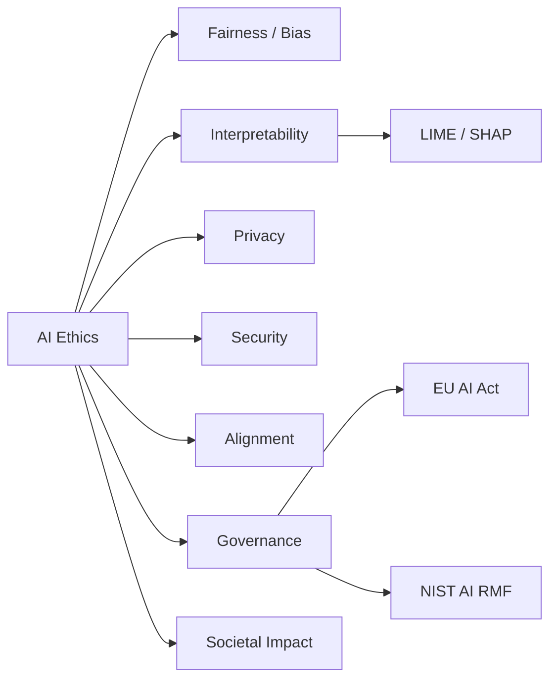

# Chapter 15: Ethics of Artificial Intelligence

**Previous:** [Chapter 14: Robotics](14-robotics.md) | **Next:** [Chapter 16: Expert Systems](16-expert-systems.md)

## Learning Objectives

By the conclusion of this chapter, the student will be able to: (1) identify sources of bias in AI systems; (2) apply interpretability techniques to explain model decisions; (3) analyze privacy implications of AI deployment; (4) explain the AI alignment problem and its significance; (5) describe major regulatory frameworks governing AI.

## Chapter at a Glance

| Section | Key Topics | Key Terms |
|---------|-----------|-----------|
| Fairness and Bias | Data/algorithmic bias, fairness definitions | Demographic parity, equalized odds |
| Interpretability | LIME, SHAP, saliency maps | Feature attribution |
| Privacy | Differential privacy, federated learning | ε-DP, secure aggregation |
| Security | Adversarial examples, data poisoning | Evasion attacks |
| AI Alignment | Value learning, reward hacking | Outer/inner alignment |
| Governance | EU AI Act, NIST AI RMF | Risk categories, compliance |
| Societal Impact | Labor displacement, inequality | Universal basic income |

## Chapter Roadmap

## 15.1 Fairness and Bias

**Algorithmic bias** occurs when an AI system systematically produces outcomes that disadvantage particular groups. Bias can enter the system at multiple points:

- **Data bias:** Training data may undersample or misrepresent certain populations. Historical discrimination encoded in data (e.g., biased hiring decisions) is learned and perpetuated by models.
- **Label bias:** Subjective labels may reflect annotator prejudice.
- **Measurement bias:** Proxy variables may correlate imperfectly with target constructs.
- **Deployment bias:** Model predictions may be applied in contexts different from training.

### 15.1.1 Fairness Definitions

Multiple mathematical definitions of fairness exist, and they are mutually incompatible in general (Kleinberg et al., 2016):

- **Demographic parity:** $P(\hat{Y} = 1 \mid A = a) = P(\hat{Y} = 1)$ across groups.
- **Equal opportunity:** $P(\hat{Y} = 1 \mid Y = 1, A = a) = P(\hat{Y} = 1 \mid Y = 1)$ --- equal true positive rates.
- **Equalized odds:** Both false positive and true positive rates are equal across groups.
- **Individual fairness:** Similar individuals receive similar predictions (requires a similarity metric).

The impossibility theorem: unless base rates are equal or the predictor is perfect, demographic parity and equalized odds cannot both be satisfied simultaneously.

### 15.1.2 Bias Mitigation Strategies

**Pre-processing:** Transform training data to remove bias (reweighing, relabeling, data generation).

**In-processing:** Incorporate fairness constraints into model training (adversarial debiasing, regularized loss functions).

**Post-processing:** Adjust model outputs to satisfy fairness criteria (threshold modification, calibration).

## 15.2 Interpretability

Interpretability is the degree to which a human can understand the reasoning behind a model's predictions. As models grow more complex, interpretability becomes more challenging.

**LIME (Local Interpretable Model-Agnostic Explanations):** Approximates a complex model locally with a simple, interpretable surrogate model. For a given prediction, LIME perturbs the input, observes prediction changes, and fits a linear model.

$$ \xi(x) = \arg\min_{g \in \mathcal{G}} \mathcal{L}(f, g, \pi_x) + \Omega(g) $$

where $\pi_x$ is a proximity measure and $\mathcal{G}$ is the class of interpretable models.

**SHAP (SHapley Additive exPlanations):** Uses Shapley values from cooperative game theory to assign feature importance. Each feature's contribution is its average marginal contribution across all possible feature subsets.

**Integrated Gradients:** For vision models, attributes prediction to each pixel by integrating gradients along the path from a baseline to the input.

## 15.3 Privacy

AI systems raise significant privacy concerns:
- **Training data leakage:** Models may memorize and expose sensitive training examples.
- **Inference attacks:** Adversaries can determine whether a specific individual was in the training set (membership inference) or infer sensitive attributes.
- **Surveillance:** Facial recognition and behavior tracking enable mass surveillance.

**Differential privacy** provides a formal guarantee: an algorithm $\mathcal{M}$ is $\epsilon$-differentially private if for any datasets $D$ and $D'$ differing by one element and any output $S$:

$$P(\mathcal{M}(D) \in S) \leq e^\epsilon \cdot P(\mathcal{M}(D') \in S)$$

## 15.4 Accountability and Transparency

Accountability requires that responsibility for AI system outcomes can be assigned. Key principles:

- **Auditability:** System decisions should be logged and reviewable.
- **Contestability:** Affected individuals should be able to challenge automated decisions.
- **Human oversight:** Meaningful human review of high-stakes AI decisions.

## 15.5 AI Safety

**AI safety** addresses the risk of harm from AI systems, both accidental and intentional.

### 15.5.1 The Alignment Problem

The **alignment problem** (Russell, 2019) asks: how can we ensure that AI systems reliably pursue the objectives intended by their designers, even as capabilities increase?

**Reward hacking:** The agent finds unintended ways to maximize its reward function (e.g., a cleaning robot that hides dirt rather than collecting it).

**Goal misgeneralization:** The agent pursues a proxy objective that diverges from the designer's true intent.

**Specification gaming:** The agent exploits ambiguities in the reward specification.

### 15.5.2 Existential Risk

Superintelligent AI could pose existential risks (Bostrom, 2014):
- **Orthogonality thesis:** Intelligence and final goals are independent -- a highly intelligent system could pursue harmful objectives.
- **Instrumental convergence:** Any sufficiently intelligent agent would have instrumental reasons to acquire resources, resist shutdown, and increase its capabilities.

**Control approaches:** Boxed AI (containment), motivation selection (value learning), capability control (limiting capabilities).

## 15.6 Regulation

**GDPR (General Data Protection Regulation):** EU regulation granting individuals rights over their data (right to explanation, right to be forgotten, data portability).

**EU AI Act (2024):** Risk-based regulation classifying AI systems into prohibited, high-risk, limited-risk, and minimal-risk categories. High-risk systems require conformity assessments, transparency, and human oversight.

**US Executive Order on AI (2023):** Requires safety testing of powerful AI models, sets standards for AI security, and addresses algorithmic discrimination.

> **💡 Pro Tip:** When building AI systems in regulated domains, start with the EU AI Act's risk categories. If your system is classified as High-Risk, you'll need human oversight, transparency, accuracy, and cybersecurity from day one — build these in during architecture, not as an afterthought.

## Concept Comparison

| Principle | Definition | Metric | Challenge |
|-----------|------------|:---:|-----------|
| Fairness | Absence of systematic discrimination | Demographic parity, equal opportunity | Incompatibility theorems |
| Interpretability | Human-understandable decisions | LIME fidelity, SHAP consistency | Accuracy-interpretability trade-off |
| Privacy | Control over personal data | ε in differential privacy | Utility-privacy trade-off |
| Accountability | Responsibility for outcomes | Audit trails, lineage | Responsibility gap |
| Robustness | Resistance to attacks | Adversarial accuracy | Cat-and-mouse with attackers |

## Quick Reference — XAI Methods

| Method | Type | Output | Scope |
|--------|:---:|--------|:---:|
| LIME | Surrogate | Feature weights | Local |
| SHAP | Game-theoretic | Shapley values | Local |
| Saliency Map | Gradient-based | Attribution heatmap | Local |
| Integrated Gradients | Path-based | Feature attributions | Local |
| PDP / ICE | Visualization | Partial dependence | Global |
| Feature Importance | Permutation | Importance scores | Global |

## Cross-Application Matrix

| Technique | ML | CV | NLP | Research |
|-----------|:---:|:---:|:---:|:---:|
| Fairness Auditing | ✅ | ✅ | ✅ | ✅ |
| LIME / SHAP | ✅ | ✅ | ✅ | ✅ |
| Differential Privacy | ✅ | ✅ | ✅ | ✅ |
| Adversarial Robustness | ✅ | ✅ | ✅ | ✅ |
| AI Governance | ✅ | ✅ | ✅ | ✅ |

## Chapter Quiz

**Q1:** Why can demographic parity and equalized odds not both be satisfied simultaneously in general?
- A) They require different data types
- B) Unless base rates are equal or the predictor is perfect, both constraints are mutually exclusive
- C) They measure different quantities
- D) They are actually the same metric

Answer
B) Kleinberg et al.'s impossibility theorem shows that demographic parity and equalized odds are incompatible unless base rates are identical across groups or the predictor is perfect.

**Q2:** What distinguishes LIME from SHAP in model interpretability?
- A) LIME is faster; SHAP is global
- B) LIME fits a local surrogate around a single prediction; SHAP computes Shapley values from game theory
- C) LIME works for images; SHAP works for text
- D) There is no practical difference

Answer
B) LIME approximates the model locally with a simple surrogate; SHAP provides theoretically grounded feature attributions based on Shapley values from cooperative game theory.

**Q3:** The EU AI Act categorizes AI systems by:
- A) Model size
- B) Risk level (Unacceptable, High, Limited, Minimal)
- C) Accuracy thresholds
- D) Deployment date

Answer
B) The EU AI Act uses a risk-based framework: Unacceptable (banned), High (regulated), Limited (transparency), and Minimal (unregulated).

## 15.7 Summary

AI ethics encompasses fairness, interpretability, privacy, accountability, safety, and regulation. These considerations are not secondary to technical development but constitute essential design requirements for responsible AI systems.

## Exercises

### Review Questions

1. Why are demographic parity and equalized odds fundamentally incompatible?
2. Distinguish LIME and SHAP. Under what conditions might one be preferred?
3. Explain the alignment problem. Why does it become more pressing as AI capabilities increase?

### Application Problems

4. Train a logistic regression classifier on the COMPAS recidivism dataset. Evaluate demographic parity and equal opportunity across racial groups. Propose a mitigation strategy.
5. Apply LIME to explain three predictions from a black-box classifier. Evaluate the stability of the explanations across perturbations of the input.

### Challenge Problem

6. Implement a differentially private version of stochastic gradient descent for logistic regression. Evaluate the trade-off between privacy budget $\epsilon$ and model accuracy on a binary classification task.
