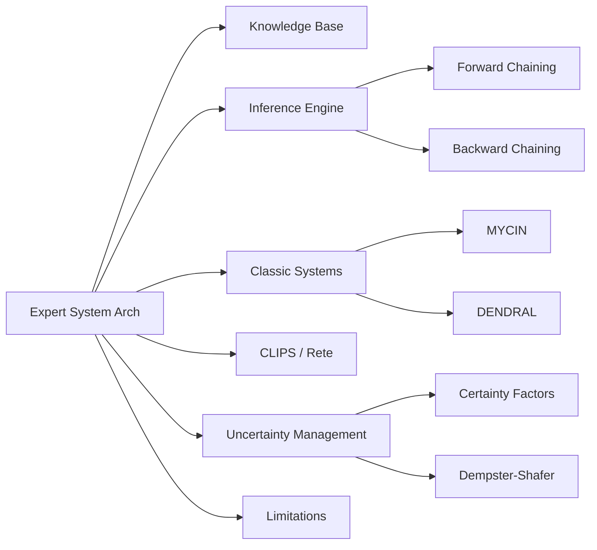

# Chapter 16: Expert Systems

**Previous:** [Chapter 15: Ethics of AI](15-ethics-ai.md) | **Next:** [Chapter 17: Modern Artificial Intelligence](17-modern-ai.md)

## Learning Objectives

By the conclusion of this chapter, the student will be able to: (1) describe the architecture of rule-based expert systems; (2) explain the reasoning mechanisms of MYCIN and DENDRAL; (3) implement a simple rule-based system in CLIPS; (4) manage uncertainty using certainty factors and Dempster-Shafer theory; (5) evaluate the limitations of expert system technology.

## Chapter at a Glance

| Section | Key Topics | Key Terms |
|---------|-----------|-----------|
| Expert System Architecture | KB, inference engine, user interface | Knowledge base, production rules |
| Inference Strategies | Forward chaining, backward chaining | Modus ponens, goal-driven |
| MYCIN | Medical diagnosis, certainty factors | CF, infectious disease |
| DENDRAL | Mass spectrometry, hypothesis generation | Plan-generate-test |
| CLIPS | Rule-based programming, fact lists | Rete algorithm |
| Uncertainty | Certainty factors, Dempster-Shafer | Belief functions |
| Limitations | Brittleness, knowledge acquisition bottleneck | Maintenance, narrow expertise |

## Chapter Roadmap



## 16.1 Expert System Architecture


An **expert system** is a computer program that emulates the decision-making ability of a human expert in a specific domain. The classical architecture comprises three principal components:

**Knowledge Base (KB):** A repository of domain-specific facts, rules, and heuristics. In rule-based systems, knowledge is encoded as IF-THEN production rules:

```
IF (condition_1 AND condition_2) OR condition_3
THEN conclusion
```

**Inference Engine:** The reasoning mechanism that applies knowledge base rules to known facts to derive conclusions. Two primary control strategies exist:

- **Forward chaining (data-driven):** Starting from known facts, apply rules whose antecedents are satisfied, adding new facts until the goal is reached. Used for monitoring, diagnosis, and design tasks.

- **Backward chaining (goal-driven):** Starting from a hypothesis (goal), work backward through rules to find evidence that supports or refutes it. Used for diagnosis and explanation tasks.

**Explanation Facility:** Provides justification for conclusions by displaying the chain of rules applied. This is a distinguishing feature of expert systems compared to black-box approaches. Typical explanation capabilities include:

- **How:** Explain how a conclusion was reached (show the rule chain).
- **Why:** Explain why a question is being asked (show the goal being pursued).

## 16.2 Rule-Based Systems

Production rules are the dominant knowledge representation in expert systems. Each rule has:

- **Antecedent (LHS):** A conjunction of conditions (patterns) that must match working memory elements.
- **Consequent (RHS):** Actions to perform when the rule fires (add facts, perform computations, interact with user).

The **Rete algorithm** (Forgy, 1982) provides efficient pattern matching for production systems by maintaining a network of node conditions. It avoids re-evaluating rules whose conditions are unaffected by new facts.

```
Rule: Determine bacterial identity
  IF (stain = gramneg) AND (morphology = rod) AND (aerobicity = aerobic)
  THEN (identity = pseudomonas) WITH cf = 0.8
```

## 16.3 MYCIN

MYCIN (Shortliffe, 1976) was an expert system for diagnosing bacterial infections and recommending antibiotic treatments. It demonstrated that rule-based systems could achieve expert-level performance in narrow domains.

**Knowledge:** MYCIN contained approximately 500 rules encoding the diagnostic knowledge of infectious disease specialists.

**Reasoning:** Backward chaining from the goal (identify the infecting organism) through diagnostic rules. MYCIN asked the physician for relevant patient data as needed.

**Certainty Factors:** MYCIN introduced **certainty factors (CF)** to handle uncertainty. A certainty factor ranges from $-1$ (definitely false) through $0$ (unknown) to $+1$ (definitely true).

Combination functions for certainty factors:
- Conjunction: $\text{CF}(A \land B) = \min(\text{CF}(A), \text{CF}(B))$
- Disjunction: $\text{CF}(A \lor B) = \max(\text{CF}(A), \text{CF}(B))$
- Sequential combination (two rules supporting same conclusion):

$$\text{CF}_{\text{combined}} = \text{CF}_1 + \text{CF}_2 - \text{CF}_1 \cdot \text{CF}_2 \quad (\text{for } \text{CF}_1 > 0, \text{CF}_2 > 0)$$

**Performance:** MYCIN outperformed junior doctors and matched senior specialists in diagnosing bacteremia and meningitis cases.

## 16.4 DENDRAL

DENDRAL (Feigenbaum, Buchanan, and Lederberg, 1969) was the first expert system, designed to infer molecular structure from mass spectrometry data.

**Knowledge:** DENDRAL encoded the mass spectrometry expertise of organic chemists, including fragmentation patterns and structural constraints.

**Reasoning:** DENDRAL used a generate-and-test strategy:
1. **Generator:** Enumerate all plausible molecular structures consistent with the molecular formula.
2. **Predictor:** Predict the mass spectrum for each candidate.
3. **Matcher:** Compare predicted spectra with observed data.

**Significance:** DENDRAL demonstrated that domain-specific knowledge could be systematically encoded and applied to solve non-trivial scientific problems.

## 16.5 Knowledge Acquisition

Knowledge acquisition is the process of extracting expert knowledge and encoding it in the knowledge base. It is widely recognized as the principal bottleneck in expert system development.

Methods include:
- **Interviewing:** Structured and unstructured interviews with domain experts.
- **Protocol analysis:** Observing experts solving problems and recording their reasoning.
- **Machine induction:** Learning rules from example cases.
- **Repertory grids:** Eliciting conceptual structures from experts.

## 16.6 CLIPS

CLIPS (C Language Integrated Production System) is a public-domain tool for building rule-based expert systems. It supports:

- **Rule-based programming:** Forward-chaining production rules.
- **Object-oriented programming:** COOL (CLIPS Object-Oriented Language).
- **Procedural programming:** Functions and control structures.

**Example CLIPS rule:**
```
(defrule identify-animal
    (animal has hair)
    (animal gives milk)
=>
    (assert (animal is mammal)))
```

CLIPS rules can be integrated with other languages via its C API.

## 16.7 Uncertainty in Expert Systems

### 16.7.1 Certainty Factors

As implemented in MYCIN, certainty factors provide a heuristic approach to uncertainty. While computationally efficient, CFs lack the formal foundation of probability theory and can produce counterintuitive results.

### 16.7.2 Dempster-Shafer Theory

Dempster-Shafer theory generalizes probability by assigning belief to sets of hypotheses. A **belief function** $\text{Bel}(A)$ represents the total evidence supporting proposition $A\). The **plausibility** $\text{Pl}(A) = 1 - \text{Bel}(\neg A)$ represents the maximum possible support.

Dempster's rule combines evidence from independent sources:

$$(m_1 \oplus m_2)(A) = \frac{\sum_{B \cap C = A} m_1(B) m_2(C)}{1 - \sum_{B \cap C = \emptyset} m_1(B) m_2(C)}$$

Dempster-Shafer can represent ignorance explicitly (unlike Bayesian approaches) but computational complexity grows exponentially with the frame of discernment.

## 16.8 Limitations of Expert Systems

1. **Knowledge acquisition bottleneck:** Extracting and encoding expert knowledge is time-consuming and expensive.
2. **Brittleness:** Systems fail when presented with cases outside their narrow domain of expertise.
3. **No learning:** Classical expert systems do not improve from experience.
4. **Maintenance difficulty:** Updating large rule bases can introduce inconsistencies.
5. **Shallow reasoning:** Rule-based systems lack deep causal models of their domains.
6. **Scalability:** The number of rules required for broad coverage grows rapidly.

Despite these limitations, expert systems remain in use for specific applications where explainability and maintainability are paramount.

> **💡 Pro Tip:** Expert systems remain useful in domains with stable, well-documented knowledge and high explainability requirements (e.g., tax preparation, medical guidelines, configurators). For domains where knowledge changes rapidly, modern ML systems are a better fit.

## Concept Comparison

| System | Domain | Reasoning | Uncertainty? | Status |
|--------|--------|:---:|:---:|:---:|
| MYCIN | Infectious disease diagnosis | Backward chaining | Certainty factors | Historical |
| DENDRAL | Organic chemistry (mass spec) | Plan-generate-test | ❌ | Historical |
| XCON/R1 | Computer configuration | Forward chaining (Rete) | ❌ | Deployed (1980s) |
| CLIPS | General purpose | Forward/backward with Rete | ✅ | Open source |
| Prolog | Logic programming | Backward chaining (SLD) | ❌ | Research/edu |

## Quick Reference — Inference Engine Strategies

| Strategy | Direction | Mechanism | Start Point |
|:---:|:---:|:---:|:---:|
| Forward Chaining | Data → Goal | Match → Fire → Repeat | Known facts |
| Backward Chaining | Goal → Data | Hypothesize → Verify → Repeat | Hypothesis/goal |

## Cross-Application Matrix

| Technique | ML | CV | NLP | Research |
|-----------|:---:|:---:|:---:|:---:|
| Rule-Based Systems | ⬜ | ⬜ | ✅ | ✅ |
| Forward Chaining | ⬜ | ⬜ | ⬜ | ✅ |
| Backward Chaining | ⬜ | ⬜ | ⬜ | ✅ |
| Certainty Factors | ⬜ | ⬜ | ⬜ | ✅ |
| Dempster-Shafer | ✅ | ⬜ | ⬜ | ✅ |

## Chapter Quiz

**Q1:** What is the key difference between forward and backward chaining in expert systems?
- A) Forward chaining is faster; backward chaining is more accurate
- B) Forward chaining starts from known facts and applies rules to reach conclusions; backward chaining starts from a hypothesis and works backward to find supporting facts
- C) Forward chaining uses rules; backward chaining uses frames
- D) There is no difference

<details><summary>Answer</summary>B) Forward chaining is data-driven (facts → conclusions), while backward chaining is goal-driven (hypothesis → supporting evidence).</details>

**Q2:** MYCIN's certainty factors handle uncertainty by:
- A) Using probability theory
- B) Combining belief and disbelief measures into a single CF value ranging from -1 to +1
- C) Applying fuzzy logic
- D) Using Bayesian networks

<details><summary>Answer</summary>B) MYCIN certainty factors represent the net belief in a hypothesis as CF = MB - MD, where MB is measure of belief (0 to 1) and MD is measure of disbelief (0 to 1).</details>

**Q3:** A classic limitation of expert systems is:
- A) They cannot handle numerical data
- B) The knowledge acquisition bottleneck — gathering and encoding expert knowledge is expensive and time-consuming
- C) They are too fast
- D) They require GPUs

<details><summary>Answer</summary>B) Expert systems suffer from the knowledge acquisition bottleneck: extracting, formalizing, and maintaining expert knowledge is labor-intensive and limits scalability.</details>

## 16.9 Summary

Expert systems represented the dominant paradigm of applied AI from the 1970s through the 1980s. The architecture of knowledge base, inference engine, and explanation facility established foundational principles for knowledge-based AI.

## Exercises

### Review Questions

1. Compare forward and backward chaining. For what types of tasks is each best suited?
2. Explain the knowledge acquisition bottleneck. Why does it persist as a challenge?
3. Distinguish certainty factors from Bayesian probability. What are the trade-offs?

### Application Problems

4. Implement a rule-based system in pseudocode for automobile fault diagnosis. Include at least 10 rules covering common problems (battery, starter, fuel, ignition).
5. Write a CLIPS program to classify animals by their characteristics (mammal, bird, reptile, fish).

### Challenge Problem

6. Implement Dempster-Shafer combination for a medical diagnosis domain with three diseases and four symptoms. Compare the results with a Bayesian network approach on the same problem. Discuss cases where the approaches diverge.
