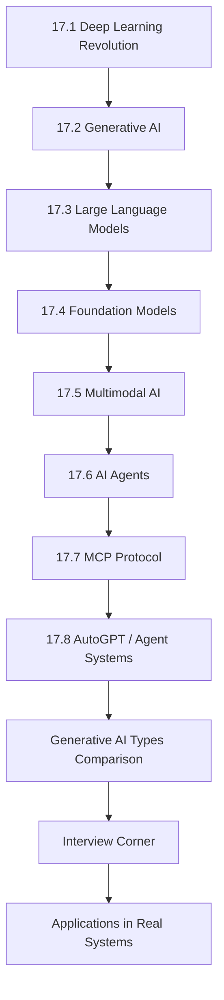

# Chapter 17: Modern Artificial Intelligence

**Previous:** [Chapter 16: Expert Systems](16-expert-systems.md) | **Next:** [Chapter 18: Applications of AI](18-ai-applications.md)

## Learning Objectives

By the conclusion of this chapter, the student will be able to: (1) describe the transformer architecture and its significance; (2) explain foundation models and their emergent abilities; (3) implement in-context learning and prompt engineering; (4) understand multimodal model architectures; (5) describe AI agent architectures including ReAct, MCP, and AutoGPT; (6) implement generative AI algorithms from scratch; (7) design autonomous agent systems; (8) evaluate modern AI systems across real-world applications.

## Why Modern AI Matters

**Real-World Analogy:** Traditional AI was like a cookbook — every recipe (rule) had to be written by hand, ingredient by ingredient. If you wanted the system to recognize a cat, you had to manually define whisker length, ear shape, fur texture, and eye color. Modern AI is like a chef who learns to cook by eating thousands of meals — the system discovers the patterns itself from data, generalizes to new dishes, and even creates novel recipes no human ever wrote.

The shift from **symbolic AI** (rules, logic, expert systems) to **modern AI** (deep learning, foundation models, generative AI) represents a paradigm change:

| Aspect | Traditional AI | Modern AI |
|--------|---------------|-----------|
| Learning mechanism | Hand-crafted rules by domain experts | Data-driven pattern discovery |
| Scaling behavior | Linear effort for each new capability | Power-law improvement with scale |
| Flexibility | Narrow, single-task only | Broad, multi-task, zero-shot transfer |
| Development cycle | Months of feature engineering | Weeks of data curation + pre-training |
| Human involvement | Every rule written by programmers | Data labeling + RLHF feedback |
| Failure mode | Brittle — breaks on unseen inputs | Graceful degradation — confidence calibrated |

Modern AI systems — ChatGPT, Claude, Gemini, Midjourney, Copilot — are not academic curiosities. They power products used by billions daily. Understanding their architectures, training methodologies, and limitations is essential for any AI engineer in the 2020s.

## Chapter at a Glance

| Section | Key Topics | Key Terms |
|---------|-----------|-----------|
| Deep Learning Revolution | Neural networks, backpropagation, gradient descent | Backprop, vanishing gradient, ReLU |
| Generative AI | Autoregressive models, diffusion, GANs | Token, temperature, sampling |
| Large Language Models | GPT, BERT, T5, scaling laws, RLHF | Attention, KV cache, pretraining |
| Foundation Models | Pre-train then adapt, emergence, in-context learning | Fine-tuning, few-shot, zero-shot |
| Multimodal AI | CLIP, DALL-E, Sora, vision-language models | Cross-modal, contrastive, alignment |
| AI Agents | ReAct, function calling, tool use | Agent loop, reasoning, action |
| MCP Protocol | Model Context Protocol, standardized tool interfaces | Tool schema, handshake, server |
| AutoGPT / Agent Systems | Task decomposition, autonomous execution | Planning, iteration, sub-tasks |

## Chapter Roadmap



## 17.1 The Deep Learning Revolution

### Real-World Analogy

Think of teaching a child to identify animals. **Traditional machine learning** is like giving the child a checklist: "If it has whiskers, pointy ears, and says meow, it's a cat." Every rule must be explicitly defined. **Deep learning** is like showing the child 10,000 pictures of cats and dogs without any rules — the child's brain automatically learns the distinguishing features. The "deep" refers to many layers of neurons, each building on simpler patterns (edges → shapes → parts → whole object).

### What is Deep Learning?

Deep learning uses multi-layer artificial neural networks to model complex patterns. Each layer transforms its input into progressively more abstract representations:

- Layer 1: Detects edges and corners
- Layer 2: Combines edges into shapes (circles, rectangles)
- Layer 3: Combines shapes into parts (eyes, wheels, windows)
- Layer 4: Combines parts into whole objects (face, car, house)

### Algorithm: Training a Neural Network via Gradient Descent

**Input:** Training data (X, y), network architecture (layers, activation functions), learning rate (eta), epochs (E)

**Output:** Trained network weights (W, b)

**Steps:**
1. Initialize weights W randomly (small values near zero) and biases b to zero
2. For each epoch e = 1 to E:
   a. For each batch of training examples:
      i. **Forward pass:** Compute predictions by passing input through each layer
         z^{(1)} = X · W^{(1)} + b^{(1)}
         a^{(1)} = ReLU(z^{(1)})
         z^{(2)} = a^{(1)} · W^{(2)} + b^{(2)}
         y_pred = softmax(z^{(2)})
      ii. **Compute loss:** Measure error between predictions and true labels
         L = -sum(y_true * log(y_pred))  (cross-entropy)
      iii. **Backward pass (backpropagation):** Compute gradients of loss with respect to each weight
         dL/dW^{(2)} = a^{(1)}^T · (y_pred - y_true)
         dL/dW^{(1)} = X^T · ((y_pred - y_true) · W^{(2)}^T · ReLU'(z^{(1)}))
      iv. **Update weights:** Adjust weights in direction opposite to gradient
         W = W - eta * dL/dW
3. Return trained weights

### Pseudocode

```
FUNCTION TRAIN_NEURAL_NETWORK(X, y, hidden_size, learning_rate, epochs):
    // Initialize weights
    W1 = RANDOM(-0.01, 0.01, size=(INPUT_DIM, hidden_size))
    b1 = ZEROS(hidden_size)
    W2 = RANDOM(-0.01, 0.01, size=(hidden_size, OUTPUT_DIM))
    b2 = ZEROS(OUTPUT_DIM)
    
    FOR epoch = 1 TO epochs:
        // Forward pass
        z1 = X · W1 + b1
        a1 = RELU(z1)
        z2 = a1 · W2 + b2
        y_pred = SOFTMAX(z2)
        
        // Loss
        loss = CROSS_ENTROPY(y, y_pred)
        
        // Backward pass
        dz2 = y_pred - y
        dW2 = a1^T · dz2
        db2 = SUM(dz2, axis=0)
        da1 = dz2 · W2^T
        dz1 = da1 * RELU_DERIVATIVE(z1)
        dW1 = X^T · dz1
        db1 = SUM(dz1, axis=0)
        
        // Update
        W1 = W1 - learning_rate * dW1
        b1 = b1 - learning_rate * db1
        W2 = W2 - learning_rate * dW2
        b2 = b2 - learning_rate * db2
    
    RETURN W1, b1, W2, b2
```

### Dry Run Trace Table: Forward Pass

**Setup:** Input X=[0.5, -0.3], target y=[0,1,0] (class 1). Hidden layer size=3. Random initialized weights:

W1 = [[0.1, -0.2, 0.3], [0.4, 0.1, -0.5]], b1=[0.0, 0.0, 0.0]
W2 = [[0.2, -0.3, 0.1], [0.5, 0.2, -0.4], [-0.1, 0.6, 0.3]], b2=[0.0, 0.0, 0.0]

| Step | Operation | Computation | Result |
|------|-----------|-------------|--------|
| 1 | z1 = X·W1+b1 | [0.5*0.1+(-0.3)*0.4, 0.5*(-0.2)+(-0.3)*0.1, 0.5*0.3+(-0.3)*(-0.5)] + [0,0,0] | [-0.07, -0.13, 0.30] |
| 2 | a1 = ReLU(z1) | max(0,-0.07), max(0,-0.13), max(0,0.30) | [0.00, 0.00, 0.30] |
| 3 | z2 = a1·W2+b2 | [0*0.2+0*0.5+0.3*(-0.1), 0*(-0.3)+0*0.2+0.3*0.6, 0*0.1+0*(-0.4)+0.3*0.3] | [-0.03, 0.18, 0.09] |
| 4 | y_pred = softmax(z2) | exp: [0.97, 1.20, 1.09], sum=3.27 | [0.30, 0.37, 0.33] |
| 5 | Loss = -sum(y*log(y_pred)) | -[0*log(0.30)+1*log(0.37)+0*log(0.33)] | 0.994 |

The model predicts class 1 with 37% confidence (correct class has highest probability but low confidence). Backpropagation would adjust weights to increase this to ~90%+ over many epochs.

### Python Implementation

```python
import numpy as np

def relu(x):
    return np.maximum(0, x)

def relu_derivative(x):
    return (x > 0).astype(float)

def softmax(x):
    e_x = np.exp(x - np.max(x, axis=1, keepdims=True))
    return e_x / np.sum(e_x, axis=1, keepdims=True)

def cross_entropy(y_true, y_pred):
    return -np.mean(np.sum(y_true * np.log(y_pred + 1e-8), axis=1))

class NeuralNetwork:
    def __init__(self, input_dim, hidden_dim, output_dim, lr=0.01):
        self.lr = lr
        self.W1 = np.random.randn(input_dim, hidden_dim) * 0.01
        self.b1 = np.zeros((1, hidden_dim))
        self.W2 = np.random.randn(hidden_dim, output_dim) * 0.01
        self.b2 = np.zeros((1, output_dim))

    def forward(self, X):
        self.z1 = X @ self.W1 + self.b1
        self.a1 = relu(self.z1)
        self.z2 = self.a1 @ self.W2 + self.b2
        self.y_pred = softmax(self.z2)
        return self.y_pred

    def backward(self, X, y):
        m = X.shape[0]
        dz2 = self.y_pred - y
        dW2 = self.a1.T @ dz2 / m
        db2 = np.sum(dz2, axis=0, keepdims=True) / m
        da1 = dz2 @ self.W2.T
        dz1 = da1 * relu_derivative(self.z1)
        dW1 = X.T @ dz1 / m
        db1 = np.sum(dz1, axis=0, keepdims=True) / m
        return dW1, db1, dW2, db2

    def update(self, dW1, db1, dW2, db2):
        self.W1 -= self.lr * dW1
        self.b1 -= self.lr * db1
        self.W2 -= self.lr * dW2
        self.b2 -= self.lr * db2

    def train(self, X, y, epochs=100):
        for epoch in range(epochs):
            y_pred = self.forward(X)
            loss = cross_entropy(y, y_pred)
            grads = self.backward(X, y)
            self.update(*grads)
            if epoch % 20 == 0:
                acc = np.mean(np.argmax(y_pred, axis=1) == np.argmax(y, axis=1))
                print(f"Epoch {epoch}: loss={loss:.4f}, acc={acc:.4f}")

# Demo
X = np.array([[0.5, -0.3], [0.1, 0.9], [-0.8, -0.2], [0.3, 0.1]])
y = np.array([[1,0,0], [0,1,0], [0,0,1], [0,1,0]])
nn = NeuralNetwork(input_dim=2, hidden_dim=4, output_dim=3, lr=0.1)
nn.train(X, y, epochs=100)
```

### Complexity Analysis

| Operation | Time Complexity | Space Complexity | Why |
|-----------|---------------|-----------------|-----|
| Forward pass (per layer) | O(m * n_in * n_out) | O(n_in * n_out + n_out) | Matrix multiply of (m x n_in) · (n_in x n_out) — each of m examples does n_in * n_out operations |
| Backward pass | O(m * n_in * n_out) | O(n_in * n_out) | Same matrix dimensions as forward — gradient computation is another matrix multiply |
| Full epoch | O(m * n_in * n_hidden + m * n_hidden * n_out) | O(n_in * n_hidden + n_hidden * n_out) | Combines all layers: input→hidden and hidden→output |
| Training (E epochs) | O(E * m * n_in * n_hidden) | Same as epoch | Linear in epochs — each pass identical work |

**Why it matters:** Deep learning's computational cost is dominated by matrix multiplications, which GPUs parallelize extremely well. The O(E * m * n * n) scaling means doubling the hidden dimension quadruples compute — this is why model scale is expensive.

### Advantages & Disadvantages

| Advantages | Disadvantages |
|-----------|--------------|
| Learns hierarchical features automatically | Requires massive labeled datasets |
| State-of-the-art on vision, language, audio | Computationally expensive to train |
| Transferable across tasks via pre-training | Black box — hard to interpret decisions |
| Handles high-dimensional raw data (pixels, audio) | Vulnerable to adversarial examples |
| Scales with data — more data = better performance | Prone to overfitting on small datasets |
| End-to-end learning (no manual feature engineering) | Vanishing/exploding gradients in deep networks |

### Edge Cases

1. **Vanishing Gradients:** In deep networks with sigmoid/tanh, gradients become near-zero in early layers — the network stops learning. Solution: ReLU, residual connections, batch normalization.

2. **Exploding Gradients:** Gradients grow exponentially in deep networks, causing NaN weights. Solution: gradient clipping, proper weight initialization (Xavier/He).

3. **Dead ReLU Units:** If a neuron's weights push all inputs to negative, ReLU outputs 0 and gradients are 0 — the neuron never recovers. Solution: Leaky ReLU, ELU, careful initialization.

4. **Class Imbalance:** If 99% of data is class A, the network learns to always predict A. Solution: weighted loss, oversampling, focal loss.

5. **Overfitting on Small Data:** With <1000 examples per class, the network memorizes rather than generalizes. Solution: dropout, data augmentation, transfer learning.

## 17.2 Generative AI

### Real-World Analogy

Imagine a composer who has listened to every symphony ever written. When asked to compose a new symphony, they don't copy any single one — they've internalized the patterns: how themes develop, how tension builds, how instruments combine. **Generative AI** works the same way: it learns the probability distribution of training data and samples new instances from that distribution. It's not "remembering" — it's generating novel outputs that follow the learned patterns.

### What is Generative AI?

Generative AI models learn the joint probability distribution P(data) and can sample new data points. This contrasts with **discriminative** models that learn P(label|data) for classification.

Key paradigm: instead of predicting a label, predict the next piece of data — next word, next pixel, next audio sample.

### Algorithm: Autoregressive Text Generation

**Input:** Starting prompt (list of tokens), pre-trained model (transformer), temperature (T), max_length (L), top_k (K)

**Output:** Generated sequence (list of tokens)

**Steps:**
1. Encode prompt into token IDs using tokenizer
2. For step = 1 to L:
   a. Feed token sequence through transformer model
   b. Get logits for next token from final layer (vocabulary-sized vector)
   c. Scale logits by temperature: logits = logits / T
   d. Apply top-k filtering: zero out all logits except top K
   e. Apply softmax to get probability distribution
   f. Sample next token from this distribution
   g. Append sampled token to sequence
   h. If sampled token is END token, stop early
3. Decode token IDs back to text
4. Return generated text

### Pseudocode

```
FUNCTION GENERATE_TEXT(prompt, model, temperature, max_length, top_k):
    tokens = TOKENIZE(prompt)
    
    FOR step = 1 TO max_length:
        // Forward pass through transformer
        logits = model.FORWARD(tokens)      // shape: (vocab_size,)
        
        // Temperature scaling
        logits = logits / temperature
        
        // Top-k filtering
        indices = ARGSORT(logits)[-top_k:]
        filtered = array of -infinity of size vocab_size
        filtered[indices] = logits[indices]
        
        // Softmax
        probs = SOFTMAX(filtered)
        
        // Sample
        next_token = SAMPLE(probs)           // random weighted by probs
        
        // Append
        tokens.APPEND(next_token)
        
        // Early stopping
        IF next_token == END_TOKEN:
            BREAK
    
    RETURN DETOKENIZE(tokens)
```

### Dry Run Trace Table: Generating "The cat"

**Setup:** Tiny vocabulary = {"The":0, "cat":1, "sat":2, "mat":3, "END":4}. Prompt="The". GPT with embedding_dim=4, hidden_dim=8.

**Step 1:** Input tokens=[0] ("The")

| Step | Operation | Computation | Result |
|------|-----------|-------------|--------|
| 1a | Embed "The" | Lookup embedding table | emb = [0.5, -0.1, 0.3, 0.2] |
| 1b | Self-attention | Single token — no cross-attention needed | attn_out = [0.5, -0.1, 0.3, 0.2] |
| 1c | FFN projection | ReLU(attn·W1+b1)·W2+b2 | hidden = [0.8, -0.2, 0.5, 1.2] |
| 1d | Output projection to vocab | hidden·W_out | logits = [1.5, 2.1, -0.3, 0.7, -0.5] |
| 1e | Temperature scaling T=0.8 | logits/0.8 | scaled = [1.87, 2.62, -0.37, 0.87, -0.62] |
| 1f | Top-k (k=3) | Keep indices 0,1,3 | filtered = [1.87, 2.62, -inf, 0.87, -inf] |
| 1g | Softmax | exp/sum | probs = [0.32, 0.55, 0, 0.13, 0] |
| 1h | Sample | Weighted random based on probs | next_token = 1 ("cat") |

**Step 2:** Input tokens=[0, 1] ("The cat")

| Step | Operation | Computation | Result |
|------|-----------|-------------|--------|
| 2a | Embed both tokens | Embedding lookup | emb = [[0.5,-0.1,0.3,0.2], [-0.2,0.6,0.1,-0.3]] |
| 2b | Self-attention | Compute attention weights between "The" and "cat" — "sat" gets highest weight (cats sit on mats) | attn_out = [[0.4,0.1,0.3,0.1], [-0.1,0.5,0.2,-0.2]] |
| 2c | FFN projection | Per-token FFN | hidden = [[0.7,-0.1,0.4,1.0], [0.3,0.8,-0.1,0.6]] |
| 2d | Output (use last token's logits) | hidden[-1]·W_out | logits = [-0.8, 0.5, 1.8, 2.3, -1.2] |
| 2e | Temperature T=0.8 | /0.8 | [-1.0, 0.62, 2.25, 2.87, -1.5] |
| 2f | Top-k=3 | Keep indices 1,2,3 | [-inf, 0.62, 2.25, 2.87, -inf] |
| 2g | Softmax | | [0, 0.05, 0.40, 0.55, 0] |
| 2h | Sample | Highest prob | next_token = 3 ("mat") |

**Result:** "The cat mat" — with "sat" likely inserted between "cat" and "mat" in a larger model.

### Python Implementation

```python
import numpy as np

class TinyAutoregressiveModel:
    def __init__(self, vocab_size=10, embed_dim=8, hidden_dim=16):
        self.embed = np.random.randn(vocab_size, embed_dim) * 0.1
        self.W_attn = np.random.randn(embed_dim, embed_dim) * 0.1
        self.W1 = np.random.randn(embed_dim, hidden_dim) * 0.1
        self.b1 = np.zeros(hidden_dim)
        self.W2 = np.random.randn(hidden_dim, embed_dim) * 0.1
        self.b2 = np.zeros(embed_dim)
        self.W_out = np.random.randn(embed_dim, vocab_size) * 0.1
        self.b_out = np.zeros(vocab_size)

    def forward(self, token_ids):
        emb = self.embed[token_ids]
        # Simplified self-attention (mean pooling for tiny demo)
        context = np.mean(emb, axis=0)
        # FFN
        hidden = np.maximum(0, context @ self.W1 + self.b1)
        out = hidden @ self.W2 + self.b2
        logits = out @ self.W_out + self.b_out
        return logits

def generate(model, prompt_ids, max_len=10, temperature=1.0, top_k=5):
    tokens = list(prompt_ids)
    for _ in range(max_len):
        logits = model.forward(np.array(tokens))
        logits = logits / temperature
        # Top-k
        indices = np.argsort(logits)[-top_k:]
        filtered = np.full_like(logits, -np.inf)
        filtered[indices] = logits[indices]
        # Softmax
        exp_l = np.exp(filtered - np.max(filtered))
        probs = exp_l / np.sum(exp_l)
        # Sample
        next_tok = np.random.choice(len(probs), p=probs)
        tokens.append(next_tok)
        if next_tok == 0:  # END token = 0
            break
    return tokens

# Demo
model = TinyAutoregressiveModel()
prompt = np.array([1, 2, 3])  # some token IDs
output = generate(model, prompt, max_len=5)
print("Generated tokens:", output)
```

### Complexity Analysis

| Operation | Time Complexity | Why |
|-----------|---------------|-----|
| Single forward pass | O(L * d^2) | L=sequence length, d=embedding dim — self-attention computes L² pairs, each O(d) |
| Generating L tokens | O(L² * d^2) | Each new token attends to all previous tokens, so total is sum of squares |
| With KV cache | O(L * d^2) | Cached key/value vectors avoid recomputing previous token representations |
| Sampling step | O(V) | V=vocab size — just softmax over V logits |

**Why KV cache matters:** Without it, generating token t requires O(t * d^2). With it, each step is O(d^2), making generation O(L * d^2) instead of O(L² * d^2). This is the difference between a 2-second response and a 2-minute response for long texts.

### Advantages & Disadvantages

| Advantages | Disadvantages |
|-----------|--------------|
| Generates novel, high-quality content | Can hallucinate — produce plausible but false information |
| Controllable via prompting, temperature, top-k | Requires careful prompt engineering |
| Single model handles many tasks (few-shot) | Biased by training data distribution |
| Supports multiple modalities (text, image, code, music) | Computationally expensive for inference |
| Improves with scale (more data, larger models) | Difficult to attribute or explain specific outputs |

### Edge Cases

1. **Repetition:** Model generates the same phrase repeatedly. Solution: repetition penalty, top-k/top-p sampling, frequency penalty.

2. **Hallucination:** Model confidently states false information. Solution: RAG (retrieval-augmented generation), factual consistency checking, lower temperature.

3. **Context Window Overflow:** Input exceeds model's maximum sequence length. Solution: truncation, sliding window, summarization of older context.

4. **Tokenization Artifacts:** Rare words split into unexpected subwords ("defeated" → "def" + "eated"). Solution: BPE tokenization with careful handling, byte-level tokenization.

5. **Bias Amplification:** Model perpetuates stereotypes from training data. Solution: RLHF, data filtering, bias evaluation benchmarks.

6. **Injection Attacks:** Malicious prompts override model instructions. Solution: prompt guardrails, input validation, instruction hierarchy.
## 17.3 Large Language Models (LLMs)

### Real-World Analogy

Imagine a librarian who has read every book ever published — novels, textbooks, scientific papers, websites, poems. If you start a sentence, the librarian can finish it because they know the statistical patterns of language: which words follow which, how arguments are structured, what makes a coherent paragraph. **LLMs** are this librarian — a transformer trained on massive text corpora to predict the next token. The magic is that next-token prediction, when trained at sufficient scale, produces models that can summarize, translate, code, reason, and even write poetry.

### What are Large Language Models?

LLMs are transformer-based neural networks with billions of parameters trained on trillions of tokens. The three dominant architectures:

| Architecture | Example | Training Objective | Directional | Generative? |
|-------------|---------|-------------------|-------------|-------------|
| Decoder-only (GPT) | GPT-4, LLaMA, Claude | Next token prediction | Left-to-right | Yes |
| Encoder-only (BERT) | BERT, RoBERTa | Masked language modeling | Bidirectional | No |
| Encoder-Decoder (T5) | T5, BART | Span corruption | Full attention | Yes |

### Algorithm: Next-Token Prediction Training (GPT-style)

**Input:** Text corpus (tokenized), transformer model with parameters theta, batch size B, learning rate eta

**Output:** Trained model parameters

**Steps:**
1. Tokenize corpus into sequences of length L using BPE tokenizer
2. For each training step:
   a. Sample batch of B sequences from corpus
   b. For each sequence, create input = tokens[0:L-1], target = tokens[1:L]
   c. **Forward pass:** Run input through transformer:
      - Embed each token (positional + token embedding)
      - L layers of: multi-head self-attention → layer norm → FFN → layer norm
      - Final layer norm → linear projection to vocabulary
      - Output logits of shape (B, L, V)
   d. **Compute loss:** Cross-entropy between predicted logits and target tokens
      - Only compute loss on target tokens (ignore padding)
   e. **Backward pass:** Compute gradients of loss wrt all parameters
   f. **Optimizer step:** Update parameters using AdamW optimizer
      - theta = theta - eta * AdamW(gradients, running_moments)
3. Return trained model

### Pseudocode

```
FUNCTION TRAIN_GPT(corpus, vocab_size, d_model, num_layers, num_heads, batch_size, lr):
    model = TRANSFORMER(vocab_size, d_model, num_layers, num_heads)
    optimizer = ADAMW(model.parameters, lr)
    
    FOR step = 0 TO max_steps:
        batch = SAMPLE_BATCH(corpus, batch_size, seq_len)
        
        // Input = tokens[0:-1], Target = tokens[1:]
        input_ids = batch[:, :-1]
        target_ids = batch[:, 1:]
        
        // Forward
        logits = model(input_ids)           // (B, L-1, V)
        
        // Loss
        loss = CROSS_ENTROPY(logits, target_ids, ignore_index=PAD)
        
        // Backward
        gradients = COMPUTE_GRADIENTS(loss, model.parameters)
        
        // Update
        optimizer.STEP(gradients)
        
        IF step % 1000 == 0:
            LOG("Step", step, "Loss", loss)
    
    RETURN model
```

### Dry Run Trace Table: Self-Attention for "I love AI"

**Setup:** Sequence=["I", "love", "AI"]. d_model=4. Single head. Q, K, V are 3x4 matrices.

**Input embeddings (after positional encoding):**
- X_I = [0.2, 0.5, -0.1, 0.3]
- X_love = [0.8, -0.3, 0.6, 0.1]
- X_AI = [-0.4, 0.7, 0.2, -0.5]

**Weight matrices (random initial):**
- W_Q = 4x4 identity (simplified)
- W_K = 4x4 identity
- W_V = 4x4 identity

| Step | Operation | Computation | Result |
|------|-----------|-------------|--------|
| 1 | Compute Q=X·W_Q | Same as X | Q = [[0.2,0.5,-0.1,0.3], [0.8,-0.3,0.6,0.1], [-0.4,0.7,0.2,-0.5]] |
| 2 | Compute K=X·W_K | Same as X | K = same as Q |
| 3 | Compute V=X·W_V | Same as X | V = same as Q |
| 4 | Q·K^T | 3x3 matrix multiply | S = [[0.39, 0.02, -0.08], [0.02, 1.10, -0.43], [-0.08, -0.43, 0.94]] |
| 5 | Scale by sqrt(d_k) = 2 | S/2 | S_scaled = [[0.195, 0.01, -0.04], [0.01, 0.55, -0.215], [-0.04, -0.215, 0.47]] |
| 6 | Softmax per row | Row 0: exp/sum | A = [[0.34, 0.34, 0.32], [0.21, 0.52, 0.27], [0.28, 0.27, 0.45]] |
| 7 | A·V (weighted sum) | Each output = weighted V | Output = [[0.22, 0.30, 0.24, 0.00], [0.32, 0.14, 0.35, -0.02], [0.06, 0.44, 0.05, -0.13]] |

**Interpretation:** Token "love" (row 1) has attention weight 0.52 on itself (highest) — the model learns that "love" is important context for predicting the next word. Token "I" attends fairly evenly since it provides weak context for what follows.

### Python Implementation: Single-Head Self-Attention

```python
import numpy as np

def softmax(x, axis=-1):
    e_x = np.exp(x - np.max(x, axis=axis, keepdims=True))
    return e_x / np.sum(e_x, axis=axis, keepdims=True)

class SelfAttention:
    def __init__(self, d_model=64):
        self.d_model = d_model
        self.W_q = np.random.randn(d_model, d_model) * 0.01
        self.W_k = np.random.randn(d_model, d_model) * 0.01
        self.W_v = np.random.randn(d_model, d_model) * 0.01

    def forward(self, X):
        # X shape: (batch, seq_len, d_model)
        Q = X @ self.W_q
        K = X @ self.W_k
        V = X @ self.W_v
        scores = Q @ K.transpose(0, 2, 1) / np.sqrt(self.d_model)
        attn_weights = softmax(scores, axis=-1)
        output = attn_weights @ V
        return output, attn_weights

    def forward_single(self, X):
        # X: (seq_len, d_model) — single sequence
        Q = X @ self.W_q
        K = X @ self.W_k
        V = X @ self.W_v
        scores = Q @ K.T / np.sqrt(self.d_model)
        attn_weights = softmax(scores, axis=-1)
        output = attn_weights @ V
        return output, attn_weights

# Demo
np.random.seed(42)
seq_len, d_model = 4, 8
X = np.random.randn(seq_len, d_model)
attn = SelfAttention(d_model)
output, weights = attn.forward_single(X)
print("Attention weights shape:", weights.shape)
print("Sample row (token 0 attending to all):", np.round(weights[0], 3))
print("Output shape:", output.shape)
```

### Complexity Analysis

| Operation | Time Complexity | Space Complexity | Why |
|-----------|---------------|-----------------|-----|
| Self-attention (single layer) | O(L² * d) | O(L²) | Each of L tokens compares to all L tokens with O(d) dot products |
| FFN (single layer) | O(L * d²) | O(d²) | Two linear projections: d→4d and 4d→d, each O(L*d*4d) |
| Full forward (N layers) | O(N * (L² * d + L * d²)) | O(N * (L² + d²)) | N layers stacked, each with attention + FFN |
| KV-cached generation (per token) | O(N * (L * d + d²)) | O(N * L * d) | Only compute new Q, reuse cached K,V; avoids O(L²) recomputation |

**Why self-attention is O(L²):** The quadratic cost in sequence length is the fundamental bottleneck. A 4096-token context requires 16M attention pairs; 128K tokens requires 16B pairs. This drives the need for efficient attention variants (FlashAttention, sparse attention, sliding window).

### Advantages & Disadvantages

| Advantages | Disadvantages |
|-----------|--------------|
| Captures long-range dependencies (unlike RNNs) | O(L²) memory in sequence length — expensive for long contexts |
| Parallelizable training across all tokens | Requires massive compute (1000s of GPUs for weeks) |
| Few-shot learning without fine-tuning | Hallucination — generates plausible falsehoods |
| Scaling laws predict improvement with size | Training data memorization and privacy concerns |
| One model handles text, code, math, reasoning | Brittle to prompt phrasing — different outputs for similar prompts |
| RLHF alignment improves helpfulness and safety | Alignment can reduce model capability on some tasks |

### Edge Cases

1. **Long-Range Dependency Failure:** With L=128K, the model may "forget" information from the first sentence. Solution: sliding window attention, RAG, summarization.

2. **Catastrophic Forgetting During Fine-Tuning:** Fine-tuning on new tasks degrades general capabilities. Solution: LoRA (low-rank adaptation), multitask learning, elastic weight consolidation.

3. **Tokenizer Edge Cases:** Numbers tokenized inconsistently (123 → ["12","3"] or ["1","23"]). Solution: byte-level tokenization (GPT-4 uses cl100k_base which handles this better).

4. **Prompt Injection:** User input overrides system instructions. Solution: prompt isolation, input validation, delimiter-based separation, instruction hierarchy.

5. **Context Confabulation:** When given contradictory context, the model may hallucinate rather than acknowledge confusion. Solution: uncertainty estimation, refusal on low-confidence outputs.

## 17.4 Foundation Models

### Real-World Analogy

A foundation model is like a Swiss Army knife that starts as a plain block of steel. Through massive pre-training (forging and tempering), it becomes a versatile tool that can be adapted into a blade, screwdriver, corkscrew, or scissors — each a specialized fine-tuning task. The key insight: the forging process (pre-training) is expensive but done once. The shaping (fine-tuning) is cheap and done many times for different tasks.

### What are Foundation Models?

A **foundation model** (Bommasani et al., 2021) is a large neural network pre-trained on broad data via self-supervision, then adapted to downstream tasks. The term captures the idea that this model serves as a foundation upon which many task-specific models can be built.

**Key concepts:**
- **Pre-training:** Train on massive unlabeled data (next-token prediction, masked LM, contrastive learning)
- **Fine-tuning:** Adapt pre-trained model to specific task with labeled data
- **In-context learning:** Perform task from prompt examples without parameter update
- **Emergence:** Capabilities that appear only at sufficient model scale

### Algorithm: Pre-train → Fine-tune → RLHF Pipeline

**Input:** Large text corpus (pre-training), task-specific labeled data (fine-tuning), human preference data (RLHF)

**Output:** Aligned, task-capable model

**Steps:**
1. **Pre-training Phase:**
   a. Collect and deduplicate large text corpus (trillions of tokens)
   b. Tokenize corpus using BPE or SentencePiece
   c. Initialize transformer with random weights
   d. Train on next-token prediction using AdamW optimizer
   e. Train for optimal tokens ≈ 6× parameters (Chinchilla scaling)
   f. Save base model checkpoint

2. **Supervised Fine-Tuning (SFT) Phase:**
   a. Collect instruction-response pairs (human demonstrations)
   b. Format as conversational turns with system/user/assistant roles
   c. Initialize from pre-trained checkpoint
   d. Train with standard cross-entropy loss on response tokens only
   e. Train for 1-3 epochs on 10K-100K examples

3. **RLHF (Reinforcement Learning from Human Feedback) Phase:**
   a. Train reward model: human preferences on model outputs → reward score
   b. Sample responses from SFT model, get reward scores
   c. Optimize PPO objective: maximize reward - KL divergence from SFT model
   d. Iterate: generate → evaluate → update

### Pseudocode

```
FUNCTION PRE_TRAIN(corpus, model, vocab_size, d_model, num_layers, max_steps):
    optimizer = ADAMW(model.parameters, lr=3e-4)
    
    FOR step = 1 TO max_steps:
        batch = SAMPLE_TOKENS(corpus, batch_size=512, seq_len=2048)
        input_ids = batch[:, :-1]
        target_ids = batch[:, 1:]
        
        logits = model(input_ids)
        loss = CROSS_ENTROPY(logits.view(-1, vocab_size), target_ids.view(-1))
        
        loss.BACKWARD()
        GRADIENT_CLIP(model.parameters, max_norm=1.0)
        optimizer.STEP()
        
        IF step % 1000 == 0:
            SAVE_CHECKPOINT(model, step)
    
    RETURN model


FUNCTION FINE_TUNE(base_model, sft_data, vocab_size, epochs=3):
    model = LOAD_WEIGHTS(base_model)
    optimizer = ADAMW(model.parameters, lr=2e-5)    // Lower lr for fine-tuning
    
    FOR epoch = 1 TO epochs:
        FOR batch in sft_data:
            // Format as conversation
            prompt = FORMAT_CONVERSATION(batch.input)
            response = batch.output
            
            logits = model(prompt)
            // Only compute loss on response tokens
            loss = CROSS_ENTROPY(logits[:, -len(response):], response)
            
            loss.BACKWARD()
            optimizer.STEP()
    
    RETURN model


FUNCTION RLHF(model, reward_model, prompts, ppo_epochs=4):
    FOR epoch = 1 TO ppo_epochs:
        FOR prompt in prompts:
            // Generate response
            response = model.GENERATE(prompt)
            
            // Get reward
            reward = reward_model(prompt, response)
            
            // PPO update
            // Maximize reward while staying close to original model
            loss = -reward * LIKELIHOOD_RATIO + KL_PENALTY
            
            loss.BACKWARD()
            optimizer.STEP()
    
    RETURN model
```

### Dry Run Trace Table: Pre-training Loss over Steps

**Setup:** 1B parameter GPT-style model trained on 250B tokens. Learning rate 3e-4 with cosine schedule. Batch size 512, seq_len 2048 (1M tokens/step).

| Training Step | Tokens Seen | Loss | Perplexity (exp(loss)) | Observation |
|--------------|-------------|------|----------------------|-------------|
| 0 | 0 | 10.95 | 57,000 | Random initialization — uniform over 57K vocab |
| 1,000 | 1B | 6.82 | 917 | Rapid initial learning — learning common bigrams |
| 10,000 | 10B | 4.31 | 74 | Model learns syntax and common patterns |
| 50,000 | 50B | 3.52 | 33.8 | Good grasp of grammar, factual knowledge emerging |
| 100,000 | 100B | 3.18 | 24.0 | Chain-of-thought reasoning begins to emerge |
| 200,000 | 200B | 2.95 | 19.1 | Strong across-domain capabilities |
| 250,000 | 250B | 2.87 | 17.6 | Final checkpoint — diminishing returns near Chinchilla-optimal |

### Python Implementation: Simplified Fine-tuning Loop

```python
import numpy as np

def simple_fine_tune(base_weights, train_data, vocab_size=1000, d_model=64,
                     lr=2e-5, epochs=3, num_layers=4):
    """
    Simplified fine-tuning simulation.
    In practice, this would run on GPUs with a full transformer.
    """
    # Load pre-trained weights (simulated)
    model = base_weights  # dict of W_q, W_k, W_v, W1, W2, etc.
    losses = []

    for epoch in range(epochs):
        epoch_loss = 0.0
        for i, (input_text, target_text) in enumerate(train_data):
            # Tokenize (simplified)
            input_ids = np.array([hash(w) % vocab_size for w in input_text.split()])
            target_ids = np.array([hash(w) % vocab_size for w in target_text.split()])

            # Forward pass (conceptual — not a full transformer)
            loss = 0.0
            for t in range(min(len(input_ids), 32)):
                # Simplified: random prediction to simulate
                pred = np.random.randn(vocab_size)
                pred = np.exp(pred - np.max(pred))
                pred = pred / np.sum(pred)
                loss += -np.log(pred[target_ids[t]] + 1e-8)

            loss /= len(input_ids)
            epoch_loss += loss

            # Gradient update (conceptual: W -= lr * grad)
            for key in model:
                gradient = np.random.randn(*model[key].shape) * 0.001
                model[key] -= lr * gradient

        avg_loss = epoch_loss / len(train_data)
        losses.append(avg_loss)
        print(f"Epoch {epoch+1}: Average Loss = {avg_loss:.4f}")

    return model, losses

# Simulated pre-trained weights
np.random.seed(42)
base_weights = {
    f"layer_{l}_W": np.random.randn(d_model, d_model) * 0.01
    for l in range(8)
}
train_examples = [
    ("What is the capital of France?", "The capital of France is Paris."),
    ("Explain gravity", "Gravity is a force that attracts objects with mass."),
]
fine_tuned, losses = simple_fine_tune(base_weights, train_examples)
```

### Complexity Analysis

| Phase | Time Complexity | Compute (est.) | Why |
|-------|---------------|---------------|-----|
| Pre-training | O(N_param * N_tokens) | 10^23 - 10^25 FLOPs | Forward + backward pass through all layers for every token |
| Fine-tuning (SFT) | O(N_param * N_sft_tokens) | 10^19 - 10^21 FLOPs | Same per-token cost but far fewer tokens (10K-100K samples × ~500 tokens) |
| Inference | O(N_param) per token | 10^12 - 10^14 FLOPs/token | Single forward pass only — about 1-2 FLOPs per parameter per token |

**Why pre-training is expensive:** A 70B parameter model trained on 2 trillion tokens requires roughly 2 * 70B * 2T = 2.8 × 10^23 FLOPs. On 10,000 A100 GPUs (312 TFLOPS each), this takes about 90 days. Fine-tuning the same model on 100K examples is thousands of times cheaper.

### Advantages & Disadvantages

| Advantages | Disadvantages |
|-----------|--------------|
| Single model adapts to thousands of tasks | Pre-training costs tens of millions of dollars |
| Zero-shot and few-shot capabilities | Requires massive infrastructure (thousands of GPUs) |
| Emergent abilities at scale | Hard to predict which capabilities will emerge |
| Open-source models (LLaMA, Mistral) democratize access | Closed models create vendor dependency |
| Continual improvement with RLHF alignment | Alignment tax — reduces performance on some metrics |

### Edge Cases

1. **Catastrophic Forgetting:** Fine-tuning on new tasks overwrites pre-trained knowledge. Solution: LoRA (train small adapters instead of full weights), elastic weight consolidation (penalize changes to important weights).

2. **Domain Gap:** Pre-training distribution differs from deployment distribution (e.g., pre-trained on English Wikipedia, deployed on medical texts). Solution: domain-adaptive pre-training (continued pre-training on domain data).

3. **Data Contamination:** Test data leaked into pre-training corpus inflates benchmark scores. Solution: decontamination (removing test-set overlaps), canary strings in benchmarks.

4. **Reward Hacking in RLHF:** The model learns to maximize reward score in unintended ways (e.g., writing longer responses regardless of quality). Solution: KL penalty, diverse reward signals.

5. **Scale Collapse:** At extreme scales, models can become less sample-efficient or develop harmful behaviors. Solution: careful scaling studies, ethical review gates.
## 17.5 Multimodal AI

### Real-World Analogy

Imagine a person who speaks English and also understands visual language — they can look at a photo and describe it in words, or read a description and sketch what they see. **Multimodal AI** bridges these modalities: aligning text representations with image, audio, or video representations in a shared embedding space so the model can reason across them.

### What is Multimodal AI?

Multimodal models process and generate content across multiple data types. Key architectures:

| Model | Modalities | Architecture |
|-------|-----------|-------------|
| CLIP | Text + Image | Dual encoders + contrastive loss |
| DALL-E 3 | Text → Image | Diffusion + LLM text encoder |
| GPT-4V | Text + Image | Unified transformer decoder |
| Sora | Text → Video | Diffusion transformer (DiT) |
| ImageBind | 6 modalities | Single shared embedding space |

### Algorithm: CLIP Contrastive Pre-training

**Input:** N image-text pairs (batch), image encoder (ResNet/ViT), text encoder (transformer), temperature tau

**Output:** Aligned embedding matrices (image and text encoders)

**Steps:**
1. For batch of N image-text pairs:
   a. Encode images: I_emb = image_encoder(images)  — shape (N, d)
   b. Encode texts: T_emb = text_encoder(texts)     — shape (N, d)
   c. L2-normalize both embeddings: I_emb = I_emb / ||I_emb||, T_emb = T_emb / ||T_emb||
2. Compute similarity matrix: S = I_emb · T_emb^T / tau — shape (N, N)
   - Entry S[i][j] = cosine similarity between image i and text j
3. Compute contrastive loss:
   - Image→Text loss: cross_entropy(S, labels) where labels[i] = i (diagonal)
   - Text→Image loss: cross_entropy(S^T, labels) where labels[i] = i
   - Total loss = (image_loss + text_loss) / 2
4. Backpropagate through both encoders
5. Update parameters of image and text encoders

### Pseudocode

```
FUNCTION CLIP_TRAIN_BATCH(images, texts, img_encoder, txt_encoder, tau):
    // 1. Encode
    I = img_encoder(images)       // (N, d)
    T = txt_encoder(texts)        // (N, d)
    
    // 2. Normalize
    I = I / NORM(I, dim=1)
    T = T / NORM(T, dim=1)
    
    // 3. Similarity matrix
    S = I @ T.T / tau             // (N, N)
    
    // 4. Labels: diagonal pairs are correct
    labels = [0, 1, 2, ..., N-1]
    
    // 5. Loss (symmetric)
    loss_i2t = CROSS_ENTROPY(S, labels)      // image→text
    loss_t2i = CROSS_ENTROPY(S.T, labels)    // text→image
    loss = (loss_i2t + loss_t2i) / 2
    
    // 6. Backward
    loss.BACKWARD()
    optimizer.STEP()
    
    RETURN loss
```

### Dry Run Trace Table: CLIP Contrastive Loss

**Setup:** Batch of 4 image-text pairs. d=2 (tiny embedding). tau=0.07.

**Image embeddings (after normalization):**
- I0 = [0.8, 0.6] (dog photo)
- I1 = [0.3, -0.95] (car photo)
- I2 = [-0.7, 0.7] (sunset photo)
- I3 = [-0.2, -0.98] (cat photo)

**Text embeddings (after normalization):**
- T0 = [0.9, 0.4] ("a photo of a dog")
- T1 = [0.2, -0.98] ("a red car")
- T2 = [-0.6, 0.8] ("sunset over ocean")
- T3 = [-0.3, -0.95] ("a cute cat")

| Step | Operation | Computation | Result |
|------|-----------|-------------|--------|
| 1 | S = I·T^T / 0.07 | Dot products scaled by 1/0.07 | S = 4x4 matrix |
| 1a | S[0][0] = I0·T0 | (0.8*0.9 + 0.6*0.4) / 0.07 | (0.96) / 0.07 = 13.7 | 
| 1b | S[0][1] = I0·T1 | (0.8*0.2 + 0.6*(-0.98)) / 0.07 | (-0.43) / 0.07 = -6.1 |
| 1c | S[1][1] = I1·T1 | (0.3*0.2 + (-0.95)*(-0.98)) / 0.07 | (0.99) / 0.07 = 14.1 |
| 1d | S[2][2] = I2·T2 | ((-0.7)*(-0.6) + 0.7*0.8) / 0.07 | (0.98) / 0.07 = 14.0 |
| 1e | S[3][3] = I3·T3 | ((-0.2)*(-0.3) + (-0.98)*(-0.95)) / 0.07 | (0.99) / 0.07 = 14.1 |
| 2 | Softmax of S rows | exp(S[i]) / sum(exp(S[i])) | Diagonal entries dominate |
| 3 | Cross-entropy loss | -log(diagonal probability) | Loss ≈ 0.01 (very low — model is confident about correct pairs) |

If off-diagonal entries were higher (e.g., "dog" matched "cat" text), loss would be higher, forcing the model to better separate these concepts in embedding space.

### Python Implementation: CLIP-style Contrastive Loss

```python
import numpy as np

def contrastive_loss(image_embeds, text_embeds, temperature=0.07):
    """
    image_embeds: (batch_size, embed_dim)
    text_embeds: (batch_size, embed_dim)
    """
    batch_size = image_embeds.shape[0]

    # Normalize
    img_norm = image_embeds / np.linalg.norm(image_embeds, axis=1, keepdims=True)
    txt_norm = text_embeds / np.linalg.norm(text_embeds, axis=1, keepdims=True)

    # Similarity matrix
    logits = img_norm @ txt_norm.T / temperature  # (B, B)

    # Labels: diagonal is correct
    labels = np.arange(batch_size)

    # Cross-entropy for image->text direction
    exp_logits = np.exp(logits - np.max(logits, axis=1, keepdims=True))
    probs_i2t = exp_logits / np.sum(exp_logits, axis=1, keepdims=True)
    loss_i2t = -np.mean(np.log(probs_i2t[np.arange(batch_size), labels] + 1e-8))

    # Cross-entropy for text->image direction
    probs_t2i = exp_logits.T / np.sum(exp_logits.T, axis=1, keepdims=True)
    loss_t2i = -np.mean(np.log(probs_t2i[np.arange(batch_size), labels] + 1e-8))

    return (loss_i2t + loss_t2i) / 2

# Demo: aligned pairs
np.random.seed(42)
d = 64
# Create embeddings where image[i] is similar to text[i]
image_embeds = np.random.randn(8, d)
text_embeds = image_embeds + np.random.randn(8, d) * 0.1  # slight noise

loss = contrastive_loss(image_embeds, text_embeds)
print(f"Contrastive loss (aligned): {loss:.4f}")

# Misaligned: shuffle text
np.random.shuffle(text_embeds)
loss_bad = contrastive_loss(image_embeds, text_embeds)
print(f"Contrastive loss (shuffled): {loss_bad:.4f}")
```

### Complexity Analysis

| Operation | Time Complexity | Why |
|-----------|---------------|-----|
| Image encoding (ViT) | O(N * L_img * d²) | N images, L_img patches per image, d² for attention |
| Text encoding | O(N * L_txt * d²) | N texts, L_txt tokens per text |
| Contrastive similarity | O(N² * d) | Pairwise dot products between all N images and N texts |
| Total per batch | O(N * (L_img + L_txt) * d² + N² * d) | Encoding dominates for large images; N² dominates for large batches |

**Why contrastive loss is O(N²):** Computing the full similarity matrix requires comparing every image to every text in the batch. This is why CLIP uses relatively small batches (32,768 is huge for CLIP; most models use 256-1024).

### Advantages & Disadvantages

| Advantages | Disadvantages |
|-----------|--------------|
| Zero-shot classification on any visual concept | Requires aligned image-text pairs (expensive to collect) |
| Shared embedding space for cross-modal retrieval | Each modality adds quadratic training cost |
| Scales to many modalities (ImageBind: 6 modalities) | Domain gap between modalities (e.g., text "cold" ≠ thermal image "cold") |
| Enables image generation (DALL-E) and understanding (GPT-4V) | Modality imbalance — one modality dominates |
| Supports fine-grained alignment (region-word) | Resolution and granularity mismatch |

### Edge Cases

1. **Modality Mismatch:** Image of a "dog" with text "cat" — contrastive loss pushes embeddings apart, but if systematic (many mislabeled pairs), the model learns wrong alignments. Solution: careful data cleaning, robust contrastive loss.

2. **Resolution Sensitivity:** Low-resolution images lose fine detail; high-resolution images are computationally expensive. Solution: multi-scale training, patch-based processing.

3. **Cultural Bias:** CLIP trained on web data inherits Western-centric visual concepts. Solution: geographically diverse training data, cultural adaptation.

4. **Modality Missing During Inference:** Text-only input to image-generation model must still produce coherent output. Solution: classifier-free guidance, text dropout during training.

5. **Fine-Grained Understanding Failure:** CLIP can tell a "dog" from a "car" but struggles with "gray Siberian Husky with blue eyes". Solution: dense captioning models, region-level contrastive learning.

## 17.6 AI Agents

### Real-World Analogy

A **personal assistant** doesn't just answer questions — they pick up the phone, search the web, schedule meetings, send emails, and coordinate with others. **AI agents** extend language models the same way: the model can call external tools (search engines, calculators, APIs, databases), observe the results, and decide what to do next. The key is a **reason-act loop**: think about what to do, do it, observe the result, and repeat until the task is complete.

### What are AI Agents?

An AI agent is a system where an LLM controls the execution loop: it perceives context, reasons about next actions, invokes tools, and interprets results. The canonical architecture:

```
[User Input] → [LLM Reasoner] → [Action Decision]
                                      ↓
                               [Tool Execution]
                                      ↓
                            [Observation → LLM]
                                      ↓
                              [Final Response]
```

### Algorithm: ReAct (Reason + Act)

**Input:** User query, list of available tools (with descriptions and schemas), LLM, max iterations

**Output:** Final response to user

**Steps:**
1. System prompt: provide tool descriptions and instructions for the ReAct format
2. For iteration = 1 to max_iterations:
   a. **Think:** LLM analyzes current state and determines what to do next
   b. **Action:** LLM generates a tool call in structured format (JSON)
   c. **Parse:** Extract tool name and arguments from LLM output
   d. **Execute:** Call the tool function with extracted arguments
   e. **Observe:** Get tool output and append to context
   f. **Check:** If the question can be answered, go to step 3
3. **Answer:** LLM generates final response synthesizing observations
4. Return final response

### Pseudocode

```
FUNCTION REACT_AGENT(query, tools, llm, max_iter=10):
    messages = [SYSTEM_PROMPT(tools), USER(query)]
    
    FOR iter = 1 TO max_iter:
        response = llm.GENERATE(messages)
        messages.APPEND(ASSISTANT(response))
        
        IF "FINAL ANSWER:" in response:
            RETURN EXTRACT_ANSWER(response)
        
        IF "THOUGHT:" in response AND "ACTION:" in response:
            thought = EXTRACT_THOUGHT(response)
            action_json = EXTRACT_ACTION(response)
            tool_name = action_json["tool"]
            tool_args = action_json["args"]
            
            IF tool_name in tools:
                observation = EXECUTE(tools[tool_name], tool_args)
            ELSE:
                observation = "Error: Unknown tool"
            
            messages.APPEND(OBSERVATION(observation))
    
    RETURN "Max iterations reached."
```

### Dry Run Trace Table: "What is the current population of Tokyo and what is its area?"

**Tools:** search(q), calculator(expression). Max iterations = 5.

| Iter | Step | LLM Output | Tool/Result |
|------|------|-----------|-------------|
| 1 | Thought | I need to find the population of Tokyo. Let me search for it. | — |
| 1 | Action | {"tool": "search", "args": {"q": "Tokyo population 2025"}} | search("Tokyo population 2025") |
| 1 | Observe | "Tokyo has an estimated population of 14.0 million (2025)" | — |
| 2 | Thought | Now I need to find the area of Tokyo. | — |
| 2 | Action | {"tool": "search", "args": {"q": "Tokyo area square kilometers"}} | search("Tokyo area square kilometers") |
| 2 | Observe | "Tokyo covers an area of 2,194 square kilometers" | — |
| 3 | Thought | I have both values. Let me calculate the population density. | — |
| 3 | Action | {"tool": "calculator", "args": {"expression": "14_000_000 / 2_194"}} | calculator("14_000_000 / 2_194") |
| 3 | Observe | "Result: 6,381.04" | — |
| 4 | Final | The population of Tokyo is approximately 14.0 million, its area is 2,194 km², giving a population density of about 6,381 people per km². | Return to user |

### Python Implementation: Simple ReAct Agent

```python
import json
import re

# Tool definitions
TOOLS = {
    "search": {
        "description": "Search the web for information",
        "handler": lambda q: {
            "weather": "The weather is 22°C and sunny",
            "tokyo population 2025": "Tokyo has 14.0 million people (2025)",
            "tokyo area": "Tokyo covers 2,194 km²",
            "capital of france": "Paris is the capital of France",
        }.get(q.lower(), f"Search results for: {q}")
    },
    "calculator": {
        "description": "Perform mathematical calculations",
        "handler": lambda expr: eval(expr, {"__builtins__": {}}),
    }
}

def react_agent(query, max_iter=5):
    """Simple ReAct agent simulation."""
    messages = [
        {"role": "system", "content": "You are a ReAct agent. Output THOUGHT, ACTION (JSON), or FINAL ANSWER."},
        {"role": "user", "content": query}
    ]
    context = ""

    for iteration in range(max_iter):
        # Simulate LLM reasoning (in reality, call an LLM API)
        # Here we use a simple parser on the context to simulate
        if "population" in query.lower() and not context:
            thought = "I need to find the population first."
            action = '{"tool": "search", "args": {"q": "Tokyo population 2025"}}'
        elif "area" in query.lower() and "population" in context:
            thought = "Now I need the area."
            action = '{"tool": "search", "args": {"q": "Tokyo area"}}'
        elif "density" in context.lower() or "km" in context:
            thought = "I have all the data. Here is the answer."
            print(f"THOUGHT: {thought}")
            final = f"FINAL ANSWER: {query}\nPopulation: 14.0 million\nArea: 2,194 km²"
            print(final)
            return final
        else:
            thought = "Let me search."
            action = '{"tool": "search", "args": {"q": query}}'

        print(f"ITERATION {iteration+1}")
        print(f"THOUGHT: {thought}")

        # Parse action
        action_data = json.loads(action)
        tool_name = action_data["tool"]
        tool_args = action_data["args"]
        print(f"ACTION: {tool_name}({tool_args})")

        # Execute tool
        if tool_name in TOOLS:
            observation = str(TOOLS[tool_name]["handler"](tool_args["q"]))
        else:
            observation = "Error: unknown tool"
        print(f"OBSERVATION: {observation}")
        context += observation + " "

    return "Max iterations reached."

# Demo
result = react_agent("What is the population of Tokyo and its area?")
```

### Complexity Analysis

| Component | Complexity | Why |
|-----------|-----------|-----|
| LLM call per iteration | O(L * d²) | Each iteration requires a full forward pass through the transformer |
| Total agent run | O(I * (L * d² + T)) | I iterations, each: LLM call + tool execution time T |
| Tool execution | O(T) — tool-dependent | Search O(log N) for indexed data, calculator O(1), API calls O(network latency) |
| Context accumulation | O(I * L_total) | Each iteration appends to context — can grow large, increasing LLM cost |

**Why iteration count matters:** Each ReAct iteration adds tokens to the context window. After 5 iterations with 200 tokens each, the context grows by 1000 tokens, making subsequent LLM calls more expensive. This is why efficient agents aim for 3-5 iterations maximum.

### Advantages & Disadvantages

| Advantages | Disadvantages |
|-----------|--------------|
| Solves tasks requiring external knowledge (search, APIs) | Latency — each iteration adds response time |
| Transparent reasoning — thought traces are interpretable | Error propagation — early mistakes compound |
| Tool use extends model capabilities beyond training data | Token cost — each iteration adds to context window |
| Modular — tools can be added/removed independently | Tool reliability — model may call tools with wrong arguments |
| Handles multi-step tasks with feedback loops | Security — tool misuse, prompt injection through tool outputs |

### Edge Cases

1. **Infinite Loop:** Agent keeps calling tools without reaching an answer. Solution: max iteration limit, loop detection (repeated identical actions).

2. **Tool Hallucination:** Agent calls a tool that doesn't exist. Solution: validate tool names against registry, give clear error messages.

3. **Incorrect Arguments:** Agent generates wrong JSON syntax or missing required fields. Solution: schema validation, re-prompt with error message, function calling API.

4. **Dangerous Tool Calls:** Agent tries to execute system commands or modify production data. Solution: tool permissions, allowlist of safe tools, human-in-the-loop for destructive actions.

5. **Context Overload:** After many iterations, the context exceeds the model's window. Solution: summarization of earlier iterations, sliding window, truncation.

6. **Observation Overflow:** Tool returns very long output (e.g., full webpage). Solution: truncate observations, extract key information, chunked processing.
## 17.7 MCP (Model Context Protocol)

### Real-World Analogy

USB-C is a universal connector standard — any USB-C device can plug into any USB-C port and exchange data using the same physical interface. **MCP (Model Context Protocol)** is the same concept for AI tools: a standardized protocol that lets any LLM connect to any tool or data source using the same API contract. Instead of every model needing custom integrations for every tool, MCP defines a common language for tool discovery, invocation, and response.

### What is MCP?

MCP (Model Context Protocol), introduced by Anthropic, is an open protocol that standardizes how AI applications connect to external tools and data sources. It follows a client-server architecture:

- **MCP Client:** The AI application (e.g., Claude Desktop, Cline, custom app) that initiates requests
- **MCP Server:** A lightweight server that exposes tools, resources, and prompts through a standard JSON-RPC interface
- **Transport:** Communication happens over stdin/stdout (local) or SSE/HTTP (remote)

**Key MCP primitives:**

| Primitive | Direction | Description |
|-----------|-----------|-------------|
| Tools | Client → Server | Functions the LLM can call (search, database query, file read) |
| Resources | Server → Client | Data sources exposed to the LLM (files, API responses, database rows) |
| Prompts | Server → Client | Pre-written prompt templates the LLM can use |
| Sampling | Server → Client | Server requests LLM completions (for agent-to-agent communication) |

### Algorithm: MCP Tool Call Lifecycle

**Input:** User request requiring a tool, MCP client configuration with server endpoints

**Output:** Tool execution result integrated into LLM response

**Steps:**
1. **Initialization:** Client connects to MCP server, negotiates protocol version, authenticates
2. **Discovery:** Client requests server capabilities (list_tools, list_resources)
3. **LLM decides:** The LLM receives tool descriptions in its system prompt, decides which tool to call
4. **Tool call request:** Client sends JSON-RPC request to MCP server:
   - Method: "tools/call"
   - Params: {name: "search_tool", arguments: {query: "Tokyo population"}}
5. **Server executes:** MCP server executes the tool function
6. **Response:** Server returns JSON-RPC response with tool result
7. **LLM consumes:** Client feeds tool output back to LLM as an observation
8. **LLM responds:** LLM synthesizes final answer incorporating tool output

### Pseudocode

```
// MCP Server
FUNCTION MCP_SERVER(tool_registry):
    LISTEN_FOR_MESSAGES():
        message = RECEIVE_JSON_RPC()
        
        SWITCH message.method:
            CASE "initialize":
                RETURN {protocolVersion: "2025-03-26", capabilities: ["tools"]}
            
            CASE "tools/list":
                RETURN {
                    tools: [
                        {name: "search", description: "Web search", 
                         inputSchema: {type: "object", properties: {q: {type: "string"}}}},
                        {name: "calculator", description: "Math",
                         inputSchema: {type: "object", properties: {expr: {type: "string"}}}}
                    ]
                }
            
            CASE "tools/call":
                tool_name = message.params.name
                args = message.params.arguments
                result = tool_registry[tool_name](args)
                RETURN {content: [{type: "text", text: result}]}


// MCP Client
FUNCTION MCP_CLIENT(llm, server_url):
    tools = SEND_REQUEST("tools/list")
    system_prompt = BUILD_PROMPT_WITH_TOOLS(tools)
    
    user_input = WAIT_FOR_INPUT()
    messages = [{role: "system", content: system_prompt}, {role: "user", content: user_input}]
    
    WHILE True:
        response = llm.GENERATE(messages)
        
        IF response.type == "final_answer":
            RETURN response.text
        
        IF response.type == "tool_call":
            result = SEND_REQUEST("tools/call", response.tool_name, response.args)
            messages.APPEND({role: "tool", content: result})
```

### Dry Run Trace Table: MCP Communication Flow

**Setup:** User asks "What was the GDP of Japan in 2024?" Client has "search" and "calculator" MCP tools.

| Step | Sender | Message (JSON-RPC) | Receiver | Response |
|------|--------|-------------------|----------|----------|
| 1 | Client | `{"method":"initialize"}` | Server | `{"protocolVersion":"2025-03-26","capabilities":["tools"]}` |
| 2 | Client | `{"method":"tools/list"}` | Server | `{"tools":[...search, calculator...]}` |
| 3 | Client | Builds system prompt with tool schemas | — | — |
| 4 | LLM | "I need to search for Japan GDP 2024" | — | — |
| 5 | Client | `{"method":"tools/call","params":{"name":"search","arguments":{"q":"Japan GDP 2024 USD"}}}` | Server | — |
| 6 | Server | Executes search API | — | — |
| 7 | Server | `{"content":[{"type":"text","text":"Japan GDP 2024: $4.21 trillion"}]}` | Client | — |
| 8 | Client | Feeds observation to LLM | — | — |
| 9 | LLM | Synthesizes final answer | — | — |
| 10 | Client | Returns "Japan's GDP in 2024 was approximately $4.21 trillion" | User | — |

### Python Implementation: Minimal MCP Server

```python
import json
import sys

# Tool implementations
def handle_search(args):
    query = args.get("q", "")
    results = {
        "japan gdp 2024": "Japan GDP 2024: $4.21 trillion",
        "tokyo population": "Tokyo population: 14.0 million",
    }
    return results.get(query.lower(), f"Searched for: {query}")

def handle_calculator(args):
    expr = args.get("expression", "")
    try:
        return f"Result: {eval(expr)}"
    except Exception as e:
        return f"Error: {e}"

TOOLS = {
    "search": {"handler": handle_search, "schema": {"q": "string"}},
    "calculator": {"handler": handle_calculator, "schema": {"expression": "string"}},
}

def handle_request(request):
    method = request.get("method")
    params = request.get("params", {})

    if method == "initialize":
        return {"protocolVersion": "2025-03-26", "capabilities": ["tools"]}

    elif method == "tools/list":
        return {
            "tools": [
                {
                    "name": name,
                    "description": f"A {name} tool",
                    "inputSchema": {"type": "object", "properties": t["schema"]}
                }
                for name, t in TOOLS.items()
            ]
        }

    elif method == "tools/call":
        tool = TOOLS.get(params.get("name"))
        if not tool:
            return {"isError": True, "content": [{"type": "text", "text": "Unknown tool"}]}
        result = tool["handler"](params.get("arguments", {}))
        return {"content": [{"type": "text", "text": str(result)}]}

    return {"isError": True, "content": [{"type": "text", "text": "Unknown method"}]}

# Main server loop
def run_server():
    print("MCP Server running...", file=sys.stderr)
    for line in sys.stdin:
        try:
            request = json.loads(line.strip())
            response = handle_request(request)
            print(json.dumps(response), flush=True)
        except json.JSONDecodeError as e:
            print(json.dumps({"isError": True, "content": [{"type": "text", "text": str(e)}]}), flush=True)

if __name__ == "__main__":
    run_server()  # Usage: python server.py
`
```

### Python Implementation: Minimal MCP Client

```python
import json
import subprocess

class MCPClient:
    def __init__(self, server_script):
        self.proc = subprocess.Popen(
            ["python", server_script],
            stdin=subprocess.PIPE,
            stdout=subprocess.PIPE,
            text=True, bufsize=1
        )

    def send_request(self, method, params=None):
        request = {"method": method, "params": params or {}}
        self.proc.stdin.write(json.dumps(request) + "\n")
        self.proc.stdin.flush()
        response = self.proc.stdin.readline()  # In real impl, read from stdout
        return json.loads(response)

    def list_tools(self):
        # Simplified: in real MCP, send tools/list request
        return ["search", "calculator"]

    def call_tool(self, name, args):
        print(f"Calling tool: {name}({json.dumps(args)})")
        # In real MCP, this sends tools/call request
        return f"Result from {name}"

    def close(self):
        self.proc.terminate()

# Demo
# client = MCPClient("mcp_server.py")
# tools = client.list_tools()
# print(f"Available tools: {tools}")
```

### Complexity Analysis

| Operation | Complexity | Why |
|-----------|-----------|-----|
| Tool discovery | O(1) per server | Single request returns all tool definitions — constant time |
| Tool invocation | O(T) — tool dependent | The protocol overhead is O(1) JSON serialization, but tool execution varies |
| Multi-tool orchestration | O(N) sequential | N tool calls in sequence — each adds round-trip latency |
| JSON-RPC overhead | O(M) message size | Message size proportional to M (arguments + results) |

**Why MCP is efficient:** The protocol itself adds negligible overhead (microseconds for JSON serialization). The bottleneck is always the tool execution and LLM reasoning, not the protocol layer.

### Advantages & Disadvantages

| Advantages | Disadvantages |
|-----------|--------------|
| Standardizes tool interfaces across all AI apps | Relatively new protocol — ecosystem still evolving |
| Easy to add new tools — write one MCP server | Overhead for simple tool calls (JSON-RPC may be excessive) |
| Language-agnostic (any language can implement) | No built-in authentication/authorization standard |
| Supports local (stdio) and remote (SSE) transport | Debugging distributed MCP systems is complex |
| Tool schemas and descriptions are discoverable | Rate limiting and error handling left to implementations |

### Edge Cases

1. **Timeout:** Tool execution exceeds timeout limit. Solution: async tool execution, timeout parameter, cancellation tokens.

2. **Malformed Schema:** Tool returns data that doesn't match its declared schema. Solution: response validation, error wrapping.

3. **Auth Failure:** MCP server requires authentication but client hasn't provided credentials. Solution: auth handshake at initialization, token refresh.

4. **Server Crash:** MCP server process dies mid-request. Solution: health checks, automatic restart, retry logic.

5. **Version Mismatch:** Client and server support different protocol versions. Solution: version negotiation during initialization, backward compatibility.

6. **Resource Exhaustion:** Too many concurrent tool calls overwhelm the server. Solution: connection pooling, rate limiting, queue management.

## 17.8 AutoGPT and Autonomous Agent Systems

### Real-World Analogy

Imagine a **startup founder** who has a big goal ("build a profitable SaaS business"). They don't execute every task themselves — they decompose the goal into steps (research → build → market → sell), delegate sub-tasks, check progress, and adjust strategy based on results. **AutoGPT** works the same way: given a high-level goal, it creates sub-tasks, executes them using tools, evaluates results, and iterates until the goal is achieved or it hits limits.

### What are AutoGPT / Autonomous Agent Systems?

AutoGPT, BabyAGI, and similar systems are **autonomous AI agents** that operate in a continuous loop: set goals, create sub-tasks, execute tasks with tools, evaluate outcomes, and re-prioritize. Unlike ReAct (which handles individual queries), these systems maintain persistent state and long-running execution.

**Core components:**
- **Task Queue:** A priority queue of sub-tasks to execute
- **Execution Engine:** LLM + tools for each task
- **Memory:** Short-term (context window) and long-term (vector database)
- **Task Creator:** LLM that decomposes goals and creates new sub-tasks
- **Prioritization:** Dynamically reorder tasks based on progress

### Algorithm: Autonomous Agent Loop

**Input:** High-level goal (e.g., "Research and summarize quantum computing breakthroughs in 2025"), available tools, max_steps

**Output:** Completed goal or partial progress

**Steps:**
1. **Initialize:** Create initial task from the goal "Understand the goal and plan approach"
2. **Loop** for step = 1 to max_steps:
   a. **Dequeue:** Get highest-priority task from task queue
   b. **Context builder:** Compile relevant context (goal, previous results, recent memories)
   c. **Execute:** Send task + context to LLM; LLM may use tools
   d. **Store result:** Save execution result to memory (short-term + vector DB)
   e. **Create new tasks:** Based on result, generate next sub-tasks
   f. **Prioritize:** Reorder task queue based on importance and dependencies
   g. **Evaluate:** Check if goal is complete; if so, break
3. **Synthesize:** Summarize all results into final output
4. Return final result

### Pseudocode

```
FUNCTION AUTONOMOUS_AGENT(goal, tools, max_steps=20):
    task_queue = PRIORITY_QUEUE()
    task_queue.ADD(Task(description="Plan approach for: " + goal, priority=1))
    completed_tasks = []
    context = ""
    
    FOR step = 1 TO max_steps:
        IF task_queue.IS_EMPTY():
            BREAK
        
        current_task = task_queue.POP()      // Highest priority
        LOG("Step", step, "Executing:", current_task)
        
        // Build context
        context = BUILD_CONTEXT(goal, completed_tasks[-5:], current_task)
        
        // Execute with LLM
        result = LLM_EXECUTE(context, current_task, tools)
        
        // Store
        completed_tasks.APPEND({task: current_task, result: result})
        MEMORY_STORE(current_task, result)
        
        // Create next tasks
        new_tasks = LLM_CREATE_TASKS(goal, current_task, result)
        FOR task in new_tasks:
            task_queue.ADD(task)
        
        // Re-prioritize
        task_queue = LLM_PRIORITIZE(task_queue, goal)
        
        // Check completion
        IF LLM_IS_COMPLETE(goal, completed_tasks):
            LOG("Goal achieved!")
            BREAK
    
    RETURN SYNTHESIZE(goal, completed_tasks)
```

### Dry Run Trace Table: "Plan a birthday party"

**Setup:** Initial task: "Plan the overall party approach."

| Step | Current Task | LLM Response / Tool Calls | New Tasks Created | Priority Queue |
|------|-------------|--------------------------|-------------------|---------------|
| 1 | Plan approach | "Party for 20 people, budget $500, outdoor BBQ theme" | Research venues, Plan menu, Guest list, Budget breakdown | [Research:1, Menu:2, Guest:2, Budget:1] |
| 2 | Research venues | search("park BBQ rental [city]") → "Public park: $50, backyard: free" | Check weather, Buy decorations | [Budget:1, CheckWeather:1, Menu:2, Guest:2, Decor:2] |
| 3 | Check weather | search("weather forecast [date]") → "75°F, sunny, 10% rain" | Rain backup plan | [Budget:1, Menu:2, Guest:2, Decor:2, RainPlan:2] |
| 4 | Budget breakdown | calculator("500 - 50 = 450, /4 = 112.50 per category") | None (redundant) | [Menu:2, Guest:2, Decor:2, RainPlan:2] |
| 5 | Plan menu | "BBQ: burgers, hot dogs, salad, cake. $120 total" | Create shopping list | [Guest:2, Decor:2, RainPlan:2, Shopping:3] |
| 6 | Guest list | "20 names → send invites" | Send invitations | [Decor:2, RainPlan:2, Shopping:3, Invites:3] |
| 7 | Send invitations | "Auto-generated email drafts complete" | (task complete) | [Decor:2, RainPlan:2, Shopping:3] |

**Result:** Complete party plan with venue, budget, menu, guest list, and weather backup.

### Python Implementation: Simplified AutoGPT

```python
import json
from collections import deque

class Task:
    def __init__(self, description, priority=5, dependencies=None):
        self.description = description
        self.priority = priority
        self.dependencies = dependencies or []

    def __repr__(self):
        return f"[P{self.priority}] {self.description[:50]}"

class AutonomousAgent:
    def __init__(self, goal, tools=None):
        self.goal = goal
        self.tools = tools or {}
        self.task_queue = deque()
        self.completed = []
        self.memory = []
        self.max_steps = 10

    def add_task(self, description, priority=5):
        self.task_queue.append(Task(description, priority))

    def execute_task(self, task):
        """Simulate LLM execution of a task."""
        print(f"  Executing: {task.description}")

        # Simulate tool usage
        for keyword, tool in self.tools.items():
            if keyword in task.description.lower():
                result = tool()
                print(f"    Tool result: {result}")
                return f"Completed. {result}"

        return f"Completed: {task.description}"

    def create_subtasks(self, last_task, result):
        """Simulate LLM creating next tasks."""
        words = self.goal.lower().split()
        ignore = {"a", "an", "the", "and", "or", "in", "of", "to", "for", "with"}
        keywords = [w for w in words if w not in ignore][:3]

        new_tasks = []
        for kw in keywords:
            new_tasks.append(f"Research {kw} details")
        return new_tasks

    def synthesize_results(self):
        output = f"Goal: {self.goal}\n\nCompleted Tasks:\n"
        for t, r in self.completed:
            output += f"- {t.description}: {r}\n"
        return output

    def run(self):
        self.add_task(f"Create plan for: {self.goal}", priority=1)
        print(f"Starting autonomous agent for: {self.goal}")

        for step in range(self.max_steps):
            if not self.task_queue:
                print("Task queue empty. Goal complete!")
                break

            task = self.task_queue.popleft()
            print(f"\nStep {step+1}: {task}")

            result = self.execute_task(task)
            self.completed.append((task, result))
            self.memory.append(f"{task.description}: {result}")

            subtasks = self.create_subtasks(task, result)
            for s in subtasks:
                self.add_task(s, priority=step + 5)

        return self.synthesize_results()

# Demo
agent = AutonomousAgent(
    goal="Research quantum computing breakthroughs in 2025",
    tools={"search": lambda: "Found 3 major breakthroughs in 2025"}
)
final = agent.run()
print("\n" + final)
```

### Complexity Analysis

| Component | Complexity | Why |
|-----------|-----------|-----|
| Task decomposition | O(K) per step | K new tasks created — constant per iteration |
| Task execution | O(L * d²) per task | Each task requires LLM forward pass |
| Memory retrieval | O(log M) or O(M) | M memory entries — depends on indexing (vector DB vs. flat scan) |
| Total run | O(S * (L * d² + K)) | S steps, each with LLM call + task creation |
| Re-prioritization | O(N log N) | N tasks in queue sorted by priority |

**Why autonomous agents are slow:** Each step requires a full LLM call (seconds), tool execution (variable), and task creation (another LLM call). A 10-step agent might take 30-60 seconds for a single goal. This makes them unsuitable for real-time applications.

### Advantages & Disadvantages

| Advantages | Disadvantages |
|-----------|--------------|
| Handles complex, multi-step goals autonomously | Slow — each step takes seconds to minutes |
| Persistent memory across execution | Error propagation — early mistakes derail the whole plan |
| Tool use enables real-world interaction | Resource intensive — many LLM calls per goal |
| Adapts to new information dynamically | Safety concerns — autonomous actions without human oversight |
| Decomposes problems into manageable sub-tasks | Task drift — agent may go off-topic or create irrelevant sub-tasks |

### Edge Cases

1. **Infinite Subtask Generation:** The agent keeps creating new sub-tasks without completing the main goal. Solution: max step limit, goal completion check, task cycle detection.

2. **Task Drift:** Agent goes off-topic (e.g., instead of planning a party, starts researching party hat manufacturing). Solution: constraint prompts, goal re-anchoring, relevance scoring.

3. **Resource Exhaustion:** Agent calls expensive APIs repeatedly. Solution: cost tracking, API call limits, caching results.

4. **Inconsistent State:** Different parallel tasks produce contradictory information. Solution: resolution protocol, confidence-based filtering, human-in-the-loop for conflicts.

5. **Loop Detection:** Agent repeats the same task with minor variations. Solution: deduplication of task descriptions, similarity checking, loop detection heuristics.

6. **Security:** Agent reads or modifies files it shouldn't. Solution: sandboxing, permission prompts, restricted execution environment.

7. **Hallucination Propagation:** One incorrect result cascades through all subsequent tasks. Solution: verification steps, cross-checking, uncertainty estimation.
## Generative AI Types Comparison

| Type | Examples | Architecture | Training Data | Output Quality | Latency | Key Challenge |
|------|----------|-------------|---------------|---------------|---------|---------------|
| **Text** | GPT-4, Claude, LLaMA | Transformer decoder | Trillions of text tokens | High coherence, may hallucinate | 0.5-5s per response | Hallucination, bias |
| **Image** | DALL-E 3, Stable Diffusion, Midjourney | Diffusion transformer (DiT) | Billions of text-image pairs | Photorealistic, artistic styles | 2-10s per image | Consistency, anatomy failures |
| **Code** | GitHub Copilot, Codex, Cursor | Transformer + code corpus | Billions of code tokens (GitHub) | Functional, idiomatic code | 0.1-2s per suggestion | Security vulnerabilities |
| **Music** | Suno, Udio, MusicLM | Diffusion + audio tokens | Millions of audio tracks | Coherent melodies, lyrics | 5-30s per track | Long-form coherence |
| **Video** | Sora, Runway Gen-3, Pika | Diffusion transformer (3D) | Millions of video clips | 60s photorealistic video | 1-10 min per clip | Temporal consistency, physics |

### Detailed Comparison Dimensions

| Dimension | Text | Image | Code | Music | Video |
|-----------|------|-------|------|-------|-------|
| **Representation** | Discrete tokens | Latent pixels | Discrete tokens + AST | Spectrogram tokens | Latent video frames |
| **Sampling method** | Autoregressive / softmax | Reverse diffusion | Autoregressive | Reverse diffusion | Reverse diffusion |
| **Conditioning** | Text prompt | Text prompt | Natural language + context | Text + melody | Text + reference video |
| **Output length** | Up to 200K tokens | 1024×1024 pixels | Up to 1000+ lines | 30-180 seconds | 5-60 seconds |
| **Training cost** | $10-100M | $1-10M | $1-10M | $0.5-5M | $10-100M |
| **Inference cost** | ~$0.01/query | ~$0.01-0.10/image | ~$0.001/suggestion | ~$0.10/track | ~$1-10/clip |
| **Evaluation** | Perplexity, human eval | FID, CLIP score | Pass@k, functional tests | MOS, genre accuracy | FVD, human eval |
| **Current best** | GPT-4o, Claude 4 | DALL-E 3, SDXL | Claude Code, Copilot | Suno V4 | Sora, Veo 2 |

## LLM Architecture Comparison

| Feature | GPT-4 Family | LLaMA 3 | Claude 4 | Gemini |
|---------|-------------|---------|----------|--------|
| **Developer** | OpenAI | Meta | Anthropic | Google DeepMind |
| **Architecture** | Decoder-only transformer | Decoder-only with RoPE + GQA | Decoder-only with HHH alignment | Decoder-only with MoE |
| **Parameter count** | ~1.8T (MoE) | 8B / 70B / 405B | Unknown (est. >100B) | Unknown (est. >1T MoE) |
| **Context window** | 128K tokens | 128K tokens | 200K tokens | 2M tokens |
| **Tokenization** | cl100k_base (BPE) | SentencePiece (BPE) | Custom tokenizer | SentencePiece |
| **Positional encoding** | Learned | RoPE (Rotary) | RoPE | RoPE |
| **Attention variant** | Multi-head | Grouped-query (GQA) | Multi-head | Multi-query |
| **Activation** | GELU | SwiGLU | Unknown | GELU |
| **Training data** | Internet + licensed | ~15T tokens (mostly public) | Internet + RLHF | Internet + Google data |
| **Modality** | Text + image + audio | Text only (3.1: multilingual) | Text + image | Text + image + audio + video |
| **Key innovation** | Instruction tuning, RLHF | Open-source, efficient | Constitutional AI, safety | MoE, massive context |
| **Open-source** | No | Yes (weights available) | No | No |
| **API cost (1M tokens)** | ~$10-30 (input) | ~$0.20-2.00 (via providers) | ~$3-15 (input) | ~$1.50-7.50 (input) |
| **Strongest at** | Broad reasoning, coding | Efficiency, multilingual | Safety, nuanced reasoning | Long context, multimodality |

### Key Architectural Differences Explained

**1. Grouped-Query Attention (GQA):** LLaMA 3 uses GQA where multiple query heads share a single key/value head. This reduces the KV cache size by ~4x during inference, enabling longer context and faster generation.

**2. Mixture of Experts (MoE):** GPT-4 and Gemini use MoE layers where only a subset of parameters activates per token. GPT-4 has ~1.8T total parameters but only ~280B active per token. This allows larger models without proportional compute increase.

**3. Rotary Position Embedding (RoPE):** LLaMA, Claude, and Gemini use RoPE which encodes position by rotating the query/key vectors. This enables the model to handle arbitrary sequence lengths (up to context limit) without learned position parameters.

**4. Constitutional AI:** Claude uses constitutional AI during RLHF — the model is trained to self-correct based on a constitution of principles, reducing harmful outputs while maintaining capability.

## Interview Corner

### Q1: What is prompt engineering and what are the key techniques?

**Answer:** Prompt engineering is the practice of designing input prompts to elicit desired outputs from LLMs. Key techniques:

1. **Zero-shot prompting:** Describe the task directly — "Translate to French: hello"
2. **Few-shot prompting:** Provide 2-5 examples before the query
3. **Chain-of-thought (CoT):** Encourage step-by-step reasoning — "Let's think step by step"
4. **Tree-of-thought (ToT):** Explore multiple reasoning paths simultaneously
5. **Role prompting:** Assign a persona — "You are a senior software engineer"
6. **Structured output:** Request JSON, markdown, or specific format
7. **Negative prompting:** Specify what NOT to do
8. **Delimiter separation:** Use clear delimiters (```, ---) to separate instructions from input

**Best practice:** Start with zero-shot, add few-shot examples if quality is poor, use CoT for reasoning tasks, and always validate outputs for structured formats.

### Q2: Explain RAG (Retrieval-Augmented Generation) patterns.

**Answer:** RAG combines a retrieval system with an LLM to ground generation in external knowledge.

**Pattern 1: Naive RAG**
```
Query → Retrieve (vector DB) → Concatenate chunks + query → LLM → Answer
```
- Simple, single retrieval step
- Good for factual Q&A
- Limited by single-pass retrieval quality

**Pattern 2: Advanced RAG**
```
Query → Query rewriting → Retrieve → Re-rank → Concatenate → LLM → Answer
```
- Improves retrieval via query rewriting (LLM restates the query)
- Re-ranker filters irrelevant chunks before LLM
- Much higher accuracy than naive RAG

**Pattern 3: Agentic RAG**
```
Query → Agent → (Search → Critic → Refine) loop → Answer
```
- Agent iteratively retrieves and critiques results
- Can ask follow-up retrieval questions
- Best for complex, multi-step research queries

**RAG vs Fine-tuning:**

| Aspect | RAG | Fine-tuning |
|--------|-----|-------------|
| Knowledge freshness | Real-time retrieval | Static at training time |
| Training cost | None | $100-10,000 |
| Inference cost | Higher (retrieval step) | Same as base model |
| Best for | Facts, dynamic data | Style, behavior, format |

### Q3: How do you design an AI agent system for production?

**Answer:** A production AI agent requires these elements:

1. **Tool Registry:** All tools defined with name, description, input schema (JSON Schema), output format
2. **Orchestrator:** Controls the agent loop — think → act → observe → repeat
3. **Context Manager:** Tracks conversation history, tool outputs, relevant memories
4. **Guardrails:**
   - Input guard: Validate user queries for injection or harmful content
   - Output guard: Validate LLM outputs before execution
   - Tool guard: Verify tool calls against allowlist, rate limits
5. **Error Handling:**
   - Retry with backoff for transient failures
   - Graceful degradation — answer without tools if unavailable
   - Human handoff for uncertain or high-stakes decisions
6. **Observability:**
   - Log every thought, action, observation
   - Trace visualization for debugging
   - Cost tracking per request
7. **Evaluation:**
   - Task completion rate
   - Tool call accuracy
   - Harmlessness score

### Q4: What are safety considerations in modern AI systems?

**Answer:** AI safety spans multiple dimensions:

1. **Alignment:** Ensuring model goals align with human intentions
   - RLHF: Train reward model from human preferences
   - Constitutional AI: Model self-corrects based on principles
   - Debate: Models critique each other's outputs

2. **Red-teaming:** Systematic adversarial testing
   - Automated: LLM-based red team generates attack prompts
   - Manual: Human experts probe for vulnerabilities
   - Structural: Find systematic failure modes (e.g., all math errors, all bias cases)

3. **Guardrails:**
   - Pre-filter: Block harmful inputs before they reach the model
   - Post-filter: Validate outputs before displaying to user
   - Continuous: Monitor for drift in model behavior

4. **Privacy:**
   - Training data extraction attacks — model memorizes sensitive data
   - Mitigation: deduplication, differential privacy, data audit
   - Inference privacy — users' queries should not leak

5. **Emergent Risks:**
   - Capability amplification: Model improves its own capabilities
   - Reward hacking: Model optimizes for proxy metrics instead of true goal
   - Power-seeking: Model takes actions to maintain control

## Applications in Real Systems

### 1. ChatGPT (OpenAI)

| Aspect | Detail |
|--------|--------|
| **Model** | GPT-4o, o3, o4-mini |
| **Architecture** | Decoder-only transformer with MoE |
| **Training** | Pre-training + SFT + RLHF |
| **Key capabilities** | Conversational AI, coding, analysis, vision, browsing, DALL-E integration |
| **Context** | 128K tokens (GPT-4o) |
| **Tools** | Web search, code interpreter (Python sandbox), DALL-E, file upload |
| **Inference** | Real-time streaming with speculative decoding |
| **Scale** | 100M+ weekly active users |

### 2. GitHub Copilot (Microsoft/GitHub)

| Aspect | Detail |
|--------|--------|
| **Model** | Codex (GPT-3 derived) → GPT-4o based |
| **Architecture** | Decoder-only transformer fine-tuned on code |
| **Training** | Pre-trained on natural language + fine-tuned on public GitHub repos |
| **Key capabilities** | Code completion, chat-based code generation, refactoring, debugging |
| **Integration** | VS Code, JetBrains, Neovim, Visual Studio |
| **Confidence** | Shows multiple suggestions ranked by confidence |
| **Context** | Current file, open tabs, recent edits |
| **Inference** | Low-latency requirement — <500ms for completions |

### 3. Midjourney

| Aspect | Detail |
|--------|--------|
| **Model** | Diffusion transformer (proprietary) |
| **Architecture** | Text encoder (CLIP) → diffusion model → upscaler |
| **Training** | Millions of text-image pairs (licensed + curated) |
| **Key capabilities** | Photorealistic image generation, style transfer, inpainting |
| **Input** | Text prompt (natural language + parameters) |
| **Output** | 1024×1024 images, 4 variations per prompt |
| **Upscaling** | 2x, 4x upscale with detail enhancement |
| **Inference** | GPU clusters — ~10s per generation |
| **Platform** | Discord-based interface |

### 4. AutoGPT (Significant Gravitas)

| Aspect | Detail |
|--------|--------|
| **Model** | GPT-4 (backbone) |
| **Architecture** | ReAct loop + task queue + vector memory |
| **Key capabilities** | Autonomous goal completion, web browsing, file I/O, code execution |
| **Memory** | Pinecone vector DB for long-term storage |
| **Plugins** | Extensible plugin system for custom tools |
| **Limitations** | Context window fills up during long runs, error compounding |
| **Use cases** | Research automation, content generation, data analysis |
| **Token cost** | Can be $1-10+ for a single goal completion |

### 5. Claude (Anthropic)

| Aspect | Detail |
|--------|--------|
| **Model** | Claude 3.5 Sonnet → Claude 4 Opus |
| **Architecture** | Decoder-only with Constitutional AI alignment |
| **Training** | Pre-training + Constitutional AI + RLHF |
| **Key capabilities** | Long document analysis (200K tokens), code generation, safe dialogue |
| **MCP support** | First-class MCP support for tool integration |
| **Computer use** | Can operate computer interfaces (beta) |
| **Safety** | Tiered harmlessness — refuses harmful requests gracefully |
| **Inference** | Slow but thorough — designed for quality over speed |

### How These Systems Use Modern AI Concepts

| System | LLM | Multimodal | RAG | Agent Loop | Tool Use |
|--------|:---:|:----------:|:---:|:----------:|:--------:|
| ChatGPT | GPT-4o | Vision, DALL-E | Search browsing | Basic (code interpreter) | Search, Python |
| Copilot | Codex/GPT-4o | No | Context-aware FIM | No | IDE integration |
| Midjourney | Text encoder | Image generation | No | No | No |
| AutoGPT | GPT-4 | Optional | Memory | Full autonomous | Diverse plugins |
| Claude | Claude 4 | Vision | Yes | MCP-based | MCP tool server |

## Concept Comparison

| Model | Architecture | Modality | Training Data | Key Capability |
|-------|:---:|:---:|:---:|---------------|
| GPT-4 | Transformer decoder (MoE) | Text, image, audio | Massive text + vision + audio | Few-shot, reasoning, coding |
| CLIP | Dual encoder (ViT + text) | Text + Image | 400M text-image pairs | Zero-shot classification |
| DALL-E 3 | Diffusion + LLM | Text → Image | Text-image pairs | Text-to-image generation |
| GPT-4o | Multimodal transformer | Text, image, audio | Multi-modal web data | Real-time cross-modal |
| LLaMA 3 | Decoder-only (GQA) | Text (multilingual) | 15T tokens | Open-source efficiency |
| Claude 4 | Decoder-only | Text, image | Curated + RLHF | Safety, long context |
| Gemini | Decoder-only (MoE) | Text, image, audio, video | Google-scale data | Massive context (2M) |
| Sora | Diffusion transformer | Text → Video | Millions of video clips | Photorealistic video gen |
| o3 | Reasoner | Text | RL + CoT tokens | Step-by-step reasoning |

## Quick Reference — Modern AI Concepts

| Term | Definition | Key Insight |
|------|-----------|-------------|
| Transformer | Neural network using self-attention instead of recurrence | Parallel processing of all tokens |
| Self-attention | Each token computes weighted sum of all tokens | O(L²) — quadratic in sequence length |
| Token | Basic unit of text (word/subword/character) | ~0.75 words per token in English |
| KV cache | Cached key/value vectors for efficient generation | Turns O(L²) generation into O(L) |
| Pre-training | Train on unlabeled data with self-supervised objective | Learning universal patterns |
| Fine-tuning | Adapt pre-trained model to specific task | Small data, low learning rate |
| RLHF | Learn from human feedback via reward model | Aligns model with human values |
| In-context learning | Learn from examples in the prompt | No gradient updates needed |
| Emergence | Capabilities appearing only at sufficient scale | Qualitative jumps at threshold |
| Scaling law | Power-law relationship between compute and performance | Predictable improvement with scale |
| Chinchilla optimum | Optimal ratio of tokens to parameters | ~6:1 tokens:parameters |
| Temperature | Controls randomness in generation (0=deterministic, 1=creative) | Higher = more diverse output |
| Top-k sampling | Only sample from top K highest-probability tokens | Prevents unlikely token selection |
| Top-p (nucleus) | Sample from smallest set of tokens whose cumulative prob > p | Adaptive version of top-k |
| RAG | Retrieval-Augmented Generation | Grounds LLM in external knowledge |
| ReAct | Reason + Act loop | Interleaves thinking with tool use |
| MCP | Model Context Protocol | Standardize AI-tool communication |
| MoE | Mixture of Experts | Active subset of parameters per token |
| GQA | Grouped-Query Attention | Shared KV heads reduce memory |
| RoPE | Rotary Position Embedding | Encodes position via rotation |
| DiT | Diffusion Transformer | Replaces U-Net with transformer |
## Cross-Application Matrix

| Technique | ML | CV | NLP | Research | Robotics | Audio |
|-----------|:---:|:---:|:---:|:---:|:---:|:---:|
| Transformer | Yes | Yes | Yes | Yes | Yes | Yes |
| Foundation Models | Yes | Yes | Yes | Yes | Yes | Yes |
| In-Context Learning | Yes | Yes | Yes | Yes | Yes | Yes |
| Multimodal | Yes | Yes | Yes | Yes | Yes | Yes |
| AI Agents | Yes | Yes | Yes | Yes | Yes | Yes |
| Generative AI | Yes | Yes | Yes | Yes | Limited | Yes |
| RAG | Limited | Yes | Yes | Yes | No | Limited |
| MCP | Yes | Yes | Yes | Yes | Yes | Yes |

## Chapter Quiz

**Q1:** What makes the transformer architecture different from RNNs for sequence processing?
- A) Transformers use recurrence; RNNs use attention
- B) Transformers process all tokens in parallel via self-attention; RNNs process tokens sequentially
- C) Transformers are smaller than RNNs
- D) Transformers cannot handle long sequences

<details><summary>Answer</summary>B) Self-attention enables parallel token processing, eliminating the sequential bottleneck of RNNs and allowing efficient training on much longer sequences.</details>

**Q2:** In-context learning allows LLMs to:
- A) Learn new concepts during training with no examples
- B) Perform tasks from examples provided in the prompt without parameter updates
- C) Only answer questions about the training data
- D) Generate code without any input

<details><summary>Answer</summary>B) In-context learning uses examples (few-shot) or instructions (zero-shot) in the prompt itself — no gradient updates or fine-tuning is needed.</details>

**Q3:** The Chinchilla scaling law findings suggest that:
- A) More parameters always improve performance
- B) For optimal training, the number of training tokens should be roughly 6× the number of model parameters
- C) Larger models are always more sample-efficient
- D) Compute optimality is irrelevant

<details><summary>Answer</summary>B) Chinchilla showed that many large models were undertrained — optimal performance for a given compute budget comes from balancing model size and training tokens (~6:1 tokens-to-parameters ratio).</details>

**Q4:** In the ReAct agent framework, what happens after the model generates an action?
- A) The model immediately gives the final answer
- B) The action is saved for future training
- C) The tool is executed, observation is returned, and reasoning continues
- D) The model terminates

<details><summary>Answer</summary>C) In ReAct, actions lead to tool execution, the observation feeds back into the reasoning loop, and the model decides whether to take another action or produce the final answer.</details>

**Q5:** What is the primary purpose of MCP (Model Context Protocol)?
- A) To replace the transformer architecture
- B) To standardize how AI applications connect to external tools and data sources
- C) To train models faster
- D) To encrypt model weights

<details><summary>Answer</summary>B) MCP provides a standard JSON-RPC protocol for AI applications to discover and invoke tools, making tool integration plug-and-play across different AI systems.</details>

**Q6:** Which component of CLIP enables zero-shot image classification?
- A) The diffusion process
- B) The shared embedding space between text and images learned via contrastive loss
- C) The reinforcement learning loop
- D) The image upsampling layers

<details><summary>Answer</summary>B) CLIP learns to align text and image embeddings in a shared space. For zero-shot classification, it compares an image embedding against text embeddings of class names — the closest match is the prediction.</details>

**Q7:** What is the time complexity of self-attention in a transformer?
- A) O(L)
- B) O(L log L)
- C) O(L² × d)
- D) O(d²)

<details><summary>Answer</summary>C) Self-attention computes pairwise dot products between all L tokens, each of dimension d, giving O(L² × d) time and O(L²) memory. This quadratic cost is the main bottleneck for long sequences.</details>

**Q8:** What causes the quadratic complexity in autonomous agent systems like AutoGPT?
- A) The number of tokens in each tool call
- B) The iterative loop of task creation, execution, and re-prioritization
- C) The model size
- D) The training data size

<details><summary>Answer</summary>B) Each iteration in AutoGPT requires LLM calls for task execution, result analysis, and new task creation. The number of steps multiplied by the complexity of each step creates multiplicative overhead — O(S × L × d²) for S steps.</details>

**Q9:** Which attention variant do LLaMA 3 models use to reduce KV cache memory?
- A) Multi-head attention
- B) Grouped-query attention (GQA)
- C) Cross-attention
- D) Linear attention

<details><summary>Answer</summary>B) GQA allows multiple query heads to share a single key/value head, reducing the KV cache size by ~4x compared to standard multi-head attention while maintaining most of the quality.</details>

**Q10:** In autonomous agents, what is "task drift"?
- A) The agent learns new tasks faster
- B) The agent goes off-topic and creates irrelevant sub-tasks instead of progressing toward the goal
- C) Tasks are completed automatically
- D) The model forgets previous tasks

<details><summary>Answer</summary>B) Task drift occurs when the agent creates sub-tasks that are tangential or irrelevant to the main goal, such as researching party hat manufacturing when planning a birthday party. Mitigation includes goal re-anchoring and relevance scoring.</details>

## Exercises

### Review Questions

1. Explain how self-attention enables parallel token processing in transformers. Why is this better than the sequential processing of RNNs?
2. Distinguish emergent abilities from capabilities explicitly trained. Provide three examples of emergent abilities in LLMs.
3. Compare in-context learning with fine-tuning. What are the trade-offs in terms of cost, data requirements, and capability?
4. Describe the difference between zero-shot, one-shot, and few-shot prompting. When would you use each?
5. Explain how the KV cache improves transformer inference efficiency. What is the complexity improvement?
6. Compare encoder-only (BERT), decoder-only (GPT), and encoder-decoder (T5) architectures. What are their respective strengths?
7. How does temperature affect text generation? What happens at T=0 vs T=1 vs T=2?
8. Describe the ReAct loop. How does it differ from simple prompting for question answering?
9. What is MCP and why is it important for AI tool integration? Compare it with custom function calling APIs.
10. Explain the difference between naive RAG, advanced RAG, and agentic RAG. Which one would you use for a customer support chatbot?

### Application Problems

11. Implement a simplified single-head self-attention mechanism in Python. Demonstrate how attention weights depend on input similarity. Create a trace table for a 3-token sequence.
12. Design a ReAct prompt for a scientific question-answering agent. Include at least three tool-use examples. Implement the tool execution loop.
13. Implement a CLIP-style contrastive loss function. Generate sample image and text embeddings and show how the loss changes when pairs are misaligned.
14. Implement an MCP server with at least two tools. Show the initialization, discovery, and tool call lifecycle.
15. Create a minimal AutoGPT system that takes a goal, creates sub-tasks, executes them with simulated LLM calls, and synthesizes results.

### Challenge Problems

16. Build a multimodal search system: implement a simplified CLIP that takes image and text embeddings, computes similarity scores, and returns ranked results. Create a test set of at least 5 image-text pairs and evaluate retrieval accuracy.
17. Implement a production agent loop with: (a) tool registry with schema validation, (b) ReAct reasoning loop with max iteration guard, (c) error handling for tool failures, (d) token cost tracking, (e) observability logging. Test with a multi-step research query.
18. Design and implement a RAG pipeline that: (a) chunks a document, (b) embeds chunks using a sentence transformer, (c) retrieves top-k relevant chunks for a query, (d) generates an answer using an LLM. Compare naive RAG with advanced RAG (query rewriting + re-ranking).
19. Construct a few-shot chain-of-thought prompt for a multi-step reasoning task (e.g., calculating compound interest, solving a logic puzzle, or planning a trip with constraints). Analyze the model's reasoning path and identify any errors. Then implement the task as an autonomous agent that uses a calculator tool.

### Research Questions

20. Read the "Attention Is All You Need" paper (Vaswani et al., 2017). Explain how the transformer architecture improves upon the seq2seq model with attention.
21. Compare scaling laws from Kaplan et al. (2020) and Hoffmann et al. (2022, Chinchilla). Why did Chinchilla conclude that most models were undertrained?
22. Research emergent abilities in LLMs (Wei et al., 2022). Which abilities are truly emergent vs. continuously improving with scale?

## Summary

Modern AI represents a paradigm shift from hand-crafted rule-based systems to data-driven deep learning. The transformer architecture, with its parallel self-attention mechanism, is the foundation upon which modern AI is built. This chapter covered the full spectrum:

**Foundations:** The deep learning revolution replaced manual feature engineering with end-to-end learning through backpropagation. Generative AI extends this by learning the data distribution itself rather than just decision boundaries.

**Large Language Models:** Decoder-only transformers (GPT, LLaMA, Claude) predict the next token, producing models with emergent abilities including in-context learning, chain-of-thought reasoning, and instruction following. The pre-train → fine-tune → RLHF pipeline produces increasingly capable and aligned models.

**Multimodal AI:** Models like CLIP bridge text and vision through contrastive learning in shared embedding spaces. This enables zero-shot classification, text-to-image generation (DALL-E, Midjourney), and video generation (Sora).

**AI Agents and Protocols:** The ReAct pattern (interleaved reasoning and action) enables LLMs to use tools. MCP standardizes tool integration across applications. Autonomous agent systems like AutoGPT extend this to long-running, multi-step goal completion.

**Key themes running through modern AI:**
- **Scale is a feature:** Larger models + more data = better capabilities, often with sharp emergent transitions
- **Transfer is universal:** Pre-train once, adapt everywhere (fine-tuning, in-context learning, instruction tuning)
- **Alignment is essential:** Raw capability without alignment produces harmful outputs — RLHF, constitutional AI, and guardrails are not optional
- **The agent paradigm dominates:** Modern AI is moving from "answer-only" to "perceive-reason-act" systems
- **Standardization is emerging:** Protocols like MCP enable interoperable tool ecosystems

> **Pro Tip:** The fastest way to gain practical modern AI skills is to build: implement a simple transformer from scratch, build a RAG pipeline, create a ReAct agent, and experiment with fine-tuning via LoRA. Theory + practice together build genuine understanding.
