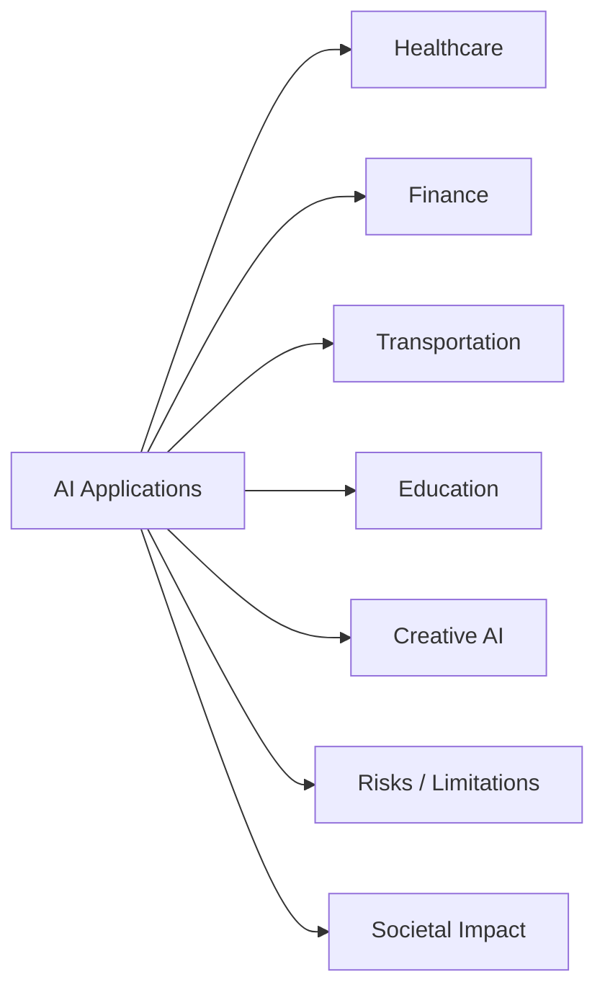

# Chapter 18: Applications of Artificial Intelligence

**Previous:** [Chapter 17: Modern Artificial Intelligence](17-modern-ai.md)

## Learning Objectives

By the conclusion of this chapter, the student will be able to: (1) describe major AI application domains; (2) explain how AI systems are deployed in healthcare, finance, and transportation; (3) analyze the limitations and risks of AI in high-stakes settings; (4) evaluate the societal impact of AI applications.

## Chapter at a Glance

| Section | Key Topics | Key Terms |
|---------|-----------|-----------|
| Healthcare | Medical diagnosis, drug discovery, AlphaFold | Clinical AI, FDA approval |
| Finance | Fraud detection, algorithmic trading | High-frequency trading, risk model |
| Transportation | Autonomous vehicles, traffic prediction | Perception stack, motion planning |
| Education | Personalized learning, intelligent tutoring | Knowledge tracing |
| Creative AI | Art, music, generative tools | Style transfer, co-creation |
| Risks | Adversarial, bias, safety-critical | Failure modes, edge cases |
| Societal Impact | Labor, inequality, regulation | Responsible AI |

## Chapter Roadmap

## 18.1 Healthcare

### 18.1.1 Medical Diagnosis

AI systems for medical diagnosis process clinical data (imaging, laboratory results, electronic health records) to identify diseases. Deep learning models achieve expert-level performance in specific diagnostic tasks:

- **Radiology:** Convolutional neural networks detect abnormalities in X-rays, CT scans, and MRIs. CheXNet (Rajpurkar et al., 2017) achieved radiologist-level pneumonia detection on chest X-rays. FDA-approved systems exist for mammography screening and lung nodule detection.

- **Dermatology:** Skin lesion classifiers (Esteva et al., 2017) match dermatologist accuracy in distinguishing malignant from benign lesions using only pixel input.

- **Ophthalmology:** Retinal image analysis detects diabetic retinopathy, age-related macular degeneration, and glaucoma. Google's system for diabetic retinopathy screening received regulatory approval in multiple countries.

**Challenges:** Generalization across populations and equipment; integration with clinical workflows; liability for misdiagnosis; validation on prospective clinical trials.

### 18.1.2 Drug Discovery

AI accelerates drug discovery by predicting molecular properties, protein structures, and drug-target interactions.

**AlphaFold** (Jumper et al., 2021) predicts protein 3D structure from amino acid sequence with atomic-level accuracy. This solved a 50-year grand challenge in biology and enables structure-based drug design.

**Generative models** for molecular design propose novel compounds with desired properties. Applications include:
- De novo drug design: Generate molecules that bind to specific protein targets.
- Virtual screening: Rapidly evaluate millions of candidate compounds.
- ADMET prediction: Estimate absorption, distribution, metabolism, excretion, and toxicity.

## 18.2 Finance

### 18.2.1 Algorithmic Trading

AI systems execute trades based on market data analysis:
- **Statistical arbitrage:** Identify temporary price discrepancies across related securities.
- **High-frequency trading:** Execute trades in microseconds using signal processing and pattern recognition.
- **Portfolio optimization:** Allocate assets to maximize risk-adjusted returns using reinforcement learning and genetic algorithms.

**Challenges:** Market regime changes, overfitting to historical patterns, systemic risk from correlated strategies, regulatory compliance.

### 18.2.2 Fraud Detection

ML models detect fraudulent transactions in real-time by identifying anomalous patterns. Techniques include:
- **Supervised learning:** Train classifiers on labeled fraud/non-fraud transactions (gradient boosting, neural networks).
- **Anomaly detection:** Identify transactions deviating from normal user behavior (isolation forests, autoencoders).
- **Graph analysis:** Detect fraud rings through transaction network analysis.

**Challenges:** Extreme class imbalance (fraud may be 0.01% of transactions), adversarial adaptation (fraudsters evolve tactics), interpretability for regulatory compliance.

## 18.3 Autonomous Vehicles

Autonomous vehicles (AVs) integrate perception, planning, and control. The SAE levels (0--5) define increasing automation:
- **Level 0:** No automation (human drives).
- **Level 2:** Partial automation (adaptive cruise control, lane keeping).
- **Level 4:** High automation (operates without human in defined domains).
- **Level 5:** Full automation (operates everywhere a human could).

**Perception stack:**
- Object detection (vehicles, pedestrians, cyclists) using camera, LIDAR, radar.
- Lane detection and tracking.
- Semantic segmentation of drivable area.
- Simultaneous localization and mapping (SLAM).

**Planning stack:**
- Route planning (high-level navigation).
- Behavior planning (lane change decisions, intersection handling).
- Motion planning (trajectory generation with collision avoidance).

**Control stack:** PID or MPC controllers execute planned trajectories.

**Challenges:** Edge cases (rare but critical scenarios), adverse weather, sensor failures, regulatory frameworks, public trust, ethical dilemmas in unavoidable collisions.

## 18.4 Education

**Adaptive learning systems** personalize instruction based on student performance:

- **Knowledge tracing:** Model student knowledge state over time (Bayesian Knowledge Tracing, DKT).
- **Intelligent tutoring systems:** Provide step-by-step guidance, hint generation, and feedback.
- **Content recommendation:** Suggest appropriate learning materials based on skill gaps.
- **Automated assessment:** Grade essays, code assignments, and mathematical solutions.

**Challenges:** Ensuring equitable access, avoiding reinforcement of educational inequalities, maintaining student privacy, pedagogical validity of recommendations.

## 18.5 Gaming

AI in gaming spans non-player character (NPC) behavior, procedural content generation, and game testing.

- **AlphaGo** (2016): Defeated world champion Lee Sedol at Go using MCTS with deep neural networks.
- **AlphaZero** (2017): Learned chess, Go, and shogi from self-play alone, without human knowledge.
- **OpenAI Five** (2019): Defeated professional Dota 2 teams using distributed RL.
- **Procedural content generation:** Generate levels, quests, and items algorithmically.

**Procedural content generation (PCG)** uses search, grammars, and ML to create game content:

- **Search-based PCG:** Optimize content against quality metrics using evolutionary algorithms.
- **Grammar-based PCG:** Define level structure through formal grammars.
- **Learning-based PCG:** Train generative models (GANs, transformers) on existing game content.

## 18.6 Creativity

### 18.6.1 AI Art

Generative models produce visual art from text descriptions. Ethically significant questions arise regarding:
- **Authorship:** Who is the artist -- the user, the model developer, or the model itself?
- **Copyright:** Are AI-generated works copyrightable? What about training on copyrighted images?
- **Economic impact:** Effects on professional artists and creative industries.

### 18.6.2 AI Music

AI composes music using:
- **Symbolic generation:** Produce MIDI sequences with transformers or RNNs.
- **Audio generation:** Generate raw waveforms (MusicLM, Jukebox).
- **Assistive tools:** Help musicians with arrangement, harmonization, and mixing.

### 18.6.3 AI Writing

Language models assist writing through:
- Draft generation, rewriting, and summarization.
- Style transfer and tone adjustment.
- Grammar and style checking.
- Brainstorming and idea generation.

## 18.7 Code Generation

AI code generation (GitHub Copilot, Codex, Cursor) assists programmers by:
- **Code completion:** Predict next tokens or lines in context.
- **Function generation:** Generate entire functions from docstring descriptions.
- **Bug detection:** Identify and suggest fixes for code defects.
- **Documentation:** Generate docstrings, comments, and README files.

**Impact:** Studies report 30--50% faster task completion, but concerns include code quality, security vulnerabilities, and licensing of training data.

## 18.8 Scientific Discovery

AI accelerates scientific discovery across disciplines:
- **Physics:** Particle detection at CERN, gravitational wave analysis.
- **Biology:** Genomic analysis, protein design, drug discovery.
- **Chemistry:** Reaction prediction, retrosynthesis planning, materials design.
- **Climate science:** Climate modeling, weather prediction, emissions monitoring.

**AI-driven research systems** like **AlphaFold**, **GNoME** (materials discovery), and **GraphCast** (weather prediction) demonstrate that AI can contribute to fundamental scientific advances.

> **💡 Pro Tip:** When deploying AI in high-stakes domains (healthcare, autonomous driving), build in redundancy — use ensemble models, out-of-distribution detection, and human-in-the-loop approval for any decision above a confidence threshold.

## Concept Comparison

| Domain | Primary AI Task | Success Metrics | Key Challenge |
|--------|----------------|:---:|---------------|
| Healthcare | Diagnosis, drug discovery | Sensitivity, specificity, AUC | Regulatory approval, liability |
| Finance | Fraud detection, trading | F1 score, Sharpe ratio | Adversarial dynamics |
| Transportation | Perception, planning | Disengagement rate, MPdI | Safety certification |
| Education | Personalization, assessment | Learning gain, retention | Generalization across curricula |
| Creative | Generation, style transfer | Human evaluation, novelty | Copyright, authenticity |

## Quick Reference — Deployment Considerations

| Factor | Question | Mitigation |
|--------|---------|------------|
| Data Quality | Does training data match deployment distribution? | OOD detection, monitoring |
| Latency | Can inference meet real-time requirements? | Quantization, distillation |
| Interpretability | Can decisions be explained? | LIME, SHAP, attention maps |
| Robustness | Does performance degrade gracefully? | Adversarial training |
| Compliance | Does the system meet regulatory requirements? | Audit trails, fairness metrics |

## Cross-Application Matrix

| Technique | ML | CV | NLP | Research |
|-----------|:---:|:---:|:---:|:---:|
| Medical Diagnosis AI | ⬜ | ✅ | ⬜ | ✅ |
| Fraud Detection | ✅ | ⬜ | ✅ | ✅ |
| Autonomous Vehicles | ✅ | ✅ | ⬜ | ✅ |
| Personalized Learning | ✅ | ⬜ | ✅ | ✅ |
| Generative AI | ✅ | ✅ | ✅ | ✅ |

## Chapter Quiz

**Q1:** What is the primary challenge for AI in healthcare compared to other domains?
- A) Healthcare has too much data
- B) Regulatory approval (FDA), clinical validation, and liability for misdiagnosis create high deployment barriers
- C) AI models are not accurate enough
- D) Doctors refuse to use technology

Answer
B) Healthcare AI faces the highest regulatory bar (FDA approval), requires prospective clinical validation, and must address liability for diagnostic errors before deployment.

**Q2:** Why is fraud detection in finance an adversarial ML problem?
- A) The data is too noisy
- B) Fraudsters actively adapt their strategies to evade detection, requiring continuous retraining
- C) Financial models are too complex
- D) Regulators require it

Answer
B) Fraud is adversarial — as detection improves, fraudsters change tactics, creating a constant arms race that requires adaptive models and continuous monitoring.

**Q3:** A critical safety challenge for autonomous vehicles is:
- A) Battery life
- B) Handling long-tail edge cases (unusual road conditions, rare objects, extreme weather) that are underrepresented in training data
- C) Passenger comfort
- D) Internet connectivity

Answer
B) The long-tail problem — real driving involves rare but critical edge cases — is the primary safety challenge, addressed through extensive simulation and scenario-based testing.

## 18.9 Summary

AI applications span virtually every sector. Successful deployment requires matching technical capabilities to domain requirements, managing risks, and addressing ethical considerations. The transformative potential of AI is tempered by challenges of reliability, fairness, and integration.

## Exercises

### Review Questions

1. What factors determine whether an application domain is suitable for AI deployment?
2. Compare the role of AI in healthcare diagnosis versus autonomous vehicle perception. How do the error modes differ?
3. Discuss the ethical implications of AI-generated art and writing.

### Application Problems

4. Design an AI system for adaptive learning in undergraduate mathematics. Specify the knowledge representation, student model, and recommendation algorithm.
5. Analyze the fraud detection pipeline at a credit card company. Describe how the system would handle concept drift as fraud patterns evolve.

### Challenge Problem

6. Select a real-world problem in a domain of your choice. Design a complete AI solution specifying: (a) problem formulation, (b) data requirements, (c) algorithm selection, (d) evaluation metrics, (e) deployment considerations, and (f) ethical risk mitigation. Present your design as a structured technical report.
