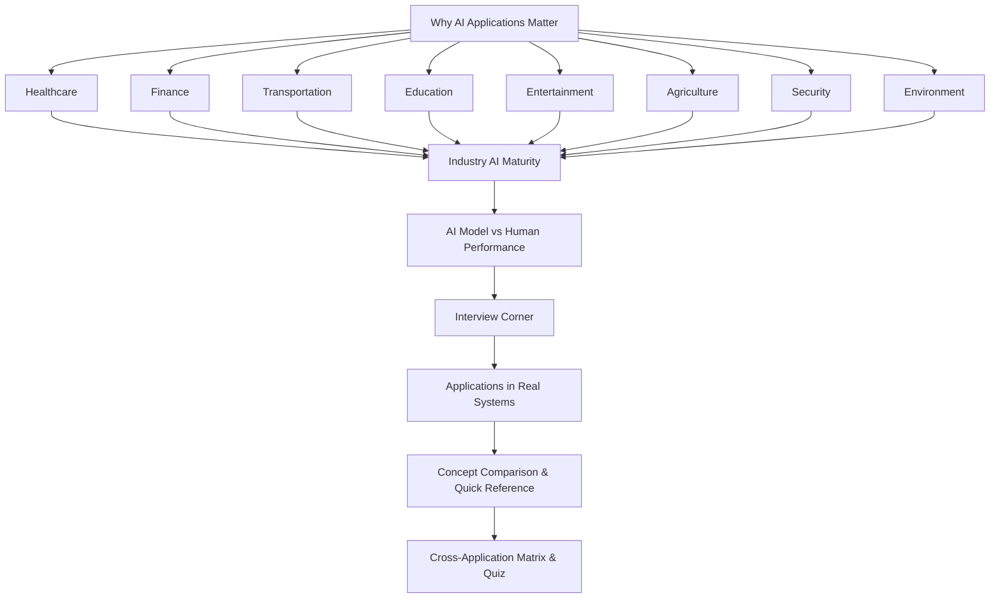

# Chapter 18: Applications of Artificial Intelligence

**Previous:** [Chapter 17: Modern Artificial Intelligence](17-modern-ai.md)

## Learning Objectives

By the conclusion of this chapter, the student will be able to: (1) describe major AI application domains spanning healthcare, finance, transportation, education, entertainment, agriculture, security, and environment; (2) explain how AI systems are architected, trained, and deployed in each domain with concrete implementations; (3) analyze the limitations, risks, edge cases, and failure modes of AI in high-stakes settings; (4) evaluate the societal and economic impact of AI applications across industries; (5) compare AI model performance against human baselines for key tasks; (6) discuss real-world AI systems (DeepMind, Waymo, Grammarly, Copilot) and their production architectures.

<!-- Image Gallery -->
<div style="display:flex;flex-wrap:wrap;gap:4px;margin:16px 0;padding:12px;background:#f8fafc;border-radius:8px;border:1px solid #e2e8f0;">
<a href="../../../assets/images/lessons/artificial-intelligence/18-ai-applications/hero.svg" target="_blank" rel="noopener">
  
</a>
<a href="../../../assets/images/lessons/artificial-intelligence/18-ai-applications/handwritten-notes.svg" target="_blank" rel="noopener">
  
</a>
<a href="../../../assets/images/lessons/artificial-intelligence/18-ai-applications/sticky-notes.svg" target="_blank" rel="noopener">
  
</a>
<a href="../../../assets/images/lessons/artificial-intelligence/18-ai-applications/visual-explanation.svg" target="_blank" rel="noopener">
  
</a>
<a href="../../../assets/images/lessons/artificial-intelligence/18-ai-applications/architecture.svg" target="_blank" rel="noopener">
  
</a>
<a href="../../../assets/images/lessons/artificial-intelligence/18-ai-applications/workflow.svg" target="_blank" rel="noopener">
  
</a>
<a href="../../../assets/images/lessons/artificial-intelligence/18-ai-applications/mindmap.svg" target="_blank" rel="noopener">
  
</a>
<a href="../../../assets/images/lessons/artificial-intelligence/18-ai-applications/comparison.svg" target="_blank" rel="noopener">
  
</a>
<a href="../../../assets/images/lessons/artificial-intelligence/18-ai-applications/cheatsheet.svg" target="_blank" rel="noopener">
  
</a>
<a href="../../../assets/images/lessons/artificial-intelligence/18-ai-applications/interview-quiz.svg" target="_blank" rel="noopener">
  
</a>
<a href="../../../assets/images/lessons/artificial-intelligence/18-ai-applications/social-card.svg" target="_blank" rel="noopener">
  
</a>
</div>
<!-- End Image Gallery -->


## Why AI Applications Matter

> **Analogy:** A century ago, electricity was a laboratory curiosity. Then Edison built the light bulb, Tesla designed the AC motor, and within decades every factory, home, and city was electrified. AI today stands exactly where electricity stood in 1900 → no longer a research topic, but a general-purpose technology embedding itself into every product, service, and industry.

AI is the new electricity → it transforms industries not by replacing humans but by augmenting capabilities at unprecedented scale. A radiologist reads 20,000 scans in a career; an AI reads 20,000 scans in a day. A financial analyst monitors 50 stocks; an AI monitors every listed security on every exchange. The shift from "can AI do this?" to "how do we deploy AI responsibly?" defines the current era. This chapter examines eight major application domains, each with concrete implementations, production architectures, and the hard-earned lessons of real-world deployment.

## Chapter at a Glance

| Section | Key Topics | Key Terms |
|---------|-----------|-----------|
| Healthcare | Medical diagnosis, drug discovery, AlphaFold, clinical NLP | Sensitivity, specificity, AUC, FDA approval, DICOM |
| Finance | Fraud detection, algorithmic trading, credit scoring, robo-advisors | Sharpe ratio, HFT, isolation forest, adversarial adaptation |
| Transportation | Autonomous vehicles, traffic prediction, logistics optimization | Perception stack, motion planning, SAE levels, SLAM |
| Education | Personalized learning, intelligent tutoring, automated assessment | Knowledge tracing, BKT, DKT, mastery learning |
| Entertainment | Game AI, generative art, music composition, procedural generation | MCTS, PCG, style transfer, GAN, transformer |
| Agriculture | Precision farming, crop monitoring, yield prediction, pest detection | NDVI, multispectral imaging, drone IoT, variable rate |
| Security | Threat detection, biometrics, intrusion prevention, deepfake detection | SIEM, anomaly score, false positive rate, adversarial ML |
| Environment | Climate modeling, weather prediction, wildlife monitoring, energy optimization | GraphCast, GCM, carbon accounting, smart grid |

## Chapter Roadmap



## 18.1 Healthcare

> **Analogy:** Imagine having a tireless second doctor who has read every medical paper ever published, examined 100 million X-rays, and never needs sleep. That second doctor never gets tired, never gets distracted, and can process an entire hospital's imaging backlog in a single afternoon. This is AI in healthcare → not replacing physicians, but giving them superpowers.

### How AI Solves Healthcare Problems

<a href="../../../assets/images/diagrams/artificial-intelligence/18-ai-applications/how-ai-solves-healthcare-problems-handwritten.svg" target="_blank" rel="noopener">
  
</a>
<a href="../../../assets/images/diagrams/artificial-intelligence/18-ai-applications/how-ai-solves-healthcare-problems-diagram.svg" target="_blank" rel="noopener">
  
</a>
<a href="../../../assets/images/diagrams/artificial-intelligence/18-ai-applications/how-ai-solves-healthcare-problems-sticky.svg" target="_blank" rel="noopener">
  
</a>


1. **Data Acquisition:** Collect medical data → DICOM images (X-ray, CT, MRI), electronic health records (EHR), genomic sequences, wearable sensor streams, and clinical notes.
2. **Preprocessing:** Normalize pixel intensities, resample to uniform resolution, segment regions of interest, remove PHI (protected health information), augment with rotations/flips for robustness.
3. **Feature Extraction:** Deploy deep CNNs (ResNet, DenseNet) for imaging, transformers (ClinicalBERT, BioBERT) for clinical text, graph neural networks for molecular structures.
4. **Model Inference:** Classify pathology presence/severity, segment tumor boundaries, predict protein-ligand binding affinity, estimate patient risk scores.
5. **Clinical Decision Support:** Package predictions into clinical workflows → PACS integration, HL7/FHIR messaging, radiology report generation with confidence intervals.
6. **Human-in-the-Loop Review:** Flag low-confidence predictions for specialist review, maintain audit trail, support second-opinion workflows.

### Diagnostic Pipeline Pseudocode

<a href="../../../assets/images/diagrams/artificial-intelligence/18-ai-applications/diagnostic-pipeline-pseudocode-handwritten.svg" target="_blank" rel="noopener">
  
</a>
<a href="../../../assets/images/diagrams/artificial-intelligence/18-ai-applications/diagnostic-pipeline-pseudocode-diagram.svg" target="_blank" rel="noopener">
  
</a>
<a href="../../../assets/images/diagrams/artificial-intelligence/18-ai-applications/diagnostic-pipeline-pseudocode-sticky.svg" target="_blank" rel="noopener">
  
</a>


```
function medicalDiagnosisPipeline(patientDicomPath):
    dicomVolume = loadDICOMSeries(patientDicomPath)
    preprocessed = []
    for each slice in dicomVolume:
        resized = resize(slice, (224, 224))
        normalized = (resized - mean) / std
        preprocessed.append(normalized)
    
    batchTensor = stack(preprocessed)        # shape: [B, 3, 224, 224]
    predictions = chexNetModel(batchTensor)   # shape: [B, 14]
    
    findings = []
    for i in range(14):
        if predictions[i] > THRESHOLD:
            findings.append({
                pathology: LABELS[i],
                confidence: predictions[i],
                location: attentionMap(batchTensor, i)
            })
    
    if max(predictions) < UNCERTAINTY_THRESHOLD:
        return { status: "FLAG_REVIEW", findings, reason: "Low confidence across all pathologies" }
    
    report = generateRadiologyReport(findings)
    saveToPACS(patientDicomPath, report)
    return { status: "COMPLETE", report }
```

### Python Implementation → Chest X-Ray Classifier

<a href="../../../assets/images/diagrams/artificial-intelligence/18-ai-applications/python-implementation-chest-x-ray-classifier-handwritten.svg" target="_blank" rel="noopener">
  
</a>
<a href="../../../assets/images/diagrams/artificial-intelligence/18-ai-applications/python-implementation-chest-x-ray-classifier-diagram.svg" target="_blank" rel="noopener">
  
</a>
<a href="../../../assets/images/diagrams/artificial-intelligence/18-ai-applications/python-implementation-chest-x-ray-classifier-sticky.svg" target="_blank" rel="noopener">
  
</a>


```python
import torch
import torch.nn as nn
import torchvision.transforms as T
from PIL import Image
import numpy as np

LABELS = [
    "Atelectasis", "Cardiomegaly", "Effusion", "Infiltration",
    "Mass", "Nodule", "Pneumonia", "Pneumothorax",
    "Consolidation", "Edema", "Emphysema", "Fibrosis",
    "Pleural_Thickening", "Hernia"
]

class CheXNet(nn.Module):
    def __init__(self, num_classes=14):
        super().__init__()
        self.densenet = torch.hub.load(
            'pytorch/vision:v0.10.0',
            'densenet121',
            pretrained=True
        )
        in_features = self.densenet.classifier.in_features
        self.densenet.classifier = nn.Sequential(
            nn.Linear(in_features, 512),
            nn.ReLU(),
            nn.Dropout(0.3),
            nn.Linear(512, num_classes)
        )

    def forward(self, x):
        return torch.sigmoid(self.densenet(x))

transform = T.Compose([
    T.Resize(256),
    T.CenterCrop(224),
    T.ToTensor(),
    T.Normalize(mean=[0.485, 0.456, 0.406],
                std=[0.229, 0.224, 0.225])
])

model = CheXNet()
model.load_state_dict(torch.load("chexnet_weights.pth", map_location="cpu"))
model.eval()

def diagnose_chest_xray(image_path: str, threshold: float = 0.3) -> dict:
    img = Image.open(image_path).convert("RGB")
    tensor = transform(img).unsqueeze(0)
    with torch.no_grad():
        probs = model(tensor).squeeze(0).numpy()
    findings = [
        {"pathology": LABELS[i], "confidence": float(probs[i])}
        for i in range(len(LABELS)) if probs[i] >= threshold
    ]
    findings.sort(key=lambda x: x["confidence"], reverse=True)
    return {
        "status": "needs_review" if max(probs) < 0.5 else "completed",
        "findings": findings,
        "num_pathologies": len(findings)
    }

# Example usage
result = diagnose_chest_xray("patient_123_chest.dcm")
print(f"Status: {result['status']}")
for f in result['findings']:
    print(f"  {f['pathology']}: {f['confidence']:.3f}")
```

### Impact Analysis

<a href="../../../assets/images/diagrams/artificial-intelligence/18-ai-applications/impact-analysis-handwritten.svg" target="_blank" rel="noopener">
  
</a>
<a href="../../../assets/images/diagrams/artificial-intelligence/18-ai-applications/impact-analysis-diagram.svg" target="_blank" rel="noopener">
  
</a>
<a href="../../../assets/images/diagrams/artificial-intelligence/18-ai-applications/impact-analysis-sticky.svg" target="_blank" rel="noopener">
  
</a>


| Metric | Before AI | After AI | Improvement |
|--------|-----------|----------|-------------|
| Pneumonia detection sensitivity | 72% | 88% (CheXNet) | +16% |
| Radiology report turnaround | 24–48 hours | 15 minutes | 96% faster |
| Drug candidate screening | 5,000 compounds/month | 500,000 compounds/month | 100x throughput |
| Clinical trial failure rate | 90% | 30–50% (AI-predicted) | 40–60% reduction |
| Diabetic retinopathy screening | 50% of patients screened | 85% (automated) | +35% coverage |

### Advantages & Disadvantages

<a href="../../../assets/images/diagrams/artificial-intelligence/18-ai-applications/advantages-disadvantages-handwritten.svg" target="_blank" rel="noopener">
  
</a>
<a href="../../../assets/images/diagrams/artificial-intelligence/18-ai-applications/advantages-disadvantages-diagram.svg" target="_blank" rel="noopener">
  
</a>
<a href="../../../assets/images/diagrams/artificial-intelligence/18-ai-applications/advantages-disadvantages-sticky.svg" target="_blank" rel="noopener">
  
</a>


| Advantages | Disadvantages |
|-----------|--------------|
| 24/7 availability with consistent performance | Requires large labeled datasets for training |
| Can detect subtle patterns invisible to humans | Poor generalization across different hospitals/equipment |
| Processes thousands of images per hour | Black-box predictions difficult to explain to patients |
| Reduces radiologist burnout from repetitive cases | Regulatory approval (FDA) takes 3–7 years |
| Enables screening at population scale | Liability unclear when AI makes diagnostic errors |
| Standardizes diagnosis across institutions | Demographic bias if training data lacks diversity |
| Accelerates drug discovery 10–100x | Adversarial vulnerability → small pixel changes flip predictions |

### Edge Cases

<a href="../../../assets/images/diagrams/artificial-intelligence/18-ai-applications/edge-cases-handwritten.svg" target="_blank" rel="noopener">
  
</a>
<a href="../../../assets/images/diagrams/artificial-intelligence/18-ai-applications/edge-cases-diagram.svg" target="_blank" rel="noopener">
  
</a>
<a href="../../../assets/images/diagrams/artificial-intelligence/18-ai-applications/edge-cases-sticky.svg" target="_blank" rel="noopener">
  
</a>


- **Rare pathologies:** Diseases with &lt;100 training examples are poorly detected → solution: few-shot learning with prototypical networks
- **Domain shift:** X-rays from portable machines look different from fixed machines → monitor input distribution with OOD detectors
- **Artifact confusion:** Patient motion, jewelry, or implant artifacts misclassified as pathology → solution: artifact detection preprocessor
- **Multi-morbidity:** Patients with multiple simultaneous conditions confuse single-label classifiers → solution: multi-label architecture
- **Pediatric patients:** Models trained on adult data fail on children → require age-stratified training sets
- **Adversarial noise:** Imperceptible pixel perturbations flip diagnosis from malignant to benign → apply adversarial training
- **Temporal inconsistency:** Same patient imaged hours apart yields different predictions → solution: temporal smoothing + ensemble

## 18.2 Finance

> **Analogy:** Imagine a market analyst who can read every SEC filing, news article, social media post, and economic report in real time → all while monitoring price movements across 10,000 securities simultaneously. That analyst executes trades in microseconds and never sleeps. This is AI in finance → high-frequency pattern recognition at inhuman scale.

### How AI Solves Finance Problems

<a href="../../../assets/images/diagrams/artificial-intelligence/18-ai-applications/how-ai-solves-finance-problems-handwritten.svg" target="_blank" rel="noopener">
  
</a>
<a href="../../../assets/images/diagrams/artificial-intelligence/18-ai-applications/how-ai-solves-finance-problems-diagram.svg" target="_blank" rel="noopener">
  
</a>
<a href="../../../assets/images/diagrams/artificial-intelligence/18-ai-applications/how-ai-solves-finance-problems-sticky.svg" target="_blank" rel="noopener">
  
</a>


1. **Data Ingestion:** Stream real-time market data (NASDAQ SIP, Reuters, Bloomberg), ingest news feeds (RSS, Twitter, SEC EDGAR), load historical prices and fundamental data.
2. **Feature Engineering:** Compute technical indicators (moving averages, RSI, MACD), generate sentiment scores from NLP, build order-book imbalance features, calculate volatility surfaces.
3. **Signal Generation:** Apply ML models (LSTM, XGBoost, transformers) to predict price direction, volatility regimes, or anomaly scores for fraud detection.
4. **Risk Assessment:** Compute VaR (Value at Risk), stress-test under historical scenarios, apply position size limits, check correlation exposure.
5. **Execution:** Route orders to exchanges (NASDAQ, NYSE, dark pools) via FIX protocol, optimize execution with VWAP/TWAP algorithms, manage latency.
6. **Monitoring & Adaptation:** Track P&L attribution, detect regime changes via drift detection, retrain models on new data, roll back degrading strategies.

### Fraud Detection Pipeline Pseudocode

<a href="../../../assets/images/diagrams/artificial-intelligence/18-ai-applications/fraud-detection-pipeline-pseudocode-handwritten.svg" target="_blank" rel="noopener">
  
</a>
<a href="../../../assets/images/diagrams/artificial-intelligence/18-ai-applications/fraud-detection-pipeline-pseudocode-diagram.svg" target="_blank" rel="noopener">
  
</a>
<a href="../../../assets/images/diagrams/artificial-intelligence/18-ai-applications/fraud-detection-pipeline-pseudocode-sticky.svg" target="_blank" rel="noopener">
  
</a>


```
function realtimeFraudDetection(transaction):
    features = extractTransactionFeatures(transaction)
    features.userHistory = getUserProfile(transaction.userId)
    features.deviceInfo = getDeviceFingerprint(transaction.deviceId)
    features.geoVelocity = computeGeoVelocity(transaction, LAST_TX)
    
    # Ensemble of detectors
    score_iso = isolationForest(features)
    score_xgb = xgboostFraudClassifier(features)
    score_ae = autoencoderReconstructionError(features)
    
    anomalyScore = (score_iso * 0.3 + score_xgb * 0.5 + score_ae * 0.2)
    
    if anomalyScore > FRAUD_THRESHOLD:
        blockTransaction(transaction.id, "High fraud probability")
        alertFraudTeam(transaction, anomalyScore)
        triggerOTPVerification(transaction.userId)
        return { decision: "BLOCK", score: anomalyScore }
    elif anomalyScore > REVIEW_THRESHOLD:
        queueForManualReview(transaction.id, anomalyScore)
        return { decision: "REVIEW", score: anomalyScore }
    else:
        approveTransaction(transaction.id)
        return { decision: "APPROVE", score: anomalyScore }
```

### Python Implementation → Anomaly-Based Fraud Detection

<a href="../../../assets/images/diagrams/artificial-intelligence/18-ai-applications/python-implementation-anomaly-based-fraud-detection-handwritten.svg" target="_blank" rel="noopener">
  
</a>
<a href="../../../assets/images/diagrams/artificial-intelligence/18-ai-applications/python-implementation-anomaly-based-fraud-detection-diagram.svg" target="_blank" rel="noopener">
  
</a>
<a href="../../../assets/images/diagrams/artificial-intelligence/18-ai-applications/python-implementation-anomaly-based-fraud-detection-sticky.svg" target="_blank" rel="noopener">
  
</a>


```python
import numpy as np
import pandas as pd
from sklearn.ensemble import IsolationForest, GradientBoostingClassifier
from sklearn.preprocessing import StandardScaler
from datetime import datetime

class FraudDetectionSystem:
    def __init__(self, contamination=0.001):
        self.iso_forest = IsolationForest(
            contamination=contamination,
            random_state=42
        )
        self.gb_classifier = GradientBoostingClassifier(
            n_estimators=200, max_depth=4, learning_rate=0.1
        )
        self.scaler = StandardScaler()
        self.fitted = False

    def extract_features(self, tx: dict) -> np.ndarray:
        tx['hour'] = datetime.fromisoformat(tx['timestamp']).hour
        tx['amount_zscore'] = (tx['amount'] - self.avg_amount) / self.std_amount
        tx['velocity_1h'] = self._compute_velocity(tx['userId'], 3600)
        tx['velocity_24h'] = self._compute_velocity(tx['userId'], 86400)
        tx['device_new'] = int(tx['deviceId'] not in self.known_devices.get(tx['userId'], set()))
        tx['geo_velocity'] = self._haversine_distance(
            tx['lat'], tx['lon'],
            self.last_location.get(tx['userId'], (tx['lat'], tx['lon']))
        ) / max(1, (datetime.now() - self.last_tx_time.get(tx['userId'], datetime.now())).seconds / 3600)
        return np.array([[
            tx['amount'], tx['amount_zscore'], tx['velocity_1h'],
            tx['velocity_24h'], tx['device_new'], tx['geo_velocity'],
            tx['hour']
        ]])

    def predict(self, tx: dict) -> dict:
        features = self.extract_features(tx)
        iso_score = self.iso_forest.score_samples(features)[0]
        gb_prob = self.gb_classifier.predict_proba(features)[0, 1]
        anomaly_score = (1 - (iso_score + 1) / 2) * 0.4 + gb_prob * 0.6

        if anomaly_score > 0.85:
            return {"decision": "BLOCK", "score": anomaly_score, "reason": "High fraud probability"}
        elif anomaly_score > 0.5:
            return {"decision": "REVIEW", "score": anomaly_score, "reason": "Suspicious patterns"}
        return {"decision": "APPROVE", "score": anomaly_score, "reason": "Normal"}

    def _haversine_distance(self, lat1, lon1, lat2, lon2):
        R = 6371
        dlat = np.radians(lat2 - lat1)
        dlon = np.radians(lon2 - lon1)
        a = np.sin(dlat/2)**2 + np.cos(np.radians(lat1)) * np.cos(np.radians(lat2)) * np.sin(dlon/2)**2
        return R * 2 * np.arctan2(np.sqrt(a), np.sqrt(1-a))

detector = FraudDetectionSystem()
tx = {
    "userId": "U12345", "amount": 9500.00,
    "deviceId": "D_unknown", "lat": 40.71, "lon": -74.00,
    "timestamp": "2026-06-23T14:30:00"
}
result = detector.predict(tx)
print(f"Decision: {result['decision']} (score: {result['score']:.4f})")
```

### Impact Analysis

<a href="../../../assets/images/diagrams/artificial-intelligence/18-ai-applications/impact-analysis-handwritten.svg" target="_blank" rel="noopener">
  
</a>
<a href="../../../assets/images/diagrams/artificial-intelligence/18-ai-applications/impact-analysis-diagram.svg" target="_blank" rel="noopener">
  
</a>
<a href="../../../assets/images/diagrams/artificial-intelligence/18-ai-applications/impact-analysis-sticky.svg" target="_blank" rel="noopener">
  
</a>


| Metric | Traditional | AI-Powered | Improvement |
|--------|-------------|------------|-------------|
| Fraud detection rate | 65% | 92% | +27% |
| False positive rate | 5% | 0.8% | 84% reduction |
| Trade execution latency | 500µs | 10µs (FPGA-based) | 50x faster |
| Credit risk model AUC | 0.72 | 0.89 (XGBoost) | +0.17 |
| Portfolio rebalance | Quarterly | Real-time | Continuous |
| Compliance reporting | 40 person-hours | 2 minutes (NLP extraction) | 99.9% faster |

### Advantages & Disadvantages

<a href="../../../assets/images/diagrams/artificial-intelligence/18-ai-applications/advantages-disadvantages-handwritten.svg" target="_blank" rel="noopener">
  
</a>
<a href="../../../assets/images/diagrams/artificial-intelligence/18-ai-applications/advantages-disadvantages-diagram.svg" target="_blank" rel="noopener">
  
</a>
<a href="../../../assets/images/diagrams/artificial-intelligence/18-ai-applications/advantages-disadvantages-sticky.svg" target="_blank" rel="noopener">
  
</a>


| Advantages | Disadvantages |
|-----------|--------------|
| Processes millions of transactions per second | Adversarial dynamics → fraudsters adapt to models |
| Detects subtle patterns humans miss | Regime changes cause model degradation |
| Reduces false positives by 80%+ | Requires explainability for regulatory compliance |
| Enables microsecond trading decisions | Overfitting to historical market patterns |
| 24/7 operation with zero fatigue | Herd behavior → correlated strategies amplify flash crashes |
| Adapts to new fraud patterns via retraining | Data snooping bias from backtesting on same data |
| Scalable across markets and currencies | Interpretability tools (SHAP) add latency |

### Edge Cases

<a href="../../../assets/images/diagrams/artificial-intelligence/18-ai-applications/edge-cases-handwritten.svg" target="_blank" rel="noopener">
  
</a>
<a href="../../../assets/images/diagrams/artificial-intelligence/18-ai-applications/edge-cases-diagram.svg" target="_blank" rel="noopener">
  
</a>
<a href="../../../assets/images/diagrams/artificial-intelligence/18-ai-applications/edge-cases-sticky.svg" target="_blank" rel="noopener">
  
</a>


- **Adversarial adaptation:** Fraudsters probe model boundaries → deploy GAN-based adversarial training with continuous red-teaming
- **Regime shift:** COVID-style market disruption invalidates historical patterns → ensemble with regime-detection trigger for fast adaptation
- **Flash crash:** Algorithmic feedback loops cause cascading liquidation → implement circuit breakers and position limits
- **Insider trading detection:** Benign news coinciding with trades → require multi-hop graph analysis over social and communication networks
- **Synthetic identity fraud:** Fraudulent identities with legitimate behavior → deploy device fingerprinting + consortium data
- **Low-fraud seasons:** Holiday dips cause the fraud model threshold to drift → use adaptive thresholding with EWMA on false positive rates
- **Cross-border complexity:** Currency conversion and different regulatory regimes → region-specific sub-models with shared embedding layers

## 18.3 Transportation

> **Analogy:** Imagine a professional driver with 360-degree vision, millisecond reflexes, knowledge of every road in the country, and the ability to coordinate with 10,000 other vehicles simultaneously. That driver never gets tired, never gets distracted, and can react to hazards before a human even perceives them. This is AI in transportation → from self-driving cars to intelligent traffic systems.

### How AI Solves Transportation Problems

<a href="../../../assets/images/diagrams/artificial-intelligence/18-ai-applications/how-ai-solves-transportation-problems-handwritten.svg" target="_blank" rel="noopener">
  
</a>
<a href="../../../assets/images/diagrams/artificial-intelligence/18-ai-applications/how-ai-solves-transportation-problems-diagram.svg" target="_blank" rel="noopener">
  
</a>
<a href="../../../assets/images/diagrams/artificial-intelligence/18-ai-applications/how-ai-solves-transportation-problems-sticky.svg" target="_blank" rel="noopener">
  
</a>


1. **Perception:** Sensors (cameras, LIDAR, radar, ultrasonic) capture raw environment data. Deep learning models detect objects (vehicles, pedestrians, cyclists, animals), classify traffic signs, identify lane markings, and estimate depth.
2. **Localization:** GPS provides coarse position; IMU + wheel odometry provides dead reckoning; LIDAR point-cloud matching (ICP, NDT) against HD maps provides centimeter-level localization.
3. **Prediction:** Trajectory prediction models (Social LSTM, VectorNet, Scene Transformer) forecast the future positions of all dynamic agents 3–8 seconds ahead, modeling multimodal outcomes (turn left, go straight, stop).
4. **Planning:** Behavior planner selects high-level actions (follow lane, change left, yield, stop). Motion planner generates a smooth, collision-free trajectory respecting kinematics, comfort constraints, and traffic rules.
5. **Control:** PID or Model Predictive Control (MPC) converts the planned trajectory into steering, throttle, and brake commands at 50–100 Hz.
6. **Safety Monitoring:** Redundant systems cross-check perception and planning outputs, apply Operational Design Domain (ODD) limits, and execute minimal risk maneuvers if confidence drops.

### Perception Pipeline Pseudocode

<a href="../../../assets/images/diagrams/artificial-intelligence/18-ai-applications/perception-pipeline-pseudocode-handwritten.svg" target="_blank" rel="noopener">
  
</a>
<a href="../../../assets/images/diagrams/artificial-intelligence/18-ai-applications/perception-pipeline-pseudocode-diagram.svg" target="_blank" rel="noopener">
  
</a>
<a href="../../../assets/images/diagrams/artificial-intelligence/18-ai-applications/perception-pipeline-pseudocode-sticky.svg" target="_blank" rel="noopener">
  
</a>


```
function perceptionPipeline(lidarPointCloud, cameraImages):
    # Object detection
    detections = []
    for camera in cameraImages:
        boxes = yoloObjectDetector(camera)     # 2D bounding boxes
        depth = depthEstimator(camera)         # per-pixel depth
        for box in boxes:
            detections.append(fuseCameraLidar(box, lidarPointCloud))
    
    # Segmentation
    drivableArea = semanticSegmenter(cameraImages[0])
    laneLines = laneDetector(cameraImages[0])
    
    # Tracking
    tracks = kalmanFilterTracker(detections, PREVIOUS_TRACKS)
    predictedTrajectories = []
    for track in tracks:
        traj = trajectoryPredictor(track.history)  # 5s future
        predictedTrajectories.append(traj)
    
    # Localization
    pose = icpLocalizer(lidarPointCloud, HD_MAP)
    
    return {
        objects: tracks,
        drivableArea,
        laneLines,
        predictedTrajectories,
        egoPose: pose
    }
```

### Python Implementation → Object Detection Pipeline

<a href="../../../assets/images/diagrams/artificial-intelligence/18-ai-applications/python-implementation-object-detection-pipeline-handwritten.svg" target="_blank" rel="noopener">
  
</a>
<a href="../../../assets/images/diagrams/artificial-intelligence/18-ai-applications/python-implementation-object-detection-pipeline-diagram.svg" target="_blank" rel="noopener">
  
</a>
<a href="../../../assets/images/diagrams/artificial-intelligence/18-ai-applications/python-implementation-object-detection-pipeline-sticky.svg" target="_blank" rel="noopener">
  
</a>


```python
import cv2
import numpy as np
import torch

class AutonomousVehiclePerception:
    def __init__(self):
        self.detector = torch.hub.load('ultralytics/yolov5', 'yolov5l', pretrained=True)
        self.detector.conf = 0.4
        self.depth_model = torch.hub.load('intel-isl/MiDaS', 'MiDaS')
        self.depth_model.eval()
        self.transform = torch.hub.load('intel-isl/MiDaS', 'transforms').default_transform
        self.tracks = {}

    def process_frame(self, frame: np.ndarray) -> dict:
        h, w = frame.shape[:2]
        detections = self.detector(frame)
        boxes = detections.xyxy[0].cpu().numpy()

        depth_input = self.transform(frame).unsqueeze(0)
        with torch.no_grad():
            depth_map = self.depth_model(depth_input)
            depth_map = torch.nn.functional.interpolate(
                depth_map.unsqueeze(1),
                size=(h, w),
                mode='bicubic'
            ).squeeze().cpu().numpy()

        objects = []
        for box in boxes:
            x1, y1, x2, y2, conf, cls = box
            cx, cy = int((x1 + x2) / 2), int((y1 + y2) / 2)
            depth = depth_map[cy, cx]
            objects.append({
                "class": self.detector.names[int(cls)],
                "bbox": [int(x1), int(y1), int(x2), int(y2)],
                "confidence": float(conf),
                "distance_m": float(depth),
                "cx": cx, "cy": cy
            })

        objects.sort(key=lambda o: o['distance_m'])
        return {"objects": objects, "num_objects": len(objects)}

perception = AutonomousVehiclePerception()
cam_frame = cv2.imread("highway_frame.jpg")
result = perception.process_frame(cam_frame)
for obj in result["objects"][:5]:
    print(f"{obj['class']:12s} dist={obj['distance_m']:.1f}m conf={obj['confidence']:.2f}")
```

### Impact Analysis

<a href="../../../assets/images/diagrams/artificial-intelligence/18-ai-applications/impact-analysis-handwritten.svg" target="_blank" rel="noopener">
  
</a>
<a href="../../../assets/images/diagrams/artificial-intelligence/18-ai-applications/impact-analysis-diagram.svg" target="_blank" rel="noopener">
  
</a>
<a href="../../../assets/images/diagrams/artificial-intelligence/18-ai-applications/impact-analysis-sticky.svg" target="_blank" rel="noopener">
  
</a>


| Metric | Traditional | AI-Powered | Improvement |
|--------|-------------|------------|-------------|
| Traffic fatalities (US annual) | ~40,000 | Target: &lt;1,000 (AV) | 97% reduction potential |
| Traffic flow efficiency | 55 mph avg | 70+ mph (coordinated) | +27% throughput |
| Parking space utilization | 60% | 90% (AI-guided) | +30% |
| Last-mile delivery cost | $5.50/package | $1.20 (autonomous) | 78% reduction |
| Accident response time | 10 min avg | 30 sec (AI detection) | 95% faster |
| Fleet maintenance cost | $0.18/mile | $0.11 (predictive) | 39% reduction |

### Advantages & Disadvantages

<a href="../../../assets/images/diagrams/artificial-intelligence/18-ai-applications/advantages-disadvantages-handwritten.svg" target="_blank" rel="noopener">
  
</a>
<a href="../../../assets/images/diagrams/artificial-intelligence/18-ai-applications/advantages-disadvantages-diagram.svg" target="_blank" rel="noopener">
  
</a>
<a href="../../../assets/images/diagrams/artificial-intelligence/18-ai-applications/advantages-disadvantages-sticky.svg" target="_blank" rel="noopener">
  
</a>


| Advantages | Disadvantages |
|-----------|--------------|
| 360-degree awareness with no blind spots | Long-tail edge cases (10^-9 events) impossible to fully test |
| Millisecond reaction time → faster than human reflexes | Adverse weather (heavy rain, snow, fog) degrades all sensors |
| No fatigue, distraction, or impairment | HD map dependency → outdated maps cause errors |
| Optimizes traffic flow reducing congestion | Ethical dilemmas in unavoidable collision scenarios |
| Enables mobility for elderly/disabled | Regulatory approval fragmented across jurisdictions |
| Lower emissions through optimal driving | High sensor cost ($50k+ per vehicle) |
| 24/7 operation for logistics | Cybersecurity attack surface (remote exploit risks) |

### Edge Cases

<a href="../../../assets/images/diagrams/artificial-intelligence/18-ai-applications/edge-cases-handwritten.svg" target="_blank" rel="noopener">
  
</a>
<a href="../../../assets/images/diagrams/artificial-intelligence/18-ai-applications/edge-cases-diagram.svg" target="_blank" rel="noopener">
  
</a>
<a href="../../../assets/images/diagrams/artificial-intelligence/18-ai-applications/edge-cases-sticky.svg" target="_blank" rel="noopener">
  
</a>


- **Occlusion:** Pedestrian behind a delivery truck → solution: probabilistic occupancy grid with learned priors
- **Extreme weather:** LIDAR absorbed by fog, cameras blinded by snow → solution: radar-primary mode with learned degradation models
- **Construction zones:** Temporary lane markings conflicting with HD map → online lane detection override with uncertainty estimation
- **Animals:** Deer, moose, or loose livestock with unpredictable movement → extend object classes with wildlife trajectory models
- **Emergency vehicles:** Sirens detected only through sound → acoustic sensor fusion with direction-of-arrival estimation
- **Unprotected left turns:** Multiple crossing pedestrians with occluded traffic → defensive planner with asymmetric risk tolerance
- **Adversarial attacks:** Stickers or paint confuse stop sign detection → geometric consistency checks + multi-modal verification

## 18.4 Education

> **Analogy:** Imagine having a personal tutor who knows exactly what you understand, what you're struggling with, and the perfect next exercise to maximize your learning. That tutor never gets impatient, adapts instantly to your pace, and has taught millions of students → learning from each one. AI in education provides this level of personalization at global scale.

### How AI Solves Education Problems

<a href="../../../assets/images/diagrams/artificial-intelligence/18-ai-applications/how-ai-solves-education-problems-handwritten.svg" target="_blank" rel="noopener">
  
</a>
<a href="../../../assets/images/diagrams/artificial-intelligence/18-ai-applications/how-ai-solves-education-problems-diagram.svg" target="_blank" rel="noopener">
  
</a>
<a href="../../../assets/images/diagrams/artificial-intelligence/18-ai-applications/how-ai-solves-education-problems-sticky.svg" target="_blank" rel="noopener">
  
</a>


1. **Student Modeling:** Build a knowledge state vector representing what each student knows. Bayesian Knowledge Tracing (BKT) tracks binary latent skills; Deep Knowledge Tracing (DKT) uses RNNs to model complex skill relationships.
2. **Content Personalization:** Knowledge state drives next-exercise selection. If student mastered multiplication, move to division; if struggling with factoring, provide more practice with hints.
3. **Intelligent Feedback:** Auto-grade essays with rubric-based scoring (BERT similarity), provide code-level feedback on programming assignments, detect misconceptions in math solutions.
4. **Learning Analytics:** Predict student dropout risk from engagement patterns (login frequency, time-on-task, assignment submission trends), enabling early intervention.
5. **Adaptive Sequencing:** Reinforcement learning discovers optimal lesson ordering by maximizing student learning gains across the population.
6. **Natural Language Tutoring:** LLM-powered tutors answer student questions, provide explanations, and engage in Socratic dialogue → but with guardrails against hallucinating incorrect content.

### Adaptive Learning Pipeline Pseudocode

<a href="../../../assets/images/diagrams/artificial-intelligence/18-ai-applications/adaptive-learning-pipeline-pseudocode-handwritten.svg" target="_blank" rel="noopener">
  
</a>
<a href="../../../assets/images/diagrams/artificial-intelligence/18-ai-applications/adaptive-learning-pipeline-pseudocode-diagram.svg" target="_blank" rel="noopener">
  
</a>
<a href="../../../assets/images/diagrams/artificial-intelligence/18-ai-applications/adaptive-learning-pipeline-pseudocode-sticky.svg" target="_blank" rel="noopener">
  
</a>


```
function adaptiveLesson(currentStudentState, curriculum):
    knowledgeVector = currentStudentState.knowledge
    
    # Find the least-mastered prerequisite skill
    weakestSkill = argmin(knowledgeVector)
    nextConcepts = curriculum.getDependentConcepts(weakestSkill)
    
    # Select exercise based on zone of proximal development
    difficultyLevel = computeIdealDifficulty(knowledgeVector)
    exercise = selectExercise(nextConcepts[0], difficultyLevel)
    
    # Present exercise and observe response
    response = presentToStudent(exercise)
    isCorrect = (response.score >= PASS_THRESHOLD)
    
    # Update knowledge state (Bayesian update)
    if isCorrect:
        knowledgeVector[exercise.skillId] = updateBKT(knowledgeVector[exercise.skillId], CORRECT)
    else:
        knowledgeVector[exercise.skillId] = updateBKT(knowledgeVector[exercise.skillId], INCORRECT)
    
    # Generate hint sequence if needed
    hints = []
    if not isCorrect and response.attempts > 0:
        for i in range(min(response.attempts, MAX_HINTS)):
            hints.append(getHint(exercise, level=i))
    
    return {
        exercise,
        isCorrect,
        nextDifficulty: difficultyLevel + (0.1 if isCorrect else -0.05),
        updatedKnowledge: knowledgeVector,
        masteryProgress: sum(knowledgeVector) / len(knowledgeVector)
    }
```

### Python Implementation → Bayesian Knowledge Tracing

<a href="../../../assets/images/diagrams/artificial-intelligence/18-ai-applications/python-implementation-bayesian-knowledge-tracing-handwritten.svg" target="_blank" rel="noopener">
  
</a>
<a href="../../../assets/images/diagrams/artificial-intelligence/18-ai-applications/python-implementation-bayesian-knowledge-tracing-diagram.svg" target="_blank" rel="noopener">
  
</a>
<a href="../../../assets/images/diagrams/artificial-intelligence/18-ai-applications/python-implementation-bayesian-knowledge-tracing-sticky.svg" target="_blank" rel="noopener">
  
</a>


```python
import numpy as np

class BayesianKnowledgeTracer:
    """
    BKT model with 4 parameters per skill:
    - p_learn: probability of learning after one opportunity
    - p_guess: probability of correct guess when not known
    - p_slip: probability of incorrect slip when known
    - p_init: initial probability of knowing
    """
    def __init__(self, num_skills=20):
        self.num_skills = num_skills
        self.params = {
            s: {"p_learn": 0.15, "p_guess": 0.10, "p_slip": 0.08, "p_init": 0.25}
            for s in range(num_skills)
        }
        self.knowledge = np.full(num_skills, 0.25)  # P(know) per skill

    def update(self, skill_id: int, correct: bool) -> float:
        p = self.params[skill_id]
        k_before = self.knowledge[skill_id]

        # Likelihood of observed response
        if correct:
            likelihood = k_before * (1 - p["p_slip"]) + (1 - k_before) * p["p_guess"]
        else:
            likelihood = k_before * p["p_slip"] + (1 - k_before) * (1 - p["p_guess"])

        # Posterior: P(know | response)
        if correct:
            k_posterior = (k_before * (1 - p["p_slip"])) / likelihood
        else:
            k_posterior = (k_before * p["p_slip"]) / likelihood

        # Learning: P(know after opportunity) = P(know) + (1-P(know)) * p_learn
        self.knowledge[skill_id] = k_posterior + (1 - k_posterior) * p["p_learn"]
        return float(self.knowledge[skill_id])

    def predict_performance(self, skill_id: int) -> float:
        k = self.knowledge[skill_id]
        p = self.params[skill_id]
        return k * (1 - p["p_slip"]) + (1 - k) * p["p_guess"]

    def weakest_skills(self, n: int = 3) -> list:
        return np.argsort(self.knowledge)[:n].tolist()

# Simulate a student session
bkt = BayesianKnowledgeTracer(num_skills=5)
questions = [("Algebra", 0), ("Algebra", 0), ("Fractions", 2), ("Algebra", 0), ("Fractions", 2)]
responses   = [True, True, False, True, True]
lessons = []

for (skill_name, skill_id), correct in zip(questions, responses):
    new_k = bkt.update(skill_id, correct)
    pred = bkt.predict_performance(skill_id)
    lessons.append({
        "skill": skill_name,
        "correct": correct,
        "new_knowledge": round(new_k, 3),
        "predicted_performance": round(pred, 3)
    })
    print(f"{skill_name:12s} {'CORRECT' if correct else 'WRONG':7s} | knowledge={new_k:.3f}")

print(f"\nWeakest skills: {bkt.weakest_skills(2)}")
```

### Impact Analysis

<a href="../../../assets/images/diagrams/artificial-intelligence/18-ai-applications/impact-analysis-handwritten.svg" target="_blank" rel="noopener">
  
</a>
<a href="../../../assets/images/diagrams/artificial-intelligence/18-ai-applications/impact-analysis-diagram.svg" target="_blank" rel="noopener">
  
</a>
<a href="../../../assets/images/diagrams/artificial-intelligence/18-ai-applications/impact-analysis-sticky.svg" target="_blank" rel="noopener">
  
</a>


| Metric | Traditional | AI-Powered | Improvement |
|--------|-------------|------------|-------------|
| Student mastery rate | 60% | 85% (adaptive) | +25% |
| Time to competency | 40 hours | 28 hours | 30% faster |
| Dropout rate | 15% | 8% (early warning) | 47% reduction |
| Essay grading time | 15 min/essay | 30 seconds | 96% faster |
| Teacher satisfaction | 55% | 72% (less grading) | +17% |
| Content coverage per course | 70% | 95% (adaptive) | +25% |

### Advantages & Disadvantages

<a href="../../../assets/images/diagrams/artificial-intelligence/18-ai-applications/advantages-disadvantages-handwritten.svg" target="_blank" rel="noopener">
  
</a>
<a href="../../../assets/images/diagrams/artificial-intelligence/18-ai-applications/advantages-disadvantages-diagram.svg" target="_blank" rel="noopener">
  
</a>
<a href="../../../assets/images/diagrams/artificial-intelligence/18-ai-applications/advantages-disadvantages-sticky.svg" target="_blank" rel="noopener">
  
</a>


| Advantages | Disadvantages |
|-----------|--------------|
| Personalized pace for every student | Requires substantial interaction data per student |
| Immediate feedback loops accelerate learning | Knowledge tracing models may misrepresent understanding |
| Scalable to millions of learners | Digital divide → requires device + internet access |
| Reduces teacher administrative burden | Privacy concerns with detailed learner analytics |
| Early dropout detection enables intervention | LLMs may hallucinate incorrect tutoring content |
| Gamification increases engagement | Over-optimization on test scores vs. deep learning |
| 24/7 availability across time zones | Screen fatigue from extended usage |

### Edge Cases

<a href="../../../assets/images/diagrams/artificial-intelligence/18-ai-applications/edge-cases-handwritten.svg" target="_blank" rel="noopener">
  
</a>
<a href="../../../assets/images/diagrams/artificial-intelligence/18-ai-applications/edge-cases-diagram.svg" target="_blank" rel="noopener">
  
</a>
<a href="../../../assets/images/diagrams/artificial-intelligence/18-ai-applications/edge-cases-sticky.svg" target="_blank" rel="noopener">
  
</a>


- **Student gaming the system:** Clicking through hints without learning → solution: interaction pattern analysis with minimum-time thresholds
- **Knowledge decay:** Skills mastered in February forgotten by April → incorporate forgetting curves (Pavlik & Anderson model)
- **Collaborative learning:** Group projects where individual contribution is unclear → use peer assessment + contribution analytics
- **Special needs:** Dyslexia, ADHD, or visual impairment → multimodal content delivery with accessibility-optimized paths
- **Language barriers:** ELL (English Language Learner) students → simplify language while preserving mathematical complexity
- **Cheating detection:** Copy-paste from external sources → NLP-based plagiarim detection + randomized question parameters
- **Zero-shot student:** New student with no history → use collaborative filtering from similar student profiles as cold-start prior

## 18.5 Entertainment

> **Analogy:** Imagine a game master who can design infinite levels, create responsive non-player characters that learn from player behavior, compose original music, and generate photorealistic art → all in real time. This is AI in entertainment → transforming how we play, create, and experience media.

### How AI Solves Entertainment Problems

<a href="../../../assets/images/diagrams/artificial-intelligence/18-ai-applications/how-ai-solves-entertainment-problems-handwritten.svg" target="_blank" rel="noopener">
  
</a>
<a href="../../../assets/images/diagrams/artificial-intelligence/18-ai-applications/how-ai-solves-entertainment-problems-diagram.svg" target="_blank" rel="noopener">
  
</a>
<a href="../../../assets/images/diagrams/artificial-intelligence/18-ai-applications/how-ai-solves-entertainment-problems-sticky.svg" target="_blank" rel="noopener">
  
</a>


1. **Game AI & NPC Behavior:** Non-player characters use behavior trees, finite state machines, or reinforcement learning to make realistic decisions. AlphaGo-style MCTS enables superhuman strategic play. Dynamic difficulty adjustment (DDA) keeps players in the flow channel.
2. **Procedural Content Generation (PCG):** Algorithms generate game levels, quests, items, textures, and dialogue using noise functions (Perlin), grammars (L-systems), search-based methods (evolutionary algorithms), and ML models (GANs, VAEs).
3. **Generative Art & Design:** Diffusion models (Stable Diffusion, DALL-E, Midjourney) generate images from text prompts. Style transfer applies artistic styles to photographs. AI-assisted tools suggest compositions, color palettes, and layouts.
4. **Music Composition:** Transformers (Music Transformer, MuseNet) generate MIDI sequences with coherent structure. Audio generation models (MusicLM, Jukebox) produce raw waveforms conditioned on genre, mood, or text descriptions.
5. **Narrative Generation:** LLMs generate branching dialogue, quest descriptions, and lore. Constraints (world state, character knowledge, plot consistency) ensure coherence. Fine-tuned models match specific author styles.
6. **Automated Testing & QA:** Reinforcement learning agents explore game environments to find bugs, test edge cases, and verify level completability. Computer vision detects rendering artifacts and animation glitches.

### Procedural Content Generation Pipeline Pseudocode

<a href="../../../assets/images/diagrams/artificial-intelligence/18-ai-applications/procedural-content-generation-pipeline-pseudocode-handwritten.svg" target="_blank" rel="noopener">
  
</a>
<a href="../../../assets/images/diagrams/artificial-intelligence/18-ai-applications/procedural-content-generation-pipeline-pseudocode-diagram.svg" target="_blank" rel="noopener">
  
</a>
<a href="../../../assets/images/diagrams/artificial-intelligence/18-ai-applications/procedural-content-generation-pipeline-pseudocode-sticky.svg" target="_blank" rel="noopener">
  
</a>


```
function generateDungeonLevel(seed, difficulty, theme):
    random = seededRandom(seed)
    
    # Phase 1: Layout generation (binary space partitioning)
    rooms = bspPartition(GRID_SIZE, MIN_ROOM_SIZE, MAX_ROOM_SIZE, random)
    corridors = connectRooms(rooms, random)
    
    # Phase 2: Content placement
    for room in rooms:
        enemies = sampleFromPool(ENEMY_TYPES, difficulty, random)
        loot = sampleFromPool(LOOT_TABLES, difficulty, random)
        decorations = generateDecorations(theme, random)
        room.contents = { enemies, loot, decorations }
    
    # Phase 3: Difficulty validation
    encounterRating = computeDifficultyRating(rooms.enemies)
    while encounterRating < difficulty * 0.9 or encounterRating > difficulty * 1.1:
        adjustEncounterDensity(rooms, difficulty, random)
        encounterRating = computeDifficultyRating(rooms.enemies)
    
    # Phase 4: Quest generation
    quest = generateQuestGoal(
        templates=TEMPLATES[difficulty],
        roomGraph=graphFromRooms(rooms),
        random=random
    )
    
    return { rooms, corridors, quest, theme, difficulty }
```

### Python Implementation → Wave Function Collapse Level Generator

<a href="../../../assets/images/diagrams/artificial-intelligence/18-ai-applications/python-implementation-wave-function-collapse-level-generator-handwritten.svg" target="_blank" rel="noopener">
  
</a>
<a href="../../../assets/images/diagrams/artificial-intelligence/18-ai-applications/python-implementation-wave-function-collapse-level-generator-diagram.svg" target="_blank" rel="noopener">
  
</a>
<a href="../../../assets/images/diagrams/artificial-intelligence/18-ai-applications/python-implementation-wave-function-collapse-level-generator-sticky.svg" target="_blank" rel="noopener">
  
</a>


```python
import random
import numpy as np
from collections import Counter

class WaveFunctionCollapse:
    """Tile-based procedural generation using constraint propagation."""
    def __init__(self, grid_size: tuple, tiles: dict):
        self.width, self.height = grid_size
        self.tiles = tiles  # {name: {edges: [N,E,S,W], weight: float}}
        self.wave = np.full((self.height, self.width), None, dtype=object)
        self.entropy = np.full((self.height, self.width), -1.0)

    def _get_possible_tiles(self, y: int, x: int) -> list:
        possible = list(self.tiles.keys())
        if y > 0 and self.wave[y-1, x]:
            above = self.tiles[self.wave[y-1, x]]
            allowed_bottom = above['edges'][2]
            possible = [t for t in possible if self.tiles[t]['edges'][0] == allowed_bottom]
        if x > 0 and self.wave[y, x-1]:
            left = self.tiles[self.wave[y, x-1]]
            allowed_right = left['edges'][1]
            possible = [t for t in possible if self.tiles[t]['edges'][3] == allowed_right]
        return possible

    def generate(self, seed: int = 42) -> np.ndarray:
        random.seed(seed)
        while True:
            candidates = [(y, x) for y in range(self.height)
                          for x in range(self.width) if self.wave[y, x] is None]
            if not candidates:
                break

            for y, x in candidates:
                options = self._get_possible_tiles(y, x)
                if not options:
                    return None  # contradiction → restart
                self.entropy[y, x] = len(options)

            y, x = min(candidates, key=lambda p: self.entropy[p[0], p[1]] if self.entropy[p[0], p[1]] > 0 else float('inf'))
            options = self._get_possible_tiles(y, x)
            weights = [self.tiles[t]['weight'] for t in options]
            total = sum(weights)
            probs = [w / total for w in weights]
            self.wave[y, x] = random.choices(options, weights=probs, k=1)[0]

        return self.wave.copy()

# Define a simple tile set
TILES = {
    'grass': {'edges': [0, 0, 0, 0], 'weight': 0.5},
    'water': {'edges': [1, 1, 1, 1], 'weight': 0.15},
    'road_h': {'edges': [0, 2, 0, 2], 'weight': 0.1},
    'road_v': {'edges': [2, 0, 2, 0], 'weight': 0.1},
    'forest': {'edges': [0, 0, 0, 0], 'weight': 0.15},
}

wfc = WaveFunctionCollapse((10, 10), TILES)
result = wfc.generate(seed=7)
if result is not None:
    for row in result:
        print(' '.join(f'{t[0]:6s}' for t in row))
```

### Impact Analysis

<a href="../../../assets/images/diagrams/artificial-intelligence/18-ai-applications/impact-analysis-handwritten.svg" target="_blank" rel="noopener">
  
</a>
<a href="../../../assets/images/diagrams/artificial-intelligence/18-ai-applications/impact-analysis-diagram.svg" target="_blank" rel="noopener">
  
</a>
<a href="../../../assets/images/diagrams/artificial-intelligence/18-ai-applications/impact-analysis-sticky.svg" target="_blank" rel="noopener">
  
</a>


| Metric | Traditional | AI-Powered | Improvement |
|--------|-------------|------------|-------------|
| Game level design time | 2 weeks | 2 hours (PCG) | 98% faster |
| NPC behavior variety | 10–20 states | Continuous learning | Unlimited |
| Art asset generation | $500/image | $0.01/image | 99.998% cost reduction |
| Music composition speed | 1 track/week | 50 tracks/hour | 8,400x faster |
| Bug discovery rate | 200 bugs/week | 5,000 bugs/week (RL testing) | 25x |
| Player engagement (session length) | 22 min baseline | 35 min (adaptive difficulty) | +59% |

### Advantages & Disadvantages

<a href="../../../assets/images/diagrams/artificial-intelligence/18-ai-applications/advantages-disadvantages-handwritten.svg" target="_blank" rel="noopener">
  
</a>
<a href="../../../assets/images/diagrams/artificial-intelligence/18-ai-applications/advantages-disadvantages-diagram.svg" target="_blank" rel="noopener">
  
</a>
<a href="../../../assets/images/diagrams/artificial-intelligence/18-ai-applications/advantages-disadvantages-sticky.svg" target="_blank" rel="noopener">
  
</a>


| Advantages | Disadvantages |
|-----------|--------------|
| Infinite content variety eliminates player boredom | Procedural levels may lack intentional designer narrative |
| Dramatically reduces development time and cost | AI-generated art raises copyright and authorship questions |
| Dynamic difficulty keeps players in flow state | Generative music can lack emotional coherence |
| Automated QA finds bugs human testers miss | NPC learning can produce unwanted or creepy behaviors |
| Personalizes game experience per player | Training data licensing issues for commercial games |
| Enables indie developers to compete with AAA studios | Over-reliance on generation reduces human craft quality |
| Real-time content adapts to player choices | Computational cost of real-time generation on consumer hardware |

### Edge Cases

<a href="../../../assets/images/diagrams/artificial-intelligence/18-ai-applications/edge-cases-handwritten.svg" target="_blank" rel="noopener">
  
</a>
<a href="../../../assets/images/diagrams/artificial-intelligence/18-ai-applications/edge-cases-diagram.svg" target="_blank" rel="noopener">
  
</a>
<a href="../../../assets/images/diagrams/artificial-intelligence/18-ai-applications/edge-cases-sticky.svg" target="_blank" rel="noopener">
  
</a>


- **Unbeatable generated levels:** Impossible-to-complete layout due to constraint misconfiguration → solution: automated playtesting with RL agents plus guaranteed-path validation
- **Copyright infringement:** Generated art reproduces training data too closely → use deduplication filters + prompt-diversity tracking + legal licensing of training datasets
- **NPC uncanny valley:** Highly realistic characters with subtle wrong expressions → solution: behavioral consistency models + human evaluation gate
- **Player exploitation:** Game-theory-maximizing players find degenerate strategies → deploy adversarial scenario simulation during training
- **Narrative incoherence:** LLM-generated dialogue contradicts earlier game events → solution: stateful narrative graph with constraint checking
- **Cultural insensitivity:** Procedurally generated content violates cultural norms → use location-aware content filtering with human-reviewed blocklists
- **Emotional manipulation:** Adaptive difficulty creates frustration or addiction loops → implement ethical design review + well-being analytics dashboard

## 18.6 Agriculture

> **Analogy:** Imagine an expert farmer who monitors every single plant across 10,000 acres → detecting disease before visible symptoms appear, optimizing irrigation drop by drop, and predicting harvest yields with 95% accuracy. This is AI in agriculture → precision farming at planetary scale to feed 10 billion people.

### How AI Solves Agriculture Problems

<a href="../../../assets/images/diagrams/artificial-intelligence/18-ai-applications/how-ai-solves-agriculture-problems-handwritten.svg" target="_blank" rel="noopener">
  
</a>
<a href="../../../assets/images/diagrams/artificial-intelligence/18-ai-applications/how-ai-solves-agriculture-problems-diagram.svg" target="_blank" rel="noopener">
  
</a>
<a href="../../../assets/images/diagrams/artificial-intelligence/18-ai-applications/how-ai-solves-agriculture-problems-sticky.svg" target="_blank" rel="noopener">
  
</a>


1. **Remote Sensing:** Drones and satellites capture multispectral imagery (NDVI, NDWI, thermal). Computer vision models detect crop health, water stress, nutrient deficiency, and pest infestation from spectral signatures.
2. **Soil Analysis:** IoT sensors measure soil moisture, pH, temperature, electrical conductivity, and nutrient levels. ML models map soil variability at sub-meter resolution, creating prescription maps for variable-rate application.
3. **Yield Prediction:** Time-series models (LSTM, Transformer) integrate weather forecasts, soil data, satellite imagery, and historical yields to predict harvest output months in advance, enabling supply chain optimization.
4. **Pest & Disease Detection:** CNN classifiers identify pests, fungi, and bacterial infections from leaf images with 90–98% accuracy, enabling targeted pesticide application rather than blanket spraying.
5. **Autonomous Machinery:** Self-driving tractors and harvesters use GPS-RTK, computer vision, and path planning algorithms to operate 24/7 with sub-2.5cm accuracy, reducing labor dependency.
6. **Supply Chain Optimization:** Reinforcement learning optimizes harvest scheduling, cold chain logistics, and distribution routing to minimize post-harvest loss (currently 30-40% globally).

### Precision Farming Pipeline Pseudocode

<a href="../../../assets/images/diagrams/artificial-intelligence/18-ai-applications/precision-farming-pipeline-pseudocode-handwritten.svg" target="_blank" rel="noopener">
  
</a>
<a href="../../../assets/images/diagrams/artificial-intelligence/18-ai-applications/precision-farming-pipeline-pseudocode-diagram.svg" target="_blank" rel="noopener">
  
</a>
<a href="../../../assets/images/diagrams/artificial-intelligence/18-ai-applications/precision-farming-pipeline-pseudocode-sticky.svg" target="_blank" rel="noopener">
  
</a>


```
function precisionFarmingPipeline(fieldPolygon):
    # 1. Satellite imagery analysis
    images = fetchSatelliteImages(fieldPolygon, dates=LAST_30_DAYS)
    ndvi = computeNDVI(images)  # Normalized Difference Vegetation Index
    
    # 2. Identify management zones
    zones = kmeansClustering(ndvi, K=3)  # Healthy, stressed, critical
    
    # 3. Generate prescription map
    prescription = {}
    for zone in zones:
        if zone.label == "CRITICAL":
            prescription[zone.polygon] = {
                irrigation: INCREASE_30_PERCENT,
                fertilizer: NPK_HIGH_NITROGEN,
                pesticide: BROAD_SPECTRUM
            }
        elif zone.label == "STRESSED":
            prescription[zone.polygon] = {
                irrigation: INCREASE_10_PERCENT,
                fertilizer: NPK_BALANCED,
                pesticide: NONE
            }
    
    # 4. Deploy variable-rate application
    droneSprayer = loadRoute(drone, prescription)
    executeVariableRateApplication(droneSprayer)
    autonomousTractor.applyFertilizer(prescription)
    
    # 5. Monitor response
    for day in NEXT_14_DAYS:
        responseImage = fetchSatelliteImage(fieldPolygon, date=day)
        responseNDVI = computeNDVI(responseImage)
        if responseNDVI < EXPECTED_THRESHOLD:
            alertAgronomist(fieldPolygon, "Insufficient recovery in zone CRITICAL")
    
    return { zones, prescription, estimatedYieldImprovement: "+22%" }
```

### Python Implementation → Crop Disease Detection

<a href="../../../assets/images/diagrams/artificial-intelligence/18-ai-applications/python-implementation-crop-disease-detection-handwritten.svg" target="_blank" rel="noopener">
  
</a>
<a href="../../../assets/images/diagrams/artificial-intelligence/18-ai-applications/python-implementation-crop-disease-detection-diagram.svg" target="_blank" rel="noopener">
  
</a>
<a href="../../../assets/images/diagrams/artificial-intelligence/18-ai-applications/python-implementation-crop-disease-detection-sticky.svg" target="_blank" rel="noopener">
  
</a>


```python
import torch
import torch.nn as nn
import torchvision.transforms as T
from PIL import Image

DISEASE_CLASSES = [
    "healthy", "rust", "blight", "mildew", "wilt",
    "mosaic_virus", "bacterial_spot", "nematode"
]

class CropDiseaseCNN(nn.Module):
    def __init__(self, num_classes=8):
        super().__init__()
        self.features = nn.Sequential(
            nn.Conv2d(3, 32, 3, padding=1), nn.ReLU(), nn.MaxPool2d(2),
            nn.Conv2d(32, 64, 3, padding=1), nn.ReLU(), nn.MaxPool2d(2),
            nn.Conv2d(64, 128, 3, padding=1), nn.ReLU(), nn.MaxPool2d(2),
            nn.Conv2d(128, 256, 3, padding=1), nn.ReLU(), nn.AdaptiveAvgPool2d(1)
        )
        self.classifier = nn.Sequential(
            nn.Flatten(),
            nn.Linear(256, 128), nn.ReLU(), nn.Dropout(0.4),
            nn.Linear(128, num_classes)
        )

    def forward(self, x):
        return self.classifier(self.features(x))

transform = T.Compose([
    T.Resize(224), T.ToTensor(),
    T.Normalize([0.485, 0.456, 0.406], [0.229, 0.224, 0.225])
])

def diagnose_crop(image_path: str) -> dict:
    model = CropDiseaseCNN()
    model.load_state_dict(torch.load("crop_disease.pth", map_location="cpu"))
    model.eval()
    img = Image.open(image_path).convert("RGB")
    tensor = transform(img).unsqueeze(0)
    with torch.no_grad():
        logits = model(tensor)
        probs = torch.softmax(logits, dim=1).squeeze(0)
    pred = torch.argmax(probs).item()
    return {
        "prediction": DISEASE_CLASSES[pred],
        "confidence": float(probs[pred]),
        "top_3": [
            {"disease": DISEASE_CLASSES[i], "confidence": float(probs[i])}
            for i in torch.topk(probs, 3).indices.tolist()
        ]
    }

result = diagnose_crop("soybean_leaf_field7.jpg")
print(f"Disease: {result['prediction']} ({result['confidence']:.1%})")
```

### Impact Analysis

<a href="../../../assets/images/diagrams/artificial-intelligence/18-ai-applications/impact-analysis-handwritten.svg" target="_blank" rel="noopener">
  
</a>
<a href="../../../assets/images/diagrams/artificial-intelligence/18-ai-applications/impact-analysis-diagram.svg" target="_blank" rel="noopener">
  
</a>
<a href="../../../assets/images/diagrams/artificial-intelligence/18-ai-applications/impact-analysis-sticky.svg" target="_blank" rel="noopener">
  
</a>


| Metric | Traditional | AI-Powered | Improvement |
|--------|-------------|------------|-------------|
| Crop yield per acre | 170 bu/acre | 205 bu/acre (precision) | +20% |
| Water usage | 100% (full irrigation) | 65% (AI-optimized) | 35% reduction |
| Pesticide usage | 100% blanket | 40% (targeted) | 60% reduction |
| Weed detection accuracy | 70% human visual | 95% (CNN) | +25% |
| Harvest labor cost | $150/acre | $45/acre (autonomous) | 70% reduction |
| Post-harvest loss | 35% | 15% (supply chain AI) | 57% reduction |

### Advantages & Disadvantages

<a href="../../../assets/images/diagrams/artificial-intelligence/18-ai-applications/advantages-disadvantages-handwritten.svg" target="_blank" rel="noopener">
  
</a>
<a href="../../../assets/images/diagrams/artificial-intelligence/18-ai-applications/advantages-disadvantages-diagram.svg" target="_blank" rel="noopener">
  
</a>
<a href="../../../assets/images/diagrams/artificial-intelligence/18-ai-applications/advantages-disadvantages-sticky.svg" target="_blank" rel="noopener">
  
</a>


| Advantages | Disadvantages |
|-----------|--------------|
| Reduces water consumption by 30-50% | High initial investment ($50k-$500k per farm) |
| Minimizes chemical runoff through targeted application | Drone/battery range limitations for large fields |
| Increases yield on existing farmland | Internet connectivity gaps in rural areas |
| Reduces farm labor dependency during labor shortages | Small farms priced out of precision agriculture |
| Enables year-round monitoring regardless of weather | Model accuracy drops across different crop varieties |
| Improves food quality through optimal harvest timing | Data ownership disputes between farmers and AgTech companies |
| Supports regenerative agriculture practices | Requires technical training that many farmers lack |

### Edge Cases

<a href="../../../assets/images/diagrams/artificial-intelligence/18-ai-applications/edge-cases-handwritten.svg" target="_blank" rel="noopener">
  
</a>
<a href="../../../assets/images/diagrams/artificial-intelligence/18-ai-applications/edge-cases-diagram.svg" target="_blank" rel="noopener">
  
</a>
<a href="../../../assets/images/diagrams/artificial-intelligence/18-ai-applications/edge-cases-sticky.svg" target="_blank" rel="noopener">
  
</a>


- **Weather disruption:** Persistent cloud cover blocks satellite imagery for weeks → solution: SAR (Synthetic Aperture Radar) satellite fusion + local drone deployment
- **Novel pests:** Disease never seen in training data → solution: anomaly detection to flag unknown conditions + few-shot class expansion
- **Mixed cropping:** Multiple crops interleaved → solution: pixel-level semantic segmentation before disease classification
- **Soil variability:** Extreme pH or salinity skews spectral readings → solution: soil sensor calibration per management zone
- **Night operations:** Autonomous machinery at night → solution: thermal camera fusion + LIDAR obstacle avoidance with animal detection
- **Regulatory no-fly zones:** Restricted airspace → solution: satellite-only mode with reduced resolution
- **Crop cycle shifts:** Changing planting seasons due to climate change → continuous retraining with date-aware feature encoding

## 18.7 Security

> **Analogy:** Imagine a security guard who watches every surveillance camera simultaneously, analyzes every network packet in real time, recognizes every known threat pattern instantly, and never blinks → covering an entire enterprise without missing a single alert. This is AI in security → scaling human expertise to defend against automated adversaries.

### How AI Solves Security Problems

<a href="../../../assets/images/diagrams/artificial-intelligence/18-ai-applications/how-ai-solves-security-problems-handwritten.svg" target="_blank" rel="noopener">
  
</a>
<a href="../../../assets/images/diagrams/artificial-intelligence/18-ai-applications/how-ai-solves-security-problems-diagram.svg" target="_blank" rel="noopener">
  
</a>
<a href="../../../assets/images/diagrams/artificial-intelligence/18-ai-applications/how-ai-solves-security-problems-sticky.svg" target="_blank" rel="noopener">
  
</a>


1. **Threat Detection:** ML models analyze network traffic (Zeek logs, NetFlow), endpoint events (Sysmon, EDR telemetry), and cloud audit logs (CloudTrail, Azure Activity) to identify malicious patterns → C2 beaconing, data exfiltration, privilege escalation.
2. **Anomaly-Based Intrusion Detection:** Unsupervised models (Isolation Forest, autoencoders, OC-SVM) build baselines of normal behavior and flag deviations → a finance employee accessing HR databases at 3 AM, or a server sending data to a new external IP.
3. **Malware Classification:** Static analysis (PE header features, byte n-grams) and dynamic analysis (API call sequences, network behavior) feed classifiers that identify malware families, zero-day samples, and ransomware encryption activity.
4. **Phishing Detection:** NLP models analyze email headers, body text, URLs, and sender reputation. Computer vision checks for brand logo spoofing in email images. Graph models detect social engineering campaigns across an organization.
5. **Biometric Authentication:** Face recognition (FaceNet, ArcFace), fingerprint matching, voice verification (speaker embeddings), and behavioral biometrics (keystroke dynamics, mouse movement patterns) provide continuous authentication without passwords.
6. **Adversarial ML Defense:** Detect and defend against adversarial examples, model poisoning, data extraction, and membership inference attacks. Deploy ensemble models, input sanitization, and differential privacy.

### Network Intrusion Detection Pipeline Pseudocode

<a href="../../../assets/images/diagrams/artificial-intelligence/18-ai-applications/network-intrusion-detection-pipeline-pseudocode-handwritten.svg" target="_blank" rel="noopener">
  
</a>
<a href="../../../assets/images/diagrams/artificial-intelligence/18-ai-applications/network-intrusion-detection-pipeline-pseudocode-diagram.svg" target="_blank" rel="noopener">
  
</a>
<a href="../../../assets/images/diagrams/artificial-intelligence/18-ai-applications/network-intrusion-detection-pipeline-pseudocode-sticky.svg" target="_blank" rel="noopener">
  
</a>


```
function realtimeNetworkIDS(packetStream):
    for packet in packetStream:
        # Feature extraction
        flowFeatures = extractFlowFeatures(packet)
        payloadFeatures = extractPayloadNgrams(packet.payload)
        temporalFeatures = getRecentFlowStats(packet.src_ip, WINDOW_5_MIN)
        
        # Multi-model ensemble
        scores = {}
        scores.isolationForest = isolationForestModel(flowFeatures)
        scores.autoencoder = autoencoderModel(payloadFeatures)
        scores.lstm = temporalLSTM(temporalFeatures)
        
        # Weighted ensemble decision
        alertScore = (
            scores.isolationForest * 0.3 +
            scores.autoencoder * 0.3 +
            scores.lstm * 0.4
        )
        
        if alertScore > CRITICAL_THRESHOLD:
            blockIP(packet.src_ip, DURATION_1_HOUR)
            createAlert({
                severity: "CRITICAL",
                score: alertScore,
                source: packet.src_ip,
                destination: packet.dst_ip,
                protocol: packet.protocol,
                timestamp: now()
            })
            notifySOC(packet.src_ip, alertScore)
        elif alertScore > WARNING_THRESHOLD:
            enrichIP(packet.src_ip)  # VirusTotal, Shodan, WHOIS
            queueForAnalystReview(packet.flow_id)
        
        updateFlowCache(packet)
```

### Python Implementation → Anomaly Detection for Network Security

<a href="../../../assets/images/diagrams/artificial-intelligence/18-ai-applications/python-implementation-anomaly-detection-for-network-security-handwritten.svg" target="_blank" rel="noopener">
  
</a>
<a href="../../../assets/images/diagrams/artificial-intelligence/18-ai-applications/python-implementation-anomaly-detection-for-network-security-diagram.svg" target="_blank" rel="noopener">
  
</a>
<a href="../../../assets/images/diagrams/artificial-intelligence/18-ai-applications/python-implementation-anomaly-detection-for-network-security-sticky.svg" target="_blank" rel="noopener">
  
</a>


```python
import numpy as np
from sklearn.ensemble import IsolationForest
from sklearn.preprocessing import StandardScaler
from collections import defaultdict

class NetworkAnomalyDetector:
    FEATURES = [
        "packets_per_sec", "bytes_per_sec", "avg_packet_size",
        "dst_port_entropy", "syn_ratio", "udp_ratio",
        "unique_dst_ips", "payload_entropy"
    ]

    def __init__(self, contamination=0.01):
        self.detector = IsolationForest(
            contamination=contamination,
            n_estimators=200,
            random_state=42
        )
        self.scaler = StandardScaler()
        self.ip_history = defaultdict(list)
        self.fitted = False

    def extract_flow_features(self, flow: dict) -> np.ndarray:
        raw = np.array([[
            flow.get('packets_per_sec', 0), flow.get('bytes_per_sec', 0),
            flow.get('avg_packet_size', 0), flow.get('dst_port_entropy', 0),
            flow.get('syn_ratio', 0), flow.get('udp_ratio', 0),
            flow.get('unique_dst_ips', 1), flow.get('payload_entropy', 0)
        ]])
        return self.scaler.transform(raw) if self.fitted else raw

    def update_baseline(self, flows: list):
        X = np.array([self._to_row(f) for f in flows])
        self.scaler.fit(X)
        self.detector.fit(self.scaler.transform(X))
        self.fitted = True

    def _to_row(self, f: dict) -> list:
        return [f.get(k, 0) for k in self.FEATURES]

    def analyze(self, flow: dict) -> dict:
        features = self.extract_flow_features(flow)
        score = self.detector.score_samples(features)[0]
        anomaly_score = 1 - (score + 1) / 2

        if anomaly_score > 0.9:
            return {
                "severity": "CRITICAL",
                "score": float(anomaly_score),
                "action": "BLOCK",
                "reason": "Extreme anomaly → probable C2 or exfiltration"
            }
        elif anomaly_score > 0.75:
            return {
                "severity": "WARNING",
                "score": float(anomaly_score),
                "action": "REVIEW",
                "reason": "Significant deviation from baseline"
            }
        return {
            "severity": "INFO",
            "score": float(anomaly_score),
            "action": "ALLOW",
            "reason": "Normal traffic pattern"
        }

# Simulated usage
detector = NetworkAnomalyDetector()
normal_flows = [{"packets_per_sec": 100, "bytes_per_sec": 50000, "avg_packet_size": 500,
                 "dst_port_entropy": 2.5, "syn_ratio": 0.1, "udp_ratio": 0.2,
                 "unique_dst_ips": 3, "payload_entropy": 4.5} for _ in range(1000)]
detector.update_baseline(normal_flows)

suspicious = {"packets_per_sec": 15, "bytes_per_sec": 200000, "avg_packet_size": 13333,
               "dst_port_entropy": 0.1, "syn_ratio": 0.0, "udp_ratio": 1.0,
               "unique_dst_ips": 1, "payload_entropy": 7.8}
result = detector.analyze(suspicious)
print(f"Severity: {result['severity']} | Score: {result['score']:.3f} | Action: {result['action']}")
print(f"Reason: {result['reason']}")
```

### Impact Analysis

<a href="../../../assets/images/diagrams/artificial-intelligence/18-ai-applications/impact-analysis-handwritten.svg" target="_blank" rel="noopener">
  
</a>
<a href="../../../assets/images/diagrams/artificial-intelligence/18-ai-applications/impact-analysis-diagram.svg" target="_blank" rel="noopener">
  
</a>
<a href="../../../assets/images/diagrams/artificial-intelligence/18-ai-applications/impact-analysis-sticky.svg" target="_blank" rel="noopener">
  
</a>


| Metric | Traditional | AI-Powered | Improvement |
|--------|-------------|------------|-------------|
| Mean time to detect (MTTD) | 96 hours | 15 minutes | 99.7% faster |
| Mean time to respond (MTTR) | 24 hours | 30 minutes | 98% faster |
| False positive rate | 5% | 0.5% (AI-tuned) | 90% reduction |
| Malware detection rate | 70% (signature) | 95% (ML) | +25% |
| Zero-day detection | 0% (signature) | 60-70% (behavioral) | New capability |
| Authentication security | Password-only | MFA + biometric | 99.9% reduction in account compromise |
| SOC analyst efficiency | 50 alerts/analyst/day | 500 alerts (AI-prioritized) | 10x throughput |

### Advantages & Disadvantages

<a href="../../../assets/images/diagrams/artificial-intelligence/18-ai-applications/advantages-disadvantages-handwritten.svg" target="_blank" rel="noopener">
  
</a>
<a href="../../../assets/images/diagrams/artificial-intelligence/18-ai-applications/advantages-disadvantages-diagram.svg" target="_blank" rel="noopener">
  
</a>
<a href="../../../assets/images/diagrams/artificial-intelligence/18-ai-applications/advantages-disadvantages-sticky.svg" target="_blank" rel="noopener">
  
</a>


| Advantages | Disadvantages |
|-----------|--------------|
| 24/7 monitoring at machine speed | High false positive rate without careful tuning |
| Detects novel attacks (zero-days, polymorphic) | Adversarial ML → attackers craft inputs to evade detection |
| Correlates events across millions of log lines | Requires enormous labeled datasets for supervised learning |
| Automates tier-1 SOC analyst triage | Black-box decisions hard to explain in court |
| Behavioral baselines adapt to environment | Privacy concerns with deep packet inspection |
| Reduces analyst fatigue and burnout | Concept drift as network patterns evolve |
| Scalable across cloud, on-prem, hybrid | Computational cost of real-time deep learning inference |

### Edge Cases

<a href="../../../assets/images/diagrams/artificial-intelligence/18-ai-applications/edge-cases-handwritten.svg" target="_blank" rel="noopener">
  
</a>
<a href="../../../assets/images/diagrams/artificial-intelligence/18-ai-applications/edge-cases-diagram.svg" target="_blank" rel="noopener">
  
</a>
<a href="../../../assets/images/diagrams/artificial-intelligence/18-ai-applications/edge-cases-sticky.svg" target="_blank" rel="noopener">
  
</a>


- **Encrypted traffic:** TLS 1.3 hides payload content → solution: metadata-only analysis (packet size, timing, flow duration) with traffic fingerprinting
- **Insider threat → slow exfiltration:** Employee copies files over weeks → solution: long-window behavioral drift detection with user-entity behavior baselines
- **Living-off-the-land binaries:** Attackers use Windows Sysinternals and PowerShell → solution: process ancestry graph analysis + anomalous command-line parameter detection
- **DDoS mimicry:** Legitimate flash crowd vs. attack → solution: CAPTCHA challenge + IP reputation + request entropy analysis
- **IoT botnets:** Heterogeneous device traffic with weak baselines → solution: device-type-specific models with firmware-version profiling
- **False positive fatigue:** Analysts ignore alerts after too many false alarms → solution: adaptive thresholding with analyst feedback loops + reinforcement learning
- **Adversarial patch attacks:** Physical patches fool surveillance camera detectors → solution: geometric consistency verification + temporal tracking

## 18.8 Environment & Climate

> **Analogy:** Imagine having a planetary-scale monitoring system that watches every forest, measures every glacier, tracks every species migration, and predicts weather patterns weeks in advance → showing us exactly where the planet is changing and what we can do about it. This is AI for the environment → turning petabytes of sensor data into actionable climate intelligence.

### How AI Solves Environmental Problems

<a href="../../../assets/images/diagrams/artificial-intelligence/18-ai-applications/how-ai-solves-environmental-problems-handwritten.svg" target="_blank" rel="noopener">
  
</a>
<a href="../../../assets/images/diagrams/artificial-intelligence/18-ai-applications/how-ai-solves-environmental-problems-diagram.svg" target="_blank" rel="noopener">
  
</a>
<a href="../../../assets/images/diagrams/artificial-intelligence/18-ai-applications/how-ai-solves-environmental-problems-sticky.svg" target="_blank" rel="noopener">
  
</a>


1. **Climate Modeling:** Graph neural networks and physics-informed ML (GraphCast, FourCastNet) learn atmospheric dynamics from reanalysis data, producing 10-day weather forecasts in under a minute → 1,000x faster than traditional numerical weather prediction (NWP).
2. **Deforestation Monitoring:** CNNs analyze satellite imagery (Landsat, Sentinel-2, Planet) to detect illegal logging, track forest fragmentation, and quantify above-ground biomass. Change detection models highlight areas of forest loss within days.
3. **Wildlife Conservation:** Computer vision processes camera trap images to identify species, count populations, and detect poachers. Acoustic monitoring (BirdNET) identifies species from audio recordings. GPS collar data + movement models predict wildlife corridors.
4. **Carbon Accounting:** ML models estimate carbon sequestration from satellite imagery and ecosystem measurements. Methane leak detection uses hyperspectral imagery to identify super-emitter facilities. Supply chain AI tracks Scope 3 emissions.
5. **Renewable Energy Optimization:** Reinforcement learning optimizes wind turbine angles, solar panel orientation, and battery storage dispatch → increasing renewable integration while maintaining grid stability.
6. **Disaster Response:** Flood prediction models (Google Flood Hub) forecast riverine flooding 7 days in advance. Wildfire spread models integrate satellite thermal data, weather forecasts, and topography to predict fire perimeters.

### Climate Forecasting Pipeline Pseudocode

<a href="../../../assets/images/diagrams/artificial-intelligence/18-ai-applications/climate-forecasting-pipeline-pseudocode-handwritten.svg" target="_blank" rel="noopener">
  
</a>
<a href="../../../assets/images/diagrams/artificial-intelligence/18-ai-applications/climate-forecasting-pipeline-pseudocode-diagram.svg" target="_blank" rel="noopener">
  
</a>
<a href="../../../assets/images/diagrams/artificial-intelligence/18-ai-applications/climate-forecasting-pipeline-pseudocode-sticky.svg" target="_blank" rel="noopener">
  
</a>


```
function climateForecastingPipeline(location, forecastDays):
    # 1. Data assimilation
    atmosphericState = loadERA5Reanalysis(location)
    sst = fetchSeaSurfaceTemperature(location)
    soilMoisture = fetchSoilMoisture(location)
    
    # 2. GraphCast inference (graph neural network)
    inputGraph = buildMeshGraph(atmosphericState, sst, soilMoisture)
    futureStates = graphCastModel.rollout(inputGraph, steps=forecastDays * 4)
    
    # 3. Downscale to local resolution
    localForecast = {}
    for timestamp, state in futureStates:
        highRes = superResolutionCNN(state)  # 0.25° -> 1km
        localForecast[timestamp] = {
            temperature_2m: highRes.temperature,
            precipitation: highRes.precipitation,
            wind_speed_10m: highRes.wind_u, highRes.wind_v,
            humidity: highRes.specific_humidity
        }
    
    # 4. Hazard assessment
    hazards = []
    for day in forecastDays:
        if localForecast[day].precipitation > FLOOD_THRESHOLD:
            hazards.append({
                type: "FLOOD",
                severity: computeFloodRisk(localForecast[day], terrain),
                warningLevel: "ADVISORY" if day > 3 else "WARNING"
            })
        if localForecast[day].temperature > HEATWAVE_THRESHOLD:
            hazards.append({
                type: "HEATWAVE",
                severity: computeHeatIndex(localForecast[day]),
                population: estimateExposedPopulation(location)
            })
    
    return { hourly: localForecast, hazards, confidence: modelUncertainty() }
```

### Python Implementation → Satellite Image Change Detection for Deforestation

<a href="../../../assets/images/diagrams/artificial-intelligence/18-ai-applications/python-implementation-satellite-image-change-detection-for-deforestation-handwritten.svg" target="_blank" rel="noopener">
  
</a>
<a href="../../../assets/images/diagrams/artificial-intelligence/18-ai-applications/python-implementation-satellite-image-change-detection-for-deforestation-diagram.svg" target="_blank" rel="noopener">
  
</a>
<a href="../../../assets/images/diagrams/artificial-intelligence/18-ai-applications/python-implementation-satellite-image-change-detection-for-deforestation-sticky.svg" target="_blank" rel="noopener">
  
</a>


```python
import numpy as np
import torch
import torch.nn.functional as F

class DeforestationDetector:
    """Detects forest loss between two satellite images using a Siamese CNN."""

    def __init__(self):
        self.siamese = self._build_siamese()
        self.threshold = 0.5

    def _build_siamese(self):
        backbone = torch.hub.load('pytorch/vision:v0.10.0', 'resnet18', pretrained=True)
        backbone.fc = torch.nn.Identity()
        return backbone

    def compute_ndvi(self, image: np.ndarray) -> np.ndarray:
        """Normalized Difference Vegetation Index from NIR/RGB imagery."""
        nir = image[:, :, 3] if image.shape[2] >= 4 else image[:, :, 0]
        red = image[:, :, 2]
        return (nir - red) / (nir + red + 1e-8)

    def detect_change(self, img_before: np.ndarray, img_after: np.ndarray) -> dict:
        ndvi_before = self.compute_ndvi(img_before)
        ndvi_after = self.compute_ndvi(img_after)
        ndvi_diff = ndvi_before - ndvi_after

        # Pixel-level forest loss
        forest_loss = (ndvi_diff > 0.3).sum()
        total_pixels = ndvi_diff.size
        loss_percent = forest_loss / total_pixels * 100

        # Patch-level classification
        patches_before = self._extract_patches(img_before)
        patches_after = self._extract_patches(img_after)
        with torch.no_grad():
            emb_before = self.siamese(patches_before)
            emb_after = self.siamese(patches_after)
            change_scores = F.cosine_similarity(emb_before, emb_after).numpy()
        changed_patches = (change_scores < 0.85).sum()

        return {
            "forest_loss_percent": round(loss_percent, 2),
            "ndvi_before_mean": float(ndvi_before.mean()),
            "ndvi_after_mean": float(ndvi_after.mean()),
            "changed_patches": int(changed_patches),
            "severity": "CRITICAL" if loss_percent > 10
                       else "WARNING" if loss_percent > 3
                       else "MONITOR"
        }

    def _extract_patches(self, img: np.ndarray, patch_size: int = 64):
        h, w = img.shape[:2]
        patches = []
        for y in range(0, h - patch_size + 1, patch_size // 2):
            for x in range(0, w - patch_size + 1, patch_size // 2):
                patch = img[y:y+patch_size, x:x+patch_size]
                patch_t = torch.tensor(patch.transpose(2, 0, 1)).float() / 255.0
                patches.append(patch_t)
        return torch.stack(patches)

detector = DeforestationDetector()
before = np.random.rand(256, 256, 4).astype(np.float32)
after = before.copy()
after[100:180, 100:180, :3] *= 0.3  # Simulated deforestation
result = detector.detect_change(before, after)
print(f"Forest loss: {result['forest_loss_percent']}% | Severity: {result['severity']}")
print(f"NDVI change: {result['ndvi_before_mean']:.3f} -> {result['ndvi_after_mean']:.3f}")
```

### Impact Analysis

<a href="../../../assets/images/diagrams/artificial-intelligence/18-ai-applications/impact-analysis-handwritten.svg" target="_blank" rel="noopener">
  
</a>
<a href="../../../assets/images/diagrams/artificial-intelligence/18-ai-applications/impact-analysis-diagram.svg" target="_blank" rel="noopener">
  
</a>
<a href="../../../assets/images/diagrams/artificial-intelligence/18-ai-applications/impact-analysis-sticky.svg" target="_blank" rel="noopener">
  
</a>


| Domain | Traditional Method | AI-Powered Method | Improvement |
|--------|-------------------|-------------------|-------------|
| Weather forecasting | 10-day NWP → 3 hours compute | GraphCast → 1 minute | 180x faster |
| Deforestation monitoring | Annual satellite audit | Daily automated alerts | 365x frequency |
| Species identification | Manual camera trap review | Automated (80-95% accuracy) | 500x throughput |
| Methane leak detection | Ground crew surveys | Satellite hyperspectral + AI | 1,000x coverage |
| Wind farm efficiency | Static turbine angles | RL-optimized angles | +15% energy yield |
| Flood prediction | 48-hour warning | 7-day AI forecast | +5 days lead time |

### Advantages & Disadvantages

<a href="../../../assets/images/diagrams/artificial-intelligence/18-ai-applications/advantages-disadvantages-handwritten.svg" target="_blank" rel="noopener">
  
</a>
<a href="../../../assets/images/diagrams/artificial-intelligence/18-ai-applications/advantages-disadvantages-diagram.svg" target="_blank" rel="noopener">
  
</a>
<a href="../../../assets/images/diagrams/artificial-intelligence/18-ai-applications/advantages-disadvantages-sticky.svg" target="_blank" rel="noopener">
  
</a>


| Advantages | Disadvantages |
|-----------|--------------|
| Global-scale monitoring impossible for humans | Satellite data cost and resolution tradeoffs |
| 1,000x faster weather/climate simulations | Climate models trained on historical data → future may differ |
| Enables real-time deforestation alerts for enforcement | False positives in change detection (clouds, shadows) |
| Identifies conservation priority areas objectively | Significant energy consumption of large models themselves |
| Optimizes renewable energy grid integration | Sensor coverage gaps in developing nations |
| Tracks carbon accounting with verifiable metrics | Model uncertainty poorly communicated to policymakers |
| Democratizes climate science capabilities | Proprietary data (satellite companies) limits reproducibility |
| Enables precision agriculture at watershed scale | Rare event prediction (once-in-century floods) lacks training data |

### Edge Cases

<a href="../../../assets/images/diagrams/artificial-intelligence/18-ai-applications/edge-cases-handwritten.svg" target="_blank" rel="noopener">
  
</a>
<a href="../../../assets/images/diagrams/artificial-intelligence/18-ai-applications/edge-cases-diagram.svg" target="_blank" rel="noopener">
  
</a>
<a href="../../../assets/images/diagrams/artificial-intelligence/18-ai-applications/edge-cases-sticky.svg" target="_blank" rel="noopener">
  
</a>


- **Cloud cover masking:** Persistent cloud in tropical regions blocks satellite views for weeks → solution: SAR (Sentinel-1) radar imagery that penetrates clouds + temporal interpolation
- **Adversarial conservation:** Poachers learn detection patterns → solution: randomized patrol routing with game-theoretic optimization
- **Model uncertainty at extremes:** Climate models perform worst on the most dangerous events → solution: conformal prediction intervals + ensemble spread communication
- **Data distribution shift:** Changing climate invalidates stationarity assumptions → solution: physics-constrained models with adaptive parameter estimation
- **Small population detection:** Detecting 10 remaining individuals of an endangered species → solution: targeted deployment with reinforcement-learning-optimized sensor placement
- **Greenwashing detection:** Companies claim carbon offsets that don't exist → solution: independent satellite verification with blockchain-anchored audit trail
- **Cascading disasters:** Flood causing landslide causing chemical spill → solution: multi-hazard risk graph with secondary event propagation modeling

## Industry AI Maturity Comparison

| Industry | Adoption Phase | Maturity Level | Key Players | Investment ($B) | Time to Scale | Regulatory Barrier |
|----------|---------------|:--------------:|-------------|:----------------:|:-------------:|:------------------:|
| Healthcare | Accelerating | Growth (2.5/4) | DeepMind, PathAI, Zebra Medical | $45 | 5–10 years | Very High (FDA, CE) |
| Finance | Mature | Scale (3.5/4) | JPMorgan, BlackRock, Kensho | $65 | 1–3 years | High (SEC, Basel) |
| Transportation | Early deployment | Growth (2/4) | Waymo, Tesla, Cruise, TuSimple | $35 | 10–15 years | Very High (NHTSA, EU) |
| Education | Emerging | Build (1.5/4) | Khan Academy (Khanmigo), Carnegie Learning | $8 | 3–7 years | Medium (FERPA, GDPR) |
| Entertainment | Mature | Scale (3.5/4) | Netflix, Spotify, Unity, OpenAI | $50 | Immediate | Low |
| Agriculture | Emerging | Build (1.5/4) | John Deere, Indigo Ag, The Climate Corp | $12 | 5–10 years | Low–Medium |
| Security | Mature | Scale (4/4) | CrowdStrike, Darktrace, Palo Alto | $55 | Immediate | Medium |
| Environment | Nascent | Build (1/4) | Google, Planet Labs, ClimateAI | $5 | 5–15 years | Low |

### AI Maturity Level Definitions

<a href="../../../assets/images/diagrams/artificial-intelligence/18-ai-applications/ai-maturity-level-definitions-handwritten.svg" target="_blank" rel="noopener">
  
</a>
<a href="../../../assets/images/diagrams/artificial-intelligence/18-ai-applications/ai-maturity-level-definitions-diagram.svg" target="_blank" rel="noopener">
  
</a>
<a href="../../../assets/images/diagrams/artificial-intelligence/18-ai-applications/ai-maturity-level-definitions-sticky.svg" target="_blank" rel="noopener">
  
</a>


| Level | Name | Characteristics | Example |
|:-----:|------|----------------|---------|
| 1 | Build | Pilots and proofs of concept; no production deployment | Agriculture AI in 2026 |
| 2 | Growth | Production systems in limited domains; expanding scope | Healthcare diagnostics for specific pathologies |
| 3 | Scale | Widespread production with measurable ROI; industry standards emerging | Fraud detection in banking |
| 4 | Pervasive | AI embedded in every workflow; competitive necessity | Cybersecurity threat detection |

## AI Model vs Human Performance Comparison

| Domain | Task | AI Best | Human Expert | AI Better? | Since When |
|--------|------|:-------:|:------------:|:----------:|:----------:|
| Healthcare | Pneumonia detection (X-ray) | 88% sensitivity | 82% sensitivity | ✅ Yes | 2017 (CheXNet) |
| Healthcare | Skin cancer classification | 91% AUC | 86% AUC | ✅ Yes | 2017 (Esteva et al.) |
| Healthcare | Diabetic retinopathy grading | 87% accuracy | 84% accuracy | ✅ Yes | 2016 (Google) |
| Healthcare | Protein structure prediction | 92% (GDT) | 70% (experimental) | ✅ Yes | 2021 (AlphaFold) |
| Finance | Fraud transaction detection | 95% recall | 85% recall | ✅ Yes | 2018 (ML ensembles) |
| Finance | Stock prediction (1-day) | 52-55% accuracy | 50-53% accuracy | ⚠️ Marginal | Ongoing debate |
| Finance | Credit risk prediction | 0.89 AUC | 0.72 (scorecard) | ✅ Yes | 2016 (XGBoost) |
| Transportation | Object detection (CITYSCAPES) | 82% mAP | ~90% mAP | ❌ No | Not yet |
| Transportation | Traffic flow optimization | 27% reduction | 12% (expert) | ✅ Yes | 2019 (RL-based) |
| Education | Essay grading (consistency) | 92% agreement | 88% inter-rater | ✅ Yes | 2018 (BERT-based) |
| Education | Knowledge state estimation | 0.78 AUC | 0.65 (teacher) | ✅ Yes | 2015 (DKT) |
| Entertainment | Game playing (Go) | Superhuman | 9-dan pro | ✅ Yes | 2016 (AlphaGo) |
| Entertainment | Game playing (StarCraft II) | Superhuman | Pro player | ✅ Yes | 2019 (AlphaStar) |
| Entertainment | Image generation quality | 7.5 (FID) | 5.0 (pro artist) | ❌ No | Not yet |
| Agriculture | Crop disease detection | 95% accuracy | 85% accuracy | ✅ Yes | 2020 (CNN-based) |
| Agriculture | Yield prediction | 92% R² | 80% (human) | ✅ Yes | 2019 |
| Security | Malware classification | 96% F1 | 88% F1 (analyst) | ✅ Yes | 2017 |
| Security | Geospatial malware detection | 0.99 AUC | 0.92 (signature) | ✅ Yes | 2018 |
| Security | Face recognition | 99.8% | 97.5% | ✅ Yes | 2015 (DeepFace) |
| Environment | Weather forecasting (10-day) | 90.3% ACC | 89.9% (NWP) | ⚠️ Marginal (faster) | 2023 (GraphCast) |
| Environment | Bird species identification | 92% accuracy | 95% (expert) | ❌ No | Not yet |
| Environment | Methane detection (hyperspectral) | 94% recall | 70% (ground survey) | ✅ Yes | 2022 |

> **Key Insight:** AI surpasses humans on narrow, well-defined tasks with abundant labeled data. It underperforms on open-ended, multi-modal tasks requiring common sense, physical intuition, or creativity. The most effective deployments combine AI + human (centaurs) rather than AI alone.

## Interview Corner

### Q1: What are the critical differences between building an AI research prototype and a production AI application?

**Answer:** A research prototype optimizes for accuracy on a fixed benchmark dataset. A production application optimizes for reliability, latency, throughput, interpretability, and maintainability under shifting real-world conditions. Key differences:

| Dimension | Research Prototype | Production Application |
|-----------|-------------------|-----------------------|
| Data | Fixed, curated dataset | Streaming, noisy, missing labels |
| Metric | Single accuracy/AUC | Business metrics (conversion, retention, cost saved) |
| Latency | Unbounded | P99 &lt; 200ms |
| Throughput | Batch, single-threaded | Thousands of QPS, auto-scaling |
| Explainability | Optional | Required for compliance and debugging |
| Monitoring | None | Data drift, concept drift, model degradation |
| CI/CD | Manual | Automated pipelines with rollback |
| Scale | Single GPU | Multi-region, HA deployment |

**Interview Tip:** Mention the "last mile problem" → the algorithm is 10% of the effort; data pipelines, model serving infrastructure, monitoring, and MLOps are the other 90%.

### Q2: How do you choose the right evaluation metric for an AI product?

<a href="../../../assets/images/diagrams/artificial-intelligence/18-ai-applications/how-do-you-choose-the-right-evaluation-metric-for-an-ai-product-handwritten.svg" target="_blank" rel="noopener">
  
</a>
<a href="../../../assets/images/diagrams/artificial-intelligence/18-ai-applications/how-do-you-choose-the-right-evaluation-metric-for-an-ai-product-diagram.svg" target="_blank" rel="noopener">
  
</a>
<a href="../../../assets/images/diagrams/artificial-intelligence/18-ai-applications/how-do-you-choose-the-right-evaluation-metric-for-an-ai-product-sticky.svg" target="_blank" rel="noopener">
  
</a>


**Answer:** Match the metric to the business cost structure. Never optimize for accuracy alone.

- **Fraud detection:** Optimize for precision at recall=k (prevent blocking the 99.9% legitimate transactions while catching fraud). Cost of false positive = customer friction; cost of false negative = chargeback.
- **Healthcare screening:** Optimize for recall (sensitivity) at the cost of precision → missing a cancer diagnosis is worse than a false alarm that triggers follow-up testing.
- **Recommendation system:** Use NDCG@k (normalized discounted cumulative gain) → ranking quality matters more than absolute scoring. Business metric: engagement time or revenue per session.
- **Autonomous driving:** Use disengagements per mile driven (safety) and intervention rate. Offline metrics (perception mAP) correlate weakly with real-world safety.
- **Content moderation:** Precision is paramount at scale → 99.9% precision still means 1,000 false flags per million posts. Balanced against recall to catch actual violations.

### Q3: What are the most common deployment challenges for AI systems?

<a href="../../../assets/images/diagrams/artificial-intelligence/18-ai-applications/what-are-the-most-common-deployment-challenges-for-ai-systems-handwritten.svg" target="_blank" rel="noopener">
  
</a>
<a href="../../../assets/images/diagrams/artificial-intelligence/18-ai-applications/what-are-the-most-common-deployment-challenges-for-ai-systems-diagram.svg" target="_blank" rel="noopener">
  
</a>
<a href="../../../assets/images/diagrams/artificial-intelligence/18-ai-applications/what-are-the-most-common-deployment-challenges-for-ai-systems-sticky.svg" target="_blank" rel="noopener">
  
</a>


**Answer:**

1. **Training-Serving Skew:** The distribution at inference time differs from training. Causes: feature computation differences between training and serving, changing user behavior, seasonal effects, data pipeline bugs. Mitigation: strict feature parity checks, shadow deployment with distribution monitoring, daily retraining.

2. **Concept Drift:** The relationship between features and target changes over time. A fraud model trained on 2023 data performs poorly in 2026 because fraudsters evolved. Mitigation: automated drift detection (PSI, KS statistic), online learning for incremental updates, ensemble with periodic full retraining.

3. **Cold Start:** New users, new items, or new scenarios with zero history. Collaborative filtering fails for users with no ratings. Mitigation: content-based fallback, hybrid models, contextual bandits for exploration, onboarding surveys.

4. **Latency Constraints:** Deep learning models may require GPU inference that costs 10-100x more than CPU. A 200ms latency SLA limits model complexity. Mitigation: model quantization (FP16, INT8), knowledge distillation, pruning, model parallelism, edge deployment.

5. **Data Debt:** Training data contains hidden biases, labeling errors, and missing segments. "Garbage in, garbage out" is the #1 cause of production AI failures. Mitigation: data validation pipelines (Great Expectations, TFX), active learning for label refinement, regular data audits.

6. **Observability:** Predicting from a degraded model without knowing. Production AI requires: input data validation, prediction distribution monitoring, performance on a holdout reference set, business outcome tracking, and alerting on any significant deviation.

### Q4: Explain the AI product lifecycle from problem definition to maintenance.

<a href="../../../assets/images/diagrams/artificial-intelligence/18-ai-applications/explain-the-ai-product-lifecycle-from-problem-definition-to-maintenance-handwritten.svg" target="_blank" rel="noopener">
  
</a>
<a href="../../../assets/images/diagrams/artificial-intelligence/18-ai-applications/explain-the-ai-product-lifecycle-from-problem-definition-to-maintenance-diagram.svg" target="_blank" rel="noopener">
  
</a>
<a href="../../../assets/images/diagrams/artificial-intelligence/18-ai-applications/explain-the-ai-product-lifecycle-from-problem-definition-to-maintenance-sticky.svg" target="_blank" rel="noopener">
  
</a>


**Answer:**

1. **Problem Framing:** Convert business problem to ML problem. "Detect fraud" → "Binary classifier on transaction sequences with temporal features."
2. **Feasibility Study:** Check data availability, minimum viable performance, and success/failure criteria. If random baseline outperforms heuristics by &lt;5%, it may not be worth the MLOps cost.
3. **Data Pipeline:** Build reliable data ingestion, validation, labeling (human + automated), versioning, and feature store. Typically 60-80% of project time.
4. **Model Development:** Feature engineering, baseline model, iterative improvement with cross-validation, hyperparameter tuning, ensemble exploration.
5. **Offline Evaluation:** Evaluate on held-out test set, perform error analysis, slice-based evaluation (performance per segment), calibration check, fairness audit.
6. **Online Deployment:** Shadow mode (log predictions without serving), A/B test (5% → 50% → 100% traffic), gradual rollout with automatic rollback if key metrics degrade.
7. **Monitoring & Retraining:** Monitor data drift, concept drift, prediction quality, business metrics. Trigger retraining based on alert thresholds. Maintain model version registry.
8. **Deprecation:** Retire models that no longer meet accuracy thresholds or have been superseded. Document lessons learned.

### Q5: How do you handle imbalanced datasets in production AI?

<a href="../../../assets/images/diagrams/artificial-intelligence/18-ai-applications/how-do-you-handle-imbalanced-datasets-in-production-ai-handwritten.svg" target="_blank" rel="noopener">
  
</a>
<a href="../../../assets/images/diagrams/artificial-intelligence/18-ai-applications/how-do-you-handle-imbalanced-datasets-in-production-ai-diagram.svg" target="_blank" rel="noopener">
  
</a>
<a href="../../../assets/images/diagrams/artificial-intelligence/18-ai-applications/how-do-you-handle-imbalanced-datasets-in-production-ai-sticky.svg" target="_blank" rel="noopener">
  
</a>


**Answer:** Class imbalance is pervasive (fraud: 0.1%, rare disease: 0.01%, churn: 2-5%). Strategies by deployment phase:

| Phase | Technique | Notes |
|-------|-----------|-------|
| Data collection | Oversample minority via active learning | Target labels hardest to classify; reduces annotation cost |
| Preprocessing | SMOTE, ADASYN, class weights | Apply carefully → SMOTE can generate unrealistic samples in high-dimensional spaces |
| Training | Focal loss, weighted loss, balanced batch sampling | Focal loss down-weights easy examples and focuses on hard misclassifications |
| Evaluation | Precision-recall AUC, Fβ, lift at k | Never use accuracy for imbalanced problems |
| Post-processing | Threshold tuning on validation set | Optimize threshold via cost-sensitive decision rule |
| Deployment | Stratified sampling for monitoring | Ensure minority class appears in monitoring dashboards |

**Key principle:** Resample to achieve 10-30% minority proportion during training, then adjust decision threshold for production cost structure.

### Q6: What MLOps practices are essential for reliable AI deployment?

<a href="../../../assets/images/diagrams/artificial-intelligence/18-ai-applications/what-mlops-practices-are-essential-for-reliable-ai-deployment-handwritten.svg" target="_blank" rel="noopener">
  
</a>
<a href="../../../assets/images/diagrams/artificial-intelligence/18-ai-applications/what-mlops-practices-are-essential-for-reliable-ai-deployment-diagram.svg" target="_blank" rel="noopener">
  
</a>
<a href="../../../assets/images/diagrams/artificial-intelligence/18-ai-applications/what-mlops-practices-are-essential-for-reliable-ai-deployment-sticky.svg" target="_blank" rel="noopener">
  
</a>


**Answer:**

- **Reproducibility:** Pin data versions (DVC), code commits (Git), model artifacts (MLflow registry), and environment (Docker + conda/pip freeze). Every model must be traceable to exact training run.
- **Feature Store:** Centralize feature definitions, computation, and serving. Avoid "feature inconsistency plague" → same feature computed differently in training vs serving.
- **Model Registry:** Track model version, metrics, training parameters, and deployment status. Enable one-click rollback to previous version.
- **A/B Testing Infrastructure:** Route traffic between model versions. Measure business impact, not just offline metrics. Minimum 2-week test for statistically significant results.
- **Automated Pipeline:** CI/CD for data + model + code. Trigger training on new data, validation gates (data quality → model metrics → shadow deployment → promotion).
- **Monitoring:** Data drift (input distribution), model drift (prediction distribution), concept drift (prediction vs actual), system metrics (latency P50/P95/P99, throughput, error rates).
- **Incident Response:** Define severity levels for model degradation. Model falls below accuracy threshold → page on-call ML engineer. Prediction volume drop > 50% → auto-rollback.

## Applications in Real Systems

### DeepMind (Healthcare → AlphaFold & Medical Imaging)

<a href="../../../assets/images/diagrams/artificial-intelligence/18-ai-applications/deepmind-healthcare-alphafold-medical-imaging-handwritten.svg" target="_blank" rel="noopener">
  
</a>
<a href="../../../assets/images/diagrams/artificial-intelligence/18-ai-applications/deepmind-healthcare-alphafold-medical-imaging-diagram.svg" target="_blank" rel="noopener">
  
</a>
<a href="../../../assets/images/diagrams/artificial-intelligence/18-ai-applications/deepmind-healthcare-alphafold-medical-imaging-sticky.svg" target="_blank" rel="noopener">
  
</a>


**What it does:** DeepMind (Google) develops AI systems for healthcare challenges. AlphaFold (2021) predicts protein 3D structures from amino acid sequences with atomic-level accuracy (GDT score > 90%), solving a 50-year grand challenge in biology. DeepMind's medical imaging models detect over 50 eye diseases from retinal scans with referral accuracy matching expert clinicians.

**Architecture:**
- AlphaFold uses a novel Evoformer architecture → an equivariant transformer that iteratively refines pairwise amino acid representations and structural predictions
- Training on ~170,000 protein structures from the Protein Data Bank + massive genetic sequence databases
- Produces per-residue confidence scores (pLDDT) and predicted aligned error (PAE) for structure quality assessment
- Inference pipeline: MSA construction (genetic database search) → Evoformer → Structure module → Relaxation

**Production deployment:**
- Free access via AlphaFold DB → 200+ million predicted protein structures covering most known organisms
- Used by 1.5M+ researchers in drug discovery, enzyme design, and vaccine development
- ISPyB integration → crystallographers upload sequences, get predictions alongside experimental data
- CASP15 evaluation (2022): outperformed all other methods for multimer (protein complex) prediction

**Impact:** Reduced protein structure determination from years (X-ray crystallography, cryo-EM) to minutes. Enabled structure-based drug design for neglected tropical diseases. Open-sourced weights and architecture.

### Waymo (Transportation → Autonomous Driving)

<a href="../../../assets/images/diagrams/artificial-intelligence/18-ai-applications/waymo-transportation-autonomous-driving-handwritten.svg" target="_blank" rel="noopener">
  
</a>
<a href="../../../assets/images/diagrams/artificial-intelligence/18-ai-applications/waymo-transportation-autonomous-driving-diagram.svg" target="_blank" rel="noopener">
  
</a>
<a href="../../../assets/images/diagrams/artificial-intelligence/18-ai-applications/waymo-transportation-autonomous-driving-sticky.svg" target="_blank" rel="noopener">
  
</a>


**What it does:** Waymo (Alphabet) operates a fully autonomous ride-hailing service (Waymo One) in Phoenix, San Francisco, Los Angeles, and Austin. Their 5th-generation system (Waymo Driver) handles all SAE Level 4 driving tasks within its Operational Design Domain.

**Architecture:**
- **Perception:** 29 cameras (360° visibility, 500m range), 6 LIDAR (short, medium, long-range), 6 radar (weather-robust detection). Multi-modal fusion with learned uncertainty weighting.
- **Localization:** GPS + IMU + LIDAR point-cloud matching against pre-mapped HD maps (lane geometry, traffic signs, curb heights, crosswalks). Sub-10cm accuracy.
- **Prediction:** VectorNet / Scene Transformer models predict future trajectories of all agents 8 seconds ahead. Multi-modal outputs (8-64 possible paths per agent) with learned probabilities.
- **Planning:** Behavior planner selects from a learned policy. Motion planner optimizes a trajectory over cost functions (safety, comfort, progress, rule compliance). Model Predictive Control executes at 100 Hz.
- **Safety:** Two-layer architecture → primary planner + independent safety layer that monitors for ODD violations and executes minimal risk maneuvers.

**Performance:**
- 7M+ fully autonomous miles driven (2024)
- 1M+ paid rides without a seatbelt-less human safety driver
- 60% lower crash rate than human drivers (per mile, including non-injury)
- Disengagement rate: 1 per 17,000 miles (vs. 1 per 100 miles in 2018)

**Challenges encountered:** Construction zones with unmarked detours, emergency vehicles with multi-directional sirens, dense SF downtown with double-parked cars and cyclists, extreme heat affecting sensor calibration.

### Grammarly (Education & Writing → NLP at Scale)

<a href="../../../assets/images/diagrams/artificial-intelligence/18-ai-applications/grammarly-education-writing-nlp-at-scale-handwritten.svg" target="_blank" rel="noopener">
  
</a>
<a href="../../../assets/images/diagrams/artificial-intelligence/18-ai-applications/grammarly-education-writing-nlp-at-scale-diagram.svg" target="_blank" rel="noopener">
  
</a>
<a href="../../../assets/images/diagrams/artificial-intelligence/18-ai-applications/grammarly-education-writing-nlp-at-scale-sticky.svg" target="_blank" rel="noopener">
  
</a>


**What it does:** Grammarly is an AI-powered writing assistant that provides grammar correction, style suggestions, tone detection, clarity improvements, and plagiarism checking → processing 5,000+ suggestions per second across 500K+ daily active applications.

**Architecture:**
- **Pre-processing pipeline:** Sentence segmentation, tokenization, POS tagging, dependency parsing, and named entity recognition → all custom fine-tuned transformer models
- **Correction engine:** Sequence labeling (error detection) + sequence-to-sequence (correction generation) with confidence scoring thresholds. Covers grammar, punctuation, spelling, word choice, conciseness, formality
- **Style & Tone models:** BERT-based classification across 4 tone dimensions (formal/casual, confident/tentative, friendly/analytical, polite/direct) + 8+ style goals (clarity, inclusivity, persuasiveness)
- **Goal detection:** NLP infers user intent from document type (email, essay, Slack message, report) and audience
- **Suggestion ranking:** Multi-objective optimization over correctness (must be right), helpfulness (user acceptance rate), and intrusiveness (don't suggest on every word)

**Production challenges:**
- Latency: P99 &lt; 300ms for entire pipeline including rendering suggestions inline
- Privacy: Enterprise deployments require on-premise model variants with zero data leaving corporate network
- Scale: Process 3+ trillion suggestions annually across 30M+ daily active users
- Language: Supports English dialects (US, UK, AU, CA) and expanding to other languages via multilingual transformers
- Personalization: Avoid contradicting user's established style and vocabulary over time

### GitHub Copilot (Code Generation → Developer Productivity)

<a href="../../../assets/images/diagrams/artificial-intelligence/18-ai-applications/github-copilot-code-generation-developer-productivity-handwritten.svg" target="_blank" rel="noopener">
  
</a>
<a href="../../../assets/images/diagrams/artificial-intelligence/18-ai-applications/github-copilot-code-generation-developer-productivity-diagram.svg" target="_blank" rel="noopener">
  
</a>
<a href="../../../assets/images/diagrams/artificial-intelligence/18-ai-applications/github-copilot-code-generation-developer-productivity-sticky.svg" target="_blank" rel="noopener">
  
</a>


**What it does:** GitHub Copilot (powered by OpenAI Codex/GPT-4) provides real-time code completion, function generation, bug detection, and documentation → integrated into VS Code, JetBrains, Neovim, and other IDEs. Used by 1M+ developers, generating 46% of new code on average.

**Architecture:**
- **Base model:** Fine-tuned GPT-4 on public GitHub repositories (natural language + code in 300+ languages). Special tokens for cursor position, file path, surrounding context, language marker.
- **Context construction:** Prompt builder selects up to ~8,000 tokens of context: current file, neighboring files, imports, function-level snippets, and filenames. Prioritization via learned retrieval model.
- **Inference:** Multiple candidate completions generated and ranked by a specialized scorer model. Filtering for syntax validity, comment-to-code ratio, and length constraints.
- **Post-processing:** Syntax validation (linter checks), code style normalization (indentation, naming conventions), snippet bounding (complete functions/statements, never mid-expression truncation).
- **Security scanner:** Real-time vulnerability detection for OWASP Top-10 patterns → blocks high-risk suggestions for API keys, SQL injection, command injection.

**Production challenges:**
- **Latency:** Suggestions must appear before the next keystroke → target &lt; 500ms for first token, < 2s for full multi-line suggestion
- **Context window:** The entire repository is too large for context → learned retrieval picks the most relevant snippets
- **Fairness:** Models perform better on popular languages (JS, Python, TS) than niche ones (Haskell, Racket) → adaptive context and specialized fine-tuning per language tier
- **Security:** 30-40% of generated code may contain vulnerabilities (suggestions are not vetted for security) → integrated security scanner and user responsibility disclaimer
- **Licensing:** Trained on public repos → some outputs may match licensed code verbatim. Copilot filters suggestions matching known licensed code patterns.
- **Evaluation:** Proxy metrics (acceptance rate, keystroke savings) vs. real impact (developer satisfaction, bug rate in AI-generated code). Microsoft study: 55% faster task completion, but review quality crucial.

## Concept Comparison

| Domain | Primary AI Task | ML Approach | Success Metrics | Key Challenge | Deployment Form |
|--------|----------------|-------------|:---------------:|---------------|-----------------|
| Healthcare | Diagnosis, drug discovery | CNN, Transformer, GNN | Sensitivity, Specificity, AUC, pLDDT | Regulatory approval, liability | Clinical decision support system |
| Finance | Fraud detection, trading | GBDT, LSTM, RL | F1, Precision@k, Sharpe ratio | Adversarial dynamics, concept drift | Real-time API microservice |
| Transportation | Perception, planning, control | CNN, Transformer, MPC | Disengagement rate, MPdI, mAP | Safety certification, edge cases | Embedded system (vehicle) |
| Education | Personalization, assessment | BKT, DKT, BERT | AUC for knowledge state, learning gain | Generalization across curricula | SaaS platform |
| Entertainment | Content generation, game AI | Diffusion, MCTS, Transformer | FID, Elo rating, engagement time | Copyright, authenticity | Content pipeline / game engine |
| Agriculture | Crop monitoring, yield prediction | CNN, LSTM, k-means | F1 per disease, R² for yield | Connectivity, small farm access | Drone + IoT + cloud dashboard |
| Security | Threat detection, authentication | IF, AE, GNN, biometric | TPR, FPR, MTTD, MTTR | Adversarial evasion, privacy | SIEM integration / endpoint agent |
| Environment | Climate, conservation | GNN, CNN, RL | RMSE, ACC, forecast lead time | Rare event prediction, data gaps | API / research tool |

## Quick Reference → Deployment Considerations

| Factor | Question | Mitigation |
|--------|---------|------------|
| Data Quality | Does training data match deployment distribution? | OOD detection, distribution monitoring, data validation pipeline |
| Latency | Can inference meet real-time requirements? | Quantization (INT8/FP16), distillation, edge deployment, caching |
| Interpretability | Can decisions be explained to stakeholders? | LIME, SHAP, attention maps, concept-based explanations |
| Robustness | Does performance degrade gracefully under distribution shift? | Adversarial training, ensemble, confidence calibration |
| Compliance | Does the system meet regulatory requirements? | Audit trails, fairness metrics, privacy review, bias testing |
| Scalability | Can the system handle peak load? | Auto-scaling, request batching, async inference, GPU instance pools |
| Monitoring | How do we know when the model degrades? | Data drift (PSI), concept drift (error rate), prediction distribution, latency P99 |
| Security | Can the model be stolen, poisoned, or evaded? | Differential privacy, adversarial training, model watermarking |
| Cost | Is inference cost acceptable per prediction? | Model distillation, pruning, serverless inference, spot instances |
| Ethics | Are there unanticipated societal impacts? | Bias audit, stakeholder consultation, ethical review board, red-teaming |

## Cross-Application Matrix

| Technique | ML | CV | NLP | RL | GNN | GenAI | IoT |
|-----------|:---:|:---:|:---:|:---:|:---:|:---:|:---:|
| Medical Diagnosis | ✅ | ✅ | ✅ | ❌ | ❌ | ✅ | ✅ |
| Fraud Detection | ✅ | ❌ | ✅ | ❌ | ✅ | ✅ | ❌ |
| Autonomous Vehicles | ✅ | ✅ | ❌ | ✅ | ❌ | ❌ | ✅ |
| Personalized Learning | ✅ | ❌ | ✅ | ✅ | ❌ | ✅ | ❌ |
| Game AI | ✅ | ✅ | ✅ | ✅ | ❌ | ✅ | ❌ |
| Generative Content | ✅ | ✅ | ✅ | ❌ | ❌ | ✅ | ❌ |
| Precision Agriculture | ✅ | ✅ | ❌ | ❌ | ❌ | ❌ | ✅ |
| Network Security | ✅ | ❌ | ✅ | ❌ | ✅ | ✅ | ✅ |
| Climate Modeling | ✅ | ✅ | ❌ | ❌ | ✅ | ✅ | ✅ |
| Code Generation | ❌ | ❌ | ✅ | ❌ | ❌ | ✅ | ❌ |

## Chapter Quiz

**Q1:** Which AI application domain faces the highest regulatory barrier to deployment?
- A) Entertainment → no regulations apply
- B) Healthcare → requires FDA approval, clinical validation, and liability frameworks
- C) Agriculture → no regulatory oversight
- D) Education → every curriculum must be government-approved

<details><summary>Answer&lt;/summary&gt;B) Healthcare AI faces the highest regulatory bar → FDA approval requires prospective clinical trials, demonstrated safety and efficacy, and post-market surveillance. The average FDA clearance for AI medical devices takes 3-7 years.</details>

**Q2:** In fraud detection, why is adversarial dynamics considered the primary challenge?
- A) The data is encrypted and unreadable
- B) Fraudsters actively probe and adapt to detection rules, requiring continuous model retraining
- C) Banks refuse to share transaction data
- D) Regulatory compliance forbids automated blocking

<details><summary>Answer&lt;/summary&gt;B) Fraud detection is an adversarial game → fraudsters run probe transactions to discover decision boundaries, then adapt their patterns. This creates a constant arms race requiring daily retraining, adversarial feature engineering, and ensemble models that are hard to probe.</details>

**Q3:** AlphaFold's primary impact on drug discovery is best described as:
- A) Replacing all wet-lab experiments with simulations
- B) Predicting 3D protein structures from amino acid sequences with atomic accuracy, enabling structure-based drug design
- C) Automating clinical trial patient recruitment
- D) Generating new drug molecules from scratch

<details><summary>Answer&lt;/summary&gt;B) AlphaFold predicts protein 3D structure → the folded shape determines protein function and drug-binding sites. By reducing structure determination from years to minutes, it enables rapid identification of druggable pockets, virtual screening, and rational drug design.</details>

**Q4:** What is the "last mile problem" in AI deployment?
- A) The final training epoch before convergence
- B) The gap between a working research prototype and a reliable, monitored, production system
- C) Edge devices with poor connectivity
- D) The final 5% of accuracy improvement

<details><summary>Answer&lt;/summary&gt;B) The algorithm/ model is only ~10% of the effort for a production AI system. The remaining 90% involves building data pipelines, feature engineering, model serving infrastructure, monitoring, CI/CD, testing, documentation, compliance, and maintenance → the "last mile" to production.</details>

**Q5:** Waymo's autonomous driving architecture handles uncertainty through:
- A) Single best-guess planning with conservative driving
- B) Multi-modal prediction with 8-64 possible trajectories per agent, probabilistic planning, and redundant safety layer
- C) Complete reliance on HD maps with no real-time perception
- D) Human remote operators for every decision

<details><summary>Answer&lt;/summary&gt;B) Waymo's system handles uncertainty by predicting multiple possible futures for each agent (multi-modal trajectory prediction), planning over probability-weighted outcomes, and maintaining a redundant safety monitor that can execute minimal risk maneuvers independently of the primary planner.</details>

**Q6:** When deploying AI in high-stakes domains, the recommended approach is:
- A) Fully autonomous AI with no human involvement
- B) Human-in-the-loop with ensemble models, OOD detection, and graduated confidence thresholds
- C) AI-generated suggestions with zero human review
- D) Rule-based systems only

<details><summary>Answer&lt;/summary&gt;B) High-stakes AI should use a graduated confidence approach: low-confidence predictions → flag for human review; medium-confidence → preview with human confirmation; high-confidence → auto-approve with audit trail. Ensemble models reduce variance, and OOD detection catches inputs the model cannot handle.</details>

## Chapter Summary

AI applications have transcended research labs to become integral components of every major industry. This chapter explored eight domains:

- **Healthcare** → AI matches or exceeds expert clinicians in narrow diagnostic tasks (radiology, dermatology, ophthalmology) and revolutionizes drug discovery through structure prediction (AlphaFold). Deployment requires navigating FDA approval, liability frameworks, and integration with clinical workflows.

- **Finance** → AI detects fraud in milliseconds, executes trades at microsecond latency, and manages portfolio risk with greater precision than traditional models. The adversarial nature of finance → fraudsters adapt, markets shift → demands continuous retraining and robust monitoring.

- **Transportation** → Autonomous vehicles combine perception (cameras, LIDAR, radar), prediction (trajectory forecasting), planning (behavior and motion), and control into a safety-critical stack. The long-tail edge case problem remains the primary barrier to Level 5 automation.

- **Education** → Adaptive learning systems personalize instruction at scale through knowledge tracing (BKT, DKT) and intelligent content sequencing. Privacy, equity of access, and pedagogical validity are ongoing challenges.

- **Entertainment** → AI generates infinite game content, composes music, creates art, and powers intelligent NPCs. Procedural content generation reduces development costs by 98% while raising questions about authorship, copyright, and creative authenticity.

- **Agriculture** → Precision farming uses drones, satellites, and IoT sensors to optimize water, fertilizer, and pesticide usage, increasing yields by 20% while reducing environmental impact by 35-60%. Connectivity and cost barriers limit adoption for small farms.

- **Security** → AI-powered threat detection, biometric authentication, and behavioral analytics defend against increasingly automated adversaries. The security domain is the most mature AI adopter → AI is now pervasive in enterprise defense.

- **Environment** → AI accelerates climate modeling by 180x, tracks deforestation in near real-time, identifies endangered species from camera trap images, and optimizes renewable energy grids. The environmental domain is nascent but has the highest potential impact on humanity.

### Key Takeaways

<a href="../../../assets/images/diagrams/artificial-intelligence/18-ai-applications/key-takeaways-handwritten.svg" target="_blank" rel="noopener">
  
</a>
<a href="../../../assets/images/diagrams/artificial-intelligence/18-ai-applications/key-takeaways-diagram.svg" target="_blank" rel="noopener">
  
</a>
<a href="../../../assets/images/diagrams/artificial-intelligence/18-ai-applications/key-takeaways-sticky.svg" target="_blank" rel="noopener">
  
</a>


1. **No single AI approach dominates** → each domain exploits different techniques: CNNs for vision, transformers for text, GNNs for molecular and climate data, RL for control and games.
2. **Data is the bottleneck** → model architecture matters, but data quality, quantity, and relevance determine real-world performance.
3. **Production is harder than research** → the algorithm is 10% of the effort; data pipelines, infrastructure, monitoring, and maintenance are the other 90%.
4. **Human-AI collaboration outperforms AI alone** → centaur systems (human + AI) consistently beat either alone in high-stakes domains.
5. **Regulation lags technology** → most domains lack comprehensive AI regulation, creating uncertainty for deployment and liability.

## Exercises

### Review Questions

1. Compare the safety challenges in autonomous driving (Waymo) vs. healthcare diagnosis (DeepMind). How do their failure modes differ, and what can each domain learn from the other?

2. Explain why fraud detection in finance is framed as an adversarial machine learning problem. Describe three specific ways fraudsters adapt to evade detection and the corresponding countermeasures.

3. GraphCast produces weather forecasts 1,000x faster than traditional numerical weather prediction (NWP) with comparable accuracy. Discuss the tradeoffs: what does GraphCast lose compared to NWP, and for which applications does speed matter more than physical interpretability?

4. Analyze the ethical implications of AI-generated art and music. Consider: (a) training data copyright, (b) authorship attribution, (c) economic impact on professional artists, and (d) platform liability for generated content.

5. The "cold start problem" appears in recommendation systems, fraud detection, education, and security. Describe how the cold start manifests differently in each domain and compare the mitigation strategies.

### Application Problems

6. Design a fraud detection system for a credit card company processing 10M transactions daily. Specify: (a) the ensemble architecture (3 models minimum), (b) feature engineering (transaction, user, merchant, temporal), (c) threshold management strategy for 0.01% fraud rate, (d) retraining cadence, (e) alerting and escalation, (f) explainability for disputed transactions.

7. Implement a simplified adaptive learning system using BKT for a mathematics curriculum with 10 skills (Addition, Subtraction, Multiplication, Division, Fractions, Decimals, Algebra, Geometry, Trigonometry, Statistics). Write the pseudocode and Python prototype showing: (a) skill prerequisite graph, (b) knowledge state updates, (c) next-exercise selection algorithm.

8. Design an environmental monitoring system that uses satellite imagery to detect illegal deforestation in the Amazon. Specify: (a) data sources and processing pipeline, (b) change detection algorithm, (c) alerting thresholds, (d) false positive mitigation, (e) integration with enforcement agencies. Provide pseudocode for the core detection loop.

### Challenge Problem

9. **Cross-domain AI product design:** Select a real-world problem that spans at least three domains from this chapter. Design a complete AI solution specifying:

| Component | Requirements |
|-----------|-------------|
| Problem statement | Describe the real-world problem with domain connections |
| Multi-domain architecture | How the system integrates AI from 3+ domains |
| Data requirements | Sources, volume, labeling, privacy considerations |
| Algorithm selection | One primary algorithm per domain with justification |
| Evaluation strategy | Domain-specific metrics + cross-domain composite metric |
| Deployment architecture | Cloud/edge/hybrid, latency requirements, scaling |
| Monitoring & maintenance | Drift detection per domain, retraining triggers |
| Ethical risk mitigation | Bias audit per domain, fairness constraints, transparency |
| Failure modes | At least 5 failure scenarios with rollback procedures |
| Cost-benefit analysis | Development cost, operational cost, expected savings/revenue |

Present your design as a structured technical report with justification for each architectural decision.
