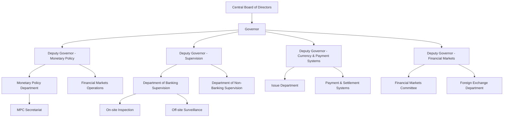
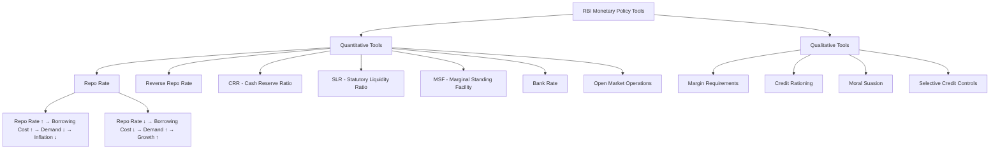
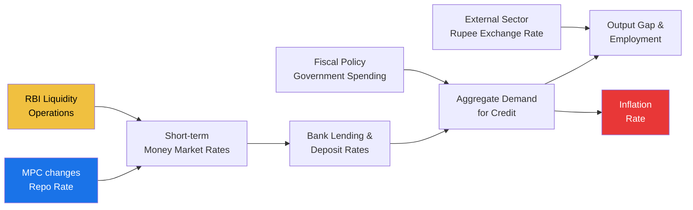

# Chapter 1: RBI & Monetary Policy

## Learning Objectives

By the end of this chapter, you will be able to:
- Explain the history, organisational structure, and core functions of the Reserve Bank of India
- Define and differentiate key monetary policy tools: repo rate, reverse repo rate, CRR, SLR, MSF, bank rate
- Describe the Liquidity Adjustment Facility (LAF) and Marginal Standing Facility (MSF) mechanisms
- Understand the Marginal Cost of Funds-based Lending Rate (MCLR) methodology
- Analyse the composition and functioning of the Monetary Policy Committee (MPC)
- Evaluate how Open Market Operations (OMO) influence money supply and inflation
- Interpret the transmission mechanism from policy rate changes to economic outcomes

---

## Theory

### 1.1 History of the Reserve Bank of India

The Reserve Bank of India (RBI) was established on **April 1, 1935**, under the **Reserve Bank of India Act, 1934**. It was originally constituted as a private shareholders' bank with a paid-up capital of ₹5 crore. Following India's independence, the RBI was **nationalised on January 1, 1949**, under the Reserve Bank (Transfer of Public Ownership) Act, 1948.

**Key milestones:**

| Year | Event | Significance |
|------|-------|-------------|
| 1935 | RBI established | Based on the Hilton Young Commission recommendations |
| 1949 | Nationalisation | Government assumed full ownership |
| 1969 | Bank nationalisation | 14 major commercial banks nationalised |
| 1991 | Economic reforms | Narasimham Committee recommendations on financial sector reforms |
| 2016 | MPC established | Monetary Policy Committee created for rate decisions |
| 2017 | Payment regulator | Payment and Settlement Systems Act oversight strengthened |

### 1.2 Organisational Structure

The RBI is governed by a **Central Board of Directors** appointed by the Government of India:

- **Governor** (currently appointed for up to 5 years, renewable)
- **4 Deputy Governors**
- **2 representatives from the Ministry of Finance**
- **10 nominated directors** representing various sectors
- **4 directors** from regional boards (Mumbai, Kolkata, Chennai, Delhi)



### 1.3 Core Functions of RBI

#### A. Monetary Authority
- Formulates and implements **monetary policy** to maintain price stability while ensuring adequate credit flow to productive sectors
- Uses policy rates and liquidity tools to control inflation and support growth

#### B. Issuer of Currency
- Has the **sole right** to issue banknotes of all denominations (except the one-rupee note which is issued by the Ministry of Finance)
- Manages currency circulation, detects counterfeit notes, and ensures adequate supply of clean notes

#### C. Banker to the Government
- Acts as banker, debt manager, and financial advisor to the central and state governments
- Manages government accounts, handles **Ways and Means Advances (WMA)** for temporary cash flow mismatches

#### D. Banker to Banks
- Maintains current accounts of all scheduled banks
- Provides **settlement and clearing** services
- Acts as **lender of last resort** — provides liquidity to banks facing temporary fund shortages

#### E. Regulator of the Financial System
- Regulates and supervises commercial banks, cooperative banks, NBFCs, and payments systems
- Grants banking licences, sets prudential norms, and conducts inspections

#### F. Foreign Exchange Management
- Administers the **Foreign Exchange Management Act (FEMA), 1999**
- Manages the country's foreign exchange reserves (over $600 billion as of 2025)
- Maintains the external value of the rupee

#### G. Developmental Functions
- Promotes financial inclusion, digital payments, and rural credit through NABARD
- Supports priority sector lending targets and development finance institutions

### 1.4 Monetary Policy Tools



#### A. Repo Rate
The **Repurchase Option (Repo) Rate** is the rate at which the RBI lends short-term money (overnight) to commercial banks against approved government securities. It is the **key policy rate** and signals the RBI's monetary policy stance.

- **Increase:** Makes borrowing costly → reduces money supply → controls inflation
- **Decrease:** Makes borrowing cheaper → increases money supply → boosts growth

#### B. Reverse Repo Rate
The rate at which the RBI **borrows** money from commercial banks. It is the **lower bound** of the LAF corridor.

- Always lower than the repo rate (currently repo rate − 0.25% to 0.65%)
- Banks park surplus funds with RBI to earn this interest

#### C. Cash Reserve Ratio (CRR)
The portion of bank deposits that banks must keep with the RBI in **cash** form (no interest paid).

| Aspect | Details |
|--------|---------|
| Current (2025) | 4.5% of Net Demand and Time Liabilities (NDTL) |
| Purpose | Controls liquidity directly |
| Impact | Higher CRR → less money for lending → inflation control |
| Interest | **No interest** is paid on CRR balances |

#### D. Statutory Liquidity Ratio (SLR)
The portion of deposits that banks must invest in **approved securities** (gold, government bonds).

| Aspect | Details |
|--------|---------|
| Current (2025) | 18% of NDTL |
| Purpose | Ensures bank solvency, funds government borrowing |
| Impact | Higher SLR → lower lending capacity |
| Interest | Banks **earn interest** on SLR securities |

#### E. Marginal Standing Facility (MSF)
A facility introduced in 2011-12 that allows banks to borrow **overnight** from RBI against government securities at a rate **higher than the repo rate**.

- Acts as the **upper bound** of the LAF corridor
- Available for all scheduled banks
- Limits: up to 2% of NDTL (increased during crises)
- Rate: Repo Rate + 0.25% (currently)

#### F. Bank Rate
The rate at which the RBI **discounts bills of exchange or rediscounts** commercial paper. It is also the rate charged on **long-term lending** to banks.

- Currently aligned with the **MSF rate**
- Used for **penal interest** calculations on shortfall in CRR/SLR maintenance

#### G. Liquidity Adjustment Facility (LAF)
The primary tool for managing day-to-day liquidity in the banking system:

| Component | Rate | Direction | Purpose |
|-----------|------|-----------|---------|
| Repo | Policy rate | RBI lends to banks | Inject liquidity |
| Reverse Repo | Policy rate − margin | RBI borrows from banks | Absorb liquidity |
| MSF | Policy rate + 0.25% | RBI lends to banks | Emergency borrowing |

The LAF corridor is bounded by:
- **Upper bound:** MSF rate
- **Lower bound:** Reverse repo rate
- **Middle:** Repo rate (policy rate)

#### H. Marginal Cost of Funds-Based Lending Rate (MCLR)
Introduced in April 2016 to replace the Base Rate system. MCLR is the **minimum lending rate** below which banks cannot lend (with some exceptions).

**MCLR components:**
1. Marginal cost of funds (based on deposit rates)
2. Negative carry on CRR
3. Operating costs
4. Tenor premium

**MCLR tenors:**
- Overnight MCLR
- 1-month MCLR
- 3-month MCLR
- 6-month MCLR
- 1-year MCLR
- 3-year MCLR

**External Benchmark Lending Rate (EBLR):** Since October 2019, RBI mandated banks to link all new floating-rate loans to an **external benchmark** (Repo Rate, Treasury Bill yield, etc.).

### 1.5 Monetary Policy Committee (MPC)

Established under the **RBI Act, 1934** (as amended in 2016), the MPC is a **6-member committee** responsible for setting the policy repo rate.

**Composition:**

| Member | Number | Appointed by |
|--------|--------|--------------|
| RBI Governor (Chairperson) | 1 | Government of India |
| Deputy Governor (in charge of monetary policy) | 1 | RBI |
| One officer of RBI nominated by the Board | 1 | Central Board |
| External members (eminent economists) | 3 | Government (on recommendations of the Search-cum-Selection Committee) |

**Key features:**
- **Meeting frequency:** At least **4 meetings per year** (bi-monthly schedule)
- **Decision rule:** Each member has one vote; Governor has **casting vote** in case of a tie
- **Inflation target:** 4% CPI inflation with a tolerance band of ±2% (i.e., 2%–6%)
- **Primary mandate:** Maintain price stability while keeping growth in mind
- **Failure clause:** If inflation stays outside the band for **3 consecutive quarters**, RBI must submit a report to the government explaining reasons, remedial actions, and timeline

**2025-26 MPC meeting schedule (typical):**
1. April (first week)
2. June (first week)
3. August (first week)
4. October (first week)
5. December (first week)
6. February (first week)

### 1.6 Open Market Operations (OMO)

OMO refers to the **buying and selling of government securities** by the RBI in the open market to regulate money supply.

**Types of OMO:**

| Operation | Action | Effect on Liquidity |
|-----------|--------|---------------------|
| OMO Purchase | RBI buys securities | **Injects** liquidity (money flows to banks) |
| OMO Sale | RBI sells securities | **Absorbs** liquidity (money flows to RBI) |

**Specialised OMO types:**
- **Outright OMO:** Permanent purchase/sale of securities
- **Repurchase (Repo):** Short-term, reversible operations
- **Operation Twist:** Simultaneous sale of short-term securities and purchase of long-term securities to flatten the yield curve (without changing net liquidity)
- **Special Open Market Operations:** Conducted for specific sectors (e.g., corporate bonds during COVID-19)

### 1.7 Transmission Mechanism



The transmission of monetary policy operates through multiple channels:

1. **Interest Rate Channel:** Policy rate change → bank lending rates → investment and consumption demand → inflation/growth
2. **Credit Channel:** Policy rate → credit availability → spending decisions
3. **Exchange Rate Channel:** Rate differential → capital flows → rupee exchange rate → export/import prices → inflation
4. **Asset Price Channel:** Rate change → bond/equity/real estate prices → wealth effect → consumption

**Transmission lag:** Policy changes typically take **6–12 months** to fully transmit through the economy.

### 1.8 Monetary Policy Stances

| Stance | Meaning | When Used |
|--------|---------|-----------|
| **Accommodative** | Low rates, abundant liquidity | Recession / low growth |
| **Neutral** | Balanced, no directional bias | Stable economic conditions |
| **Withdrawal of Accommodation** | Gradual reduction of easy money | Recovery phase, growth picking up |
| **Hawkish** | Tightening bias, rate increases likely | High inflation / overheating |
| **Dovish** | Easing bias, rate cuts likely | Low inflation, weak growth |

### 1.9 Inflation Measurement

The RBI uses the **Consumer Price Index (CPI)** as the measure of inflation for monetary policy purposes (since April 2014).

| Index | Base Year | Coverage | Weight |
|-------|-----------|----------|--------|
| CPI-C (Combined) | 2012 = 100 | Rural + Urban | 100% |
| CPI-IW (Industrial Workers) | 2016 = 100 | Industrial workers | Specific use |
| WPI (Wholesale Price Index) | 2011-12 = 100 | Wholesale prices | Not used for policy |
| GDP Deflator | 2011-12 = 100 | Whole economy | Broad measure |

**CPI components and weights:**
- Food & beverages: 45.86%
- Housing: 10.07%
- Fuel & light: 6.84%
- Clothing & footwear: 6.53%
- Miscellaneous: 30.70%

---

## Examples with Solved Exercises

### Example 1: Repo Rate Impact on Borrowing

```typescript
interface RepoRateImpact {
  oldRepoRate: number;
  newRepoRate: number;
  change: number;
  loanAmount: number;
  oldEMI: number;
  newEMI: number;
  emiDifference: number;
}

function calculateRepoRateImpact(
  loanAmount: number,
  tenureMonths: number,
  oldRate: number,
  newRate: number
): RepoRateImpact {
  const monthlyOld = oldRate / 12 / 100;
  const monthlyNew = newRate / 12 / 100;

  const emi = (principal: number, rate: number, n: number): number =>
    Math.round((principal * rate * Math.pow(1 + rate, n)) / (Math.pow(1 + rate, n) - 1));

  return {
    oldRepoRate: oldRate,
    newRepoRate: newRate,
    change: newRate - oldRate,
    loanAmount,
    oldEMI: emi(loanAmount, monthlyOld, tenureMonths),
    newEMI: emi(loanAmount, monthlyNew, tenureMonths),
    emiDifference: emi(loanAmount, monthlyNew, tenureMonths) - emi(loanAmount, monthlyOld, tenureMonths),
  };
}

const result = calculateRepoRateImpact(5000000, 240, 6.5, 6.75);
console.log(`Old EMI: ₹${result.oldEMI}, New EMI: ₹${result.newEMI}, Increase: ₹${result.emiDifference}`);
// Output: Old EMI: ₹37285, New EMI: ₹37980, Increase: ₹695
```

**Q1.** If the repo rate is increased from 6.50% to 6.75%, what is the likely impact on the economy?

a) Inflation increases, growth accelerates
b) Borrowing becomes costlier, demand reduces, inflation falls
c) Rupee depreciates sharply
d) Bank deposits decrease

<details>
<summary>Answer</summary>
**Answer:** b) Borrowing becomes costlier, demand reduces, inflation falls

Repo rate increase → banks pass on higher costs via lending rates → loans become expensive → demand for credit falls → aggregate demand reduces → inflationary pressures ease.
</details>

---

**Q2.** Which of the following is NOT a function of the Reserve Bank of India?

a) Issuer of currency notes (except one-rupee)
b) Banker to the government
c) Granting personal loans to citizens
d) Regulator of the banking system

<details>
<summary>Answer</summary>
**Answer:** c) Granting personal loans to citizens

RBI is a banker's bank and does not directly lend to individuals. Commercial banks provide personal loans to citizens.
</details>

---

**Q3.** The Monetary Policy Committee (MPC) has how many members?

a) 4
b) 5
c) 6
d) 7

<details>
<summary>Answer</summary>
**Answer:** c) 6

The MPC comprises 6 members: RBI Governor (chairperson), Deputy Governor (monetary policy), one RBI officer nominated by the Board, and 3 external members appointed by the Government.
</details>

---

### Example 2: CRR and Money Supply

```typescript
interface CRRCalculator {
  totalDeposits: number;
  crrPercentage: number;
  crrAmount: number;
  lendableAmount: number;
  moneyMultiplier: number;
  potentialMoneySupply: number;
}

function calculateCRRImpact(
  totalDeposits: number,
  crrRate: number,
  currencyDepositRatio: number
): CRRCalculator {
  const crrAmount = totalDeposits * (crrRate / 100);
  const lendableAmount = totalDeposits - crrAmount;
  const moneyMultiplier = 1 / (crrRate / 100 + currencyDepositRatio);
  const potentialMoneySupply = totalDeposits * moneyMultiplier;

  return {
    totalDeposits,
    crrPercentage: crrRate,
    crrAmount: Math.round(crrAmount),
    lendableAmount: Math.round(lendableAmount),
    moneyMultiplier: Math.round(moneyMultiplier * 100) / 100,
    potentialMoneySupply: Math.round(potentialMoneySupply),
  };
}

const impact = calculateCRRImpact(100000000, 4.5, 0.1);
console.log(`CRR: ₹${impact.crrAmount}, Lendable: ₹${impact.lendableAmount}, Multiplier: ${impact.moneyMultiplier}`);
// Output: CRR: ₹4500000, Lendable: ₹95500000, Multiplier: 6.45
```

**Q4.** If the RBI increases CRR from 4% to 4.5%, what is the effect?

a) Banks have more money to lend
b) Money supply in the economy increases
c) Banks' lending capacity decreases
d) Inflation rises

<details>
<summary>Answer</summary>
**Answer:** c) Banks' lending capacity decreases

Higher CRR means more funds locked with RBI, reducing lendable resources. This contracts money supply and helps control inflation.
</details>

---

**Q5.** Which rate serves as the upper bound of the Liquidity Adjustment Facility (LAF) corridor?

a) Repo Rate
b) Reverse Repo Rate
c) MSF Rate
d) Bank Rate

<details>
<summary>Answer</summary>
**Answer:** c) MSF Rate

The LAF corridor is bounded by the MSF rate (upper bound), repo rate (middle), and reverse repo rate (lower bound).
</details>

---

**Q6.** What is the inflation target range under the Monetary Policy Framework in India?

a) 2% to 4%
b) 2% to 6%
c) 3% to 5%
d) 4% to 8%

<details>
<summary>Answer</summary>
**Answer:** b) 2% to 6%

The CPI inflation target is 4% with a tolerance band of ±2%, making the acceptable range 2% to 6%. If inflation stays outside this band for 3 consecutive quarters, RBI must report to the government.
</details>

---

### Example 3: MCLR Calculation

```typescript
interface MCLRComponents {
  marginalCostOfFunds: number;
  negativeCarryOnCRR: number;
  operatingCost: number;
  tenorPremium: number;
  mclrRate: number;
}

function calculateMCLR(
  depositRate: number,
  crrRate: number,
  operatingCostPercent: number,
  tenorPremiumPercent: number
): MCLRComponents {
  const negativeCarry = crrRate * 0.1; // Negative carry on CRR
  const marginalCost = depositRate;
  const mclr = marginalCost + negativeCarry + operatingCostPercent + tenorPremiumPercent;

  return {
    marginalCostOfFunds: marginalCost,
    negativeCarryOnCRR: Math.round(negativeCarry * 100) / 100,
    operatingCost: operatingCostPercent,
    tenorPremium: tenorPremiumPercent,
    mclrRate: Math.round(mclr * 100) / 100,
  };
}

const mclr = calculateMCLR(5.5, 4.5, 0.5, 0.3);
console.log(`1-year MCLR: ${mclr.mclrRate}%`);
// Output: 1-year MCLR: 6.75%
```

**Q7.** MCLR stands for:

a) Marginal Cost of Lending Rate
b) Minimum Cost of Funds-based Lending Rate
c) Marginal Cost of Funds-based Lending Rate
d) Maximum Cost of Lending Rate

<details>
<summary>Answer</summary>
**Answer:** c) Marginal Cost of Funds-based Lending Rate

MCLR was introduced by RBI in April 2016 to replace the Base Rate system for determining lending rates.
</details>

---

**Q8.** Which of the following is NOT a component of MCLR?

a) Marginal cost of funds
b) Negative carry on CRR
c) Repo rate directly
d) Tenor premium

<details>
<summary>Answer</summary>
**Answer:** c) Repo rate directly

While MCLR is influenced by the repo rate, it is not a direct component. The components are: marginal cost of funds, negative carry on CRR, operating costs, and tenor premium.
</details>

---

**Q9.** When was the Reserve Bank of India established?

a) 1934
b) 1935
c) 1947
d) 1949

<details>
<summary>Answer</summary>
**Answer:** b) 1935

RBI was established on April 1, 1935 under the RBI Act, 1934. It was nationalised on January 1, 1949.
</details>

---

**Q10.** What is the SLR (Statutory Liquidity Ratio) currently maintained at?

a) 18% of NDTL
b) 20% of NDTL
c) 15% of NDTL
d) 4.5% of NDTL

<details>
<summary>Answer</summary>
**Answer:** a) 18% of NDTL

SLR is the portion of deposits banks must invest in approved securities (gold, government bonds). Currently set at 18% of Net Demand and Time Liabilities (NDTL).
</details>

---

### Example 4: Money Multiplier Effect

```typescript
interface MoneyMultiplierAnalysis {
  crr: number;
  currencyDepositRatio: number;
  multiplier: number;
  initialDeposit: number;
  totalMoneyCreation: number;
}

function moneyMultiplier(
  crr: number,
  currencyDepositRatio: number,
  initialDeposit: number
): MoneyMultiplierAnalysis {
  const multiplier = 1 / (crr / 100 + currencyDepositRatio);
  const totalMoney = initialDeposit * multiplier;

  return {
    crr,
    currencyDepositRatio,
    multiplier: Math.round(multiplier * 100) / 100,
    initialDeposit,
    totalMoneyCreation: Math.round(totalMoney),
  };
}

const mm = moneyMultiplier(4.5, 0.1, 100000);
console.log(`Multiplier: ${mm.multiplier}x, Total Money: ₹${mm.totalMoneyCreation}`);
// Output: Multiplier: 6.45x, Total Money: ₹645161
```

**Q11.** What happens to the money multiplier when CRR is increased?

a) Money multiplier increases
b) Money multiplier decreases
c) Money multiplier remains unchanged
d) Money multiplier becomes zero

<details>
<summary>Answer</summary>
**Answer:** b) Money multiplier decreases

Money multiplier = 1 / (CRR + Currency-Deposit Ratio). Higher CRR increases the denominator, reducing the multiplier. Less money is created per unit of reserve.
</details>

---

**Q12.** Who has the sole right to issue banknotes in India?

a) Ministry of Finance
b) State Bank of India
c) Reserve Bank of India
d) Securities and Exchange Board of India

<details>
<summary>Answer</summary>
**Answer:** c) Reserve Bank of India

RBI has the sole right to issue banknotes of all denominations. The one-rupee note is an exception — it is issued by the Ministry of Finance but bears the signature of the RBI Governor.
</details>

---

**Q13.** The MSF rate is always _____ the repo rate.

a) Equal to
b) Lower than
c) Higher than
d) Unrelated to

<details>
<summary>Answer</summary>
**Answer:** c) Higher than

MSF rate is repo rate + 0.25% (currently). It serves as the upper bound of the LAF corridor, while the reverse repo rate is the lower bound.
</details>

---

**Q14.** Operation Twist refers to:

a) Simultaneous buying and selling of foreign exchange
b) Simultaneous sale of short-term securities and purchase of long-term securities
c) Reducing CRR and SLR together
d) Increasing repo and reverse repo by equal amounts

<details>
<summary>Answer</summary>
**Answer:** b) Simultaneous sale of short-term securities and purchase of long-term securities

Operation Twist aims to flatten the yield curve by lowering long-term yields while keeping short-term yields unchanged, without altering overall liquidity.
</details>

---

**Q15.** Which measure of inflation does the RBI target for monetary policy?

a) WPI
b) CPI
c) GDP Deflator
d) Core Inflation

<details>
<summary>Answer</summary>
**Answer:** b) CPI

Since April 2014, the RBI uses CPI (Consumer Price Index) as the measure of inflation for monetary policy purposes under the Urjit Patel Committee recommendations.
</details>

---

### Example 5: OMO Impact Simulation

```typescript
interface OMOImpact {
  operationType: 'Purchase' | 'Sale';
  amount: number;
  initialLiquidity: number;
  finalLiquidity: number;
  bondPriceChange: number;
  yieldChange: number;
}

function simulateOMO(
  type: 'Purchase' | 'Sale',
  amount: number,
  currentLiquidity: number,
  marketDepthFactor: number
): OMOImpact {
  const liquidityChange = type === 'Purchase' ? amount : -amount;
  const bondPriceChange = type === 'Purchase'
    ? amount / marketDepthFactor
    : -amount / marketDepthFactor;
  const yieldChange = -bondPriceChange * 0.1; // Inverse relationship

  return {
    operationType: type,
    amount,
    initialLiquidity: currentLiquidity,
    finalLiquidity: currentLiquidity + liquidityChange,
    bondPriceChange: Math.round(bondPriceChange * 100) / 100,
    yieldChange: Math.round(yieldChange * 100) / 100,
  };
}

const omo = simulateOMO('Purchase', 100000, 500000, 2000);
console.log(`Liquidity: ${omo.initialLiquidity} → ${omo.finalLiquidity}, Bond prices ${omo.bondPriceChange}%`);
// Output: Liquidity: 500000 → 600000, Bond prices 50%
```

**Q16.** Open Market Operations involve the buying and selling of:

a) Foreign currency
b) Gold
c) Government securities
d) Corporate shares

<details>
<summary>Answer</summary>
**Answer:** c) Government securities

OMO involves purchase/sale of government securities by RBI to regulate money supply. Purchase injects liquidity; sale absorbs liquidity.
</details>

---

**Q17.** If RBI sells government securities in the open market, what happens?

a) Money supply increases
b) Money supply decreases
c) Inflation increases
d) Interest rates fall

<details>
<summary>Answer</summary>
**Answer:** b) Money supply decreases

When RBI sells securities, banks pay for them, reducing their reserves and the overall money supply in the economy.
</details>

---

**Q18.** The Bank Rate in India is aligned with which rate?

a) Repo Rate
b) Reverse Repo Rate
c) MSF Rate
d) CRR

<details>
<summary>Answer</summary>
**Answer:** c) MSF Rate

The Bank Rate is currently aligned with the MSF rate. It is used for penal interest calculations on CRR/SLR shortfalls and for discounting bills of exchange.
</details>

---

**Q19.** Ways and Means Advances (WMA) refers to:

a) Loans given by RBI to commercial banks
b) Temporary advances by RBI to the government
c) Loans given by banks to priority sectors
d) Advances against foreign currency

<details>
<summary>Answer</summary>
**Answer:** b) Temporary advances by RBI to the government

WMA are temporary advances provided by RBI to the central and state governments to manage cash flow mismatches between receipts and payments.
</details>

---

**Q20.** How many times must the MPC meet in a year?

a) At least 2 times
b) At least 4 times
c) At least 6 times
d) At least 12 times

<details>
<summary>Answer</summary>
**Answer:** b) At least 4 times

The MPC is required to meet at least 4 times a year. In practice, meetings are held bi-monthly (6 times a year) following a pre-announced schedule.
</details>

---

## TypeScript Example: Monetary Policy Simulator

```typescript
interface EconomyState {
  repoRate: number;
  inflation: number;
  gdpGrowth: number;
  liquidity: number;
  creditGrowth: number;
}

interface PolicyAction {
  action: string;
  newRepoRate: number;
  months: number;
}

function simulateMonetaryPolicy(
  initial: EconomyState,
  actions: PolicyAction[]
): EconomyState[] {
  const states: EconomyState[] = [initial];

  for (const action of actions) {
    const current = states[states.length - 1];
    const rateDiff = action.newRepoRate - current.repoRate;

    // Simplified transmission model
    const inflationImpact = -rateDiff * 0.3 * (action.months / 12);
    const growthImpact = rateDiff * 0.2 * (action.months / 12);
    const creditImpact = -rateDiff * 0.5;
    const liquidityImpact = -rateDiff * 2;

    const newState: EconomyState = {
      repoRate: action.newRepoRate,
      inflation: Math.round(Math.max(0, current.inflation + inflationImpact) * 100) / 100,
      gdpGrowth: Math.round(Math.max(-5, current.gdpGrowth - growthImpact) * 100) / 100,
      liquidity: Math.round(Math.max(0, current.liquidity + liquidityImpact) * 100) / 100,
      creditGrowth: Math.round(Math.max(0, current.creditGrowth + creditImpact) * 100) / 100,
    };
    states.push(newState);
  }

  return states;
}

const economy: EconomyState = {
  repoRate: 6.5,
  inflation: 5.2,
  gdpGrowth: 6.8,
  liquidity: 100,
  creditGrowth: 12,
};

const actions: PolicyAction[] = [
  { action: 'Rate Hike', newRepoRate: 6.75, months: 6 },
  { action: 'Rate Hold', newRepoRate: 6.75, months: 3 },
  { action: 'Rate Cut', newRepoRate: 6.50, months: 6 },
];

const simulation = simulateMonetaryPolicy(economy, actions);
simulation.forEach((s, i) => {
  console.log(`Period ${i}: Rate=${s.repoRate}%, Inflation=${s.inflation}%, GDP=${s.gdpGrowth}%`);
});
// Output:
// Period 0: Rate=6.5%, Inflation=5.2%, GDP=6.8%
// Period 1: Rate=6.75%, Inflation=5.13%, GDP=6.38%
// Period 2: Rate=6.75%, Inflation=5.13%, GDP=6.38%
// Period 3: Rate=6.5%, Inflation=5.17%, GDP=6.72%
```

---

## Summary

- The **Reserve Bank of India** was established in 1935 and nationalised in 1949. It is India's central bank responsible for monetary policy, currency issuance, banking regulation, and foreign exchange management.
- **Repo rate** is the key policy rate at which RBI lends to banks; changes transmit through the economy via interest rate, credit, exchange rate, and asset price channels.
- **CRR** (portion of deposits kept with RBI in cash, no interest) and **SLR** (portion invested in approved securities, earns interest) are reserve requirements that impact lending capacity.
- **LAF corridor** is bounded by the MSF rate (upper), repo rate (middle), and reverse repo rate (lower).
- **MCLR** replaced the Base Rate system in 2016 for computing lending rates based on marginal cost of funds, negative carry on CRR, operating costs, and tenor premium.
- The **MPC** is a 6-member body that sets the repo rate with a mandate to keep CPI inflation at 4% (±2% tolerance band).
- **Open Market Operations** involve purchase/sale of government securities to regulate systemic liquidity.
- Policy transmission takes **6–12 months** to fully impact the economy.

---

## Practical Takeaways

| Exam Topic | Key Fact | Mnemonic / Tip |
|------------|----------|----------------|
| RBI Established | April 1, 1935 | "RBI starts at 35" |
| Nationalisation | January 1, 1949 | "RBI is Gov-owned since 49" |
| MPC Members | 6 members | Governor + 1 Deputy + 1 Board nominee + 3 external |
| Inflation Target | 4% ± 2% (2–6% range) | "4 is the target, 2-6 is the range" |
| CRR | No interest paid | "C = Cash = Costly" |
| SLR | Interest earned | "S = Securities = Saver" |
| MSF | Repo + 0.25% | "M = More than Repo" |
| LAF Corridor | MSF (top) > Repo (mid) > Reverse Repo (bottom) | "MRR — MSF, Repo, Reverse Repo" |
| MCLR (2016) | Base rate replacement | "MCLR = Marginal Cost Lending Rate" |
| OMO Purpose | Liquidity management | "Buy = Inject, Sell = Absorb" |

---

## Chapter Quiz

**Q1.** What is the current inflation target set for the Monetary Policy Committee?

a) 5% with ±1% tolerance
b) 4% with ±2% tolerance
c) 3% with ±2% tolerance
d) 6% with ±1% tolerance

<details>
<summary>Show Answer</summary>

**Answer:** b) 4% with ±2% tolerance

The MPC targets CPI inflation of 4% with a tolerance band of ±2 percentage points (i.e., 2% to 6%).
</details>

---

**Q2.** Which of the following is the order from LOWEST to HIGHEST in the LAF corridor?

a) Repo < Reverse Repo < MSF
b) Reverse Repo < Repo < MSF
c) MSF < Repo < Reverse Repo
d) Repo < MSF < Reverse Repo

<details>
<summary>Show Answer</summary>

**Answer:** b) Reverse Repo < Repo < MSF

The LAF corridor: Reverse repo rate (lower bound) < Repo rate (policy rate) < MSF rate (upper bound).
</details>

---

**Q3.** How many external members are part of the Monetary Policy Committee?

a) 1
b) 2
c) 3
d) 4

<details>
<summary>Show Answer</summary>

**Answer:** c) 3

The MPC has 6 members: 3 from RBI (Governor, Deputy Governor, one Board nominee) and 3 external members appointed by the government.
</details>

---

**Q4.** If the CRR is 4.5% and the Currency-Deposit Ratio is 0.1, what is the approximate money multiplier?

a) 4.5
b) 5.5
c) 6.45
d) 10.0

<details>
<summary>Show Answer</summary>

**Answer:** c) 6.45

Money multiplier = 1 / (0.045 + 0.1) = 1 / 0.145 = 6.45 (approximately).
</details>

---

**Q5.** Which of the following is NOT part of the RBI's developmental functions?

a) Promoting financial inclusion
b) Setting income tax rates
c) Supporting rural credit through NABARD
d) Promoting digital payments

<details>
<summary>Show Answer</summary>

**Answer:** b) Setting income tax rates

Income tax rates are set by the government through the Finance Act. RBI's developmental functions include financial inclusion, digital payments, and rural credit promotion.
</details>

---

## Exercises

### Section A: Multiple Choice Questions

1. The Reserve Bank of India was nationalised in which year?
   a) 1935 b) 1947 c) 1949 d) 1950

2. The current CRR (as of 2025) is maintained at what percentage?
   a) 3% b) 4% c) 4.5% d) 5%

3. Which rate is considered the "policy rate" in India?
   a) Bank Rate b) Repo Rate c) MSF Rate d) Reverse Repo Rate

4. What is the SLR primarily maintained for?
   a) Controlling inflation b) Ensuring bank solvency c) Increasing profits d) Foreign exchange stability

5. Which committee recommended the adoption of CPI as the measure of inflation targeting?
   a) Narasimham Committee b) Urjit Patel Committee c) Nachiket Mor Committee d) Damodaran Committee

6. The term "Lender of Last Resort" refers to which function of RBI?
   a) Issuer of currency b) Banker to banks c) Banker to government d) Foreign exchange manager

7. What is the full form of MSF?
   a) Marginal Standing Facility b) Main Standing Facility c) Monetary Support Facility d) Marginal Support Fund

8. When a bank borrows money from RBI by selling government securities with an agreement to repurchase, the rate charged is:
   a) Reverse Repo Rate b) Repo Rate c) Bank Rate d) MSF Rate

9. Which of the following statements about CRR is correct?
   a) RBI pays market interest on CRR b) RBI pays no interest on CRR c) CRR is invested in govt securities d) CRR is optional for banks

10. What is the maximum permissible limit for MSF borrowing as a percentage of NDTL?
    a) 1% b) 2% c) 3% d) 5%

### Section B: Fill in the Blanks

11. The RBI was established based on the recommendations of the _________ Commission.
12. The _________ rate serves as the lower bound of the LAF corridor.
13. MCLR stands for _________.
14. The MPC was established through an amendment to the RBI Act in the year _________.
15. The currency notes in India are issued by RBI under the _________ system.
16. Operation Twist involves the simultaneous sale of short-term securities and purchase of _________ securities.
17. The WMA offered to state governments is valid for a maximum of _________ days.
18. The Repo Rate minus _________ equals the Reverse Repo Rate (approximately).
19. The EBLR system was mandated by RBI from _________ 2019.
20. The minimum alternate tenure for MCLR is _________ MCLR.

### Section C: True or False

21. The RBI was nationalised in 1947. (True/False)
22. CRR is applicable only on time liabilities. (True/False)
23. SLR can be maintained in the form of gold. (True/False)
24. The MSF rate is always lower than the repo rate. (True/False)
25. The Governor of RBI has a casting vote in MPC meetings. (True/False)
26. The inflation target under the monetary policy framework is 5%. (True/False)
27. Open Market Operations are used to manage day-to-day liquidity. (True/False)
28. The bank rate is used for calculating penalties on CRR shortfalls. (True/False)
29. MCLR was introduced in 2010. (True/False)
30. The MPC has 7 members including the Governor. (True/False)

### Answer Key

| Q | Answer | Q | Answer | Q | Answer | Q | Answer | Q | Answer |
|---|--------|---|--------|---|--------|---|--------|---|--------|
| 1 | c (1949) | 2 | c (4.5%) | 3 | b (Repo Rate) | 4 | b (Ensuring bank solvency) | 5 | b (Urjit Patel Committee) |
| 6 | b (Banker to banks) | 7 | a (Marginal Standing Facility) | 8 | b (Repo Rate) | 9 | b (RBI pays no interest) | 10 | b (2%) |
| 11 | Hilton Young | 12 | Reverse Repo | 13 | Marginal Cost of Funds-based Lending Rate | 14 | 2016 | 15 | Minimum Reserve |
| 16 | long-term | 17 | 90 | 18 | 0.25% (or market determined margin) | 19 | October | 20 | Overnight |
| 21 | False (1949) | 22 | False (NDTL) | 23 | True | 24 | False (higher) | 25 | True |
| 26 | False (4%) | 27 | True | 28 | True | 29 | False (2016) | 30 | False (6 members) |

---

*Proceed to Chapter 2 — Banking System & Regulations*
