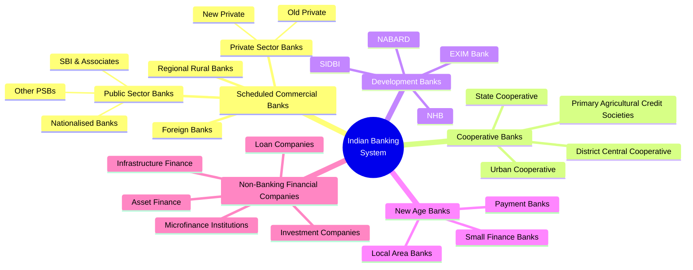
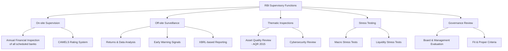
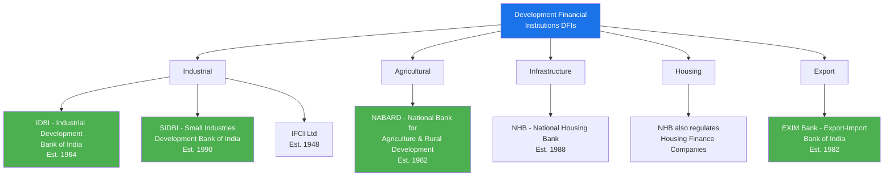
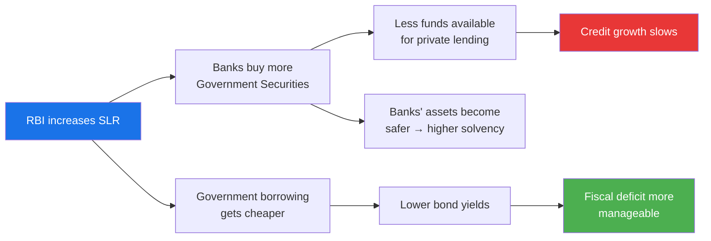

# Chapter 2: Banking System & Regulations

## Learning Objectives

By the end of this chapter, you will be able to:
- Classify different types of banks operating in India (public, private, foreign, RRBs, cooperative, payment banks, small finance banks)
- Explain the key provisions of the Banking Regulation Act, 1949
- Describe the SARFAESI Act and its importance in asset recovery
- Understand the role and functioning of DICGC in deposit insurance
- Analyse the Basel capital adequacy norms (Basel I, II, III) and their implementation in India
- Explain the Prompt Corrective Action (PCA) framework and its triggers
- Summarise RBI's supervisory functions and inspection mechanisms

<!-- Image Gallery -->
<div style="display:flex;flex-wrap:wrap;gap:4px;margin:16px 0;padding:12px;background:#f8fafc;border-radius:8px;border:1px solid #e2e8f0;">
<a href="../../../assets/images/lessons/banking-financial-awareness/02-banking-system-regulations/hero.svg" target="_blank" rel="noopener">
  
</a>
<a href="../../../assets/images/lessons/banking-financial-awareness/02-banking-system-regulations/handwritten-notes.svg" target="_blank" rel="noopener">
  
</a>
<a href="../../../assets/images/lessons/banking-financial-awareness/02-banking-system-regulations/sticky-notes.svg" target="_blank" rel="noopener">
  
</a>
<a href="../../../assets/images/lessons/banking-financial-awareness/02-banking-system-regulations/visual-explanation.svg" target="_blank" rel="noopener">
  
</a>
<a href="../../../assets/images/lessons/banking-financial-awareness/02-banking-system-regulations/architecture.svg" target="_blank" rel="noopener">
  
</a>
<a href="../../../assets/images/lessons/banking-financial-awareness/02-banking-system-regulations/workflow.svg" target="_blank" rel="noopener">
  
</a>
<a href="../../../assets/images/lessons/banking-financial-awareness/02-banking-system-regulations/mindmap.svg" target="_blank" rel="noopener">
  
</a>
<a href="../../../assets/images/lessons/banking-financial-awareness/02-banking-system-regulations/comparison.svg" target="_blank" rel="noopener">
  
</a>
<a href="../../../assets/images/lessons/banking-financial-awareness/02-banking-system-regulations/cheatsheet.svg" target="_blank" rel="noopener">
  
</a>
<a href="../../../assets/images/lessons/banking-financial-awareness/02-banking-system-regulations/interview-quiz.svg" target="_blank" rel="noopener">
  
</a>
<a href="../../../assets/images/lessons/banking-financial-awareness/02-banking-system-regulations/social-card.svg" target="_blank" rel="noopener">
  
</a>
</div>
<!-- End Image Gallery -->


---

## Theory

### 2.1 Banking System Structure in India

<a href="../../../assets/images/diagrams/banking-financial-awareness/02-banking-system-regulations/2-1-banking-system-structure-in-india-handwritten.svg" target="_blank" rel="noopener">
  
</a>
<a href="../../../assets/images/diagrams/banking-financial-awareness/02-banking-system-regulations/2-1-banking-system-structure-in-india-diagram.svg" target="_blank" rel="noopener">
  
</a>
<a href="../../../assets/images/diagrams/banking-financial-awareness/02-banking-system-regulations/2-1-banking-system-structure-in-india-sticky.svg" target="_blank" rel="noopener">
  
</a>




### 2.2 Types of Banks

<a href="../../../assets/images/diagrams/banking-financial-awareness/02-banking-system-regulations/2-2-types-of-banks-handwritten.svg" target="_blank" rel="noopener">
  
</a>
<a href="../../../assets/images/diagrams/banking-financial-awareness/02-banking-system-regulations/2-2-types-of-banks-diagram.svg" target="_blank" rel="noopener">
  
</a>
<a href="../../../assets/images/diagrams/banking-financial-awareness/02-banking-system-regulations/2-2-types-of-banks-sticky.svg" target="_blank" rel="noopener">
  
</a>


#### A. Public Sector Banks (PSBs)

Banks where the **Government of India holds majority stake** (≥51%). PSBs are covered under the **Banking Companies (Acquisition and Transfer of Undertakings) Acts of 1970 and 1980**.

| Category | Examples | Key Feature |
|----------|----------|-------------|
| State Bank of India | SBI (including its 5 associate banks merged in 2017) | Largest bank, ~23% market share |
| Nationalised Banks (post-1969) | PNB, Canara Bank, Bank of Baroda, etc. | 14 banks nationalised in 1969, 6 more in 1980 |
| Other PSBs | IDBI Bank | IDBI was classified as a PSB after 2019 |

**Bank mergers (2019-2020):** The government consolidated 10 PSBs into 4 to create stronger global-sized banks:
- **Punjab National Bank** absorbed Oriental Bank of Commerce and United Bank of India
- **Canara Bank** absorbed Syndicate Bank
- **Bank of Baroda** absorbed Vijaya Bank and Dena Bank (this merger occurred in 2019)
- **Indian Bank** absorbed Allahabad Bank

#### B. Private Sector Banks

Banks where **private shareholders hold majority equity**:

| Generation | Examples | Established |
|------------|----------|-------------|
| Old Private | Federal Bank, Karur Vysya Bank, City Union Bank, Lakshmi Vilas Bank | Pre-1991 |
| New Private | HDFC Bank, ICICI Bank, Axis Bank, Kotak Mahindra, Yes Bank, IndusInd Bank | Post-1991 liberalisation |

#### C. Foreign Banks

Banks incorporated outside India but operating branches in India. Examples: Standard Chartered, HSBC, Citibank (sold retail banking to Axis Bank in 2022), Deutsche Bank.

**Wholly-owned subsidiaries (WOS):** Since 2016, RBI requires systematically important foreign banks to convert to WOS structure.

#### D. Regional Rural Banks (RRBs)

Established under the **RRB Act, 1976** to provide credit to small farmers, agricultural labourers, and rural artisans.

| Feature | Details |
|---------|---------|
| Ownership | Central Govt (50%) + State Govt (15%) + Sponsor Bank (35%) |
| Current count | 43 RRBs (as of 2025) |
| Sponsor banks | SBI, PNB, Bank of Baroda, Canara Bank, etc. |
| Supervision | NABARD |
| Example | Baroda UP Bank, Punjab Gramin Bank |

#### E. Cooperative Banks

Organised under the **Cooperative Societies Acts** of respective states. Regulated by: RBI (banking functions) + State/Central Registrar (registration).

| Tier | Type | Function |
|------|------|----------|
| Urban | Urban Cooperative Banks (UCBs) | Operate in urban/semi-urban areas |
| State | State Cooperative Banks (StCBs) | Apex cooperative institution in each state |
| District | District Central Cooperative Banks (DCCBs) | Intermediate level |
| Village | Primary Agricultural Credit Societies (PACS) | Grassroots level — villages |

#### F. Payment Banks

A category of banks licensed by RBI in 2015 to promote **financial inclusion** by offering small savings accounts and payment/remittance services.

**Key restrictions:**
- Cannot lend (no credit products)
- Maximum deposit per customer: ₹2,00,000 (increased from ₹1,00,000)
- Must invest 75% of deposits in government securities/T-bills
- Can offer current accounts, savings accounts, remittance services, mobile payments

**Examples:** Airtel Payments Bank, India Post Payments Bank, Fino Payments Bank, Jio Payments Bank, Paytm Payments Bank.

#### G. Small Finance Banks (SFBs)

Licensed in 2015 to extend **financial inclusion** by providing basic banking services to **unserved and underserved sections** (small farmers, micro-industries, unorganised sector entities).

**Key features:**
- Must lend at least 75% of Adjusted Net Bank Credit (ANBC) to priority sector
- Minimum 50% of loan portfolio must consist of loans up to ₹25 lakh
- Can offer all basic banking services (deposits, loans, remittances)

**Examples:** AU Small Finance Bank, Equitas Small Finance Bank, Ujjivan Small Finance Bank, ESAF Small Finance Bank, Jana Small Finance Bank, Suryoday Small Finance Bank.

### 2.3 Banking Regulation Act, 1949

<a href="../../../assets/images/diagrams/banking-financial-awareness/02-banking-system-regulations/2-3-banking-regulation-act-1949-handwritten.svg" target="_blank" rel="noopener">
  
</a>
<a href="../../../assets/images/diagrams/banking-financial-awareness/02-banking-system-regulations/2-3-banking-regulation-act-1949-diagram.svg" target="_blank" rel="noopener">
  
</a>
<a href="../../../assets/images/diagrams/banking-financial-awareness/02-banking-system-regulations/2-3-banking-regulation-act-1949-sticky.svg" target="_blank" rel="noopener">
  
</a>


The **Banking Regulation Act, 1949** (as amended) provides the legal framework for banking regulation in India. Originally called the Banking Companies Act, 1949.

**Key provisions:**

| Section | Provision |
|---------|-----------|
| Section 5(b) | Definition of "banking" — accepting deposits for lending/investment, repayable on demand |
| Section 6 | Permissible activities for a banking company |
| Section 7 | Use of "bank", "banker", or "banking" restricted to licensed entities |
| Section 10 | Prohibition of trading activities by banks |
| Section 10A | Board of Directors must have at least 51% members with special knowledge/practical experience |
| Section 11 | Minimum capital and reserve requirements |
| Section 17 | **Reserve Fund** — every bank must transfer at least 20% of profit to reserve fund before declaring dividend |
| Section 18 | Cash Reserve Ratio (CRR) |
| Section 21 | RBI's power to control advances |
| Section 22 | **Licensing** of banking companies by RBI |
| Section 24 | Statutory Liquidity Ratio (SLR) |
| Section 29 | Accounts and balance sheets must be in prescribed form |
| Section 35 | RBI's power of **inspection** |
| Section 35A | RBI's power to give **directions** |
| Section 36AE | RBI's power to **amalgamate** a banking company (after amendment) |
| Section 45 | RBI can apply to Central Government for **moratorium** on a bank |

**Important amendments:**
- **2012 amendment:** Supreme Court struck down the inclusion of cooperative banks under RBI supervision via this amendment, requiring a separate law
- **2017 amendment:** Enabled RBI to issue directions to banks on resolution of stressed assets
- **2020 amendment:** Raised the threshold for cooperative banks regulation

### 2.4 SARFAESI Act, 2002

<a href="../../../assets/images/diagrams/banking-financial-awareness/02-banking-system-regulations/2-4-sarfaesi-act-2002-handwritten.svg" target="_blank" rel="noopener">
  
</a>
<a href="../../../assets/images/diagrams/banking-financial-awareness/02-banking-system-regulations/2-4-sarfaesi-act-2002-diagram.svg" target="_blank" rel="noopener">
  
</a>
<a href="../../../assets/images/diagrams/banking-financial-awareness/02-banking-system-regulations/2-4-sarfaesi-act-2002-sticky.svg" target="_blank" rel="noopener">
  
</a>


**Securitisation and Reconstruction of Financial Assets and Enforcement of Security Interest Act, 2002**

**Purpose:** Enables banks/FIs to recover **non-performing assets (NPAs)** without court intervention by enforcing security interests.

**Key provisions:**

| Provision | Description |
|-----------|-------------|
| Section 13(2) | Notice to defaulting borrower demanding repayment within 60 days |
| Section 13(4) | If borrower fails to comply, bank can take possession of secured assets, sell/lease/assign them |
| Section 14 | Magistrate's assistance to take physical possession |
| Section 17 | Borrower can appeal to Debt Recovery Tribunal (DRT) |
| Section 31 | Exemptions — assets under certain categories (e.g., agricultural land) |

**Applicable to:** All scheduled banks, some FIs, and NBFCs with asset size of ₹500 crore+ (since 2014).

**Related bodies:**
- **DRT (Debt Recovery Tribunal):** Adjudication of disputes under SARFAESI
- **DRAT (Debt Recovery Appellate Tribunal):** Appeal against DRT orders
- **ARCs (Asset Reconstruction Companies):** Purchase NPAs from banks for resolution

### 2.5 Deposit Insurance and Credit Guarantee Corporation (DICGC)

<a href="../../../assets/images/diagrams/banking-financial-awareness/02-banking-system-regulations/2-5-deposit-insurance-and-credit-guarantee-corporation-dicgc-handwritten.svg" target="_blank" rel="noopener">
  
</a>
<a href="../../../assets/images/diagrams/banking-financial-awareness/02-banking-system-regulations/2-5-deposit-insurance-and-credit-guarantee-corporation-dicgc-diagram.svg" target="_blank" rel="noopener">
  
</a>
<a href="../../../assets/images/diagrams/banking-financial-awareness/02-banking-system-regulations/2-5-deposit-insurance-and-credit-guarantee-corporation-dicgc-sticky.svg" target="_blank" rel="noopener">
  
</a>


Established in 1978 through the merger of Deposit Insurance Corporation (1962) and Credit Guarantee Corporation of India (1971).

**Role:** Provides **deposit insurance** to depositors in case of bank failure.

| Feature | Current Status |
|---------|----------------|
| Insurance limit | ₹5,00,000 per depositor per bank (raised from ₹1,00,000 in 2020) |
| Coverage | All commercial banks, RRBs, local area banks, cooperative banks |
| Premium | Paid by the bank (not depositor) |
| Rate | 0.10% of total deposits per annum (revised periodically) |

**Recent development:** In 2020, the insurance limit was raised from ₹1 lakh to ₹5 lakh after PMC Bank crisis. The DICGC Act was amended in 2021 to ensure faster payout (within 90 days of bank closure).

### 2.6 Basel Norms

<a href="../../../assets/images/diagrams/banking-financial-awareness/02-banking-system-regulations/2-6-basel-norms-handwritten.svg" target="_blank" rel="noopener">
  
</a>
<a href="../../../assets/images/diagrams/banking-financial-awareness/02-banking-system-regulations/2-6-basel-norms-diagram.svg" target="_blank" rel="noopener">
  
</a>
<a href="../../../assets/images/diagrams/banking-financial-awareness/02-banking-system-regulations/2-6-basel-norms-sticky.svg" target="_blank" rel="noopener">
  
</a>


The **Basel Committee on Banking Supervision (BCBS)** under the **Bank for International Settlements (BIS)** in Basel, Switzerland, issues capital adequacy and risk management standards.

| Basel Accord | Year | Key Focus | Implementation in India |
|-------------|------|-----------|------------------------|
| Basel I | 1988 | Credit risk → 8% capital adequacy | Fully implemented by 1999 |
| Basel II | 2004 | Three pillars: Minimum capital, Supervisory review, Market discipline | Implemented from 2008 |
| Basel III | 2010 | Enhanced capital quality, leverage ratio, liquidity ratios | Implemented from 2013, fully by 2023 |
| Basel IV / Final Reforms | 2017 | Output floor, standardised approaches | Implementation from 2024 |

**Basel III key requirements:**

| Metric | Requirement | Definition |
|--------|-------------|------------|
| Common Equity Tier 1 (CET1) | ≥ 5.5% of RWA | Highest quality capital (equity shares, retained earnings) |
| Tier 1 Capital | ≥ 7% of RWA | CET1 + Additional Tier 1 (AT1 bonds) |
| Total Capital (Tier 1 + Tier 2) | ≥ 9% of RWA | Total regulatory capital |
| Capital Conservation Buffer (CCB) | 2.5% of RWA | Above minimum requirement |
| **Total Capital + CCB** | **≥ 11.5%** | Effective minimum for PSBs |
| Countercyclical Buffer | 0–2.5% | Discretionary buffer during credit booms |
| Leverage Ratio | ≥ 4% | Tier 1 capital / Total exposure |
| Liquidity Coverage Ratio (LCR) | ≥ 100% | High-quality liquid assets / 30-day net cash outflows |
| Net Stable Funding Ratio (NSFR) | ≥ 100% | Available stable funding / Required stable funding |

**Capital Adequacy Ratio (CAR) formula:**
```
CAR = (Tier 1 Capital + Tier 2 Capital) / Risk-Weighted Assets (RWA)
```

### 2.7 Prompt Corrective Action (PCA) Framework

<a href="../../../assets/images/diagrams/banking-financial-awareness/02-banking-system-regulations/2-7-prompt-corrective-action-pca-framework-handwritten.svg" target="_blank" rel="noopener">
  
</a>
<a href="../../../assets/images/diagrams/banking-financial-awareness/02-banking-system-regulations/2-7-prompt-corrective-action-pca-framework-diagram.svg" target="_blank" rel="noopener">
  
</a>
<a href="../../../assets/images/diagrams/banking-financial-awareness/02-banking-system-regulations/2-7-prompt-corrective-action-pca-framework-sticky.svg" target="_blank" rel="noopener">
  
</a>


Introduced by RBI in **2002** (revised in 2017) to **supervise and discipline** weak banks before they become insolvent.

**Triggers (based on three parameters):**

| Parameter | Threshold 1 | Threshold 2 | Threshold 3 |
|-----------|-------------|-------------|-------------|
| CRAR | < 10.25% | < 7.25% | < 5.25% |
| Net NPA Ratio | ≥ 6% | ≥ 9% | ≥ 12% |
| Return on Assets (RoA) | Negative for 2 years | Negative for 3 years | Negative for 4 years |

**Restrictions imposed under PCA (escalating):**

| Category | Restrictions |
|----------|--------------|
| **Mandatory** | Limit on dividend payments; promoters to bring in capital |
| **Discretionary** | Limit on branch expansion; management compensation restrictions |
| **Additional** | Restrict lending activities; higher provisioning; reduction in deposit rates |

**Banks currently/formerly under PCA:** IDBI Bank, Indian Overseas Bank, UCO Bank, Central Bank of India, Dena Bank, Corporation Bank, Bank of Maharashtra, Allahabad Bank.

> Banks are **taken out of PCA** when their financial parameters improve above the threshold for at least 4 consecutive quarters.

### 2.8 RBI's Supervisory Functions

<a href="../../../assets/images/diagrams/banking-financial-awareness/02-banking-system-regulations/2-8-rbi-s-supervisory-functions-handwritten.svg" target="_blank" rel="noopener">
  
</a>
<a href="../../../assets/images/diagrams/banking-financial-awareness/02-banking-system-regulations/2-8-rbi-s-supervisory-functions-diagram.svg" target="_blank" rel="noopener">
  
</a>
<a href="../../../assets/images/diagrams/banking-financial-awareness/02-banking-system-regulations/2-8-rbi-s-supervisory-functions-sticky.svg" target="_blank" rel="noopener">
  
</a>




**Supervisory bodies under RBI:**

| Department | Responsibility |
|------------|----------------|
| DBS (Department of Banking Supervision) | On-site inspection of commercial banks |
| DNBS (Department of Non-Banking Supervision) | Regulation of NBFCs |
| DOR (Department of Regulation) | Policy formulation and licensing |
| DPSS (Department of Payment & Settlement Systems) | Oversight of payment systems |

**CAMELS Rating System:**

| Component | Meaning |
|-----------|---------|
| C | Capital Adequacy |
| A | Asset Quality |
| M | Management Quality |
| E | Earnings |
| L | Liquidity |
| S | Sensitivity to Market Risk |

**Inspection frequency:**
- **Large banks** (assets > ₹25,000 crore): Annual
- **Small banks** (assets < ₹25,000 crore): Every 2 years
- **NBFCs:** Risk-based cycle

**Asset Quality Review (AQR) 2015:** RBI conducted a special inspection drive to clean up bank balance sheets by identifying and recognising hidden NPAs. This led to a sharp spike in reported NPAs from 2015-2017 and was the precursor to the Insolvency and Bankruptcy Code (IBC) 2016.

### 2.9 Other Important Regulatory Frameworks

<a href="../../../assets/images/diagrams/banking-financial-awareness/02-banking-system-regulations/2-9-other-important-regulatory-frameworks-handwritten.svg" target="_blank" rel="noopener">
  
</a>
<a href="../../../assets/images/diagrams/banking-financial-awareness/02-banking-system-regulations/2-9-other-important-regulatory-frameworks-diagram.svg" target="_blank" rel="noopener">
  
</a>
<a href="../../../assets/images/diagrams/banking-financial-awareness/02-banking-system-regulations/2-9-other-important-regulatory-frameworks-sticky.svg" target="_blank" rel="noopener">
  
</a>


#### A. Know Your Customer (KYC) Norms

Mandated under the **Prevention of Money Laundering Act (PMLA), 2002** and RBI Master Directions. Four tiers:

| Tier | Type | Requirement |
|------|------|-------------|
| 1 | Simplified KYC | Small accounts (up to ₹50,000) with limited transactions |
| 2 | Basic KYC | Official valid documents (Aadhaar, Voter ID, Passport, Driving Licence) |
| 3 | Full KYC | In-person verification, photograph, address proof |
| 4 | Enhanced Due Diligence | High-risk customers, politically exposed persons (PEPs) |

**Periodic updation:** Every 2 years for low-risk, every 8 years for medium-risk, every 6 months for high-risk customers.

#### B. Anti-Money Laundering (AML)

Banks must:
- File **Suspicious Transaction Reports (STRs)** with Financial Intelligence Unit (FIU-IND)
- Maintain **Cash Transaction Reports (CTRs)** for transactions above ₹10 lakh
- Appoint a **Principal Officer** for AML compliance
- Conduct **Employee Training** on AML procedures

#### C. Fair Practices Code (FPC)

RBI's guidelines on:
- Loan application processing timelines
- Interest rate disclosure and reset terms
- Penal charges on non-payment (not to be capitalised)
- Harassment-free recovery practices

#### D. Digital Lending Guidelines (2022)

Key provisions:
- All digital loans must be directly credited to borrower's bank account
- No automatic increase in credit limit without explicit consent
- Data collection must be need-based with borrower consent
- Lending Service Providers (LSPs) must be registered

---

## Examples with Solved Exercises

### Example 1: Capital Adequacy Ratio Calculator

```typescript
interface CapitalAdequacyResult {
  tier1Capital: number;
  tier2Capital: number;
  totalCapital: number;
  riskWeightedAssets: number;
  carPercent: number;
  meetsRequirement: boolean;
}

function calculateCAR(
  tier1Capital: number,
  tier2Capital: number,
  riskWeightedAssets: number
): CapitalAdequacyResult {
  const totalCapital = tier1Capital + tier2Capital;
  const carPercent = (totalCapital / riskWeightedAssets) * 100;

  return {
    tier1Capital,
    tier2Capital,
    totalCapital,
    riskWeightedAssets,
    carPercent: Math.round(carPercent * 100) / 100,
    meetsRequirement: carPercent >= 11.5, // Including CCB
  };
}

const result = calculateCAR(8000, 2000, 85000);
console.log(`CAR: ${result.carPercent}% (Meets requirement: ${result.meetsRequirement})`);
// Output: CAR: 11.76% (Meets requirement: true)
```

**Q1.** What is the minimum total Capital Adequacy Ratio (including the Capital Conservation Buffer) required for Indian banks?

a) 9% b) 10.25% c) 11.5% d) 12.5%

<details>
<summary>Answer</summary>
**Answer:** c) 11.5%

Basel III requires minimum 9% (Tier 1 + Tier 2) + 2.5% Capital Conservation Buffer = 11.5% total for Indian banks.
</details>

---

**Q2.** Under the Banking Regulation Act, 1949, what percentage of profit must a bank transfer to the Reserve Fund before declaring dividends?

a) 10% b) 15% c) 20% d) 25%

<details>
<summary>Answer</summary>
**Answer:** c) 20%

Section 17 of the Banking Regulation Act requires every banking company to transfer at least 20% of its net profit to the Reserve Fund before declaring any dividend.
</details>

---

**Q3.** Which of the following is NOT a trigger parameter under the Prompt Corrective Action framework?

a) Capital Adequacy Ratio b) Net NPA Ratio c) Return on Assets d) Net Interest Margin

<details>
<summary>Answer</summary>
**Answer:** d) Net Interest Margin

PCA is triggered based on three parameters: CRAR (< 10.25%), Net NPA Ratio (≥ 6%), and RoA (negative for 2+ years). Net Interest Margin is not a PCA trigger.
</details>

---

### Example 2: Deposit Insurance Calculator

```typescript
interface DepositCoverage {
  depositorName: string;
  totalDeposits: number;
  multipleAccounts: number;
  insuranceLimit: number;
  insuredAmount: number;
  uninsuredAmount: number;
}

function calculateDepositInsurance(
  depositorName: string,
  depositsPerAccount: number[],
  insuranceLimit: number
): DepositCoverage {
  const totalDeposits = depositsPerAccount.reduce((a, b) => a + b, 0);
  // DICGC covers per depositor per bank, not per account
  const insuredAmount = Math.min(totalDeposits, insuranceLimit);
  const uninsuredAmount = Math.max(0, totalDeposits - insuranceLimit);

  return {
    depositorName,
    totalDeposits,
    multipleAccounts: depositsPerAccount.length,
    insuranceLimit,
    insuredAmount,
    uninsuredAmount,
  };
}

const coverage = calculateDepositInsurance("Ravi Sharma", [350000, 200000, 100000], 500000);
console.log(`Insured: ₹${coverage.insuredAmount}, Uninsured: ₹${coverage.uninsuredAmount}`);
// Output: Insured: ₹500000, Uninsured: ₹150000
```

**Q4.** What is the current deposit insurance limit provided by DICGC?

a) ₹1,00,000 b) ₹2,00,000 c) ₹5,00,000 d) ₹10,00,000

<details>
<summary>Answer</summary>
**Answer:** c) ₹5,00,000

The DICGC insurance limit was raised from ₹1,00,000 to ₹5,00,000 per depositor per bank in 2020 following the PMC Bank crisis.
</details>

---

**Q5.** Who pays the deposit insurance premium under DICGC?

a) The depositor b) The bank c) The government d) Both bank and depositor equally

<details>
<summary>Answer</summary>
**Answer:** b) The bank

The premium is paid entirely by the bank at a prescribed rate (currently around 0.10% of total deposits). Depositors are not charged for insurance.
</details>

---

**Q6.** What does SARFAESI stand for?

a) Securitisation and Reconstruction of Financial Assets and Enforcement of Security Interest
b) Special Asset Recovery Framework for Economic Security Interest
c) Secured Asset Reconstruction and Financial Enforcement Act
d) System for Asset Recovery and Financial Entity Supervision

<details>
<summary>Answer</summary>
**Answer:** a) Securitisation and Reconstruction of Financial Assets and Enforcement of Security Interest

The SARFAESI Act, 2002 allows banks to enforce security interests and recover NPAs without court intervention.
</details>

---

### Example 3: PCA Trigger Checker

```typescript
interface PCAAssessment {
  bankName: string;
  carPercent: number;
  netNpaPercent: number;
  roaPercent: number;
  triggerLevel: number;
  restrictions: string[];
}

function assessPCA(
  bankName: string,
  carPercent: number,
  netNpaPercent: number,
  roaPercent: number
): PCAAssessment {
  const restrictions: string[] = [];
  let triggerLevel = 0;

  // Check CRAR
  if (carPercent < 5.25) {
    restrictions.push("Threshold 3: CRAR — All mandatory + additional restrictions");
    triggerLevel = Math.max(triggerLevel, 3);
  } else if (carPercent < 7.25) {
    restrictions.push("Threshold 2: CRAR — Limit on lending, no dividend");
    triggerLevel = Math.max(triggerLevel, 2);
  } else if (carPercent < 10.25) {
    restrictions.push("Threshold 1: CRAR — Limit on dividend, management strengthening");
    triggerLevel = Math.max(triggerLevel, 1);
  }

  // Check NPA
  if (netNpaPercent >= 12) {
    restrictions.push("Threshold 3: NPA — Stringent NPA recovery measures");
    triggerLevel = Math.max(triggerLevel, 3);
  } else if (netNpaPercent >= 9) {
    restrictions.push("Threshold 2: NPA — Restrict branch expansion");
    triggerLevel = Math.max(triggerLevel, 2);
  } else if (netNpaPercent >= 6) {
    restrictions.push("Threshold 1: NPA — Higher provisioning");
    triggerLevel = Math.max(triggerLevel, 1);
  }

  // Check RoA
  if (roaPercent < -1 && roaPercent >= -2) {
    restrictions.push("Threshold 2: RoA — Management compensation restrictions");
    triggerLevel = Math.max(triggerLevel, 2);
  } else if (roaPercent < -2) {
    restrictions.push("Threshold 3: RoA — Capital restructuring plan");
    triggerLevel = Math.max(triggerLevel, 3);
  }

  return {
    bankName,
    carPercent,
    netNpaPercent,
    roaPercent,
    triggerLevel,
    restrictions,
  };
}

const assessment = assessPCA("Weak Bank", 8.5, 10.2, -1.5);
console.log(`Trigger Level: ${assessment.triggerLevel}, Restrictions: ${assessment.restrictions.join("; ")}`);
// Output: Trigger Level: 2, Restrictions: Threshold 1: CRAR; Threshold 2: NPA; Threshold 2: RoA
```

**Q7.** The DICGC was established in which year?

a) 1962 b) 1978 c) 1980 d) 1990

<details>
<summary>Answer</summary>
**Answer:** b) 1978

DICGC was established in 1978 through the merger of the Deposit Insurance Corporation (1962) and the Credit Guarantee Corporation of India (1971).
</details>

---

**Q8.** Which of the following banks is an example of a Small Finance Bank (SFB)?

a) HDFC Bank b) AU Small Finance Bank c) SBI d) Paytm Payments Bank

<details>
<summary>Answer</summary>
**Answer:** b) AU Small Finance Bank

AU Small Finance Bank is a licensed SFB. HDFC and SBI are commercial banks; Paytm Payments Bank is a payment bank (cannot lend).
</details>

---

**Q9.** What is the minimum lending requirement for Small Finance Banks to the priority sector?

a) 50% of ANBC b) 60% of ANBC c) 75% of ANBC d) 80% of ANBC

<details>
<summary>Answer</summary>
**Answer:** c) 75% of ANBC

SFBs must lend at least 75% of their Adjusted Net Bank Credit (ANBC) to the priority sector, higher than the 40% target for commercial banks.
</details>

---

**Q10.** What is the maximum deposit limit for Payment Banks?

a) ₹1,00,000 b) ₹2,00,000 c) ₹5,00,000 d) ₹10,00,000

<details>
<summary>Answer</summary>
**Answer:** b) ₹2,00,000

Payment banks can accept deposits up to ₹2,00,000 per customer (increased from ₹1,00,000 in 2021). They cannot lend money.
</details>

---

### Example 4: Basel III Capital Allocation

```typescript
interface CapitalAllocation {
  equityCapital: number;
  retainedEarnings: number;
  cET1: number;
  aT1Bonds: number;
  tier1Capital: number;
  tier2Capital: number;
  totalCapital: number;
  rwa: number;
  carPercent: number;
}

function calculateBaselCapital(
  equityCapital: number,
  retainedEarnings: number,
  additionalTier1: number,
  subordinatedDebt: number,
  rwa: number
): CapitalAllocation {
  const cET1 = equityCapital + retainedEarnings;
  const tier1Capital = cET1 + additionalTier1;
  const tier2Capital = subordinatedDebt;
  const totalCapital = tier1Capital + tier2Capital;
  const carPercent = (totalCapital / rwa) * 100;

  return {
    equityCapital,
    retainedEarnings,
    cET1,
    aT1Bonds: additionalTier1,
    tier1Capital,
    tier2Capital,
    totalCapital,
    rwa,
    carPercent: Math.round(carPercent * 100) / 100,
  };
}

const capital = calculateBaselCapital(5000, 1500, 1000, 800, 60000);
console.log(`CET1: ${capital.cET1}, Tier1: ${capital.tier1Capital}, CAR: ${capital.carPercent}%`);
// Output: CET1: 6500, Tier1: 7500, CAR: 15.5%
```

**Q11.** Under Basel III, what is the minimum Common Equity Tier 1 (CET1) requirement for Indian banks?

a) 4.5% of RWA b) 5.5% of RWA c) 7% of RWA d) 8% of RWA

<details>
<summary>Answer</summary>
**Answer:** b) 5.5% of RWA

Basel III requires CET1 of 5.5% of Risk-Weighted Assets (RWA). Total Tier 1 capital must be at least 7% of RWA.
</details>

---

**Q12.** How many Regional Rural Banks (RRBs) are currently operating in India (as of 2025)?

a) 26 b) 43 c) 56 d) 82

<details>
<summary>Answer</summary>
**Answer:** b) 43

The number of RRBs has been reduced through amalgamation from 82 to 43 as part of consolidation to improve operational efficiency.
</details>

---

**Q13.** Which section of the Banking Regulation Act empowers RBI to inspect banks?

a) Section 21 b) Section 24 c) Section 35 d) Section 45

<details>
<summary>Answer</summary>
**Answer:** c) Section 35

Section 35 of the Banking Regulation Act grants RBI the power to inspect any banking company and its books of account.
</details>

---

**Q14.** What does the "C" in CAMELS stand for?

a) Cash b) Capital Adequacy c) Credit d) Customer

<details>
<summary>Answer</summary>
**Answer:** b) Capital Adequacy

CAMELS = Capital Adequacy, Asset Quality, Management, Earnings, Liquidity, Sensitivity to Market Risk.
</details>

---

**Q15.** Which year was the Asset Quality Review (AQR) conducted by RBI?

a) 2013 b) 2014 c) 2015 d) 2017

<details>
<summary>Answer</summary>
**Answer:** c) 2015

RBI conducted the Asset Quality Review (AQR) in 2015 to identify hidden NPAs and clean up bank balance sheets. This led to a sharp increase in reported NPAs during 2015-2017.
</details>

---

### Example 5: Priority Sector Lending Calculator

```typescript
interface PrioritySectorStatus {
  totalAdvances: number;
  prioritySectorAdvances: number;
  targetPercent: number;
  currentPercent: number;
  shortfall: number;
  meetsTarget: boolean;
}

function checkPrioritySectorTarget(
  totalAdvances: number,
  agriculture: number,
  microSmall: number,
  education: number,
  housing: number,
  otherPriority: number
): PrioritySectorStatus {
  const prioritySectorAdvances = agriculture + microSmall + education + housing + otherPriority;
  const currentPercent = (prioritySectorAdvances / totalAdvances) * 100;
  const targetPercent = 40; // 40% for domestic banks
  const shortfallPercent = Math.max(0, targetPercent - currentPercent);
  const shortfallAmount = Math.round(totalAdvances * (shortfallPercent / 100));

  return {
    totalAdvances,
    prioritySectorAdvances,
    targetPercent,
    currentPercent: Math.round(currentPercent * 100) / 100,
    shortfall: shortfallAmount,
    meetsTarget: currentPercent >= targetPercent,
  };
}

const psl = checkPrioritySectorTarget(100000, 18000, 12000, 3000, 5000, 4000);
console.log(`PSL: ${psl.currentPercent}%, Shortfall: ₹${psl.shortfall}`);
// Output: PSL: 42%, Shortfall: ₹0 (meets target)
```

**Q16.** What is the priority sector lending target for domestic commercial banks?

a) 30% of ANBC b) 40% of ANBC c) 50% of ANBC d) 60% of ANBC

<details>
<summary>Answer</summary>
**Answer:** b) 40% of ANBC

Domestic scheduled commercial banks must lend 40% of Adjusted Net Bank Credit (ANBC) to priority sectors. Foreign banks have a lower target of 40% but with different sub-targets.
</details>

---

**Q17.** Which organisation supervises Regional Rural Banks (RRBs)?

a) SBI b) NABARD c) SIDBI d) SEBI

<details>
<summary>Answer</summary>
**Answer:** b) NABARD

NABARD supervises RRBs along with cooperative banks. NABARD's role includes inspection, monitoring, and refinancing of RRBs.
</details>

---

**Q18.** Under the SARFAESI Act, how many days' notice must a bank give to a defaulting borrower before taking possession of assets?

a) 30 days b) 45 days c) 60 days d) 90 days

<details>
<summary>Answer</summary>
**Answer:** c) 60 days

Section 13(2) of SARFAESI requires the bank to issue a 60-day notice to the defaulting borrower demanding repayment before taking possession of secured assets.
</details>

---

**Q19.** Which of the following is NOT a function of RBI under the supervisory framework?

a) On-site inspections b) Off-site surveillance c) Setting income tax policies d) Thematic audits

<details>
<summary>Answer</summary>
**Answer:** c) Setting income tax policies

RBI's supervisory functions include on-site inspection, off-site surveillance, thematic inspections, and stress testing. Tax policies are set by the government and CBDT.
</details>

---

**Q20.** What is the minimum transfer to Reserve Fund required under Section 17 of the Banking Regulation Act?

a) 10% b) 15% c) 20% d) 25%

<details>
<summary>Answer</summary>
**Answer:** c) 20%

Every banking company must transfer at least 20% of its net profit to the Reserve Fund before declaring any dividend.
</details>

---

**Q21.** Which of the following is the apex development finance institution for industrial finance in India?

a) NABARD
b) IDBI
c) NHB
d) EXIM Bank

<details>
<summary>Answer</summary>
**Answer:** b) IDBI

The Industrial Development Bank of India (IDBI) was established in 1964 as the apex institution for industrial finance. It was later converted into a commercial bank.
</details>

---

**Q22.** The Local Area Banks (LABs) scheme was introduced on the recommendation of which committee?

a) Urjit Patel Committee
b) Narasimham Committee
c) Nachiket Mor Committee
d) K. M. Chandrasekhar Committee

<details>
<summary>Answer</summary>
**Answer:** b) Narasimham Committee

LABs were introduced in 1996 based on the Narasimham Committee recommendations to serve in 2-3 contiguous districts with a minimum capital of ₹5 crore.
</details>

---

**Q23.** Which of the following correctly distinguishes SLR from CRR?

a) SLR earns interest; CRR does not
b) CRR earns interest; SLR does not
c) Both earn interest
d) Neither earns interest

<details>
<summary>Answer</summary>
**Answer:** a) SLR earns interest; CRR does not

Banks earn interest on SLR securities (government bonds/gold), whereas CRR is kept as cash with RBI earning no interest. This makes CRR a more costly tool for banks.
</details>

---

**Q24.** EXIM Bank of India was established in which year?

a) 1964
b) 1982
c) 1990
d) 2000

<details>
<summary>Answer</summary>
**Answer:** b) 1982

The Export-Import Bank of India (EXIM Bank) was established in 1982 under the EXIM Bank of India Act, 1981 to finance, facilitate, and promote India's international trade.
</details>

---

**Q25.** SIDBI was established in which year?

a) 1964
b) 1982
c) 1990
d) 1996

<details>
<summary>Answer</summary>
**Answer:** c) 1990

The Small Industries Development Bank of India (SIDBI) was established in 1990 as a wholly-owned subsidiary of IDBI to promote and finance MSMEs.
</details>

---

**Q26.** Under the Cooperative Banking structure, PACS stands for:

a) Primary Agricultural Credit Society
b) Primary Agricultural Cooperative Service
c) Provincial Agricultural Credit System
d) Priority Agricultural Credit Scheme

<details>
<summary>Answer</summary>
**Answer:** a) Primary Agricultural Credit Society

PACS are the grassroots-level institutions in the cooperative credit structure, providing direct short-term and medium-term loans to farmers.
</details>

---

**Q27.** The minimum capital requirement for setting up a Local Area Bank is:

a) ₹1 crore
b) ₹5 crore
c) ₹10 crore
d) ₹25 crore

<details>
<summary>Answer</summary>
**Answer:** b) ₹5 crore

LABs require minimum capital of ₹5 crore and operate within a contiguous area of 2-3 districts.
</details>

---

**Q28.** Which section of the Banking Regulation Act deals with the Statutory Liquidity Ratio?

a) Section 17
b) Section 18
c) Section 24
d) Section 35

<details>
<summary>Answer</summary>
**Answer:** c) Section 24

SLR is covered under Section 24 of the Banking Regulation Act, 1949. CRR is covered under Section 18.
</details>

---

**Q29.** NABARD was established following the recommendations of which committee?

a) Narasimham Committee
b) Shivaraman Committee
c) Vaidyanathan Committee
d) Kelkar Committee

<details>
<summary>Answer</summary>
**Answer:** b) Shivaraman Committee

NABARD was established in 1982 based on the recommendations of the Shivaraman Committee (1979) to reorganise agricultural credit institutions.
</details>

---

**Q30.** Which of the following is NOT a function of the Export-Import Bank of India?

a) Providing buyer's credit for exports
b) Refinancing commercial banks for export credit
c) Regulating the stock market
d) Financing export-oriented units

<details>
<summary>Answer</summary>
**Answer:** c) Regulating the stock market

Stock market regulation is the function of SEBI, not EXIM Bank. EXIM Bank provides buyer's/supplier's credit, refinance to banks, and financing for export-oriented units.
</details>

---

## TypeScript Example: Banking Health Dashboard

```typescript
interface BankHealthMetrics {
  bankName: string;
  car: number;
  npaRatio: number;
  roa: number;
  casaRatio: number;
  cdRatio: number;
  pcr: number;
}

type RiskLevel = 'Low' | 'Moderate' | 'High' | 'Critical';

interface HealthAssessment {
  metrics: BankHealthMetrics;
  compositeScore: number;
  riskLevel: RiskLevel;
  recommendations: string[];
}

function assessBankHealth(metrics: BankHealthMetrics): HealthAssessment {
  let score = 0;
  const recommendations: string[] = [];

  // CAR scoring (weight: 25%)
  if (metrics.car >= 15) { score += 25; }
  else if (metrics.car >= 11.5) { score += 18; }
  else if (metrics.car >= 9) { score += 10; }
  else { score += 0; recommendations.push("Urgent capital infusion needed"); }

  // NPA scoring (weight: 25%)
  if (metrics.npaRatio <= 2) { score += 25; }
  else if (metrics.npaRatio <= 6) { score += 18; }
  else if (metrics.npaRatio <= 10) { score += 10; }
  else { score += 0; recommendations.push("Aggressive NPA recovery required"); }

  // RoA scoring (weight: 20%)
  if (metrics.roa >= 1) { score += 20; }
  else if (metrics.roa >= 0.5) { score += 15; }
  else if (metrics.roa >= 0) { score += 8; }
  else { score += 0; recommendations.push("Profitability improvement plan needed"); }

  // CASA scoring (weight: 15%)
  if (metrics.casaRatio >= 45) { score += 15; }
  else if (metrics.casaRatio >= 35) { score += 10; }
  else if (metrics.casaRatio >= 25) { score += 5; }
  else { score += 0; recommendations.push("Focus on low-cost deposit mobilization"); }

  // PCR scoring (weight: 15%)
  if (metrics.pcr >= 80) { score += 15; }
  else if (metrics.pcr >= 65) { score += 10; }
  else if (metrics.pcr >= 50) { score += 5; }
  else { score += 0; recommendations.push("Increase provisioning coverage"); }

  let riskLevel: RiskLevel;
  if (score >= 80) riskLevel = 'Low';
  else if (score >= 60) riskLevel = 'Moderate';
  else if (score >= 40) riskLevel = 'High';
  else riskLevel = 'Critical';

  return { metrics, compositeScore: score, riskLevel, recommendations };
}

const bankHealth = assessBankHealth({
  bankName: "Safe Bank Ltd",
  car: 14.2,
  npaRatio: 3.8,
  roa: 0.9,
  casaRatio: 42,
  cdRatio: 72,
  pcr: 72,
});

console.log(`Score: ${bankHealth.compositeScore}/100, Risk: ${bankHealth.riskLevel}`);
console.log(`Recommendations: ${bankHealth.recommendations.join(", ")}`);
// Output: Score: 78/100, Risk: Moderate
// Recommendations: (none)
```

---

### 2.10 Comparison: Public Sector Banks vs Private Sector Banks

| Aspect | Public Sector Banks | Private Sector Banks |
|--------|-------------------|---------------------|
| **Majority Ownership** | Government of India (≥51%) | Private shareholders |
| **Regulation** | RBI + Government (under BR Act) | RBI (under BR Act) |
| **Interest Rates** | Generally lower lending rates | Competitive, market-driven |
| **Branch Network** | Extensive rural reach | Concentrated in urban/semi-urban |
| **Employee Strength** | Large workforce, unionised | Leaner, performance-linked pay |
| **NPA Levels** | Historically higher (twin-balance sheet problem) | Generally lower, better risk management |
| **Technology Adoption** | Catching up, large-scale digital push | Early adopters, tech-first approach |
| **Governance** | Government nominees on board | Professional management, promoter-driven |
| **Examples** | SBI, PNB, Canara Bank, Bank of Baroda, Indian Bank | HDFC Bank, ICICI Bank, Axis Bank, Kotak Mahindra |
| **Market Share** | ~60% of banking assets | ~35% of banking assets |

### 2.11 Development Banks in India

Development banks are specialised financial institutions that provide **long-term capital** for industrial, agricultural, and infrastructure projects.



| Development Bank | Established | Purpose | Current Status |
|-----------------|-------------|---------|----------------|
| **IDBI** | 1964 | Industrial finance, long-term project loans | Converted to commercial bank (2019), now a PSB |
| **SIDBI** | 1990 | Promotion and financing of MSMEs| Continues as DFI; also manages MUDRA Fund |
| **EXIM Bank** | 1982 | Finance India's international trade | Active; provides buyer's/supplier's credit |
| **NABARD** | 1982 | Agriculture and rural development | Active; regulates RRBs and cooperatives |
| **NHB** | 1988 | Housing finance regulation and promotion | Active; regulates HFCs |
| **IFCI** | 1948 | Industrial medium/long-term finance | Active; now a corporate entity |

**EXIM Bank Key Functions:**
- Provides **buyer's credit** and **supplier's credit** for exports
- Finances export-oriented units and deemed exports
- Refinances commercial banks for export credit
- Operates the **Export Credit Guarantee Corporation (ECGC)** interface

**SIDBI Key Initiatives:**
- Manages the **Fund of Funds** for Startups (₹10,000 crore)
- Implements the **Stand-Up India** scheme (nodal agency)
- Provides refinance to banks/MFIs for MSME lending
- Promotes the **Credit Guarantee Fund Trust for Micro and Small Enterprises (CGTMSE)**

### 2.12 Local Area Banks (LABs)

**Local Area Banks** were introduced in **1996** on the recommendation of the **Narasimham Committee**. They operate in a **contiguous geographical area** of 2-3 districts.

| Feature | Details |
|---------|---------|
| **Minimum capital** | ₹5 crore |
| **Area of operation** | 2-3 contiguous districts |
| **Target beneficiaries** | Small farmers, small-scale industries, tiny enterprises |
| **Status** | Only a few remain (e.g., Coastal Local Area Bank) |
| **Regulation** | Licensed by RBI under BR Act, 1949 |

LABs were intended to bridge the gap between RRBs/commercial banks and the informal credit sector in rural and semi-urban areas.

### 2.13 SLR — Deeper Understanding

Statutory Liquidity Ratio (SLR) under **Section 24 of the Banking Regulation Act, 1949** requires banks to maintain a portion of their NDTL in approved securities.

**SLR vs CRR — Comparison:**

| Aspect | SLR | CRR |
|--------|-----|-----|
| **Maintained in** | Approved securities (G-Secs, gold) | Cash with RBI |
| **Interest earned** | Yes — banks earn coupon on G-Secs | No interest paid |
| **Purpose** | Ensures solvency; funds government borrowing | Direct liquidity control |
| **Section** | Section 24 of BR Act | Section 18 of BR Act |
| **Current level** | 18% of NDTL | 4.5% of NDTL |
| **Impact if increased** | Reduces lending capacity, supports govt borrowing | Directly reduces lendable resources significantly |

**SLR in times of crisis:** During COVID-19, RBI reduced SLR from 18.5% to 18% to free up lending resources. The government may also request SLR reduction to create fiscal space.



### 2.14 Cooperative Banking — Deeper Dive

Cooperative banks in India follow a **three-tier structure** for short-term credit and a separate structure for long-term credit.

**Short-term Cooperative Credit Structure:**

| Tier | Institution | Function |
|------|-------------|----------|
| **Apex (State)** | State Cooperative Bank (StCB) | Provides funds to DCCBs; links with RBI |
| **Intermediate (District)** | District Central Cooperative Bank (DCCB) | Provides funds to PACS; oversees operations |
| **Grassroots (Village)** | Primary Agricultural Credit Society (PACS) | Direct lending to farmers; most numerous (~1 lakh) |

**Urban Cooperative Banks (UCBs):**
- Regulated by RBI (banking functions) and State Registrars (registration)
- Categorised into Tier 1 (deposits < ₹100 crore) and Tier 2 (deposits > ₹100 crore)
- **Umbrella organisation:** National Federation of Urban Cooperative Banks and Credit Societies (NAFCUB)

**Challenges faced by cooperative banks:**
1. Dual regulation (RBI + State Registrar) leading to regulatory gaps
2. Political interference in management
3. High NPAs and governance issues (e.g., PMC Bank crisis, 2019)
4. Limited technology adoption
5. Low capital adequacy

### 2.15 SBI / IBPS SO / RBI Grade B Exam Tips for Banking Regulation

| Exam | Key Topics | Strategy |
|------|-----------|----------|
| **RBI Grade B** | RBI supervision, Basel III implementation, PCA framework, SARFAESI, DICGC | Focus on recent regulatory changes; study RBI annual supervision reports |
| **SBI PO** | Types of banks (especially new types), BR Act sections, KYC/AML norms, digital lending guidelines | Memorise key sections (22, 35, 17, 24); compare bank types |
| **IBPS SO** | Rural banking (RRBs, cooperatives), Priority sector targets, PSB mergers, DICGC | Prepare a chart of all bank types with key features; memorise percentages |
| **Common tips** | Read recent RBI circulars; know the exact year and key section numbers; practice numerical problems on CAR, CRR, SLR | Create weekly revision sheets of regulatory updates |

---

## TypeScript Example: SLR and CRR Impact Simulator

```typescript
interface ReserveImpact {
  totalDeposits: number;
  crrRate: number;
  slrRate: number;
  crrAmount: number;
  slrAmount: number;
  lockedFunds: number;
  lendableFunds: number;
  lendingCapacityChange: number;
}

function simulateReserveChange(
  deposits: number,
  oldCRR: number,
  newCRR: number,
  oldSLR: number,
  newSLR: number
): ReserveImpact {
  const oldLocked = deposits * (oldCRR / 100) + deposits * (oldSLR / 100);
  const newLocked = deposits * (newCRR / 100) + deposits * (newSLR / 100);
  const lendingChange = oldLocked - newLocked;

  return {
    totalDeposits: deposits,
    crrRate: newCRR,
    slrRate: newSLR,
    crrAmount: Math.round(deposits * (newCRR / 100)),
    slrAmount: Math.round(deposits * (newSLR / 100)),
    lockedFunds: Math.round(newLocked),
    lendableFunds: Math.round(deposits - newLocked),
    lendingCapacityChange: Math.round(lendingChange),
  };
}

const sim = simulateReserveChange(100000000, 4.5, 4.0, 18, 18);
console.log(`Locked: ₹${sim.lockedFunds}, Lendable: ₹${sim.lendableFunds}, Change: ₹${sim.lendingCapacityChange}`);
// Output: Locked: ₹22000000, Lendable: ₹78000000, Change: ₹500000 (more lending capacity)
```

---

## Summary

- **Indian banking system** comprises scheduled commercial banks (PSBs, private, foreign, RRBs), cooperative banks, development banks (NABARD, SIDBI, NHB), payment banks, small finance banks, and NBFCs.
- **Public sector banks** are those with majority government ownership. Major consolidation occurred in 2019-2020 reducing PSB count from 27 to 12.
- **Payment banks** offer deposit (up to ₹2 lakh) and payment services but cannot lend. **Small finance banks** focus on underserved segments with 75% priority sector lending requirement.
- The **Banking Regulation Act, 1949** governs licensing, management, and operations of banks. Section 35 gives RBI inspection powers.
- The **SARFAESI Act, 2002** enables NPA recovery without court intervention. **DICGC** insures deposits up to ₹5 lakh per depositor per bank.
- **Basel III norms** mandate minimum CAR of 11.5% (including CCB), CET1 of 5.5%, and introduce LCR and NSFR for liquidity risk management.
- **PCA framework** uses CRAR, NPA ratio, and RoA triggers to discipline weak banks with escalating restrictions.
- The **CAMELS rating system** is used for supervisory assessment with six components.

---

## Practical Takeaways

| Exam Topic | Key Fact | Mnemonic / Tip |
|------------|----------|----------------|
| Banking Reg Act Year | 1949 | "BR Act same as RBI nationalisation — 1949" |
| DICGC Limit | ₹5 lakh per depositor | Raised from ₹1 lakh in 2020 |
| Basel III CAR | 11.5% (9% + 2.5% CCB) | "9 + 2.5 = 11.5 — Always remember the Buffer" |
| SARFAESI Notice | 60 days to borrower | "SARFAESI gives 60 days before seizure" |
| Payment Bank Limit | ₹2 lakh deposit | "Payments = Pay only = 2 lakh limit" |
| SFB Priority Sector | 75% of ANBC | "Small banks = Big priority (75%)" |
| PCA Parameters | CRAR, NPA, RoA | "C-N-R — Capital, NPA, Return" |
| CAMELS | 6 components | "CAMSEL — Camel without the 'L' but with 'S' before 'E'" |
| RBI Inspection Power | Section 35 of BR Act | "Section 35 = RBI enters the bank" |
| Reserve Fund | 20% profit transfer | "Section 17 = 17% → actually 20%!" |

---

## Chapter Quiz

**Q1.** Under the Prompt Corrective Action framework, which of the following is NOT a trigger parameter?

a) Capital to Risk-weighted Assets Ratio
b) Net Non-Performing Assets Ratio
c) Net Interest Margin
d) Return on Assets

<details>
<summary>Show Answer</summary>

**Answer:** c) Net Interest Margin

PCA is triggered by CRAR (CAR), Net NPA ratio, and RoA. Net Interest Margin is a profitability metric but not a PCA trigger.
</details>

---

**Q2.** What is the minimum total CAR (including Capital Conservation Buffer) for Indian banks under Basel III?

a) 9% b) 10.25% c) 11.5% d) 12%

<details>
<summary>Show Answer</summary>

**Answer:** c) 11.5%

Basel III minimum capital is 9% plus the 2.5% Capital Conservation Buffer, totalling 11.5%.
</details>

---

**Q3.** Which of the following correctly describes a Payment Bank?

a) Can lend and accept deposits without limit
b) Cannot lend but can accept deposits up to ₹2 lakh
c) Can only accept current accounts
d) Is regulated by SEBI

<details>
<summary>Show Answer</summary>

**Answer:** b) Cannot lend but can accept deposits up to ₹2 lakh

Payment banks are licensed to promote financial inclusion. They can accept savings/current deposits (up to ₹2 lakh) and offer remittance/payment services, but cannot lend.
</details>

---

**Q4.** The DICGC deposit insurance cover is:

a) ₹1,00,000 per depositor per bank
b) ₹5,00,000 per depositor per bank
c) ₹5,00,000 per account per bank
d) ₹10,00,000 per depositor across all banks

<details>
<summary>Show Answer</summary>

**Answer:** b) ₹5,00,000 per depositor per bank

DICGC covers up to ₹5 lakh per depositor (unique depositor identity) per bank, not per account. The limit was raised from ₹1 lakh in 2020.
</details>

---

**Q5.** Which bank category emerged from the merger of 10 PSBs into 4 in 2019-2020?

a) Yes, IDBI Bank merged into SBI
b) Canara Bank absorbed Syndicate Bank
c) HDFC Bank merged with ICICI Bank
d) Punjab National Bank merged with HDFC

<details>
<summary>Show Answer</summary>

**Answer:** b) Canara Bank absorbed Syndicate Bank

In the 2019-2020 mega merger, Canara Bank absorbed Syndicate Bank. PNB absorbed OBC and United Bank. Bank of Baroda absorbed Vijaya and Dena Bank. Indian Bank absorbed Allahabad Bank.
</details>

---

## Exercises

### Section A: Multiple Choice Questions

1. The Banking Regulation Act was enacted in which year?
   a) 1934 b) 1949 c) 1955 d) 1969

2. Which of the following is a Public Sector Bank?
   a) HDFC Bank b) ICICI Bank c) Canara Bank d) Kotak Mahindra Bank

3. How many banks were nationalised in the first wave of nationalisation in 1969?
   a) 6 b) 10 c) 14 d) 20

4. Regional Rural Banks were established under which Act?
   a) Banking Regulation Act b) RRB Act, 1976 c) NABARD Act d) Cooperative Societies Act

5. What is the maximum deposit limit for Payment Banks per customer?
   a) ₹50,000 b) ₹1,00,000 c) ₹2,00,000 d) ₹5,00,000

6. Under Section 13(4) of SARFAESI, what can a bank do if the borrower fails to comply with the notice?
   a) File a court case b) Take possession of secured assets c) Write off the loan d) Issue a fresh notice

7. Which of the following is a trigger under the PCA framework if the CAR falls below 7.25%?
   a) Threshold 1 b) Threshold 2 c) Threshold 3 d) No trigger

8. What is the minimum Tier 1 capital requirement under Basel III for Indian banks?
   a) 5.5% b) 7% c) 8% d) 9%

9. Which department of RBI supervises NBFCs?
   a) DBS b) DNBS c) DPSS d) DOR

10. The Asset Quality Review (AQR) was conducted by RBI in which year?
    a) 2013 b) 2014 c) 2015 d) 2016

### Section B: Fill in the Blanks

11. DICGC stands for _________.
12. The CAMELS rating system was introduced by RBI in _________.
13. Under PCA, Threshold 1 for Net NPA ratio is _________.
14. Small Finance Banks must lend at least _________ of ANBC to priority sector.
15. Payment Banks must invest at least _________ of deposits in government securities/T-bills.
16. The sponsor bank holds _________% ownership in an RRB.
17. Section _________ of the Banking Regulation Act deals with RBI's power to inspect banks.
18. The LCR requirement under Basel III is _________%.
19. The Basel Committee is headquartered in _________.
20. The DRT (Debt Recovery Tribunal) hears appeals under the _________ Act.
21. IDBI was established in the year _________ as an apex institution for industrial finance.
22. SIDBI was established in _________ as a wholly-owned subsidiary of IDBI.
23. EXIM Bank was established in _________ under the EXIM Bank Act, 1981.
24. Local Area Banks (LABs) minimum capital requirement is ₹_________ crore.
25. The grassroots-level institution in the cooperative credit structure is called _________.

### Section C: True or False

26. Payment banks can offer credit cards to customers. (True/False)
27. The DICGC insurance limit is ₹5 lakh per bank account. (True/False)
28. Old private sector banks were established after 1991. (True/False)
29. Cooperative banks are regulated by both RBI and state registrars. (True/False)
30. The SARFAESI Act does NOT apply to agricultural land. (True/False)
31. Basel III introduced the concept of Countercyclical Capital Buffer. (True/False)
32. PCA can be triggered if a bank has negative RoA for 3 consecutive years. (True/False)
33. Section 6 of the Banking Regulation Act lists prohibited activities for banks. (True/False)
34. NABARD supervises both RRBs and cooperative banks. (True/False)
35. The minimum transfer to Reserve Fund under Section 17 is 15% of profits. (True/False)
36. Public sector banks have a more extensive rural branch network than private sector banks. (True/False)
37. LABs were introduced based on the Shivaraman Committee recommendations. (True/False)
38. PACS stands for Primary Agricultural Credit Society. (True/False)
39. SLR is maintained in the form of cash with RBI. (True/False)
40. IDBI was originally established as a Development Financial Institution before becoming a commercial bank. (True/False)

### Answer Key

| Q | Answer | Q | Answer | Q | Answer | Q | Answer | Q | Answer |
|---|--------|---|--------|---|--------|---|--------|---|--------|
| Q | Answer | Q | Answer | Q | Answer | Q | Answer | Q | Answer |
|---|--------|---|--------|---|--------|---|--------|---|--------|
| 1 | b (1949) | 2 | c (Canara Bank) | 3 | c (14) | 4 | b (RRB Act, 1976) | 5 | c (₹2,00,000) |
| 6 | b (Take possession) | 7 | b (Threshold 2) | 8 | b (7%) | 9 | b (DNBS) | 10 | c (2015) |
| 11 | Deposit Insurance and Credit Guarantee Corporation | 12 | 1998 | 13 | 6% | 14 | 75% | 15 | 75% |
| 16 | 35% | 17 | 35 | 18 | 100% | 19 | Basel, Switzerland | 20 | SARFAESI |
| 21 | 1964 | 22 | 1990 | 23 | 1982 | 24 | 5 | 25 | PACS |
| 26 | False | 27 | False (per depositor per bank) | 28 | False (pre-1991) | 29 | True | 30 | True |
| 31 | True | 32 | False (2 consecutive years for Threshold 2) | 33 | False (Section 6 lists permissible activities) | 34 | True | 35 | False (20%) |
| 36 | True | 37 | False (Narasimham Committee) | 38 | True | 39 | False (approved securities) | 40 | True |

---

*Proceed to Chapter 3 — Financial Markets & Instruments*
