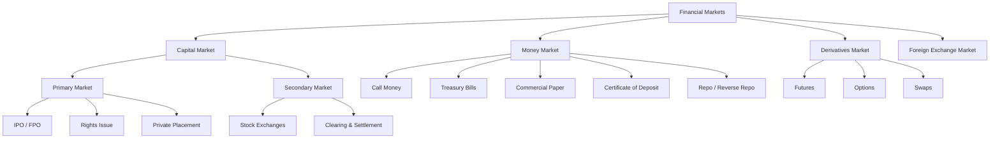
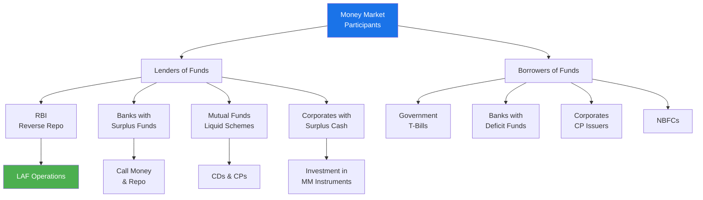

# Chapter 3: Financial Markets & Instruments

## Learning Objectives

By the end of this chapter, you will be able to:
- Differentiate between capital market and money market instruments
- Describe the primary market (IPO, FPO) and secondary market (stock exchanges) functions
- Explain the role and functions of SEBI as the securities market regulator
- Identify different financial instruments: shares, bonds, debentures, derivatives
- Distinguish between futures, options, and swaps
- Understand mutual fund types and the role of IRDA in insurance regulation
- Analyse the IPO process from filing to listing

<!-- Image Gallery -->
<div style="display:flex;flex-wrap:wrap;gap:4px;margin:16px 0;padding:12px;background:#f8fafc;border-radius:8px;border:1px solid #e2e8f0;">
<a href="../../../assets/images/lessons/banking-financial-awareness/03-financial-markets-instruments/hero.svg" target="_blank" rel="noopener">
  
</a>
<a href="../../../assets/images/lessons/banking-financial-awareness/03-financial-markets-instruments/handwritten-notes.svg" target="_blank" rel="noopener">
  
</a>
<a href="../../../assets/images/lessons/banking-financial-awareness/03-financial-markets-instruments/sticky-notes.svg" target="_blank" rel="noopener">
  
</a>
<a href="../../../assets/images/lessons/banking-financial-awareness/03-financial-markets-instruments/visual-explanation.svg" target="_blank" rel="noopener">
  
</a>
<a href="../../../assets/images/lessons/banking-financial-awareness/03-financial-markets-instruments/architecture.svg" target="_blank" rel="noopener">
  
</a>
<a href="../../../assets/images/lessons/banking-financial-awareness/03-financial-markets-instruments/workflow.svg" target="_blank" rel="noopener">
  
</a>
<a href="../../../assets/images/lessons/banking-financial-awareness/03-financial-markets-instruments/mindmap.svg" target="_blank" rel="noopener">
  
</a>
<a href="../../../assets/images/lessons/banking-financial-awareness/03-financial-markets-instruments/comparison.svg" target="_blank" rel="noopener">
  
</a>
<a href="../../../assets/images/lessons/banking-financial-awareness/03-financial-markets-instruments/cheatsheet.svg" target="_blank" rel="noopener">
  
</a>
<a href="../../../assets/images/lessons/banking-financial-awareness/03-financial-markets-instruments/interview-quiz.svg" target="_blank" rel="noopener">
  
</a>
<a href="../../../assets/images/lessons/banking-financial-awareness/03-financial-markets-instruments/social-card.svg" target="_blank" rel="noopener">
  
</a>
</div>
<!-- End Image Gallery -->

---

## Theory

### 3.1 Overview of Financial Markets



### 3.2 Capital Market

The capital market is the market for **long-term funds** (maturity > 1 year). It includes both equity and debt instruments.

#### A. Primary Market

Also called the **New Issue Market**. Securities are issued for the **first time** to investors.

**Methods of issue:**

| Method | Description | Example |
|--------|-------------|---------|
| **IPO (Initial Public Offering)** | First-time sale of shares by a private company to the public | LIC IPO (2022) |
| **FPO (Follow-on Public Offering)** | Subsequent sale of shares by an already-listed company | Yes Bank FPO (2020) |
| **Rights Issue** | Offering shares to **existing shareholders** at a discounted price | SBI Rights Issue (2020) |
| **Bonus Issue** | Free additional shares to existing shareholders (capitalisation of reserves) | TCS Bonus (2023) |
| **Private Placement** | Sale of securities to a select group of institutional investors | QIP, Preferential allotment |
| **Offer for Sale (OFS)** | Promoters sell existing shares to the public | HDFC Bank OFS |

**IPO Process:**


**Key players in an IPO:**
- **Merchant Banker** (Book Running Lead Manager — BRLM): Manages the issue process
- **Underwriter**: Guarantees subscription
- **Registrar**: Manages application processing and allotment
- **Depository**: Facilitates electronic transfer (NSDL/CDSL)
- **Stock exchange**: Provides listing and trading platform

**IPO subscription categories:**

| Category | Allocation | Description |
|----------|------------|-------------|
| Qualified Institutional Buyers (QIBs) | 50% | Mutual funds, FIIs, banks, insurance companies |
| Non-Institutional Investors (NIIs) | 15% | HNIs, corporates (application > ₹2 lakh) |
| Retail Individual Investors (RIIs) | 35% | Individuals applying for ≤ ₹2 lakh |

**Pricing methods:**
- **Fixed Price Issue:** Price is fixed in advance
- **Book Building Issue:** Price discovered through investor bids within a band

#### B. Secondary Market

The market where **already-issued securities** are traded among investors. The issuing company does not receive any money from secondary market transactions.

**Participants:**
- Stock exchanges (BSE, NSE)
- Clearing corporations (ICCL, NSCCL)
- Depositories (NSDL, CDSL)
- Stockbrokers (Trading Members)
- Custodians

**Stock exchanges in India:**

| Exchange | Established | Index | Key Feature |
|----------|-------------|-------|-------------|
| **BSE** (Bombay Stock Exchange) | 1875 | SENSEX (30 stocks) | Oldest exchange in Asia |
| **NSE** (National Stock Exchange) | 1992 | NIFTY 50 (50 stocks) | Largest by trading volume |
| **Metropolitan Stock Exchange (MSE)** | 2008 | MSE Top 100 | Smaller exchange |

**Key indices:**

| Index | Stocks | Base Year | Base Value |
|-------|--------|-----------|------------|
| SENSEX | 30 | 1978-79 | 100 |
| NIFTY 50 | 50 | 1995 | 1000 |
| NIFTY Bank | 12 | 2000 | 1000 |
| BSE MidCap | Mid-cap | 2005 | 10000 |
| BSE SmallCap | Small-cap | 2005 | 10000 |

**Trading and settlement:**

| Aspect | Current System |
|--------|----------------|
| Trading | T+0 (same day) settlement available; T+1 is standard |
| Settlement cycle | T+1 (trade day + 1) for most trades |
| Clearing | ICCL (BSE) / NSCCL (NSE) — guarantee settlement |
| Trading hours | 9:15 AM to 3:30 PM (Monday to Friday) |

### 3.3 Money Market

The money market deals in **short-term funds** (maturity ≤ 1 year). It provides liquidity management for banks, corporates, and the government.

| Instrument | Maturity | Issuer | Risk | Minimum Amount |
|------------|----------|--------|------|----------------|
| **Call Money** | 1 day to 14 days | Banks | Low | ₹5 crore |
| **Notice Money** | 2 to 14 days | Banks | Low | ₹5 crore |
| **Term Money** | 15 days to 1 year | Banks | Low | ₹5 crore |
| **Treasury Bills (T-Bills)** | 91, 182, 364 days | Government (RBI) | Risk-free | ₹25,000 |
| **Commercial Paper (CP)** | 7 days to 1 year | Corporates | Medium | ₹5 lakh |
| **Certificate of Deposit (CD)** | 7 days to 1 year | Banks/FIs | Low-Medium | ₹5 lakh |
| **Repo/Reverse Repo** | Overnight to 14 days | Banks/RBI | Low | ₹5 crore |

**Treasury Bills:**
- Issued by RBI on behalf of the Government of India
- Sold through **auction** (competitive and non-competitive bidding)
- **Zero-coupon** instruments — issued at discount, redeemed at face value
- **T-bill yield calculation:** `Yield = (Face Value - Issue Price) / Issue Price × (365 / Maturity Days) × 100`

**Commercial Paper:**
- Unsecured, short-term promissory note issued by **high-rated corporates**
- Regulated by RBI under **Section 45W of the RBI Act**
- Requires **credit rating** (minimum A-3 by CRISIL/ICRA/CARE)
- Cannot be issued by NBFCs with CRAR < 12%

**Certificate of Deposit:**
- Negotiable instrument issued by banks/FIs against **bulk deposits**
- Banks can issue CDs of maturity **7 days to 1 year**; FIs can issue **1 year to 3 years**
- Must have minimum credit rating

### 3.4 Securities and Exchange Board of India (SEBI)

Established in **1988** as a non-statutory body; given **statutory status in 1992** through the SEBI Act, 1992.

**Objectives:**
1. Protect the interests of investors in securities
2. Promote the development of the securities market
3. Regulate the securities market

**Functions of SEBI:**

| Category | Functions |
|----------|-----------|
| **Regulatory** | Registration of market intermediaries (brokers, merchant bankers, FIIs, etc.) |
| | Regulation of stock exchanges, mutual funds, and investment advisors |
| | Prohibition of insider trading, fraudulent and unfair trade practices |
| **Developmental** | Investor education and awareness |
| | Promotion of self-regulatory organisations (SROs) |
| | Introduction of new instruments (REITs, InvITs, etc.) |
| **Protective** | Grievance redressal (SCORES platform) |
| | Inspection and audit of intermediaries |
| | Monitoring substantial acquisition of shares and takeovers |

**Key SEBI regulations:**
- **SEBI (ICDR) Regulations, 2018:** Issue of Capital and Disclosure Requirements
- **SEBI (LODR) Regulations, 2015:** Listing Obligations and Disclosure Requirements
- **SEBI (SAST) Regulations, 2011:** Substantial Acquisition of Shares and Takeovers
- **SEBI (PIT) Regulations, 2015:** Prohibition of Insider Trading
- **SEBI (Mutual Funds) Regulations, 1996**
- **SEBI (Alternative Investment Funds) Regulations, 2012**

**SEBI Board Structure:**
- Chairman (nominated by the Government of India)
- 2 members from the Ministry of Finance
- 1 member from RBI
- 5 other members (including at least 3 part-time members)

### 3.5 Financial Instruments

#### A. Equity Shares

Ownership instruments representing a claim on the company's assets and profits.

| Feature | Description |
|---------|-------------|
| Ownership | Shareholders are part-owners of the company |
| Voting rights | Yes (one vote per share) |
| Dividend | Not guaranteed — depends on profits and board decision |
| Risk | Highest — last claim in liquidation |
| Return | Capital appreciation + dividends |

#### B. Preference Shares

Hybrid instruments with features of both equity and debt.

| Type | Feature |
|------|---------|
| Cumulative | Unpaid dividends accumulate |
| Non-cumulative | Dividends do not accumulate if skipped |
| Participating | Additional dividend beyond fixed rate |
| Redeemable | Company can buy back after a specified period |
| Convertible | Can be converted into equity shares |

#### C. Bonds / Debentures

Debt instruments where the issuer borrows from investors and pays periodic interest (coupon).

| Feature | Bond | Debenture |
|---------|------|-----------|
| Security | Secured against assets | Usually unsecured |
| Issuer | Government, PSUs, corporates | Corporates |
| Risk | Lower (secured) | Higher (unsecured) |
| Coupon | Fixed or floating | Fixed or floating |
| Maturity | Short to long term | Medium to long term |

**Types of bonds in India:**
- **Government Securities (G-Secs):** Issued by Central/State governments — risk-free
- **Corporate Bonds:** Issued by companies — credit rated
- **Tax-free Bonds:** Interest income is tax-free (e.g., NHAI, PFC, IRFC bonds)
- **Zero Coupon Bonds:** Issued at discount, redeemed at par
- **Floating Rate Bonds:** Coupon linked to a benchmark rate (T-bill yield, etc.)
- **Masala Bonds:** Rupee-denominated bonds issued in overseas markets
- **Green Bonds:** Proceeds used for environmentally sustainable projects
- **Sovereign Gold Bonds (SGBs):** Denominated in grams of gold; issued by RBI

#### D. Derivatives

Financial contracts whose value is derived from an **underlying asset** (stock, index, commodity, currency, interest rate).

| Derivative | Description |
|------------|-------------|
| **Forward** | Customised OTC contract to buy/sell at a future date at a predetermined price |
| **Future** | Standardised exchange-traded contract with daily mark-to-market settlement |
| **Option (Call)** | Right (not obligation) to **buy** underlying at strike price before/at expiry |
| **Option (Put)** | Right (not obligation) to **sell** underlying at strike price before/at expiry |
| **Swap** | Exchange of cash flows between two parties (interest rate swaps, currency swaps) |

**Key derivative concepts:**

| Term | Meaning |
|------|---------|
| Spot Price | Current market price of the underlying |
| Strike Price | Price at which the option can be exercised |
| Premium | Price paid to buy an option |
| Expiry | Last date for exercising the option/future |
| In-the-Money (ITM) | Option has intrinsic value |
| At-the-Money (ATM) | Strike price equals spot price |
| Out-of-the-Money (OTM) | Option has no intrinsic value |

**Derivative exchanges in India:**
- **NSE** — NIFTY and stock futures/options
- **BSE** — SENSEX and stock derivatives
- **MCX** — Commodity derivatives
- **NCDEX** — Agricultural commodity derivatives

### 3.6 Mutual Funds

A **trust** that pools money from multiple investors and invests in a diversified portfolio of securities.

```mermaid
flowchart TD
    A[Investors] --> B[Asset Management<br/>Company AMC]
    B --> C[Mutual Fund<br/>Scheme / Trust]
    C --> D[Equity]
    C --> E[Debt]
    C --> F[Money Market]
    C --> G[Hybrid]
    C --> H[Other Assets]
    
    B --> I[Registrar &<br/>Transfer Agent]
    I --> J[Unit Holders<br/>(Investors)]
    
    K[Custodian] --> C
    L[Auditor] --> C
    M[SEBI<br/>Regulator] -.-> B
```

**Types of mutual funds:**

| Classification | Types |
|----------------|-------|
| **By Asset Class** | Equity funds, Debt funds, Hybrid funds, Money Market funds, Gold ETFs, REITs |
| **By Structure** | Open-ended (continuous subscription/redemption), Close-ended (fixed maturity) |
| **By Objective** | Growth, Income, Balanced, Tax-saving (ELSS with 3-year lock-in), Index funds |

**Key mutual fund concepts:**

| Term | Definition |
|------|------------|
| **NAV (Net Asset Value)** | Per-unit market value of the fund's assets (Assets — Liabilities) / Units outstanding |
| **AUM (Assets Under Management)** | Total market value of assets managed by the fund |
| **Expense Ratio** | Annual fee charged by AMC as % of AUM (capped by SEBI: 1.05–2.25%) |
| **Load** | Entry/Exit fee (SEBI banned entry load in 2009) |
| **SIP (Systematic Investment Plan)** | Fixed periodic investment in a mutual fund |
| **SWP (Systematic Withdrawal Plan)** | Periodic withdrawal of fixed amount |
| **STP (Systematic Transfer Plan)** | Periodic transfer from one scheme to another |

**Top Asset Management Companies (AMCs):** SBI Mutual Fund, ICICI Prudential Mutual Fund, HDFC Mutual Fund, Nippon India Mutual Fund, Kotak Mahindra Mutual Fund.

### 3.7 Insurance Regulatory and Development Authority (IRDA)

Established in **1999** under the IRDA Act, 1999. Headquarters in **Hyderabad**.

**Role:** Regulates and promotes the insurance industry in India.

| Aspect | Details |
|--------|---------|
| Life Insurance | LIC (public), 24 private players |
| General Insurance | Public (4 companies) + Private + Standalone health insurers |
| IRDA Act | 1999 — established IRDA as regulator |
| Insurance penetration | ~4% of GDP (life ~3%, non-life ~1%) |

**Types of insurance:**
1. **Life Insurance:** Term plan, endowment, ULIP, whole life, money-back, pension/annuity
2. **General Insurance:** Health, motor, travel, home, fire, marine, liability
3. **Health Insurance:** Mediclaim, critical illness, top-up, super top-up

**Key regulations by IRDA:**
- Solvency margin: Insurers must maintain minimum solvency ratio of **150%**
- **File and Use** system for product approval
- Mandatory coverage for third-party motor insurance
- **Insurance Ombudsman** for grievance redressal

### 3.8 Recent Developments in Indian Financial Markets

- **REITs** (Real Estate Investment Trusts) and **InvITs** (Infrastructure Investment Trusts) introduced from 2019
- **T+1 settlement** introduced in January 2023 (shortened from T+2)
- **Same-day settlement (T+0)** optional for select scrips since 2024
- **SEBI's ASBA (Application Supported by Blocked Amount)** — mandate for IPO applications since 2016
- **UPI-based IPO applications** introduced in 2018
- **Social Stock Exchange** (SSE) launched by SEBI in 2023 for social enterprises
- **FDI in insurance** raised to 74% in 2021

---

## Examples with Solved Exercises

### Example 1: IPO Subscription Calculator

```typescript
interface IPOSubscription {
  issueName: string;
  issueSize: number;
  qibDemand: number;
  niiDemand: number;
  riiDemand: number;
  totalDemand: number;
  subscriptionRate: number;
}

function calculateIPOSubscription(
  name: string,
  issueSize: number,
  qibDemand: number,
  niiDemand: number,
  riiDemand: number
): IPOSubscription {
  const totalDemand = qibDemand + niiDemand + riiDemand;
  const subscriptionRate = (totalDemand / issueSize) * 100;

  return {
    issueName: name,
    issueSize,
    qibDemand,
    niiDemand,
    riiDemand,
    totalDemand,
    subscriptionRate: Math.round(subscriptionRate * 100) / 100,
  };
}

const ipo = calculateIPOSubscription("XYZ Infra IPO", 10000000, 15000000, 8000000, 12000000);
console.log(`Total Subscription: ${ipo.subscriptionRate}%x (${ipo.issueName})`);
// Output: Total Subscription: 350% (XYZ Infra IPO)
```

**Q1.** In an IPO, what percentage of the issue is reserved for Qualified Institutional Buyers (QIBs)?

a) 35% b) 50% c) 15% d) 10%

<details>
<summary>Answer</summary>
**Answer:** b) 50%

Under SEBI's ICDR regulations, 50% of an IPO is reserved for QIBs, 15% for Non-Institutional Investors (NIIs), and 35% for Retail Individual Investors (RIIs).
</details>

---

**Q2.** Which of the following is a money market instrument?

a) Equity shares b) Commercial Paper c) Debentures d) Preference shares

<details>
<summary>Answer</summary>
**Answer:** b) Commercial Paper

Money market instruments have maturity ≤ 1 year. CP is a short-term unsecured promissory note issued by corporates. Equity shares, debentures, and preference shares are capital market instruments.
</details>

---

**Q3.** SEBI was given statutory status in which year?

a) 1988 b) 1992 c) 1995 d) 2000

<details>
<summary>Answer</summary>
**Answer:** b) 1992

SEBI was established in 1988 as a non-statutory body and was given statutory powers through the SEBI Act, 1992.
</details>

---

### Example 2: Bond Yield Calculator

```typescript
interface BondYieldResult {
  faceValue: number;
  couponRate: number;
  marketPrice: number;
  maturityYears: number;
  currentYield: number;
  ytm: number;
}

function calculateBondYield(
  faceValue: number,
  couponRate: number,
  marketPrice: number,
  maturityYears: number
): BondYieldResult {
  const annualCoupon = faceValue * (couponRate / 100);
  const currentYield = (annualCoupon / marketPrice) * 100;

  // Approximate YTM using formula
  const capitalGain = (faceValue - marketPrice) / maturityYears;
  const averagePrice = (faceValue + marketPrice) / 2;
  const ytm = ((annualCoupon + capitalGain) / averagePrice) * 100;

  return {
    faceValue,
    couponRate,
    marketPrice,
    maturityYears,
    currentYield: Math.round(currentYield * 100) / 100,
    ytm: Math.round(ytm * 100) / 100,
  };
}

const bond = calculateBondYield(1000, 8.5, 980, 5);
console.log(`Current Yield: ${bond.currentYield}%, YTM: ${bond.ytm}%`);
// Output: Current Yield: 8.67%, YTM: 9.09%
```

**Q4.** What type of instrument is a Treasury Bill?

a) Coupon-bearing instrument b) Zero-coupon instrument c) Variable interest instrument d) Equity instrument

<details>
<summary>Answer</summary>
**Answer:** b) Zero-coupon instrument

T-Bills are issued at a discount to face value and redeemed at par. The difference between the issue price and face value represents the return (no periodic coupon payments).
</details>

---

**Q5.** Which of the following is NOT a function of SEBI?

a) Registering stockbrokers b) Regulating mutual funds c) Setting repo rate d) Prohibiting insider trading

<details>
<summary>Answer</summary>
**Answer:** c) Setting repo rate

Setting the repo rate is a monetary policy function of RBI, not SEBI. SEBI regulates securities markets, registers intermediaries, and prohibits insider trading.
</details>

---

**Q6.** What does NAV stand for in mutual funds?

a) Net Asset Value b) National Asset Value c) Net Accrued Value d) Non-Asset Value

<details>
<summary>Answer</summary>
**Answer:** a) Net Asset Value

NAV = (Market value of assets — Liabilities) / Number of outstanding units. It represents the per-unit market value of the mutual fund scheme.
</details>

---

### Example 3: Futures and Options Payoff Calculator

```typescript
interface OptionPayoff {
  type: 'Call' | 'Put';
  strikePrice: number;
  spotPrice: number;
  premium: number;
  buyPayoff: number;
  sellPayoff: number;
  isITM: boolean;
}

function calculateOptionPayoff(
  optionType: 'Call' | 'Put',
  strikePrice: number,
  spotPrice: number,
  premium: number
): OptionPayoff {
  let intrinsicValue: number;
  if (optionType === 'Call') {
    intrinsicValue = Math.max(0, spotPrice - strikePrice);
  } else {
    intrinsicValue = Math.max(0, strikePrice - spotPrice);
  }
  const buyPayoff = intrinsicValue - premium;
  const sellPayoff = premium - intrinsicValue;

  return {
    type: optionType,
    strikePrice,
    spotPrice,
    premium,
    buyPayoff: Math.round(buyPayoff * 100) / 100,
    sellPayoff: Math.round(sellPayoff * 100) / 100,
    isITM: intrinsicValue > 0,
  };
}

const call = calculateOptionPayoff('Call', 25000, 25800, 350);
console.log(`Call Buyer Payoff: ₹${call.buyPayoff} (ITM: ${call.isITM})`);
// Output: Call Buyer Payoff: ₹450 (ITM: true)
```

**Q7.** In an options contract, the buyer of a **Call Option** has the:

a) Obligation to buy the underlying b) Right to buy the underlying c) Obligation to sell the underlying d) Right to sell the underlying

<details>
<summary>Answer</summary>
**Answer:** b) Right to buy the underlying

A Call Option gives the buyer the **right, but not the obligation**, to buy the underlying asset at the strike price. The seller (writer) has the obligation to sell if the option is exercised.
</details>

---

**Q8.** What is the maturity period for Certificate of Deposit issued by banks?

a) 7 days to 1 year b) 1 year to 3 years c) 1 day to 14 days d) 91 days to 364 days

<details>
<summary>Answer</summary>
**Answer:** a) 7 days to 1 year

Banks can issue CDs for maturity between 7 days and 1 year. Financial Institutions (FIs) can issue for 1-3 years. CDs are issued at a discount to face value.
</details>

---

**Q9.** The NSE was established in which year?

a) 1875 b) 1992 c) 1995 d) 2000

<details>
<summary>Answer</summary>
**Answer:** b) 1992

The National Stock Exchange was established in 1992 as the first screen-based, electronic exchange in India. It commenced trading in 1994.
</details>

---

**Q10.** Under SEBI's PIT Regulations, what constitutes "insider trading"?

a) Buying shares at a discount b) Trading in securities while in possession of unpublished price-sensitive information c) Selling shares through a broker d) Holding shares for more than 1 year

<details>
<summary>Answer</summary>
**Answer:** b) Trading in securities while in possession of unpublished price-sensitive information

Insider trading is the practice of trading a public company's stock based on material, non-public information. SEBI (PIT) Regulations, 2015 prohibit this.
</details>

---

### Example 4: Mutual Fund SIP Calculator

```typescript
interface SIPResult {
  monthlyInvestment: number;
  annualReturn: number;
  months: number;
  totalInvestment: number;
  totalValue: number;
  totalReturns: number;
}

function calculateSIP(
  monthlyAmount: number,
  annualReturnPercent: number,
  months: number
): SIPResult {
  const monthlyRate = annualReturnPercent / 12 / 100;
  let totalValue = 0;

  for (let i = 0; i < months; i++) {
    totalValue = (totalValue + monthlyAmount) * (1 + monthlyRate);
  }

  const totalInvestment = monthlyAmount * months;
  const totalReturns = totalValue - totalInvestment;

  return {
    monthlyInvestment: monthlyAmount,
    annualReturn: annualReturnPercent,
    months,
    totalInvestment: Math.round(totalInvestment),
    totalValue: Math.round(totalValue),
    totalReturns: Math.round(totalReturns),
  };
}

const sip = calculateSIP(10000, 12, 120);
console.log(`Invested: ₹${sip.totalInvestment}, Final Value: ₹${sip.totalValue}, Returns: ₹${sip.totalReturns}`);
// Output: Invested: ₹1200000, Final Value: ₹2295297, Returns: ₹1095297
```

**Q11.** What is the full form of IRDA?

a) Insurance Regulatory and Development Authority b) Indian Regulatory and Development Authority c) Insurance Regulation and Development Association d) Institute for Regulatory and Development of Insurance

<details>
<summary>Answer</summary>
**Answer:** a) Insurance Regulatory and Development Authority

IRDA was established in 1999 under the IRDA Act. It is headquartered in Hyderabad and regulates the insurance sector in India.
</details>

---

**Q12.** Which of the following is a derivative instrument?

a) Treasury Bill b) Commercial Paper c) Futures d) Certificate of Deposit

<details>
<summary>Answer</summary>
**Answer:** c) Futures

Futures are standardised exchange-traded derivative contracts where parties agree to buy/sell an asset at a predetermined future date and price. The other three are money market instruments.
</details>

---

**Q13.** The IRDA Act was passed in which year?

a) 1992 b) 1999 c) 2000 d) 2005

<details>
<summary>Answer</summary>
**Answer:** b) 1999

The Insurance Regulatory and Development Authority Act was passed in 1999, leading to the establishment of IRDA as the insurance sector regulator.
</details>

---

**Q14.** SENSEX is an index of which stock exchange?

a) NSE b) BSE c) MCX d) MSE

<details>
<summary>Answer</summary>
**Answer:** b) BSE

SENSEX (Sensitivity Index) is the benchmark index of BSE, comprising 30 well-established and financially sound companies.
</details>

---

**Q15.** What is the minimum credit rating required for issuing Commercial Paper?

a) AA- b) A-3 c) BBB- d) AAA

<details>
<summary>Answer</summary>
**Answer:** b) A-3

RBI requires CP issuers to have a minimum credit rating of A-3 from rating agencies (CRISIL, ICRA, CARE, etc.). Unsecured CPs must not have a tenure exceeding 1 year.
</details>

---

### Example 5: Share Market Calculator

```typescript
interface TradeProfit {
  buyPrice: number;
  sellPrice: number;
  quantity: number;
  brokeragePercent: number;
  sttPercent: number;
  totalCost: number;
  totalProceeds: number;
  netProfit: number;
  returnPercent: number;
}

function calculateTradeProfit(
  buyPrice: number,
  sellPrice: number,
  quantity: number,
  brokeragePercent: number,
  sttPercent: number
): TradeProfit {
  const buyValue = buyPrice * quantity;
  const sellValue = sellPrice * quantity;
  const brokerage = (buyValue + sellValue) * (brokeragePercent / 100);
  const stt = sellValue * (sttPercent / 100);
  const totalCost = buyValue + brokerage + stt;
  const totalProceeds = sellValue - brokerage - stt;
  const netProfit = totalProceeds - buyValue;
  const returnPercent = (netProfit / buyValue) * 100;

  return {
    buyPrice,
    sellPrice,
    quantity,
    brokeragePercent,
    sttPercent,
    totalCost: Math.round(totalCost),
    totalProceeds: Math.round(totalProceeds),
    netProfit: Math.round(netProfit),
    returnPercent: Math.round(returnPercent * 100) / 100,
  };
}

const trade = calculateTradeProfit(150, 165, 100, 0.5, 0.1);
console.log(`Profit: ₹${trade.netProfit}, Return: ${trade.returnPercent}%`);
// Output: Profit: ₹1327.5, Return: 8.85%
```

**Q16.** Which of the following is an example of a derivative traded on Indian stock exchanges?

a) Sovereign Gold Bond b) NIFTY Futures c) Treasury Bill d) Commercial Paper

<details>
<summary>Answer</summary>
**Answer:** b) NIFTY Futures

NIFTY Futures are exchange-traded derivative contracts based on the NIFTY 50 index, traded on NSE. SGBs, T-Bills, and CP are not derivatives.
</details>

---

**Q17.** Under SEBI's ICDR regulations, what is the retail category in an IPO?

a) Applications up to ₹50,000 b) Applications up to ₹2,00,000 c) Applications up to ₹5,00,000 d) Applications up to ₹10,00,000

<details>
<summary>Answer</summary>
**Answer:** b) Applications up to ₹2,00,000

Retail Individual Investors (RIIs) are defined as investors applying for shares with a total value of up to ₹2,00,000 in an IPO. This category gets 35% reservation.
</details>

---

**Q18.** What is the minimum solvency margin required for insurance companies under IRDA?

a) 100% b) 150% c) 200% d) 250%

<details>
<summary>Answer</summary>
**Answer:** b) 150%

Insurance companies in India must maintain a minimum solvency ratio of 150% (i.e., assets must exceed liabilities by at least 50%).
</details>

---

**Q19.** Which organisation acts as the clearing corporation for NSE?

a) ICCL b) NSCCL c) CDSL d) CCIL

<details>
<summary>Answer</summary>
**Answer:** b) NSCCL

National Securities Clearing Corporation Ltd (NSCCL) is the clearing corporation for NSE, providing clearing and settlement services and guaranteeing trade settlement.
</details>

---

**Q20.** In a Rights Issue, shares are offered to:

a) General public b) Foreign investors c) Existing shareholders d) Institutional investors only

<details>
<summary>Answer</summary>
**Answer:** c) Existing shareholders

A Rights Issue gives existing shareholders the right to purchase additional shares in proportion to their current holdings, usually at a discounted price.
</details>

---

**Q21.** IMPS (Immediate Payment Service) was launched in which year?

a) 2005
b) 2010
c) 2016
d) 2019

<details>
<summary>Answer</summary>
**Answer:** b) 2010

IMPS was launched by NPCI in 2010 as India's first real-time interbank funds transfer system operating 24x7.
</details>

---

**Q22.** Which of the following exchanges regulates commodity derivatives in India?

a) Only NSE
b) Only BSE
c) MCX and NCDEX
d) Only NCDEX

<details>
<summary>Answer</summary>
**Answer:** c) MCX and NCDEX

MCX (Multi Commodity Exchange) and NCDEX (National Commodity & Derivatives Exchange) are the primary commodity exchanges in India. SEBI regulates them since 2015.
</details>

---

**Q23.** What is the minimum transaction amount for RTGS?

a) ₹1
b) ₹50,000
c) ₹1,00,000
d) ₹2,00,000

<details>
<summary>Answer</summary>
**Answer:** d) ₹2,00,000

RTGS (Real Time Gross Settlement) requires a minimum transaction amount of ₹2 lakh. NEFT has no minimum limit. IMPS has a maximum of ₹5 lakh per transaction.
</details>

---

**Q24.** Which organisation regulates commodity derivatives market in India?

a) RBI
b) SEBI
c) IRDA
d) Forward Markets Commission

<details>
<summary>Answer</summary>
**Answer:** b) SEBI

Since September 2015, SEBI regulates the commodity derivatives market in India, after the Forward Markets Commission (FMC) was merged with SEBI.
</details>

---

**Q25.** A bond with a face value of ₹100, coupon rate of 8%, and market price of ₹90 will have a current yield of approximately:

a) 7.2%
b) 8.0%
c) 8.9%
d) 10.0%

<details>
<summary>Answer</summary>
**Answer:** c) 8.9%

Current Yield = (Annual Coupon / Market Price) × 100 = (8 / 90) × 100 = 8.89%. Since the bond is trading at a discount (< face value), the current yield exceeds the coupon rate.
</details>

---

**Q26.** In the stock market, a company with a market capitalisation rank between 101 and 250 is classified as:

a) Large Cap
b) Mid Cap
c) Small Cap
d) Micro Cap

<details>
<summary>Answer</summary>
**Answer:** b) Mid Cap

As per SEBI classification: Large Cap = Top 100 companies, Mid Cap = 101st to 250th company, Small Cap = 251st onwards.
</details>

---

**Q27.** The bond price and yield share which type of relationship?

a) Direct relationship
b) Inverse relationship
c) No relationship
d) Exponential relationship

<details>
<summary>Answer</summary>
**Answer:** b) Inverse relationship

Bond prices and yields move in opposite directions. When bond prices rise, yields fall, and vice versa.
</details>

---

**Q28.** A market order in stock trading means:

a) Buy/sell at a specified price
b) Buy/sell at the current market price immediately
c) Buy/sell only at the closing price
d) Buy/sell after a price trigger

<details>
<summary>Answer</summary>
**Answer:** b) Buy/sell at the current market price immediately

A market order is executed immediately at the best available current price. A limit order is executed at a specified price. A stop-loss triggers a market order when price crosses a threshold.
</details>

---

**Q29.** The MMID (Mobile Money Identifier) used in IMPS transactions is how many digits long?

a) 4-digit
b) 6-digit
c) 7-digit
d) 10-digit

<details>
<summary>Answer</summary>
**Answer:** c) 7-digit

MMID is a 7-digit code assigned by banks to customers for IMPS transactions. It links the customer's mobile number to their bank account for mobile-based fund transfers.
</details>

---

**Q30.** Which of the following is an example of a Zero-Coupon Bond in India?

a) Corporate Bond
b) G-Sec dated security
c) Treasury Bill
d) Sovereign Gold Bond

<details>
<summary>Answer</summary>
**Answer:** c) Treasury Bill

T-Bills are zero-coupon instruments — issued at a discount to face value and redeemed at par with no periodic interest payments. G-Secs, corporate bonds, and SGBs pay periodic coupon interest.
</details>

---

## TypeScript Example: Portfolio Tracker

```typescript
interface Holding {
  symbol: string;
  quantity: number;
  buyPrice: number;
  currentPrice: number;
}

interface PortfolioSummary {
  holdings: Holding[];
  totalInvestment: number;
  currentValue: number;
  totalPL: number;
  totalReturnPercent: number;
  sectorAllocation: Record<string, number>;
}

function analysePortfolio(holdings: Holding[]): PortfolioSummary {
  let totalInvestment = 0;
  let currentValue = 0;
  const sectorAllocation: Record<string, number> = {};

  for (const h of holdings) {
    const invested = h.quantity * h.buyPrice;
    const current = h.quantity * h.currentPrice;
    totalInvestment += invested;
    currentValue += current;
  }

  const totalPL = currentValue - totalInvestment;
  const totalReturnPercent = (totalPL / totalInvestment) * 100;

  return {
    holdings,
    totalInvestment: Math.round(totalInvestment),
    currentValue: Math.round(currentValue),
    totalPL: Math.round(totalPL),
    totalReturnPercent: Math.round(totalReturnPercent * 100) / 100,
    sectorAllocation,
  };
}

const portfolio = analysePortfolio([
  { symbol: "RELIANCE", quantity: 50, buyPrice: 2500, currentPrice: 2850 },
  { symbol: "TCS", quantity: 20, buyPrice: 3200, currentPrice: 3400 },
  { symbol: "HDFCBANK", quantity: 100, buyPrice: 1450, currentPrice: 1620 },
]);

console.log(`Invested: ₹${portfolio.totalInvestment}, Value: ₹${portfolio.currentValue}`);
console.log(`P&L: ₹${portfolio.totalPL} (${portfolio.totalReturnPercent}%)`);
// Output: Invested: ₹334000, Value: ₹379000
// Output: P&L: ₹45000 (13.47%)
```

---

### 3.9 Money Market — Detailed Characteristics

The money market is the market for **short-term funds** (maturity ≤ 1 year) with high liquidity and low risk.

| Characteristic | Description |
|----------------|-------------|
| **Maturity** | Overnight to 1 year |
| **Risk** | Low (especially government instruments) |
| **Liquidity** | Very high — instruments can be easily sold |
| **Participants** | RBI, Banks, Mutual Funds, Corporates, FIIs, Insurance Companies |
| **Regulation** | RBI (for most instruments) + SEBI (for money market mutual funds) |
| **Purpose** | Liquidity management, short-term borrowing/lending |
| **Minimum amount** | High denominations (₹5 lakh to ₹5 crore) |



### 3.10 IMPS — Immediate Payment Service

**IMPS (Immediate Payment Service)** was launched by **NPCI** in **2010** as India's first real-time interbank electronic funds transfer system operating 24×7.

| Feature | IMPS | NEFT | RTGS |
|---------|------|------|------|
| **Launch Year** | 2010 | 2005 | 2004 |
| **Settlement** | Real-time | Deferred (batched) | Real-time |
| **Minimum Amount** | ₹1 | ₹1 | ₹2 lakh |
| **Maximum Amount** | ₹5 lakh (per transaction) | No limit | No limit |
| **Availability** | 24×7 | 24×7 (since Dec 2019) | 24×7 (since Dec 2020) |
| **Speed** | Instant (seconds) | Up to 2 hours (batches) | Instant |
| **Channel** | Mobile, Internet, ATM, SMS | Internet, Mobile, Branch | Internet, Branch |

**MMID (Mobile Money Identifier):** A 7-digit code used in IMPS transactions to identify the beneficiary's bank account and mobile number.

### 3.11 Commodity Markets

Commodity markets in India are regulated by the **Securities and Exchange Board of India (SEBI)** since September 2015 (merged from Forward Markets Commission).

| Exchange | Established | Commodities Traded |
|----------|-------------|-------------------|
| **MCX (Multi Commodity Exchange)** | 2003 | Bullion (gold, silver), base metals (copper, zinc), energy (crude oil, natural gas) |
| **NCDEX (National Commodity & Derivatives Exchange)** | 2003 | Agricultural commodities (soybean, chana, jeera, cotton, guar) |
| **ICEX (Indian Commodity Exchange)** | 2009 | Bullion, base metals |

**Types of commodity derivatives:**
- **Futures:** Most common; traders take positions on future prices
- **Options:** Introduced on select commodities (gold, silver) in 2017
- **Forward contracts:** Over-the-counter, customised

**Key regulations:**
- **Warehouse Receipts:** Negotiable instruments (after Warehousing Development and Regulatory Authority — WDRA registration)
- **Options in commodities:** Permitted since 2017 — European-style options on select commodities
- **Commodity indices:** MCX iCOMDEX series for benchmarking

### 3.12 Bond Market — Deep Dive

The Indian bond market is one of the largest in Asia, dominated by **Government Securities (G-Secs)** .

| Bond Type | Issuer | Risk | Coupon | Tenure |
|-----------|--------|------|--------|--------|
| **G-Secs (Dated)** | Central Government | Sovereign | Fixed/floating | 5-40 years |
| **State Development Loans (SDLs)** | State Governments | Sovereign | Fixed | 5-30 years |
| **Treasury Bills** | Central Government | Sovereign | Zero-coupon | Up to 364 days |
| **Corporate Bonds** | Corporates | Credit risk | Fixed/floating | 1-20 years |
| **Municipal Bonds** | Urban Local Bodies | Low-medium | Fixed | 3-10 years |
| **Green Bonds** | Sovereign/Corporate | Sovereign/corporate | Fixed | 5-20 years |

**Bond yield and price relationship:**
```
Bond Price ↑ → Yield ↓ (inverse relationship)
```

**Key bond market participants:**
- **Primary Dealers (PDs):** Underwrite G-Sec auctions
- **Foreign Portfolio Investors (FPIs):** Permitted in G-Secs (limits set by RBI)
- **Insurance companies and Pension Funds:** Major holders of long-term bonds
- **Mutual Funds:** Hold for liquidity and yield

### 3.13 Stock Market — Key Concepts

| Concept | Explanation |
|---------|-------------|
| **Market Capitalisation** | Total market value = Share Price × Outstanding Shares |
| **Dividend Yield** | (Annual Dividend / Share Price) × 100 |
| **P/E Ratio** | Price / Earnings per Share — valuation metric |
| **Book Value** | Net Assets / Outstanding Shares |
| **Earnings Per Share (EPS)** | Net Profit / Outstanding Shares |
| **Market Order** | Buy/sell at current market price — immediate execution |
| **Limit Order** | Buy/sell at specified price — may not execute |
| **Stop Loss** | Triggers market order when price crosses a threshold |
| **Circuit Breaker** | Trading halt when index moves beyond preset limits (10%, 15%, 20%) |

**Market capitalisation categories (as per SEBI):**
| Category | Ranking | Market Cap Threshold |
|----------|---------|---------------------|
| **Large Cap** | 1-100 | Top 100 companies by market cap |
| **Mid Cap** | 101-250 | 101st to 250th company |
| **Small Cap** | 251 onwards | Beyond 250th rank |

### 3.14 SBI PO / IBPS SO / RBI Grade B Exam Tips for Financial Markets

| Exam | Key Topics | Strategy |
|------|-----------|----------|
| **RBI Grade B** | Money market instruments and their maturities, SEBI functions, bond yields, derivatives, IRDA norms | Create a maturity matrix for all instruments; study recent SEBI regulations |
| **SBI PO** | IPO process and categories, stock exchanges, mutual fund types, insurance, T+1 settlement | Focus on numerical problems (yield, NAV, SIP returns); memorise launch years |
| **IBPS SO** | SEBI regulations (ICDR, LODR, PIT), derivatives basics, commodity exchanges, bond types | Practice option payoff calculations; compare capital vs money market instruments |
| **Common tips** | Know the difference between all instrument types; memorise years (SEBI, IRDA, NSE, BSE); understand the IPO book-building process | Use mnemonics for IPO allocation percentages (50-15-35 for QIB-NII-RII) |

---

## TypeScript Example: Bond Portfolio Yield Calculator

```typescript
interface BondHolding {
  faceValue: number;
  couponRate: number;
  marketPrice: number;
  maturityYears: number;
  quantity: number;
}

interface BondPortfolioResult {
  bonds: BondHolding[];
  totalInvestment: number;
  weightedAverageCoupon: number;
  weightedAverageYTM: number;
  annualIncome: number;
}

function analyseBondPortfolio(holdings: BondHolding[]): BondPortfolioResult {
  let totalInvestment = 0;
  let totalAnnualIncome = 0;
  let totalWeightYTM = 0;

  for (const h of holdings) {
    const investment = h.marketPrice * h.quantity;
    totalInvestment += investment;
    const annualCoupon = h.faceValue * (h.couponRate / 100) * h.quantity;
    totalAnnualIncome += annualCoupon;

    // Approximate YTM
    const capitalGain = (h.faceValue - h.marketPrice) / h.maturityYears;
    const avgPrice = (h.faceValue + h.marketPrice) / 2;
    const ytm = ((h.faceValue * (h.couponRate / 100) + capitalGain) / avgPrice) * 100;
    totalWeightYTM += ytm * investment;
  }

  return {
    bonds: holdings,
    totalInvestment: Math.round(totalInvestment),
    weightedAverageCoupon: Math.round((totalAnnualIncome / totalInvestment) * 10000) / 100,
    weightedAverageYTM: Math.round((totalWeightYTM / totalInvestment) * 100) / 100,
    annualIncome: Math.round(totalAnnualIncome),
  };
}

const bondPortfolio = analyseBondPortfolio([
  { faceValue: 100, couponRate: 7.5, marketPrice: 98, maturityYears: 5, quantity: 100 },
  { faceValue: 100, couponRate: 8.2, marketPrice: 102, maturityYears: 10, quantity: 50 },
  { faceValue: 100, couponRate: 6.8, marketPrice: 95, maturityYears: 3, quantity: 200 },
]);

console.log(`Investment: ₹${bondPortfolio.totalInvestment}, Annual Income: ₹${bondPortfolio.annualIncome}`);
console.log(`Avg Coupon: ${bondPortfolio.weightedAverageCoupon}%, Avg YTM: ${bondPortfolio.weightedAverageYTM}%`);
```

---

## Summary

- **Capital market** deals in long-term securities through the primary (IPO/FPO) and secondary (stock exchanges) markets.
- **Money market** instruments (Call Money, T-Bills, CP, CD) have maturity ≤ 1 year and are used for short-term liquidity management.
- **SEBI** is the securities market regulator, established in 1988 and given statutory status in 1992. Key functions include regulating intermediaries, prohibiting insider trading, and investor protection.
- **Financial instruments** include equity shares (ownership), preference shares (hybrid), bonds/debentures (debt), and derivatives (futures, options, swaps).
- **BSE** (established 1875) is Asia's oldest stock exchange; **NSE** (established 1992) is India's largest by trading volume.
- **Mutual funds** pool investor money into a diversified portfolio managed by an AMC. NAV is the per-unit value. Types include equity, debt, hybrid, and ELSS funds.
- **IRDA** (established 1999) regulates the insurance sector. Mandates minimum solvency margin of 150%.
- **Derivatives** include forwards (customised OTC), futures (standardised exchange-traded), options (right to buy/sell), and swaps (cash flow exchange).
- **Trading settled on T+1** basis since January 2023. ASBA (blocked amount) is mandatory for IPO applications.

---

## Practical Takeaways

| Exam Topic | Key Fact | Mnemonic / Tip |
|------------|----------|----------------|
| SEBI Established / Statutory | 1988 / 1992 | "SEBI started in '88, got power in '92" |
| IPO Allocation | QIB 50% / NII 15% / RII 35% | "QIB = Half (50), RII = 35, Rest = NII 15" |
| Money Market | ≤ 1 year | "Money = Short (1 year max)" |
| T-Bill Maturities | 91, 182, 364 days | "3 months, 6 months, 12 months" |
| IRDA Year | 1999 | "IRDA = 1999 (just before 2000)" |
| NSE / BSE | NSE = 1992, BSE = 1875 | "NSE New (1992), BSE Old (1875)" |
| Derivatives | Futures (obligation) / Options (right) | "Future = Must transact, Option = Choice" |
| Mutual Fund Load | Entry load banned (2009) | "SEBI: No entry fee since 2009" |
| T+1 Settlement | From Jan 2023 | "T+1 = Next day settlement" |
| Insurance Solvency | 150% | "Insurance must have 50% extra assets" |

---

## Chapter Quiz

**Q1.** What is the QIB reservation percentage in an IPO?

a) 15% b) 35% c) 50% d) 60%

<details>
<summary>Show Answer</summary>

**Answer:** c) 50%

Qualified Institutional Buyers (QIBs) get 50% reservation in an IPO. Retail gets 35%, and Non-Institutional Investors get 15%.
</details>

---

**Q2.** Which of the following is a money market instrument with a maximum maturity of 364 days?

a) Commercial Paper b) Corporate Bond c) Treasury Bill d) Equity Share

<details>
<summary>Show Answer</summary>

**Answer:** c) Treasury Bill

T-Bills are issued for 91, 182, or 364 days. They are zero-coupon instruments sold at a discount and redeemed at par value.
</details>

---

**Q3.** The Securities and Exchange Board of India was given statutory status in:

a) 1988 b) 1990 c) 1992 d) 1995

<details>
<summary>Show Answer</summary>

**Answer:** c) 1992

SEBI was established as a non-statutory body in 1988. The SEBI Act of 1992 gave it statutory powers to regulate the securities market.
</details>

---

**Q4.** In a futures contract, the buyer has:

a) The right but not obligation to buy
b) The obligation to buy at expiry
c) The right to choose delivery date
d) No obligation to perform

<details>
<summary>Show Answer</summary>

**Answer:** b) The obligation to buy at expiry

Unlike options (which give a right), futures contracts impose an **obligation** on both parties to transact at the agreed price and date. Settlement is through daily mark-to-market.
</details>

---

**Q5.** What is the minimum solvency ratio required for insurance companies in India?

a) 100% b) 125% c) 150% d) 200%

<details>
<summary>Show Answer</summary>

**Answer:** c) 150%

IRDA mandates that all insurance companies maintain a minimum solvency margin of 150%, meaning their assets must be at least 1.5 times their liabilities.
</details>

---

## Exercises

### Section A: Multiple Choice Questions

1. The Bombay Stock Exchange was established in which year?
   a) 1855 b) 1875 c) 1890 d) 1900

2. What does NIFTY stand for?
   a) National Index of Fifty b) National Stock Exchange Fifty c) New Index Fund Tracking Yield d) None of the above

3. Which of the following is a derivative instrument?
   a) Bond b) Option c) Share d) Debenture

4. What is the maximum maturity period for a Treasury Bill?
   a) 91 days b) 182 days c) 364 days d) 2 years

5. In an IPO, what is the retail investor application limit?
   a) ₹50,000 b) ₹1,00,000 c) ₹2,00,000 d) ₹5,00,000

6. SEBI headquarters is located in:
   a) New Delhi b) Mumbai c) Kolkata d) Hyderabad

7. Which of the following is NOT a function of SEBI?
   a) Regulating stock exchanges b) Registering merchant bankers c) Conducting monetary policy d) Investor education

8. What is the current trading hours for Indian stock exchanges?
   a) 9:00 AM to 3:30 PM b) 9:15 AM to 3:30 PM c) 9:30 AM to 4:00 PM d) 10:00 AM to 5:00 PM

9. Which of the following is considered "risk-free" investment?
   a) Corporate bonds b) Equity shares c) Government Securities d) Mutual funds

10. IRDA headquarters is in:
    a) Mumbai b) New Delhi c) Hyderabad d) Bengaluru

### Section B: Fill in the Blanks

11. The full form of ASBA is _________.
12. The price at which an option can be exercised is called the _________ price.
13. The process of price discovery through investor bids in an IPO is called _________.
14. Under SEBI regulations, the expense ratio of a mutual fund is capped at _________% for equity funds.
15. A _________ instrument is issued at a discount and redeemed at face value without periodic interest payments.
16. The _________ market deals in securities with maturity of less than one year.
17. The NIFTY 50 index is managed by _________.
18. In options trading, the premium received by the seller is called _________.
19. The SEBI regulation that governs insider trading is PIT which stands for _________.
20. A _________ fund is a mutual fund scheme where units can be bought or sold at any time at prevailing NAV.
21. IMPS was launched by _________ in 2010.
22. The minimum transaction amount for RTGS is ₹_________ lakh.
23. MCX stands for _________.
24. MMID is a _________ digit code used in IMPS transactions.
25. According to SEBI classification, companies ranked 101st to 250th by market cap are classified as _________.

### Section C: True or False

26. SEBI was established in 1990. (True/False)
27. Treasury Bills are coupon-bearing instruments. (True/False)
28. A Call Option gives the buyer the right to sell the underlying asset. (True/False)
29. BSE is older than NSE. (True/False)
30. In an IPO, merchant bankers are mandatory intermediaries. (True/False)
31. ELSS (Equity Linked Savings Scheme) has a lock-in period of 3 years. (True/False)
32. Commercial Paper is a secured instrument. (True/False)
33. Retail investors get 35% reservation in an IPO. (True/False)
34. The settlement cycle in India is currently T+3. (True/False)
35. A debenture is always secured against company assets. (True/False)
36. MCX and NCDEX are the two main commodity exchanges in India. (True/False)
37. Bond prices and yields share a direct relationship. (True/False)
38. NSE was established before BSE. (True/False)
39. The commodity derivatives market in India is now regulated by SEBI. (True/False)
40. IMPS is available only during banking hours. (True/False)

### Answer Key

| Q | Answer | Q | Answer | Q | Answer | Q | Answer | Q | Answer |
|---|--------|---|--------|---|--------|---|--------|---|--------|
| Q | Answer | Q | Answer | Q | Answer | Q | Answer | Q | Answer |
|---|--------|---|--------|---|--------|---|--------|---|--------|
| 1 | b (1875) | 2 | b (National Stock Exchange Fifty) | 3 | b (Option) | 4 | c (364 days) | 5 | c (₹2,00,000) |
| 6 | b (Mumbai) | 7 | c (Conducting monetary policy) | 8 | b (9:15 AM to 3:30 PM) | 9 | c (Government Securities) | 10 | c (Hyderabad) |
| 11 | Application Supported by Blocked Amount | 12 | Strike | 13 | Book Building | 14 | 2.25% | 15 | Zero-coupon |
| 16 | Money | 17 | NSE Indices Ltd (formerly IISL) | 18 | Option premium | 19 | Prohibition of Insider Trading | 20 | Open-ended |
| 21 | NPCI | 22 | 2 | 23 | Multi Commodity Exchange | 24 | 7 | 25 | Mid Cap |
| 26 | False (1988) | 27 | False (zero-coupon) | 28 | False (right to buy) | 29 | True | 30 | True |
| 31 | True | 32 | False (unsecured) | 33 | True | 34 | False (T+1) | 35 | False (debentures are usually unsecured) |
| 36 | True | 37 | False (inverse) | 38 | False (BSE 1875, NSE 1992) | 39 | True | 40 | False (24×7) |

---

*Proceed to Chapter 4 — Government Schemes & Union Budget*
